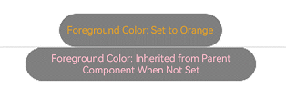

# Foreground Color
<!--Kit: ArkUI-->
<!--Subsystem: ArkUI-->
<!--Owner: @CCFFWW-->
<!--Designer: @CCFFWW-->
<!--Tester: @lxl007-->
<!--Adviser: @HelloCrease-->

The foreground color attributes set the foreground color of a component. Corresponds to the background color. The foreground color affects the color of the component content. The color of the text and the fill color of the shape drawing component are affected.

>  **NOTE**
>
>  The initial APIs of this module are supported since API version 10. Newly added APIs will be marked with a superscript to indicate their earliest API version.

## foregroundColor

foregroundColor(value: ResourceColor | ColoringStrategy): T

Sets the foreground color of the component. If the component does not have a foreground color set, it inherits the color from its parent component by default.

**Atomic service API**: This API can be used in atomic services since API version 11.

**System capability**: SystemCapability.ArkUI.ArkUI.Full

**Parameters**

| Name| Type                                                        | Mandatory| Description                                                        |
| ------ | ------------------------------------------------------------ | ---- | ------------------------------------------------------------ |
| value  | [ResourceColor](ts-types.md#resourcecolor) \| [ColoringStrategy](ts-appendix-enums.md#coloringstrategy10) | Yes  | Foreground color. The value can be a specific color or a coloring strategy. Property animations are not supported.|

**Return value**

| Type  | Description                    |
| ------ | ------------------------ |
| T | Current component.|

## foregroundColor<sup>18+</sup>

foregroundColor(color: Optional\<ResourceColor | ColoringStrategy>): T

Sets the foreground color of the component. If the component does not have a foreground color set, it inherits the color from its parent component by default. Compared to [foregroundColor](#foregroundcolor), the **color** parameter supports the **undefined** type.

**Atomic service API**: This API can be used in atomic services since API version 18.

**System capability**: SystemCapability.ArkUI.ArkUI.Full

**Parameters**

| Name| Type                                                        | Mandatory| Description                                                        |
| ------ | ------------------------------------------------------------ | ---- | ------------------------------------------------------------ |
| color  | Optional\<[ResourceColor](ts-types.md#resourcecolor) \| [ColoringStrategy](ts-appendix-enums.md#coloringstrategy10)> | Yes  | Foreground color. The value can be a specific color or a coloring strategy. Property animations are not supported.<br>If the value of color is undefined, the previous value or the default value of the component is retained. The specific behavior may vary depending on the component. You are advised to use a determined color or [ColoringStrategy](ts-appendix-enums.md#coloringstrategy10).|

**Return value**

| Type  | Description                    |
| ------ | ------------------------ |
| T | Current component.|

## Example

### Example 1: Using Foreground Color Settings

This example demonstrates how to set the foreground color using **foregroundColor**.

```ts
// xxx.ets
@Entry
@Component
struct ForegroundColorExample {
  build() {
    Column({ space: 100 }) {
      // Draw a circle with a diameter of 150. The default fill color is black.
      Circle({ width: 150, height: 200 }).margin(20)
      // Draw a circle with a diameter of 150 and set the foreground color to orange.
      Circle({ width: 150, height: 200 }).foregroundColor(Color.Orange)
    }.width('100%').backgroundColor(Color.Gray)
  }
}
```


### Example 2: Setting the Foreground Color to Background Inverse

This example shows how to use **ColoringStrategy.INVERT** to set the foreground color to the inverse of the background color.

```ts
// xxx.ets
@Entry
@Component
struct ColoringStrategyExample {
  build() {
    Column({ space: 100 }) {
      // Draw a circle with a diameter of 15. The default fill color is black.
      Circle({ width: 150, height: 200 })
      // Draw a circle with a diameter of 150 and set its foreground color to the inverse of the component background color.
      Circle({ width: 150, height: 200 })
        .backgroundColor(Color.Black)
        .foregroundColor(ColoringStrategy.INVERT)
    }.width('100%')
  }
}
```


### Example 3: Implementing a Foreground Color Not Inherited from Parent Component

This example compares the effects of setting both foreground and background colors on a component versus setting only the background color. When a foreground color is explicitly set on a component, the component does not inherit the color from its parent component.

```ts
// xxx.ets
@Entry
@Component
struct ForegroundColorInherit {
  build() {
    Column() {
      Button('Foreground Color: Set to Orange').fontSize(20).foregroundColor(Color.Orange).backgroundColor(Color.Gray)
      Divider()
      Button('Foreground Color: Inherited from Parent Component When Not Set').fontSize(20).backgroundColor(Color.Gray)
    }.foregroundColor(Color.Pink)
  }
}
```


