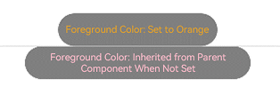

# Foreground Color
<!--Kit: ArkUI-->
<!--Subsystem: ArkUI-->
<!--Owner: @hehongyang3-->
<!--Designer: @hehongyang3-->
<!--Tester: @lxl007-->
<!--Adviser: @Brilliantry_Rui-->
<!-- md-trans-meta sourceCommit=39ca26def5c22dc659f3dc0b76ef62a29421e77a translatedAt=2026-09-01T12:37:01.201Z -->

Sets the foreground color of the component. Contrasting with the background color, the foreground color affects the coloration of component content. It mainly affects the text color and the fill color of shape drawing components (such as Circle, Rect, and Path).

>  **NOTE**
>
> - This feature is supported since API version 10. Updates will be marked with a superscript to indicate their earliest API version.
>
> - The APIs of this module can be used only in the stage model.

## foregroundColor

foregroundColor(value: ResourceColor \| ColoringStrategy): T

Sets the foreground color of the component. When the component does not have an explicit foreground color set, it inherits the foreground color of its parent component by default.

**Atomic service API**: This API can be used in atomic services since API version 11.

**System capability**: SystemCapability.ArkUI.ArkUI.Full

**Parameters**

| Name| Type                                                        | Mandatory| Description                                                        |
| ------ | ------------------------------------------------------------ | ---- | ------------------------------------------------------------ |
| value  | [ResourceColor](ts-types.md#resourcecolor)&nbsp;\|&nbsp;[ColoringStrategy](ts-appendix-enums.md#coloringstrategy10) | Yes   | Sets the foreground color of the component or sets the foreground color based on the smart color picking policy. When [ColoringStrategy](ts-appendix-enums.md#coloringstrategy10).INVERT is used, the foreground color is the inverse color of the background color, which must be used together with [backgroundColor](ts-universal-attributes-background.md#backgroundcolor). [Attribute animations](ts-animatorproperty.md) are not supported. |

**Return value**

| Type  | Description                    |
| ------ | ------------------------ |
| T | Current component, used for chained calls. |

## foregroundColor<sup>18+</sup>

foregroundColor(color: Optional\<ResourceColor \| ColoringStrategy>): T

Sets the foreground color of the component. When the component does not have an explicit foreground color set, it inherits the foreground color of its ancestor component upward along the component tree by default. Compared to [foregroundColor](#foregroundcolor), the color parameter additionally supports the undefined type.

**Atomic service API**: This API can be used in atomic services since API version 18.

**System capability**: SystemCapability.ArkUI.ArkUI.Full

**Parameters**

| Name| Type                                                        | Mandatory| Description                                                        |
| ------ | ------------------------------------------------------------ | ---- | ------------------------------------------------------------ |
| color  | [Optional](ts-universal-attributes-custom-property.md#optionalt)\<[ResourceColor](ts-types.md#resourcecolor)&nbsp;\|&nbsp;[ColoringStrategy](ts-appendix-enums.md#coloringstrategy10)> | Yes   | Sets the foreground color of the component or sets the foreground color based on the smart color picking strategy. When [ColoringStrategy](ts-appendix-enums.md#coloringstrategy10).INVERT is used, the foreground color is the inverse color of the background color, and [backgroundColor](ts-universal-attributes-background.md#backgroundcolor) must be set accordingly. [Attribute animation](ts-animatorproperty.md) is not supported.<br>When the value of color is undefined, if the component has been set with a foreground color before, the previous foreground color is retained; if the component has not been set with a foreground color before, the default foreground color of the component is used. The default foreground color may vary with the component. You are advised to use a definite color or [ColoringStrategy](ts-appendix-enums.md#coloringstrategy10). |

**Return value**

| Type  | Description                    |
| ------ | ------------------------ |
| T | Returns the current component, used for chained calls. |

## Example

### Example 1: Using Foreground Color Settings

This example demonstrates how to set the foreground color using **foregroundColor**.

```ts
// xxx.ets
@Entry
@Component
struct ForegroundColorExample {
  build() {
    Column({ space: 100 }) {
      // Draw a circle with a diameter of 150. The default fill color is black.
      Circle({ width: 150, height: 200 }).margin(20)
      // Draw a circle with a diameter of 150 and set the foreground color to orange.
      Circle({ width: 150, height: 200 }).foregroundColor(Color.Orange)
    }.width('100%').backgroundColor(Color.Gray)
  }
}
```


### Example 2: Setting the Foreground Color to Background Inverse

This example demonstrates how to set the foreground color to the inverse of the background color using [ColoringStrategy](ts-appendix-enums.md#coloringstrategy10)**.INVERT**.

```ts
// xxx.ets
@Entry
@Component
struct ColoringStrategyExample {
  build() {
    Column({ space: 100 }) {
      // Draw a circle with a diameter of 150. The default fill color is black.
      Circle({ width: 150, height: 200 })
      // Draw a circle with a diameter of 150 and set its foreground color to the inverse of the component background color.
      Circle({ width: 150, height: 200 })
        .backgroundColor(Color.Black)
        .foregroundColor(ColoringStrategy.INVERT)
    }.width('100%')
  }
}
```


### Example 3: Implementing a Foreground Color Not Inherited from the Parent Component

This example compares the effects of setting both foreground and background colors on a component versus setting only the background color.

```ts
// xxx.ets
@Entry
@Component
struct ForegroundColorInherit {
  build() {
    Column() {
      Button('Foreground Color: Set to Orange').fontSize(20).foregroundColor(Color.Orange).backgroundColor(Color.Gray)
      Divider()
      Button('Foreground Color: Inherited from Parent Component When Not Set').fontSize(20).backgroundColor(Color.Gray)
    }.foregroundColor(Color.Pink)
  }
}
```

