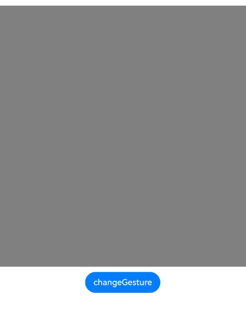
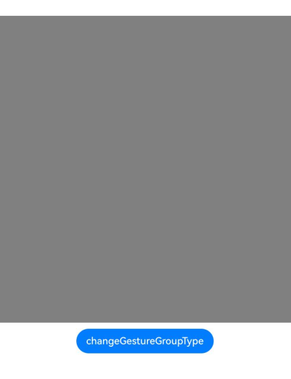

# Gesture Modifier
<!--Kit: ArkUI-->
<!--Subsystem: ArkUI-->
<!--Owner: @jiangtao92-->
<!--Designer: @piggyguy-->
<!--Tester: @songyanhong-->
<!--Adviser: @HelloCrease-->

With the gesture modifier, you can dynamically set gestures bound to components, complete with the **if/else** syntax.

>  **NOTE**
>
>  This feature is supported since API version 12. Updates will be marked with a superscript to indicate their earliest API version.

## gestureModifier

gestureModifier(modifier: GestureModifier): T

Creates a gesture modifier.

>  **NOTE**
>
>  **gestureModifier** does not support custom components.

**Atomic service API**: This API can be used in atomic services since API version 12.

**System capability**: SystemCapability.ArkUI.ArkUI.Full

**Parameters**

| Name  | Type                 | Mandatory| Description                                                        |
| -------- | --------------------- | ---- | ------------------------------------------------------------ |
| modifier | [GestureModifier](#gesturemodifier-1) | Yes  | Modifier for dynamically setting gestures bound to the current component. The **if/else** syntax is supported.<br>**modifier**: gesture modifier. You need a custom class to implement the **GestureModifier** API.|

**Return value**

| Type| Description|
| -------- | -------- |
| T | Current component.|

## GestureModifier

You need a custom class to implement the **GestureModifier** API.

### applyGesture
applyGesture(event: UIGestureEvent): void

Applies a gesture.

You can customize this API as required. Dynamic configuration using the **if/else** syntax is supported. If gesture switching is triggered during an active gesture operation, the change takes effect in the next gesture operation after the current one completes (when all fingers are lifted).

**Atomic service API**: This API can be used in atomic services since API version 12.

**System capability**: SystemCapability.ArkUI.ArkUI.Full

**Parameters**

| Name           | Type                                      |          Mandatory       | Description                                      |
| ------------- | ----------------------------------------  | ---------------------------------------- |-------------------------------- |
| event        | [UIGestureEvent](./ts-uigestureevent.md#uigestureevent) |  Yes         |**UIGestureEvent** object, which is used to set the gesture to be bound to the component.     |

## Example

### Example 1: Dynamically Binding a Gesture

This example demonstrates how to dynamically set the gestures bound to a component using **gestureModifier**.

```ts
// xxx.ets
class MyButtonModifier implements GestureModifier {
  supportDoubleTap: boolean = true;

  applyGesture(event: UIGestureEvent): void {
    if (this.supportDoubleTap) {
      event.addGesture(
        new TapGestureHandler({ count: 2, fingers: 1 })
          .tag("aaa")
          .onAction((event: GestureEvent) => {
            console.info('Gesture Info is', JSON.stringify(event));
            console.info('button tap');
          })
      )
    } else {
      event.addGesture(
        new PanGestureHandler()
          .onActionStart(() => {
            console.info('Pan start');
          })
      )
    }
  }
}

@Entry
@Component
struct Index {
  @State modifier: MyButtonModifier = new MyButtonModifier();

  build() {
    Row() {
      Column() {
        Column()
          .gestureModifier(this.modifier)
          .width(500)
          .height(500)
          .backgroundColor(Color.Gray)
        Button('changeGesture')
          .onClick(() => {
            this.modifier.supportDoubleTap = !this.modifier.supportDoubleTap;
          })
          .margin({ top: 10 })
      }
      .width('100%')
    }
    .height('100%')
  }
}
```


### Example 2: Dynamically Binding a Gesture Group

This example demonstrates how to dynamically set the gesture group bound to a component using **gestureModifier**.

```ts
class MyButtonModifier implements GestureModifier {
  isExclusive: boolean = true;

  applyGesture(event: UIGestureEvent): void {
    if (this.isExclusive) {
      // Bind a mutually exclusive gesture group.
      event.addGesture(new GestureGroupHandler({
        mode: GestureMode.Exclusive,
        gestures: [new TapGestureHandler({ count: 2, fingers: 1 }).onAction((event) => {
          console.info('event info is', JSON.stringify(event));
          console.info('ExclusiveGroupGesture TapGesture is called');
        }), new LongPressGestureHandler({ repeat: true, fingers: 1 }).onAction((event) => {
          console.info('event info is', JSON.stringify(event));
          console.info('ExclusiveGroupGesture LongPressGesture is called');
        }), new PanGestureHandler({ fingers: 1 }).onActionStart((event) => {
          console.info('event info is', JSON.stringify(event));
          console.info('ExclusiveGroupGesture PanGesture onActionStart is called');
        }).onActionEnd((event) => {
          console.info('event info is', JSON.stringify(event));
          console.info('ExclusiveGroupGesture PanGesture onActionEnd is called');
        })]
      }))
    } else {
      // Bind a parallel gesture group.
      event.addGesture(new GestureGroupHandler({
        mode: GestureMode.Parallel,
        gestures: [new TapGestureHandler({ count: 2, fingers: 1 }).onAction((event) => {
          console.info('event info is', JSON.stringify(event));
          console.info('ParallelGroupGesture TapGesture is called');
        }), new LongPressGestureHandler({ repeat: true, fingers: 1 }).onAction((event) => {
          console.info('event info is', JSON.stringify(event));
          console.info('ParallelGroupGesture LongPressGesture is called');
        }), new PanGestureHandler({ fingers: 1 }).onActionStart((event) => {
          console.info('event info is', JSON.stringify(event));
          console.info('ParallelGroupGesture PanGesture onActionStart is called');
        }).onActionEnd((event) => {
          console.info('event info is', JSON.stringify(event));
          console.info('ParallelGroupGesture PanGesture onActionEnd is called');
        })]
      }))
    }
  }
}

@Entry
@Component
struct Index {
  @State modifier: MyButtonModifier = new MyButtonModifier();

  build() {
    Row() {
      Column() {
        Column()
          .gestureModifier(this.modifier)
          .width(500)
          .height(500)
          .backgroundColor(Color.Gray)

        Button('changeGestureGroupType')
          .onClick(() => {
            this.modifier.isExclusive = !this.modifier.isExclusive;
          })
          .margin({ top: 10 })
      }
      .width('100%')
    }
    .height('100%')
  }
}
```

