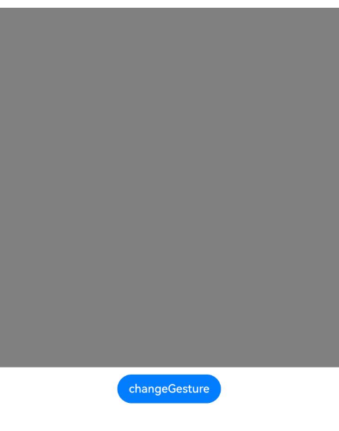
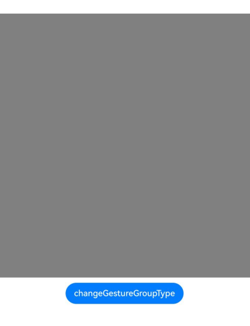

# Gesture Modifier
<!--Kit: ArkUI-->
<!--Subsystem: ArkUI-->
<!--Owner: @yihao-lin-->
<!--Designer: @piggyguy-->
<!--Tester: @songyanhong-->
<!--Adviser: @Brilliantry_Rui-->
<!-- md-trans-meta sourceCommit=9430c77017ca73641537d932a3d7d8a4c99c078b translatedAt=2026-09-01T12:37:31.896Z -->

Dynamically sets the gestures bound to a component. It supports the **if/else** syntax during attribute setting, and is applicable to scenarios where a single gesture or gesture group binding needs to be switched based on the component state or user operation, improving the flexibility of gesture configuration.

>  **NOTE**
>
> - The initial APIs of this module are supported since API version 12. Updates will be marked with a superscript to indicate their earliest API version.
>
> - The APIs of this module can be used only in the stage model.

## gestureModifier

gestureModifier(modifier: GestureModifier): T

Dynamically sets the gestures bound to a component. It is applicable to scenarios where the gesture binding needs to be dynamically switched based on the component state or user operation. If gesture switching is triggered on the component during an active gesture operation, the change takes effect in the next gesture operation after the current gesture ends (when all fingers are lifted).

>  **NOTE**
>
>  **gestureModifier** does not support custom components.
>
> This API cannot be called within [attributeModifier](./ts-universal-attributes-attribute-modifier.md#attributemodifier).

**Atomic service API**: This API can be used in atomic services since API version 12.

**System capability**: SystemCapability.ArkUI.ArkUI.Full

**Parameters**

| Name  | Type                 | Mandatory| Description                                                        |
| -------- | --------------------- | ---- | ------------------------------------------------------------ |
| modifier | [GestureModifier](#gesturemodifier-1) | Yes | Dynamically sets the gesture binding of the current component, supporting the if/else syntax.<br>This parameter is a gesture modifier. Developers need to customize a class to implement the GestureModifier interface. |

**Return value**

| Type| Description|
| -------- | -------- |
| T | Current component.|

## GestureModifier

**GestureModifier** is used to encapsulate the logic for dynamically setting component gestures. Developers need to customize a class to implement the **GestureModifier** interface and set or switch the gestures bound to a component in **applyGesture** as required.

### applyGesture

applyGesture(event: UIGestureEvent): void

Applies a gesture. It is applicable to scenarios where the gesture binding needs to be dynamically switched based on the component state or user operation.

Developers can customize the implementation of this method as required. By calling the [addGesture()](./ts-uigestureevent.md#addgesture) method of **UIGestureEvent**, you can set the gestures to be bound to a component. The **if/else** syntax is supported for dynamic setting. If gesture switching is triggered on the component during an active gesture operation, the change takes effect in the next gesture operation after the current gesture ends (when all fingers are lifted).

**Atomic service API**: This API can be used in atomic services since API version 12.

**System capability**: SystemCapability.ArkUI.ArkUI.Full

**Parameters**

| Name           | Type                                      |          Mandatory       | Description                                      |
| ------------- | ----------------------------------------  | ---------------------------------------- |-------------------------------- |
| event        | [UIGestureEvent](./ts-uigestureevent.md#uigestureevent) |  Yes          | Gesture event object used to set the gesture to be bound to the component. |

## Example

### Example 1: Dynamically Binding a Gesture

This example demonstrates how to dynamically set the gestures bound to a component using **gestureModifier**.

```ts
// xxx.ets
class MyButtonModifier implements GestureModifier {
  supportDoubleTap: boolean = true;

  applyGesture(event: UIGestureEvent): void {
    // Bind the double-tap gesture or drag gesture based on the supportDoubleTap state.
    if (this.supportDoubleTap) {
      event.addGesture(
        new TapGestureHandler({
          count: 2,
          fingers: 1,
          // The distanceThreshold attribute is added since API version 23.
          distanceThreshold: 100
        })
          .tag('doubleTapGesture')
          .onAction((event: GestureEvent) => {
            console.info('Gesture Info is', JSON.stringify(event));
            console.info('button tap');
          })
      );
    } else {
      event.addGesture(
        new PanGestureHandler()
          .onActionStart(() => {
            console.info('Pan start');
          })
      )
    }
  }
}

@Entry
@Component
struct Index {
  @State modifier: MyButtonModifier = new MyButtonModifier();

  build() {
    Row() {
      Column() {
        Column()
          .gestureModifier(this.modifier)
          .width(500)
          .height(500)
          .backgroundColor(Color.Gray)
        Button('changeGesture')
          .onClick(() => {
            this.modifier.supportDoubleTap = !this.modifier.supportDoubleTap;
          })
          .margin({ top: 10 })
      }
      .width('100%')
    }
    .height('100%')
  }
}
```


### Example 2: Dynamically Binding a Gesture Group

This example demonstrates how to dynamically set the gesture group bound to a component using **gestureModifier**.

```ts
class MyButtonModifier implements GestureModifier {
  isExclusive: boolean = true;

  applyGesture(event: UIGestureEvent): void {
    if (this.isExclusive) {
      // Bind a mutually exclusive gesture group.
      event.addGesture(new GestureGroupHandler({
        mode: GestureMode.Exclusive,
        gestures: [new TapGestureHandler({ count: 2, fingers: 1 }).onAction((event) => {
          console.info('event info is', JSON.stringify(event));
          console.info('ExclusiveGroupGesture TapGesture is called');
        }), new LongPressGestureHandler({ repeat: true, fingers: 1 }).onAction((event) => {
          console.info('event info is', JSON.stringify(event));
          console.info('ExclusiveGroupGesture LongPressGesture is called');
        }), new PanGestureHandler({ fingers: 1 }).onActionStart((event) => {
          console.info('event info is', JSON.stringify(event));
          console.info('ExclusiveGroupGesture PanGesture onActionStart is called');
        }).onActionEnd((event) => {
          console.info('event info is', JSON.stringify(event));
          console.info('ExclusiveGroupGesture PanGesture onActionEnd is called');
        })]
      }));
    } else {
      // Bind a parallel gesture group.
      event.addGesture(new GestureGroupHandler({
        mode: GestureMode.Parallel,
        gestures: [new TapGestureHandler({ count: 2, fingers: 1 }).onAction((event) => {
          console.info('event info is', JSON.stringify(event));
          console.info('ParallelGroupGesture TapGesture is called');
        }), new LongPressGestureHandler({ repeat: true, fingers: 1 }).onAction((event) => {
          console.info('event info is', JSON.stringify(event));
          console.info('ParallelGroupGesture LongPressGesture is called');
        }), new PanGestureHandler({ fingers: 1 }).onActionStart((event) => {
          console.info('event info is', JSON.stringify(event));
          console.info('ParallelGroupGesture PanGesture onActionStart is called');
        }).onActionEnd((event) => {
          console.info('event info is', JSON.stringify(event));
          console.info('ParallelGroupGesture PanGesture onActionEnd is called');
        })]
      }));
    }
  }
}

@Entry
@Component
struct Index {
  @State modifier: MyButtonModifier = new MyButtonModifier();

  build() {
    Row() {
      Column() {
        Column()
          .gestureModifier(this.modifier)
          .width(500)
          .height(500)
          .backgroundColor(Color.Gray)

        Button('changeGestureGroupType')
          .onClick(() => {
            this.modifier.isExclusive = !this.modifier.isExclusive;
          })
          .margin({ top: 10 })
      }
      .width('100%')
    }
    .height('100%')
  }
}
```
