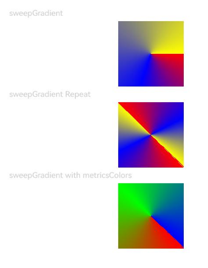

# Color Gradient
<!--Kit: ArkUI-->
<!--Subsystem: ArkUI-->
<!--Owner: @CCFFWW-->
<!--Designer: @CCFFWW-->
<!--Tester: @lxl007-->
<!--Adviser: @Brilliantry_Rui-->

Create a more gorgeous look for a component by applying a color gradient effect to it.

> **NOTE**
>
> - The initial APIs of this module are supported since API version 7. Updates will be marked with a superscript to indicate their earliest API version.
>
> - Color gradients are considered part of the component's content and are drawn above the background.
>
> - Color gradients do not support explicit width and height animations. When the width or height of a component is animated with a color gradient, the gradient will jump straight to the final size.

## linearGradient

linearGradient(value: LinearGradientOptions): T

Creates a linear gradient.

**Widget capability**: This API can be used in ArkTS widgets since API version 9.

**Atomic service API**: This API can be used in atomic services since API version 11.

**System capability**: SystemCapability.ArkUI.ArkUI.Full

**Parameters**

| Name| Type                                                        | Mandatory| Description                                                        |
| ------ | ------------------------------------------------------------ | ---- | ------------------------------------------------------------ |
| value  | [LinearGradientOptions](#lineargradientoptions18) | Yes  | Linear gradient.|

**Return value**

| Type  | Description                    |
| ------ | ------------------------ |
| T | Current component.|

## linearGradient<sup>18+</sup>

linearGradient(options: Optional\<LinearGradientOptions>): T

Creates a linear gradient. Compared to [linearGradient](#lineargradient), this API supports the **undefined** type for the **options** parameter.

**Widget capability**: This API can be used in ArkTS widgets since API version 18.

**Atomic service API**: This API can be used in atomic services since API version 18.

**System capability**: SystemCapability.ArkUI.ArkUI.Full

**Parameters**

| Name | Type                                                        | Mandatory| Description                                                        |
| ------- | ------------------------------------------------------------ | ---- | ------------------------------------------------------------ |
| options | [Optional](ts-universal-attributes-custom-property.md#optionalt12)\<[LinearGradientOptions](#lineargradientoptions18)>| Yes  | Linear gradient.<br>If **options** is **undefined**, the linear gradient is disabled.|

**Return value**

| Type  | Description                    |
| ------ | ------------------------ |
| T | Current component.|

## LinearGradientOptions<sup>18+</sup>

Defines the linear gradient parameters.

> **NOTE**
>
> To standardize anonymous object definitions, the element definitions here have been revised in API version 18. While historical version information is preserved for anonymous objects, there may be cases where the outer element's @since version number is higher than inner elements'. This does not affect interface usability.

**Atomic service API**: This API can be used in atomic services since API version 18.

**System capability**: SystemCapability.ArkUI.ArkUI.Full

**Widget capability**: This API can be used in ArkTS widgets since API version 18.

| Name                                      | Type                                                        | Read-Only| Optional| Description                                                        |
| ------------------------------------------ | ------------------------------------------------------------ | ---- | ---- |------------------------------------------------------------ |
| angle<sup>7+</sup>                                      | number&nbsp;\|&nbsp;string                                   | No| Yes  | Start angle of the linear gradient. When the angle is 0 degrees, the gradient direction is from bottom to top (that is, 0 o'clock direction). A positive value indicates a clockwise rotation from the origin, (0, 0).<br> Value range: (-∞, +∞). Positive values indicate clockwise rotation, and negative values indicate counterclockwise rotation.<br>Default value: **180**<br>When specified as a string, valid values are pure numbers or numbers followed by units: "deg" (degrees), "rad" (radians), "grad" (gradians), or "turn" (turns). Examples: "90", "90deg", "1.57rad".<br> **Atomic service API**: This API can be used in atomic services since API version 11.<br>**Widget capability**: This API can be used in ArkTS widgets since API version 9.|
| direction<sup>7+</sup>                                  | [GradientDirection](ts-appendix-enums.md#gradientdirection)  | No| Yes  | Direction of the linear gradient. It does not take effect when **angle** is set to a non-undefined value. **GradientDirection.None** uses the default direction. <br>Default value: **GradientDirection.Bottom**.<br> **Atomic service API**: This API can be used in atomic services since API version 11.<br>**Widget capability**: This API can be used in ArkTS widgets since API version 9.|
| colors<sup>7+</sup> | Array&lt;[[ResourceColor](ts-types.md#resourcecolor),&nbsp;number]&gt; | No| No  | Array of color stops, each of which consists of a color and its stop position. Invalid colors are automatically skipped. **ResourceColor** represents the color. **number** represents the stop position of the color, with a range of [0, 1.0]. Values less than 0 are treated as **0**, and values greater than 1.0 are treated as **1.0**. **0** indicates the start of the gradient; **1.0** indicates the end. To achieve multi-color gradients, the **number** parameters in the array should be set in ascending order. If a later number is less than a previous one, it is treated as equal to the previous value.<br> Default value: **[]**, meaning no gradient effect.<br> **Atomic service API**: This API can be used in atomic services since API version 11.<br>**Widget capability**: This API can be used in ArkTS widgets since API version 9.|
| repeating<sup>7+</sup>                                  | boolean                                                      | No| Yes | Whether the colors are repeated.<br>Default value: **false**.<br>**true**: The colors are repeated.<br>**false**: The colors are not repeated.<br> **Atomic service API**: This API can be used in atomic services since API version 11.<br>**Widget capability**: This API can be used in ArkTS widgets since API version 9.|

## sweepGradient

sweepGradient(value: SweepGradientOptions): T

Creates a sweep gradient.

**Atomic service API**: This API can be used in atomic services since API version 11.

**System capability**: SystemCapability.ArkUI.ArkUI.Full

**Widget capability**: This API can be used in ArkTS widgets since API version 9.

**Parameters**

| Name| Type                                                        | Mandatory| Description                                                        |
| ------ | ------------------------------------------------------------ | ---- | ------------------------------------------------------------ |
| value  | [SweepGradientOptions](#sweepgradientoptions18) | Yes  | Sweep gradient, which can sweep around the specified center point in the 0–360 degree range. If the rotation angle exceeds the range, a monochrome color instead of a gradient will be drawn.|

**Return value**

| Type  | Description                    |
| ------ | ------------------------ |
| T | Current component.|

## sweepGradient<sup>18+</sup>

sweepGradient(options: Optional\<SweepGradientOptions>): T

Creates a sweep gradient. Compared to [sweepGradient](#sweepgradient), this API supports the **undefined** type for the **options** parameter.

**Atomic service API**: This API can be used in atomic services since API version 18.

**System capability**: SystemCapability.ArkUI.ArkUI.Full

**Widget capability**: This API can be used in ArkTS widgets since API version 18.

**Parameters**

| Name | Type                                                        | Mandatory| Description                                                        |
| ------- | ------------------------------------------------------------ | ---- | ------------------------------------------------------------ |
| options | [Optional](ts-universal-attributes-custom-property.md#optionalt12)\<[SweepGradientOptions](#sweepgradientoptions18)>| Yes  | Sweep gradient.<br>If **options** is **undefined**, the sweep gradient is disabled.|

**Return value**

| Type  | Description                    |
| ------ | ------------------------ |
| T | Current component.|

## SweepGradientOptions<sup>18+</sup>

Defines the sweep gradient parameters.

> **NOTE**
>
> To standardize anonymous object definitions, the element definitions here have been revised in API version 18. While historical version information is preserved for anonymous objects, there may be cases where the outer element's @since version number is higher than inner elements'. This does not affect interface usability.

**Atomic service API**: This API can be used in atomic services since API version 18.

**System capability**: SystemCapability.ArkUI.ArkUI.Full

**Widget capability**: This API can be used in ArkTS widgets since API version 18.

| Name                                      | Type                                                        | Read-Only| Optional| Description                                                        |
| ------------------------------------------ | ------------------------------------------------------------ | ---- | ---- |------------------------------------------------------------- |
| center<sup>7+</sup>                                    | [[Length](./ts-types.md#length), Length]                     | No| No  | Center of the sweep gradient, that is, the coordinates relative to the upper left corner of the current component.<br> **Atomic service API**: This API can be used in atomic services since API version 11.<br>**Widget capability**: This API can be used in ArkTS widgets since API version 9.          |
| start<sup>7+</sup>                                     | number&nbsp;\|&nbsp;string                                   | No| Yes  | Start point of the sweep gradient. <br>Default value: **0**.<br>When specified as a string, valid values are pure numbers or numbers followed by units: "deg" (degrees), "rad" (radians), "grad" (gradians), or "turn" (turns). Examples: "90", "90deg", "1.57rad". The value is limited to 0 to 360 degrees after unit conversion. Values less than 0 degrees are treated as 0 degrees; values greater than 360 degrees are treated as 360 degrees.<br> **Atomic service API**: This API can be used in atomic services since API version 11.<br>**Widget capability**: This API can be used in ArkTS widgets since API version 9.                           |
| end<sup>7+</sup>                                       | number&nbsp;\|&nbsp;string                                   | No| Yes | End point of the sweep gradient. <br>Default value: **0**.<br>When specified as a string, valid values are pure numbers or numbers followed by units: "deg" (degrees), "rad" (radians), "grad" (gradians), or "turn" (turns). Examples: "90", "90deg", "1.57rad". The value is limited to 0 to 360 degrees after unit conversion. Values less than 0 degrees are treated as 0 degrees; values greater than 360 degrees are treated as 360 degrees.<br> **Atomic service API**: This API can be used in atomic services since API version 11.<br>**Widget capability**: This API can be used in ArkTS widgets since API version 9.                           |
| rotation<sup>7+</sup>                                   | number&nbsp;\|&nbsp;string                                   | No| Yes  | Rotation angle of the sweep gradient. Default value: **0**.<br>When specified as a string, valid values are pure numbers or numbers followed by units: "deg" (degrees), "rad" (radians), "grad" (gradians), or "turn" (turns). Examples: "90", "90deg", "1.57rad". The value is limited to 0 to 360 degrees after unit conversion. Values less than 0 degrees are treated as 0 degrees; values greater than 360 degrees are treated as 360 degrees.<br> **Atomic service API**: This API can be used in atomic services since API version 11.<br>**Widget capability**: This API can be used in ArkTS widgets since API version 9.                             |
| colors<sup>7+</sup> | Array&lt;[[ResourceColor](ts-types.md#resourcecolor),&nbsp;number]&gt; | No| No  | Array of color stops, each of which consists of a color and its stop position. Invalid colors are automatically skipped. **ResourceColor** indicates the color. **number** represents the stop position of the color, with a range of [0, 1.0]. Values less than 0 are treated as **0**, and values greater than 1.0 are treated as **1.0**. **0** indicates the start of the gradient; **1.0** indicates the end. To achieve multi-color gradients, the **number** parameters in the array should be set in ascending order. If a later number is less than a previous one, it is treated as equal to the previous value.<br> Default value: **[]**, meaning no gradient effect.<br> **Atomic service API**: This API can be used in atomic services since API version 11.<br>**Widget capability**: This API can be used in ArkTS widgets since API version 9.|
| metricsColors<sup>20+</sup> | Array&lt;[[ColorMetrics](../js-apis-arkui-graphics.md#colormetrics12),&nbsp;number]&gt; | No| Yes  | Array of color stops, each of which consists of a color and its stop position. Invalid colors are automatically skipped. When specified, **metricsColors** overrides **colors**. The color gamut attributes must be consistent across color stops. The value is considered invalid if mixed color gamut attributes are detected. The default value is transparent.<br>**Atomic service API**: This API can be used in atomic services since API version 20.|
| repeating<sup>7+</sup>                                 | boolean                                                      | No| Yes  | Whether the colors are repeated.<br>Default value: **false**.<br>**true**: The colors are repeated.<br>**false**: The colors are not repeated.<br> **Atomic service API**: This API can be used in atomic services since API version 11.<br>**Widget capability**: This API can be used in ArkTS widgets since API version 9.                      |

>  **NOTE**
>
>  When using the **metricsColors** parameter, take note of the following:
>
>  [ColorMetrics](../js-apis-arkui-graphics.md#colormetrics12) represents the fill color, which can be constructed with a specified color gamut attribute using the [colorWithSpace](../js-apis-arkui-graphics.md#colorwithspace20) API. **number** represents the position of the specified color, with a value range of [0, 1.0]. **0** indicates the start of the container where the gradient color is set, and **1.0** indicates the end of the container. To achieve multi-color gradients, the **number** parameters in the array should be set in ascending order. If a later number is less than a previous one, it is treated as equal to the previous value.

## radialGradient

radialGradient(value: RadialGradientOptions): T

Creates a radial gradient.

**Atomic service API**: This API can be used in atomic services since API version 11.

**System capability**: SystemCapability.ArkUI.ArkUI.Full

**Widget capability**: This API can be used in ArkTS widgets since API version 9.

**Parameters**

| Name| Type                                                        | Mandatory| Description                                                        |
| ------ | ------------------------------------------------------------ | ---- | ------------------------------------------------------------ |
| value  | [RadialGradientOptions](#radialgradientoptions18) | Yes  | Radial gradient.|

**Return value**

| Type  | Description                    |
| ------ | ------------------------ |
| T | Current component.|

## radialGradient<sup>18+</sup>

radialGradient(options: Optional\<RadialGradientOptions>): T

Creates a radial gradient. Compared to [radialGradient](#radialgradient), this API supports the **undefined** type for the **options** parameter.

**Atomic service API**: This API can be used in atomic services since API version 18.

**System capability**: SystemCapability.ArkUI.ArkUI.Full

**Widget capability**: This API can be used in ArkTS widgets since API version 18.

**Parameters**


| Name    | Type                                        | Mandatory                            | Description                              |
| -------------- | -------------------------------------------- | ----------------------------------- | ----------------------------------- |
| options | [Optional](ts-universal-attributes-custom-property.md#optionalt12)\<[RadialGradientOptions](#radialgradientoptions18)>| Yes| Radial gradient.<br>If **options** is **undefined**, the radial gradient is disabled.|

**Return value**

| Type  | Description                    |
| ------ | ------------------------ |
| T | Current component.|

## RadialGradientOptions<sup>18+</sup>

Defines the radial gradient parameters.

> **NOTE**
>
> To standardize anonymous object definitions, the element definitions here have been revised in API version 18. While historical version information is preserved for anonymous objects, there may be cases where the outer element's @since version number is higher than inner elements'. This does not affect interface usability.

**Atomic service API**: This API can be used in atomic services since API version 18.

**System capability**: SystemCapability.ArkUI.ArkUI.Full

**Widget capability**: This API can be used in ArkTS widgets since API version 18.

| Name     | Type                                                        | Read-Only| Optional| Description                                                  |
| --------- | ------------------------------------------------------------ | ---- | ---- | ------------------------------------------------------ |
| center<sup>7+</sup>    | &nbsp;[[Length](./ts-types.md#length), Length]               | No| No  | Center of the radial gradient, that is, the coordinates relative to the upper left corner of the current component.<br> **Atomic service API**: This API can be used in atomic services since API version 11.<br>**Widget capability**: This API can be used in ArkTS widgets since API version 9.     |
| radius<sup>7+</sup>    | [Length](./ts-types.md#length)                                  | No| No  | Radius of the radial gradient.<br>Value range: [0, +∞). A value less than 0 is treated as **0**. If the value is **undefined**, the system adaptively determines the gradient radius.<br> **Atomic service API**: This API can be used in atomic services since API version 11.<br>**Widget capability**: This API can be used in ArkTS widgets since API version 9.          |
| colors<sup>7+</sup>    | Array&lt;[[ResourceColor](ts-types.md#resourcecolor),&nbsp;number]&gt; | No| No  | Array of color stops, each of which consists of a color and its stop position. Invalid colors are automatically skipped.<br> Default value: **[]**, meaning no gradient effect.<br> **Atomic service API**: This API can be used in atomic services since API version 11.<br>**Widget capability**: This API can be used in ArkTS widgets since API version 9.|
| repeating<sup>7+</sup> | boolean                                                     | No| Yes  | Whether the colors are repeated. Default value: **false**.<br>**true**: The colors are repeated.<br>**false**: The colors are not repeated.<br> **Atomic service API**: This API can be used in atomic services since API version 11.<br>**Widget capability**: This API can be used in ArkTS widgets since API version 9.            |

>  **NOTE**
>
>  When using the **colors** parameter, take note of the following:
>
>  [ResourceColor](ts-types.md#resourcecolor) indicates the color, and **number** indicates the color's position, which ranges from 0 to 1.0: **0** indicates the start of the container, and **1.0** indicates the end of the container. To create a gradient with multiple color stops, you are advised to set the **number** values in ascending order. If a value of **number** in an array is smaller than that in the previous one, it is considered as equal to the previous value.


## Example

### Example 1: Creating a Linear Gradient

This example demonstrates how to create a linear color gradient using [linearGradient](#lineargradient).

```ts
// xxx.ets
@Entry
@Component
struct ColorGradientExample {
  build() {
    Column({ space: 5 }) {
      Text('linearGradient').fontSize(12).width('90%').fontColor(0xCCCCCC)
      Row()
        .width('90%')
        .height(50)
        .linearGradient({
          angle: 90,
          colors: [[0xff0000, 0.0], [0x0000ff, 0.3], [0xffff00, 1.0]]
        })
      Text('linearGradient Repeat').fontSize(12).width('90%').fontColor(0xCCCCCC)
      Row()
        .width('90%')
        .height(50)
        .linearGradient({
          direction: GradientDirection.Left, // Gradient direction.
          repeating: true, // Whether the gradient colors are repeated.
          colors: [[0xff0000, 0.0], [0x0000ff, 0.3], [0xffff00, 0.5]] // The gradient colors are repeated because the last color stop is less than 1.
        })
    }
    .width('100%')
    .padding({ top: 5 })
  }
}
```


### Example 2: Creating a Sweep Gradient

This example demonstrates how to create a sweep color gradient using [sweepGradient](#sweepgradient).

```ts
// To set the P3 color gamut, use the setColorSpace API in ets/entryability/EntryAbility.ets to set the current window to a wide color gamut.
import { ColorMetrics } from '@kit.ArkUI';

@Entry
@Component
struct ColorGradientExample {
  @State p3Red: ColorMetrics = ColorMetrics.colorWithSpace(ColorSpace.DISPLAY_P3, 1, 0, 0, 1);
  @State p3Green: ColorMetrics = ColorMetrics.colorWithSpace(ColorSpace.DISPLAY_P3, 0, 1, 0, 1);
  @State p3Blue: ColorMetrics = ColorMetrics.colorWithSpace(ColorSpace.DISPLAY_P3, 0, 0, 1, 1);

  build() {
    Column({ space: 5 }) {
      Text('sweepGradient').fontSize(12).width('90%').fontColor(0xCCCCCC)
      Row()
        .width(100)
        .height(100)
        .sweepGradient({
          center: [50, 50],
          start: 0,
          end: 359,
          colors: [[0xff0000, 0.0], [0x0000ff, 0.3], [0xffff00, 1.0]]
        })
      
      Text('sweepGradient Repeat').fontSize(12).width('90%').fontColor(0xCCCCCC)
      Row()
        .width(100)
        .height(100)
        .sweepGradient({
          center: [50, 50],
          start: 0,
          end: 359,
          rotation: 45, // Rotation angle.
          repeating: true, // Whether the gradient colors are repeated.
          colors: [[0xff0000, 0.0], [0x0000ff, 0.3], [0xffff00, 0.5]] // The gradient colors are repeated because the last color stop is less than 1.
        })

      Text('sweepGradient with metricsColors').fontSize(12).width('90%').fontColor(0xCCCCCC)
      Row()
        .width(100)
        .height(100)
        .sweepGradient({
          center: [50, 50],
          start: 0,
          end: 359,
          rotation: 45,
          repeating: true,
          colors: [[0xff0000, 0.0], [0x0000ff, 0.3], [0xffff00, 0.5]], // The gradient colors are repeated because the last color stop is less than 1.
          metricsColors: [[this.p3Red, 0.0], [this.p3Green, 0.5], [this.p3Blue, 1.0]]  // When specified, metricsColors overrides colors.
        })
    }
    .width('100%')
    .padding({ top: 5 })
  }
}
```



### Example 3: Creating a Radial Gradient

This example demonstrates how to create a radial color gradient using [radialGradient](#radialgradient).

```ts
// xxx.ets
@Entry
@Component
struct ColorGradientExample {
  build() {
    Column({ space: 5 }) {
      Text('radialGradient').fontSize(12).width('90%').fontColor(0xCCCCCC)
      Row()
        .width(100)
        .height(100)
        .radialGradient({
          center: [50, 50],
          radius: 60,
          colors: [[0xff0000, 0.0], [0x0000ff, 0.3], [0xffff00, 1.0]]
        })
      Text('radialGradient Repeat').fontSize(12).width('90%').fontColor(0xCCCCCC)
      Row()
        .width(100)
        .height(100)
        .radialGradient({
          center: [50, 50],
          radius: 60,
          repeating: true,
          colors: [[0xff0000, 0.0], [0x0000ff, 0.3], [0xffff00, 0.5]] // The gradient colors are repeated because the last color stop is less than 1.
        })
    }
    .width('100%')
    .padding({ top: 5 })
  }
}
```


