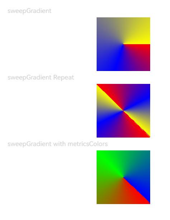

# Color Gradient
<!--Kit: ArkUI-->
<!--Subsystem: ArkUI-->
<!--Owner: @hehongyang3-->
<!--Designer: @hehongyang3-->
<!--Tester: @lxl007-->
<!--Adviser: @Brilliantry_Rui-->
<!-- md-trans-meta sourceCommit=39ca26def5c22dc659f3dc0b76ef62a29421e77a translatedAt=2026-09-01T12:41:16.596Z -->

Create a more gorgeous look for a component by applying a color gradient effect to it.

> **NOTE**
>
> - This API is supported since API version 7. For any new content in later versions, the initial version of the content is marked separately with a superscript.
>
> - A color gradient is part of the component content and is drawn above the background.
>
> - A color gradient does not support explicit width and height animations. When a width or height animation is executed, the color gradient transitions directly to the end state.
>
> - Only one type of color gradient effect (linear gradient, angular gradient, or radial gradient) can be set on a component. A gradient method called later overwrites the gradient effect set earlier. To switch the gradient type, first call the corresponding method with **undefined** to clear the original gradient effect, and then set the new gradient.

## linearGradient

linearGradient(value: LinearGradientOptions): T

Sets the linear gradient effect of a component, applying a color gradient along a specified direction or angle.

**Widget capability**: This API can be used in ArkTS widgets since API version 9.

**Atomic service API**: This API can be used in atomic services since API version 11.

**System capability**: SystemCapability.ArkUI.ArkUI.Full

**Parameters**

| Name| Type                                                        | Mandatory| Description                                                        |
| ------ | ------------------------------------------------------------ | ---- | ------------------------------------------------------------ |
| value  | [LinearGradientOptions](#lineargradientoptions18) | Yes   | Configuration parameters of the linear gradient. |

**Return value**

| Type  | Description                    |
| ------ | ------------------------ |
| T | Current component, used for chained calls. |

## linearGradient<sup>18+</sup>

linearGradient(options: Optional\<LinearGradientOptions>): T

Sets the linear gradient effect of a component, applying a color gradient along a specified direction or angle. Compared with [linearGradient](#lineargradient), the **options** parameter additionally supports the **undefined** type.

**Widget capability**: This API can be used in ArkTS widgets since API version 18.

**Atomic service API**: This API can be used in atomic services since API version 18.

**Model restriction**: This API can be used only in the stage model.

**System capability**: SystemCapability.ArkUI.ArkUI.Full

**Parameters**

| Name | Type                                                        | Mandatory| Description                                                        |
| ------- | ------------------------------------------------------------ | ---- | ------------------------------------------------------------ |
| options | [Optional](ts-universal-attributes-custom-property.md#optionalt)\<[LinearGradientOptions](#lineargradientoptions18) | Yes | Configuration options of the linear gradient.<br>When the value of options is undefined, the linear gradient effect is restored to none. |

**Return value**

| Type  | Description                    |
| ------ | ------------------------ |
| T | Current component, used for chained calls. |

## LinearGradientOptions<sup>18+</sup>

Defines the linear gradient parameters.

> **NOTE**
>
> To standardize anonymous object definitions, the element definitions here have been revised in API version 18. While historical version information is preserved for anonymous objects, there may be cases where the outer element's @since version number is higher than inner elements'. This does not affect interface usability.

**Atomic service API**: This API can be used in atomic services since API version 18.

**Model restriction**: This API can be used only in the stage model.

**System capability**: SystemCapability.ArkUI.ArkUI.Full

**Widget capability**: This API can be used in ArkTS widgets since API version 18.

<!--Table: 20%; 20%; 8%; 8%; 44%-->
| Name                                      | Type                                                        | Read-Only| Optional| Description                                                        |
| ------------------------------------------ | ------------------------------------------------------------ | ---- | ---- |------------------------------------------------------------ |
| angle<sup>7+</sup>                                      | number&nbsp;\|&nbsp;string                                   | No | Yes   | Angle of the linear gradient. When the type is number, the unit is degree (°). When the angle is 0 degrees, the gradient direction is from bottom to top, and clockwise rotation is the positive angle.<br> Value range: (-∞,+∞). When the set value is greater than 0, the direction is clockwise; when it is less than 0, the direction is counterclockwise.<br>Default value: 180<br>When the angle is a string, the valid value is a number (the default unit is degree, that is, deg) or a number followed by a unit such as "deg" (degree), "rad" (radian), "grad" (gradian), or "turn" (turn), for example, "90", "90deg", or "1.57rad". If a string in an invalid format is passed in, the default value 180 is used.<br> **Atomic service API:** Since API version 11, this API is supported in atomic services.<br>**Card capability:** Since API version 9, this API is supported in ArkTS cards.|
| direction<sup>7+</sup>                                  | [GradientDirection](ts-appendix-enums.md#gradientdirection)  | No | Yes   | Direction of the linear gradient. When angle is set to a non-undefined value, direction does not take effect. When it is set to GradientDirection.None, the gradient follows the default direction. Default value: GradientDirection.Bottom.<br> **Atomic service API:** Since API version 11, this API is supported in atomic services.<br>**Card capability:** Since API version 9, this API is supported in ArkTS cards.|
| colors<sup>7+</sup> | Array&lt;[[ResourceColor](ts-types.md#resourcecolor),&nbsp;number]&gt; | No | No   | Array that specifies the gradient colors and their corresponding percentage positions. When a color value that does not meet the ResourceColor format requirements is set, that color item is skipped and does not take effect. When metricsColors is set, this parameter does not take effect. ResourceColor indicates the color, and number indicates the position of the color. The value range is [0, 1.0]. When the set value is less than 0, it is processed as 0; when the set value is greater than 1.0, it is processed as 1.0. 0 indicates the start of the gradient color, and 1.0 indicates the end of the gradient color. To achieve a multi-color gradient effect, the number parameters in multiple arrays should be set in ascending order. If the number parameter in a later array is less than that in the previous array, it is processed as equal to the number value of the previous array.<br> Default value: [], which means no gradient effect.<br>**Atomic service API:** Since API version 11, this API is supported in atomic services.<br>**Card capability:** Since API version 9, this API is supported in ArkTS cards.|
| repeating<sup>7+</sup>                                  | boolean                                                      | No | Yes  | Sets whether the gradient colors are repeatedly filled in a cyclic manner within the component range.<br>Default value: false.<br>true: The gradient effect repeats cyclically within the component range.<br>false: The gradient effect is displayed only once within the specified range.<br>**Atomic service API:** Since API version 11, this API is supported in atomic services.<br>**Card capability:** Since API version 9, this API is supported in ArkTS cards.|

## sweepGradient

sweepGradient(value: SweepGradientOptions): T

Sets the angular gradient effect of a component, applying a color gradient that rotates around the center point by angle. Only the angle within the range of 0 to 360 degrees is drawn. When the angle exceeds the range of 0 to 360 degrees, no gradient transition effect is drawn, and the area is filled only with the color corresponding to the gradient boundary (that is, the color corresponding to the gradient end position).

**Atomic service API**: This API can be used in atomic services since API version 11.

**System capability**: SystemCapability.ArkUI.ArkUI.Full

**Widget capability**: This API can be used in ArkTS widgets since API version 9.

**Parameters**

| Name| Type                                                        | Mandatory| Description                                                        |
| ------ | ------------------------------------------------------------ | ---- | ------------------------------------------------------------ |
| value  | [SweepGradientOptions](#sweepgradientoptions18) | Yes   | Configuration parameter of the angular gradient. Only the angle within the range of 0 to 360 degrees is drawn. When the angle exceeds the range of 0 to 360 degrees, no gradient transition effect is drawn, and the area is filled only with the color corresponding to the gradient boundary. |

**Return value**

| Type  | Description                    |
| ------ | ------------------------ |
| T | Current component, used for chained calls. |

## sweepGradient<sup>18+</sup>

sweepGradient(options: Optional\<SweepGradientOptions>): T

Sets the angular gradient effect of a component, applying a color gradient that rotates around the center point by angle. Compared with [sweepGradient](#sweepgradient), the **options** parameter additionally supports the **undefined** type.

**Atomic service API**: This API can be used in atomic services since API version 18.

**Model restriction**: This API can be used only in the stage model.

**System capability**: SystemCapability.ArkUI.ArkUI.Full

**Widget capability**: This API can be used in ArkTS widgets since API version 18.

**Parameters**

| Name | Type                                                        | Mandatory| Description                                                        |
| ------- | ------------------------------------------------------------ | ---- | ------------------------------------------------------------ |
| options | [Optional](ts-universal-attributes-custom-property.md#optionalt)\<[SweepGradientOptions](#sweepgradientoptions18) | Yes | Configuration options of the angular gradient. Only draws angles within the range of 0 to 360 degrees. When the angle exceeds the range of 0 to 360 degrees, no gradient transition effect is drawn, and only the color corresponding to the gradient boundary is used for filling.<br>When the value of options is undefined, the effect without an angular gradient is restored. |

**Return value**

| Type  | Description                    |
| ------ | ------------------------ |
| T | Current component, used for chained calls. |

## SweepGradientOptions<sup>18+</sup>

Defines the sweep gradient parameters.

> **NOTE**
>
> To standardize anonymous object definitions, the element definitions here have been revised in API version 18. While historical version information is preserved for anonymous objects, there may be cases where the outer element's @since version number is higher than inner elements'. This does not affect interface usability.

**Atomic service API**: This API can be used in atomic services since API version 18.

**Model restriction**: This API can be used only in the stage model.

**System capability**: SystemCapability.ArkUI.ArkUI.Full

**Widget capability**: This API can be used in ArkTS widgets since API version 18.

| Name                                      | Type                                                        | Read-Only| Optional| Description                                                        |
| ------------------------------------------ | ------------------------------------------------------------ | ---- | ---- |------------------------------------------------------------- |
| center<sup>7+</sup>                                    | [[Length](ts-types.md#length), [Length](ts-types.md#length)]                     | No | No   | Center point of the angular gradient, that is, the coordinates relative to the upper left corner of the current component. When the type is number, the unit is vp.<br> **Atomic service API:** Since API version 11, this API is supported in atomic services.<br>**Card capability:** Since API version 9, this API is supported in ArkTS cards.           |
| start<sup>7+</sup>                                     | number&nbsp;\|&nbsp;string                                   | No | Yes   | Start point of the angular gradient. If start is not set, the default value is 0, that is, the start angle is 0 degrees.<br>When the angle is a string, the valid value is a number (the default unit is degree, that is, deg) or a number followed by the unit "deg" (degree), "rad" (radian), "grad" (gradian), or "turn" (turn). For example: "90", "90deg", "1.57rad". If a string in an invalid format is passed in, the default value 0 is used. The value is limited to 0 to 360 degrees. After conversion to degrees, the value is between 0 and 360 degrees. If a value less than 0 degrees is set, it is processed as 0 degrees. If a value greater than 360 degrees is set, it is processed as 360 degrees.<br> **Atomic service API:** Since API version 11, this API is supported in atomic services.<br>**Card capability:** Since API version 9, this API is supported in ArkTS cards.                            |
| end<sup>7+</sup>                                       | number&nbsp;\|&nbsp;string                                   | No | Yes  | End point of the angular gradient. Value range: [0, 360]. After conversion to degrees, if a value less than 0 degrees is set, it is processed as 0 degrees. If a value greater than 360 degrees is set, it is processed as 360 degrees. Default value: 0.<br>When the angle is a string, the valid value is a number (the default unit is degree, that is, deg) or a number followed by the unit "deg" (degree), "rad" (radian), "grad" (gradian), or "turn" (turn). For example: "90", "90deg", "1.57rad". If a string in an invalid format is passed in, the default value 0 is used.<br> **Atomic service API:** Since API version 11, this API is supported in atomic services.<br>**Card capability:** Since API version 9, this API is supported in ArkTS cards.                            |
| rotation<sup>7+</sup>                                   | number&nbsp;\|&nbsp;string                                   | No | Yes   | Rotation angle of the angular gradient. If rotation is not set, the default value is 0, that is, no rotation.<br>When the angle is a string, the valid value is a number or a number followed by the unit "deg" (degree), "rad" (radian), "grad" (gradian), or "turn" (turn). For example: "90", "90deg", "1.57rad". If a string in an invalid format is passed in, the default value 0 is used. The value is limited to 0 to 360 degrees. After conversion to degrees, the value is between 0 and 360 degrees. If a value less than 0 degrees is set, it is processed as 0 degrees. If a value greater than 360 degrees is set, it is processed as 360 degrees.<br>**Atomic service API:** Since API version 11, this API is supported in atomic services.<br>**Card capability:** Since API version 9, this API is supported in ArkTS cards.                              |
| colors<sup>7+</sup> | Array&lt;[[ResourceColor](ts-types.md#resourcecolor),&nbsp;number]&gt; | No | No   | Array that specifies the gradient colors and their corresponding percentage positions. If a color value that does not conform to the ResourceColor format is set, the color item is skipped and does not take effect. When metricsColors is set, this parameter does not take effect. ResourceColor indicates the color. number indicates the position of the color, with a value range of [0, 1.0]. If a value less than 0 is set, it is processed as 0. If a value greater than 1.0 is set, it is processed as 1.0. 0 indicates the start of the gradient color, and 1.0 indicates the end of the gradient color. To achieve a multi-color gradient effect, the number parameters in multiple arrays should be set in ascending order. If the number parameter in a later array is less than that in the previous array, it is processed as equal to the number value of the previous array.<br> Default value: [], which means no gradient effect.<br>**Atomic service API:** Since API version 11, this API is supported in atomic services.<br>**Card capability:** Since API version 9, this API is supported in ArkTS cards.|
| metricsColors<sup>20+</sup> | Array&lt;[[ColorMetrics](../js-apis-arkui-graphics.md#colormetrics12),&nbsp;number]&gt; | No | Yes   | Array that specifies the gradient colors and their corresponding percentage positions. If an invalid color is set, it is skipped directly. When a wide color gamut (such as the P3 color gamut) color is required, use metricsColors instead of colors. When metricsColors is set, colors does not take effect. The color gamut attribute of each gradient ColorMetrics should be unified. Setting different color gamut attributes is considered invalid. When using a wide color gamut (such as DISPLAY_P3), set the current window to the wide color gamut through the setColorSpace API first. By default, this parameter is not set, and the colors parameter is used when it is not set.<br>**Atomic service API:** Since API version 20, this API is supported in atomic services. |
| repeating<sup>7+</sup>                                 | boolean                                                      | No | Yes   | Sets whether the gradient colors are repeatedly filled in a loop within the component range.<br>Default value: false.<br>true: The gradient effect is repeatedly filled in a loop within the component range.<br>false: The gradient effect is displayed only once within the specified range.<br>**Atomic service API:** Since API version 11, this API is supported in atomic services.<br>**Card capability:** Since API version 9, this API is supported in ArkTS cards.                       |

> **NOTE**
>
> Constraints on the **metricsColors** parameter:
>
> [ColorMetrics](../js-apis-arkui-graphics.md#colormetrics12) indicates the fill color, which can be constructed with a specified color gamut attribute using the [colorWithSpace](../js-apis-arkui-graphics.md#colorwithspace20) method. **number** indicates the position of the specified color, with a value range of [0, 1.0]. A value less than 0 is treated as 0, and a value greater than 1.0 is treated as 1.0. 0 indicates the start of the gradient area of the current component, and 1.0 indicates the end of the gradient area. To achieve a multi-color gradient effect, the **number** parameters in multiple arrays should be set in ascending order. If the **number** parameter in a later array is smaller than that in the previous array, it is treated as equal to the **number** value of the previous array.

## radialGradient

radialGradient(value: RadialGradientOptions): T

Sets the radial gradient effect of a component, applying a color gradient that radiates outward from the center point.

**Atomic service API**: This API can be used in atomic services since API version 11.

**System capability**: SystemCapability.ArkUI.ArkUI.Full

**Widget capability**: This API can be used in ArkTS widgets since API version 9.

**Parameters**

| Name| Type                                                        | Mandatory| Description                                                        |
| ------ | ------------------------------------------------------------ | ---- | ------------------------------------------------------------ |
| value  | [RadialGradientOptions](#radialgradientoptions18) | Yes   | Configuration parameters of the radial gradient. |

**Return value**

| Type  | Description                    |
| ------ | ------------------------ |
| T | Current component, used for chained calls. |

## radialGradient<sup>18+</sup>

radialGradient(options: Optional\<RadialGradientOptions>): T

Sets the radial gradient effect of a component, applying a color gradient that radiates outward from the center point. Compared with [radialGradient](#radialgradient), the **options** parameter additionally supports the **undefined** type.

**Atomic service API**: This API can be used in atomic services since API version 18.

**Model restriction**: This API can be used only in the stage model.

**System capability**: SystemCapability.ArkUI.ArkUI.Full

**Widget capability**: This API can be used in ArkTS widgets since API version 18.

**Parameters**


| Name    | Type                                        | Mandatory                            | Description                              |
| -------------- | -------------------------------------------- | ----------------------------------- | ----------------------------------- |
| options | [Optional](ts-universal-attributes-custom-property.md#optionalt)\<[RadialGradientOptions](#radialgradientoptions18) | Yes | Configuration options of the radial gradient.<br>When the value of options is undefined, the effect without a radial gradient is restored. |

**Return value**

| Type  | Description                    |
| ------ | ------------------------ |
| T | Current component, used for chained calls. |

## RadialGradientOptions<sup>18+</sup>

Defines the radial gradient parameters.

> **NOTE**
>
> To standardize anonymous object definitions, the element definitions here have been revised in API version 18. While historical version information is preserved for anonymous objects, there may be cases where the outer element's @since version number is higher than inner elements'. This does not affect interface usability.

**Atomic service API**: This API can be used in atomic services since API version 18.

**Model restriction**: This API can be used only in the stage model.

**System capability**: SystemCapability.ArkUI.ArkUI.Full

**Widget capability**: This API can be used in ArkTS widgets since API version 18.

| Name     | Type                                                        | Read-Only| Optional| Description                                                  |
| --------- | ------------------------------------------------------------ | ---- | ---- | ------------------------------------------------------ |
| center<sup>7+</sup>    | &nbsp;[[Length](./ts-types.md#length), [Length](./ts-types.md#length)]               | No| No   | Center point of the radial gradient, that is, the coordinates relative to the upper left corner of the current component. When the type is number, the unit is vp. The first element is the x-coordinate, and the second element is the y-coordinate.<br>**Atomic service API:** Since API version 11, this API is supported in atomic services.<br>**Card capability:** Since API version 9, this API is supported in ArkTS cards.      |
| radius<sup>7+</sup>    | [Length](./ts-types.md#length)                                  | No | No   | Radius of the radial gradient. When the type is number, the unit is vp.<br>Value range: [0, +∞). If the value set is less than 0, the value 0 is used. If the value set is undefined, the system automatically calculates the gradient radius based on the component size.   <br> **Atomic service API:** Since API version 11, this API is supported in atomic services.<br>**Card capability:** Since API version 9, this API is supported in ArkTS cards.           |
| colors<sup>7+</sup>    | Array&lt;[[ResourceColor](ts-types.md#resourcecolor),&nbsp;number]&gt; | No | No   | Array of gradient colors and their corresponding percentage positions. Invalid colors are skipped. ResourceColor indicates the color, and number indicates the position of the color. The value range is [0, 1.0]. If the value set is less than 0, the value 0 is used. If the value set is greater than 1.0, the value 1.0 is used. 0 indicates the start of the gradient color, and 1.0 indicates the end of the gradient color. To implement a multi-color gradient effect, the number parameters in the array should be set in ascending order. If the number parameter in a later array is less than that in the previous array, it is processed as equal to the number value in the previous array.<br>Default value: [], no gradient effect.<br>**Atomic service API:** Since API version 11, this API is supported in atomic services.<br>**Card capability:** Since API version 9, this API is supported in ArkTS cards. |
| repeating<sup>7+</sup> | boolean                                                     | No | Yes   | Sets whether the gradient colors are repeatedly filled in a cyclic manner within the component range.<br>Default value: false.<br>true: The gradient effect is repeated cyclically within the component range.<br>false: The gradient effect is displayed only once within the specified range.    <br> **Atomic service API:** Since API version 11, this API is supported in atomic services.<br>**Card capability:** Since API version 9, this API is supported in ArkTS cards.             |

> **NOTE**
>
> Constraints on the **colors** parameter:
>
> [ResourceColor](ts-types.md#resourcecolor) indicates the fill color, and **number** indicates the position of the specified color, with a value range of [0, 1.0]. A value less than 0 is treated as 0, and a value greater than 1.0 is treated as 1.0. 0 indicates the start of the gradient area of the current component, and 1.0 indicates the end of the gradient area. To achieve a multi-color gradient effect, the **number** parameters in multiple arrays should be set in ascending order. If the **number** parameter in a later array is smaller than that in the previous array, it is treated as equal to the **number** value of the previous array.


## Example

### Example 1: Color Linear Gradient

This example demonstrates how to create a linear color gradient using [linearGradient](#lineargradient).

```ts
// xxx.ets
@Entry
@Component
struct ColorGradientExample {
  build() {
    Column({ space: 5 }) {
      Text('linearGradient').fontSize(12).width('90%').fontColor(0xCCCCCC)
      Row()
        .width('90%')
        .height(50)
        .linearGradient({
          angle: 90,
          colors: [[0xff0000, 0.0], [0x0000ff, 0.3], [0xffff00, 1.0]]
        })
      Text('linearGradient Repeat').fontSize(12).width('90%').fontColor(0xCCCCCC)
      Row()
        .width('90%')
        .height(50)
        .linearGradient({
          direction: GradientDirection.Left, // Gradient direction.
          repeating: true, // Whether the gradient colors are repeated.
          colors: [[0xff0000, 0.0], [0x0000ff, 0.3], [0xffff00, 0.5]] // The gradient colors are repeated because the last color stop is less than 1.
        })
    }
    .width('100%')
    .padding({ top: 5 })
  }
}
```


### Example 2: Creating a Sweep Gradient

This example demonstrates how to create a sweep color gradient using [sweepGradient](#sweepgradient).

```ts
// To set the P3 color gamut, use the setColorSpace API in ets/entryability/EntryAbility.ets to set the current window to a wide color gamut.
import { ColorMetrics } from '@kit.ArkUI';

@Entry
@Component
struct ColorGradientExample {
  @State p3Red: ColorMetrics = ColorMetrics.colorWithSpace(ColorSpace.DISPLAY_P3, 1, 0, 0, 1);
  @State p3Green: ColorMetrics = ColorMetrics.colorWithSpace(ColorSpace.DISPLAY_P3, 0, 1, 0, 1);
  @State p3Blue: ColorMetrics = ColorMetrics.colorWithSpace(ColorSpace.DISPLAY_P3, 0, 0, 1, 1);

  build() {
    Column({ space: 5 }) {
      Text('sweepGradient').fontSize(12).width('90%').fontColor(0xCCCCCC)
      Row()
        .width(100)
        .height(100)
        .sweepGradient({
          center: [50, 50],
          start: 0,
          end: 359,
          colors: [[0xff0000, 0.0], [0x0000ff, 0.3], [0xffff00, 1.0]]
        })
      
      Text('sweepGradient Repeat').fontSize(12).width('90%').fontColor(0xCCCCCC)
      Row()
        .width(100)
        .height(100)
        .sweepGradient({
          center: [50, 50],
          start: 0,
          end: 359,
          rotation: 45, // Rotation angle.
          repeating: true, // Whether the gradient colors are repeated.
          colors: [[0xff0000, 0.0], [0x0000ff, 0.3], [0xffff00, 0.5]] // The gradient colors are repeated because the last color stop is less than 1.
        })

      Text('sweepGradient with metricsColors').fontSize(12).width('90%').fontColor(0xCCCCCC)
      Row()
        .width(100)
        .height(100)
        .sweepGradient({
          center: [50, 50],
          start: 0,
          end: 359,
          rotation: 45,
          repeating: true,
          colors: [[0xff0000, 0.0], [0x0000ff, 0.3], [0xffff00, 0.5]], // The gradient colors are repeated because the last color stop is less than 1.
          metricsColors: [[this.p3Red, 0.0], [this.p3Green, 0.5], [this.p3Blue, 1.0]]  // When specified, metricsColors overrides colors.
        })
    }
    .width('100%')
    .padding({ top: 5 })
  }
}
```



### Example 3: Creating a Radial Gradient

This example demonstrates how to create a radial color gradient using [radialGradient](#radialgradient).

```ts
// xxx.ets
@Entry
@Component
struct ColorGradientExample {
  build() {
    Column({ space: 5 }) {
      Text('radialGradient').fontSize(12).width('90%').fontColor(0xCCCCCC)
      Row()
        .width(100)
        .height(100)
        .radialGradient({
          center: [50, 50],
          radius: 60,
          colors: [[0xff0000, 0.0], [0x0000ff, 0.3], [0xffff00, 1.0]]
        })
      Text('radialGradient Repeat').fontSize(12).width('90%').fontColor(0xCCCCCC)
      Row()
        .width(100)
        .height(100)
        .radialGradient({
          center: [50, 50],
          radius: 60,
          repeating: true,
          colors: [[0xff0000, 0.0], [0x0000ff, 0.3], [0xffff00, 0.5]] // The gradient colors are repeated because the last color stop is less than 1.
        })
    }
    .width('100%')
    .padding({ top: 5 })
  }
}
```

