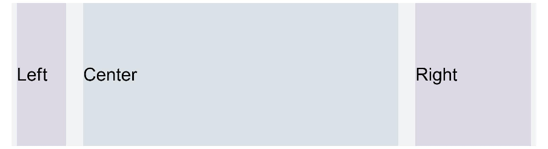

# Grid
<!--Kit: ArkUI-->
<!--Subsystem: ArkUI-->
<!--Owner: @zju_ljz-->
<!--Designer: @fenglinbailu-->
<!--Tester: @liuli0427-->
<!--Adviser: @Brilliantry_Rui-->
<!-- md-trans-meta sourceCommit=75a7d62c0702c21a06ca0119552a942305a023cc translatedAt=2026-09-01T12:39:13.544Z -->

Grid settings provide a regular structure for layouts, resolve the issue of dynamic layout across devices with different sizes, and ensure layout consistency of modules on different devices. They are applicable to scenarios such as responsive layout development, multi-device UI adaptation, and cross-device layout unification.

>  **NOTE**
>
>  - Supported since API version 7. New APIs in later versions are marked with a superscript to indicate their earliest API version.
>
>  - Since API version 9, this module is no longer maintained. It is recommended to use the new components [GridCol](ts-container-gridcol.md) and [GridRow](ts-container-gridrow.md) as replacements. Among them, useSizeType is deprecated since API version 9, and gridSpan and gridOffset are deprecated since API version 14.
>
>  - The column width and column gap of a grid layout are determined by the nearest [GridContainer](ts-container-gridcontainer.md) parent component. GridContainer is used to define parameters such as the total column count, column gap, and size breakpoints of the grid system. The component tree that uses grid attributes must contain at least one GridContainer container component.
>
>  - When calling the useSizeType, gridSpan, and gridOffset attributes, their parent component or ancestor component must be a GridContainer.

## Attributes

**System capability**: SystemCapability.ArkUI.ArkUI.Full

| Name       | Type                                                    | Description                                                        |
| ----------- | ------------------------------------------------------------ | ------------------------------------------------------------ |
| useSizeType<sup>(deprecated) </sup> | {<br>xs?:&nbsp;number&nbsp;\|&nbsp;{&nbsp;span:&nbsp;number,&nbsp;offset:&nbsp;number&nbsp;},<br>sm?:&nbsp;number&nbsp;\|&nbsp;{&nbsp;span:&nbsp;number,&nbsp;offset:&nbsp;number&nbsp;},<br>md?:&nbsp;number&nbsp;\|&nbsp;{&nbsp;span:&nbsp;number,&nbsp;offset:&nbsp;number&nbsp;},<br>lg?:&nbsp;number&nbsp;\|&nbsp;{&nbsp;span:&nbsp;number,&nbsp;offset:&nbsp;number&nbsp;}<br>} | Sets the column count and offset column count under a specific device width type. span: column count (must be a non-negative integer). When passing a negative number or a value exceeding the total column count of GridContainer, use the default value. offset: offset column count (must be a non-negative integer). When passing a negative number, use the default value 0.<br>When the value is of the number type, only the column count is set. When the value is in the format {"span":&nbsp;1,&nbsp;"offset":&nbsp;0}, both the column count and the offset column count are set.<br>-&nbsp;xs: refers to the column count and offset column count when the device width type is SizeType.XS (<320vp).<br>-&nbsp;sm: refers to the column count and offset column count when the device width type is SizeType.SM (320vp-600vp).<br>-&nbsp;md: refers to the column count and offset column count when the device width type is SizeType.MD (600vp-840vp).<br>-&nbsp;lg: refers to the column count and offset column count when the device width type is SizeType.LG (≥840vp).<br>For details about the breakpoint configuration of each size type, see [GridContainer](ts-container-gridcontainer.md).<br>**NOTE**<br>- When calling this attribute, its parent component or ancestor component must be GridContainer.<br>Supported since API version 7, deprecated since API version 9. It is recommended to use the new components [GridCol](ts-container-gridcol.md) and [GridRow](ts-container-gridrow.md) as replacements. |
| gridSpan<sup>(deprecated) </sup>    | number                   | Default column count, which refers to the grid column count occupied when the useSizeType attribute does not set the column count (span) for the corresponding size. It must be a non-negative integer. When passing a negative number or a value exceeding the total column count of GridContainer, use the default value 1.<br>**NOTE**<br>- When calling this attribute, its parent component or ancestor component must be GridContainer.<br>- When the grid span attribute is set, the width of the component is determined by the grid layout.<br>Default value: 1<br>**Atomic service API:** Since API version 11, this API is supported in atomic services.<br>Supported since API version 7, deprecated since API version 14. It is recommended to use the new components [GridCol](ts-container-gridcol.md) and [GridRow](ts-container-gridrow.md) as replacements.  |
| gridOffset<sup>(deprecated) </sup>  | number                                                       | Default offset column count, which refers to the number of columns by which the current component is offset along the Start direction of its parent component when the useSizeType attribute does not set the offset for the corresponding size. That is, the starting position of the component is offset by n columns relative to the Start direction of the parent component. It must be a non-negative integer. When passing a negative number, use the default value 0. When useSizeType sets the offset for the corresponding size, the gridOffset setting does not take effect.<br>**NOTE**<br>- When calling this attribute, its parent component or ancestor component must be GridContainer.<br>- After this attribute is configured, the layout of the current component in the horizontal direction of the parent component no longer follows the original layout mode of the parent component. Instead, the component is offset by a certain distance along the Start direction of the parent component.<br>- Offset distance&nbsp;=&nbsp;(column width&nbsp;+&nbsp;spacing)\*&nbsp; offset column count.<br>- Sibling components after the component with the offset (gridOffset) set are laid out relative to this component.<br>Default value: 0<br>**Atomic service API:** Since API version 11, this API is supported in atomic services.<br>Supported since API version 7, deprecated since API version 14. It is recommended to use the new components [GridCol](ts-container-gridcol.md) and [GridRow](ts-container-gridrow.md) as replacements. |

## Example

Set the grid configuration for different device types. gridSpan and gridOffset are used to set the default occupied column count and offset column count, and they take effect only when the corresponding size is not configured in useSizeType. In the example, useSizeType configures the value for the sm size (span: 2, offset: 1). To achieve the same grid effect for other unconfigured sizes, set the default values through gridSpan and gridOffset.

> **NOTE**
>
> This example demonstrates the usage of deprecated APIs. It is recommended to use the new components [GridCol](ts-container-gridcol.md) and [GridRow](ts-container-gridrow.md) to implement the grid layout.

<!--code_no_check-->

```ts
// xxx.ets
@Entry
@Component
struct GridContainerExample1 {
  build() {
    Column() {
      Text('useSizeType').fontSize(15).fontColor(0xCCCCCC).width('90%')
      GridContainer() {
        Row() {
          Row() {
            Text('Left').fontSize(25)
          }
          .useSizeType({
            xs: { span: 1, offset: 0 }, sm: { span: 1, offset: 0 },
            md: { span: 1, offset: 0 }, lg: { span: 2, offset: 0 }
          })
          .height("100%")
          .backgroundColor(0x66bbb2cb)

          Row() {
            Text('Center').fontSize(25)
          }
          .useSizeType({
            xs: { span: 1, offset: 0 }, sm: { span: 2, offset: 1 },
            md: { span: 5, offset: 1 }, lg: { span: 7, offset: 2 }
          })
          .height("100%")
          .backgroundColor(0x66b6c5d1)

          Row() {
            Text('Right').fontSize(25)
          }
          .useSizeType({
            xs: { span: 1, offset: 0 }, sm: { span: 1, offset: 3 },
            md: { span: 2, offset: 6 }, lg: { span: 3, offset: 9 }
          })
          .height("100%")
          .backgroundColor(0x66bbb2cb)
        }
        .height(200)

      }
      .backgroundColor(0xf1f3f5)
      .margin({ top: 10 })

      // Set the span and offset of the component separately. The resultant effect is equivalent to that achieved by using sm in useSizeType on the device of the sm type.
      Text('gridSpan,gridOffset').fontSize(15).fontColor(0xCCCCCC).width('90%')
      GridContainer() {
        Row() {
          Row() {
            Text('Left').fontSize(25)
          }
          .gridSpan(1)
          .height("100%")
          .backgroundColor(0x66bbb2cb)

          Row() {
            Text('Center').fontSize(25)
          }
          .gridSpan(2)
          .gridOffset(1)
          .height("100%")
          .backgroundColor(0x66b6c5d1)

          Row() {
            Text('Right').fontSize(25)
          }
          .gridSpan(1)
          .gridOffset(3)
          .height("100%")
          .backgroundColor(0x66bbb2cb)
        }.height(200)
      }
    }
  }
}
```

**Figure 1** Device width type SM


**Figure 2** Device width type MD



**Figure 3** Device width type LG


**Figure 4** Setting gridSpan and gridOffset separately has the same effect as useSizeType for a specific device width type

