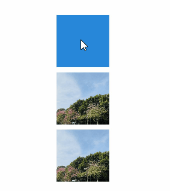

# Image Effect (System API)
<!--Kit: ArkUI-->
<!--Subsystem: ArkUI-->
<!--Owner: @CCFFWW-->
<!--Designer: @CCFFWW-->
<!--Tester: @lxl007-->
<!--Adviser: @Brilliantry_Rui-->

With image effects, you can define how a component blends with the existing content on the canvas below.

> **NOTE**
>
> The initial APIs of this module are supported since API version 11. Newly added APIs will be marked with a superscript to indicate their earliest API version.
>
> This topic describes only system APIs provided by the module. For details about its public APIs, see [Image Effects](ts-universal-attributes-image-effect.md).

## advancedBlendMode<sup>13+</sup>

advancedBlendMode(effect: BlendMode | Blender, type?: BlendApplyType): T

Defines how the component's content (including the content of it child components) is blended with the existing content on the canvas (possibly offscreen canvas) below. This API cannot be used with [blendMode](ts-universal-attributes-image-effect.md#blendmode11).

**Widget capability**: This API can be used in ArkTS widgets since API version 13.

**System capability**: SystemCapability.ArkUI.ArkUI.Full

**System API**: This is a system API.

**Parameters**

| Name| Type                           | Mandatory| Description                                                        |
| ------ | ------------------------------- | ---- | ------------------------------------------------------------ |
| effect  | [BlendMode](ts-universal-attributes-image-effect.md#blendmode11)&nbsp;\|&nbsp;[Blender](../../apis-arkgraphics2d/js-apis-uiEffect-sys.md#blender13)  | Yes  | Blend mode or blender type, depending on the parameter type.<br>When the parameter type is **BlendMode**, it indicates the blend mode.<br>Default value: **BlendMode.NONE**<br>When the parameter type is **Blender**, it indicates the blender type, used to describe the blending effect.<br>A **Blender** instance must be created using methods, for example, [uiEffect.createBrightnessBlender](../../apis-arkgraphics2d/js-apis-uiEffect-sys.md#uieffectcreatebrightnessblender), from the **uiEffect** module. Using a custom object as a parameter will not take effect. |
| type   | [BlendApplyType](ts-universal-attributes-image-effect-sys.md#blendapplytype) |    No   | Whether the blend mode is implemented offscreen.<br>Default value: **BlendApplyType.FAST**<br>**NOTE**<br>1. When this parameter is set to **BlendApplyType.FAST**, the blend mode is not implemented offscreen.<br>2. When this parameter is set to **BlendApplyType.OFFSCREEN**, an offscreen canvas matching the size of the current component is created. The content of the current component (including its child components) is then drawn onto the offscreen canvas, and blended with the existing content on the underlying canvas using the specified blend mode.<br>3. For text components, this API does not apply to emoji expressions when not offscreen.<br>4. Compared with **BlendApplyType.OFFSCREEN**, when this parameter is set to **BlendApplyType.OFFSCREEN_WITH_BACKGROUND**, the system first copies a canvas with a background as the initial background color (the canvas for **BlendApplyType.OFFSCREEN** starts with a transparent background) when creating an offscreen canvas matching the current component's size. The blending operation is then performed on this base. The two modes are identical in all other functional aspects.    |

**Return value**

| Type| Description|
| -------- | -------- |
| T | Current component.|

## BlendApplyType

Sets how to apply the specified blend mode to the content of a view.

**Widget capability**: This API can be used in ArkTS widgets since API version 11.

**System capability**: SystemCapability.ArkUI.ArkUI.Full

| Name          | Value  | Description                                                            |
| ---------------| ------ | ---------------------------------------------------------------- |
| OFFSCREEN_WITH_BACKGROUND<sup>23+</sup> | 2 |When an offscreen canvas is created, an initial background canvas is copied first, and then the content of this component and its child components is drawn on the offscreen canvas. The content is then blended on the canvas.<br> **System API**: This is a system API.|

## excludeFromRenderGroup<sup>22+</sup>

excludeFromRenderGroup(exclude: boolean \| undefined): T

Sets whether the current component and its child components are removed from the render group of the ancestor component. If this attribute is used alone, no effect is achieved. It must be used with the [renderGroup](./ts-universal-attributes-image-effect.md#rendergroup18) attribute of the ancestor component. 

Removing the current component and its children from the render group does not affect the offscreen canvas of the ancestor component, and the cache of the render group is still valid. In this way, the render group cache can be reused. If the display area of the current component occupies only a part of the display area of the render group drawing content, and the display effect of the current component and its children is frequently updated, setting **excludeFromRenderGroup** helps optimize the drawing performance.

If this attribute is not set, the current component and its children are not removed from the render group of the ancestor component by default.

> **NOTE**
>
> The drawing content of the component with **excludeFromRenderGroup** set to **true** and its children cannot the component's own boundary range. Otherwise, the displayed content may be clipped. For example, if the child component exceeds the boundary range of the current component due to attributes such as [translate](./ts-universal-attributes-transformation.md#translate) or [scale](./ts-universal-attributes-transformation.md#scale), or the drawing content extend beyond its boundaries because the current component has attributes such as [shadow](./ts-universal-attributes-image-effect.md#shadow) and [pixelStretchEffect](./ts-universal-attributes-image-effect.md#pixelstretcheffect12), the displayed content may be clipped. In such scenarios, **excludeFromRenderGroup** should not be set to **true**.

**Model restriction**: This API can be used only in the stage model.

**System capability**: SystemCapability.ArkUI.ArkUI.Full

**Parameters**

| Name | Type              | Mandatory| Description                                                        |
| ------- | ------------------ | ---- | ------------------------------------------------------------ |
| exclude | boolean \| undefined | Yes  | Whether to remove the current component and its child components from the render group of the ancestor component.<br>**true**: yes. **false**: no.<br>If **exclude** is set to **undefined**, the value **false** is used.|

**Return value**

| Type| Description|
| -------- | -------- |
| T | Current component.|

## Example
### Example 1: Setting the Brightness Effect

This example demonstrates how to add a brightness effect to a component using **advancedBlendMode**.

```ts
// xxx.ets
import { uiEffect } from "@kit.ArkGraphics2D";

// Use uiEffect.createBrightnessBlender to create a BrightnessBlender instance, which can be used to apply the brightness effect to a component.
let blender: uiEffect.BrightnessBlender = uiEffect.createBrightnessBlender({
  cubicRate: 0.5,
  quadraticRate: 0.5,
  linearRate: 0.5,
  degree: 0.5,
  saturation: 0.5,
  positiveCoefficient: [2.3, 4.5, 2.0],
  negativeCoefficient: [0.5, 2.0, 0.5],
  fraction: 0.5
});
// Using a custom object as a parameter will not take effect.
let blender1: uiEffect.BrightnessBlender = {
  cubicRate: 0.5,
  quadraticRate: 0.5,
  linearRate: 0.5,
  degree: 0.5,
  saturation: 0.5,
  positiveCoefficient: [2.3, 4.5, 2.0],
  negativeCoefficient: [0.5, 2.0, 0.5],
  fraction: 0.5
};

@Entry
@Component
struct Index {
  build() {
    Stack() {
      Image($r('app.media.img_1'))

      Column() {
        Text(String.fromCodePoint(0x1F600) + 'TEST')
          .fontSize(60)

        Text(String.fromCodePoint(0x1F600) + 'FAST')
          .fontSize(60)
          .advancedBlendMode(blender)

        Text(String.fromCodePoint(0x1F600) + 'OFFSCREEN')
          .fontSize(60)
          .advancedBlendMode(blender, BlendApplyType.OFFSCREEN)

        Text(String.fromCodePoint(0x1F600) + 'TEST')
          .fontSize(60)
          .advancedBlendMode(blender1)
      }
    }
  }
}
```

Below is how the component looks with the brightness effect applied:


### Example 2: Setting the Render Group Exclusion Attribute

This example demonstrates how to use the [excludeFromRenderGroup](#excludefromrendergroup22) to avoid repeated invalidations of the render group cache in scenarios involving attribute animations on the component.

The [excludeFromRenderGroup](#excludefromrendergroup22) attribute is supported since API version 22.

``` ts
// xxx.ets
@Entry
@Component
struct ExcludeFromRenderGroupDemo {
  readonly color1: ResourceColor = '#2787d9';
  readonly color2: ResourceColor = '#ffc000';
  @State myColor: ResourceColor = this.color1;
  @State isExcluded: boolean = false;
  animationCnt: number = 0;

  build() {
    Column() {
      Column({ space: 10 }) {
        Column()
          .width(100)
          .height(100)
          .backgroundColor(this.myColor)
          .excludeFromRenderGroup(this.isExcluded)// Set the excludeFromRenderGroup attribute. When the background color animation is performed for the component, the actual display effect needs to be frequently updated. The component area only occupies a part of the render group area. Therefore, setting the excludeFromRenderGroup attribute helps reuse the render group cache.
          .onClick(() => {
            this.isExcluded = true; // Before playing the animation, change the is attribute of the render group to true.
            this.animationCnt++;
            this.getUIContext().animateTo({
              duration: 600,
              onFinish: () => {
                this.animationCnt--;
                if (this.animationCnt == 0) { // If the value of animationCnt is 0, all animations have ended.
                  this.isExcluded = false; // After the animations of the component ends, if no attribute change occurs on the component, you can reset this attribute of the render group.
                }
              }
            }, () => {
              this.myColor = (this.myColor === this.color1) ? this.color2 : this.color1;
            })
          })
        // Other components in the render group.
        Image($r('app.media.bg1'))// Replace $r('app.media.bg1') with the image resource file you use.
          .width(100)
          .height(100)
        Image($r('app.media.bg1'))// Replace $r('app.media.bg1') with the image resource file you use.
          .width(100)
          .height(100)
      }.renderGroup(true)
      .width('100%')
      .height('70%')
    }
    .height('100%')
    .width('100%')
  }
}
```


### Example 3: Setting the Brightening and Fade-Out Effects

Since API version 23, this example demonstrates how to use **advancedBlendMode** to add both the brightening and fade-out effects to a component.

```ts
// xxx.ets
import { uiEffect } from '@kit.ArkGraphics2D';

// Use uiEffect.createBrightnessBlender to create a BrightnessBlender instance, which can be used to apply the brightness effect to a component.
let blender: uiEffect.BrightnessBlender = uiEffect.createBrightnessBlender({
  cubicRate: 0.5,
  quadraticRate: 0.5,
  linearRate: 0.5,
  degree: 0.5,
  saturation: 0.5,
  positiveCoefficient: [2.3, 4.5, 2.0],
  negativeCoefficient: [0.5, 2.0, 0.5],
  fraction: 0.3
});

@Entry
@Component
struct Index {
  build() {
    Column() {
      Stack() {
        Column() {
          Text(String.fromCodePoint(0x1F600) + ' BlendApplyType OFFSCREEN WITH BACKGROUND ' +
          String.fromCodePoint(0x1F600))
            .fontSize(35)
            .fontColor(Color.Black)
        }
        .advancedBlendMode(blender, BlendApplyType.FAST)

        Column()
          .width('100%')
          .height('100%')
          .linearGradient({
            direction: GradientDirection.Right,
            colors: [
              [Color.Transparent, 0.0],
              [Color.Black, 0.50],
              [Color.Black, 0.55],
              [Color.Transparent, 1.0]
            ]
          })
          .blendMode(BlendMode.DST_IN, BlendApplyType.FAST)
      }
      .advancedBlendMode(BlendMode.SRC_OVER, BlendApplyType.OFFSCREEN_WITH_BACKGROUND)
      .width('100%')
      .height('20%')
    }
    .backgroundColor('rgb(254, 238, 239)')
    .width('100%')
    .height('100%')
  }
}
```


<!--no_check-->