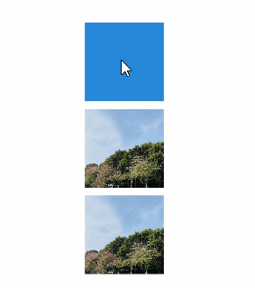
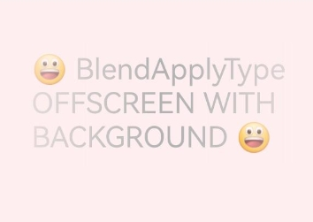

# Image Effect (System API)
<!--Kit: ArkUI-->
<!--Subsystem: ArkUI-->
<!--Owner: @hehongyang3-->
<!--Designer: @zhanghaibo0-->
<!--Tester: @lxl007-->
<!--Adviser: @Brilliantry_Rui-->
<!-- md-trans-meta sourceCommit=e10e7def4863f4f964c4d0cb425b7650081cb83e translatedAt=2026-09-01T12:42:02.685Z -->

This module provides APIs for setting the blur, shadow, and spherical effects of components, and applying image effects to pictures.

> **NOTE**
>
> - The initial APIs of this module are supported since API version 11. Newly added APIs will be marked with a superscript to indicate their earliest API version.
>
> - The APIs of this module can be used only in the stage model.
>
> - This page contains only the system APIs of this module. For details about other public APIs, see [Image Effects](ts-universal-attributes-image-effect.md).

## advancedBlendMode<sup>13+</sup>

advancedBlendMode(effect: BlendMode | Blender, type?: BlendApplyType): T

Blends the content of the current component (including the content of its child nodes) with the existing content on the canvas below (which may be an offscreen canvas). This API cannot be used together with [blendMode](ts-universal-attributes-image-effect.md#blendmode11). If both are set, only the advancedBlendMode effect takes effect.

**Widget capability**: This API can be used in ArkTS widgets since API version 13.

**System capability**: SystemCapability.ArkUI.ArkUI.Full

**System API**: This is a system API.

**Parameters**

| Name| Type                           | Mandatory| Description                                                        |
| ------ | ------------------------------- | ---- | ------------------------------------------------------------ |
| effect  | [BlendMode](ts-universal-attributes-image-effect.md#blendmode11 )&nbsp;\|&nbsp;[Blender](../../apis-arkgraphics2d/js-apis-uiEffect-sys.md#blender13)  | Yes   | When the input parameter type is BlendMode, it indicates the blend mode, and no blending is performed by default. Default value: BlendMode.NONE, which means no special blend effect is applied and the component content is drawn in the default manner.<br>When the input parameter type is Blender, it indicates the blender type, which is used to describe the blend effect.<br>You need to use a method in the uiEffect module to create a Blender instance. For example: [uiEffect.createBrightnessBlender](../../apis-arkgraphics2d/js-apis-uiEffect-sys.md#uieffectcreatebrightnessblender). Using a custom object as the input parameter does not take effect.  |
| type   | [BlendApplyType](ts-universal-attributes-image-effect-sys.md#blendapplytype)  |    No    | Whether the blend effect (blendMode) is implemented offscreen.<br>Default value: BlendApplyType.FAST<br>**NOTE**<br>1. When set to BlendApplyType.FAST, no offscreen rendering is performed.<br>2. When set to BlendApplyType.OFFSCREEN, an offscreen canvas of the current component size is created, the content of the current component (including child components) is drawn onto the offscreen canvas, and then the specified blend effect (BlendMode or Blender) is used to blend with the existing content on the canvas below.<br>3. In the non-offscreen case, the effect does not apply to emoji in text components.<br>4. Compared with BlendApplyType.OFFSCREEN, when set to BlendApplyType.OFFSCREEN_WITH_BACKGROUND, the system first copies a canvas with a background as the initial base color when creating an offscreen canvas of the same size as the current component (the canvas of the BlendApplyType.OFFSCREEN type is initially transparent), and then performs the blending operation on this basis. The two are consistent in other functional features.     |

**Return value**

| Type| Description|
| -------- | -------- |
| T | Current component, used for chained calls. |

## BlendApplyType

Sets how to apply the specified blend mode to the content of a view.

**Widget capability**: This API can be used in ArkTS widgets since API version 11.

**System capability**: SystemCapability.ArkUI.ArkUI.Full

| Name          | Value  | Description                                                            |
| ---------------| ------ | ---------------------------------------------------------------- |
| OFFSCREEN_WITH_BACKGROUND<sup>23+</sup> | 2 |When creating an offscreen canvas, first copies a canvas with a background as the initial base color (the canvas of the BlendApplyType.OFFSCREEN type is initially transparent), then draws the content of this component and its child components onto the offscreen canvas, and finally blends the whole. In other functional features, it is consistent with BlendApplyType.OFFSCREEN. <br> **System API:** This API is a system API. |

## excludeFromRenderGroup<sup>22+</sup>

excludeFromRenderGroup(exclude: boolean \| undefined): T

Sets whether the current component and its child components are removed from the render group of the ancestor component. If this attribute is used alone, no effect is achieved. It must be used with the [renderGroup](./ts-universal-attributes-image-effect.md#rendergroup18) attribute of the ancestor component. 

Removing the current component and its children from the render group does not affect the offscreen canvas of the ancestor component, and the cache of the render group is still valid. In this way, the render group cache can be reused. If the display area of the current component occupies only a part of the display area of the render group drawing content, and the display effect of the current component and its children is frequently updated, setting **excludeFromRenderGroup** helps optimize the drawing performance.

If this attribute is not set, the current component and its children are not removed from the render group of the ancestor component by default.

> **NOTE**
>
> The drawing content of the component with **excludeFromRenderGroup** set to **true** and its children cannot exceed the component's own boundary range. Otherwise, the displayed content may be clipped. For example, if the child component exceeds the boundary range of the current component due to attributes such as [translate](./ts-universal-attributes-transformation.md#translate) or [scale](./ts-universal-attributes-transformation.md#scale), or the drawing content extends beyond its boundaries because the current component has attributes such as [shadow](./ts-universal-attributes-image-effect.md#shadow) and [pixelStretchEffect](./ts-universal-attributes-image-effect.md#pixelstretcheffect12), the displayed content may be clipped. In such scenarios, **excludeFromRenderGroup** should not be set to **true**.

**Model restriction**: This API can be used only in the stage model.

**System capability**: SystemCapability.ArkUI.ArkUI.Full

**System API**: This is a system API.

**Parameters**

| Name | Type              | Mandatory| Description                                                        |
| ------- | ------------------ | ---- | ------------------------------------------------------------ |
| exclude | boolean \| undefined | Required | Whether to exclude the current component and its child components from the render group of the ancestor component.<br>The value true means that the current component and its child components are excluded from the render group of the ancestor component and do not belong to the render group of the ancestor component; the value false means that the current component and its child components belong to the render group of the ancestor component.<br>When the value of exclude is undefined, it is processed as false.<br>**Note:**<br>It must be used together with the renderGroup attribute set on the ancestor component to create a render group; it has no effect when used alone. |

**Return value**

| Type| Description|
| -------- | -------- |
| T | Current component, used for chained calls. |

## edgeLight

edgeLight(params: EdgeLightParams | undefined): T

Adds an edge glow effect to a component. The edge glow effect creates a glowing effect along the edges of the component, starting from a specified position and extending along the edges. This effect enhances the visual appeal of the component and highlights important components.

> **NOTE**
>
> - Setting edgeLight alone does not produce an edge glow effect. You need to use [animateTo](../arkts-apis-uicontext-uicontext.md#animateto) to change the position parameter to achieve the glow effect. For details, see [Example 4: Setting Component Edge Light Effect](#example-4-setting-component-edge-light-effect).
>
> - When the position parameter changes diagonally (for example, from TOP_LEFT to BOTTOM_RIGHT), the edge glow runs at a 45° angle.

**Since**: 26.0.0

**Model restriction**: This API can be used only in the stage model.

**System capability**: SystemCapability.ArkUI.ArkUI.Full

**System API**: This is a system API.

**Parameters**

| Name| Type                           | Mandatory| Description                                                        |
| ------ | ------------------------------- | ---- | ------------------------------------------------------------ |
| params | [EdgeLightParams](#edgelightparams) \| undefined | Yes | Defines the position, length, intensity, color, and thickness of the edge glow effect.<br>When the value of params is undefined, the edge glow effect is removed. |

**Return value**

| Type| Description|
| -------- | -------- |
| T    | Current component, used for chained calls. |

## EdgeLightParams

Defines the parameters of the edge glow effect.

**Since**: 26.0.0

**Model restriction**: This API can be used only in the stage model.

**System capability**: SystemCapability.ArkUI.ArkUI.Full

**System API**: This is a system API.

| Name     | Type                                                       | Read-only | Optional | Description                                                    |
| -------- | --------------------------------------------------------- | ---- | ---- |------------------------------------------------------- |
| position | [EdgeLightPosition](./ts-appendix-enums-sys.md#edgelightposition)          | No   | No   | Position of the edge glow.                                           |
| length   | [Length](ts-types.md#length)                              | No   | No   | Projection length of the edge glow along the flow direction (percentage is not supported; if a percentage is passed, it does not take effect).<br>Value range: [0, +∞)<br>Unit: vp<br>**Note:**<br>When length is 0, there is no edge glow projection effect.<br>When a value less than 0 is set, it is treated as 0. |
| intensity | number                                                   | No   | Yes   | Glow intensity of the edge glow effect.<br>Value range: [0, 1]<br>Default value: 1<br>**Note:**<br>When the value is 0, the glow effect is completely invisible.<br>When the value is 1, the glow effect reaches the maximum brightness.<br>When a value greater than 1 is set, it is treated as 1.<br>When a value less than 0 is set, it is treated as 0. |
| color    | [ResourceColor](ts-types.md#resourcecolor)                | No   | Yes   | Color of the edge glow.<br>Default value: #FFFFFF, displayed as white. |
| thickness | [Length](ts-types.md#length)                             | No   | Yes   | Thickness of the edge glow line (percentage is not supported; if a percentage is passed, it does not take effect).<br>Value range: [0, +∞)<br>Unit: vp<br>Default value: 0<br>**Note:**<br>When thickness is 0, the edge glow line is invisible.<br>When a value less than 0 is set, it is treated as 0. |

## Examples
### Example 1: Setting the Brightness Effect

This example demonstrates how to add a brightness effect to a component using **advancedBlendMode**.

```ts
// xxx.ets
import { uiEffect } from '@kit.ArkGraphics2D';

// Use uiEffect.createBrightnessBlender to create a BrightnessBlender instance, which can be used to apply the brightness effect to a component.
let blender: uiEffect.BrightnessBlender = uiEffect.createBrightnessBlender({
  cubicRate: 0.5,
  quadraticRate: 0.5,
  linearRate: 0.5,
  degree: 0.5,
  saturation: 0.5,
  positiveCoefficient: [2.3, 4.5, 2.0],
  negativeCoefficient: [0.5, 2.0, 0.5],
  fraction: 0.5
});
// Caution: Using a custom object as the Blender input parameter does not take effect. Use the uiEffect.createBrightnessBlender method to create a Blender instance.
let customBlender: uiEffect.BrightnessBlender = {
  cubicRate: 0.5,
  quadraticRate: 0.5,
  linearRate: 0.5,
  degree: 0.5,
  saturation: 0.5,
  positiveCoefficient: [2.3, 4.5, 2.0],
  negativeCoefficient: [0.5, 2.0, 0.5],
  fraction: 0.5
};

@Entry
@Component
struct Index {
  build() {
    Stack() {
      Image($r('app.media.img_1'))

      Column() {
        Text(String.fromCodePoint(0x1F600) + 'TEST')
          .fontSize(60)

        Text(String.fromCodePoint(0x1F600) + 'FAST')
          .fontSize(60)
          .advancedBlendMode(blender)

        Text(String.fromCodePoint(0x1F600) + 'OFFSCREEN')
          .fontSize(60)
          .advancedBlendMode(blender, BlendApplyType.OFFSCREEN)

        Text(String.fromCodePoint(0x1F600) + 'TEST')
          .fontSize(60)
          .advancedBlendMode(customBlender)
      }
    }
  }
}
```

Below is how the component looks with the brightness effect applied:


### Example 2: Setting the Render Group Exclusion Attribute

This example demonstrates how to use the [excludeFromRenderGroup](#excludefromrendergroup22) to avoid repeated invalidations of the render group cache in scenarios involving attribute animations on the component.

The [excludeFromRenderGroup](#excludefromrendergroup22) attribute is supported since API version 22.

``` ts
// xxx.ets
@Entry
@Component
struct ExcludeFromRenderGroupDemo {
  readonly color1: ResourceColor = '#2787d9';
  readonly color2: ResourceColor = '#ffc000';
  @State myColor: ResourceColor = this.color1;
  @State isExcluded: boolean = false;
  animationCnt: number = 0;

  build() {
    Column() {
      Column({ space: 10 }) {
        Column()
          .width(100)
          .height(100)
          .backgroundColor(this.myColor)
          // Set the excludeFromRenderGroup attribute. When this component performs a background color animation, the actual display effect requires frequent attribute updates, and the component area occupies only part of the render group area. Therefore, set the excludeFromRenderGroup attribute to reuse the render group cache.
          .excludeFromRenderGroup(this.isExcluded)
          .onClick(() => {
            this.isExcluded = true; // Before playing the animation, change the is attribute of the render group to true.
            this.animationCnt++;
            this.getUIContext().animateTo({
              duration: 600,
              onFinish: () => {
                this.animationCnt--;
                if (this.animationCnt === 0) { // animationCnt becomes 0, indicating that all animations have ended.
                  this.isExcluded = false; // After the animations of the component end, if no attribute change occurs on the component, you can reset this attribute of the render group.
                }
              }
            }, () => {
              this.myColor = (this.myColor === this.color1) ? this.color2 : this.color1;
            })
          })
        // Other components in the render group.
        Image($r('app.media.bg1')) // $r('app.media.bg1') needs to be replaced with the image resource file required by the developer.
          .width(100)
          .height(100)
        Image($r('app.media.bg1')) // $r('app.media.bg1') needs to be replaced with the image resource file required by the developer.
          .width(100)
          .height(100)
      }.renderGroup(true)
      .width('100%')
      .height('70%')
    }
    .height('100%')
    .width('100%')
  }
}
```


### Example 3: Setting the Brightening and Fade-Out Effects

Since API version 23, this example demonstrates how to use **advancedBlendMode** to add both the brightening and fade-out effects to a component.

```ts
// xxx.ets
import { uiEffect } from '@kit.ArkGraphics2D';

// Use uiEffect.createBrightnessBlender to create a BrightnessBlender instance, which can be used to apply the brightness effect to a component.
let blender: uiEffect.BrightnessBlender = uiEffect.createBrightnessBlender({
  cubicRate: 0.5,
  quadraticRate: 0.5,
  linearRate: 0.5,
  degree: 0.5,
  saturation: 0.5,
  positiveCoefficient: [2.3, 4.5, 2.0],
  negativeCoefficient: [0.5, 2.0, 0.5],
  fraction: 0.3
});

@Entry
@Component
struct Index {
  build() {
    Column() {
      Stack() {
        Column() {
          Text(String.fromCodePoint(0x1F600) + ' BlendApplyType OFFSCREEN WITH BACKGROUND ' +
          String.fromCodePoint(0x1F600))
            .fontSize(35)
            .fontColor(Color.Black)
        }
        .advancedBlendMode(blender, BlendApplyType.FAST)

        Column()
          .width('100%')
          .height('100%')
          .linearGradient({
            direction: GradientDirection.Right,
            colors: [
              [Color.Transparent, 0.0],
              [Color.Black, 0.50],
              [Color.Black, 0.55],
              [Color.Transparent, 1.0]
            ]
          })
          .blendMode(BlendMode.DST_IN, BlendApplyType.FAST)
      }
      .advancedBlendMode(BlendMode.SRC_OVER, BlendApplyType.OFFSCREEN_WITH_BACKGROUND)
      .width('100%')
      .height('20%')
    }
    .backgroundColor('rgb(254, 238, 239)')
    .width('100%')
    .height('100%')
  }
}
```



### Example 4: Setting Component Edge Light Effect

This example demonstrates how to add an edge glow effect to a component through [edgeLight](#edgelight).

Since API version 26.0.0, the edgeLight method is added.

```ts
// xxx.ets
import { curves } from '@kit.ArkUI';
@Entry
@Component
struct Index {
  @State animate: boolean = false;
  @State edgeLightPosition: EdgeLightPosition = EdgeLightPosition.TOP_LEFT;
  build() {
    Column() {
      Column()
        .height(300)
        .width(300)
        .backgroundColor(Color.Gray)
        .borderRadius(20)
        .edgeLight({
          position: this.edgeLightPosition,
          length: 90,
          intensity: 1,
          color: Color.White,
          thickness: 2
        })
        .onClick(() => {
          this.getUIContext()?.animateTo({ curve: curves.springMotion(), duration: 3000}, () => {
            this.animate = !this.animate;
            this.edgeLightPosition = this.animate ? EdgeLightPosition.BOTTOM_RIGHT : EdgeLightPosition.TOP_LEFT;
          })
        })
    }
    .height('100%')
    .width('100%')
    .justifyContent(FlexAlign.Center)
    .alignItems(HorizontalAlign.Center)
    .backgroundColor('#aaaaaa')
  }
}
```


