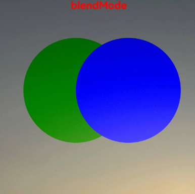

# Image Effect
<!--Kit: ArkUI-->
<!--Subsystem: ArkUI-->
<!--Owner: @hehongyang3-->
<!--Designer: @zhanghaibo0-->
<!--Tester: @lxl007-->
<!--Adviser: @Brilliantry_Rui-->
<!-- md-trans-meta sourceCommit=a7e5b064d4e2e575781bef3dad81037f25ee352c translatedAt=2026-09-01T12:58:27.231Z -->

Sets the blur, shadow, spherical effects and image effects for the component.

>  **NOTE**
>
>  The feature is supported since API version 7. Updates will be marked with a superscript to indicate their earliest API version.

## blur

blur(value: number, options?: BlurOptions): T

Adds a content blur effect to the component. When the component is set with the blendMode of BlendApplyType.OFFSCREEN, this interface may fail to capture the correct picture.

**Widget capability**: This API can be used in ArkTS widgets since API version 9.

**Atomic service API**: This API can be used in atomic services since API version 11.

**System capability**: SystemCapability.ArkUI.ArkUI.Full

**Parameters**

| Name               | Type                                                        | Mandatory| Description                                                        |
| --------------------- | ------------------------------------------------------------ | ---- | ------------------------------------------------------------ |
| value                 | number                                                       | Yes   | Blur radius. A larger value means more blur, and a value less than or equal to 0 means no blur.<br>Unit: px |
| options<sup>11+</sup> | [BlurOptions](ts-universal-attributes-foreground-blur-style.md#bluroptions11) | No   | Grayscale blur parameters. Applies color level adjustment to the black and white parts of the image to make the black-white grayscale transition smoother and softer. The adjustment has no effect on the color parts of the image.<br>Default value: grayscale: [0,0] |

**Return value**

| Type  | Description                    |
| ------ | ------------------------ |
| T | Current component, used for chained calls. |

## blur<sup>18+</sup>

blur(blurRadius: Optional\<number>, options?: BlurOptions): T

Applies a foreground blur effect to the component. Compared to [blur](#blur), the **blurRadius** parameter supports the **undefined** type.

**Widget capability**: This API can be used in ArkTS widgets since API version 18.

**Atomic service API**: This API can be used in atomic services since API version 18.

**Model restriction**: This API can be used only in the stage model.

**System capability**: SystemCapability.ArkUI.ArkUI.Full

**Parameters**

| Name               | Type                                                        | Mandatory| Description                                                        |
| --------------------- | ------------------------------------------------------------ | ---- | ------------------------------------------------------------ |
| blurRadius            | [Optional](ts-universal-attributes-custom-property.md#optionalt)\<number>                                            | Yes   | Blur radius. A larger blur radius means more blur, and a value less than or equal to 0 means no blur.<br>Unit: px<br>When the value of blurRadius is undefined, the previous value is maintained. When this attribute has never been set, the default value is 0, which means no blur.|
| options | [BlurOptions](ts-universal-attributes-foreground-blur-style.md#bluroptions11) | No   | Grayscale blur parameters. Apply color level adjustment to the black and white parts of the image to make them tend toward gray for a softer and more aesthetic look. The adjustment has no effect on the color parts of the image.<br>Default value: grayscale: [0,0] |

**Return value**

| Type  | Description                    |
| ------ | ------------------------ |
| T | Current component, used for chained calls. |

## blur<sup>19+</sup>

blur(blurRadius: Optional\<number>, options?: BlurOptions, sysOptions?: SystemAdaptiveOptions): T

Applies a foreground blur effect to the component. Compared to [blur<sup>18+</sup>](#blur18), this API adds the **sysOptions** parameter, which allows for system adaptive adjustments.

**Widget capability**: This API can be used in ArkTS widgets since API version 19.

**Atomic service API**: This API can be used in atomic services since API version 19.

**Model restriction**: This API can be used only in the stage model.

**System capability**: SystemCapability.ArkUI.ArkUI.Full

**Parameters**

| Name               | Type                                                        | Mandatory| Description                                                        |
| --------------------- | ------------------------------------------------------------ | ---- | ------------------------------------------------------------ |
| blurRadius            | [Optional](ts-universal-attributes-custom-property.md#optionalt)\<number>                                            | Yes   | Blur radius. A larger blur radius means more blur, and a value less than or equal to 0 means no blur.<br>Unit: px<br>When the value of blurRadius is undefined, the previous value is maintained. When this attribute has never been set, the default value is 0, which means no blur. |
| options | [BlurOptions](ts-universal-attributes-foreground-blur-style.md#bluroptions11) | No   | Grayscale blur parameters. Applies color level adjustment to the black and white parts of the image to make them tend toward gray for a softer and more aesthetic look. The adjustment has no effect on the color tone of the image.<br>Default value: grayscale: [0,0]  |
| sysOptions   |  [SystemAdaptiveOptions](ts-universal-attributes-background.md#systemadaptiveoptions19)    |   No   |  System adaptive adjustment parameters.<br>Default value: { disableSystemAdaptation: false }    |

**Return value**

| Type  | Description                    |
| ------ | ------------------------ |
| T | Current component, used for chained calls. |

## shadow

shadow(value: ShadowOptions \| ShadowStyle): T

Applies a shadow effect to the component.

**Card Capability**: This interface supports use in ArkTS cards since API version 9. The parameter of the [ShadowStyle](#shadowstyle10) type is not supported on ArkTS cards.

**Atomic service API**: This API can be used in atomic services since API version 11.

**System capability**: SystemCapability.ArkUI.ArkUI.Full

**Parameters**

| Name| Type                                                        | Mandatory| Description                                                        |
| ------ | ------------------------------------------------------------ | ---- | ------------------------------------------------------------ |
| value  | [ShadowOptions](#shadowoptions)&nbsp;\|&nbsp;[ShadowStyle](#shadowstyle10)<sup>10+</sup> | Yes   | Adds a shadow effect to the current component.<br>When the input parameter type is ShadowOptions, you can specify the blur radius, shadow color, and X-axis and Y-axis offsets.<br>When the input parameter type is ShadowStyle, you can specify different shadow styles. |

**Return value**

| Type  | Description                    |
| ------ | ------------------------ |
| T | Current component, used for chained calls. |

## shadow<sup>18+</sup>

shadow(options: Optional\<ShadowOptions \| ShadowStyle>): T

Applies a shadow effect to the component. Compared to [shadow](#shadow), the **options** parameter supports the **undefined** type.

**Card Capability**: This interface supports use in ArkTS cards since API version 18. The parameter of the [ShadowStyle](#shadowstyle10) type is not supported on ArkTS cards.

**Atomic service API**: This API can be used in atomic services since API version 18.

**Model restriction**: This API can be used only in the stage model.

**System capability**: SystemCapability.ArkUI.ArkUI.Full

**Parameters**

| Name | Type                                                        | Mandatory                                                        | Description|
| ------- | ------------------------------------------------------------ | ------------------------------------------------------------ | ---- |
| options | [Optional](ts-universal-attributes-custom-property.md#optionalt)\<[ShadowOptions](#shadowoptions)&nbsp;\|&nbsp;[ShadowStyle](#shadowstyle10) | Yes |   Adds a shadow effect to the current component.<br>When the input parameter type is ShadowOptions, you can specify the blur radius, shadow color, and X-axis and Y-axis offsets.<br>When the input parameter type is ShadowStyle, you can specify different shadow styles.<br>When the value of options is undefined, the shadow effect is restored to none.   |

**Return value**

| Type  | Description                    |
| ------ | ------------------------ |
| T | Current component, used for chained calls. |

## grayscale

grayscale(value: number): T

Adds a grayscale effect to the component. The grayscale rendered by the upper layer overrides the rendering of the lower-layer child components. When not set, there is no change by default.

**Widget capability**: This API can be used in ArkTS widgets since API version 9.

**Atomic service API**: This API can be used in atomic services since API version 11.

**System capability**: SystemCapability.ArkUI.ArkUI.Full

**Parameters**

| Name| Type  | Mandatory| Description                                                        |
| ------ | ------ | ---- | ------------------------------------------------------------ |
| value  | number | Yes   | Adds a grayscale effect to the current component. The value defines the ratio of grayscale conversion. A value of 1.0 converts the image completely to grayscale, a value of 0.0 leaves the image unchanged, and when the value is between 0.0 and 1.0, the effect changes linearly.<br>Value range: [0.0, 1.0]<br>**Note:**<br>When the value is set to less than 0.0, it is treated as 0.0. When the value is set to greater than 1.0, it is treated as 1.0. |

**Return value**

| Type  | Description                    |
| ------ | ------------------------ |
| T | Current component, used for chained calls. |

## grayscale<sup>18+</sup>

grayscale(grayscale: Optional\<number>): T

Adds a grayscale effect to the component. The grayscale rendered by the upper layer overrides the rendering of the lower-layer child components. When not set, there is no change by default. Compared with [grayscale](#grayscale), the grayscale parameter adds support for the undefined type.

**Widget capability**: This API can be used in ArkTS widgets since API version 18.

**Atomic service API**: This API can be used in atomic services since API version 18.

**Model restriction**: This API can be used only in the stage model.

**System capability**: SystemCapability.ArkUI.ArkUI.Full

**Parameters**

| Name   | Type             | Mandatory| Description                                                        |
| --------- | ----------------- | ---- | ------------------------------------------------------------ |
| grayscale | [Optional](ts-universal-attributes-custom-property.md#optionalt)\<number> | Yes | Adds a grayscale effect to the current component. The value is defined as the ratio of grayscale conversion. An input value of 1.0 converts the image completely to grayscale, an input value of 0.0 leaves the image unchanged, and when the input value is between 0.0 and 1.0, the effect changes linearly.<br>Value range: [0.0, 1.0]<br>**Note:**<br>When a value less than 0.0 is set, it is processed as 0.0. When a value greater than 1.0 is set, it is processed as 1.0.<br>When the value of grayscale is undefined, the default value 0.0 is used. The component is restored to no grayscale effect. |

**Return value**

| Type  | Description                    |
| ------ | ------------------------ |
| T | Current component, used for chained calls. |

## brightness

brightness(value: number): T

Adds a highlight effect to the component. When not set, there is no change by default. Compared with the lightUpEffect method, brightness adjusts the brightness in a multiplicative manner (a value greater than 1 can exceed the original brightness), suitable for scenarios that need to enhance or reduce brightness; lightUpEffect adjusts the brightness in a degree manner (value range [0, 1], cannot exceed the original brightness), suitable for scenarios that need to control the degree to which the image lights up. When the component is set with the blendMode of BlendApplyType.OFFSCREEN, this interface may fail to capture the correct picture.

**Widget capability**: This API can be used in ArkTS widgets since API version 9.

**Atomic service API**: This API can be used in atomic services since API version 11.

**System capability**: SystemCapability.ArkUI.ArkUI.Full

**Parameters**

| Name| Type  | Mandatory| Description                                                        |
| ------ | ------ | ---- | ------------------------------------------------------------ |
| value  | number | Yes   | For the current component, adds a highlight effect. The input parameter is the highlight ratio. When the value is 1, there is no effect. When it is less than 1, the brightness decreases. When it is less than or equal to 0, it is completely black. When it is greater than 1, the brightness increases. The larger the value, the greater the brightness. When the brightness is greater than or equal to 2, it becomes completely white.<br>Value range: [0, +∞)<br>Recommended value range: [0, 2]<br>**Note:**<br>When a value less than 0 is set, it is processed as 0.|

**Return value**

| Type  | Description                    |
| ------ | ------------------------ |
| T | Current component, used for chained calls. |

## brightness<sup>18+</sup>

brightness(brightness: Optional\<number>): T

Adds a highlight effect to the component. When not set, there is no change by default. Compared with [brightness](#brightness), the brightness parameter adds support for the undefined type.

**Widget capability**: This API can be used in ArkTS widgets since API version 18.

**Atomic service API**: This API can be used in atomic services since API version 18.

**Model restriction**: This API can be used only in the stage model.

**System capability**: SystemCapability.ArkUI.ArkUI.Full

**Parameters**

| Name    | Type             | Mandatory| Description                                                        |
| ---------- | ----------------- | ---- | ------------------------------------------------------------ |
| brightness | [Optional](ts-universal-attributes-custom-property.md#optionalt)\<number> | Yes | Adds a highlight effect to the current component. The input parameter is the highlight ratio. When the value is 1, there is no effect. When the value is less than 1, the brightness becomes darker. When the value is less than or equal to 0, it becomes completely black. When the value is greater than 1, the brightness increases. A larger value means greater brightness. When the brightness is greater than or equal to 2, it becomes completely white.<br>Value range: [0, +∞)<br>Recommended value range: [0, 2]<br>**Note:**<br>When a value less than 0 is set, it is processed as 0.<br>When the value of brightness is undefined, the highlight effect with a brightness of 1 is restored. |

**Return value**

| Type  | Description                    |
| ------ | ------------------------ |
| T | Current component, used for chained calls. |

## saturate

saturate(value: number): T

Adds a saturation effect to the component. If this API is not used, there will be no change by default.

**Widget capability**: This API can be used in ArkTS widgets since API version 9.

**Atomic service API**: This API can be used in atomic services since API version 11.

**System capability**: SystemCapability.ArkUI.ArkUI.Full

**Parameters**

| Name| Type  | Mandatory| Description                                                        |
| ------ | ------ | ---- | ------------------------------------------------------------ |
| value  | number | Yes   | Adds a saturation effect to the current component. Saturation is the ratio of the chromatic component to the achromatic component (gray) in a color. When the input parameter is 1, the original image is displayed. When it is greater than 1, the larger the chromatic component, the higher the saturation. When it is less than 1, the larger the achromatic component, the lower the saturation.<br>Value range: [0, +∞)<br>Recommended value range: [0, 50)<br>**Note:**<br>When the value is set to less than 0, it is processed as 0. |

**Return value**

| Type  | Description                    |
| ------ | ------------------------ |
| T | Current component, used for chained calls. |

## saturate<sup>18+</sup>

saturate(saturate: Optional\<number>): T

Adds a saturation effect to the component. If this API is not used, there will be no change by default. Compared to [saturate](#saturate), the **saturate** parameter supports the **undefined** type.

**Widget capability**: This API can be used in ArkTS widgets since API version 18.

**Atomic service API**: This API can be used in atomic services since API version 18.

**Model restriction**: This API can be used only in the stage model.

**System capability**: SystemCapability.ArkUI.ArkUI.Full

**Parameters**

| Name  | Type             | Mandatory| Description                                                        |
| -------- | ----------------- | ---- | ------------------------------------------------------------ |
| saturate | [Optional](ts-universal-attributes-custom-property.md#optionalt)\<number> | Yes | Adds a saturation effect to the current component. Saturation is the ratio of the chromatic component to the achromatic component (gray) in a color. When the input parameter is 1, the original image is displayed. When it is greater than 1, the larger the chromatic component, the higher the saturation. When it is less than 1, the larger the achromatic component, the lower the saturation.<br>Value range: [0, +∞)<br>Recommended value range: [0, 50)<br>**Note:**<br>When the value is set to less than 0, it is processed as 0.<br>When the value of saturate is undefined, the effect is restored to a saturation of 1. |

**Return value**

| Type  | Description                    |
| ------ | ------------------------ |
| T | Current component, used for chained calls. |

## contrast

contrast(value: number): T

Adds a contrast effect to the component. If this API is not used, there will be no change by default.

**Widget capability**: This API can be used in ArkTS widgets since API version 9.

**Atomic service API**: This API can be used in atomic services since API version 11.

**System capability**: SystemCapability.ArkUI.ArkUI.Full

**Parameters**

| Name| Type  | Mandatory| Description                                                        |
| ------ | ------ | ---- | ------------------------------------------------------------ |
| value  | number | Yes   | Adds a contrast effect to the current component. The input parameter is the contrast value. When the value is 1, the original image is displayed. When the value is greater than 1, a larger value means higher contrast and a clearer, more striking image. When the value is less than 1, a smaller value means lower contrast. When the contrast is 0, the image becomes completely gray.<br>Value range: [0, +∞)<br>Recommended value range: [0, 10)<br>**Note:**<br>When a value less than 0 is set, it is processed as 0. |

**Return value**

| Type  | Description                    |
| ------ | ------------------------ |
| T | Current component, used for chained calls. |

## contrast<sup>18+</sup>

contrast(contrast: Optional\<number>): T

Adds a contrast effect to the component. If this API is not used, there will be no change by default. Compared to [contrast](#contrast), the **contrast** parameter supports the **undefined** type.

**Widget capability**: This API can be used in ArkTS widgets since API version 18.

**Atomic service API**: This API can be used in atomic services since API version 18.

**Model restriction**: This API can be used only in the stage model.

**System capability**: SystemCapability.ArkUI.ArkUI.Full

**Parameters**

| Name  | Type             | Mandatory| Description                                                        |
| -------- | ----------------- | ---- | ------------------------------------------------------------ |
| contrast | [Optional](ts-universal-attributes-custom-property.md#optionalt)\<number> | Yes | Adds a contrast effect to the current component. The input parameter is the contrast value. When the value is 1, the original image is displayed. When the value is greater than 1, a larger value means higher contrast and a clearer, more striking image. When the value is less than 1, a smaller value means lower contrast. When the contrast is 0, the image becomes completely gray.<br>Value range: [0, +∞)<br>Recommended value range: [0, 10)<br>**Note:**<br>When a value less than 0 is set, it is processed as 0.<br>When the value of contrast is undefined, the effect is restored to a contrast of 1. |

**Return value**

| Type  | Description                    |
| ------ | ------------------------ |
| T | Current component, used for chained calls. |

## invert

invert(value: number \| InvertOptions): T

Inverts an image.

**Widget capability**: This API can be used in ArkTS widgets since API version 9.

**Atomic service API**: This API can be used in atomic services since API version 11.

**System capability**: SystemCapability.ArkUI.ArkUI.Full

**Parameters**

| Name| Type                                                        | Mandatory| Description                                                        |
| ------ | ------------------------------------------------------------ | ---- | ------------------------------------------------------------ |
| value  | number&nbsp;\|&nbsp;[InvertOptions](#invertoptions11)<sup>11+</sup> | Yes   | Inverts the input image.<br>When the input parameter is of the number type, it indicates the inversion ratio of the image. The value 1 means complete inversion, and the value 0 means the image has no change.<br>Value range: [0, 1].<br>Set less than 0, the value is treated as 0. Set greater than 1, the value is treated as 1.<br>When the input parameter is of the InvertOptions type, the grayscale value of the background color is compared with the threshold interval. When the grayscale value of the background color is less than the threshold interval, the inverted color takes the high value. When the grayscale value of the background color is greater than the threshold interval, the inverted color takes the low value. When the grayscale value of the background color is within the threshold interval, the value linearly transitions from high to low.<br>**Note:**<br>The number and InvertOptions input parameter forms correspond to different inversion effects. When switching between the two input parameter types, the previously set inversion effect is not cleared, and the two inversion effects coexist. It is recommended to always use the same input parameter form. |

**Return value**

| Type  | Description                    |
| ------ | ------------------------ |
| T | Current component, used for chained calls. |

## invert<sup>18+</sup>

invert(options: Optional\<number \| InvertOptions>): T

Inverts an image. Compared with [invert](#invert), this API supports the **undefined** type for the **options** parameter.

**Widget capability**: This API can be used in ArkTS widgets since API version 18.

**Atomic service API**: This API can be used in atomic services since API version 18.

**Model restriction**: This API can be used only in the stage model.

**System capability**: SystemCapability.ArkUI.ArkUI.Full

**Parameters**

| Name | Type                                                        | Mandatory| Description                                                        |
| ------- | ------------------------------------------------------------ | ---- | ------------------------------------------------------------ |
| options | [Optional](ts-universal-attributes-custom-property.md#optionalt)\<number&nbsp;\|&nbsp;[InvertOptions](#invertoptions11) | Yes | Inverts the input image.<br>When the input parameter is a number, it indicates the inversion ratio of the image. A value of 1 means complete inversion, and a value of 0 means no change to the image.<br>Value range: [0, 1].<br>A value less than 0 is treated as 0, and a value greater than 1 is treated as 1.<br>When the input parameter is an InvertOptions object, the grayscale value of the background color is compared with the threshold range. When the grayscale value of the background color is less than the threshold range, the inverted color takes the high value. When the grayscale value of the background color is greater than the threshold range, the inverted color takes the low value. When the grayscale value of the background color is within the threshold range, the value changes linearly from high to low.<br>When the value of options is undefined, the image is restored to the no-change effect.<br>**Note:**<br>The number and InvertOptions forms of the input parameter correspond to different inversion effects. When switching between the two forms, the previously set inversion effect is not cleared, and both inversion effects coexist. It is recommended to always use the same form of the input parameter.|

**Return value**

| Type  | Description                    |
| ------ | ------------------------ |
| T | Current component, used for chained calls. |

## sepia

sepia(value: number): T

Converts the image to a sepia tone, reducing color intensity to create a warm, vintage image style.

**Widget capability**: This API can be used in ArkTS widgets since API version 9.

**Atomic service API**: This API can be used in atomic services since API version 11.

**System capability**: SystemCapability.ArkUI.ArkUI.Full

**Parameters**

| Name| Type  | Mandatory| Description                                                        |
| ------ | ------ | ---- | ------------------------------------------------------------ |
| value  | number | Yes   | Converts the image to sepia, reducing color saturation to produce a warm, retro image style. The input parameter is the sepia filter intensity. A value of 1 produces a fully sepia image. A value less than or equal to 0 means the image has no change. A value greater than 1 further amplifies the color shift ratio, making the overall image brighter and more yellow/red, but this is not a standard sepia effect.<br>Value range: [0, +∞). Recommended value range: (0, 1]. |

**Return value**

| Type  | Description                    |
| ------ | ------------------------ |
| T | Current component, used for chained calls. |

## sepia<sup>18+</sup>

sepia(sepia: Optional\<number>): T

Converts the image to a sepia tone, reducing color intensity to create a warm, vintage image style. Compared to [sepia](#sepia), this API supports the **undefined** type for the **sepia** parameter.

**Widget capability**: This API can be used in ArkTS widgets since API version 18.

**Atomic service API**: This API can be used in atomic services since API version 18.

**Model restriction**: This API can be used only in the stage model.

**System capability**: SystemCapability.ArkUI.ArkUI.Full

**Parameters**

| Name| Type             | Mandatory| Description                                                        |
| ------ | ----------------- | ---- | ------------------------------------------------------------ |
| sepia  | [Optional](ts-universal-attributes-custom-property.md#optionalt)\<number> | Yes   | Converts the image to sepia, reducing color saturation to produce a warm, vintage image style. The input parameter is the sepia filter intensity. A value of 1 makes the image completely sepia. A value less than or equal to 0 leaves the image unchanged. A value greater than 1 further amplifies the color shift ratio, making the image brighter overall with colors shifting more toward yellow/red, but this is not a standard sepia effect.<br>Value range: [0, +∞), recommended value range: (0, 1].<br>When the value of sepia is undefined, the image is restored to the unchanged effect. |

**Return value**

| Type  | Description                    |
| ------ | ------------------------ |
| T | Current component, used for chained calls. |

## hueRotate

hueRotate(value: number \| string): T

Rotates the hue of the component. If this API is not used, there will be no change by default.

**Widget capability**: This API can be used in ArkTS widgets since API version 9.

**Atomic service API**: This API can be used in atomic services since API version 11.

**System capability**: SystemCapability.ArkUI.ArkUI.Full

**Parameters**

| Name| Type                      | Mandatory| Description                                                        |
| ------ | -------------------------- | ---- | ------------------------------------------------------------ |
| value  | number&nbsp;\|&nbsp;string | Yes   | Hue rotation effect. The input parameter is the rotation angle.<br>Unit: degree (°)<br>Value range: (-∞, +∞)<br>**Note:**<br>Rotating the hue by 360 degrees displays the original color. Rotating the hue by 180 degrees and then by -180 degrees displays the original color. When the data type is number, the value 90 has the same effect as '90deg'. |

**Return value**

| Type  | Description                    |
| ------ | ------------------------ |
| T | Current component, used for chained calls. |

## hueRotate<sup>18+</sup>

hueRotate(rotation: Optional\<number \| string>): T

Rotates the hue of the component. If this API is not used, there will be no change by default. Compared to [hueRotate](#huerotate), the **rotation** parameter supports the **undefined** type.

**Widget capability**: This API can be used in ArkTS widgets since API version 18.

**Atomic service API**: This API can be used in atomic services since API version 18.

**Model restriction**: This API can be used only in the stage model.

**System capability**: SystemCapability.ArkUI.ArkUI.Full

**Parameters**

| Name  | Type                                 | Mandatory                                                        | Description|
| -------- | ------------------------------------- | ------------------------------------------------------------ | ---- |
| rotation | [Optional](ts-universal-attributes-custom-property.md#optionalt)\<number&nbsp;\|&nbsp;string> | Yes | Hue rotation effect. The input parameter is the rotation angle. The unit is degree (°).<br>Value range: (-∞, +∞)<br>The string must be a numeric string.<br>**Note:**<br>Rotating the hue by 360 degrees displays the original color. Rotating the hue by 180 degrees and then by -180 degrees displays the original color. When the data type is number, the value 90 has the same effect as '90deg'.<br>When the value of rotation is undefined, the effect is restored to no hue rotation. |

**Return value**

| Type  | Description                    |
| ------ | ------------------------ |
| T | Current component, used for chained calls. |

## colorBlend

colorBlend(value: Color \| string \| Resource): T

Applies a color blend effect to the component.

**System capability**: SystemCapability.ArkUI.ArkUI.Full

**Atomic service API**: This API can be used in atomic services since API version 11.

**Widget capability**: This API can be used in ArkTS widgets since API version 9.

**Parameters**

| Name| Type                                                        | Mandatory| Description                                          |
| ------ | ------------------------------------------------------------ | ---- | ---------------------------------------------- |
| value  | [Color](ts-appendix-enums.md#color)&nbsp;\|&nbsp;string&nbsp;\|&nbsp;[Resource](ts-types.md#resource) | Yes   | For the current component, add a color overlay effect. The input parameter is the overlay color. The value can be of the Color type, string type, or Resource type, such as Color.Green, or a string type such as '0x000000' or 'rgba(0,0,0,1)'. |

**Return value**

| Type  | Description                    |
| ------ | ------------------------ |
| T | Current component, used for chained calls. |

## colorBlend<sup>18+</sup>

colorBlend(color: Optional\<Color \| string \| Resource>): T

Applies a color blend effect to the component. Compared with [colorBlend](#colorblend), this API supports the **undefined** type for the **color** parameter.

**Model restriction**: This API can be used only in the stage model.

**System capability**: SystemCapability.ArkUI.ArkUI.Full

**Atomic service API**: This API can be used in atomic services since API version 18.

**Widget capability**: This API can be used in ArkTS widgets since API version 18.

**Parameters**

| Name| Type                                                        | Mandatory| Description                                                        |
| ------ | ------------------------------------------------------------ | ---- | ------------------------------------------------------------ |
| color  | [Optional](ts-universal-attributes-custom-property.md#optionalt)\<[Color](ts-appendix-enums.md#color)&nbsp;\|&nbsp;string&nbsp;\|&nbsp;[Resource](ts-types.md#resource)> | Yes   | Adds a color overlay effect to the current component. The input parameter is the overlay color, which can be a Color enum value, a string (for example, '0x000000' or 'rgba(0,0,0,1)'), or a Resource reference.<br>When the value of color is undefined, the effect is restored to no color overlay. |

**Return value**

| Type  | Description                    |
| ------ | ------------------------ |
| T | Current component, used for chained calls. |

## linearGradientBlur<sup>12+</sup>

linearGradientBlur(value: number, options: LinearGradientBlurOptions): T

Adds a linear gradient foreground blur effect to the component. When the component is set with the blendMode of BlendApplyType.OFFSCREEN, this interface may fail to capture the correct picture.

**Atomic service API**: This API can be used in atomic services since API version 12.

**Model restriction**: This API can be used only in the stage model.

**System capability**: SystemCapability.ArkUI.ArkUI.Full

**Parameters**

| Name | Type                                                        | Mandatory| Description                                                        |
| ------- | ------------------------------------------------------------ | ---- | ------------------------------------------------------------ |
| value   | number                                                       | Yes   | Blur radius. A larger value means more blur, and no blur is applied when the value is 0.<br>Unit: px<br>Value range: [0, 1000] |
| options | [LinearGradientBlurOptions](#lineargradientbluroptions12) | Yes   | Sets the linear gradient blur effect.  <br>Linear gradient parameters, including the blur degree, the blur position array fractionStops, and the gradient blur direction.|

**Return value**

| Type  | Description                    |
| ------ | ------------------------ |
| T | Current component, used for chained calls. |

## linearGradientBlur<sup>18+</sup>

linearGradientBlur(blurRadius: Optional\<number>, options: Optional\<LinearGradientBlurOptions>): T

Applies a linear gradient foreground blur effect to the component. Compared with [linearGradientBlur<sup>12+</sup>](#lineargradientblur12), this API supports the **undefined** type.

**Atomic service API**: This API can be used in atomic services since API version 18.

**Model restriction**: This API can be used only in the stage model.

**System capability**: SystemCapability.ArkUI.ArkUI.Full

**Parameters**

| Name | Type                                                        | Mandatory| Description                                                        |
| ------- | ------------------------------------------------------------ | ---- | ------------------------------------------------------------ |
| blurRadius   | [Optional](ts-universal-attributes-custom-property.md#optionalt)\<number>   | Yes   | Blur radius. A larger blur radius means more blur, and no blur is applied when the value is 0.<br>Unit: px<br>Value range: [0, 1000]<br>When the value of blurRadius is undefined, the gradient blur effect is restored to 0. |
| options | [Optional](ts-universal-attributes-custom-property.md#optionalt)\<[LinearGradientBlurOptions](#lineargradientbluroptions12)> | Yes   | Sets the linear gradient blur effect.<br>Linear gradient parameters, including the blur degree, the blur position array fractionStops, and the gradient blur direction.<br>When the value of options is undefined, the linear gradient blur effect is restored to none.|

**Return value**

| Type  | Description                    |
| ------ | ------------------------ |
| T | Current component, used for chained calls. |

## renderGroup<sup>10+</sup>

renderGroup(value: boolean): T

Sets whether to form a node group. A node group means that the subtree composed of the current component and its child components is first rendered on an offscreen canvas and then blended with the parent component. After being set as a node group, the system caches the rendering result to improve performance. Compared with the [freeze](#freeze12) method, renderGroup allows component attributes to continue updating (but frequent updates cause cache invalidation), which is suitable for scenarios that require dynamic updates and cache optimization; freeze completely stops internal attribute updates, which is suitable for stable cache optimization of static content. However, if components within the node group are updated frequently, cache invalidation may cause performance degradation. In addition, after being set as a node group, when the opacity of the current component is not 1, the rendering effect may differ.

If this attribute is not set, no render group is formed by default.

**Atomic service API**: This API can be used in atomic services since API version 11.

**Model restriction**: This API can be used only in the stage model.

**System capability**: SystemCapability.ArkUI.ArkUI.Full

**Widget capability**: This API can be used in ArkTS widgets since API version 12.

**Parameters**

| Name| Type   | Mandatory| Description                                                        |
| ------ | ------- | ---- | ------------------------------------------------------------ |
| value  | boolean | Yes   | Whether the current component and its child components form a node group.<br> false indicates that they do not form a node group and are drawn directly without offscreen rendering.<br> true indicates that the current component and its child components form a node group, which is rendered offscreen and then composited with the parent component. |

**Return value**

| Type  | Description                    |
| ------ | ------------------------ |
| T | Current component, used for chained calls. |

## renderGroup<sup>18+</sup>

renderGroup(isGroup: Optional\<boolean>): T

Sets whether to form a render group. A render group means that the subtree composed of the current component and its child components is first rendered on an offscreen canvas and then composited with the parent component. Setting a render group allows the system to cache the rendering result, improving performance. However, if components within the render group are frequently updated, cache invalidation may lead to performance degradation. Additionally, when a render group is set and the current component's opacity is not **1**, the rendering effect may differ.

> **NOTE**
>
> Unlike [freeze](#freeze12), renderGroup still allows internal attribute updates after caching the rendering result (the cache becomes invalid upon update), which is suitable for scenarios where the component needs dynamic updates; freeze completely stops internal attribute updates, which is suitable for scenarios where the component content is stable and does not need updates.

Compared with [renderGroup<sup>10+</sup>](#rendergroup10), this API supports the **undefined** type for the **isGroup** parameter.

If this attribute is not set, no render group is formed by default.

**Atomic service API**: This API can be used in atomic services since API version 18.

**Model restriction**: This API can be used only in the stage model.

**System capability**: SystemCapability.ArkUI.ArkUI.Full

**Widget capability**: This API can be used in ArkTS widgets since API version 18.

**Parameters**

| Name | Type              | Mandatory| Description                                                        |
| ------- | ------------------ | ---- | ------------------------------------------------------------ |
| isGroup | [Optional](ts-universal-attributes-custom-property.md#optionalt)\<boolean> | Yes | Sets whether the current component and its child components form a node group.<br> false indicates that they do not form a node group and are drawn directly without offscreen rendering.<br> true indicates that the current component and its child components form a node group, and are drawn after offscreen rendering and then blended with the parent component.<br>When the value of isGroup is undefined, it is processed as not forming a node group. |

**Return value**

| Type  | Description                    |
| ------ | ------------------------ |
| T | Current component, used for chained calls. |

## blendMode<sup>11+</sup>

blendMode(value: BlendMode, type?: BlendApplyType): T

Defines how the component's content (including the content of its child components) is blended with the existing content on the canvas (possibly offscreen canvas) below.

**Widget capability**: This API can be used in ArkTS widgets since API version 11.

**Atomic service API**: This API can be used in atomic services since API version 12.

**Model restriction**: This API can be used only in the stage model.

**System capability**: SystemCapability.ArkUI.ArkUI.Full

**Parameters**

| Name| Type                               | Mandatory| Description                                                        |
| ------ | ----------------------------------- | ---- | ------------------------------------------------------------ |
| value | [BlendMode](#blendmode11-1) | Yes | Blend mode.<br>Default value: BlendMode.NONE<br>**NOTE**<br>When the blend mode is set to BlendMode.NONE, the blend effect is actually the default BlendMode.SRC_OVER, and BlendApplyType does not take effect. |
| type | [BlendApplyType](#blendapplytype11) | No | Whether the blendMode implementation is offscreen.<br>Default value: BlendApplyType.FAST<br>**NOTE**<br>1. When BlendApplyType.FAST is set, offscreen rendering is not used.<br>2. When BlendApplyType.OFFSCREEN is set, an offscreen canvas of the current component size is created, the content of the current component (including child components) is drawn onto the offscreen canvas, and then blended with the existing content on the canvas below using the specified blend mode. With this implementation, APIs that require screen capture, such as [linearGradientBlur<sup>12+</sup>](#lineargradientblur12), [backgroundEffect](ts-universal-attributes-background.md#backgroundeffect11), [brightness](#brightness), and [blur](#blur), may fail to capture the correct image.<br>3. When the blend mode is set to BlendMode.NONE, BlendApplyType does not take effect. |

**Return value**

| Type  | Description                    |
| ------ | ------------------------ |
| T | Current component, used for chained calls. |

## blendMode<sup>18+</sup>

blendMode(mode: Optional\<BlendMode>, type?: BlendApplyType): T

Defines how the component's content (including the content of its child components) is blended with the existing content on the canvas (possibly offscreen canvas) below. Compared to [blendMode<sup>11+</sup>](#blendmode11), the **mode** parameter supports the **undefined** type.

**Widget capability**: This API can be used in ArkTS widgets since API version 18.

**Atomic service API**: This API can be used in atomic services since API version 18.

**Model restriction**: This API can be used only in the stage model.

**System capability**: SystemCapability.ArkUI.ArkUI.Full

**Parameters**

| Name| Type                           | Mandatory| Description                                                        |
| ------ | ------------------------------- | ---- | ------------------------------------------------------------ |
| mode | [Optional](ts-universal-attributes-custom-property.md#optionalt)\<[BlendMode](#blendmode11-1) | Yes | Blend mode.<br>Default value: BlendMode.NONE<br>When the value of mode is undefined, the effect of no content blending is restored.<br>**Note:**<br>When the blend mode is set to BlendMode.NONE, the blend effect is actually the default BlendMode.SRC_OVER, and BlendApplyType does not take effect. |
| type   | [BlendApplyType](#blendapplytype11)  |    No    | Whether the blendMode implementation is offscreen.<br>Default value: BlendApplyType.FAST<br>**Note:**<br>1. When BlendApplyType.FAST is set, offscreen rendering is not used.<br>2. When BlendApplyType.OFFSCREEN is set, an offscreen canvas of the current component size is created, the content of the current component (including child components) is drawn onto the offscreen canvas, and then blended with the existing content on the canvas below using the specified blend mode. When this implementation is used, APIs that require screen capture, such as [linearGradientBlur<sup>12+</sup>](#lineargradientblur12), [backgroundEffect](ts-universal-attributes-background.md#backgroundeffect11), [brightness](#brightness), and [blur](#blur), may fail to capture the correct image.<br>3. When the blend mode is set to BlendMode.NONE, BlendApplyType does not take effect.|

**Return value**

| Type  | Description                    |
| ------ | ------------------------ |
| T | Current component, used for chained calls. |

## BlendApplyType<sup>11+</sup>

Defines how to apply the specified blend mode to the content of a view.

**Widget capability**: This API can be used in ArkTS widgets since API version 11.

**Atomic service API**: This API can be used in atomic services since API version 12.

**Model restriction**: This API can be used only in the stage model.

**System capability**: SystemCapability.ArkUI.ArkUI.Full

| Name          | Value| Description                                                            |
| ---------------| ------ | ---------------------------------------------------------------- |
| FAST           | 0 | The content of the view is blended in sequence on the target image.                       |
| OFFSCREEN      | 1 | The content of the component and its child components are drawn on the offscreen canvas, and then blended with the existing content on the canvas.   |

## useShadowBatching<sup>11+</sup>

useShadowBatching(value: boolean): T

Whether the shadows of child nodes inside the control are drawn on the same layer, controlling the overlapping effect of shadows of same-layer elements. It must be used together with the [shadow](#shadow) method. When a child node has already set a shadow through shadow(), useShadowBatching controls whether these shadows are drawn on the same layer.

**Atomic service API**: This API can be used in atomic services since API version 12.

**Model restriction**: This API can be used only in the stage model.

**System capability**: SystemCapability.ArkUI.ArkUI.Full

**Widget capability**: This API can be used in ArkTS widgets since API version 11.

**Parameters**

| Name| Type   | Mandatory| Description                                                        |
| ------ | ------- | ---- | ------------------------------------------------------------ |
| value  | boolean | Yes   | Whether the shadows of the child nodes inside the component are rendered on the same layer.<br>Default value: false<br> true: The shadows of the child nodes inside the component are rendered on the same layer, and the shadows of the child nodes do not produce an overlapping overlay effect.<br> false: The shadows of the child nodes inside the component are not rendered on the same layer, and the overlapping areas of the child node shadows have an overlay effect.<br>**Note:**<br>1. This feature is disabled by default. If the shadow radius of a child node is large and the shadows have overlapping areas, the shadow of a child node drawn later will overlay the shadow of a child node drawn earlier. When this feature is enabled, the shadows of the child nodes are drawn simultaneously and do not produce an overlay effect.<br>2. Nested use of useShadowBatching is not recommended. If it is used in a nested manner, it takes effect only on the current child nodes and cannot be propagated. |

**Return value**

| Type  | Description                    |
| ------ | ------------------------ |
| T | Current component, used for chained calls. |

## useShadowBatching<sup>18+</sup>

useShadowBatching(use: Optional\<boolean>): T

Whether the shadows of child nodes inside the control are drawn on the same layer. When drawn on the same layer, the shadows of child nodes do not produce an overlapping coverage effect. It must be used together with the [shadow](#shadow) method. When a child node has set a shadow effect, useShadowBatching controls the shadows of child nodes to be drawn on the same layer, achieving the effect of non-overlapping same-layer shadows. Calling order: first set the shadow attribute on the child node, then set useShadowBatching(true) on the parent container. Compared with [useShadowBatching<sup>11+</sup>](#useshadowbatching11), the use parameter adds support for the undefined type.

**Atomic service API**: This API can be used in atomic services since API version 18.

**Model restriction**: This API can be used only in the stage model.

**System capability**: SystemCapability.ArkUI.ArkUI.Full

**Widget capability**: This API can be used in ArkTS widgets since API version 18.

**Parameters**

| Name| Type              | Mandatory| Description                                                        |
| ------ | ------------------ | ---- | ------------------------------------------------------------ |
| use    | [Optional](ts-universal-attributes-custom-property.md#optionalt)\<boolean> | Yes   | Whether the shadows of child nodes inside the component are rendered on the same layer.<br>Default value: false<br> true: The shadows of child nodes inside the component are rendered on the same layer, and the shadows of child nodes do not produce overlapping coverage effects.<br> false: The shadows of child nodes inside the component are not rendered on the same layer, and the overlapping areas of child node shadows have a coverage effect.<br>**NOTE**<br>1. This feature is disabled by default. If the shadow radius of a child node is large and the shadows have overlapping areas, the shadow of a child node drawn later covers the shadow of a child node drawn earlier. When this feature is enabled, the shadows of child nodes are drawn simultaneously and do not produce a coverage effect.<br>2. Nesting useShadowBatching is not recommended. If nested, it takes effect only on the current child nodes and cannot be propagated recursively.<br>When the value of use is undefined, the effect of overlapping element shadows is restored to not being used. |

**Return value**

| Type  | Description                    |
| ------ | ------------------------ |
| T | Current component, used for chained calls. |

## sphericalEffect<sup>12+</sup>

sphericalEffect(value: number): T

Sets the degree of sphericalization of the component image. The spherical effect maps the component content onto a spherical surface, making the image present a three-dimensional visual effect similar to a sphere. A larger value means a higher spherical curvature and a stronger three-dimensional effect.

**Atomic service API**: This API can be used in atomic services since API version 12.

**Model restriction**: This API can be used only in the stage model.

**System capability**: SystemCapability.ArkUI.ArkUI.Full

**Parameters**

| Name| Type  | Mandatory| Description                                                        |
| ------ | ------ | ---- | ------------------------------------------------------------ |
| value  | number | Yes   | Sets the degree of sphericalization of the component's image. The sphericalization effect maps the component content onto a spherical surface, giving the image a three-dimensional visual effect similar to a sphere. A larger value means a higher spherical curvature and a stronger three-dimensional effect.<br>Value range: [0,1].<br>**NOTE**<br>1. If value is 0, the image remains unchanged; if value is 1, the image is fully sphericalized. Between 0 and 1, a larger value means a higher degree of sphericalization.<br>`value < 0` or `value > 1` is an abnormal case. `value < 0` is processed as 0, and `value > 1` is processed as 1.<br>2. The component shadow and outline do not support the spherical effect.<br>3. When value is set to a value greater than 0, the component is frozen and its content is drawn to a transparent offscreen buffer. To update the component attributes, set value to 0. |

**Return value**

| Type  | Description                    |
| ------ | ------------------------ |
| T | Current component, used for chained calls. |

## sphericalEffect<sup>18+</sup>

sphericalEffect(effect: Optional\<number>): T

Sets the degree of sphericalization of the component image. The spherical effect maps the component content onto a spherical surface, making the image present a three-dimensional visual effect similar to a sphere. A larger value means a higher spherical curvature and a stronger three-dimensional effect. Compared with [sphericalEffect<sup>12+</sup>](#sphericaleffect12), the effect parameter adds support for the undefined type.

**Atomic service API**: This API can be used in atomic services since API version 18.

**Model restriction**: This API can be used only in the stage model.

**System capability**: SystemCapability.ArkUI.ArkUI.Full

**Parameters**

| Name| Type             | Mandatory| Description                                                        |
| ------ | ----------------- | ---- | ------------------------------------------------------------ |
| effect | [Optional](ts-universal-attributes-custom-property.md#optionalt)\<number> | Yes | Sets the degree of image spherization of the component. The spherization effect maps the component content onto a spherical surface, giving the image a three-dimensional visual effect similar to a sphere. A larger value means a higher spherical curvature and a stronger three-dimensional effect.<br>Value range: [0, 1].<br>**Note:**<br>1. If effect is 0, the image remains unchanged; if effect is 1, the image is fully spherized. Between 0 and 1, a larger value means a higher degree of spherization.<br>`effect < 0` or `effect > 1` is an abnormal case. `effect < 0` is processed as 0, and `effect > 1` is processed as 1.<br>2. The component shadow and outer stroke do not support the spherization effect.<br>3. When effect is set to a value greater than 0, the component is frozen and its content is drawn to a transparent offscreen buffer. To update the component properties, set effect to 0.<br>When the value of effect is undefined, the image spherization degree is restored to 0. |

**Return value**

| Type  | Description                    |
| ------ | ------------------------ |
| T | Current component, used for chained calls. |

## lightUpEffect<sup>12+</sup>

lightUpEffect(value: number): T

Applies a light up effect to the component.

**Atomic service API**: This API can be used in atomic services since API version 12.

**Model restriction**: This API can be used only in the stage model.

**System capability**: SystemCapability.ArkUI.ArkUI.Full

**Parameters**

| Name| Type  | Mandatory| Description                                                        |
| ------ | ------ | ---- | ------------------------------------------------------------ |
| value  | number | Yes   | Sets the brightness of the component image.<br>Value range: [0, 1].<br>If value is 0, the image is completely black; if value is 1, the image is fully bright. The larger the value between 0 and 1, the higher the image brightness. `value < 0` or `value > 1` is an abnormal case. `value < 0` is processed as 0, and `value > 1` is processed as 1. |

**Return value**

| Type  | Description                    |
| ------ | ------------------------ |
| T | Current component, used for chained calls. |

## lightUpEffect<sup>18+</sup>

lightUpEffect(degree: Optional\<number>): T

Applies a light up effect to the component. Compared to [lightUpEffect<sup>12+</sup>](#lightupeffect12), the **degree** parameter supports the **undefined** type.

**Atomic service API**: This API can be used in atomic services since API version 18.

**Model restriction**: This API can be used only in the stage model.

**System capability**: SystemCapability.ArkUI.ArkUI.Full

**Parameters**

| Name| Type             | Mandatory| Description                                                        |
| ------ | ----------------- | ---- | ------------------------------------------------------------ |
| degree | [Optional](ts-universal-attributes-custom-property.md#optionalt)\<number> | Yes | Sets the brightness level of the component image.<br>Value range: [0, 1].<br>If degree is 0, the image is completely black; if degree is 1, the image is fully bright. A larger value between 0 and 1 indicates a brighter image. `degree < 0` or `degree > 1` is an abnormal case. `degree < 0` is processed as 0, and `degree > 1` is processed as 1.<br>When the value of degree is undefined, it restores to the effect of brightness 1. |

**Return value**

| Type  | Description                    |
| ------ | ------------------------ |
| T | Current component, used for chained calls. |

## pixelStretchEffect<sup>12+</sup>

pixelStretchEffect(options: PixelStretchEffectOptions): T

Applies a pixel stretch effect to the component.

**Atomic service API**: This API can be used in atomic services since API version 12.

**Model restriction**: This API can be used only in the stage model.

**System capability**: SystemCapability.ArkUI.ArkUI.Full

**Parameters**

| Name | Type                                                     | Mandatory| Description                                                        |
| ------- | --------------------------------------------------------- | ---- | ------------------------------------------------------------ |
| options | [PixelStretchEffectOptions](#pixelstretcheffectoptions10) | Yes | Sets the image edge pixel extension distance of the component.<br>The `options` parameter includes the edge pixel extension distances in the top, bottom, left, and right directions.<br>**NOTE**<br>1. If the distance is a positive value, it indicates outward extension, enlarging the original image. The top, bottom, left, and right directions are filled with edge pixels respectively, and the filled distance is the set edge extension distance.<br>2. If the distance is a negative value, it indicates inward contraction, but the final image size remains unchanged.<br>Contraction method:<br>The image is scaled down according to the `options` settings, and the scaled-down size is the absolute value of the edge extension distance in the four directions.<br>The image is extended to the original size using edge pixels.<br>3. Input constraints on `options`:<br>The extensions in the top, bottom, left, and right directions must be uniformly non-positive or non-negative. That is, the four edges extend outward or contract inward simultaneously, in the same direction.<br>Inputs in all directions must be either percentages or specific values; mixing percentages and specific values is not supported.<br>In all abnormal cases, the effect {0, 0, 0, 0} is displayed, that is, consistent with the original image. |

**Return value**

| Type  | Description                    |
| ------ | ------------------------ |
| T | Current component, used for chained calls. |

## pixelStretchEffect<sup>18+</sup>

pixelStretchEffect(options: Optional\<PixelStretchEffectOptions>): T

Applies a pixel stretch effect to the component. Compared to [pixelStretchEffect<sup>12+</sup>](#pixelstretcheffect12), the **options** parameter supports the **undefined** type.

**Atomic service API**: This API can be used in atomic services since API version 18.

**Model restriction**: This API can be used only in the stage model.

**System capability**: SystemCapability.ArkUI.ArkUI.Full

**Parameters**

<!--Table: 10%; auto; 10%; auto-->
| Name | Type                                                        | Mandatory| Description                                                        |
| ------- | ------------------------------------------------------------ | ---- | ------------------------------------------------------------ |
| options | [Optional](ts-universal-attributes-custom-property.md#optionalt)\<[PixelStretchEffectOptions](#pixelstretcheffectoptions10)> | Yes | Sets the image edge pixel extension distance of the component.<br>The `options` parameter includes the edge pixel extension distances in the four directions: top, bottom, left, and right.<br>**Note:**<br>1. If the distance is a positive value, it means expanding outward and enlarging the original image size. The four directions (top, bottom, left, and right) are filled with edge pixels respectively, and the filled distance is the set edge extension distance.<br>2. If the distance is a negative value, it means shrinking inward, but the final image size remains unchanged.<br>Shrinking inward method:<br>The image is scaled down according to the `options` settings, and the scaled-down size is the absolute value of the edge extension distance in the four directions.<br>The image is expanded back to the original size using edge pixels.<br>3. Input constraints on `options`:<br>The extensions in the four directions (top, bottom, left, and right) must be uniformly non-positive or non-negative. That is, the four edges expand outward or shrink inward simultaneously, with the same direction.<br>All directions must be input as percentages or specific values; mixing percentages and specific values is not supported.<br>In all abnormal cases, the effect {0, 0, 0, 0} is displayed, that is, consistent with the original image.<br>When the value of options is undefined, the pixel extension effect is restored to none. |

**Return value**

| Type  | Description                    |
| ------ | ------------------------ |
| T | Current component, used for chained calls. |

## PixelStretchEffectOptions<sup>10+</sup>

Describes the pixel stretch effect options.

**Atomic service API**: This API can be used in atomic services since API version 11.

**Model restriction**: This API can be used only in the stage model.

**System capability**: SystemCapability.ArkUI.ArkUI.Full

| Name    | Type               | Read-Only  | Optional  | Description            |
| ------ | ----------------- | ---- | ---- | -------------- |
| left   | [Length](ts-types.md#length) | No    | Yes    | Pixel extension distance of the left edge of the component image. Must be consistent with the right, top, and bottom directions: the extensions in all four directions must be uniformly non-positive or non-negative, and mixing percentages and specific values is not supported.<br>Default value: 0vp |
| right  | [Length](ts-types.md#length) | No    | Yes    | Pixel extension distance of the right edge of the component image. Must be consistent with the left, top, and bottom directions: the extensions in all four directions must be uniformly non-positive or non-negative, and mixing percentages and specific values is not supported.<br>Default value: 0vp |
| top    | [Length](ts-types.md#length) | No    | Yes    | Pixel extension distance of the top edge of the component image. Must be consistent with the left, right, and bottom directions: the extensions in all four directions must be uniformly non-positive or non-negative, and mixing percentages and specific values is not supported.<br>Default value: 0vp |
| bottom | [Length](ts-types.md#length) | No    | Yes    | Pixel extension distance of the bottom edge of the component image. Must be consistent with the left, right, and top directions: the extensions in all four directions must be uniformly non-positive or non-negative, and mixing percentages and specific values is not supported.<br>Default value: 0vp |

## systemBarEffect<sup>12+</sup>

systemBarEffect(): T

Automatically determines the inverted color area and the degree of inversion based on the background color, and superimposes a blur effect. Smart color inversion automatically determines the inversion strategy based on the color and brightness characteristics of the background content, keeping the component content visible under different backgrounds; the blur effect blurs the background content, enhancing the visual fusion effect between the system bar and the background.

**Atomic service API**: This API can be used in atomic services since API version 12.

**Model restriction**: This API can be used only in the stage model.

**System capability**: SystemCapability.ArkUI.ArkUI.Full

**Return value**

| Type  | Description                    |
| ------ | ------------------------ |
| T | Returns current component, used for chained calls. |

## ShadowType<sup>10+</sup>

Shadow type.

**Atomic service API**: This API can be used in atomic services since API version 11.

**Model restriction**: This API can be used only in the stage model.

**System capability**: SystemCapability.ArkUI.ArkUI.Full

| Name      | Value| Description                                  |
| -------- | ------ | ---------------------------------- |
| COLOR    | 0 | Color shadow. Draws a shadow effect based on the specified color value.                                    |
| BLUR     | 1 | Blur shadow. Draws a shadow effect based on the blur of the component content.                                    |


## ShadowOptions

Provides the shadow attributes, including the blur radius, color, and offset along the x-axis and y-axis.

**System capability**: SystemCapability.ArkUI.ArkUI.Full

| Name     | Type                                      | Read-Only| Optional  | Description                                      |
| ------- | ---------------------------------------- | ---- | ---- | ---------------------------------------- |
| radius  | number \| [Resource](ts-types.md#resource) | No | No    | Shadow blur radius.<br>Value range: [0, +∞). Starting from API version 26.0.0, the value range changes to (-∞, +∞).<br>Unit: px<br>**NOTE**  <br>Before API version 26.0.0, when a value less than 0 is set, it is processed as 0, in which case no shadow is drawn. Starting from API version 26.0.0, the set value is the final value. When the value is 0, the shadow is still drawn; when a negative value is set, no shadow is drawn.<br>To use a value in vp, call [vp2px](../arkts-apis-uicontext-uicontext.md#vp2px12) to convert it.<br>If radius is of the Resource type, the value passed in must be of the number type.<br>**Atomic service API:** Starting from API version 11, this interface supports use in atomic services.<br>**Card capability:** Starting from API version 9, this interface supports use in ArkTS cards. |
| type<sup>10+</sup> | [ShadowType](#shadowtype10)  |      No | Yes    | Shadow type.<br>Default value: COLOR <br>**Atomic service API:** Starting from API version 11, this interface supports use in atomic services.<br>**Model constraint:** This interface can be used only under the stage model.       |
| color   | [Color](ts-appendix-enums.md#color) \| string \| [Resource](ts-types.md#resource) \| [ColoringStrategy](ts-appendix-enums.md#coloringstrategy10)<sup>11+</sup>  | No  | Yes  | Shadow color.<br>The default value is black. <br>**NOTE** <br>Starting from API version 11, this interface supports using ColoringStrategy to implement smart color picking. The smart color picking feature is not supported in ArkTS cards or [textShadow](ts-basic-components-text.md#textshadow10).<br>Currently, only average color picking and primary color picking are supported. The smart color picking area is the shadow drawing area.<br>The 'average' string can be used to trigger the smart average color picking mode, and the 'primary' string can be used to trigger the smart primary color mode.<br>**Atomic service API:** Starting from API version 11, this interface supports use in atomic services.<br>**Card capability:** Starting from API version 9, this interface supports use in ArkTS cards.|
| offsetX | number \| [Resource](ts-types.md#resource) | No  | Yes  | X-axis offset of the shadow.<br>Default value: 0<br>Unit: px<br>**NOTE** <br>To use a value in vp, call [vp2px](../arkts-apis-uicontext-uicontext.md#vp2px12) to convert it.<br>If offsetX is of the Resource type, the value passed in must be of the number type.<br> **Atomic service API:** Starting from API version 11, this interface supports use in atomic services.<br>**Card capability:** Starting from API version 9, this interface supports use in ArkTS cards. |
| offsetY | number \| [Resource](ts-types.md#resource) | No | Yes   | Y-axis offset of the shadow.<br>Default value: 0<br>Unit: px<br>**NOTE** <br>To use a value in vp, call [vp2px](../arkts-apis-uicontext-uicontext.md#vp2px12) to convert it.<br>If offsetY is of the Resource type, the value passed in must be of the number type.<br>**Atomic service API:** Starting from API version 11, this interface supports use in atomic services.<br>**Card capability:** Starting from API version 9, this interface supports use in ArkTS cards.|
| fill<sup>11+</sup>     | boolean                                    | No  | Yes  | Whether the shadow is filled internally. The value true indicates that the shadow is filled internally, and false indicates that the shadow is filled externally.<br>Default value: false.<br>**NOTE**<br>This field does not take effect in [textShadow](ts-basic-components-text.md#textshadow10).<br>**Atomic service API:** Starting from API version 12, this interface supports use in atomic services.<br>**Model constraint:** This interface can be used only under the stage model.|

## ShadowStyle<sup>10+</sup>

Defines the shadow effect of a component.

**Atomic service API**: This API can be used in atomic services since API version 11.

**Model restriction**: This API can be used only in the stage model.

**System capability**: SystemCapability.ArkUI.ArkUI.Full

| Name               | Value| Description    |
| ----------------- | ---- | ------ |
| OUTER_DEFAULT_XS  | 0 | Mini shadow. |
| OUTER_DEFAULT_SM  | 1 | Small shadow.  |
| OUTER_DEFAULT_MD  | 2 | Medium shadow.  |
| OUTER_DEFAULT_LG  | 3 | Large shadow.  |
| OUTER_FLOATING_SM | 4 | Floating small shadow.|
| OUTER_FLOATING_MD | 5 | Floating medium shadow.|

## BlendMode<sup>11+</sup>

Blend mode.

>  **NOTE**
>
>  In the blendMode enum, s indicates the source pixel, d indicates the destination pixel, sa indicates the source pixel alpha, da indicates the destination pixel alpha, r indicates the blended pixel, and ra indicates the blended pixel alpha.

**Widget capability**: This API can be used in ArkTS widgets since API version 11.

**Atomic service API**: This API can be used in atomic services since API version 12.

**Model restriction**: This API can be used only in the stage model.

**System capability**: SystemCapability.ArkUI.ArkUI.Full

| Name          | Value| Description                                                            |
| ---------------| --- | ------                                                        |
| NONE            | 0 | The top image is superimposed on the bottom image without any blending.             |
| CLEAR           | 1 | The target pixels covered by the source pixels are erased by being turned to completely transparent.                     |
| SRC             | 2 |  r = s: Only the source pixels are displayed.                   |
| DST             | 3 |  r = d: Only the target pixels are displayed.                 |
| SRC_OVER        | 4 |  r = s + (1 - sa) * d: The source pixels are blended based on opacity and cover the target pixels.                |
| DST_OVER        | 5 |  r = d + (1 - da) * s: The target pixels are blended based on opacity and cover the source pixels.                |
| SRC_IN          | 6 |  r = s * da: Only the part of the source pixels that overlaps with the target pixels is displayed.                       |
| DST_IN          | 7 |  r = d * sa: Only the part of the target pixels that overlaps with the source pixels is displayed.                       |
| SRC_OUT         | 8 |  r = s * (1 - da): Only the part of the source pixels that does not overlap with the target pixels is displayed.               |
| DST_OUT         | 9 |  r = d * (1 - sa): Only the part of the target pixels that does not overlap with the source pixels is displayed.               |
| SRC_ATOP        | 10 |  r = s * da + d * (1 - sa): The part of the source pixels that overlaps with the target pixels is displayed and the part of the target pixels that does not overlap with the source pixels are displayed.                |
| DST_ATOP        | 11 |  r = d * sa + s * (1 - da): The part of the target pixels that overlaps with the source pixels and the part of the source pixels that does not overlap with the target pixels are displayed.                |
| XOR             | 12 |  r = s * (1 - da) + d * (1 - sa). The pixel is not displayed where the source pixel overlaps the target pixel, and the source pixel and target pixel are displayed where the source pixel does not overlap the target pixel.                    |
| PLUS            | 13 |  r = min(s + d, 1): New pixels resulting from adding the source pixels to the target pixels are displayed.                    |
| MODULATE        | 14 |  r = s * d: New pixels resulting from multiplying the source pixels with the target pixels are displayed.                         |
| SCREEN          | 15 |  r = s + d - s * d: Pixels are blended by adding the source pixels to the target pixels and subtracting the product of their multiplication.                   |
| OVERLAY         | 16 |  The MULTIPLY or SCREEN mode is used based on the target pixels.                                 |
| DARKEN          | 17 |  rc = s + d - max(s * da, d * sa), ra = kSrcOver: When two colors overlap, whichever is darker is used.                |
| LIGHTEN         | 18 |  rc = s + d - min(s * da, d * sa), ra = kSrcOver: The darker of the pixels (source and target) is used.           |
| COLOR_DODGE     | 19 |  The colors of the target pixels are lightened to reflect the source pixels.                    |
| COLOR_BURN      | 20 |  The colors of the target pixels are darkened to reflect the source pixels.                    |
| HARD_LIGHT      | 21 |  The MULTIPLY or SCREEN mode is used, depending on the source pixels.                 |
| SOFT_LIGHT      | 22 |  The LIGHTEN or DARKEN mode is used, depending on the source pixels.                                                            |
| DIFFERENCE      | 23 |  rc = s + d - 2 * (min(s * da, d * sa)), ra = kSrcOver: The final pixel is the result of subtracting the darker of the two pixels (source and target) from the lighter one.                     |
| EXCLUSION       | 24 |  rc = s + d - 2 * (s * d), ra = kSrcOver, compares the source pixel and the target pixel, and subtracts the pixel with lower brightness from the pixel with higher brightness to produce a soft effect.          |
| MULTIPLY        | 25 |  r = s * (1 - da) + d * (1 - sa) + s * d: The final pixel is the result of multiplying the source pixel by the target pixel.                          |
| HUE             | 26 |  The resultant image is created with the luminance and saturation of the source image and the hue of the target image.                                  |
| SATURATION      | 27 |  The resultant image is created with the luminance and hue of the target image and the saturation of the source image.                               |
| COLOR           | 28 |  The resultant image is created with the saturation and hue of the source image and the luminance of the target image.                                  |
| LUMINOSITY      | 29 |  The resultant image is created with the saturation and hue of the target image and the luminance of the source image.                                    |

## LinearGradientBlurOptions<sup>12+</sup>

**Atomic service API**: This API can be used in atomic services since API version 12.

**Model restriction**: This API can be used only in the stage model.

**System capability**: SystemCapability.ArkUI.ArkUI.Full

| Name         | Type                                                       | Read-Only| Optional | Description                                                        |
| ------------- | ----------------------------------------------------------- | ----- | ----- |------------------------------------------------------------ |
| fractionStops | [FractionStop](#fractionstop12)[]                          | No  | No    | Each binary array stored in the array (value from 0 to 1; values less than 0 are treated as 0, and values greater than 1 are treated as 1) represents [blur fraction, blur position]. The blur positions must be strictly increasing. If the data passed in by the developer does not comply with the specification, a log is recorded. The number of binary arrays in the gradient blur array must be greater than or equal to 2; otherwise, the gradient blur does not take effect. |
| direction     | [GradientDirection](ts-appendix-enums.md#gradientdirection) | No  | No    | Gradient blur direction.<br>Default value:<br>GradientDirection.Bottom |

## FractionStop<sup>12+</sup>

type FractionStop = [ number, number ]

Defines a gradient blur stop.

**Atomic service API**: This API can be used in atomic services since API version 12.

**Model restriction**: This API can be used only in the stage model.

**System capability**: SystemCapability.ArkUI.ArkUI.Full

| Type     | Description                                                      |
| ------------- | ---------------------------------------------------------- |
| [ number, number ]        |   The first number indicates the fraction. The value 1 indicates opacity, and 0 indicates full transparency.<br>Value range: [0, 1]  <br>The second number indicates the stop position. The value 1 indicates the end position of the area, and 0 indicates the start position of the area.<br> Value range: [0, 1]     |

## InvertOptions<sup>11+</sup>

Intelligent foreground color inversion. The inversion value is determined based on the grayscale threshold interval. For details about the mechanism, see [invert](#invert).

**Atomic service API**: This API can be used in atomic services since API version 12.

**Model restriction**: This API can be used only in the stage model.

**System capability**: SystemCapability.ArkUI.ArkUI.Full

| Name           |  Type | Read-Only | Optional | Description                                      |
| -------------- | ------ | ----- | ----- | ------------------------------------------ |
| low            | number | No    | No    | Value used when the grayscale value of the background color is greater than the threshold range.<br>Value range: [0, 1]. If a value less than 0 is set, the value 0 is used. If a value greater than 1 is set, the value 1 is used.                 |
| high           | number | No    | No    | Value used when the grayscale value of the background color is less than the threshold range.<br>Value range: [0, 1]. If a value less than 0 is set, the value 0 is used. If a value greater than 1 is set, the value 1 is used.            |
| threshold      | number | No    | No    | Grayscale threshold. Used together with thresholdRange. The threshold range is formed by offsetting the grayscale threshold upward and downward by thresholdRange.    <br>Value range: [0, 1]                            |
| thresholdRange | number | No    | No    | Threshold range.<br>Value range: [0, 1]. If a value less than 0 is set, the value 0 is used; if a value greater than 1 is set, the value 1 is used.<br>**Note:**<br>The threshold range is formed by offsetting the grayscale threshold upward and downward by thresholdRange. Within this range, the value of the background color grayscale transitions linearly from high to low.|

## BackgroundImageOptions<sup>18+</sup>

Defines the background image options.

>  **NOTE**
>
>  Synchronously loading background images can lead to potential performance issues. For details, see [Image](ts-basic-components-image.md#image-1).

**Widget capability**: This API can be used in ArkTS widgets since API version 18.

**Atomic service API**: This API can be used in atomic services since API version 18.

**Model restriction**: This API can be used only in the stage model.

**System capability**: SystemCapability.ArkUI.ArkUI.Full

| Name           |  Type                                          | Read-Only | Optional | Description                                                    |
| -------------- | ------------------------------------------------| ----- | ----- | --------------------------------------------------------|
| syncLoad       | boolean                                         | No    | Yes    | Whether to load the image synchronously. By default, the image is loaded asynchronously. During synchronous loading, the UI thread is blocked and no placeholder image is displayed.<br>Default value: false <br>false: loads the image asynchronously.<br>true: loads the image synchronously.      |
| repeat         | [ImageRepeat](ts-appendix-enums.md#imagerepeat) | No   | Yes   | Repeat pattern of the background image. Default value: **ImageRepeat.NoRepeat**.                    |

## freeze<sup>12+</sup>

freeze(value: boolean): T

Sets whether the current control and its child controls are cached for repeated drawing after overall offscreen rendering, without updating internal attributes. When freeze is set to true, component attribute updates are frozen. To resume attribute updates, set freeze to false first.

>**NOTE**
>
> This API can be called within [attributeModifier](ts-universal-attributes-attribute-modifier.md#attributemodifier) since API version 20.

**Atomic service API**: This API can be used in atomic services since API version 12.

**Model restriction**: This API can be used only in the stage model.

**System capability**: SystemCapability.ArkUI.ArkUI.Full

**Parameters**

| Name| Type   | Mandatory| Description                                                        |
| ------ | ------- | ---- | ------------------------------------------------------------ |
| value  | boolean | Yes   | Whether the current component and its child components are rendered offscreen as a whole and then the cache is repeatedly drawn, without updating internal attributes. When the opacity of the current component is not 1, the rendering effect may differ.<br>Default value: false <br> When set to true, the cache is repeatedly drawn after offscreen rendering; when set to false, the cache is not repeatedly drawn after offscreen rendering.|

**Return value**

| Type  | Description                    |
| ------ | ------------------------ |
| T | Current component, used for chained calls. |

## freeze<sup>18+</sup>

freeze(freeze: Optional\<boolean>): T

Sets whether the current control and its child controls are cached for repeated drawing after overall offscreen rendering, without updating internal attributes. When freeze is set to true, component attribute updates are frozen. To resume attribute updates, set freeze to false first. Compared with [freeze](#freeze12), the freeze parameter adds support for the undefined type.

>**NOTE**
>
> This API can be called within [attributeModifier](ts-universal-attributes-attribute-modifier.md#attributemodifier) since API version 20.

**Atomic service API**: This API can be used in atomic services since API version 18.

**Model restriction**: This API can be used only in the stage model.

**System capability**: SystemCapability.ArkUI.ArkUI.Full

**Parameters**

| Name| Type              | Mandatory| Description                                                        |
| ------ | ------------------ | ---- | ------------------------------------------------------------ |
| freeze | [Optional](ts-universal-attributes-custom-property.md#optionalt)\<boolean> | Yes | Sets whether the current component and its child components are rendered offscreen as a whole and then repeatedly drawn from the cache, without further internal property updates. When the opacity of the current component is not 1, the rendering effect may differ.<br>Default value: false<br> When set to true, the component is rendered offscreen and then repeatedly drawn from the cache; when set to false, the component is rendered offscreen but not repeatedly drawn from the cache.<br>When the value of freeze is undefined, the previous value is maintained. |

**Return value**

| Type  | Description                    |
| ------ | ------------------------ |
| T | Current component, used for chained calls. |

## systemMaterial

systemMaterial(material: SystemUiMaterial \| undefined): T

Sets the system material of the component. Different system materials correspond to different property effects. This interface can affect the background color [backgroundColor](ts-universal-attributes-background.md#backgroundcolor), border color [borderColor](ts-universal-attributes-border.md#bordercolor), border width [borderWidth](ts-universal-attributes-border.md#borderwidth), shadow [shadow](#shadow), and material layer filter [materialFilter](ts-universal-attributes-filter-effect.md#materialfilter23) effects. The affected properties are related to the device material level. For details, see [ImmersiveMaterial](../arkts-apis-uimaterial.md#immersivematerial). [ImmersiveMaterial](../arkts-apis-uimaterial.md#immersivematerial) takes effect only when set on devices that support immersive materials. On devices that do not support immersive materials, it can be set but has no effect. You can use [isImmersiveMaterialSupported](../arkts-apis-uimaterial.md#uimaterialisimmersivematerialsupported) to check whether the device supports immersive materials. For usage examples, see [Example 1: Configuring the Immersive System Material](../arkts-apis-uimaterial.md#example-1-configuring-the-immersive-system-material).

> **NOTE**
>
> - When the system material of a component is set through this attribute, it takes effect only in the title bar of Navigation or NavDestination, or in the bottom TabBar of a horizontal Tabs where barPosition is BarPosition.End.
>
> - [ImmersiveMaterial](../arkts-apis-uimaterial.md#immersivematerial) takes effect only when set on devices that support immersive materials. On devices that do not support immersive materials, it can be set but has no effect. You can use [isImmersiveMaterialSupported](../arkts-apis-uimaterial.md#uimaterialisimmersivematerialsupported) to check whether the device supports immersive materials. On devices that do not support immersive materials, after ImmersiveMaterial is set, the component style is still determined by the already-set universal attributes, and ImmersiveMaterial does not override any universal attributes.
> - When the universal attributes affected by the material conflict, except for shadow, the general principle is that the one set later takes effect. For the shadow attribute, it depends on the applyShadow parameter of [ImmersiveMaterial](../arkts-apis-uimaterial.md#immersivematerial).
>   - If [backgroundColor](ts-universal-attributes-background.md#backgroundcolor) is set first and then [systemMaterial](#systemmaterial): the backgroundColor attribute is overridden. On high-computing-power and medium-computing-power devices that support immersive materials, the background color attribute is cleared to transparent. On low-computing-power devices that support immersive materials, the background color effect of the material overrides the previously set backgroundColor attribute. Developers can use the [ImmersiveMaterial](../arkts-apis-uimaterial.md#immersivematerial) interface to determine the computing power level of the current device.
>   - If [systemMaterial](#systemmaterial) is set first and then [backgroundColor](ts-universal-attributes-background.md#backgroundcolor): the background color effect affected by the systemMaterial attribute is overridden, and the background color attribute takes effect as the color of the later-set backgroundColor attribute.
> - For scenarios where the material color is required for all device computing power levels, it can be carried by the materialColor parameter of [ImmersiveMaterial](../arkts-apis-uimaterial.md#immersivematerial), without setting the [backgroundColor](ts-universal-attributes-background.md#backgroundcolor) attribute.

**Since**: 26.0.0

**Model restriction**: This API can be used only in the stage model.

**Widget capability:** This API can be used in ArkTS widgets since API version 26.0.0.

**Atomic service API:** This API can be used in atomic services since API version 26.0.0.

**System capability**: SystemCapability.ArkUI.ArkUI.Full

**Parameters**

| Name | Type                            | Mandatory | Description                                                         |
| ------ | ------------------------------- | ---- | ------------------------------------------------------------ |
| material  | [SystemUiMaterial](#systemuimaterial) &nbsp;\|&nbsp; undefined  | Yes   | System material object of the component. It takes effect only when set on devices that support immersive materials. On devices that do not support immersive materials, it can be set but has no effect. You can use [isImmersiveMaterialSupported](../arkts-apis-uimaterial.md#uimaterialisimmersivematerialsupported) to check whether the device supports immersive materials. When set to undefined, the effect is restored to no material. If the universal attributes affected by the material object are also set, they are restored to the values set by the corresponding universal attributes, and conflicting attributes are determined by the material object. For details, see [ImmersiveMaterial](../arkts-apis-uimaterial.md#immersivematerial).<br>**Note:**<br>Under different device computing power levels, the property effects of the material differ. For details, see the description above.  |

**Return value**

| Type | Description |
| -------- | -------- |
| T | Return current component for chaining. |

## SystemUiMaterial

type SystemUiMaterial = import('../api/@ohos.arkui.uiMaterial').default.Material

Base class of the system material object.

**Since**: 26.0.0

**Model restriction**: This API can be used only in the stage model.

**Widget capability:** This API can be used in ArkTS widgets since API version 26.0.0.

**Atomic service API:** This API can be used in atomic services since API version 26.0.0.

**System capability**: SystemCapability.ArkUI.ArkUI.Full

| Type                              | Description           |
| --------------------------------- | -------------- |
| import('../api/@ohos.arkui.uiMaterial').default.[Material](../arkts-apis-uimaterial.md#material)     | Base class of the system material object. |

## doubleSided

doubleSided(value: Optional\<boolean>): T

Whether to draw both sides of the component.

**Since**: 26.0.0

**Model restriction**: This API can be used only in the stage model.

**Widget capability:** This API can be used in ArkTS widgets since API version 26.0.0.

**Atomic service API:** This API can be used in atomic services since API version 26.0.0.

**System capability**: SystemCapability.ArkUI.ArkUI.Full

**Parameters**

| Name | Type                        | Mandatory | Description                                                         |
| ------ | -------------------------- | ---- | ------------------------------------------------------------ |
| value  | [Optional](ts-universal-attributes-custom-property.md#optionalt)\<boolean>         | Yes   | Whether to draw both sides of the component.<br>If set to **true**, both the front and back of the component are visible.<br>If set to **false**, the front of the component is visible, and the back is invisible when the component is rotated.<br>If set to **undefined**, the effect is the same as when set to **true**, and double-sided drawing is enabled by default.  |

**Return value**

| Type | Description |
| -------- | -------- |
| T | Current component, for chaining calls. |

## Example

### Example 1: Setting Different Image Attributes
Sets image effects, including shadow, grayscale, highlight, saturation, contrast, image inversion, color blending, hue rotation, and so on.
```ts
// xxx.ets
@Entry
@Component
struct ImageEffectsExample {
  build() {
    Column({ space: 5 }) {
      // Apply the shadow effect.
      Text('shadow').fontSize(15).fontColor(0xCCCCCC).width('90%')
      // Replace $r("app.media.image") with the image resource file you use.
      Image($r('app.media.image'))
        .width('90%')
        .height(30)
        .shadow({
          radius: 10,
          color: Color.Green,
          offsetX: 20,
          offsetY: 20
        })

      // Add the internal shadow effect.
      Text('shadow').fontSize(15).fontColor(0xCCCCCC).width('90%')
      // Replace $r("app.media.image") with the image resource file you use.
      Image($r('app.media.image'))
        .width('90%')
        .height(30)
        .shadow({
          radius: 5,
          color: Color.Green,
          offsetX: 20,
          offsetY: 20,
          fill: true
        }).opacity(0.5)

      // Apply the grayscale effect. The grayscale value ranges from 0 to 1. The closer the grayscale value is to 1, the more obvious the grayscale effect is.
      Text('grayscale').fontSize(15).fontColor(0xCCCCCC).width('90%')
      // Replace $r("app.media.image") with the image resource file you use.
      Image($r('app.media.image')).width('90%').height(30).grayscale(0.3)
      // Replace $r("app.media.image") with the image resource file you use.
      Image($r('app.media.image')).width('90%').height(30).grayscale(0.8)

      // Apply the brightness effect. The value 1 indicates no effects. If the value is less than 1, the brightness decreases. If the value is greater than 1, the brightness increases.
      Text('brightness').fontSize(15).fontColor(0xCCCCCC).width('90%')
      // Replace $r("app.media.image") with the image resource file you use.
      Image($r('app.media.image')).width('90%').height(30).brightness(1.2)

      // Apply the saturation effect. If the value is 1, the source image is displayed.
      Text('saturate').fontSize(15).fontColor(0xCCCCCC).width('90%')
      // Replace $r("app.media.image") with the image resource file you use.
      Image($r('app.media.image')).width('90%').height(30).saturate(2.0)
      // Replace $r("app.media.image") with the image resource file you use.
      Image($r('app.media.image')).width('90%').height(30).saturate(0.7)

      // Apply the contrast effect. If the value is 1, the source image is displayed. If the value is greater than 1, a larger value indicates a higher contrast and a clearer image. If the value is less than 1, a smaller value indicates a lower contrast.
      Text('contrast').fontSize(15).fontColor(0xCCCCCC).width('90%')
      // Replace $r("app.media.image") with the image resource file you use.
      Image($r('app.media.image')).width('90%').height(30).contrast(2.0)
      // Replace $r("app.media.image") with the image resource file you use.
      Image($r('app.media.image')).width('90%').height(30).contrast(0.8)

      // Invert the image.
      Text('invert').fontSize(15).fontColor(0xCCCCCC).width('90%')
      // Replace $r("app.media.image") with the image resource file you use.
      Image($r('app.media.image')).width('90%').height(30).invert(0.2)
      // Replace $r("app.media.image") with the image resource file you use.
      Image($r('app.media.image')).width('90%').height(30).invert(0.8)

      // Apply the color blend effect.
      Text('colorBlend').fontSize(15).fontColor(0xCCCCCC).width('90%')
      // Replace $r("app.media.image") with the image resource file you use.
      Image($r('app.media.image')).width('90%').height(30).colorBlend(Color.Green)
      // Replace $r("app.media.image") with the image resource file you use.
      Image($r('app.media.image')).width('90%').height(30).colorBlend(Color.Blue)

      // Convert the image color to sepia.
      Text('sepia').fontSize(15).fontColor(0xCCCCCC).width('90%')
      // Replace $r("app.media.image") with the image resource file you use.
      Image($r('app.media.image')).width('90%').height(30).sepia(0.8)

      // Apply the hue rotation effect.
      Text('hueRotate').fontSize(15).fontColor(0xCCCCCC).width('90%')
      // Replace $r("app.media.image") with the image resource file you use.
      Image($r('app.media.image')).width('90%').height(30).hueRotate(90)
    }.width('100%').margin({ top: 5 })
  }
}
```


### Example 2: Applying a Linear Gradient Blur Effect

This example demonstrates how to apply a linear gradient blur effect on a component using [linearGradientBlur](#lineargradientblur12).

```ts
// xxx.ets
@Entry
@Component
struct LinearGradientBlurExample {
  // Replace $r('app.media.testlinearGradientBlurOrigin') with the resource file you use.
  privateResource1: Resource = $r('app.media.testlinearGradientBlurOrigin')
  @State imageSrc: Resource = this.privateResource1

  build() {
    Column() {
      Flex({ direction: FlexDirection.Column, alignItems: ItemAlign.Start }) {
        Row({ space: 5 }) {
          Image(this.imageSrc)
            .blur(0) // Set the blur effect of the image to none (no blur applied).
            .linearGradientBlur(60,
              { fractionStops: [[0, 0], [0, 0.33], [1, 0.66], [1, 1]], direction: GradientDirection.Bottom })
        }
      }
    }
  }
}
```


### Example 3: Setting Offscreen Rendering Effect

This example demonstrates how to use [renderGroup](#rendergroup10) to set whether the component is rendered entirely offscreen and then composited with its parent component.

```ts
// xxx.ets
@Component
struct RenderGroupChildComponent {
  @Prop renderGroupValue: boolean;

  build() {
    Row() {
      Row() {
        Row()
          .backgroundColor(Color.Black)
          .width(100)
          .height(100)
          .opacity(1)
      }
      .backgroundColor(Color.White)
      .width(150)
      .height(150)
      .justifyContent(FlexAlign.Center)
      .opacity(0.6)
      .renderGroup(this.renderGroupValue)
    }
    .backgroundColor(Color.Black)
    .width(200)
    .height(200)
    .justifyContent(FlexAlign.Center)
    .opacity(1)
  }
}

@Entry
@Component
struct RenderGroupExample {
  build() {
    Column() {
      RenderGroupChildComponent({ renderGroupValue: true })
        .margin(20)
      RenderGroupChildComponent({ renderGroupValue: false })
        .margin(20)
    }
    .width("100%")
    .height("100%")
    .alignItems(HorizontalAlign.Center)
  }
}
```


### Example 4: Blending the Current Component Content with Canvas Content

This example demonstrates how to blend the current component content with the canvas content below using [blendMode](#blendmode11).

```ts
// xxx.ets
@Entry
@Component
struct Index {
  build() {
    Column() {
      Text("blendMode")
        .fontSize(20)
        .fontWeight(FontWeight.Bold)
        .fontColor('#ffff0101')
      Row() {
        Circle()
          .width(200)
          .height(200)
          .fill(Color.Green)
          .position({ x: 50, y: 50 })
        Circle()
          .width(200)
          .height(200)
          .fill(Color.Blue)
          .position({ x: 150, y: 50 })
      }
      .blendMode(BlendMode.OVERLAY, BlendApplyType.OFFSCREEN)
      .alignItems(VerticalAlign.Center)
      .height(300)
      .width('100%')
    }
    .height('100%')
    .width('100%')
    // Replace $r("app.media.image") with the image resource file you use.
    .backgroundImage($r('app.media.image'))
    .backgroundImageSize(ImageSize.Cover)
  }
}
```



### Example 5: Inverting the Foreground Color

This example demonstrates how to achieve intelligent foreground color inversion using [InvertOptions](#invertoptions11).

```ts
// xxx.ets
@Entry
@Component
struct Index {
  build() {
    Stack() {
      Column()
      Stack() {
        // Replace $r("app.media.r") with the image resource file you use.
        // In this example, the images are arranged from left to right, and the color is from light to dark.
        Image($r('app.media.r')).width('100%')
        Column() {
          Column().width("100%").height(30).invert({
            low: 0,
            high: 1,
            threshold: 0.5,
            thresholdRange: 0.2
          })
          Column().width("100%").height(30).invert({
            low: 0.2,
            high: 0.5,
            threshold: 0.3,
            thresholdRange: 0.2
          })
        }
      }
      .width('100%')
      .height('100%')
    }
  }
}
```


### Example 6: Setting Non-Overlapping Same-Layer Shadows

This example demonstrates how to implement non-overlapping shadow effect within the same layer using [useShadowBatching](#useshadowbatching11) in combination with [shadow](#shadow).

```ts
// xxx.ets
@Entry
@Component
struct UseShadowBatchingExample {
  build() {
    Column() {
      Column({ space: 10 }) {
        Stack() {

        }
        .width('90%')
        .height(50)
        .margin({ top: 5 })
        .backgroundColor(0xFFE4C4)
        .shadow({
          radius: 120,
          color: Color.Green,
          offsetX: 0,
          offsetY: 0
        })
        .align(Alignment.TopStart)
        .shadow({
          radius: 120,
          color: Color.Green,
          offsetX: 0,
          offsetY: 0
        })

        Stack() {

        }
        .width('90%')
        .height(50)
        .margin({ top: 5 })
        .backgroundColor(0xFFE4C4)
        .align(Alignment.TopStart)
        .shadow({
          radius: 120,
          color: Color.Red,
          offsetX: 0,
          offsetY: 0
        })
        .width('90%')
        .backgroundColor(Color.White)

        Column() {
          Text()
            .fontWeight(FontWeight.Bold)
            .fontSize(20)
            .fontColor(Color.White)
        }
        .justifyContent(FlexAlign.Center)
        .width(150)
        .height(150)
        .borderRadius(10)
        .backgroundColor(0xf56c6c)
        .shadow({
          radius: 300,
          color: Color.Yellow,
          offsetX: 0,
          offsetY: 0
        })

        Column() {
          Text()
            .fontWeight(FontWeight.Bold)
            .fontSize(20)
            .fontColor(Color.White)
        }
        .justifyContent(FlexAlign.Center)
        .width(150)
        .height(150)
        .backgroundColor(0x67C23A)
        .borderRadius(10)
        .translate({ y: -50 })
        .shadow({
          radius: 220,
          color: Color.Blue,
          offsetX: 0,
          offsetY: 0
        })
      }
      .useShadowBatching(true)
    }
    .width('100%').margin({ top: 5 })
  }
}
```


### Example 7: Applying a Spherical Effect to a Component

This example demonstrates how to apply a spherical effect to a component using [sphericalEffect](#sphericaleffect12).

```ts
// xxx.ets
@Entry
@Component
struct SphericalEffectExample {
  build() {
    Stack() {
      TextInput({ placeholder: "Enter a percentage ([0%, 100%])." })
        .width('50%')
        .height(35)
        .type(InputType.Number)
        .enterKeyType(EnterKeyType.Done)
        .caretColor(Color.Red)
        .placeholderColor(Color.Blue)
        .placeholderFont({
          size: 20,
          style: FontStyle.Italic,
          weight: FontWeight.Bold
        })
        .sphericalEffect(0.5)
    }.alignContent(Alignment.Center).width("100%").height("100%")
  }
}
```

Below is how the component looks with the spherical effect applied.


Below is how the component looks without the spherical effect applied.


### Example 8: Applying a Light Up Effect to a Component

This example demonstrates how to apply a light up effect to a component using [lightUpEffect](#lightupeffect12).

```ts
// xxx.ets
@Entry
@Component
struct LightUpExample {
  build() {
    Stack() {
      Text('This is the text content with letterSpacing 0.')
        .letterSpacing(0)
        .fontSize(12)
        .border({ width: 1 })
        .padding(10)
        .width('50%')
        .lightUpEffect(0.6)
    }.alignContent(Alignment.Center).width("100%").height("100%")
  }
}

```

Below is how the component looks with the light up effect applied.


Below is how the component looks with **lightUpEffect** set to **0.2**:


Below is how the component looks without the light up effect applied.


### Example 9: Applying a Pixel Stretch Effect to a Component

This example demonstrates how to apply a pixel stretch effect to a component using [pixelStretchEffect](#pixelstretcheffect12).

```ts
// xxx.ets
@Entry
@Component
struct PixelStretchExample {
  build() {
    Stack() {
      Text('This is the text content with letterSpacing 0.')
        .letterSpacing(0)
        .fontSize(12)
        .border({ width: 1 })
        .padding(10)
        .clip(false)
        .width('50%')
        .pixelStretchEffect({
          top: 10,
          left: 10,
          right: 10,
          bottom: 10
        })
    }.alignContent(Alignment.Center).width("100%").height("100%")
  }
}
```

Below is how the component looks with the pixel stretch effect applied.


Below is how the component looks without the pixel stretch effect applied.


### Example 10: Applying a System Bar Effect to a Component

This example demonstrates how to apply a system bar effect to a component using [systemBarEffect](#systembareffect12).

```ts
// xxx.ets
@Entry
@Component
struct Index {
  build() {
    Column() {
      Stack() {
        // Replace $r("app.media.testImage") with the image resource file you use.
        Image($r('app.media.testImage')).width('100%').height('100%')
        Column()
          .width(150)
          .height(10)
          .systemBarEffect()
          .border({ radius: 5 })
          .margin({ bottom: 80 })
      }.alignContent(Alignment.Center)
    }
  }
}
```

Below is how the component looks with the system bar effect applied.


### Example 11: Setting Whether the Component Is Double-Sided

This example demonstrates how to use [doubleSided](#doublesided) to set whether the component is double-sided.

The doubleSided method is added since API version 26.0.0.

```ts
// xxx.ets
@Entry
@Component
struct DoubleSided {
  @State angleY: number = 0;
  @State isAnimating: boolean = false;
  @State isDoubleSided: boolean = true;
  build() {
    Column({space: 30}) {
      Text('DoubleSided back-face culling verification')
        .fontSize(24)
        .fontWeight(FontWeight.Bold)
        .fontColor(Color.White)
      Stack() {
        Stack() {
          Text('FRONT')
            .fontSize(32)
            .fontColor(Color.White)
        }
        .width(300)
        .height(300)
        .backgroundColor(Color.Blue)
        .border({ width: 2, color: Color.Gray })
        .doubleSided(this.isDoubleSided)
        .rotate({ x: 0, y: 1, z: 0, angle: this.angleY})
      }
      .width(300)
      .height(300)
      Text(`Y-axis rotation: ${Math.round(this.angleY)}°`)
        .fontSize(16)
        .fontColor(Color.White)
      Button(this.isAnimating ? 'Restore' : 'Flip')
        .onClick(() => {
          if (this.isAnimating) {
            this.angleY = 0
            this.isAnimating = false
          } else {
            this.isAnimating = true
            this.angleY = 180
          }
        })
      Button(`doubleSided: ${this.isDoubleSided ? 'true (double-sided)' : 'false (single-sided)'}`)
        .backgroundColor(this.isDoubleSided ? '#4CAF50' : '#F44336')
        .onClick(() => {
          this.isDoubleSided = !this.isDoubleSided
        })
    }
    .width('100%')
    .height('100%')
    .justifyContent(FlexAlign.Center)
    .backgroundColor('#1a1a1a')
  }
}
```

<!--Del--> <!--DelEnd-->
