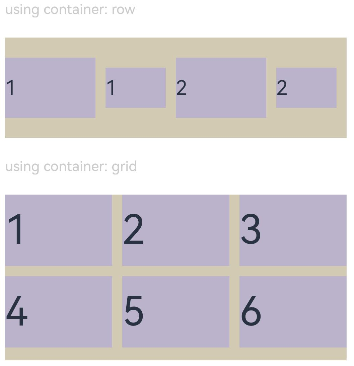
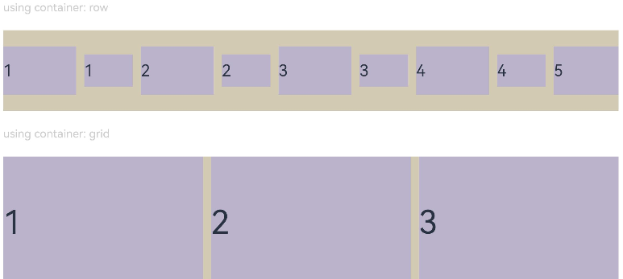
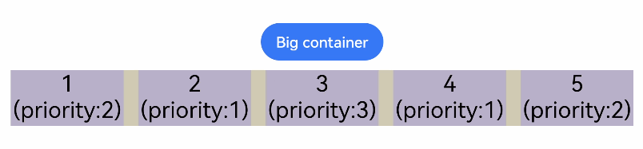

# Layout Constraints
<!--Kit: ArkUI-->
<!--Subsystem: ArkUI-->
<!--Owner: @camlostshi-->
<!--Designer: @fenglinbailu-->
<!--Tester: @liuli0427-->
<!--Adviser: @Brilliantry_Rui-->
<!-- md-trans-meta sourceCommit=a03d32af9e2912ff154772319bc8120aa7fff612 translatedAt=2026-09-01T12:42:31.642Z -->

Constrains the display effect of components through their aspect ratio and display priority. It supports two core features: fixed aspect ratio setting and responsive priority control, which can resolve issues such as component distortion and layout disorder, improving the display quality of the UI.

- **aspectRatio**: applies to components that need to maintain a fixed aspect ratio, such as image display, video players, and card layouts. It resolves the issue of components needing to maintain a specific aspect ratio on different devices and screen orientations, preventing images or videos from being stretched or distorted.
- **displayPriority**: applies to responsive layout scenarios. When the parent container has insufficient space, low-priority components can be automatically hidden based on their priority. It resolves the issue of controlling component display priority when there is insufficient space in responsive layouts, preventing content overflow or layout disorder.

>  **NOTE**
>
>  The initial APIs of this module are supported since API version 7. Updates will be marked with a superscript to indicate their earliest API version.

## aspectRatio

aspectRatio(value: number): T

Sets the aspect ratio of the component, which can be obtained using the following formula: width/height.
- If only **width** and **aspectRatio** are set, the height is calculated using the following formula: width/aspectRatio.
- If only **height** and **aspectRatio** are set, the width is calculated using the following formula: height x aspectRatio.
- When width, height, and aspectRatio are set at the same time, height is recalculated as width/aspectRatio, and the explicitly set height value does not take effect.

Applies to components that need to maintain a fixed aspect ratio, such as image display, video players, and maintaining proportions in responsive layouts.

After the **aspectRatio** attribute is set, the component's width and height are limited by the size of the parent component's content area. The maxWidth/maxHeight of [constraintSize](ts-universal-attributes-size.md#constraintsize) takes precedence over aspectRatio. When the maxWidth/maxHeight constraints set by constraintSize conflict with the aspectRatio calculation result, the component follows the maxWidth/maxHeight constraints of constraintSize first, in which case aspectRatio may not take effect.

**Widget capability**: This API can be used in ArkTS widgets since API version 9.

**Atomic service API**: This API can be used in atomic services since API version 11.

**System capability**: SystemCapability.ArkUI.ArkUI.Full

**Parameters**

| Name| Type  | Mandatory| Description                                                        |
| ------ | ------ | ---- | ------------------------------------------------------------ |
| value  | number | Yes   | Specifies the aspect ratio of the current component. The value range is (0, +∞).<br>In API version 9 and earlier, the default value is 1.0.<br>Since API version 10, there is no default value.<br>**Note:**<br>Use it when the aspect ratio of the component needs to be maintained (for example, when displaying images, videos, and other content that needs to maintain their ratio).<br>This attribute does not take effect when it is set to an invalid value (less than or equal to 0). Since API version 10, this attribute does not take effect when no value is set.<br>After this attribute is set, the width and height of the component are limited by the size of the parent component's content area, and the maxWidth/maxHeight of constraintSize take precedence over aspectRatio.<br>For example, when Row has only the width set and no child components, if aspectRatio is not set or is a negative value, the height is 0. |

**Return value**

| Type| Description|
| --- | --- |
|  T  | Current component instance, which supports chained calls. |

## displayPriority

displayPriority(value: number): T

Sets the display priority of the current component in a Row/Column/Flex (single-line) container. The priority is determined by the integer part of the value, and a larger integer part indicates a higher priority.

Applies to scenarios where child components are dynamically shown or hidden based on the parent container space in responsive layouts. For example, important content is displayed first and secondary content is hidden on different screen sizes.

**Widget capability**: This API can be used in ArkTS widgets since API version 9.

**Atomic service API**: This API can be used in atomic services since API version 11.

**System capability**: SystemCapability.ArkUI.ArkUI.Full

**Parameters**

| Name| Type  | Mandatory| Description                                                        |
| ------ | ------ | ---- | ------------------------------------------------------------ |
| value  | number | Yes   | Sets the display priority of the current component in the layout container. The value range is [0, +∞).<br>Default value: 1<br>**Note:**<br>Takes effect only in the [Row](./ts-container-row.md)/[Column](./ts-container-column.md)/[Flex (single line)](./ts-container-flex.md) container components.<br>Used when the container space is limited and the display order of components needs to be controlled or low-priority components need to be hidden (for example, dynamically displaying content based on the available space in a Flex container). It is recommended to set the priority based on the importance of the component, with a larger value (such as 2-10) for key components and a smaller value (such as 1) for secondary components.<br>The digits after the decimal point do not affect the priority. All values not greater than 1 have the same priority. When the value is greater than 1, the larger the integer part of displayPriority, the higher the priority; values within the same integer range have the same priority. For example, 0.5 and 1.0 have the same priority (both are not greater than 1); 1.5 and 1.9 have the same priority (both have an integer part of 1); 2.0 and 2.9 have the same priority (both have an integer part of 2), and their priority is higher than that of 1.x.<br>If the parent container has insufficient space, child components with lower priority are hidden. If child components at a certain priority level are hidden, all child components with lower priority are also hidden. |

**Return value**

| Type| Description|
| --- | --- |
|  T | Returns the current component instance, supporting chain calls. |

## Example

### Example 1: Setting the Component Aspect Ratio

This example illustrates how to use the **aspectRatio** attribute to set different aspect ratios for a component.

```ts
// xxx.ets
@Entry
@Component
struct AspectRatioExample {
  private children: string[] = ['1', '2', '3', '4', '5', '6']

  build() {
    Column({ space: 20 }) {
      Text('using container: row').fontSize(14).fontColor(0xCCCCCC).width('100%')
      Row({ space: 10 }) {
        ForEach(this.children, (item:string) => {
          // Component width = Component height x 1.5 = 90
          Text(item)
            .backgroundColor(0xbbb2cb)
            .fontSize(20)
            .aspectRatio(1.5)
            .height(60)
          // Component height = Component width/1.5 = 60/1.5 = 40
          Text(item)
            .backgroundColor(0xbbb2cb)
            .fontSize(20)
            .aspectRatio(1.5)
            .width(60)
        }, (item:string) => item)
      }
      .size({ width: "100%", height: 100 })
      .backgroundColor(0xd2cab3)
      .clip(true)

      // Grid child component width/height = 3/2
      Text('using container: grid').fontSize(14).fontColor(0xCCCCCC).width('100%')
      Grid() {
        ForEach(this.children, (item:string) => {
          GridItem() {
            Text(item)
              .backgroundColor(0xbbb2cb)
              .fontSize(40)
              .width('100%')
              .aspectRatio(1.5)
          }
        }, (item:string) => item)
      }
      .columnsTemplate('1fr 1fr 1fr')
      .columnsGap(10)
      .rowsGap(10)
      .size({ width: "100%", height: 165 })
      .backgroundColor(0xd2cab3)
    }.padding(10)
  }
}
```

**Figure 1** Portrait display<br>


**Figure 2** Landscape display<br>


### Example 2: Setting the Component Display Priority

This example shows how to use **displayPriority** to set the display priority for child components.

```ts
class ContainerInfo {
  label: string = '';
  size: string = '';
}

class ChildInfo {
  text: string = '';
  priority: number = 0;
}

@Entry
@Component
struct DisplayPriorityExample {
  // Display the container size.
  private container: ContainerInfo[] = [
    { label: 'Big container', size: '90%' },
    { label: 'Middle container', size: '50%' },
    { label: 'Small container', size: '30%' }
  ]
  private children: ChildInfo[] = [
    { text: '1\n(priority:2)', priority: 2 },
    { text: '2\n(priority:1)', priority: 1 },
    { text: '3\n(priority:3)', priority: 3 },
    { text: '4\n(priority:1)', priority: 1 },
    { text: '5\n(priority:2)', priority: 2 }
  ]
  @State currentIndex: number = 0;

  build() {
    Column({ space: 10 }) {
      // Switch the size of the parent container.
      Button(this.container[this.currentIndex].label).backgroundColor(0x317aff)
        .onClick(() => {
          this.currentIndex = (this.currentIndex + 1) % this.container.length;
        })
      // Set the width for the parent flex container through variables.
      Flex({ justifyContent: FlexAlign.SpaceBetween }) {
        ForEach(this.children, (item:ChildInfo) => {
          // Bind the display priority to the child component through displayPriority.
          Text(item.text)
            .width(120)
            .height(60)
            .fontSize(24)
            .textAlign(TextAlign.Center)
            .backgroundColor(0xbbb2cb)
            .displayPriority(item.priority)
        }, (item:ChildInfo) => item.text)
      }
      .width(this.container[this.currentIndex].size)
      .backgroundColor(0xd2cab3)
    }.width("100%").margin({ top: 50 })
  }
}
```

Landscape display in containers of different sizes


