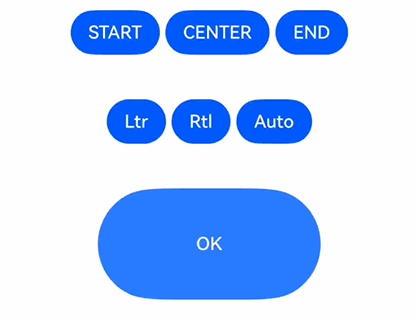
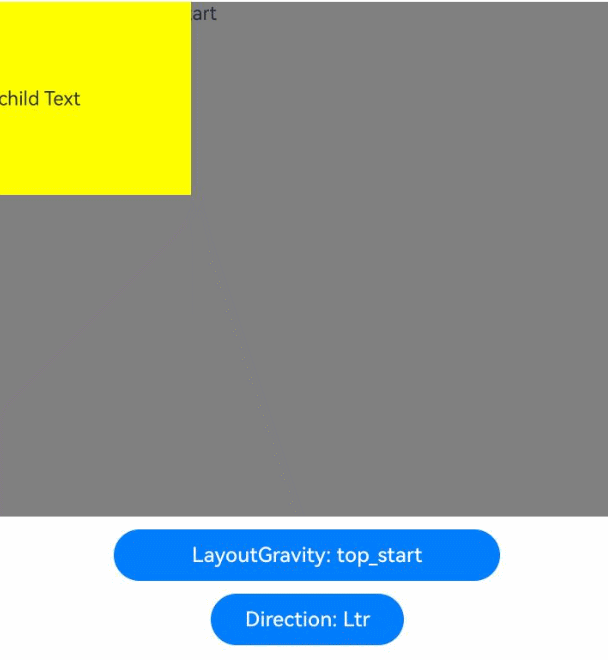

# Location
<!--Kit: ArkUI-->
<!--Subsystem: ArkUI-->
<!--Owner: @zju_ljz-->
<!--Designer: @lanshouren-->
<!--Tester: @liuli0427-->
<!--Adviser: @HelloCrease-->

The location attributes set the alignment mode, layout direction, and display position of a component.

>  **NOTE**
>
>  The initial APIs of this module are supported since API version 7. Updates will be marked with a superscript to indicate their earliest API version.

## align

align(value: Alignment): T

Sets the alignment mode of child elements in the drawing area of a container element. The [attributeModifier](ts-universal-attributes-attribute-modifier.md#attributemodifier) can be dynamically set.

**Widget capability**: This API can be used in ArkTS widgets since API version 9.

**Atomic service API**: This API can be used in atomic services since API version 11.

**System capability**: SystemCapability.ArkUI.ArkUI.Full

**Parameters**

| Name| Type                                       | Mandatory| Description                                                        |
| ------ | ------------------------------------------- | ---- | ------------------------------------------------------------ |
| value  | [Alignment](ts-appendix-enums.md#alignment) | Yes  | Sets the alignment mode of the component content in the drawing area.<br>This property takes effect only in Stack, FolderStack, Shape, Button, Marquee, StepperItem, Text, TextArea, TextInput, [RichEditor](ts-basic-components-richeditor.md), Hyperlink, SymbolGlyph, ListItem, GridItem, Scroll, FlowItem, ImageAnimator, LoadingProgress, PatternLock, Progress, QRCode, TextClock, TextTimer, MenuItem, Toggle, Checkbox and NodeContainer. For the alignment of text-related components Marquee, Text, TextArea, TextInput, RichEditor, and Hyperlink, see [textAlign](ts-basic-components-text.md#textalign).<br>If the component does not support the **textAlign** attribute, horizontal alignment cannot be set for text.<br>Default value: **Alignment.Center**<br>**NOTE**<br>This attribute does not support the mirroring functionality.<br>In the **Stack** component, this attribute has the same effect as **alignContent**, which means that it sets the alignment mode of child components in the container.|

**Return value**

| Type| Description|
| --- | --- |
|  T | Current component.|

## align<sup>20+</sup>

align(alignment: Alignment | LocalizedAlignment): T

Sets the alignment mode of child elements in the drawing area of the container element. The mirroring capability is supported. The [attributeModifier](ts-universal-attributes-attribute-modifier.md#attributemodifier) dynamic attribute setting method is supported.

**Widget capability**: This API can be used in ArkTS widgets since API version 20.

**Atomic service API**: This API can be used in atomic services since API version 20.

**System capability**: SystemCapability.ArkUI.ArkUI.Full

**Parameters**

| Name| Type                                       | Mandatory| Description                                                        |
| ------ | ------------------------------------------- | ---- | ------------------------------------------------------------ |
| alignment  | [Alignment](ts-appendix-enums.md#alignment) \| [LocalizedAlignment](ts-appendix-enums.md#localizedalignment20) | Yes  | Sets the alignment mode of subelements in the container element drawing area. The mirroring capability is added.<br>LocalizedAlignment is valid only in [Shape](ts-drawing-components-shape.md), [Button](ts-basic-components-button.md), [GridItem](ts-container-griditem.md), [FlowItem](ts-container-flowitem.md), [ImageAnimator](ts-basic-components-imageanimator.md), [LoadingProgress](ts-basic-components-loadingprogress.md), [PatternLock](ts-basic-components-patternlock.md), [Progress](ts-basic-components-progress.md), [QRCode](ts-basic-components-qrcode.md), [TextClock](ts-basic-components-textclock.md), [TextTimer](ts-basic-components-texttimer.md), [StepperItem](ts-basic-components-stepperitem.md), [MenuItem](ts-basic-components-menuitem.md), [Toggle](ts-basic-components-toggle.md), [Checkbox](ts-basic-components-checkbox.md) and [ListItem](ts-container-listitem.md).<br>Among them, the alignment mode of [ListItem](ts-container-listitem.md) is the same as that of Alignment. The mirroring switch takes effect for other components. Other components where LocalizedAlignment does not take effect are displayed based on the default effect.<br>Default value: Alignment.Center and LocalizedAlignment.CENTER<br>**NOTE**<br>The Alignment type does not support the mirroring capability. The LocalizedAlignment type supports the mirroring capability. You can select an enumerated value from LocalizedAlignment to implement mirroring switching based on the direction or system language direction. The priority of direction is higher than that of the system language direction. When direction is set to a value other than auto, the mirroring of LocalizedAlignment is arranged based on direction. When direction is set to auto or not set, the mirroring of LocalizedAlignment is arranged based on the system language direction.<br>If the input parameter of the align attribute is undefined or null, the default value is used. The effect is that the content is displayed in the middle.|

**Return value**

| Type| Description|
| --- | --- |
|  T | Current component.|

## direction

direction(value: Direction): T

Sets the layout in the main axis direction of the container element. The [attributeModifier](ts-universal-attributes-attribute-modifier.md#attributemodifier) can be dynamically set.

**Widget capability**: This API can be used in ArkTS widgets since API version 9.

**Atomic service API**: This API can be used in atomic services since API version 11.

**System capability**: SystemCapability.ArkUI.ArkUI.Full

**Parameters**

| Name| Type                                       | Mandatory| Description                                               |
| ------ | ------------------------------------------- | ---- | --------------------------------------------------- |
| value  | [Direction](ts-appendix-enums.md#direction) | Yes  | How elements are laid out along the main axis of the container.<br>If this parameter is set to **auto**, the layout is subject to the system language.<br>The attribute does not take effect in the **Column** component.<br>Default value: **Direction.Auto**<br>If direction is set to undefined or null, the default value is used.|

**Return value**

| Type| Description|
| --- | --- |
|  T | Current component.|

## position

position(value: Position | Edges | LocalizedEdges): T

Sets the position of a child component relative to the content area of the parent component. The size of the content area of the parent component is the size of the parent component minus the border and padding. The safeAreaPadding parameter provides the size of the content area that can be laid out for the child component. position takes effect after the component size is measured. You can dynamically set the [attributeModifier](ts-universal-attributes-attribute-modifier.md#attributemodifier) attribute.

**Widget capability**: This API can be used in ArkTS widgets since API version 9.

**Atomic service API**: This API can be used in atomic services since API version 11.

**System capability**: SystemCapability.ArkUI.ArkUI.Full

**Parameters**

| Name| Type                                                        | Mandatory| Description                                                        |
| ------ | ------------------------------------------------------------ | ---- | ------------------------------------------------------------ |
| value  | [Position](ts-types.md#position) \| [Edges<sup>12+</sup>](ts-types.md#edges12) \| [LocalizedEdges<sup>12+</sup>](ts-types.md#localizededges12) | Yes  | Absolute positioning, which determines the position of the child component relative to the content area of the parent component. If the parent container is **Row**, **Column**, or **Flex**, the child component for which **position** is set does not take up space in the container.<br>Position is based on the upper left corner of the content area of the parent component. Edges is based on the four sides of the content area of the parent component. top, left, right, and bottom are the margins between each side of the component and the corresponding side of the content area of the parent component. The margins determine the position of the component relative to the content area of the parent component. LocalizedEdges is based on the four sides of the content area of the parent component and supports the mirror mode.<br>The **position** attribute is applicable to scenarios where the component's position in the parent container is fixed, for example, where it is pinned to top or floating on the UI.<br>The attribute is not available for a layout container whose width and height are zero.<br>When the parent container is [RelativeContainer](ts-container-relativecontainer.md) and the alignRules attribute is set for the child component, the position attribute of the child component does not take effect.|

**Return value**

| Type| Description|
| --- | --- |
|  T | Current component.|

## markAnchor

markAnchor(value: Position | LocalizedPosition): T

Sets the anchor point of an element during positioning. You can call this method to set attributes dynamically in [attributeModifier](ts-universal-attributes-attribute-modifier.md#attributemodifier).

**Widget capability**: This API can be used in ArkTS widgets since API version 9.

**Atomic service API**: This API can be used in atomic services since API version 11.

**System capability**: SystemCapability.ArkUI.ArkUI.Full

**Parameters**

| Name| Type                            | Mandatory| Description                                                        |
| ------ | -------------------------------- | ---- | ------------------------------------------------------------ |
| value  | [Position](ts-types.md#position) \| [LocalizedPosition<sup>12+</sup>](ts-types.md#localizedposition12) | Yes  | Anchor for locating the component, which is used to move the component further away from the position specified by **position** or **offset**.<br>**.position({x: value1, y: value2}).markAnchor({x: value3, y: value4})** has the same effect as **.position({x: value1 - value3, y: value2 - value4})**. The same applies to **offset**.<br>When **markAnchor** is used alone, **markAnchor ({x: value1, y: value2})** has the same effect as **.offset ({x: -value1, y: -value2})**.<br>The default value varies by API version.<br>API version 9 and earlier:<br>{<br>x: 0,<br>y: 0<br>}<br>API version 10: none|

**Return value**

| Type| Description|
| --- | --- |
|  T | Current component.|

## offset

offset(value: Position | Edges | LocalizedEdges): T

Sets the offset of the component relative to its original position. When this method is used together with position, position takes effect and offset does not take effect. You can call this method to set attributes dynamically in [attributeModifier](ts-universal-attributes-attribute-modifier.md#attributemodifier).

**Widget capability**: This API can be used in ArkTS widgets since API version 9.

**Atomic service API**: This API can be used in atomic services since API version 11.

**System capability**: SystemCapability.ArkUI.ArkUI.Full

**Parameters**

| Name| Type                                                        | Mandatory| Description                                                        |
| ------ | ------------------------------------------------------------ | ---- | ------------------------------------------------------------ |
| value  | [Position](ts-types.md#position) \| [Edges<sup>12+</sup>](ts-types.md#edges12)  \| [LocalizedEdges<sup>12+</sup>](ts-types.md#localizededges12) | Yes  | Offset of the component relative to its original position. The **offset** attribute does not affect the layout of the parent container. It adjusts the component position only during drawing.<br>If of the Position type, this parameter sets the offset relative to the upper left corner of the component. If of the Edges type, this parameter sets the offset relative to the four edges of the component. **{x: x, y: y}** has the same effect as **{left: x, top: y}** and **{right: -x, bottom: -y}**. The LocalizedEdges type supports the mirror mode: **start** is equivalent to **x** with left-to-right scripts and **-x** with right-to-left scripts.<br>The default value varies by API version.<br>API version 9 and earlier:<br>{<br>x: 0,<br>y: 0<br>}<br>Default unit: vp<br>API version 10: none|

**Return value**

| Type| Description|
| --- | --- |
|  T | Current component.|

## alignRules<sup>9+</sup>

alignRules(value: AlignRuleOption): T

Alignment rule of a child component in a relative container. This parameter takes effect only when the parent container is [RelativeContainer](ts-container-relativecontainer.md). The [attributeModifier](ts-universal-attributes-attribute-modifier.md#attributemodifier) can be dynamically set.

**Widget capability**: This API can be used in ArkTS widgets since API version 9.

**Atomic service API**: This API can be used in atomic services since API version 11.

**System capability**: SystemCapability.ArkUI.ArkUI.Full

**Parameters**

| Name| Type                                       | Mandatory| Description                    |
| ------ | ------------------------------------------- | ---- | ------------------------ |
| value  | [AlignRuleOption](#alignruleoption9)| Yes  | Alignment rules in the relative container.|

**Return value**

| Type| Description|
| --- | --- |
|  T | Current component.|

## alignRules<sup>12+</sup>

alignRules(alignRule: LocalizedAlignRuleOptions): T

Sets the alignment rules in the relative container. This API is valid only when the container is [RelativeContainer](ts-container-relativecontainer.md). This method uses start and end in the horizontal direction to replace left and right of the original method, respectively, so that the component can be mirrored in RTL mode. You are advised to use this method to set the alignment rule of a child component in a relative container. The [attributeModifier](ts-universal-attributes-attribute-modifier.md#attributemodifier) can be dynamically set.

**Widget capability**: This API can be used in ArkTS widgets since API version 12.

**Atomic service API**: This API can be used in atomic services since API version 12.

**System capability**: SystemCapability.ArkUI.ArkUI.Full

**Parameters**

| Name| Type                                       | Mandatory| Description                    |
| ------ | ------------------------------------------- | ---- | ------------------------ |
| alignRule  | [LocalizedAlignRuleOptions](#localizedalignruleoptions12) | Yes  | Alignment rules in the relative container.|

**Return value**

| Type| Description|
| --- | --- |
|  T | Current component.|

## layoutGravity<sup>20+</sup>

layoutGravity(alignment: LocalizedAlignment): T

Sets the alignment rule of a child component in a stack container. This method is valid only when the parent container is Stack. When this attribute is used together with the align attribute, layoutGravity has a higher priority. The [attributeModifier](ts-universal-attributes-attribute-modifier.md#attributemodifier) can be dynamically set.

**Widget capability**: This API can be used in ArkTS widgets since API version 20.

**Atomic service API**: This API can be used in atomic services since API version 20.

**System capability**: SystemCapability.ArkUI.ArkUI.Full

**Parameters**

| Name| Type                                       | Mandatory| Description                    |
| ------ | ------------------------------------------- | ---- | ------------------------ |
| alignment  | [LocalizedAlignment](ts-appendix-enums.md#localizedalignment20) | Yes  | Alignment rule of the child components in the Stack container.<br>Default value: LocalizedAlignment.CENTER. Note: If an invalid value is passed, the default value is used.|

**Return value**

| Type| Description|
| -------- | -------- |
| T | Current component.|

## AlignRuleOption<sup>9+</sup>

**Widget capability**: This API can be used in ArkTS widgets since API version 9.

**System capability**: SystemCapability.ArkUI.ArkUI.Full

| Name| Type| Read-Only| Optional| Description|
| -------- | -------- | -------- | -------- | -------- |
| left   | { anchor: string, align: [HorizontalAlign](ts-appendix-enums.md#horizontalalign) } |No|Yes| Left alignment.<br>- **anchor**: ID of the component that functions as the anchor point.<br>- **align**: alignment mode relative to the anchor component.<br>**Atomic service API**: This API can be used in atomic services since API version 11.|
| right  | { anchor: string, align: [HorizontalAlign](ts-appendix-enums.md#horizontalalign) } |No|Yes| Right alignment.<br>- **anchor**: ID of the component that functions as the anchor point.<br>- **align**: alignment mode relative to the anchor component.<br>**Atomic service API**: This API can be used in atomic services since API version 11.|
| middle | { anchor: string, align: [HorizontalAlign](ts-appendix-enums.md#horizontalalign) } |No|Yes| Horizontal center alignment.<br>- **anchor**: ID of the component that functions as the anchor point.<br>- **align**: alignment mode relative to the anchor component.<br>**Atomic service API**: This API can be used in atomic services since API version 11.|
| top    | { anchor: string, align: [VerticalAlign](ts-appendix-enums.md#verticalalign) } |No|Yes| Top alignment.<br>- **anchor**: ID of the component that functions as the anchor point.<br>- **align**: alignment mode relative to the anchor component.<br>**Atomic service API**: This API can be used in atomic services since API version 11.|
| bottom | { anchor: string, align: [VerticalAlign](ts-appendix-enums.md#verticalalign) } |No|Yes| Bottom alignment.<br>- **anchor**: ID of the component that functions as the anchor point.<br>- **align**: alignment mode relative to the anchor component.<br>**Atomic service API**: This API can be used in atomic services since API version 11.|
| center | { anchor: string, align: [VerticalAlign](ts-appendix-enums.md#verticalalign) } |No|Yes| Vertical center alignment.<br>- **anchor**: ID of the component that functions as the anchor point.<br>- **align**: alignment mode relative to the anchor component.<br>**Atomic service API**: This API can be used in atomic services since API version 11.                                |
| bias<sup>11+</sup>   | [Bias](./ts-types.md#bias)|No|Yes| Offset of the component under the anchor constraints. The value is the ratio of the distance to the left/upper anchor to the total distance between anchors.<br>**Widget capability**: This API can be used in ArkTS widgets since API version 11.<br>**Atomic service API**: This API can be used in atomic services since API version 12.|

## LocalizedAlignRuleOptions<sup>12+</sup>

**Atomic service API**: This API can be used in atomic services since API version 12.

**System capability**: SystemCapability.ArkUI.ArkUI.Full

| Name| Type| Read-Only| Optional| Description|
| -------- | -------- | -------- | -------- | -------- |
| start  | [LocalizedHorizontalAlignParam](#localizedhorizontalalignparam12) |No|Yes| Left alignment with left-to-right scripts and right alignment with right-to-left scripts in the horizontal direction.|
| end    | [LocalizedHorizontalAlignParam](#localizedhorizontalalignparam12) |No|Yes| Right alignment with left-to-right scripts and left alignment with right-to-left scripts in the horizontal direction.|
| middle | [LocalizedHorizontalAlignParam](#localizedhorizontalalignparam12) |No|Yes| Center alignment in the horizontal direction.|
| top    | [LocalizedVerticalAlignParam](#localizedverticalalignparam12) |No|Yes| Top alignment in the vertical direction.|
| bottom | [LocalizedVerticalAlignParam](#localizedverticalalignparam12) |No|Yes| Bottom alignment in the vertical direction.|
| center | [LocalizedVerticalAlignParam](#localizedverticalalignparam12) |No|Yes| Center alignment in the vertical direction.     |
| bias   | [Bias](./ts-types.md#bias) |No|Yes| Offset of the component under the anchor constraints. The value is the ratio of the distance to the left/upper anchor to the total distance between anchors.|

## LocalizedHorizontalAlignParam<sup>12+</sup>

**Atomic service API**: This API can be used in atomic services since API version 12.

**System capability**: SystemCapability.ArkUI.ArkUI.Full

| Name| Type| Read-Only| Optional| Description|
| -------- | -------- | -------- | -------- | -------- |
| anchor  | string  |No|No| ID of the component that serves as the anchor.|
| align   | [HorizontalAlign](ts-appendix-enums.md#horizontalalign)  |No|No| Horizontal alignment mode relative to the anchor component.|

## LocalizedVerticalAlignParam<sup>12+</sup>

**Atomic service API**: This API can be used in atomic services since API version 12.

**System capability**: SystemCapability.ArkUI.ArkUI.Full

| Name| Type| Read-Only| Optional| Description|
| -------- | -------- | -------- | -------- | -------- |
| anchor  | string |No|No| ID of the component that serves as the anchor.|
| align   | [VerticalAlign](ts-appendix-enums.md#verticalalign)  |No|No| Vertical alignment mode relative to the anchor component.|

## chainMode<sup>12+</sup>

chainMode(direction: Axis, style: ChainStyle): T

Sets the parameters of the chain in which the component is the head. This parameter has effect only when the parent container is [RelativeContainer](ts-container-relativecontainer.md). The chain head is the first component in the chain that satisfies the chain formation rules. In a horizontal layout, it starts from the left (or from the right in a mirrored language layout). In a vertical layout, it starts from the top.
For details, see [RelativeContainer Example 7](ts-container-relativecontainer.md#example-7-creating-chains).

**Atomic service API**: This API can be used in atomic services since API version 12.

**System capability**: SystemCapability.ArkUI.ArkUI.Full

**Parameters**

| Name| Type                                       | Mandatory| Description                    |
| ------ | ------------------------------------------- | ---- | ------------------------ |
| direction  | [Axis](ts-appendix-enums.md#axis) | Yes  | Direction of the chain.|
| style  | [ChainStyle](#chainstyle12) | Yes  | Style of the chain.|

**Return value**

| Type| Description|
| --- | --- |
|  T | Current component.|

## ChainStyle<sup>12+</sup>

Defines the chain style. The [attributeModifier](ts-universal-attributes-attribute-modifier.md#attributemodifier) can be dynamically set.

**Atomic service API**: This API can be used in atomic services since API version 12.

**System capability**: SystemCapability.ArkUI.ArkUI.Full

| Name         | Description                                                        |
| ------------- | ------------------------------------------------------------ |
| SPREAD        | Child components are evenly distributed among constraint anchors. For details, see [RelativeContainer Example 7](ts-container-relativecontainer.md#example-7-creating-chains).|
| SPREAD_INSIDE | All child components except the first and last ones are evenly distributed among constraint anchors. For details, see [RelativeContainer Example 7](ts-container-relativecontainer.md#example-7-creating-chains).|
| PACKED        | There is no gap between child components in the chain. For details, see [RelativeContainer Example 7](ts-container-relativecontainer.md#example-7-creating-chains).|

>  **NOTE**
>
>  When a chain is used, RelativeContainer defines a size calculation sequence for the components that depend on each other in the chain. After the size calculation is complete, the position of ChainStyle is determined. Therefore, when the SPREAD or PACKED style is used, non-chain component A that uses the chain head component as the anchor for layout and other nodes in the chain have the same layout priority. If the dictionary order of the ID of component A is earlier, alignRules of component A takes effect before ChainStyle of the chain.

## chainWeight<sup>14+</sup>

chainWeight(chainWeight: ChainWeightOptions): T

Sets the weight of the component in a chain, which is used to re-lay out components that form the chain. This API has effect only when the parent container is [RelativeContainer](ts-container-relativecontainer.md).

**System capability**: SystemCapability.ArkUI.ArkUI.Full

**Atomic service API**: This API can be used in atomic services since API version 14.

**Parameters**

| Name| Type                                       | Mandatory| Description                    |
| ------ | ------------------------------------------- | ---- | ------------------------ |
| chainWeight  | [ChainWeightOptions](ts-types.md#chainweightoptions14) | Yes  | Layout weight of the component in the horizontal or vertical direction. The component with **chainWeight** set will have its size in the horizontal or vertical direction allocated according to the set weights. The allocation ignores the component's intrinsic size and enables the component to adaptively fill the remaining space.|

**Return value**

| Type| Description|
| --- | --- |
|  T | Current component.|

## Example

### Example 1: Setting the Alignment Mode and Main Axis Layout

This example demonstrates setting the alignment mode of content within a component and the layout of child components along the main axis of the parent container.

```ts
// xxx.ets
@Entry
@Component
struct PositionExample1 {
  build() {
    Column() {
      Column({ space: 10 }) {
        // When the component content is within the area specified by the component width and height, set the alignment mode of the content in the component.
        Text('align').fontSize(9).fontColor(0xCCCCCC).width('90%')
        Stack() {
          Text('First show in bottom end').height('65%').backgroundColor(0xD2B48C)
          Text('Second show in bottom end').backgroundColor(0xF5DEB3).opacity(0.9)
        }.width('90%').height(50).margin({ top: 5 }).backgroundColor(0xFFE4C4)
        .align(Alignment.BottomEnd)
        Stack() {
          Text('top start')
        }.width('90%').height(50).margin({ top: 5 }).backgroundColor(0xFFE4C4)
        .align(Alignment.TopStart)

        // To arrange the child components from left to right, set direction of the parent container to Direction.Ltr.
        Text('direction').fontSize(9).fontColor(0xCCCCCC).width('90%')
        Row() {
          Text('1').height(50).width('25%').fontSize(16).backgroundColor(0xF5DEB3)
          Text('2').height(50).width('25%').fontSize(16).backgroundColor(0xD2B48C)
          Text('3').height(50).width('25%').fontSize(16).backgroundColor(0xF5DEB3)
          Text('4').height(50).width('25%').fontSize(16).backgroundColor(0xD2B48C)
        }
        .width('90%')
        .direction(Direction.Ltr)
        // To arrange the child components from right to left, set direction of the parent container to Direction.Rtl.
        Row() {
          Text('1').height(50).width('25%').fontSize(16).backgroundColor(0xF5DEB3).textAlign(TextAlign.End)
          Text('2').height(50).width('25%').fontSize(16).backgroundColor(0xD2B48C).textAlign(TextAlign.End)
          Text('3').height(50).width('25%').fontSize(16).backgroundColor(0xF5DEB3).textAlign(TextAlign.End)
          Text('4').height(50).width('25%').fontSize(16).backgroundColor(0xD2B48C).textAlign(TextAlign.End)
        }
        .width('90%')
        .direction(Direction.Rtl)
      }
    }
    .width('100%').margin({ top: 5 })
  }
}
```


### Example 2: Setting the Position Offset

This example demonstrates position offsets based on the parent component, relative positioning, and anchors.

```ts
// xxx.ets
@Entry
@Component
struct PositionExample2 {
  build() {
    Column({ space: 20 }) {
      // Set the offset of the component's upper left corner relative to the parent component's upper left corner.
      Text('position').fontSize(12).fontColor(0xCCCCCC).width('90%')
      Row() {
        Text('1').size({ width: '30%', height: '50' }).backgroundColor(0xdeb887).border({ width: 1 }).fontSize(16)
          .textAlign(TextAlign.Center)
        Text('2 position(30, 10)')
          .size({ width: '60%', height: '30' })
          .backgroundColor(0xbbb2cb)
          .border({ width: 1 })
          .fontSize(16)
          .align(Alignment.Start)
          .position({ x: 30, y: 10 })
        Text('3').size({ width: '45%', height: '50' }).backgroundColor(0xdeb887).border({ width: 1 }).fontSize(16)
          .textAlign(TextAlign.Center)
        Text('4 position(50%, 70%)')
          .size({ width: '50%', height: '50' })
          .backgroundColor(0xbbb2cb)
          .border({ width: 1 })
          .fontSize(16)
          .position({ x: '50%', y: '70%' })
      }.width('90%').height(100).border({ width: 1, style: BorderStyle.Dashed })

      // Offset relative to the start point. x indicates the horizontal distance between the end point and the start point. If the value of x is greater than 0, the component is offset to the left. Otherwise, the component is offset to the right.
      // y indicates the vertical distance between the end point and the start point. If the value of y is greater than 0, the component is offset to the top. Otherwise, the component is offset to the bottom.
      Text('markAnchor').fontSize(12).fontColor(0xCCCCCC).width('90%')
      Stack({ alignContent: Alignment.TopStart }) {
        Row()
          .size({ width: '100', height: '100' })
          .backgroundColor(0xdeb887)
        Text('text')
          .fontSize('30px')
          .textAlign(TextAlign.Center)
          .size({ width: 25, height: 25 })
          .backgroundColor(Color.Green)
          .markAnchor({ x: 25, y: 25 })
        Text('text')
          .fontSize('30px')
          .textAlign(TextAlign.Center)
          .size({ width: 25, height: 25 })
          .backgroundColor(Color.Green)
          .markAnchor({ x: -100, y: -25 })
        Text('text')
          .fontSize('30px')
          .textAlign(TextAlign.Center)
          .size({ width: 25, height: 25 })
          .backgroundColor(Color.Green)
          .markAnchor({ x: 25, y: -25 })
      }.margin({ top: 25 }).border({ width: 1, style: BorderStyle.Dashed })

      // Offset of the component relative to itself. If the value of x is greater than 0, the component is offset to the right. Otherwise, the component is offset to the left. If the value of y is greater than 0, the component is offset to the bottom. Otherwise, the component is offset to the top.
      Text('offset').fontSize(12).fontColor(0xCCCCCC).width('90%')
      Row() {
        Text('1').size({ width: '15%', height: '50' }).backgroundColor(0xdeb887).border({ width: 1 }).fontSize(16)
          .textAlign(TextAlign.Center)
        Text('2  offset(15, 30)')
          .size({ width: 120, height: '50' })
          .backgroundColor(0xbbb2cb)
          .border({ width: 1 })
          .fontSize(16)
          .align(Alignment.Start)
          .offset({ x: 15, y: 30 })
        Text('3').size({ width: '15%', height: '50' }).backgroundColor(0xdeb887).border({ width: 1 }).fontSize(16)
          .textAlign(TextAlign.Center)
        Text('4 offset(-5%, 20%)')
          .size({ width: 100, height: '50' })
          .backgroundColor(0xbbb2cb)
          .border({ width: 1 })
          .fontSize(16)
          .offset({ x: '-5%', y: '20%' })
      }.width('90%').height(100).border({ width: 1, style: BorderStyle.Dashed })
    }
    .width('100%').margin({ top: 25 })
  }
}
```


### Example 3: Setting the Absolute Positioning and Relative Offset

This example demonstrates how to use **position** to set absolute positioning, which determines the position of child components relative to the parent component. It also shows how to use **offset** to set relative offsets for moving components from their original layout positions.

```ts
// xxx.ets
@Entry
@Component
struct Example3 {
  build() {
    Column({ space: 20 }){
      Text('position use Edges').fontSize(12).fontColor(0xCCCCCC).width('90%')
      Row() {
        Text('bottom:0, right:0').size({ width: '30%', height: '50' }).backgroundColor(0xdeb887).border({ width: 1 }).fontSize(16)
          .textAlign(TextAlign.Center).position({bottom: 0, right: 0})
        Text('top:0, left:0').size({ width: '30%', height: '50' }).backgroundColor(0xdeb887).border({ width: 1 }).fontSize(16)
          .textAlign(TextAlign.Center).position({top: 0, left: 0})
        Text('top:10%, left:50%').size({ width: '50%', height: '30' }).backgroundColor(0xbbb2cb).border({ width: 1 }).fontSize(16)
          .textAlign(TextAlign.Center).position({ top: '10%', left: '50%' })
        Text('bottom:0, left:30').size({ width: '50%', height: '30' }).backgroundColor(0xbbb2cb).border({ width: 1 }).fontSize(16)
          .textAlign(TextAlign.Center).position({ bottom: 0, left: 30 })
      }.width('90%').height(100).border({ width: 1, style: BorderStyle.Dashed })


      Text('offset use Edges').fontSize(12).fontColor(0xCCCCCC).width('90%')
      Row() {
        Text('1').size({ width: '25%', height: 50 }).backgroundColor(0xdeb887).border({ width: 1 }).fontSize(16)
          .textAlign(TextAlign.Center)
        Text('2 top:30, left:0').size({ width: '25%', height: 50 }).backgroundColor(0xbbb2cb).border({ width: 1 }).fontSize(16)
          .textAlign(TextAlign.Center).offset({top: 30, left: 0})
        Text('3').size({ width: '25%', height: 50 }).backgroundColor(0xdeb887).border({ width: 1 }).fontSize(16)
          .textAlign(TextAlign.Center)
        Text('4 bottom:10, right:30').size({ width: '25%', height: 50 }).backgroundColor(0xbbb2cb).border({ width: 1 }).fontSize(12)
          .textAlign(TextAlign.Center).offset({bottom: 10, right: 30})
      }.width('90%').height(150).border({ width: 1, style: BorderStyle.Dashed })
    }.width('100%').margin({ top: 25 })
  }
}
```


### Example 4: Implementing a Mirror Effect

This example demonstrates how to implement a mirroring effect using **position**, **offset**, and **markAnchor** sequentially. The light blue value is the original effect, and the dark blue value is the mirroring effect.

```ts
// xxx.ets
import { LengthMetrics } from '@kit.ArkUI';
@Entry
@Component
struct Example4 {
  private scroller: Scroller = new Scroller()

  build() {
    Column() {
      Stack({ alignContent: Alignment.End }) {
        Scroll(this.scroller) {
          Flex({ direction: FlexDirection.Column }) {
            RelativeContainer() {
              Row() {
              }
              .position({ start: LengthMetrics.px(200), top: LengthMetrics.px(100) })
              .width("30%")
              .height("20%")
              .backgroundColor('rgb(0, 74, 175)')
              .padding(50)
              .margin(50)
              Row() {
              }
              .position({ left:'200px', top: '100px' })
              .width("30%")
              .height("20%")
              .backgroundColor('rgb(39, 135, 217)')
              .padding(50)
              .margin(50)
              Row() {
              }
              .offset({ start: LengthMetrics.vp(100), top: LengthMetrics.vp(200)  })
              .width("30%")
              .height("20%")
              .backgroundColor('rgb(0, 74, 175)')
              .padding(50)
              .margin(50)
              Row() {
              }
              .offset({ left: 100, top: 200  })
              .width("30%")
              .height("20%")
              .backgroundColor('rgb(39, 135, 217)')
              .padding(50)
              .margin(50)
              Row() {
              }
              .markAnchor({ start: LengthMetrics.fp(100), top: LengthMetrics.fp(-350) })
              .width("30%")
              .height("20%")
              .backgroundColor('rgb(0, 74, 175)')
              .padding(50)
              .margin(50)
              Row() {
              }
              .markAnchor({ x: '100fp', y: '-350fp' })
              .width("30%")
              .height("20%")
              .backgroundColor('rgb(39, 135, 217)')
              .padding(50)
              .margin(50)
            }
            .backgroundColor(Color.White)
            .padding(50)
            .margin(50)
          }
        }
        .width('100%')
        .scrollBar(BarState.Off)
        .scrollable(ScrollDirection.Vertical)

        ScrollBar({ scroller: this.scroller, direction: ScrollBarDirection.Vertical, state: BarState.Auto }) {
          Text()
            .width(20)
            .height(100)
            .borderRadius(10)
            .backgroundColor('#C0C0C0')
        }.width(20).backgroundColor('#ededed')
      }
    }.height('90%')
  }
}
```

Before mirroring:


After mirroring:


### Example 5: Using the align Property with Mirroring Adaptation

This example demonstrates how to set the alignment of content within the element and the layout of child elements along the main axis of the parent container.

```ts
// xxx.ets
@Entry
@Component
struct buttonTestDemo {
  @State isLocalizedAlignment: LocalizedAlignment[] =
    [LocalizedAlignment.TOP_START, LocalizedAlignment.TOP, LocalizedAlignment.TOP_END, LocalizedAlignment.START,
      LocalizedAlignment.CENTER, LocalizedAlignment.END, LocalizedAlignment.BOTTOM_START, LocalizedAlignment.BOTTOM,
      LocalizedAlignment.BOTTOM_END]
  @State isLocalizedAlignmentIndex: number = 4
  @State isDirection: Direction[] = [Direction.Ltr, Direction.Rtl, Direction.Auto]
  @State isDirectionIndex: number = 0

  build() {
    Row() {
      Column() {

        Row({ space: 5 }) {
          Button('START')
            .onClick(() => {
              this.isLocalizedAlignmentIndex = 3
            })
          Button('CENTER')
            .onClick(() => {
              this.isLocalizedAlignmentIndex = 4
            })
          Button('END')
            .onClick(() => {
              this.isLocalizedAlignmentIndex = 5
            })
        }.margin(20)

        Row({ space: 5 }) {
          Button('Ltr')
            .onClick(() => {
              this.isDirectionIndex = 0
            })
          Button('Rtl')
            .onClick(() => {
              this.isDirectionIndex = 1
            })
          Button('Auto')
            .onClick(() => {
              this.isDirectionIndex = 2
            })
        }.margin(20)

        Row() {
          Button('OK', { type: ButtonType.Capsule, stateEffect: true })
            .backgroundColor(0x317aff)
            .width(200)
            .height(100)
            .direction(this.isDirection[this.isDirectionIndex])
            .align(this.isLocalizedAlignment[this.isLocalizedAlignmentIndex])
        }.margin(20)
      }
      .width('100%')
    }
    .height('100%')
  }
}
```


### Example 6 (Setting the layoutGravity attribute to specify the alignment rule of child components in the Stack container)

Change the position of the text in the Stack container.

```ts
// xxx.ets
@Entry
@Component
struct Index5 {
  private layoutGravityArr: LocalizedAlignment[] = [
    LocalizedAlignment.TOP_START, LocalizedAlignment.TOP, LocalizedAlignment.TOP_END,
    LocalizedAlignment.START, LocalizedAlignment.CENTER, LocalizedAlignment.END,
    LocalizedAlignment.BOTTOM_START, LocalizedAlignment.BOTTOM, LocalizedAlignment.BOTTOM_END];
  @State layoutGravityIndex: number = 0;
  private directionArr: Direction[] = [Direction.Ltr, Direction.Rtl, Direction.Auto];
  @State directionIndex: number = 0;

  build() {
    Row() {
      Column() {
        Stack({
          alignContent: Alignment.TopStart
        }) {
          Text('StackChildAlign_TopStart').fontSize(15)
          Text('Child Text')
            .width(150)
            .height(150)
            .backgroundColor(Color.Yellow)
            .fontSize(15)
            .layoutGravity(this.layoutGravityArr[this.layoutGravityIndex])
        }
        .width('100%')
        .height(400)
        .backgroundColor(Color.Grey)
        .margin({ top: 10, bottom: 10 })
        .direction(this.directionArr[this.directionIndex])

        Button("LayoutGravity: " + this.layoutGravityArr[this.layoutGravityIndex])
          .width(300)
          .fontSize(16)
          .onClick(() => {
            this.layoutGravityIndex = ++this.layoutGravityIndex % this.layoutGravityArr.length;
          })
          .margin({ bottom: 10 })

        Button("Direction: " + this.directionArr[this.directionIndex])
          .width(150)
          .fontSize(16)
          .onClick(() => {
            this.directionIndex = ++this.directionIndex % this.directionArr.length;
          })
          .margin({ bottom: 10 })
      }
      .width('100%')
    }
    .height('100%')
  }
}
```

