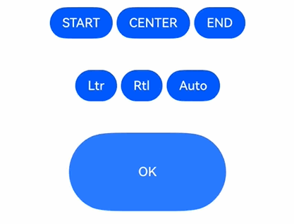
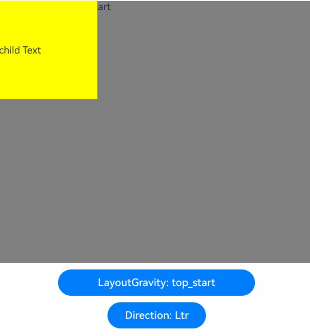

# Location
<!--Kit: ArkUI-->
<!--Subsystem: ArkUI-->
<!--Owner: @zju_ljz-->
<!--Designer: @fenglinbailu-->
<!--Tester: @liuli0427-->
<!--Adviser: @Brilliantry_Rui-->
<!-- md-trans-meta sourceCommit=75a7d62c0702c21a06ca0119552a942305a023cc translatedAt=2026-09-01T12:46:07.950Z -->

The location attributes set the alignment mode, layout direction, and position of a component.

> **NOTE**
> 
> - The initial APIs of this module are supported since API version 7. Updates will be marked with a superscript to indicate their earliest API version.

## align

align(value: Alignment): T

Sets the alignment mode for child components within the component's drawing area. This attribute can be dynamically set using [attributeModifier](ts-universal-attributes-attribute-modifier.md#attributemodifier).

**Widget capability**: This API can be used in ArkTS widgets since API version 9.

**Atomic service API**: This API can be used in atomic services since API version 11.

**System capability**: SystemCapability.ArkUI.ArkUI.Full

**Parameters**

<!--Table: 10%; 15%; 10%; 65%-->
| Name| Type                                       | Mandatory| Description                                                        |
| ------ | ------------------------------------------- | ---- | ------------------------------------------------------------ |
| value  | [Alignment](ts-appendix-enums.md#alignment) | Yes   | Sets the alignment mode of child components within the drawing region of the current component.<br/>This attribute takes effect only in [Stack](ts-container-stack.md), [FolderStack](ts-container-folderstack.md), [Shape](ts-drawing-components-shape.md), [Button](ts-basic-components-button.md), [Marquee](ts-basic-components-marquee.md), [StepperItem](ts-basic-components-stepperitem.md), [Text](ts-basic-components-text.md), [TextArea](ts-basic-components-textarea.md), [TextInput](ts-basic-components-textinput.md), [RichEditor](ts-basic-components-richeditor.md), [Hyperlink](ts-container-hyperlink.md), [SymbolGlyph](ts-basic-components-symbolGlyph.md), [ListItem](ts-container-listitem.md), [GridItem](ts-container-griditem.md), [Scroll](ts-container-scroll.md), [FlowItem](ts-container-flowitem.md), [ImageAnimator](ts-basic-components-imageanimator.md), [LoadingProgress](ts-basic-components-loadingprogress.md), [PatternLock](ts-basic-components-patternlock.md), [Progress](ts-basic-components-progress.md), [QRCode](ts-basic-components-qrcode.md), [TextClock](ts-basic-components-textclock.md), [TextTimer](ts-basic-components-texttimer.md), [MenuItem](ts-basic-components-menuitem.md), [Toggle](ts-basic-components-toggle.md), [Checkbox](ts-basic-components-checkbox.md), and [NodeContainer](ts-basic-components-nodecontainer.md). For text-related components Marquee, Text, TextArea, TextInput, RichEditor, and Hyperlink, the align result refers to [textAlign](ts-basic-components-text.md#textalign).<br/>Components that do not support the textAlign attribute cannot set horizontal text alignment.<br/>Default value: Alignment.Center<br/>**Note:** <br/>This attribute supports mirroring on the [Stack](ts-container-stack.md) component, but not on other components.<br/>In Stack, this attribute has the same effect as alignContent and can only set the alignment mode of child components within the current component. |

**Return value**

| Type| Description|
| --- | --- |
|  T | Current component.|

## align<sup>20+</sup>

align(alignment: Alignment | LocalizedAlignment): T

Sets the alignment mode for child components within the component's drawing area. The mirroring capability is supported. This attribute can be dynamically set using [attributeModifier](ts-universal-attributes-attribute-modifier.md#attributemodifier).

**Widget capability**: This API can be used in ArkTS widgets since API version 20.

**Atomic service API**: This API can be used in atomic services since API version 20.

**Model restriction**: This API can be used only in the stage model.

**System capability**: SystemCapability.ArkUI.ArkUI.Full

**Parameters**

<!--Table: 20%; 20%; 10%; 50%-->
| Name| Type                                       | Mandatory| Description                                                        |
| ------ | ------------------------------------------- | ---- | ------------------------------------------------------------ |
| alignment  | [Alignment](ts-appendix-enums.md#alignment) \| [LocalizedAlignment](ts-appendix-enums.md#localizedalignment20) | Yes   | Sets the alignment mode of child components within the drawing region of the current component, and adds the mirroring capability.<br/>LocalizedAlignment takes effect only in [Shape](ts-drawing-components-shape.md), [Button](ts-basic-components-button.md), [GridItem](ts-container-griditem.md), [FlowItem](ts-container-flowitem.md), [ImageAnimator](ts-basic-components-imageanimator.md), [LoadingProgress](ts-basic-components-loadingprogress.md), [PatternLock](ts-basic-components-patternlock.md), [Progress](ts-basic-components-progress.md), [QRCode](ts-basic-components-qrcode.md), [TextClock](ts-basic-components-textclock.md), [TextTimer](ts-basic-components-texttimer.md), [StepperItem](ts-basic-components-stepperitem.md), [MenuItem](ts-basic-components-menuitem.md), [Toggle](ts-basic-components-toggle.md), [Checkbox](ts-basic-components-checkbox.md), and [ListItem](ts-container-listitem.md).<br/>Among them, except that [ListItem](ts-container-listitem.md) behaves the same as Alignment, mirroring switching takes effect for all other components; components for which LocalizedAlignment has no effect are displayed according to their default behavior.<br/>Default value: Alignment.Center, LocalizedAlignment.CENTER<br/>If an invalid value is set, the default value is used, and the component is displayed centered.<br/>**Note:** <br/>The Alignment type does not support the mirroring capability; the LocalizedAlignment type supports the mirroring capability. Select an enum value in LocalizedAlignment to implement mirroring switching based on the change of direction or the system language direction. The priority of direction is higher than that of the system language direction. When direction is set and is not auto, the mirroring of LocalizedAlignment performs layout according to direction; when direction is set to auto or is not set, the mirroring of LocalizedAlignment performs layout according to the system language direction.|

**Return value**

| Type| Description|
| --- | --- |
|  T | Current component.|

## direction

direction(value: Direction): T

Sets the layout along the main axis within the component's drawing area. This attribute can be dynamically set using [attributeModifier](ts-universal-attributes-attribute-modifier.md#attributemodifier).

**Widget capability**: This API can be used in ArkTS widgets since API version 9.

**Atomic service API**: This API can be used in atomic services since API version 11.

**System capability**: SystemCapability.ArkUI.ArkUI.Full

**Parameters**

| Name| Type                                       | Mandatory| Description                                               |
| ------ | ------------------------------------------- | ---- | --------------------------------------------------- |
| value  | [Direction](ts-appendix-enums.md#direction) | Yes   | Sets the layout along the main axis within the drawing region of the current component.<br/>When the attribute is set to auto, the layout follows the system language direction.<br/>This attribute does not take effect on the Column component.<br/>Default value: Direction.Auto <br/>When direction is undefined or null, the default value is used. |

**Return value**

| Type| Description|
| --- | --- |
|  T | Current component.|

## position

position(value: Position | Edges | LocalizedEdges): T

Sets the absolute positioning, which determines the position of a child component relative to the content area of the parent component. Dynamic configuration via [attributeModifier](ts-universal-attributes-attribute-modifier.md#attributemodifier) is supported.

> **NOTE**
>
> - The effect of position on the position takes effect after the component's size measurement is complete.
> - When the parent component is [Row](./ts-container-row.md), [Column](./ts-container-column.md), or [Flex](./ts-container-flex.md), a child component with position set does not occupy space. In this scenario, if all child components contained in the parent component have position set, the parent component's size cannot be determined by other child components, and layout measurement is performed based on the size (0, 0).
> - The Position type determines the position based on the upper left corner of the parent component's content area. The Edges type determines the position based on the four edges of the parent component's content area, where top/left/right/bottom are the distances from each edge of the component to the corresponding edge of the parent component's content area, and the component's position relative to the parent component's content area is determined by these distances. The LocalizedEdges type determines the position based on the four edges of the parent component's content area and supports mirroring mode.
> - This attribute is applicable to scenarios where components such as top-displayed elements and floating buttons have fixed positions within the parent component.
> - This attribute is not supported on layout components with zero width and height.
> - When the parent component is [RelativeContainer](ts-container-relativecontainer.md) and the child component has the alignRules attribute set, the child component's position attribute does not take effect.
> - If the parent component of the component where this attribute is located does not have a fixed width and height, this component performs absolute positioning with reference to the first ancestor component that has a fixed width and height.

**Widget capability**: This API can be used in ArkTS widgets since API version 9.

**Atomic service API**: This API can be used in atomic services since API version 11.

**System capability**: SystemCapability.ArkUI.ArkUI.Full

**Parameters**

| Name| Type                                                        | Mandatory| Description                                                        |
| ------ | ------------------------------------------------------------ | ---- | ------------------------------------------------------------ |
| value  | [Position](ts-types.md#position) \| [Edges<sup>12+</sup>](ts-types.md#edges12) \| [LocalizedEdges<sup>12+</sup>](ts-types.md#localizededges12) | Yes  | Absolute positioning that determines the child component's position relative to the parent's content area. The content area of the parent component is calculated by subtracting the [border](ts-universal-attributes-border.md#border), [padding](ts-universal-attributes-size.md#padding), and [safeAreaPadding](ts-universal-attributes-size.md#safeareapadding14) values from the parent component's total size. This resulting content area defines the available layout space for child components.<br>This attribute does not take effect when it is set to an abnormal value.|

**Return value**

| Type| Description|
| --- | --- |
|  T | Current component.|

## markAnchor

markAnchor(value: Position | LocalizedPosition): T

Sets the anchor for element positioning. This attribute supports dynamic configuration via [attributeModifier](ts-universal-attributes-attribute-modifier.md#attributemodifier).

**Widget capability**: This API can be used in ArkTS widgets since API version 9.

**Atomic service API**: This API can be used in atomic services since API version 11.

**System capability**: SystemCapability.ArkUI.ArkUI.Full

**Parameters**

| Name| Type                            | Mandatory| Description                                                        |
| ------ | -------------------------------- | ---- | ------------------------------------------------------------ |
| value  | [Position](ts-types.md#position) \| [LocalizedPosition<sup>12+</sup>](ts-types.md#localizedposition12) | Yes  | Positioning anchor that offsets an element from the position specified by **position** or **offset**.<br>**.position({x: value1, y: value2}).markAnchor({x: value3, y: value4})** has the same effect as **.position({x: value1 - value3, y: value2 - value4})**. The same applies to **offset**.<br>If **.markAnchor({x: value1, y: value2})** is set separately, the effect is the same as that of **.offset({x: -value1, y: -value2})**.<br>API version 9 and earlier: The default value is **{x: 0, y: 0}**.<br>API version 10: no default value.<br>This attribute does not take effect when it is set to an abnormal value.|

**Return value**

| Type| Description|
| --- | --- |
|  T | Current component.|

## offset

offset(value: Position | Edges | LocalizedEdges): T

Sets the offset of the component relative to its original position. When **offset** is used in combination with the **position** attribute, the **position** attribute takes precedence and the configured offset will not be applied. This attribute supports dynamic configuration via [attributeModifier](ts-universal-attributes-attribute-modifier.md#attributemodifier).

**Widget capability**: This API can be used in ArkTS widgets since API version 9.

**Atomic service API**: This API can be used in atomic services since API version 11.

**System capability**: SystemCapability.ArkUI.ArkUI.Full

**Parameters**

| Name| Type                                                        | Mandatory| Description                                                        |
| ------ | ------------------------------------------------------------ | ---- | ------------------------------------------------------------ |
| value  | [Position](ts-types.md#position) \| [Edges<sup>12+</sup>](ts-types.md#edges12)  \| [LocalizedEdges<sup>12+</sup>](ts-types.md#localizededges12) | Yes   | Relative offset. The component is offset based on its original layout position. The offset attribute does not affect the parent component layout; it only adjusts the position during drawing.<br/>The Position type is offset based on the top-left corner of the component itself, and the Edges type is offset based on the four edges of the component itself. Setting {x: x, y: y} for the offset attribute has the same effect as setting {left: x, top: y} and {right: -x, bottom: -y}. The LocalizedEdges type supports mirroring mode: in LTR mode, start is equivalent to x; in RTL mode, start is equivalent to -x.<br/>In API version 9 and earlier, the default value is {x: 0, y: 0}.<br/>Default unit: vp.<br/>API version 10: no default value.<br/>When the value is abnormal, this attribute does not take effect.|

**Return value**

| Type| Description|
| --- | --- |
|  T | Current component.|

## alignRules<sup>9+</sup>

alignRules(value: AlignRuleOption): T

Specifies the alignment rule for child components in a relative layout component. This attribute takes effect only when the parent component is [RelativeContainer](ts-container-relativecontainer.md). It can be dynamically set using [attributeModifier](ts-universal-attributes-attribute-modifier.md#attributemodifier).

**Widget capability**: This API can be used in ArkTS widgets since API version 9.

**Atomic service API**: This API can be used in atomic services since API version 11.

**System capability**: SystemCapability.ArkUI.ArkUI.Full

**Parameters**

| Name| Type                                       | Mandatory| Description                    |
| ------ | ------------------------------------------- | ---- | ------------------------ |
| value  | [AlignRuleOption](#alignruleoption9) | Yes   | Specified setting of the alignment rule of child components in a relative layout component. |

**Return value**

| Type| Description|
| --- | --- |
|  T | Current component.|

## alignRules<sup>12+</sup>

alignRules(alignRule: LocalizedAlignRuleOptions): T

Specifies the alignment rule for child components in a relative layout component. This attribute takes effect only when the parent component is [RelativeContainer](ts-container-relativecontainer.md). In the horizontal direction, this method uses start and end to replace left and right of the original method, so that the display can be mirrored in RTL mode. It is recommended to use this method to specify the alignment rule for child components in a relative layout component. This attribute can be dynamically set using [attributeModifier](ts-universal-attributes-attribute-modifier.md#attributemodifier).

**Widget capability**: This API can be used in ArkTS widgets since API version 12.

**Atomic service API**: This API can be used in atomic services since API version 12.

**Model restriction**: This API can be used only in the stage model.

**System capability**: SystemCapability.ArkUI.ArkUI.Full

**Parameters**

| Name| Type                                       | Mandatory| Description                    |
| ------ | ------------------------------------------- | ---- | ------------------------ |
| alignRule  | [LocalizedAlignRuleOptions](#localizedalignruleoptions12) | Yes   | Specifies the alignment rule of a child component in a relative layout component. |

**Return value**

| Type| Description|
| --- | --- |
|  T | Current component.|

## layoutGravity<sup>20+</sup>

layoutGravity(alignment: LocalizedAlignment): T

Sets the alignment mode for child components in a Stack component individually. This attribute takes effect only when the parent component is Stack. When used together with the align attribute, layoutGravity has a higher priority. This attribute can be dynamically set using [attributeModifier](ts-universal-attributes-attribute-modifier.md#attributemodifier).

**Widget capability**: This API can be used in ArkTS widgets since API version 20.

**Atomic service API**: This API can be used in atomic services since API version 20.

**Model restriction**: This API can be used only in the stage model.

**System capability**: SystemCapability.ArkUI.ArkUI.Full

**Parameters**

| Name| Type                                       | Mandatory| Description                    |
| ------ | ------------------------------------------- | ---- | ------------------------ |
| alignment  | [LocalizedAlignment](ts-appendix-enums.md#localizedalignment20) | Yes   | Specifies the alignment rule of child components in the Stack component.<br/>Default value: LocalizedAlignment.CENTER. Note: When an invalid value is passed, the default value is used.|

**Return value**

| Type| Description|
| -------- | -------- |
| T | Current component.|

## AlignRuleOption<sup>9+</sup>

**Widget capability**: This API can be used in ArkTS widgets since API version 9.

**System capability**: SystemCapability.ArkUI.ArkUI.Full

| Name| Type| Read-Only| Optional| Description|
| -------- | -------- | -------- | -------- | -------- |
| left   | [HorizontalAlignParam](#horizontalalignparam23)|No|Yes| Left alignment.<br>In versions earlier than API version 23, the input parameter type is **{ anchor: string, align: [HorizontalAlign](ts-appendix-enums.md#horizontalalign) }**.<br>**Atomic service API**: This API can be used in atomic services since API version 11.|
| right  | [HorizontalAlignParam](#horizontalalignparam23)|No|Yes| Right alignment.<br>In versions earlier than API version 23, the input parameter type is **{ anchor: string, align: [HorizontalAlign](ts-appendix-enums.md#horizontalalign) }**.<br>**Atomic service API**: This API can be used in atomic services since API version 11.|
| middle | [HorizontalAlignParam](#horizontalalignparam23)|No|Yes| Center alignment in the horizontal direction.<br>In versions earlier than API version 23, the input parameter type is **{ anchor: string, align: [HorizontalAlign](ts-appendix-enums.md#horizontalalign) }**.<br>**Atomic service API**: This API can be used in atomic services since API version 11.|
| top    | [VerticalAlignParam](#verticalalignparam23)|No|Yes| Top alignment.<br>In versions earlier than API version 23, the input parameter type is **{ anchor: string, align: [VerticalAlign](ts-appendix-enums.md#verticalalign) }**.<br>**Atomic service API**: This API can be used in atomic services since API version 11.|
| bottom | [VerticalAlignParam](#verticalalignparam23)|No|Yes| Bottom alignment.<br>In versions earlier than API version 23, the input parameter type is **{ anchor: string, align: [VerticalAlign](ts-appendix-enums.md#verticalalign) }**.<br>**Atomic service API**: This API can be used in atomic services since API version 11.|
| center | [VerticalAlignParam](#verticalalignparam23) | No | Yes | Sets the parameter of the vertical center alignment mode.<br/>Before API version 23, the parameter type is { anchor: string, align: [VerticalAlign](ts-appendix-enums.md#verticalalign) }.<br/>**Atomic service API:** Since API version 11, this API supports use in atomic services. |
| bias<sup>11+</sup> | [Bias](./ts-types.md#bias11) | No | Yes | Sets the offset parameter of the component under anchor constraints. The value is the ratio of the distance to the left/top anchor to the total distance between anchors.<br/>**Card capability:** Since API version 11, this API supports use in ArkTS cards.<br/>**Atomic service API:** Since API version 12, this API supports use in atomic services.<br/>**Model constraint:** This API can be used only in the stage model. |

## HorizontalAlignParam<sup>23+</sup>

Defines the alignment rule for child components in a relative layout component in the horizontal direction.

> **NOTE**
>
> To standardize the definition of anonymous objects, the element definition has been modified since API version 23. While historical version information is preserved for anonymous objects, there may be cases where the outer element's @since version number is higher than inner elements'. This does not affect API usability.

**Widget capability**: This API can be used in ArkTS widgets since API version 23.

**Atomic service API**: This API can be used in atomic services since API version 23.

**Model restriction**: This API can be used only in the stage model.

**System capability**: SystemCapability.ArkUI.ArkUI.Full

| Name| Type| Read-Only| Optional| Description|
| -------- | -------- | -------- | -------- | -------- |
| anchor<sup>9+</sup>  | string  |No|No| ID of the component that serves as the anchor.<br>**Widget capability**: This API can be used in ArkTS widgets since API version 9.<br>**Atomic service API**: This API can be used in atomic services since API version 11.|
| align<sup>9+</sup>   | [HorizontalAlign](ts-appendix-enums.md#horizontalalign)  |No|No| Horizontal alignment mode relative to the anchor component.<br>**Widget capability**: This API can be used in ArkTS widgets since API version 9.<br>**Atomic service API**: This API can be used in atomic services since API version 11.|

## VerticalAlignParam<sup>23+</sup>

Defines the alignment rule for child components in a relative layout component in the vertical direction.

> **NOTE**
>
> To standardize the definition of anonymous objects, the element definition has been modified since API version 23. While historical version information is preserved for anonymous objects, there may be cases where the outer element's @since version number is higher than inner elements'. This does not affect API usability.

**Widget capability**: This API can be used in ArkTS widgets since API version 23.

**Atomic service API**: This API can be used in atomic services since API version 23.

**Model restriction**: This API can be used only in the stage model.

**System capability**: SystemCapability.ArkUI.ArkUI.Full

| Name| Type| Read-Only| Optional| Description|
| -------- | -------- | -------- | -------- | -------- |
| anchor<sup>9+</sup>  | string |No|No| ID of the component that serves as the anchor.<br>**Widget capability**: This API can be used in ArkTS widgets since API version 9.<br>**Atomic service API**: This API can be used in atomic services since API version 11.|
| align<sup>9+</sup>   | [VerticalAlign](ts-appendix-enums.md#verticalalign)  |No|No| Vertical alignment mode relative to the anchor component.<br>**Widget capability**: This API can be used in ArkTS widgets since API version 9.<br>**Atomic service API**: This API can be used in atomic services since API version 11.|

## LocalizedAlignRuleOptions<sup>12+</sup>

**Atomic service API**: This API can be used in atomic services since API version 12.

**Model restriction**: This API can be used only in the stage model.

**System capability**: SystemCapability.ArkUI.ArkUI.Full

| Name| Type| Read-Only| Optional| Description|
| -------- | -------- | -------- | -------- | -------- |
| start  | [LocalizedHorizontalAlignParam](#localizedhorizontalalignparam12) |No|Yes| Left alignment with left-to-right scripts and right alignment with right-to-left scripts in the horizontal direction.|
| end    | [LocalizedHorizontalAlignParam](#localizedhorizontalalignparam12) |No|Yes| Right alignment with left-to-right scripts and left alignment with right-to-left scripts in the horizontal direction.|
| middle | [LocalizedHorizontalAlignParam](#localizedhorizontalalignparam12) |No|Yes| Center alignment in the horizontal direction.|
| top    | [LocalizedVerticalAlignParam](#localizedverticalalignparam12) |No|Yes| Top alignment in the vertical direction.|
| bottom | [LocalizedVerticalAlignParam](#localizedverticalalignparam12) |No|Yes| Bottom alignment in the vertical direction.|
| center | [LocalizedVerticalAlignParam](#localizedverticalalignparam12) |No|Yes| Center alignment in the vertical direction.     |
| bias   | [Bias](./ts-types.md#bias11) |No|Yes| Sets the offset parameter of the component under anchor constraints. The value is the ratio of the distance to the left/top anchor to the total distance between anchors.|

## LocalizedHorizontalAlignParam<sup>12+</sup>

**Atomic service API**: This API can be used in atomic services since API version 12.

**Model restriction**: This API can be used only in the stage model.

**System capability**: SystemCapability.ArkUI.ArkUI.Full

| Name| Type| Read-Only| Optional| Description|
| -------- | -------- | -------- | -------- | -------- |
| anchor  | string  |No|No| ID of the component that serves as the anchor.|
| align   | [HorizontalAlign](ts-appendix-enums.md#horizontalalign)  |No|No| Horizontal alignment mode relative to the anchor component.|

## LocalizedVerticalAlignParam<sup>12+</sup>

**Atomic service API**: This API can be used in atomic services since API version 12.

**Model restriction**: This API can be used only in the stage model.

**System capability**: SystemCapability.ArkUI.ArkUI.Full

| Name| Type| Read-Only| Optional| Description|
| -------- | -------- | -------- | -------- | -------- |
| anchor  | string |No|No| ID of the component that serves as the anchor.|
| align   | [VerticalAlign](ts-appendix-enums.md#verticalalign)  |No|No| Vertical alignment mode relative to the anchor component.|

## chainMode<sup>12+</sup>

chainMode(direction: Axis, style: ChainStyle): T

Specifies the parameters of the chain formed with this component as the chain head. This attribute takes effect only when the parent component is [RelativeContainer](ts-container-relativecontainer.md). The chain head refers to the first component of the chain when the chain-forming rule is satisfied (starting from the left in the horizontal direction, or from the right in a mirrored language; starting from the top in the vertical direction).

For details, see [RelativeContainer Example 7](ts-container-relativecontainer.md#example-7-creating-chains).

**Atomic service API**: This API can be used in atomic services since API version 12.

**Model restriction**: This API can be used only in the stage model.

**System capability**: SystemCapability.ArkUI.ArkUI.Full

**Parameters**

| Name| Type                                       | Mandatory| Description                    |
| ------ | ------------------------------------------- | ---- | ------------------------ |
| direction  | [Axis](ts-appendix-enums.md#axis) | Yes  | Direction of the chain.|
| style  | [ChainStyle](#chainstyle12) | Yes  | Style of the chain.|

**Return value**

| Type| Description|
| --- | --- |
|  T | Current component.|

## ChainStyle<sup>12+</sup>

Enumerates the chain layout styles. Dynamic configuration via [attributeModifier](ts-universal-attributes-attribute-modifier.md#attributemodifier) is supported.

**Atomic service API**: This API can be used in atomic services since API version 12.

**Model restriction**: This API can be used only in the stage model.

**System capability**: SystemCapability.ArkUI.ArkUI.Full

| Name | Value | Description |
| ------------- | ------- | ------------------------------------------------------------ |
| SPREAD | 0 | Components are evenly distributed between the constraint anchors. For details, see [Example 7: Setting a Chain](ts-container-relativecontainer.md#example-7-creating-chains). |
| SPREAD_INSIDE | 1 | Components other than the first and last child components are evenly distributed between the constraint anchors. For details, see [Example 7: Setting a Chain](ts-container-relativecontainer.md#example-7-creating-chains). |
| PACKED | 2 | Child components in the chain are arranged without gaps. For details, see [Example 7: Setting a Chain](ts-container-relativecontainer.md#example-7-creating-chains). |

>  **NOTE**
>
>  When a chain is used, **RelativeContainer** defines a size calculation sequence for interdependent components within the chain. **ChainStyle** positioning is determined after size calculation completes. Therefore, with **SPREAD** or **PACKED** styles, non-chain component A (which uses the chain head as its layout anchor) and other chain nodes share the same layout priority. If component A's ID has earlier lexicographical order, its **alignRules** take effect before the chain's **ChainStyle**.

## chainWeight<sup>14+</sup>

chainWeight(chainWeight: ChainWeightOptions): T

Re-layouts the components that form a chain. This attribute takes effect only when the parent component is [RelativeContainer](ts-container-relativecontainer.md).

> **NOTE**
>
> Since API version 23, dynamic configuration via [attributeModifier](ts-universal-attributes-attribute-modifier.md#attributemodifier) is supported.

**Model restriction**: This API can be used only in the stage model.

**System capability**: SystemCapability.ArkUI.ArkUI.Full

**Atomic service API**: This API can be used in atomic services since API version 14.

**Parameters**

| Name| Type                                       | Mandatory| Description                    |
| ------ | ------------------------------------------- | ---- | ------------------------ |
| chainWeight  | [ChainWeightOptions](ts-types.md#chainweightoptions14) | Yes  | Layout weight of the component in the horizontal or vertical direction. The component with **chainWeight** set will have its size in the horizontal or vertical direction allocated according to the set weights. The allocation ignores the component's intrinsic size and enables the component to adaptively fill the remaining space.|

**Return value**

| Type| Description|
| --- | --- |
|  T | Current component.|

**Example**

For details, see [Example 10: Setting Component Weights in a Chain](ts-container-relativecontainer.md#example-10-setting-component-weights-in-a-chain).

## Example

### Example 1: Setting the Alignment Mode and Main Axis Layout

Sets the alignment mode of the content within the element and the layout of child elements along the main axis of the parent component.

```ts
// xxx.ets
@Entry
@Component
struct PositionExample1 {
  build() {
    Column() {
      Column({ space: 10 }) {
        // When the element content is smaller than the element width and height, set the alignment mode of the content within the element.
        Text('align').fontSize(9).fontColor(0xCCCCCC).width('90%')
        Stack() {
          Text('First show in bottom end').height('65%').backgroundColor(0xD2B48C)
          Text('Second show in bottom end').backgroundColor(0xF5DEB3).opacity(0.9)
        }.width('90%').height(50).margin({ top: 5 }).backgroundColor(0xFFE4C4)
        .align(Alignment.BottomEnd)
        Stack() {
          Text('top start')
        }.width('90%').height(50).margin({ top: 5 }).backgroundColor(0xFFE4C4)
        .align(Alignment.TopStart)

        // The parent component sets direction to Direction.Ltr, and child elements are arranged from left to right.
        Text('direction').fontSize(9).fontColor(0xCCCCCC).width('90%')
        Row() {
          Text('1').height(50).width('25%').fontSize(16).backgroundColor(0xF5DEB3)
          Text('2').height(50).width('25%').fontSize(16).backgroundColor(0xD2B48C)
          Text('3').height(50).width('25%').fontSize(16).backgroundColor(0xF5DEB3)
          Text('4').height(50).width('25%').fontSize(16).backgroundColor(0xD2B48C)
        }
        .width('90%')
        .direction(Direction.Ltr)
        // The parent component sets direction to Direction.Rtl, and child elements are arranged from right to left.
        Row() {
          Text('1').height(50).width('25%').fontSize(16).backgroundColor(0xF5DEB3).textAlign(TextAlign.End)
          Text('2').height(50).width('25%').fontSize(16).backgroundColor(0xD2B48C).textAlign(TextAlign.End)
          Text('3').height(50).width('25%').fontSize(16).backgroundColor(0xF5DEB3).textAlign(TextAlign.End)
          Text('4').height(50).width('25%').fontSize(16).backgroundColor(0xD2B48C).textAlign(TextAlign.End)
        }
        .width('90%')
        .direction(Direction.Rtl)
      }
    }
    .width('100%').margin({ top: 5 })
  }
}
```


### Example 2: Setting the Position Offset

This example demonstrates position offsets based on the parent component, relative positioning, and anchors.

```ts
// xxx.ets
@Entry
@Component
struct PositionExample2 {
  build() {
    Column({ space: 20 }) {
      // Set the offset of the component's upper left corner relative to the parent component's upper left corner.
      Text('position').fontSize(12).fontColor(0xCCCCCC).width('90%')
      Row() {
        Text('1').size({ width: '30%', height: '50' }).backgroundColor(0xdeb887).border({ width: 1 }).fontSize(16)
          .textAlign(TextAlign.Center)
        Text('2 position(30, 10)')
          .size({ width: '60%', height: '30' })
          .backgroundColor(0xbbb2cb)
          .border({ width: 1 })
          .fontSize(16)
          .align(Alignment.Start)
          .position({ x: 30, y: 10 })
        Text('3').size({ width: '45%', height: '50' }).backgroundColor(0xdeb887).border({ width: 1 }).fontSize(16)
          .textAlign(TextAlign.Center)
        Text('4 position(50%, 70%)')
          .size({ width: '50%', height: '50' })
          .backgroundColor(0xbbb2cb)
          .border({ width: 1 })
          .fontSize(16)
          .position({ x: '50%', y: '70%' })
      }.width('90%').height(100).border({ width: 1, style: BorderStyle.Dashed })

      // Offset relative to the start point. x indicates the horizontal distance between the end point and the start point. If the value of x is greater than 0, the component is offset to the left. Otherwise, the component is offset to the right.
      // y indicates the vertical distance between the end point and the start point. If the value of y is greater than 0, the component is offset to the top. Otherwise, the component is offset to the bottom.
      Text('markAnchor').fontSize(12).fontColor(0xCCCCCC).width('90%')
      Stack({ alignContent: Alignment.TopStart }) {
        Row()
          .size({ width: '100', height: '100' })
          .backgroundColor(0xdeb887)
        Text('text')
          .fontSize('30px')
          .textAlign(TextAlign.Center)
          .size({ width: 25, height: 25 })
          .backgroundColor(Color.Green)
          .markAnchor({ x: 25, y: 25 })
        Text('text')
          .fontSize('30px')
          .textAlign(TextAlign.Center)
          .size({ width: 25, height: 25 })
          .backgroundColor(Color.Green)
          .markAnchor({ x: -100, y: -25 })
        Text('text')
          .fontSize('30px')
          .textAlign(TextAlign.Center)
          .size({ width: 25, height: 25 })
          .backgroundColor(Color.Green)
          .markAnchor({ x: 25, y: -25 })
      }.margin({ top: 25 }).border({ width: 1, style: BorderStyle.Dashed })

      // Offset of the component relative to itself. If the value of x is greater than 0, the component is offset to the right. Otherwise, the component is offset to the left. If the value of y is greater than 0, the component is offset to the bottom. Otherwise, the component is offset to the top.
      Text('offset').fontSize(12).fontColor(0xCCCCCC).width('90%')
      Row() {
        Text('1').size({ width: '15%', height: '50' }).backgroundColor(0xdeb887).border({ width: 1 }).fontSize(16)
          .textAlign(TextAlign.Center)
        Text('2  offset(15, 30)')
          .size({ width: 120, height: '50' })
          .backgroundColor(0xbbb2cb)
          .border({ width: 1 })
          .fontSize(16)
          .align(Alignment.Start)
          .offset({ x: 15, y: 30 })
        Text('3').size({ width: '15%', height: '50' }).backgroundColor(0xdeb887).border({ width: 1 }).fontSize(16)
          .textAlign(TextAlign.Center)
        Text('4 offset(-5%, 20%)')
          .size({ width: 100, height: '50' })
          .backgroundColor(0xbbb2cb)
          .border({ width: 1 })
          .fontSize(16)
          .offset({ x: '-5%', y: '20%' })
      }.width('90%').height(100).border({ width: 1, style: BorderStyle.Dashed })
    }
    .width('100%').margin({ top: 25 })
  }
}
```


### Example 3: Setting the Absolute Positioning and Relative Offset

This example demonstrates how to use **position** to set absolute positioning, which determines the position of child components relative to the parent component. It also shows how to use **offset** to set relative offsets for moving components from their original layout positions.

```ts
// xxx.ets
@Entry
@Component
struct Example3 {
  build() {
    Column({ space: 20 }) {
      Text('position use Edges').fontSize(12).fontColor(0xCCCCCC).width('90%')
      Row() {
        Text('bottom:0, right:0')
          .size({ width: '30%', height: '50' })
          .backgroundColor(0xdeb887)
          .border({ width: 1 })
          .fontSize(16)
          .textAlign(TextAlign.Center)
          .position({ bottom: 0, right: 0 })
        Text('top:0, left:0')
          .size({ width: '30%', height: '50' })
          .backgroundColor(0xdeb887)
          .border({ width: 1 })
          .fontSize(16)
          .textAlign(TextAlign.Center)
          .position({ top: 0, left: 0 })
        Text('top:10%, left:50%')
          .size({ width: '50%', height: '30' })
          .backgroundColor(0xbbb2cb)
          .border({ width: 1 })
          .fontSize(16)
          .textAlign(TextAlign.Center)
          .position({ top: '10%', left: '50%' })
        Text('bottom:0, left:30')
          .size({ width: '50%', height: '30' })
          .backgroundColor(0xbbb2cb)
          .border({ width: 1 })
          .fontSize(16)
          .textAlign(TextAlign.Center)
          .position({ bottom: 0, left: 30 })
      }.width('90%').height(100).border({ width: 1, style: BorderStyle.Dashed })


      Text('offset use Edges').fontSize(12).fontColor(0xCCCCCC).width('90%')
      Row() {
        Text('1')
          .size({ width: '25%', height: 50 })
          .backgroundColor(0xdeb887)
          .border({ width: 1 })
          .fontSize(16)
          .textAlign(TextAlign.Center)
        Text('2 top:30, left:0')
          .size({ width: '25%', height: 50 })
          .backgroundColor(0xbbb2cb)
          .border({ width: 1 })
          .fontSize(16)
          .textAlign(TextAlign.Center)
          .offset({ top: 30, left: 0 })
        Text('3')
          .size({ width: '25%', height: 50 })
          .backgroundColor(0xdeb887)
          .border({ width: 1 })
          .fontSize(16)
          .textAlign(TextAlign.Center)
        Text('4 bottom:10, right:30')
          .size({ width: '25%', height: 50 })
          .backgroundColor(0xbbb2cb)
          .border({ width: 1 })
          .fontSize(12)
          .textAlign(TextAlign.Center)
          .offset({ bottom: 10, right: 30 })
      }.width('90%').height(150).border({ width: 1, style: BorderStyle.Dashed })
    }.width('100%').margin({ top: 25 })
  }
}
```


### Example 4: Implementing a Mirror Effect

Common layout attributes support the [mirroring capability](./../../../ui/arkts-internationalization.md#using-the-mirroring-capability). This example demonstrates how to implement a mirroring effect using the [position](#position), [offset](#offset), and [markAnchor](#markanchor) attributes. The light blue blocks indicate the original effect, and the dark blue blocks indicate the mirroring effect.

```ts
// xxx.ets
import { LengthMetrics } from '@kit.ArkUI';

@Entry
@Component
struct Example4 {
  private scroller: Scroller = new Scroller()

  build() {
    Column() {
      Stack({ alignContent: Alignment.End }) {
        Scroll(this.scroller) {
          Flex({ direction: FlexDirection.Column }) {
            RelativeContainer() {
              Row() {
              }
              .position({ start: LengthMetrics.px(200), top: LengthMetrics.px(100) }) // The parameters in the position API use the LocalizedEdges type, supporting the mirroring effect.
              .width("30%")
              .height("20%")
              .backgroundColor('rgb(0, 74, 175)')
              .padding(50)
              .margin(50)

              Row() {
              }
              .position({ left: '200px', top: '100px' }) // The parameters in the position API use the Edges type, not supporting the mirroring effect.
              .width("30%")
              .height("20%")
              .backgroundColor('rgb(39, 135, 217)')
              .padding(50)
              .margin(50)

              Row() {
              }
              .offset({ start: LengthMetrics.vp(100), top: LengthMetrics.vp(200) }) // The parameters in the offset API use the LocalizedEdges type, supporting the mirroring effect.
              .width("30%")
              .height("20%")
              .backgroundColor('rgb(0, 74, 175)')
              .padding(50)
              .margin(50)

              Row() {
              }
              .offset({ left: 100, top: 200 }) // The parameters in the offset API use the Edges type, not supporting the mirroring effect.
              .width("30%")
              .height("20%")
              .backgroundColor('rgb(39, 135, 217)')
              .padding(50)
              .margin(50)

              Row() {
              }
              .markAnchor({
                start: LengthMetrics.fp(100),
                top: LengthMetrics.fp(-350)
              }) // The parameters in the markAnchor API use the LocalizedPosition type, supporting the mirroring effect.
              .width("30%")
              .height("20%")
              .backgroundColor('rgb(0, 74, 175)')
              .padding(50)
              .margin(50)

              Row() {
              }
              .markAnchor({ x: '100fp', y: '-350fp' }) // The parameters in the markAnchor API use the Position type, not supporting the mirroring effect.
              .width("30%")
              .height("20%")
              .backgroundColor('rgb(39, 135, 217)')
              .padding(50)
              .margin(50)
            }
            .backgroundColor(Color.White)
            .padding(50)
            .margin(50)
          }
        }
        .width('100%')
        .scrollBar(BarState.Off)
        .scrollable(ScrollDirection.Vertical)

        ScrollBar({ scroller: this.scroller, direction: ScrollBarDirection.Vertical, state: BarState.Auto }) {
          Text()
            .width(20)
            .height(100)
            .borderRadius(10)
            .backgroundColor('#C0C0C0')
        }.width(20).backgroundColor('#ededed')
      }
    }.height('90%')
  }
}
```

Before mirroring:


After mirroring (For details about the conditions for mirroring to take effect, see [Using the Mirroring Capability](./../../../ui/arkts-internationalization.md#using-the-mirroring-capability)):


### Example 5: Using the align Property with Mirroring Adaptation

Sets the alignment mode of the content within the element and the layout of child elements along the main axis of the parent component.

```ts
// xxx.ets
@Entry
@Component
struct buttonTestDemo {
  @State isLocalizedAlignment: LocalizedAlignment[] =
    [LocalizedAlignment.TOP_START, LocalizedAlignment.TOP, LocalizedAlignment.TOP_END, LocalizedAlignment.START,
      LocalizedAlignment.CENTER, LocalizedAlignment.END, LocalizedAlignment.BOTTOM_START, LocalizedAlignment.BOTTOM,
      LocalizedAlignment.BOTTOM_END]
  @State isLocalizedAlignmentIndex: number = 4
  @State isDirection: Direction[] = [Direction.Ltr, Direction.Rtl, Direction.Auto]
  @State isDirectionIndex: number = 0

  build() {
    Row() {
      Column() {

        Row({ space: 5 }) {
          Button('START')
            .onClick(() => {
              this.isLocalizedAlignmentIndex = 3
            })
          Button('CENTER')
            .onClick(() => {
              this.isLocalizedAlignmentIndex = 4
            })
          Button('END')
            .onClick(() => {
              this.isLocalizedAlignmentIndex = 5
            })
        }.margin(20)

        Row({ space: 5 }) {
          Button('Ltr')
            .onClick(() => {
              this.isDirectionIndex = 0
            })
          Button('Rtl')
            .onClick(() => {
              this.isDirectionIndex = 1
            })
          Button('Auto')
            .onClick(() => {
              this.isDirectionIndex = 2
            })
        }.margin(20)

        Row() {
          Button('OK', { type: ButtonType.Capsule, stateEffect: true })
            .backgroundColor(0x317aff)
            .width(200)
            .height(100)
            .direction(this.isDirection[this.isDirectionIndex])
            .align(this.isLocalizedAlignment[this.isLocalizedAlignmentIndex])
        }.margin(20)
      }
      .width('100%')
    }
    .height('100%')
  }
}
```


### Example 6: Using layoutGravity to Individually Set the Alignment Rule of a Child Component in the Stack Component

This example shows how to adjust the text position within the **Stack** container.

```ts
// xxx.ets
@Entry
@Component
struct Index5 {
  private layoutGravityArr: LocalizedAlignment[] = [
    LocalizedAlignment.TOP_START, LocalizedAlignment.TOP, LocalizedAlignment.TOP_END,
    LocalizedAlignment.START, LocalizedAlignment.CENTER, LocalizedAlignment.END,
    LocalizedAlignment.BOTTOM_START, LocalizedAlignment.BOTTOM, LocalizedAlignment.BOTTOM_END];
  @State layoutGravityIndex: number = 0;
  private directionArr: Direction[] = [Direction.Ltr, Direction.Rtl, Direction.Auto];
  @State directionIndex: number = 0;

  build() {
    Row() {
      Column() {
        Stack({
          alignContent: Alignment.TopStart
        }) {
          Text('StackChildAlign_TopStart').fontSize(15)
          Text('Child Text')
            .width(150)
            .height(150)
            .backgroundColor(Color.Yellow)
            .fontSize(15)
            .layoutGravity(this.layoutGravityArr[this.layoutGravityIndex])
        }
        .width('100%')
        .height(400)
        .backgroundColor(Color.Grey)
        .margin({ top: 10, bottom: 10 })
        .direction(this.directionArr[this.directionIndex])

        Button("LayoutGravity: " + this.layoutGravityArr[this.layoutGravityIndex])
          .width(300)
          .fontSize(16)
          .onClick(() => {
            this.layoutGravityIndex = ++this.layoutGravityIndex % this.layoutGravityArr.length;
          })
          .margin({ bottom: 10 })

        Button("Direction: " + this.directionArr[this.directionIndex])
          .width(150)
          .fontSize(16)
          .onClick(() => {
            this.directionIndex = ++this.directionIndex % this.directionArr.length;
          })
          .margin({ bottom: 10 })
      }
      .width('100%')
    }
    .height('100%')
  }
}
```
