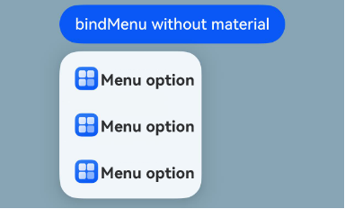
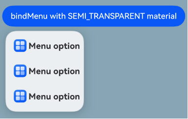

# Menu Control (System API)
<!--Kit: ArkUI-->
<!--Subsystem: ArkUI-->
<!--Owner: @Armstrong15-->
<!--Designer: @zhanghaibo0-->
<!--Tester: @lxl007-->
<!--Adviser: @Brilliantry_Rui-->

A context menu – a vertical list of items – can be bound to a component and displayed by long-pressing, clicking, or right-clicking the component.

> **NOTE**
>
> - This component is supported since API version 7. Updates will be marked with a superscript to indicate their earliest API version.
>
> - This topic describes only system APIs provided by the module. For details about its public APIs, see [Menu Control](./ts-universal-attributes-menu.md).

## ContextMenuOptions<sup>10+</sup>

Configures menu item information.

**System capability**: SystemCapability.ArkUI.ArkUI.Full

| Name                 | Type                                                        | Read-Only| Optional| Description                                                        |
| --------------------- | ------------------------------------------------------------ | ---- | ------------------------------------------------------------ | ------------------------------------------------------------ |
| systemMaterial<sup>23+</sup> | [SystemUiMaterial](./ts-universal-attributes-image-effect-sys.md#systemuimaterial23) | No| Yes| System material of the menu. Different system materials have different attribute effects. This API affects the background color ([backgroundColor](ts-universal-attributes-background.md#backgroundcolor)), border color ([borderColor](ts-universal-attributes-border.md#bordercolor)), border width ([borderWidth](ts-universal-attributes-border.md#borderwidth)), and shadow ([shadow](ts-universal-attributes-image-effect.md#shadow)). You are advised not to use this API together with the aforementioned APIs. If the material is set to an invalid value or **undefined**, no system material is set.<br>Default value: **undefined**<br>**System API**: This is a system API.<br>**Atomic service API**: This API can be used in atomic services since API version 23.<br>**Model restriction**: This API can be used only in the stage model.|

## Example
### Example 1: Setting the System Material of a Menu

This example sets the system material of a menu by setting the **systemMaterial** attribute in [ContextMenuOptions](#contextmenuoptions10).

The **systemMaterial** attribute is added to **ContextMenuOptions** since API version 23.

```ts
import { uiMaterial } from '@kit.ArkUI';

@Entry
@Component
struct Index {
  @Builder
  MyMenu() {
    Menu() {
      MenuItem({ startIcon: this.iconStr, content: 'Menu option' })
      MenuItem({ startIcon: this.iconStr, content: 'Menu option' })
      MenuItem({ startIcon: this.iconStr, content: 'Menu option' })
    }
  }

  build() {
    Column() {
      Button('bindMenu with THICK material')
        .bindMenu(this.MyMenu, {
          systemMaterial: new uiMaterial.Material({ type: uiMaterial.MaterialType.SEMI_TRANSPARENT })
        })
    }
    // Replace $r('app.media.img') with the image resource file you use.
    .backgroundImage($r('app.media.img'))
  }
}
```
Menu without the system material



Menu with the system material


