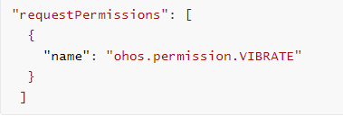
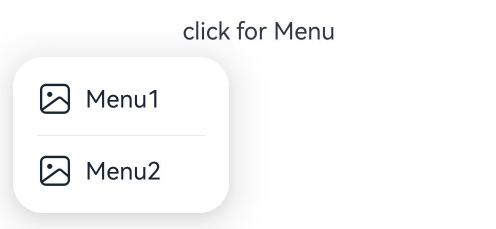
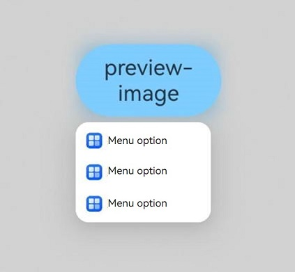
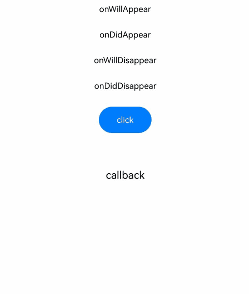
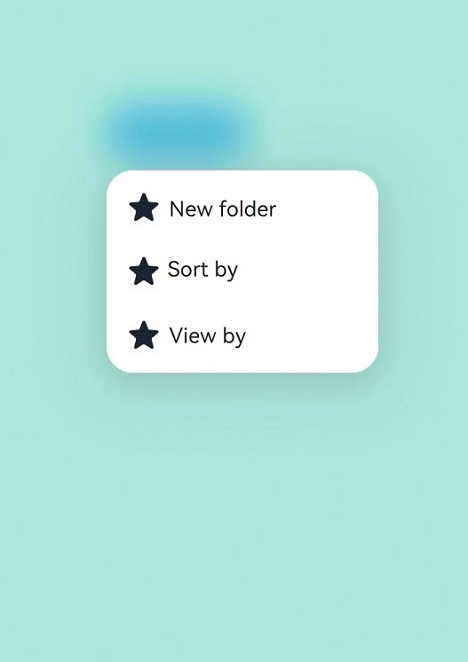
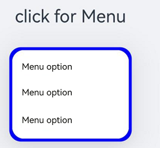

# Menu Control
<!--Kit: ArkUI-->
<!--Subsystem: ArkUI-->
<!--Owner: @Armstrong15-->
<!--Designer: @zhanghaibo0-->
<!--Tester: @lxl007-->
<!--Adviser: @Brilliantry_Rui-->

A context menu – a vertical list of items – can be bound to a component and displayed by long-pressing, clicking, or right-clicking the component.

>  **NOTE**
>
>  - The feature is supported since API version 7. Updates will be marked with a superscript to indicate their earliest API version.
>
>  - Multi-level menus cannot be displayed by bindMenu and bindContextMenu in CustomBuilder. To display a multi-level menu, use the [Menu](ts-basic-components-menu.md) component instead.
>
>  - The text in the context menu cannot be selected by long-pressing.
>
>  - When the window size changes or the menu content area is tapped, the menu is automatically hidden.
>
>  - If the component bound to the menu is a draggable node and preview of bindContextMenu is not specified, the drag preview will be displayed when the menu is displayed, and the menu options and preview will not avoid each other. You can set preview based on the application scenario or set the target node to be non-draggable.
>
>  - Since API version 12, menus allow users to display a submenu with a 500 ms long press, with the pressed state following the movement of the finger.
>
>    1. This feature is only available in scenarios where the [Menu](ts-basic-components-menu.md) component is used and the child components include [MenuItem](ts-basic-components-menuitem.md) or [MenuItemGroup](ts-basic-components-menuitemgroup.md).
>
>    2. This feature is only available for menus with [MenuPreviewMode](#menupreviewmode11) set to **NONE**.
>  - The maximum width of the menu is limited by the number of grids occupied by the device. Even if the width is set to 100%, the menu does not occupy the entire screen.
>
>  - When the component object bound to the menu is destroyed, the menu disappears.
>
>  - [bindContextMenu](#bindcontextmenu8) can be displayed only in the subwindow. [bindMenu](#bindmenu) can be displayed in the subwindow by setting the showInSubWindow attribute in [MenuOptions](#menuoptions10).


## bindMenu

bindMenu(content: Array<MenuElement&gt; | CustomBuilder, options?: MenuOptions): T

Binds a menu to this component, which is displayed when the user clicks the component. The displayed menu items support icon+text arrangement and component customization.

>**NOTE**
>
> This API can be called within [attributeModifier](ts-universal-attributes-attribute-modifier.md#attributemodifier) since API version 20 only if the input parameter type of **content** is Array<MenuElement&gt;.

**Atomic service API**: This API can be used in atomic services since API version 11.

**System capability**: SystemCapability.ArkUI.ArkUI.Full

**Parameters**

| Name | Type                                                        | Mandatory| Description                                        |
| ------- | ------------------------------------------------------------ | ---- | -------------------------------------------- |
| content | Array<[MenuElement](#menuelement)&gt;&nbsp;\|&nbsp;[CustomBuilder](ts-types.md#custombuilder8) | Yes  | Array of menu item icons and text, or custom component.|
| options | [MenuOptions](#menuoptions10)                                | No  | Parameters of the context menu.                        |

**Return value**

|Type|Description|
|---|---|
|T|Current component.|

## bindMenu<sup>11+</sup>

bindMenu(isShow: boolean, content: Array<MenuElement&gt; | CustomBuilder, options?: MenuOptions): T

Binds a menu to a component. The display and hiding of the menu are triggered by the bound isShow. The displayed menu items support icon+text arrangement and component customization.

>**NOTE**
>
> This API can be called within [attributeModifier](ts-universal-attributes-attribute-modifier.md#attributemodifier) since API version 20 only if the input parameter type of **content** is Array<MenuElement&gt;.

**Atomic service API**: This API can be used in atomic services since API version 12.

**System capability**: SystemCapability.ArkUI.ArkUI.Full

**Parameters**

| Name | Type                                                        | Mandatory| Description                                                        |
| ------- | ------------------------------------------------------------ | ---- | ------------------------------------------------------------ |
| isShow  | boolean                                                      | Yes  | Menu visibility. The menu can be displayed only after the entire page is fully constructed. Setting this parameter to **true** during page construction will cause incorrect positioning and layout. Since API version 18, this parameter supports two-way binding through the [!! syntax](../../../ui/state-management/arkts-new-binding.md#two-way-binding-between-built-in-component-parameters).<br>**true**: Display the menu. **false**: Close the menu.<br>Default value: **false**.|
| content | Array<[MenuElement](#menuelement)&gt;&nbsp;\|&nbsp;[CustomBuilder](ts-types.md#custombuilder8) | Yes  | Array of menu item icons and text, or custom component.                |
| options | [MenuOptions](#menuoptions10)                                | No  | Parameters of the context menu.                                        |

**Return value**

|Type|Description|
|---|---|
|T|Current component.|

## bindContextMenu<sup>8+</sup>

bindContextMenu(content: CustomBuilder, responseType: ResponseType, options?: ContextMenuOptions): T

Binds a menu to a component. The display or hiding of the menu is triggered by touching and holding or right-clicking. The menu items to be displayed need to be customized. To use the code logic to control the display and hiding of menus, use [bindContextMenu<sup>12+</sup>](#bindcontextmenu12).

>  **NOTE**
>
>  - The bindContextMenu (implemented by the default sub-window) cannot be used in the input method window. For details, see the [createPanel](../../apis-ime-kit/js-apis-inputmethodengine.md#createpanel10-1) description of the input method framework.
>
>  - This API cannot be called within [attributeModifier](ts-universal-attributes-attribute-modifier.md#attributemodifier).

**Atomic service API**: This API can be used in atomic services since API version 11.

**System capability**: SystemCapability.ArkUI.ArkUI.Full

**Parameters**

| Name      | Type                                              | Mandatory| Description                            |
| ------------ | -------------------------------------------------- | ---- | -------------------------------- |
| content      | [CustomBuilder](ts-types.md#custombuilder8)        | Yes  | Builder of the custom menu content.          |
| responseType | [ResponseType](ts-appendix-enums.md#responsetype8) | Yes  | How the context menu is triggered, which can be long-press or right-click. Long pressing with a mouse device is not supported.|
| options      | [ContextMenuOptions](#contextmenuoptions10)        | No  | Parameters of the context menu.            |

**Return value**

|Type|Description|
|---|---|
|T|Current component.|

## bindContextMenu<sup>12+</sup>

bindContextMenu(isShown: boolean, content: CustomBuilder, options?: ContextMenuOptions): T

Binds a menu to a component. The display and hiding of the menu are triggered by the bound isShown.

When isShown is true, the menu is displayed. When isShown is false, the menu is hidden. Menu items can be customized.

The menu pop-up position is determined only by the placement setting, regardless of the click position.

>  **NOTE**
>
>  - The bindContextMenu (implemented by the default sub-window) cannot be used in the input method window. For details, see the [createPanel](../../apis-ime-kit/js-apis-inputmethodengine.md#createpanel10-1) description of the input method framework.
>
>  - This API cannot be called within [attributeModifier](ts-universal-attributes-attribute-modifier.md#attributemodifier).

**System capability**: SystemCapability.ArkUI.ArkUI.Full

**Atomic service API**: This API can be used in atomic services since API version 12.

**Parameters**

| Name      | Type                                              | Mandatory| Description                                        |
| ------------ | -------------------------------------------------- | ---- | -------------------------------------------- |
| isShown | boolean | Yes  | Menu visibility. Menus can be displayed only after all pages are constructed. If this parameter is set to true before or during page construction, the display position and shape may be incorrect, and menus cannot be displayed properly. To trigger dragging by long presses is not supported. Since API version 18, this parameter supports two-way binding through the [!! syntax](../../../ui/state-management/arkts-new-binding.md#two-way-binding-between-built-in-component-parameters).<br>**true**: Display the menu. **false**: Close the menu.<br>Default value: **false**|
| content      | [CustomBuilder](ts-types.md#custombuilder8)        | Yes  | Builder of the custom menu content.|
| options      | [ContextMenuOptions](#contextmenuoptions10)                      | No  | Parameters of the context menu.                        |

**Return value**

|Type|Description|
|---|---|
|T|Current component.|

## bindContextMenuWithResponse<sup>23+</sup>

bindContextMenuWithResponse(content: CustomBuilderT\<ResponseType> | undefined, options?: ContextMenuOptions): T

Binds a menu to the component. The menu is triggered by long press or right-click. The style and content of the displayed menu need to be customized.

>  **NOTE**
>
>  - The bindContextMenuWithResponse method cannot be used in the input method window (implemented by the default subwindow). For details, see the restrictions on the input method framework [createPanel](../../apis-ime-kit/js-apis-inputmethodengine.md#createpanel10-1).
>
>  - This API cannot be called within [attributeModifier](ts-universal-attributes-attribute-modifier.md#attributemodifier).

**Atomic service API**: This API can be used in atomic services since API version 23.

**System capability**: SystemCapability.ArkUI.ArkUI.Full

**Parameters**

| Name      | Type                                              | Mandatory| Description                            |
| ------------ | -------------------------------------------------- | ---- | -------------------------------- |
| content      | [CustomBuilderT](ts-types.md#custombuildertt23)[\<ResponseType>](ts-appendix-enums.md#responsetype8)&nbsp;\|&nbsp; undefined  | Yes  | Builder of the custom menu content. The input parameter is the menu triggering mode, which can be used to implement differentiated content. If this parameter is set to undefined, no menu is displayed.          |
| options      | [ContextMenuOptions](#contextmenuoptions10)        | No  | Parameters of the context menu.            |

**Return value**

|Type|Description|
|---|---|
|T|Current component.|

## MenuElement

Icon, text, and interaction information of a menu item.

**System capability**: SystemCapability.ArkUI.ArkUI.Full

| Name                    | Type                                                        | Read-Only| Optional| Description                                                        |
| ------------------------ | ------------------------------------------------------------ | ---- | ---- | ------------------------------------------------------------ |
| value                    | [ResourceStr](ts-types.md#resourcestr)                       | No  | No  | Menu item text.<br>**Atomic service API**: This API can be used in atomic services since API version 11.|
| icon<sup>10+</sup>       | [ResourceStr](ts-types.md#resourcestr)                       | No  | Yes  | Menu item icon.<br>**Atomic service API**: This API can be used in atomic services since API version 11.|
| enabled<sup>11+</sup>    | boolean                                                      | No  | Yes  | Whether to enable interactions with the menu item.<br>true: The menu item can be interacted. false: The menu item cannot be interacted.<br>Default value: **true**.<br>**Atomic service API**: This API can be used in atomic services since API version 12.|
| action                   | ()&nbsp;=&gt;&nbsp;void                                      | No  | No  | Action triggered when a menu item is clicked.<br>**Atomic service API**: This API can be used in atomic services since API version 11.|
| symbolIcon<sup>12+</sup> | [SymbolGlyphModifier](ts-universal-attributes-text-style.md#symbolglyphmodifier12) | No  | Yes  | Icon of a menu item. You can configure the menu item icon using the modifier. If both symbolIcon and icon are configured, the icon is not displayed.<br>**Atomic service API**: This API can be used in atomic services since API version 12.|

## MenuOptions<sup>10+</sup>

Menu item information, which is inherited from [ContextMenuOptions](#contextmenuoptions10).

**System capability**: SystemCapability.ArkUI.ArkUI.Full

| Name                         | Type                                  | Read-Only| Optional| Description                                                        |
| ----------------------------- | -------------------------------------- | ---- | ---- | ------------------------------------------------------------ |
| title                         | [ResourceStr](ts-types.md#resourcestr) | No  | Yes  | Menu title.<br>**NOTE**<br>This parameter is effective only when **content** is set to Array<[MenuElement](#menuelement)&gt;.<br>**Atomic service API**: This API can be used in atomic services since API version 11.|
| showInSubWindow<sup>11+</sup> | boolean                                | No  | Yes  | Whether to show the menu in a subwindow.<br>true: The menu is displayed in the subwindow. false: The menu is not displayed in the subwindow.<br>Default value: true for 2-in-1 devices and false for other devices.<br>**NOTE**<br>This parameter takes effect only for 2-in-1 devices.<br>**Atomic service API**: This API can be used in atomic services since API version 12.|

## ContextMenuOptions<sup>10+</sup>

Menu item information.

**System capability**: SystemCapability.ArkUI.ArkUI.Full

| Name                 | Type                                                        | Read-Only| Optional| Description                                                        |
| --------------------- | ------------------------------------------------------------ | ---- | ------------------------------------------------------------ | ------------------------------------------------------------ |
| offset                | [Position](ts-types.md#position)                            | No  | Yes | Offset for showing the context menu, which should not cause the menu to extend beyond the screen.<br>Default value: **{ x: 0, y: 0 }**. Percentage values are not supported.<br>**NOTE**<br>When the menu is displayed relative to the parent component area, the width or height of the area is automatically counted into the offset based on the **placement** attribute of the menu.<br>Table 1 describes the relationship between the final offset value and the placement value. The offset position of the menu is displayed when both offset and placement are set.<br>If this parameter is not set, an abnormal value, or undefined, the default value { x: 0, y: 0 } is used. If the offset exceeds the screen range, the offset is restricted to the screen range.<br>If the display position of the menu is adjusted (different from the main direction of the initial **placement** value), the offset value is invalid.<br>**Atomic service API**: This API can be used in atomic services since API version 11.|
| placement             | [Placement](ts-appendix-enums.md#placement8)                 | No  | Yes | Preferred position of the context menu. If the set position is insufficient for holding the component, it will be automatically adjusted.<br>**NOTE**<br>1. When this parameter is used as the input parameter of [bindMenu](#bindmenu11), the default value is Placement.BottomLeft.<br>2. When this parameter is used as the input parameter of [bindContextMenu<sup>8+</sup>](#bindcontextmenu8) or [bindContextMenuWithResponse<sup>23+</sup>](#bindcontextmenuwithresponse23), the menu is displayed in the position where the user taps.<br>3. When this parameter is used as the input parameter of [bindContextMenu<sup>12+</sup>](#bindcontextmenu12), the default value is Placement.BottomLeft.<br>4. If the value of placement is undefined, null, or left empty, the default value is used.<br>**Atomic service API**: This API can be used in atomic services since API version 11.|
| enableArrow           | boolean                                                      | No  | Yes | Whether to display an arrow. If the size and position of the context menu are insufficient for holding an arrow, no arrow is displayed.<br>Default value: **false**, indicating that no arrow is displayed.<br>**NOTE**<br>When enableArrow is set to true and placement is not set or the value is invalid, the arrow is displayed above the target object by default. (For details about the relationship between the default menu position and the API, see Table 3 Default menu position when enableArrow is set to true and placement is not set or the value is invalid.) Otherwise, the arrow is displayed based on the position specified by placement. If the position is insufficient for holding the arrow, it is automatically adjusted. When **enableArrow** is **undefined**, no arrow is displayed. This API is supported in **bindContextMenu** since API version 10 and **bindMenu** since API version 12.<br>**Atomic service API**: This API can be used in atomic services since API version 11.|
| enableHoverMode<sup>18+</sup>      | boolean                                                      | No  | Yes | Whether the menu component responds to the hover state (semi-folded state) change, that is, whether the menu component triggers the avoidance of the crease area in the hover state.<br>Default value: **false** (**true** for 2-in-1 devices by default). If this parameter is not set or set to an invalid value, the default value is used.<br>**NOTE**<br>1. If the menu is displayed in the crease area in the hover state, the menu component does not respond to the hover state.<br>2. This parameter is supported on 2-in-1 devices since API version 20.<br>3. This parameter only takes effect in window waterfall mode for 2-in-1 devices.<br>**Atomic service API**: This API can be used in atomic services since API version 18.|
| arrowOffset           | [Length](ts-types.md#length)                                 | No  | Yes | Offset of the arrow relative to the context menu. The offset settings take effect only when the value is valid, can be converted to a number greater than 0, and does not cause the arrow to extend beyond the safe area of the context menu.<br>Default value: **0**<br>Unit: vp<br>**NOTE**<br>The safe distance of the arrow from the four sides of the menu is the sum of the menu's corner radius and half the width of the arrow.<br>The value of **placement** determines whether the offset is horizontal or vertical.<br>When the arrow is in the horizontal direction of the menu, the offset is the distance from the arrow to the leftmost arrow's safe distance. When the arrow is in the vertical direction of the menu, the offset is the distance from the arrow to the topmost arrow's safe distance.<br>The default position where the arrow is displayed varies with the value of **placement**:<br>Table 2 describes the relationship between the final position of the arrow and the value of placement when the arrow is not avoided and both arrowOffset and placement are set. Default position of the arrow when both arrowOffset and placement are set<br>  This API is supported in **bindContextMenu** since API version 10 and **bindMenu** since API version 12.<br>**Atomic service API**: This API can be used in atomic services since API version 11.|
| preview<sup>11+</sup> | [MenuPreviewMode](#menupreviewmode11)&nbsp;\|&nbsp;[CustomBuilder](ts-types.md#custombuilder8) | No  | Yes | Preview displayed when the context menu is triggered by a long-press or by calling [bindContextMenu<sup>12+</sup>](#bindcontextmenu12). It can be a screenshot of the target component or custom content.<br>Default value: **MenuPreviewMode.NONE**, indicating no preview.<br>**NOTE**<br>- This parameter has no effect when **responseType** is set to **ResponseType.RightClick**.<br>- If **preview** is set to **MenuPreviewMode.NONE** or is not set, the **enableArrow** parameter is effective.<br>- If **preview** is set to **MenuPreviewMode.IMAGE** or **CustomBuilder**, no arrow will be displayed even when **enableArrow** is **true**.<br>**Atomic service API**: This API can be used in atomic services since API version 12.|
| previewAnimationOptions<sup>11+</sup> | [ContextMenuAnimationOptions](#contextmenuanimationoptions11) | No   | Yes  | Controls the display effect of the preview.<br>Default value: **{ scale: [0.95, 1.1], transition: undefined, hoverScale: undefined }**<br>**NOTE**<br>If the value is less than or equal to 0, this API does not take effect.<br>**Atomic service API**: This API can be used in atomic services since API version 12.|
| previewBorderRadius<sup>19+</sup>  | [BorderRadiusType](#borderradiustype19) | No  | Yes | Border corner radius for the preview image.<br>Default value: **16vp**<br>**NOTE**<br> If the sum of the horizontal radii exceeds the width of the preview image, or the sum of the vertical radii exceeds the height, the maximum allowable radius should be used.<br>The larger the rounded corner radius, the faster the rounded corner animation changes.<br>**Atomic service API**: This API can be used in atomic services since API version 19.|
| layoutRegionMargin<sup>13+</sup>  | [Margin](ts-types.md#margin) | No  | Yes | Minimum margin between the preview and menu layout for top, bottom, left, and right edges.<br>**NOTE**<br> Only vp, px, fp, lpx, and percentage units are supported.<br> Any abnormal or negative values will be treated as the default values.<br> If **preview** is set to **CustomBuilder**, setting **margin.left** or **margin.right** will remove the maximum grid width restriction for the preview.<br> Be cautious not to set excessively large margins that are too large, which could reduce the layout area and affect the proper layout of the preview and menu.<br>If the sum of horizontal margins exceeds the maximum layout width, **margin.left** and **margin.right** will be ignored and default values will be applied.<br> If the sum of vertical margins exceeds the maximum layout width, **margin.top** and **margin.bottom** will be ignored and default values will be applied.<br>The default margin is 16 vp for the left and right margins, 16 vp for the top margin, and 4 vp for the bottom margin.<br>**Atomic service API**: This API can be used in atomic services since API version 13.|
| previewScaleMode<sup>20+</sup> | [PreviewScaleMode](#previewscalemode20) | No| Yes| Preview image scaling mode.<br>Default value: PreviewScaleMode.AUTO<br>**NOTE**<br>When the layout space is insufficient, the zoom mode of the preview image is controlled. If this parameter is not set or is set to undefined, the PreviewScaleMode.AUTO mode is used. When this parameter is set to PreviewScaleMode.CONSTANT, if the preview image is too large and the remaining space is insufficient for placing the menu, the menu is displayed under the preview image.<br>The maximum width and height of the preview image do not exceed the maximum layout area of the preview image (the window size minus the safe margins on the top, bottom, left, and right).<br>**Atomic service API**: This API can be used in atomic services since API version 20.|
| availableLayoutArea<sup>20+</sup> | [AvailableLayoutArea](#availablelayoutarea20) | No| Yes| Sets the layout area of the preview image width and height. The percentage of the preview image is calculated based on this setting. The preview image may be compressed or cropped due to the safe area restriction.<br> **NOTE**<br>If this parameter is not set or is set to undefined, the percentage is calculated based on the window size. If this parameter is set to AvailableLayoutArea.SAFE_AREA, the layout area of the preview image is the window size minus the safe margins on the top, bottom, left, and right.<br>**Atomic service API**: This API can be used in atomic services since API version 20.|
| onAppear              | ()&nbsp;=&gt;&nbsp;void                                      | No  | Yes | Callback invoked after the menu appears.<br>**Atomic service API**: This API can be used in atomic services since API version 11.                                      |
| onDisappear           | ()&nbsp;=&gt;&nbsp;void                                      | No  | Yes | Callback invoked after the menu disappears.<br>**Atomic service API**: This API can be used in atomic services since API version 11.                                      |
| aboutToAppear<sup>11+</sup> | ()&nbsp;=&gt;&nbsp;void                                      | No  | Yes | Callback triggered when the menu is about to appear.<br>**Atomic service API**: This API can be used in atomic services since API version 12.                                      |
| aboutToDisappear<sup>11+</sup> | ()&nbsp;=&gt;&nbsp;void                                      | No  | Yes | Callback triggered when the menu is about to disappear.<br>**Atomic service API**: This API can be used in atomic services since API version 12.                                      |
| backgroundColor<sup>11+</sup> | [ResourceColor](ts-types.md#resourcecolor)  | No| Yes| Background color of the menu.<br>Default value: **Color.Transparent**<br>**Atomic service API**: This API can be used in atomic services since API version 12.|
| backgroundBlurStyle<sup>11+</sup> | [BlurStyle](ts-universal-attributes-background.md#blurstyle9) | No| Yes| Background blur style of the menu.<br>Default value: **BlurStyle.COMPONENT_ULTRA_THICK**<br>**Atomic service API**: This API can be used in atomic services since API version 12.|
| transition<sup>12+</sup> | [TransitionEffect](ts-transition-animation-component.md#transitioneffect10)| No  | Yes | Transition effect for the entrance and exit of the menu.<br>**NOTE**<br>During the exit animation of the menu, if there is a switch between landscape and portrait modes, the menu will make way. Level-2 menus do not inherit custom animations. The level-2 menu can be clicked during the pop-up process, but not during the execution of the exit animation.<br>For details, see [TransitionEffect](ts-transition-animation-component.md#transitioneffect10).<br>The menu animation uses a spring curve. Due to the rebound and oscillation of the spring curve during the exit of the animation, there is a prolonged tail effect, which prevents the menu from responding to other events after it disappears.<br>**Atomic service API**: This API can be used in atomic services since API version 12.|
| borderRadius<sup>12+</sup>  | [Length](ts-types.md#length)&nbsp;\|&nbsp;[BorderRadiuses](ts-types.md#borderradiuses9)&nbsp;\|&nbsp;[LocalizedBorderRadiuses](ts-types.md#localizedborderradiuses12) | No  | Yes | Border radius of the menu.<br>Default value: **8vp** for 2-in-1 devices and **20vp** for other devices<br>**NOTE**<br> The value can be in percentage.<br>If the sum of the two maximum corner radii in the horizontal direction exceeds the menu's width, or if the sum of the two maximum corner radii in the vertical direction exceeds the menu's height, the default corner radius of the menu will be used.<br>If the length type is set and the input parameter is abnormal, the default border radius of the menu is used.<br>If BorderRadiuses or LocalizedBorderRadiuses is set and the input parameter is abnormal, the menu does not have rounded corners by default.<br>**Atomic service API**: This API can be used in atomic services since API version 12.|
| backgroundBlurStyleOptions<sup>18+</sup> | [BackgroundBlurStyleOptions](ts-universal-attributes-background.md#backgroundblurstyleoptions10)| No| Yes| Options for customizing the background blur style.<br>**Atomic service API**: This API can be used in atomic services since API version 18.|
| backgroundEffect<sup>18+</sup> | [BackgroundEffectOptions](ts-universal-attributes-background.md#backgroundeffectoptions11) | No| Yes| Options for customizing the background effect.<br>**Atomic service API**: This API can be used in atomic services since API version 18.|
| hapticFeedbackMode<sup>18+</sup> | [HapticFeedbackMode](#hapticfeedbackmode18) | No| Yes| Haptic feedback mode when the menu is displayed.<br>Default value: **HapticFeedbackMode.DISABLED**, indicating no vibration when the menu is displayed.<br>**NOTE**<br>The haptic feedback mode is only configurable for level-1 menus.<br>This parameter takes effect only when the user enables the haptic feedback function and the requestPermissions field is configured in the [module.json5](../../../quick-start/module-configuration-file.md) file to enable the ohos.permission.VIBRATE vibration permission. The configuration is as follows:<br><br>**Atomic service API**: This API can be used in atomic services since API version 18.|
| outlineWidth<sup>20+</sup> | [Dimension](ts-types.md#dimension10)&nbsp;\|&nbsp;[EdgeOutlineWidths](ts-types.md#edgeoutlinewidths11) | No| Yes| Outline width of the menu border.<br>Default value: 0 vp<br>**NOTE**<br>Percentage is not supported. If you want to display the outline effect, this parameter is mandatory.<br>**Atomic service API**: This API can be used in atomic services since API version 20.|
| outlineColor<sup>20+</sup> | [ResourceColor](ts-types.md#resourcecolor)&nbsp;\|&nbsp;[EdgeColors](ts-types.md#edgecolors9) | No| Yes| Outline color of the menu border.<br>**NOTE**<br>Default value: '#19ffffff'<br>**Atomic service API**: This API can be used in atomic services since API version 20.|
| mask<sup>20+</sup> | boolean&nbsp;\|&nbsp;[MenuMaskType](#menumasktype20) | No| Yes| Sets whether a menu has a mask and the mask style.<br>true: yes; false: no. MenuMaskType: custom mask style.<br>Default value: If a preview image is displayed for a menu, a mask is displayed by default. Otherwise, no mask is displayed.<br>**NOTE**<br>This API does not take effect when the device is configured not to display the menu mask. For example, this API does not take effect on 2-in-1 devices.<br>**Atomic service API**: This API can be used in atomic services since API version 20.|
| modalMode<sup>20+</sup> | [ModalMode](#modalmode20) | No| Yes| Sets the modal mode of a menu.<br>**NOTE**<br>Default value: ModalMode.AUTO<br>**Atomic service API**: This API can be used in atomic services since API version 20.|
| anchorPosition<sup>20+</sup> | [Position](ts-types.md#position) | No  | Yes | Sets the horizontal and vertical offsets to control the position where the menu is displayed relative to the upper left corner of the bound component. Different from the offset API, the menu can be displayed on the bound component.<br>Default value: **{ x: 0, y: 0 }**. Percentage values are not supported.<br>**NOTE**<br>1. Positioning offsets do not apply during menu preview state.<br>2. The preset placement alignment parameter does not take effect.<br>3. The offset of the offset parameter is used to determine the accurate display position of the menu.<br>4. When both the horizontal and vertical offsets are set to negative values, the menu is displayed based on the lower left corner of the bound component.<br>5. If the horizontal or vertical offset is negative, the upper left corner of the bound component is used as the reference point, and the offset is added to implement reverse offset.<br>**Atomic service API**: This API can be used in atomic services since API version 20.|
| onWillAppear<sup>20+</sup> | [Callback&lt;void&gt;](ts-types.md#callback12) | No| Yes| Callback triggered when the menu is about to appear.<br>**NOTE**<br>1. The normal sequence is as follows: aboutToAppear>>onWillAppear>>onAppear>>onDidAppear>>aboutToDisappear>>onWillDisappear>>onDisappear>>onDidDisappear.<br>2. aboutToAppear is called during initialization, and onWillAppear is called before the animation starts. onWillAppear is executed after aboutToAppear.<br>**Atomic service API**: This API can be used in atomic services since API version 20.|
| onDidAppear<sup>20+</sup> | [Callback&lt;void&gt;](ts-types.md#callback12) | No| Yes| Callback invoked after the menu appears.<br>**NOTE**<br>1. The normal sequence is as follows: aboutToAppear>>onWillAppear>>onAppear>>onDidAppear>>aboutToDisappear>>onWillDisappear>>onDisappear>>onDidDisappear.<br>2. If the menu is quickly tapped to display and then disappears, onWillDisappear takes effect before onDidAppear.<br>3. This callback is not triggered when the menu is closed before the menu entry animation is complete.<br>4. onAppear and onDidAppear are triggered at the same time. onDidAppear takes effect after onAppear.<br>**Atomic service API**: This API can be used in atomic services since API version 20.|
| onWillDisappear<sup>20+</sup> | [Callback&lt;void&gt;](ts-types.md#callback12) | No| Yes| Callback triggered when the menu is about to disappear.<br>**NOTE**<br>1. The normal sequence is as follows: aboutToAppear>>onWillAppear>>onAppear>>onDidAppear>>aboutToDisappear>>onWillDisappear>>onDisappear>>onDidDisappear.<br>2. If the menu is quickly tapped to display and then disappears, onWillDisappear takes effect before onDidAppear.<br>3. aboutToDisappear and onWillDisappear are triggered at the same time, and onWillDisappear is triggered after aboutToDisappear.<br>**Atomic service API**: This API can be used in atomic services since API version 20.|
| onDidDisappear<sup>20+</sup> | [Callback&lt;void&gt;](ts-types.md#callback12) | No| Yes| Callback invoked after the menu disappears.<br>**NOTE**<br>1. The normal sequence is as follows: aboutToAppear>>onWillAppear>>onAppear>>onDidAppear>>aboutToDisappear>>onWillDisappear>>onDisappear>>onDidDisappear.<br>2. onDisappear and onDidDisappear are triggered at the same time, and onDidDisappear is triggered after onDisappear.<br>**Atomic service API**: This API can be used in atomic services since API version 20.|
| keyboardAvoidMode<sup>23+</sup> | [MenuKeyboardAvoidMode](#menukeyboardavoidmode23)| No| Yes| Sets whether the menu avoids the soft keyboard.<br> **NOTE**<br>If this parameter is not set or is set to undefined, the value is processed as MenuKeyboardAvoidMode.NONE.<br>**Atomic service API**: This API can be used in atomic services since API version 23.<br>**Model restriction**: This API can be used only in the stage model.|
| minKeyboardAvoidDistance<sup>23+</sup> | [LengthMetrics](../js-apis-arkui-graphics.md#lengthmetrics12) | No| Yes| Sets the minimum distance between the menu and the soft keyboard.<br> **NOTE**<br>If this parameter is not set, set to a negative value, or set to undefined, the value is processed as 8 vp. This parameter takes effect only when keyboardAvoidMode is set to avoid the soft keyboard.<br>**Atomic service API**: This API can be used in atomic services since API version 23.<br>**Model restriction**: This API can be used only in the stage model.|

Table 1: Menu offset when both offset and placement are set

| Value of placement                                           | Menu offset description                                            |
| ------------------------------------------------------------ | ------------------------------------------------------------ |
| Placement.TopLeft, Placement.Top, Placement.TopRight        | If the value of offset .x is a positive number, the menu is offset to the right relative to the component. If the value of offset .y is a positive number, the menu is offset to the top relative to the component.|
| Placement.BottomLeft, Placement.Bottom, Placement.BottomRight| If the value of offset .x is a positive number, the menu is offset to the left relative to the component. If the value of offset .y is a positive number, the menu is offset to the bottom relative to the component.|
| Placement.RightTop, Placement.Right, Placement.RightBottom  | If the value of offset .x is a positive number, the menu is offset to the right relative to the component. If the value of offset .y is a positive number, the menu is offset to the bottom relative to the component.|

Table 2: Default position of the menu arrow when both arrowOffset and placement are set

| Value of placement                          | Menu arrow position description                                          |
| ------------------------------------------- | ------------------------------------------------------------ |
| Placement.Top, Placement.Bottom            | The arrow is displayed horizontally and is centered by default. The distance between the arrow and the left edge of the menu is the safe distance.|
| Placement.Left, Placement.Right            | The arrow is displayed vertically and is centered by default. The distance between the arrow and the top edge of the menu is the safe distance.|
| Placement.TopLeft, Placement.BottomLeft    | The arrow is displayed horizontally by default. The distance between the arrow and the left edge of the menu is the safe distance.|
| Placement.TopRight, Placement.BottomRight  | The arrow is displayed horizontally by default. The distance between the arrow and the right edge of the menu is the safe distance.  |
| Placement.LeftTop, Placement.RightTop      | The arrow is displayed vertically by default. The distance between the arrow and the top edge of the menu is the safe distance.  |
| Placement.LeftBottom, Placement.RightBottom| The arrow is displayed vertically by default. The distance between the arrow and the bottom edge of the menu is the safe distance.  |

Table 3 Default menu position when enableArrow is set to true and placement is not set or the value is invalid
| API| Default Menu Position|
|------|-------------|
| [bindMenu](#bindmenu) | Placement.BottomLeft |
| [bindMenu<sup>11+</sup>](#bindmenu11) | Placement.BottomLeft |
| [bindContextMenu<sup>8+</sup>](#bindcontextmenu8) | Placement.Top |
| [bindContextMenu<sup>12+</sup>](#bindcontextmenu12) | Placement.BottomLeft |
| [bindContextMenuWithResponse<sup>23+</sup>](#bindcontextmenuwithresponse23) | Placement.Top |

## MenuPreviewMode<sup>11+</sup>

Preview style of a menu.

**Atomic service API**: This API can be used in atomic services since API version 12.

**System capability**: SystemCapability.ArkUI.ArkUI.Full

| Name | Value| Description                                  |
| ----- | - | -------------------------------------- |
| NONE  | 0 | No preview is displayed.                      |
| IMAGE | 1 | The preview is a screenshot of the component on which a long-press triggers the context menu.|

## ContextMenuAnimationOptions<sup>11+</sup>

Style information displayed during the preview.

**System capability**: SystemCapability.ArkUI.ArkUI.Full

| Name | Type                                      | Read-Only| Optional| Description                                |
| ----- | ------------------------------------------ | ---- | ------------------------------------ | ------------------------------------ |
| scale | [AnimationRange](#animationrange11)\<number> | No  | Yes | Relative scale ratio at the start and end of the animation compared to the original preview image.<br>Default value: [0.95, 1.1]<br>**NOTE**<br>The scale ratio must be set based on the specific use case. It is recommended that it be less than the width of the preview image or the maximum constraint of the layout.<br> **Atomic service API**: This API can be used in atomic services since API version 12.|
| transition<sup>12+</sup> | [TransitionEffect](ts-transition-animation-component.md#transitioneffect10)| No  | Yes | Transition effect for the entrance and exit of the menu.<br>**NOTE**<br>During the exit animation of a menu, the menu will be avoided when the screen orientation is switched. Level-2 menus do not inherit custom animations. During the pop-up process, you can tap the level-2 menu. However, you are not allowed to tap the level-2 menu during the exit animation.<br>For details, see [TransitionEffect](ts-transition-animation-component.md#transitioneffect10).<br> **Atomic service API**: This API can be used in atomic services since API version 12.|
| hoverScale<sup>12+</sup> | [AnimationRange](#animationrange11)\<number> | No  | Yes | In the custom preview (preview is of the CustomBuilder type) and long-press (responseType is set to LongPress) menu scenarios, hoverScale is used to set two parameters for the screenshot floating animation of the bound component: the start and end zoom ratios relative to the preview original image. After hoverScale is set, the floating animation and the preview image will switch between each other with a transition effect.<br>**NOTE**<br> If the value is less than or equal to 0, this API does not take effect.<br>This API does not take effect in [bindContextMenu<sup>12+</sup>](#bindcontextmenu12) scenarios.<br> This API does not take effect when **transition** is set.<br> If this API and the **scale** API are used at the same time, the start value of the **scale** API does not take effect.<br> To ensure the optimal experience, it is not recommended that the final preview image size be smaller than the size of the original component snapshot. The width and height of the preview animation are affected by the component snapshot and the custom preview size. Verify the display effect based on the actual use case.<br> **Atomic service API**: This API can be used in atomic services since API version 12.|
| hoverScaleInterruption<sup>20+</sup> | boolean | No  | Yes | Whether the preview menu can be canceled when you lift your hand before the drag effect is triggered, if hoverScaleInterruption is set to true in the scenario where the custom preview image (preview is of the CustomBuilder type) and long-press menu (responseType is set to LongPress) are used. The value true indicates that the preview menu pop-up can be canceled, and the value false indicates that the preview menu pop-up cannot be canceled.<br>Default value: **false**.<br>**NOTE**<br>If the hoverScale API is not set or the transition API is set, this parameter does not take effect. If you lift your hand when the touch and hold duration is not enough to trigger the drag effect, the hoverScale effect of the preview menu is rolled back, the preview menu is not displayed, and the gesture events such as click bound to the original component can be triggered. If you lift your hand when the touch and hold duration is enough to trigger the drag effect, the preview menu is displayed properly, and the gesture events such as click bound to the original component are not triggered.<br>**Atomic service API**: This API can be used in atomic services since API version 20.|

## AnimationRange<sup>11+</sup>

type AnimationRange\<T>=[from: T, to: T]

Relative scale ratio at the start and end of the animation compared to the original preview image.

**System capability**: SystemCapability.ArkUI.ArkUI.Full

**Atomic service API**: This API can be used in atomic services since API version 12.

| Type            | Description                                                        |
| ---------------- | ------------------------------------------------------------ |
| [from: T, to: T] | **from** indicates the scale ratio at the beginning of the animation, and **to** indicates the scale ratio at the end of the animation.|

## HapticFeedbackMode<sup>18+</sup>

Enumerates the haptic feedback modes used when the menu is displayed.

**Atomic service API**: This API can be used in atomic services since API version 18.

**System capability**: SystemCapability.ArkUI.ArkUI.Full

| Name | Value| Description                                  |
| ----- | - | -------------------------------------- |
| DISABLED  | 0 | Haptic feedback is disabled when the menu is displayed.                      |
| ENABLED | 1 | Haptic feedback is enabled when the menu is displayed.|
| AUTO | 2 | Whether haptic feedback is enabled is subject to system settings. It is enabled when the menu has an overlay.|

## BorderRadiusType<sup>19+</sup>

type BorderRadiusType = [Length](ts-types.md#length) | [BorderRadiuses](ts-types.md#borderradiuses9) | [LocalizedBorderRadiuses](ts-types.md#localizedborderradiuses12)

Enumerates the border corner radius types.

**Atomic service API**: This API can be used in atomic services since API version 19.

**System capability**: SystemCapability.ArkUI.ArkUI.Full

| Type                  |Description                                              |
| ----------------------| --------------------------------------------------|
| [Length](ts-types.md#length)                |    Length value specifying the border radius.          |
| [BorderRadiuses](ts-types.md#borderradiuses9)        | An object specifying the corner radius of a component's border.|
| [LocalizedBorderRadiuses](ts-types.md#localizedborderradiuses12) | An object specifying the localized corner radius of a component's border.|

## MenuMaskType<sup>20+</sup>

Sets the overlay style.

**Atomic service API**: This API can be used in atomic services since API version 20.

**System capability**: SystemCapability.ArkUI.ArkUI.Full

| Name     | Type                                      | Read-Only| Optional| Description                                                        |
| --------- | ------------------------------------------ | ---- | ------------------------------------------------------------ | ------------------------------------------------------------ |
| color | [ResourceColor](ts-types.md#resourcecolor) | No  | Yes | Sets the overlay color.<br>Default value: $r('sys.color.ohos_id_color_mask_thin')                                      |
| backgroundBlurStyle | [BlurStyle](ts-universal-attributes-background.md#blurstyle9) | No  | Yes | Sets the blur material of the overlay.<br>Default value: BlurStyle.BACKGROUND_THIN                                      |

## ModalMode<sup>20+</sup>

Modal mode of the sub-window menu.

**Atomic service API**: This API can be used in atomic services since API version 20.

**System capability**: SystemCapability.ArkUI.ArkUI.Full

| Name | Value| Description                                  |
| ----- | -  | --------------------------------------|
| AUTO  | 0  | Automatic mode. The menu component uses the default behavior on the current device. In the current version, the effect on all devices is the same as that of ModalMode.NONE.|
| NONE  | 1   | Except the menu area, events can be passed in other areas, and lower-level controls can respond to events.|
| TARGET_WINDOW | 2 | Events cannot be passed between the window of the app where the menu is located and the menu area, but can be passed in other areas.|

## PreviewScaleMode<sup>20+</sup>

Zoom mode of the preview image.

**Atomic service API**: This API can be used in atomic services since API version 20.

**System capability**: SystemCapability.ArkUI.ArkUI.Full

| Name | Value| Description                                  |
| ----- | -  | --------------------------------------|
| AUTO  | 0  | The preview image width and height are automatically adjusted based on the [placement](ts-appendix-enums.md#placement8), and the preview image is zoomed in or out.|
| CONSTANT  | 1 | The preview image is not zoomed in or out, and the size remains unchanged. However, the preview image may still be compressed or cropped due to the safe area.|
| MAINTAIN | 2 | The aspect ratio of the preview image is maintained when the preview image is zoomed in or out.|

## AvailableLayoutArea<sup>20+</sup>

Reference size of the available layout area when the preview image width and height are set to percentages.

**Atomic service API**: This API can be used in atomic services since API version 20.

**System capability**: SystemCapability.ArkUI.ArkUI.Full

| Name | Value| Description                                  |
| ----- | -  | --------------------------------------|
| SAFE_AREA  | 0  | The reference size of the available layout area is the window size minus the safe margins on the top, bottom, left, and right.|

## MenuKeyboardAvoidMode<sup>23+</sup>

Mode in which the menu avoids the soft keyboard.

**Atomic service API**: This API can be used in atomic services since API version 23.

**System capability**: SystemCapability.ArkUI.ArkUI.Full

**Model restriction**: This API can be used only in the stage model.

| Name | Value| Description                                  |
| ----- | -  | --------------------------------------|
| NONE  | 0  | The menu does not avoid the soft keyboard.|
| TRANSLATE_AND_RESIZE | 1 | The menu avoids the soft keyboard. If the space is insufficient, the menu will be moved or resized to avoid the soft keyboard.|

## Example

### Example 1: Displaying a Basic Menu

This example uses bindMenu to display a common menu by configuring [MenuElement](#menuelement).

```ts
@Entry
@Component
struct MenuExample {
  build() {
    Column() {
      Text('click for Menu')
        .bindMenu([
          {
            value: 'Menu1',
            action: () => {
              console.info('handle Menu1 select');
            }
          },
          {
            value: 'Menu2',
            action: () => {
              console.info('handle Menu2 select');
            }
          },
        ])
    }
    .width('100%')
    .margin({ top: 5 })
  }
}
```


### Example 2: Displaying a Custom Menu

This example shows how to use **bindMenu** with a custom builder to create a custom menu. In addition, starting from API version 18, the hapticFeedbackMode attribute in [ContextMenuOptions](#contextmenuoptions10) can be configured to implement the vibration effect when the menu is displayed.

```ts
@Entry
@Component
struct MenuExample {
  @State listData: number[] = [0, 0, 0];

  @Builder MenuBuilder() {
    Flex({ direction: FlexDirection.Column, justifyContent: FlexAlign.Center, alignItems: ItemAlign.Center }) {
      ForEach(this.listData, (item:number, index) => {
        Column() {
          Row() {
            // Replace $r('app.media.icon') with the image resource file you use.
            Image($r("app.media.icon")).width(20).height(20).margin({ right: 5 })
            Text(`Menu${index as number + 1}`).fontSize(20)
          }
          .width('100%')
          .height(30)
          .justifyContent(FlexAlign.Center)
          .align(Alignment.Center)
          .onClick(() => {
            console.info(`Menu${index as number + 1} Clicked!`);
          })

          if (index != this.listData.length - 1) {
            Divider().height(10).width('80%').color('#ccc')
          }
        }.padding(5).height(40)
      })
    }.width(100)
  }

  build() {
    Column() {
      Text('click for menu')
        .fontSize(20)
        .margin({ top: 20 })
        .bindMenu(this.MenuBuilder, { hapticFeedbackMode: HapticFeedbackMode.ENABLED })
    }
    .height('100%')
    .width('100%')
    .backgroundColor('#f0f0f0')
  }
}
```


### Example 3: Displaying a Menu on Long Press

In this example, bindContextMenu is used to display a menu by configuring [responseType](ts-appendix-enums.md#responsetype8).LongPress.

```ts
@Entry
@Component
struct ContextMenuExample {
  @Builder MenuBuilder() {
    Flex({ direction: FlexDirection.Column, justifyContent: FlexAlign.Center, alignItems: ItemAlign.Center }) {
      Text('Test menu item 1')
        .fontSize(20)
        .width(100)
        .height(50)
        .textAlign(TextAlign.Center)
      Divider().height(10)
      Text('Test menu item 2')
        .fontSize(20)
        .width(100)
        .height(50)
        .textAlign(TextAlign.Center)
    }.width(100)
  }

  build() {
    Column() {
      Text('LongPress for menu')
    }
    .width('100%')
    .margin({ top: 5 })
    .bindContextMenu(this.MenuBuilder, ResponseType.LongPress)
  }
}
```


### Example 4: Displaying a Menu with an Arrow on Right-Clicking

This example shows how to use bindContextMenu to display a directional menu by configuring the [responseType](ts-appendix-enums.md#responsetype8) and enableArrow properties in [ContextMenuOptions](#contextmenuoptions10). In addition, starting from API version 18, the hapticFeedbackMode property in [ContextMenuOptions](#contextmenuoptions10) can be configured to implement the vibration effect when the menu is displayed.

```ts
@Entry
@Component
struct DirectiveMenuExample {
  @Builder MenuBuilder() {
    Flex({ direction: FlexDirection.Column, alignItems: ItemAlign.Center, justifyContent: FlexAlign.Center }) {
      Text('Options')
      Divider().strokeWidth(2).margin(5).color('#F0F0F0')
      Text('Hide')
      Divider().strokeWidth(2).margin(5).color('#F0F0F0')
      Text('Exit')
    }
    .width(200)
  }

  build() {
    Flex({ direction: FlexDirection.Column, alignItems: ItemAlign.Center, justifyContent: FlexAlign.Center }) {
      Column() {
        Text("DirectiveMenuExample")
          .fontSize(20)
          .width('100%')
          .height("25%")
          .backgroundColor('#F0F0F0')
          .textAlign(TextAlign.Center)
          .bindContextMenu(this.MenuBuilder, ResponseType.RightClick, {
            enableArrow: true,
            placement: Placement.Bottom,
            hapticFeedbackMode: HapticFeedbackMode.ENABLED
          })
      }
    }
    .width('100%')
    .height('100%')
  }
}
```


### Example 5: Displaying a Menu with a Screenshot Preview on Long Press

In this example, bindContextMenu is used to display the menu preview style by configuring the [responseType](ts-appendix-enums.md#responsetype8) property LongPress and the [MenuPreviewMode](#menupreviewmode11) type of the preview property in [ContextMenuOptions](#contextmenuoptions10).

```ts
@Entry
@Component
struct Index {
  // Replace $r('app.media.icon') with the image resource file you use.
  private iconStr: ResourceStr = $r("app.media.icon");

  @Builder
  MyMenu() {
    Menu() {
      MenuItem({ startIcon: this.iconStr, content: "Menu option" })
      MenuItem({ startIcon: this.iconStr, content: "Menu option" })
      MenuItem({ startIcon: this.iconStr, content: "Menu option" })
    }
  }

  build() {
    Column({ space: 50 }) {
      Column() {
        Column() {
          Text('preview-image')
            .width(200)
            .height(100)
            .textAlign(TextAlign.Center)
            .margin(100)
            .fontSize(30)
            .bindContextMenu(this.MyMenu, ResponseType.LongPress,
              { preview: MenuPreviewMode.IMAGE,
                previewAnimationOptions: {scale: [0.8, 1.0]},
              })
            .backgroundColor("#ff3df2f5")
        }
      }.width('100%')
    }
  }
}
```


### Example 6: Displaying a Menu with a Custom Preview on Long Press

In this example, bindContextMenu is used to customize the preview style of a long-pressed context menu by configuring the [responseType](ts-appendix-enums.md#responsetype8) property to LongPress and the [CustomBuilder](ts-types.md#custombuilder8) type of the preview property in [ContextMenuOptions](#contextmenuoptions10).

```ts
@Entry
@Component
struct Index {
  // Replace $r('app.media.icon') with the image resource file you use.
  private iconStr: ResourceStr = $r("app.media.icon");

  @Builder
  MyMenu() {
    Menu() {
      MenuItem({ startIcon: this.iconStr, content: "Menu option" })
      MenuItem({ startIcon: this.iconStr, content: "Menu option" })
      MenuItem({ startIcon: this.iconStr, content: "Menu option" })
    }
  }

  @Builder
  MyPreview() {
    Column() {
      Image($r('app.media.icon'))
        .width(200)
        .height(200)
    }
  }

  build() {
    Column({ space: 50 }) {
      Column() {
        Column() {
          Text('preview-builder')
            .width(200)
            .height(100)
            .textAlign(TextAlign.Center)
            .margin(100)
            .fontSize(30)
            .bindContextMenu(this.MyMenu, ResponseType.LongPress,
              {
                preview: this.MyPreview
              })
        }
      }.width('100%')
    }
  }
}
```


### Example 7: Using a State Variable for Menu Visibility

In this example, bindContextMenu is used to customize the preview style of a context menu by configuring the isShown property.

```ts
@Entry
@Component
struct Index {
  // Replace $r('app.media.icon') with the image resource file you use.
  private iconStr: ResourceStr = $r("app.media.icon");
  @State isShown: boolean = false;

  @Builder
  MyMenu() {
    Menu() {
      MenuItem({ startIcon: this.iconStr, content: "Menu option" })
      MenuItem({ startIcon: this.iconStr, content: "Menu option" })
      MenuItem({ startIcon: this.iconStr, content: "Menu option" })
    }
  }

  @Builder
  MyPreview() {
    Column() {
      Image($r('app.media.icon'))
        .width(200)
        .height(200)
    }
  }

  build() {
    Column({ space: 50 }) {
      Column() {
        Column() {
          Text('preview-builder')
            .width(200)
            .height(100)
            .textAlign(TextAlign.Center)
            .margin(100)
            .fontSize(30)
            .bindContextMenu(this.isShown, this.MyMenu,
              {
                preview: this.MyPreview,
                aboutToDisappear: ()=>{
                  this.isShown = false;
                }
              })
          Button('click')
            .onClick(()=>{
              this.isShown = true;
            })
        }
      }.width('100%')
    }
  }
}
```


### Example 8: Using Custom Menu and Preview Animations

In this example, the transition attribute in [ContextMenuOptions](#contextmenuoptions10) is configured for bindContextMenu to customize the display and exit animation effects of the menu and menu preview.

```ts
@Entry
@Component
struct MenuExample {
  @Builder
  MenuBuilder() {
    Flex({ direction: FlexDirection.Column, justifyContent: FlexAlign.Center, alignItems: ItemAlign.Center }) {
      Text('Menu item 1')
        .fontSize(12)
        .width(200)
        .height(30)
        .textAlign(TextAlign.Center)
      Divider().height(10)
      Text('Menu item 2')
        .fontSize(12)
        .width(100)
        .height(30)
        .textAlign(TextAlign.Center)
    }.width(100)
  }

  @Builder
  MyPreview() {
    Column() {
      // Replace $r('app.media.startIcon') with the image resource file you use.
      Image($r('app.media.startIcon'))
        .width(50)
        .height(50)
    }
  }

  build() {
    Column() {
      Button('LongPress bindContextMenu')
        .margin({ top: 15 })
        .bindContextMenu(
          this.MenuBuilder,
          ResponseType.LongPress, {
          transition: TransitionEffect.OPACITY.animation({ duration: 4000, curve: Curve.Ease }).combine(
            TransitionEffect.rotate({ z: 1, angle: 180 })),
          preview: this.MyPreview,
          previewAnimationOptions: {
            scale: [0.8, 1.0],
            transition: TransitionEffect.OPACITY.animation({ duration: 4000, curve: Curve.Ease }).combine(
              TransitionEffect.rotate({ z: 1, angle: 180 }))
          }
        })
    }
    .width('100%')
    .margin({ top: 5 })
  }
}
```


### Example 9: Setting the Symbol Icon

This example shows how to use bindMenu to display a menu by configuring symbolIcon in [MenuElement](#menuelement).

```ts
import { SymbolGlyphModifier } from '@kit.ArkUI';
@Entry
@Component
struct MenuExample {
  @State symbolIconModifier1: SymbolGlyphModifier = new SymbolGlyphModifier($r('sys.symbol.ohos_photo')).fontSize('24vp');
  @State symbolIconModifier2: SymbolGlyphModifier = new SymbolGlyphModifier($r('sys.symbol.ohos_photo')).fontSize('24vp');
  build() {
    Column() {
      Text('click for Menu')
    }
    .width('100%')
    .margin({ top: 5 })
    .bindMenu([
      {
        value: 'Menu1',
        symbolIcon:this.symbolIconModifier1,
        action: () => {
          console.info('handle Menu1 select');
        }
      },
      {
        value: 'Menu2',
        symbolIcon:this.symbolIconModifier2,
        action: () => {
          console.info('handle Menu2 select');
        }
      },
    ])
  }
}
```



### Example 10: Using Shared Element Transition

This example shows how to use bindContextMenu to configure the hoverScale attribute in previewAnimationOptions in [ContextMenuOptions](#contextmenuoptions10) to implement the one-shot transition effect from the component screenshot to the custom preview image.

```ts
@Entry
@Component
struct Index {
  // Replace $r('app.media.xxx') with the image resource file you use.
  private iconStr: ResourceStr = $r("app.media.app_icon");

  @Builder
  MyMenu() {
    Menu() {
      MenuItem({ startIcon: this.iconStr, content: "Menu option" })
      MenuItem({ startIcon: this.iconStr, content: "Menu option" })
      MenuItem({ startIcon: this.iconStr, content: "Menu option" })
    }
  }

  @Builder
  MyPreview() {
    Column() {
      Image($r('app.media.example'))
        .width(200)
        .height(200)
    }
  }

  build() {
    Column({ space: 50 }) {
      Column() {
        Column() {
          Image($r('app.media.example'))
            .width(100)
            .height(100)
            .margin(100)
            .bindContextMenu(this.MyMenu, ResponseType.LongPress,
              {
                preview: this.MyPreview,
                previewAnimationOptions: {
                  hoverScale: [1.0, 0.95]
                }
              })
        }
      }.width('100%')
    }
  }
}
```


### Example 11: Customizing the Background Blur Effect

This example shows how to use the bindMenu API to customize the background blur effect of a menu by configuring the backgroundBlurStyleOptions attribute in [ContextMenuOptions](#contextmenuoptions10).

The backgroundBlurStyleOptions attribute is added to ContextMenuOptions since API version 18.

```ts
@Entry
@Component
struct MenuExample {
  build() {
    Stack() {
      // Replace $r('app.media.bg') with the image resource file you use.
      Image($r('app.media.bg'))
      Column() {
        Text('click for Menu')
          .bindMenu([
            {
              value: 'Menu1',
              action: () => {
                console.info('handle Menu1 select')
              }
            },
            {
              value: 'Menu2',
              action: () => {
                console.info('handle Menu2 select')
              }
            },
          ],
            {
              backgroundBlurStyle: BlurStyle.BACKGROUND_THIN,
              backgroundBlurStyleOptions: {
                colorMode: ThemeColorMode.LIGHT,
                blurOptions: { grayscale: [20, 20] },
                policy: BlurStyleActivePolicy.ALWAYS_ACTIVE,
                adaptiveColor: AdaptiveColor.AVERAGE,
                scale: 1
              },
            }
          )
      }
      .width('100%')
      .margin({ top: 5 })
    }
  }
}
```


### Example 12: Customizing the Background Effect

This example shows how to customize the background effect of a menu by setting the backgroundEffect attribute in [ContextMenuOptions](#contextmenuoptions10) for bindMenu.

The backgroundEffect attribute is added to ContextMenuOptions since API version 18.

```ts
@Entry
@Component
struct MenuExample {
  build() {
    Stack() {
      // Replace $r('app.media.bg') with the image resource file you use.
      Image($r('app.media.bg'))
      Column() {
        Text('click for Menu')
          .bindMenu([
            {
              value: 'Menu1',
              action: () => {
                console.info('handle Menu1 select');
              }
            },
            {
              value: 'Menu2',
              action: () => {
                console.info('handle Menu2 select');
              }
            },
          ],
            {
              backgroundBlurStyle: BlurStyle.BACKGROUND_THIN,
              backgroundEffect: {
                radius: 60,
                saturation: 10,
                brightness: 1,
                color: '#661A1A1A',
                adaptiveColor: AdaptiveColor.AVERAGE,
                blurOptions:{grayscale:[20,20]}
              }
            }
          )
      }
      .width('100%')
      .margin({ top: 5 })
    }
  }
}
```


### Sample 13: Configuring the Shared Element Animation with Lift-to-Cancel Support

In this example, the previewAnimationOptions attribute in [ContextMenuOptions](#contextmenuoptions10) is configured for bindContextMenu to implement the one-shot transition effect, and the hoverScaleInterruption attribute is configured to determine whether to allow the menu to be canceled by touching and holding the screen.

From API version 20, the hoverScaleInterruption attribute is added to the [ContextMenuAnimationOptions](#contextmenuanimationoptions11) type of previewAnimationOptions.

```ts
@Entry
@Component
struct Index {
  // Replace $r('app.media.xxx') with the image resource file you use.
  private iconStr: ResourceStr = $r("app.media.app_icon");

  @Builder
  MyMenu() {
    Menu() {
      MenuItem({ startIcon: this.iconStr, content: "Menu option" })
      MenuItem({ startIcon: this.iconStr, content: "Menu option" })
      MenuItem({ startIcon: this.iconStr, content: "Menu option" })
    }
  }

  @Builder
  MyPreview() {
    Column() {
      Image($r('app.media.example'))
        .width(300)
        .height(200)
    }
  }

  build() {
    Column({ space: 50 }) {
      Column() {
        Column() {
          Image($r('app.media.example'))
            .width(100)
            .height(100)
            .margin(100)
            .bindContextMenu(this.MyMenu, ResponseType.LongPress,
              {
                preview: this.MyPreview,
                previewAnimationOptions: {
                  hoverScale: [1.0, 0.8],
                  hoverScaleInterruption: true
                }
              })
            .onClick(() => {
              console.info('trigger onClick')
            })
        }
      }.width('100%')
    }
  }
}
```


### Sample 14: Setting the Radius of the Rounded Corners of the Preview Image Border

In this example, bindContextMenu is used to configure [responseType](ts-appendix-enums.md#responsetype8) to implement the long press function. In addition, the [MenuPreviewMode](#menupreviewmode11) type of the preview attribute is configured in [ContextMenuOptions](#contextmenuoptions10) to set the menu preview style. Finally, previewBorderRadius is set to implement the radius of the rounded corners of the preview image.

Since API version 19, the previewBorderRadius attribute has been added to [ContextMenuOptions](#contextmenuoptions10).

```ts
@Entry
@Component
struct Index {
  // Replace $r('app.media.startIcon') with the image resource file you use.
  private iconStr: ResourceStr = $r("app.media.startIcon");

  @Builder
  MyMenu() {
    Menu() {
      MenuItem({ startIcon: this.iconStr, content: "Menu option" })
      MenuItem({ startIcon: this.iconStr, content: "Menu option" })
      MenuItem({ startIcon: this.iconStr, content: "Menu option" })
    }
  }

  build() {
    Column({ space: 50 }) {
      Column() {
        Column() {
          Text('preview-image')
            .width(200)
            .height(100)
            .textAlign(TextAlign.Center)
            .margin(100)
            .fontSize(30)
            .bindContextMenu(this.MyMenu, ResponseType.LongPress,
              {
                preview: MenuPreviewMode.IMAGE,
                previewBorderRadius: 50
              })
            .backgroundColor("#ff7fcdff")
        }
      }.width('100%')
    }
  }
}
```



### Sample 15: Configuring Lifecycle Callbacks for bindMenu

This example shows how to configure the lifecycle callback for bindMenu.

From API version 20, the onWillAppear, onDidAppear, onWillDisappear, and onDidDisappear attributes are added to [ContextMenuOptions](#contextmenuoptions10).

```ts
@Entry
@Component
struct Index {
  // Replace $r('app.media.startIcon') with the image resource file you use.
  private iconStr: ResourceStr = $r("app.media.startIcon");
  @State isShown: boolean = false;
  @State textColor: Color = Color.Black;
  @State blueColor: Color = Color.Blue;
  @State onWillAppear: boolean = false;
  @State onDidAppear: boolean = false;
  @State onWillDisappear: boolean = false;
  @State onDidDisappear: boolean = false;

  @Builder
  MyMenu() {
    Menu() {
      MenuItem({ startIcon: this.iconStr, content: "Menu option" })
      MenuItem({ startIcon: this.iconStr, content: "Menu option" })
      MenuItem({ startIcon: this.iconStr, content: "Menu option" })
    }
  }

  build() {
    Column() {
      Column({ space: 30 }) {
        Text('onWillAppear').fontColor(this.onWillAppear ? this.blueColor : this.textColor)
        Text('onDidAppear').fontColor(this.onDidAppear ? this.blueColor : this.textColor)
        Text('onWillDisappear').fontColor(this.onWillDisappear ? this.blueColor : this.textColor)
        Text('onDidDisappear').fontColor(this.onDidDisappear ? this.blueColor : this.textColor)
        Button('click')
          .onClick(() => {
            this.isShown = true;
          })
          .width(100)
          .height(50)
        Text('callback')
          .width(200)
          .height(100)
          .textAlign(TextAlign.Center)
          .fontSize(20)
          .fontColor(this.textColor)
          .bindMenu(this.isShown, this.MyMenu,
            {
              onWillAppear: () => {
                console.info("menu cycle life onWillAppear");
                this.onWillAppear = true;
              },
              onDidAppear: () => {
                console.info("menu cycle life onDidAppear");
                this.onDidAppear = true;
              },
              onWillDisappear: () => {
                this.isShown = false;
                console.info("menu cycle life onWillDisappear");
                this.onWillDisappear = true;
              },
              onDidDisappear: () => {
                console.info("menu cycle life onDidDisappear");
                this.onDidDisappear = true;
              }
            })
      }
    }.width('100%')
  }
}
```



### Example 16: Setting the Menu Layer

This example shows how to use the bindMenu method to set the menu mask by configuring the mask attribute.

The mask attribute is added to [ContextMenuOptions](#contextmenuoptions10) since API version 20.

```ts
import { SymbolGlyphModifier } from '@kit.ArkUI';

@Entry
@Component
struct Index {
  @State startIconModifier: SymbolGlyphModifier = new SymbolGlyphModifier($r('sys.symbol.ohos_star'))
  @State isShow: boolean = false;

  @Builder
  MyMenu() {
    Menu() {
      MenuItem({
        symbolStartIcon: this.startIconModifier,
        content: "New folder",
      })
      MenuItem({
        symbolStartIcon: this.startIconModifier,
        content: "Sort by",
      })
      MenuItem({
        symbolStartIcon: this.startIconModifier,
        content: "View mode",
      })
    }
  }

  build() {
    Button('bindMenu')
      .position({ top: 80, left: 80 })
      .onClick(() => {
        this.isShow = !this.isShow;
      })
      .bindMenu(this.isShow, this.MyMenu, {
        mask: { color: 'rgba(23,169,141,0.5)', backgroundBlurStyle: BlurStyle.Thin }
      })
  }
}
```



### Example 17: Setting the Outline Style of a Drop-Down Menu Using bindMenu

This example shows how to use bindMenu to set the outline style of the dropdown menu by configuring the outlineWidth and outlineColor attributes.

In API version 20, the outlineWidth and outlineColor attributes are added to [ContextMenuOptions](#contextmenuoptions10).

```ts
@Entry
@Component
struct Index {
  @Builder
  MyMenu() {
    Menu() {
      MenuItem({ content: "Menu item" })
      MenuItem({ content: "Menu item" })
      MenuItem({ content: "Menu item" })
    }.width(200)
  }

  build() {
    Column({ space: 50 }) {
      Column() {
        Column() {
          Text('click for Menu')
            .width(200)
            .height(100)
            .textAlign(TextAlign.Center)
            .margin(100)
            .fontSize(30)
            .bindMenu(this.MyMenu,
              {
                outlineWidth: '5vp',
                outlineColor: Color.Blue
              })
        }
      }
      .width('100%')
      .height('100%')
      .backgroundColor('#F0F2F5')
    }
  }
}

```



### Example 18: Passing a CustomBuilder with Parameters to bindMenu

In this example, the CustomBuilder with parameters passed in bindMenu is used to configure menu attributes.

```ts
@Entry
@Component
struct Index {
  @State menuItermList: string[] = ['New', 'History', 'Bookmark', 'Settings']

  @Builder
  MenuBuilder(itemList: string[]) {
    Flex({ direction: FlexDirection.Column, alignItems: ItemAlign.Center }) {
      ForEach(itemList, (item: string, index) => {
        Row() {
          Text(item)
            .width('100%')
            .height(32)
            .fontWeight(400)
            .fontSize(14)
            .fontColor(Color.Black)
            .textAlign(TextAlign.Center)
        }
        .onClick(() => {
          console.info('handle' + item + 'Clicked!')
        })
        if (index != itemList.length - 1) {
          Divider().height(10).width('80%').color('#ccc')
        }
      })
    }
    .width(100)
  }

  build() {
    Column() {
      Text('click for Menu')
        .bindMenu(this.MenuBuilder(this.menuItermList))
    }
    .height('100%')
    .width('100%')
    .backgroundColor('#f0f0f0')
  }
}

```


### Sample 19 (Displaying Different Menus Based on the Triggering Mode)

In this sample, CustomBuilderT\<ResponseType> is passed to the [bindContextMenuWithResponse](#bindcontextmenuwithresponse23) API to bind a menu to the target component. The component returns the triggering mode of the displayed menu in the UI function. You can implement differentiated display based on the returned triggering mode.

The bindContextMenuWithResponse API is added since API version 23.

```ts
@Entry
@Component
struct Index {
  @State longPress: string = 'LONG_PRESS';
  @State rightClick: string = 'RIGHT_CLICK';

  @Builder
  MenuBuilderWithParam(type: ResponseType) {
    Flex({ direction: FlexDirection.Column, justifyContent: FlexAlign.Center, alignItems: ItemAlign.Center }) {
      Text('Current ResponseType = ' + (type === 0 ? 'RIGHT_CLICK' : 'LONG_PRESS'))
      Divider().height(10)
      if (type === ResponseType.LongPress) {
        Text('Item: ' + this.longPress)
          .fontSize(20)
          .width(200)
          .height(20)
          .textAlign(TextAlign.Center)
      }
      if (type === ResponseType.RightClick) {
        Text('Item: ' + this.rightClick)
          .fontSize(20)
          .width(200)
          .height(20)
          .textAlign(TextAlign.Center)
      }
    }
  }

  build() {
    Stack() {
      Button ('BindContextMenu: Triggering the menu by touching and holding or right-clicking')
        .bindContextMenuWithResponse(this.MenuBuilderWithParam, {
          enableArrow: true,
        })
    }
    .height('100%')
    .width('100%')
    .backgroundColor('#f0f0f0')
  }
}

```


### Example 20: Setting the Menu to Avoid the Soft Keyboard

In this example, keyboardAvoidMode is configured in bindMenu to set the menu to avoid the soft keyboard, and minKeyboardAvoidDistance is used to set the minimum distance between the menu and the soft keyboard.

Starting from API version 23, the keyboardAvoidMode and minKeyboardAvoidDistance attributes are added to [ContextMenuOptions](#contextmenuoptions10).

``` ts
import { inputMethod } from '@kit.IMEKit';
import { LengthMetrics } from '@kit.ArkUI';

@Entry
@Component
struct Index {
  private inputController: inputMethod.InputMethodController = inputMethod.getController();

  @Builder
  MyMenu() {
    Menu() {
      MenuItem({ content: 'MenuItemContent' })
      MenuItem({ content: 'MenuItemContent' })
      MenuItem({ content: 'MenuItemContent' })
      MenuItem({ content: 'MenuItemContent' })
      MenuItem({ content: 'MenuItemContent' })
    }
  }

  build() {
    RelativeContainer() {
      Button('Click Show Menu')
        .alignRules({
          center: { anchor: '__container__', align: VerticalAlign.Center },
          middle: { anchor: '__container__', align: HorizontalAlign.Center },
        })
        .bindMenu(this.MyMenu, {
          keyboardAvoidMode: MenuKeyboardAvoidMode.TRANSLATE_AND_RESIZE,
          minKeyboardAvoidDistance: LengthMetrics.vp(20)
        })
        .onClick(() => {
          setTimeout(() => {
            this.attachAndListener()
          }, 2000)
        })
    }
    .height('100%')
    .width('100%')

  }

  async attachAndListener() {
    focusControl.requestFocus('Index')
    try {
      await this.inputController.attach(true, {
        inputAttribute: {
          textInputType: inputMethod.TextInputType.TEXT,
          enterKeyType: inputMethod.EnterKeyType.SEARCH
        }
      })
    } catch (err) {
      console.error('Fail to attach')
    }
  }
}
```


### Example 21: Setting the Position of the Menu to Pop Up Relative to the Upper Left Corner of the Bound Component

In this example, the anchorPosition attribute in [ContextMenuOptions](#contextmenuoptions10) is set to display the menu relative to the upper left corner of the bound component.

The anchorPosition attribute is added to ContextMenuOptions since API version 20.

```ts
@Entry
@Component
struct Index {
  // Replace $r('app.media.startIcon') with the image resource file you use.
  private iconStr: ResourceStr = $r('app.media.startIcon');
  @State isShown: boolean = false;

  @Builder
  MyMenu() {
    Menu() {
      MenuItem({ startIcon: this.iconStr, content: 'Menu option' })
      MenuItem({ startIcon: this.iconStr, content: 'Menu option' })
      MenuItem({ startIcon: this.iconStr, content: 'Menu option' })
    }
  }

  @State menuAnchorPositionIndex: number = 0;
  private menuAnchorPositionArray: Array<Position> = new Array<Position>(
    { x: 0, y: 0 },
    { x: 150, y: 0 },
    { x: 0, y: 150 },
    { x: 150, y: 150 },
  );

  build() {
    Column({ space: 50 }) {
      Column() {
        Column() {
          Text('Test Menu AnchorPosition')
            .width(500)
            .height(100)
            .textAlign(TextAlign.Center)
            .margin(100)
            .fontSize(30)
            .bindContextMenu(this.isShown, this.MyMenu,
              {
                anchorPosition: this.menuAnchorPositionArray[this.menuAnchorPositionIndex],
                aboutToDisappear: () => {
                  this.isShown = false;
                }
              })
          Button('click')
            .margin(5)
            .onClick(() => {
              this.isShown = true;
            })

          Button('AnchorPosition change')
            .margin(5)
            .onClick(() => {
              this.menuAnchorPositionIndex++;
              if (this.menuAnchorPositionIndex >= this.menuAnchorPositionArray.length) {
                this.menuAnchorPositionIndex = 0;
              }
            })
          Text('Current x: ' + this.menuAnchorPositionArray[this.menuAnchorPositionIndex]?.x +
            ' , y: ' + this.menuAnchorPositionArray[this.menuAnchorPositionIndex]?.y)
        }
      }.width('100%')
    }
  }
}
```


