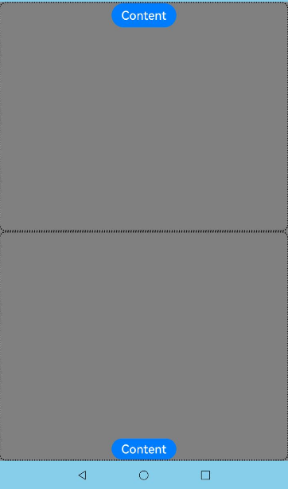

# Modal Transition
<!--Kit: ArkUI-->
<!--Subsystem: ArkUI-->
<!--Owner: @CCFFWW-->
<!--Designer: @CCFFWW-->
<!--Tester: @lxl007-->
<!--Adviser: @HelloCrease-->

You can bind a full-screen modal to a component through the **bindContentCover** attribute. Better yet, with the **ModalTransition** parameter, you can apply a transition effect for when the component is inserted or deleted.

>  **NOTE**
>
>  The initial APIs of this module are supported since API version 10. Updates will be marked with a superscript to indicate their earliest API version.
>
>  Switching between landscape and portrait modes is not supported.
>
>  Route hopping is not supported.

## bindContentCover

bindContentCover(isShow: boolean, builder: CustomBuilder, type?: ModalTransition): T

Binds a modal to the component, which can be displayed when the component is touched. The content of the modal is customizable. The transition type can be set to none, slide-up and slide-down animation, and opacity gradient animation.

**Atomic service API**: This API can be used in atomic services since API version 11.

**System capability**: SystemCapability.ArkUI.ArkUI.Full

**Parameters**

| Name | Type                                       | Mandatory| Description                                                        |
| ------- | ------------------------------------------- | ---- | ------------------------------------------------------------ |
| isShow  | boolean                        | Yes  | Whether to display the modal.<br>- **true**: Display the modal.<br>- **false**: Hide the modal.<br>Since API version 10, this parameter supports two-way binding through [$$](../../../ui/state-management/arkts-two-way-sync.md).<br>Since API version 18, this parameter supports two-way binding through [!!](../../../ui/state-management/arkts-new-binding.md#two-way-binding-between-built-in-component-parameters).|
| builder | [CustomBuilder](ts-types.md#custombuilder8) | Yes  | Content of the modal.                                      |
| type | [ModalTransition](ts-universal-attributes-sheet-transition.md#modaltransition) | No  | System transition mode of the modal.<br> Default value: **ModalTransition.DEFAULT**.<br>**NOTE**<br> This property has no effect when it is set together with **transition**.                                |

**Return value**

| Type  | Description                    |
| ------ | ------------------------ |
| T | Current component.|

## bindContentCover

bindContentCover(isShow: boolean, builder: CustomBuilder, options?: ContentCoverOptions): T

Binds a modal to the component, which can be displayed when the component is touched. The content of the modal page can be customized. The transition mode can be customized.

**Atomic service API**: This API can be used in atomic services since API version 11.

**System capability**: SystemCapability.ArkUI.ArkUI.Full

**Parameters**

| Name | Type                                       | Mandatory| Description                                                        |
| ------- | ------------------------------------------- | ---- | ------------------------------------------------------------ |
| isShow  | boolean                        | Yes  | Whether to display the modal.<br>- **true**: Display the modal.<br>- **false**: Hide the modal.<br>Since API version 10, this parameter supports two-way binding through [$$](../../../ui/state-management/arkts-two-way-sync.md).<br>Since API version 18, this parameter supports two-way binding through [!!](../../../ui/state-management/arkts-new-binding.md#two-way-binding-between-built-in-component-parameters).|
| builder | [CustomBuilder](ts-types.md#custombuilder8) | Yes  | Content of the modal.                                      |
| options | [ContentCoverOptions](#contentcoveroptions) | No  | Optional attributes of the modal.                                |

**Return value**

| Type  | Description                    |
| ------ | ------------------------ |
| T | Current component.|

## ContentCoverOptions
Inherited from [BindOptions](ts-universal-attributes-sheet-transition.md#bindoptions).

Full-screen modal page content options.

**System capability**: SystemCapability.ArkUI.ArkUI.Full

| Name             | Type                                      | Read-Only|  Optional  | Description           |
| --------------- | ---------------------------------------- | ---- | ---- | ------------- |
| modalTransition | [ModalTransition](ts-universal-attributes-sheet-transition.md#modaltransition) | No| Yes   | System transition mode of the modal.<br> Default value: **ModalTransition.DEFAULT**.<br>**NOTE**<br> This property has no effect when it is set together with **transition**.<br>**Atomic service API**: This API can be used in atomic services since API version 11. |
| onWillDismiss<sup>12+</sup> | Callback&lt;[DismissContentCoverAction](#dismisscontentcoveraction12)&gt; | No| Yes  | Callback invoked to prevent a user attempt to dismiss the modal.<br>**NOTE**<br>After this callback is registered, touching the back button does not immediately dismiss the modal. You can use the **reason** parameter to determine the type of operation that triggers the dismiss and decide whether to dismiss the modal based on the reason. Nesting **onWillDismiss** callbacks is not allowed.<br>**Atomic service API**: This API can be used in atomic services since API version 12.|
| transition<sup>12+</sup> | [TransitionEffect](ts-transition-animation-component.md#transitioneffect10) | No| Yes  | Custom transition mode of the modal.<br>**Atomic service API**: This API can be used in atomic services since API version 12.|
| enableSafeArea<sup>20+</sup> | boolean  | No| Yes | Indicates whether the modal page adapts to the safe area. The value true indicates that the modal page adapts to the safe area, and the content is limited in the safe area to avoid the navigation bar and status bar. The value false indicates that the modal page does not adapt to the safe area, and the style is the same as the previous style. The default value is **false**.<br>**Atomic service API**: This API can be used in atomic services since API version 20.|

## DismissContentCoverAction<sup>12+</sup>

**Atomic service API**: This API can be used in atomic services since API version 12.

**System capability**: SystemCapability.ArkUI.ArkUI.Full

| Name             | Type                                      | Read-Only| Optional  | Description           |
| --------------- | -------------------- | -------------------- | ---- | ------------- |
| dismiss | [Callback](./ts-types.md#callback12)\<void> | No| No   | Callback invoked when the modal is dismissed. Called when you need to exit the page.|
| reason | [DismissReason](ts-universal-attributes-popup.md#dismissreason12) | No| No   | Type of operation that triggers the dismiss of the modal. |

## Example

### Example 1: Implementing Modal Transition Using bindContentCover

This example demonstrates how to implement a modal transition using the **bindContentCover** API.

```ts
// xxx.ets
@Entry
@Component
struct ModalTransitionExample {
  @State isShow: boolean = false;
  @State isShow2: boolean = false;

  @Builder
  myBuilder2() {
    Column() {
      Button("close modal 2")
        .margin(10)
        .fontSize(20)
        .onClick(() => {
          this.isShow2 = false;
        })
    }
    .width('100%')
    .height('100%')
  }

  @Builder
  myBuilder() {
    Column() {
      Button("transition modal 2")
        .margin(10)
        .fontSize(20)
        .onClick(() => {
          this.isShow2 = true;
        }).bindContentCover(this.isShow2, this.myBuilder2(), {
        modalTransition: ModalTransition.NONE,
        backgroundColor: Color.Orange,
        onWillAppear: () => {
          console.info("BindContentCover onWillAppear.");
        },
        onAppear: () => {
          console.info("BindContentCover onAppear.");
        },
        onWillDisappear: () => {
          console.info("BindContentCover onWillDisappear.");
        },
        onDisappear: () => {
          console.info("BindContentCover onDisappear.");
        }
      })

      Button("close modal 1")
        .margin(10)
        .fontSize(20)
        .onClick(() => {
          this.isShow = false;
        })
    }
    .width('100%')
    .height('100%')
    .justifyContent(FlexAlign.Center)
  }

  build() {
    Column() {
      Button("transition modal 1")
        .onClick(() => {
          this.isShow = true;
        })
        .fontSize(20)
        .margin(10)
        .bindContentCover(this.isShow, this.myBuilder(), {
          modalTransition: ModalTransition.NONE,
          backgroundColor: Color.Pink,
          onWillAppear: () => {
            console.info("BindContentCover onWillAppear.");
          },
          onAppear: () => {
            console.info("BindContentCover onAppear.");
          },
          onWillDisappear: () => {
            console.info("BindContentCover onWillDisappear.");
          },
          onDisappear: () => {
            console.info("BindContentCover onDisappear.");
          }
        })
    }
    .justifyContent(FlexAlign.Center)
    .backgroundColor("#ff49c8ab")
    .width('100%')
    .height('100%')
  }
}
```


### Example 2: Implementing a Custom Transition Animation

This example applies a custom animation to two modals whose transition type is none.

```ts
// xxx.ets
import { curves } from '@kit.ArkUI';

@Entry
@Component
struct ModalTransitionExample {
  @State @Watch("isShow1Change") isShow: boolean = false;
  @State @Watch("isShow2Change") isShow2: boolean = false;
  @State isScale1: number = 1;
  @State isScale2: number = 1;

  isShow1Change() {
    this.isShow ? this.isScale1 = 0.95 : this.isScale1 = 1;
  }

  isShow2Change() {
    this.isShow2 ? this.isScale2 = 0.95 : this.isScale2 = 1;
  }

  @Builder
  myBuilder2() {
    Column() {
      Button("close modal 2")
        .margin(10)
        .fontSize(20)
        .onClick(() => {
          this.isShow2 = false;
        })
    }
    .width('100%')
    .height('100%')
  }

  @Builder
  myBuilder() {
    Column() {
      Button("transition modal 2")
        .margin(10)
        .fontSize(20)
        .onClick(() => {
          this.isShow2 = true;
        }).bindContentCover(this.isShow2, this.myBuilder2(), {
        modalTransition: ModalTransition.NONE,
        backgroundColor: Color.Orange,
        onWillAppear: () => {
          console.log("BindContentCover onWillAppear.");
        },
        onAppear: () => {
          console.log("BindContentCover onAppear.");
        },
        onWillDisappear: () => {
          console.log("BindContentCover onWillDisappear.");
        },
        onDisappear: () => {
          console.log("BindContentCover onDisappear.");
        }
      })

      Button("close modal 1")
        .margin(10)
        .fontSize(20)
        .onClick(() => {
          this.isShow = false;
        })
    }
    .width('100%')
    .height('100%')
    .justifyContent(FlexAlign.Center)
    .scale({ x: this.isScale2, y: this.isScale2 })
    .animation({ curve: curves.springMotion() })
  }

  build() {
    Column() {
      Button("transition modal 1")
        .onClick(() => {
          this.isShow = true;
        })
        .fontSize(20)
        .margin(10)
        .bindContentCover(this.isShow, this.myBuilder(), {
          modalTransition: ModalTransition.NONE,
          backgroundColor: Color.Pink,
          onWillAppear: () => {
            console.log("BindContentCover onWillAppear.");
          },
          onAppear: () => {
            console.log("BindContentCover onAppear.");
          },
          onWillDisappear: () => {
            console.log("BindContentCover onWillDisappear.");
          },
          onDisappear: () => {
            console.log("BindContentCover onDisappear.");
          }
        })
    }
    .justifyContent(FlexAlign.Center)
    .backgroundColor("#ff49c8ab")
    .width('100%')
    .height('100%')
    .scale({ x: this.isScale1, y: this.isScale1 })
    .animation({ curve: curves.springMotion() })
  }
}
```


### Example 3: Implementing a Slide-up and Slide-down Transition Animation

This example shows two modals whose transition type is slide-up and slide-down animation.

```ts
// xxx.ets
@Entry
@Component
struct ModalTransitionExample {
  @State isShow: boolean = false;
  @State isShow2: boolean = false;

  @Builder
  myBuilder2() {
    Column() {
      Button("close modal 2")
        .margin(10)
        .fontSize(20)
        .onClick(() => {
          this.isShow2 = false;
        })
    }
    .width('100%')
    .height('100%')
  }

  @Builder
  myBuilder() {
    Column() {
      Button("transition modal 2")
        .margin(10)
        .fontSize(20)
        .onClick(() => {
          this.isShow2 = true;
        }).bindContentCover(this.isShow2, this.myBuilder2(), {
        modalTransition: ModalTransition.DEFAULT,
        backgroundColor: Color.Gray,
        onWillAppear: () => {
          console.log("BindContentCover onWillAppear.");
        },
        onAppear: () => {
          console.log("BindContentCover onAppear.");
        },
        onWillDisappear: () => {
          console.log("BindContentCover onWillDisappear.");
        },
        onDisappear: () => {
          console.log("BindContentCover onDisappear.");
        }
      })

      Button("close modal 1")
        .margin(10)
        .fontSize(20)
        .onClick(() => {
          this.isShow = false;
        })
    }
    .width('100%')
    .height('100%')
    .justifyContent(FlexAlign.Center)
  }

  build() {
    Column() {
      Button("transition modal 1")
        .onClick(() => {
          this.isShow = true;
        })
        .fontSize(20)
        .margin(10)
        .bindContentCover(this.isShow, this.myBuilder(), {
          modalTransition: ModalTransition.DEFAULT,
          backgroundColor: Color.Pink,
          onWillAppear: () => {
            console.log("BindContentCover onWillAppear.");
          },
          onAppear: () => {
            console.log("BindContentCover onAppear.");
          },
          onWillDisappear: () => {
            console.log("BindContentCover onWillDisappear.");
          },
          onDisappear: () => {
            console.log("BindContentCover onDisappear.");
          }
        })
    }
    .justifyContent(FlexAlign.Center)
    .backgroundColor(Color.White)
    .width('100%')
    .height('100%')
  }
}
```


### Example 4: Implementing an Opacity Transition Animation

This example shows two modals whose transition type is opacity animation.

```ts
// xxx.ets
@Entry
@Component
struct ModalTransitionExample {
  @State isShow: boolean = false;
  @State isShow2: boolean = false;

  @Builder
  myBuilder2() {
    Column() {
      Button("close modal 2")
        .margin(10)
        .fontSize(20)
        .onClick(() => {
          this.isShow2 = false;
        })
    }
    .width('100%')
    .height('100%')
    .justifyContent(FlexAlign.Center)
  }

  @Builder
  myBuilder() {
    Column() {
      Button("transition modal 2")
        .margin(10)
        .fontSize(20)
        .onClick(() => {
          this.isShow2 = true;
        }).bindContentCover(this.isShow2, this.myBuilder2(), {
        modalTransition: ModalTransition.ALPHA,
        backgroundColor: Color.Gray,
        onWillAppear: () => {
          console.log("BindContentCover onWillAppear.");
        },
        onAppear: () => {
          console.log("BindContentCover onAppear.");
        },
        onWillDisappear: () => {
          console.log("BindContentCover onWillDisappear.");
        },
        onDisappear: () => {
          console.log("BindContentCover onDisappear.");
        }
      })

      Button("close modal 1")
        .margin(10)
        .fontSize(20)
        .onClick(() => {
          this.isShow = false;
        })
    }
    .width('100%')
    .height('100%')
    .justifyContent(FlexAlign.Center)
  }

  build() {
    Column() {
      Button("transition modal 1")
        .onClick(() => {
          this.isShow = true;
        })
        .fontSize(20)
        .margin(10)
        .bindContentCover(this.isShow, this.myBuilder(), {
          modalTransition: ModalTransition.ALPHA,
          backgroundColor: Color.Pink,
          onWillAppear: () => {
            console.log("BindContentCover onWillAppear.");
          },
          onAppear: () => {
            console.log("BindContentCover onAppear.");
          },
          onWillDisappear: () => {
            console.log("BindContentCover onWillDisappear.");
          },
          onDisappear: () => {
            console.log("BindContentCover onDisappear.");
          }
        })
    }
    .justifyContent(FlexAlign.Center)
    .backgroundColor(Color.White)
    .width('100%')
    .height('100%')
  }
}
```


### Example 5: Implementing Custom Transitions with Different Effects

This example demonstrates custom transitions for modals, including rotation and translation effects.

```ts
// xxx.ets
@Entry
@Component
struct ModalTransitionExample {
  @State isShow: boolean = false;
  @State isShow2: boolean = false;

  @Builder
  myBuilder2() {
    Column() {
      Button("Close Modal 2")
        .margin(10)
        .fontSize(20)
        .onClick(() => {
          this.isShow2 = false;
        })
    }
    .width('100%')
    .height('100%')
    .justifyContent(FlexAlign.Center)
  }

  @Builder
  myBuilder() {
    Column() {
      Button("Transition Modal 2")
        .margin(10)
        .fontSize(20)
        .onClick(() => {
          this.isShow2 = true;
        })
        .bindContentCover(
          this.isShow2,
          this.myBuilder2(),
          {
            modalTransition: ModalTransition.DEFAULT,
            backgroundColor: Color.Gray,
            transition: TransitionEffect.SLIDE.animation({ duration: 5000, curve: Curve.LinearOutSlowIn }),
            onWillDismiss: ((dismissContentCoverAction: DismissContentCoverAction) => {
              if (dismissContentCoverAction.reason == DismissReason.PRESS_BACK) {
                console.log("BindContentCover dismiss reason is back pressed");
              }
              dismissContentCoverAction.dismiss();
            }),
            onAppear: () => {
              console.info("BindContentCover onAppear.");
            },
            onDisappear: () => {
              this.isShow2 = false;
              console.info("BindContentCover onDisappear.");
            }
          })

      Button("Close Modal 1")
        .margin(10)
        .fontSize(20)
        .onClick(() => {
          this.isShow = false;
        })
    }
    .width('100%')
    .height('100%')
    .justifyContent(FlexAlign.Center)
  }

  build() {
    Column() {
      Button("Transition Modal 1")
        .onClick(() => {
          this.isShow = true;
        })
        .fontSize(20)
        .margin(10)
        .bindContentCover(
          this.isShow,
          this.myBuilder(),
          {
            modalTransition: ModalTransition.DEFAULT,
            backgroundColor: Color.Pink,
            transition: TransitionEffect.asymmetric(
              TransitionEffect.OPACITY.animation({ duration: 1100 }).combine(
                TransitionEffect.rotate({ z: 1, angle: 180 }).animation({ delay: 1000, duration: 1000 }))
              ,
              TransitionEffect.OPACITY.animation({ duration: 1200 }).combine(
                TransitionEffect.rotate({ z: 1, angle: 180 }).animation({ duration: 1300 }))
            ),
            onWillDismiss: ((dismissContentCoverAction: DismissContentCoverAction) => {
              if (dismissContentCoverAction.reason == DismissReason.PRESS_BACK) {
                console.log("back pressed");
              }
              dismissContentCoverAction.dismiss();
            }),
            onAppear: () => {
              console.log("BindContentCover onAppear.");
            },
            onDisappear: () => {
              this.isShow = false;
              console.log("BindContentCover onDisappear.");
            }
          })
    }
    .justifyContent(FlexAlign.Center)
    .backgroundColor(Color.White)
    .width('100%')
    .height('100%')
  }
}
```


### Example 6: Setting the Safe Area for the Modal

This example demonstrates the content effect after the modal mode is adapted to the safe area by setting enableSafeArea to true. The background color of the modal container is light blue, the content color is gray, and the content is laid out in the safe area.

```ts
// xxx.ets
@Entry
@Component
struct SafeAreaController {
  @State isShow: boolean = false;
  @State SafeArea: boolean | undefined = true;
  @State heightMode: string = '100%';

  @Builder
  myBuilder() {
    Column() {
      Column() {
        Button("Content")
          .fontSize(20)
      }
      .width('100%')
      .height('50%')
      .borderRadius(10)
      .borderStyle(BorderStyle.Dotted)
      .borderWidth(2)
      Column() {
        Button("Content")
          .margin({top:340})
          .fontSize(20)
      }
      .width('100%')
      .height('50%')
      .borderRadius(10)
      .borderStyle(BorderStyle.Dotted)
      .borderWidth(2)
    }
    .backgroundColor(Color.Grey)
    .justifyContent(FlexAlign.Center)
    .width('100%')
    .height(this.heightMode)
  }
  build() {
    Column() {
      Button("Open ContentCover")
        .onClick(() => this.isShow = true)
        .fontSize(20)
        .margin(10)
        .bindContentCover(this.isShow, this.myBuilder(), {
          modalTransition: ModalTransition.ALPHA,
          backgroundColor: 0x87CEEB,
          //Dynamically set the safe area mode.
          enableSafeArea: this.SafeArea
        })
    }
    .justifyContent(FlexAlign.Center)
    .width('100%')
    .height('100%')
  }
}
```


