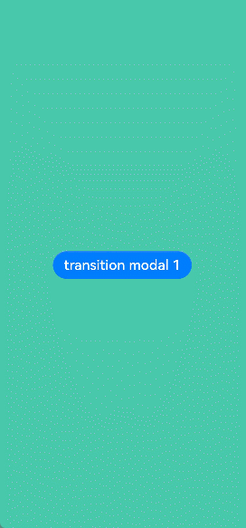
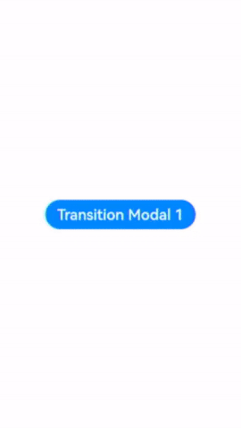

# Modal Transition
<!--Kit: ArkUI-->
<!--Subsystem: ArkUI-->
<!--Owner: @CCFFWW-->
<!--Designer: @CCFFWW-->
<!--Tester: @lxl007-->
<!--Adviser: @Brilliantry_Rui-->
<!-- md-trans-meta sourceCommit=39ca26def5c22dc659f3dc0b76ef62a29421e77a translatedAt=2026-09-02T11:56:33.585Z -->

Binds a full-screen modal page to the component through the bindContentCover attribute. When the modal page is displayed or hidden, transition effects can be displayed by setting transition parameters (ModalTransition or TransitionEffect).

>  **NOTE**
>
>  The initial APIs of this module are supported since API version 10. Updates will be marked with a superscript to indicate their earliest API version.
>
>  Switching between landscape and portrait modes is not supported.
>
>  Route hopping is not supported.

## bindContentCover

bindContentCover(isShow: boolean, builder: CustomBuilder, type?: ModalTransition): T

Binds a full-screen modal page to the component, and controls the display and hiding of the modal page through the isShow parameter. The content of the modal page is customizable, and the display mode can be set to no-animation transition, switching up and down transition, and opacity gradient transition.

> **NOTE**
>
> This API cannot be called within [attributeModifier](ts-universal-attributes-attribute-modifier.md#attributemodifier).

**Atomic service API**: This API can be used in atomic services since API version 11.

**System capability**: SystemCapability.ArkUI.ArkUI.Full

**Parameters**

| Name | Type                                       | Mandatory| Description                                                        |
| ------- | ------------------------------------------- | ---- | ------------------------------------------------------------ |
| isShow  | boolean                        | Yes   | Whether to display the full-screen modal page.<br>-true: displays the full-screen modal page.<br>-false: hides the full-screen modal page.<br>Since API version 10, this parameter supports [$$](../../../ui/state-management/arkts-two-way-sync.md) two-way binding variables.<br>Since API version 18, this parameter supports [!!](../../../ui/state-management/arkts-new-binding.md#two-way-binding-between-built-in-component-parameters) two-way binding variables.|
| builder | [CustomBuilder](ts-types.md#custombuilder8) | Yes   | Configures the content of the full-screen modal page. The root node in the builder must be unique.<!--RP1--><!--RP1End-->                           |
| type | [ModalTransition](ts-universal-attributes-sheet-transition.md#modaltransition) | No   | System transition mode of the full-screen modal page.<br>Value principles: DEFAULT - switching up and down transition, NONE - no animation transition, ALPHA - opacity gradient transition.<br> Default value: ModalTransition.DEFAULT, that is, switching up and down transition.<br>**Note:**<br> When set simultaneously with transition, this attribute does not take effect, and only transition takes effect.                                 |

**Return value**

| Type  | Description                    |
| ------ | ------------------------ |
| T | Current component, used for chained calls. |

## bindContentCover

bindContentCover(isShow: boolean, builder: CustomBuilder, options?: ContentCoverOptions): T

Binds a full-screen modal page to the component, and controls the display and hiding of the modal page through the isShow parameter. Both the content and transition mode of the modal page can be customized.

> **NOTE**
>
> This API cannot be called within [attributeModifier](ts-universal-attributes-attribute-modifier.md#attributemodifier).

**Atomic service API**: This API can be used in atomic services since API version 11.

**System capability**: SystemCapability.ArkUI.ArkUI.Full

**Parameters**

| Name | Type                                       | Mandatory| Description                                                        |
| ------- | ------------------------------------------- | ---- | ------------------------------------------------------------ |
| isShow  | boolean                        | Yes   | Whether to display the full-screen modal page.<br>-true: Display the full-screen modal page.<br>-false: Hide the full-screen modal page.<br>Since API version 10, this parameter supports two-way binding through [$$](../../../ui/state-management/arkts-two-way-sync.md).<br>Since API version 18, this parameter supports two-way binding through [!!](../../../ui/state-management/arkts-new-binding.md#two-way-binding-between-built-in-component-parameters). |
| builder | [CustomBuilder](ts-types.md#custombuilder8) | Yes  | Content of the modal.                                      |
| options | [ContentCoverOptions](#contentcoveroptions) | No | Optional attributes for configuring the full-screen modal page. If this parameter is not passed, each optional attribute uses its default value. |

**Return value**

| Type  | Description                    |
| ------ | ------------------------ |
| T | Current component, used for chained calls. |

## ContentCoverOptions
Inherited from [BindOptions](ts-universal-attributes-sheet-transition.md#bindoptions).

Provides content options of the modal.

**System capability**: SystemCapability.ArkUI.ArkUI.Full

| Name             | Type                                      | Read-Only|  Optional  | Description           |
| --------------- | ---------------------------------------- | ---- | ---- | ------------- |
| modalTransition | [ModalTransition](ts-universal-attributes-sheet-transition.md#modaltransition) | No | Yes | System transition mode of the full-screen modal page.<br>Value principles: DEFAULT - switching up and down transition, NONE - no animation transition, ALPHA - opacity gradient transition.<br>Default value: ModalTransition.DEFAULT.<br>**Note:**<br>When set simultaneously with transition, this attribute does not take effect, and only transition takes effect.<br>**Atomic service API:** Since API version 11, this API is supported in atomic services. |
| onWillDismiss<sup>12+</sup> | [Callback](./ts-types.md#callback12)&lt;[DismissContentCoverAction](#dismisscontentcoveraction12)&gt; | No | Yes | Interactive dismiss callback of the full-screen modal page.<br>**Note:**<br>When the user triggers the closure of the full-screen modal page through operations such as the back key, if this callback is registered, the page will not be closed immediately. In the callback, you can obtain the operation type that intercepts the page closure through reason, and then decide whether to close the full-screen modal page based on the reason. To close the page, you must call the DismissContentCoverAction.dismiss() method in the callback. If dismiss() is not called, the full-screen modal page remains open and will not be closed. In the onWillDismiss callback, onWillDismiss interception cannot be performed again.<br>**Atomic service API:** Since API version 12, this API is supported in atomic services. |
| transition<sup>12+</sup> | [TransitionEffect](ts-transition-animation-component.md#transitioneffect10) | No | Yes | Custom transition mode of the full-screen modal page.<br>**Note:**<br>When not set, the custom transition is not used by default, and the system transition mode of modalTransition is used. When set simultaneously with modalTransition, only transition takes effect, and the modalTransition attribute does not take effect.<br>**Atomic service API:** Since API version 12, this API is supported in atomic services. |
| enableSafeArea<sup>20+</sup> | boolean | No | Yes | Whether the full-screen modal adapts to the safe area. The value true indicates that the full-screen modal adapts to the safe area, restricting the content within the safe area and avoiding the navigation bar and status bar. The value false indicates that the full-screen modal does not adapt to the safe area, the content of the full-screen modal page is not restricted by the safe area, the navigation bar and status bar are not avoided, no processing is performed, and the style remains consistent with the previous one. The default value is false.<br>**Atomic service API:** Since API version 20, this API is supported in atomic services. |

## DismissContentCoverAction<sup>12+</sup>

**Atomic service API**: This API can be used in atomic services since API version 12.

**System capability**: SystemCapability.ArkUI.ArkUI.Full

| Name             | Type                                      | Read-Only| Optional  | Description           |
| --------------- | -------------------- | -------------------- | ---- | ------------- |
| dismiss | [Callback](./ts-types.md#callback12)\<void> | No | No | Callback invoked when the full-screen modal page is closed. This method must be called in the onWillDismiss callback to close the full-screen modal page. If it is not called, the full-screen modal page remains open. |
| reason | [DismissReason](ts-universal-attributes-popup.md#dismissreason12) | No| No   | Type of operation that triggers the dismiss of the modal. |

## Examples

### Example 1: Implementing Modal Transition Using bindContentCover

This example demonstrates how to implement a modal transition using the **bindContentCover** API.

```ts
// xxx.ets
@Entry
@Component
struct ModalTransitionExample {
  @State isShow: boolean = false;
  @State isShow2: boolean = false;

  @Builder
  myBuilder2() {
    Column() {
      Button('close modal 2')
        .margin(10)
        .fontSize(20)
        .onClick(() => {
          this.isShow2 = false;
        })
    }
    .width('100%')
    .height('100%')
  }

  @Builder
  myBuilder() {
    Column() {
      Button("transition modal 2")
        .margin(10)
        .fontSize(20)
        .onClick(() => {
          this.isShow2 = true;
        }).bindContentCover(this.isShow2, this.myBuilder2(), {
        modalTransition: ModalTransition.NONE,
        backgroundColor: Color.Orange,
        onWillAppear: () => {
          console.info('BindContentCover onWillAppear.');
        },
        onAppear: () => {
          console.info("BindContentCover onAppear.");
        },
        onWillDisappear: () => {
          console.info("BindContentCover onWillDisappear.");
        },
        onDisappear: () => {
          console.info("BindContentCover onDisappear.");
        }
      })

      Button("close modal 1")
        .margin(10)
        .fontSize(20)
        .onClick(() => {
          this.isShow = false;
        })
    }
    .width('100%')
    .height('100%')
    .justifyContent(FlexAlign.Center)
  }

  build() {
    Column() {
      Button("transition modal 1")
        .onClick(() => {
          this.isShow = true;
        })
        .fontSize(20)
        .margin(10)
        .bindContentCover(this.isShow, this.myBuilder(), {
          modalTransition: ModalTransition.NONE,
          backgroundColor: Color.Pink,
          onWillAppear: () => {
            console.info("BindContentCover onWillAppear.");
          },
          onAppear: () => {
            console.info("BindContentCover onAppear.");
          },
          onWillDisappear: () => {
            console.info("BindContentCover onWillDisappear.");
          },
          onDisappear: () => {
            console.info("BindContentCover onDisappear.");
          }
        })
    }
    .justifyContent(FlexAlign.Center)
    .backgroundColor("#ff49c8ab")
    .width('100%')
    .height('100%')
  }
}
```



### Example 2: Implementing a Custom Transition Animation

This example applies a custom animation to two modals whose transition type is none.

```ts
// xxx.ets
import { curves } from '@kit.ArkUI';

@Entry
@Component
struct ModalTransitionExample {
  @State @Watch("isShow1Change") isShow: boolean = false;
  @State @Watch("isShow2Change") isShow2: boolean = false;
  @State scale1: number = 1;
  @State scale2: number = 1;

  isShow1Change() {
    this.isShow ? this.scale1 = 0.95 : this.scale1 = 1;
  }

  isShow2Change() {
    this.isShow2 ? this.scale2 = 0.95 : this.scale2 = 1;
  }

  @Builder
  myBuilder2() {
    Column() {
      Button('close modal 2')
        .margin(10)
        .fontSize(20)
        .onClick(() => {
          this.isShow2 = false;
        })
    }
    .width('100%')
    .height('100%')
  }

  @Builder
  myBuilder() {
    Column() {
      Button('transition modal 2')
        .margin(10)
        .fontSize(20)
        .onClick(() => {
          this.isShow2 = true;
        }).bindContentCover(this.isShow2, this.myBuilder2(), {
        modalTransition: ModalTransition.NONE,
        backgroundColor: Color.Orange,
        onWillAppear: () => {
          console.info("BindContentCover onWillAppear.");
        },
        onAppear: () => {
          console.info("BindContentCover onAppear.");
        },
        onWillDisappear: () => {
          console.info("BindContentCover onWillDisappear.");
        },
        onDisappear: () => {
          console.info("BindContentCover onDisappear.");
        }
      })

      Button('close modal 1')
        .margin(10)
        .fontSize(20)
        .onClick(() => {
          this.isShow = false;
        })
    }
    .width('100%')
    .height('100%')
    .justifyContent(FlexAlign.Center)
    .scale({ x: this.scale2, y: this.scale2 })
    .animation({ curve: curves.springMotion() })
  }

  build() {
    Column() {
      Button("transition modal 1")
        .onClick(() => {
          this.isShow = true;
        })
        .fontSize(20)
        .margin(10)
        .bindContentCover(this.isShow, this.myBuilder(), {
          modalTransition: ModalTransition.NONE,
          backgroundColor: Color.Pink,
          onWillAppear: () => {
            console.info("BindContentCover onWillAppear.");
          },
          onAppear: () => {
            console.info("BindContentCover onAppear.");
          },
          onWillDisappear: () => {
            console.info("BindContentCover onWillDisappear.");
          },
          onDisappear: () => {
            console.info("BindContentCover onDisappear.");
          }
        })
    }
    .justifyContent(FlexAlign.Center)
    .backgroundColor("#ff49c8ab")
    .width('100%')
    .height('100%')
    .scale({ x: this.scale1, y: this.scale1 })
    .animation({ curve: curves.springMotion() })
  }
}
```


### Example 3: Implementing a Slide-up and Slide-down Transition Animation

This example shows two modals whose transition type is slide-up and slide-down animation.

```ts
// xxx.ets
@Entry
@Component
struct ModalTransitionExample {
  @State isShow: boolean = false;
  @State isShow2: boolean = false;

  @Builder
  myBuilder2() {
    Column() {
      Button('close modal 2')
        .margin(10)
        .fontSize(20)
        .onClick(() => {
          this.isShow2 = false;
        })
    }
    .width('100%')
    .height('100%')
  }

  @Builder
  myBuilder() {
    Column() {
      Button('transition modal 2')
        .margin(10)
        .fontSize(20)
        .onClick(() => {
          this.isShow2 = true;
        }).bindContentCover(this.isShow2, this.myBuilder2(), {
        modalTransition: ModalTransition.DEFAULT,
        backgroundColor: Color.Gray,
        onWillAppear: () => {
          console.info("BindContentCover onWillAppear.");
        },
        onAppear: () => {
          console.info("BindContentCover onAppear.");
        },
        onWillDisappear: () => {
          console.info("BindContentCover onWillDisappear.");
        },
        onDisappear: () => {
          console.info("BindContentCover onDisappear.");
        }
      })

      Button('close modal 1')
        .margin(10)
        .fontSize(20)
        .onClick(() => {
          this.isShow = false;
        })
    }
    .width('100%')
    .height('100%')
    .justifyContent(FlexAlign.Center)
  }

  build() {
    Column() {
      Button("transition modal 1")
        .onClick(() => {
          this.isShow = true;
        })
        .fontSize(20)
        .margin(10)
        .bindContentCover(this.isShow, this.myBuilder(), {
          modalTransition: ModalTransition.DEFAULT,
          backgroundColor: Color.Pink,
          onWillAppear: () => {
            console.info("BindContentCover onWillAppear.");
          },
          onAppear: () => {
            console.info("BindContentCover onAppear.");
          },
          onWillDisappear: () => {
            console.info("BindContentCover onWillDisappear.");
          },
          onDisappear: () => {
            console.info("BindContentCover onDisappear.");
          }
        })
    }
    .justifyContent(FlexAlign.Center)
    .backgroundColor(Color.White)
    .width('100%')
    .height('100%')
  }
}
```


### Example 4: Implementing an Opacity Transition Animation

This example shows two modals whose transition type is opacity animation.

```ts
// xxx.ets
@Entry
@Component
struct ModalTransitionExample {
  @State isShow: boolean = false;
  @State isShow2: boolean = false;

  @Builder
  myBuilder2() {
    Column() {
      Button('close modal 2')
        .margin(10)
        .fontSize(20)
        .onClick(() => {
          this.isShow2 = false;
        })
    }
    .width('100%')
    .height('100%')
    .justifyContent(FlexAlign.Center)
  }

  @Builder
  myBuilder() {
    Column() {
      Button('transition modal 2')
        .margin(10)
        .fontSize(20)
        .onClick(() => {
          this.isShow2 = true;
        }).bindContentCover(this.isShow2, this.myBuilder2(), {
        modalTransition: ModalTransition.ALPHA,
        backgroundColor: Color.Gray,
        onWillAppear: () => {
          console.info("BindContentCover onWillAppear.");
        },
        onAppear: () => {
          console.info("BindContentCover onAppear.");
        },
        onWillDisappear: () => {
          console.info("BindContentCover onWillDisappear.");
        },
        onDisappear: () => {
          console.info("BindContentCover onDisappear.");
        }
      })

      Button('close modal 1')
        .margin(10)
        .fontSize(20)
        .onClick(() => {
          this.isShow = false;
        })
    }
    .width('100%')
    .height('100%')
    .justifyContent(FlexAlign.Center)
  }

  build() {
    Column() {
      Button("transition modal 1")
        .onClick(() => {
          this.isShow = true;
        })
        .fontSize(20)
        .margin(10)
        .bindContentCover(this.isShow, this.myBuilder(), {
          modalTransition: ModalTransition.ALPHA,
          backgroundColor: Color.Pink,
          onWillAppear: () => {
            console.info("BindContentCover onWillAppear.");
          },
          onAppear: () => {
            console.info("BindContentCover onAppear.");
          },
          onWillDisappear: () => {
            console.info("BindContentCover onWillDisappear.");
          },
          onDisappear: () => {
            console.info("BindContentCover onDisappear.");
          }
        })
    }
    .justifyContent(FlexAlign.Center)
    .backgroundColor(Color.White)
    .width('100%')
    .height('100%')
  }
}
```


### Example 5: Implementing Custom Transitions with Different Effects

This example mainly demonstrates custom transitions for full-screen modals, including rotation and translation effects.

```ts
// xxx.ets
@Entry
@Component
struct ModalTransitionExample {
  @State isShow: boolean = false;
  @State isShow2: boolean = false;

  @Builder
  myBuilder2() {
    Column() {
      Button("Close Modal 2")
        .margin(10)
        .fontSize(20)
        .onClick(() => {
          this.isShow2 = false;
        })
    }
    .width('100%')
    .height('100%')
    .justifyContent(FlexAlign.Center)
  }

  @Builder
  myBuilder() {
    Column() {
      Button("Transition Modal 2")
        .margin(10)
        .fontSize(20)
        .onClick(() => {
          this.isShow2 = true;
        })
        .bindContentCover(
          this.isShow2,
          this.myBuilder2(),
          {
            modalTransition: ModalTransition.DEFAULT,
            backgroundColor: Color.Gray,
            transition: TransitionEffect.SLIDE.animation({ duration: 5000, curve: Curve.LinearOutSlowIn }),
            // Handle the close reason and call dismiss() to close the modal.
            onWillDismiss: ((dismissContentCoverAction: DismissContentCoverAction) => {
              if (dismissContentCoverAction.reason === DismissReason.PRESS_BACK) {
                console.info("BindContentCover dismiss reason is back pressed");
              }
              dismissContentCoverAction.dismiss();
            }),
            onAppear: () => {
              console.info("BindContentCover onAppear.");
            },
            // Synchronize the state variable when the modal disappears.
            onDisappear: () => {
              this.isShow2 = false;
              console.info("BindContentCover onDisappear.");
            }
          })

      Button("Close Modal 1")
        .margin(10)
        .fontSize(20)
        .onClick(() => {
          this.isShow = false;
        })
    }
    .width('100%')
    .height('100%')
    .justifyContent(FlexAlign.Center)
  }

  build() {
    Column() {
      Button("Transition Modal 1")
        .onClick(() => {
          this.isShow = true;
        })
        .fontSize(20)
        .margin(10)
        .bindContentCover(
          this.isShow,
          this.myBuilder(),
          {
            modalTransition: ModalTransition.DEFAULT,
            backgroundColor: Color.Pink,
            transition: TransitionEffect.asymmetric(
              TransitionEffect.OPACITY.animation({ duration: 1100 }).combine(
                TransitionEffect.rotate({ z: 1, angle: 180 }).animation({ delay: 1000, duration: 1000 }))
              ,
              TransitionEffect.OPACITY.animation({ duration: 1200 }).combine(
                TransitionEffect.rotate({ z: 1, angle: 180 }).animation({ duration: 1300 }))
            ),
            onWillDismiss: ((dismissContentCoverAction: DismissContentCoverAction) => {
              if (dismissContentCoverAction.reason === DismissReason.PRESS_BACK) {
                console.info("back pressed");
              }
              dismissContentCoverAction.dismiss();
            }),
            onAppear: () => {
              console.info("BindContentCover onAppear.");
            },
            onDisappear: () => {
              this.isShow = false;
              console.info("BindContentCover onDisappear.");
            }
          })
    }
    .justifyContent(FlexAlign.Center)
    .backgroundColor(Color.White)
    .width('100%')
    .height('100%')
  }
}
```



### Example 6: Setting a Full-Screen Modal to Adapt to the Safe Area

Starting from API version 20, this example mainly demonstrates the content effect when enableSafeArea is set to true to adapt the full-screen modal to the safe area. The background color of the full-screen modal container is light blue, the content color is gray, and the content is laid out within the safe area.

```ts
// xxx.ets
@Entry
@Component
struct SafeAreaController {
  @State isShow: boolean = false;
  @State isSafeArea: boolean | undefined = true;
  @State heightMode: string = '100%';

  @Builder
  myBuilder() {
    Column() {
      Column() {
        Button("Content")
          .fontSize(20)
      }
      .width('100%')
      .height('50%')
      .borderRadius(10)
      .borderStyle(BorderStyle.Dotted)
      .borderWidth(2)
      Column() {
        Button("Content")
          .margin({top:340})
          .fontSize(20)
      }
      .width('100%')
      .height('50%')
      .borderRadius(10)
      .borderStyle(BorderStyle.Dotted)
      .borderWidth(2)
    }
    .backgroundColor(Color.Grey)
    .justifyContent(FlexAlign.Center)
    .width('100%')
    .height(this.heightMode)
  }
  build() {
    Column() {
      Button("Open ContentCover")
        .onClick(() => this.isShow = true)
        .fontSize(20)
        .margin(10)
        .bindContentCover(this.isShow, this.myBuilder(), {
          modalTransition: ModalTransition.ALPHA,
          backgroundColor: 0xFF87CEEB,
          // Set the safe zone mode dynamically.
          enableSafeArea: this.isSafeArea
        })
    }
    .justifyContent(FlexAlign.Center)
    .width('100%')
    .height('100%')
  }
}
```

<!--Del--> <!--DelEnd-->
