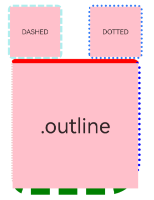
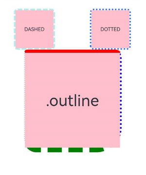

# Outline Styling
<!--Kit: ArkUI-->
<!--Subsystem: ArkUI-->
<!--Owner: @CCFFWW-->
<!--Designer: @CCFFWW-->
<!--Tester: @lxl007-->
<!--Adviser: @Brilliantry_Rui-->
<!-- md-trans-meta sourceCommit=39ca26def5c22dc659f3dc0b76ef62a29421e77a translatedAt=2026-09-02T11:59:52.564Z -->

You can set outline attributes for components. Drawn outside the component, the outline does not affect the component's layout or increase its size.


> **NOTE**
>
> - This feature is supported since API version 11. Updates will be marked with a superscript to indicate their earliest API version.
>
> - The APIs of this module can be used only in the stage model.

## outline

outline(value: OutlineOptions): T

Sets the outer stroke style of a component in a unified manner, allowing you to set the outline width, color, corner radius, and style at once. You can also set each outline attribute separately through the outlineStyle, outlineWidth, outlineColor, and outlineRadius methods. When both are set, the attribute set later takes effect.

**Widget capability**: This API can be used in ArkTS widgets since API version 11.

**Atomic service API**: This API can be used in atomic services since API version 12.

**System capability**: SystemCapability.ArkUI.ArkUI.Full

**Parameters**

| Name| Type                                     | Mandatory| Description        |
| ------ | ----------------------------------------- | ---- | ------------ |
| value  | [OutlineOptions](ts-types.md#outlineoptions11) | Yes   | Outer stroke style. The width and radius do not support percentages. The maximum effective value of radius is component width/2 + outlineWidth or component height/2 + outlineWidth. |

**Return value**

| Type  | Description                    |
| ------ | ------------------------ |
| T | Current component, used for chained calls. |

## outline<sup>18+</sup>

outline(options: Optional\<OutlineOptions>): T

Sets the outer stroke style of a component in a unified manner. The outline is drawn outside the component, without affecting the layout or occupying the component's own size. The outline is visible only when outlineWidth is set to a value greater than 0. Compared with [outline](#outline), the options parameter additionally supports the undefined type.

**Widget capability**: This API can be used in ArkTS widgets since API version 18.

**Atomic service API**: This API can be used in atomic services since API version 18.

**System capability**: SystemCapability.ArkUI.ArkUI.Full

**Parameters**

| Name| Type                                     | Mandatory| Description|
| ------ | ----------------------------------------- | ---- | ---- |
| options | [Optional](ts-universal-attributes-custom-property.md#optionalt)\<[OutlineOptions](ts-types.md#outlineoptions11) | Yes | Outer stroke style. The width and radius do not support percentages. The maximum effective value of radius is component width/2 + outlineWidth or component height/2 + outlineWidth.<br>When the value of options is undefined, the no-outline effect is restored. |

**Return value**

| Type  | Description                    |
| ------ | ------------------------ |
| T | Current component, used for chained calls. |

## OutlineStyle

Enumerates outline styles.

**Widget capability**: This API can be used in ArkTS widgets since API version 11.

**Atomic service API**: This API can be used in atomic services since API version 12.

**System capability**: SystemCapability.ArkUI.ArkUI.Full

| Name    | Value| Description                           |
| ------ | ------ | ----------------------- |
| SOLID  | 0 | Solid border.                     |
| DASHED | 1 | Dashed border.                |
| DOTTED | 2 | Dotted border. The radius of a dot is half of **outlineWidth**.|

## outlineStyle

outlineStyle(value: OutlineStyle \| EdgeOutlineStyles): T

Sets the outer stroke style of an element. When not set, a solid line is displayed by default. The outer stroke style is visible only when outlineWidth is set to a value greater than 0.

**Widget capability**: This API can be used in ArkTS widgets since API version 11.

**Atomic service API**: This API can be used in atomic services since API version 12.

**System capability**: SystemCapability.ArkUI.ArkUI.Full

**Parameters**

| Name| Type                                                        | Mandatory| Description                                                 |
| ------ | ------------------------------------------------------------ | ---- | ----------------------------------------------------- |
| value  | [OutlineStyle](#outlinestyle)&nbsp;\|&nbsp;[EdgeOutlineStyles](ts-types.md#edgeoutlinestyles11 ) | Yes   | Sets the outer stroke style of the element. When not set, a solid line is displayed by default. |

**Return value**

| Type  | Description                    |
| ------ | ------------------------ |
| T | Current component, used for chained calls. |

## outlineStyle<sup>18+</sup>

outlineStyle(style: Optional\<OutlineStyle \| EdgeOutlineStyles>): T

Sets the outer stroke style of an element. The outer stroke style is visible only when outlineWidth is set to a value greater than 0. When not set, a solid line is displayed by default. Compared with [outlineStyle](#outlinestyle), the style parameter additionally supports the undefined type.

**Widget capability**: This API can be used in ArkTS widgets since API version 18.

**Atomic service API**: This API can be used in atomic services since API version 18.

**System capability**: SystemCapability.ArkUI.ArkUI.Full

**Parameters**

| Name| Type                                                        | Mandatory| Description                                                        |
| ------ | ------------------------------------------------------------ | ---- | ------------------------------------------------------------ |
| style  | [Optional](ts-universal-attributes-custom-property.md#optionalt)\<[OutlineStyle](#outlinestyle)&nbsp;\|&nbsp;[EdgeOutlineStyles](ts-types.md#edgeoutlinestyles11) | Yes   | Sets the outer stroke style of the element. The outer stroke style is visible only when outlineWidth is set to a value greater than 0.<br>When the value of style is undefined, the outer stroke style is restored to solid. |

**Return value**

| Type  | Description                    |
| ------ | ------------------------ |
| T | Current component, used for chained calls. |

## outlineWidth

outlineWidth(value: Dimension \| EdgeOutlineWidths): T

Sets the outline width of an element. When not set, the default value is 0, which means no outline width.

**Widget capability**: This API can be used in ArkTS widgets since API version 11.

**Atomic service API**: This API can be used in atomic services since API version 12.

**System capability**: SystemCapability.ArkUI.ArkUI.Full

**Parameters**

| Name| Type                                                        | Mandatory| Description                                                 |
| ------ | ------------------------------------------------------------ | ---- | ----------------------------------------------------- |
| value  | [Dimension](ts-types.md#dimension10)&nbsp;\|&nbsp;[EdgeOutlineWidths](ts-types.md#edgeoutlinewidths11) | Yes   | Sets the outer stroke width of the element. Percentage is not supported. When not set, the default value is 0. |

**Return value**

| Type  | Description                    |
| ------ | ------------------------ |
| T | Current component, used for chained calls. |

## outlineWidth<sup>18+</sup>

outlineWidth(width: Optional\<Dimension \| EdgeOutlineWidths>): T

Sets the outer stroke width of an element. When not set, the default value is 0, that is, no outer stroke width. Compared with [outlineWidth](#outlinewidth), the **width** parameter adds support for the **undefined** type.

**Widget capability**: This API can be used in ArkTS widgets since API version 18.

**Atomic service API**: This API can be used in atomic services since API version 18.

**System capability**: SystemCapability.ArkUI.ArkUI.Full

**Parameters**

| Name| Type                                                        | Mandatory| Description                                                        |
| ------ | ------------------------------------------------------------ | ---- | ------------------------------------------------------------ |
| width  | [Optional](ts-universal-attributes-custom-property.md#optionalt)\<[Dimension](ts-types.md#dimension10)&nbsp;\|&nbsp;[EdgeOutlineWidths](ts-types.md#edgeoutlinewidths11) | Yes   | Sets the outer stroke width of the element. Percentage is not supported; when a percentage is passed in, it does not take effect.<br>When the value of width is undefined, the outer stroke width is restored to 0. |

**Return value**

| Type  | Description                    |
| ------ | ------------------------ |
| T | Current component, used for chained calls. |

## outlineColor

outlineColor(value: ResourceColor \| EdgeColors \| LocalizedEdgeColors): T

Sets the outer stroke color of an element. The outer stroke color is visible only when **outlineWidth** is greater than 0. When not set, the default display is black.

**Widget capability**: This API can be used in ArkTS widgets since API version 11.

**Atomic service API**: This API can be used in atomic services since API version 12.

**System capability**: SystemCapability.ArkUI.ArkUI.Full

**Parameters**

| Name| Type                                                        | Mandatory| Description                                            |
| ------ | ------------------------------------------------------------ | ---- | ------------------------------------------------ |
| value  | [ResourceColor](ts-types.md#resourcecolor)&nbsp;\|&nbsp;[EdgeColors](ts-types.md#edgecolors9)&nbsp;\|&nbsp;[LocalizedEdgeColors](ts-types.md#localizededgecolors12)<sup>12+</sup> | Yes   | Outline color of the element. When not set, the default color is black. |

**Return value**

| Type  | Description                    |
| ------ | ------------------------ |
| T | Current component, used for chained calls. |

## outlineColor<sup>18+</sup>

outlineColor(color: Optional\<ResourceColor \| EdgeColors \| LocalizedEdgeColors>): T

Sets the outer stroke color of an element. The outer stroke color is visible only when **outlineWidth** is greater than 0. When not set, the default display is black. Compared with [outlineColor](#outlinecolor), the **color** parameter adds support for the **undefined** type.

**Widget capability**: This API can be used in ArkTS widgets since API version 18.

**Atomic service API**: This API can be used in atomic services since API version 18.

**System capability**: SystemCapability.ArkUI.ArkUI.Full

**Parameters**

| Name| Type                                                        | Mandatory| Description                                                        |
| ------ | ------------------------------------------------------------ | ---- | ------------------------------------------------------------ |
| color  | [Optional](ts-universal-attributes-custom-property.md#optionalt)\<[ResourceColor](ts-types.md#resourcecolor)&nbsp;\|&nbsp;[EdgeColors](ts-types.md#edgecolors9)&nbsp;\|&nbsp;[LocalizedEdgeColors](ts-types.md#localizededgecolors12)> | Yes   | Sets the outline color of the element.<br>When the value of color is undefined, the outline color is restored to Color.Black. |

**Return value**

| Type  | Description                    |
| ------ | ------------------------ |
| T | Current component, used for chained calls. |

## outlineRadius

outlineRadius(value: Dimension \| OutlineRadiuses): T

Sets the corner radius of the outer stroke of an element. The outer stroke corner radius is visible only when **outlineWidth** is greater than 0. When not set, the default outer stroke corner radius is 0.

**Widget capability**: This API can be used in ArkTS widgets since API version 11.

**Atomic service API**: This API can be used in atomic services since API version 12.

**System capability**: SystemCapability.ArkUI.ArkUI.Full

**Parameters**

| Name| Type                                                        | Mandatory| Description                                                        |
| ------ | ------------------------------------------------------------ | ---- | ------------------------------------------------------------ |
| value  | [Dimension](ts-types.md#dimension10)&nbsp;\|&nbsp;[OutlineRadiuses](ts-types.md#outlineradiuses11) | Yes   | Sets the outer stroke corner radius of the element. Percentage is not supported. The default value is 0 when not set.<br>Maximum effective value: component width/2 + outlineWidth or component height/2 + outlineWidth. |

**Return value**

| Type  | Description                    |
| ------ | ------------------------ |
| T | Current component, used for chained calls. |

## outlineRadius<sup>18+</sup>

outlineRadius(radius: Optional\<Dimension \| OutlineRadiuses>): T

Sets the corner radius of the outer stroke of an element. The outer stroke corner radius is visible only when **outlineWidth** is greater than 0. When not set, the default outer stroke corner radius is 0. Compared with [outlineRadius](#outlineradius), the **radius** parameter adds support for the **undefined** type.

**Widget capability**: This API can be used in ArkTS widgets since API version 18.

**Atomic service API**: This API can be used in atomic services since API version 18.

**System capability**: SystemCapability.ArkUI.ArkUI.Full

**Parameters**

| Name| Type                                                        | Mandatory| Description                                                        |
| ------ | ------------------------------------------------------------ | ---- | ------------------------------------------------------------ |
| radius | [Optional](ts-universal-attributes-custom-property.md#optionalt)\<[Dimension](ts-types.md#dimension10)&nbsp;\|&nbsp;[OutlineRadiuses](ts-types.md#outlineradiuses11) | Yes | Sets the outer stroke corner radius of the element. Percentage is not supported.<br>Maximum effective value: component width/2 + outlineWidth or component height/2 + outlineWidth.<br>When the value of radius is undefined, the outer stroke corner radius is restored to 0. |

**Return value**

| Type  | Description                    |
| ------ | ------------------------ |
| T | Current component, used for chained calls. |

## Examples

### Example 1: Creating Outlines

This example demonstrates how to create component outlines using [outline](#outline).

```ts
// xxx.ets
@Entry
@Component
struct OutlineExample {
  build() {
    Column() {
      Flex({ justifyContent: FlexAlign.SpaceAround, alignItems: ItemAlign.Center }) {
        // Dashed line
        Text('DASHED')
          .backgroundColor(Color.Pink)
          .outlineStyle(OutlineStyle.DASHED).outlineWidth(5).outlineColor(0xAFEEEE).outlineRadius(10)
          .width(120).height(120).textAlign(TextAlign.Center).fontSize(16)
        // Dotted line
        Text('DOTTED')
          .backgroundColor(Color.Pink)
          .outline({ width: 5, color: 0x317AF7, radius: 10, style: OutlineStyle.DOTTED })
          .width(120).height(120).textAlign(TextAlign.Center).fontSize(16)
      }.width('100%').height(150)

      Text('.outline')
        .backgroundColor(Color.Pink)
        .fontSize(50)
        .width(300)
        .height(300)
        .outline({
          width: { left: 3, right: 6, top: 10, bottom: 15 },
          color: { left: '#e3bbbb', right: Color.Blue, top: Color.Red, bottom: Color.Green },
          radius: { topLeft: 10, topRight: 20, bottomLeft: 40, bottomRight: 80 },
          style: {
            left: OutlineStyle.DOTTED,
            right: OutlineStyle.DOTTED,
            top: OutlineStyle.SOLID,
            bottom: OutlineStyle.DASHED
          }
        }).textAlign(TextAlign.Center)
    }
  }
}
```



### Example 2: Using the LocalizedEdgeColors Type

This example demonstrates how to set the **color** attribute of the [outline](#outline) attribute to the [LocalizedEdgeColors](ts-types.md#localizededgecolors12) type.

```ts
// xxx.ets

@Entry
@Component
struct OutlineExample {
  build() {
    Column() {
      Flex({ justifyContent: FlexAlign.SpaceAround, alignItems: ItemAlign.Center }) {
        // Dashed line.
        Text('DASHED')
          .backgroundColor(Color.Pink)
          .outlineStyle(OutlineStyle.DASHED).outlineWidth(5).outlineColor(0xAFEEEE).outlineRadius(10)
          .width(120).height(120).textAlign(TextAlign.Center).fontSize(16)
        // Dotted line
        Text('DOTTED')
          .backgroundColor(Color.Pink)
          .outline({ width: 5, color: 0x317AF7, radius: 10, style: OutlineStyle.DOTTED })
          .width(120).height(120).textAlign(TextAlign.Center).fontSize(16)
      }.width('100%').height(150)

      Text('.outline')
        .backgroundColor(Color.Pink)
        .fontSize(50)
        .width(300)
        .height(300)
        .outline({
          width: { left: 3, right: 6, top: 10, bottom: 15 },
          // color uses the LocalizedEdgeColors type, where start and end correspond to the start edge and end edge colors in different display directions, respectively.
          color: { start: '#e3bbbb', end: Color.Blue, top: Color.Red, bottom: Color.Green },
          radius: { topLeft: 10, topRight: 20, bottomLeft: 40, bottomRight: 80 },
          style: {
            left: OutlineStyle.DOTTED,
            right: OutlineStyle.DOTTED,
            top: OutlineStyle.SOLID,
            bottom: OutlineStyle.DASHED
          }
        }).textAlign(TextAlign.Center)
    }
  }
}
```

The following shows how the example is represented with left-to-right scripts.



The following shows how the example is represented with right-to-left scripts.

