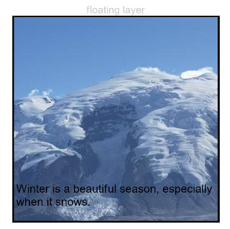
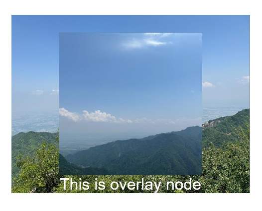

# Overlay Control
<!--Kit: ArkUI-->
<!--Subsystem: ArkUI-->
<!--Owner: @yihao-lin-->
<!--Designer: @piggyguy-->
<!--Tester: @songyanhong-->
<!--Adviser: @Brilliantry_Rui-->
<!-- md-trans-meta sourceCommit=828befee530895124aaf1637c9402999a598c883 translatedAt=2026-09-02T11:59:17.885Z -->

Sets an overlay for a component, which can be used to place mask text, a custom component, or ComponentContent on top of the current component. The overlay supports positioning based on the current component, and is suitable for scenarios such as displaying prompt information and watermarks where content needs to be overlaid on top of a component.

>  **NOTE**
>
>  The feature is supported since API version 7. Updates will be marked with a superscript to indicate their earliest API version.

## overlay

overlay(value: string \| CustomBuilder \| ComponentContent, options?: OverlayOptions): T

Adds mask text, a custom component, or [ComponentContent](#componentcontent12) as the overlay of this component. The overlay is also positioned based on the current component. The overlay is not rendered through the component tree, and APIs that obtain component information, such as [getRectangleById](../arkts-apis-uicontext-componentutils.md#getrectanglebyid), do not support obtaining components in the overlay.

>**NOTE**
>
> - The overlay places the floating layer component above the bound component, blocking all user interactions with components beneath it. To enable interaction with underlying components, refer to the implementation in [Example 2: Setting an Overlay Using a Custom Builder](#example-2-setting-an-overlay-using-a-custom-builder) and configure `.hitTestBehavior(HitTestMode.Transparent)` on the outermost component of the overlay builder. This configuration is especially important when implementing watermarks through an overlay, because the watermark display should not hinder user operations on the underlying components.
>
> - When the overlay API is called multiple times, if both the string type and the [CustomBuilder](ts-types.md#custombuilder8) type are passed in, or both the string type and the [ComponentContent](#componentcontent12) type are passed in, the overlay content is displayed in a stacked manner.

**Widget capability**: This API can be used in ArkTS widgets since API version 9.

**Atomic service API**: This API can be used in atomic services since API version 11.

**System capability**: SystemCapability.ArkUI.ArkUI.Full

**Parameters**

| Name | Type                                                        | Mandatory| Description                                                        |
| ------- | ------------------------------------------------------------ | ---- | ------------------------------------------------------------ |
| value | string&nbsp;\|&nbsp;[CustomBuilder](ts-types.md#custombuilder8)<sup>10+</sup>&nbsp;\| [ComponentContent](#componentcontent12)<sup>12+</sup> | Yes | Entity encapsulation of the mask text content, custom component constructor, or component content.<br/>**Note:**<br/>When a custom component is used as an overlay, keyboard focus cannot move into the custom component. When the overlay is set through CustomBuilder, the content in the overlay is destroyed and re-created on page refresh, causing performance loss. For scenarios with frequent page refresh, it is recommended that you set the overlay using ComponentContent. |
| options | [OverlayOptions](#overlayoptions12) | No | Positioning of the overlay. Pass in this parameter when you need to customize the overlay relative to the component after positioning, then based on the current position's top-left corner for offset. If this parameter is not passed in, the overlay is positioned at the top-left corner of the component by default, using the default value `TopStart` of `align` and the default offset `offset: { x: 0, y: 0 }`.<br/>**Note:**<br/>Before API version 12, options: <br/>{<br/>align?:&nbsp;[Alignment](ts-appendix-enums.md#alignment),&nbsp;<br/>offset?:&nbsp;{x?:&nbsp;number, y?:&nbsp;number}<br/>} |

**Return value**

| Type| Description|
| -------- | -------- |
| T | Current component, used for chained calls. |

>  **NOTE**
>
>  The overlay node does not support mount/unmount events, such as [onAppear](./ts-universal-events-show-hide.md#onappear) and [onDisAppear](./ts-universal-events-show-hide.md#ondisappear).

## OverlayOptions<sup>12+</sup>

>  **NOTE**
>
>  To standardize anonymous object definitions, the element definitions here have been revised in API version 12. While historical version information is preserved for anonymous objects, there may be cases where the outer element's @since version number is higher than inner element's. This does not affect interface usability.

**Widget capability**: This API can be used in ArkTS widgets since API version 12.

**Atomic service API**: This API can be used in atomic services since API version 12.

**Model restriction**: This API can be used only in the stage model.

**System capability**: SystemCapability.ArkUI.ArkUI.Full

| Name                 | Type                                      | Read-Only| Optional | Description                                               |
| --------------------- | -------------------------------------------| --- | -------| --------------------------------------------------- |
| align<sup>7+</sup>   | [Alignment](ts-appendix-enums.md#alignment) | No  | Yes      | Sets the overlay position relative to the component. When set together with offset, the overlay is positioned relative to the component, and then offset based on the top-left corner of the current position.<br>Default value: TopStart<br>**Card capability:** Since API version 9, this API supports being used in ArkTS cards.<br>**Atomic service API:** Since API version 11, this API supports being used in atomic services.         |
| offset<sup>7+</sup>  | [OverlayOffset](#overlayoffset12)          | No  | Yes     | Sets the offset of the overlay based on its own top-left corner. When set together with align, the overlay is positioned relative to the component, and then offset based on the top-left corner of the current position. By default, the overlay is at the top-left corner of the component.<br>**Card capability:** Since API version 9, this API supports being used in ArkTS cards.<br>**Atomic service API:** Since API version 11, this API supports being used in atomic services. |

> **NOTE**
>
> When both **align** and **offset** are set, the positioning effects are combined: the overlay is first aligned relative to the component, and then offset from the upper left corner of its current position.

## OverlayOffset<sup>12+</sup>

>  **NOTE**
>
>  To standardize anonymous object definitions, the element definitions here have been revised in API version 12. While historical version information is preserved for anonymous objects, there may be cases where the outer element's @since version number is higher than inner elements'. This does not affect interface usability.

**Widget capability**: This API can be used in ArkTS widgets since API version 12.

**Atomic service API**: This API can be used in atomic services since API version 12.

**Model restriction**: This API can be used only in the stage model.

**System capability**: SystemCapability.ArkUI.ArkUI.Full

| Name   | Type                                                     | Read-Only| Optional | Description                                               |
| ------- | ---------------------------------------------------------| ---- | ------| --------------------------------------------------- |
| x<sup>7+</sup>        | number                                                   | No   | Yes    | Horizontal offset.<br>Default value: 0<br>Unit: vp<br>**Widget capability**: This API can be used in ArkTS widgets since API version 9.<br>**Atomic service API**: This API can be used in atomic services since API version 11.                               |
| y<sup>7+</sup>        | number                                                   | No   | Yes    | Vertical offset.<br>Default value: 0<br>Unit: vp<br>**Widget capability**: This API can be used in ArkTS widgets since API version 9.<br>**Atomic service API**: This API can be used in atomic services since API version 11.                               |

## ComponentContent<sup>12+</sup>

type ComponentContent\<T \= Object\> = import('../api/arkui/ComponentContent').ComponentContent\<T\>

Represents a constructor used to create a **ComponentContent** object.

**Atomic service API**: This API can be used in atomic services since API version 12.

**Model restriction**: This API can be used only in the stage model.

**System capability**: SystemCapability.ArkUI.ArkUI.Full

| Type|Description|
| ----- | ----------------- |
| import('../api/arkui/ComponentContent').[ComponentContent](../js-apis-arkui-ComponentContent.md)\<T\> | Entity encapsulation of component content.|

## Examples

### Example 1: Setting an Overlay Using a String

This example demonstrates how to set an overlay using a string.

```ts
// xxx.ets
@Entry
@Component
struct OverlayExample {
  build() {
    Column() {
      Column() {
        Text('floating layer')
          .fontSize(12).fontColor(0xCCCCCC).maxLines(1)
        Column() {
          // Replace $r('app.media.img') with the image resource file you use.
          Image($r('app.media.img'))
            .width(240).height(240)
            .overlay('Winter is a beautiful season, especially when it snows.', {
              align: Alignment.Bottom,
              offset: { x: 0, y: -15 }
            })
        }.border({ color: Color.Black, width: 2 })
      }.width('100%')
    }.padding({ top: 20 })
  }
}
```



### Example 2: Setting an Overlay Using a Custom Builder

This example demonstrates how to set an overlay using a custom builder.

```ts
// xxx.ets
@Entry
@Component
struct OverlayExample {
  @Builder
  overlayNode() {
    Column() {
      // Replace $r('app.media.img1') with the image resource file you use.
      Image($r('app.media.img1'))
      Text('This is overlayNode').fontSize(20).fontColor(Color.White)
    }
    .width(180)
    .height(180)
    .alignItems(HorizontalAlign.Center)
    .hitTestBehavior(HitTestMode.Transparent) // Configure the overlay not to block interaction.
  }

  build() {
    Column() {
      // Replace $r('app.media.img2') with the image resource file you use.
      Image($r('app.media.img2'))
        .overlay(this.overlayNode(), { align: Alignment.Center })
        .objectFit(ImageFit.Contain)
    }.width('100%')
    .border({ color: Color.Black, width: 2 }).padding(20)
  }
}
```


### Example 3: Setting an Overlay Using ComponentContent

This example uses overlay to pass in ComponentContent, and updates the ComponentContent parameters through the update method, so that backgroundColor keeps changing.

```ts
// xxx.ets
import { ComponentContent } from '@kit.ArkUI';

class Params {
  backgroundColor: string | Resource = '';

  constructor(backgroundColor: string | Resource) {
    this.backgroundColor = backgroundColor;
  }
}

@Builder
function overlayBuilder(params: Params) {
  Row() {
  }.width('100%').height('100%').backgroundColor(params.backgroundColor)
}

@Entry
@Component
struct OverlayContentPage {
  @State overlayColor: string = 'rgba(0, 0, 0, 0.6)';
  private uiContext: UIContext = this.getUIContext();
  private overlayNode: ComponentContent<Params> =
    new ComponentContent(this.uiContext, wrapBuilder(overlayBuilder), new Params(this.overlayColor));

  aboutToAppear(): void {
    setInterval(() => {
      if (this.overlayColor.includes('0.6')) {
        this.overlayColor = 'rgba(0, 0, 0, 0.1)';
        this.overlayNode.update(new Params(this.overlayColor));
      } else {
        this.overlayColor = 'rgba(0, 0, 0, 0.6)';
        this.overlayNode.update(new Params(this.overlayColor));
      }
    }, 1000);
  }

  build() {
    Row() {
      Column() {
        Text(this.overlayColor)
          .fontSize(40)
          .fontWeight(FontWeight.Bold)
      }
      .width('100%')
    }
    .height('100%')
    .overlay(this.overlayNode)
  }
}
```

