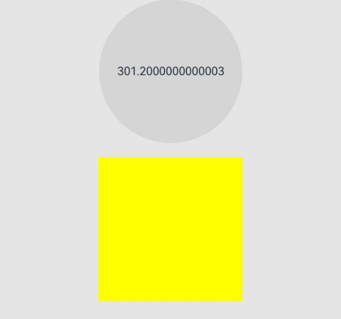
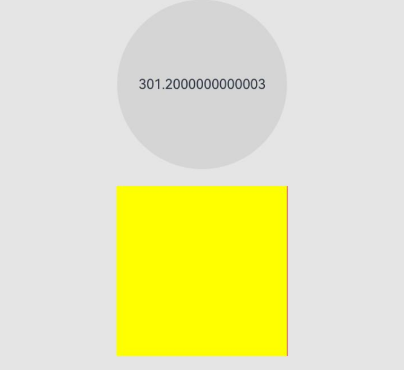

# Component-Level Pixel Rounding
<!--Kit: ArkUI-->
<!--Subsystem: ArkUI-->
<!--Owner: @zhangwentao96-->
<!--Designer: @fenglinbailu-->
<!--Tester: @liuli0427-->
<!--Adviser: @Brilliantry_Rui-->

Component-level pixel rounding allows you to enable or disable system pixel rounding for individual components by simply setting the **pixelRound** attribute.

>  **NOTE**
>
> - This module is supported since API version 11. New APIs added in later versions will be marked with a superscript to indicate their earliest API version.
>
> - The APIs of this module can be used only in the stage model.

## pixelRound

pixelRound(value: PixelRoundPolicy): T

Specifies the pixel rounding alignment mode of the current component in the specified direction. After this attribute is set, the boundary coordinates of the component are rounded according to the specified strategy, thereby avoiding visual anomalies caused by floating-point rendering (such as 1px gaps, overlapping components, and disappearing dividers). Since API version 12, if a direction is not set, the pixels are rounded to the nearest whole number in that direction by default.

> **NOTE**
> 
> - In API version 11, this API uses half-pixel alignment (that is, 0\~0.25 rounds to 0, 0.25\~0.75 rounds to 0.5, 0.75\~1.0 rounds to 1). This mode reduces the cumulative error that may result from continuous rounding by preserving the 0.5 pixel value. Since API version 12, the direction for which no rounding strategy is set uses rounding to the nearest whole number by default, and pixel rounding in a specified direction can be disabled through PixelRoundCalcPolicy.NO_FORCE_ROUND.
>
> - Since API version 12, this API can be called in [attributeModifier](ts-universal-attributes-attribute-modifier.md#attributemodifier).

In normal calculations, the vertical direction (top and bottom) corresponds to the component height. In a left-to-right layout, start corresponds to the left direction and end corresponds to the right direction; in a mirrored layout (right-to-left), the correspondence is reversed. The horizontal direction (left and right) corresponds to the component width. For ease of description, the two groups of directions are referred to as top-left and bottom-right.

- Calculate the top-left coordinates of the current component: the offset of the top-left corner relative to the parent container.
- Calculate the bottom-right coordinates of the current component: offset of the top-left corner relative to the parent container plus the size of the component itself.
- Recalculate the size of the current component: rounded bottom-right coordinates minus rounded top-left coordinates (API version 11 uses half-pixel alignment, and API version 12 uses rounding to the nearest whole number).

**Widget capability**: This API can be used in ArkTS widgets since API version 11.

**Atomic service API**: This API can be used in atomic services since API version 11.

**System capability**: SystemCapability.ArkUI.ArkUI.Full

**Parameters**

| Name| Type  | Mandatory| Description                                                        |
| ------ | ------ | ---- | ------------------------------------------------------------ |
| value | [PixelRoundPolicy](#pixelroundpolicy) | Yes | Boundary rounding strategy of the current component. [PixelRoundPolicy](#pixelroundpolicy) contains four optional attributes: start, top, end, and bottom, which correspond to the front, top, end, and bottom boundaries of the component, respectively. Each attribute can be set to a [PixelRoundCalcPolicy](ts-appendix-enums.md#pixelroundcalcpolicy11) enum value. Setting PixelRoundCalcPolicy.NO_FORCE_ROUND disables pixel rounding in the corresponding direction. Attributes that are not set are rounded by default using the round-half-up rule.<br>**Note:**<br>This attribute is used in scenarios where floating-point drawing causes visual anomalies. Since API version 12, the round-half-up rounding method is used; API version 11 uses half-pixel alignment. The rounding result is related not only to the width and height of the component, but also to its position. Even if the width and height set for components are the same, the final width and height of the components after rounding may differ because the component positions described by floating-point numbers are different.|

**Return value**

| Type| Description|
| --- | --- |
|  T | Current component, used for chained calls. |

## PixelRoundPolicy

Rounding strategy for the boundary of the current component.

**Widget capability**: This API can be used in ArkTS widgets since API version 11.

**Atomic service API**: This API can be used in atomic services since API version 11.

**System capability**: SystemCapability.ArkUI.ArkUI.Full

| Name| Type| Read-Only| Optional| Description|
| -------- | -------- | -------- | -------- | -------- |
| start | [PixelRoundCalcPolicy](ts-appendix-enums.md#pixelroundcalcpolicy11) | No | Yes | Boundary rounding strategy for the front edge of the component.<br>Since API version 12, the default rounding rule is round-to-nearest. The default value is used when [pixelRound](#pixelround) is not set or when a value other than the PixelRoundCalcPolicy enum is set. |
| top | [PixelRoundCalcPolicy](ts-appendix-enums.md#pixelroundcalcpolicy11) | No | Yes | Boundary rounding strategy for the top edge of the component.<br>Since API version 12, the default rounding rule is round-to-nearest. The default value is used when [pixelRound](#pixelround) is not set or when a value other than the PixelRoundCalcPolicy enum is set. |
| end | [PixelRoundCalcPolicy](ts-appendix-enums.md#pixelroundcalcpolicy11) | No | Yes | Boundary rounding strategy for the tail edge of the component.<br>Since API version 12, the default rounding rule is round-to-nearest. The default value is used when [pixelRound](#pixelround) is not set or when a value other than the PixelRoundCalcPolicy enum is set. |
| bottom | [PixelRoundCalcPolicy](ts-appendix-enums.md#pixelroundcalcpolicy11) | No | Yes | Boundary rounding strategy for the bottom edge of the component.<br>Since API version 12, the default rounding rule is round-to-nearest. The default value is used when [pixelRound](#pixelround) is not set or when a value other than the PixelRoundCalcPolicy enum is set. |

> **Note:** For solutions to common problems, see [FAQs](#faqs).

## FAQs

| Issue                                                    | Solution                                                    |
| ------------------------------------------------------------ | ------------------------------------------------------------ |
| When a child component is intended to fully fill its parent container, a 1px gap appears due to inconsistent rounding behaviors (the parent container rounds up, while the child component rounds down) of offset and size values.| 1. Use the ceil rounding method for the child component in the direction where the gap appears.<br>2. Disable pixel rounding for both parent and child components.|
| When the List component is used with a divider set, the divider disappears in certain scenarios. | 1. Set the space of the List component to 2px.<br>2. Disable pixel rounding on the corresponding component. |
| Overlapping occurs on specific devices.                                        | 1. Set a 2 px space on the **List** component.<br>2. Disable pixel rounding on the component.<br>3. Obtain the DPI value of the device through media query APIs and implement customized adaptation.|
| When a component is rendered with an animation, there is a slight flicker.                            | Disable pixel rounding on the corresponding components.                                  |
| The layout within a container is compact, and the sizes of child components are inconsistent.                          | Disable pixel rounding on the corresponding components.                                  |

## Example

This example shows how to use **pixelRound** to guide layout adjustments when there is a 1 px gap in the parent component.

```ts
@Entry
@Component
struct PixelRoundExample {
    // State variable: records the current width of the parent component to demonstrate floating-point width changes.
    @State curWidth : number = 300;

    build() {
        Column() {
            Button(){
                Text(this.curWidth.toString())
            }
            .onClick(() => {
                // Increase by 0.1 px on each click to simulate a floating-point width.
                this.curWidth += 0.1;
            })
            .height(200)
            .width(200)
            .backgroundColor('rgb(213, 213, 213)')

            Blank().height(20)

            Row() {
                // Child component: fills the parent container by 100%.
                Row() {
                }
                .width('100%')
                .height('100%')
                .backgroundColor(Color.Yellow)
                // Disable pixel rounding in the start and end directions of the child component.
                .pixelRound({
                    start : PixelRoundCalcPolicy.NO_FORCE_ROUND,
                    end : PixelRoundCalcPolicy.NO_FORCE_ROUND,
                })
            }
            .width(this.curWidth.toString() + 'px')
            .height('300.6px') // Use a floating-point height to test the rounding behavior in the top and bottom directions.
            .backgroundColor(Color.Red)
            // Disable pixel rounding in the start and end directions of the parent component.
            .pixelRound({
                start : PixelRoundCalcPolicy.NO_FORCE_ROUND,
                end : PixelRoundCalcPolicy.NO_FORCE_ROUND,
            })
        }
        .width("100%")
        .height('100%')
        .backgroundColor('#ffe5e5e5')
    }
}
```

In this example, pixel rounding is disabled in both the start and end directions of the parent and child components by setting PixelRoundCalcPolicy.NO_FORCE_ROUND. The initial state appears normal. The user can tap the button to increase the width of the parent component, so as to test the differences in appearance at various floating-point widths. During the test, you will find that when the parent component reaches a specific width, a 1px gap appears on the right side. Similarly, after appropriately adjusting the sample code (replacing start/end with top/bottom), you can also test in the vertical direction to observe similar phenomena.

**Figure 1** Layout with pixelRound



**Figure 2** Layout without pixelRound


