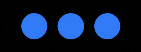

# Point Light Style (System API)
<!--Kit: ArkUI-->
<!--Subsystem: ArkUI-->
<!--Owner: @yihao-lin-->
<!--Designer: @piggyguy-->
<!--Tester: @songyanhong-->
<!--Adviser: @Brilliantry_Rui-->
<!-- md-trans-meta sourceCommit=9430c77017ca73641537d932a3d7d8a4c99c078b translatedAt=2026-09-02T12:02:45.630Z -->

Sets a point light style to illuminate surrounding components and produce lighting effects by configuring light source attributes and whether a component can be illuminated. It is applicable to scenarios where you need to highlight the visual focus of a component or create decorative lighting effects.

>  **NOTE**
>
> - The initial APIs of this module are supported since API version 11. Newly added APIs will be marked with a superscript to indicate their earliest API version.
>
> - The APIs of this module can be used only in the stage model.
>
> - Only [Image](./ts-basic-components-image.md), [Column](./ts-container-column.md), [Flex](./ts-container-flex.md), [Row](./ts-container-row.md), and [Stack](./ts-container-stack.md) support the point light setting.

## PointLightStyle

You apply a point light style by setting the light source that emits illumination and the components to be illuminated.

**System API**: This is a system API.

**System capability**: SystemCapability.ArkUI.ArkUI.Full

| Name       | Type                                                   | Read-Only| Optional| Description                                                        |
| ----------- | ----------------------------------------------------------- | ---- |  ---- | ------------------------------------------------------------ |
| lightSource | [LightSource](#lightsource)                         | No   |  Yes   | Sets the light source properties. The light source affects the surrounding components marked as illuminable and produces a light effect on them.<br>Default Value: no light source |
| illuminated | [IlluminatedType](./ts-appendix-enums-sys.md#illuminatedtype) | No   |  Yes  | Sets whether the current component can be illuminated by a light source and the illumination type.<br>Default Value: IlluminatedType.NONE |
| bloom       | number                                                      | No   |  Yes   | Sets the glow intensity of the component. The value ranges from 0 to 1. If the value is out of range, the default value is used.<br>Default Value: 0        |

## LightSource

Each component allows for one light source.

**System API**: This is a system API.

**System capability**: SystemCapability.ArkUI.ArkUI.Full

| Name               | Type                                  | Read-Only| Optional| Description                                                    |
| ------------------- | ------------------------------------------ | ---- | ---- | -------------------------------------------------- |
| positionX           | [Dimension](ts-types.md#dimension10)       | No| No  | X-coordinate of the light source relative to the current component.                             |
| positionY           | [Dimension](ts-types.md#dimension10)       | No| No  | Y-coordinate of the light source relative to the current component.                             |
| positionZ           | [Dimension](ts-types.md#dimension10)       | No| No  | Height of the light source. The higher the light source, the broader the light distribution.                      |
| intensity           | number                                     | No  | No   | Light source intensity. The value range is [0, +∞). If the value is out of range, the default value 0 is used. When the light source intensity is 0, the light source does not emit light. |
| color<sup>12+</sup> | [ResourceColor](ts-types.md#resourcecolor) | No  | Yes  | Light source color.<br>Default Value: Color.White                       |

## Example

```ts
// xxx.ets
@Entry
@Component
struct Index {
  @State lightIntensity: number = 0;
  @State bloomValue: number = 0;

  build() {
    Row({ space: 20 }) {
      Flex()
        .pointLight({ illuminated: IlluminatedType.BORDER })
        .backgroundColor(0x307af7)
        .size({ width: 50, height: 50 })
        .borderRadius(25)

      Flex()
        .pointLight({
          lightSource: {
            intensity: this.lightIntensity,
            positionX: '50%',
            positionY: '50%',
            positionZ: 80
          },
          bloom: this.bloomValue
        })
        .animation({ duration: 333 })
        .backgroundColor(0x307af7)
        .size({ width: 50, height: 50 })
        .borderRadius(25)
        .onTouch((event: TouchEvent) => {
          // Enhance the light source intensity and luminous intensity when pressed, and restore the default effect when released or canceled.
          if (event.type === TouchType.Down) {
            this.lightIntensity = 1;
            this.bloomValue = 1;
          } else if (event.type === TouchType.Up || event.type === TouchType.Cancel) {
            this.lightIntensity = 0;
            this.bloomValue = 0;
          }
        })

      Flex()
        .pointLight({ illuminated: IlluminatedType.BORDER_CONTENT })
        .backgroundColor(0x307af7)
        .size({ width: 50, height: 50 })
        .borderRadius(25)
    }
    .justifyContent(FlexAlign.Center)
    .backgroundColor(Color.Black)
    .size({ width: '100%', height: '100%' })
  }
}
```

