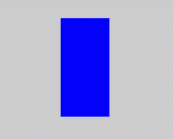

# Polymorphic Style
<!--Kit: ArkUI-->
<!--Subsystem: ArkUI-->
<!--Owner: @yihao-lin-->
<!--Designer: @piggyguy-->
<!--Tester: @songyanhong-->
<!--Adviser: @Brilliantry_Rui-->

You can set state-specific styles for components.

>  **NOTE**
>
>  The initial APIs of this module are supported since API version 8. Updates will be marked with a superscript to indicate their earliest API version.
>
>  Since API version 11, you can also dynamically set component attributes through [attributeModifier](./ts-universal-attributes-attribute-modifier.md).
>
>  Polymorphic styles only support [universal attributes](ts-component-general-attributes.md). If a polymorphic style does not take effect, the attribute you are modifying might be a private attribute of the component, for example, [fontColor](./ts-universal-attributes-text-style.md) or [backgroundColor](./ts-universal-attributes-background.md#backgroundcolor18) of the [TextInput](./ts-basic-components-textinput.md) component. In this case, you can use **attributeModifier** to dynamically set these component-specific attributes.
>
>  Currently, the implementation of polymorphic styles relies on the refresh mechanism of custom component nodes. Since the builder does not have an independent custom parent node and cannot directly trigger refresh, polymorphic styles cannot be applied directly within the builder. The recommended solution is to encapsulate the polymorphic styles into a custom component and place this component within the @Builder to indirectly achieve the polymorphic style effect. For details about the sample code, see [Example 3: Setting Polymorphic Styles for the Builder Component](#example-3-setting-polymorphic-styles-for-the-builder-component).
>  
>  Polymorphic styles for the focused state are only applied when [focus activation](../../../ui/arkts-common-events-focus-event.md#basic-concepts) is enabled.

## stateStyles

stateStyles(value: StateStyles): T

Sets the state-specific styles for the component.

> **NOTE**
>
> This API cannot be called within [attributeModifier](ts-universal-attributes-attribute-modifier.md#attributemodifier).

**Widget capability**: This API can be used in ArkTS widgets since API version 9.

**Atomic service API**: This API can be used in atomic services since API version 11.

**System capability**: SystemCapability.ArkUI.ArkUI.Full

**Parameters**

| Name| Type                               | Mandatory| Description                    |
| ------ | ----------------------------------- | ---- | ------------------------ |
| value  | [StateStyles](#statestyles-1) | Yes  | State-specific styles for the component.|

**Return value**

| Type| Description|
| -------- | -------- |
| T | Current component.|

## StateStyles

**Atomic service API**: This API can be used in atomic services since API version 11.

**System capability**: SystemCapability.ArkUI.ArkUI.Full

| Name| Type| Read-Only| Optional| Description|
| -------- | -------- | -------- | -------- | -------- |
| normal | any | No| Yes| Style of the component when being stateless. Only style code blocks decorated with @style is accepted.<br>**Widget capability**: This API can be used in ArkTS widgets since API version 9.|
| pressed | any | No| Yes| Style of the component in the pressed state. Only style code blocks decorated with @style is accepted.<br>**Widget capability**: This API can be used in ArkTS widgets since API version 9.|
| disabled | any | No| Yes| Style of the component in the disabled state. Only style code blocks decorated with @style is accepted.<br>**Widget capability**: This API can be used in ArkTS widgets since API version 9.|
| focused | any | No| Yes| Style of the component in the focused state. Only style code blocks decorated with @style is accepted.<br>**Widget capability**: This API can be used in ArkTS widgets since API version 9.|
| clicked | any | No| Yes| Style of the component in the clicked state. Only style code blocks decorated with @style is accepted.<br>**Widget capability**: This API can be used in ArkTS widgets since API version 9.|
| selected<sup>10+</sup> | object | No| Yes| Style of the component in the selected state. Only style code blocks decorated with @style is accepted.<br>**Widget capability**: This API can be used in ArkTS widgets since API version 10.|

**Notes about the selected state:**

- The selected state style depends on the value of the component's selected attribute. You can change the attribute value through [onClick](ts-universal-events-click.md) or [$$](../../../ui/state-management/arkts-two-way-sync.md).

- The table below lists the components that support the selected state style and their selected attributes or parameters.

  | Component                                                        | Selected Parameter/Attribute| Initial API Version|
  | ------------------------------------------------------------ | --------------- | ----------- |
  | [Checkbox](ts-basic-components-checkbox.md) | select          | 10          |
  | [CheckboxGroup](ts-basic-components-checkboxgroup.md) | selectAll       | 10          |
  | [Radio](ts-basic-components-radio.md)  | checked         | 10          |
  | [Toggle](ts-basic-components-toggle.md) | isOn            | 10          |
  | [ListItem](ts-container-listitem.md) | selected         | 10          |
  | [GridItem](ts-container-griditem.md) | selected         | 10          |
  | [MenuItem](ts-basic-components-menuitem.md) | selected         | 10          |

**Notes about pressed and clicked states**

- When both **clicked** and **pressed** are used on the same component, only the last registered state takes effect.

## Example

### Example 1: Setting Polymorphic Styles for the Text Component

This example demonstrates the style changes of the **Text** component when its state is pressed or disabled.

```ts
// xxx.ets
@Entry
@Component
struct StyleExample {
  @State isEnable: boolean = true

  @Styles
  pressedStyles(): void {
    .backgroundColor("#ED6F21")
    .borderRadius(10)
    .borderStyle(BorderStyle.Dashed)
    .borderWidth(2)
    .borderColor("#33000000")
    .width(120)
    .height(30)
    .opacity(1)
  }

  @Styles
  disabledStyles(): void {
    .backgroundColor("#E5E5E5")
    .borderRadius(10)
    .borderStyle(BorderStyle.Solid)
    .borderWidth(2)
    .borderColor("#2a4c1919")
    .width(90)
    .height(25)
    .opacity(1)
  }

  @Styles
  normalStyles(): void {
    .backgroundColor("#0A59F7")
    .borderRadius(10)
    .borderStyle(BorderStyle.Solid)
    .borderWidth(2)
    .borderColor("#33000000")
    .width(100)
    .height(25)
    .opacity(1)
  }

  build() {
    Flex({ direction: FlexDirection.Column, alignItems: ItemAlign.Center }) {
      Text("normal")
        .fontSize(14)
        .fontColor(Color.White)
        .opacity(0.5)
        .stateStyles({
          normal: this.normalStyles,
        })
        .margin({ bottom: 20 })
        .textAlign(TextAlign.Center)
      Text("pressed")
        .backgroundColor("#0A59F7")
        .borderRadius(20)
        .borderStyle(BorderStyle.Dotted)
        .borderWidth(2)
        .borderColor(Color.Red)
        .width(100)
        .height(25)
        .opacity(1)
        .fontSize(14)
        .fontColor(Color.White)
        .stateStyles({
          pressed: this.pressedStyles,
        })
        .margin({ bottom: 20 })
        .textAlign(TextAlign.Center)
      Text(this.isEnable == true ? "effective" : "disabled")
        .backgroundColor("#0A59F7")
        .borderRadius(20)
        .borderStyle(BorderStyle.Solid)
        .borderWidth(2)
        .borderColor(Color.Gray)
        .width(100)
        .height(25)
        .opacity(1)
        .fontSize(14)
        .fontColor(Color.White)
        .enabled(this.isEnable)
        .stateStyles({
          disabled: this.disabledStyles,
        })
        .textAlign(TextAlign.Center)
      Text("control disabled")
        .onClick(() => {
          this.isEnable = !this.isEnable
          console.info(`${this.isEnable}`)
        })
    }
    .width(350).height(300)
  }
}
```


### Example 2: Setting Polymorphic Styles for the Radio Component

This example demonstrates the style changes of the **Radio** component when its state is selected.

```ts
// xxx.ets
@Entry
@Component
struct Index {
  @State value: boolean = false
  @State value2: boolean = false

  @Styles
  normalStyles(): void{
    .backgroundColor("#E5E5E1")
  }

  @Styles
  selectStyles(): void{
    .backgroundColor("#ED6F21")
    .borderWidth(2)
  }

  build() {
    Flex({ direction: FlexDirection.Row, justifyContent: FlexAlign.Center, alignItems: ItemAlign.Center }) {
      Column() {
        Text('Radio1')
          .fontSize(25)
        Radio({ value: 'Radio1', group: 'radioGroup1' })
          .checked(this.value)
          .height(50)
          .width(50)
          .borderWidth(0)
          .borderRadius(30)
          .onClick(() => {
            this.value = !this.value
          })
          .stateStyles({
            normal: this.normalStyles,
            selected: this.selectStyles,
          })
      }
      .margin(30)

      Column() {
        Text('Radio2')
          .fontSize(25)
        Radio({ value: 'Radio2', group: 'radioGroup2' })
          .checked($$this.value2)
          .height(50)
          .width(50)
          .borderWidth(0)
          .borderRadius(30)
          .stateStyles({
            normal: this.normalStyles,
            selected: this.selectStyles,
          })
      }
      .margin(30)
    }.padding({ top: 30 })
  }
}
```


### Example 3: Setting Polymorphic Styles for the Builder Component

This example demonstrates the style changes of the **Builder** component when it is in pressed state.

```ts
import { ComponentContent } from '@kit.ArkUI';
import { BusinessError } from '@kit.BasicServicesKit';

@Component
struct Child {
  build() {
    Row()
      .zIndex(10)
      .width(200)
      .height(200)
      .stateStyles({
        normal: {
          .backgroundColor(Color.Blue)
        },
        pressed: {
          .backgroundColor(Color.Black)
        }
      })
  }
}

@Builder
function buildText() {
  Child()
}

@Entry
@Component
struct Index {
  private contentNode: ComponentContent<Object> =
    new ComponentContent(this.getUIContext(), wrapBuilder(buildText));

  build() {
    Column() {
      Button().margin({ top: 200 }).onClick((event: ClickEvent) => {
        this.getUIContext()
          .getPromptAction()
          .openCustomDialog(this.contentNode)
          .then(() => {
            console.info('OpenCustomDialog complete.')
          })
          .catch((error: BusinessError) => {
            let message = (error as BusinessError).message;
            let code = (error as BusinessError).code;
            console.error(`OpenCustomDialog args error code is ${code}, message is ${message}`);
          })
      })
    }
    .width('100%')
    .height('100%')
  }
}
```


