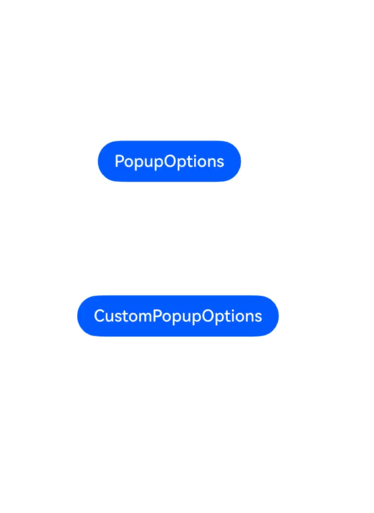
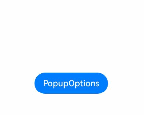
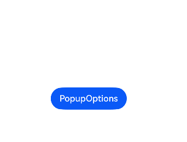

# Popup Control
<!--Kit: ArkUI-->
<!--Subsystem: ArkUI-->
<!--Owner: @liyi0309-->
<!--Designer: @liyi0309-->
<!--Tester: @lxl007-->
<!--Adviser: @Brilliantry_Rui-->

Binds a popup to a component and sets the popup content, interaction logic, and display status.

>  **NOTE**
>
>  - The feature is supported since API version 7. Updates will be marked with a superscript to indicate their earliest API version.
>
>  - The display status of the popup is reported in the **onStateChange** callback of [PopupOptions](#popupoptions) or [CustomPopupOptions](#custompopupoptions8). When the component bound to the popup is destroyed, the popup disappears, but the display status is not reported through **onStateChange**.
>
>  - The maximum height of the popup is calculated as follows: Current window height – Top/Bottom safe area height (status bar and navigation bar) – 80 vp.
>
>  - When multiple popups are displayed at the same time, popups displayed in child windows have a higher z-index than those in the main window. When in the same window, popups displayed later have a higher z-index than those displayed earlier.
>
>  - By default, the PC/2-in-1 device has double outlines, while other devices do not.
>
>  - Nested subwindow dialog boxes are not supported. For example, when **bindPopup** has **showInSubWindow** set to **true**, another dialog box with **showInSubWindow=true** cannot be displayed.
>
>  - When the component bound to the popup is destroyed, the screen is rotated, or the application enters the background, the popup automatically disappears, and the [onWillDismiss](#popupoptions) event is not triggered.

## bindPopup

bindPopup(show: boolean, popup: PopupOptions | CustomPopupOptions): T

Binds a popup to the component.

>  **NOTE**
>
>  - **bindPopup** with subwindow display (**showInSubwindow** set to **true**) is not supported in input method windows. For details, see the constraints in [createPanel](../../apis-ime-kit/js-apis-inputmethodengine.md#createpanel10-1) of the input method framework documentation.
>
>  - This API cannot be called within [attributeModifier](ts-universal-attributes-attribute-modifier.md#attributemodifier).

**Atomic service API**: This API can be used in atomic services since API version 11.

**System capability**: SystemCapability.ArkUI.ArkUI.Full

**Parameters**

| Name| Type                                                        | Mandatory| Description                                                        |
| ------ | ------------------------------------------------------------ | ---- | ------------------------------------------------------------ |
| show   | boolean                                                      | Yes  | Popup display status. The popup can be displayed only after the entire page is fully constructed. Setting **show** to **true** during page construction will cause incorrect positioning and layout. Since API version 18, this parameter supports two-way binding through the [!! syntax](../../../ui/state-management/arkts-new-binding.md#two-way-binding-between-built-in-component-parameters).<br>**true**: The popup is displayed; **false**: The popup is closed.<br>Default value: **false**|
| popup  | [PopupOptions](#popupoptions)&nbsp;\|&nbsp;[CustomPopupOptions](#custompopupoptions8)<sup>8+</sup> | Yes  | Configuration options of the popup.                                        |

**Return value**

|Type|Description|
|---|---|
|T|Current component.|

## PopupOptions

Provides the configuration options for the popup.

**System capability**: SystemCapability.ArkUI.ArkUI.Full

| Name                                 | Type                                                        | Read-Only| Optional| Description                                                     |
| ------------------------------------- | ------------------------------------------------------------ | ---- | ------------------------------------------------------------ | ------------------------------------------------------------ |
| message                               | string                                                       | No | No | Content of the popup.<br>**Atomic service API**: This API can be used in atomic services since API version 11.                                              |
| primaryButton                         | {<br>value:&nbsp;string,<br>action:&nbsp;()&nbsp;=&gt;&nbsp;void<br>} | No  | Yes | Primary button.<br>**value**: text of the primary button in the popup.<br>**action**: callback function for clicking of the primary button.<br>**Atomic service API**: This API can be used in atomic services since API version 11.|
| secondaryButton                       | {<br>value:&nbsp;string,<br>action:&nbsp;()&nbsp;=&gt;&nbsp;void<br>} | No  | Yes | Secondary button.<br>**value**: text of the secondary button in the popup.<br>**action**: callback function for clicking of the secondary button.<br>**Atomic service API**: This API can be used in atomic services since API version 11.|
| onStateChange                         | (event:&nbsp;{&nbsp;isVisible:&nbsp;boolean&nbsp;})&nbsp;=&gt;&nbsp;void | No  | Yes | Callback for popup visibility state changes. The parameter **isVisible** indicates the visibility of the popup. It returns **true** when the popup transitions from closed to open, and **false** when the popup transitions from open to closed.<br>**Atomic service API**: This API can be used in atomic services since API version 11.   |
| showInSubWindow<sup>9+</sup>          | boolean                                                      | No  | Yes | Whether the popup is displayed in the created subwindow.<br>**true**: The popup is displayed in the created subwindow; **false**: The popup is displayed in the corresponding main window.<br>Default value: **false**<br>**Atomic service API**: This API can be used in atomic services since API version 11.                       |
| mask<sup>10+</sup>                    | boolean&nbsp;\|&nbsp;{ color : [ResourceColor](ts-types.md#resourcecolor) }| No  | Yes | Whether to apply a mask with the specified color to the popup.<br>**true**: A transparent mask is applied; **false**: No mask is applied.<br>**Color**: A mask with the specified color is applied.<br>Default value: **true**<br>**Atomic service API**: This API can be used in atomic services since API version 11.|
| messageOptions<sup>10+</sup>          | [PopupMessageOptions](#popupmessageoptions10)        | No  | Yes | Configuration options of the popup message.<br>**Atomic service API**: This API can be used in atomic services since API version 11.                                      |
| targetSpace<sup>10+</sup>             | [Length](ts-types.md#length)                                 | No  | Yes | Spacing between the popup and the host node. Percentage values are not supported.<br>Default value: **8**<br>Unit: vp<br>**Atomic service API**: This API can be used in atomic services since API version 11.                            |
| placement<sup>10+</sup>               | [Placement](ts-appendix-enums.md#placement8)                 | No  | Yes | Display position of the popup relative to the host node. The default value is **Placement.Bottom**.<br>If both **placementOnTop** and **placement** are set, the latter prevails. If the popup cannot be completely displayed in the specified position, the popup automatically adjusts its position to completely show itself.<br>**Atomic service API**: This API can be used in atomic services since API version 11.|
| offset<sup>10+</sup>                  | [Position](ts-types.md#position)                            | No  | Yes | Offset of the popup relative to the display position specified by **placement**.<br>Default value: **{x:0, y:0}**<br>Unit: vp<br>**NOTE**<br>Percentage values are not supported.<br>**Atomic service API**: This API can be used in atomic services since API version 11.|
| enableArrow<sup>10+</sup>             | boolean                                                      | No  | Yes | Whether to display the arrow.<br>**true**: The arrow is displayed; **false**: The arrow is not displayed.<br>Default value: **true**<br>**NOTE**<br>If the available space on the screen is insufficient, the popup will cover part of the component and the arrow will not be displayed.<br>**Atomic service API**: This API can be used in atomic services since API version 11.|
| arrowPointPosition<sup>11+</sup>      | [ArrowPointPosition](ts-appendix-enums.md#arrowpointposition11) | No  | Yes | Position of the tooltip arrow relative to its parent component. Available positions are **START**, **CENTER**, and **END**, in both vertical and horizontal directions. All these positions are within the parent component area.<br>Default value: **ArrowPointPosition.CENTER**<br>**Atomic service API**: This API can be used in atomic services since API version 12.|
| arrowWidth<sup>11+</sup>             | [Dimension](ts-types.md#dimension10)                  | No  | Yes | Arrow thickness. If the arrow thickness exceeds the length of the edge minus twice the size of the popup rounded corner, the arrow is not drawn.<br>Default value: **16**<br>Unit: vp<br>**NOTE**<br>Percentage values are not supported.<br>**Atomic service API**: This API can be used in atomic services since API version 12.                         |
| arrowHeight<sup>11+</sup>             | [Dimension](ts-types.md#dimension10)                  | No  | Yes | Arrow height.<br>Default value: **8**<br>Unit: vp<br>**NOTE**<br>Percentage values are not supported.<br>**Atomic service API**: This API can be used in atomic services since API version 12.                         |
| arrowOffset<sup>9+</sup>              | [Length](ts-types.md#length)                                 | No  | Yes | Offset of the popup arrow relative to the popup.<br>When the arrow is at the top or bottom of the popup: The value **0** indicates that the arrow is located on the leftmost, and any other value indicates the distance from the arrow to the leftmost; the arrow is centered by default.<br>When the arrow is on the left or right side of the popup: The value indicates the distance from the arrow to the top; the arrow is centered by default.<br>When the popup is displayed on either edge of the screen, it automatically adjusts horizontally. When the value is **0**, the arrow always points to the bound component.<br>Unit: vp<br>**NOTE**<br>1. If **arrowOffset** is not set, the distance between the popup arrow and the four corners must be no less than the corner radius.<br>2. If **arrowPointPosition** is set, **arrowOffset** does not take effect.<br>3. Percentage values are not supported.<br>**Atomic service API**: This API can be used in atomic services since API version 11.|
| popupColor<sup>11+</sup>              | [Color](ts-appendix-enums.md#color) &nbsp;\|&nbsp;string&nbsp;\|&nbsp; [Resource](ts-types.md#resource)&nbsp; \|&nbsp;number | No  | Yes | Color of the popup. To remove the background blur, set **backgroundBlurStyle** to **BlurStyle.NONE**.<br>Default value: [TRANSPARENT](ts-appendix-enums.md#color) plus [COMPONENT_ULTRA_THICK](ts-universal-attributes-background.md#blurstyle9)<br>**Atomic service API**: This API can be used in atomic services since API version 12.|
| autoCancel<sup>11+</sup>              | boolean                                                      | No  | Yes | Whether the popup is automatically closed when an operation is performed on the page.<br>**true**: The popup is automatically closed; **false**: The popup is not automatically closed.<br>Default value: **true**<br>**Atomic service API**: This API can be used in atomic services since API version 12.|
| width<sup>11+</sup>                   | [Dimension](ts-types.md#dimension10)                         | No  | Yes | Width of the popup. If this parameter is not set or the value is invalid, the popup width is automatically adjusted to adapt to the content width.<br>Unit: vp<br><br>**Atomic service API**: This API can be used in atomic services since API version 12.|
| radius<sup>11+</sup>             | [Dimension](ts-types.md#dimension10)                  | No  | Yes | Rounded corner radius of the popup.<br>Default value: **20**<br>Unit: vp<br>**Atomic service API**: This API can be used in atomic services since API version 12.                         |
| shadow<sup>11+</sup>             | [ShadowOptions](ts-universal-attributes-image-effect.md#shadowoptions)&nbsp;\|&nbsp;[ShadowStyle](ts-universal-attributes-image-effect.md#shadowstyle10)    | No  | Yes | Popup shadow.<br>Default value: **ShadowStyle.OUTER_DEFAULT_MD**<br>**Atomic service API**: This API can be used in atomic services since API version 12.    |
| backgroundBlurStyle<sup>11+</sup> | [BlurStyle](ts-universal-attributes-background.md#blurstyle9) | No| Yes| Background blur style of the popup.<br>Default value: **BlurStyle.COMPONENT_ULTRA_THICK**<br>**Atomic service API**: This API can be used in atomic services since API version 12.|
| transition<sup>12+</sup> | [TransitionEffect](ts-transition-animation-component.md#transitioneffect10) | No| Yes| Transition animations for the entrance and exit of the popup.<br>**NOTE**<br>1. If this parameter is not set, the default entrance and exit animations are used.<br>2. Touching the back button during the entrance animation interrupts it and starts the exit animation. The final effect is one obtained after the curves of the entrance and exit animations are combined.<br>3. Touching the back button during the exit animation does not affect the animation playback; the back button is unresponsive.<br>**Atomic service API**: This API can be used in atomic services since API version 12.|
| onWillDismiss<sup>12+</sup>           | boolean \| Callback\<[DismissPopupAction](#dismisspopupaction12)> | No  | Yes | Interactive dismissal behavior. The default value is **true**, meaning that the popup responds to clicks, swipes (left or right), and the back button.<br>1. For the boolean type, if this parameter is set to **false**, the popup ignores clicks, swipes, back button, route navigation, and **Esc** key events, and can only be dismissed by setting the **show** parameter to **false**; if this parameter is set to **true**, the popup responds to dismissal events.<br>2. If this parameter is set to a function, the dismissal event is intercepted and the callback function is executed. For swipes, back button, route navigation, and the **Esc** key, the value of **reason** returned in the callback function is **PRESS_BACK**. For clicks, the value is **TOUCH_OUTSIDE**.<br>**NOTE**<br>Nesting **onWillDismiss** callbacks is not allowed.<br>**Atomic service API**: This API can be used in atomic services since API version 12.|
| followTransformOfTarget<sup>13+</sup>          | boolean | No  | Yes | Whether the popup aligns with the transformed position of the target when the target component or its parent container has transformations (such as rotation and scaling).<br>**true**: The popup aligns with the transformed position of the target; **false**: The popup does not track such transformations, which may result in incorrect display.<br>Default value: **false**<br>**Atomic service API**: This API can be used in atomic services since API version 13.|
| keyboardAvoidMode<sup>15+</sup>          | [KeyboardAvoidMode](#keyboardavoidmode12)| No  | Yes | Whether to avoid the soft keyboard. By default, the popup does not avoid the soft keyboard. When configured to avoid the soft keyboard, if the popup display space is insufficient, the display mode of the popup changes from being centered over the parent component to being translated and covering the parent component.. In addition, if the popup arrow does not point to the host, the arrow will not be displayed.<br>Default value: **KeyboardAvoidMode.NONE**<br>**Atomic service API**: This API can be used in atomic services since API version 15.|
|  enableHoverMode<sup>18+</sup>| boolean  | No  | Yes | Whether the popup responds when the device is in hover mode (semi-folded state), that is, whether it triggers avoidance of the crease area in hover mode.<br>Default value: **false** (**true** for 2-in-1 devices by default). If this parameter is not set or set to an invalid value, the default value is used.<br>**NOTE**<br>1. If the popup position is within the crease area in hover mode, it will not respond in hover mode.<br>2. This parameter is supported on 2-in-1 devices since API version 20.<br>3. This parameter only takes effect in window waterfall mode for 2-in-1 devices.<br>**Atomic service API**: This API can be used in atomic services since API version 18.|
| outlineWidth<sup>20+</sup>| [Dimension](ts-types.md#dimension10)  | No  | Yes | Width of the outer outline of the popup.<br>Default value: **1**<br>Unit: vp<br>**NOTE**<br>1. Percentage values are not supported. If a percentage value is set, the value **0** is used.<br>2. If the outer outline is not set, this parameter must be used together with **outlineLinearGradient**.<br>3. For double outlines, it is recommended that the outer outline width should not exceed 10 vp.<br>**Atomic service API**: This API can be used in atomic services since API version 20.|
| borderWidth<sup>20+</sup>| [Dimension](ts-types.md#dimension10)  | No  | Yes | Width of the inner outline of the popup.<br>Default value: **1**<br>Unit: vp<br>**NOTE**<br>1. Percentage values are not supported. If a percentage value is set, the value **0** is used.<br>2. If no inner outline is set, this parameter must be used together with **borderLinearGradient**.<br>3. For double outlines, it is recommended that the inner outline width should not exceed 10 vp.<br>**Atomic service API**: This API can be used in atomic services since API version 20.|
| outlineLinearGradient<sup>20+</sup>| [PopupBorderLinearGradient](#popupborderlineargradient20)  | No  | Yes | Linear gradient color of the outer outline of the popup.<br>**NOTE**<br>1. If **outlineLinearGradient** is not set or set to **null** or **undefined**, the linear gradient color of the outer outline does not take effect.<br>2. When **outlineLinearGradient** is set, the default value of **direction** is **GradientDirection.Bottom**.<br>**Atomic service API**: This API can be used in atomic services since API version 20.|
| borderLinearGradient<sup>20+</sup>| [PopupBorderLinearGradient](#popupborderlineargradient20)  | No  | Yes | Linear gradient color of the inner outline of the popup.<br>**NOTE**<br>1. If **borderLinearGradient** is not set or set to **null** or **undefined**, the linear gradient color of the inner outline does not take effect.<br>2. When **borderLinearGradient** is set, the default value of **direction** is **GradientDirection.Bottom**.<br>**Atomic service API**: This API can be used in atomic services since API version 20.|
| avoidTarget<sup>20+</sup>          | [AvoidanceMode](ts-basic-components-select.md#avoidancemode19) | No  | Yes | Whether the popup covers the pointing component during avoidance.<br>Default value: **AvoidanceMode.COVER_TARGET**<br>**Atomic service API**: This API can be used in atomic services since API version 20.|
| placementOnTop<sup>(deprecated)</sup> | boolean                                                      | No  | Yes| Whether to display the popup above the component. The default value is **false**. **true**: The popup is displayed above the bound component; **false**: The popup is displayed below the bound component.<br>**NOTE**<br>This parameter is supported since API version 7 and deprecated since API version 10. You are advised to use **placement** instead.|

## PopupMessageOptions<sup>10+</sup>

Describes the popup message text style.

**Atomic service API**: This API can be used in atomic services since API version 11.

**System capability**: SystemCapability.ArkUI.ArkUI.Full

| Name     | Type                                      | Read-Only| Optional| Description                                                        |
| --------- | ------------------------------------------ | ---- | ---- | ------------------------------------------------------------ |
| textColor | [ResourceColor](ts-types.md#resourcecolor) | No  | Yes  | Text color of the popup message.                                      |
| font      | [Font](ts-types.md#font)                   | No  | Yes  | Font settings of the popup message.<br>**NOTE**<br>1. Setting **family** is not supported.<br>2. The **weight** attribute in **Font** does not support the number type.|

## DismissPopupAction<sup>12+</sup>

Provides information about the dismissal of the popup.

**Atomic service API**: This API can be used in atomic services since API version 12.

**System capability**: SystemCapability.ArkUI.ArkUI.Full

| Name   | Type                                     | Read-Only| Optional| Description                                                        |
| ------- | ----------------------------------------- | ---- | ---- | ------------------------------------------------------------ |
| dismiss | Callback\<void>                                 | No  | No  | Callback for dismissing the popup. This API is called only when the popup needs to be dismissed.|
| reason  | [DismissReason](#dismissreason12) | No  | No  | Reason why the popup is dismissed.                 |

## DismissReason<sup>12+</sup>

Enumerates the reasons for popup dismissal.

**System capability**: SystemCapability.ArkUI.ArkUI.Full

| Name         | Value  | Description                                                      |
| ------------- | ---- | ------------------------------------------------------------ |
| PRESS_BACK    | 0    | Touching the **Back** button, swiping left or right on the screen, or pressing the **Esc** key.<br>**Atomic service API**: This API can be used in atomic services since API version 12.|
| TOUCH_OUTSIDE | 1    | Touching the mask.<br>**Atomic service API**: This API can be used in atomic services since API version 12.|
| CLOSE_BUTTON  | 2    | Touching the close button.<br>**Atomic service API**: This API can be used in atomic services since API version 12.|
| SLIDE_DOWN    | 3    | Swiping down.<br>**NOTE**<br>This API is effective only in [sheet transition](ts-universal-attributes-sheet-transition.md).<br>**Atomic service API**: This API can be used in atomic services since API version 12.|
| SLIDE<sup>20+</sup>    | 4    | Swiping left or right on the screen. By default, swiping right dismisses the popup, while swiping left is used in the mirror scenario. This setting is not user-defined.<br>**NOTE**<br>This API is effective only in [sheet transition](ts-universal-attributes-sheet-transition.md).<br>**Atomic service API**: This API can be used in atomic services since API version 20.|

## CustomPopupOptions<sup>8+</sup>

Provides information for displaying a custom popup.

**System capability**: SystemCapability.ArkUI.ArkUI.Full

| Name                          | Type                                      | Read-Only| Optional| Description                                      |
| ---------------------------- | ---------------------------------------- | ---- | ---------------------------------------- | ---------------------------------------- |
| builder                      | [CustomBuilder](ts-types.md#custombuilder8) | No  | No  | Builder of the tooltip content.<br>**NOTE**<br>1. The **Popup** attribute is a universal attribute. A custom popup does not support display of another popup. The **position** attribute cannot be used for the first-layer container in the builder. If the **position** attribute is used, the popup will not be displayed.<br>2. If a custom component is used in the **builder**, the **aboutToAppear** and **aboutToDisappear** lifecycle callbacks of the custom component are irrelevant to the visibility of the popup. As such, the lifecycle of the custom component cannot be used to determine whether the popup is displayed or not.<br>3. The **builder** of this constructor can be defined only in UI components, such as the **Builder** function/method or the [build](ts-custom-component-lifecycle.md#build) method.<br>**Atomic service API**: This API can be used in atomic services since API version 11.                             |
| placement                    | [Placement](ts-appendix-enums.md#placement8) | No   | Yes  | Preferred position of the tooltip component. If the set position is insufficient for holding the component, it will be automatically adjusted.<br>Default value: **Placement.Bottom**<br>**Atomic service API**: This API can be used in atomic services since API version 11.|
| popupColor                   | [Color](ts-appendix-enums.md#color)&nbsp;\|&nbsp;string&nbsp;\|&nbsp;[Resource](ts-types.md#resource)&nbsp;\|&nbsp;number | No   | Yes  | Color of the popup. To remove the background blur, set **backgroundBlurStyle** to **BlurStyle.NONE**.<br>The default value varies by API version.<br>API version 10: **'#4d4d4d'**<br>API version 11 and later: [TRANSPARENT](ts-appendix-enums.md#color) plus [COMPONENT_ULTRA_THICK](ts-universal-attributes-background.md#blurstyle9)<br>**Atomic service API**: This API can be used in atomic services since API version 11.|
| autoCancel                   | boolean                                  | No   | Yes  | Whether the popup is automatically closed when an operation is performed on the page.<br>**true**: The popup is automatically closed; **false**: The popup is not automatically closed.<br>Default value: **true**<br>**NOTE**<br>To dismiss the popup upon a click on it, place a layout component in the **builder**, place the **Popup** component in the layout component, and set **show** to **false** in the **onClick** event of the layout component.<br>**Atomic service API**: This API can be used in atomic services since API version 11.|
| onStateChange                | (event:&nbsp;{&nbsp;isVisible:&nbsp;boolean&nbsp;})&nbsp;=&gt;&nbsp;void | No   | Yes  | Callback for popup visibility state changes. The parameter indicates the visibility of the popup. It returns **true** when the popup transitions from closed to open, and **false** when the popup transitions from open to closed.<br>**Atomic service API**: This API can be used in atomic services since API version 11.                |
| enableArrow                  | boolean                                  | No   | Yes  | Whether to display the arrow.<br>**true**: The arrow is displayed; **false**: The arrow is not displayed.<br>Since API version 9, if the position set for the popup is not large enough, the arrow will not be displayed. For example, if **placement** is set to **Left**, and the popup height is less than the sum of the arrow width (32 vp) and twice the popup corner radius (48 vp), that is, 80 vp, the arrow will not be displayed.<br>Default value: **true**<br>**Atomic service API**: This API can be used in atomic services since API version 11.|
| arrowOffset<sup>9+</sup>     | [Length](ts-types.md#length) | No   | Yes  | Offset of the popup arrow relative to the popup.<br>When the arrow is at the top or bottom of the popup: The value **0** indicates that the arrow is located on the leftmost, and any other value indicates the distance from the arrow to the leftmost; the arrow is centered by default.<br>When the arrow is on the left or right side of the popup: The value indicates the distance from the arrow to the top; the arrow is centered by default.<br>When the popup is displayed on either edge of the screen, it automatically adjusts horizontally. When the value is **0**, the arrow always points to the bound component.<br>Unit: vp<br>**NOTE**<br>1. If **arrowOffset** is not set, the distance between the popup arrow and the four corners must be no less than the corner radius.<br>2. If **arrowPointPosition** is set, **arrowOffset** does not take effect.<br>3. Percentage values are not supported.<br>**Atomic service API**: This API can be used in atomic services since API version 11.|
| arrowPointPosition<sup>11+</sup> | [ArrowPointPosition](ts-appendix-enums.md#arrowpointposition11) | No| Yes| Position of the tooltip arrow relative to its parent component. Available positions are **START**, **CENTER**, and **END**, in both vertical and horizontal directions. All these positions are within the parent component area.<br>Default value: **ArrowPointPosition.CENTER**<br>**Atomic service API**: This API can be used in atomic services since API version 12.|
| arrowWidth<sup>11+</sup>             | [Dimension](ts-types.md#dimension10)                                                      | No  | Yes | Arrow thickness. If the arrow thickness exceeds the length of the edge minus twice the size of the popup rounded corner, the arrow is not drawn.<br>Default value: **16**<br>Unit: vp<br>**NOTE**<br>Percentage values are not supported.<br>**Atomic service API**: This API can be used in atomic services since API version 12.                         |
| arrowHeight<sup>11+</sup>             | [Dimension](ts-types.md#dimension10)                  | No  | Yes | Arrow height.<br>Default value: **8**<br>Unit: vp<br>**NOTE**<br>Percentage values are not supported.<br>**Atomic service API**: This API can be used in atomic services since API version 12.                         |
| showInSubWindow<sup>9+</sup> | boolean                                  | No   | Yes  | Whether the popup is displayed in the created subwindow.<br>**true**: The popup is displayed in the created subwindow; **false**: The popup is displayed in the corresponding main window.<br>Default value: **false**<br>**Atomic service API**: This API can be used in atomic services since API version 11.                   |
| maskColor<sup>(deprecated)</sup> |[Color](ts-appendix-enums.md#color)&nbsp;\|&nbsp;string&nbsp;\|&nbsp;[Resource](ts-types.md#resource)&nbsp;\|&nbsp;&nbsp;number  | No  | Yes | Color of the popup mask.<br>**NOTE**<br>This parameter is deprecated since API version 10. You are advised to use **mask** instead.|
| mask<sup>10+</sup>           | boolean&nbsp;\|&nbsp;{ color : [ResourceColor](ts-types.md#resourcecolor) }| No   | Yes  | Whether to apply a mask with the specified color to the popup. The value **true** means to apply a transparent mask to the popup, **false** means not to apply a mask to the popup, and a color value means to apply a mask in the corresponding color to the popup. Default value: **true**<br>**Atomic service API**: This API can be used in atomic services since API version 11.|
| targetSpace<sup>10+</sup>    | [Length](ts-types.md#length)             | No   | Yes  | Spacing between the popup and the host node. Percentage values are not supported.<br>Default value: **8**<br>Unit: vp<br>**Atomic service API**: This API can be used in atomic services since API version 11.                 |
| offset<sup>10+</sup>         | [Position](ts-types.md#position)                            | No  | Yes | Offset of the popup relative to the display position specified by **placement**.<br>**NOTE**<br>Percentage values are not supported.<br>Default value: **{x:0, y:0}**<br>Unit: vp<br>**Atomic service API**: This API can be used in atomic services since API version 11.|
| width<sup>11+</sup> | [Dimension](ts-types.md#dimension10) | No| Yes| Width of the popup. If this parameter is not set or the value is invalid, the popup width is automatically adjusted to adapt to the content width.<br>Unit: vp<br><br>**Atomic service API**: This API can be used in atomic services since API version 12.|
| radius<sup>11+</sup>             | [Dimension](ts-types.md#dimension10)                  | No  | Yes | Rounded corner radius of the popup.<br>Default value: **20**<br>Unit: vp<br>**Atomic service API**: This API can be used in atomic services since API version 12.                         |
| shadow<sup>11+</sup>             | [ShadowOptions](ts-universal-attributes-image-effect.md#shadowoptions)&nbsp;\|&nbsp;[ShadowStyle](ts-universal-attributes-image-effect.md#shadowstyle10)    | No  | Yes | Popup shadow.<br>Default value: **ShadowStyle.OUTER_DEFAULT_MD**<br>**Atomic service API**: This API can be used in atomic services since API version 12.    |
| backgroundBlurStyle<sup>11+</sup> | [BlurStyle](ts-universal-attributes-background.md#blurstyle9) | No| Yes| Background blur style of the popup.<br>Default value: **BlurStyle.COMPONENT_ULTRA_THICK**<br>**Atomic service API**: This API can be used in atomic services since API version 12.|
| focusable<sup>11+</sup> | boolean | No| Yes| Whether the popup obtains focus when displayed.<br>**true**: The popup can obtain the focus; **false**: The popup cannot obtain the focus.<br>Default value: **false**<br>**Atomic service API**: This API can be used in atomic services since API version 12.|
| transition<sup>12+</sup> | [TransitionEffect](ts-transition-animation-component.md#transitioneffect10) | No| Yes| Transition animations for the entrance and exit of the popup.<br>**NOTE**<br>If this parameter is not set, the default effect is used.<br>2. Touching the back button during the entrance animation interrupts it and starts the exit animation. The final effect is one obtained after the curves of the entrance and exit animations are combined.<br>3. Touching the back button during the exit animation does not affect the animation playback; the back button is unresponsive.<br>**Atomic service API**: This API can be used in atomic services since API version 12.|
| onWillDismiss<sup>12+</sup>           | boolean \| Callback\<[DismissPopupAction](#dismisspopupaction12)> | No  | Yes | Interactive dismissal behavior. The default value is **true**, meaning that the popup responds to clicks, swipes (left or right), and the back button.<br>1. For the boolean type, if this parameter is set to **false**, the popup ignores clicks, swipes, back button, route navigation, and **Esc** key events, and can only be dismissed by setting the **show** parameter to **false**; if this parameter is set to **true**, the popup responds to dismissal events.<br>2. If this parameter is set to a function, the dismissal event is intercepted and the callback function is executed. For swipes, back button, route navigation, and the **Esc** key, the value of **reason** returned in the callback function is **PRESS_BACK**. For clicks, the value is **TOUCH_OUTSIDE**.<br>**NOTE**<br>Nesting **onWillDismiss** callbacks is not allowed.<br>**Atomic service API**: This API can be used in atomic services since API version 12.|
| followTransformOfTarget<sup>13+</sup>          | boolean | No  | Yes | Whether the popup aligns with the transformed position of the target when the target component or its parent container has transformations (such as rotation and scaling).<br>**true**: The popup aligns with the transformed position of the target; **false**: The popup does not track such transformations, which may result in incorrect display.<br>Default value: **false**<br>**Atomic service API**: This API can be used in atomic services since API version 13.|
| keyboardAvoidMode<sup>15+</sup>          | [KeyboardAvoidMode](#keyboardavoidmode12)| No  | Yes | Whether to avoid the soft keyboard. By default, the popup does not avoid the soft keyboard. When configured to avoid the soft keyboard, if the popup display space is insufficient, the display mode of the popup changes from being centered over the parent component to being translated and covering the parent component.. In addition, if the popup arrow does not point to the host, the arrow will not be displayed.<br>Default value: **KeyboardAvoidMode.NONE**<br>**Atomic service API**: This API can be used in atomic services since API version 15.|
|enableHoverMode<sup>18+</sup>  | boolean  | No  | Yes |  Whether the popup responds when the device is in hover mode (semi-folded state), that is, whether it triggers avoidance of the crease area in hover mode.<br>Default value: **false** (**true** for 2-in-1 devices by default). If this parameter is not set or set to an invalid value, the default value is used.<br>**NOTE**<br>1. If the popup position is within the crease area in hover mode, it will not respond in hover mode.<br>2. This parameter is supported on 2-in-1 devices since API version 20.<br>3. This parameter only takes effect in window waterfall mode for 2-in-1 devices.<br>**Atomic service API**: This API can be used in atomic services since API version 18.|
| outlineWidth<sup>20+</sup>| [Dimension](ts-types.md#dimension10)  | No  | Yes | Width of the outer outline of the popup.<br>Default value: **1**<br>Unit: vp<br>**NOTE**<br>1. Percentage values are not supported. If a percentage value is set, the value **0** is used.<br>2. If the outer outline is not set, this parameter must be used together with **outlineLinearGradient**.<br>3. For double outlines, it is recommended that the outer outline width should not exceed 10 vp.<br>**Atomic service API**: This API can be used in atomic services since API version 20.|
| borderWidth<sup>20+</sup>| [Dimension](ts-types.md#dimension10)  | No  | Yes | Width of the inner outline of the popup.<br>Default value: **1**<br>Unit: vp<br>**NOTE**<br>1. Percentage values are not supported. If a percentage value is set, the value **0** is used.<br>2. If no inner outline is set, this parameter must be used together with **borderLinearGradient**.<br>3. For double outlines, it is recommended that the inner outline width should not exceed 10 vp.<br>**Atomic service API**: This API can be used in atomic services since API version 20.|
| outlineLinearGradient<sup>20+</sup>| [PopupBorderLinearGradient](#popupborderlineargradient20)  | No  | Yes | Linear gradient color of the outer outline of the popup.<br>**NOTE**<br>1. If **outlineLinearGradient** is not set or set to **null** or **undefined**, the linear gradient color of the outer outline does not take effect.<br>2. When **outlineLinearGradient** is set, the default value of **direction** is **GradientDirection.Bottom**.<br>**Atomic service API**: This API can be used in atomic services since API version 20.|
| borderLinearGradient<sup>20+</sup>| [PopupBorderLinearGradient](#popupborderlineargradient20)  | No  | Yes | Linear gradient color of the inner outline of the popup.<br>**NOTE**<br>1. If **borderLinearGradient** is not set or set to **null** or **undefined**, the linear gradient color of the inner outline does not take effect.<br>2. When **borderLinearGradient** is set, the default value of **direction** is **GradientDirection.Bottom**.<br>**Atomic service API**: This API can be used in atomic services since API version 20.|
| avoidTarget<sup>20+</sup>          | [AvoidanceMode](ts-basic-components-select.md#avoidancemode19) | No  | Yes | Whether the popup covers the pointing component during avoidance.<br>**NOTE**<br>When **avoidTarget** is set to **AvoidanceMode.AVOID_AROUND_TARGET**, the popup is compressed if the remaining display space is insufficient. In this case, the popup content needs to be used together with **Scroll**. Otherwise, the popup content will be blocked.<br>Default value: **AvoidanceMode.COVER_TARGET**<br>**Atomic service API**: This API can be used in atomic services since API version 20.|

## PopupCommonOptions<sup>18+</sup>

Configures the parameters of a popup. You can use the [getPromptAction()](../arkts-apis-uicontext-uicontext.md#getpromptaction) method in [UIContext](../arkts-apis-uicontext-uicontext.md) to obtain the [PromptAction](../arkts-apis-uicontext-promptaction.md) object, and then call the attributes of **options** when [openPopup](../arkts-apis-uicontext-promptaction.md#openpopup18) or [updatePopup](../arkts-apis-uicontext-promptaction.md#updatepopup18) is called.

**System capability**: SystemCapability.ArkUI.ArkUI.Full

| Name                          | Type                                      | Read-Only| Optional| Description                                      |
| ---------------------------- | ---------------------------------------- | ---- | ---------------------------------------- | ---------------------------------------- |
| placement                    | [Placement](ts-appendix-enums.md#placement8) | No   | Yes  | Preferred position of the tooltip component. If the set position is insufficient for holding the component, it will be automatically adjusted.<br>Default value: **Placement.Bottom**<br>**Atomic service API**: This API can be used in atomic services since API version 18.|
| popupColor                   | [ResourceColor](ts-types.md#resourcecolor) | No   | Yes  | Color of the popup. To remove the background blur, set **backgroundBlurStyle** to **BlurStyle.NONE**. Default value: [TRANSPARENT](ts-appendix-enums.md#color) plus [COMPONENT_ULTRA_THICK](ts-universal-attributes-background.md#blurstyle9)<br>**Atomic service API**: This API can be used in atomic services since API version 18.|
| autoCancel                   | boolean                                  | No   | Yes  | Whether to automatically dismiss the popup when there is a page operation. The value **true** means to automatically dismiss the popup when there is a page operation, and **false** means the opposite.<br>Default value: **true**<br>**Atomic service API**: This API can be used in atomic services since API version 18.|
| onStateChange                | [PopupStateChangeCallback](#popupstatechangecallback18) | No   | Yes  | Represents the callback invoked when the popup state changes.<br>**NOTE**<br>[updatePopup](../arkts-apis-uicontext-promptaction.md#updatepopup18) cannot be used for update.<br>**Atomic service API**: This API can be used in atomic services since API version 18.|
| showInSubWindow | boolean                                  | No   | Yes  | Whether to show the popup in a subwindow. The value **true** means to show the popup in a subwindow, and **false** means to show the popup in the main window.<br>Default value: **false**<br>**NOTE**<br>[updatePopup](../arkts-apis-uicontext-promptaction.md#updatepopup18) cannot be used for update.<br>**Atomic service API**: This API can be used in atomic services since API version 18.|
| mask           | boolean&nbsp;\|&nbsp;[PopupMaskType](#popupmasktype18) | No   | Yes  | Whether to apply a mask with the specified color to the popup. The value **false** means that no mask is applied, **true** means that a transparent mask is applied, and **PopupMaskType** means that a mask with the specified color is applied. Default value: **true**<br>**Atomic service API**: This API can be used in atomic services since API version 18.|
| targetSpace    | [Length](ts-types.md#length)             | No   | Yes  | Spacing between the popup and the host node. Percentage values are not supported.<br>Default value: **8**<br>Unit: vp<br>**Atomic service API**: This API can be used in atomic services since API version 18.|
| offset         | [Position](ts-types.md#position)                            | No  | Yes | Offset of the popup relative to the display position specified by **placement**.<br>**NOTE**<br>Percentage values are not supported.<br>Default value: **{x:0, y:0}**<br>Unit: vp<br>**Atomic service API**: This API can be used in atomic services since API version 18.|
| width | [Dimension](ts-types.md#dimension10) | No| Yes| Width of the popup.<br>**Atomic service API**: This API can be used in atomic services since API version 18.|
| enableArrow                  | boolean                                  | No   | Yes  | Whether to display the arrow. The value **true** means to display the arrow, and **false** means the opposite.<br>If the position set for the popup is not large enough, the arrow will not be displayed. For example, if **placement** is set to **Left**, and the popup height is less than the sum of the arrow width (32 vp) and twice the popup corner radius (48 vp), that is, 80 vp, the arrow will not be displayed.<br>Default value: **true**<br>**Atomic service API**: This API can be used in atomic services since API version 18.|
| arrowOffset     | [Length](ts-types.md#length) | No   | Yes  | Offset of the popup arrow relative to the popup.<br>When the arrow is at the top or bottom of the popup: The value **0** indicates that the arrow is located on the leftmost, and any other value indicates the distance from the arrow to the leftmost; the arrow is centered by default.<br>When the arrow is on the left or right side of the popup: The value indicates the distance from the arrow to the top; the arrow is centered by default.<br>When the popup is displayed on either edge of the screen, it automatically adjusts horizontally. When the value is **0**, the arrow always points to the bound component.<br>Unit: vp<br>**NOTE**<br>1. If **arrowOffset** is not set, the distance between the popup arrow and the four corners must be no less than the corner radius.<br>2. If **arrowPointPosition** is set, **arrowOffset** does not take effect.<br>3. Percentage values are not supported.<br>**Atomic service API**: This API can be used in atomic services since API version 18.|
| arrowPointPosition | [ArrowPointPosition](ts-appendix-enums.md#arrowpointposition11) | No| Yes| Position of the tooltip arrow relative to its parent component. Available positions are **START**, **CENTER**, and **END**, in both vertical and horizontal directions. All these positions are within the parent component area.<br>Default value: **ArrowPointPosition.CENTER**<br>**Atomic service API**: This API can be used in atomic services since API version 18.|
| arrowWidth             | [Dimension](ts-types.md#dimension10)                                                      | No  | Yes | Arrow thickness. If the arrow thickness exceeds the length of the edge minus twice the size of the popup rounded corner, the arrow is not drawn.<br>Default value: **16**<br>Unit: vp<br>**NOTE**<br>Percentage values are not supported.<br>**Atomic service API**: This API can be used in atomic services since API version 18.|
| arrowHeight             | [Dimension](ts-types.md#dimension10)                  | No  | Yes | Arrow height.<br>Default value: **8**<br>Unit: vp<br>**NOTE**<br>Percentage values are not supported.<br>**Atomic service API**: This API can be used in atomic services since API version 18.|
| radius             | [Dimension](ts-types.md#dimension10)                  | No  | Yes | Rounded corner radius of the popup.<br>Default value: **20**<br>Unit: vp<br>**Atomic service API**: This API can be used in atomic services since API version 18.|
| shadow             | [ShadowOptions](ts-universal-attributes-image-effect.md#shadowoptions)&nbsp;\|&nbsp;[ShadowStyle](ts-universal-attributes-image-effect.md#shadowstyle10)    | No  | Yes | Popup shadow.<br>Default value: **ShadowStyle.OUTER_DEFAULT_MD**<br>**Atomic service API**: This API can be used in atomic services since API version 18.|
| backgroundBlurStyle | [BlurStyle](ts-universal-attributes-background.md#blurstyle9) | No| Yes| Background blur style of the popup.<br>Default value: **BlurStyle.COMPONENT_ULTRA_THICK**<br>**Atomic service API**: This API can be used in atomic services since API version 18.|
| focusable | boolean | No| Yes| Whether the popup obtains focus when displayed.<br>**true**: The popup can obtain the focus; **false**: The popup cannot obtain the focus.<br>Default value: **false**<br>**NOTE**<br>[updatePopup](../arkts-apis-uicontext-promptaction.md#updatepopup18) cannot be used for update.<br>**Atomic service API**: This API can be used in atomic services since API version 18.|
| transition | [TransitionEffect](ts-transition-animation-component.md#transitioneffect10) | No| Yes| Transition animations for the entrance and exit of the popup.<br>**NOTE**<br>1. If this parameter is not set, the default effect is used.<br>2. Touching the back button during the entrance animation interrupts it and starts the exit animation. The final effect is one obtained after the curves of the entrance and exit animations are combined.<br>3. Touching the back button during the exit animation does not affect the animation playback; the back button is unresponsive.<br>4. [updatePopup](../arkts-apis-uicontext-promptaction.md#updatepopup18) cannot be used for update.<br>**Atomic service API**: This API can be used in atomic services since API version 18.|
| onWillDismiss           | boolean\|Callback<[DismissPopupAction](#dismisspopupaction12)> | No  | Yes | Interactive dismissal behavior. The default value is **true**, meaning that the popup responds to clicks, swipes (left or right), and the back button.<br>1. For the boolean type, if this parameter is set to **false**, the popup ignores clicks, swipes, back button, route navigation, and **Esc** key events, and can only be dismissed by setting the **show** parameter to **false**; if this parameter is set to **true**, the popup responds to dismissal events.<br>2. If this parameter is set to a function, the dismissal event is intercepted and the callback function is executed. For swipes, back button, route navigation, and the **Esc** key, the value of **reason** returned in the callback function is **PRESS_BACK**. For clicks, the value is **TOUCH_OUTSIDE**.<br>**NOTE**<br>1. No further interception with **onWillDismiss** is allowed in an **onWillDismiss** callback.<br>2. [updatePopup](../arkts-apis-uicontext-promptaction.md#updatepopup18) cannot be used for update.<br>**Atomic service API**: This API can be used in atomic services since API version 18.|
| followTransformOfTarget          | boolean | No  | Yes | Whether the popup aligns with the transformed position of the target when the target component or its parent container has transformations (such as rotation and scaling).<br>**true**: The popup aligns with the transformed position of the target; **false**: The popup does not track such transformations, which may result in incorrect display.<br>Default value: **false**<br>**Atomic service API**: This API can be used in atomic services since API version 18.|
|enableHoverMode  | boolean  | No  | Yes |  Whether the popup responds when the device is in hover mode (semi-folded state), that is, whether it triggers avoidance of the crease area in hover mode.<br>Default value: **false** (**true** for 2-in-1 devices by default). If this parameter is not set or set to an invalid value, the default value is used.<br>**NOTE**<br>1. If the popup position is within the crease area in hover mode, it will not respond in hover mode.<br>2. This parameter is supported on 2-in-1 devices since API version 20.<br>3. This parameter only takes effect in window waterfall mode for 2-in-1 devices.<br>**Atomic service API**: This API can be used in atomic services since API version 18.|
| outlineWidth<sup>20+</sup>| [Dimension](ts-types.md#dimension10)  | No  | Yes | Width of the outer outline of the popup.<br>Default value: **1**<br>Unit: vp<br>**NOTE**<br>1. Percentage values are not supported. If a percentage value is set, the value **0** is used.<br>2. If the outer outline is not set, this parameter must be used together with **outlineLinearGradient**.<br>3. For double outlines, it is recommended that the outer outline width should not exceed 10 vp.<br>**Atomic service API**: This API can be used in atomic services since API version 20.|
| borderWidth<sup>20+</sup>| [Dimension](ts-types.md#dimension10)  | No  | Yes | Width of the inner outline of the popup.<br>Default value: **1**<br>Unit: vp<br>**NOTE**<br>1. Percentage values are not supported. If a percentage value is set, the value **0** is used.<br>2. If no inner outline is set, this parameter must be used together with **borderLinearGradient**.<br>3. For double outlines, it is recommended that the inner outline width should not exceed 10 vp.<br>**Atomic service API**: This API can be used in atomic services since API version 20.|
| outlineLinearGradient<sup>20+</sup>| [PopupBorderLinearGradient](#popupborderlineargradient20)  | No  | Yes | Linear gradient color of the outer outline of the popup.<br>**NOTE**<br>1. If **outlineLinearGradient** is not set or set to **null** or **undefined**, the linear gradient color of the outer outline does not take effect.<br>2. When **outlineLinearGradient** is set, the default value of **direction** is **GradientDirection.Bottom**.<br>**Atomic service API**: This API can be used in atomic services since API version 20.|
| borderLinearGradient<sup>20+</sup>| [PopupBorderLinearGradient](#popupborderlineargradient20)  | No  | Yes | Linear gradient color of the inner outline of the popup.<br>**NOTE**<br>1. If **borderLinearGradient** is not set or set to **null** or **undefined**, the linear gradient color of the inner outline does not take effect.<br>2. When **borderLinearGradient** is set, the default value of **direction** is **GradientDirection.Bottom**.<br>**Atomic service API**: This API can be used in atomic services since API version 20.|
| avoidTarget<sup>20+</sup>          | [AvoidanceMode](ts-basic-components-select.md#avoidancemode19) | No  | Yes | Whether the popup covers the pointing component during avoidance.<br>**NOTE**<br>When **avoidTarget** is set to **AvoidanceMode.AVOID_AROUND_TARGET**, the popup is compressed if the remaining display space is insufficient. In this case, the popup content needs to be used together with **Scroll**. Otherwise, the popup content will be blocked.<br>Default value: **AvoidanceMode.COVER_TARGET**<br>**Atomic service API**: This API can be used in atomic services since API version 20.|

## PopupStateChangeParam<sup>18+</sup>

Display state of the popup.

**Atomic service API**: This API can be used in atomic services since API version 18.

**System capability**: SystemCapability.ArkUI.ArkUI.Full

| Name     | Type   | Read-Only| Optional| Description                                                        |
| --------- | ------- | ---- | ---- | ------------------------------------------------------------ |
| isVisible | boolean | No  | No  | Display state of the popup. It returns **true** when the popup transitions from closed to open, and **false** when the popup transitions from open to closed.|

## PopupStateChangeCallback<sup>18+</sup>

type PopupStateChangeCallback = (event: PopupStateChangeParam) => void;

Represents the callback invoked when the popup state changes.

**Atomic service API**: This API can be used in atomic services since API version 18.

**System capability**: SystemCapability.ArkUI.ArkUI.Full

**Parameters**

| Name     | Type                                      | Mandatory| Description                                                        |
| --------- | ------------------------------------------ | ---- | ------------------------------------------------------------ |
| event  | [PopupStateChangeParam](#popupstatechangeparam18) | Yes  | Display state of the popup.                                      |

## PopupMaskType<sup>18+</sup>

Sets the color of the mask.

**Atomic service API**: This API can be used in atomic services since API version 18.

**System capability**: SystemCapability.ArkUI.ArkUI.Full

| Name     | Type                                      | Read-Only| Optional| Description                                                        |
| --------- | ------------------------------------------ | ---- | ------------------------------------------------------------ | ------------------------------------------------------------ |
| color | [ResourceColor](ts-types.md#resourcecolor) | No | No | Color of the mask.                                      |

## PopupBorderLinearGradient<sup>20+</sup>

Sets the color and direction of the linear gradient for the outlines.

**Atomic service API**: This API can be used in atomic services since API version 20.

**System capability**: SystemCapability.ArkUI.ArkUI.Full

| Name     | Type                                      | Read-Only| Optional| Description                                                        |
| --------- | ------------------------------------------ | ---- | ------------------------------------------------------------ | ------------------------------------------------------------ |
| direction | [GradientDirection](ts-appendix-enums.md#gradientdirection) | No  | Yes | Direction of the linear gradient.<br>Default value: **GradientDirection.Bottom**<br>**NOTE**<br>When the direction is set to **GradientDirection.None**, the default value is used.                         |
| colors | Array<[[ResourceColor](ts-types.md#resourcecolor), number]>  | No | No | Array of color stops, each of which consists of a color and its stop position. Invalid colors are automatically skipped.<br>**NOTE**<br>For details about how to set colors, see [ResourceColor](ts-types.md#resourcecolor). Colors that are not within the types of [ResourceColor](ts-types.md#resourcecolor) are invalid.<br>If the color in the array is set to **undefined** or **null**, the default color is black.<br>When using the **colors** parameter, take note of the following:<br>[ResourceColor](ts-types.md#resourcecolor) indicates the color, and **number** indicates the color's position, which ranges from 0 to 1.0: **0** indicates the start of the gradient color container, and **1.0** indicates the end of the container. To create a gradient with multiple color stops, you are advised to set the **number** values in ascending order. If a value of **number** in an array is smaller than that in the previous one, the value of **number** in the previous array is used.|

## KeyboardAvoidMode<sup>12+</sup>

Enumerates modes in which a popup responds when the keyboard is displayed.

**Atomic service API**: This API can be used in atomic services since API version 12.

**System capability**: SystemCapability.ArkUI.ArkUI.Full

| Name   | Value  | Description                                            |
| ------- | ---- | ------------------------------------------------ |
| DEFAULT | 0    | Automatically avoids the soft keyboard and compresses the height when reaching the maximum limit.|
| NONE    | 1    | Does not avoid the soft keyboard.                                  |

## Example

### Example 1: Displaying Different Types of Popups

This example shows how to configure the **keyboardAvoidMode** attribute in [PopupOptions](#popupoptions) or [CustomPopupOptions](#custompopupoptions8) to determine whether the popup avoids the soft keyboard.

The **keyboardAvoidMode** attribute is added to **PopupOptions** and **CustomPopupOptions** since API version 15.

```ts
// xxx.ets
@Entry
@Component
struct PopupExample {
  @State handlePopup: boolean = false;
  @State customPopup: boolean = false;

  // Popup builder
  @Builder popupBuilder() {
    Row({ space: 2 }) {
      // Replace $r('app.media.icon') with the image resource file you use.
      Image($r("app.media.icon")).width(24).height(24).margin({ left: -5 })
      Text('Custom Popup').fontSize(10)
    }.width(100).height(50).padding(5)
  }

  build() {
    Flex({ direction: FlexDirection.Column }) {
      // PopupOptions for setting the popup
      Button('PopupOptions')
        .onClick(() => {
          this.handlePopup = !this.handlePopup;
        })
        .bindPopup(this.handlePopup, {
          message: 'This is a popup with PopupOptions',
          placement: Placement.Top,
          showInSubWindow:false,
          keyboardAvoidMode: KeyboardAvoidMode.DEFAULT, // Set the popup to avoid the soft keyboard.
          primaryButton: {
            value: 'confirm',
            action: () => {
              this.handlePopup = !this.handlePopup;
              console.info('confirm Button click');
            }
          },
          // Secondary button
          secondaryButton: {
            value: 'cancel',
            action: () => {
              this.handlePopup = !this.handlePopup;
              console.info('cancel Button click');
            }
          },
          onStateChange: (e) => {
            console.info(JSON.stringify(e.isVisible))
            if (!e.isVisible) {
              this.handlePopup = false;
            }
          }
        })
        .position({ x: 100, y: 150 })


      // CustomPopupOptions for setting the popup
      Button('CustomPopupOptions')
        .onClick(() => {
          this.customPopup = !this.customPopup;
        })
        .bindPopup(this.customPopup, {
          builder: this.popupBuilder,
          placement: Placement.Top,
          mask: {color:'#33000000'},
          popupColor: Color.Yellow,
          enableArrow: true,
          keyboardAvoidMode: KeyboardAvoidMode.DEFAULT, // Set the popup to avoid the soft keyboard.
          showInSubWindow: false,
          onStateChange: (e) => {
            if (!e.isVisible) {
              this.customPopup = false;
            }
          }
        })
        .position({ x: 80, y: 300 })
    }.width('100%').padding({ top: 5 })
  }
}
```



### Example 2: Setting the Popup Text Style

In this example, the **messageOptions** attribute in [PopupOptions](#popupoptions) is configured to display a popup with a custom text style.

```ts
// xxx.ets

@Entry
@Component
struct PopupExample {
  @State handlePopup: boolean = false;

  build() {
    Column({ space: 100 }) {
      Button('PopupOptions').margin(100)
        .onClick(() => {
          this.handlePopup = !this.handlePopup;
        })
        .bindPopup(this.handlePopup, {
          // Popup of the PopupOptions type
          message: 'This is a popup with PopupOptions',
          messageOptions: {
            // Text style of the popup
            textColor: Color.Red,
            font: {
              size: '14vp',
              style: FontStyle.Italic,
              weight: FontWeight.Bolder
            }
          },
          placement: Placement.Bottom,
          enableArrow: false, // Set the arrow not to display.
          targetSpace: '15vp',
          onStateChange: (e) => {
            console.info(JSON.stringify(e.isVisible));
            if (!e.isVisible) {
              this.handlePopup = false;
            }
          }
        })
    }.margin(20)
  }
}
```


### Example 3: Setting the Popup Style

This example sets the **arrowHeight**, **arrowWidth**, **radius**, **shadow**, and **popupColor** attributes in [PopupOptions](#popupoptions) to implement the style of the popup arrow and the popup itself.

```ts
// xxx.ets

@Entry
@Component
struct PopupExample {
  @State customPopup: boolean = false;
  @State handlePopup: boolean = false;

  build() {
    Column({ space: 100 }) {
      Button("popup")
        .margin({ top: 50 })
        .onClick(() => {
          this.customPopup = !this.customPopup;
        })
        .bindPopup(this.customPopup!!, {
          message: "this is a popup",
          arrowHeight: 20, // Set the height for the popup arrow.
          arrowWidth: 20, // Set the width for the popup arrow.
          radius: 20, // Set the corner radius of the popup.
          shadow: ShadowStyle.OUTER_DEFAULT_XS, // Set the shadow for the popup.
        })

      Button('PopupOptions')
        .onClick(() => {
          this.handlePopup = !this.handlePopup;
        })
        .bindPopup(this.handlePopup!!, {
          width: 300,
          message: 'This is a popup with PopupOptions',
          arrowPointPosition: ArrowPointPosition.START, // Set the position for the popup arrow.
          backgroundBlurStyle: BlurStyle.NONE, // Disable the background blur for the popup.
          popupColor: Color.Red, // Set the background color for the popup.
          autoCancel: true,
        })
    }
    .width('100%')
  }
}
```


### Example 4: Setting the Popup Animation

This example shows how to configure the **transition** attribute in [PopupOptions](#popupoptions) or [CustomPopupOptions](#custompopupoptions8) to implement the entrance and exit animations on the popup.

```ts
// xxx.ets
@Entry
@Component
struct PopupExample {
  @State handlePopup: boolean = false;
  @State customPopup: boolean = false;

  // Popup builder
  @Builder
  popupBuilder() {
    Row() {
      Text('Custom Popup with transitionEffect').fontSize(10)
    }.height(50).padding(5)
  }

  build() {
    Flex({ direction: FlexDirection.Column }) {
      // PopupOptions for setting the popup
      Button('PopupOptions')
        .onClick(() => {
          this.handlePopup = !this.handlePopup;
        })
        .bindPopup(this.handlePopup, {
          message: 'This is a popup with transitionEffect',
          placement: Placement.Top,
          showInSubWindow: false,
          onStateChange: (e) => {
            console.info(JSON.stringify(e.isVisible))
            if (!e.isVisible) {
              this.handlePopup = false;
            }
          },
          // Set the popup animation to a combination of opacity and translation effects, with no exit animation.
          transition: TransitionEffect.asymmetric(
            TransitionEffect.OPACITY.animation({ duration: 1000, curve: Curve.Ease }).combine(
              TransitionEffect.translate({ x: 50, y: 50 })),
            TransitionEffect.IDENTITY)
        })
        .position({ x: 100, y: 150 })

      // CustomPopupOptions for setting the popup
      Button('CustomPopupOptions')
        .onClick(() => {
          this.customPopup = !this.customPopup;
        })
        .bindPopup(this.customPopup, {
          builder: this.popupBuilder,
          placement: Placement.Top,
          showInSubWindow: false,
          onStateChange: (e) => {
            if (!e.isVisible) {
              this.customPopup = false;
            }
          },
          // Set the popup entrance and exit animations to be a scaling effect.
          transition: TransitionEffect.scale({ x: 1, y: 0 }).animation({ duration: 500, curve: Curve.Ease })
        })
        .position({ x: 80, y: 300 })
    }.width('100%').padding({ top: 5 })
  }
}
```


### Example 5: Adding an Event to a Popup

This example shows how to use the **onWillDismiss** attribute in [PopupOptions](#popupoptions) to intercept popup dismissal events and execute callback functions.

```ts
// xxx.ets

@Entry
@Component
struct PopupExample {
  @State handlePopup: boolean = false;
  build() {
    Column() {
      Button('PopupOptions')
        .onClick(() => {
          this.handlePopup = true;
        })
        .bindPopup(this.handlePopup, {
          message: 'This is a popup with PopupOptions',
          messageOptions: {
            textColor: Color.Red,
            font: {
              size: '14vp',
              style: FontStyle.Italic,
              weight: FontWeight.Bolder
            }
          },
          placement: Placement.Bottom,
          enableArrow: false,
          targetSpace: '15vp',
          onStateChange: (e) => {
            if (!e.isVisible) {
              this.handlePopup = false;
            }
          },
          onWillDismiss: (
            (dismissPopupAction: DismissPopupAction) => {
              console.info("dismissReason:" + JSON.stringify(dismissPopupAction.reason));
              if (dismissPopupAction.reason === DismissReason.PRESS_BACK) {
                dismissPopupAction.dismiss();
              }
            }
          )
        })
    }.margin(20)
  }
}
```


### Example 6: Intercepting the Popup Dismissal Event

This example demonstrates how to set the **onWillDismiss** attribute in [PopupOptions](#popupoptions) to **false** to intercept popup dismissal events. In addition, configuring the **followTransformOfTarget** attribute in [PopupOptions](#popupoptions) sets whether the popup follows and displays at the corresponding position when the host component's position is transformed.

```ts
// xxx.ets

@Entry
@Component
struct PopupExample {
  @State handlePopup: boolean = false;

  build() {
    Column() {
      Button('PopupOptions')
        .onClick(() => {
          this.handlePopup = true;
        })
        .bindPopup(this.handlePopup, {
          message: 'This is a popup with PopupOptions',
          messageOptions: {
            textColor: Color.Red,
            font: {
              size: '14vp',
              style: FontStyle.Italic,
              weight: FontWeight.Bolder
            }
          },
          placement: Placement.Bottom,
          enableArrow: false,
          targetSpace: '15vp',
          followTransformOfTarget: true,
          onStateChange: (e) => {
            let timer = setTimeout(() => {
              this.handlePopup = false;
            }, 6000);
            if (!e.isVisible) {
              this.handlePopup = false;
              clearTimeout(timer);
            }
          },
          onWillDismiss: false
        })
    }.margin(20)
  }
}
```


### Example 7: Setting the Linear Gradient for the Inner and Outer Outlines of a Popup

This example configures the **outlineWidth**, **borderWidth**, **outlineLinearGradient**, and **borderLinearGradient** attributes in [PopupOptions](#popupoptions) to set the color and direction of the linear gradient of the inner and outer outlines of the popup.

The **outlineWidth**, **borderWidth**, **outlineLinearGradient**, and **borderLinearGradient** attributes are added to **PopupOptions** since API version 20.

```ts
// xxx.ets
@Entry
@Component
struct PopupExample {
  @State handlePopup: boolean = false

  build() {
    Flex({ direction: FlexDirection.Column }) {
      Button('PopupOptions')
        .onClick(() => {
          this.handlePopup = !this.handlePopup
        })
        .bindPopup(this.handlePopup!!, {
          message: 'This is a popup with PopupOptions',
          placement: Placement.Top,
          outlineWidth: 1,
          outlineLinearGradient: {
            direction: GradientDirection.Top,
            colors: [[Color.Yellow, 0.0], [Color.Green, 1.0]]
          },
          borderWidth: 1,
          borderLinearGradient: {
            direction: GradientDirection.Bottom,
            colors: [[Color.Red, 0.0], [Color.Blue, 1.0]]
          }
        })
        .position({ x: 100, y: 150 }) 
    }.width('100%').padding({ top: 5 })
  }
}
```



### Example 8: Setting the Host Avoidance Mode for Popups

This example configures the **avoidTarget** attribute of [PopupOptions](#popupoptions) to enable the popup to avoid the bound component.

The **avoidTarget** attribute is added to **PopupOptions** since API version 20.

``` ts
// xxx.ets
@Entry
@Component
struct PopupExample {
  @State handlePopup: boolean = false;

  build() {
    Flex({ direction: FlexDirection.Column }) {
      Button('PopupOptions')
        .onClick(() => {
          this.handlePopup = !this.handlePopup
        })
        .bindPopup(this.handlePopup!!, {
          message: 'popup message '.repeat(200),
          placement: Placement.Top,
          avoidTarget: AvoidanceMode.AVOID_AROUND_TARGET,
        })
        .position({ x: 100, y: 150 }) 
    }.width('100%').padding({ top: 5 })
  }
}
```


