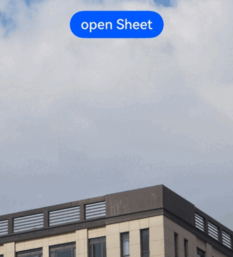
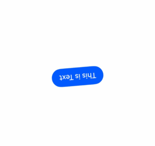

# Sheet Transition (System API)
<!--Kit: ArkUI-->
<!--Subsystem: ArkUI-->
<!--Owner: @hehongyang3-->
<!--Designer: @hehongyang3-->
<!--Tester: @lxl007-->
<!--Adviser: @Brilliantry_Rui-->
<!-- md-trans-meta sourceCommit=8dd2d5cdf88acdc31ee17ec2006247a008c91d7c translatedAt=2026-09-02T12:07:37.081Z -->

You can bind a sheet popup to a component through the **bindSheet** attribute. When the component is inserted, you can determine the size of the sheet popup by setting a custom height or using the default built-in height.

>  **NOTE**
>
>  This feature is supported since API version 10. Updates will be marked with a superscript to indicate their earliest API version.
>
>  The APIs of this module can be used only in the stage model.
>
>  Route hopping is not supported.
>
>  This topic describes only the system APIs of the current module. For details about other public APIs, see [bindSheet](./ts-universal-attributes-sheet-transition.md#bindsheet).

## SheetOptions

Optional attributes of the sheet. Inherits from [BindOptions](./ts-universal-attributes-sheet-transition.md#bindoptions).

**System capability**: SystemCapability.ArkUI.ArkUI.Full

| Name              | Type                                       | Read-only | Optional | Description              |
| --------------- | ------------------------------- | --------- | ---- | --------------- |
| offset<sup>14+</sup>       | [Position](ts-types.md#position) | No | No    | Sets the offset of the sheet popup. The bottom spacing can be set only when the sheet popup is a bottom popup. The **detents** attribute in [SheetOptions](ts-universal-attributes-sheet-transition.md#sheetoptions) of the sheet popup is not supported. When the y-axis is set to a positive number, the setting does not take effect and falls back to the default value 0vp.<br> Default value: the x-axis coordinate is 0vp, and the y-axis coordinate is 0vp.<br>**System API:** This API is a system API.|
| edgeLightMode | [EdgeLightMode](ts-appendix-enums-sys.md#edgelightmode) | No | Yes | Sets the edge light effect animation mode of the sheet popup. The edge light flow animation takes effect only when [SheetType](ts-universal-attributes-sheet-transition.md#sheettype11) is BOTTOM. When this attribute is not set, the edge light effect animation is disabled by default. For the edge light effect animation of the sheet popup, EDGELIGHT_AUTO: disabled on all computing devices; EDGELIGHT_ENABLED: enables the edge light effect animation; EDGELIGHT_DISABLED: disables the edge light effect animation.<br>Default value: EdgeLightMode.EDGELIGHT_DISABLED<br>**Since:** 26.0.0<br>**Model Constraint:** This API is only available in the stage model.<br>**System API:** This API is a system API.|
| blurSnapshot | [BlurSnapshotOptions](#blursnapshotoptions) | No | Yes | Blur snapshot optimization option of the sheet popup, used to reduce the computational overhead of blur rendering. When a significant increase in power consumption is observed while using **blurStyle** or **systemMaterial** to set the blur or material effect, you can enable blur optimization. After it is enabled, if the sheet popup is configured with **blurStyle** or **systemMaterial**, its blur effect is rendered using snapshots to reduce computational overhead; if **blurStyle** or **systemMaterial** is not set, enabling **enableBlurSnapshot** does not produce a blur optimization effect. This attribute does not support dynamic switching between a value and undefined after the sheet popup is displayed. If you attempt to switch it after the popup is displayed, the setting does not take effect. The POPUP type of the sheet popup does not support blur optimization. If **enableBlurSnapshot** is set to true on the POPUP type, the setting does not take effect.<br>Default value: undefined, which disables blur optimization<br>**Since:** 26.0.0<br>**Model Constraint:** This API is only available in the stage model.<br>**System API:** This API is a system API.|

## BlurSnapshotOptions

Blur snapshot optimization options. After this object is set, blur optimization is enabled.

**System capability**: SystemCapability.ArkUI.ArkUI.Full

**Since**: 26.0.0

**Model restriction**: This API can be used only in the stage model.

**System API**: This is a system API.

| Name | Type | Read-only | Optional | Description |
| --- | --- | --- | --- | --- |
| enableFreeze | boolean | No | Yes | Sets whether to enable freeze optimization for the blur snapshot. When enabled, freeze optimization is applied during blur snapshot to reduce rendering overhead. When not set or set to false, freeze optimization is disabled and the conventional rendering method is used.<br>After the sheet is pulled up, this parameter value can be switched dynamically.<br>Default value: false<br>**Since:** 26.0.0<br>**Model Constraint:** This API is only available in the stage model.<br>**System API:** This API is a system API.|

## Examples

### Example 1: Setting the Edge Light Effect Animation for a Sheet

The following example enables the Edge Light Effect animation by setting the **edgeLightMode** attribute, and uses the **systemMaterial** API in [SheetOptions](ts-universal-attributes-sheet-transition.md#sheetoptions) to implement a semi-transparent material effect.

Since API version 26.0.0, the **edgeLightMode** attribute is added to [SheetOptions](#sheetoptions).

```ts
// xxx.ets
import { uiMaterial } from '@kit.ArkUI';

@Entry
@Component
struct SheetMaterialExample {
  @State isShow: boolean = false;
  @State sheetHeight: number = 300;
  @State sheetMaterial: SystemUiMaterial | undefined = new uiMaterial.ImmersiveMaterial({
    style: uiMaterial.ImmersiveStyle.ULTRA_THIN,
  });

  @Builder
  sheetBuilder() {
    Column({ space: 10 }) {
      Text('Text')
        .fontSize(20)
        .margin(10)
    }
    .width('100%')
    .height('100%')
  }

  build() {
    Stack() {
      // Replace this with the actual resource file.
      Image($r('app.media.startIcon'))
      Column() {
        Button('open Sheet')
          .onClick(() => {
            this.isShow = true;
          })
          .fontSize(20)
          .margin(10)
          .bindSheet($$this.isShow, this.sheetBuilder(), {
            height: this.sheetHeight,
            backgroundColor: Color.Transparent,
            edgeLightMode: EdgeLightMode.EDGELIGHT_ENABLED,
            systemMaterial: this.sheetMaterial
          })
      }
      .justifyContent(FlexAlign.Center)
      .width('100%')
      .height('100%')
    }
  }
}
```



### Example 2 (Set Blur Optimization for Sheet)

The following example enables blur optimization by setting the blurSnapshot attribute. When the systemMaterial API in [SheetOptions](ts-universal-attributes-sheet-transition.md#sheetoptions) is used to set a material effect, or the blurStyle API in [SheetOptions](ts-universal-attributes-sheet-transition.md#sheetoptions) is used to set blur, and a significant increase in power consumption is observed, you can try enabling blur optimization.

Since API version 26.0.0, [SheetOptions](#sheetoptions) adds the blurSnapshot attribute.

```ts
// xxx.ets
import { uiMaterial } from '@kit.ArkUI';

@Entry
@Component
struct SheetTransitionExample {
  @State isShow: boolean = false;
  @State rotateAngle: number = 0;
  @State sheetMaterial: SystemUiMaterial | undefined = new uiMaterial.ImmersiveMaterial({
    style: uiMaterial.ImmersiveStyle.ULTRA_THIN,
  });

  @Builder
  sheetBuilder() {
    Text('Context')
  }

  build() {
    Stack() {
      Button('This is Text')
        .margin(100)
        .rotate({
          x: 0,
          y: 0,
          z: 1,
          angle: this.rotateAngle
        })
        .onAppear(() => {
          this.getUIContext()?.animateTo({
            duration: 1200,
            curve: Curve.Friction,
            delay: 500,
            iterations: -1,
            expectedFrameRateRange: {
              min: 10,
              max: 120,
              expected: 60,
            }
          }, () => {
            this.rotateAngle = 360;
          })
        })
      Column() {
        Button('Open BindSheet')
          .onClick(() => {
            this.isShow = true;
          })
          .fontSize(20)
          .margin(10)
          .bindSheet($$this.isShow, this.sheetBuilder(), {
            height: 400,
            showClose: true,
            backgroundColor: Color.Transparent,
            // If a significant increase in power consumption is observed when setting blurStyle or systemMaterial, try enabling blur optimization.
            blurStyle: BlurStyle.Thin,
            // systemMaterial: this.sheetMaterial,
            blurSnapshot: { enableFreeze: true },
          })
      }
      .justifyContent(FlexAlign.Start)
      .width('100%')
      .height('100%')
    }
  }
}

```


