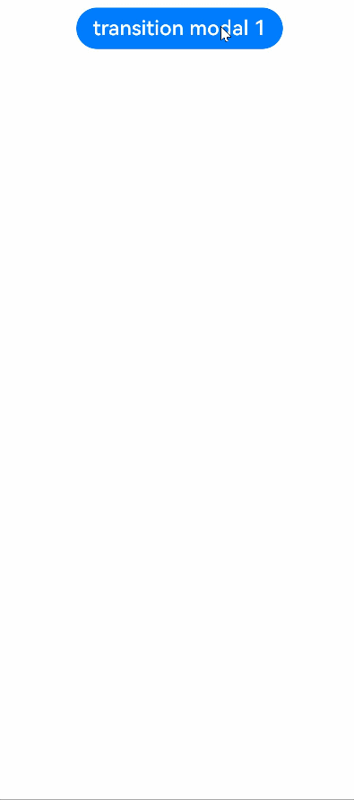
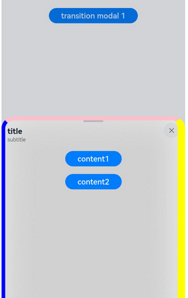
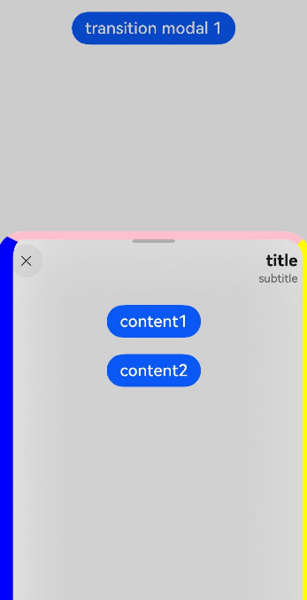
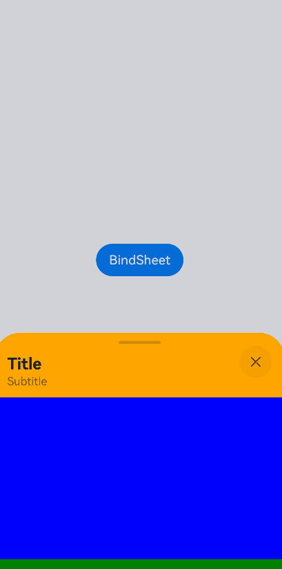
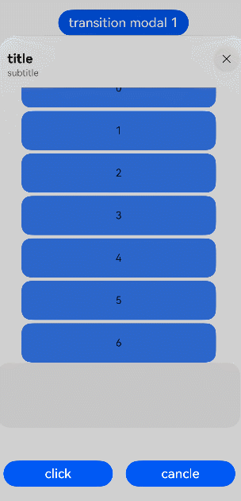
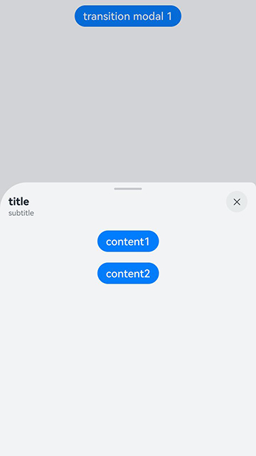
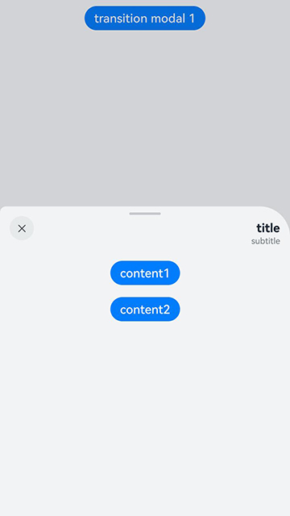
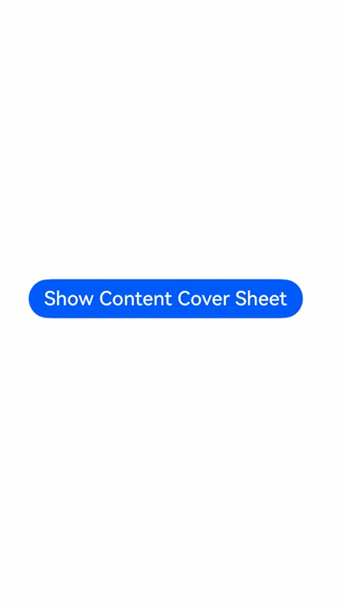
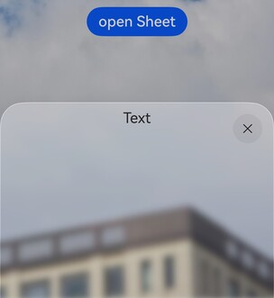

# Sheet Transition
<!--Kit: ArkUI-->
<!--Subsystem: ArkUI-->
<!--Owner: @hehongyang3-->
<!--Designer: @hehongyang3-->
<!--Tester: @lxl007-->
<!--Adviser: @Brilliantry_Rui-->

The **bindSheet** attribute is used to bind a sheet page to a component. Multiple pop-up window styles are supported, including bottom, center, follow-up, side, and full screen. When a component is inserted, you can set the custom or default built-in height to determine the size of the sheet page. (The height of the side and full-screen pop-up windows cannot be customized.)

>  **NOTE**
>
> - The initial APIs of this module are supported since API version 10. Updates will be marked with a superscript to indicate their earliest API version.
>
> - The APIs of this module can be used only in the stage model.
>
> - Route hopping is not supported.

## bindSheet

bindSheet(isShow: boolean, builder: CustomBuilder, options?: SheetOptions): T

Bind a sheet page to a component, and use the **isShow** parameter to control the display and hiding of the sheet page. Use the **builder** parameter to configure the content of the sheet page, and use the **options** parameter to configure the optional attributes of the sheet page.

> **NOTE**
>
> This API cannot be called within [attributeModifier](ts-universal-attributes-attribute-modifier.md#attributemodifier).

**Atomic service API**: This API can be used in atomic services since API version 11.

**System capability**: SystemCapability.ArkUI.ArkUI.Full

**Parameters**

| Name | Type                                       | Mandatory| Description                                                        |
| ------- | ------------------------------------------- | ---- | ------------------------------------------------------------ |
| isShow  | boolean                          | Yes  | Whether to display the sheet.<br>**true**: Display the sheet.<br>**false**: Hide the sheet.<br>Since API version 10, this parameter supports two-way binding through [$$](../../../ui/state-management/arkts-two-way-sync.md).<br>Since API version 18, this attribute supports two-way binding through [!!](../../../ui/state-management/arkts-new-binding.md).|
| builder | [CustomBuilder](ts-types.md#custombuilder8) | Yes  | Content of the sheet.                                        |
| options | [SheetOptions](#sheetoptions)               | No  | Optional attributes of the sheet. If this parameter is not passed, no additional attribute is configured for the half-modal page, and each attribute uses its default value.                                  |

**Return value**

| Type| Description|
| -------- | -------- |
| T | Returns the current component for chained calls.|

> **NOTE**
>
> 1. When no two-way binding is set up for the **isShow** parameter, closing the sheet by dragging does not change the parameter value.
>
> 2. To synchronize the value of the **isShow** parameter with the sheet UI state, set up a two-way binding for **isShow** through [$$](../../../ui/state-management/arkts-two-way-sync.md). Since API version 18, this parameter supports two-way binding through [!!](../../../ui/state-management/arkts-new-binding.md#two-way-binding-between-built-in-component-parameters).
>
> 3. In scenarios where a sheet with a single detent is dragged upwards or a sheet with multiple detents is shifted to another detent by swiping up, the display area is updated after the drag ends or the shift is completed.
>
> 4. A sheet is a popup that is strictly bound to its host node. To achieve an effect where the sheet appears the moment the page is displayed, ensure that the host node is mounted in the view hierarchy. If the host node is not yet mounted when **isShow** is set to **true**, the sheet will not be displayed. You are advised to use the [onAppear](ts-universal-events-show-hide.md#onappear) to ensure that the sheet is shown after the host node is mounted.
> When [SheetMode](#sheetmode12) is set to **EMBEDDED**, in addition to the host node, also ensure that the corresponding page node is successfully mounted.
>
> 5. The exit animation of the sheet does not support interruption, and the sheet cannot respond to other gestures during the execution. The current exit animation uses a [spring curve](../../../ui/arkts-spring-curve.md), which has a subtle trailing effect that is not visually prominent. Therefore, when the sheet exits, although it may appear to have disappeared, the animation might not have fully finished, and attempting to initiate the sheet again by a touch will not work. You must wait for the animation to fully complete before you can initiate the sheet again.
>
## SheetOptions

Inherits from [BindOptions](#bindoptions).

Provides content configuration options of the sheet.

**System capability**: SystemCapability.ArkUI.ArkUI.Full

<!--Table: 20%; 20%; 8%; 8%; 44%-->
| Name             | Type                                      | Read-Only| Optional  | Description             |
| --------------- | --------------------------- | ------------- | ---- | --------------- |
| height          | [SheetSize](#sheetsize)&nbsp;\|&nbsp;[Length](ts-types.md#length)| No| Yes  | Height of the sheet. Default value: **LARGE**<br>**NOTE**<br>1. Since API version 14, for a bottom sheet in landscape mode, the maximum height is 8 vp from the top of the screen if there is no status bar, and 8 vp from the status bar if there is one.<br>2. When a bottom sheet has **detents** set, this attribute is ineffective.<br>3. For a bottom sheet in portrait mode, the maximum height is 8 vp from the status bar.<br>4. For center and popup sheets set to **SheetSize.LARGE** or **SheetSize.MEDIUM**, this attribute is ineffective, with the default height being 560 vp.<br>5. For center and popup sheets, the minimum height is 320 vp, and the maximum height is 90% of the shorter edge of the window.<br>6. For center and popup sheets, if the height specified by **Length** is greater than the maximum height, the maximum height is used; if the height is less than the minimum height, the minimum height is used.<br>7. If the sheet size is set to **SheetSize.FIT_CONTENT** and the type is set to the center or popup sheet, the maximum height is used when the sheet height is greater than the maximum height, and the minimum height is used when the sheet height is less than the minimum height in API version 22 and earlier versions. Since API version 23, the maximum height is used when the sheet height is greater than the maximum height, and the adaptive height is used when the sheet height is less than the minimum height.<br>8. In the side popup sheet style, only the full screen height is supported.<br>9. In full-screen modal style, only the full screen height is supported.<br>**Atomic service API**: This API can be used in atomic services since API version 11.|
| detents<sup>11+</sup> | [([SheetSize](#sheetsize)\| [Length](ts-types.md#length)), ([SheetSize](#sheetsize)\| [Length](ts-types.md#length))?, ([SheetSize](#sheetsize)\| [Length](ts-types.md#length))?]| No| Yes| Array of heights where the sheet can rest. If this parameter is not set, the **height** attribute is used to determine the height of the sheet page by default.<br>**NOTE**<br>When a bottom sheet has **detents** set, the **height** attribute is ineffective.<br>Since API version 12, this attribute takes effect for a bottom sheet in landscape mode.<br>In earlier versions, this attribute takes effect only for the bottom sheet in portrait mode. The first height in the tuple is the initial height.<br>The sheet can switch between heights by dragging. After the sheet is dragged and released, it switches to the target height or remains at the current height, depending on the velocity and distance. If the speed exceeds the threshold, the panel is swiped to the target level in the same direction as the swipe speed. If the speed is less than the threshold, the distance is used as a condition. If the displacement distance is greater than half of the distance between the current position and the target position, the panel is swiped to the target level in the same direction as the swipe speed. If the displacement distance is less than half of the distance between the current position and the target position, the panel is returned to the current level. The speed threshold is 1000 px/s, and the distance threshold is 50%.<br>**Atomic service API**: This API can be used in atomic services since API version 12.|
| preferType<sup>11+</sup> | [SheetType](#sheettype11)| No| Yes| Type of the sheet.<br>**NOTE**<br>The types supported by the sheet vary by window.<br>1. Width &lt; 600 vp: bottom, full-screen. It is a default bottom style.<br>2. 600 vp &lt;= Width &lt; 840 vp: bottom, center, popup, side-aligned, full-screen. It is a default center style.<br>3. Width >= 840 vp: bottom, center, popup, side-aligned, full-screen. It is a default popup style.<br>4. Since API version 20, when the window width is greater than 600 vp, **preferType** can be set to **SheetType.SIDE**.<br>5. Since API version 20, **preferType** can be set to **SheetType.CONTENT_COVER**, enabling full-screen sheet style.<br>**Atomic service API**: This API can be used in atomic services since API version 12.|
| showClose<sup>11+</sup> | boolean \| [Resource](ts-types.md#resource) | No| Yes| Whether to display the close icon.<br> On 2-in-1 devices, the icon does not have a background by default.<br> Default value: **true**<br> **true**: Display the close icon.<br> **false**: Do not display the close icon.<br>**NOTE**<br>1. The value of **Resource** must be of the Boolean type.<br>2. The close button cannot be displayed in the full-screen modal style (**CONTENT_COVER**). Therefore, this attribute setting is invalid.<br>**Atomic service API**: This API can be used in atomic services since API version 12.|
| dragBar         | boolean                                  | No| Yes   | Whether to display the drag bar.<br> Default value: **true**<br>**true**: Display the drag bar.<br>**false**: Do not display the drag bar.<br>**NOTE**<br>If the **detents** attribute of the sheet panel is set to multiple different heights and the setting takes effect, the control bar is displayed by default. If the **detents** attribute is not set to multiple positions, the control bar is not displayed by default.<br>**Atomic service API**: This API can be used in atomic services since API version 11.|
| blurStyle<sup>11+</sup> | [BlurStyle](ts-universal-attributes-background.md#blurstyle9) | No| Yes| Blur background of the sheet panel. Different values of the **BlurStyle** enumeration indicate different blur effects. For example, **Thin** indicates slight blur, **Regular** indicates normal blur, and **Thick** indicates heavy blur. By default, there is no background blur.<br>**Atomic service API**: This API can be used in atomic services since API version 12.|
| maskColor | [ResourceColor](ts-types.md#resourcecolor) | No| Yes| Mask color of the sheet.<br> Default value: **$r('sys.color.ohos_id_color_mask_thin')**<br>**NOTE**<br>When **enableOutsideInteractive** is set to **true**, the **maskColor** setting is invalid.<br>**Atomic service API**: This API can be used in atomic services since API version 11.|
| title<sup>11+</sup> | [SheetTitleOptions](#sheettitleoptions11) \| [CustomBuilder](ts-types.md#custombuilder8) | No| Yes| Title of the sheet.<br>**NOTE**<br>When **CustomBuilder** is passed to **title**, the **enableFloatingDragBar** attribute is always **false**, and the floating control bar is not supported.<br>The title bar cannot be displayed in the full-screen modal style (**CONTENT_COVER**). Therefore, this attribute setting is invalid. If this parameter is not set, there is no title by default.<br>**Atomic service API**: This API can be used in atomic services since API version 12.|
| enableOutsideInteractive<sup>11+</sup> | boolean | No| Yes| Whether to allow users to interact with the underlying page when the sheet is displayed.<br>**NOTE**<br>The value **true** means that interactions are allowed, in which case no mask is not displayed. The value **false** means that interactions are not allowed, in which case a mask is displayed. If this parameter is not set, interactions are allowed for the popup sheet, but not for bottom and center sheets. If this parameter is set to **true**, the setting of **maskColor** does not take effect.<br>**Atomic service API**: This API can be used in atomic services since API version 12.|
| shouldDismiss<sup>11+</sup> | (sheetDismiss: [SheetDismiss](#sheetdismiss11)) => void | No| Yes| Callback invoked when the user performs an interactive dismiss operation: pulling down, side swiping, or clicking the mask or the close icon.<br>**NOTE**<br>If this callback is registered, the sheet is not dismissed immediately when the user performs the above operations. To dismiss the sheet, you must call **shouldDismiss.dismiss()** in the callback.<br>If this callback is not registered, the sheet is dismissed immediately when the user performs the above operations, without any additional behavior.<br>Side swiping for dismissal refers to any of the following operations: swiping left or right, touching the Back button, and pressing the Esc key.<br>If the **onWillSpringBackWhenDismiss** callback is also registered, the springback behavior of closing the sheet page by pulling down is controlled by **onWillSpringBackWhenDismiss**.<br>Both **shouldDismiss** and [onWillDismiss](#sheetoptions) are callback functions for closing the sheet page interactively. You are not advised to register both of them at the same time. If you need to obtain the unfollow operation type and determine whether to close the sheet page, you are advised to use [onWillDismiss](#sheetoptions) instead of **shouldDismiss**.<br>It is recommended that this API be used in scenarios where a [secondary confirmation](../../../ui/arkts-sheet-page.md#secondary-confirmation-capability) is required<br>**Atomic service API**: This API can be used in atomic services since API version 12.|
| onWillDismiss<sup>12+</sup> | [Callback](./ts-types.md#callback12)<[DismissSheetAction](#dismisssheetaction12)> | No| Yes   | Callback invoked when the user performs an interactive dismiss operation: pulling down, side swiping, or clicking the mask or the close icon. Use this callback to determine whether to proceed with dismissal based on the operation type.<br>**NOTE**<br>If this callback is registered, the sheet is not dismissed immediately when the user performs the above operations. Instead, you can use the **reason** parameter in the [DismissSheetAction](#dismisssheetaction12) callback to determine the type of dismiss operation and decide whether to dismiss the sheet.<br>If this callback is not registered, the sheet is dismissed immediately when the user performs the above operations, without any additional behavior.<br>Side swiping for dismissal refers to any of the following operations: swiping left or right, touching the Back button, and pressing the Esc key.<br>No further interception with **onWillDismiss** is allowed in an **onWillDismiss** callback.<br>It is recommended that this API be used in scenarios where a [secondary confirmation](../../../ui/arkts-sheet-page.md#secondary-confirmation-capability) is required<br>**Atomic service API**: This API can be used in atomic services since API version 12.|
| onWillSpringBackWhenDismiss<sup>12+</sup> | [Callback](./ts-types.md#callback12)<[SpringBackAction](#springbackaction12)> | No| Yes   | Callback to control the interactive spring back before the sheet is dismissed. You can register this callback to control the spring back effect when the sheet is dismissed. It is recommended that this callback be used in scenarios where a [secondary confirmation](../../../ui/arkts-sheet-page.md#secondary-confirmation-capability) is required or when you need to customize the interaction feedback for closing the sheet.<br>**NOTE**<br>If this callback is registered along with **shouldDismiss** or **onWillDismiss**, you can control whether the sheet bounces back during the pull-down-to-dismiss operation by calling **springBack** in the callback.<br>If this callback is not registered but **shouldDismiss** or **onWillDismiss** is registered, the sheet will bounce back before remaining open or being dismissed based on the callback behavior.<br>If neither this callback nor **shouldDismiss** or **onWillDismiss** is registered, the sheet is dismissed by default during the pull-down-to-dismiss operation.<br>For side-aligned sheets, **springBack** works only side swiping is performed for dismissal.<br>**Atomic service API**: This API can be used in atomic services since API version 12.|
| onHeightDidChange<sup>12+</sup> | [Callback](./ts-types.md#callback12)&lt;number&gt; | No| Yes| Callback for changes in the height of the sheet. If this parameter is not set, the callback is not triggered.<br>**NOTE**<br>For a bottom sheet, the height of each frame is only returned when there are changes in detents or during drag actions. When the sheet is pulled up or making space for the soft keyboard, only the final height is returned. For other types of sheets, the final height is only returned when the sheet is pulled up.<br>The return value is in px.<br>**Atomic service API**: This API can be used in atomic services since API version 12.|
| onDetentsDidChange<sup>12+</sup> | [Callback](./ts-types.md#callback12)&lt;number&gt; | No| Yes| Callback for changes in the detents of the sheet. If this parameter is not set, the callback is not triggered.<br>**NOTE**<br>This callback is triggered only when the bottom sheet is displayed. When the position changes, the final height is returned.<br>The return value is in px.<br>**Atomic service API**: This API can be used in atomic services since API version 12.|
| onWidthDidChange<sup>12+</sup> | [Callback](./ts-types.md#callback12)&lt;number&gt; | No| Yes| Callback for changes in the width of the sheet. If this parameter is not set, the callback is not triggered.<br>**NOTE**<br>The final height is returned when there are changes in the width.<br>The return value is in px.<br>**Atomic service API**: This API can be used in atomic services since API version 12.|
| onTypeDidChange<sup>12+</sup> | [Callback](./ts-types.md#callback12)&lt;[SheetType](#sheettype11)&gt; | No| Yes| Callback function for the style change of a sheet page.<br>**NOTE**<br>The final style is returned when the style changes.<br>**Atomic service API**: This API can be used in atomic services since API version 12.|
| borderWidth<sup>12+</sup> | [Dimension](ts-types.md#dimension10)&nbsp;\|&nbsp;[EdgeWidths](ts-types.md#edgewidths9)&nbsp;\|&nbsp;[LocalizedEdgeWidths](ts-types.md#localizededgewidths12)<sup>12+</sup>  | No| Yes| Border width of the sheet.<br>You can set the width for all four sides or set separate widths for individual sides.<br>Default value: **0vp**<br> Percentage mode: The border width of the sheet page is set in percentage of the page width.<br>If the left and right border widths of the sheet are greater than the width of the sheet, and the top and bottom border widths are greater than the height of the sheet, the display may not appear as expected.<br>**NOTE**<br>For bottom sheets, the bottom border width setting is ineffective. When the **systemMaterial** attribute is set, the effect of this attribute may be overwritten. Therefore, you are advised not to use this attribute together with **systemMaterial**. The value must be a non-negative number. If a negative value is passed, the setting is invalid.<br>**Atomic service API**: This API can be used in atomic services since API version 12.|
| borderColor<sup>12+</sup> | [ResourceColor](ts-types.md#resourcecolor)&nbsp;\|&nbsp;[EdgeColors](ts-types.md#edgecolors9)&nbsp;\|&nbsp;[LocalizedEdgeColors](ts-types.md#localizededgecolors12)<sup>12+</sup>  | No| Yes| Border color of the sheet.<br>Default value: **Color.Black**<br> If the **borderColor** attribute is used, it must be used together with the **borderWidth** attribute. If the **borderWidth** attribute is not set, the border color is invisible because the default value of **borderWidth** is **0**.<br>**NOTE**<br>For bottom sheets, the bottom border color setting is ineffective. When the **systemMaterial** attribute is set, the effect of this attribute may be overwritten. Therefore, you are advised not to use this attribute together with **systemMaterial**.<br>**Atomic service API**: This API can be used in atomic services since API version 12.|
| borderStyle<sup>12+</sup> | [BorderStyle](ts-appendix-enums.md#borderstyle)&nbsp;\|&nbsp;[EdgeStyles](ts-types.md#edgestyles9)  | No| Yes| Border style of the sheet.<br>Default value: **BorderStyle.Solid**<br>If the **borderStyle** attribute is used, it must be used together with the **borderWidth** attribute. If the **borderWidth** attribute is not set, the border style is invisible because the default value of **borderWidth** is 0.<br>**NOTE**<br>For bottom sheets, the bottom border style setting is ineffective.<br>**Atomic service API**: This API can be used in atomic services since API version 12.|
| width<sup>12+</sup> | [Dimension](ts-types.md#dimension10)   | No| Yes| Width of the sheet. If this attribute is not set, the default width of each pop-up window style is used by default.<br> Percentage parameter method: Set the width of the sheet as a percentage of the width of the parent element. <br>**Atomic service API**: This API can be used in atomic services since API version 12.|
| shadow<sup>12+</sup> | [ShadowOptions](ts-universal-attributes-image-effect.md#shadowoptions)&nbsp;\|&nbsp;[ShadowStyle](ts-universal-attributes-image-effect.md#shadowstyle10)  | No| Yes| Shadow of the sheet page. You can use **ShadowOptions** to customize shadow parameters or use **ShadowStyle** to use preset shadow styles (for example, **OUTER_FLOATING_SM** indicates a small floating shadow, and **OUTER_FLOATING_MD** indicates a medium floating shadow).<br>**Default value**: No shadow is displayed on non-2-in-1 devices by default. Default value for 2-in-1 devices: **ShadowStyle.OUTER_FLOATING_SM**<br>**NOTE**<br>When the **systemMaterial** attribute is set, the effect of this attribute may be overwritten. Therefore, you are advised not to use this attribute together with **systemMaterial**. This attribute is invalid in the full-screen modal style (**CONTENT_COVER**), because the shadow is not supported in this style.<br>**Atomic service API**: This API can be used in atomic services since API version 12.|
| uiContext<sup>12+</sup> | [UIContext](../arkts-apis-uicontext-uicontext.md)   | No| Yes| **UIContext** instance corresponding to the window where the sheet is displayed. If this parameter is not passed, the sheet page is displayed in the window corresponding to the current UIContext by default. This parameter is passed when the sheet page needs to be displayed in a specified window.<br>**NOTE**<br>For the sheet page started using [openBindSheet](../arkts-apis-uicontext-uicontext.md#openbindsheet12), this attribute cannot be set or updated. When **SheetMode.EMBEDDED** is set, this attribute cannot be set either. The two attributes conflict with each other in terms of the display layer of the sheet page.<br>**Atomic service API**: This API can be used in atomic services since API version 12.|
| mode<sup>12+</sup> | [SheetMode](#sheetmode12)   | No| Yes| Display mode of the sheet.<br>Default value: **SheetMode.OVERLAY**<br>**NOTE**<br> 1. During the display of the sheet, the **mode** attribute does not support dynamic changes. The display hierarchy of the two modes is entirely different, making it impossible to switch a sheet from one mode to another while it is being displayed. You are advised to clearly define and fix the **mode** value to ensure consistency in the display hierarchy.<br> 2. The **UIContext** attribute cannot be set when **SheetMode.EMBEDDED** is set, as their corresponding sheet display hierarchy effects are mutually conflicting.<br>3. For a sheet launched with [openBindSheet](../arkts-apis-uicontext-uicontext.md#openbindsheet12), if a valid target ID is not provided, **SheetMode.EMBEDDED** cannot be set, and the default value **SheetMode.OVERLAY** is used.<br>**Atomic service API**: This API can be used in atomic services since API version 12.|
| scrollSizeMode<sup>12+</sup> | [ScrollSizeMode](#scrollsizemode12)   | No| Yes| Content update mode of the sheet when it is scrolled.<br>Default value: **ScrollSizeMode.FOLLOW_DETENT**<br>**Atomic service API**: This API can be used in atomic services since API version 12.|
| keyboardAvoidMode<sup>13+</sup> | [SheetKeyboardAvoidMode](#sheetkeyboardavoidmode13) | No| Yes| How the sheet avoids the soft keyboard when it is brought up.<br> Default value: **TRANSLATE_AND_SCROLL**<br>**Atomic service API**: This API can be used in atomic services since API version 13.|
| enableHoverMode<sup>14+</sup>              | boolean | No| Yes  | Whether to respond when the device is in semi-folded mode.<br>Default value: **false**, meaning not to enable the hover mode.<br> Default value for 2-in-1 devices: **true**<br>**true**: Respond when the device is in semi-folded mode.<br>**false**: Do not respond when the device is in semi-folded mode.<br>**NOTE**<br>The bottom pop-up window style, follow-up pop-up window style, side pop-up window style, and full-screen modal style do not respond to the hover state. The subwindow mode does not support the semi-folded mode.<br>**Atomic service API**: This API can be used in atomic services since API version 14.|
| hoverModeArea<sup>14+</sup>              | [HoverModeAreaType](#hovermodeareatype14) | No| Yes  | Display area of the dialog box in hover mode. This attribute takes effect only when [enableHoverMode](#sheetoptions) is set to **true**.<br>Default value: **HoverModeAreaType.BOTTOM_SCREEN**<br> Default value for 2-in-1 devices: **HoverModeAreaType.TOP_SCREEN**<br>**NOTE**<br>The side pop-up window style and full-screen pop-up window style do not support the setting of the hover area.<br>**Atomic service API**: This API can be used in atomic services since API version 14.|
| radius<sup>15+</sup> | [LengthMetrics](../js-apis-arkui-graphics.md#lengthmetrics12)&nbsp;\|&nbsp;[BorderRadiuses](ts-types.md#borderradiuses9)&nbsp;\|&nbsp;[LocalizedBorderRadiuses](ts-types.md#localizedborderradiuses12) | No| Yes| Corner radius of the sheet.<br>To deliver the optimal experience, use the same radius for the four corners.<br>Default value: **32vp**<br>**NOTE**<br>1. The corner radius is displayed based on the set value. If it is not set, the default value is used. The bottom sheet does not display the bottom two corners, even if they are set.<br>2. After the corner radius in each direction is configured, if the corner radius in a direction is invalid (for example, a negative value), the corner radius in this direction is reset to the default value, and the corner radius in other directions is the configured value. If the configured corner radius is invalid (for example, a negative value), the corner radius in all directions is reset to the default value.<br>3. When the corner radius is set as a percentage, the width of the sheet is used as the reference.<br>4. If the corner radius is greater than half the width of the sheet, it is set to half the width of the sheet.<br>5. If the height of the sheet is too small and the corner radius is set too large, it may cause display issues.<br>**Atomic service API**: This API can be used in atomic services since API version 15.|
| detentSelection<sup>15+</sup>         <br>| [SheetSize](#sheetsize)&nbsp;\|&nbsp;[Length](ts-types.md#length)| No| Yes   | Initial detent (position) for non-gesture switching.<br>Default value: **detents[0]**<br>**NOTE**<br>1. The value must be within the range of the **detents** array. If the value is outside this range, this API has no effect.<br>2. When **SheetSize.FIT_CONTENT** is used, this API has no effect.<br>3. You are not advised to use this API and the gesture to switch the sheet at the same time. Otherwise, the sheet switching behavior may be unpredictable.<br>**Atomic service API**: This API can be used in atomic services since API version 15.|
| placement<sup>18+</sup> | [Placement](ts-appendix-enums.md#placement8) | No| Yes| Display position of the sheet popup relative to the target. In the side popup style, this attribute supports only the bubble style.<br>Default value: **Placement.Bottom**<br>**NOTE**<br> 1. The system attempts to display the popup at the specified position if the popup fits within the window. If this is not feasible, it tries vertical flipping first, followed by a 90° horizontal rotation.<br>2. If the alignment causes the popup to exceed the window bounds, it will be adjusted horizontally or vertically until fully visible.<br>3. If none of the four directions can accommodate the popup, the behavior depends on the **placementOnTarget** attribute:<br>(1) If the attribute value is **true**, the popup moves in the mirror direction of the specified placement until fully visible.<br>(2) If the attribute value is **false**, the system selects the direction that can fully display the popup width and has the most remaining height. It then adjusts the sheet height to fit this direction, ensuring that the popup is displayed while maintaining the alignment specified by the **placement** setting.<br>**Atomic service API**: This API can be used in atomic services since API version 18.|
| placementOnTarget<sup>18+</sup> | boolean | No| Yes| Whether the sheet popup can overlap the target if none of the four directions can accommodate the popup. In the side popup style, this attribute supports only the bubble style. This attribute must be used together with the [placement](#sheetoptions) attribute. The processing method of **placementOnTarget** is based on the display orientation set by **placement**.<br> Default value: **true**<br>**true**: The sheet popup can overlap the target.<br>**false**: The sheet popup cannot overlap the target.<br>**Atomic service API**: This API can be used in atomic services since API version 18.|
| effectEdge<sup>18+</sup> | number | No| Yes| Edge effect used when the boundary of the scrolling area in reached in the sheet. Single-edge activation is supported.<br>**Default value**: The effect takes effect on both sides by default, that is, [EffectEdge](ts-container-scrollable-common.md#effectedge18).START \| [EffectEdge](ts-container-scrollable-common.md#effectedge18).END (value 3).<br>**NOTE**<br>1. Only start edge: [EffectEdge](ts-container-scrollable-common.md#effectedge18).START<br>2. Only end edge: [EffectEdge](ts-container-scrollable-common.md#effectedge18).END<br>3. Both sides take effect: [EffectEdge](ts-container-scrollable-common.md#effectedge18).START \| [EffectEdge](ts-container-scrollable-common.md#effectedge18).END (value 3).<br>4. Neither edge: [EffectEdge](ts-container-scrollable-common.md#effectedge18).START & [EffectEdge](ts-container-scrollable-common.md#effectedge18).END (that is, value **0**)<br>**Atomic service API**: This API can be used in atomic services since API version 18.|
| showInSubWindow<sup>19+</sup> | boolean                                  | No| Yes   | Whether to show the sheet in a separate subwindow.<br>Default value: **false**<br>**NOTE**<br>1. **true**: The sheet displays in a separate subwindow and can extend beyond application window bounds.<br>2. **false**: The sheet displays only within application window bounds.<br>3. To prevent disruptions to the normal behavior of associated components, do not nest multiple dialog boxes where **showInSubWindow** is set to **true**.<br>4. Avoid using picker components (such as **CalendarPicker**, **CalendarPickerDialog**, **DatePickerDialog**, **TextPickerDialog**, and **TimePickerDialog**) in the dialog box where **showInSubWindow** is set to **true**, as the dialog box may affect the behavior of these components.<br>5. This attribute cannot be dynamically changed when the sheet is displayed.<br>**Atomic service API**: This API can be used in atomic services since API version 19.|
| enableFloatingDragBar<sup>20+</sup>              | boolean | No| Yes  | Whether to display the drag bar in a floating style. **true** to display in a floating style, **false** otherwise.<br>Default value: **false**<br> **NOTE**<br>The floating style takes effect only when the drag bar is visible, and the floating drag bar does not occupy layout space.<br> This parameter is fixed at **false** when **title** uses [CustomBuilder](ts-types.md#custombuilder8).<br>The floating control bar is not supported in the side dialog style.<br>**Atomic service API**: This API can be used in atomic services since API version 20.|
| modalTransition<sup>20+</sup> | [ModalTransition](#modaltransition) | No| Yes| Transition animation for full-screen sheet style. This attribute is valid only when [preferType](#sheetoptions) is set to [SheetType.CONTENT_COVER](#sheettype11) (full-screen sheet style).<br>Default value: **ModalTransition.DEFAULT**<br>**Atomic service API**: This API can be used in atomic services since API version 20.|
| radiusRenderStrategy<sup>23+</sup> |  [RenderStrategy](ts-appendix-enums.md#renderstrategy22) | No| Yes |Rendering strategy for drawing rounded corners.<br>Default value: **RenderStrategy.FAST**<br>Note: When the sheet is set to blurry, you can set the mode to **OFFSCREEN** to solve the problem that the display effect in the top or top rounded corner area of the sheet is abnormal. The popup style does not support the setting of the mode for drawing rounded corners of a component.<br>**Atomic service API**: This API can be used in atomic services since API version 23.<br>**Model restriction**: This API can be used only in the stage model.|
| systemMaterial |  [SystemUiMaterial](ts-universal-attributes-image-effect.md#systemuimaterial) | No| Yes |System material for a component.<br>Default value: **undefined**. The material effect set by this API will be cleared.<br>**Note**: Different system materials have different attribute effects. This API affects the background color ([backgroundColor](ts-universal-attributes-background.md#backgroundcolor)), border color ([borderColor](ts-universal-attributes-border.md#bordercolor)), border width ([borderWidth](ts-universal-attributes-border.md#borderwidth)), and shadow ([shadow](ts-universal-attributes-image-effect.md#shadow)). You are advised not to use this API together with the aforementioned APIs. For details, see [Example 10: Setting the System Material of a Sheet](#example-10-setting-the-system-material-of-a-sheet).<br>**Since:** 26.0.0<br>**Atomic service API:** This API can be used in atomic services since API version 26.0.0.<br>**Model restriction**: This API can be used only in the stage model.|

## SheetSize

Enumerates the sheet height modes.

**System capability**: SystemCapability.ArkUI.ArkUI.Full

| Name                     | Value   | Description                        |
| ------------------------- | ---- | -------------------------------- |
| MEDIUM                    | 0    | The sheet height is 60% of the window height on non-TV devices<br>and 50% on TVs.<br>**NOTE**<br>This value is invalid for the centered pop-up window and follow-hand pop-up window. The default height 560 vp is displayed.<br>**Atomic service API**: This API can be used in atomic services since API version 11.  |
| LARGE                     | 1    | The sheet height approximates the full window height.<br>On a TV device, the height of the sheet window is the height of the window where the sheet window is located.<br>**NOTE**<br>This value is invalid for the centered pop-up window and follow-hand pop-up window. The default height 560 vp is displayed.<br>**Atomic service API**: This API can be used in atomic services since API version 11.  |
| FIT_CONTENT<sup>11+</sup> | 2    | The sheet height automatically adapts to the content.<br>**Atomic service API**: This API can be used in atomic services since API version 12.<br>**NOTE**<br>1. In this mode, the height is determined by the builder's root node layout. Percentage-based heights are not supported for the root node. Circular dependencies between sheet and content height are prohibited.<br>2. If the sheet size is set to **SheetSize.FIT_CONTENT** and the type is set to the center or popup sheet, the maximum height is used when the sheet height is greater than the maximum height, and the minimum height is used when the sheet height is less than the minimum height in API version 22 and earlier versions.<br>Since API version 23, the maximum height is used when the sheet height is greater than the maximum height, and the adaptive height is used when the sheet height is less than the minimum height.<br>For center and popup sheets, the minimum height is 320 vp, and the maximum height is 90% of the shorter edge of the window.|

## HoverModeAreaType<sup>14+</sup>

Enumerates the display area types when the device is in semi-folded mode.

**Atomic service API**: This API can be used in atomic services since API version 14.

**System capability**: SystemCapability.ArkUI.ArkUI.Full

| Name    | Value   | Description                           |
| ------ | ----------------------------- | ----------------------------- |
| TOP_SCREEN | 0 | Upper half screen.|
| BOTTOM_SCREEN | 1 | Lower half screen.|

## BindOptions

Defines the common configuration for sheets and modals.

**System capability**: SystemCapability.ArkUI.ArkUI.Full

| Name           | Type                                      | Read-Only| Optional| Description                    |
| --------------- | --------------------------------- | --------- | ---- | ------------------------ |
| backgroundColor | [ResourceColor](ts-types.md#resourcecolor) | No| Yes  | Background color of the sheet.<br>Default value: **Color.White**<br>**NOTE**<br>When the **systemMaterial** attribute is set, the effect of this attribute may be overwritten. Therefore, you are advised not to use this attribute together with **systemMaterial**.<br>**Atomic service API**: This API can be used in atomic services since API version 11.|
| onWillAppear<sup>12+</sup>        | () => void                                 | No| Yes | Callback for when the sheet is about to be displayed (before the animation starts). The time sequence of **onWillAppear** and **onAppear** is as follows: **onWillAppear** is triggered before the animation starts, and **onAppear** is triggered after the animation ends. Both of them can be used at the same time. If you need to perform preparations before the animation starts, you are advised to use **onWillAppear**. If you need to update the UI after the animation ends, you are advised to use **onAppear**. If this attribute is not set, the callback is not triggered.<br>**Atomic service API**: This API can be used in atomic services since API version 12.|
| onAppear        | () => void                                 | No| Yes  | Callback for when the sheet is displayed (after the animation ends). If this attribute is not set, the callback is not triggered.<br>**Atomic service API**: This API can be used in atomic services since API version 11.|
| onWillDisappear<sup>12+</sup>     | () => void                                 | No| Yes  | Callback for when the sheet is about to disappear (before the animation starts). The time sequence of **onWillDisappear** and **onDisappear** is as follows: **onWillDisappear** is triggered before the rollback animation starts, and **onDisappear** is triggered after the rollback animation ends. Both of them can be used at the same time. If you need to save the status before the animation starts, you are advised to use **onWillDisappear**. If you need to release resources after the animation ends, you are advised to use **onDisappear**. If this attribute is not set, the callback is not triggered.<br>**NOTE**<br>Modifying state variables within the **onWillDisappear** function is not allowed, as it may lead to unstable component behavior. **Atomic service API**: This API can be used in atomic services since API version 12.|
| onDisappear     | () => void                                 | No| Yes  | Callback for when the sheet disappears (after the animation ends). If this attribute is not set, the callback is not triggered.<br>**Atomic service API**: This API can be used in atomic services since API version 11.|

## ModalTransition

Enumerates the modal transition types.

**Atomic service API**: This API can be used in atomic services since API version 11.

**System capability**: SystemCapability.ArkUI.ArkUI.Full

| Name     | Value| Description          |
| ------- | ---- | -------- |
| DEFAULT | 0 | Slide-up and slide-down animation for the modal. |
| NONE    | 1 | No transition animation for the modal.  |
| ALPHA   | 2 | Opacity gradient animation for the modal.|

## SheetType<sup>11+</sup>

Enumerates the sheet styles.

**System capability**: SystemCapability.ArkUI.ArkUI.Full

| Name  | Value  | Description                                              |
| ------ | ---- | ------------------------------------------------------ |
| BOTTOM | 0    | Bottom sheet.<br>**Atomic service API**: This API can be used in atomic services since API version 12.|
| CENTER | 1    | Center sheet.<br>**Atomic service API**: This API can be used in atomic services since API version 12.|
| POPUP  | 2    | Popup sheet. The popup sheet cannot be dismissed with a pull-down gesture.<br>**Atomic service API**: This API can be used in atomic services since API version 12.|
| SIDE<sup>20+</sup>   | 3    | Side sheet.<br>**Atomic service API**: This API can be used in atomic services since API version 20.|
| CONTENT_COVER<sup>20+</sup>   | 4    | Full-screen sheet.<br>**Atomic service API**: This API can be used in atomic services since API version 20.|

**Side sheet styles**

1. Transition animation: By default, the sheet enters from the right and exits to the right. In right-to-left (RTL) locales, it enters from the left and exits to the left. Custom transitions are not supported.

2. The multi-level detent is unavailable, and the **detents** and **detentSelection** APIs are not supported. The control bar-related APIs, such as **dragBar**, are not supported.

3. The bottom dialog box style can be swiped up after the transition ends. However, the side dialog box style can only be swiped right to close. The capabilities in the mirroring scenario are opposite.

4. The height cannot be customized and it is full screen by default.

5. Other display level APIs, such as **showInSubWindow = true** and **mode = SheetMode.EMBEDDED**, cannot be specified. The level of the side dialog box is the same as that of **SheetMode.OVERLAY**. Such dialog box can be displayed only at the top of the current **UIContext**. It is displayed at the same level as dialog boxes.

6. Hover state avoidance is not supported.

7. Default width of the side sheets:
   - md [breakpoint](../../../../application-dev/ui/arkts-layout-development-grid-layout.md#breakpoints): 1/2 window width
   - [Breakpoints](../../../../application-dev/ui/arkts-layout-development-grid-layout.md#breakpoints) larger than md: 400 vp fixed width


**APIs not supported by side sheets**
| Name            | Description             |
| --------------- |  --------------- |
| height          | Only full screen height is supported.|
| detents | No detent.| 
| dragBar         | The control bar is not supported. |
| onDetentsDidChange | No detent.|
| uiContext | The display level cannot be specified.|
| mode | The display level cannot be specified.|
| scrollSizeMode | No detent. |
| enableHoverMode  | Hover state avoidance is not supported.|
| hoverModeArea    | Hover state avoidance is not supported.|
| detentSelection | No detent.|
| placement | Only the popup style is supported.|
| placementOnTarget | Only the popup style is supported.|
| showInSubWindow | The display level cannot be specified.|

**Full-screen bindSheet styles**

1. In full-screen mode, the border, shadow, title bar, close button, and rounded corner are not supported.

2. By default, the builder content is laid out in the safe area.

3. The full-screen style supports the system transition mode [ModalTransition](#modaltransition), whose default value is **ModalTransition.DEFAULT**. Customized transition is not supported.

4. The **detents** and **detentSelection** APIs are not supported.

5. The sheet can be closed only by side swiping.

6. The width and height cannot be customized, and they are set to full screen by default.

7. Other display level APIs, such as **showInSubWindow = true** and **mode = SheetMode.EMBEDDED**, cannot be specified. The display level of the full-screen popup is the same as that of **SheetMode.OVERLAY**. Such popup can be displayed only at the top of the current **UIContext**, and is displayed at the same level as the popup component.

8. The soft keyboard is not avoided by default. You need to customize the settings.

9. The mask is not supported.


**APIs not supported by the full-screen bindSheet style**
| Name            | Description             |
| --------------- |  --------------- |
| height          | Only full screen height is supported.|
| width           | Only full screen width is supported.|
| detents | No detent.|
| dragBar         | The control bar is not supported. |
| onDetentsDidChange | No detent.|
| showClose          | The close icon cannot be displayed.|
| title          | The title bar cannot be displayed.|
| uiContext | The display level cannot be specified.|
| mode | The display level cannot be specified.|
| scrollSizeMode | No detent. |
| keyboardAvoidMode | The soft keyboard is not avoided by default. You need to customize the settings.|
| enableHoverMode  | Hover state avoidance is not supported.|
| hoverModeArea    | Hover state avoidance is not supported.|
| detentSelection | No detent.|
| showInSubWindow | The display level cannot be specified.|
| radius         | The rounded corner is not supported. |
| borderWidth         | The border width is not supported. |
| borderColor         | The border color is not supported. |
| borderStyle         | The border style is not supported. |
| shadow         | The shadow is not supported. |
| maskColor      | The mask color is not supported. |
| enableOutsideInteractive | Whether interaction is allowed cannot be set. |
| effectEdge     | The edge rebound effect is not supported. |
| enableFloatingDragBar | The floating control bar is not supported. |
| onWillSpringBackWhenDismiss | The spring effect is not supported. |

## SheetDismiss<sup>11+</sup>

Controls the dismissal of a sheet.

**Atomic service API**: This API can be used in atomic services since API version 12.

**System capability**: SystemCapability.ArkUI.ArkUI.Full

| Name   | Type      | Read-Only| Optional| Description                                                        |
| ------- | ---------- | ---- | ---- | ------------------------------------------------------------ |
| dismiss | () => void | No  | No  | Callback for dismissing the sheet. Call this API only when you need the sheet to exit.|

## SheetTitleOptions<sup>11+</sup>

Provides the options for configuring the title of a sheet.

**Atomic service API**: This API can be used in atomic services since API version 12.

**System capability**: SystemCapability.ArkUI.ArkUI.Full

| Name    | Type                                  | Read-Only| Optional| Description                |
| -------- | -------------------------------------- | ---- | ---- | -------------------- |
| title    | [ResourceStr](ts-types.md#resourcestr) | No  | No  | Main title of the sheet.|
| subtitle | [ResourceStr](ts-types.md#resourcestr) | No  | Yes  | Subtitle of the sheet. If this parameter is not passed, the subtitle is not displayed by default. This parameter is passed when you need to add a description below the title.|

## SheetMode<sup>12+</sup>

Enumerates the display layer modes of a sheet.

**Atomic service API**: This API can be used in atomic services since API version 12.

**System capability**: SystemCapability.ArkUI.ArkUI.Full

| Name                     | Value  | Description                        |
| ------------------------- | ---- | -------------------------------- |
| OVERLAY                   | 0    | The sheet is displayed at the top of the window corresponding to the current **UIContext** instance, above all pages. It is displayed at the same level as dialog boxes.  |
| EMBEDDED                  | 1    | The sheet is displayed at the top of the current page.<br>**NOTE**<br>Currently, the sheet can only be mounted on a **Page** or **NavDestination** node, with priority given to the **NavDestination** node if it is present. This means that, the sheet can only be displayed at the top of these two types of pages.<br> In this mode, new pages can overlay the sheet, and when the user returns to the previous page, the sheet remains present without losing its content.<br> In this mode, you must ensure that the target page node, such as the **Page** node, has been attached to the tree before bringing up the sheet; otherwise, the sheet will not be able to be attached to the corresponding page node.|

## ScrollSizeMode<sup>12+</sup>

Enumerates the content update modes of a sheet when it is scrolled vertically.

**Atomic service API**: This API can be used in atomic services since API version 12.

**System capability**: SystemCapability.ArkUI.ArkUI.Full

| Name          | Value  | Description                        |
| ------------------------- | ---- | -------------------------------- |
| FOLLOW_DETENT | 0    | The sheet updates the content display area after a swipe ends.  |
| CONTINUOUS    | 1    | The sheet continuously updates the content display area during the scroll process.|

## DismissSheetAction<sup>12+</sup>

Defines the callback triggered when a sheet is about to be dismissed.

**Atomic service API**: This API can be used in atomic services since API version 12.

**System capability**: SystemCapability.ArkUI.ArkUI.Full

| Name             | Type                                      | Read-Only  | Optional  | Description           |
| --------------- | ---------------------------------------- | ---- | ---- | ------------- |
| dismiss | [Callback](./ts-types.md#callback12)\<void> | No   | No   | Callback for dismissing the sheet. Call this API when you need to exit the page.|
| reason | [DismissReason](ts-universal-attributes-popup.md#dismissreason12)| No   | No   | Type of operation that causes the sheet to be dismissed.<br>**NOTE**<br> **DismissReason.SLIDE**: right swipe (left swipe in RTL) to dismiss; only available for side sheets.<br> **DismissReason.SLIDE_DOWN**: downward swipe to dismiss; only available for bottom and center sheets.<br> Bubble-style sheets do not support swipe dismissal.|

## SpringBackAction<sup>12+</sup>

Controls the interactive spring back of a sheet before it is dismissed.

**Atomic service API**: This API can be used in atomic services since API version 12.

**System capability**: SystemCapability.ArkUI.ArkUI.Full

| Name             | Type                                      | Read-Only  | Optional  | Description           |
| --------------- | ---------------------------------------- | ---- | ---- | ------------- |
| springBack | [Callback](./ts-types.md#callback12)\<void> | No   | No   | Callback to control the interactive spring back before the sheet is dismissed. |

## SheetKeyboardAvoidMode<sup>13+</sup>

Defines how the sheet avoids the soft keyboard when it is brought up.

**System capability**: SystemCapability.ArkUI.ArkUI.Full

| Name          | Value  | Description                        |
| ------------------------- | ---- | -------------------------------- |
| NONE | 0    | Disables keyboard avoidance for the sheet.<br>**Atomic service API**: This API can be used in atomic services since API version 13.|
| TRANSLATE_AND_RESIZE    | 1    | Translates the sheet upward;<br>resizes content if translation is insufficient.<br>**Atomic service API**: This API can be used in atomic services since API version 13.|
| RESIZE_ONLY    | 2    | Resizes content to accommodate the keyboard.<br>**Atomic service API**: This API can be used in atomic services since API version 13.|
| TRANSLATE_AND_SCROLL    | 3    | Translates the sheet upward;<br>scrolls content if translation is insufficient.<br>**Atomic service API**: This API can be used in atomic services since API version 13.|
| POPUP_SHEET<sup>20+</sup>    | 4    | Repositions popup sheets to avoid the keyboard. This avoidance mode is valid only when [preferType](#sheetoptions) is set to [SheetType.POPUP](#sheettype11) (pop-up window style). Other pop-up window styles do not support this avoidance mode.<br> 1. When keyboard avoidance is triggered, if the current display space is insufficient for the popup, the popup is flipped vertically and then rotated by 90 degrees to reposition. For example, if the popup is initially displayed below the keyboard, it will be repositioned in the following sequence: below, above, right, and left.<br>2. If the alignment causes the popup to exceed the window bounds, it will be adjusted horizontally or vertically until fully visible.<br>3. If none of the four directions can accommodate the popup, the behavior depends on the **placementOnTarget** attribute:<br>(1) If the attribute value is **true**, the popup moves in the mirror direction of the specified **placement** until fully visible.<br>(2) If the attribute value is **false**, the system selects the direction that can fully display the popup width and has the most remaining height. It then adjusts the sheet height to fit this direction, ensuring that the popup is displayed while maintaining the alignment specified by the **placement** setting.<br>4. Non-popup style sheets do not support keyboard avoidance.<br>**Atomic service API**: This API can be used in atomic services since API version 20.|

> **NOTE**
>
> When the **POPUP_SHEET** avoidance mode is set, the sheet avoids only the soft keyboard started by the text box in the panel.
>

## Example
### Example 1: Setting Sheets with Different Heights

This example demonstrates how to set different heights for sheets using the **height** attribute.

```ts
// xxx.ets
@Entry
@Component
struct SheetTransitionExample {
  @State isShow: boolean = false;
  @State sheetHeight: number = 300;

  @Builder
  myBuilder() {
    Column() {
      Button("change height")
        .margin(10)
        .fontSize(20)
        .onClick(() => {
          this.sheetHeight = 500;
        })

      Button("Set Illegal height")
        .margin(10)
        .fontSize(20)
        .onClick(() => {
          this.sheetHeight = -1;
        })

      Button("close modal 1")
        .margin(10)
        .fontSize(20)
        .onClick(() => {
          this.isShow = false;
        })
    }
    .width('100%')
    .height('100%')
  }

  build() {
    Column() {
      Button("transition modal 1")
        .onClick(() => {
          this.isShow = true;
        })
        .fontSize(20)
        .margin(10)
        .bindSheet($$this.isShow, this.myBuilder(), {
          height: this.sheetHeight,
          backgroundColor: Color.Green,
          onWillAppear: () => {
            console.info("BindSheet onWillAppear.");
          },
          onAppear: () => {
            console.info("BindSheet onAppear.");
          },
          onWillDisappear: () => {
            console.info("BindSheet onWillDisappear.");
          },
          onDisappear: () => {
            console.info("BindSheet onDisappear.");
          }
        })
    }
    .justifyContent(FlexAlign.Center)
    .width('100%')
    .height('100%')
  }
}
```


### Example 2: Setting Three Different Height Detents

This example demonstrates how to use the **detents** attribute of **bindSheet** to set three different height detents for a sheet.

1. The drag bar is only effective when there are multiple height detents.
2. Unlike the **height** attribute, which can set different heights at different times, the **detents** attribute provides a gesture to switch between detent heights and is more suitable for fixed height intervals.
3. If the height range is uncertain or there may be more than three different heights, avoid using the **detents** attribute.

```ts
// xxx.ets
@Entry
@Component
struct SheetTransitionExample {
  @State isShow: boolean = false;

  @Builder
  myBuilder() {
    Column() {
      Button("content1")
        .margin(10)
        .fontSize(20)

      Button("content2")
        .margin(10)
        .fontSize(20)
    }
    .width('100%')
  }

  build() {
    Column() {
      Button("transition modal 1")
        .onClick(() => {
          this.isShow = true;
        })
        .fontSize(20)
        .margin(10)
        .bindSheet($$this.isShow, this.myBuilder(), {
          detents: [SheetSize.MEDIUM, SheetSize.LARGE, 200],
          blurStyle: BlurStyle.Thick,
          showClose: true,
          title: { title: "title", subtitle: "subtitle" },
        })
    }
    .justifyContent(FlexAlign.Start)
    .width('100%')
    .height('100%')
  }
}
```



### Example 3: Setting the Border Width and Color

This example demonstrates how to use the **borderWidth** and **borderColor** attributes with **LocalizedEdgeWidths** and **LocalizedEdgeColors** types in **bindSheet**.

```ts
// xxx.ets
import { LengthMetrics } from '@kit.ArkUI';

@Entry
@Component
struct SheetTransitionExample {
  @State isShow: boolean = false;

  @Builder
  myBuilder() {
    Column() {
      Button("content1")
        .margin(10)
        .fontSize(20)

      Button("content2")
        .margin(10)
        .fontSize(20)
    }
    .width('100%')
  }

  build() {
    Column() {
      Button("transition modal 1")
        .onClick(() => {
          this.isShow = true;
        })
        .fontSize(20)
        .margin(10)
        .bindSheet($$this.isShow, this.myBuilder(), {
          detents: [SheetSize.MEDIUM, SheetSize.LARGE, 200],
          backgroundColor: Color.Gray,
          blurStyle: BlurStyle.Thick,
          showClose: true,
          title: { title: "title", subtitle: "subtitle" },
          borderWidth: { top: LengthMetrics.vp(10), start: LengthMetrics.vp(10), end: LengthMetrics.vp(20) },
          borderColor: { top: Color.Pink, start: Color.Blue, end: Color.Yellow },
        })
    }
    .justifyContent(FlexAlign.Start)
    .width('100%')
    .height('100%')
  }
}
```

The following shows how the example is represented with left-to-right scripts.



The following shows how the example is represented with right-to-left scripts.



### Example 4: Using Dismiss Callbacks

This example shows how to register **onWillDismiss** and **onWillSpringBackWhenDismiss** with **bindSheet**.

```ts
// xxx.ets
@Entry
@Component
struct BindSheetExample {
  @State isShow: boolean = false;

  @Builder
  myBuilder() {
    Column() {
      Button("CONTEXT")
        .margin(10)
        .fontSize(20)
    }
  }

  build() {
    Column() {
      Button("NoRegisterSpringback")
        .onClick(() => {
          this.isShow = true;
        })
        .fontSize(20)
        .margin(10)
        .bindSheet($$this.isShow, this.myBuilder(), {
          height: SheetSize.MEDIUM,
          blurStyle: BlurStyle.Thick,
          showClose: true,
          title: { title: "title", subtitle: "subtitle" },
          preferType: SheetType.CENTER,

          onWillDismiss: ((dismissSheetAction: DismissSheetAction) => {
            // Only when the user performs a downward swipe gesture, the dismiss function is called to close the sheet modal page.
            if (dismissSheetAction.reason == DismissReason.SLIDE_DOWN) {
                dismissSheetAction.dismiss(); // Close the sheet page.
            }
          }),

          onWillSpringBackWhenDismiss: ((springBackAction: SpringBackAction) => {
          // No springBack is registered, so the modal sheet will not bounce back when swiped down.
          // SpringBackAction.springBack();
          }),
        })
    }
  }
}
```


### Example 5: Setting the Content Update Mode

This example shows how to use **ScrollSizeMode.CONTINUOUS**, which continuously updates the content and is suitable for detents with multiple height settings.

Whenever possible, minimize UI loading time within the builder, as real-time content refreshing during scrolling has higher performance requirements.

```ts
// xxx.ets
@Entry
@Component
struct Index {
  @State isShow: boolean = false;

  @Builder
  myBuilder() {
    Column() {
      Column()
        .backgroundColor(Color.Blue)
        .height(200)
        .width('100%')
      Column()
        .backgroundColor(Color.Green)
        .height(200)
        .width('100%')
    }
  }

  build() {
    Column() {
      Button("BindSheet")
        .onClick(() => {
          this.isShow = true;
        })
        .bindSheet($$this.isShow, this.myBuilder(), {
          detents: [300, 600, 900],
          uiContext: this.getUIContext(),
          mode: SheetMode.OVERLAY,
          scrollSizeMode: ScrollSizeMode.CONTINUOUS,
          backgroundColor: Color.Orange,
          title: { title: 'Title', subtitle: 'Subtitle' }
        })
    }
    .justifyContent(FlexAlign.Center)
    .width('100%')
    .height('100%')
  }
}
```
The sheet's content height is not updated until the user stops dragging and releases the sheet.



The sheet's content height is updated in real time as the user drags the sheet.


### Example 6: Configuring the Sheet to Resize to Avoid the Keyboard

This example demonstrates how to adjust the scrollable content within a sheet when the keyboard height changes by setting **SheetKeyboardAvoidMode** to **RESIZE_ONLY**.

```ts
// xxx.ets
import { window } from '@kit.ArkUI';
import { BusinessError } from '@kit.BasicServicesKit';

@Entry
@Component
struct ListenKeyboardHeightChange {
  @State isShow: boolean = false;
  @State avoidMode: SheetKeyboardAvoidMode = SheetKeyboardAvoidMode.RESIZE_ONLY;
  scroller = new Scroller();
  private numberList: number[] = [0, 1, 2, 3, 4, 5, 6];
  windowClass: window.Window | undefined = undefined;

  aboutToAppear(): void {
    try {
      window.getLastWindow(this.getUIContext().getHostContext(), (err: BusinessError, data) => {
        if (err && err.code) {
          console.error(`Failed to obtain the top window, Code: ${err.code}, message: ${err.message}`);
          return;
        }
        this.windowClass = data;
        try {
          if (this.windowClass !== undefined) {
            console.info('success in listen height change');
            this.windowClass.on('keyboardHeightChange', this.callback);
          }
        } catch (exception) {
          console.error(`Failed to enable the listener for keyboard height changes, Cause code: ${exception.code}, message: ${exception.message}`);
        }
        console.info('Succeeded in obtaining the top window. Data: ' + JSON.stringify(data));
      });
    } catch (exception) {
      console.error(`Failed to obtain the top window, Cause code: ${exception.code}, message: ${exception.message}`);
    }
  }

  callback = (height: number) => {
    console.info('height change: ' + height);
    if (height !== 0) {
      this.scroller.scrollTo({
        xOffset: 0, yOffset: height + this.scroller.currentOffset().yOffset,
        animation: { duration: 1000, curve: Curve.Ease, canOverScroll: false }
      });
    }
  }

  @Builder
  myBuilder() {
    Scroll(this.scroller) {
      Column() {
        ForEach(this.numberList, (item: number) => {
          Row() {
            Text(item.toString())
              .width('80%')
              .height(60)
              .backgroundColor('#3366CC')
              .borderRadius(15)
              .fontSize(16)
              .textAlign(TextAlign.Center)
              .margin({ top: 5 })
          }
        }, (item: number) => item.toString())

        TextInput().height('100')

        Flex({ alignItems: ItemAlign.End }) {
          Row() {
            Button("click")
              .margin(10)
              .fontSize(20)
              .width('45%')

            Button("cancel")
              .margin(10)
              .fontSize(20)
              .width('45%')
          }.width('100%')
        }.height(100)
      }.margin({ right: 15, bottom: 50 })
    }
    .height('100%')
    .scrollBar(BarState.On)
    .scrollable(ScrollDirection.Vertical)
  }

  build() {
    Column() {
      Button("transition modal 1")
        .onClick(() => {
          this.isShow = true;
        })
        .fontSize(20)
        .margin(10)
        .bindSheet($$this.isShow, this.myBuilder(), {
          height: 750,
          backgroundColor: Color.Gray,
          blurStyle: BlurStyle.Thick,
          showClose: true,
          title: { title: "title", subtitle: "subtitle" },
          keyboardAvoidMode: SheetKeyboardAvoidMode.RESIZE_ONLY,
        })
    }
    .justifyContent(FlexAlign.Start)
    .width('100%')
    .height('100%')
  }
}
```


### Example 7: Setting the Corner Radius in a Mirrored Layout

This example demonstrates how to set different corner radii for a sheet in a mirrored layout. Typically, to avoid a poor visual experience, do not set different values.

Since API version 15, the **radius** attribute supports the LocalizedBorderRadiuses type.

```ts
import { LengthMetrics } from '@kit.ArkUI';

@Entry
@Component
struct SheetTransitionExample {
  @State isShow: boolean = false;

  @Builder
  myBuilder() {
    Column() {
      Button("content1")
        .margin(10)
        .fontSize(20)

      Button("content2")
        .margin(10)
        .fontSize(20)
    }
    .width('100%')
  }

  build() {
    Column() {
      Button("transition modal 1")
        .onClick(() => {
          this.isShow = true;
        })
        .fontSize(20)
        .margin(10)
        .bindSheet($$this.isShow, this.myBuilder(), {
          detents: [SheetSize.MEDIUM, SheetSize.LARGE, 200],
          title: { title: "title", subtitle: "subtitle" },
          radius: { topStart: LengthMetrics.vp(50), topEnd: LengthMetrics.vp(10) },
        })
    }
    .justifyContent(FlexAlign.Start)
    .width('100%')
    .height('100%')
  }
}
```

The following shows how the example is represented with left-to-right scripts.



The following shows how the example is represented with right-to-left scripts.



### Example 8: Implementing a Side Sheet

This example demonstrates how to implement a side sheet. This feature is supported since API version 20.

```ts
import { LengthMetrics } from '@kit.ArkUI';

@Entry
@Component
struct SheetSideExample {
  @State isShowSide: boolean = false;
  @State enableOutsideInteractive: boolean = false;
  @State borderWidths: LocalizedEdgeWidths | undefined = undefined;
  @State borderColors: Resource | undefined = undefined;
  private numberList: number[] = [0, 1, 2, 3, 4, 5, 6, 7, 8, 9, 10, 11, 12, 13, 14, 15, 16];

  @Builder
  sideBuilder() {
    Column() {
      ForEach(this.numberList, (item: number) => {
        Row() {
          Text(item.toString())
            .width('90%')
            .height(60)
            .backgroundColor('#3366CC')
            .borderRadius(15)
            .fontSize(16)
            .textAlign(TextAlign.Center)
            .margin({ top: 5 })
        }
      }, (item: number) => item.toString())
      TextInput()
        .margin({ top: 5 })
      Text('Change Sheet Interaction Mode')
        .fontSize(22).fontColor(Color.White).fontWeight(FontWeight.Bold).textAlign(TextAlign.Center)
        .width('100%').height(50).backgroundColor('#2ebd82')
      Button("change enableOutsideInteractive = " + this.enableOutsideInteractive)
        .margin({ top: 5 })
        .onClick(() => {
          this.enableOutsideInteractive = !this.enableOutsideInteractive;
          if (this.enableOutsideInteractive) {
            this.borderWidths = {start : LengthMetrics.vp(1)};
            this.borderColors = $r('sys.color.comp_divider');
          } else {
            this.borderWidths = undefined;
            this.borderColors = undefined;
          }
        })
    }
    .width('100%')
    .height('auto')
  }


  build() {
    Column({space:3}) {
      Button("Side sheet")
        .onClick(() => {
          this.isShowSide = true;
        })
        .fontSize(20)
        .margin(10)
        .bindSheet($$this.isShowSide, this.sideBuilder(), {
          title: { title: "SideSheet", subtitle: "Default width" },
          backgroundColor: Color.Grey,
          onWillAppear: () => {
            console.info("SideSheet onWillAppear.");
          },
          onAppear: () => {
            console.info("SideSheet onAppear.");
          },
          onWillDisappear: () => {
            console.info("SideSheet onWillDisappear.");
          },
          onDisappear: () => {
            console.info("SideSheet onDisappear.");
          },

          preferType: SheetType.SIDE,
          blurStyle: BlurStyle.Regular,
          maskColor: "#4bffc62d",  // Customize the mask color.
          enableOutsideInteractive: this.enableOutsideInteractive,

          borderWidth: this.borderWidths,
          borderColor: this.borderColors,

          onHeightDidChange: (height: number) => {
            console.info("SideSheet height change:" + height);
          },
          onTypeDidChange: (type: SheetType) => {
            console.info("SideSheet type change:" + type);
          },
        })
    }
    .justifyContent(FlexAlign.Center)
    .width('100%')
    .height('100%')
  }
}
```

<!--Del--> <!--DelEnd-->

### Example 9: Implementing a Full-Screen Content Cover Sheet

This example demonstrates how to implement a full-screen sheet. This feature is supported since API version 20.

```ts
// xxx.ets
@Entry
@Component
struct ContentCoverExample {
  @State isShow: boolean = false

  @Builder
  myBuilder() {
    Column() {
      Button("Close Content Cover Sheet")
        .margin(10)
        .fontSize(20)
        .onClick(() => {
          this.isShow = false;
        })
    }
    .width('100%')
    .height('100%')
    .justifyContent(FlexAlign.Center)
  }

  build() {
    Column() {
      Button("Show Content Cover Sheet")
        .onClick(() => {
          this.isShow = true;
        })
        .fontSize(20)
        .margin(10)
        .bindSheet(this.isShow, this.myBuilder(), {
          modalTransition: ModalTransition.DEFAULT,
          preferType: SheetType.CONTENT_COVER,
          backgroundColor: '#ffd5d5d5',
          onWillAppear: () => {
            console.info("ContentCover onWillAppear.");
          },
          onAppear: () => {
            console.info("ContentCover onAppear.");
          },
          onWillDisappear: () => {
            console.info("ContentCover onWillDisappear.");
          },
          onDisappear: () => {
            console.info("ContentCover onDisappear.");
          },
        })
    }
    .justifyContent(FlexAlign.Center)
    .backgroundColor(Color.White)
    .width('100%')
    .height('100%')
  }
}
```


### Example 10: Setting the System Material of a Sheet

This example demonstrates how to set the system material using the sheet **systemMaterial** attribute.

From API version 26.0.0, the **systemMaterial** attribute is added to [SheetOptions](#sheetoptions).

```ts
// xxx.ets
import { uiMaterial } from '@kit.ArkUI';

@Entry
@Component
struct SheetMaterialExample {
  @State isShow: boolean = false;
  @State sheetHeight: number = 300;
  @State myMaterial: SystemUiMaterial | undefined = new uiMaterial.ImmersiveMaterial({
    style: uiMaterial.ImmersiveStyle.ULTRA_THICK,
  });

  @Builder
  myBuilder() {
    Column({ space: 10 }) {
      Text("Text")
        .fontSize(20)
        .margin(10)
    }
    .width('100%')
    .height('100%')
  }

  build() {
    Stack() {
      // Replace it with the actual resource file.
      Image($r('app.media.startIcon'))
      Column() {
        Button("open Sheet")
          .onClick(() => {
            this.isShow = true;
          })
          .fontSize(20)
          .margin(10)
          .bindSheet($$this.isShow, this.myBuilder(), {
            height: this.sheetHeight,
            // The following APIs are not recommended to be used together with systemMaterial.
            // borderWidth: 20,
            // borderColor: Color.Red,
            // backgroundColor: Color.Green,
            // shadow: { radius: 30, type: ShadowType.COLOR, color: Color.Yellow },
            // Some material effects do not have a background and will be covered by the color set by backgroundColor. To display such material effects, you are advised to change the background color to transparent.
            backgroundColor: Color.Transparent,
            systemMaterial: this.myMaterial // The systemMaterial attribute is added in API version 26.0.0.
          })
      }
      .justifyContent(FlexAlign.Center)
      .width('100%')
      .height('100%')
    }
  }
}
```


