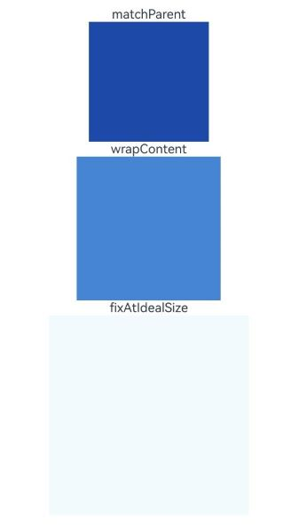

# Sizing

<!--Kit: ArkUI-->
<!--Subsystem: ArkUI-->
<!--Owner: @camlostshi-->
<!--Designer: @fenglinbailu-->
<!--Tester: @liuli0427-->
<!--Adviser: @Brilliantry_Rui-->
<!-- md-trans-meta sourceCommit=75a7d62c0702c21a06ca0119552a942305a023cc translatedAt=2026-08-24T07:02:00.016Z pushedAt=2026-08-25T07:34:56.195Z -->

Sets the width, height, and margins of a component. By setting component size-related attributes, you can implement flexible page layouts and responsive design. Common scenarios include fixing the component size, allocating layout space proportionally, setting the inner and outer margins of a component, and implementing safe area adaptation.

>  **NOTE**
>
> - The initial APIs of this module are supported since API version 7. Updates will be marked with a superscript to indicate their earliest API version.
>
> - If the size of a component is set in percentage, the percentage size of the component is calculated based on the size of the nearest ancestor that has a fixed size.
>
> - Since API version 10, some attributes of size settings support the **calc** calculation feature. For details about the supported attributes, see the description of the corresponding attribute. The **calc** calculation feature is a function that dynamically calculates length values and is often used to flexibly set layout sizes (such as width, height, and margins). It allows mathematical expressions to combine different units and values, and supports calculation expressions composed of addition, subtraction, multiplication, division, and parentheses operators to implement dynamic responsive design. Note that when using **calc**, spaces are required between operators and values. For specific usage scenarios, see [Example 1](#example-1-setting-the-component-width-height-margin-and-padding).

## width

width(value: Length): T

Sets the width of the component itself. By default, the width required for the content of the child component is used. If the width of a child component is greater than that of its parent component, the child component overflows and is displayed outside the parent component.

Since API version 10, this API supports the calc calculation feature.

**Widget capability**: This API can be used in ArkTS widgets since API version 9.

**Atomic service API**: This API can be used in atomic services since API version 11.

**System capability**: SystemCapability.ArkUI.ArkUI.Full

**Parameters**

| Name  | Type                          | Mandatory  | Description                 |
| ----- | ---------------------------- | ---- | ------------------- |
| value | [Length](ts-types.md#length) | Yes | Width of the component to set.<br>Unit: vp<br>When a percentage is set, the width of the parent container is used as the base value.<br>Exception values: when the parameter is **undefined**, the attribute setting does not take effect; for other exception values, the width attribute is restored to the default behavior when it is not configured. |

**Return value**

| Type| Description|
| --- | --- |
|  T | Current component object, used for chained calls. |

>  **NOTE**
>
>  - In the [TextInput](./ts-basic-components-textinput.md) component, setting width to **auto** means adapting to the text width.
>
>  - In the [AlphabetIndexer](./ts-container-alphabet-indexer.md) component, setting **width** to **auto** means adapting to the width of the largest index item.
>
>  - In the [Row](./ts-container-row.md), [Column](./ts-container-column.md), and [RelativeContainer](./ts-container-relativecontainer.md) components, setting width to auto means adapting to the child components.

## height

height(value: Length): T

Sets the height of the component itself. By default, the height required for the content of the child component is used. If the height of a child component is greater than that of its parent component, the child component overflows and is displayed outside the parent component.

Since API version 10, this API supports the calc calculation feature.

**Widget capability**: This API can be used in ArkTS widgets since API version 9.

**Atomic service API**: This API can be used in atomic services since API version 11.

**System capability**: SystemCapability.ArkUI.ArkUI.Full

**Parameters**

| Name  | Type                          | Mandatory  | Description                 |
| ----- | ---------------------------- | ---- | ------------------- |
| value | [Length](ts-types.md#length) | Yes | Component height to set.<br>Unit: vp<br>When a percentage is set, the height of the parent container is used as the base value.<br>Abnormal values: If the parameter is **undefined**, the attribute setting does not take effect; for other abnormal values, the height attribute is restored to the default behavior when it is not configured. |

**Return value**

| Type| Description|
| --- | --- |
|  T | Current component object, used for chained calls. |

>  **NOTE**
>
>  In the [Row](./ts-container-row.md), [Column](./ts-container-column.md), and [RelativeContainer](./ts-container-relativecontainer.md) components, setting **width** and **height** to **auto** means that the size adapts to the size of their child components.

## width<sup>15+</sup>

width(widthValue: Length | LayoutPolicy): T

Sets the width of the component itself or its horizontal layout policy. By default, the width required for the content of the child component is used. If the width of a child component is greater than that of its parent component, the child component overflows and is displayed outside the parent component.

Since API version 15, when the parameter is of the **Length** type, this API supports the **calc** calculation feature.

**Widget capability**: This API can be used in ArkTS widgets since API version 15.

**Atomic service API**: This API can be used in atomic services since API version 15.

**Model restriction**: This API can be used only in the stage model.

**System capability**: SystemCapability.ArkUI.ArkUI.Full

**Parameters**

| Name  | Type                          | Mandatory  | Description                 |
| ----- | ---------------------------- | ---- | ------------------- |
| widthValue | [Length](ts-types.md#length)&nbsp;\|&nbsp;[LayoutPolicy](#layoutpolicy15) | Yes    | Width or horizontal layout policy of the component to set.<br>Unit: vp<br>When a percentage is set, the width of the parent container is used as the base value. |

**Return value**

| Type| Description|
| --- | --- |
|  T | Current component object, used for chained calls. |

## height<sup>15+</sup>

height(heightValue: Length | LayoutPolicy): T

Sets the height of the component itself or its vertical layout policy. By default, the height required for the content of the child component is used. If the height of a child component is greater than that of its parent component, the child component overflows and is displayed outside the parent component.

Since API version 15, when the parameter is of the Length type, this API supports the calc calculation feature.

**Widget capability**: This API can be used in ArkTS widgets since API version 15.

**Atomic service API**: This API can be used in atomic services since API version 15.

**Model restriction**: This API can be used only in the stage model.

**System capability**: SystemCapability.ArkUI.ArkUI.Full

**Parameters**

| Name  | Type                          | Mandatory  | Description                 |
| ----- | ---------------------------- | ---- | ------------------- |
| heightValue | [Length](ts-types.md#length)&nbsp;\|&nbsp;[LayoutPolicy](#layoutpolicy15) | Yes    | Component height or vertical layout policy to set.<br>Unit: vp<br>When a percentage is set, the height of the parent container is used as the base value. |

**Return value**

| Type| Description|
| --- | --- |
|  T | Current component object, used for chained calls. |

## size

size(value: SizeOptions): T

Sets the width and height of the component itself. After the setting, the layout and display size of the component in the parent container are affected.

Since API version 10, this API supports the calc calculation feature.

**Widget capability**: This API can be used in ArkTS widgets since API version 9.

**Atomic service API**: This API can be used in atomic services since API version 11.

**System capability**: SystemCapability.ArkUI.ArkUI.Full

**Parameters**

| Name  | Type                             | Mandatory  | Description               |
| ----- | ------------------------------- | ---- | ----------------- |
| value | [SizeOptions](ts-types.md#sizeoptions) | Yes    | Width and height.<br>Abnormal value: If the parameter is **undefined**, the attribute setting does not take effect. For other abnormal values, the **size** attribute is restored to the default behavior when it is not configured.<br>Unit: vp |

**Return value**

| Type| Description|
| --- | --- |
|  T | Current component object, used for chained calls. |

## padding

padding(value: Padding | Length | LocalizedPadding): T

Sets the padding attribute of the component. After the setting, extra space is created between the component content and the border, affecting the layout area of the component's internal content.

Since API version 10, this API supports the calc calculation feature.

**Widget capability**: This API can be used in ArkTS widgets since API version 9.

**Atomic service API**: This API can be used in atomic services since API version 11.

**System capability**: SystemCapability.ArkUI.ArkUI.Full

**Parameters**

| Name  | Type                                      | Mandatory  | Description                                      |
| ----- | ---------------------------------------- | ---- | ---------------------------------------- |
| value | [Padding](ts-types.md#padding)&nbsp;\|&nbsp;[Length](ts-types.md#length)&nbsp;\|&nbsp;[LocalizedPadding](ts-types.md#localizedpadding12)<sup>12+</sup>| Yes    | Padding of the component.<br>When the parameter is of the Length type, the padding takes effect on all four sides simultaneously.<br>Default value: **0** <br>Unit: vp<br>When padding is set to a percentage, the padding on all four sides uses the **width** of the parent container as the base value. |

**Return value**

| Type| Description|
| --- | --- |
|  T | Current component object, used for chained calls. |

## margin

margin(value: Margin | Length | LocalizedMargin): T

Sets the margin of the component. The margin is considered as a part of the component's size during position calculation, thereby affecting the component's placement.

Since API version 10, this API supports the calc calculation feature.

**Widget capability**: This API can be used in ArkTS widgets since API version 9.

**Atomic service API**: This API can be used in atomic services since API version 11.

**System capability**: SystemCapability.ArkUI.ArkUI.Full

**Parameters**

| Name| Type                                                        | Mandatory    | Description                                                        |
| ------ | ------------------------------------------------------------ | -------- | ------------------------------------------------------------ |
| value  | [Margin](ts-types.md#margin)&nbsp;\|&nbsp;[Length](ts-types.md#length)&nbsp;\|&nbsp;[LocalizedMargin](ts-types.md#localizedmargin12)<sup>12+</sup> | &nbsp;Yes | Margin of the component.<br>When the parameter is of the Length type, the margins in all four directions take effect at the same time.<br>Default value: **0**<br>Unit: vp<br>When **margin** is set as a percentage, the top, bottom, left, and right margins all use the width of the parent container as the base value. When laying out in the cross-axis direction of [Row](./ts-container-row.md), [Column](./ts-container-column.md), and [Flex](./ts-container-flex.md), the space occupied by a child component in the cross-axis direction includes the size of the child component itself and the **margin** value.<br>For example, if a **Column** container has a width of 100, a child component has a width of 50, and the left and right margins are 10 and 20 respectively, the sum of the child component width and the left and right margins is 50 + 10 + 20 = 80, which is less than the container width of 100. The child component is center-aligned in the cross-axis direction, leaving (100 - 80)/2 = 10 of blank space on each of the left and right sides in the horizontal direction. |

**Return value**

| Type| Description|
| --- | --- |
|  T | Current component object, used for chained calls. |

## safeAreaPadding<sup>14+</sup>

safeAreaPadding(paddingValue: Padding | LengthMetrics | LocalizedPadding): T

Sets the safe area padding attribute. It allows a container to add a component-level safe area to itself for child components to extend into, and supports the [attributeModifier](ts-universal-attributes-attribute-modifier.md#attributemodifier) method for dynamically setting attributes. Unlike padding, **safeAreaPadding** is used to set a component-level safe area for child components to extend into, while **padding** is used to set the inner padding of the component content area. The two can be set at the same time and take effect separately.

>**NOTE**
>
> This API can be called within [attributeModifier](ts-universal-attributes-attribute-modifier.md#attributemodifier) since API version 18.

**Widget capability**: This API can be used in ArkTS widgets since API version 14.

**Atomic service API**: This API can be used in atomic services since API version 14.

**Model restriction**: This API can be used only in the stage model.

**System capability**: SystemCapability.ArkUI.ArkUI.Full

**Parameters**

| Name  | Type                                      | Mandatory  | Description                                      |
| ----- | ---------------------------------------- | ---- | ---------------------------------------- |
| paddingValue | [Padding](ts-types.md#padding)&nbsp;\|&nbsp;[LengthMetrics](../js-apis-arkui-graphics.md#lengthmetrics12)&nbsp;\|&nbsp;[LocalizedPadding](ts-types.md#localizedpadding12)| Yes    | Safe area padding of the component, which is used to create a component-level safe area inside the component for child components to extend into.<br>Default value: **0** <br>Unit: vp<br>When **paddingValue** is set to a percentage, the top, bottom, left, and right padding all use the width of the parent container as the base value. |

**Return value**

| Type| Description|
| --- | --- |
|  T | Current component object, used for chained calls. |

> **NOTE**
> 
> When parent and ancestor containers define component-level safe areas, child components can detect and utilize these areas, referred to as Accumulated Safe Area Expansion (SAE), which represents the maximum extendable length in each direction. When ancestor containers have contiguous **safeAreaPadding** (undivided by margin, border, or padding), SAE accumulates recursively outward until no adjacent outer **safeAreaPadding** exists or the recursion extends beyond the page container. System-level avoid areas (status bar, navigation bar, notch areas, and more) are treated as the page container's inherent **safeAreaPadding** and participate in SAE calculations. For details about the avoid areas, see [Safe Area](./ts-universal-attributes-expand-safe-area.md).
>
>These component-level safe areas can be leveraged by combining with other attributes. For example, setting the [ignoreLayoutSafeArea](./ts-universal-attributes-expand-safe-area.md#ignorelayoutsafearea20) attribute on a child component allows it to extend its layout into the SAE region.

## layoutWeight

layoutWeight(value: number | string): T

Sets the layout weight of a component so that the component is allocated a size in the main-axis direction of the parent container ([Row](./ts-container-row.md)/[Column](./ts-container-column.md)/[Flex](./ts-container-flex.md)) according to the weight. It applies to scenarios where the parent container size is determined and multiple child components need to allocate the remaining space proportionally.

**Widget capability**: This API can be used in ArkTS widgets since API version 9.

**Atomic service API**: This API can be used in atomic services since API version 11.

**System capability**: SystemCapability.ArkUI.ArkUI.Full

**Parameters**

| Name  | Type                        | Mandatory     | Description                                      |
| ----- | -------------------------- | ------- | ---------------------------------------- |
| value | number&nbsp;\|&nbsp;string | Yes | When the size of the parent container is determined, child components that do not have the **layoutWeight** attribute set or whose effective **layoutWeight** value is **0** take priority in occupying space. The space left on the main axis after these child components occupy space is called the remaining space on the main axis. Child components that have the **layoutWeight** attribute set and whose effective **layoutWeight** value is greater than 0 are allocated sizes from the remaining space on the main axis according to their respective weight proportions. During allocation, the **width**/**height** settings of the child components are ignored, but the **minWidth**/**minHeight** constraints are retained.<br>Default value: 0<br>Value range: [0, +∞)<br>When the value is out of range: if a value less than 0 is passed in, it is processed as 0.<br>**NOTE**<br>This attribute takes effect only in the [Row](./ts-container-row.md)/[Column](./ts-container-column.md)/[Flex](./ts-container-flex.md) layout.<br>The optional value is a number greater than or equal to 0, or a string that can be converted to a number (integer and decimal formats are supported).<br>If a child component in the container has the **layoutWeight** attribute set and the set value is greater than 0, all child components are no longer laid out based on [flexShrink](./ts-universal-attributes-flex-layout.md#flexshrink) and [flexGrow](./ts-universal-attributes-flex-layout.md#flexgrow). |

**Return value**

| Type| Description|
| --- | --- |
|  T | Current component object, used for chained calls. |

## constraintSize

constraintSize(value: ConstraintSizeOptions): T

Sets the constraint size, which limits the size range during component layout. After the setting, the width and height of the component are limited to the specified minimum and maximum values. The priority of **constraintSize** is higher than that of the **width** and **height** attributes.

Since API version 10, this API supports the calc calculation feature.

**Widget capability**: This API can be used in ArkTS widgets since API version 9.

**Atomic service API**: This API can be used in atomic services since API version 11.

**System capability**: SystemCapability.ArkUI.ArkUI.Full

**Parameters**

| Name  | Type                                      | Mandatory  | Description                                      |
| ----- | ---------------------------------------- | ---- | ---------------------------------------- |
| value | [ConstraintSizeOptions](ts-types.md#constraintsizeoptions) | Yes | Constraint size. The priority of **constraintSize** is higher than that of [width](#width) and [height](#height). For the value result, refer to the impact of the **constraintSize** value on width and height.<br>Default value:<br>**{<br>minWidth:&nbsp;0,<br>maxWidth:&nbsp;Infinity,<br>minHeight:&nbsp;0,<br>maxHeight:&nbsp;Infinity<br>}**<br>Abnormal value: For a string starting with a number, only the numeric part is parsed; for a string not starting with a number, it is parsed as 0. For other abnormal values, the **constraintSize** attribute is restored to the default behavior when it is not configured.<br>Unit: vp|

**Return value**

| Type| Description|
| --- | --- |
|  T | Current component, used for chained calls. |

**Impact of constraintSize(minWidth/maxWidth/minHeight/maxHeight) on width/height**

| Default Value                                     | Result                                      |
| ---------------------------------------- | ---------------------------------------- |
| All default | width = MAX(minWidth,MIN(maxWidth,width))<br>height = MAX(minHeight,MIN(maxHeight,height)) |
| maxWidth, maxHeight | width = MAX(minWidth,width)<br>height = MAX(minHeight,height) |
| minWidth, minHeight | width = MIN(maxWidth,width)<br>height = MIN(maxHeight,height) |
| width, height | If **minWidth** < **maxWidth**, the component's own layout logic takes effect, and the value range of **width** is [minWidth,maxWidth]; otherwise, **width**= MAX(minWidth,maxWidth).<br>If **minHeight** < **maxHeight**, the component's own layout logic takes effect, and the value range of **height** is [minHeight,maxHeight]; otherwise, **height** = MAX(minHeight,maxHeight). |
| width and maxWidth, height and maxHeight | width = minWidth<br>height = minHeight |
| width and minWidth, height and minHeight | The component's own layout logic takes effect, and the value of **width** is constrained to be no greater than **maxWidth**.<br>The component's own layout logic takes effect, and the value of **height** is constrained to be no greater than **maxHeight**. |
| minWidth and maxWidth, minHeight and maxHeight | **width** is based on the set value and may be stretched or compressed according to other layout attributes.<br>**height** is based on the set value and may be stretched or compressed according to other layout attributes.|
| width, minWidth, and maxWidth| The layout restrictions passed by the parent container are used for layout.|
| height, minHeight, and maxHeight| The layout restrictions passed by the parent container are used for layout.|

## LayoutPolicy<sup>15+</sup>

Layout policy for the width and height of a component. It provides three layout policy options: **matchParent**, **wrapContent**, and **fixAtIdealSize**, which are respectively used for scenarios where the component adapts to the parent component layout, adapts to the content but does not exceed the parent component size, and adapts to the content and may exceed the parent component size.

**Model restriction**: This API can be used only in the stage model.

**System capability**: SystemCapability.ArkUI.ArkUI.Full

| Name     | Type  | Read-Only| Optional| Description|
| --------- | ------ | ---- | ---- |---------- |
| matchParent | [LayoutPolicy](#layoutpolicy15) | Yes | No | When the current component adapts to the parent component layout, its size is equal to the content area of the parent component, excluding **padding**, **border**, and **safeAreaPadding**. This applies to scenarios where the component needs to fill the content area of the parent container, such as list items and card containers.<br>**Widget capability:** This API can be used in ArkTS widgets since API version 15. <br>**Atomic service API:** This API can be used in atomic services since API version 15.|
| wrapContent<sup>20+</sup> | [LayoutPolicy](#layoutpolicy15) | Yes | No | When the current component adapts to its child components (content), its size is equal to that of the child components (content), and its size is constrained by the content area size of the parent component. This applies to scenarios where the size needs to be automatically adjusted based on the content but cannot exceed the parent container, such as text containers and dialog box content areas.<br>**Widget capability:** This API can be used in ArkTS widgets since API version 20. <br>**Atomic service API:** This API can be used in atomic services since API version 20.|
| fixAtIdealSize<sup>20+</sup> | [LayoutPolicy](#layoutpolicy15) | Yes | No | When the current component adapts to its child components (content), its size is equal to that of the child components (content), and its size is not constrained by the content area size of the parent component. This applies to scenarios where the size needs to be automatically adjusted based on the content and can exceed the parent container, such as floating prompts and drop-down menus.<br>**Widget capability:** This API can be used in ArkTS widgets since API version 20. <br>**Atomic service API:** This API can be used in atomic services since API version 20.|

>  **NOTE**
>
> - **LayoutPolicy** supports three layout policies: **matchParent** (adapting to the parent component layout), **wrapContent** (adapting to the content but not exceeding the parent component size), and **fixAtIdealSize** (adapting to the content and possibly exceeding the parent component size). For specific sample code, see [Setting the Layout Policy](#example-5-setting-the-layout-policy).
>
> - In the **wrapContent** and **fixAtIdealSize** scenarios, when the component size cannot be determined by the content, if the component size has a default value, the size is measured based on the default value and the component is finally displayed at the default size; if there is no default value, the size is measured based on the width and height (0,0), and the component is finally displayed at zero size.
> 
> - When a container is set to **wrapContent** and a child component is set to **matchParent** (including when **matchParent** is set on only one side), the container is first expanded by child components with determined sizes, and then the child component set to **matchParent** matches the container size. If there is no child component with a determined size, both the container and the child component have a size of 0.
>
> - The **LayoutPolicy** setting is constrained by **constraintSize**. That is, when **LayoutPolicy** and **constraintSize** are set at the same time, the constraint of **constraintSize** takes effect first.
> 
> - Since API version 15, only the width and height attributes of the **Row** and **Column** components support the **LayoutPolicy** type parameter. For other components, setting the **LayoutPolicy** type parameter has the same effect as not setting the width or height. Since API version 20, all basic components support the **LayoutPolicy** type parameter.
>
> - When the main-axis size of the **Row**, **Column**, or **Flex** component adapts to child components, and child component A sets **matchParent** only on the cross axis, before API version 26.0.0, child component A does not participate in the main-axis size measurement of the **Row**, **Column**, or **Flex** component, and the main-axis direction of the **Row**, **Column**, or **Flex** component does not adapt to the size of child component A. Since API version 26.0.0, child component A participates in the main-axis size measurement of the **Row**, **Column**, or **Flex** component, and the main-axis direction of the **Row**, **Column**, or **Flex** component adapts to the size of child component A. The same applies to the cross-axis direction. For the specific change effect, see [Example 6: Setting matchParent on a Single Direction of a Child Component](#example-6-setting-matchparent-on-a-single-direction-of-a-child-component).

## Examples

### Example 1: Setting the Component Width, Height, Margin, and Padding

This example demonstrates how to set the width, height, padding, and margin of a component.

```ts
// xxx.ets
@Entry
@Component
struct SizeExample {
  build() {
    Column({ space: 10 }) {
      Text('margin and padding:').fontSize(12).fontColor(0xCCCCCC).width('90%')
      Row() {
        // Width: 80; height: 80; margin: 20 (blue area); top, bottom, left, and right paddings: 5, 15, 10, and 20 (white area)
        Row() {
          Row()
            .size({ width: '100%', height: '100%' })
            .backgroundColor(Color.Yellow)
        }
        .width(80)
        .height(80)
        .padding({
          top: 5,
          left: 10,
          bottom: 15,
          right: 20
        })
        .margin(20)
        .backgroundColor(Color.White)
      }.backgroundColor(Color.Blue)

      Text('constraintSize')
        .fontSize(12)
        .fontColor(0xCCCCCC)
        .width('90%')
      Text('this is a Text.this is a Text.this is a Text.this is a Text.this is a Text.this is a Text.this is a Text.this is a Text.this is a Text.this is a Text.this is a Text.this is a Text.this is a Text.this is a Text.this is a Text')
        .width('90%')
        .constraintSize({ maxWidth: 200 })

      Text('layoutWeight')
        .fontSize(12)
        .fontColor(0xCCCCCC)
        .width('90%')
      // When the parent container size is determined, the child component with layoutWeight set is allocated its size on the main axis based on the weight, ignoring its own size setting.
      Row() {
        // Weight 1: The component occupies 1/3 of the remaining space along the main axis.
        Text('layoutWeight(1)')
          .size({ width: '30%', height: 110 }).backgroundColor(0xFFEFD5).textAlign(TextAlign.Center)
          .layoutWeight(1)
        // Weight 2: The component occupies 2/3 of the remaining space along the main axis.
        Text('layoutWeight(2)')
          .size({ width: '30%', height: 110 }).backgroundColor(0xF5DEB3).textAlign(TextAlign.Center)
          .layoutWeight(2)
        // If layoutWeight is not set, the component is rendered based on its own size setting.
        Text('no layoutWeight')
          .size({ width: '30%', height: 110 }).backgroundColor(0xD2B48C).textAlign(TextAlign.Center)
      }
      .size({ width: '90%', height: 140 })
      .backgroundColor(0xAFEEEE)

      // calc calculation feature
      Text('calc:')
        .fontSize(12)
        .fontColor(0xCCCCCC)
        .width('90%')
      Column() {
        Row() {
          Text('width 50%')
            .fontSize(14)
            .borderWidth(1)
            .textAlign(TextAlign.Center)
            .size({ width: '50%', height: 50 })
          Text('width 50vp')
            .fontSize(14)
            .borderWidth(1)
            .textAlign(TextAlign.Center)
            .size({ width: '50vp', height: 50 })
        }
        .width('100%')
        .justifyContent(FlexAlign.Center)

        Text('width:calc(50% + 50vp), height:calc(50%)')
          .fontSize(14)
          .borderWidth(1)
          .fontWeight(FontWeight.Bold)
          .backgroundColor(0xFFFAF0)
          .textAlign(TextAlign.Center)
          .size({ width: 'calc(50% + 50vp)', height: 'calc(50%)' })
          // If width or height is set to a percentage, the width or height of the parent container are used as the base values. The calculation result of calc for the width equals the sum of the widths of the two text components above.
      }.width('100%').height(100)
    }
    .width('100%')
    .margin({ top: 5 })
  }
}
```


### Example 2: Using LocalizedPadding and LocalizedMargin Types

This example demonstrates how to use **LocalizedPadding** and **LocalizedMargin** types to define the **padding** and **margin** attributes.

```ts
// xxx.ets
import { LengthMetrics } from '@kit.ArkUI'

@Entry
@Component
struct SizeExample {
  build() {
    Column({ space: 10 }) {
      Text('margin and padding:')
        .fontSize(12)
        .fontColor(0xCCCCCC)
        .width('90%')
      Row() {
        // Set the width to 80, height to 80, top, bottom, start, and end paddings to 40, 20, 30, and 10, respectively (blue area), and top, bottom, start, and end margins to 5, 15, 10, and 20, respectively (white area).
        Row() {
          Row()
            .size({ width: '100%', height: '100%' })
            .backgroundColor(Color.Yellow)
        }
        .width(80)
        .height(80)
        .padding({
          top: LengthMetrics.vp(5),
          bottom: LengthMetrics.vp(15),
          start: LengthMetrics.vp(10),
          end: LengthMetrics.vp(20)
        })
        .margin({
          top: LengthMetrics.vp(40),
          bottom: LengthMetrics.vp(20),
          start: LengthMetrics.vp(30),
          end: LengthMetrics.vp(10)
        })
        .backgroundColor(Color.White)
      }
      .backgroundColor(Color.Blue)
    }
    .width('100%')
    .margin({ top: 5 })
  }
}
```

The following shows how the example is represented with left-to-right scripts.


The following shows how the example is represented with right-to-left scripts.


### Example 3: Setting a Component-Level Safe Area

This example demonstrates how to set a component-level safe area for a container.

```ts
// xxx.ets
import { LengthMetrics } from '@kit.ArkUI';

@Entry
@Component
struct SafeAreaPaddingExample {
  build() {
    Column() {
      Column() {
        Column()
          .width('100%')
          .height('100%')
          .backgroundColor(Color.Pink)
      }
      .width(200)
      .height(200)
      .backgroundColor(Color.Yellow)
      .borderWidth(10)
      .padding(10)
      .safeAreaPadding(LengthMetrics.vp(40))
    }
    .height('100%')
    .width('100%')
  }
}
```


### Example 4: Using attributeModifier to Dynamically Set a Safe Area

This example demonstrates how to use **attributeModifier** to dynamically set a component-level safe area for a container.

```ts
// xxx.ets
class MyModifier implements AttributeModifier<CommonAttribute> {
  applyNormalAttribute(instance: CommonAttribute): void {
    instance.safeAreaPadding({
      left: 10,
      top: 20,
      right: 30,
      bottom: 40
    })
  }
}

@Entry
@Component
struct SafeAreaPaddingExample {
  @State modifier: MyModifier = new MyModifier()

  build() {
    Column() {
      Column() {
        Column()
          .width('100%')
          .height('100%')
          .backgroundColor(Color.Pink)
      }
      .width(200)
      .height(200)
      .backgroundColor(Color.Yellow)
      .borderWidth(10)
      .padding(10)
      .attributeModifier(this.modifier)
    }
    .height('100%')
    .width('100%')
  }
}
```


### Example 5: Setting the Layout Policy

This example demonstrates how to set the layout policy for a container's size.

```ts
// xxx.ets
@Entry
@Component
struct LayoutPolicyExample {
  build() {
    Column() {
      Column() {
        // When matchParent is effective, the current component's size is equal to its parent component's content area size (180x180 vp) and is subject to its own constraintSize (150x150 vp), so the current component's size is 150x150 vp.
        Text('matchParent')
        Flex()
          .backgroundColor('rgb(0, 74, 175)')
          .width(LayoutPolicy.matchParent)
          .height(LayoutPolicy.matchParent)
          .constraintSize({ maxWidth: 150, maxHeight: 150 })

        // When wrapContent is effective, the current component's size is equal to its child component size (300x300 vp), but it cannot exceed the parent component's content size (180x180 vp) and is subject to its own constraintSize (250x250 vp), so the current component's size is 180x180 vp.
        Text('wrapContent')
        Row() {
          Flex()
            .width(300)
            .height(300)
        }
        .backgroundColor('rgb(39, 135, 217)')
        .width(LayoutPolicy.wrapContent)
        .height(LayoutPolicy.wrapContent)
        .constraintSize({ maxWidth: 250, maxHeight: 250 })

        // Since API version 20, layoutPolicy supports wrapContent and fixAtIdealSize. When fixAtIdealSize is effective, the current component's size is equal to its child component size (300x300 vp), it can exceed the parent component's content size (180x180 vp) but is subject to its own constraintSize (250x250 vp), so the current component's size is 250x250 vp.
        Text('fixAtIdealSize')

        Row() {
          Flex()
            .width(300)
            .height(300)
        }
        .backgroundColor('rgb(240, 250, 255)')
        .width(LayoutPolicy.fixAtIdealSize)
        .height(LayoutPolicy.fixAtIdealSize)
        .constraintSize({ maxWidth: 250, maxHeight: 250 })
      }
      .width(200)
      .height(200)
      .padding(10)
    }
    .width('100%')
    .height('100%')
  }
}
```



### Example 6: Setting matchParent on a Single Direction of a Child Component

This example demonstrates the layout effect when the **Column** component adapts to child components and a child component sets **matchParent** on only a single direction. Since API version 26.0.0, the height of the **Column** component adapts to the first and second child components, and the width adapts to the first and third child components.

```ts
@Entry
@Component
struct Demo {
  build() {
    Column() {
      // Before API version 26.0.0, the parent component height is calculated as padding + component 1 height = 30px × 2 + 200px = 260px, and the width is calculated as padding + component 1 width = 30px × 2 + 200px = 260px
      // Since API version 26.0.0, the parent component height is calculated as padding + space + component 1 height + component 2 height = 30px × 2 + 30px + 200px + 200px = 490px, and the width is calculated as padding + max(component 1 width, component 3 width) = 30px × 2 + max(200px, 400px) = 460px
      Column({space: "30px"}) {
        Column()
          .width("200px")
          .height("200px")
          .backgroundColor('rgb(0, 74, 175)')

        Column()
          .width(LayoutPolicy.matchParent) // The child component width is consistent with the parent component content area width.
          .height("200px")
          .backgroundColor('rgb(0, 74, 175)')

        Column()
          .width("400px")
          .height(LayoutPolicy.matchParent) // The child component height is consistent with the parent component content area height.
          .backgroundColor('rgb(0, 74, 175)')
      }
      .width(LayoutPolicy.wrapContent)
      .height(LayoutPolicy.wrapContent)
      .backgroundColor('rgb(39, 135, 217)')
      .padding("30px")
    }.width("100%")
  }
}
```

|Before API version 26.0.0|Since API version 26.0.0|
|--|--|
|||