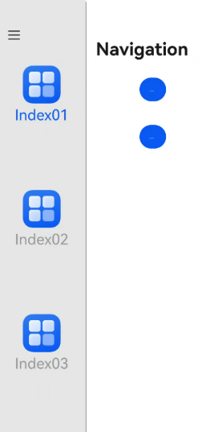

# Toolbar Configuration
<!--Kit: ArkUI-->
<!--Subsystem: ArkUI-->
<!--Owner: @pengzhiwen3-->
<!--Designer: @dutie123-->
<!--Tester: @songyanhong-->
<!--Adviser: @Brilliantry_Rui-->
<!-- md-trans-meta sourceCommit=c43314d48e5bb6db0c940e002f5fb3a101c7f656 translatedAt=2026-09-02T12:11:12.991Z -->

Sets the toolbar for a component. The toolbar is a universal attribute of components. It can create a custom toolbar composed of ToolBarItem in the corresponding column of the title bar at the top of the window. It is applicable to scenarios where custom operation items (such as buttons, sliders, and search bars) need to be added to the title bar area.

>  **NOTE**
>
> - The initial APIs of this module are supported since API version 20. Newly added APIs will be marked with a superscript to indicate their earliest API version.
>
> - The APIs of this module can be used only in the stage model.
>
> - This toolbar is a universal attribute of components. Note that it is different from the toolbar attribute of the [Navigation](ts-basic-components-navigation.md) component.

## toolbar

toolbar(value: CustomBuilder): T

Creates a toolbar composed of [ToolBarItem](ts-basic-components-toolbaritem.md) in the corresponding column of the title bar at the top of the window for the component bound with this attribute. The column position is determined by the column where the component bound with this attribute is located. The [CustomBuilder](ts-types.md#custombuilder8) must be composed of [ToolBarItem](ts-basic-components-toolbaritem.md) for the toolbar to take effect. It is applicable to applications that need to integrate quick operation entries (such as favorite, share, and edit buttons) in the title bar area in column navigation scenarios.

> **NOTE**
>
> This API cannot be called within [attributeModifier](ts-universal-attributes-attribute-modifier.md#attributemodifier).

**System capability**: SystemCapability.ArkUI.ArkUI.Full

**Parameters**

| Name| Type                                       | Mandatory| Description                                           |
| ------ | ------------------------------------------- | ---- | ----------------------------------------------- |
| value  | [CustomBuilder](ts-types.md#custombuilder8) | required   | Configures a custom toolbar of the CustomBuilder type for the current component. The CustomBuilder must consist of [ToolBarItem](ts-basic-components-toolbaritem.md) for the toolbar to take effect. |

**Return value**

| Type| Description|
| -------- | -------- |
| T | Current component.|

> **NOTE**
> 1. The toolbar supports only the fixed title bar, not the floating title bar. (The floating title bar is involved only in three-key navigation mode, in which three virtual navigation keys, namely Back, Home, and Recents, are displayed at the bottom of the device.)
>
> 2. The toolbar supports custom component layout and can be placed in a specific column position (left or right). Note that when the total width of the elements exceeds the available space, layout truncation or focus frame occlusion may occur, making some operation items invisible or causing interaction conflicts. In this case, the elements are not automatically collapsed. You are advised to control the number of elements based on the available column width to prevent the total element width from exceeding the available space.
>
> 3. The toolbar currently supports only single-line layout, not multi-line layout. Therefore, avoid placing multi-line layout elements in a toolbar.
>
> 4. The toolbar can be used only when [NavigationMode](ts-basic-components-navigation.md#navigationmode9) is set to **Split**.
>
> 5. The title bar height adjusts within a limited range based on the [ToolBarItem](ts-basic-components-toolbaritem.md) component in the toolbar:
>    * By default, there is a 4 vp margin between the [ToolBarItem](ts-basic-components-toolbaritem.md) component and the title bar.
>    * When the maximum height of the [ToolBarItem](ts-basic-components-toolbaritem.md) component is less than or equal to 48 vp, the title bar height adjusts to 56 vp. This setting applies to common components such as the title bar, toolbar, and search bar.
>    * When the maximum height of the [ToolBarItem](ts-basic-components-toolbaritem.md) component is between 48 vp and 56 vp, the title bar height adjusts to 64 vp. This setting applies to toolbars that display both icons and text.
>    * When the maximum height of the [ToolBarItem](ts-basic-components-toolbaritem.md) component exceeds 56 vp, the title bar height adjusts to 72 vp. If the maximum height of the [ToolBarItem](ts-basic-components-toolbaritem.md) component exceeds 64 vp, the title bar height remains 72 vp, and the excess area is clipped.

## Example

In this example, the toolbar universal attribute is bound to the [Button](ts-basic-components-button.md) component under [Navigation](ts-basic-components-navigation.md) to add a toolbar item containing two [Button](ts-basic-components-button.md) components at the beginning of the NavBar column of the title bar. The toolbar universal attribute is bound to the [Text](ts-basic-components-text.md) component under [NavDestination](ts-basic-components-navdestination.md) to add a toolbar item containing a slider component and a search bar component at the end of the NavDestination column of the title bar.

```ts
// xxx.ets
@Entry
@Component
struct ToolbarExample {
  normalIcon: Resource = $r('app.media.startIcon')
  selectedIcon: Resource = $r("app.media.startIcon")
  @State arr: number[] = [1, 2, 3]
  @State current: number = 1
  @Provide('navPathStack') navPathStack: NavPathStack = new NavPathStack()

  @Builder
  MyToolbar() {
    ToolBarItem({ placement: ToolBarItemPlacement.TOP_BAR_LEADING }) {
      Button("left").height("30vp")
    }

    ToolBarItem({ placement: ToolBarItemPlacement.TOP_BAR_LEADING }) {
      Button("right").height("30vp")
    }
  }

  @Builder
  MyToolbarNavDest() {
    ToolBarItem({ placement: ToolBarItemPlacement.TOP_BAR_TRAILING }) {
      Slider().width("120vp")
    }

    ToolBarItem({ placement: ToolBarItemPlacement.TOP_BAR_TRAILING }) {
      Search().width("120vp")
    }
  }

  @Builder
  PageNavDest(name: string) {
    NavDestination() {
      Column() {
        Text("add toolbar")
          .fontSize(30)
          .toolbar(this.MyToolbarNavDest())
      }
      .backgroundColor(Color.Gray)
    }
  }

  build() {
    SideBarContainer(SideBarContainerType.Embed) {
      Column() {
        ForEach(this.arr, (item: number) => {
          Column({ space: 5 }) {
            Image(this.current === item ? this.selectedIcon : this.normalIcon).width(64).height(64)
            Text("Index0" + item)
              .fontSize(25)
              .fontColor(this.current === item ? '#0A59F7' : '#999')
              .fontFamily('source-sans-pro,cursive,sans-serif')
          }
          .onClick(() => {
            this.current = item;
          })
        }, (item: number) => item.toString())
      }.width('100%')
      .justifyContent(FlexAlign.SpaceEvenly)
      .backgroundColor('#19000000')

      Navigation(this.navPathStack) {
        Column() {
          Button('pushPath', { stateEffect: true, type: ButtonType.Capsule })
            .width('20%')
            .height(40)
            .margin(20)
            .toolbar(this.MyToolbar())
          Button('showNavDest', { stateEffect: true, type: ButtonType.Capsule })
            .width('20%')
            .height(40)
            .margin(20)
            .onClick(() => {
              this.navPathStack.pushPath({ name: '1' });
            })
        }
        .width('100%')
        .height('100%')
      }
      .navBarPosition(NavBarPosition.Start)
      .navBarWidth("50%")
      .navBarWidthRange(["25%", "70%"])
      .hideBackButton(true)
      .navDestination(this.PageNavDest)
      .height('100%')
      .title('Navigation')
    }
    .sideBarWidth(150)
    .minSideBarWidth(50)
    .maxSideBarWidth(300)
    .minContentWidth(0)
    .onChange((value: boolean) => {
      console.info('status:' + value);
    })
    .divider({
      strokeWidth: '1vp',
      color: Color.Gray,
      startMargin: '4vp',
      endMargin: '4vp'
    })
  }
}
```
