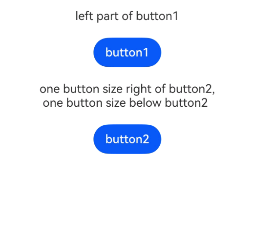
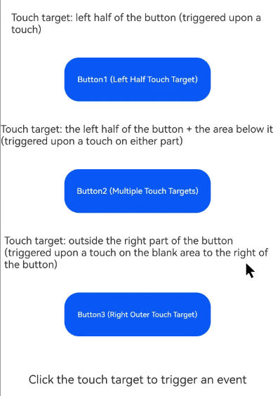

# Touch Target
<!--Kit: ArkUI-->
<!--Subsystem: ArkUI-->
<!--Owner: @yihao-lin-->
<!--Designer: @piggyguy-->
<!--Tester: @songyanhong-->
<!--Adviser: @Brilliantry_Rui-->
<!-- md-trans-meta sourceCommit=9430c77017ca73641537d932a3d7d8a4c99c078b translatedAt=2026-09-02T12:12:07.570Z -->

Sets the touch target of a component. In the ArkUI development framework, when touch events and mouse events are processed, [hit testing](../../../ui/arkts-interaction-basic-principles.md#hit-testing) is performed on the pressed point and the component response region before the event is triggered, to collect the components that need to respond to the event. Based on the test result, the framework distributes the corresponding event. This affects the distribution of [click events](ts-universal-events-click.md), [touch events](ts-universal-events-touch.md), [drag and drop events](ts-universal-events-drag-drop.md), [mouse events](ts-universal-mouse-key.md), [axis events](ts-universal-events-axis.md), [hover events](ts-universal-events-hover.md), [accessibility hover events](ts-universal-accessibility-hover-event.md), and [gesture events](ts-gesture-settings.md).


>  **NOTE**
>
> - The initial APIs of this module are supported since API version 8. Newly added APIs will be marked with a superscript to indicate their earliest API version.
>
> - When setting the touch target attributes, you need to press the finger in the touch target. If the event response conditions are met when the finger is lifted, the event is triggered. In addition, if the conditions are met before the current gesture ends, continuously triggerable events will also be activated.

## responseRegion

responseRegion(value: Array&lt;Rectangle&gt; | Rectangle): T

Sets one or more touch targets. When the [responseRegionList](#responseregionlist22) API is called, this API no longer takes effect. Since API version 26.0.0, when not actively set, the default minimum height of the touch target of the [Button](./ts-basic-components-button.md), [Toggle in Button mode](./ts-basic-components-toggle.md), [Select](./ts-basic-components-select.md), [Chip](./ohos-arkui-advanced-Chip.md), and [ChipGroup](./ohos-arkui-advanced-ChipGroup.md) components changes from 28 vp to 32 vp. This change affects only the touch hit range, not the actual displayed height of the component.

**Widget capability**: This API can be used in ArkTS widgets since API version 9.

**Atomic service API**: This API can be used in atomic services since API version 11.

**System capability**: SystemCapability.ArkUI.ArkUI.Full

**Parameters**

| Name| Type                                                        | Mandatory| Description                                                        |
| ------ | ------------------------------------------------------------ | ---- | ------------------------------------------------------------ |
| value  | Array&lt;[Rectangle](#rectangle )&gt;&nbsp;\|&nbsp;[Rectangle](#rectangle) | Yes   | Touch target, including its position and size.<br>The default touch target is the entire component. Default value:<br>{<br>x: 0,<br>y: 0,<br>width: '100%',<br>height: '100%'<br>}<br> |

**Return value**

| Type| Description|
| -------- | -------- |
| T | Current component, used for chained calls. |

## mouseResponseRegion<sup>10+</sup>

mouseResponseRegion(value: Array&lt;Rectangle&gt; | Rectangle): T

Sets one or more mouse touch targets. When the [responseRegionList](#responseregionlist22) API is called, this API no longer takes effect.

**Atomic service API**: This API can be used in atomic services since API version 11.

**Model restriction**: This API can be used only in the stage model.

**System capability**: SystemCapability.ArkUI.ArkUI.Full

**Parameters**

| Name| Type                                                        | Mandatory| Description                                                        |
| ------ | ------------------------------------------------------------ | ---- | ------------------------------------------------------------ |
| value  | Array&lt;[Rectangle](#rectangle)&gt;&nbsp;\|&nbsp;[Rectangle](#rectangle) | Yes   | Mouse touch target, including the position and size.<br>The default touch target is the entire component. Default value:<br>{<br>x: 0,<br>y: 0,<br>width: '100%',<br>height: '100%'<br>} |

**Return value**

| Type| Description|
| -------- | -------- |
| T | Current component, used for chained calls. |

## responseRegionList<sup>22+</sup>

responseRegionList(regions: Array&lt;ResponseRegion&gt;): T

Sets the touch target list for the component. When this API is called, the [responseRegion](#responseregion) and [mouseResponseRegion](#mouseresponseregion10) APIs do not take effect.

**Atomic service API**: This API can be used in atomic services since API version 22.

**Model restriction**: This API can be used only in the stage model.

**System capability**: SystemCapability.ArkUI.ArkUI.Full

**Parameters**

| Name| Type                                                        | Mandatory| Description                                                        |
| ------ | ------------------------------------------------------------ | ---- | ------------------------------------------------------------ |
| regions  | Array&lt;[ResponseRegion](#responseregion22)&gt;&nbsp; | Yes   | Array of touch targets of the component.<br>Each touch target includes the input tool type, position, and size.<br>Default value:<br>[{<br>tool: ResponseRegionSupportedTool.ALL,<br>x: LengthMetrics.vp(0),<br>y: LengthMetrics.vp(0),<br>width: LengthMetrics.percent(1),<br>height: LengthMetrics.percent(1)<br>}] |

**Return value**

| Type| Description|
| -------- | -------- |
| T | Current component, used for chained calls. |

## Rectangle

**Widget capability**: This API can be used in ArkTS widgets since API version 9.

**Atomic service API**: This API can be used in atomic services since API version 11.

**System capability**: SystemCapability.ArkUI.ArkUI.Full

| Name       | Type                       | Read-Only   |  Optional  |  Description                            |
| ------ | ----------------------------- | -----| -----|-------------------------------- |
| x      | [Length](ts-types.md#length)  | No   | Yes   |X-axis coordinate of the touch point relative to the upper left corner of the component.<br>Default value: 0vp |
| y      | [Length](ts-types.md#length)  | No   | Yes   |Y-axis coordinate of the touch point relative to the upper left corner of the component.<br>Default value: 0vp |
| width  | [Length](ts-types.md#length)  | No   | Yes   |Width of the touch target.<br>Default value: '100%' |
| height | [Length](ts-types.md#length) | No   | Yes   |Height of the touch target.<br>Default value: '100%' |

  >  **NOTE**
  >
  > - x and y can be set to positive or negative percentages. When x is set to '100%', the touch target is offset to the right by the width of the component itself. When x is set to '-100%', the touch target is offset to the left by the width of the component itself. When y is set to '100%', the touch target is offset downward by the height of the component itself. When y is set to '-100%', the touch target is offset upward by the height of the component itself.
  >
  > - When width and height are set to percentages, only positive percentages can be set. width: '100%' means that the width of the touch target is set to the width of the component itself. For example, if the width of the component itself is 100 vp, '100%' means that the width of the touch target is also 100 vp. height: '100%' means that the height of the touch target is set to the height of the component itself. When set to 0 or a negative percentage, the default value '100%' is used.
  >
  > - Percentages are calculated relative to the width and height of the component itself.
  >
  > - When the parent component has [clip](ts-universal-attributes-sharp-clipping.md#clip12) set to true, the response of the child component is affected by the touch target of the parent component. Child components outside the touch target of the parent component cannot respond to gestures and events.
  >
  > - width and height do not support dynamic calculation with calc().

## ResponseRegion<sup>22+</sup>

Defines a touch target consisting of an input tool type, touch position, and size.

  >  **NOTE**
  >
  > - When the parent component has [clip](ts-universal-attributes-sharp-clipping.md#clip12) set to true, the response of the child component is affected by the touch target of the parent component. Child components outside the touch target of the parent component cannot respond to gestures and events.
  >
  > - If the input tool type, touch position, or size is not configured for the touch target, the default value is used for the corresponding item.
  >
  > - When the calculation result of x and y is a positive value, it indicates an offset to the right and downward, respectively. When the calculation result is a negative value, it indicates an offset to the left and upward, respectively.
  >
  > - When width and height use the string type, the string must use lowercase characters; otherwise, it does not take effect. Dynamic calculation with calc() is supported. The input parameter string format of calc() is 'width/height scaling ratio ± width/height increment', where the scaling ratio is a percentage and the increment is in px or vp. If the format does not meet the requirements or other units are used, it does not take effect. For example, in 'calc(80% + 10vp)', 80% is the width/height scaling ratio and 10vp is the width/height increment. When width and height use the LengthMetrics type with the unit percent, the calculation is performed relative to the width and height of the component itself, and percent(1) represents 100%. When the calculation result is a negative value, the default value is used.

**Atomic service API**: This API can be used in atomic services since API version 22.

**Model restriction**: This API can be used only in the stage model.

**System capability**: SystemCapability.ArkUI.ArkUI.Full

| Name       | Type                       | Read-Only   |  Optional  |  Description                            |
| ------ | ----------------------------- | -----| -----|-------------------------------- |
| tool   | [ResponseRegionSupportedTool](./ts-appendix-enums.md#responseregionsupportedtool22)  | No   | Yes   |Input tool type applicable to the touch target.<br>Default value: ResponseRegionSupportedTool.ALL |
| x      | [LengthMetrics](../js-apis-arkui-graphics.md#lengthmetrics12)  | No   | Yes   |X-axis coordinate of the touch point relative to the upper left corner of the component.<br>Default value: LengthMetrics.vp(0) |
| y      | [LengthMetrics](../js-apis-arkui-graphics.md#lengthmetrics12)  | No   | Yes   |Y-axis coordinate of the touch point relative to the upper left corner of the component.<br>Default value: LengthMetrics.vp(0) |
| width  | [LengthMetrics](../js-apis-arkui-graphics.md#lengthmetrics12) \| string | No   | Yes   |Width of the touch target.<br>Default value: LengthMetrics.percent(1) |
| height | [LengthMetrics](../js-apis-arkui-graphics.md#lengthmetrics12) \| string | No   | Yes   |Height of the touch target.<br>Default value: LengthMetrics.percent(1) |

## Examples

### Example 1: Setting a Touch Target via the responseRegion API

This example demonstrates how to set a touch target for a button using **responseRegion** to respond to click events.

```ts
// xxx.ets
@Entry
@Component
struct TouchTargetExample {
  @State text: string = '';

  build() {
    Column({ space: 20 }) {
      Text("{x:0,y:0,width:'50%',height:'100%'}")
      // The width of the touch target is half of that of the button. No response after touching the right part of button1.
      Button('button1')
        .responseRegion({
          x: 0,
          y: 0,
          width: '50%',
          height: '100%'
        })
        .onClick(() => {
          this.text = 'button1 clicked';
        })

      // Add multiple touch targets for a component.
      Text("[{x:'100%',y:0,width:'50%',height:'100%'}," +
        "\n{ x: 0, y: 0, width: '50%', height: '100%' }]")
      Button('button2')
        .responseRegion([
          {
            x: '100%',
            y: 0,
            width: '50%',
            height: '100%'
          }, // The first touch target is located rightward by one button width, with its size equal to half of the button size. The touch event is triggered if the right part of button2 is clicked.
          {
            x: 0,
            y: 0,
            width: '50%',
            height: '100%'
          } // The second touch target is half the width of the button. Click the left half of button2 to trigger the click event.
        ])
        .onClick(() => {
          this.text = 'button2 clicked';
        })
      // The touch target is located downward by one button height, with its size equal to the button size. The touch event is triggered if the area below the button3 is clicked.
      Text("{x:0,y:'100%',width:'100%',height:'100%'}")
      Button('button3')
        .responseRegion({
          x: 0,
          y: '100%',
          width: '100%',
          height: '100%'
        })
        .onClick(() => {
          this.text = 'button3 clicked';
        })

      Text(this.text).margin({ top: 50 })
    }.width('100%').margin({ top: 10 })
  }
}
```


### Example 2: Setting a Touch Target via the responseRegionList API

This example demonstrates how to set a touch target for a button using [responseRegionList](#responseregionlist22) to respond to click events.

The **responseRegionList** API is supported since API version 22.

```ts
// xxx.ets
import { LengthMetrics } from '@kit.ArkUI';

@Entry
@Component
struct TouchTargetExample {
  @State text: string = '';

  build() {
    Column({ space: 20 }) {
      Text('left part of button1')
      // The width of the touch target is half of that of the button. No response after touching the right part of button1.
      Button('button1')
        .responseRegionList([{
          x: LengthMetrics.vp(0),
          y: LengthMetrics.vp(0),
          width: LengthMetrics.percent(0.5),
          height: LengthMetrics.percent(1),
        }])
        .onClick(() => {
          this.text = 'button1 clicked';
        })

      // Set the size of touch target one to the entire button and shift it right by one button width. Click the button-sized area to the right of button2 to trigger the click event.
      // Touch target 2 is located downward by one button height, with its size equal to the entire button size. The touch event is triggered if the area below the button2 is clicked.
      Text('one button size right of button2,' + '\n one button size below button2')
      Button('button2')
        .responseRegionList([{
          x: LengthMetrics.percent(1),
          y: LengthMetrics.vp(0),
          width: LengthMetrics.percent(1),
          height: LengthMetrics.percent(1),
        }, {
          tool: ResponseRegionSupportedTool.MOUSE,
          x: LengthMetrics.vp(0),
          y: LengthMetrics.percent(1),
          width: 'calc(100% + 0vp)',
          height: 'calc(100% - 0px)',
        }])
        .onClick(() => {
          this.text = 'button2 clicked';
        })

      Text(this.text).margin({ top: 50 })
    }.width('100%').margin({ top: 10 })
  }
}
```



### Example 3: Setting the Mouse Touch Target to Respond to Click Events

This example uses [mouseResponseRegion](#mouseresponseregion10) to set the mouse touch target to respond to click events.

```ts
// xxx.ets
@Entry
@Component
struct MouseResponseRegionExample {
  @State clickInfo: string = 'Click the touch target to trigger an event';

  build() {
    Column({ space: 30 }) {
      // Example 1: Single touch target (only the left half of the button)
      Text('Touch target: left half of the button (triggered upon a touch)')
        .fontSize(14)
      Button('Button1 (Left Half Touch Target)')
        .width(200)
        .height(60)
        // Mouse touch target: only the left half of the button (x/y relative to the component itself, width 50%)
        .mouseResponseRegion({
          // X coordinate of the touch target relative to the component (top-left corner as origin)
          x: 0,
          // Y coordinate of the touch target relative to the component
          y: 0,
          // Width of the touch target (50% of the button)
          width: '50%',
          // Height of the touch target (100% of the button)
          height: '100%'
        })
        .onClick(() => {
          this.clickInfo = 'Left half touch target of Button1 clicked';
        })
      // Example 2: Multiple touch targets (both left half of the button and area below the button)
      Text('Touch target: the left half of the button + the area below it (triggered upon a touch on either part)')
        .fontSize(14)
      Button('Button2 (Multiple Touch Targets)')
        .width(200)
        .height(60)
        // Mouse touch target: array, containing two independent touch targets
        .mouseResponseRegion([
          // Touch target 1: left half of the button
          {
            x: 0,
            y: 0,
            width: '50%',
            height: '100%'
          },
          // Touch target 2: area below the button (y=100% indicates the bottom of the button, and the height is 60 vp)
          {
            x: 0,
            y: '100%',
            width: '100%',
            height: 60
          }
        ])
        .onClick(() => {
          this.clickInfo = 'Any touch target of Button2 clicked';
        })
      // Example 3: Touch target outside the button (blank area to the right of the button)
      Text('Touch target: outside the right part of the button (triggered upon a touch on the blank area to the right of the button)')
        .fontSize(14)
      Button('Button3 (Right Outer Touch Target)')
        .width(200)
        .height(60)
        // Mouse touch target: area outside the right side of the button (x=100% indicates the right edge of the button)
        .mouseResponseRegion({
          // X coordinate of the touch target: right edge of the button
          x: '100%',
          y: 0,
          // Touch target width: 80 vp
          width: 80,
          height: '100%'
        })
        .onClick(() => {
          this.clickInfo = 'Right outer touch target of Button3 clicked';
        })
      // Display the click result.
      Text(this.clickInfo)
        .fontSize(16)
        .margin({ top: 20 })
    }
    .width('100%')
    .height('100%')
    // Center the display.
    .justifyContent(FlexAlign.Center)
  }
}
```

