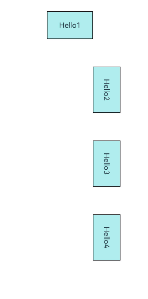
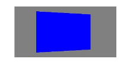
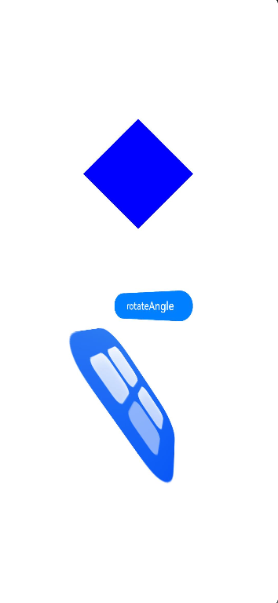

# Transformation
<!--Kit: ArkUI-->
<!--Subsystem: ArkUI-->
<!--Owner: @CCFFWW-->
<!--Designer: @CCFFWW-->
<!--Tester: @lxl007-->
<!--Adviser: @Brilliantry_Rui-->

Transformation attributes allow you to rotate, translate, scale, or transform a component.

> **NOTE**
>
> The initial APIs of this module are supported since API version 7. Updates will be marked with a superscript to indicate their earliest API version.

## rotate

rotate(value: RotateOptions): T

Rotates the component.

**Widget capability**: This API can be used in ArkTS widgets since API version 9.

**Atomic service API**: This API can be used in atomic services since API version 11.

**System capability**: SystemCapability.ArkUI.ArkUI.Full

**Parameters**

| Name| Type                                   | Mandatory| Description                                                        |
| ------ | --------------------------------------- | ---- | ------------------------------------------------------------ |
| value  | [RotateOptions](#rotateoptions) | Yes  | How the component rotates in the coordinate system (as shown below) with the upper left corner of the component as the coordinate origin. (x, y, z) specifies a vector as the axis of rotation.<br>The axis and center of rotation are set based on the coordinate system, which remains where it is when the component is moved.<br>Default value: When **x**, **y**, and **z** are not specified, their default values are **0**, **0**, and **1**, respectively. If any of **x**, **y**, and **z** is specified, the default value for the unspecified one is **0**.<br>{<br>centerX: '50%',<br>centerY: '50%',<br>centerZ: 0,<br>perspective: 0<br>}<br>Unit: vp<br><br>Since API version 10, **CenterZ** and **perspective** are supported in ArkTS widgets.|

**Return value**

| Type  | Description                    |
| ------ | ------------------------ |
| T | Current component.|

## rotate<sup>18+</sup>

rotate(options: Optional\<RotateOptions>): T

Rotates the component. Compared with [rotate](#rotate), this API supports the **undefined** type for the **options** parameter.

**Widget capability**: This API can be used in ArkTS widgets since API version 18.

**Atomic service API**: This API can be used in atomic services since API version 18.

**System capability**: SystemCapability.ArkUI.ArkUI.Full

**Parameters**

| Name | Type                                              | Mandatory| Description                                                        |
| ------- | -------------------------------------------------- | ---- | ------------------------------------------------------------ |
| options | [Optional](ts-universal-attributes-custom-property.md#optionalt12)\<[RotateOptions](#rotateoptions)> | Yes  | How the component rotates in the coordinate system (as shown below) with the upper left corner of the component as the coordinate origin. (x, y, z) specifies a vector as the axis of rotation.<br>The axis and center of rotation are set based on the coordinate system, which remains where it is when the component is moved.<br>Default value: When **x**, **y**, and **z** are not specified, their default values are **0**, **0**, and **1**, respectively. If any of **x**, **y**, and **z** is specified, the default value for the unspecified one is **0**.<br>{<br>centerX: '50%',<br>centerY: '50%',<br>centerZ: 0,<br>perspective: 0<br>}<br>Unit: vp<br><br>Since API version 10, **CenterZ** and **perspective** are supported in ArkTS widgets.<br>If **options** is **undefined**, the component reverts to its original state with no rotation.|

**Return value**

| Type  | Description                    |
| ------ | ------------------------ |
| T | Current component.|

## rotate<sup>20+</sup>

rotate(options: Optional<RotateOptions | RotateAngleOptions>): T

Sets the component rotation effect. Compared with [rotate](#rotate18), this API supports the **RotateAngleOptions** type for the **options** parameter.

**Widget capability**: This API can be used in ArkTS widgets since API version 20.

**Atomic service API**: This API can be used in atomic services since API version 20.

**System capability**: SystemCapability.ArkUI.ArkUI.Full

**Parameters**

| Name | Type                                                        | Mandatory| Description                                                        |
| ------- | ------------------------------------------------------------ | ---- | ------------------------------------------------------------ |
| options | [Optional](ts-universal-attributes-custom-property.md#optionalt12)\<[RotateOptions](#rotateoptions) \| [RotateAngleOptions](#rotateangleoptions20)> | Yes  | **RotateOptions**: How the component rotates in the coordinate system (as shown below) with the upper left corner of the component as the coordinate origin. (x, y, z) specifies a vector as the axis of rotation.<br>The axis and center of rotation are set based on the coordinate system, which remains where it is when the component is moved.<br>Default value: When **x**, **y**, and **z** are not specified, their default values are **0**, **0**, and **1**, respectively. If any of **x**, **y**, and **z** is specified, the default value for the unspecified one is **0**.<br>{<br>centerX: '50%',<br>centerY: '50%',<br>centerZ: 0,<br>perspective: 0<br>}<br>**RotateAngleOptions**: How the component rotates in the coordinate system (as shown below) with the upper left corner of the component as the coordinate origin. angleX, angleY, angleZ specifies the rotation angle on the three axes.<br>Default value:<br>{<br>angleX:0,<br>angleY:0,<br>angleZ:0,<br>centerX: '50%',<br>centerY: '50%',<br>centerZ: 0,<br>perspective: 0<br>}<br><br>If **options** is **undefined**, the component reverts to its original state with no rotation.|

**Return value**

| Type| Description          |
| ---- | -------------- |
| T    | Current component.|

## translate

translate(value: TranslateOptions): T

Translates the component.

**Widget capability**: This API can be used in ArkTS widgets since API version 9.

**Atomic service API**: This API can be used in atomic services since API version 11.

**System capability**: SystemCapability.ArkUI.ArkUI.Full

**Parameters**

| Name| Type                                         | Mandatory| Description                                                        |
| ------ | --------------------------------------------- | ---- | ------------------------------------------------------------ |
| value  | [TranslateOptions](#translateoptions) | Yes  | How the component is translated in the coordinate system (as shown below) with the upper left corner of the component as the coordinate origin. Values of **x**, **y**, and **z** indicate the translation distance along the respective axis. A positive value indicates a forward movement towards the respective axis, and a negative value indicates a backward movement towards the respective axis. The translation distance can be a number or a string (for example, **'10px'** or **'10%'**).<br>Default value:<br>{<br>x: 0,<br>y: 0,<br>z: 0<br>}<br>Unit: vp<br><br>**NOTE**<br>When the component is translated along the z-axis, the position of the observation point remains unchanged. As such, the component appears larger when the value of **z** places it closer to the observation point and smaller when the value of **z** places it further away from the observation point.<br> |

**Return value**

| Type  | Description                    |
| ------ | ------------------------ |
| T | Current component.|

## translate<sup>18+</sup>

translate(translate: Optional\<TranslateOptions>): T

Translates the component. Compared with [translate](#translate), this API supports the **undefined** type for the **translate** parameter.

**Widget capability**: This API can be used in ArkTS widgets since API version 18.

**Atomic service API**: This API can be used in atomic services since API version 18.

**System capability**: SystemCapability.ArkUI.ArkUI.Full

**Parameters**

| Name   | Type                                                    | Mandatory| Description                                                        |
| --------- | -------------------------------------------------------- | ---- | ------------------------------------------------------------ |
| translate | [Optional](ts-universal-attributes-custom-property.md#optionalt12)\<[TranslateOptions](#translateoptions)> | Yes  | How the component is translated in the coordinate system (as shown below) with the upper left corner of the component as the coordinate origin. Values of **x**, **y**, and **z** indicate the translation distance along the respective axis. A positive value indicates a forward movement towards the respective axis, and a negative value indicates a backward movement towards the respective axis. The translation distance can be a number or a string (for example, **'10px'** or **'10%'**).<br>Default value:<br>{<br>x: 0,<br>y: 0,<br>z: 0<br>}<br>Unit: vp<br><br>**NOTE**<br>When the component is translated along the z-axis, the position of the observation point remains unchanged. As such, the component appears larger when the value of **z** places it closer to the observation point and smaller when the value of **z** places it further away from the observation point.<br><br>If **translate** is **undefined**, the component reverts to its original state with no translation.|

**Return value**

| Type  | Description                    |
| ------ | ------------------------ |
| T | Current component.|

## scale

scale(value: ScaleOptions): T

Scales the component.

**Widget capability**: This API can be used in ArkTS widgets since API version 9.

**Atomic service API**: This API can be used in atomic services since API version 11.

**System capability**: SystemCapability.ArkUI.ArkUI.Full

**Parameters**

| Name| Type                                 | Mandatory| Description                                                        |
| ------ | ------------------------------------- | ---- | ------------------------------------------------------------ |
| value  | [ScaleOptions](#scaleoptions) | Yes  | Scale ratio along the x-, y-, and z-axis. The default value is **1**. **centerX** and **centerY** are used to set the scale center point.<br>Default value:<br>{<br>x: 1,<br>y: 1,<br>z: 1,<br>centerX:'50%',<br>centerY:'50%'<br>} |

**Return value**

| Type  | Description                    |
| ------ | ------------------------ |
| T | Current component.|

## scale<sup>18+</sup>

scale(options: Optional\<ScaleOptions>): T

Scales the component. Compared with [scale](#scale), this API supports the **undefined** type for the **options** parameter.

**Widget capability**: This API can be used in ArkTS widgets since API version 18.

**Atomic service API**: This API can be used in atomic services since API version 18.

**System capability**: SystemCapability.ArkUI.ArkUI.Full

**Parameters**

| Name | Type                                            | Mandatory| Description                                                        |
| ------- | ------------------------------------------------ | ---- | ------------------------------------------------------------ |
| options | [Optional](ts-universal-attributes-custom-property.md#optionalt12)\<[ScaleOptions](#scaleoptions)> | Yes  | Scale ratio along the x-, y-, and z-axis. The default value is **1**. **centerX** and **centerY** are used to set the scale center point.<br>Default value:<br>{<br>x: 1,<br>y: 1,<br>z: 1,<br>centerX:'50%',<br>centerY:'50%'<br>}<br>If **options** is **undefined**, the component reverts to its original state with no scaling.|

**Return value**

| Type  | Description                    |
| ------ | ------------------------ |
| T | Current component.|

## transform

transform(value: object): T

Displays the matrix transformation when 2D transformation is performed. If 3D transformation is included, the [transform3D](#transform3d20) API is required.

**Atomic service API**: This API can be used in atomic services since API version 11.

**System capability**: SystemCapability.ArkUI.ArkUI.Full

**Parameters**

| Name| Type  | Mandatory| Description                                                        |
| ------ | ------ | ---- | ------------------------------------------------------------ |
| value  | object | Yes  | Transformation matrix of the component. Only the [Matrix4Transit](../js-apis-matrix4.md) object type is supported.|

**Return value**

| Type  | Description                    |
| ------ | ------------------------ |
| T | Current component.|

## transform<sup>18+</sup>

transform(transform: Optional\<object>): T

Displays the matrix transformation when 2D transformation is performed. If 3D transformation is included, the [transform3D](#transform3d20) API is required. Compared with [transform] (#transform), the transform<sup>18+</sup> parameter supports the undefined type.

**Atomic service API**: This API can be used in atomic services since API version 18.

**System capability**: SystemCapability.ArkUI.ArkUI.Full

**Parameters**

| Name| Type                                   | Mandatory| Description                    |
| ------ | --------------------------------------- | ---- | ------------------------ |
| transform | [Optional](ts-universal-attributes-custom-property.md#optionalt12)\<object> | Yes| Transformation matrix of the component. Only the [Matrix4Transit](../js-apis-matrix4.md) object type is supported.<br>If **transform** is **undefined**, the component reverts to the identity matrix (no transformation).|

**Return value**

| Type  | Description                    |
| ------ | ------------------------ |
| T | Current component.|

## transform3D<sup>20+</sup>

transform3D(transform: Optional\<Matrix4Transit>): T

Sets the 3D transformation matrix of the component. When 3D transformation with the perspective effect is involved, the display effect of the transform interface may be incorrect. In this case, the transform3D interface is recommended.

**Atomic service API**: This API can be used in atomic services since API version 20.

**System capability**: SystemCapability.ArkUI.ArkUI.Full

**Parameters**

| Name   | Type                                              | Mandatory| Description                                                        |
| --------- | -------------------------------------------------- | ---- | ------------------------------------------------------------ |
| transform | [Optional](ts-universal-attributes-custom-property.md#optionalt12)\<[Matrix4Transit](#matrix4transit20)> | Yes  | 3D transformation matrix.<br>If **transform** is **undefined**, the component reverts to the identity matrix (no transformation).|

**Return value**

| Type| Description          |
| ---- | -------------- |
| T    | Current component.|

## Matrix4Transit<sup>20+</sup>

type Matrix4Transit = Matrix4Transit

**Atomic service API**: This API can be used in atomic services since API version 20.

**System capability**: SystemCapability.ArkUI.ArkUI.Full

| Type                             | Description          |
| --------------------------------- | -------------- |
| [Matrix4Transit](../js-apis-matrix4.md#matrix4transit)     | Identity matrix object.|

## RotateOptions

**Atomic service API**: This API can be used in atomic services since API version 11.

**System capability**: SystemCapability.ArkUI.ArkUI.Full

| Name                     | Type                      | Read-Only| Optional| Description                                                        |
| ------------------------- | -------------------------- | ---- | ---- | ------------------------------------------------------------ |
| x                         | number                     | No  | Yes  | X coordinate of the rotation axis vector.<br>**Widget capability**: This API can be used in ArkTS widgets since API version 9.|
| y                         | number                     | No  | Yes  | Y coordinate of the rotation axis vector.<br>**Widget capability**: This API can be used in ArkTS widgets since API version 9.|
| z                         | number                     | No  | Yes  | Z coordinate of the rotation axis vector.<br>**Widget capability**: This API can be used in ArkTS widgets since API version 9.|
| angle                     | number \| string | No  | No  | Angle to rotate. A positive angle indicates a clockwise rotation, and a negative angle indicates a counterclockwise rotation. The value can be of the string type, for example, **'90deg'**.<br>**Widget capability**: This API can be used in ArkTS widgets since API version 9.|
| centerX                   | number \| string | No  | Yes  | X coordinate of the transformation center point (anchor). The value can be of the string type, for example, **'50'** and **'50%'**.<br>Unit: vp<br>**Widget capability**: This API can be used in ArkTS widgets since API version 9.|
| centerY                   | number \| string | No  | Yes  | Y coordinate of the transformation center point (anchor). The value can be of the string type, for example, **'50'** and **'50%'**.<br>Unit: vp<br>**Widget capability**: This API can be used in ArkTS widgets since API version 10.|
| centerZ<sup>10+</sup>     | number                     | No  | Yes  | Z-axis anchor, that is, the z-component of the 3D rotation center point.<br>Default value: **0**.<br>Unit: px<br>**Widget capability**: This API can be used in ArkTS widgets since API version 10.|
| perspective<sup>10+</sup> | number                     | No  | Yes  | Z-axis coordinate of the camera. The value indicates the viewing distance, that is, the distance between the camera and the z=0 plane. The positive and negative values of the parameter determine the camera observation direction. When perspective is set to 0, the system automatically calculates a proper camera Z-axis position. The value is negative.<br>The axis and center of rotation are set based on the coordinate system, which remains where it is when the component is moved.<br>Default value: **0**.<br>Unit: px<br>**Widget capability**: This API can be used in ArkTS widgets since API version 10.|

## RotateAngleOptions<sup>20+</sup>
Rotation parameter option of the rotation angle on each axis.

**Widget capability**: This API can be used in ArkTS widgets since API version 20.

**Atomic service API**: This API can be used in atomic services since API version 20.

**System capability**: SystemCapability.ArkUI.ArkUI.Full

| Name                     | Type                      | Read-Only| Optional| Description                                                        |
| ------------------------- | -------------------------- | ---- | ---- | ------------------------------------------------------------ |
| angleX                    | number \| string | No  | Yes  | Rotation angle along the x-axis. A positive value indicates clockwise rotation relative to the rotation axis, and a negative value indicates counterclockwise rotation. The value can be of the string type, for example, **'90deg'**.<br>Default value: **0**.<br>Value range: (-∞, +∞).|
| angleY                    | number \| string | No  | Yes  | Rotation angle along the y-axis. A positive value indicates clockwise rotation relative to the rotation axis, and a negative value indicates counterclockwise rotation. The value can be of the string type, for example, **'90deg'**.<br>Default value: **0**.<br>Value range: (-∞, +∞).|
| angleZ                    | number \| string | No  | Yes  | Rotation angle along the z-axis. A positive value indicates clockwise rotation relative to the rotation axis, and a negative value indicates counterclockwise rotation. The value can be of the string type, for example, **'90deg'**.<br>Default value: **0**.<br>Value range: (-∞, +∞).|
| centerX                   | number \| string | No  | Yes  | X coordinate of the transformation center point (anchor).<br>Unit: vp<br>Default value: **'50%'**.<br>Value range: (-∞, +∞).|
| centerY                   | number \| string | No  | Yes  | Y coordinate of the transformation center point (anchor).<br>Unit: vp<br>Default value: **'50%'**.<br>Value range: (-∞, +∞).|
| centerZ                   | number                     | No  | Yes  | Z-axis anchor, that is, the z-component of the 3D rotation center point.<br>Default value: **0**.<br>Unit: px<br>Value range: (-∞, +∞).|
| perspective               | number                     | No  | Yes  | Z-axis coordinate of the camera. The value indicates the viewing distance, that is, the distance between the camera and the z=0 plane. The positive and negative values of the parameter determine the camera observation direction. When perspective is set to 0, the system automatically calculates a proper camera Z-axis position. The value is negative.<br>The axis and center of rotation are set based on the coordinate system, which remains where it is when the component is moved.<br>Default value: **0**.<br>Unit: px<br>Value range: (-∞, +∞).|

## TranslateOptions

**Widget capability**: This API can be used in ArkTS widgets since API version 9.

**Atomic service API**: This API can be used in atomic services since API version 11.

**System capability**: SystemCapability.ArkUI.ArkUI.Full

| Name| Type                      | Read-Only| Optional| Description           |
| ---- | -------------------------- | ---- | ---- | --------------- |
| x    | number \| string | No  | Yes  | Translation distance along the x-axis.<br>For the number type, the unit is vp, and the value range is (-∞, +∞).<br>For the string type, the value follows the format of [Length](ts-types.md#length) string type.|
| y    | number \| string | No  | Yes  | Translation distance along the y-axis.<br>For the number type, the unit is vp, and the value range is (-∞, +∞).<br>For the string type, the value follows the format of [Length](ts-types.md#length) string type.|
| z    | number \| string | No  | Yes  | Translation distance along the z-axis.<br>For the number type, the unit is vp, and the value range is (-∞, +∞).<br>For the string type, the value follows the format of [Length](ts-types.md#length) string type.<br>Default value: **0.0**.|

## ScaleOptions

**Widget capability**: This API can be used in ArkTS widgets since API version 9.

**Atomic service API**: This API can be used in atomic services since API version 11.

**System capability**: SystemCapability.ArkUI.ArkUI.Full

| Name   | Type                      | Read-Only| Optional| Description                                                        |
| ------- | -------------------------- | ---- | ---- | ------------------------------------------------------------ |
| x       | number                     | No  | Yes  | Scale ratio along the x-axis. x > 1: The component is scaled up along the x-axis.<br>0 < x < 1: The component is scaled down along the x-axis.<br>x < 0: The component is scaled in the reverse direction of the x-axis.|
| y       | number                     | No  | Yes  | Scale ratio along the y-axis. y > 1: The component is scaled up along the y-axis.<br>0 < y < 1: The component is scaled down along the y-axis.<br>y < 0: The component is scaled in the reverse direction of the y-axis.|
| z       | number                     | No  | Yes  | Scale ratio along the z-axis. z > 1: The component is scaled up along the z-axis.<br>0 < z < 1: The component is scaled down along the z-axis.<br>z < 0: The component is scaled in the reverse direction of the z-axis.|
| centerX | number \| string | No  | Yes  | X coordinate of the transformation center point (anchor). The value can be of the string type, for example, **'50'** and **'50%'**.<br>Unit: vp|
| centerY | number \| string | No  | Yes  | Y coordinate of the transformation center point (anchor). The value can be of the string type, for example, **'50'** and **'50%'**.<br>Unit: vp|

> **NOTE**
>
> If the **rotate** and **scale** attributes are both set for a component, the values of **centerX** and **centerY** conflict. In this case, the one that is set later in time is used.

## Example

### Example 1: Adding Graphical Transformation Effects

This example demonstrates how to apply various graphical transformations using the **rotate**, **translate**, **scale**, and **transform** APIs.

```ts
// xxx.ets
import { matrix4 } from '@kit.ArkUI';

@Entry
@Component
struct TransformExample {
  build() {
    Column() {
      Text('rotate').width('90%').fontColor(0xCCCCCC).padding(15).fontSize(14)
      Row()
        .rotate({
          x: 0,
          y: 0,
          z: 1,
          centerX: '50%',
          centerY: '50%',
          angle: 300
        })// The component rotates around the center point of the rotation axis (0, 0, 1) clockwise by 300 degrees.
        .width(100).height(100).backgroundColor(0xAFEEEE)

      Text('translate').width('90%').fontColor(0xCCCCCC).padding(10).fontSize(14)
      Row()
        .translate({ x: 100, y: 10 })// The component translates by 100 along the x-axis and by 10 along the y-axis.
        .width(100)
        .height(100)
        .backgroundColor(0xAFEEEE)
        .margin({ bottom: 10 })

      Text('scale').width('90%').fontColor(0xCCCCCC).padding(15).fontSize(14)
      Row()
        .scale({ x: 2, y: 0.5 })// The height and width are doubled. The z-axis has no effect in 2D mode.
        .width(100).height(100).backgroundColor(0xAFEEEE)

      Text('Matrix4').width('90%').fontColor(0xCCCCCC).padding(15).fontSize(14)
      Row()
        .width(100).height(100).backgroundColor(0xAFEEEE)
        .transform(matrix4.identity().translate({ x: 50, y: 50 }).scale({ x: 1.5, y: 1 }).rotate({
          x: 0,
          y: 0,
          z: 1,
          angle: 60
        }))
    }.width('100%').margin({ top: 5 })
  }
}
```


### Example 2: Setting the Rotation Perspective

This example demonstrates how to use the **perspective** API to add a perspective effect to a component.

```ts
// xxx.ets
@Entry
@Component
struct Index {
  @State prep: number = 10;

  build() {
    Row() {
      Column() {
        Stack()
          .width(100)
          .height(100)
          .backgroundColor(Color.Red)
          .rotate({ y: 1, angle: 45, perspective: this.prep })
        Button('change prep')
          .margin({ top: 100 })
          .onClick(() => {
            this.getUIContext()?.animateTo({
              duration: 2000,
              curve: Curve.EaseIn,
              iterations: 1,
              playMode: PlayMode.Normal,
              onFinish: () => {
                console.info('play end');
              }
            }, () => {
              this.prep = 500 // Change the component's perspective from 10 to 500.
            })
          })
      }
      .width('100%')
    }
    .height('100%')
  }
}
```


### Example 3: Implementing Rotation Around a Center Point

This example shows how to achieve the same rotation effect by setting different parameters for** rotate** and **transform**.

```ts
import { matrix4 } from '@kit.ArkUI';

@Entry
@Component
struct MatrixExample {
  build() {
    Column({ space: 100 }) {
      Text('Hello1')
        .textAlign(TextAlign.Center)
        .width(100)
        .height(60)
        .backgroundColor(0xAFEEEE)
        .borderWidth(1)

      Text('Hello2')
        .textAlign(TextAlign.Center)
        .width(100)
        .height(60)
        .backgroundColor(0xAFEEEE)
        .borderWidth(1)
        .rotate({
          // Rotate 90 degrees around the anchor (100 vp, 60 vp), where the value of centerX and centerY in rotate or scale are the component's anchors.
          z: 1,
          angle: 90,
          centerX: 100,
          centerY: 60
        })

      Text('Hello3')
        .textAlign(TextAlign.Center)
        .width(100)
        .height(60)
        .backgroundColor(0xAFEEEE)
        .borderWidth(1)
        .transform(matrix4.identity()
          .rotate({
            // The component's anchor (centerX, centerY) is (50%, 50%) by default, which is (50 vp, 30 vp).
            // Set (centerX, centerY) of rotate in transform to (50 vp, 30 vp), which is an additional offset from the component's own anchor.
            // This transformation is equivalent to rotating around (100 vp, 60 vp), achieving the same rotation effect as "Hello2."
            z: 1,
            angle: 90,
            centerX: this.getUIContext().vp2px(50),
            centerY: this.getUIContext().vp2px(30)
          }))

      Text('Hello4')
        .textAlign(TextAlign.Center)
        .width(100)
        .height(60)
        .backgroundColor(0xAFEEEE)
        .borderWidth(1)
        .scale({
          // centerX and centerY take effect only when x or y is set.
          // Set the component anchor to (100 vp, 60 vp).
          x: 1,
          y: 1,
          centerX: 100,
          centerY: 60
        })// If centerX and centerY are not specified, the rotation uses the component's own anchor as the center.
          // Here, the component rotates around (100 vp, 60 vp) through the anchor set by scale, achieving the same rotation effect as "Hello2."
        .transform(matrix4.identity().rotate({ z: 1, angle: 90 }))
    }.width('100%')
    .height('100%')
  }
}
```



### Example 4: Implementing Graphical Transformation Through transform3D

This example demonstrates how to implement image transformation by setting [transform3D](#transform3d20). This functionality is supported since API version 20.

```ts
import { matrix4 } from '@kit.ArkUI';

let matrix: matrix4.Matrix4Transit = matrix4.init([
  0.53033, 0, -0.53033, 0.00053033,
  0, 0.75, 0, 0,
  0.707107, 0, 0.707107, -0.000707107,
  0, 0, 0, 1
])

@Entry
@Component
struct Tests {
  build() {
    Column() {
      Stack() {
        Stack()
          .width(200)
          .height(100)
          .backgroundColor(Color.Grey)
        Stack()
          .width(200)
          .height(100)
          .backgroundColor(Color.Blue)
          .transform3D(matrix)
      }
    }.width('100%')
  }
}
```



### Example 5: Rotating an Image Based on Angles of Each Axis

This example demonstrates how to implement rotation by setting the [RotateAngleOptions](#rotateangleoptions20) parameter of **rotate**. This functionality is supported since API version 20.

```ts
// xxx.ets
@Entry
@Component
struct Index {
  build() {
    Row() {
      Column() {
        Stack()
          .width(100)
          .height(100)
          .backgroundColor(Color.Blue)
          .rotate({ angleZ: -45 })
        Button('rotateAngle')
          .width("40%")
          .margin({ top: 100 })
          .rotate({ angleY: 30, centerX: '90%', perspective: 10 })
        Image($r("app.media.startIcon"))
          .width(200)
          .height(200)
          .rotate({
            angleX: 60,
            angleY: -125,
            angleZ: 75,
            centerX: 100,
            centerZ: 20
          })
      }
      .width('100%')
    }
    .height('100%')
  }
}
```


