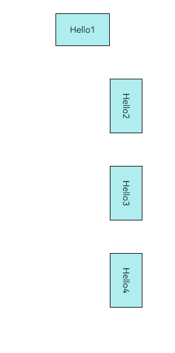
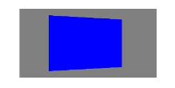
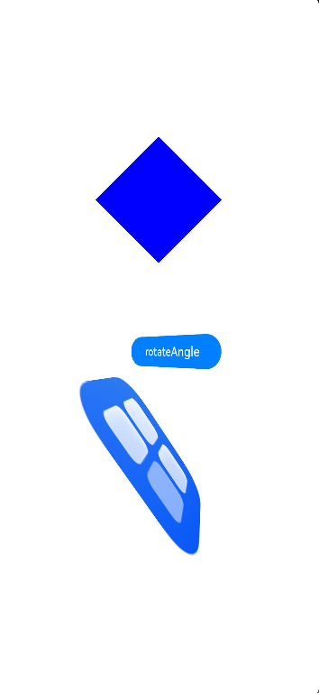

# Transformation
<!--Kit: ArkUI-->
<!--Subsystem: ArkUI-->
<!--Owner: @hehongyang3-->
<!--Designer: @hehongyang3-->
<!--Tester: @lxl007-->
<!--Adviser: @Brilliantry_Rui-->
<!-- md-trans-meta sourceCommit=39ca26def5c22dc659f3dc0b76ef62a29421e77a translatedAt=2026-09-02T12:16:12.248Z -->

Transformation attributes allow you to rotate, translate, scale, or transform a component.

> **NOTE**
>
> The initial APIs of this module are supported since API version 7. Updates will be marked with a superscript to indicate their earliest API version.

## rotate

rotate(value: RotateOptions): T

Rotates the component.

> **NOTE**
>
> When both the rotate and scale attributes are set for a component, the values of centerX and centerY conflict. In this case, the values of centerX and centerY are determined by the attribute set later in the attribute chain.

**Widget capability**: This API can be used in ArkTS widgets since API version 9.

**Atomic service API**: This API can be used in atomic services since API version 11.

**System capability**: SystemCapability.ArkUI.ArkUI.Full

**Parameters**

| Name| Type                                   | Mandatory| Description                                                        |
| ------ | --------------------------------------- | ---- | ------------------------------------------------------------ |
| value  | [RotateOptions](#rotateoptions) | Yes   | Rotates the component in the [component coordinate system](../../../ui/arkui-glossary.md#component-coordinate-system) with the upper left corner of the component as the coordinate origin (the coordinate system is shown in the following figure). In this system, (x,&nbsp;y,&nbsp;z) specifies a vector that serves as the rotation axis.<br>The rotation axis and the rotation center are both set based on the coordinate system. When the component is displaced, the coordinate system does not move with it.<br>Default value: when none of x, y, and z is specified, the default values of x, y, and z are 0, 0, and 1, respectively. When any of x, y, and z is specified, the unspecified values among x, y, and z default to 0.<br>{<br>centerX:&nbsp;'50%',<br>centerY:&nbsp;'50%',<br>centerZ:&nbsp;0,<br>perspective:&nbsp;0<br>}<br>The units of centerX, centerY, and centerZ are vp, and the unit of perspective is px.<br> |

**Return value**

| Type  | Description                    |
| ------ | ------------------------ |
| T | Current component, used for chained calls. |

## rotate<sup>18+</sup>

rotate(options: Optional\<RotateOptions>): T

Rotates the component. Compared with [rotate](#rotate), this API supports the **undefined** type.

**Widget capability**: This API can be used in ArkTS widgets since API version 18.

**Atomic service API**: This API can be used in atomic services since API version 18.

**Model restriction**: This API can be used only in the stage model.

**System capability**: SystemCapability.ArkUI.ArkUI.Full

**Parameters**

<!--Table: 10%; auto; 10%; auto-->
| Name | Type                                              | Mandatory| Description                                                        |
| ------- | -------------------------------------------------- | ---- | ------------------------------------------------------------ |
| options | [Optional](ts-universal-attributes-custom-property.md#optionalt)\<[RotateOptions](#rotateoptions) | Yes | Enables the component to rotate in the [component coordinate system](../../../ui/arkui-glossary.md#component-coordinate-system) with the upper left corner of the component as the coordinate origin (the coordinate system is shown in the following figure). Here, (x,&nbsp;y,&nbsp;z) specifies a vector that serves as the rotation axis.<br>The rotation axis and the rotation center are both set based on the coordinate system. When the component is displaced, the coordinate system does not move with it.<br>Default value: When none of x, y, and z is specified, the default values of x, y, and z are 0, 0, and 1, respectively. When any of x, y, and z is specified, the unspecified values among x, y, and z default to 0.<br>{<br>centerX:&nbsp;'50%',<br>centerY:&nbsp;'50%',<br>centerZ:&nbsp;0,<br>perspective:&nbsp;0<br>}<br>The units of centerX, centerY, and centerZ are vp, and the unit of perspective is px.<br>.<br>When the value of options is undefined, the component is restored to having no rotation effect. |

**Return value**

| Type  | Description                    |
| ------ | ------------------------ |
| T | Current component, used for chained calls. |

## rotate<sup>20+</sup>

rotate(options: Optional\<RotateOptions \| RotateAngleOptions>): T

Sets the component rotation effect. Compared with [rotate](#rotate18), this API supports the **RotateAngleOptions** type for the **options** parameter.

**Widget capability**: This API can be used in ArkTS widgets since API version 20.

**Atomic service API**: This API can be used in atomic services since API version 20.

**Model restriction**: This API can be used only in the stage model.

**System capability**: SystemCapability.ArkUI.ArkUI.Full

**Parameters**

| Name | Type                                                        | Mandatory| Description                                                        |
| ------- | ------------------------------------------------------------ | ---- | ------------------------------------------------------------ |
| options | [Optional](ts-universal-attributes-custom-property.md#optionalt)\<[RotateOptions](#rotateoptions) \| [RotateAngleOptions](#rotateangleoptions20)> | Yes | RotateOptions enables a component to rotate in the [component coordinate system](../../../ui/arkui-glossary.md#component-coordinate-system) with the upper left corner of the component as the coordinate origin (as shown in the following figure). (x,&nbsp;y,&nbsp;z) specifies a vector as the rotation axis.<br>Both the rotation axis and the rotation center are set based on the [component coordinate system](../../../ui/arkui-glossary.md#component-coordinate-system). When the component is displaced, the coordinate system does not move with it.<br>Default value: When none of x, y, and z is specified, their default values are 0, 0, and 1, respectively. When any of x, y, and z is specified, the unspecified ones default to 0.<br>{<br>centerX:&nbsp;'50%',<br>centerY:&nbsp;'50%',<br>centerZ:&nbsp;0,<br>perspective:&nbsp;0<br>}<br>RotateAngleOptions enables a component to rotate in the [component coordinate system](../../../ui/arkui-glossary.md#component-coordinate-system) with the upper left corner of the component as the coordinate origin (as shown in the following figure). (angleX,&nbsp;angleY,&nbsp;angleZ) specifies the rotation angles on the three axes.<br>The rotation center is set based on the [component coordinate system](../../../ui/arkui-glossary.md#component-coordinate-system). When the component is displaced, the coordinate system does not move with it.<br>Default value:<br>{<br>angleX:0,<br>angleY:0,<br>angleZ:0,<br>centerX:&nbsp;'50%',<br>centerY:&nbsp;'50%',<br>centerZ:&nbsp;0,<br>perspective:&nbsp;0<br>}<br><br>When the value of options is undefined, the component is restored to the state without any rotation effect. |

**Return value**

| Type| Description          |
| ---- | -------------- |
| T    | Current component, used for chained calls. |

## translate

translate(value: TranslateOptions): T

Translates the component.

**Widget capability**: This API can be used in ArkTS widgets since API version 9.

**Atomic service API**: This API can be used in atomic services since API version 11.

**System capability**: SystemCapability.ArkUI.ArkUI.Full

**Parameters**

| Name| Type                                         | Mandatory| Description                                                        |
| ------ | --------------------------------------------- | ---- | ------------------------------------------------------------ |
| value  | [TranslateOptions](#translateoptions) | Yes   | Moves the component in the [component coordinate system](../../../ui/arkui-glossary.md#component-coordinate-system) with the upper left corner of the component as the coordinate origin (as shown in the following figure). The values of x, y, and z indicate the distance moved along the corresponding axis. A positive value indicates movement in the positive direction of the corresponding axis, and a negative value indicates movement in the negative direction. The movement distance supports both numbers and strings (for example, '10px' and '10%').<br>Default value:<br>{<br>x:&nbsp;0,<br>y:&nbsp;0,<br>z:&nbsp;0<br>}<br>Unit: vp<br><br>**Note:**<br>When the component moves along the z-axis, because the observation point remains unchanged, the component appears larger as the z value approaches the observation point and smaller as it moves away.<br> |

**Return value**

| Type  | Description                    |
| ------ | ------------------------ |
| T | Current component, used for chained calls. |

## translate<sup>18+</sup>

translate(translate: Optional\<TranslateOptions>): T

Translates the component. Compared with [translate](#translate), this API supports the **undefined** type.

**Widget capability**: This API can be used in ArkTS widgets since API version 18.

**Atomic service API**: This API can be used in atomic services since API version 18.

**Model restriction**: This API can be used only in the stage model.

**System capability**: SystemCapability.ArkUI.ArkUI.Full

**Parameters**

<!--Table: 10%; auto; 10%; auto-->
| Name   | Type                                                    | Mandatory| Description                                                        |
| --------- | -------------------------------------------------------- | ---- | ------------------------------------------------------------ |
| translate | [Optional](ts-universal-attributes-custom-property.md#optionalt)\<[TranslateOptions](#translateoptions) | Yes | Moves a component in the [component coordinate system](../../../ui/arkui-glossary.md#component-coordinate-system) with the upper left corner of the component as the coordinate origin (as shown in the following figure). The values of x, y, and z indicate the distance moved along the corresponding axis. A positive value indicates movement in the positive direction of the corresponding axis, and a negative value indicates movement in the opposite direction. The movement distance supports both numbers and strings (for example, '10px' and '10%').<br>Default Value:<br>{<br>x:&nbsp;0,<br>y:&nbsp;0,<br>z:&nbsp;0<br>}<br>Unit: vp<br><br>**Note:**<br>When moving along the z-axis, because the observation point remains unchanged, the component is enlarged when the z value approaches the observation point and shrinks when it moves away.<br><br>When the value of translate is undefined, the component is restored to the state without translation. |

**Return value**

| Type  | Description                    |
| ------ | ------------------------ |
| T | Current component, used for chained calls. |

## scale

scale(value: ScaleOptions): T

Scales the component.

**Widget capability**: This API can be used in ArkTS widgets since API version 9.

**Atomic service API**: This API can be used in atomic services since API version 11.

**System capability**: SystemCapability.ArkUI.ArkUI.Full

**Parameters**

| Name| Type                                 | Mandatory| Description                                                        |
| ------ | ------------------------------------- | ---- | ------------------------------------------------------------ |
| value  | [ScaleOptions](#scaleoptions) | Yes   | Sets the scale factors of the X, Y, and Z axes respectively. The default value is 1. You can also set the center point of scaling through centerX and centerY.<br>Default value:<br>{<br>x:&nbsp;1,<br>y:&nbsp;1,<br>z:&nbsp;1,<br>centerX:'50%',<br>centerY:'50%'<br>} |

**Return value**

| Type  | Description                    |
| ------ | ------------------------ |
| T | Current component, used for chained calls. |

## scale<sup>18+</sup>

scale(options: Optional\<ScaleOptions>): T

Scales the component. Compared with [scale](#scale), this API supports the **undefined** type.

**Widget capability**: This API can be used in ArkTS widgets since API version 18.

**Atomic service API**: This API can be used in atomic services since API version 18.

**Model restriction**: This API can be used only in the stage model.

**System capability**: SystemCapability.ArkUI.ArkUI.Full

**Parameters**

| Name | Type                                            | Mandatory| Description                                                        |
| ------- | ------------------------------------------------ | ---- | ------------------------------------------------------------ |
| options | [Optional](ts-universal-attributes-custom-property.md#optionalt)\<[ScaleOptions](#scaleoptions) | Yes | Sets the scale factors of the X, Y, and Z axes respectively. The default value is 1. You can also set the scaling center point through centerX and centerY.<br>Default value:<br>{<br>x:&nbsp;1,<br>y:&nbsp;1,<br>z:&nbsp;1,<br>centerX:'50%',<br>centerY:'50%'<br>}<br>When the value of options is undefined, the component is restored to no scaling effect. |

**Return value**

| Type  | Description                    |
| ------ | ------------------------ |
| T | Current component, used for chained calls. |

## transform

transform(value: object): T

Sets the 2D transformation matrix of the component. When a 3D transformation involving a perspective effect is involved, the transform API may display an incorrect effect. In this case, use the [transform3D](#transform3d20) API.

**Atomic service API**: This API can be used in atomic services since API version 11.

**System capability**: SystemCapability.ArkUI.ArkUI.Full

**Parameters**

| Name| Type  | Mandatory| Description                                                        |
| ------ | ------ | ---- | ------------------------------------------------------------ |
| value  | object | Yes  | Transformation matrix of the component. Only the [Matrix4Transit](../js-apis-matrix4.md) object type is supported.|

**Return value**

| Type  | Description                    |
| ------ | ------------------------ |
| T | Current component, used for chained calls. |

## transform<sup>18+</sup>

transform(transform: Optional\<object>): T

Sets the 2D transformation matrix. When a 3D transformation is involved, use the [transform3D](#transform3d20) API. Compared with [transform](#transform), the transform<sup>18+</sup> parameter additionally supports the undefined type.

**Atomic service API**: This API can be used in atomic services since API version 18.

**Model restriction**: This API can be used only in the stage model.

**System capability**: SystemCapability.ArkUI.ArkUI.Full

**Parameters**

| Name| Type                                   | Mandatory| Description                    |
| ------ | --------------------------------------- | ---- | ------------------------ |
| transform | [Optional](ts-universal-attributes-custom-property.md#optionalt)\<object> | Yes | Sets the transformation matrix of the current component. The object currently supports only the [Matrix4Transit](../js-apis-matrix4.md#matrix4transit) matrix object type.<br>When the value of transform is undefined, the unit matrix effect is restored. |

**Return value**

| Type  | Description                    |
| ------ | ------------------------ |
| T | Current component, used for chained calls. |

## transform3D<sup>20+</sup>

transform3D(transform: Optional\<Matrix4Transit>): T

When a 3D transformation involving a perspective effect is involved, the transform API processes only 2D transformations, so the display effect may be inconsistent with expectations. In this case, use the transform3D API.

**Atomic service API**: This API can be used in atomic services since API version 20.

**Model restriction**: This API can be used only in the stage model.

**System capability**: SystemCapability.ArkUI.ArkUI.Full

**Parameters**

| Name   | Type                                              | Mandatory| Description                                                        |
| --------- | -------------------------------------------------- | ---- | ------------------------------------------------------------ |
| transform | [Optional](ts-universal-attributes-custom-property.md#optionalt)\<[Matrix4Transit](#matrix4transit20)> | Yes   | Sets the 3D transformation matrix of a component, and the component is transformed in 3D space according to this matrix. When the value of transform is undefined, the effect is restored to the identity matrix. |

**Return value**

| Type| Description          |
| ---- | -------------- |
| T    | Current component, used for chained calls. |

## Matrix4Transit<sup>20+</sup>

type Matrix4Transit = import('../api/@ohos.matrix4').default.Matrix4Transit

**Atomic service API**: This API can be used in atomic services since API version 20.

**Model restriction**: This API can be used only in the stage model.

**System capability**: SystemCapability.ArkUI.ArkUI.Full

| Type                             | Description          |
| --------------------------------- | -------------- |
| import('../api/@ohos.matrix4').default.[Matrix4Transit](../js-apis-matrix4.md#matrix4transit)     | Matrix transformation object. |

## RotateOptions

Defines component rotation parameters.

> **NOTE**
>
> When both the [rotate](#rotate) and [scale](#scale) attributes are set for a component, the values of centerX and centerY conflict. In this case, the values of centerX and centerY are determined by the attribute set later in the attribute chain.

**Atomic service API**: This API can be used in atomic services since API version 11.

**System capability**: SystemCapability.ArkUI.ArkUI.Full

| Name                     | Type                      | Read-Only| Optional| Description                                                        |
| ------------------------- | -------------------------- | ---- | ---- | ------------------------------------------------------------ |
| x                         | number                     | No   | Yes   | X coordinate of the rotation axis vector.<br>**Card Capability:** Since API version 9, this API is supported in ArkTS widgets.|
| y                         | number                     | No   | Yes   | Y coordinate of the rotation axis vector.<br>**Card Capability:** Since API version 9, this API is supported in ArkTS widgets.|
| z                         | number                     | No   | Yes   | Z coordinate of the rotation axis vector.<br>**Card Capability:** Since API version 9, this API is supported in ArkTS widgets.|
| angle                     | number&nbsp;\|&nbsp;string | No   | No   | Rotation angle, in degrees (°). A positive value indicates clockwise rotation relative to the rotation axis direction, and a negative value indicates counterclockwise rotation relative to the rotation axis direction. The value can be of the string type, in the format of a number plus an angle unit suffix, for example, '90deg'.<br>**Card Capability:** Since API version 9, this API is supported in ArkTS widgets. |
| centerX                   | number&nbsp;\|&nbsp;string | No   | Yes   | X-axis coordinate of the transformation center point. It indicates the x-direction coordinate of the component transformation center point (that is, the anchor point). The value can be of the string type, supporting numeric strings and percentage strings, for example, '50' and '50%'. Value range: (-∞, +∞). Default value: '50%'.<br>Unit: vp<br>**Card Capability:** Since API version 9, this API is supported in ArkTS widgets. |
| centerY                   | number&nbsp;\|&nbsp;string | No   | Yes   | Y-axis coordinate of the transformation center point. It indicates the y-direction coordinate of the component transformation center point (that is, the anchor point). When the type is string, the format follows the string type of [Length](ts-types.md#length). Example values: '50' and '50%'. Value range: (-∞, +∞). Default value: '50%'.<br>Unit: vp<br>**Card Capability:** Since API version 10, this API is supported in ArkTS widgets. |
| centerZ<sup>10+</sup>     | number                     | No   | Yes   | Z-axis anchor point, that is, the z-axis component of the 3D rotation center point.<br>Default value: 0<br>Unit: vp<br>**Card Capability:** Since API version 10, this API is supported in ArkTS widgets.<br>**Model Constraint:** This API can be used only in the stage model. |
| perspective<sup>10+</sup> | number                     | No   | Yes   | Z-axis coordinate where the camera is placed. Value range: (-∞, +∞). The value indicates the viewing distance, that is, the distance from the camera to the z=0 plane. The sign of the value determines the direction in which the camera observes. When perspective=0, the system automatically calculates a suitable z-axis position for the camera, and the calculated z-axis position is negative.<br>The rotation axis and rotation center point are both set based on the [Component Coordinate System](../../../ui/arkui-glossary.md#component-coordinate-system). When the component is displaced, the coordinate system does not move with it.<br>Default value: 0<br>Unit: px<br>**Card Capability:** Since API version 10, this API is supported in ArkTS widgets.<br>**Model Constraint:** This API can be used only in the stage model. |

## RotateAngleOptions<sup>20+</sup>
Rotation parameter option of the rotation angle on each axis.

> **NOTE**
>
> When both the [rotate](#rotate) and [scale](#scale) attributes are set for a component, the values of centerX and centerY conflict. In this case, the values of centerX and centerY are determined by the attribute set later in the attribute chain.

**Widget capability**: This API can be used in ArkTS widgets since API version 20.

**Atomic service API**: This API can be used in atomic services since API version 20.

**Model restriction**: This API can be used only in the stage model.

**System capability**: SystemCapability.ArkUI.ArkUI.Full

| Name                     | Type                      | Read-Only| Optional| Description                                                        |
| ------------------------- | -------------------------- | ---- | ---- | ------------------------------------------------------------ |
| angleX                    | number&nbsp;\|&nbsp;string | No   | Yes   | Rotation angle along the X axis, in degrees (°). A positive value indicates clockwise rotation relative to the rotation axis direction, and a negative value indicates counterclockwise rotation. The value can be of the string type and must conform to the angle value format (for example, '90deg').<br>Default value: 0<br>Value range: (-∞, +∞) |
| angleY                    | number&nbsp;\|&nbsp;string | No   | Yes   | Rotation angle along the Y axis, in degrees (°). A positive value indicates clockwise rotation relative to the rotation axis direction, and a negative value indicates counterclockwise rotation. The value can be of the string type, for example, '90deg'.<br>Default value: 0<br>Value range: (-∞, +∞) |
| angleZ                    | number&nbsp;\|&nbsp;string | No   | Yes   | Rotation angle along the Z axis, in degrees (°). A positive value indicates clockwise rotation relative to the rotation axis direction, and a negative value indicates counterclockwise rotation. The value can be of the string type, for example, '90deg'.<br>Default value: 0<br>Value range: (-∞, +∞) |
| centerX                   | number&nbsp;\|&nbsp;string | No   | Yes   | X-axis coordinate of the transformation center point. Indicates the x-direction coordinate of the component transformation center point (that is, the anchor point). When the type is string, refer to the string type of [Length](ts-types.md#length). Example values: '50', '50%'.<br>Unit: vp<br>Default value: '50%'<br>Value range: (-∞, +∞) |
| centerY                   | number&nbsp;\|&nbsp;string | No   | Yes   | Y-axis coordinate of the transformation center point. Indicates the y-direction coordinate of the component transformation center point (that is, the anchor point). When the type is string, refer to the string type of [Length](ts-types.md#length). Example values: '50', '50%'.<br>Unit: vp<br>Default value: '50%'<br>Value range: (-∞, +∞) |
| centerZ                   | number                     | No   | Yes   | Z-axis anchor point, that is, the z-axis component of the 3D rotation center point.<br>Default value: 0<br>Unit: vp<br>Value range: (-∞, +∞) |
| perspective               | number                     | No   | Yes   | Z-axis coordinate where the camera is placed. The value indicates the viewing distance, that is, the distance from the camera to the z=0 plane. The sign of the value determines the direction in which the camera observes. When perspective=0, the system automatically calculates the z-axis position of the camera, and the calculated z-axis position is negative.<br>The rotation axis and rotation center point are both set based on the [component coordinate system](../../../ui/arkui-glossary.md#component-coordinate-system). When the component is displaced, the coordinate system does not move with it.<br>Default value: 0<br>Unit: px<br>Value range: (-∞, +∞) |

## TranslateOptions

**Widget capability**: This API can be used in ArkTS widgets since API version 9.

**Atomic service API**: This API can be used in atomic services since API version 11.

**System capability**: SystemCapability.ArkUI.ArkUI.Full

| Name| Type                      | Read-Only| Optional| Description           |
| ---- | -------------------------- | ---- | ---- | --------------- |
| x    | number&nbsp;\|&nbsp;string | No   | Yes   | Translation distance along the x-axis.<br>When the type is number, the unit is vp, and the value range is (-∞, +∞).<br>Default value: 0<br>When the type is string, the format follows the string type of [Length](ts-types.md#length). |
| y    | number&nbsp;\|&nbsp;string | No   | Yes   | Translation distance along the y-axis.<br>When the type is number, the unit is vp, and the value range is (-∞, +∞).<br>Default value: 0<br>When the type is string, the format follows the string type of [Length](ts-types.md#length). |
| z    | number&nbsp;\|&nbsp;string | No   | Yes   | Translation distance along the z-axis. When moving along the z-axis, since the observation point remains unchanged, a z value closer to the observation point enlarges the component, while a value farther away shrinks it.<br>When the type is number, the unit is vp, and the value range is (-∞, +∞).<br>Default value: 0<br>When the type is string, the format follows the string type of [Length](ts-types.md#length). |

## ScaleOptions

**Widget capability**: This API can be used in ArkTS widgets since API version 9.

**Atomic service API**: This API can be used in atomic services since API version 11.

**System capability**: SystemCapability.ArkUI.ArkUI.Full

| Name   | Type                      | Read-Only| Optional| Description                                                        |
| ------- | -------------------------- | ---- | ---- | ------------------------------------------------------------ |
| x       | number                     | No   | Yes   | Scale factor of the x-axis. Value range: (-∞, +∞). Default value: 1. When x=1, no scaling effect is applied. When x>1, the component is enlarged along the x-axis. When 0<x<1, the component is shrunk along the x-axis. When x=0, the component is invisible along the x-axis. When x<0, the component is reversed and scaled along the x-axis. |
| y       | number                     | No   | Yes   | Scale factor of the y-axis. Value range: (-∞, +∞). Default value: 1. When y=1, no scaling effect is applied. When y>1, the component is enlarged along the y-axis. When 0<y<1, the component is shrunk along the y-axis. When y=0, the component is invisible along the y-axis. When y<0, the component is reversed and scaled along the y-axis. |
| z       | number                     | No   | Yes   | Scale factor of the z-axis. Value range: (-∞, +∞). Default value: 1. When z=1, no scaling effect is applied. When z>1, the component is enlarged along the z-axis. When 0<z<1, the component is shrunk along the z-axis. When z=0, the component is invisible along the z-axis. When z<0, the component is reversed and scaled along the z-axis. |
| centerX | number&nbsp;\|&nbsp;string | No   | Yes   | X-axis coordinate of the transformation center point. Indicates the x-direction coordinate of the component transformation center point (that is, the anchor point). When the type is string, the format follows the string type of [Length](ts-types.md#length). Example values: '50', '50%'. Value range: (-∞, +∞). Default value: '50%'.<br>Unit: vp |
| centerY | number&nbsp;\|&nbsp;string | No   | Yes   | Y-axis coordinate of the transformation center point. Indicates the y-direction coordinate of the component transformation center point (that is, the anchor point). When the type is string, the format follows the string type of [Length](ts-types.md#length). Example values: '50', '50%'. Value range: (-∞, +∞). Default value: '50%'.<br>Unit: vp |

> **NOTE**
>
> When both the [rotate](#rotate) and [scale](#scale) attributes are set for a component, the values of centerX and centerY conflict. In this case, the values of centerX and centerY are determined by the attribute set later in the attribute chain.

## Examples

### Example 1: Adding Graphical Transformation Effects

This example applies rotation, translation, scaling, and transformation matrix effects to the component using [rotate](#rotate), [translate](#translate), [scale](#scale), and [transform](#transform).

```ts
// xxx.ets
import { matrix4 } from '@kit.ArkUI';

@Entry
@Component
struct TransformExample {
  build() {
    Column() {
      Text('rotate').width('90%').fontColor(0xCCCCCC).padding(15).fontSize(14)
      Row()
        .rotate({
          x: 0,
          y: 0,
          z: 1,
          centerX: '50%',
          centerY: '50%',
          angle: 300
        }) // Rotate the component 300 degrees clockwise around its center point with the vector (0,0,1) as the rotation axis.
        .width(100).height(100).backgroundColor(0xAFEEEE)

      Text('translate').width('90%').fontColor(0xCCCCCC).padding(10).fontSize(14)
      Row()
        .translate({ x: 100, y: 10 }) // Translate 100 along the x-axis and 10 along the y-axis.
        .width(100)
        .height(100)
        .backgroundColor(0xAFEEEE)
        .margin({ bottom: 10 })

      Text('scale').width('90%').fontColor(0xCCCCCC).padding(15).fontSize(14)
      Row()
        .scale({ x: 2, y: 0.5 }) // Reduce the height by half and double the width; the z-axis has no effect in 2D.
        .width(100).height(100).backgroundColor(0xAFEEEE)

      Text('Matrix4').width('90%').fontColor(0xCCCCCC).padding(15).fontSize(14)
      Row()
        .width(100).height(100).backgroundColor(0xAFEEEE)
        .transform(matrix4.identity().translate({ x: 50, y: 50 }).scale({ x: 1.5, y: 1 }).rotate({
          x: 0,
          y: 0,
          z: 1,
          angle: 60
        }))
    }.width('100%').margin({ top: 5 })
  }
}
```


### Example 2: Setting the Rotation Perspective

This example demonstrates how to set the rotation perspective for a component by using [perspective](#rotateoptions).

```ts
// xxx.ets
@Entry
@Component
struct Index {
  @State prep: number = 10;

  build() {
    Row() {
      Column() {
        Stack()
          .width(100)
          .height(100)
          .backgroundColor(Color.Red)
          .rotate({ y: 1, angle: 45, perspective: this.prep })
        Button('change prep')
          .margin({ top: 100 })
          .onClick(() => {
            this.getUIContext()?.animateTo({
              duration: 2000,
              curve: Curve.EaseIn,
              iterations: 1,
              playMode: PlayMode.Normal,
              onFinish: () => {
                console.info('play end');
              }
            }, () => {
              this.prep = 500; // Transform the component view distance from 10 to 500.
            })
          })
      }
      .width('100%')
    }
    .height('100%')
  }
}
```


### Example 3: Implementing Rotation Around a Center Point

This example shows how to achieve the same rotation effect by setting different parameters for [rotate](#rotate) and [transform](#transform).

```ts
import { matrix4 } from '@kit.ArkUI';

@Entry
@Component
struct MatrixExample {
  build() {
    Column({ space: 100 }) {
      Text('Hello1')
        .textAlign(TextAlign.Center)
        .width(100)
        .height(60)
        .backgroundColor(0xAFEEEE)
        .borderWidth(1)

      Text('Hello2')
        .textAlign(TextAlign.Center)
        .width(100)
        .height(60)
        .backgroundColor(0xAFEEEE)
        .borderWidth(1)
        .rotate({
          // Rotate 90 degrees around the anchor (100 vp, 60 vp), where the value of centerX and centerY in rotate or scale are the component's anchors.
          z: 1,
          angle: 90,
          centerX: 100,
          centerY: 60
        })

      Text('Hello3')
        .textAlign(TextAlign.Center)
        .width(100)
        .height(60)
        .backgroundColor(0xAFEEEE)
        .borderWidth(1)
        .transform(matrix4.identity()
          .rotate({
            // The component's anchor (centerX, centerY) is (50%, 50%) by default, which is (50 vp, 30 vp).
            // Set (centerX, centerY) of rotate in transform to (50 vp, 30 vp), which is an additional offset from the component's own anchor.
            // This transformation is equivalent to rotating around (100 vp, 60 vp), achieving the same rotation effect as "Hello2."
            z: 1,
            angle: 90,
            centerX: this.getUIContext().vp2px(50),
            centerY: this.getUIContext().vp2px(30)
          }))

      Text('Hello4')
        .textAlign(TextAlign.Center)
        .width(100)
        .height(60)
        .backgroundColor(0xAFEEEE)
        .borderWidth(1)
        .scale({
          // centerX and centerY take effect only when x or y is set.
          // Set the component anchor to (100 vp, 60 vp).
          x: 1,
          y: 1,
          centerX: 100,
          centerY: 60
        }) // For transform's rotate without specifying centerX and centerY, the rotation center has no additional offset relative to the component's own anchor point.
          // Here, the component rotates around (100 vp, 60 vp) through the anchor set by scale, achieving the same rotation effect as "Hello2."
        .transform(matrix4.identity().rotate({ z: 1, angle: 90 }))
    }.width('100%')
    .height('100%')
  }
}
```



### Example 4: Implementing Graphical Transformation Through transform3D

This example demonstrates how to implement image transformation by setting [transform3D](#transform3d20). This functionality is supported since API version 20.

```ts
import { matrix4 } from '@kit.ArkUI';

// Initialize the 3D transformation matrix to demonstrate the graphic transformation effect of transform3D.
let matrix: matrix4.Matrix4Transit = matrix4.init([
  0.53033, 0, -0.53033, 0.00053033,
  0, 0.75, 0, 0,
  0.707107, 0, 0.707107, -0.000707107,
  0, 0, 0, 1
]);

@Entry
@Component
struct Transform3DExample {
  build() {
    Column() {
      Stack() {
        Stack()
          .width(200)
          .height(100)
          .backgroundColor(Color.Grey)
        Stack()
          .width(200)
          .height(100)
          .backgroundColor(Color.Blue)
          .transform3D(matrix)
      }
    }.width('100%')
  }
}
```



### Example 5: Rotating an Image Based on Angles of Each Axis

This example demonstrates how to implement rotation by setting the [RotateAngleOptions](#rotateangleoptions20) parameter of **rotate**. This functionality is supported since API version 20.

```ts
// xxx.ets
@Entry
@Component
struct Index {
  build() {
    Row() {
      Column() {
        Stack()
          .width(100)
          .height(100)
          .backgroundColor(Color.Blue)
          .rotate({ angleZ: -45 })
        Button('rotateAngle')
          .width('40%')
          .margin({ top: 100 })
          .rotate({ angleY: 30, centerX: '90%', perspective: 10 })
        Image($r('app.media.startIcon'))
          .width(200)
          .height(200)
          .rotate({
            angleX: 60,
            angleY: -125,
            angleZ: 75,
            centerX: 100,
            centerZ: 20
          })
      }
      .width('100%')
    }
    .height('100%')
  }
}
```


