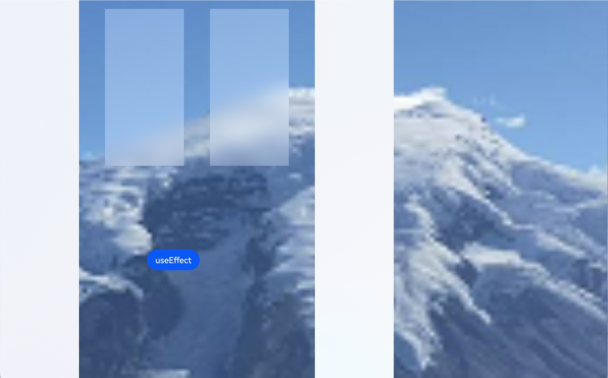

# Special Effect Drawing Combination
<!--Kit: ArkUI-->
<!--Subsystem: ArkUI-->
<!--Owner: @CCFFWW-->
<!--Designer: @CCFFWW-->
<!--Tester: @lxl007-->
<!--Adviser: @Brilliantry_Rui-->
<!-- md-trans-meta sourceCommit=39ca26def5c22dc659f3dc0b76ef62a29421e77a translatedAt=2026-09-02T12:14:31.816Z -->

Used to set whether the component applies an effect template to merge the drawing of background blur and other effects.

> **NOTE**
>
> The initial APIs of this module are supported since API version 12. Updates will be marked with a superscript to indicate their earliest API version.
>

## useEffect

useEffect(value: boolean): T

Used to control whether the component inherits the effect attribute parameters<!--Del--> of the parent [EffectComponent](ts-container-effectcomponent-sys.md)<!--DelEnd--> to merge the drawing of background blur and other effects.

**Atomic service API**: This API can be used in atomic services since API version 12.

**System capability**: SystemCapability.ArkUI.ArkUI.Full

**Parameters**

| Name| Type| Mandatory| Description|
| -------- | -------- | -------- | -------- |
| value | boolean | Yes | Whether the component inherits the effect attribute parameters<!--Del--> of the parent [EffectComponent](ts-container-effectcomponent-sys.md)<!--DelEnd--> to merge the rendering of effects.<br>When useEffect is true, the child component inherits the effect attribute parameters<!--Del--> of the parent [EffectComponent](ts-container-effectcomponent-sys.md); when it is false, the child component does not inherit the effect attribute parameters<!--Del--> of the parent [EffectComponent](ts-container-effectcomponent-sys.md).<br>Default value: false|

**Return value**

| Type| Description|
| -------- | -------- |
| T | Current component, used for chained calls. |

## useEffect<sup>14+</sup>

useEffect(useEffect: boolean, effectType: EffectType): T

Used to set whether the component applies the effect template defined by<!--Del--> the parent [EffectComponent](ts-container-effectcomponent-sys.md) or<!--DelEnd--> the window. When effectType is DEFAULT, this attribute must be used on a child component of EffectComponent, and EffectComponent must be configured with effect attributes for it to take effect. When effectType is WINDOW_EFFECT, it must be used together with the window effect template. When it is not used in the corresponding container, useEffect produces no effect. An effect template is a set of predefined visual effect parameters (including blur radius, saturation, brightness, and color) applied to a component to achieve a unified visual effect style.

**Atomic service API**: This API can be used in atomic services since API version 14.

**System capability**: SystemCapability.ArkUI.ArkUI.Full

**Parameters**

| Name    | Type                                                        | Mandatory| Description                                                        |
| ---------- | ------------------------------------------------------------ | ---- | ------------------------------------------------------------ |
| useEffect  | boolean                                                      | Yes  | Whether the component applies the effect template defined by<!--Del--> the parent **EffectComponent** or<!--DelEnd--> the window.<br>When useEffect is true, the effect template defined by<!--Del--> the parent EffectComponent or<!--DelEnd--> the window is applied; when it is false, the effect template defined by<!--Del--> the parent EffectComponent or<!--DelEnd--> the window is not applied.<br>Default value: false |
| effectType | [EffectType](#effecttype14) | Yes  | Used to set the component to apply the effect template defined by<!--Del--> the parent EffectComponent or<!--DelEnd--> the window. This parameter takes effect only when useEffect is true.<br>Default value: EffectType.DEFAULT |

**Return value**

| Type| Description|
| -------- | -------- |
| T | Current component, used for chained calls. |

## useEffect<sup>18+</sup>

useEffect(useEffect: Optional\<boolean>, effectType?: EffectType): T

Used to set whether the component applies the effect template defined by<!--Del--> the parent [EffectComponent](ts-container-effectcomponent-sys.md) or<!--DelEnd--> the window. Compared with [useEffect<sup>14+</sup>](#useeffect14), the useEffect parameter adds support for the undefined type. When effectType is DEFAULT, this attribute must be used on a child component of EffectComponent, and EffectComponent must be configured with effect attributes for it to take effect. When effectType is WINDOW_EFFECT, it must be used together with the window effect template. When it is not used in the corresponding container, useEffect produces no effect.

**Atomic service API**: This API can be used in atomic services since API version 18.

**System capability**: SystemCapability.ArkUI.ArkUI.Full

**Parameters**

| Name| Type| Mandatory| Description|
| -------- | -------- | -------- | -------- |
| useEffect | [Optional](ts-universal-attributes-custom-property.md#optionalt)\<boolean> | Yes | Whether the component applies the effect template defined by<!--Del--> the parent EffectComponent or<!--DelEnd--> the window.<br>When useEffect is true, the effect template defined by<!--Del--> the parent EffectComponent or<!--DelEnd--> the window is applied. The specific effect template to apply is determined by the effectType parameter.<br>When useEffect is false, no effect template is applied.<br>Default value: false<br>When the value of useEffect is undefined, the value from the last time this attribute took effect is retained. |
| effectType | [EffectType](#effecttype14) | No | Specifies the type of the effect template, and applies the effect template defined by<!--Del--> the parent EffectComponent or<!--DelEnd--> the window.<br>Default value: EffectType.DEFAULT |

**Return value**

| Type| Description|
| -------- | -------- |
| T | Current component, used for chained calls. |

## EffectType<sup>14+</sup>

Enumerates the effect template types. An effect template is a preset visual effect parameter configuration, including parameters such as blur radius, saturation, brightness, and color.

**Atomic service API**: This API can be used in atomic services since API version 14.

**System capability**: SystemCapability.ArkUI.ArkUI.Full

| Name    | Value  | Description                  |
| -------- | ---- | ---------------------- |
| DEFAULT  | 0   | Uses the effect template <!--Del-->defined by the parent EffectComponent <!--DelEnd-->to render the component effect. |
| WINDOW_EFFECT  | 1   | Uses the effect template defined by the window to render the component effect. |

Effect Template

|  Device Type    | Blur Radius (Unit: px)   | Saturation                 |  Brightness  |  Color  |
| -------- | ---- | ---------------------- | -------- | -------- |
| Mobile device  | 0   | 0 | 0 | '#ffffffff', displayed as white. |
| 2-in-1 device: dark mode  | 80   | 1.5 | 1.0 | '#e52e3033', displayed as semi-transparent dark gray. |
| 2-in-1 device: light mode  | 80   | 1.9 | 1.0 | '#e5ffffff', displayed as semi-transparent white. |
| Tablet device  | 0   | 0 | 0 | '#ffffffff', displayed as white. |

<!--Del-->
## Example

This example demonstrates the merging of drawing for background blur and other effects.

<!--code_no_check-->

```ts
// Index.ets
@Entry
@Component
struct Index {
  @State isUse: boolean = true;

  build() {
    Stack() {
      Image($r('app.media.mountain'))
        .autoResize(true)
      EffectComponent() {
        Column({ space: 20 }) {
           Column() {
           }
           .position({ x: 0, y: 0 })
           .width(150)
           .height(800)
           .useEffect(this.isUse, EffectType.WINDOW_EFFECT)
         
           Column() {
           }
           .position({ x: 200, y: 20 })
           .width(150)
           .height(300)
           .useEffect(this.isUse, EffectType.DEFAULT)

           Column() {
           }
           .position({ x: 400, y: 20 })
           .width(150)
           .height(300)
           .useEffect(this.isUse)
        }
        .width('100%')
        .height('100%')
      }
      .backgroundBlurStyle(BlurStyle.Thin)

       Column() {
       }
        .position({ x: 600, y: 0 })
        .width(150)
        .height(800)
        .useEffect(this.isUse, EffectType.WINDOW_EFFECT)

      Row() {
        Button('useEffect')
        .margin(30)
        .onClick(() => {
          this.isUse = !this.isUse;
        })
      }
      .position({ x: 300, y: 450 })
    }
    .backgroundColor(Color.Black)
    .width('100%')
  }
}
```


<!--DelEnd-->
