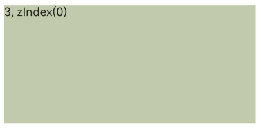
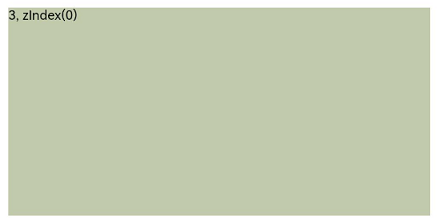

# Z-order Control
<!--Kit: ArkUI-->
<!--Subsystem: ArkUI-->
<!--Owner: @yihao-lin-->
<!--Designer: @piggyguy-->
<!--Tester: @songyanhong-->
<!--Adviser: @Brilliantry_Rui-->
<!-- md-trans-meta sourceCommit=9430c77017ca73641537d932a3d7d8a4c99c078b translatedAt=2026-09-02T12:17:56.608Z -->

A component's z-order determines its stacking order relative to its sibling components within the same container.

>  **NOTE**
>
>  The initial APIs of this module are supported since API version 7. Updates will be marked with a superscript to indicate their earliest API version.

## zIndex

zIndex(value: number): T

Sets the stacking order of the component.

**Widget capability**: Since API version 9, this feature is supported in ArkTS widgets.

**Atomic service API**: This API can be used in atomic services since API version 11.

**System capability**: SystemCapability.ArkUI.ArkUI.Full

**Parameters**

| Name| Type  | Mandatory| Description                                                        |
| ------ | ------ | ---- | ------------------------------------------------------------ |
| value  | number | Yes   | Display level relationship of sibling components in the same container. The larger the zIndex value, the higher the display level, that is, a component with a larger zIndex value is displayed above a component with a smaller zIndex value. Components in different containers cannot change the cross-container display level based on the zIndex value. When no sibling nodes are added or removed, dynamically modifying zIndex performs stable sorting based on the level order before the zIndex change. When sibling nodes are added or removed, the larger the zIndex value, the higher the display level; when the zIndex values are equal, components are displayed in declaration order, that is, a component declared later is displayed above a component declared earlier. |

**Return value**

| Type| Description|
| -------- | -------- |
| T | Current component, used for chained calls. |

## Example

### Example 1: Setting the Component Stacking Order

This example demonstrates how to set the stacking order of components using **zIndex**.

```ts
// xxx.ets
@Entry
@Component
struct ZIndexExample {
  build() {
    Column() {
      Stack() {
        // Components in the Stack container overlap, with later-defined components on top by default. Components with higher zIndex values appear in front of those with lower zIndex values.
        // Set the zIndex value of Text1 to 2.
        Text('1, zIndex(2)')
          .size({ width: '40%', height: '30%' }).backgroundColor(0xbbb2cb)
          .zIndex(2)
        // Set the zIndex value of Text2 to 1.
        Text('2, zIndex(1)')
          .size({ width: '70%', height: '50%' }).backgroundColor(0xd2cab3).align(Alignment.TopStart)
          .zIndex(1)
        // Set the zIndex value of Text3 to 0.
        Text('3, zIndex(0)')
          .size({ width: '90%', height: '80%' }).backgroundColor(0xc1cbac).align(Alignment.TopStart)
          .zIndex(0)
      }.width('100%').height(200)
    }.width('100%').height(200)
  }
}
```
When no zIndex is set for child components in a Stack container, they are displayed in the order in which they are declared by default, with later-declared components overlapping earlier-declared ones.



Display of child components in the **Stack** container when **zIndex** is set


### Example 2: Dynamically Modifying the zIndex Attribute

This example demonstrates dynamically modifying the **zIndex** attribute on a **Button** component.

```ts
// xxx.ets
@Entry
@Component
struct ZIndexExample {
  @State zIndexValue: number = 0;

  build() {
    Column() {
      // Clicking the Button component changes the zIndex value. Components are sorted stably based on their previous stacking order.
      Button('change Text2 zIndex')
        .onClick(() => {
          this.zIndexValue = (this.zIndexValue + 1) % 3;
        })
      Stack() {
        // Set the zIndex value of Text1 to 1.
        Text('1, zIndex(1)')
          .size({ width: '70%', height: '50%' }).backgroundColor(0xd2cab3).align(Alignment.TopStart)
          .zIndex(1)
        // Set the zIndex value of Text2 to the default value 0.
        Text('2, default zIndex(0), now zIndex:' + this.zIndexValue)
          .size({ width: '90%', height: '80%' }).backgroundColor(0xc1cbac).align(Alignment.TopStart)
          .zIndex(this.zIndexValue)
      }.width('100%').height(200)
    }.width('100%').height(200)
  }
}
```

Effect without clicking the **Button** component to change **zIndex**


Effect after clicking the **Button** component to dynamically change **zIndex** so that **Text1** and **Text2** have the same **zIndex** value


Effect after the **Button** component is clicked to dynamically change **zIndex** so that **Text2** has a higher **zIndex** value than **Text1**


### Example 3: Setting zIndex for Components in Different Containers

This example sets the zIndex attribute for components in different containers. Text1 and Text2 are in the same Stack container, while Text3 is in another Stack container. Although Text3 has the smallest zIndex value, Text1 and Text2 still cannot be displayed above Text3 based on their zIndex values.

```ts
// xxx.ets
@Entry
@Component
struct ZIndexExample {
  build() {
    Stack() {
      Stack() {
        // Set the zIndex value of Text1 to 2.
        Text('1, zIndex(2)')
          .size({ width: '40%', height: '30%' }).backgroundColor(0xbbb2cb)
          .zIndex(2)
        // Set the zIndex value of Text2 to 1.
        Text('2, zIndex(1)')
          .size({ width: '70%', height: '50%' }).backgroundColor(0xd2cab3).align(Alignment.TopStart)
          .zIndex(1)
      }.width('100%').height(200)

      Stack() {
        // zIndex cannot take effect across different container components. Text3 will be displayed on the top.
        // Set the zIndex value of Text3 to 0.
        Text('3, zIndex(0)')
          .size({ width: '90%', height: '80%' }).backgroundColor(0xc1cbac).align(Alignment.TopStart)
          .zIndex(0)
      }.width('100%').height(200)
    }.width('100%').height(200)
  }
}
```

