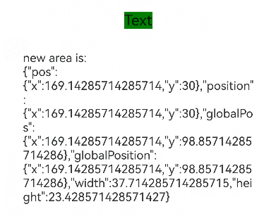

# Component Area Change Event
<!--Kit: ArkUI-->
<!--Subsystem: ArkUI-->
<!--Owner: @yihao-lin-->
<!--Designer: @piggyguy-->
<!--Tester: @songyanhong-->
<!--Adviser: @Brilliantry_Rui-->
<!-- md-trans-meta sourceCommit=93ecf6af6da13066f2099922b6ffa0050aa111bb translatedAt=2026-09-02T12:18:25.494Z -->

The component area change event is triggered when the component's displayed size, position, or other attributes change. It applies to scenarios where you need to listen for component layout changes and obtain the area information before and after the change, helping developers update page content or execute related business logic in a timely manner based on component size or position changes.

>  **NOTE**
>
>  Supported since API version 8. New APIs added in later versions are marked with a superscript to indicate their earliest API version.
>
> The execution of the **onAreaChange** callback is related only to this component. No fixed execution order is guaranteed between the **onAreaChange** callbacks of this component and those of its ancestor or descendant components.

## onAreaChange

onAreaChange(event: (oldValue: Area, newValue: Area) => void): T

Triggered when the component area changes in size or position due to layout updates.

This event is not triggered for render attribute changes caused by re-rendering, such as changes to [translate](ts-universal-attributes-transformation.md#translate), [offset](ts-universal-attributes-location.md#offset), [markAnchor](ts-universal-attributes-location.md#markanchor), [scale](ts-universal-attributes-transformation.md#scale), or [transform](ts-universal-attributes-transformation.md#transform). In addition, if the component position is altered due to drawing changes, for example, through [bindSheet](ts-universal-attributes-sheet-transition.md#bindsheet), this event is also not triggered.

>  **NOTE**
>
> When a component is bound to both the **onAreaChange** event and the [position](ts-universal-attributes-location.md#position) attribute, the **onAreaChange** event responds to changes in the **position** attribute of type [Position](ts-types.md#position), but does not respond to changes in the **position** attribute of type [Edges](ts-types.md#edges12) or [LocalizedEdges](ts-types.md#localizededges12).

**Atomic service API**: This API can be used in atomic services since API version 11.

**System capability**: SystemCapability.ArkUI.ArkUI.Full

**Parameters**

| Name  | Type                     | Mandatory| Description                                                        |
| -------- | ------------------------- | ---- | ------------------------------------------------------------ |
| event | (oldValue: [Area](ts-types.md#area8), newValue: [Area](ts-types.md#area8)) => void  | Yes   | Callback invoked when the component area changes. oldValue indicates the width and height of the target element before the change, as well as the coordinates of the target element relative to the upper left corner of the parent element and the page. newValue indicates the width and height of the target element after the change, as well as the coordinates of the target element relative to the upper left corner of the parent element and the page. |

**Return value**

| Type| Description|
| -------- | -------- |
| T | Current component, which can be used for chained calls. |

## onAreaChange

onAreaChange(event: AreaChangeCallback, options?: AreaChangeOptions): T

This callback is triggered when the component area changes. The interval for triggering the callback can be set through expectedUpdateInterval in [AreaChangeOptions](#areachangeoptions). The callback responds only to changes in the component size and position caused by layout changes. Rendering attribute changes caused by drawing changes do not trigger the callback, such as [translate](ts-universal-attributes-transformation.md#translate), [offset](ts-universal-attributes-location.md#offset), [markAnchor](ts-universal-attributes-location.md#markanchor), [scale](ts-universal-attributes-transformation.md#scale), and [transform](ts-universal-attributes-transformation.md#transform). If the position of the component itself is determined by drawing changes, the callback is not triggered either, such as [bindSheet](ts-universal-attributes-sheet-transition.md#bindsheet).

>  **NOTE**
>
> When a component is bound with both the onAreaChange event and the [position](ts-universal-attributes-location.md#position) attribute, the onAreaChange event responds to changes in the position attribute of the [Position](ts-types.md#position) type, but does not respond to changes in the position attribute of the [Edges](ts-types.md#edges12) and [LocalizedEdges](ts-types.md#localizededges12) types.


**Since**: 26.0.0

**Model restriction**: This API can be used only in the stage model.

**Atomic service API:** This API can be used in atomic services since API version 26.0.0.

**System capability**: SystemCapability.ArkUI.ArkUI.Full

**Parameters**

| Name   | Type                      | Mandatory | Description                                                         |
| -------- | ------------------------- | ---- | ------------------------------------------------------------ |
| event | [AreaChangeCallback](#areachangecallback) | Yes   | Callback for the onAreaChange event. This callback is triggered when the displayed size or position of the component changes. |
| options | [AreaChangeOptions](#areachangeoptions) | No   | Configuration parameters related to area changes, used to set the calculation interval of the area change callback. The callback trigger interval can be set through expectedUpdateInterval, in ms. If options is not passed in, expectedUpdateInterval is processed as 0. |

**Return value**

| Type | Description |
| -------- | -------- |
| T | Current component, which can be used for chained calls. |

## AreaChangeCallback

type AreaChangeCallback = (oldValue: Area, newValue: Area) => void

Callback type of the component area change event.

**Since**: 26.0.0

**Model restriction**: This API can be used only in the stage model.

**Atomic service API:** This API can be used in atomic services since API version 26.0.0.

**System capability**: SystemCapability.ArkUI.ArkUI.Full

**Parameters**

| Name            | Type               | Mandatory      | Description                                       |
| ------------- | ------------------ | ------------- | ---------------------- |
| oldValue | [Area](ts-types.md#area8) | Yes | Information before the area change, including the width and height of the target element, the coordinates relative to the parent element, and the position coordinates of the upper left corner of the target element in the current window coordinate system. |
| newValue | [Area](ts-types.md#area8) | Yes | Information after the area change, including the width and height of the target element, the coordinates relative to the parent element, and the position coordinates of the upper left corner of the target element in the current window coordinate system. |

## AreaChangeOptions

Parameters related to area change.

**Since**: 26.0.0

**Model restriction**: This API can be used only in the stage model.

**Atomic service API:** This API can be used in atomic services since API version 26.0.0.

**System capability**: SystemCapability.ArkUI.ArkUI.Full

| Name | Type | Read-only | Optional | Description |
| ------ | --------------------------------------------------- | ---- | -------- | ------------------------------------------------------------ |
| expectedUpdateInterval | number | No | Yes | Expected update interval of the area change, in ms. If this field is greater than 2^31-1, the value is set to 2^31-1. If this field is less than 0 or not set, the default value 1000 is used.<br>Default value: 1000<br>Value range: [0, 2^31-1] |

## Examples

### Example 1: Using onAreaChange to Listen for Area Changes

This example demonstrates how to set an area change event for a **Text** component. When the layout of the **Text** component changes, the **onAreaChange** event is triggered, allowing you to obtain relevant parameters.

```ts
// xxx.ets
@Entry
@Component
struct AreaExample {
  @State value: string = 'Text';
  @State sizeValue: string = '';

  build() {
    Column() {
      Text(this.value)
        .backgroundColor(Color.Green)
        .margin(30)
        .fontSize(20)
        .onClick(() => {
          this.value = this.value + 'Text';
        })
        .onAreaChange((oldValue: Area, newValue: Area) => {
          console.info(`Ace: on area change, oldValue is ${JSON.stringify(oldValue)} newValue is ${JSON.stringify(newValue)}`);
          this.sizeValue = JSON.stringify(newValue);
        })
      Text('new area is: \n' + this.sizeValue).margin({ right: 30, left: 30 })
    }
    .width('100%').height('100%').margin({ top: 30 })
  }
}
```


### Example 2: Using onAreaChange to Listen for Area Changes at a Custom Interval

In this example, by setting [expectedUpdateInterval](#areachangeoptions), the [onAreaChange](#onareachange-1) event can be triggered when the Text layout changes, achieving the effect of interval callbacks.

Since API version 26.0.0, [onAreaChange](#onareachange-1), [AreaChangeCallback](#areachangecallback), and [AreaChangeOptions](#areachangeoptions) are added.

```ts
// xxx.ets
@Entry
@Component
struct AreaExample {
  @State value: string = 'Text';
  @State sizeValue: string = '';

  build() {
    Column() {
      Text(this.value)
        .backgroundColor(Color.Green)
        .margin(30)
        .fontSize(20)
        .onClick(() => {
          this.value = this.value + 'Text';
        })
        // When expectedUpdateInterval is set, the area change callback is triggered at the set interval.
        .onAreaChange((oldValue: Area, newValue: Area) => {
          console.info(`ACE: on area change, oldValue is ${JSON.stringify(oldValue)} newValue is ${JSON.stringify(newValue)}`);
          this.sizeValue = JSON.stringify(newValue);
        }, {expectedUpdateInterval: 1000})
      Text('new area is: \n' + this.sizeValue).margin({ right: 30, left: 30 })
    }
    .width('100%').height('100%').margin({ top: 30 })
  }
}
```

