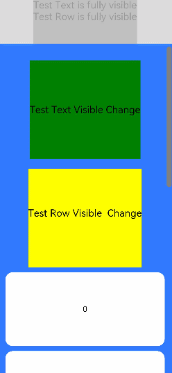
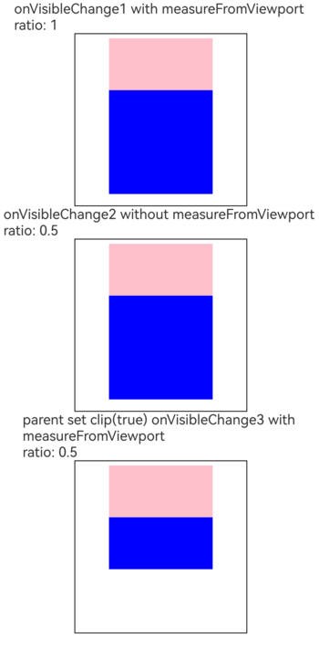

# Visible Area Change Event
<!--Kit: ArkUI-->
<!--Subsystem: ArkUI-->
<!--Owner: @yihao-lin-->
<!--Designer: @piggyguy-->
<!--Tester: @songyanhong-->
<!--Adviser: @Brilliantry_Rui-->
<!-- md-trans-meta sourceCommit=9430c77017ca73641537d932a3d7d8a4c99c078b translatedAt=2026-09-02T12:21:50.323Z -->

The visible area change event of a component refers to the change in the visual portion of the component on the screen. It can be used to determine whether the component is completely or partially displayed on the screen. It is usually applicable to scenarios such as advertisement exposure tracing.

> **NOTE**
>
> The initial APIs of this module are supported since API version 9. Updates will be marked with a superscript to indicate their earliest API version.

## onVisibleAreaChange

onVisibleAreaChange(ratios: Array&lt;number&gt;, event: VisibleAreaChangeCallback): T

Called when the visible area of the component changes. For details about the development guidelines and FAQs, see [Detecting Component Visibility](./../../../ui/arkts-manage-components-visibility.md).

> **NOTE**
>
>- Since API version 20, this API can be called in [attributeModifier](ts-universal-attributes-attribute-modifier.md#attributemodifier).
>
>- This API only provides the ratio of the relative clipping area of the own node to all ancestor nodes (up to the window boundary) to its own area, and the change trend.
>
>- Occlusion calculation of sibling nodes on the own node is not supported. Occlusion calculation of sibling nodes of all ancestors on the own node is not supported. Window occlusion calculation is not supported. Component rotation calculation is not supported, such as [Stack](ts-container-stack.md), [Z-order control](ts-universal-attributes-z-order.md), and [rotate](ts-universal-attributes-transformation.md#rotate).
>
>- Visible area change calculation of non-tree-attached nodes is not supported. For example, preloaded nodes and custom nodes mounted through the [overlay](ts-universal-attributes-overlay.md#overlay) capability.
>
>- The [scale](ts-universal-attributes-transformation.md#scale) attribute is not supported. To support [scale](ts-universal-attributes-transformation.md#scale), use [onVisibleAreaChange<sup>22+</sup>](#onvisibleareachange22) and set measureFromViewport to true.

**Atomic service API**: This API can be used in atomic services since API version 11.

**System capability**: SystemCapability.ArkUI.ArkUI.Full

**Parameters**

| Name| Type                                               | Mandatory| Description                                                        |
| ------ | --------------------------------------------------- | ---- | ------------------------------------------------------------ |
| ratios | Array&lt;number&gt;                                 | Yes  | Threshold array. Each threshold represents the ratio of the component visible area (that is, the area of the component displayed on the screen, which only counts the area within the parent component and excludes the part beyond the parent component) to the component's own area. When the ratio of the component visible area to its own area reaches a set threshold during a change, this callback is triggered. The value range of each threshold is [0.0, 1.0]. If the developer sets a threshold less than 0.0, the actual value is 0.0; if the developer sets a threshold greater than 1.0, the actual value is 1.0.<br>**Note:** <br>When a value is close to the boundaries 0 and 1, it is rounded according to the rule that the error does not exceed 0.001. For example, 0.9997 is approximated as 1. |
| event  | [VisibleAreaChangeCallback](#visibleareachangecallback12) | Yes  | Callback for the component visibility area change event. |

**Return value**

| Type| Description|
| -------- | -------- |
| T | Current component, used for chained calls. |

## onVisibleAreaChange<sup>22+</sup>

onVisibleAreaChange(ratios: Array&lt;number&gt;, event: VisibleAreaChangeCallback, measureFromViewport: boolean): T

Called when the visible area of the component changes. You can use **measureFromViewport** to set the visible area calculation mode. For details about the development guidelines and FAQs, see [Detecting Component Visibility](./../../../ui/arkts-manage-components-visibility.md).

**Atomic service API**: This API can be used in atomic services since API version 22.

**Model restriction**: This API can be used only in the stage model.

**System capability**: SystemCapability.ArkUI.ArkUI.Full

**Parameters**

| Name| Type                                               | Mandatory| Description                                                        |
| ------ | --------------------------------------------------- | ---- | ------------------------------------------------------------ |
| ratios | Array&lt;number&gt;                                 | Yes   | Threshold array. Each threshold represents the ratio of the component's visible area to its own area. When the ratio of the component's visible area to its own area reaches a set threshold during a change, this callback is triggered. The value range of each threshold is [0.0, 1.0]. If the developer sets a threshold less than 0.0, the actual value is 0.0; if the developer sets a threshold greater than 1.0, the actual value is 1.0.<br>**Note:**<br>When a value is close to the boundaries 0 and 1, it is rounded according to the rule that the error does not exceed 0.001. For example, 0.9997 is approximated as 1. |
| event  | [VisibleAreaChangeCallback](#visibleareachangecallback12) | Yes   | Callback for the component visibility area change event. |
| measureFromViewport  | boolean | Yes  | Sets the visible area calculation mode.<br>When measureFromViewport is set to true, the system considers the [clip](./ts-universal-attributes-sharp-clipping.md#clip12) attribute setting of the parent component when calculating the visible area of this component. If the parent component's [clip](./ts-universal-attributes-sharp-clipping.md#clip12) is false, its child components are considered to be able to display beyond its area, so the area beyond the parent component is also regarded as the visible area and included in the calculation; if the parent component's [clip](./ts-universal-attributes-sharp-clipping.md#clip12) is set to true, the area of the component beyond the parent component is clipped and cannot be displayed, so it is regarded as the invisible area for calculation. When measureFromViewport is set to false, the influence of [clip](./ts-universal-attributes-sharp-clipping.md#clip12) is not considered, and the part of the component beyond the parent component is directly regarded as the invisible area.<br>When measureFromViewport is set to true and the ancestor node sets the [scale](ts-universal-attributes-transformation.md#scale) attribute, the visible ratio of the component is calculated correctly. |

**Return value**

| Type| Description|
| -------- | -------- |
| T | Current component, which can be used for chained calls. |

> **NOTE**
>
>
>- This API only provides the ratio of the relative clipping area of the own node to all ancestor nodes (up to the window boundary) to its own area, and the change trend.
>
>- Occlusion calculation of sibling nodes on the own node is not supported. Occlusion calculation of sibling nodes of all ancestors on the own node is not supported. Window occlusion calculation is not supported. Component rotation calculation is not supported, such as [Stack](ts-container-stack.md), [Z-order control](ts-universal-attributes-z-order.md), and [rotate](ts-universal-attributes-transformation.md#rotate).
>
>- Visible area change calculation of non-tree-attached nodes is not supported. For example, preloaded nodes and custom nodes mounted through the [overlay](ts-universal-attributes-overlay.md#overlay) capability.

## onVisibleAreaApproximateChange<sup>17+</sup>

onVisibleAreaApproximateChange(options: VisibleAreaEventOptions, event: VisibleAreaChangeCallback | undefined): T

Sets the callback parameters of the **onVisibleAreaApproximateChange** event to limit the callback execution interval.

> **NOTE**
>
> This API can be called within [attributeModifier](ts-universal-attributes-attribute-modifier.md#attributemodifier) since API version 23.

**Atomic service API**: This API can be used in atomic services since API version 17.

**Model restriction**: This API can be used only in the stage model.

**System capability**: SystemCapability.ArkUI.ArkUI.Full

**Parameters**

| Name| Type  | Mandatory| Description                      |
| ------ | ------ | ---- | -------------------------- |
| options  | [VisibleAreaEventOptions](#visibleareaeventoptions12) | Yes   | Configuration parameters related to visible area change, used to set the visible area callback threshold, expected calculation interval, and visible area calculation mode. |
| event  | [VisibleAreaChangeCallback](#visibleareachangecallback12)   \| undefined | Yes   | Callback for the onVisibleAreaApproximateChange event. This callback is invoked when the ratio of the component's visible area to its own area reaches the threshold set in options. The visible area ratio calculation interval is determined by the expectedUpdateInterval parameter in options. Passing undefined means that this callback is not set. |

**Return value**

| Type| Description|
| -------- | -------- |
| T | Current component, used for chained calls. |

> **NOTE**
>
>- This API differs from [onVisibleAreaChange](#onvisibleareachange) as follows: onVisibleAreaChange calculates the visible area ratio in every frame. If too many nodes are registered, the system power consumption may deteriorate. This API reduces the frequency of visible area ratio calculation, and the calculation interval is determined by the expectedUpdateInterval parameter of [VisibleAreaEventOptions](#visibleareaeventoptions12).
>
>- This API only provides the ratio of the relative clipping area of the own node to all ancestor nodes (up to the window boundary) to its own area, and the change trend.
>
>- Occlusion calculation of sibling nodes on the own node is not supported. Occlusion calculation of sibling nodes of all ancestors on the own node is not supported. Window occlusion calculation is not supported. Component rotation calculation is not supported, such as [Stack](ts-container-stack.md), [Z-order control](ts-universal-attributes-z-order.md), and [rotate](ts-universal-attributes-transformation.md#rotate).
>
>- Visible area change calculation of non-tree-attached nodes is not supported. For example, preloaded nodes and custom nodes mounted through the [overlay](ts-universal-attributes-overlay.md#overlay) capability.
>
>- The visible area callback threshold of this API includes 0 by default. For example, if the developer sets the callback threshold to [0.5], the effective threshold is [0.0, 0.5].
>
>- Since API version 18, this API can be called in custom components.
>
>- The [scale](ts-universal-attributes-transformation.md#scale) attribute is not supported. Since API version 22, to support [scale](ts-universal-attributes-transformation.md#scale), set measureFromViewport of [VisibleAreaEventOptions](#visibleareaeventoptions12) to true.
>
>- Since API version 21, the return value type is changed from void to T.

## VisibleAreaEventOptions<sup>12+</sup>

Parameters related to the visible area change.

**Model restriction**: This API can be used only in the stage model.

**System capability**: SystemCapability.ArkUI.ArkUI.Full

| Name| Type                                               | Read-Only| Optional| Description                                                        |
| ------ | --------------------------------------------------- | ---- | -------- | ------------------------------------------------------------ |
| ratios | Array&lt;number&gt;                                 | No | No   | Threshold array. Each threshold represents the ratio of the component's visible area (that is, the area of the component in the screen display area; only the area within the parent component is calculated, and the part beyond the parent component is not calculated) to the component's own area. The value range of each threshold is [0.0, 1.0]. If the threshold set by the developer is less than 0.0, the actual value is 0.0; if the threshold set is greater than 1.0, the actual value is 1.0.<br>**Atomic service API:** Since API version 12, this API is supported in atomic services. |
| expectedUpdateInterval | number | No | Yes | Defines the calculation interval expected by the developer, used to control the calculation frequency of the visible area ratio, in ms. When more timely perception of visible area changes is required, a smaller interval can be set; when many nodes are registered or more attention is paid to reducing the calculation frequency and power consumption, a larger interval is recommended. If not set, the default value 1000 is used. When this field is less than 100 or is NaN, the default value is 100; when this field is greater than 2^31-1, the default value is 2^31-1.<br>Default value: 1000 <br>**Atomic service API:** Since API version 12, this API is supported in atomic services.|
| measureFromViewport<sup>22+</sup> | boolean | No | Yes | Sets the visible area calculation mode.<br>When measureFromViewport is set to true, the system considers the [clip](./ts-universal-attributes-sharp-clipping.md#clip12) attribute setting of the parent component when calculating the visible area of this component. If the parent component's [clip](./ts-universal-attributes-sharp-clipping.md#clip12) is false, the child components within it are considered to be able to display beyond its area, so the area beyond the parent component is also regarded as the visible area and included in the calculation; if the parent component's [clip](./ts-universal-attributes-sharp-clipping.md#clip12) is set to true, the area of the component beyond the parent component is clipped and cannot be displayed, so it is regarded as the invisible area for calculation. When measureFromViewport is set to false, the impact of [clip](./ts-universal-attributes-sharp-clipping.md#clip12) is not considered, and the part of the component beyond the parent component is directly regarded as the invisible area.<br>Default value: false <br>When measureFromViewport is set to true, if the ancestor node sets the [scale](ts-universal-attributes-transformation.md#scale) attribute, the component's visible ratio is calculated correctly.<br>**Atomic service API:** Since API version 22, this API is supported in atomic services.|

## VisibleAreaChangeCallback<sup>12+</sup>

type VisibleAreaChangeCallback = (isExpanding: boolean, currentRatio: number) => void

Represents a callback for visible area changes of the component.

**Atomic service API**: This API can be used in atomic services since API version 12.

**Model restriction**: This API can be used only in the stage model.

**System capability**: SystemCapability.ArkUI.ArkUI.Full

**Parameters**

| Name           | Type              | Mandatory     | Description                                      |
| ------------- | ------------------   | ------------- | ---------------------- |
| isExpanding | boolean | Yes| Whether the component's visible area has increased or decreased relative to its total area since the last callback. The value **true** indicates that the visible area has increased, and **false** indicates that the visible area has decreased.|
| currentRatio | number | Yes | Ratio of the component's visible area to its own area when the callback is triggered. The value range is [0.0, 1.0]. |

## Examples

### Example 1: Using onVisibleAreaChange to Listen for Visible Area Changes

This example demonstrates how to set an [onVisibleAreaChange](#onvisibleareachange) event for a component, which triggers the callback when the component is fully displayed or completely hidden.

```ts
// xxx.ets
@Entry
@Component
struct ScrollExample {
  scroller: Scroller = new Scroller();
  private arr: number[] = [0, 1, 2, 3, 4, 5, 6, 7, 8, 9];
  @State testTextStr: string = 'test';
  @State testRowStr: string = 'test';

  build() {
    Column() {
      Column() {
        Text(this.testTextStr)
          .fontSize(20)

        Text(this.testRowStr)
          .fontSize(20)
      }
      .height(100)
      .backgroundColor(Color.Gray)
      .opacity(0.3)

      Scroll(this.scroller) {
        Column() {
          Text('Test Text Visible Change')
            .fontSize(20)
            .height(200)
            .margin({ top: 50, bottom: 20 })
            .backgroundColor(Color.Green)
            // Set ratios to [0.0, 1.0] to invoke the callback when the component is fully visible or invisible on screen.
            .onVisibleAreaChange([0.0, 1.0], (isExpanding: boolean, currentRatio: number) => {
              console.info(`Test Text isExpanding: ${isExpanding}, currentRatio: ${currentRatio}`);
              if (isExpanding && currentRatio >= 1.0) {
                console.info(`Test Text is fully visible. currentRatio: ${currentRatio}`);
                this.testTextStr = 'Test Text is fully visible';
              }

              if (!isExpanding && currentRatio <= 0.0) {
                console.info('Test Text is completely invisible.');
                this.testTextStr = 'Test Text is completely invisible';
              }
            })

          Row() {
            Text('Test Row Visible Change')
              .fontSize(20)
              .margin({ bottom: 20 })

          }
          .height(200)
          .backgroundColor(Color.Yellow)
          .onVisibleAreaChange([0.0, 1.0], (isExpanding: boolean, currentRatio: number) => {
            console.info(`Test Row isExpanding: ${isExpanding}, currentRatio: ${currentRatio}`);
            if (isExpanding && currentRatio >= 1.0) {
              console.info('Test Row is fully visible.');
              this.testRowStr = 'Test Row is fully visible';
            }

            if (!isExpanding && currentRatio <= 0.0) {
              console.info('Test Row is completely invisible.');
              this.testRowStr = 'Test Row is completely invisible';
            }
          })

          ForEach(this.arr, (item: number) => {
            Text(item.toString())
              .width('90%')
              .height(150)
              .backgroundColor(0xFFFFFF)
              .borderRadius(15)
              .fontSize(16)
              .textAlign(TextAlign.Center)
              .margin({ top: 10 })
          }, (item: number) => (item.toString()))

        }.width('100%')
      }
      .backgroundColor(0x317aff)
      .scrollable(ScrollDirection.Vertical)
      .scrollBar(BarState.On)
      .scrollBarColor(Color.Gray)
      .scrollBarWidth(10)
      .onWillScroll((xOffset: number, yOffset: number) => {
        console.info(`${xOffset} ${yOffset}`);
      })
      .onScrollEdge(() => {
        console.info('To the edge');
      })
      .onScrollStop(() => {
        console.info('Scroll Stop');
      })

    }.width('100%').height('100%').backgroundColor(0xDCDCDC)
  }
}
```

### Example 2: Using onVisibleAreaApproximateChange to Listen for Visible Area Changes

This example demonstrates how to set an [onVisibleAreaApproximateChange](#onvisibleareaapproximatechange17) event for a component, which triggers the callback when the component is fully displayed or completely hidden. This feature is supported from API version 17.

```ts
// xxx.ets
@Entry
@Component
struct ScrollExample {
  scroller: Scroller = new Scroller();
  private arr: number[] = [0, 1, 2, 3, 4, 5, 6, 7, 8, 9];
  @State testTextStr: string = 'test';
  @State testRowStr: string = 'test';

  build() {
    Column() {
      Column() {
        Text(this.testTextStr)
          .fontSize(20)

        Text(this.testRowStr)
          .fontSize(20)
      }
      .height(100)
      .backgroundColor(Color.Gray)
      .opacity(0.3)

      Scroll(this.scroller) {
        Column() {
          Text('Test Text Visible Change')
            .fontSize(20)
            .height(200)
            .margin({ top: 50, bottom: 20 })
            .backgroundColor(Color.Green)
            // Set ratios to [0.0, 1.0] to invoke the callback when the component is fully visible or invisible on screen.
            .onVisibleAreaApproximateChange({ ratios: [0.0, 1.0], expectedUpdateInterval: 1000 },
              (isExpanding: boolean, currentRatio: number) => {
                console.info(`Test Text isExpanding: ${isExpanding}, currentRatio: ${currentRatio}`);
                if (isExpanding && currentRatio >= 1.0) {
                  console.info(`Test Text is fully visible. currentRatio: ${currentRatio}`);
                  this.testTextStr = 'Test Text is fully visible';
                }

                if (!isExpanding && currentRatio <= 0.0) {
                  console.info('Test Text is completely invisible.');
                  this.testTextStr = 'Test Text is completely invisible';
                }
              })

          Row() {
            Text('Test Row Visible Change')
              .fontSize(20)
              .margin({ bottom: 20 })

          }
          .height(200)
          .backgroundColor(Color.Yellow)
          .onVisibleAreaApproximateChange({ ratios: [0.0, 1.0], expectedUpdateInterval: 1000 }, (isExpanding: boolean, currentRatio: number) => {
            console.info(`Test Row isExpanding: ${isExpanding}, currentRatio: ${currentRatio}`);
            if (isExpanding && currentRatio >= 1.0) {
              console.info('Test Row is fully visible.');
              this.testRowStr = 'Test Row is fully visible';
            }

            if (!isExpanding && currentRatio <= 0.0) {
              console.info('Test Row is completely invisible.');
              this.testRowStr = 'Test Row is completely invisible';
            }
          })

          ForEach(this.arr, (item: number) => {
            Text(item.toString())
              .width('90%')
              .height(150)
              .backgroundColor(0xFFFFFF)
              .borderRadius(15)
              .fontSize(16)
              .textAlign(TextAlign.Center)
              .margin({ top: 10 })
          }, (item: number) => (item.toString()))

        }.width('100%')
      }
      .backgroundColor(0x317aff)
      .scrollable(ScrollDirection.Vertical)
      .scrollBar(BarState.On)
      .scrollBarColor(Color.Gray)
      .scrollBarWidth(10)
      .onWillScroll((xOffset: number, yOffset: number) => {
        console.info(`${xOffset} ${yOffset}`);
      })
      .onScrollEdge(() => {
        console.info('To the edge');
      })
      .onScrollStop(() => {
        console.info('Scroll Stop');
      })

    }.width('100%').height('100%').backgroundColor(0xDCDCDC)
  }
}
```


### Example 3: Setting measureFromViewport to Calculate the Visible Area When a Child Component Extends Beyond Its Parent

Starting from API version 22, this example demonstrates the effect comparison after setting the measureFromViewport parameter for the onVisibleAreaChange event. The main difference is reflected in the component visibility ratio (currentRatio) returned by the callback. When measureFromViewport is set to true, the returned component visibility ratio (currentRatio) better matches the actual effect. Because different devices have different screen pixel densities, the calculation of the visible area change event involves decimal rounding, and currentRatio may have slight differences.

```ts
@Entry
@Component
struct OnVisibleAreaChangeSample {
  @State ratio1: number = 0.0;
  @State ratio2: number = 0.0;
  @State ratio3: number = 0.0;

  build() {
    Column() {
      Text(`onVisibleChange1 with measureFromViewport \nratio: ${this.ratio1}`)
      Column() {
        Row() {
          Row() {

          }
          .backgroundColor(Color.Blue)
          .height(120)
          .width(120)
          .offset({ x: 0, y: 60 })
          // If measureFromViewport is set to true and clip(true) is not set for the parent component, any area of the child component that extends beyond its parent component's bounds is regarded as a visible area.
          .onVisibleAreaApproximateChange({
            ratios: [0.0, 1.0],
            expectedUpdateInterval: 500,
            measureFromViewport: true
          }, (isExpanding: boolean, currentRatio: number) => {
            console.info(`onVisibleAreaApproximateChange1 isExpanding: ${isExpanding} currentRatio: ${currentRatio}`);
          })
          .onVisibleAreaChange([0.0, 1.0], (isExpanding: boolean, currentRatio: number) => {
            this.ratio1 = currentRatio;
          }, true)
        }
        .backgroundColor(Color.Pink)
        .height(120)
        .width(120)
      }
      .padding(5)
      .borderWidth(1)
      .height(200)
      .width(200)

      Text(`onVisibleChange2 without measureFromViewport \nratio: ${this.ratio2}`)
      Column() {
        Row() {
          Row() {

          }
          .backgroundColor(Color.Blue)
          .height(120)
          .width(120)
          .offset({ x: 0, y: 60 })
          // If measureFromViewport is not set (which will be treated as false) and clip(true) is not set for the parent component, any area of the child component that extends beyond its parent component's bounds is regarded as an invisible area.
          .onVisibleAreaApproximateChange({ ratios: [0.0, 1.0], expectedUpdateInterval: 500 },
            (isExpanding: boolean, currentRatio: number) => {
              console.info(`onVisibleAreaApproximateChange2 isExpanding: ${isExpanding} currentRatio: ${currentRatio}`);
            })
          .onVisibleAreaChange([0.0, 1.0], (isExpanding: boolean, currentRatio: number) => {
            this.ratio2 = currentRatio;
          })
        }
        .backgroundColor(Color.Pink)
        .height(120)
        .width(120)
      }
      .padding(5)
      .borderWidth(1)
      .height(200)
      .width(200)

      Text(`parent set clip(true) onVisibleChange3 with measureFromViewport \nratio: ${this.ratio3}`)
      Column() {
        Row() {
          Row() {

          }
          .backgroundColor(Color.Blue)
          .height(120)
          .width(120)
          .offset({ x: 0, y: 60 })
          // If measureFromViewport is set to true and clip(true) is set for the parent component, any area of the child component that extends beyond its parent component regarded as an invisible area.
          .onVisibleAreaApproximateChange({
            ratios: [0.0, 1.0],
            expectedUpdateInterval: 500,
            measureFromViewport: true
          }, (isExpanding: boolean, currentRatio: number) => {
            console.info(`onVisibleAreaApproximateChange3 isExpanding: ${isExpanding} currentRatio: ${currentRatio}`);
          })
          .onVisibleAreaChange([0.0, 1.0], (isExpanding: boolean, currentRatio: number) => {
            this.ratio3 = currentRatio;
          }, true)
        }
        .clip(true)
        .backgroundColor(Color.Pink)
        .height(120)
        .width(120)
      }
      .padding(5)
      .borderWidth(1)
      .height(200)
      .width(200)
    }
    .height('100%')
    .width('100%')
  }
}
```

