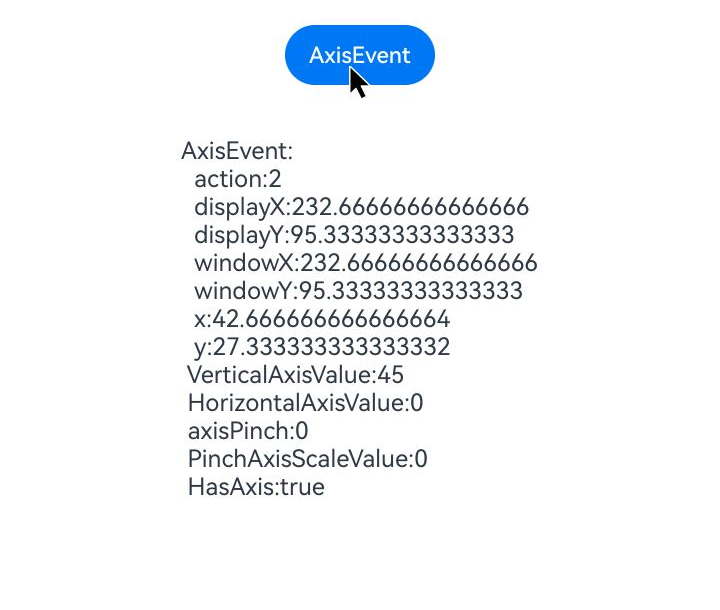

# Axis Event
<!--Kit: ArkUI-->
<!--Subsystem: ArkUI-->
<!--Owner: @jiangtao92-->
<!--Designer: @piggyguy-->
<!--Tester: @songyanhong-->
<!--Adviser: @HelloCrease-->

An axis event is triggered when a component is scrolled via the mouse wheel or two-finger sliding on a touchpad in a specific direction (axis). "Axis" refers to a direction in a two-dimensional coordinate system, categorized into horizontal (x-axis) and vertical (y-axis) directions.

>  **NOTE**
>
>  The APIs of this module are supported since API version 17. Updates will be marked with a superscript to indicate their earliest API version.

## onAxisEvent

onAxisEvent(event: Callback\<AxisEvent>): T

Triggered when the mouse wheel is scrolled or two fingers slide on the touchpad.

**Atomic service API**: This API can be used in atomic services since API version 17.

**System capability**: SystemCapability.ArkUI.ArkUI.Full

**Parameters**

| Name| Type                             | Mandatory| Description                |
| ------ | --------------------------------- | ---- | -------------------- |
| event  | Callback\<[AxisEvent](#axisevent)> | Yes  | [AxisEvent](#axisevent) object.|

**Return value**

| Type| Description|
| -------- | -------- |
| T | Current component.|

## AxisEvent

Describes the axis event object. Inherits from [BaseEvent](ts-gesture-customize-judge.md#baseevent8).

**Atomic service API**: This API can be used in atomic services since API version 17.

**System capability**: SystemCapability.ArkUI.ArkUI.Full

### Properties

**System capability**: SystemCapability.ArkUI.ArkUI.Full

| Name           | Type | Read-Only|Optional                             | Description                                                   |
| ------------------- | -----------------------|------|----- | -------------------------------------------------------- |
| action              | [AxisAction](ts-appendix-enums.md#axisaction17)           | No  | No  | Action type of the axis event.<br>**Atomic service API**: This API can be used in atomic services since API version 17.                  |
| x                   | number                 | No  | No  | X coordinate of the cursor relative to the left edge of the element.<br>Unit: vp<br>**Atomic service API**: This API can be used in atomic services since API version 17. |
| y                   | number                 | No  | No  | Y coordinate of the cursor relative to the top edge of the element.<br>Unit: vp<br>**Atomic service API**: This API can be used in atomic services since API version 17. |
| windowX             | number                 | No  | No  | X coordinate of the cursor relative to the upper left corner of the current window.<br>Unit: vp<br>**Atomic service API**: This API can be used in atomic services since API version 17.|
| windowY             | number                 | No  | No  | Y coordinate of the cursor relative to the upper left corner of the current window.<br>Unit: vp<br>**Atomic service API**: This API can be used in atomic services since API version 17.|
| displayX            | number                 | No  | No  | X coordinate of the cursor relative to the upper left corner of the screen.<br>Unit: vp<br>**Atomic service API**: This API can be used in atomic services since API version 17.|
| displayY            | number                 | No  | No  | Y coordinate of the cursor relative to the upper left corner of the current screen.<br>Unit: vp<br>**Atomic service API**: This API can be used in atomic services since API version 17.|
| scrollStep          | number                 | No  | Yes  | Scroll step length for the mouse wheel.<br> Note: Only the mouse wheel is supported. The value ranges from 0 to 65535.<br>**Atomic service API**: This API can be used in atomic services since API version 17.|
| propagation         | Callback\<void>        | No  | No  | Enables [event bubbling](../../../ui/arkts-interaction-basic-principles.md#event-bubbling) propagation.<br>**Atomic service API**: This API can be used in atomic services since API version 17.  |
| globalDisplayX<sup>20+</sup> | number | No| Yes| X coordinate of the cursor relative to the upper left corner of the global display.<br>Unit: vp<br>Value range: [0, +∞).<br>**Atomic service API**: This API can be used in atomic services since API version 20.|
| globalDisplayY<sup>20+</sup> | number | No| Yes| Y coordinate of the cursor relative to the upper left corner of the global display.<br>Unit: vp<br>Value range: [0, +∞).<br>**Atomic service API**: This API can be used in atomic services since API version 20.|

### getHorizontalAxisValue

getHorizontalAxisValue(): number

Obtains the horizontal axis value of this axis event.

**Atomic service API**: This API can be used in atomic services since API version 17.

**System capability**: SystemCapability.ArkUI.ArkUI.Full

**Return value**

| Type             |Description      |
| ------- | --------------------------------- | 
| number | Horizontal axis value.<br>Unit: vp|

### getVerticalAxisValue

getVerticalAxisValue(): number

Obtains the vertical axis value of this axis event.

**Atomic service API**: This API can be used in atomic services since API version 17.

**System capability**: SystemCapability.ArkUI.ArkUI.Full

**Return value**

| Type             |Description      |
| ------- | --------------------------------- | 
| number | Vertical axis value.<br>Unit: vp|

### getPinchAxisScaleValue<sup>21+</sup>

getPinchAxisScaleValue(): number

Obtains the two-finger pinch zoom ratio from the axis event.

**Atomic service API**: This API can be used in atomic services since API version 21.

**System capability**: SystemCapability.ArkUI.ArkUI.Full

**Return value**

| Type             |Description      |
| ------- | --------------------------------- | 
| number | Two-finger pinch zoom ratio.<br> Note: This ratio is calculated as the current distance between two fingers during a touchpad pinch event divided by the initial distance when the fingers first made contact.<br>Default value: **0**.<br>Value range: [0, +∞).<br>|

### hasAxis<sup>22+</sup>

hasAxis(axisType: AxisType): boolean

Checks whether this axis event contains the specified axis type.

**Atomic service API**: This API can be used in atomic services since API version 22.

**System capability**: SystemCapability.ArkUI.ArkUI.Full

**Parameters**

| Name| Type                             | Mandatory| Description                |
| ------ | --------------------------------- | ---- | -------------------- |
| axisType  | [AxisType](ts-appendix-enums.md#axistype22) | Yes  | Axis type to check for.|

**Return value**

| Type             |Description      |
| ------- | --------------------------------- | 
| boolean | Whether the axis event contains the specified axis type.<br>**true** if the axis event contains the specified axis type; **false** otherwise.|

## Example

This example shows how to set up an axis event on a button. When the user scrolls the mouse wheel over the button, the event parameters are captured and displayed.

```ts
// xxx.ets
@Entry
@Component
struct AxisEventExample {
  @State text: string = ''

  build() {
    Column() {
      Row({ space: 20 }) {
        Button('AxisEvent').width(100).height(40)
          .onAxisEvent((event?: AxisEvent) => {
            if (event) {
              this.text =
                'AxisEvent:' + '\n  action:' + event.action + '\n  displayX:' + event.displayX + '\n  displayY:' +
                event.displayY + '\n  windowX:' + event.windowX + '\n  windowY:' + event.windowY + '\n  x:' + event.x +
                  '\n  y:' + event.y + '\n VerticalAxisValue:' + event.getVerticalAxisValue() +
                  '\n HorizontalAxisValue:' + event.getHorizontalAxisValue() + '\n axisPinch:' + event.axisPinch +
                  '\n PinchAxisScaleValue:' + event.getPinchAxisScaleValue() +
                  '\n HasAxis:' + event.hasAxis(AxisType.VERTICAL_AXIS);
            }
          })
      }.margin(20)

      Text(this.text).margin(15)
    }.width('100%')
  }
}
```

The figure below shows the event parameters captured when the user scrolls the mouse wheel.


