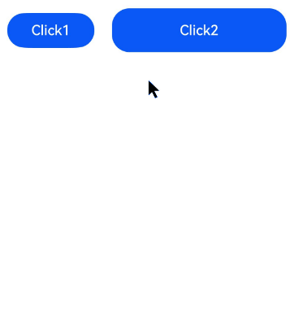

# Click Event
<!--Kit: ArkUI-->
<!--Subsystem: ArkUI-->
<!--Owner: @yihao-lin-->
<!--Designer: @piggyguy-->
<!--Tester: @songyanhong-->
<!--Adviser: @Brilliantry_Rui-->
<!-- md-trans-meta sourceCommit=019aedac567884ccbfeab4f4b06034a413968e1a translatedAt=2026-09-02T12:24:53.409Z -->

A click event is used to listen for the interaction behavior triggered when a component is clicked. Through this event, you can obtain click event information such as the click position and trigger source, and can set the click gesture movement threshold in supported APIs. It is suitable for scenarios such as handling component click responses, distinguishing trigger sources, and controlling the click recognition range.

>  **NOTE**
>
> - The event is supported since API version 7. New APIs added in later versions are marked with a superscript to indicate their earliest API version.
>
> - Click events follow the [touch event](../arkui-ts/ts-universal-events-touch.md) distribution process. Touch events support custom behaviors such as blocking and pass-through.
>
> - For event distribution, see [Event Interaction Pipeline](../../../ui/arkts-interaction-basic-principles.md#event-interaction-pipeline). For the gesture event processing process, see [Multi-level Gesture Events](../../../ui/arkts-gesture-events-multi-level-gesture.md).
>
> - When the click event is triggered by a keyboard or gamepad, the callbacks of [onGestureJudgeBegin](./ts-gesture-customize-judge.md#ongesturejudgebegin), [onGestureRecognizerJudgeBegin](./ts-gesture-blocking-enhancement.md#ongesturerecognizerjudgebegin), and [willClick](../arkts-apis-uicontext-uiobserver.md#onwillclick12) will not be triggered.

## onClick<sup>12+</sup>

onClick(event: Callback\<ClickEvent>, distanceThreshold: number): T

Called when a click event occurs.

When the device type that triggers the click event is a keyboard or gamepad, the [SourceTool](ts-gesture-settings.md#sourcetool9) value of the event is **Unknown**; the [SourceType](ts-gesture-settings.md#sourcetype8) value of the event is **KEY** when triggered by a keyboard, and **JOYSTICK** when triggered by a gamepad.

Compared with the original **onClick** API, this API has the **distanceThreshold** parameter that specifies the finger movement threshold for click events. If the finger's movement exceeds the set threshold, the gesture recognition will fail. The click gesture recognition will fail if finger movement exceeds this threshold.

For click scenarios without a finger movement distance limit, you are advised to use the [onClick](#onclick) API. To limit the finger movement range during a click, use this API.

**Widget capability**: This API can be used in ArkTS widgets since API version 12.

>  **NOTE**
>
>  - Since API version 12, the following constraints apply when this API is used in service widgets:
>    1. Click events will not be triggered if the finger is pressed for more than 800 ms.
>    2. Click events will not be triggered if the finger moves more than 20 px after pressing down.
>
>  - This API cannot be called within [attributeModifier](ts-universal-attributes-attribute-modifier.md#attributemodifier).

**Atomic service API**: This API can be used in atomic services since API version 12.

**Model restriction**: This API can be used only in the stage model.

**System capability**: SystemCapability.ArkUI.ArkUI.Full

**Parameters**

| Name| Type                             | Mandatory| Description                |
| ------ | --------------------------------- | ---- | -------------------- |
| event  | Callback\<[ClickEvent](#clickevent)> | Yes   | Callback invoked to receive the ClickEvent object when a click action is triggered. You can obtain click event information such as the click position and trigger source through this object. |
| distanceThreshold  | number | Yes   | Movement threshold of the click event. If the value is less than or equal to 0, the default value is used.<br>Default value: **2^31-1**<br>Unit: vp<br>**NOTE**<br>If the finger movement distance exceeds the preset movement threshold, tap recognition fails. If the default threshold is used and the finger moves beyond the component hot zone, tap recognition fails. |

>  **NOTE**
>
>  If finger movement during a swipe exceeds the threshold but remains within the touch target boundaries upon release, the click event is still triggered.

**Return value**

| Type| Description|
| -------- | -------- |
| T | Current component, used for chained calls. |

## onClick

onClick(event: (event: ClickEvent) => void): T

A click action triggers this callback. For click scenarios without a finger movement distance limit, it is recommended to use this API. If you need to limit the finger movement range during a click, it is recommended to use the [onClick](#onclick12) API.

When the device type that triggers the click event is a keyboard or gamepad, the **SourceTool** value of the event is **Unknown**; the [SourceType](ts-gesture-settings.md#sourcetype8) value of the event is **KEY** when triggered by a keyboard, and **JOYSTICK** when triggered by a gamepad.

**Widget capability**: This API can be used in ArkTS widgets since API version 9.

>  **NOTE**
>
>  Since API version 9, the following constraints apply when this API is used in service widgets:
>  1. Click events will not be triggered if the finger is pressed for more than 800 ms.
>  2. Click events will not be triggered if the finger moves more than 20 px after pressing down.

**Atomic service API**: This API can be used in atomic services since API version 11.

**System capability**: SystemCapability.ArkUI.ArkUI.Full

**Parameters**

| Name| Type                             | Mandatory| Description                |
| ------ | --------------------------------- | ---- | -------------------- |
| event  | (event: [ClickEvent](#clickevent)) => void | Yes   | Callback for the click event, invoked when a click action is triggered to receive the ClickEvent object, through which the click position, trigger source, and other click event information can be obtained. |

**Return value**

| Type| Description|
| -------- | -------- |
| T | Current component, used for chained calls. |

## ClickEvent

Inherits from [BaseEvent](#baseevent8).

### Attributes

**System capability**: SystemCapability.ArkUI.ArkUI.Full

<!--Table: 20%; 20%; 8%; 8%; 44%-->
| Name           | Type                        | Read-Only| Optional       | Description                                                    |
| ------------------- | ------------------------- | ------ | -------- | -------------------------------------------------------- |
| x                   | number                               | No | No | X coordinate of the click position in the [component coordinate system](../../../ui/arkui-glossary.md#component-coordinate-system) with the clicked element as the reference. After the [distanceThreshold](ts-universal-events-click.md#onclick12) of onClick is set, the click position is the lift-up point. When the event is triggered by a keyboard or gamepad, the click position is the center point of the clicked element.<br>Unit: vp<br>**Widget capability:** This API can be used in ArkTS widgets since API version 9.<br>**Atomic service API:** This API can be used in atomic services since API version 11.     |
| y                   | number                               | No | No | Y coordinate of the click position in the [component coordinate system](../../../ui/arkui-glossary.md#component-coordinate-system) with the clicked element as the reference. After the **distanceThreshold** of **onClick** is set, the click position is the lift-up point. When the event is triggered by a keyboard or gamepad, the click position is the center point of the clicked element.<br>Unit: vp<br>**Widget capability:** This API can be used in ArkTS widgets since API version 9.<br>**Atomic service API:** This API can be used in atomic services since API version 11.          |
| windowX<sup>10+</sup> | number                             | No | No | X coordinate of the click position in the current app window coordinate system. After the **distanceThreshold** of **onClick** is set, the click position is the lift-up point.<br>Unit: vp<br>**Atomic service API:** This API can be used in atomic services since API version 11.<br>**Model restriction:** This API can be used only in the stage model. |
| windowY<sup>10+</sup> | number                             | No | No | Y coordinate of the click position in the current app window coordinate system. After the **distanceThreshold** of **onClick** is set, the click position is the lift-up point.<br>Unit: vp<br>**Atomic service API:** This API can be used in atomic services since API version 11.<br>**Model restriction:** This API can be used only in the stage model. |
| displayX<sup>10+</sup> | number                            | No | No | X coordinate of the click position in the current app screen coordinate system. After the **distanceThreshold** of **onClick** is set, the click position is the lift-up point.<br>Unit: vp<br>**Atomic service API:** This API can be used in atomic services since API version 11.<br>**Model restriction:** This API can be used only in the stage model. |
| displayY<sup>10+</sup> | number                            | No | No | Y coordinate of the click position in the current app screen coordinate system. After the **distanceThreshold** of **onClick** is set, the click position is the lift-up point.<br>Unit: vp<br>**Atomic service API:** This API can be used in atomic services since API version 11.<br>**Model restriction:** This API can be used only in the stage model. |
| screenX<sup>(deprecated)</sup> | number                    | No | No | X coordinate of the click position in the current app window coordinate system.<br>Unit: vp<br>**Note:** This API is supported since API version 7 and deprecated since API version 10. You are advised to use **windowX** instead. |
| screenY<sup>(deprecated)</sup> | number                    | No | No | Y coordinate of the click position in the current app window coordinate system.<br>Unit: vp<br>**Note:** This API is supported since API version 7 and deprecated since API version 10. You are advised to use **windowY** instead. |
| preventDefault<sup>12+</sup>      | () => void | No | No | Used to prevent the default behavior.<br> **Note:**&nbsp;This API is supported only by some components. Currently supported components: **RichEditor** and **Hyperlink**. An exception is thrown when this API is used on unsupported components. Asynchronous calls and the Modifier API are not supported yet.<br>**Atomic service API:** This API can be used in atomic services since API version 12.<br>**Model restriction:** This API can be used only in the stage model.|
| hand<sup>15+</sup> | [InteractionHand](./ts-appendix-enums.md#interactionhand15) | No | Yes | Whether the event is triggered by a left-hand or right-hand tap.<br>**Atomic service API:** This API can be used in atomic services since API version 15.<br>**Model restriction:** This API can be used only in the stage model. |
| globalDisplayX<sup>20+</sup> | number | No | Yes | X coordinate of the click position in the [global coordinate system](../../../windowmanager/window-terminology.md#global-coordinate-system). After the **distanceThreshold** of **onClick** is set, the click position is the lift-up point.<br>Unit: vp<br>Value range: (-∞, +∞)<br>**Atomic service API:** This API can be used in atomic services since API version 20.<br>**Model restriction:** This API can be used only in the stage model. |
| globalDisplayY<sup>20+</sup> | number | No | Yes | Y coordinate of the click position in the [global coordinate system](../../../windowmanager/window-terminology.md#global-coordinate-system). After the **distanceThreshold** of **onClick** is set, the click position is the lift-up point.<br>Unit: vp<br>Value range: (-∞, +∞)<br>**Atomic service API:** This API can be used in atomic services since API version 20.<br>**Model restriction:** This API can be used only in the stage model. |

**Error codes**

For details about the error codes, see [Interaction Event Error Codes](../errorcode-event.md).

| ID  | Error Message|
| --------- | ------- |
| 100017       | Component does not support prevent function. |

### getCurrentLocalPosition

getCurrentLocalPosition?(): Coordinate2D

Obtains the coordinates of the click position relative to the upper-left corner of the current component's real-time position. It is suitable for scenarios where the coordinates of the click point relative to the component's current position need to be obtained after the component has been displaced, animated, or its layout has changed.

**Since**: 26.0.0

**Model restriction**: This API can be used only in the stage model.

**Atomic service API:** This API can be used in atomic services since API version 26.0.0.

**System capability**: SystemCapability.ArkUI.ArkUI.Full

**Return value**

| Type    | Description                                                  |
| ------- | ----------------------------------------------------- |
| [Coordinate2D](ts-types.md#coordinate2d) | Coordinates of the click position relative to the upper left corner of the current component's real-time position. |

## BaseEvent<sup>API version 8+</sup>

Defines the basic event type.

### Attributes

**System capability**: SystemCapability.ArkUI.ArkUI.Full

<!--Table: 20%; 20%; 8%; 8%; 44%-->
| Name    | Type                                       | Read-only | Optional | Description         |
| ---------| ---------------------------------------- | ---- | ---- | -----------|
| target   | [EventTarget](./ts-universal-events-click.md#eventtarget8) | No | No | Element object that triggers the gesture event.<br>**Card capability:** This API is supported in ArkTS widgets since API version 9.<br>**Atomic service API:** This API is supported in atomic services since API version 11.|
| timestamp | number | No | No | Timestamp of the event, which is the interval from system startup to when the event is triggered.<br>Unit: ns<br>Value range: [0, +∞)<br>**Card capability:** This API is supported in ArkTS widgets since API version 9.<br>**Atomic service API:** This API is supported in atomic services since API version 11. |
| source   | [SourceType](./ts-gesture-settings.md#sourcetype) | No | No | Type of the input device that triggers the event.<br>**Card capability:** This API is supported in ArkTS widgets since API version 9.<br>**Atomic service API:** This API is supported in atomic services since API version 11.  |
| pressure<sup>9+</sup> | number | No | No | Pressure of the press.<br>Default value: 0<br>Value range: [0, 1]. The typical value is 0.913168, and the pressure is positively correlated with the value. On some devices, a value greater than 1 may be returned due to different hardware parameter configurations.<br>**Card capability:** This API is supported in ArkTS widgets since API version 9.<br>**Atomic service API:** This API is supported in atomic services since API version 11. |
| tiltX<sup>9+</sup> | number | No | No | Angle between the projection of the stylus on the device plane and the X axis of the device plane.<br>Unit: deg<br>Default value: 0<br>**Card capability:** This API is supported in ArkTS widgets since API version 9.<br>**Atomic service API:** This API is supported in atomic services since API version 11. |
| tiltY<sup>9+</sup> | number | No | No |Angle between the projection of the stylus on the device plane and the Y axis of the device plane.<br>Unit: deg<br>Default value: 0<br>**Card capability:** This API is supported in ArkTS widgets since API version 9.<br>**Atomic service API:** This API is supported in atomic services since API version 11. |
| rollAngle<sup>17+</sup> | number | No | Yes | Angle of rotation of the stylus around the long axis of the pen body, similar to the rotation angle when using a screwdriver. Value range: [-179, 179], where [0, 179] corresponds to positive angle values [0, 179], and the actual values for the [-179, -1] part are [65357, 65535]. 0 is the hardware reference baseline and does not mean the pen body has no rotation. A positive value indicates clockwise rotation from the baseline direction (that is, from the pen body toward the pen tip, the rotation direction determined by the right-hand rule is clockwise), and a negative value indicates counterclockwise rotation from the baseline direction. When continuous rotation exceeds ±179, the value jumps to the opposite boundary and continues to change.<br>Unit: deg<br>**Card capability:** This API is supported in ArkTS widgets since API version 17.<br>**Atomic service API:** This API is supported in atomic services since API version 17.<br>**Model constraint:** This API can be used only in the stage model. |
| sourceTool<sup>9+</sup> | [SourceTool](./ts-gesture-settings.md#sourcetool) | No | No | Type of the input source of the event.<br>**Card capability:** This API is supported in ArkTS widgets since API version 9.<br>**Atomic service API:** This API is supported in atomic services since API version 11.  |
| axisHorizontal<sup>12+</sup> | number | No | Yes | Horizontal axis value.<br>Default value: 0<br>**NOTE**<br>Currently, this value can be obtained only in a Pan gesture triggered by the mouse wheel or two-finger swipe on the touchpad, or in a Pinch gesture triggered by Ctrl + mouse wheel.<br>For the horizontal scrolling scenario triggered by Shift + mouse wheel, axisHorizontal is 0, and the scroll value is reflected in axisVertical.<br>**Card capability:** This API is supported in ArkTS widgets since API version 12.<br>**Atomic service API:** This API is supported in atomic services since API version 12.<br>**Model constraint:** This API can be used only in the stage model.|
| axisVertical<sup>12+</sup> | number | No | Yes | Vertical axis value.<br>Default value: 0<br>**NOTE**<br>Currently, this value can be obtained only in a Pan gesture triggered by the mouse wheel or two-finger swipe on the touchpad, or in a Pinch gesture triggered by Ctrl + mouse wheel.<br>For the horizontal scrolling scenario triggered by Shift + mouse wheel, the scroll value is reflected in axisVertical.<br>**Card capability:** This API is supported in ArkTS widgets since API version 12.<br>**Atomic service API:** This API is supported in atomic services since API version 12.<br>**Model constraint:** This API can be used only in the stage model. |
| axisPinch<sup>21+</sup> | number | No | Yes |  Two-finger pinch scale.<br>Default value: 0<br>**NOTE**<br>This value can be obtained only in a Pinch gesture triggered by a two-finger pinch operation on the touchpad, or in an axis event. In other scenarios, the default value is obtained.<br>The pinch scale is the ratio of the current distance between the two fingers to the distance when they are initially pressed during the two-finger pinch event.<br>Value range: [0, +∞)<br>**Card capability:** This API is supported in ArkTS widgets since API version 21.<br>**Atomic service API:** This API is supported in atomic services since API version 21.<br>**Model constraint:** This API can be used only in the stage model. |
| deviceId<sup>12+</sup> | number | No | Yes | ID of the input device that triggers the current event.<br>Default value: 0<br>Value range: [0, +∞)<br>**Atomic service API:** This API is supported in atomic services since API version 12.<br>**Model constraint:** This API can be used only in the stage model.|
| targetDisplayId<sup>15+</sup> | number | No | Yes | ID of the screen where the event occurs.  <br>Default value: 0<br>Value range: [0, +∞)<br>**Atomic service API:** This API is supported in atomic services since API version 15.<br>**Model constraint:** This API can be used only in the stage model. |

### getModifierKeyState<sup>12+</sup>

getModifierKeyState?(keys: Array\<string>): boolean

Obtains the pressed state of modifier keys. It can be used to determine whether the Ctrl, Alt, and Shift modifier keys are pressed during gesture event handling, so as to process combined-key interaction logic. For error information, see the error codes below. Supported modifier keys: 'Ctrl'\|'Alt'\|'Shift'.

>  **NOTE**
>
> This API is not supported in stylus scenarios.

**Model restriction**: This API can be used only in the stage model.

**Atomic service API**: This API can be used in atomic services since API version 12.

**System capability**: SystemCapability.ArkUI.ArkUI.Full

**Parameters**

| Name | Type                              | Required | Description                 |
| ------ | --------------------------------- | ---- | -------------------- |
| keys  | Array&lt;string&gt; | Yes   | List of modifier keys. The array elements support 'Ctrl', 'Alt', and 'Shift', and are used to query whether the specified modifier keys are all pressed. |

**Return value**

| Type | Description |
| -------- | -------- |
| boolean | Pressed state of the modifier keys. The value is true if all the modifier keys are pressed, and false otherwise. |

**Error Code**

For details about the error codes, see [Universal Error Codes](../../errorcode-universal.md).

| ID | Error Message |
| ------- | -------- |
| 401 | Parameter error. Possible causes: 1. Incorrect parameter types. 2. Parameter verification failed. |

## EventTarget<sup>8+</sup>

Type of the **target** parameter in [BaseEvent](#baseevent8).

Represents the display area of the element object that triggers the event.

**System capability**: SystemCapability.ArkUI.ArkUI.Full

| Name  | Type                   | Read-Only| Optional| Description        |
| ---- | ------------------------- |-----|------| ---------- |
| area | [Area](ts-types.md#area8) | No | No | Area information of the target element.<br>**Widget capability:** This API can be used in ArkTS widgets since API version 9.<br>**Atomic service API:** This API can be used in atomic services since API version 11. |
| id<sup>15+</sup> | string | No | Yes | [ID](ts-universal-attributes-component-id.md#id) set by the developer. Default value: undefined <br>**Widget capability:** This API can be used in ArkTS widgets since API version 15.<br>**Atomic service API:** This API can be used in atomic services since API version 15.<br>**Model restriction:** This API can be used only in the stage model.|

## Examples

### Example 1: Obtaining Click Event Parameters

This example configures a click event [ClickEvent](#clickevent) for a button. When the button is clicked, the relevant parameters of the click event can be obtained.

```ts
// xxx.ets
@Entry
@Component
struct ClickExample {
  @State text: string = '';

  build() {
    Column() {
      Row({ space: 20 }) {
        Button('Click1').width(100).height(40).id('click1')
          .onClick((event?: ClickEvent) => {
            if (event) {
              this.text =
                `Click Point:\n  windowX:${event.windowX}\n  windowY:${event.windowY}\n  x:${event.x}\n  y:${event.y}\n target:\n  component globalPos:(${event.target.area.globalPosition.x},${event.target.area.globalPosition.y})\n  width:${event.target.area.width}\n  height:${event.target.area.height}\n  id:${event.target.id}\ntargetDisplayId:${event.targetDisplayId}\ntimestamp:${event.timestamp}`;
            }
          }, 20)
        Button('Click2').width(200).height(50).id('click2')
          .onClick((event?: ClickEvent) => {
            if (event) {
              this.text =
                `Click Point:\n  windowX:${event.windowX}\n  windowY:${event.windowY}\n  x:${event.x}\n  y:${event.y}\n target:\n  component globalPos:(${event.target.area.globalPosition.x},${event.target.area.globalPosition.y})\n  width:${event.target.area.width}\n  height:${event.target.area.height}\n  id:${event.target.id}\ntargetDisplayId:${event.targetDisplayId}\ntimestamp:${event.timestamp}`;
            }
          }, 20)
      }.margin(20)

      Text(this.text).margin(15)
    }.width('100%')
  }
}
```



### Example 2: Obtaining the Real-Time Position of a Component

This example uses the [getCurrentLocalPosition](#getcurrentlocalposition) method to obtain the coordinates of the upper-left corner of the current component based on its real-time position.

The **getCurrentLocalPosition** API is supported since API version 26.0.0.

```ts
// xxx.ets
@Entry
@Component
struct GetCurrentLocalPositionExample {
  @State positionText: string = '';
  @State textOffsetY: number = 0;

  build() {
    Column() {
      Button('Click to obtain the coordinates of the click position relative to the top-left corner of the component's real-time position').translate({ y: this.textOffsetY })
        .onClick((event?: ClickEvent) => {
          if (event) {
            this.textOffsetY = -200;
            // After the component position changes, obtain the coordinates of the click position relative to the top-left corner of the component's real-time position after a delay.
            setTimeout(() => {
              let localPos: Coordinate2D | undefined = event.getCurrentLocalPosition?.();
              this.positionText = `Coordinates relative to the top-left corner of the component's real-time position:\n  x: ${localPos?.x}\n  y: ${localPos?.y}`;
            }, 2000);
          }
        })

      Text(this.positionText)
    }.width('100%')
  }
}
```

<!--Del--> <!--DelEnd-->
<!--no_check-->