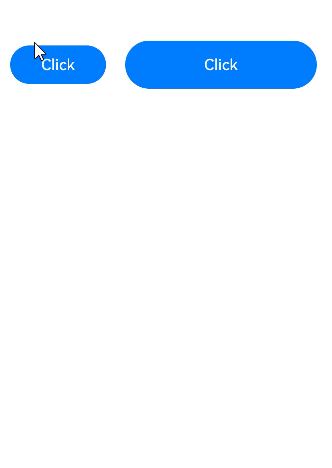

# Click Event
<!--Kit: ArkUI-->
<!--Subsystem: ArkUI-->
<!--Owner: @jiangtao92-->
<!--Designer: @piggyguy-->
<!--Tester: @songyanhong-->
<!--Adviser: @HelloCrease-->

A click event is triggered when a component is clicked.

>  **NOTE**
>
>  The event is supported since API version 7. Updates will be marked with a superscript to indicate their earliest API version.
>
>  Click events follow the [touch event](../arkui-ts/ts-universal-events-touch.md) dispatch mechanism, supporting custom behaviors like event blocking and bubbling.
>
>  For details about event dispatch, see [Event Interaction Pipeline](../../../ui/arkts-interaction-basic-principles.md#event-interaction-pipeline). For details about gesture event handling, see [Multi-level Gesture Events](../../../ui/arkts-gesture-events-multi-level-gesture.md).
>
>  When triggered via keyboard or gamepad, click events skip the [onGestureJudgeBegin](./ts-gesture-customize-judge.md#ongesturejudgebegin), [onGestureRecognizerJudgeBegin](./ts-gesture-blocking-enhancement.md#ongesturerecognizerjudgebegin), and [willClick](../arkts-apis-uicontext-uiobserver.md#onwillclick12) callbacks.

## onClick<sup>12+</sup>

onClick(event: Callback\<ClickEvent>, distanceThreshold: number): T

Called when a click event occurs.

When triggered by keyboard or gamepad input, the event's [SourceTool](ts-gesture-settings.md#sourcetool9) is **Unknown**, and [SourceType](ts-gesture-settings.md#sourcetype8) is **KEY** or **JOYSTICK**.

Compared with the original **onClick** API, this API has the **distanceThreshold** parameter that specifies the finger movement threshold for click events. If the finger's movement exceeds the set threshold, the gesture recognition will fail. The click gesture recognition will fail if finger movement exceeds this threshold.
For scenarios where there is no restriction on the finger movement distance during a click, the original API is preferred. To limit finger movement range during a click, use this new API.

**Widget capability**: This API can be used in ArkTS widgets since API version 12.

>  **NOTE**
>
>  Since API version 12, the following constraints apply when this API is used in service widgets:
>  1. Click events will not be triggered if the finger is pressed for more than 800 ms.
>  2. Click events will not be triggered if the finger moves more than 20 px after pressing down.

**Atomic service API**: This API can be used in atomic services since API version 12.

**System capability**: SystemCapability.ArkUI.ArkUI.Full

**Parameters**

| Name| Type                             | Mandatory| Description                |
| ------ | --------------------------------- | ---- | -------------------- |
| event  | Callback\<[ClickEvent](#clickevent)> | Yes  | Callback for the click event.|
| distanceThreshold  | number | Yes  | Finger movement threshold for click events. If the value specified is less than or equal to 0, it will be converted to the default value.<br>Default value: 2^31-1<br>Unit: vp<br>**NOTE**<br>If the finger movement exceeds the preset movement threshold, the gesture recognition fails. If the default threshold is used during initialization and the finger moves beyond the component's touch target, the gesture recognition fails.|

>  **NOTE**
>
>  If finger movement during a swipe exceeds the threshold but remains within the touch target boundaries upon release, the click event is still triggered.

**Return value**

| Type| Description|
| -------- | -------- |
| T | Current component.|

## onClick

onClick(event: (event: ClickEvent) => void): T

Called when a click event occurs.

When triggered by keyboard or gamepad input, the event's **SourceTool** is **Unknown**, and [SourceType](ts-gesture-settings.md#sourcetype8) is **KEY** or **JOYSTICK**.

**Widget capability**: This API can be used in ArkTS widgets since API version 9.

>  **NOTE**
>
>  Since API version 9, the following constraints apply when this API is used in service widgets:
>  1. Click events will not be triggered if the finger is pressed for more than 800 ms.
>  2. Click events will not be triggered if the finger moves more than 20 px after pressing down.

**Atomic service API**: This API can be used in atomic services since API version 11.

**System capability**: SystemCapability.ArkUI.ArkUI.Full

**Parameters**

| Name| Type                             | Mandatory| Description                |
| ------ | --------------------------------- | ---- | -------------------- |
| event  | (event: [ClickEvent](#clickevent)) => void | Yes  | Callback for the click event.|

**Return value**

| Type| Description|
| -------- | -------- |
| T | Current component.|

## ClickEvent

Inherits from [BaseEvent](ts-gesture-customize-judge.md#baseevent8).

**System capability**: SystemCapability.ArkUI.ArkUI.Full

| Name           | Type                        | Read-Only| Optional       | Description                                                    |
| ------------------- | ------------------------- | ------ | -------- | -------------------------------------------------------- |
| x                   | number                               | No| No| X coordinate of the click relative to the left edge of the clicked component.<br>Unit: vp<br>**Widget capability**: This API can be used in ArkTS widgets since API version 9.<br>**Atomic service API**: This API can be used in atomic services since API version 11.    |
| y                   | number                               | No| No| Y coordinate of the click relative to the upper left corner of the clicked component's original area.<br>Unit: vp<br>**Widget capability**: This API can be used in ArkTS widgets since API version 9.<br>**Atomic service API**: This API can be used in atomic services since API version 11.         |
| windowX<sup>10+</sup> | number                             | No| No| X coordinate of the click relative to the upper left corner of the application window.<br>Unit: vp<br>**Atomic service API**: This API can be used in atomic services since API version 11.|
| windowY<sup>10+</sup> | number                             | No| No| Y coordinate of the click relative to the upper left corner of the application window.<br>Unit: vp<br>**Atomic service API**: This API can be used in atomic services since API version 11.|
| displayX<sup>10+</sup> | number                            | No| No| X coordinate of the click relative to the upper left corner of the application screen.<br>Unit: vp<br>**Atomic service API**: This API can be used in atomic services since API version 11.|
| displayY<sup>10+</sup> | number                            | No| No| Y coordinate of the click relative to the upper left corner of the application screen.<br>Unit: vp<br>**Atomic service API**: This API can be used in atomic services since API version 11.|
| screenX<sup>(deprecated)</sup> | number                    | No| No| X coordinate of the click relative to the upper left corner of the application window.<br>Unit: vp<br>This API is deprecated since API version 10. You are advised to use **windowX** instead.|
| screenY<sup>(deprecated)</sup> | number                    | No| No| Y coordinate of the click relative to the upper left corner of the application window.<br>Unit: vp<br>This API is deprecated since API version 10. You are advised to use **windowY** instead.|
| preventDefault<sup>12+</sup>      | () => void | No| No| Blocks the default event.<br> **NOTE**<br>This API is only supported by the following components: **RichEditor** and **Hyperlink**. An exception is thrown when this API is used with unsupported components. Currently, asynchronous calls and Modifier APIs are not supported.<br>**Atomic service API**: This API can be used in atomic services since API version 12.|
| hand<sup>15+</sup> | [InteractionHand](./ts-appendix-enums.md#interactionhand15) | No| Yes| Whether the event is triggered by a left-hand or right-hand tap.<br>**Atomic service API**: This API can be used in atomic services since API version 15.|
| globalDisplayX<sup>20+</sup> | number | No| Yes| X-coordinate of the click position relative to the upper left corner of the global display.<br>Unit: vp<br>Value range: [0, +∞).<br>**Atomic service API**: This API can be used in atomic services since API version 20.|
| globalDisplayY<sup>20+</sup> | number | No| Yes| Y-coordinate of the click position relative to the upper left corner of the global display.<br>Unit: vp<br>Value range: [0, +∞).<br>**Atomic service API**: This API can be used in atomic services since API version 20.|

**Error codes**

For details about the error codes, see [Interaction Event Error Codes](../errorcode-event.md).

| ID  | Error Message|
| --------- | ------- |
| 100017       | Component does not support prevent function. |

## EventTarget<sup>8+</sup>

Defines the type of the **target** parameter in [BaseEvent](ts-gesture-customize-judge.md#baseevent8).

Represents the display area of the element object that triggers the event.

**System capability**: SystemCapability.ArkUI.ArkUI.Full

| Name  | Type                   | Read-Only| Optional| Description        |
| ---- | ------------------------- |-----|------| ---------- |
| area | [Area](ts-types.md#area8) | No| No| Area information of the target element.<br>**Widget capability**: This API can be used in ArkTS widgets since API version 9.<br>**Atomic service API**: This API can be used in atomic services since API version 11.|
| id<sup>15+</sup> | [string](ts-universal-attributes-component-id.md) | No| Yes| Custom node ID. Default value: **undefined**.<br>**Widget capability**: This API can be used in ArkTS widgets since API version 15.<br>**Atomic service API**: This API can be used in atomic services since API version 15.|

## Example

This example configures a click event for a button. When the button is clicked, it obtains relevant parameters of the click event.

```ts
// xxx.ets
@Entry
@Component
struct ClickExample {
  @State text: string = '';

  build() {
    Column() {
      Row({ space: 20 }) {
        Button('Click').width(100).height(40).id('click1')
          .onClick((event?: ClickEvent) => {
            if(event){
              this.text = 'Click Point:' + '\n  windowX:' + event.windowX + '\n  windowY:' + event.windowY
                + '\n  x:' + event.x + '\n  y:' + event.y + '\ntarget:' + '\n  component globalPos:('
                + event.target.area.globalPosition.x + ',' + event.target.area.globalPosition.y + ')\n  width:'
                + event.target.area.width + '\n  height:' + event.target.area.height + '\n  id:'+ event.target.id
                + '\ntargetDisplayId:' + event.targetDisplayId + '\ntimestamp' + event.timestamp;
              console.info('sourceType:' + event.source);
            }
          }, 20)
        Button('Click').width(200).height(50).id('click2')
          .onClick((event?: ClickEvent) => {
            if(event){
              this.text = 'Click Point:' + '\n  windowX:' + event.windowX + '\n  windowY:' + event.windowY
                + '\n  x:' + event.x + '\n  y:' + event.y + '\ntarget:' + '\n  component globalPos:('
                + event.target.area.globalPosition.x + ',' + event.target.area.globalPosition.y + ')\n  width:'
                + event.target.area.width + '\n  height:' + event.target.area.height + '\n  id:'+ event.target.id
                + '\ntargetDisplayId:' + event.targetDisplayId + '\ntimestamp' + event.timestamp;
              console.info('sourceType:' + event.source);
            }
          }, 20)
      }.margin(20)

      Text(this.text).margin(15)
    }.width('100%')
  }
}
```

