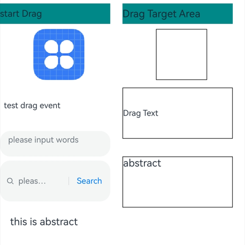
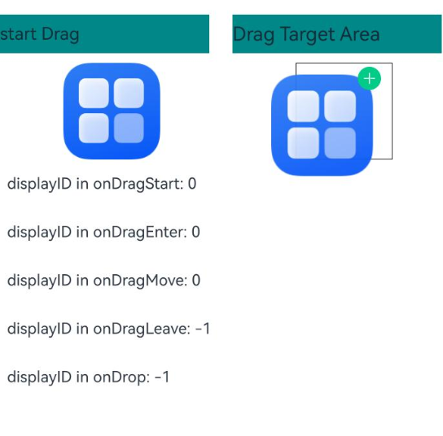
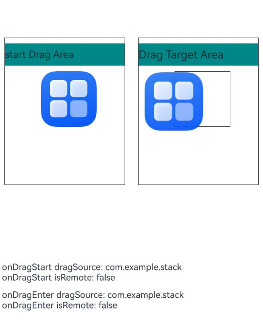
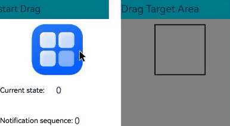

# Drag Event
<!--Kit: ArkUI-->
<!--Subsystem: ArkUI-->
<!--Owner: @yihao-lin-->
<!--Designer: @piggyguy-->
<!--Tester: @songyanhong-->
<!--Adviser: @Brilliantry_Rui-->

A drag event refers to a sequence of events triggered in the UI when a user drags an object (such as a file, component, or element). These events allow you to customize drag and drop behaviors, enabling functionalities like drag and drop operations and position adjustments.

>  **NOTE**
>
>  The initial APIs of this module are supported since API version 8. Updates will be marked with a superscript to indicate their earliest API version.
>
> The resource files preset in the application (that is, the resource files that are contained in the HAP file before the application is installed) can be dragged and dropped only within the application.

The ArkUI framework provides default drag and drop capabilities for the following components, allowing them to serve as the drag source (from which data can be dragged) or drop target (to which data can be dropped). You can also customize the drag-and-drop capability by implementing common drag-and-drop events.

- The following component supports drag actions by default: [Search](ts-basic-components-search.md), [TextInput](ts-basic-components-textinput.md), [TextArea](ts-basic-components-textarea.md), [RichEditor](ts-basic-components-richeditor.md), [Text](ts-basic-components-text.md), [Image](ts-basic-components-image.md), [Hyperlink](ts-container-hyperlink.md). You can control the default drag behavior by setting the [draggable](ts-universal-attributes-drag-drop.md#draggable) attribute.

- The following component supports drop actions by default: [Search](ts-basic-components-search.md), [TextInput](ts-basic-components-textinput.md), [TextArea](ts-basic-components-textarea.md), [RichEditor](ts-basic-components-richeditor.md). You can disable the default drag behavior by setting the [allowDrop](ts-universal-attributes-drag-drop.md#allowdrop) attribute to **null**.

Other components that support the drag-and-drop capability can correctly process the drag-and-drop capability only after you set the [draggable](ts-universal-attributes-drag-drop.md#draggable) attribute to true and implement data transmission in APIs such as [onDragStart](ts-universal-events-drag-drop.md#ondragstart).
<!--RP1--><!--RP1End-->

> **NOTE**
>
> When using the **Text** component, set [copyOption](ts-basic-components-text.md#copyoption9) to **CopyOptions.InApp** or **CopyOptions.LocalDevice**.

## onDragStart

onDragStart(event: (event: DragEvent, extraParams?: string) => CustomBuilder | DragItemInfo): T

Triggered when the component bound to the event is dragged for the first time. A drag operation is recognized only when the long press time is 500 ms or longer and the dragging distance is 10 vp or larger.

For components that provide default drag and drop capabilities, a custom **onDragStart** event, if set, is executed and:
- If a custom drag preview is returned, it is used in place of the default drag preview.
- If drag data is set, it is used in place of the default drag data.

The custom drag preview is not supported for dragging selected text in the following components: [Text](ts-basic-components-text.md), [Search](ts-basic-components-search.md), [TextInput](ts-basic-components-textinput.md), [TextArea](ts-basic-components-textarea.md), [RichEditor](ts-basic-components-richeditor.md) When **onDragStart** is used with menu preview or any component that provides default drag and drop capabilities, custom content on menu items and the preview cannot be dragged.

> **NOTE**
>
> This API cannot be called within [attributeModifier](ts-universal-attributes-attribute-modifier.md#attributemodifier).

**Atomic service API**: This API can be used in atomic services since API version 11.

**Event priority**:<br>Long press duration < 500 ms: Long press event > Drag event<br>Long-press duration ≥ 500 ms: Drag event > Long press event

**System capability**: SystemCapability.ArkUI.ArkUI.Full

**Parameters**

| Name     | Type                           | Mandatory| Description              |
| ----------- | ------------------------------- | ---- | ------------------ |
| event    | (event: [DragEvent](#dragevent7), extraParams?: string) => [CustomBuilder](ts-types.md#custombuilder8)  \|  [DragItemInfo](#dragiteminfo)  | Yes  | Callback function.<br> **NOTE**<br> The event parameter is the information about the drag event.<br> Additional information about the drag event. The value needs to be parsed into the JSON format. For details, see [extraParams](#extraparams).<br> **CustomBuilder**: component information displayed during dragging. Global builders are not supported.|

**Return value**

| Type| Description|
| -------- | -------- |
| T | Current component.|

## onDragEnter

onDragEnter(event: (event: DragEvent, extraParams?: string) => void): T

Triggered when a dragged item enters a valid drop target. This event takes effect only when a listener for the [onDrop](#ondrop) event is enabled.

**Atomic service API**: This API can be used in atomic services since API version 11.

**System capability**: SystemCapability.ArkUI.ArkUI.Full

**Parameters**

| Name     | Type                           | Mandatory| Description                          |
| ----------- | ------------------------------- | ---- | ------------------------------ |
| event    | (event: [DragEvent](#dragevent7), extraParams?: string) => void   | Yes  | Callback function.<br>**NOTE**<br> **event**: information about the drag event, including the coordinates of the item that is being dragged.<br> **extraParams**: additional information about the drag event. The value needs to be parsed into the JSON format. For details, see [extraParams](#extraparams).|

**Return value**

| Type| Description|
| -------- | -------- |
| T | Current component.|

## onDragMove

onDragMove(event: (event: DragEvent, extraParams?: string) => void): T

Triggered when a dragged item moves in a valid drop target. This event takes effect only when a listener for the [onDrop](#ondrop) event is enabled.

**Atomic service API**: This API can be used in atomic services since API version 11.

**System capability**: SystemCapability.ArkUI.ArkUI.Full

**Parameters**

| Name     | Type                           | Mandatory| Description                          |
| ----------- | ------------------------------- | ---- | ------------------------------ |
| event    | (event: [DragEvent](#dragevent7), extraParams?: string) => void   | Yes  | Callback function.<br>**NOTE**<br> **event**: information about the drag event, including the coordinates of the item that is being dragged.<br> **extraParams**: additional information about the drag event. The value needs to be parsed into the JSON format. For details, see [extraParams](#extraparams).|

**Return value**

| Type| Description|
| -------- | -------- |
| T | Current component.|

## onDragLeave

onDragLeave(event: (event: DragEvent, extraParams?: string) => void): T

Triggered when a dragged item leaves a valid drop target. This event takes effect only when a listener for the [onDrop](#ondrop) event is enabled.

**Atomic service API**: This API can be used in atomic services since API version 11.

**System capability**: SystemCapability.ArkUI.ArkUI.Full

**Parameters**

| Name     | Type                           | Mandatory| Description                          |
| ----------- | ------------------------------- | ---- | ------------------------------ |
| event    | (event: [DragEvent](#dragevent7), extraParams?: string) => void   | Yes  | Callback function.<br>**NOTE**<br> **event**: information about the drag event, including the coordinates of the item that is being dragged.<br> **extraParams**: additional information about the drag event. The value needs to be parsed into the JSON format. For details, see [extraParams](#extraparams).|

**Return value**

| Type| Description|
| -------- | -------- |
| T | Current component.|

## onDrop

onDrop(event: (event: DragEvent, extraParams?: string) => void): T

Triggered when a drag operation ends within the bounds of the component bound to this event. If **event.setResult()** is not explicitly called in the **onDrop** callback to set the drag-and-drop result, then: For supported components, the result is determined based on the actual data processed; for other components, the system considers the data as successfully received.

**Atomic service API**: This API can be used in atomic services since API version 11.

**System capability**: SystemCapability.ArkUI.ArkUI.Full

**Parameters**

| Name     | Type                           | Mandatory| Description                          |
| ----------- | ------------------------------- | ---- | ------------------------------ |
| event    | (event: [DragEvent](#dragevent7), extraParams?: string) => void   | Yes  | Callback function.<br>**NOTE**<br> **event**: information about the drag event, including the coordinates of the item that is being dragged.<br> **extraParams**: additional information about the drag event. The value needs to be parsed into the JSON format. For details, see [extraParams](#extraparams).|

**Return value**

| Type| Description|
| -------- | -------- |
| T | Current component.|

## onDrop<sup>15+</sup>

onDrop(eventCallback: OnDragEventCallback, dropOptions?: DropOptions): T

Triggered when a dragged item is dropped on a valid drop target. If you do not explicitly call **event.setResult()** in **onDrop** to set the result of the drag reception, the system handles it as follows:<br>- If the component being dragged is one that supports drop actions by default, the system's actual data processing result is used.<br>- For other components, the system assumes that the data is received successfully.

**Atomic service API**: This API can be used in atomic services since API version 15.

**System capability**: SystemCapability.ArkUI.ArkUI.Full

**Parameters**

| Name     | Type                           | Mandatory| Description                          |
| ----------- | ------------------------------- | ---- | ------------------------------ |
| eventCallback  | [OnDragEventCallback](#ondrageventcallback15)   | Yes  | Callback function.|
| dropOptions  | [DropOptions](#dropoptions15)   | No  | Parameters for the drop process.|

**Return value**

| Type| Description|
| -------- | -------- |
| T | Current component.|

## onDragEnd<sup>10+</sup>

onDragEnd(event: (event: DragEvent, extraParams?: string) => void): T

Triggered when the dragging of the component bound to the event ends.

**Atomic service API**: This API can be used in atomic services since API version 11.

**System capability**: SystemCapability.ArkUI.ArkUI.Full

**Parameters**

| Name     | Type                           | Mandatory| Description                          |
| ----------- | ------------------------------- | ---- | ------------------------------ |
| event    | (event: [DragEvent](#dragevent7), extraParams?: string) => void   | Yes  | Callback function.<br>**NOTE**<br> **event**: drag event information. The drag position coordinates are not included in onDragEnd.<br> **extraParams**: additional information about the drag event. The value needs to be parsed into the JSON format. For details, see [extraParams](#extraparams).|

**Return value**

| Type| Description|
| -------- | -------- |
| T | Current component.|

## onPreDrag<sup>12+</sup>

onPreDrag(callback: Callback\<PreDragStatus>): T

Triggered when the component enters a state prior to a drop and drop operation. This API cannot be triggered during mouse drag.

> **NOTE**
>
> This API can be called within [attributeModifier](ts-universal-attributes-attribute-modifier.md#attributemodifier) since API version 20.

**Atomic service API**: This API can be used in atomic services since API version 12.

**System capability**: SystemCapability.ArkUI.ArkUI.Full

**Parameters**

| Name     | Type                           | Mandatory| Description                          |
| ----------- | ------------------------------- | ---- | ------------------------------ |
| callback    | Callback<[PreDragStatus](#predragstatus12)>     | Yes  | Callback function.|

**Return value**

| Type| Description|
| -------- | -------- |
| T | Current component.|

## onDragSpringLoading<sup>20+</sup>

onDragSpringLoading(callback: Callback\<SpringLoadingContext\> | null, configuration?: DragSpringLoadingConfiguration): T

Triggered when a dragged item hovers over the component configured as a drag response target with hover detection capability. Only one target can become the responder at any time, and child components always have higher response priority.

For details about the hover detection triggering mechanism and usage, see [Spring Loading (Hover Detection) Support](../../../ui/arkts-common-events-drag-event.md#spring-loading-hover-detection-support).

**Atomic service API**: This API can be used in atomic services since API version 20.

**System capability**: SystemCapability.ArkUI.ArkUI.Full

**Parameters**

| Name       | Type                                     | Mandatory| Description                                          |
| :------------ | ----------------------------------------- | ---- | ---------------------------------------------- |
| callback          | Callback\<[SpringLoadingContext](#springloadingcontext20)\> \| null    | Yes  | Hover detection callback. If the value is **null**, hover detection is disabled.|
| configuration | [DragSpringLoadingConfiguration](../js-apis-arkui-dragController.md#dragspringloadingconfiguration20) | No  | Hover detection configuration. If the value is **undefined**, the default value of [DragSpringLoadingConfiguration](../js-apis-arkui-dragController.md#dragspringloadingconfiguration20) is used. |

**Return value**

| Type| Description|
| -------- | -------- |
| T | Current component.|

## DragItemInfo

**Atomic service API**: This API can be used in atomic services since API version 11.

**System capability**: SystemCapability.ArkUI.ArkUI.Full

| Name     | Type                 | Read-Only| Optional  | Description                              |
| --------- | ---------------------------------------- | ---- | ---- | --------------------------------- |
| pixelMap  | [PixelMap](../../apis-image-kit/arkts-apis-image-PixelMap.md) | No   |  Yes  |Image to be displayed during dragging.|
| builder   | [CustomBuilder](ts-types.md#custombuilder8) | No   |  Yes  |Custom component to display during dragging. If **pixelMap** is set, this parameter is ignored.<br> **NOTE**<br>Global builder definition is not supported. If the [Image](ts-basic-components-image.md) component is used in the builder, enable synchronous loading whenever possible, that is, set the [syncLoad](ts-basic-components-image.md#syncload8) attribute of the component to **true**. The builder is used only to generate the image displayed during the current dragging. Changes to the builder, if any, apply to the next dragging, but not to the current dragging.|
| extraInfo | string                                   | No   |  Yes  |Additional information about the drag item, which is used to describe the drag item.                   |

## PreviewConfiguration<sup>15+</sup>

Defines the preview image style during a drag operation.

**Atomic service API**: This API can be used in atomic services since API version 15.

**System capability**: SystemCapability.ArkUI.ArkUI.Full

| Name      | Type| Read-Only| Optional| Description                                                        |
| ---------- | ---- | ---- | ---- | ------------------------------------------------------------ |
| onlyForLifting | boolean | No   | Yes   | Whether the custom preview image is used only for lifting.<br> **NOTE**<br>The default value is **false**. **true**: The custom preview image is used only for lifting. **false**: The custom preview image is used for both lifting and dragging. When the value is set to **true**, the preview image is used only during the lifting phase of a long press. For the preview image used during the dragging phase: The [dragPreview](ts-universal-attributes-drag-drop.md#dragpreview11) attribute is ignored, and the system prioritizes the image returned in [onDragStart](ts-universal-events-drag-drop.md#ondragstart); if no image is returned in **onDragStart**, the component's snapshot is used.|
| delayCreating  | boolean | No   | Yes   | Whether the preview builder is loaded at the time of setting.<br>The default value is **false**. The value **true** means that the preview builder is loaded at the time of setting, and **false** means the opposite.|

## extraParams

  Provides additional information required for dragging an item.

  **extraParams** is a string converted from a JSON object. You can obtain the following attributes using the JSON object converted from **Json.parse**.

| Name         | Type  | Description                                      |
| ------------- | ------ | ---------------------------------------- |
| selectedIndex | number | Index of the dragged item in the parent container. The value of **selectedindex** starts from **0**.<br>This parameter takes effect only in the drag event of the **ListItem** component.|
| insertIndex   | number | Index of the element into which the dragged item is dropped in the **List** component. The value of **insertIndex** starts from **0**.<br>This parameter takes effect only in the drag event of the **List** component.|

## DragEvent<sup>7+</sup>

**System capability**: SystemCapability.ArkUI.ArkUI.Full

### Properties

**Atomic service API**: This API can be used in atomic services since API version 11.

**System capability**: SystemCapability.ArkUI.ArkUI.Full

| Name    | Type | Read-Only| Optional| Description            |
| ------ | ------ | ----- | ---- | ------- |
| useCustomDropAnimation<sup>10+</sup> | boolean | No| No|Whether to disable the default drop animation when the dragging ends.<br>If this parameter is set to **true**, the default drop animation is disabled, and the custom one is used.<br>If this parameter is not set or is set to false, the default drop animation takes effect. When [setResult](#setresult10) is set to DRAG_SUCCESSFUL, the drop animation is a zoom-out animation. When [setResult](#setresult10) is not set to DRAG_SUCCESSFUL, the drop animation is a zoom-in animation.<br>When the default drop animation is not disabled, avoid implementing custom animations to prevent conflicts.<br>Default value: **false**.|
|dragBehavior<sup>10+</sup> | [DragBehavior](#dragbehavior10) | No| No|Copy or paste mode.<br>Default value: DragBehavior.COPY|

### setData<sup>10+</sup>

setData(unifiedData: UnifiedData): void

Sets data for drag and drop in DragEvent.

**Atomic service API**: This API can be used in atomic services since API version 11.

**System capability**: SystemCapability.ArkUI.ArkUI.Full

**Parameters**

| Name     | Type                                                        | Mandatory| Description            |
| ----------- | ------------------------------------------------------------ | ---- | ---------------- |
| unifiedData | [UnifiedData](#unifieddata10) | Yes  | Drag-related data.|

### getData<sup>10+</sup>

getData(): UnifiedData

Obtains drag-related data.

**Atomic service API**: This API can be used in atomic services since API version 11.

**System capability**: SystemCapability.ArkUI.ArkUI.Full

**Return value**

| Type                                                        | Description                                                        |
| ------------------------------------------------------------ | ------------------------------------------------------------ |
| [UnifiedData](../../apis-arkdata/js-apis-data-unifiedDataChannel.md#unifieddata) | Drag-related data. For details about the data obtaining result, see the error code description.|

**Error codes**

For details about the error codes, see [Drag Event Error Codes](../errorcode-drag-event.md).

| ID  | Error Message|
| --------- | ------- |
| 190001    | Data not found.|
| 190002    | Data error. |

### getSummary<sup>10+</sup>

getSummary(): Summary

Obtains the drag data summary, including the data type and size. In the delayed drag scenario, only the data type can be obtained.

**Atomic service API**: This API can be used in atomic services since API version 11.

**System capability**: SystemCapability.ArkUI.ArkUI.Full

**Return value**

| Type                                                        | Description                                 |
| ------------------------------------------------------------ | ------------------------------------- |
| [Summary](#summary10) | Summary of drag data.|

### setResult<sup>10+</sup>

setResult(dragResult: DragResult): void

Sets the drag result in a drag event.

**Atomic service API**: This API can be used in atomic services since API version 11.

**System capability**: SystemCapability.ArkUI.ArkUI.Full

**Parameters**

| Name    | Type                               | Mandatory| Description      |
| ---------- | ----------------------------------- | ---- | ---------- |
| dragResult | [DragResult](#dragresult10) | Yes  | Drag result.|

### getResult<sup>10+</sup>

getResult(): DragResult

Obtains the drag result.

**Atomic service API**: This API can be used in atomic services since API version 11.

**System capability**: SystemCapability.ArkUI.ArkUI.Full

**Return value**

| Type                               | Description                         |
| ----------------------------------- | ----------------------------- |
| [DragResult](#dragresult10) | Drag result.|

### getPreviewRect<sup>10+</sup>

getPreviewRect(): Rectangle

Obtains the position of the drag preview relative to the current window and the preview size.

**Atomic service API**: This API can be used in atomic services since API version 11.

**System capability**: SystemCapability.ArkUI.ArkUI.Full

**Return value**

| Type                                                        | Description                                                        |
| ------------------------------------------------------------ | ------------------------------------------------------------ |
| [Rectangle](ts-universal-attributes-touch-target.md#rectangle) | Position of the drag preview relative to the current window and the preview size, in vp. x and y indicate the window coordinates of the upper left corner of the preview, and width and height indicate the preview size.|

### getVelocityX<sup>10+</sup>

getVelocityX(): number

Obtains the dragging velocity along the x-axis.

**Atomic service API**: This API can be used in atomic services since API version 11.

**System capability**: SystemCapability.ArkUI.ArkUI.Full

**Return value**

| Type  | Description                                                        |
| ------ | ------------------------------------------------------------ |
| number | Dragging velocity along the x-axis. The origin of the coordinate axis is the upper left corner of the screen. The unit is vp. The velocity is positive if the movement is from left to right, and it is negative if the movement is from right to left.|

### getVelocityY<sup>10+</sup>

getVelocityY(): number

Obtains the dragging velocity along the y-axis.

**Atomic service API**: This API can be used in atomic services since API version 11.

**System capability**: SystemCapability.ArkUI.ArkUI.Full

**Return value**

| Type  | Description                                                        |
| ------ | ------------------------------------------------------------ |
| number | Dragging velocity along the y-axis. The origin of the coordinate axis is the upper left corner of the screen. The unit is vp. The velocity is positive if the movement is from top to bottom, and it is negative if the movement is from bottom to top.|

### getVelocity<sup>10+</sup>

getVelocity(): number

Obtains the dragging velocity along the main axis.

**Atomic service API**: This API can be used in atomic services since API version 11.

**System capability**: SystemCapability.ArkUI.ArkUI.Full

**Return value**

| Type  | Description                                                        |
| ------ | ------------------------------------------------------------ |
| number | Dragging velocity along the main axis. The value is the arithmetic square root of the sum of the squares of the speeds in the x and y directions, in vp.|

### getWindowX<sup>10+</sup>

getWindowX(): number

Obtains the x-coordinate of the drag position relative to the upper left corner of the window.

**Atomic service API**: This API can be used in atomic services since API version 11.

**System capability**: SystemCapability.ArkUI.ArkUI.Full

**Return value**

| Type  | Description                                           |
| ------ | ----------------------------------------------- |
| number | X-coordinate of the drag position relative to the upper left corner of the window, in vp.|

### getWindowY<sup>10+</sup>

getWindowY(): number

Obtains the y-coordinate of the drag position relative to the upper left corner of the window.

**Atomic service API**: This API can be used in atomic services since API version 11.

**System capability**: SystemCapability.ArkUI.ArkUI.Full

**Return value**

| Type  | Description                                           |
| ------ | ----------------------------------------------- |
| number | Y-coordinate of the drag position relative to the upper left corner of the window, in vp.|

### getDisplayX<sup>10+</sup>

getDisplayX(): number

Obtains the x-coordinate of the drag position relative to the upper left corner of the display.

**Atomic service API**: This API can be used in atomic services since API version 11.

**System capability**: SystemCapability.ArkUI.ArkUI.Full

**Return value**

| Type  | Description                                           |
| ------ | ----------------------------------------------- |
| number | X-coordinate of the drag position relative to the upper left corner of the display, in vp.|

### getDisplayY<sup>10+</sup>

getDisplayY(): number

Obtains the y-coordinate of the drag position relative to the upper left corner of the display.

**Atomic service API**: This API can be used in atomic services since API version 11.

**System capability**: SystemCapability.ArkUI.ArkUI.Full

**Return value**

| Type  | Description                                           |
| ------ | ----------------------------------------------- |
| number | Y-coordinate of the drag position relative to the upper left corner of the display, in vp.|

### getModifierKeyState<sup>12+</sup>

getModifierKeyState?(keys: Array<string\>): boolean

Obtains the pressed status of modifier keys.

**Atomic service API**: This API can be used in atomic services since API version 13.

**System capability**: SystemCapability.ArkUI.ArkUI.Full

**Parameters**

| Name| Type               | Mandatory| Description                                                        |
| ------ | ------------------- | ---- | ------------------------------------------------------------ |
| keys   | Array&lt;string&gt; | Yes  | Obtains the pressed status of modifier keys. For details about the error message, see the following error codes. The following modifier keys are supported: 'Ctrl'\| 'Alt' \| 'Shift'.<br>**NOTE**<br>This API is not supported in stylus scenarios.|

**Error codes**

For details about the error codes, see [Universal Error Codes](../../errorcode-universal.md).

| ID  | Error Message|
| --------- | ------- |
| 401       | Parameter error. Possible causes: 1. Incorrect parameter types. 2. Parameter verification failed. |

**Return value**

| Type   | Description                                                 |
| ------- | ----------------------------------------------------- |
| boolean | Whether the specified modifier keys are pressed. Returns **true** if the specified modifier keys are pressed; returns **false** otherwise.|

### startDataLoading<sup>15+</sup>

startDataLoading(options: DataSyncOptions): string

Asynchronously obtains drag data and notifies you of the current data synchronization progress. This API is only supported during the **onDrop** phase.

**Atomic service API**: This API can be used in atomic services since API version 15.

**System capability**: SystemCapability.ArkUI.ArkUI.Full

**Parameters**

| Name | Type                                 | Mandatory| Description                                                        |
| ------- | ------------------------------------- | ---- | ------------------------------------------------------------ |
| options | [DataSyncOptions](#datasyncoptions15) | Yes| Parameters for obtaining drag data, including the target path, file conflict options, and progress bar type. You can use the [cancelDataLoading](../arkts-apis-uicontext-dragcontroller.md#canceldataloading15) API to cancel data loading during data transmission.|

**Error codes**

For details about the error codes, see [Universal Error Codes](../../errorcode-universal.md) and [Drag Event Error Codes](../errorcode-drag-event.md).

| ID  | Error Message|
| --------- | ------- |
| 401       | Parameter error. |
| 190003    | Operation not allowed for current phase. |

**Return value**

| Type  | Description                              |
| ------ | ---------------------------------- |
| string | Identifier for the drag data. It is used to distinguish between different drag operations.|

### executeDropAnimation<sup>18+</sup>

executeDropAnimation(customDropAnimation: Callback\<void\>): void

Sets the execution function of the custom drop animation. This parameter is valid only when useCustomDropAnimation is set to true.

**Atomic service API**: This API can be used in atomic services since API version 18.

**System capability**: SystemCapability.ArkUI.ArkUI.Full

**Parameters**

| Name   | Type | Mandatory| Description     |
| ------ | ------ | --- | --------- |
| customDropAnimation | [Callback\<void\>](../../../reference/apis-basic-services-kit/js-apis-base.md#callback)  | Yes|Implement the custom drop animation in this callback function.<br> **NOTE**<br>1. This API is valid only in the onDrop callback.<br> 2. Before using this API, set useCustomDropAnimation to true. Otherwise, this API does not take effect.<br> 3. Do not implement logic unrelated to the animation in the animation callback to avoid affecting performance.|

### getDisplayId<sup>20+</sup>

getDisplayId(): number

Obtains the ID of the screen where the current drag event occurs. This API cannot be used in the onDragEnd phase.

**Atomic service API**: This API can be used in atomic services since API version 20.

**System capability**: SystemCapability.ArkUI.ArkUI.Full

**Return value**

| Type  | Description                            |
| ------ | -------------------------------- |
| number | ID of the screen where the current drag event occurs.|

### getDragSource<sup>20+</sup>

getDragSource(): string

Obtains the package name of the drag source application.

**Atomic service API**: This API can be used in atomic services since API version 20.

**System capability**: SystemCapability.ArkUI.ArkUI.Full

**Return value**

| Type  | Description          |
| ------ | -------------- |
| string | Package name of the drag source application.|

### isRemote<sup>20+</sup>

isRemote(): boolean

Checks whether the drag operation is cross-device.

**Atomic service API**: This API can be used in atomic services since API version 20.

**System capability**: SystemCapability.ArkUI.ArkUI.Full

**Return value**

| Type   | Description                                                        |
| ------- | ------------------------------------------------------------ |
| boolean | Whether the drag operation is cross-device. Returns **true** for cross-device drag operations; returns **false** otherwise.|

### setDataLoadParams<sup>20+</sup>

setDataLoadParams(dataLoadParams: DataLoadParams): void

Sets the parameters for deferred data loading from the drag source. This API provides data loading parameters to the system instead of directly providing complete data objects. When the user drops data on the target application, the system will use these parameters to request the actual data from the drag source. If this API is used together with [setData](#setdata10), the last called API takes precedence. This API takes effect only in the [onDragStart](ts-universal-events-drag-drop.md#ondragstart) callback.

**Atomic service API**: This API can be used in atomic services since API version 20.

**System capability**: SystemCapability.ArkUI.ArkUI.Full

**Parameters**

| Name  | Type  | Mandatory   | Description                                                        |
| -------| -------| ------- | ------------------------------------------------------------ |
| dataLoadParams | [DataLoadParams](#dataloadparams20) |  Yes| Data loading parameters used during a drop operation.|

### getX<sup>(deprecated)</sup>

getX(): number

Obtains the x-coordinate of the drag position relative to the upper left corner of the window, in vp. This API is deprecated since API version 10. You are advised to use [getWindowX()](#getwindowx10) instead.

**System capability**: SystemCapability.ArkUI.ArkUI.Full

**Return value**

| Type  | Description                                               |
| ------ | --------------------------------------------------- |
| number | X-coordinate of the drag position relative to the upper left corner of the window.<br>Unit: vp.|

### getY<sup>(deprecated)</sup>

getY(): number

Obtains the y-coordinate of the drag position relative to the upper left corner of the window, in vp. This API is deprecated since API version 10. You are advised to use [getWindowY()](#getwindowy10) instead.

**System capability**: SystemCapability.ArkUI.ArkUI.Full

**Return value**

| Type  | Description                                               |
| ------ | --------------------------------------------------- |
| number | Y-coordinate of the drag position relative to the upper left corner of the window.<br>Unit: vp.|

### getGlobalDisplayX<sup>20+</sup>

getGlobalDisplayX(): number

Obtains the x-coordinate of the drag position relative to the upper left corner of the global display.

**Atomic service API**: This API can be used in atomic services since API version 20.

**System capability**: SystemCapability.ArkUI.ArkUI.Full

**Return value**

| Type  | Description                                               |
| ------ | --------------------------------------------------- |
| number | X-coordinate of the drag position relative to the upper left corner of the global display.<br>Unit: vp. Value range: [0, +∞)|

### getGlobalDisplayY<sup>20+</sup>

getGlobalDisplayY(): number

Obtains the y-coordinate of the drag position relative to the upper left corner of the global display.

**Atomic service API**: This API can be used in atomic services since API version 20.

**System capability**: SystemCapability.ArkUI.ArkUI.Full

**Return value**

| Type  | Description                                               |
| ------ | --------------------------------------------------- |
| number | Y-coordinate of the drag position relative to the upper left corner of the global display.<br>Unit: vp. Value range: [0, +∞)|

## DragResult<sup>10+</sup>

**Atomic service API**: This API can be used in atomic services since API version 11.

**System capability**: SystemCapability.ArkUI.ArkUI.Full

| Name  | Value| Description|
| ----- | -- | --------------- |
| DRAG_SUCCESSFUL | 0 |The drag is successful. This parameter is used in [onDrop](#ondrop).|
| DRAG_FAILED | 1 |The drag fails. This parameter is used in [onDrop](#ondrop).|
| DRAG_CANCELED | 2 |The drag is canceled. This parameter is used in [onDrop](#ondrop).|
| DROP_ENABLED | 3 |The component can be dropped. This parameter is used in [onDragEnter](#ondragenter), [onDragMove](#ondragmove), and [onDragLeave](#ondragleave).|
| DROP_DISABLED | 4 |The component cannot be dropped. This parameter is used in [onDragEnter](#ondragenter), [onDragMove](#ondragmove), and [onDragLeave](#ondragleave).|

## DragBehavior<sup>10+</sup>

Describes the drag behavior. When [DragResult](#dragresult10) is set to **DROP_ENABLED**, you can define **DragBehavior** as either **COPY** or **MOVE**. When DragBehavior is set to COPY, the corner mark of the dragged object displays a plus sign (+). When DragBehavior is set to MOVE, the corner mark of the dragged object does not display a plus sign (+). **DragBehavior** is used to indicate the intended way of handling data (either copy or move) without governing the actual data processing. This behavior is reported back to the drag source through **onDragEnd**, enabling the drag initiator to distinguish whether the operation results in a copy or a move of the data.

**Atomic service API**: This API can be used in atomic services since API version 11.

**System capability**: SystemCapability.ArkUI.ArkUI.Full

| Name| Value| Description|
| ----- | -- | ----------------- |
| COPY | 0 |The data is handled as a copy operation.|
| MOVE| 1 |The data is handled as a move operation, effectively cutting it from its original location.|

## PreDragStatus<sup>12+</sup>

**System capability**: SystemCapability.ArkUI.ArkUI.Full

| Name| Value| Description|
| ---- | - | ----------------- |
| ACTION_DETECTING_STATUS | 0 | A drag gesture is being detected. (Triggered when the component is long pressed for 50 ms.)<br>**Atomic service API**: This API can be used in atomic services since API version 12.|
| READY_TO_TRIGGER_DRAG_ACTION | 1 | The component is ready to be dragged. (Triggered when the component is long pressed for 500 ms.)<br>**Atomic service API**: This API can be used in atomic services since API version 12.|
| PREVIEW_LIFT_STARTED | 2 | A lift animation is started. (Triggered when the component is long pressed for 800 ms.)<br>**Atomic service API**: This API can be used in atomic services since API version 12.|
| PREVIEW_LIFT_FINISHED | 3 | A lift animation is finished. (Triggered at the completion of the lift animation.)<br>**Atomic service API**: This API can be used in atomic services since API version 12.|
| PREVIEW_LANDING_STARTED | 4 | A drop animation is started. (Triggered when the drop animation starts.)<br>**Atomic service API**: This API can be used in atomic services since API version 12.|
| PREVIEW_LANDING_FINISHED | 5 | A drop animation is finished. (Triggered when the drop animation ends.)<br>**Atomic service API**: This API can be used in atomic services since API version 12.|
| ACTION_CANCELED_BEFORE_DRAG | 6 | A drop animation is terminated. (Triggered when the finger is lifted off the screen after the component enters the **READY_TO_TRIGGER_DRAG_ACTION** state.)<br>**Atomic service API**: This API can be used in atomic services since API version 12.|
| PREPARING_FOR_DRAG_DETECTION<sup>18+</sup>  | 7 | The component is ready to be dragged. (Triggered when the component is long pressed for 350 ms.)<br>**Atomic service API**: This API can be used in atomic services since API version 18.|

## UnifiedData<sup>10+</sup>

type UnifiedData = UnifiedData

Defines drag-related data.

**Atomic service API**: This API can be used in atomic services since API version 11.

**System capability**: SystemCapability.ArkUI.ArkUI.Full

| Type| Description|
| ----- | ----------------- |
| [UnifiedData](../../apis-arkdata/js-apis-data-unifiedDataChannel.md#unifieddata) |  Drag-related data.|

## Summary<sup>10+</sup>

type Summary = Summary

Provides a summary of drag-related data.

**Atomic service API**: This API can be used in atomic services since API version 11.

**System capability**: SystemCapability.ArkUI.ArkUI.Full

| Type| Description|
| ----- | ----------------- |
| [Summary](../../apis-arkdata/js-apis-data-unifiedDataChannel.md#summary) | Summary of drag-related data.|

## DataLoadParams<sup>20+</sup>

type DataLoadParams = DataLoadParams

Defines the data loading parameters used during a drop operation.

**Atomic service API**: This API can be used in atomic services since API version 20.

**System capability**: SystemCapability.ArkUI.ArkUI.Full

| Type| Description|
| ----- | ----------------- |
| [DataLoadParams](../../apis-arkdata/js-apis-data-unifiedDataChannel.md#dataloadparams20) | Data loading parameters used during a drop operation.|

## DataSyncOptions<sup>15+</sup>

type DataSyncOptions = GetDataParams

Defines the input parameter object for **startDataLoading**.

**Atomic service API**: This API can be used in atomic services since API version 15.

**System capability**: SystemCapability.ArkUI.ArkUI.Full

| Type| Description|
| ----- | ----------------- |
| [GetDataParams](../../apis-arkdata/js-apis-data-unifiedDataChannel.md#getdataparams15) | Parameters for obtaining data from UDMF, including target path, file conflict options, progress indicator type, and other relevant settings.|

## OnDragEventCallback<sup>15+</sup>

type OnDragEventCallback = (event: DragEvent, extraParams?: string) => void

Defines a callback for drag events.

**Atomic service API**: This API can be used in atomic services since API version 15.

**System capability**: SystemCapability.ArkUI.ArkUI.Full

**Parameters**

| Name| Type|Mandatory|Description|
| ----- | ----------------- | ----- | ----- |
| event | [DragEvent](#dragevent7)| Yes|  Information about the drag event, including the coordinates of the item that is being dragged.|
| extraParams| string |No| Additional information about the drag event. The value needs to be parsed into the JSON format. For details, see [extraParams](#extraparams).|

## DropOptions<sup>15+</sup>

Provides parameters for the drop process.

**Atomic service API**: This API can be used in atomic services since API version 15.

**System capability**: SystemCapability.ArkUI.ArkUI.Full

| Name    | Type | Read-Only| Optional| Description          |
| ------ | ------ | ---------------- | ------ | ------ |
| disableDataPrefetch | boolean  | No | Yes | Whether to disable data prefetching for the drop and drop operation. The value **true** means to disable data prefetching for the drop and drop operation, and **false** means the opposite. Default value: **false**.<br>**NOTE**<br> When [startDataLoading] (#startdataloading15) is used to obtain data, set this parameter to true to prevent data from being obtained in advance during drag.|

## DragSpringLoadingConfiguration<sup>20+</sup>

type DragSpringLoadingConfiguration = DragSpringLoadingConfiguration

Defines the configuration parameters for drag hover detection.

**Atomic service API**: This API can be used in atomic services since API version 20.

**System capability**: SystemCapability.ArkUI.ArkUI.Full

| Type| Description|
| ----- | ----------------- |
| [DragSpringLoadingConfiguration](../js-apis-arkui-dragController.md#dragspringloadingconfiguration20) | Defines the configuration parameters for drag hover detection.|

## SpringLoadingContext<sup>20+</sup>

type SpringLoadingContext = SpringLoadingContext

Defines the callback context information, which is passed to the application in the hover detection callback to allow the application to access the drag status.

**Atomic service API**: This API can be used in atomic services since API version 20.

**System capability**: SystemCapability.ArkUI.ArkUI.Full

| Type| Description|
| ----- | ----------------- |
| [SpringLoadingContext](../js-apis-arkui-dragController.md#springloadingcontext20) | Defines the callback context information, which is passed to the application in the hover detection callback so that the application can access the drag status.|

## Example

### Example 1: Setting Draggable and Droppable Areas

This example demonstrates the setup for draggable and droppable areas for certain components, such as **Image** and **Text**.

```ts
// xxx.ets
import { unifiedDataChannel, uniformTypeDescriptor } from '@kit.ArkData';
import { BusinessError } from '@kit.BasicServicesKit';

@Entry
@Component
struct Index {
  @State targetImage: string = '';
  @State targetText: string = 'Drag Text';
  @State imageWidth: number = 100;
  @State imageHeight: number = 100;
  @State imgState: Visibility = Visibility.Visible;
  @State abstractContent: string = "abstract";
  @State textContent: string = "";
  @State backGroundColor: Color = Color.Transparent;

  @Builder
  pixelMapBuilder() {
    Column() {
      Image($r('app.media.icon'))
        .width(120)
        .height(120)
        .backgroundColor(Color.Yellow)
    }
  }

  getDataFromUdmfRetry(event: DragEvent, callback: (data: DragEvent) => void) {
    try {
      let data: UnifiedData = event.getData();
      if (!data) {
        return false;
      }
      let records: Array<unifiedDataChannel.UnifiedRecord> = data.getRecords();
      if (!records || records.length <= 0) {
        return false;
      }
      callback(event);
      return true;
    } catch (e) {
      console.error("getData failed, code = " + (e as BusinessError).code + ", message = " + (e as BusinessError).message);
      return false;
    }
  }

  getDataFromUdmf(event: DragEvent, callback: (data: DragEvent) => void) {
    if (this.getDataFromUdmfRetry(event, callback)) {
      return;
    }
    setTimeout(() => {
      this.getDataFromUdmfRetry(event, callback);
    }, 1500);
  }

  private PreDragChange(preDragStatus: PreDragStatus): void {
    if (preDragStatus == PreDragStatus.READY_TO_TRIGGER_DRAG_ACTION) {
      this.backGroundColor = Color.Red;
    } else if (preDragStatus == PreDragStatus.ACTION_CANCELED_BEFORE_DRAG
      || preDragStatus == PreDragStatus.PREVIEW_LANDING_FINISHED) {
      this.backGroundColor = Color.Blue;
    }
  }

  build() {
    Row() {
      Column() {
        Text('start Drag')
          .fontSize(18)
          .width('100%')
          .height(40)
          .margin(10)
          .backgroundColor('#008888')
        Image($r('app.media.icon'))
          .width(100)
          .height(100)
          .draggable(true)
          .margin({ left: 15 })
          .visibility(this.imgState)
          .onDragEnd((event) => {
            // The result value obtained from onDragEnd is set in onDrop of the drop target.
            if (event.getResult() === DragResult.DRAG_SUCCESSFUL) {
              this.getUIContext().getPromptAction().showToast({ duration: 100, message: 'Drag Success' });
            } else if (event.getResult() === DragResult.DRAG_FAILED) {
              this.getUIContext().getPromptAction().showToast({ duration: 100, message: 'Drag failed' });
            }
          })
        Text('test drag event')
          .width('100%')
          .height(100)
          .draggable(true)
          .margin({ left: 15 })
          .copyOption(CopyOptions.InApp)
        TextArea({ placeholder: 'please input words' })
          .copyOption(CopyOptions.InApp)
          .width('100%')
          .height(50)
          .draggable(true)
        Search({ placeholder: 'please input you word' })
          .searchButton('Search')
          .width('100%')
          .height(80)
          .textFont({ size: 20 })

        Column() {
          Text('this is abstract')
            .fontSize(20)
            .width('100%')
        }.margin({ left: 40, top: 20 })
        .width('100%')
        .height(100)
        .onDragStart((event) => {
          this.backGroundColor = Color.Transparent;
          let data: unifiedDataChannel.PlainText = new unifiedDataChannel.PlainText();
          data.abstract = 'this is abstract';
          data.textContent = 'this is content this is content';
          (event as DragEvent).setData(new unifiedDataChannel.UnifiedData(data));
        })
        .onPreDrag((status: PreDragStatus) => {
          this.PreDragChange(status);
        })
        .backgroundColor(this.backGroundColor)
      }.width('45%')
      .height('100%')

      Column() {
        Text('Drag Target Area')
          .fontSize(20)
          .width('100%')
          .height(40)
          .margin(10)
          .backgroundColor('#008888')
        Image(this.targetImage)
          .width(this.imageWidth)
          .height(this.imageHeight)
          .draggable(true)
          .margin({ left: 15 })
          .border({ color: Color.Black, width: 1 })
          .allowDrop([uniformTypeDescriptor.UniformDataType.IMAGE])
          .onDrop((dragEvent?: DragEvent) => {
            this.getDataFromUdmf((dragEvent as DragEvent), (event: DragEvent) => {
              let records: Array<unifiedDataChannel.UnifiedRecord> = event.getData().getRecords();
              let rect: Rectangle = event.getPreviewRect();
              this.imageWidth = Number(rect.width);
              this.imageHeight = Number(rect.height);
              this.targetImage = (records[0] as unifiedDataChannel.Image).imageUri;
              event.useCustomDropAnimation = false;
              this.imgState = Visibility.None;
              // If result is explicitly set to successful, the value is passed in to onDragEnd of the drag source.
              event.setResult(DragResult.DRAG_SUCCESSFUL);
            })
          })

        Text(this.targetText)
          .width('100%')
          .height(100)
          .border({ color: Color.Black, width: 1 })
          .margin(15)
          .allowDrop([uniformTypeDescriptor.UniformDataType.PLAIN_TEXT])
          .onDrop((dragEvent?: DragEvent) => {
            this.getDataFromUdmf((dragEvent as DragEvent), (event: DragEvent) => {
              let records: Array<unifiedDataChannel.UnifiedRecord> = event.getData().getRecords();
              let plainText: unifiedDataChannel.PlainText = records[0] as unifiedDataChannel.PlainText;
              this.targetText = plainText.textContent;
            })
          })

        Column() {
          Text(this.abstractContent).fontSize(20).width('100%')
          Text(this.textContent).fontSize(15).width('100%')
        }
        .width('100%')
        .height(100)
        .margin(20)
        .border({ color: Color.Black, width: 1 })
        .allowDrop([uniformTypeDescriptor.UniformDataType.PLAIN_TEXT])
        .onDrop((dragEvent?: DragEvent) => {
          this.getDataFromUdmf((dragEvent as DragEvent), (event: DragEvent) => {
            let records: Array<unifiedDataChannel.UnifiedRecord> = event.getData().getRecords();
            let plainText: unifiedDataChannel.PlainText = records[0] as unifiedDataChannel.PlainText;
            this.abstractContent = plainText.abstract as string;
            this.textContent = plainText.textContent;
          })
        })
      }.width('45%')
      .height('100%')
      .margin({ left: '5%' })
    }
    .height('100%')
  }
}
```
 

### Example 2: Implementing a Custom Drop Animation

From API version 18, this example demonstrates how to implement a drop animation by customizing the [executeDropAnimation](#executedropanimation18) API.
```ts
import { unifiedDataChannel, uniformTypeDescriptor } from '@kit.ArkData';

@Entry
@Component
struct DropAnimationExample {
  @State targetImage: string = '';
  @State targetText: string = 'Drag Text';
  @State hyperLinkText: string = 'HyperLink';
  @State hyperLinkContent: string = 'HyperLink';
  @State imageWidth: number = 100;
  @State imageHeight: number = 100;
  @State imgState: Visibility = Visibility.Visible;
  @State videoSrc: string = 'resource://RAWFILE/02.mp4';
  @State abstractContent: string = "abstract";
  @State textContent: string = "";

  customDropAnimation =
    () => {
      this.getUIContext().animateTo({ duration: 1000, curve: Curve.EaseOut, playMode: PlayMode.Normal }, () => {
        this.imageWidth = 200;
        this.imageHeight = 200;
        this.imgState = Visibility.None;
      })
    }

  build() {
    Row() {
      Column() {
        Image($r('app.media.app_icon'))
          .width(100)
          .height(100)
          .draggable(true)
          .margin({ left: 15 ,top: 40})
          .visibility(this.imgState)
          .onDragStart((event) => {
          })
          .onDragEnd((event) => {
            if (event.getResult() === DragResult.DRAG_SUCCESSFUL) {
              console.info('Drag Success');
            } else if (event.getResult() === DragResult.DRAG_FAILED) {
              console.error('Drag failed');
            }
          })
      }.width('45%')
      .height('100%')
      Column() {
        Text('Drag Target Area')
          .fontSize(20)
          .width(180)
          .height(40)
          .textAlign(TextAlign.Center)
          .margin(10)
          .backgroundColor('rgb(240,250,255)')
        Column() {
          Image(this.targetImage)
            .width(this.imageWidth)
            .height(this.imageHeight)
        }
        .draggable(true)
        .margin({ left: 15 })
        .border({ color: Color.Black, width: 1 })
        .allowDrop([uniformTypeDescriptor.UniformDataType.IMAGE])
        .onDrop((dragEvent: DragEvent) => {
          let records: Array<unifiedDataChannel.UnifiedRecord> = dragEvent.getData().getRecords();
          let rect: Rectangle = dragEvent.getPreviewRect();
          this.imageWidth = Number(rect.width);
          this.imageHeight = Number(rect.height);
          this.targetImage = (records[0] as unifiedDataChannel.Image).imageUri;
          dragEvent.useCustomDropAnimation = true;
          dragEvent.executeDropAnimation(this.customDropAnimation)
        })
        .width(this.imageWidth)
        .height(this.imageHeight)
      }.width('45%')
      .height('100%')
      .margin({ left: '5%' })
    }
    .height('100%')
  }
}
```


### Example 3: Obtaining Data Asynchronously Through Drag-and-Drop

From API version 15, this example shows how to obtain data asynchronously through drag-and-drop by using [startDataLoading](#startdataloading15).

```ts
import { unifiedDataChannel, uniformTypeDescriptor } from '@kit.ArkData';
import { fileUri, fileIo as fs } from '@kit.CoreFileKit';
import { common } from '@kit.AbilityKit';

@Entry
@Component
struct ImageExample {
  @State uri: string = "";
  @State blockArr: string[] = [];
  uiContext = this.getUIContext();
  udKey: string = '';

  build() {
    Column() {
      Text('Image drag and drop')
        .fontSize('30dp')
      Flex({ direction: FlexDirection.Row, alignItems: ItemAlign.Center, justifyContent: FlexAlign.SpaceAround }) {
        Image($r('app.media.startIcon'))
          .width(100)
          .height(100)
          .border({ width: 1 })
          .draggable(true)
          .onDragStart((event:DragEvent) => {
            const context: Context|undefined = this.uiContext.getHostContext();
            if(context) {
              let data = context.resourceManager.getMediaContentSync($r('app.media.startIcon').id, 120);
              const arrayBuffer: ArrayBuffer = data.buffer.slice(data.byteOffset, data.byteLength + data.byteOffset);
              let filePath = context.filesDir + '/test.png';
              let file = fs.openSync(filePath, fs.OpenMode.CREATE | fs.OpenMode.READ_WRITE);
              fs.writeSync(file.fd, arrayBuffer);
              // Obtain the image URI.
              let uri = fileUri.getUriFromPath(filePath);
              let image: unifiedDataChannel.Image = new unifiedDataChannel.Image();
              image.imageUri = uri;
              let dragData: unifiedDataChannel.UnifiedData = new unifiedDataChannel.UnifiedData(image);
              (event as DragEvent).setData(dragData);
            }
          })
      }
      .margin({ bottom: 20 })
      Row() {
        Column(){
          Text('Valid drop target')
            .fontSize('15dp')
            .height('10%')
          List(){
            ForEach(this.blockArr, (item:string, index) => {
              ListItem() {
                Image(item)
                  .width(100)
                  .height(100)
                  .border({width: 1})
              }
              .margin({ left: 30 , top : 30})
            }, (item:string) => item)
          }
          .border({width: 1})
          .height('90%')
          .width('100%')
          .onDrop((event?: DragEvent, extraParams?: string) => {
            console.info("enter onDrop")
            let context = this.uiContext.getHostContext() as common.UIAbilityContext;
            let pathDir: string = context.distributedFilesDir;
            let destUri = fileUri.getUriFromPath(pathDir);
            let progressListener: unifiedDataChannel.DataProgressListener = (progress: unifiedDataChannel.ProgressInfo, dragData: UnifiedData|null) => {
              if(dragData != null) {
                let arr:Array<unifiedDataChannel.UnifiedRecord> = dragData.getRecords();
                if(arr.length > 0) {
                  if (arr[0].getType() === uniformTypeDescriptor.UniformDataType.IMAGE) {
                    let image = arr[0] as unifiedDataChannel.Image;
                    this.uri = image.imageUri;
                    this.blockArr.splice(JSON.parse(extraParams as string).insertIndex, 0, this.uri);
                  }
                } else {
                  console.info('dragData arr is null');
                }
              } else {
                console.info('dragData is undefined');
              }
              console.info(`percentage: ${progress.progress}`);
            };
            let options: DataSyncOptions = {
              destUri: destUri,
              fileConflictOptions: unifiedDataChannel.FileConflictOptions.OVERWRITE,
              progressIndicator: unifiedDataChannel.ProgressIndicator.DEFAULT,
              dataProgressListener: progressListener,
            }
            try {
              this.udKey = (event as DragEvent).startDataLoading(options);
              console.info('udKey: ', this.udKey);
            } catch(e) {
              console.error(`startDataLoading errorCode: ${e.code}, errorMessage: ${e.message}`);
            }
          }, {disableDataPrefetch: true})
        }
        .height("50%")
        .width("90%")
        .border({ width: 1 })
      }
      Button('Cancel data transfer')
        .onClick(() => {
          try {
            this.getUIContext().getDragController().cancelDataLoading(this.udKey);
          } catch (e) {
            console.error(`cancelDataLoading errorCode: ${e.code}, errorMessage: ${e.message}`);
          }
        })
        .margin({top: 10})
    }.width('100%')
  }
}
```
### Example 4: Obtaining the Screen ID for the Drag Event

From API version 20, this example shows how to obtain the drag event by using the onDragXXX (not onDragEnd) API and obtain the screen ID by calling the [getDisplayId](#getdisplayid20) API in the drag event.

```ts
import { unifiedDataChannel, uniformTypeDescriptor } from '@kit.ArkData';
import { BusinessError } from '@kit.BasicServicesKit';

@Entry
@Component
struct Index {
  @State targetImage: string = '';
  @State imageWidth: number = 100;
  @State imageHeight: number = 100;
  @State imgState: Visibility = Visibility.Visible;
  @State backGroundColor: Color = Color.Transparent;
  @State startDisplayId: number = -1;
  @State enterDisplayId: number = -1;
  @State moveDisplayId: number = -1;
  @State leaveDisplayId: number = -1;
  @State dropDisplayId: number = -1;

  @Builder
  pixelMapBuilder() {
    Column() {
      Image($r('app.media.app_icon'))
        .width(120)
        .height(120)
        .backgroundColor(Color.Yellow)
    }
  }

  getDataFromUdmfRetry(event: DragEvent, callback: (data: DragEvent) => void) {
    try {
      let data: UnifiedData = event.getData();
      if (!data) {
        return false;
      }
      let records: Array<unifiedDataChannel.UnifiedRecord> = data.getRecords();
      if (!records || records.length <= 0) {
        return false;
      }
      callback(event);
      return true;
    } catch (e) {
      console.error("getData failed, code = " + (e as BusinessError).code + ", message = " + (e as BusinessError).message);
      return false;
    }
  }

  getDataFromUdmf(event: DragEvent, callback: (data: DragEvent) => void) {
    if (this.getDataFromUdmfRetry(event, callback)) {
      return;
    }
    setTimeout(() => {
      this.getDataFromUdmfRetry(event, callback);
    }, 1500);
  }

  private PreDragChange(preDragStatus: PreDragStatus): void {
    if (preDragStatus == PreDragStatus.READY_TO_TRIGGER_DRAG_ACTION) {
      this.backGroundColor = Color.Red;
    } else if (preDragStatus == PreDragStatus.ACTION_CANCELED_BEFORE_DRAG
      || preDragStatus == PreDragStatus.PREVIEW_LANDING_FINISHED) {
      this.backGroundColor = Color.Blue;
    }
  }

  build() {
    Row() {
      Column() {
        Text('start Drag')
          .fontSize(18)
          .width('100%')
          .height(40)
          .margin(10)
          .backgroundColor('#008888')
        Image($r('app.media.startIcon'))
          .width(100)
          .height(100)
          .draggable(true)
          .margin({ left: 15 })
          .visibility(this.imgState)
          .onDragStart((event) => {
            let id = event.getDisplayId();
            this.startDisplayId = id;
          })

          .onDragEnd((event) => {
            if (event.getResult() === DragResult.DRAG_SUCCESSFUL) {
              this.getUIContext().getPromptAction().showToast({ duration: 100, message: 'Drag Success' });
            } else if (event.getResult() === DragResult.DRAG_FAILED) {
              this.getUIContext().getPromptAction().showToast({ duration: 100, message: 'Drag failed' });
            }
          })

        Text('displayID in onDragStart: ' + this.startDisplayId.toString())
          .width('100%')
          .height(50)
          .draggable(true)
          .margin({ left: 15 })
        Text('displayID in onDragEnter: ' + this.enterDisplayId.toString())
          .width('100%')
          .height(50)
          .draggable(true)
          .margin({ left: 15 })
        Text('displayID in onDragMove: ' + this.moveDisplayId.toString())
          .width('100%')
          .height(50)
          .draggable(true)
          .margin({ left: 15 })
        Text('displayID in onDragLeave: ' + this.leaveDisplayId.toString())
          .width('100%')
          .height(50)
          .draggable(true)
          .margin({ left: 15 })
        Text('displayID in onDrop: ' + this.dropDisplayId.toString())
          .width('100%')
          .height(50)
          .draggable(true)
          .margin({ left: 15 })
          .onPreDrag((status: PreDragStatus) => {
            this.PreDragChange(status);
          })
      }.width('45%')
      .height('100%')

      Column() {
        Text('Drag Target Area')
          .fontSize(20)
          .width('100%')
          .height(40)
          .margin(10)
          .backgroundColor('#008888')
        Image(this.targetImage)
          .width(this.imageWidth)
          .height(this.imageHeight)
          .draggable(true)
          .margin({ left: 15 })
          .border({ color: Color.Black, width: 1 })
          .allowDrop([uniformTypeDescriptor.UniformDataType.IMAGE])
          .onDragEnter((event) => {
            let id = event.getDisplayId();
            this.enterDisplayId = id;
          })
          .onDragMove((event) => {
            let id = event.getDisplayId();
            this.moveDisplayId = id;
          })
          .onDragLeave((event) => {
            let id = event.getDisplayId();
            this.leaveDisplayId = id;
          })
          .onDrop((dragEvent: DragEvent) => {
            let id = dragEvent.getDisplayId();
            this.dropDisplayId = id;
            this.getDataFromUdmf((dragEvent as DragEvent), (event: DragEvent) => {
              let records: Array<unifiedDataChannel.UnifiedRecord> = event.getData().getRecords();
              let rect: Rectangle = event.getPreviewRect();
              this.imageWidth = Number(rect.width);
              this.imageHeight = Number(rect.height);
              this.targetImage = (records[0] as unifiedDataChannel.Image).imageUri;
              event.useCustomDropAnimation = false;
              this.imgState = Visibility.None;
              event.setResult(DragResult.DRAG_SUCCESSFUL);
            })
          })
      }.width('45%')
      .height('100%')
      .margin({ left: '5%' })
    }
    .height('100%')
  }
}
```


### Example 5: Obtaining the Package Name and Cross-Device Status

From API version 20, this example shows how to obtain the drag event through the onDragXXX API, obtain the package name by calling the [getDragSource](#getdragsource20) API in the drag event, and obtain the cross-device status by calling the isRemote API.

```ts
@Entry
@Component
struct Index {
  @State targetImage: string = '';
  @State startDragSource: string = '';
  @State startIsRemote: boolean = true;
  @State enterDragSource: string = '';
  @State enterIsRemote: boolean = true;

  build() {
    Column() {
      Row() {
        Column() {
          Text('start Drag Area')
            .fontSize(18)
            .width('100%')
            .height(40)
            .margin(10)
            .backgroundColor('#008888')
          Image($r('app.media.startIcon'))
            .onDragStart((event) => {
              this.startDragSource = (event as DragEvent).getDragSource();
              this.startIsRemote = (event as DragEvent).isRemote();
            })
            .width(100)
            .height(100)
            .draggable(true)
            .margin({ left: 15 })
        }
        .border({ color: Color.Black, width: 1 })
        .width('45%')
        .height('50%')

        Column() {
          Text('Drag Target Area')
            .fontSize(20)
            .width('100%')
            .height(40)
            .margin(10)
            .backgroundColor('#008888')
          Image(this.targetImage)
            .width(100)
            .height(100)
            .draggable(true)
            .margin({ left: 15 })
            .border({ color: Color.Black, width: 1 })
            .onDragEnter((event) => {
              this.enterDragSource = (event as DragEvent).getDragSource();
              this.enterIsRemote = (event as DragEvent).isRemote();
            })
            .onDrop(()=>{})
        }
        .border({ color: Color.Black, width: 1 })
        .width('45%')
        .height('50%')
        .margin({ left: '5%' })
      }
      .height('70%')

      Text('onDragStart dragSource: ' + this.startDragSource.toString() + '\n' + 'onDragStart isRemote: ' +
      this.startIsRemote.toString())
        .width('100%')
        .height(50)
        .margin({ left: 15 })
      Text('onDragEnter dragSource: ' + this.enterDragSource.toString() + '\n' + 'onDragEnter isRemote: ' +
      this.enterIsRemote.toString())
        .width('100%')
        .height(50)
        .margin({ left: 15 })
    }
  }
}
```


### Example 6: Implementing Hover Detection Support

From API version 20, this example demonstrates how to register a callback via the [onDragSpringLoading](#ondragspringloading20) API and obtain the context (current state and notification sequence) via the [SpringLoadingContext](#springloadingcontext20) API.

```ts
// xxx.ets
@Entry
@Component
struct Index {
  @State targetText: string = 'Drag Text';
  @State state: number = 0;
  @State currentNotifySequence: number = 0;
  @State config: DragSpringLoadingConfiguration = {
    stillTimeLimit: 200,
    updateInterval: 300,
    updateNotifyCount: 4,
    updateToFinishInterval: 300
  };

  build() {
    Row() {
      Column() {
        Text('start Drag')
          .fontSize(18)
          .width('100%')
          .height(40)
          .margin(10)
          .backgroundColor('#008888')
        Image($r('app.media.startIcon'))
          .id("ori_image")
          .width(100)
          .height(100)
          .draggable(true)
          .margin({ left: 15 })
        Text('Current state: ' + this.state)
          .fontSize(18)
          .width('100%')
          .height(40)
          .margin(10)
        Text('Current notification sequence: ' + this.currentNotifySequence)
          .fontSize(18)
          .width('100%')
          .height(40)
          .margin(10)
      }
      .width('45%')
      .height('100%')

      Column() {
        Text('Drag Target Area')
          .fontSize(20)
          .width('100%')
          .height(40)
          .margin(10)
          .backgroundColor('#008888')
          .id("text")
        Image("")
          .width(100)
          .height(100)
          .draggable(true)
          .margin({ left: 15 })
          .border({ color: Color.Black, width: 2 })
          .onDragSpringLoading((context: SpringLoadingContext) => {
            this.state = context.state;
            this.currentNotifySequence = context.currentNotifySequence;
          }, this.config)
      }
      .width('45%')
      .height('100%')
      .margin({ left: '5%' })
      .onDragSpringLoading((context: SpringLoadingContext) => {
        this.state = context.state;
        this.currentNotifySequence = context.currentNotifySequence;
      }, this.config)
      .id("column")
      .backgroundColor(Color.Grey)
    }
    .height('100%')
  }
}
```


### Example 7: Delaying Data Provision from the Drag Source

From API version 20, this example shows how to call [setDataLoadParams](#setdataloadparams20) in [onDragStart](#ondragstart) to delay data provision and call [startDataLoading](#startdataloading15) in [onDrop](#ondrop) to asynchronously obtain data.

```ts
import { unifiedDataChannel, uniformDataStruct, uniformTypeDescriptor } from '@kit.ArkData';
import { fileUri, fileIo as fs } from '@kit.CoreFileKit';
import { common } from '@kit.AbilityKit';

@Entry
@Component
struct VideoExample {
  @State uri: string = "";
  @State blockArr: string[] = [];
  uiContext = this.getUIContext();
  udKey: string = '';

  build() {
    Column() {
      Text('Video drag and drop')
        .fontSize('30dp')
      Flex({ direction: FlexDirection.Row, alignItems: ItemAlign.Center, justifyContent: FlexAlign.SpaceAround }) {
        Video({ src: $rawfile('test1.mp4'), controller: new VideoController() })
          .width(200)
          .height(200)
          .border({ width: 1 })
          .draggable(true)
          .onDragStart((event: DragEvent) => {
            const context: Context | undefined = this.uiContext.getHostContext();
            if (context) {
              let loadHandler: unifiedDataChannel.DataLoadHandler = (acceptableInfo) => {
                console.info('acceptableInfo recordCount', acceptableInfo?.recordCount);
                if (acceptableInfo?.types) {
                  console.info('acceptableInfo types', Array.from(acceptableInfo.types));
                } else {
                  console.error('acceptableInfo types is undefined');
                }
                let data = context.resourceManager.getRawFdSync('test1.mp4');
                let filePath = context.filesDir + '/test1.mp4';
                let file: fs.File = null!;
                try {
                  file = fs.openSync(filePath, fs.OpenMode.CREATE | fs.OpenMode.READ_WRITE);
                  let bufferSize = data.length as number;
                  let buf = new ArrayBuffer(bufferSize);
                  fs.readSync(data.fd, buf, { offset: data.offset, length: bufferSize });
                  fs.writeSync(file.fd, buf, { offset: 0, length: bufferSize });
                } catch (error) {
                  console.error(`openSync errorCode: ${error.code}, errorMessage: ${error.message}`);
                } finally {
                  fs.closeSync(file.fd);
                }
                context.resourceManager.closeRawFdSync('test1.mp4')
                this.uri = fileUri.getUriFromPath(filePath);
                let videoMp: uniformDataStruct.FileUri = {
                  uniformDataType: 'general.file-uri',
                  oriUri: this.uri,
                  fileType: 'general.video',
                }
                let unifiedRecord = new unifiedDataChannel.UnifiedRecord();
                let unifiedData = new unifiedDataChannel.UnifiedData();
                unifiedRecord.addEntry(uniformTypeDescriptor.UniformDataType.FILE_URI, videoMp);
                unifiedData.addRecord(unifiedRecord);
                return unifiedData;
              }
              (event as DragEvent).setDataLoadParams({
                loadHandler: loadHandler,
                dataLoadInfo: { types: new Set([uniformTypeDescriptor.UniformDataType.FILE_URI]), recordCount: 1 }
              });
            }
          })
      }
      .margin({ bottom: 20 })

      Row() {
        Column() {
          Text('Valid drop target')
            .fontSize('15dp')
            .height('10%')
          List() {
            ForEach(this.blockArr, (item: string, index) => {
              ListItem() {
                Video({ src: item, controller: new VideoController() })
                  .width(100)
                  .height(100)
                  .border({ width: 1 })
              }
              .margin({ left: 30, top: 30 })
            }, (item: string) => item)
          }
          .border({ width: 1 })
          .height('90%')
          .width('100%')
          .onDrop((event: DragEvent, extraParams?: string) => {
            let context = this.uiContext.getHostContext() as common.UIAbilityContext;
            let pathDir: string = context.distributedFilesDir;
            let destUri = fileUri.getUriFromPath(pathDir);
            let progressListener: unifiedDataChannel.DataProgressListener =
              (progress: unifiedDataChannel.ProgressInfo, dragData: UnifiedData | null) => {
                if (dragData != null) {
                  let arr: Array<unifiedDataChannel.UnifiedRecord> = dragData.getRecords();
                  if (arr.length > 0) {
                    if (arr[0].getType() === uniformTypeDescriptor.UniformDataType.VIDEO) {
                      this.blockArr.splice(JSON.parse(extraParams as string).insertIndex, 0, this.uri);
                    }
                  } else {
                    console.info('dragData arr is null');
                  }
                } else {
                  console.info('dragData is undefined');
                }
                console.info(`percentage: ${progress.progress}`);
              };
            let info: unifiedDataChannel.DataLoadInfo =
              { types: new Set([uniformTypeDescriptor.UniformDataType.VIDEO]), recordCount: 100 }
            let options: DataSyncOptions = {
              destUri: destUri,
              fileConflictOptions: unifiedDataChannel.FileConflictOptions.OVERWRITE,
              progressIndicator: unifiedDataChannel.ProgressIndicator.DEFAULT,
              dataProgressListener: progressListener,
              acceptableInfo: info,
            }
            try {
              this.udKey = (event as DragEvent).startDataLoading(options);
              console.info('udKey: ', this.udKey);
            } catch (e) {
              console.error(`startDataLoading errorCode: ${e.code}, errorMessage: ${e.message}`);
            }
          }, { disableDataPrefetch: true })
        }
        .height("50%")
        .width("90%")
        .border({ width: 1 })
      }

      Button('Cancel data transfer')
        .onClick(() => {
          try {
            this.getUIContext().getDragController().cancelDataLoading(this.udKey);
          } catch (e) {
            console.error(`cancelDataLoading errorCode: ${e.code}, errorMessage: ${e.message}`);
          }
        })
        .margin({ top: 10 })
    }.width('100%')
  }
}
```

