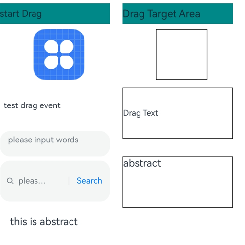
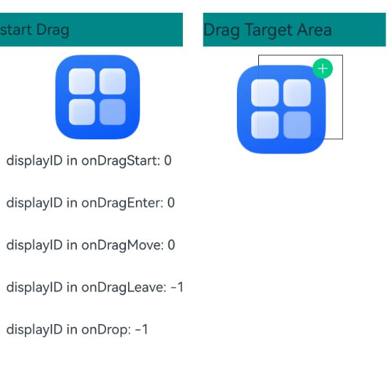
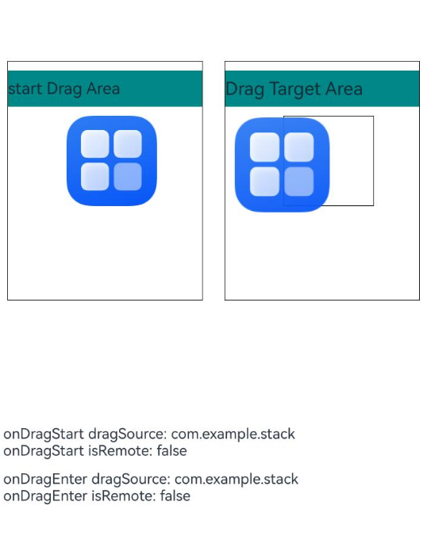
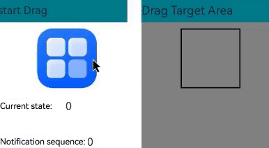
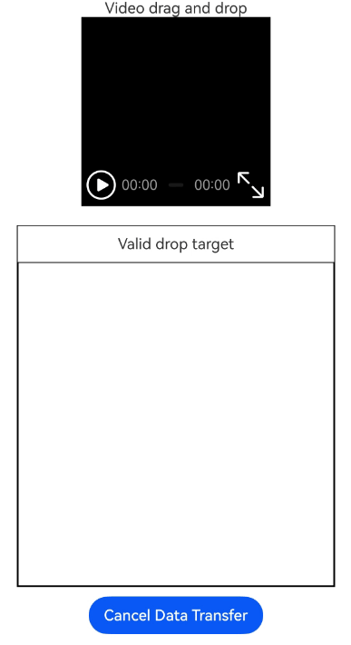

# Drag Event
<!--Kit: ArkUI-->
<!--Subsystem: ArkUI-->
<!--Owner: @yihao-lin-->
<!--Designer: @piggyguy-->
<!--Tester: @songyanhong-->
<!--Adviser: @Brilliantry_Rui-->
<!-- md-trans-meta sourceCommit=8de0c2610841efa4333c462e6a318256c709bce8 translatedAt=2026-09-07T08:08:17.412Z -->

A drag event is a series of events triggered when a user drags an object (such as a file, control, or element) in the user interface. These events allow developers to customize drag behavior and implement functions such as drag-and-drop and position adjustment.

>  **NOTE**
>
> - Supported since API version 8. New APIs in later versions are marked with a superscript to indicate their earliest supported version.
>
> - Resource files preset in the application (that is, resource files that already exist in the HAP package before the application is installed) support only drag within the local application.

The ArkUI framework implements default drag capabilities for the following components, supporting responses to dragging data out or dropping data in. Developers can also customize drag capabilities by implementing the universal drag events.

- Components that support dragging out by default (data can be dragged out from the component): [Search](ts-basic-components-search.md), [TextInput](ts-basic-components-textinput.md), [TextArea](ts-basic-components-textarea.md), [RichEditor](ts-basic-components-richeditor.md), [Text](ts-basic-components-text.md), [Image](ts-basic-components-image.md), [Hyperlink](ts-container-hyperlink.md). Developers can control the use of the default drag capability by setting the [draggable](ts-universal-attributes-drag-drop.md#draggable) attribute of these components.

- Components that support dropping in by default (the target component can respond to dropped data): [Search](ts-basic-components-search.md), [TextInput](ts-basic-components-textinput.md), [TextArea](ts-basic-components-textarea.md), [RichEditor](ts-basic-components-richeditor.md). Developers can disable the support for the default drop capability by setting the [allowDrop](ts-universal-attributes-drag-drop.md#allowdrop) attribute of these components to null.

For other components that support dragging out, developers need to set the [draggable](ts-universal-attributes-drag-drop.md#draggable) attribute to true and implement data transfer-related content in APIs such as [onDragStart](#ondragstart) to correctly handle the drag capability.
<!--RP1--><!--RP1End-->

> **NOTE**
>
> The **Text** component must be used together with [copyOption](ts-basic-components-text.md#copyoption9), with **copyOption** set to **CopyOptions.InApp** or **CopyOptions.LocalDevice**.

## onDragStart

onDragStart(event: (event: DragEvent, extraParams?: string) => CustomBuilder | DragItemInfo): T

In a gesture drag scenario, this callback is triggered when the component is pressed and held for more than 500 ms and then moved by more than 10 vp. In a mouse drag scenario, this callback is triggered when the left mouse button is pressed on a draggable component and moved by more than 1 vp.

For components that support drag by default, if the developer sets onDragStart, onDragStart is executed first, and whether to use the system default drag capability is determined based on the execution result. The specific rules are as follows:
- If the developer returns a custom preview image, the system default drag preview image is no longer used.
- If the developer sets drag data, the system default drag data is no longer used.

When dragging selected text content, text components such as [Text](ts-basic-components-text.md), [Search](ts-basic-components-search.md), [TextInput](ts-basic-components-textinput.md), [TextArea](ts-basic-components-textarea.md), and [RichEditor](ts-basic-components-richeditor.md) do not support custom preview images. When onDragStart is used together with the menu preview, or when a component that supports drag by default is used, custom content in the preview and menu items does not support dragging.

> **NOTE**
>
> This API can be called within [attributeModifier](ts-universal-attributes-attribute-modifier.md#attributemodifier) since API version 13.

**Atomic service API**: This API can be used in atomic services since API version 11.

**Event priority:** When the long press event trigger time is less than 500 ms, the long press event is responded to before the drag event. When the long press event trigger time is greater than or equal to 500 ms, the drag event is responded to before the long press event.

**System capability**: SystemCapability.ArkUI.ArkUI.Full

**Parameters**

| Name      | Type                            | Mandatory | Description               |
| ----------- | ------------------------------- | ---- | ------------------ |
| event    | (event: [DragEvent](#dragevent7), extraParams?: string) => [CustomBuilder](ts-types.md#custombuilder8) &nbsp;\|&nbsp; [DragItemInfo](#dragiteminfo)  | Yes   | Callback function.<br> **Note:**<br> The **event** parameter carries the drag event information.<br> The **extraParams** parameter carries additional information of the drag event, which needs to be parsed into JSON format. For details, see [extraParams](#extraparams).<br> **CustomBuilder** is the component information displayed during the drag process. Global builders are not supported.|

**Return value**

| Type | Description |
| -------- | -------- |
| T | Return the current component. |

## onDragEnter

onDragEnter(event: (event: DragEvent, extraParams?: string) => void): T

Triggered when a drag enters the component area. This event is valid only when [onDrop](#ondrop) is listened for.

**Atomic service API**: This API can be used in atomic services since API version 11.

**System capability**: SystemCapability.ArkUI.ArkUI.Full

**Parameters**

| Name      | Type                            | Mandatory | Description                           |
| ----------- | ------------------------------- | ---- | ------------------------------ |
| event    | (event: [DragEvent](#dragevent7), extraParams?: string) => void   | Yes   | Callback function.<br>**Note:**<br> **event** is the drag event information, including the coordinates of the drag point.<br> **extraParams** is the additional information of the drag event, which needs to be parsed into JSON format. For details, see [extraParams](#extraparams).|

**Return value**

| Type | Description |
| -------- | -------- |
| T | Returns the current component. |

## onDragMove

onDragMove(event: (event: DragEvent, extraParams?: string) => void): T

Triggered when the drag moves within the component scope. This event is valid only when the [onDrop](#ondrop) event is listened for.

**Atomic service API**: This API can be used in atomic services since API version 11.

**System capability**: SystemCapability.ArkUI.ArkUI.Full

**Parameters**

| Name      | Type                            | Mandatory | Description                           |
| ----------- | ------------------------------- | ---- | ------------------------------ |
| event    | (event: [DragEvent](#dragevent7), extraParams?: string) => void   | Yes   | Callback function.<br>**Note:**<br> **event** is the drag event information, including the coordinates of the drag point.<br> **extraParams** is the additional information of the drag event, which needs to be parsed into JSON format. For details, see [extraParams](#extraparams). |

**Return value**

| Type | Description |
| -------- | -------- |
| T | Returns the current component. |

## onDragLeave

onDragLeave(event: (event: DragEvent, extraParams?: string) => void): T

Triggered when the drag leaves the component scope. This event is valid only when the [onDrop](#ondrop) event is listened for.

**Atomic service API**: This API can be used in atomic services since API version 11.

**System capability**: SystemCapability.ArkUI.ArkUI.Full

**Parameters**

| Name      | Type                            | Mandatory | Description                           |
| ----------- | ------------------------------- | ---- | ------------------------------ |
| event    | (event: [DragEvent](#dragevent7), extraParams?: string) => void   | Yes   | Callback invoked when the drag leaves the component scope.<br>**Note:**<br> **event** indicates the drag event information, including the coordinates of the drag point.<br> **extraParams** indicates the additional information of the drag event, which needs to be parsed into JSON format. For details, see [extraParams](#extraparams). |

**Return value**

| Type | Description |
| -------- | -------- |
| T | Current component. |

## onDrop

onDrop(event: (event: DragEvent, extraParams?: string) => void): T

The component bound with this event can serve as a drop target. When the drag-and-drop behavior stops within the scope of this component, the callback is triggered. If the developer does not proactively call event.setResult() in onDrop to set the result of the drag reception, for system-supported default draggable components, the processing result is subject to the data actually processed by the system. For other components, the system treats the data as successfully received by default.

**Atomic service API**: This API can be used in atomic services since API version 11.

**System capability**: SystemCapability.ArkUI.ArkUI.Full

**Parameters**

| Name      | Type                            | Mandatory | Description                           |
| ----------- | ------------------------------- | ---- | ------------------------------ |
| event    | (event: [DragEvent](#dragevent7), extraParams?: string) => void   | Yes   | Callback Function.<br>**Note:**<br> event is the drag event information, including the coordinates of the drag point.<br> extraParams is the additional information of the drag event, which needs to be parsed into JSON format. For details, see [extraParams](#extraparams).|

**Return value**

| Type | Description |
| -------- | -------- |
| T | Returns the current component. |

## onDrop<sup>15+</sup>

onDrop(eventCallback: OnDragEventCallback, dropOptions?: DropOptions): T

A component bound with this event can serve as the drop target. When the drag behavior stops within the scope of this component, the callback is triggered. If the developer does not proactively call event.[setResult](#setresult10)() in onDrop to set the result of receiving the drag, for system-supported default draggable components, the processing result is subject to the data actually processed by the system; for other components, the system processes the data as successfully received by default.

**Atomic service API**: This API can be used in atomic services since API version 15.

**Model restriction**: This API can be used only in the stage model.

**System capability**: SystemCapability.ArkUI.ArkUI.Full

**Parameters**

| Name      | Type                            | Mandatory | Description                           |
| ----------- | ------------------------------- | ---- | ------------------------------ |
| eventCallback  | [OnDragEventCallback](#ondrageventcallback15)   | Yes   | Callback function for the drag release event, used to receive drag event information when the component serves as the drop target and onDrop is triggered.|
| dropOptions  | [DropOptions](#dropoptions15)   | No   | Parameters of the drop process. Pass this parameter when you need to configure the behavior of the drag drop process (for example, disabling data prefetching). If it is not passed, the default drop configuration is used, and the drag data is prefetched by default. |

**Return value**

| Type | Description |
| -------- | -------- |
| T | Current component. |

## onDragEnd<sup>10+</sup>

onDragEnd(event: (event: DragEvent, extraParams?: string) => void): T

Triggered when the drag operation initiated by the component bound to this event ends.

**Atomic service API**: This API can be used in atomic services since API version 11.

**Model restriction**: This API can be used only in the stage model.

**System capability**: SystemCapability.ArkUI.ArkUI.Full

**Parameters**

| Name      | Type                            | Mandatory | Description                           |
| ----------- | ------------------------------- | ---- | ------------------------------ |
| event    | (event: [DragEvent](#dragevent7), extraParams?: string) => void   | Yes   | Callback function.<br>**Note:**<br> event is the drag event information. In the **onDragEnd** call, the coordinates of the drag point are not included.<br> **extraParams** is the additional information of the drag event, which needs to be parsed into JSON format. For details, see [extraParams](#extraparams).|

**Return value**

| Type | Description |
| -------- | -------- |
| T | Return the current component. |

## onPreDrag<sup>12+</sup>

onPreDrag(callback: Callback\<PreDragStatus>): T

When the component bound with this event is in different stages before a drag gesture is initiated, the callback is triggered. For details about the stages before drag initiation, see [PreDragStatus](#predragstatus12). This API does not support triggering during mouse dragging.

> **NOTE**
>
> This API can be called within [attributeModifier](ts-universal-attributes-attribute-modifier.md#attributemodifier) since API version 20.

**Atomic service API**: This API can be used in atomic services since API version 12.

**Model restriction**: This API can be used only in the stage model.

**System capability**: SystemCapability.ArkUI.ArkUI.Full

**Parameters**

| Name      | Type                            | Mandatory | Description                           |
| ----------- | ------------------------------- | ---- | ------------------------------ |
| callback    | Callback<[PreDragStatus](#predragstatus12)>     | Yes   | Callback invoked when the state before drag initiation changes, used to receive the current stage before the drag gesture is triggered. The callback parameter is **PreDragStatus**, which indicates the stages before drag initiation.|

**Return value**

| Type | Description |
| -------- | -------- |
| T | Returns the current component. |

## onDragSpringLoading<sup>20+</sup>

onDragSpringLoading(callback: Callback\<SpringLoadingContext\> | null, configuration?: DragSpringLoadingConfiguration): T

A component bound with this event can serve as a drag response target with hover detection. When a dragged object hovers over the target, the callback is triggered to notify. At this time, only one target can become the responder, and child components always have a higher response priority.

For details about the trigger mechanism and usage of hover detection, see [Spring Loading (Hover Detection) Support](../../../ui/arkts-common-events-drag-event.md#spring-loading-hover-detection-support).

**Atomic service API**: This API can be used in atomic services since API version 20.

**Model restriction**: This API can be used only in the stage model.

**System capability**: SystemCapability.ArkUI.ArkUI.Full

**Parameters**

| Name        | Type                                      | Mandatory | Description                                           |
| :------------ | ----------------------------------------- | ---- | ---------------------------------------------- |
| callback          | [Callback](../../../reference/apis-basic-services-kit/js-apis-base.md#callback)\<[SpringLoadingContext](#springloadingcontext20)\> \| null    | Yes   | Callback for hover detection. When the value is null, hover detection is disabled. |
| configuration | [DragSpringLoadingConfiguration](../js-apis-arkui-dragController.md#dragspringloadingconfiguration20) | No   | Hover detection configuration. Pass this parameter when you need to customize the trigger duration, update interval, or notification count of hover detection. If it is not passed or is **undefined**, the default value of [DragSpringLoadingConfiguration](../js-apis-arkui-dragController.md#dragspringloadingconfiguration20) is used.  |

**Return value**

| Type | Description |
| -------- | -------- |
| T | Current component. |

## DragItemInfo

Defines the information about the drag item during a drag process.

**Atomic service API**: This API can be used in atomic services since API version 11.

**System capability**: SystemCapability.ArkUI.ArkUI.Full

| Name      | Type                  | Read-only| Optional   | Description                               |
| --------- | ---------------------------------------- | ---- | ---- | --------------------------------- |
| pixelMap  | [PixelMap](../../apis-image-kit/arkts-apis-image-PixelMap.md) | No    |  Yes   |Image displayed during the drag process. When not set, no image is used as the drag preview. |
| builder   | [CustomBuilder](ts-types.md#custombuilder8) | No    |  Yes   |Displays a custom component during the drag process. When not set, no custom component is used as the drag preview. If pixelMap is set, this value is ignored.<br> **Note:** <br>Global builders are not supported. If the [Image](ts-basic-components-image.md) component is used in the builder, you are advised to set [syncLoad](ts-basic-components-image.md#syncload8) of Image to true to enable synchronous loading. This builder is used only to generate the image displayed in the current drag. Changes to the builder are not synchronized to the image currently being dragged, and take effect only in the next drag.<br>When passing parameters to the builder, you are advised to use the format builder: ()=>{this.customBuilder()} to ensure that this points to the correct object. For details, see [Using Functions Decorated with @Builder as CustomBuilder Types](../../../ui/state-management/arkts-builder.md#using-functions-decorated-with-builder-as-custombuilder-types).|
| extraInfo | string                                   | No    |  Yes   |Additional information about the drag item, used to describe the drag item. When not set, there is no additional information.                    |

## PreviewConfiguration<sup>15+</sup>

Configures the preview style during custom drag.

**Atomic service API**: This API can be used in atomic services since API version 15.

**Model restriction**: This API can be used only in the stage model.

**System capability**: SystemCapability.ArkUI.ArkUI.Full

| Name       | Type | Read-only | Optional | Description                                                         |
| ---------- | ---- | ---- | ---- | ------------------------------------------------------------ |
| onlyForLifting | boolean | No    | Yes    | Whether the custom-configured preview is used only for lifting.<br> **Note:** <br>The default value is **false**. The value **true** means the custom preview is used only for lifting, and **false** means it can be used for both lifting and dragging. When set to **true**, if a long press drag is initiated, the preview during lifting is the custom-configured preview, while the preview during dragging does not use the [dragPreview](ts-universal-attributes-drag-drop.md#dragpreview11) attribute. Instead, it preferentially uses the preview returned by the developer in [onDragStart](#ondragstart). If no preview is returned in [onDragStart](#ondragstart), the component's own screenshot is used.|
| delayCreating  | boolean | No    | Yes    | Whether the component preview builder is created with a delay.<br>The default value is **false**. The value **true** means the component preview builder is created only when the drag preview needs to be generated, and **false** means the component preview builder is created when it is set.|

## extraParams

  Used to return the additional information required by a component during dragging.

  **extraParams** is a string converted from a JSON object. You can parse it with JSON.parse to obtain the following attributes.

| Name          | Type   | Description                                       |
| ------------- | ------ | ---------------------------------------- |
| selectedIndex | number | When the drag event is set on a child element of the parent container, selectedIndex indicates that the currently dragged child element is the selectedIndex-th child element of the parent container, starting from 0.<br>It takes effect only in the drag event of the [ListItem](ts-container-listitem.md) component; otherwise, undefined is returned. |
| insertIndex   | number | When the currently dragged element is dropped in the List component, insertIndex indicates that the dragged element is inserted at the insertIndex-th position of the component, starting from 0.<br>It takes effect only in the drag event of the [List](ts-container-list.md) component; otherwise, undefined is returned. |

## DragEvent<sup>7+</sup>

**System capability**: SystemCapability.ArkUI.ArkUI.Full

### Attributes

**Model restriction**: This API can be used only in the stage model.

**System capability**: SystemCapability.ArkUI.ArkUI.Full

| Name     | Type  | Read-only | Optional | Description             |
| ------ | ------ | ----- | ---- | ------- |
| useCustomDropAnimation<sup>10+</sup> | boolean | No | No |Whether to disable the system default drop animation when the drag ends.<br>The application can set this value to **true** to disable the system default drop animation and implement a custom drop animation.<br>When this attribute is not configured or is set to **false**, the system default drop animation takes effect. When [setResult](#setresult10) is set to **DRAG_SUCCESSFUL**, the drop animation is a shrink-and-disappear animation; otherwise, it is an enlarge-and-disappear animation.<br>When the system default drop animation is not disabled, the application should not implement a custom animation to avoid animation conflicts.<br>Default value: **false**<br>**Atomic service API:** This API is supported in atomic services since API version 11. |
| autoHideComponentUniqueIds | number \| number[] | No | Yes |Sets the uniqueId of the component to be automatically hidden during the drag. A single uniqueId or an array of uniqueIds is supported.<br>This attribute takes effect only when set in the [onDragStart](#ondragstart) callback. After the drag is successfully initiated, the system hides the target component before displaying the drag preview window.<br>If the drag source itself also needs to be hidden, the uniqueId of the drag source component must be passed in as well.<br>The uniqueId of a component can be obtained through [UIContext.getFrameNodeById()](../arkts-apis-uicontext-uicontext.md#getframenodebyid12) together with [FrameNode.getUniqueId()](../js-apis-arkui-frameNode.md#getuniqueid12).<br>The developer should restore the component display state in [onDragEnd](#ondragend10) or [onDrop](#ondrop).<br>**Since:** 26.0.0<br>**Atomic service API:** This API is supported in atomic services since API version 26.0.0. |
|dragBehavior<sup>10+</sup> | [DragBehavior](#dragbehavior10) | No | No |Switches the badge display state between copy and cut modes.<br>Default value: DragBehavior.COPY.<br>**Atomic service API:** This API is supported in atomic services since API version 11. |

### setData<sup>10+</sup>

setData(unifiedData: UnifiedData): void

Sets the data used for dragging in the DragEvent. When used together with the [setDataLoadParams](#setdataloadparams20) method, the method called last takes effect.

**Atomic service API**: This API can be used in atomic services since API version 11.

**Model restriction**: This API can be used only in the stage model.

**System capability**: SystemCapability.ArkUI.ArkUI.Full

**Parameters**

| Name        | Type                                                         | Mandatory | Description             |
| ----------- | ------------------------------------------------------------ | --------- | ----------------------- |
| unifiedData | [UnifiedData](#unifieddata10) | Yes       | Drag-related data. |

### getData<sup>10+</sup>

getData(): UnifiedData

Gets the drag-related data.

**Atomic service API**: This API can be used in atomic services since API version 11.

**Model restriction**: This API can be used only in the stage model.

**System capability**: SystemCapability.ArkUI.ArkUI.Full

**Return value**

| Type                                                         | Description                                                         |
| ------------------------------------------------------------ | ------------------------------------------------------------ |
| [UnifiedData](../../apis-arkdata/js-apis-data-unifiedDataChannel.md#unifieddata) | Gets the drag-related data from DragEvent. For details about the data retrieval result, see the error code description. |

**Error codes**

For details about the error codes, see [Drag Event Error Codes](../errorcode-drag-event.md).

| ID   | Error Message |
| --------- | ------- |
| 190001    | Data not found.|
| 190002    | Data error. |

### getSummary<sup>10+</sup>

getSummary(): Summary

Obtains the summary of the dragged data, including the data type and size. In a delayed drag scenario, only the data type can be obtained.

**Atomic service API**: This API can be used in atomic services since API version 11.

**Model restriction**: This API can be used only in the stage model.

**System capability**: SystemCapability.ArkUI.ArkUI.Full

**Return value**

| Type                                                         | Description                                  |
| ------------------------------------------------------------ | ------------------------------------- |
| [Summary](#summary10) | Summary of the drag-related data. |

### setResult<sup>10+</sup>

setResult(dragResult: DragResult): void

Sets the drag result in DragEvent.

**Atomic service API**: This API can be used in atomic services since API version 11.

**Model restriction**: This API can be used only in the stage model.

**System capability**: SystemCapability.ArkUI.ArkUI.Full

**Parameters**

| Name       | Type                               | Mandatory | Description |
| ---------- | ---------------------------------- | --------- | ----------- |
| dragResult | [DragResult](#dragresult10) | Yes       | Drag result. |

### getResult<sup>10+</sup>

getResult(): DragResult

Obtains the drag result.

**Atomic service API**: This API can be used in atomic services since API version 11.

**Model restriction**: This API can be used only in the stage model.

**System capability**: SystemCapability.ArkUI.ArkUI.Full

**Return value**

| Type                                | Description                          |
| ----------------------------------- | ------------------------------------ |
| [DragResult](#dragresult10) | Drag result obtained from the DragEvent. |

### getPreviewRect<sup>10+</sup>

getPreviewRect(): Rectangle

Obtains the position of the drag preview image relative to the current window and the size of the preview image.

**Atomic service API**: This API can be used in atomic services since API version 11.

**Model restriction**: This API can be used only in the stage model.

**System capability**: SystemCapability.ArkUI.ArkUI.Full

**Return value**

| Type                                                         | Description                                                         |
| ------------------------------------------------------------ | ------------------------------------------------------------ |
| [Rectangle](ts-universal-attributes-touch-target.md#rectangle) | Position of the drag preview image relative to the current window and the size of the preview image, in vp. **x** and **y** indicate the window coordinates of the top-left corner of the preview image, and **width** and **height** indicate the size of the preview image. |

### getVelocityX<sup>10+</sup>

getVelocityX(): number

Obtains the drag velocity of the current drag along the x-axis.

**Atomic service API**: This API can be used in atomic services since API version 11.

**Model restriction**: This API can be used only in the stage model.

**System capability**: SystemCapability.ArkUI.ArkUI.Full

**Return value**

| Type   | Description                                                         |
| ------ | ------------------------------------------------------------ |
| number | Drag velocity of the current drag along the x-axis. The origin of the coordinate axis is the top-left corner of the screen. The unit is vp/s. The velocity can be positive or negative: positive from left to right, and negative otherwise. |

### getVelocityY<sup>10+</sup>

getVelocityY(): number

Gets the y-axis drag velocity of the current drag.

**Atomic service API**: This API can be used in atomic services since API version 11.

**Model restriction**: This API can be used only in the stage model.

**System capability**: SystemCapability.ArkUI.ArkUI.Full

**Return value**

| Type   | Description                                                         |
| ------ | ------------------------------------------------------------ |
| number | Y-axis drag velocity of the current drag. The origin of the coordinate axis is the window top-left corner. The unit is vp/s. The velocity can be positive or negative, with downward being positive and upward being negative. |

### getVelocity<sup>10+</sup>

getVelocity(): number

Gets the drag velocity in the primary direction of the current drag.

**Atomic service API**: This API can be used in atomic services since API version 11.

**Model restriction**: This API can be used only in the stage model.

**System capability**: SystemCapability.ArkUI.ArkUI.Full

**Return value**

| Type   | Description                                                         |
| ------ | ------------------------------------------------------------ |
| number | Drag velocity in the primary direction of the current drag. It is the arithmetic square root of the sum of squares of the velocities along the x-axis and y-axis, in vp/s. |

### getWindowX<sup>10+</sup>

getWindowX(): number

Gets the x-coordinate of the drag point relative to the window top-left corner.

**Atomic service API**: This API can be used in atomic services since API version 11.

**Model restriction**: This API can be used only in the stage model.

**System capability**: SystemCapability.ArkUI.ArkUI.Full

**Return value**

| Type   | Description                                            |
| ------ | ----------------------------------------------- |
| number | X-coordinate of the current drag point relative to the window top-left corner, in vp. |

### getWindowY<sup>10+</sup>

getWindowY(): number

Gets the y-coordinate of the drag point relative to the top-left corner of the window.

**Atomic service API**: This API can be used in atomic services since API version 11.

**Model restriction**: This API can be used only in the stage model.

**System capability**: SystemCapability.ArkUI.ArkUI.Full

**Return value**

| Type   | Description                                            |
| ------ | ----------------------------------------------- |
| number | Y-coordinate of the current drag point relative to the top-left corner of the window, in vp. |

### getDisplayX<sup>10+</sup>

getDisplayX(): number

Gets the x-coordinate of the current drag point relative to the top-left corner of the screen.

**Atomic service API**: This API can be used in atomic services since API version 11.

**Model restriction**: This API can be used only in the stage model.

**System capability**: SystemCapability.ArkUI.ArkUI.Full

**Return value**

| Type | Description |
| ------ | ----------------------------------------------- |
| number | X-coordinate of the current drag point relative to the top-left corner of the screen, in vp. |

### getDisplayY<sup>10+</sup>

getDisplayY(): number

Obtains the y-axis coordinate of the current drag point relative to the top-left corner of the screen.

**Atomic service API**: This API can be used in atomic services since API version 11.

**Model restriction**: This API can be used only in the stage model.

**System capability**: SystemCapability.ArkUI.ArkUI.Full

**Return value**

| Type   | Description                                            |
| ------ | ------------------------------------------------------ |
| number | Y-axis coordinate of the current drag point relative to the top-left corner of the screen, in vp. |

### getModifierKeyState<sup>12+</sup>

getModifierKeyState?(keys: Array\<string\>): boolean

Obtains the pressed state of the modifier keys.

**Atomic service API**: This API can be used in atomic services since API version 13.

**Model restriction**: This API can be used only in the stage model.

**System capability**: SystemCapability.ArkUI.ArkUI.Full

**Parameters**

| Name | Type                | Mandatory | Description                                                         |
| ------ | ------------------- | ---- | ------------------------------------------------------------ |
| keys   | Array&lt;string&gt; | Yes   | Obtains the pressed state of the modifier keys. For error information, see the following error codes. The supported function keys are 'Ctrl' \| 'Alt' \| 'Shift'.<br>**Note:**<br>This API does not support use in stylus scenarios. |

**Error Codes**

For details about the following error codes, see [Universal Error Codes](../../errorcode-universal.md).

| ID   | Error Message |
| --------- | ------- |
| 401       | Parameter error. Possible causes: 1. Incorrect parameter types. 2. Parameter verification failed. |

**Return value**

| Type    | Description                                                  |
| ------- | ----------------------------------------------------- |
| boolean | Whether the key is pressed. The value **true** indicates that the key is pressed, and **false** indicates the opposite. |

### startDataLoading<sup>15+</sup>

startDataLoading(options: DataSyncOptions): string

Asynchronously obtains drag data and notifies the developer of the current data synchronization progress. This API can be used only in the onDrop phase. When using this API to obtain data, set disableDataPrefetch in [DropOptions](#dropoptions15) to true to prevent the drag data from being prefetched.

**Atomic service API**: This API can be used in atomic services since API version 15.

**Model restriction**: This API can be used only in the stage model.

**System capability**: SystemCapability.ArkUI.ArkUI.Full

**Parameters**

| Name | Type | Mandatory | Description |
| ------- | ------------------------------------- | ---- | ------------------------------------------------------------ |
| options | [DataSyncOptions](#datasyncoptions15) | Yes | Parameters for obtaining drag data, including the target path, file conflict options, and progress bar type. During data transfer, you can use [cancelDataLoading](../arkts-apis-uicontext-dragcontroller.md#canceldataloading15) to cancel data loading. |

**Error codes**

For details about the error codes, see [Universal Error Codes](../../errorcode-universal.md) and [Drag Event Error Codes](../errorcode-drag-event.md).

| ID   | Error Message |
| --------- | ------- |
| 401       | Parameter error. |
| 190003    | Operation not allowed for current phase. |

**Return value**

| Type | Description |
| ------ | ---------------------------------- |
| string | Identifier of the drag data, used to distinguish each drag operation. |

### executeDropAnimation<sup>18+</sup>

executeDropAnimation(customDropAnimation: Callback\<void\>): void

Sets the execution function of the custom drop animation, which is effective only when [useCustomDropAnimation](#attributes) is true.

**Atomic service API**: This API can be used in atomic services since API version 18.

**Model restriction**: This API can be used only in the stage model.

**System capability**: SystemCapability.ArkUI.ArkUI.Full

**Parameters**

| Name    | Type  | Required | Description      |
| ------ | ------ | --- | --------- |
| customDropAnimation | [Callback\<void\>](../../../reference/apis-basic-services-kit/js-apis-base.md#callback)  | Yes | Implements the custom drop animation in this callback function.<br> **Note:** <br>1. This API is effective only when used in the onDrop callback.<br> 2. Set useCustomDropAnimation to true before using this API; otherwise, this API does not take effect.<br> 3. Do not implement logic unrelated to the animation in the animation callback to avoid affecting execution efficiency.|

### getDisplayId<sup>20+</sup>

getDisplayId(): number

Gets the ID of the screen where the current drag event occurs. This API can be used in a multi-screen drag scenario to identify the screen where the drag occurs and adapt the target screen processing logic. It is not supported in the [onDragEnd](#ondragend10) phase.

**Atomic service API**: This API can be used in atomic services since API version 20.

**Model restriction**: This API can be used only in the stage model.

**System capability**: SystemCapability.ArkUI.ArkUI.Full

**Return value**

| Type   | Description                             |
| ------ | --------------------------------------- |
| number | ID of the screen where the current drag event occurs. |

### getDragSource<sup>20+</sup>

getDragSource(): string

Obtains the package name of the drag initiator. This API can be used in cross-application drag scenarios to identify the source application of the data, and to perform data reception verification or service processing based on the source application.

**Atomic service API**: This API can be used in atomic services since API version 20.

**Model restriction**: This API can be used only in the stage model.

**System capability**: SystemCapability.ArkUI.ArkUI.Full

**Return value**

| Type   | Description                  |
| ------ | ---------------------------- |
| string | Package name of the drag initiator. |

### isRemote<sup>20+</sup>

isRemote(): boolean

Obtains whether the drag is a cross-device drag. The value **true** indicates a cross-device drag. This API can be used to distinguish a local drag from a cross-device drag in cross-device drag scenarios, and adjust data transmission, permission verification, or prompt logic accordingly.

**Atomic service API**: This API can be used in atomic services since API version 20.

**Model restriction**: This API can be used only in the stage model.

**System capability**: SystemCapability.ArkUI.ArkUI.Full

**Return value**

| Type    | Description                                                         |
| ------- | ------------------------------------------------------------ |
| boolean | Whether the drag is a cross-device drag. The value **true** indicates a cross-device drag, and **false** indicates the opposite. |

### setDataLoadParams<sup>20+</sup>

setDataLoadParams(dataLoadParams: DataLoadParams): void

Sets the drag initiator to provide data with a delay. This method provides data loading parameters to the system instead of directly providing a complete data object. When the user drops on the target application, the system uses these parameters to request the actual data from the drag initiator. When used together with [setData](#setdata10), the method called last takes effect. This API only takes effect in the [onDragStart](#ondragstart) callback.

**Atomic service API**: This API can be used in atomic services since API version 20.

**Model restriction**: This API can be used only in the stage model.

**System capability**: SystemCapability.ArkUI.ArkUI.Full

**Parameters**

| Name   | Type   | Mandatory    | Description                                                         |
| -------| -------| ------- | ------------------------------------------------------------ |
| dataLoadParams | [DataLoadParams](#dataloadparams20) |  Yes | Data loading parameters used when the drag initiator provides data with a delay, used to provide the loading method of the actual drag data to the system when the user drops on the target application. |

### getX<sup>(deprecated)</sup>

getX(): number

X-coordinate of the current drag point relative to the window top-left corner, in vp.

> **NOTE**
>
> This API is supported since API version 7 and deprecated since API version 10. You are advised to use [getWindowX](#getwindowx10) instead.

**System capability**: SystemCapability.ArkUI.ArkUI.Full

**Return value**

| Type   | Description                                                |
| ------ | --------------------------------------------------- |
| number | X-coordinate of the current drag point relative to the window top-left corner.<br>Unit: vp |

### getY<sup>(deprecated)</sup>

getY(): number

Y-coordinate of the current drag point relative to the top-left corner of the window, in vp.

> **NOTE**
>
> This API is supported since API version 7 and deprecated since API version 10. You are advised to use [getWindowY](#getwindowy10) instead.

**System capability**: SystemCapability.ArkUI.ArkUI.Full

**Return value**

| Type   | Description                                                |
| ------ | --------------------------------------------------- |
| number | Returns the y-coordinate of the current drag point relative to the top-left corner of the window.<br>Unit: vp |

### getGlobalDisplayX<sup>20+</sup>

getGlobalDisplayX(): number

X coordinate of the current drag point relative to the top-left corner of the global screen.

**Atomic service API**: This API can be used in atomic services since API version 20.

**Model restriction**: This API can be used only in the stage model.

**System capability**: SystemCapability.ArkUI.ArkUI.Full

**Return value**

| Type   | Description                                                |
| ------ | --------------------------------------------------- |
| number | Returns the X coordinate of the current drag point relative to the top-left corner of the global screen.<br>Unit: vp, value range: (-∞, +∞)|

### getGlobalDisplayY<sup>20+</sup>

getGlobalDisplayY(): number

Y coordinate of the current drag point relative to the top-left corner of the global screen.

**Atomic service API**: This API can be used in atomic services since API version 20.

**Model restriction**: This API can be used only in the stage model.

**System capability**: SystemCapability.ArkUI.ArkUI.Full

**Return value**

| Type   | Description                                                |
| ------ | --------------------------------------------------- |
| number | Y coordinate of the current drag point relative to the top-left corner of the global screen.<br>Unit: vp. Value range: (-∞, +∞)|

## DragResult<sup>10+</sup>

Enumerates the results of drag operations and the drop-enabled states of components.

**Model restriction**: This API can be used only in the stage model.

**System capability**: SystemCapability.ArkUI.ArkUI.Full

| Name   | Value | Description |
| ----- | -- | --------------- |
| UNKNOWN<sup>24+</sup> | -1 |The drag result has not been set. Used in [onDragStart](#ondragstart), [onDragEnter](#ondragenter), [onDragMove](#ondragmove), [onDragLeave](#ondragleave), and [onDrop](#ondrop).<br>**Model constraint:** This API can be used only in the stage model.<br>**Atomic service API:** This API is supported in atomic services since API version 24. |
| DRAG_SUCCESSFUL | 0 |Drag succeeded. Used in [onDrop](#ondrop).<br>**Atomic service API:** This API is supported in atomic services since API version 11. |
| DRAG_FAILED | 1 |Drag failed. Used in [onDrop](#ondrop).<br>**Atomic service API:** This API is supported in atomic services since API version 11. |
| DRAG_CANCELED | 2 |Drag canceled. Used in [onDrop](#ondrop).<br>**Atomic service API:** This API is supported in atomic services since API version 11. |
| DROP_ENABLED | 3 |The component allows dropping. Used in [onDragEnter](#ondragenter), [onDragMove](#ondragmove), and [onDragLeave](#ondragleave).<br>**Atomic service API:** This API is supported in atomic services since API version 11. |
| DROP_DISABLED | 4 |The component does not allow dropping. Used in [onDragEnter](#ondragenter), [onDragMove](#ondragmove), and [onDragLeave](#ondragleave).<br>**Atomic service API:** This API is supported in atomic services since API version 11. |

## DragBehavior<sup>10+</sup>

When [DragResult](#dragresult10) is set to DROP_ENABLED, DragBehavior can be set to copy (COPY) or move (MOVE). When DragBehavior is copy (COPY), a plus sign is displayed on the badge of the dragged object; when it is move (MOVE), no plus sign is displayed on the badge of the dragged object. DragBehavior is used to describe to developers whether the data is processed by copy (COPY) or move (MOVE), but it cannot ultimately determine how the data is actually processed. DragBehavior is returned to the data source through onDragEnd, and the party that initiates the drag can use DragBehavior to distinguish whether the data is processed by copy (COPY) or move (MOVE).

**Atomic service API**: This API can be used in atomic services since API version 11.

**Model restriction**: This API can be used only in the stage model.

**System capability**: SystemCapability.ArkUI.ArkUI.Full

| Name | Value | Description |
| ----- | -- | ----------------- |
| COPY | 0 |Specifies that the data is processed by copy.|
| MOVE| 1 |Specifies that the data is processed by move.|

## PreDragStatus<sup>12+</sup>

Defines the states of each stage before a drag gesture is triggered.

**Model restriction**: This API can be used only in the stage model.

**System capability**: SystemCapability.ArkUI.ArkUI.Full

| Name | Value | Description |
| ---- | - | ----------------- |
| ACTION_DETECTING_STATUS | 0 | Drag gesture startup stage. (Triggered 50 ms after pressing.)<br>**Atomic service API:** This API is supported in atomic services since API version 12. |
| READY_TO_TRIGGER_DRAG_ACTION | 1 | Drag preparation is complete, and the drag can be initiated. (Triggered 500 ms after pressing.)<br>**Atomic service API:** This API is supported in atomic services since API version 12. |
| PREVIEW_LIFT_STARTED | 2 | Drag preview lift animation startup stage. (Triggered 800 ms after pressing.)<br>**Atomic service API:** This API is supported in atomic services since API version 12. |
| PREVIEW_LIFT_FINISHED | 3 | Drag preview lift animation end stage. (Triggered when the lift animation is completely finished.)<br>**Atomic service API:** This API is supported in atomic services since API version 12. |
| PREVIEW_LANDING_STARTED | 4 | Drag preview landing animation startup stage. (Triggered when the landing animation starts.)<br>**Atomic service API:** This API is supported in atomic services since API version 12. |
| PREVIEW_LANDING_FINISHED | 5 | Drag preview landing animation end stage. (Triggered when the landing animation ends.)<br>**Atomic service API:** This API is supported in atomic services since API version 12. |
| ACTION_CANCELED_BEFORE_DRAG | 6 | The drag preview lift and landing animation is interrupted. (Triggered when the finger is lifted after the READY_TO_TRIGGER_DRAG_ACTION state is reached but before the animation stage is reached.)<br>**Atomic service API:** This API is supported in atomic services since API version 12. |
| PREPARING_FOR_DRAG_DETECTION<sup>18+</sup>  | 7 | Drag preparation is complete, and the drag can be initiated. (Triggered 350 ms after pressing.)<br>**Atomic service API:** This API is supported in atomic services since API version 18. |

## UnifiedData<sup>10+</sup>

type UnifiedData = import('../api/@ohos.data.unifiedDataChannel').default.UnifiedData

Drag-related data.

**Atomic service API**: This API can be used in atomic services since API version 11.

**Model restriction**: This API can be used only in the stage model.

**System capability**: SystemCapability.ArkUI.ArkUI.Full

| Type | Description |
| ----- | ----------------- |
| import('../api/@ohos.data.unifiedDataChannel').default.[UnifiedData](../../apis-arkdata/js-apis-data-unifiedDataChannel.md#unifieddata) |  Drag-related data.|

## Summary<sup>10+</sup>

type Summary = import('../api/@ohos.data.unifiedDataChannel').default.Summary

Brief introduction to drag-related data.

**Atomic service API**: This API can be used in atomic services since API version 11.

**Model restriction**: This API can be used only in the stage model.

**System capability**: SystemCapability.ArkUI.ArkUI.Full

| Type | Description |
| ----- | ----------------- |
| import('../api/@ohos.data.unifiedDataChannel').default.[Summary](../../apis-arkdata/js-apis-data-unifiedDataChannel.md#summary) | Brief introduction to drag-related data.|

## DataLoadParams<sup>20+</sup>

type DataLoadParams = import('../api/@ohos.data.unifiedDataChannel').default.DataLoadParams

Data loading parameters used during the drop operation.

**Atomic service API**: This API can be used in atomic services since API version 20.

**Model restriction**: This API can be used only in the stage model.

**System capability**: SystemCapability.ArkUI.ArkUI.Full

| Type | Description |
| ----- | ----------------- |
| import('../api/@ohos.data.unifiedDataChannel').default.[DataLoadParams](../../apis-arkdata/js-apis-data-unifiedDataChannel.md#dataloadparams20) | Data loading parameters used during the drop operation.|

## DataSyncOptions<sup>15+</sup>

type DataSyncOptions = import('../api/@ohos.data.unifiedDataChannel').default.GetDataParams

Input parameter object of startDataLoading.

**Atomic service API**: This API can be used in atomic services since API version 15.

**Model restriction**: This API can be used only in the stage model.

**System capability**: SystemCapability.ArkUI.ArkUI.Full

| Type | Description |
| ----- | ----------------- |
| import('../api/@ohos.data.unifiedDataChannel').default.[GetDataParams](../../apis-arkdata/js-apis-data-unifiedDataChannel.md#getdataparams15) | Parameters used when obtaining data from [UDMF](../../apis-arkdata/capi-udmf.md), including the target path, file conflict options, and progress bar type.|

## OnDragEventCallback<sup>15+</sup>

type OnDragEventCallback = (event: DragEvent, extraParams?: string) => void

Callback function for the drag event.

**Atomic service API**: This API can be used in atomic services since API version 15.

**Model restriction**: This API can be used only in the stage model.

**System capability**: SystemCapability.ArkUI.ArkUI.Full

**Parameters**

| Name | Type | Mandatory | Description |
| ----- | ----------------- | ----- | ----- |
| event | [DragEvent](#dragevent7)| Yes | event is the drag event information, including the coordinates of the drag point. |
| extraParams| string | No | extraParams is the additional information of the drag event. It needs to be parsed into JSON format. For details, see [extraParams](#extraparams). When not set, there is no additional information. |

## DropOptions<sup>15+</sup>

Sets the parameters for the drop process.

**Atomic service API**: This API can be used in atomic services since API version 15.

**Model restriction**: This API can be used only in the stage model.

**System capability**: SystemCapability.ArkUI.ArkUI.Full

| Name     | Type  | Read-only | Optional | Description           |
| ------ | ------ | ---------------- | ------ | ------ |
| disableDataPrefetch | boolean  | No  | Yes  | Whether to prefetch data during dragging. The value **true** means not to prefetch data, and **false** means to prefetch data. The default value is **false**.<br>**Note:**<br> When [startDataLoading](#startdataloading15) is used to obtain data, set this parameter to **true** to prevent data from being prefetched during dragging. |

## DragSpringLoadingConfiguration<sup>20+</sup>

type DragSpringLoadingConfiguration = import('../api/@ohos.arkui.dragController').default.DragSpringLoadingConfiguration

Defines the interface for the hover detection configuration parameters of drag.

**Atomic service API**: This API can be used in atomic services since API version 20.

**Model restriction**: This API can be used only in the stage model.

**System capability**: SystemCapability.ArkUI.ArkUI.Full

| Type | Description |
| ----- | ----------------- |
| import('../api/@ohos.arkui.dragController').default.[DragSpringLoadingConfiguration](../js-apis-arkui-dragController.md#dragspringloadingconfiguration20) | Defines the interface for the hover detection configuration parameters of drag.|

## SpringLoadingContext<sup>20+</sup>

type SpringLoadingContext = import('../api/@ohos.arkui.dragController').default.SpringLoadingContext

Defines a class for callback context information, which is passed to the application in the hover detection callback so that the application can access the drag state.

**Atomic service API**: This API can be used in atomic services since API version 20.

**Model restriction**: This API can be used only in the stage model.

**System capability**: SystemCapability.ArkUI.ArkUI.Full

| Type | Description |
| ----- | ----------------- |
| import('../api/@ohos.arkui.dragController').default.[SpringLoadingContext](../js-apis-arkui-dragController.md#springloadingcontext20) | Defines a class for callback context information, which is passed to the application in the hover detection callback so that the application can access the drag state.|

## Examples

### Example 1 (Setting Component Drag and Drop)

Example 1 shows how to set the drag and drop area for some components (such as Image and Text).

```ts
// xxx.ets
import { unifiedDataChannel, uniformTypeDescriptor } from '@kit.ArkData';

@Entry
@Component
struct Index {
  @State targetImage: string = '';
  @State targetText: string = 'Drag Text';
  @State imageWidth: number = 100;
  @State imageHeight: number = 100;
  @State imgState: Visibility = Visibility.Visible;
  @State abstractContent: string = 'abstract';
  @State textContent: string = '';
  @State backGroundColor: Color = Color.Transparent;

  // Obtain the Udmf data.
  getDataFromUdmfRetry(event: DragEvent, callback: (data: DragEvent) => void) {
    try {
      let data: UnifiedData = event.getData();
      if (!data) {
        return false;
      }
      let records: Array<unifiedDataChannel.UnifiedRecord> = data.getRecords();
      if (!records || records.length <= 0) {
        return false;
      }
      callback(event);
      return true;
    } catch (error) {
      console.error(`Failed to get data. Code: ${error.code}, message: ${error.message}`);
      return false;
    }
  }

  // Automatically retry after the first attempt to obtain the Udmf data fails.
  getDataFromUdmf(event: DragEvent, callback: (data: DragEvent) => void) {
    if (this.getDataFromUdmfRetry(event, callback)) {
      return;
    }
    setTimeout(() => {
      this.getDataFromUdmfRetry(event, callback);
    }, 1500);
  }

  // Change the background color based on the different stages before the drag starts.
  private preDragChange(preDragStatus: PreDragStatus): void {
    if (preDragStatus == PreDragStatus.READY_TO_TRIGGER_DRAG_ACTION) {
      this.backGroundColor = Color.Red;
    } else if (preDragStatus == PreDragStatus.ACTION_CANCELED_BEFORE_DRAG
      || preDragStatus == PreDragStatus.PREVIEW_LANDING_FINISHED) {
      this.backGroundColor = Color.Blue;
    }
  }

  build() {
    Row() {
      Column() {
        Text('start Drag')
          .fontSize(18)
          .width('100%')
          .height(40)
          .margin(10)
          .backgroundColor('#008888')
        // $r('app.media.icon') needs to be replaced with the image resource file required by the developer.
        Image($r('app.media.icon'))
          .width(100)
          .height(100)
          .draggable(true)
          .margin({ left: 15 })
          .visibility(this.imgState)
          .onDragEnd((event) => {
            // The result value obtained in onDragEnd is set in the receiver's onDrop.
            if (event.getResult() === DragResult.DRAG_SUCCESSFUL) {
              this.getUIContext().getPromptAction().showToast({ duration: 100, message: 'Drag Success' });
            } else if (event.getResult() === DragResult.DRAG_FAILED) {
              this.getUIContext().getPromptAction().showToast({ duration: 100, message: 'Drag failed' });
            }
          })
        Text('test drag event')
          .width('100%')
          .height(100)
          .draggable(true)
          .margin({ left: 15 })
          .copyOption(CopyOptions.InApp)
        TextArea({ placeholder: 'please input words' })
          .copyOption(CopyOptions.InApp)
          .width('100%')
          .height(50)
          .draggable(true)
        Search({ placeholder: 'please input your word' })
          .searchButton('Search')
          .width('100%')
          .height(80)
          .textFont({ size: 20 })

        Column() {
          Text('this is abstract')
            .fontSize(20)
            .width('100%')
        }
        .margin({ left: 40, top: 20 })
        .width('100%')
        .height(100)
        .onDragStart((event) => {
          this.backGroundColor = Color.Transparent;
          let data: unifiedDataChannel.PlainText = new unifiedDataChannel.PlainText();
          data.abstract = 'this is abstract';
          data.textContent = 'this is content this is content';
          (event as DragEvent).setData(new unifiedDataChannel.UnifiedData(data));
        })
        .onPreDrag((status: PreDragStatus) => {
          this.preDragChange(status);
        })
        .backgroundColor(this.backGroundColor)
      }.width('45%')
      .height('100%')

      Column() {
        Text('Drag Target Area')
          .fontSize(20)
          .width('100%')
          .height(40)
          .margin(10)
          .backgroundColor('#008888')
        Image(this.targetImage)
          .width(this.imageWidth)
          .height(this.imageHeight)
          .draggable(true)
          .margin({ left: 15 })
          .border({ color: Color.Black, width: 1 })
          .allowDrop([uniformTypeDescriptor.UniformDataType.IMAGE])
          .onDrop((dragEvent?: DragEvent) => {
            this.getDataFromUdmf((dragEvent as DragEvent), (event: DragEvent) => {
              let records: Array<unifiedDataChannel.UnifiedRecord> = event.getData().getRecords();
              let rect: Rectangle = event.getPreviewRect();
              this.imageWidth = Number(rect.width);
              this.imageHeight = Number(rect.height);
              this.targetImage = (records[0] as unifiedDataChannel.Image).imageUri;
              event.useCustomDropAnimation = false;
              this.imgState = Visibility.None;
              // Explicitly set result to successful to pass the value to the drag initiator's onDragEnd.
              event.setResult(DragResult.DRAG_SUCCESSFUL);
            });
          })

        Text(this.targetText)
          .width('100%')
          .height(100)
          .border({ color: Color.Black, width: 1 })
          .margin(15)
          .allowDrop([uniformTypeDescriptor.UniformDataType.PLAIN_TEXT])
          .onDrop((dragEvent?: DragEvent) => {
            this.getDataFromUdmf((dragEvent as DragEvent), (event: DragEvent) => {
              let records: Array<unifiedDataChannel.UnifiedRecord> = event.getData().getRecords();
              let plainText: unifiedDataChannel.PlainText = records[0] as unifiedDataChannel.PlainText;
              this.targetText = plainText.textContent;
            });
          })

        Column() {
          Text(this.abstractContent).fontSize(20).width('100%')
          Text(this.textContent).fontSize(15).width('100%')
        }
        .width('100%')
        .height(100)
        .margin(20)
        .border({ color: Color.Black, width: 1 })
        .allowDrop([uniformTypeDescriptor.UniformDataType.PLAIN_TEXT])
        .onDrop((dragEvent?: DragEvent) => {
          this.getDataFromUdmf((dragEvent as DragEvent), (event: DragEvent) => {
            let records: Array<unifiedDataChannel.UnifiedRecord> = event.getData().getRecords();
            let plainText: unifiedDataChannel.PlainText = records[0] as unifiedDataChannel.PlainText;
            this.abstractContent = plainText.abstract as string;
            this.textContent = plainText.textContent;
          });
        })
      }.width('45%')
      .height('100%')
      .margin({ left: '5%' });
    }
    .height('100%')
  }
}
```


### Example 2 (Custom Drop Animation)

Since API version 18, Example 2 demonstrates how to implement a custom drop animation through the [executeDropAnimation](#executedropanimation18) API.
```ts
import { unifiedDataChannel, uniformTypeDescriptor } from '@kit.ArkData';

@Entry
@Component
struct DropAnimationExample {
  @State targetImage: string = '';
  @State imageWidth: number = 100;
  @State imageHeight: number = 100;
  @State imgState: Visibility = Visibility.Visible;
  customDropAnimation =
    () => {
      this.getUIContext().animateTo({ duration: 1000, curve: Curve.EaseOut, playMode: PlayMode.Normal }, () => {
        this.imageWidth = 200;
        this.imageHeight = 200;
        this.imgState = Visibility.None;
      })
    }

  build() {
    Row() {
      Column() {
        // Replace $r('app.media.app_icon') with the image resource file required by the developer.
        Image($r('app.media.app_icon'))
          .width(100)
          .height(100)
          .draggable(true)
          .margin({ left: 15, top: 40 })
          .visibility(this.imgState)
          .onDragStart((event) => {
          })
          .onDragEnd((event) => {
            if (event.getResult() === DragResult.DRAG_SUCCESSFUL) {
              console.info('Drag Success');
            } else if (event.getResult() === DragResult.DRAG_FAILED) {
              console.error('Drag failed');
            }
          })
      }.width('45%')
      .height('100%')

      Column() {
        Text('Drag Target Area')
          .fontSize(20)
          .width(180)
          .height(40)
          .textAlign(TextAlign.Center)
          .margin(10)
          .backgroundColor('rgb(240,250,255)')
        Column() {
          Image(this.targetImage)
            .width(this.imageWidth)
            .height(this.imageHeight)
        }
        .draggable(true)
        .margin({ left: 15 })
        .border({ color: Color.Black, width: 1 })
        .allowDrop([uniformTypeDescriptor.UniformDataType.IMAGE])
        // In the onDrop callback, obtain the information and size of the dragged image, update the display, and enable and execute the custom drop animation.
        .onDrop((dragEvent: DragEvent) => {
          let records: Array<unifiedDataChannel.UnifiedRecord> = dragEvent.getData().getRecords();
          let rect: Rectangle = dragEvent.getPreviewRect();
          this.imageWidth = Number(rect.width);
          this.imageHeight = Number(rect.height);
          this.targetImage = (records[0] as unifiedDataChannel.Image).imageUri;
          dragEvent.useCustomDropAnimation = true;
          dragEvent.executeDropAnimation(this.customDropAnimation);
        })
        .width(this.imageWidth)
        .height(this.imageHeight)
      }.width('45%')
      .height('100%')
      .margin({ left: '5%' })
    }
    .height('100%')
  }
}
```


### Example 3 (Asynchronously Obtaining Data During Drag)

Since API version 15, Example 3 demonstrates asynchronously obtaining data during drag through [startDataLoading](#startdataloading15).

```ts
import { unifiedDataChannel, uniformTypeDescriptor } from '@kit.ArkData';
import { fileUri, fileIo } from '@kit.CoreFileKit';
import { common } from '@kit.AbilityKit';

@Entry
@Component
struct ImageExample {
  @State uri: string = '';
  @State blockArr: string[] = [];
  uiContext = this.getUIContext();
  udKey: string = '';

  build() {
    Column() {
      Text('Image drag')
        .fontSize('30dp')
      Flex({ direction: FlexDirection.Row, alignItems: ItemAlign.Center, justifyContent: FlexAlign.SpaceAround }) {
        // Replace $r('app.media.startIcon') with the image resource file required by the developer.
        Image($r('app.media.startIcon'))
          .width(100)
          .height(100)
          .border({ width: 1 })
          .draggable(true)
          .onDragStart((event: DragEvent) => {
            const context: Context | undefined = this.uiContext.getHostContext();
            if (context) {
              let data = context.resourceManager.getMediaContentSync($r('app.media.startIcon').id, 120);
              const arrayBuffer: ArrayBuffer = data.buffer.slice(data.byteOffset, data.byteLength + data.byteOffset);
              let filePath = context.filesDir + '/test.png';
              let file = fileIo.openSync(filePath, fileIo.OpenMode.CREATE | fileIo.OpenMode.READ_WRITE);
              try {
                fileIo.writeSync(file.fd, arrayBuffer);
              } finally {
                fileIo.closeSync(file.fd);
              }
              // Obtain the URI of the image.
              let uri = fileUri.getUriFromPath(filePath);
              let image: unifiedDataChannel.Image = new unifiedDataChannel.Image();
              image.imageUri = uri;
              let dragData: unifiedDataChannel.UnifiedData = new unifiedDataChannel.UnifiedData(image);
              (event as DragEvent).setData(dragData);
            }
          })
      }
      .margin({ bottom: 20 })

      Row() {
        Column() {
          Text('Droppable area')
            .fontSize('15dp')
            .height('10%')
          List() {
            ForEach(this.blockArr, (item: string, index) => {
              ListItem() {
                Image(item)
                  .width(100)
                  .height(100)
                  .border({ width: 1 })
              }
              .margin({ left: 30, top: 30 })
            }, (item: string) => item)
          }
          .border({ width: 1 })
          .height('90%')
          .width('100%')
          .onDrop((event?: DragEvent, extraParams?: string) => {
            console.info('enter onDrop');
            let context = this.uiContext.getHostContext() as common.UIAbilityContext;
            let pathDir: string = context.distributedFilesDir;
            let destUri = fileUri.getUriFromPath(pathDir);
            // Create a DataProgressListener to listen for data transfer progress.
            let progressListener: unifiedDataChannel.DataProgressListener =
              (progress: unifiedDataChannel.ProgressInfo, dragData: UnifiedData | null) => {
                if (dragData != null) {
                  // Obtain the data record array.
                  let arr: Array<unifiedDataChannel.UnifiedRecord> = dragData.getRecords();
                  if (arr.length > 0) {
                    // Check whether the type of the first record is IMAGE.
                    if (arr[0].getType() === uniformTypeDescriptor.UniformDataType.IMAGE) {
                      // The type matches. Record the data URI.
                      let image = arr[0] as unifiedDataChannel.Image;
                      this.uri = image.imageUri;
                      this.blockArr.splice(JSON.parse(extraParams as string).insertIndex, 0, this.uri);
                    }
                  } else {
                    console.info('dragData arr is null');
                  }
                } else {
                  console.info('dragData is undefined');
                }
                console.info(`percentage: ${progress.progress}`);
              };
            // Set the asynchronous data loading parameter item.
            let options: DataSyncOptions = {
              destUri: destUri,
              fileConflictOptions: unifiedDataChannel.FileConflictOptions.OVERWRITE,
              progressIndicator: unifiedDataChannel.ProgressIndicator.DEFAULT,
              dataProgressListener: progressListener,
            }
            try {
              // Start data transfer.
              this.udKey = (event as DragEvent).startDataLoading(options);
              console.info(`udKey: ${this.udKey}`);
            } catch (e) {
              console.error(`Failed to start data loading. Code: ${e.code}, message: ${e.message}`);
            }
          }, { disableDataPrefetch: true })
        }
        .height('50%')
        .width('90%')
        .border({ width: 1 })
      }

      Button('Cancel data transfer')
        .onClick(() => {
          try {
            this.getUIContext().getDragController().cancelDataLoading(this.udKey);
          } catch (e) {
            console.error(`Failed to cancel data loading. Code: ${e.code}, message: ${e.message}`);
          }
        })
        .margin({ top: 10 })
    }.width('100%')
  }
}
```
### Example 4 (Get the screen ID of the current drag)

Since API version 20, Example 4 shows how to obtain the drag event through the **onDragXXX** (onDragEnd not supported) API and call the [getDisplayId](#getdisplayid20) API of the drag event to obtain the screen ID.

```ts
import { unifiedDataChannel, uniformTypeDescriptor } from '@kit.ArkData';

@Entry
@Component
struct Index {
  @State targetImage: string = '';
  @State imageWidth: number = 100;
  @State imageHeight: number = 100;
  @State imgState: Visibility = Visibility.Visible;
  @State backGroundColor: Color = Color.Transparent;
  @State startDisplayId: number = -1;
  @State enterDisplayId: number = -1;
  @State moveDisplayId: number = -1;
  @State leaveDisplayId: number = -1;
  @State dropDisplayId: number = -1;

  getDataFromUdmfRetry(event: DragEvent, callback: (data: DragEvent) => void) {
    try {
      let data: UnifiedData = event.getData();
      if (!data) {
        return false;
      }
      let records: Array<unifiedDataChannel.UnifiedRecord> = data.getRecords();
      if (!records || records.length <= 0) {
        return false;
      }
      callback(event);
      return true;
    } catch (error) {
      console.error(`Failed to get data. Code: ${error.code}, message: ${error.message}`);
      return false;
    }
  }

  getDataFromUdmf(event: DragEvent, callback: (data: DragEvent) => void) {
    if (this.getDataFromUdmfRetry(event, callback)) {
      return;
    }
    setTimeout(() => {
      this.getDataFromUdmfRetry(event, callback);
    }, 1500);
  }

  private preDragChange(preDragStatus: PreDragStatus): void {
    if (preDragStatus == PreDragStatus.READY_TO_TRIGGER_DRAG_ACTION) {
      this.backGroundColor = Color.Red;
    } else if (preDragStatus == PreDragStatus.ACTION_CANCELED_BEFORE_DRAG
      || preDragStatus == PreDragStatus.PREVIEW_LANDING_FINISHED) {
      this.backGroundColor = Color.Blue;
    }
  }

  build() {
    Row() {
      Column() {
        Text('start Drag')
          .fontSize(18)
          .width('100%')
          .height(40)
          .margin(10)
          .backgroundColor('#008888')
        // Replace $r('app.media.startIcon') with the image resource file required by the developer.
        Image($r('app.media.startIcon'))
          .width(100)
          .height(100)
          .draggable(true)
          .margin({ left: 15 })
          .visibility(this.imgState)
          .onDragStart((event) => {
            let id = event.getDisplayId();
            this.startDisplayId = id;
          })

          .onDragEnd((event) => {
            if (event.getResult() === DragResult.DRAG_SUCCESSFUL) {
              this.getUIContext().getPromptAction().showToast({ duration: 100, message: 'Drag Success' });
            } else if (event.getResult() === DragResult.DRAG_FAILED) {
              this.getUIContext().getPromptAction().showToast({ duration: 100, message: 'Drag failed' });
            }
          })

        Text('displayID in onDragStart: ' + this.startDisplayId.toString())
          .width('100%')
          .height(50)
          .draggable(true)
          .margin({ left: 15 })
        Text('displayID in onDragEnter: ' + this.enterDisplayId.toString())
          .width('100%')
          .height(50)
          .draggable(true)
          .margin({ left: 15 })
        Text('displayID in onDragMove: ' + this.moveDisplayId.toString())
          .width('100%')
          .height(50)
          .draggable(true)
          .margin({ left: 15 })
        Text('displayID in onDragLeave: ' + this.leaveDisplayId.toString())
          .width('100%')
          .height(50)
          .draggable(true)
          .margin({ left: 15 })
        Text('displayID in onDrop: ' + this.dropDisplayId.toString())
          .width('100%')
          .height(50)
          .draggable(true)
          .margin({ left: 15 })
          .onPreDrag((status: PreDragStatus) => {
            this.preDragChange(status);
          })
      }.width('45%')
      .height('100%')

      Column() {
        Text('Drag Target Area')
          .fontSize(20)
          .width('100%')
          .height(40)
          .margin(10)
          .backgroundColor('#008888')
        Image(this.targetImage)
          .width(this.imageWidth)
          .height(this.imageHeight)
          .draggable(true)
          .margin({ left: 15 })
          .border({ color: Color.Black, width: 1 })
          .allowDrop([uniformTypeDescriptor.UniformDataType.IMAGE])
          .onDragEnter((event) => {
            let id = event.getDisplayId();
            this.enterDisplayId = id;
          })
          .onDragMove((event) => {
            let id = event.getDisplayId();
            this.moveDisplayId = id;
          })
          .onDragLeave((event) => {
            let id = event.getDisplayId();
            this.leaveDisplayId = id;
          })
          .onDrop((dragEvent: DragEvent) => {
            let id = dragEvent.getDisplayId();
            this.dropDisplayId = id;
            this.getDataFromUdmf((dragEvent as DragEvent), (event: DragEvent) => {
              let records: Array<unifiedDataChannel.UnifiedRecord> = event.getData().getRecords();
              let rect: Rectangle = event.getPreviewRect();
              this.imageWidth = Number(rect.width);
              this.imageHeight = Number(rect.height);
              this.targetImage = (records[0] as unifiedDataChannel.Image).imageUri;
              event.useCustomDropAnimation = false;
              this.imgState = Visibility.None;
              event.setResult(DragResult.DRAG_SUCCESSFUL);
            });
          })
      }.width('45%')
      .height('100%')
      .margin({ left: '5%' })
    }
    .height('100%')
  }
}
```


### Example 5 (Obtaining the Package Name and Checking Whether It Is a Cross-Device Drag)

Starting from API version 20, Example 5 shows how to obtain a drag event through the onDragXXX API, call the [getDragSource](#getdragsource20) API of the drag event to obtain the package name, and call the isRemote API to determine whether it is a cross-device drag.

```ts
@Entry
@Component
struct Index {
  @State targetImage: string = '';
  @State startDragSource: string = '';
  @State startIsRemote: boolean = true;
  @State enterDragSource: string = '';
  @State enterIsRemote: boolean = true;

  build() {
    Column() {
      Row() {
        Column() {
          Text('start Drag Area')
            .fontSize(18)
            .width('100%')
            .height(40)
            .margin(10)
            .backgroundColor('#008888')
          // Replace $r('app.media.startIcon') with the image resource file required by the developer.
          Image($r('app.media.startIcon'))
            .onDragStart((event) => {
              this.startDragSource = (event as DragEvent).getDragSource();
              this.startIsRemote = (event as DragEvent).isRemote();
            })
            .width(100)
            .height(100)
            .draggable(true)
            .margin({ left: 15 })
        }
        .border({ color: Color.Black, width: 1 })
        .width('45%')
        .height('50%')

        Column() {
          Text('Drag Target Area')
            .fontSize(20)
            .width('100%')
            .height(40)
            .margin(10)
            .backgroundColor('#008888')
          Image(this.targetImage)
            .width(100)
            .height(100)
            .draggable(true)
            .margin({ left: 15 })
            .border({ color: Color.Black, width: 1 })
            .onDragEnter((event) => {
              this.enterDragSource = (event as DragEvent).getDragSource();
              this.enterIsRemote = (event as DragEvent).isRemote();
            })
            .onDrop(() => {
            })
        }
        .border({ color: Color.Black, width: 1 })
        .width('45%')
        .height('50%')
        .margin({ left: '5%' })
      }
      .height('70%')

      Text('onDragStart dragSource: ' + this.startDragSource.toString() + '\n' + 'onDragStart isRemote: ' +
      this.startIsRemote.toString())
        .width('100%')
        .height(50)
        .margin({ left: 15 })
      Text('onDragEnter dragSource: ' + this.enterDragSource.toString() + '\n' + 'onDragEnter isRemote: ' +
      this.enterIsRemote.toString())
        .width('100%')
        .height(50)
        .margin({ left: 15 })
    }
  }
}
```


### Example 6 (Drag Supporting Hover Detection)

Since API version 20, Example 6 demonstrates registering a callback through the [onDragSpringLoading](#ondragspringloading20) API and obtaining context information (current state and notification sequence) through [SpringLoadingContext](#springloadingcontext20) in the callback.

```ts
// xxx.ets
@Entry
@Component
struct Index {
  @State state: number = 0;
  @State currentNotifySequence: number = 0;
  @State config: DragSpringLoadingConfiguration = {
    stillTimeLimit: 200,
    updateInterval: 300,
    updateNotifyCount: 4,
    updateToFinishInterval: 300
  };

  build() {
    Row() {
      Column() {
        Text('start Drag')
          .fontSize(18)
          .width('100%')
          .height(40)
          .margin(10)
          .backgroundColor('#008888')
        // Replace $r('app.media.startIcon') with the image resource file required by the developer.
        Image($r('app.media.startIcon'))
          .id('ori_image')
          .width(100)
          .height(100)
          .draggable(true)
          .margin({ left: 15 })
        Text('Current state is: ' + this.state)
          .fontSize(18)
          .width('100%')
          .height(40)
          .margin(10)
        Text('Current notification sequence is: ' + this.currentNotifySequence)
          .fontSize(18)
          .width('100%')
          .height(40)
          .margin(10)
      }
      .width('45%')
      .height('100%')

      Column() {
        Text('Drag Target Area')
          .fontSize(20)
          .width('100%')
          .height(40)
          .margin(10)
          .backgroundColor('#008888')
          .id('text')
        Image('')
          .width(100)
          .height(100)
          .draggable(true)
          .margin({ left: 15 })
          .border({ color: Color.Black, width: 2 })
          .onDragSpringLoading((context: SpringLoadingContext) => {
            this.state = context.state;
            this.currentNotifySequence = context.currentNotifySequence;
          }, this.config)
      }
      .width('45%')
      .height('100%')
      .margin({ left: '5%' })
      .onDragSpringLoading((context: SpringLoadingContext) => {
        this.state = context.state;
        this.currentNotifySequence = context.currentNotifySequence;
      }, this.config)
      .id('column')
      .backgroundColor(Color.Grey)
    }
    .height('100%')
  }
}
```


### Example 7 (Delayed Data Provision by the Drag Initiator)

Starting from API version 20, Example 7 demonstrates calling [setDataLoadParams](#setdataloadparams20) in [onDragStart](#ondragstart) to delay data provision, and calling [startDataLoading](#startdataloading15) in [onDrop](#ondrop) to obtain data asynchronously.

```ts
import { unifiedDataChannel, uniformDataStruct, uniformTypeDescriptor } from '@kit.ArkData';
import { fileUri, fileIo } from '@kit.CoreFileKit';
import { common } from '@kit.AbilityKit';

@Entry
@Component
struct VideoExample {
  @State uri: string = '';
  @State blockArr: string[] = [];
  uiContext = this.getUIContext();
  udKey: string = '';

  build() {
    Column() {
      Text('video drag')
        .fontSize('30dp')
      Flex({ direction: FlexDirection.Row, alignItems: ItemAlign.Center, justifyContent: FlexAlign.SpaceAround }) {
        // $rawfile('test1.mp4') needs to be replaced with the resource file required by the developer.
        Video({ src: $rawfile('test1.mp4'), controller: new VideoController() })
          .width(200)
          .height(200)
          .border({ width: 1 })
          .draggable(true)
          .onDragStart((event: DragEvent) => {
            const context: Context | undefined = this.uiContext.getHostContext();
            if (context) {
              // Define the delayed data loading callback, which reads the video resource and encapsulates it into UnifiedData when the target requests data.
              let loadHandler: unifiedDataChannel.DataLoadHandler = (acceptableInfo) => {
                console.info(`acceptableInfo recordCount ${acceptableInfo?.recordCount}`);
                if (acceptableInfo?.types) {
                  console.info(`acceptableInfo types ${Array.from(acceptableInfo.types)}`);
                } else {
                  console.error('acceptableInfo types is undefined');
                }
                let data = context.resourceManager.getRawFdSync('test1.mp4');
                let filePath = context.filesDir + '/test1.mp4';
                let file: fileIo.File = null!;
                try {
                  file = fileIo.openSync(filePath, fileIo.OpenMode.CREATE | fileIo.OpenMode.READ_WRITE);
                  let bufferSize = data.length as number;
                  let buf = new ArrayBuffer(bufferSize);
                  fileIo.readSync(data.fd, buf, { offset: data.offset, length: bufferSize });
                  fileIo.writeSync(file.fd, buf, { offset: 0, length: bufferSize });
                } catch (error) {
                  console.error(`Failed to open file. Code: ${error.code}, message: ${error.message}`);
                } finally {
                  if (file !== null) {
                    fileIo.closeSync(file.fd);
                  }
                }
                context.resourceManager.closeRawFdSync('test1.mp4');
                this.uri = fileUri.getUriFromPath(filePath);
                let videoMp: uniformDataStruct.FileUri = {
                  uniformDataType: 'general.file-uri',
                  oriUri: this.uri,
                  fileType: 'general.video',
                };
                let unifiedRecord = new unifiedDataChannel.UnifiedRecord();
                let unifiedData = new unifiedDataChannel.UnifiedData();
                unifiedRecord.addEntry(uniformTypeDescriptor.UniformDataType.FILE_URI, videoMp);
                unifiedData.addRecord(unifiedRecord);
                return unifiedData;
              }
              (event as DragEvent).setDataLoadParams({
                loadHandler: loadHandler,
                dataLoadInfo: { types: new Set([uniformTypeDescriptor.UniformDataType.FILE_URI]), recordCount: 1 }
              });
            }
          })
      }
      .margin({ bottom: 20 })

      Row() {
        Column() {
          Text('Droppable area')
            .fontSize('15dp')
            .height('10%')
          List() {
            ForEach(this.blockArr, (item: string, index) => {
              ListItem() {
                Video({ src: item, controller: new VideoController() })
                  .width(100)
                  .height(100)
                  .border({ width: 1 })
              }
              .margin({ left: 30, top: 30 })
            }, (item: string) => item)
          }
          .border({ width: 1 })
          .height('90%')
          .width('100%')
          .onDrop((event: DragEvent, extraParams?: string) => {
            let context = this.uiContext.getHostContext() as common.UIAbilityContext;
            let pathDir: string = context.distributedFilesDir;
            let destUri = fileUri.getUriFromPath(pathDir);
            let progressListener: unifiedDataChannel.DataProgressListener =
              (progress: unifiedDataChannel.ProgressInfo, dragData: UnifiedData | null) => {
                if (dragData != null) {
                  let arr: Array<unifiedDataChannel.UnifiedRecord> = dragData.getRecords();
                  if (arr.length > 0) {
                    if (arr[0].getType() === uniformTypeDescriptor.UniformDataType.VIDEO) {
                      this.blockArr.splice(JSON.parse(extraParams as string).insertIndex, 0, this.uri);
                    }
                  } else {
                    console.info('dragData arr is null');
                  }
                } else {
                  console.info('dragData is undefined');
                }
                console.info(`percentage: ${progress.progress}`);
              };
            let info: unifiedDataChannel.DataLoadInfo =
              { types: new Set([uniformTypeDescriptor.UniformDataType.VIDEO]), recordCount: 100 };
            let options: DataSyncOptions = {
              destUri: destUri,
              fileConflictOptions: unifiedDataChannel.FileConflictOptions.OVERWRITE,
              progressIndicator: unifiedDataChannel.ProgressIndicator.DEFAULT,
              dataProgressListener: progressListener,
              acceptableInfo: info,
            }
            try {
              // Start asynchronous data loading and save the data loading identifier for subsequent cancellation of the transfer.
              this.udKey = (event as DragEvent).startDataLoading(options);
              console.info(`udKey: ${this.udKey}`);
            } catch (error) {
              console.error(`startDataLoading errorCode: ${error.code}, errorMessage: ${error.message}`);
            }
          }, { disableDataPrefetch: true })
        }
        .height('50%')
        .width('90%')
        .border({ width: 1 })
      }

      Button('Cancel data transfer')
        .onClick(() => {
          try {
            this.getUIContext().getDragController().cancelDataLoading(this.udKey);
          } catch (error) {
            console.error(`cancelDataLoading errorCode: ${error.code}, errorMessage: ${error.message}`);
          }
        })
        .margin({ top: 10 })
    }.width('100%')
  }
}
```


### Example 8: Automatically Hiding a Specified Component During Drag
This example uses the [autoHideComponentUniqueIds](#attributes) attribute of DragEvent to automatically hide a specified component after a drag is successfully initiated.

Since API version 26.0.0, DragEvent adds the autoHideComponentUniqueIds attribute.

```ts
import { unifiedDataChannel } from '@kit.ArkData';

@Entry
@Component
struct DragEventAutoHideSample {
  @State sourceVisibility: Visibility = Visibility.Visible;
  @State badgeVisibility: Visibility = Visibility.Visible;
  @State statusText: string = 'Status: Waiting for drag';

  private buildData(textValue: string): unifiedDataChannel.UnifiedData {
    let plainText = new unifiedDataChannel.PlainText();
    plainText.textContent = textValue;
    plainText.abstract = textValue;
    return new unifiedDataChannel.UnifiedData(plainText);
  }

  private collectHideIds(): number[] {
    let hideIds: number[] = [];
    let sourceNode = this.getUIContext().getFrameNodeById('drag_source');
    let badgeNode = this.getUIContext().getFrameNodeById('drag_badge');
    if (sourceNode?.getUniqueId() !== undefined) {
      hideIds.push(sourceNode.getUniqueId());
    }
    if (badgeNode?.getUniqueId() !== undefined) {
      hideIds.push(badgeNode.getUniqueId());
    }
    return hideIds;
  }

  private hideTargets(): void {
    this.sourceVisibility = Visibility.Hidden;
    this.badgeVisibility = Visibility.Hidden;
    this.statusText = 'Status: Dragging, target component hidden';
  }

  private restoreTargets(): void {
    this.sourceVisibility = Visibility.Visible;
    this.badgeVisibility = Visibility.Visible;
    this.statusText = 'Status: Drag ended, component restored';
  }

  build() {
    Column({ space: 12 }) {
      Text(this.statusText)
        .width('100%')
        .fontSize(14)
        .fontColor('#BF360C')

      Row({ space: 12 }) {
        Column() {
          Text('Drag source')
            .fontColor(Color.White)
            .fontWeight(FontWeight.Medium)
          Text('id: drag_source')
            .fontSize(10)
            .fontColor('#E8F5E9')
        }
          .id('drag_source')
          .width(140)
          .height(90)
          .backgroundColor('#2E7D32')
          .borderRadius(12)
          .justifyContent(FlexAlign.Center)
          .visibility(this.sourceVisibility)
          .draggable(true)
          .onDragStart((event: DragEvent) => {
            let hideIds = this.collectHideIds();
            event.autoHideComponentUniqueIds = hideIds;
            event.setData(this.buildData('drag event auto hide test data'));
            this.hideTargets();
            return () => {
              Text('Drag preview')
            };
          })
          .onDragEnd(() => {
            this.restoreTargets();
          })

        Column() {
          Text('Follow hidden component')
            .fontColor(Color.White)
            .fontWeight(FontWeight.Medium)
          Text('id: drag_badge')
            .fontSize(10)
            .fontColor('#E3F2FD')
        }
          .id('drag_badge')
          .width(140)
          .height(90)
          .backgroundColor('#1565C0')
          .borderRadius(12)
          .justifyContent(FlexAlign.Center)
          .visibility(this.badgeVisibility)
      }

      Column() {
        Text('Drop target')
          .fontWeight(FontWeight.Medium)
        Text('Restore the component display after release')
          .fontSize(10)
          .fontColor('#6D4C41')
      }
        .width('100%')
        .height(120)
        .backgroundColor('#FFE082')
        .borderRadius(12)
        .justifyContent(FlexAlign.Center)
        .onDrop(() => {
          this.restoreTargets();
        })
    }
    .width('100%')
    .padding(16)
  }
}
```
<!--Del--> <!--DelEnd-->