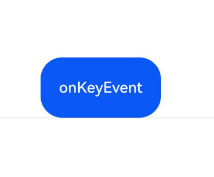

# Key Event
<!--Kit: ArkUI-->
<!--Subsystem: ArkUI-->
<!--Owner: @yihao-lin-->
<!--Designer: @piggyguy-->
<!--Tester: @songyanhong-->
<!--Adviser: @Brilliantry_Rui-->

A key event is triggered when a focusable component, such as **Button**, receives input from a physical keyboard, remote control, or any other key-based input devices. For components that are not focusable by default, like **Text** and **Image**, you can set the [focusable](ts-universal-attributes-focus.md#focusable) attribute to **true** to enable key events.

For details about the process and specific timing of the key event triggering, see [Key Event Data Flow](../../../ui/arkts-interaction-development-guide-keyboard.md#key-event-data-flow).

>  **NOTE**
>
>  The initial APIs of this module are supported since API version 7. Newly added APIs will be marked with a superscript to indicate their earliest API version.

## onKeyEvent

onKeyEvent(event: (event: KeyEvent) => void): T

Triggered when a key event occurs.

**Atomic service API**: This API can be used in atomic services since API version 11.

**System capability**: SystemCapability.ArkUI.ArkUI.Full

**Parameters**

| Name| Type                         | Mandatory| Description              |
| ------ | ----------------------------- | ---- | ------------------ |
| event  | (event: [KeyEvent](#keyevent)) => void | Yes  | **KeyEvent** object.|

**Return value**

| Type| Description|
| -------- | -------- |
| T | Current component.|

## onKeyEvent<sup>15+</sup>
onKeyEvent(event: Callback\<KeyEvent, boolean>): T

Triggered when a key operation is performed on the bound component after it obtains focus. If the callback returns **true**, the key event is considered handled.

**Atomic service API**: This API can be used in atomic services since API version 15.

**System capability**: SystemCapability.ArkUI.ArkUI.Full

**Parameters**

| Name| Type                         | Mandatory| Description              |
| ------ | ----------------------------- | ---- | ------------------ |
| event  | [Callback](./ts-types.md#callback12)<[KeyEvent](#keyevent), boolean>| Yes  | Callback for handling the key event.|

**Return value**

| Type| Description|
| -------- | -------- |
| T | Current component.|

## onKeyPreIme<sup>12+</sup>

onKeyPreIme(event: Callback<KeyEvent, boolean>): T

Triggered before other callbacks when a key operation is performed on the bound component after it obtains focus.

If the return value of this callback is **true**, the key event is considered consumed, and subsequent event callbacks (**keyboardShortcut**, input method events, **onKeyEventDispatch**, and **onKeyEvent**) will be intercepted and no longer triggered.

**Atomic service API**: This API can be used in atomic services since API version 12.

**System capability**: SystemCapability.ArkUI.ArkUI.Full

**Parameters**

| Name| Type                         | Mandatory| Description              |
| ------ | ----------------------------- | ---- | ------------------ |
| event  | [Callback](./ts-types.md#callback12)<[KeyEvent](#keyevent), boolean>| Yes  | Callback for handling the key event.|

**Return value**

| Type| Description|
| -------- | -------- |
| T | Current component.|

## onKeyEventDispatch<sup>15+</sup>

onKeyEventDispatch(event: Callback\<KeyEvent, boolean>): T

Triggered when the bound component receives a key event. The key event will not be dispatched to its child components. Only existing key events can be intercepted; creating new **KeyEvent** objects for dispatch is not supported.

If the callback returns **true**, the key event is marked as consumed and will not [bubble up](../../../ui/arkts-interaction-basic-principles.md#event-bubbling) to parent components.

**Atomic service API**: This API can be used in atomic services since API version 15.

**System capability**: SystemCapability.ArkUI.ArkUI.Full

**Parameters**

| Name| Type                         | Mandatory| Description              |
| ------ | ----------------------------- | ---- | ------------------ |
| event  | [Callback](./ts-types.md#callback12)<[KeyEvent](#keyevent), boolean>| Yes  | Callback for handling key event dispatch.|

**Return value**

| Type| Description|
| -------- | -------- |
| T | Current component.|


## KeyEvent

**System capability**: SystemCapability.ArkUI.ArkUI.Full

| Name                                   | Type                   | Read-Only   |  Optional  |  Description                        |
| ------------------------------------- | ---------------------------------------- |--------- | ------------- | -------------------------- |
| type                                  | [KeyType](ts-appendix-enums.md#keytype) |  No |  No    |Key type.<br>**Atomic service API**: This API can be used in atomic services since API version 11.                    |
| [keyCode](../../apis-input-kit/js-apis-keycode.md#keycode) | number           |  No       |  No    |Key value.<br>**Atomic service API**: This API can be used in atomic services since API version 11.                    |
| keyText                               | string                   |  No  |  No    |Name of the key.<br>**Atomic service API**: This API can be used in atomic services since API version 11.                    |
| keySource                             | [KeySource](ts-appendix-enums.md#keysource) |  No|  No    |Type of the input device that triggers the key event.<br>**Atomic service API**: This API can be used in atomic services since API version 11.            |
| deviceId                              | number                |  No   |  No    |ID of the input device that triggers the key event.<br>**Atomic service API**: This API can be used in atomic services since API version 11.            |
| metaKey                               | number            |  No        |  No    |State of the Meta key (the key located next to the **Ctrl** key in the lower left corner of the keyboard, or the key marked with a window logo) when the key event occurs. The value **1** indicates that the Meta key is pressed, and **0** indicates that it is not pressed.<br>**Atomic service API**: This API can be used in atomic services since API version 11.|
| timestamp                             | number                 |  No     |  No    |Timestamp of the event. It is the interval between the time when the event is triggered and the time when the system starts, in nanoseconds.<br>**Atomic service API**: This API can be used in atomic services since API version 11.|
| stopPropagation                       | () => void             |  No   |  No    |Blocks [event bubbling](../../../ui/arkts-interaction-basic-principles.md#event-bubbling) propagation.<br>**Atomic service API**: This API can be used in atomic services since API version 11.                 |
| intentionCode<sup>10+</sup>           | [IntentionCode](#intentioncode10) |  No  |  No    |Intention corresponding to the key.<br>Default value: **IntentionCode.INTENTION_UNKNOWN**.<br>**Atomic service API**: This API can be used in atomic services since API version 11.      |
| unicode<sup>14+</sup>                              | number              |  No        |  Yes    |Unicode value of the key. Non-space basic Latin characters in the 0x0021-0x007E range are supported. Characters with a value of 0 are not supported. In the case of key combination, this API returns the Unicode value of the key corresponding to the key event.<br>**Atomic service API**: This API can be used in atomic services since API version 14.|
| isNumLockOn<sup>19+</sup>                               | boolean              |  No       |  Yes   |NumLock state. **true**: locked. **false**: unlocked.<br>**Atomic service API**: This API can be used in atomic services since API version 19.                    |
| isCapsLockOn<sup>19+</sup>                               | boolean         |  No       |  Yes    |CapsLock state. **true**: locked. **false**: unlocked.<br>**Atomic service API**: This API can be used in atomic services since API version 19.                    |
| isScrollLockOn<sup>19+</sup>                               | boolean        |  No     |  Yes    |ScrollLock state. **true**: locked. **false**: unlocked.<br>**Atomic service API**: This API can be used in atomic services since API version 19.                    |

### getModifierKeyState<sup>12+</sup>

getModifierKeyState?(keys: Array&lt;string&gt;): boolean

Obtains the pressed status of modifier keys.

**Atomic service API**: This API can be used in atomic services since API version 13.

**System capability**: SystemCapability.ArkUI.ArkUI.Full

**Parameters**

| Name| Type                         | Mandatory| Description              |
| ------ | ----------------------------- | ---- | ------------------ |
| keys | Array&lt;string&gt; | Yes  | Obtains the pressed status of modifier keys. For details about the error message, see the following error codes. The following modifier keys are supported: 'Ctrl'\| 'Alt' \| 'Shift'.<br>**NOTE**<br>This API is not supported in stylus scenarios.|

**Return value**

| Type   | Description                                                 |
| ------- | ----------------------------------------------------- |
| boolean | Whether the modifier key is pressed. **true** if the modifier key is pressed; **false** otherwise.|

**Error codes**

For details about the error codes, see [Universal Error Codes](../../errorcode-universal.md).

| ID| Error Message|
| ------- | -------- |
| 401 | Parameter error. Possible causes: 1. Incorrect parameter types. 2. Parameter verification failed. |

## IntentionCode<sup>10+</sup>

type IntentionCode = IntentionCode

Intention corresponding to the key.

**Atomic service API**: This API can be used in atomic services since API version 11.

**System capability**: SystemCapability.ArkUI.ArkUI.Full

| Type| Description|
| ----- | ----------------- |
| [IntentionCode](../../apis-input-kit/js-apis-intentioncode.md) | Intention corresponding to the key.|

## Example

### Example 1: Triggering the onKeyEvent Callback

This example demonstrates key event handling through a **Button** component. When the button is focused, pressing a key triggers the **onKeyEvent** callback. For details about the process and specific timing of the key event triggering, see [Key Event Data Flow](../../../ui/arkts-interaction-development-guide-keyboard.md#key-event-data-flow).

```ts
// xxx.ets
@Entry
@Component
struct KeyEventExample {
  @State text: string = ''
  @State eventType: string = ''

  build() {
    Column() {
      Button('KeyEvent')
        .defaultFocus(true)
        .onKeyEvent((event?: KeyEvent) => {
          if (event) {
            if (event.type === KeyType.Down) {
              this.eventType = 'Down'
            }
            if (event.type === KeyType.Up) {
              this.eventType = 'Up'
            }
            this.text = 'KeyType:' + this.eventType + '\nkeyCode:' + event.keyCode + '\nkeyText:' + event.keyText +
              '\nintentionCode:' + event.intentionCode
          }
        })
      Text(this.text).padding(15)
    }.height(300).width('100%').padding(35)
  }
}
```

  

### Example 2: Obtaining the Unicode Code Point

This example demonstrates how to obtain the Unicode code point of the pressed key using the key event.

```ts
// xxx.ets
@Entry
@Component
struct KeyEventExample {
  @State text: string = ''
  @State eventType: string = ''
  @State keyType: string = ''

  build() {
    Column({ space: 10 }) {
      Button('KeyEvent')
        .onKeyEvent((event?: KeyEvent) => {
          if (event) {
            if (event.type === KeyType.Down) {
              this.eventType = 'Down'
            }
            if (event.type === KeyType.Up) {
              this.eventType = 'Up'
            }
            if (event.unicode == 97) {
              this.keyType = 'a'
            } else if (event.unicode == 65) {
              this.keyType = 'A'
            } else {
              this.keyType = ' '
            }
            this.text =
              'KeyType:' + this.eventType + '\nUnicode:' + event.unicode + '\nkeyCode:' + event.keyCode + '\nkeyType:' +
              this.keyType
          }
        })
      Text(this.text).padding(15)
    }.height(300).width('100%').padding(35)
  }
}
```

 

### Example 3: Triggering the onKeyPreIme Callback

This example demonstrates how to use the **onKeyPreIme** callback to intercept and disable the left arrow key in a text box.

```ts
import { KeyCode } from '@kit.InputKit';

@Entry
@Component
struct PreImeEventExample {
  @State buttonText: string = '';
  @State buttonType: string = '';
  @State columnText: string = '';
  @State columnType: string = '';

  build() {
    Column() {
      Search({
        placeholder: "Search..."
      })
        .width("80%")
        .height("40vp")
        .border({ radius: "20vp" })
        .onKeyPreIme((event: KeyEvent) => {
          // Prevent the left arrow key from working.
          if (event.keyCode == KeyCode.KEYCODE_DPAD_LEFT) {
            return true;
          }
          return false;
        })
    }
  }
}
```

### Example 4: Preventing Event Bubbling

This example demonstrates event bubbling prevention using **stopPropagation**. Adding **event.stopPropagation()** to the **Button** component's **onKeyEvent** callback ensures only the **Button** component responds to keyboard events, while the parent **Column** remains unresponsive.

>**NOTE**
>
> 1. **onKeyEvent** events bubble by default. 
> 2. Event bubbling is a form of event propagation in the document object model (DOM), where an event is first handled by an element and then passed to its parent element for further processing. 
> 3. In [onKeyEvent<sup>15+</sup>](#onkeyevent15), returning **true** consumes the key event and prevents bubbling, achieving the same effect as **stopPropagation**.

```ts
@Entry
@Component
struct KeyEventExample {
  @State buttonText: string = '';
  @State buttonType: string = '';
  @State columnText: string = '';
  @State columnType: string = '';

  build() {
    Column() {
      Button('onKeyEvent')
        .defaultFocus(true)
        .width(112).height(56)
        .onKeyEvent((event?: KeyEvent) => {
          // Use stopPropagation to prevent the key event from bubbling up.
          if (event) {
            if (event.stopPropagation) {
              event.stopPropagation();
            }
            if (event.type === KeyType.Down) {
              this.buttonType = 'Down';
            }
            if (event.type === KeyType.Up) {
              this.buttonType = 'Up';
            }
            this.buttonText = 'Button: \n' +
              'KeyType:' + this.buttonType + '\n' +
              'KeyCode:' + event.keyCode + '\n' +
              'KeyText:' + event.keyText;
          }
        })

      Divider()
      Text(this.buttonText).fontColor(Color.Green)

      Divider()
      Text(this.columnText).fontColor(Color.Red)
    }.width('100%').height('100%').justifyContent(FlexAlign.Center)
    .onKeyEvent((event?: KeyEvent) => { // Set the onKeyEvent event for the parent container Column.
      if (event) {
        if (event.type === KeyType.Down) {
          this.columnType = 'Down';
        }
        if (event.type === KeyType.Up) {
          this.columnType = 'Up';
        }
        this.columnText = 'Column: \n' +
          'KeyType:' + this.columnType + '\n' +
          'KeyCode:' + event.keyCode + '\n' +
          'KeyText:' + event.keyText;
      }
    })
  }
}
```

 
