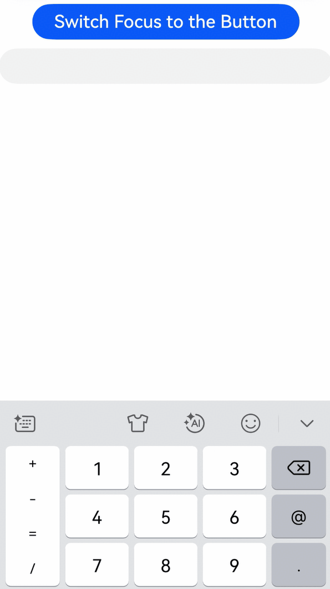

# Keyboard Determination Event
<!--Kit: ArkUI-->
<!--Subsystem: ArkUI-->
<!--Owner: @tzcurtain-->
<!--Designer: @xiangyuan6-->
<!--Tester: @jiaoaozihao-->
<!--Adviser: @Brilliantry_Rui-->

A keyboard determination event is triggered when a component gains focus. The system determines whether a keyboard is required based on the return value of the callback function.

> **NOTE**
>
> The initial APIs of this module are supported since API version 24. Newly added APIs will be marked with a superscript to indicate their earliest API version.

## onNeedSoftkeyboard

onNeedSoftkeyboard(onNeedSoftkeyboardCallback: OnNeedSoftkeyboardCallback | undefined): T

Called when the component determines whether the keyboard is required. This callback is mainly used in the keyboard continuation scenario. When the focus is switched from the text box to another component, if the return value of [OnNeedSoftkeyboardCallback](#onneedsoftkeyboardcallback) of the target component is set to **true**, the keyboard will not be collapsed; if set to **false**, the keyboard will be collapsed.

This API does not take effect for components that cannot gain focus.

For the text box, if the return value of this API is set to **false**, the keyboard will not be displayed when the text box is tapped.

For the **Web** component, this component checks whether there are editable nodes when the return value is **true** and retains the keyboard if editable nodes exist; otherwise, the keyboard is not retained regardless of whether editable nodes exist.

For the **XComponent**, the keyboard is retained only if the return value is **true** and **XComponent** sets [OH_NativeXComponent_SetNeedSoftKeyboard](../capi-native-interface-xcomponent-h.md#oh_arkui_xcomponent_setneedsoftkeyboard) to **true**. If the return value is **false**, the keyboard will not be retained regardless of the setting of **OH_NativeXComponent_SetNeedSoftKeyboard**.

When **onNeedSoftkeyboard** returns **true**, the text box of the application needs to proactively call [attach](../../apis-ime-kit/js-apis-inputmethod.md#attach15) to establish the communication between the input method framework and the input method application. Otherwise, the keyboard will not respond to the click event. (When the keyboard is out of focus, the communication will be disconnected.)

**Atomic service API**: This API can be used in atomic services since API version 24.

**Model constraint**: This API can be used only in the stage model.

**System capability**: SystemCapability.ArkUI.ArkUI.Full

**Parameters**

| Name                    | Type                                  | Mandatory| Description                                    |
| -------------------------- | ------------------------------------- | ---- | ---------------------------------------- |
| onNeedSoftkeyboardCallback | [OnNeedSoftkeyboardCallback](#onneedsoftkeyboardcallback) \| undefined | Yes| Callback to be invoked when the keyboard determination event is triggered. The system determines whether to display the keyboard based on the return value.<br> If this parameter is set to **undefined**, the callback is not invoked; however, the keyboard is displayed when the text box is tapped and collapses when the user interacts with other components.|

**Return value**

| Type| Description|
| -------- | -------- |
| T | Current component.|

## OnNeedSoftkeyboardCallback

OnNeedSoftkeyboardCallback = () => boolean

Called when the component determines whether the keyboard is required.

**Atomic service API**: This API can be used in atomic services since API version 24.

**Model constraint**: This API can be used only in the stage model.

**System capability**: SystemCapability.ArkUI.ArkUI.Full

**Return value**

| Type| Description|
| -------- | -------- |
| boolean | Whether the keyboard is required.<br>Returns **true** if the component requires the keyboard; returns **false** otherwise.|

## Example

### Example 1: Enabling the Keyboard Continuation

In this example, the [onNeedSoftkeyboard](#onneedsoftkeyboard) API is used to enable the keyboard continuation for a button. After the keyboard is started by the text box, switch the focus to the button upon a tap. In this case, the keyboard will not collapse. Tap the text box again to continue entering text.

The [onNeedSoftkeyboard](#onneedsoftkeyboard) API is available since API version 24.

```ts
@Entry
@Component
struct Index {
  build() {
    Column() {
      Button('Switch Focus to the Button')
        .onClick(() => {
          this.getUIContext().getFocusController().requestFocus('Button')
        })
        .key('Button')
        .fontSize(20)
        .width('80%')
        .margin('10')
        .onNeedSoftkeyboard((): boolean => {
          return true;
        })
      TextInput()
        .key('TextInput1')
    }
    .height('100%')
    .width('100%')
  }
}
```

 
