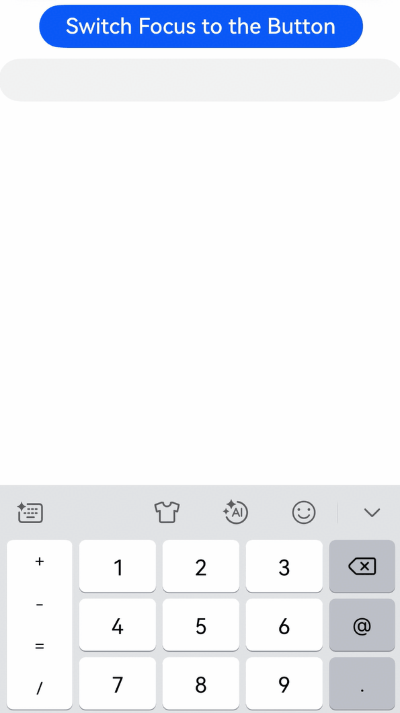

# Keyboard Determination Event
<!--Kit: ArkUI-->
<!--Subsystem: ArkUI-->
<!--Owner: @tzcurtain-->
<!--Designer: @xiangyuan6-->
<!--Tester: @jiaoaozihao-->
<!--Adviser: @Brilliantry_Rui-->
<!-- md-trans-meta sourceCommit=92567145241181b97abe57e944e177355e50f4eb translatedAt=2026-09-02T12:30:39.903Z -->

When a component gains focus, the focused component triggers this event, which is used to flexibly control the display and hiding of the soft keyboard during focus switching. The system determines whether a keyboard is required based on the return value of the callback function of this event. It is mainly applicable to keyboard continuation scenarios, helping developers avoid frequent keyboard collapse and pop-up, and optimizing the user interaction experience.

> **NOTE**
>
> - The initial APIs of this module are supported since API version 24. Newly added APIs will be marked with a superscript to indicate their earliest API version.
>
> - The APIs of this module can be used only in the stage model.

## onNeedSoftkeyboard

onNeedSoftkeyboard(onNeedSoftkeyboardCallback: OnNeedSoftkeyboardCallback | undefined): T

Called when the component determines whether the keyboard is required. This callback is mainly used in the keyboard continuation scenario. When the focus is switched from the text box to another component, if the return value of [OnNeedSoftkeyboardCallback](#onneedsoftkeyboardcallback) of the target component is set to **true**, the keyboard will not be collapsed; if set to **false**, the keyboard will be collapsed.

This API does not take effect for components that cannot gain focus.

For the text box, if the return value of this API is set to **false**, the keyboard will not be displayed when the text box is tapped.

When the **Web** component uses this method, if the return value is `true`, the **Web** component checks whether there are editable nodes in the component and retains the keyboard only if editable nodes exist; if the return value is `false`, the keyboard is not retained regardless of whether editable nodes exist.

When the **XComponent** component uses this method, the keyboard is retained only if the return value is `true` and the **XComponent** component sets [OH_ArkUI_XComponent_SetNeedSoftKeyboard()](../capi-native-interface-xcomponent-h.md#oh_arkui_xcomponent_setneedsoftkeyboard) to request a keyboard; if the return value is `false`, the keyboard is not retained regardless of how the component is configured.

When the return value is `true`, the self-drawn input box of the application needs to proactively call [attach](../../apis-ime-kit/js-apis-inputmethod.md#attach15) upon focus acquisition to establish the communication between the input method framework and the input method application; otherwise, tapping the keyboard will not respond. Note: The communication between the input method framework and the input method application is disconnected upon focus loss and needs to be re-established upon focus acquisition.

This API is applicable only to the scenario of input method application continuation and does not take effect for custom keyboards. For custom keyboard continuation, see [setCustomKeyboardContinueFeature](../arkts-apis-uicontext-uicontext.md#setcustomkeyboardcontinuefeature23).

**Atomic service API**: This API can be used in atomic services since API version 24.

**Model constraint**: This API can be used only in the stage model.

**System capability**: SystemCapability.ArkUI.ArkUI.Full

**Parameters**

| Name                    | Type                                  | Mandatory| Description                                    |
| -------------------------- | ------------------------------------- | ---- | ---------------------------------------- |
| onNeedSoftkeyboardCallback | [OnNeedSoftkeyboardCallback](#onneedsoftkeyboardcallback) \| undefined | Yes | Callback invoked when the event is triggered. The system determines whether the keyboard is needed based on the return value of the callback.<br>When set to undefined, the callback is not triggered, and input box components behave as if returning true. Other components behave as if returning false. Prerequisite: The component must be focusable; otherwise, this API does not take effect. When the return value is true, the self-drawn input box must proactively call the [attach](../../apis-ime-kit/js-apis-inputmethod.md#attach15) method upon focus acquisition to establish communication with the input method; otherwise, tapping the keyboard will not respond. |

**Return value**

| Type| Description|
| -------- | -------- |
| T | Current component.|

## OnNeedSoftkeyboardCallback

type OnNeedSoftkeyboardCallback = () => boolean

This callback is triggered when the component bound to this method determines whether a keyboard is required. Prerequisite: The component must be focusable; otherwise, this API does not take effect.

**Atomic service API**: This API can be used in atomic services since API version 24.

**Model constraint**: This API can be used only in the stage model.

**System capability**: SystemCapability.ArkUI.ArkUI.Full

**Return value**

| Type| Description|
| -------- | -------- |
| boolean | Whether the component needs a keyboard.<br>If the return value of this callback is `true`, the component needs a keyboard; if the return value is `false`, the component does not need a keyboard. |

## Example

### Example 1: Enabling the Keyboard Continuation

In this example, the [onNeedSoftkeyboard](#onneedsoftkeyboard) API is used to enable the keyboard continuation for a button. After the keyboard is started by the text box, switch the focus to the button upon a tap. In this case, the keyboard will not collapse. Tap the text box again to continue entering text.

The [onNeedSoftkeyboard](#onneedsoftkeyboard) API is available since API version 24.

```ts
@Entry
@Component
struct Index {
  build() {
    Column() {
      Button('Switch Focus to the Button')
        .onClick(() => {
          this.getUIContext().getFocusController().requestFocus('Button');
        })
        .key('Button')
        .fontSize(20)
        .width('80%')
        .margin('10')
        .onNeedSoftkeyboard((): boolean => {
          return true;
        })
      TextInput()
        .key('TextInput1')
    }
    .height('100%')
    .width('100%')
  }
}
```

 
