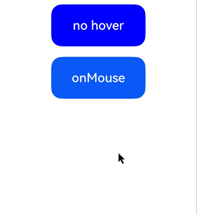

# Mouse Event
<!--Kit: ArkUI-->
<!--Subsystem: ArkUI-->
<!--Owner: @yihao-lin-->
<!--Designer: @piggyguy-->
<!--Tester: @songyanhong-->
<!--Adviser: @Brilliantry_Rui-->

Mouse events are used to listen for mouse click and move interactions on a component. You can obtain information about mouse buttons, actions, coordinates, and historical points. This event is applicable to scenarios where mouse interaction, track drawing, hand gesture recognition, or input response experience needs to be optimized. If a mouse action triggers multiple events, the order of these events is fixed. By default, mouse events bubble.

> **NOTE**
>
> - The initial APIs of this module are supported since API version 8. Newly added APIs will be marked with a superscript to indicate their earliest API version.
>
> - Currently, mouse events can be triggered by an external mouse or touchpad.

## onMouse

onMouse(event: (event: MouseEvent) => void): T

This callback is triggered when the current component is clicked by the mouse button, or the mouse is hovered over or moved on the component, or the same mouse operation is triggered by the touchpad.

**Atomic service API**: This API can be used in atomic services since API version 11.

**System capability**: SystemCapability.ArkUI.ArkUI.Full

**Parameters**

| Name | Type                             | Mandatory| Description                                                        |
| ------- | --------------------------------- | ---- | ------------------------------------------------------------ |
| event | (event: [MouseEvent](#mouseevent)) => void | Yes  | Timestamp, mouse button, action, coordinates of the clicked point on the entire screen, and coordinates of the clicked point relative to the component when the event is triggered.|

**Return value**

| Type| Description|
| -------- | -------- |
| T | Current component.|

## MouseEvent

Inherited from [BaseEvent](ts-universal-events-click.md).

### Attributes

**System capability**: SystemCapability.ArkUI.ArkUI.Full

| Name                   | Type                   | Read-Only   |  Optional  |     Description                         |
| ---------------------- | -------------------------------------- |-------------- |------------- |  --------------------------- |
| x                      | number                                  | No          |  No    |X coordinate of the mouse point in the [component coordinate system](../../../ui/arkui-glossary.md#component-coordinate-system) based on the event-responsive component.<br>Unit: vp.<br>**Atomic service API**: This API can be used in atomic services since API version 11.        |
| y                      | number                                    |  No        |  No    |Y coordinate of the mouse point in the [component coordinate system](../../../ui/arkui-glossary.md#component-coordinate-system) based on the event-responsive component.<br>Unit: vp.<br>**Atomic service API**: This API can be used in atomic services since API version 11.        |
| button                 | [MouseButton](ts-appendix-enums.md#mousebutton8)      |  No    |  No    |Mouse button.<br>**Atomic service API**: This API can be used in atomic services since API version 11.                       |
| action                 | [MouseAction](ts-appendix-enums.md#mouseaction8)       |  No  |  No    |Mouse action.<br>**Atomic service API**: This API can be used in atomic services since API version 11.                       |
| stopPropagation        | () => void                            |  No         |  No    |Blocks [event bubbling](../../../ui/arkts-interaction-basic-principles.md#event-bubbling). This method is applicable when the current component has handled the mouse event and needs to prevent the event from being passed to the parent component.<br>**Atomic service API**: This API can be used in atomic services since API version 11.                     |
| windowX<sup>10+</sup> | number                           |  No         |  No    |X coordinate of the mouse position in the coordinate system of the current application window.<br>Unit: vp.<br>**Atomic service API**: This API can be used in atomic services since API version 11.<br>**Model restriction:** This API can be used only in the stage model.|
| windowY<sup>10+</sup> | number                           |  No        |  No    |Y coordinate of the mouse position in the coordinate system of the current application window.<br>Unit: vp.<br>**Atomic service API**: This API can be used in atomic services since API version 11.<br>**Model restriction:** This API can be used only in the stage model.|
| displayX<sup>10+</sup> | number                          |  No        |  No    |X coordinate of the mouse position in the coordinate system of the current screen window.<br>Unit: vp.<br>**Atomic service API**: This API can be used in atomic services since API version 11.<br>**Model restriction:** This API can be used only in the stage model.|
| displayY<sup>10+</sup> | number                         |  No         |  No    |Y coordinate of the mouse position in the coordinate system of the current screen window.<br>Unit: vp.<br>**Atomic service API**: This API can be used in atomic services since API version 11.<br>**Model restriction:** This API can be used only in the stage model.|
| screenX<sup>(deprecated)</sup> | number                 |  No        |  No    |X coordinate of the mouse position in the coordinate system of the current application window.<br>Unit: vp.<br>Note: This API is supported since API version 8 and deprecated since API version 10. You are advised to use **windowX** instead.|
| screenY<sup>(deprecated)</sup> | number                 |  No         |  No    |Y coordinate of the mouse position in the coordinate system of the current application window.<br>Unit: vp.<br>Note: This API is supported since API version 8 and deprecated since API version 10. You are advised to use **windowY** instead.|
| rawDeltaX<sup>15+</sup> | number      |  No  |  Yes    |Movement increment of the mouse along the X axis in a two-dimensional plane. The value is the original movement data of the mouse hardware, which is expressed in the unit of the mouse movement distance in the physical world. The reported value is determined by the hardware, not the physical or logical pixels of the screen.<br>**Atomic service API**: This API can be used in atomic services since API version 15.<br>**Note:** In versions earlier than API version 26.0.0, the returned value of **rawDeltaX** is not the original movement data of the mouse hardware. Instead, the original data is scaled down by X times, where X is the display size ratio of the system. In API version 26.0.0 and later versions, the returned value of **rawDeltaX** is the original movement data of the mouse hardware.<br>**Model restriction:** This API can be used only in the stage model.|
| rawDeltaY<sup>15+</sup> | number      |  No    |  Yes   |Movement increment of the mouse along the Y axis in a two-dimensional plane. The value is the original movement data of the mouse hardware, which is expressed in the unit of the mouse movement distance in the physical world. The reported value is determined by the hardware, not the physical or logical pixels of the screen.<br>**Atomic service API**: This API can be used in atomic services since API version 15.<br>**Note**: In versions earlier than API version 26.0.0, the returned value of **rawDeltaY** is not the original movement data of the mouse hardware, but the original data scaled down by X times, where X is the display size ratio of the system. In API version 26.0.0 and later versions, the returned value of **rawDeltaY** is the original movement data of the mouse hardware.<br>**Model restriction:** This API can be used only in the stage model.|
| pressedButtons<sup>15+</sup> | MouseButton[]      |  No     | Yes    |Set of buttons being pressed.<br>**Atomic service API**: This API can be used in atomic services since API version 15.<br>**Model restriction:** This API can be used only in the stage model.|
| globalDisplayX<sup>20+</sup> | number       |  No   |  Yes   |X coordinate of the mouse position in the [global coordinate system](../../../windowmanager/window-terminology.md#global-coordinate-system).<br>Unit: vp.<br>Value range: (-∞, +∞)<br>**Atomic service API**: This API can be used in atomic services since API version 20.<br>**Model restriction:** This API can be used only in the stage model.|
| globalDisplayY<sup>20+</sup> | number      | No     |  Yes   |Y coordinate of the mouse position in the [global coordinate system](../../../windowmanager/window-terminology.md#global-coordinate-system).<br>Unit: vp.<br>Value range: (-∞, +∞)<br>**Atomic service API**: This API can be used in atomic services since API version 20.<br>**Model restriction:** This API can be used only in the stage model.|
| eventHandleId<sup>24+</sup> | number | No| Yes| Unique ID for handling an event.<br> Value range: [0, +∞).<br> Note: This field is used when events are dispatched through the [postInputEventWithStrategy](../js-apis-arkui-builderNode.md#postinputeventwithstrategy24) API. Its value increases by 100,000 each time an event is dispatched.<br> Dispatching events repeatedly with the same **eventHandleId** will cause abnormal event responses. Assign a value to this field only when constructing an event; no further operations are required in other scenarios.<br>**Atomic service API**: This API can be used in atomic services since API version 24.<br>**Model restriction:** This API can be used only in the stage model.|

### getCurrentLocalPosition

getCurrentLocalPosition?(): Coordinate2D

Obtains the coordinates of the upper left corner of the mouse pointer relative to the real-time position of the current component. This API is applicable to scenarios where the coordinates of the mouse pointer relative to the current component are obtained in real time when the component position changes dynamically.

**Since:** 26.0.0

**Model restriction:** This API can be used only in the stage model.

**Atomic service API**: This API can be used in atomic services since API version 26.0.0.

**System capability**: SystemCapability.ArkUI.ArkUI.Full

**Return value**

| Type   | Description                                                 |
| ------- | ----------------------------------------------------- |
| [Coordinate2D](ts-types.md) | Coordinates of the upper left corner of the mouse pointer relative to the real-time position of the current component.|

### getHistoricalPoints

getHistoricalPoints?(): Array&lt;MouseHistoricalPoint&gt;

Obtains information about all historical points in the current frame. Historical points can be used to implement smoother drawing, hand gesture recognition, performance optimization, track analysis, or data analysis. For the time being, a mouse event can be triggered only by an external mouse device.

This API can be called only in the [MouseEvent](#mouseevent) object to obtain the information about the historical points in the current frame when the [onMouse](#onmouse) event is triggered. The mouse event reporting frequency varies depending on the device. Generally, only one mouse event is reported in a frame. If more than one [MouseEvent](#mouseevent) is received in the current frame, the last point in the frame is returned through the [onMouse](#onmouse) event, and the other points are used as historical points.

**Since:** 26.0.0

**Model restriction:** This API can be used only in the stage model.

**Atomic service API**: This API can be used in atomic services since API version 26.0.0.

**System capability**: SystemCapability.ArkUI.ArkUI.Full

**Return value**

| Type                                                | Description             |
| -------------------------------------------------- | --------------- |
| Array&lt;[MouseHistoricalPoint](#mousehistoricalpoint)&gt; | Array of all historical points in the current frame.|

## MouseHistoricalPoint

Historical point information of the mouse event.

Historical points are sorted in chronological order. The first historical point is the information about the earliest event, and the last historical point is the information about the latest event. The number of historical points depends on the configuration of the system event queue and hardware performance. Historical points are mainly used in the following scenarios:

1. Smooth drawing: Historical points can be used to achieve a smoother drawing effect, especially when the mouse moves quickly.

2. Hand gesture recognition: Various mouse gestures can be recognized by analyzing the trajectory of historical points.

3. Performance optimization: Multiple historical points are processed in one event callback, reducing the event processing frequency and improving performance.

4. Trajectory analysis: The mouse movement trajectory is analyzed for drawing apps or gesture control.

5. Data analysis: The timestamp in the historical point can be used to calculate the mouse movement speed.

**Since:** 26.0.0

**Model restriction:** This API can be used only in the stage model.

**Atomic service API**: This API can be used in atomic services since API version 26.0.0.

**System capability**: SystemCapability.ArkUI.ArkUI.Full

| Name        | Type       | Read-Only| Optional| Description                                     |
| ---------- | --------- | ---- | ---- | --------------------------------------- |
| x          | number    | No  | No  | X coordinate of the mouse pointer relative to the upper left corner of the event responder.<br>Unit: vp.         |
| y          | number    | No  | No  | Y coordinate of the mouse pointer relative to the upper left corner of the event responder.<br>Unit: vp.         |
| displayX   | number    | No  | No  | X coordinate of the mouse pointer relative to the upper left corner of the current app screen.<br>Unit: vp.           |
| displayY   | number    | No  | No  | Y coordinate of the mouse pointer relative to the upper left corner of the current app screen.<br>Unit: vp.           |
| windowX    | number    | No  | No  | X coordinate of the mouse pointer relative to the upper left corner of the app window.<br>Unit: vp.           |
| windowY    | number    | No  | No  | Y coordinate of the mouse pointer relative to the upper left corner of the app window.<br>Unit: vp.           |
| globalDisplayX | number| No  | No  |X coordinate of the mouse position in the [global coordinate system](../../../windowmanager/window-terminology.md#global-coordinate-system).<br>Unit: vp. |
| globalDisplayY | number| No  | No  |Y coordinate of the mouse position in the [global coordinate system](../../../windowmanager/window-terminology.md#global-coordinate-system).<br>Unit: vp. |
| timestamp  | number    | No  | No  | Timestamp of the mouse event, indicating the interval between the time when the event is triggered and the time when the system starts.<br>Unit: ns                             |

## Examples

### Example 1: Obtaining Parameters Related to a Mouse Event

This example demonstrates how to set a mouse event on a button. When the button is clicked using a mouse device, the [onMouse](#onmouse) event is triggered to obtain relevant mouse event parameters. Starting from API version 15, the [MouseEvent](#mouseevent) object provides access to the **targetDisplayId**, **rawDeltaX**, **rawDeltaY**, and **pressedButtons** parameters.

For mouse wheel event examples, see [Axis Event](ts-universal-events-axis.md#example).

```ts
// xxx.ets
@Entry
@Component
struct MouseEventExample {
  @State hoverText: string = 'no hover';
  @State mouseText: string = '';
  @State action: string = '';
  @State mouseBtn: string = '';
  @State color: Color = Color.Blue;

  build() {
    Column({ space: 20 }) {
      Button(this.hoverText)
        .width(180)
        .height(80)
        .backgroundColor(this.color)
        .fontSize(24)
        .onHover((isHover: boolean) => {
          // Use the onHover event to dynamically change the text content and background color of a button when the mouse pointer is hovered on it.
          if (isHover) {
            this.hoverText = 'hover';
            this.color = Color.Pink;
          } else {
            this.hoverText = 'no hover';
            this.color = Color.Blue;
          }
        })
      Button('onMouse')
        .width(180).height(80)
        .fontSize(24)
        // Use onMouse to listen for mouse events, parse the buttons, actions, coordinates, and other information, and combines the information.
        .onMouse((event: MouseEvent): void => {
          if (event) {
            // Determine the type of the pressed mouse button.
            switch (event.button) {
              case MouseButton.None:
                this.mouseBtn = 'None';
                break;
              case MouseButton.Left:
                this.mouseBtn = 'Left';
                break;
              case MouseButton.Right:
                this.mouseBtn = 'Right';
                break;
              case MouseButton.Back:
                this.mouseBtn = 'Back';
                break;
              case MouseButton.Forward:
                this.mouseBtn = 'Forward';
                break;
              case MouseButton.Middle:
                this.mouseBtn = 'Middle';
                break;
            }
            // Determine the type of the triggered mouse action.
            switch (event.action) {
              case MouseAction.Press:
                this.action = 'Press';
                break;
              case MouseAction.Move:
                this.action = 'Move';
                break;
              case MouseAction.Release:
                this.action = 'Release';
                break;
              case MouseAction.ENTER_WINDOW:
                this.action = 'ENTER_WINDOW';
                break;
              case MouseAction.LEAVE_WINDOW:
                this.action = 'LEAVE_WINDOW';
                break;
            }
            // Combine and display all information about the mouse event.
            this.mouseText = 'onMouse:\nButton = ' + this.mouseBtn +
              '\nAction = ' + this.action + '\nXY=(' + event.x + ',' + event.y + ')' +
              '\nwindowXY=(' + event.windowX + ',' + event.windowY + ')' +
              '\ntargetDisplayId = ' + event.targetDisplayId +
              '\nrawDeltaX = ' + event.rawDeltaX +
              '\nrawDeltaY = ' + event.rawDeltaY +
              '\nlength = ' + event.pressedButtons?.length;
          }
        })
      Text(this.mouseText)
    }.padding({ top: 30 }).width('100%')
  }
}
```

 

The figure below shows how the button looks when clicked.



### Example 2: Obtaining Historical Points of the Current Frame

This example calls the [getHistoricalPoints](#gethistoricalpoints) API to obtain the historical points of the current frame, which can be used to implement smoother drawing.

The **getHistoricalPoints** API is added as of API version 26.0.0.
```ts
@Entry
@Component
struct HistoricalPointsExample {
  historicalPointsInfo: string = '';

  build() {
    Column() {
      Button('Obtain historical points by moving the mouse')
        .width(180)
        .height(80)
        .onMouse((event: MouseEvent) => {
          if (event.action === MouseAction.Move) {
            // Call the getHistoricalPoints API to obtain the historical points of the current frame.
            const historicalPoints = event.getHistoricalPoints?.();
            if (historicalPoints) {
              this.historicalPointsInfo = `Number of historical points: ${historicalPoints.length}`;
              historicalPoints.forEach((point: MouseHistoricalPoint, index: number) => {
                this.historicalPointsInfo += `\nPoint ${index}: `
                  + `x = ${point.x}, y = ${point.y}, windowX = ${point.windowX}, windowY = ${point.windowY}, `
                  + `displayX = ${point.displayX}, displayY = ${point.displayY}, `
                  + `globalDisplayX = ${point.globalDisplayX}, globalDisplayY = ${point.globalDisplayY}, `
                  + `timestamp = ${point.timestamp}`;
              });
              console.info(this.historicalPointsInfo);
            }
          }
        })
    }.padding({ top: 30 })
    .width('100%')
    .height('100%')
  }
}
```

### Example 3: Obtaining the Real-Time Position of a Component

This example uses the [getCurrentLocalPosition](#getcurrentlocalposition) method to obtain the coordinates of the mouse position relative to the upper left corner of the real-time position of the current component.

The **getCurrentLocalPosition** API is supported since API version 26.0.0.

```ts
// xxx.ets
@Entry
@Component
struct GetCurrentLocalPositionExample {
  @State positionText: string = '';
  @State textOffsetY: number = 0;

  build() {
    Column() {
      Button('Obtain the coordinates of the mouse position relative to the upper left corner of the real-time position of the current component').translate({ y: this.textOffsetY })
        .onMouse((event: MouseEvent) => {
          if (event) {
            // Obtain the coordinates of the mouse position relative to the upper left corner of the real-time position of the component after the component is moved. The coordinates are obtained after a delay.
            this.textOffsetY = -200;
            setTimeout(() => {
              let localPos: Coordinate2D | undefined = event.getCurrentLocalPosition?.();
              this.positionText = `Coordinates of the upper left corner relative to the real-time position of the current component:\n x: ${localPos?.x}\n y: ${localPos?.y}`;
            }, 2000);
          }
        })

      Text(this.positionText)
    }.width('100%')
  }
}
```

 

When the mouse triggers the event:

<!--Del--> <!--DelEnd-->
