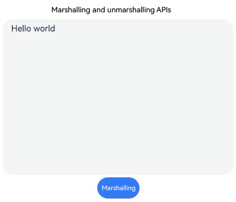

# Styled String (System API)
<!--Kit: ArkUI-->
<!--Subsystem: ArkUI-->
<!--Owner: @hddgzw-->
<!--Designer: @xiangyuan6-->
<!--Tester: @jiaoaozihao-->
<!--Adviser: @Brilliantry_Rui-->
<!-- md-trans-meta sourceCommit=92567145241181b97abe57e944e177355e50f4eb translatedAt=2026-09-02T12:35:22.932Z -->

A styled string is an object used to flexibly apply and manage text styles. It supports serialization storage of text styles, cross-process transfer, and custom style extension. This object can be bound to the **Text** component through [setStyledString](ts-basic-components-text.md#setstyledstring12) in TextController, or to the **RichEditor** component through [setStyledString](ts-basic-components-richeditor.md#setstyledstring12) in RichEditorStyledStringController. It is suitable for scenarios where complex text styles need to be persisted in an application or shared across components.

>  **NOTE**
>
> - This component is supported since API version 13. Updates will be marked with a superscript to indicate their earliest API version.
>
> - The APIs of this module can be used only in the stage model.
>
> - This page contains only the system APIs of this module. For details about other public APIs, see [Styled String](ts-universal-styled-string.md).

## StyledString

### marshalling

static marshalling(styledString: StyledString): ArrayBuffer

Marshals a styled string. This API is used when a styled string needs to be persisted or transferred across processes or components.

**System API**: This is a system API.

**System capability**: SystemCapability.ArkUI.ArkUI.Full

**Parameters**

| Name| Type| Mandatory| Description|
| ----- | ----- | ---- | ---- |
| styledString | [StyledString](ts-universal-styled-string.md#styledstring) | Yes | Styled string object to serialize, including text content and style information. |

**Return value**

| Type             |Description      |
| ------- | --------------------------------- |
| ArrayBuffer | Buffer information after serialization.<br>**Note:** <br>Currently, text and images are supported. |

### marshalling<sup>19+</sup>

static marshalling(styledString: StyledString, callback: StyledStringMarshallCallback): ArrayBuffer

Marshals a styled string by defining a callback to marshal [StyledStringMarshallingValue](#styledstringmarshallingvalue19).

Use this method when a styled string contains custom styles such as UserDataSpan and custom serialization logic is required. If no custom styles are included, use the basic marshalling method instead.

**System API**: This is a system API.

**System capability**: SystemCapability.ArkUI.ArkUI.Full

**Parameters**

| Name| Type| Mandatory| Description|
| ----- | ----- | ---- | ---- |
| styledString | [StyledString](ts-universal-styled-string.md#styledstring) | Yes | Styled String object to be serialized, including text content and style information. |
| callback | [StyledStringMarshallCallback](#styledstringmarshallcallback19) | Yes | Callback function used to serialize [StyledStringMarshallingValue](#styledstringmarshallingvalue19). Callback function signature: (marshallableVal: StyledStringMarshallingValue) => ArrayBuffer, where marshallableVal is the object to be serialized, and the return value is the serialized ArrayBuffer data. |

**Return value**

| Type             |Description      |
| ------- | --------------------------------- |
| ArrayBuffer | Buffer information after serialization.<br>**Note:** <br>Currently, text and images are supported. |

### unmarshalling

static unmarshalling(buffer: ArrayBuffer): Promise\<StyledString>

Unmarshals a buffer to obtain a styled string.

This API is used to restore a styled string from serialized data, for example, restoring a styled string after reading it from local storage or receiving data transferred across processes.

**System API**: This is a system API.

**System capability**: SystemCapability.ArkUI.ArkUI.Full

**Parameters**

| Name| Type| Mandatory| Description|
| ----- | ----- | ---- | ---- |
| buffer | ArrayBuffer | Yes | Data marshaled from a styled string.|

**Return value**

| Type                            | Description                 |
| -------------------------------- | --------------------- |
| Promise\<[StyledString](ts-universal-styled-string.md#styledstring)> |Promise object that returns the styled string on success and an error code on failure. For details about the error codes, see the error code section.<br>**Note:** <br>Currently, only text and images are supported. |

**Error codes**

For details about the error codes, see [Universal Error Codes](../../errorcode-universal.md) and [Styled String Error Codes](../errorcode-styled-string.md).

| ID| Error Message|
| ------- | -------- |
| 401      | Parameter error. Possible causes: 1. Mandatory parameters are left unspecified; 2.Incorrect parameters types; 3. Parameter verification failed.   |
| 170002 | Styled string decode error. |

### unmarshalling<sup>19+</sup>

static unmarshalling(buffer: ArrayBuffer, callback: StyledStringUnmarshallCallback): Promise\<StyledString>

Unmarshals a styled string by defining a callback to [StyledStringMarshallingValue](#styledstringmarshallingvalue19).

Use this method when restoring a styled string that contains custom styles such as UserDataSpan from serialized data. To restore a styled string without custom styles, use the basic unmarshalling method instead.

**System API**: This is a system API.

**System capability**: SystemCapability.ArkUI.ArkUI.Full

**Parameters**

| Name| Type| Mandatory| Description|
| ----- | ----- | ---- | ---- |
| buffer | ArrayBuffer | Yes | Data marshaled from a styled string.|
| callback | [StyledStringUnmarshallCallback](#styledstringunmarshallcallback19) | Yes | Callback used to deserialize the ArrayBuffer. Callback signature: (buf: ArrayBuffer) => StyledStringMarshallingValue, where buf is the serialized data and the return value is the StyledStringMarshallingValue object obtained after deserialization. |

**Return value**

| Type                            | Description                 |
| -------------------------------- | --------------------- |
| Promise\<[StyledString](ts-universal-styled-string.md#styledstring)> |Promise object, which returns the styled string on success and an error code on failure. For details about the error codes, see the error code section.<br>**Note:** <br>Currently, text and images are supported. |

**Error codes**

For details about the error codes, see [Universal Error Codes](../../errorcode-universal.md) and [Styled String Error Codes](../errorcode-styled-string.md).

| ID| Error Message|
| ------- | -------- |
| 401      | Parameter error. Possible causes: 1. Mandatory parameters are left unspecified; 2.Incorrect parameters types; 3. Parameter verification failed.   |
| 170002 | Styled string decode error. |

## StyledStringMarshallingValue<sup>19+</sup>

type StyledStringMarshallingValue = UserDataSpan

Defines a custom marshalling object for styled strings, which you need to define marshalling and unmarshalling methods.

**System API**: This is a system API.

**System capability**: SystemCapability.ArkUI.ArkUI.Full

| Type | Description  |
| ------ | ---------- |
| [UserDataSpan](ts-universal-styled-string.md#userdataspan) | Custom data span of UserDataSpan. |

## StyledStringMarshallCallback<sup>19+</sup>

type StyledStringMarshallCallback = (marshallableVal: StyledStringMarshallingValue) => ArrayBuffer

Defines a callback for marshalling [StyledStringMarshallingValue](#styledstringmarshallingvalue19).

**System API**: This is a system API.

**System capability**: SystemCapability.ArkUI.ArkUI.Full

**Parameters**

| Name | Type  | Mandatory| Description                         |
| ------- | ------ | ---- | --------------------------- |
| marshallableVal | [StyledStringMarshallingValue](#styledstringmarshallingvalue19)| Yes | UserDataSpan object in the styled string that requires custom serialization. In the callback function, the developer selects the corresponding serialization API based on the type of this parameter to convert it into an ArrayBuffer. |

**Return value**

| Type                            | Description                 |
| -------------------------------- | --------------------- |
| ArrayBuffer | Marshaled data of [StyledStringMarshallingValue](#styledstringmarshallingvalue19).|

## StyledStringUnmarshallCallback<sup>19+</sup>

type StyledStringUnmarshallCallback = (buf: ArrayBuffer) => StyledStringMarshallingValue

Defines a callback for unmarshalling an ArrayBuffer to obtain [StyledStringMarshallingValue](#styledstringmarshallingvalue19).

**System API**: This is a system API.

**System capability**: SystemCapability.ArkUI.ArkUI.Full

**Parameters**

| Name | Type  | Mandatory| Description                         |
| ------- | ------ | ---- | --------------------------- |
| buf | ArrayBuffer | Yes| Marshaled data of [StyledStringMarshallingValue](#styledstringmarshallingvalue19).|

**Return value**

| Type                            | Description                 |
| -------------------------------- | --------------------- |
| [StyledStringMarshallingValue](#styledstringmarshallingvalue19) | Custom data fragment object obtained through deserialization, used to restore user-defined style data. |

## Examples

### Example 1: Marshalling and Unmarshalling Styled Strings

This example implements the serialization and deserialization of a styled string through the marshalling and unmarshalling methods.

```ts
// xxx.ets
import { LengthMetrics } from '@kit.ArkUI';

@Entry
@Component
struct Index {
  @State textTitle: string = 'Marshalling and unmarshalling APIs';
  @State textResult: string = 'Hello world';
  @State serializeStr: string = 'Marshalling';
  @State flag: boolean = false;
  private textAreaController: TextAreaController = new TextAreaController();
  private buff: Uint8Array = new Uint8Array();
  fontStyle: TextStyle = new TextStyle({
    fontWeight: FontWeight.Lighter,
    fontFamily: 'HarmonyOS Sans',
    fontColor: Color.Green,
    fontSize: LengthMetrics.vp(30),
    fontStyle: FontStyle.Normal
  });
  // Create a styled string object.
  styledString: StyledString = new StyledString('Hello world',
    [{
      start: 0,
      length: 11,
      styledKey: StyledStringKey.FONT,
      styledValue: this.fontStyle
    }]);

  @Builder
  controllableBuild() {
    Column() {
      TextArea({
        text: this.textResult,
        controller: this.textAreaController
      }).width('95%').height('40%').enableKeyboardOnFocus(false)

      Button(this.serializeStr)
        .margin(5)
        .onClick(async () => {
          this.flag = !this.flag;
          if (!this.flag) {
            console.info('Debug: Unmarshalling');
            // Deserialize the ArrayBuffer to restore the styled string object.
            let styles: StyledString = await StyledString.unmarshalling(this.buff.buffer);
            this.textTitle = 'After decodeTlv is called, the result of unmarshalling is: ';
            if (styles == undefined) {
              console.error('Debug: Failed to obtain the styled string.');
              return;
            }
            this.textResult = styles.getString();
            console.info('Debug: this.textResult = ' + this.textResult);
            let stylesArr = styles.getStyles(0, this.textResult.length, StyledStringKey.FONT);
            console.info('Debug: stylesArr.length = ' + stylesArr.length);
            for (let i = 0; i < stylesArr.length; ++i) {
              console.info('Debug: style.start = ' + stylesArr[i].start);
              console.info('Debug: style.length = ' + stylesArr[i].length);
              console.info('Debug: style.styledKey = ' + stylesArr[i].styledKey);
              let font = stylesArr[i].styledValue as TextStyle;
              console.info('Debug: style.fontColor = ' + font.fontColor);
              console.info('Debug: style.fontSize = ' + font.fontSize);
              console.info('Debug: style.fontFamily = ' + font.fontFamily);
              console.info('Debug: style.fontStyle = ' + font.fontStyle);
            }
            let subStr = styles.subStyledString(0, 2);
            console.info('Debug: subStr = ' + subStr.getString());
            this.serializeStr = 'Marshalling';
          } else {
            console.info('Debug: Marshalling');
            // Serialize the styled string to return an ArrayBuffer for storage or transfer.
            let resultBuffer = StyledString.marshalling(this.styledString);
            this.buff = new Uint8Array(resultBuffer);
            this.textTitle = 'After encodeTlv is called, the result of marshalling is: ';
            this.textResult = this.buff.toString();
            console.info('Debug: buff = ' + this.buff.toString());
            this.serializeStr = 'Unmarshalling';
          }
        })
    }.margin(10)
  }

  build() {
    Column() {
      Blank().margin(30)
      Text(this.textTitle)
      this.controllableBuild()
    }
  }
}
```



### Example 2: Marshalling and Unmarshalling Styled Strings with UserDataSpan

This example demonstrates the marshalling and unmarshalling of styled strings that include custom user data spans using the **marshalling** and **unmarshalling** APIs.

```ts
enum MyUserDataType {
  TYPE1 = 0,
  TYPE2
}

class MyUserData extends UserDataSpan {
  constructor() {
    super();
  }

  marshalling() {
    console.info('MyUserData marshalling...');
    const text = 'MyUserData1';
    const buffer = new ArrayBuffer(text.length + 1);
    const uint8View = new Uint8Array(buffer);
    // Write the type.
    uint8View[0] = MyUserDataType.TYPE1;
    for (let i = 0; i < text.length; i++) {
      uint8View[i + 1] = text.charCodeAt(i);
    }
    return uint8View.buffer;
  }

  unmarshalling() {
    console.info('MyUserData unmarshalling...');
    return new MyUserData();
  }
}

class MyUserData2 extends UserDataSpan {
  marshalling() {
    console.info('MyUserData2 marshalling...');
    const text = 'MyUserData2';
    const buffer = new ArrayBuffer(text.length + 1);
    const uint8View = new Uint8Array(buffer);
    uint8View[0] = MyUserDataType.TYPE2;
    for (let i = 0; i < text.length; i++) {
      uint8View[i + 1] = text.charCodeAt(i);
    }
    return uint8View.buffer;
  }

  unmarshalling() {
    console.info('MyUserData2 unmarshalling...');
    return new MyUserData2();
  }
}

@Entry
@Component
struct MarshallExample1 {
  controller: TextController = new TextController();

  build() {
    Column() {
      Text(undefined, { controller: this.controller })
      Button('Marshall&UnMarshall')
        .onClick(async () => {
          let myData = new MyUserData();
          let myData2 = new MyUserData2();
          let myStyledString = new MutableStyledString('12345', [{
            start: 0,
            length: 3,
            styledKey: StyledStringKey.USER_DATA,
            styledValue: myData
          }, {
            start: 3,
            length: 1,
            styledKey: StyledStringKey.USER_DATA,
            styledValue: myData2
          }]);

          let buffer = StyledString.marshalling(myStyledString, (marshallingValue: StyledStringMarshallingValue) => {
            // Call the corresponding serialization method based on the specific type of UserDataSpan.
            if (marshallingValue instanceof MyUserData) {
              console.info('StyledString.marshalling MyUserData');
              return marshallingValue.marshalling();
            } else if (marshallingValue instanceof MyUserData2) {
              console.info('StyledString.marshalling MyUserData2');
              return marshallingValue.marshalling();
            }
            console.info('StyledString.marshalling default');
            return new ArrayBuffer(10);
          });

          let newStyledString = await StyledString.unmarshalling(buffer, (value: ArrayBuffer) => {
            // Read the type identifier from the buffer, and call the corresponding deserialization method based on the type.
            const uint8View = new Uint8Array(value);
            let type = uint8View[0];
            console.info('unmarshalling length:' + uint8View.length);
            if (type == MyUserDataType.TYPE1) {
              console.info('unmarshalling type1:' + type);
              let myUserData = new MyUserData();
              return myUserData.unmarshalling();
            } else if (type == MyUserDataType.TYPE2) {
              console.info('unmarshalling type2:' + type);
              let myUserData = new MyUserData2();
              return myUserData.unmarshalling();
            }
            return new MyUserData();
          });
          if (newStyledString == undefined) {
            console.error('Failed to obtain newStyledString.');
            return;
          }
          this.controller.setStyledString(newStyledString);
        })
        .fontSize(20)
        .margin(10)
    }
    .justifyContent(FlexAlign.Center)
    .width('100%')
    .height('100%')
  }
}
```

