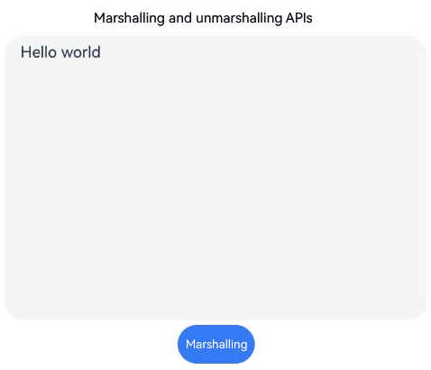

# Styled String (System API)
<!--Kit: ArkUI-->
<!--Subsystem: ArkUI-->
<!--Owner: @hddgzw-->
<!--Designer: @pssea-->
<!--Tester: @jiaoaozihao-->
<!--Adviser: @HelloCrease-->

Styled strings are string objects that facilitate the flexible use of text styles. They can be bound to the **Text** component using the [setStyledString](./ts-basic-components-text.md#setstyledstring12) API in **TextController**, and to the **RichEditor** component using the [setStyledString](ts-basic-components-richeditor.md#setstyledstring12) API in **RichEditorStyledStringController**.

>  **NOTE**
>
>  This component is supported since API version 13. Updates will be marked with a superscript to indicate their earliest API version.
>
>  This topic describes only system APIs provided by the module. For details about its public APIs, see [Styled String](ts-universal-styled-string.md).

## StyledString

### marshalling

static marshalling(styledString: StyledString): ArrayBuffer

Marshals a styled string.

**System API**: This is a system API.

**System capability**: SystemCapability.ArkUI.ArkUI.Full

**Parameters**

| Name| Type| Mandatory| Description|
| ----- | ----- | ---- | ---- |
| styledString | [StyledString](ts-universal-styled-string.md) | Yes | Styled string to marshal.|

**Return value**

| Type             |Description      |
| ------- | --------------------------------- | 
| ArrayBuffer | Buffer information after marshalling.<br>**NOTE**<br>Currently, text and images are supported.|

### marshalling<sup>19+</sup>

static marshalling(styledString: StyledString, callback: StyledStringMarshallCallback): ArrayBuffer

Marshals a styled string by defining a callback to marshal [StyledStringMarshallingValue](#styledstringmarshallingvalue19).

**System API**: This is a system API.

**System capability**: SystemCapability.ArkUI.ArkUI.Full

**Parameters**

| Name| Type| Mandatory| Description|
| ----- | ----- | ---- | ---- |
| styledString | [StyledString](ts-universal-styled-string.md) | Yes | Styled string to marshal.|
| callback | [StyledStringMarshallCallback](#styledstringmarshallcallback19) | Yes| Callback defining how to marshal [StyledStringMarshallingValue](#styledstringmarshallingvalue19).|

**Return value**

| Type             |Description      |
| ------- | --------------------------------- | 
| ArrayBuffer | Buffer information after marshalling.<br>**NOTE**<br>Currently, text and images are supported.|

### unmarshalling

static unmarshalling(buffer: ArrayBuffer): Promise\<StyledString>

Unmarshals a buffer to obtain a styled string.

**System API**: This is a system API.

**System capability**: SystemCapability.ArkUI.ArkUI.Full

**Parameters**

| Name| Type| Mandatory| Description|
| ----- | ----- | ---- | ---- |
| buffer | ArrayBuffer | Yes | Data marshaled from a styled string.|

**Return value**

| Type                            | Description                 |
| -------------------------------- | --------------------- |
| Promise\<[StyledString](ts-universal-styled-string.md)> |Promise used to return the result.|

**Error codes**

For details about the error codes, see [Universal Error Codes](../../errorcode-universal.md) and [Styled String Error Codes](../errorcode-styled-string.md).

| ID| Error Message|
| ------- | -------- |
| 401      | Parameter error. Possible causes: 1. Mandatory parameters are left unspecified; 2.Incorrect parameters types; 3. Parameter verification failed.   |
| 170002 | Styled string decode error. |

### unmarshalling<sup>19+</sup>

static unmarshalling(buffer: ArrayBuffer, callback: StyledStringUnmarshallCallback): Promise\<StyledString>

Unmarshals a styled string by defining a callback to [StyledStringMarshallingValue](#styledstringmarshallingvalue19).

**System API**: This is a system API.

**System capability**: SystemCapability.ArkUI.ArkUI.Full

**Parameters**

| Name| Type| Mandatory| Description|
| ----- | ----- | ---- | ---- |
| buffer | ArrayBuffer | Yes | Data marshaled from a styled string.|
| callback | [StyledStringUnmarshallCallback](#styledstringunmarshallcallback19) | Yes| Callback defining how to marshal **ArrayBuffer**.|

**Return value**

| Type                            | Description                 |
| -------------------------------- | --------------------- |
| Promise\<[StyledString](ts-universal-styled-string.md)> |Promise used to return the result.|

**Error codes**

For details about the error codes, see [Universal Error Codes](../../errorcode-universal.md) and [Styled String Error Codes](../errorcode-styled-string.md).

| ID| Error Message|
| ------- | -------- |
| 401      | Parameter error. Possible causes: 1. Mandatory parameters are left unspecified; 2.Incorrect parameters types; 3. Parameter verification failed.   |
| 170002 | Styled string decode error. |

## StyledStringMarshallingValue<sup>19+</sup>

type StyledStringMarshallingValue = UserDataSpan

Defines a custom marshalling object for styled strings, which you need to define marshalling and unmarshalling methods.

**System API**: This is a system API.

**System capability**: SystemCapability.ArkUI.ArkUI.Full

| Type | Description  |
| ------ | ---------- |
| [UserDataSpan](ts-universal-styled-string.md#userdataspan) | User data span style.|

## StyledStringMarshallCallback<sup>19+</sup>

type StyledStringMarshallCallback = (marshallableVal: StyledStringMarshallingValue) => ArrayBuffer

Defines a callback for marshalling [StyledStringMarshallingValue](#styledstringmarshallingvalue19).

**System API**: This is a system API.

**System capability**: SystemCapability.ArkUI.ArkUI.Full

**Parameters**

| Name | Type  | Mandatory| Description                         |
| ------- | ------ | ---- | --------------------------- |
| marshallableVal | [StyledStringMarshallingValue](#styledstringmarshallingvalue19)| Yes| Object to be marshaled.|

**Return value**

| Type                            | Description                 |
| -------------------------------- | --------------------- |
| ArrayBuffer | Marshaled data of [StyledStringMarshallingValue](#styledstringmarshallingvalue19).|

## StyledStringUnmarshallCallback<sup>19+</sup>

type StyledStringUnmarshallCallback = (buf: ArrayBuffer) => StyledStringMarshallingValue

Defines a callback for unmarshalling an ArrayBuffer to obtain [StyledStringMarshallingValue](#styledstringmarshallingvalue19).

**System API**: This is a system API.

**System capability**: SystemCapability.ArkUI.ArkUI.Full

**Parameters**

| Name | Type  | Mandatory| Description                         |
| ------- | ------ | ---- | --------------------------- |
| buf | ArrayBuffer | Yes| Marshaled data of [StyledStringMarshallingValue](#styledstringmarshallingvalue19).|

**Return value**

| Type                            | Description                 |
| -------------------------------- | --------------------- |
| [StyledStringMarshallingValue](#styledstringmarshallingvalue19) | [StyledStringMarshallingValue](#styledstringmarshallingvalue19) obtained after unmarshalling.|

## Example

### Example 1: Marshalling and Unmarshalling Styled Strings

This example demonstrates the marshalling and unmarshalling of styled strings using the **marshalling** and **unmarshalling** APIs.

```ts
// xxx.ets
import { LengthMetrics } from '@kit.ArkUI';

@Entry
@Component
struct Index {
  @State textTitle: string = "Marshalling and unmarshalling APIs";
  @State textResult: string = "Hello world";
  @State serializeStr: string = "Marshalling";
  @State flag: boolean = false;
  private textAreaController: TextAreaController = new TextAreaController();
  private buff: Uint8Array = new Uint8Array();
  fontStyle: TextStyle = new TextStyle({
    fontWeight: FontWeight.Lighter,
    fontFamily: 'HarmonyOS Sans',
    fontColor: Color.Green,
    fontSize: LengthMetrics.vp(30),
    fontStyle: FontStyle.Normal
  });
  // Create a styled string object.
  styledString: StyledString = new StyledString("Hello world",
    [{
      start: 0,
      length: 11,
      styledKey: StyledStringKey.FONT,
      styledValue: this.fontStyle
    }]);

  @Builder
  controllableBuild() {
    Column() {
      TextArea({
        text: this.textResult,
        controller: this.textAreaController
      }).width('95%').height('40%').enableKeyboardOnFocus(false)

      Button(this.serializeStr)
        .margin(5)
        .onClick(async () => {
          this.flag = !this.flag;
          if (!this.flag) {
            console.info("Debug: Unmarshalling");
            let styles: StyledString = await StyledString.unmarshalling(this.buff.buffer);
            this.textTitle = "After decodeTlv is called, the result of unmarshalling is: ";
            if (styles == undefined) {
              console.error("Debug: Failed to obtain the styled string.");
              return;
            }
            this.textResult = styles.getString();
            console.info("Debug: this.textResult = " + this.textResult);
            let stylesArr = styles.getStyles(0, this.textResult.length, StyledStringKey.FONT);
            console.info("Debug: stylesArr.length = " + stylesArr.length);
            for (let i = 0; i < stylesArr.length; ++i) {
              console.info("Debug: style.start = " + stylesArr[i].start);
              console.info("Debug: style.length = " + stylesArr[i].length);
              console.info("Debug: style.styledKey = " + stylesArr[i].styledKey);
              let font = stylesArr[i].styledValue as TextStyle;
              console.info("Debug: style.fontColor = " + font.fontColor);
              console.info("Debug: style.fontSize = " + font.fontSize);
              console.info("Debug: style.fontFamily = " + font.fontFamily);
              console.info("Debug: style.fontStyle = " + font.fontStyle);
            }
            let subStr = styles.subStyledString(0, 2);
            console.info("Debug: subStr = " + subStr.getString());
            this.serializeStr = "Marshalling";
          } else {
            console.info("Debug: Marshalling");
            let resultBuffer = StyledString.marshalling(this.styledString);
            this.buff = new Uint8Array(resultBuffer);
            this.textTitle = "After encodeTlv is called, the result of marshalling is: ";
            this.textResult = this.buff.toString();
            console.info("Debug: buff = " + this.buff.toString());
            this.serializeStr = "Unmarshalling";
          }
        })
    }.margin(10)
  }

  build() {
    Column() {
      Blank().margin(30)
      Text(this.textTitle)
      this.controllableBuild()
    }
  }
}
```



### Example 2: Marshalling and Unmarshalling Styled Strings with UserDataSpan

This example demonstrates the marshalling and unmarshalling of styled strings that include custom user data spans using the **marshalling** and **unmarshalling** APIs.

```ts
enum MyUserDataType {
  TYPE1 = 0,
  TYPE2
}

class MyUserData extends UserDataSpan {
  constructor() {
    super();
  }

  marshalling() {
    console.info("MyUserData marshalling...");
    const text = "MyUserData1";
    const buffer = new ArrayBuffer(text.length + 1);
    const uint8View = new Uint8Array(buffer);
    // Write the type.
    uint8View[0] = MyUserDataType.TYPE1;
    for (let i = 1; i < text.length; i++) {
      uint8View[i] = text.charCodeAt(i);
    }
    return uint8View.buffer;
  }

  unmarshalling() {
    console.info("MyUserData unmarshalling...");
    return new MyUserData();
  }
}

class MyUserData2 extends UserDataSpan {
  marshalling() {
    console.info("MyUserData2 marshalling...");
    const text = "MyUserData2";
    const buffer = new ArrayBuffer(text.length + 1);
    const uint8View = new Uint8Array(buffer);
    uint8View[0] = MyUserDataType.TYPE2;
    for (let i = 1; i < text.length; i++) {
      uint8View[i] = text.charCodeAt(i);
    }
    return uint8View.buffer;
  }

  unmarshalling() {
    console.info("MyUserData2 unmarshalling...");
    return new MyUserData2();
  }
}

@Entry
@Component
struct MarshallExample1 {
  controller: TextController = new TextController();

  build() {
    Column() {
      Text(undefined, { controller: this.controller })
      Button("Marshall&UnMarshall")
        .onClick(async () => {
          let myData = new MyUserData();
          let myData2 = new MyUserData2();
          let myStyledString = new MutableStyledString("12345", [{
            start: 0,
            length: 3,
            styledKey: StyledStringKey.USER_DATA,
            styledValue: myData
          }, {
            start: 3,
            length: 1,
            styledKey: StyledStringKey.USER_DATA,
            styledValue: myData2
          }]);

          let buffer = StyledString.marshalling(myStyledString, (marshallingValue: StyledStringMarshallingValue) => {
            // Perform marshalling based on the type.
            if (marshallingValue instanceof MyUserData) {
              console.info("StyledString.marshalling MyUserData");
              let value = marshallingValue as MyUserData;
              return value.marshalling();
            } else if (marshallingValue instanceof MyUserData2) {
              console.info("StyledString.marshalling MyUserData2");
              let value = marshallingValue as MyUserData2;
              return value.marshalling();
            }
            console.info("StyledString.marshalling default");
            return new ArrayBuffer(10);
          });

          let newStyledString = await StyledString.unmarshalling(buffer, (value: ArrayBuffer) => {
            // 1. Read the type from the buffer.
            // 2. Based on the type, choose the appropriate API to parse the buffer.
            const uint8View = new Uint8Array(value);
            let type = uint8View[0];
            console.info("unmarshalling length:" + uint8View.length);
            if (type == MyUserDataType.TYPE1) {
              console.info("unmarshalling type1:" + type);
              let myUserData = new MyUserData();
              return myUserData.unmarshalling();
            } else if (type == MyUserDataType.TYPE2) {
              console.info("unmarshalling type2:" + type);
              let myUserData = new MyUserData2();
              return myUserData.unmarshalling();
            }
            return new ArrayBuffer(0);
          });
          this.controller.setStyledString(newStyledString);
        })
        .fontSize(20)
        .margin(10)
    }
    .justifyContent(FlexAlign.Center)
    .width('100%')
    .height('100%')
  }
}
```


