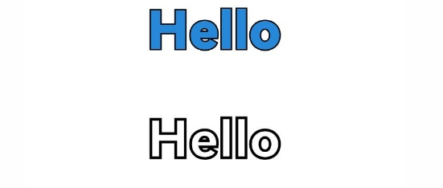
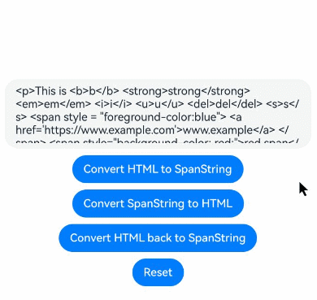
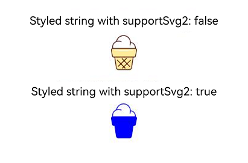

# Styled String
<!--Kit: ArkUI-->
<!--Subsystem: ArkUI-->
<!--Owner: @hddgzw-->
<!--Designer: @xiangyuan6-->
<!--Tester: @jiaoaozihao-->
<!--Adviser: @Brilliantry_Rui-->

Styled strings are string objects that facilitate the flexible use of text styles. They can be bound to the **Text** component using the [setStyledString](./ts-basic-components-text.md#setstyledstring12) API in **TextController**, and to the **RichEditor** component using the [setStyledString](ts-basic-components-richeditor.md#setstyledstring12) API in **RichEditorStyledStringController**.

>  **NOTE**
>
>  The initial APIs of this module are supported since API version 12. Updates will be marked with a superscript to indicate their earliest API version.
>
>  Since API version 20, the [getParagraphs](./../arkts-apis-uicontext-measureutils.md#getparagraphs20) API can be used to obtain the text layout information of styled strings.
>
>  Currently, styled strings cannot be used in worker threads.
>
>  If a styled string is bound via controller, the binding only takes effect after layout completion. When using **setStyledString** alongside [measure](../js-apis-arkui-frameNode.md#measure12), you must wait for layout completion using the [layout callback](../js-apis-arkui-inspector.md) before applying the styled string.

## Rules of Use

* If a styled string conflicts with the current style settings in a component, the style set in the styled string takes effect.
* If a styled string conflicts with the child components in [Text](./ts-basic-components-text.md), the style set in the styled string is applied to the **Text** component, and style settings of the child components, including [Span](./ts-basic-components-span.md), are ignored.
* @State is not supported.
* To prevent the application from being inadvertently terminated while running in the background, define **StyledString** as a member variable.
* Creation before [loadContent()](../arkts-apis-window-Window.md#loadcontent9) is not supported.

## StyledString

### constructor

constructor(value: string | ImageAttachment | CustomSpan , styles?: Array\<StyleOptions>)

A constructor used to create a styled string.

**Atomic service API**: This API can be used in atomic services since API version 12.

**System capability**: SystemCapability.ArkUI.ArkUI.Full

**Parameters**

| Name| Type| Mandatory| Description|
| -------- | -------- | -------- | -------- |
| value | string \| [ImageAttachment](#imageattachment) \| [CustomSpan](#customspan) | Yes| Text of the styled string.<br>**NOTE**<br>If this parameter is of the ImageAttachment or CustomSpan type, the **styles** parameter has no effect.<br>To set **styles**, use methods such as [setStyle](#setstyle).|
| styles | Array<[StyleOptions](#styleoptions)> | No| Initialization options of the styled string.<br>**NOTE**<br>If **start** is set to an invalid value, it uses the default value **0**.<br>If the **length** value is invalid, **length** will default to the actual length of the styled string starting from the start position.<br>If **StyledStringKey** does not match **StyledStringValue**, **styles** has no effect.|

### Properties

**Atomic service API**: This API can be used in atomic services since API version 12.

**System capability**: SystemCapability.ArkUI.ArkUI.Full

| Name |   Type  |   Read-Only  |   Optional  |   Description  |
| ------ | ------ | ------ | ------ | -------------- |
| length | number |  Yes  | No  | Length of the styled string.<br>**NOTE**<br>Both **ImageAttachment** and **CustomSpan** in the styled string are counted as length 1.|

### getString

getString(): string

Obtains the text of this styled string.

**Atomic service API**: This API can be used in atomic services since API version 12.

**System capability**: SystemCapability.ArkUI.ArkUI.Full

**Return value**

| Type             |Description      |
| ------- | --------------------------------- | 
| string | Text of the styled string.<br>**NOTE**<br>If the styled string contains an image or [CustomSpan](#customspan) elements, they are represented as space characters in the returned result.|

### equals

equals(other: StyledString): boolean

Checks whether this styled string the same as another styled string.

**Atomic service API**: This API can be used in atomic services since API version 12.

**System capability**: SystemCapability.ArkUI.ArkUI.Full

**Parameters**

| Name | Type                             | Mandatory| Description                                                        |
| ------- | --------------------------------- | ---- | ------------------------------------------------------------ |
| other | [StyledString](#styledstring) | Yes  | **StyledString** object to compare.|

**Return value**

| Type             |       Description      |
| ------- | --------------------------------- | 
| boolean | Whether two styled strings are equal.<br>**true** if the two styled strings are equal; **false** otherwise.<br>**NOTE**<br>The two styled strings are the same if they have the same text and style.<br>**GestureStyle** in styled strings is not compared. This means that, if two styled strings are the same except for the event configured, they are the same.<br>In comparing **CustomSpan** or [LeadingMarginSpan](#leadingmarginspan22) objects, addresses are compared. The objects that have the same address are the same.|

### subStyledString

subStyledString(start: number, length?: number): StyledString

Obtains a substring of this styled string. The specified range must not exceed the string's length.

**Atomic service API**: This API can be used in atomic services since API version 12.

**System capability**: SystemCapability.ArkUI.ArkUI.Full

**Parameters**

| Name | Type                             | Mandatory| Description                                                        |
| ------- | --------------------------------- | ---- | ------------------------------------------------------------ |
| start | number | Yes  | Subscript that corresponds to the start position of the styled substring.|
| length | number | No  | Length of the styled substring.|

**Return value**

| Type             |       Description      |
| ------- | --------------------------------- | 
| [StyledString](#styledstring) | Styled substring.<br>**NOTE**<br>If the value of **start** is valid, the difference between the length of the styled string and the value of **start** is used as the default value of **length**.<br>If the values of **start** and **length** are out of the acceptable range or if any mandatory parameter is passed as **undefined**, an exception is thrown.|

**Error codes**

For details about the error codes, see [Universal Error Codes](../../errorcode-universal.md).

| ID| Error Message|
| ------- | -------- |
| 401      | Parameter error. Possible causes: 1. Mandatory parameters are left unspecified; 2.Incorrect parameters types; 3. Parameter verification failed.   |

### getStyles

getStyles(start: number , length: number , styledKey?: StyledStringKey): Array\<SpanStyle>

Obtains the styles in the specified range of a styled string. The specified range must not exceed the string's length.

This API returns only styles explicitly set by the developer.

**Atomic service API**: This API can be used in atomic services since API version 12.

**System capability**: SystemCapability.ArkUI.ArkUI.Full

**Parameters**

| Name | Type                             | Mandatory| Description                                                        |
| ------- | --------------------------------- | ---- | ------------------------------------------------------------ |
| start | number | Yes  | Subscript that corresponds to the target range in the styled string.|
| length | number | Yes  | Length of the target range in the styled string.|
| styledKey | [StyledStringKey](#styledstringkey) | No  | Style key of the styled string.|

**Return value**

| Type             |       Description      |
| ------- | --------------------------------- | 
| Array<[SpanStyle](#spanstyle)> | Array of styles.<br>**NOTE**<br>If no style is set for the specified range in the styled string, an empty array is returned.<br>If the values of **start** and **length** are out of the acceptable range or if any mandatory parameter is passed as **undefined**, an exception is thrown.<br>If **styledKey** is set to an invalid value or **undefined**, an exception is thrown.<br>If **styledKey** is a **CustomSpan** object, the style returned is the one passed to create the object. That is, modifying the style object also affects the actual display effect.|

**Error codes**

For details about the error codes, see [Universal Error Codes](../../errorcode-universal.md).

| ID| Error Message|
| ------- | -------- |
| 401      | Parameter error. Possible causes: 1. Mandatory parameters are left unspecified; 2.Incorrect parameters types; 3. Parameter verification failed.   |

### fromHtml

static fromHtml(html: string): Promise\<StyledString>

Converts an HTML string into a styled string. Currently, the following HTML tags are supported for conversion: \<p>, \<span>, \, \<br>, \<strong>, \<b>, \<a>, \<i>, \<em>, \<s>, \<u>, \<del>, \<sup>, \<sub>. The **style** attribute within tags can be converted to the corresponding style in the styled string.

For details about how to use this API, see [Example 12: Implementing Conversion Using fromHtml and toHtml](#example-12-implementing-conversion-using-fromhtml-and-tohtml).

| Tag Name| Description                  |
|-------------|----------------------------|
| \<p\>       | Paragraph tag, which separates text into paragraphs.        |
| \<span\>    | Inline text supporting style configuration. In API version 17 and earlier, the **background-color** attribute set using **\<span\>** does not take effect.    |
| \     | Image tag, used to insert an image.                  |
| \<strong\>  | Bold text tag.                  |
| \<br\><sup>20+</sup>      | Line break tag.                      |
| \<b\><sup>20+</sup>       | Bold text tag.                  |
| \<a\><sup>20+</sup>       | Hyperlink tag.                    |
| \<i\><sup>20+</sup>       | Italic text tag.                  |
| \<em\><sup>20+</sup>      | Italic text tag.                  |
| \<s\><sup>20+</sup>       | Strikethrough tag, which adds a line through the text.          |
| \<u\><sup>20+</sup>       | Underline tag, which adds a decorative underline to the text.                    |
| \<del\><sup>20+</sup>     | Strikethrough tag, which adds a line through the text.          |
| \<sup\><sup>20+</sup>     | Superscript tag.                  |
| \<sub\><sup>20+</sup>     | Subscript tag.                  |

**Atomic service API**: This API can be used in atomic services since API version 12.

**System capability**: SystemCapability.ArkUI.ArkUI.Full

**Parameters**

| Name | Type                             | Mandatory| Description                                                        |
| ------- | --------------------------------- | ---- | ------------------------------------------------------------ |
| html | string | Yes  | HTML-formatted string.|

**Return value**

| Type             |       Description      |
| ------- | --------------------------------- |
| Promise\<[StyledString](#styledstring)> | Styled string.|

**Error codes**

For details about the error codes, see [Universal Error Codes](../../errorcode-universal.md) and [Styled String Error Codes](../errorcode-styled-string.md).

| ID| Error Message|
| ------- | -------- |
| 401      | Parameter error. Possible causes: 1. Mandatory parameters are left unspecified; 2.Incorrect parameters types; 3. Parameter verification failed.   |
| 170001 | Convert Error. |

### toHtml<sup>14+</sup>

static toHtml(styledString: StyledString): string

Converts a styled string into an HTML-formatted string. The supported styled string keys for conversion, as detailed in [StyledStringKey](#styledstringkey), include: **StyledStringKey.FONT**, **StyledStringKey.DECORATION**, **StyledStringKey.LETTER_SPACING**, **StyledStringKey.TEXT_SHADOW**, **StyledStringKey.LINE_HEIGHT**, and **StyledStringKey.IMAGE**.

For details about how to use this API, see [Example 12: Implementing Conversion Using fromHtml and toHtml](#example-12-implementing-conversion-using-fromhtml-and-tohtml).

**Atomic service API**: This API can be used in atomic services since API version 14.

**System capability**: SystemCapability.ArkUI.ArkUI.Full

**Parameters**

| Name | Type                             | Mandatory| Description                                                        |
| ------- | --------------------------------- | ---- | ------------------------------------------------------------ |
| styledString | StyledString | Yes  | Styled string.|

**Return value**

| Type             |       Description      |
| ------- | --------------------------------- |
| string | HTML string.|

**Error codes**

For details about the error codes, see [Universal Error Codes](../../errorcode-universal.md).

| ID| Error Message|
| ------- | -------- |
| 401      | Parameter error. Possible causes: 1. Mandatory parameters are left unspecified; 2.Incorrect parameters types; 3. Parameter verification failed.   |

## MutableStyledString

Inherits from the [StyledString](#styledstring) class.

>  **An exception is thrown in the following cases:**
>
> If the values of **start** and **length** are out of the acceptable range or if any mandatory parameter is passed as **undefined**, an exception is thrown.
>
> **styledKey** or **styledValue** is set to an invalid value or they do not match.
> 

### replaceString

replaceString(start: number , length: number , other: string): void

Replaces the string in the specified range of this styled string.

**Atomic service API**: This API can be used in atomic services since API version 12.

**System capability**: SystemCapability.ArkUI.ArkUI.Full

**Parameters**

| Name | Type                             | Mandatory| Description                                                        |
| ------- | --------------------------------- | ---- | ------------------------------------------------------------ |
| start | number | Yes  | Subscript of the target range.|
| length | number | Yes  | Length of the target range.|
| other | string | Yes  | String to replace the content in the target range.<br>**NOTE**<br>The string specified here uses the style of the character at the **start** position.|

**Error codes**

For details about the error codes, see [Universal Error Codes](../../errorcode-universal.md).

| ID| Error Message|
| ------- | -------- |
| 401      | Parameter error. Possible causes: 1. Mandatory parameters are left unspecified; 2.Incorrect parameters types; 3. Parameter verification failed.   |

### insertString

insertString(start: number , other: string): void

Inserts a string.

**Atomic service API**: This API can be used in atomic services since API version 12.

**System capability**: SystemCapability.ArkUI.ArkUI.Full

**Parameters**

| Name | Type                             | Mandatory| Description                                                        |
| ------- | --------------------------------- | ---- | ------------------------------------------------------------ |
| start | number | Yes  | Subscript of the position where the string will be inserted.|
| other | string | Yes  | String to insert.<br>**NOTE**<br>The string specified here uses the style of the character at the **start** - 1 position or, if that character does not have style set, the style of the character at the **start** position.|

**Error codes**

For details about the error codes, see [Universal Error Codes](../../errorcode-universal.md).

| ID| Error Message|
| ------- | -------- |
| 401      | Parameter error. Possible causes: 1. Mandatory parameters are left unspecified; 2.Incorrect parameters types; 3. Parameter verification failed.   |

### removeString

removeString(start: number , length: number): void

Removes the string in the specified range of this styled string.

This API equally works when the styled string contains an image or [CustomSpan](#customspan).

**Atomic service API**: This API can be used in atomic services since API version 12.

**System capability**: SystemCapability.ArkUI.ArkUI.Full

**Parameters**

| Name | Type                             | Mandatory| Description                                                        |
| ------- | --------------------------------- | ---- | ------------------------------------------------------------ |
| start | number | Yes  | Subscript of the target range.|
| length | number | Yes  | Length of the target range.|

**Error codes**

For details about the error codes, see [Universal Error Codes](../../errorcode-universal.md).

| ID| Error Message|
| ------- | -------- |
| 401      | Parameter error. Possible causes: 1. Mandatory parameters are left unspecified; 2.Incorrect parameters types; 3. Parameter verification failed.   |

### replaceStyle

replaceStyle(spanStyle: SpanStyle): void

Replaces the style in the specified range of this styled string.

**Atomic service API**: This API can be used in atomic services since API version 12.

**System capability**: SystemCapability.ArkUI.ArkUI.Full

**Parameters**

| Name | Type                             | Mandatory| Description                                                        |
| ------- | --------------------------------- | ---- | ------------------------------------------------------------ |
| spanStyle | [SpanStyle](#spanstyle) | Yes  | Style object.<br>**NOTE**<br>By default, the original style is removed and replaced with the new style.<br>If **styledKey** of **SpanStyle** is **IMAGE** or **CUSTOM_SPAN**, this API takes effect only when an image or custom span with the length of 1 is at the **start** position.|

**Error codes**

For details about the error codes, see [Universal Error Codes](../../errorcode-universal.md).

| ID| Error Message|
| ------- | -------- |
| 401      | Parameter error. Possible causes: 1. Mandatory parameters are left unspecified; 2.Incorrect parameters types; 3. Parameter verification failed.   |

### setStyle

setStyle(spanStyle: SpanStyle): void

Sets a new style for the specified range of this styled string.

**Atomic service API**: This API can be used in atomic services since API version 12.

**System capability**: SystemCapability.ArkUI.ArkUI.Full

**Parameters**

| Name | Type                             | Mandatory| Description                                                        |
| ------- | --------------------------------- | ---- | ------------------------------------------------------------ |
| spanStyle | [SpanStyle](#spanstyle) | Yes  | Style object.<br>By default, the new style is applied without removing the original style. If the **StyledStringValue** types are the same, the new style overwrites the old one.<br>If **styledKey** of **SpanStyle** is **IMAGE** or **CUSTOM_SPAN**, this API takes effect only when an image or custom span with the length of 1 is at the **start** position.|

> **NOTE**
>
> The minimum granularity for applying the style is **StyledStringValue**. If multiple identical **StyledStringValue** settings are applied, only the last one takes effect. If two **TextStyle** attributes with different settings are applied, only the **TextStyle** set second takes effect.

**Error codes**

For details about the error codes, see [Universal Error Codes](../../errorcode-universal.md).

| ID| Error Message|
| ------- | -------- |
| 401      |The parameter check failed.   |

### removeStyle

removeStyle(start: number , length: number , styledKey: StyledStringKey): void

Removes the style for the specified range of this styled string.

After a style is removed, the value set for the corresponding style attribute in the [Text](./ts-basic-components-text.md) component is used. If the value is not set, the default value is used.

This API equally works when the styled string contains an image.

**Atomic service API**: This API can be used in atomic services since API version 12.

**System capability**: SystemCapability.ArkUI.ArkUI.Full

**Parameters**

| Name | Type                             | Mandatory| Description                                                        |
| ------- | --------------------------------- | ---- | ------------------------------------------------------------ |
| start | number | Yes  | Subscript that corresponds to the start position of the target range.|
| length | number | Yes  | Length of the target range.|
| styledKey | [StyledStringKey](#styledstringkey) | Yes  | Styled key.|

**Error codes**

For details about the error codes, see [Universal Error Codes](../../errorcode-universal.md).

| ID| Error Message|
| ------- | -------- |
| 401      | Parameter error. Possible causes: 1. Mandatory parameters are left unspecified; 2.Incorrect parameters types; 3. Parameter verification failed.   |

### removeStyles

removeStyles(start: number , length: number): void

Removes all styles for the specified range of this styled string.

After a style is removed, the value set for the corresponding style attribute in the [Text](./ts-basic-components-text.md) component is used. If the value is not set, the default value is used.

This API equally works when the styled string contains an image.

**Atomic service API**: This API can be used in atomic services since API version 12.

**System capability**: SystemCapability.ArkUI.ArkUI.Full

**Parameters**

| Name | Type                             | Mandatory| Description                                                        |
| ------- | --------------------------------- | ---- | ------------------------------------------------------------ |
| start | number | Yes  | Subscript that corresponds to the start position of the target range.|
| length | number | Yes  | Length of the target range.|

**Error codes**

For details about the error codes, see [Universal Error Codes](../../errorcode-universal.md).

| ID| Error Message|
| ------- | -------- |
| 401      | Parameter error. Possible causes: 1. Mandatory parameters are left unspecified; 2.Incorrect parameters types; 3. Parameter verification failed.   |

### clearStyles

clearStyles(): void

Removes all styles of this styled string.

After a style is removed, the value set for the corresponding style attribute in the [Text](./ts-basic-components-text.md) component is used. If the value is not set, the default value is used.

**Atomic service API**: This API can be used in atomic services since API version 12.

**System capability**: SystemCapability.ArkUI.ArkUI.Full

### replaceStyledString

replaceStyledString(start: number , length: number , other: StyledString): void

Replaces the styled string in the specified range.

**Atomic service API**: This API can be used in atomic services since API version 12.

**System capability**: SystemCapability.ArkUI.ArkUI.Full

**Parameters**

| Name | Type                             | Mandatory| Description                                                        |
| ------- | --------------------------------- | ---- | ------------------------------------------------------------ |
| start | number | Yes  | Subscript that corresponds to the start position of the target range.|
| length | number | Yes  | Length of the target range.|
| other | [StyledString](#styledstring) | Yes  | New styled string.|

**Error codes**

For details about the error codes, see [Universal Error Codes](../../errorcode-universal.md).

| ID| Error Message|
| ------- | -------- |
| 401      | Parameter error. Possible causes: 1. Mandatory parameters are left unspecified; 2.Incorrect parameters types; 3. Parameter verification failed.   |

### insertStyledString

insertStyledString(start: number , other: StyledString): void

Inserts a new styled string at the specified position.

**Atomic service API**: This API can be used in atomic services since API version 12.

**System capability**: SystemCapability.ArkUI.ArkUI.Full

**Parameters**

| Name | Type                             | Mandatory| Description                                                        |
| ------- | --------------------------------- | ---- | ------------------------------------------------------------ |
| start | number | Yes  | Subscript of the position to insert the styled string.|
| other | [StyledString](#styledstring) | Yes  | New styled string.|

**Error codes**

For details about the error codes, see [Universal Error Codes](../../errorcode-universal.md).

| ID| Error Message|
| ------- | -------- |
| 401      | Parameter error. Possible causes: 1. Mandatory parameters are left unspecified; 2.Incorrect parameters types; 3. Parameter verification failed.   |

### appendStyledString

appendStyledString(other: StyledString): void

Appends a styled string.

**Atomic service API**: This API can be used in atomic services since API version 12.

**System capability**: SystemCapability.ArkUI.ArkUI.Full

**Parameters**

| Name | Type                             | Mandatory| Description                                                        |
| ------- | --------------------------------- | ---- | ------------------------------------------------------------ |
| other | [StyledString](#styledstring) | Yes  | New styled string.|


## StyledStringValue

type StyledStringValue = TextStyle | DecorationStyle | BaselineOffsetStyle | LetterSpacingStyle |
TextShadowStyle | GestureStyle | ImageAttachment | ParagraphStyle | LineHeightStyle | UrlStyle | CustomSpan | UserDataSpan | BackgroundColorStyle

Defines the style for a styled string.

**Atomic service API**: This API can be used in atomic services since API version 12.

**System capability**: SystemCapability.ArkUI.ArkUI.Full

| Type | Description  |
| ------ | ---------- |
| [TextStyle](#textstyle) | Text style.|
| [DecorationStyle](#decorationstyle) | Text decorative line style.|
| [BaselineOffsetStyle](#baselineoffsetstyle) | Text baseline offset style.|
| [LetterSpacingStyle](#letterspacingstyle) | Text letter spacing style.|
| [LineHeightStyle](#lineheightstyle) | Text line height style.|
| [TextShadowStyle](#textshadowstyle) | Text shadow style.|
| [GestureStyle](#gesturestyle) | Gesture style.|
| [ParagraphStyle](#paragraphstyle) | Text paragraph style.|
| [ImageAttachment](#imageattachment) | Image style.|
| [CustomSpan](#customspan) | Custom span style.|
| [UserDataSpan](#userdataspan) | User data span style.|
| [UrlStyle](#urlstyle14) | URL style.|
| [BackgroundColorStyle](#backgroundcolorstyle14) | Text background color style.|

## StyleOptions

**Atomic service API**: This API can be used in atomic services since API version 12.

**System capability**: SystemCapability.ArkUI.ArkUI.Full

| Name | Type                             | Read-Only| Optional| Description  |
| ------- | --------------------------------- | ---- | ---- |--------------------------------- |
| start | number | No  | Yes| Start position of the styled string style.<br>If the value is less than 0 or exceeds the string length, it is treated as **0**.|
| length | number | No  | Yes| Length of the styled string style.<br>f the value is less than 0 or exceeds the difference between the string length and the value of **start**, it is treated as the difference between the string length and the value of **start**.|
| styledKey | [StyledStringKey](#styledstringkey) | No  | No| Style key.|
| styledValue | [StyledStringValue](#styledstringvalue) | No  | No  | Style object.|

## SpanStyle

**Atomic service API**: This API can be used in atomic services since API version 12.

**System capability**: SystemCapability.ArkUI.ArkUI.Full

| Name | Type                             | Read-Only| Optional| Description  |
| ------- | --------------------------------- | ---- | ---- |--------------------------------- |
| start | number | No  | No  | Start position of the styled string style.|
| length | number | No  | No  | Length of the styled string style.|
| styledKey | [StyledStringKey](#styledstringkey) | No  | No  | Style key.|
| styledValue | [StyledStringValue](#styledstringvalue) | No  | No  | Style object.|

## TextStyle

Describes the text style.

**System capability**: SystemCapability.ArkUI.ArkUI.Full

### Properties

**System capability**: SystemCapability.ArkUI.ArkUI.Full


| Name       | Type                                    | Read-Only| Optional| Description                                                                                                                             |
| ----------- | ---------------------------------------- | ---- | ---- | --------------------------------------------------------------------------------------------------------------------------------- |
| fontColor   | [ResourceColor](ts-types.md#resourcecolor)  | Yes  | Yes  | Text color of the styled string.<br>**Atomic service API**: This API can be used in atomic services since API version 12.                                              |
| fontFamily  | string                                   | Yes  | Yes  | Font family of the styled string.<br>Returns **undefined** by default.<br>**Atomic service API**: This API can be used in atomic services since API version 12.                      |
| fontSize    | number                                   | Yes  | Yes  | Font size of the styled string.<br>Unit: [vp](ts-pixel-units.md)<br>**Atomic service API**: This API can be used in atomic services since API version 12.|
| fontWeight  | number                                   | Yes  | Yes  | Font weight of the styled string.<br>**Atomic service API**: This API can be used in atomic services since API version 12.                                          |
| fontStyle   | [FontStyle](ts-appendix-enums.md#fontstyle) | Yes  | Yes  | Font style of the styled string.<br>**Atomic service API**: This API can be used in atomic services since API version 12.                                          |
| strokeWidth<sup>20+</sup> | number                                   | Yes  | Yes  | Text stroke width of the styled string.<br>Default value: **0**, in [vp](ts-pixel-units.md).<br>**Atomic service API**: This API can be used in atomic services since API version 20.                                          |
| strokeColor<sup>20+</sup> | [ResourceColor](ts-types.md#resourcecolor)  | Yes  | Yes  | Text stroke color of the styled string.<br>Default value: same as the text color.<br>**Atomic service API**: This API can be used in atomic services since API version 20.                                          |
| superscript<sup>20+</sup> | [SuperscriptStyle](ts-text-common.md#superscriptstyle20)  | Yes  | Yes  | Superscript or subscript for the styled string.<br>Default value: **SuperscriptStyle.NORMAL**.<br>**Atomic service API**: This API can be used in atomic services since API version 20.                                          |

The relationship between the **fontWeight** parameter and the return value is as follows.
| Parameter       | Return Value|
| ----------- | ----------- |  
| 100 |  0  | 
| 200  |  1  |  
| 300 |  2  |  
| 400  |  3  |  
| 500    |  4  | 
| 600  |  5  | 
| 700  |  6  |  
| 800    |  7  | 
| 900  |  8  | 
| FontWeight.Bold (or 'bold')|  9  | 
| FontWeight.Normal (or 'normal') |  10  |  
| FontWeight.Bolder (or 'bolder') |  11  |  
| FontWeight.Lighter (or 'lighter')|  12  |  
| FontWeight.Medium (or 'medium') |  13  | 
| FontWeight.Regular (or 'regular') |  14  |  

### constructor

constructor(value?: TextStyleInterface)

A constructor used to create a text style.

**Atomic service API**: This API can be used in atomic services since API version 12.

**System capability**: SystemCapability.ArkUI.ArkUI.Full

**Parameters**

| Name | Type                             | Mandatory| Description  |
| ------- | --------------------------------- | ---- | --------------------------------- |
| value | [TextStyleInterface](#textstyleinterface) | No  | Font style options.|

## TextStyleInterface

**System capability**: SystemCapability.ArkUI.ArkUI.Full

| Name       | Type    | Read-Only| Optional| Description     |
| ----------- | ----------------------------------- | ---- | ---- |---------------------------- |
| fontColor   | [ResourceColor](ts-types.md#resourcecolor)                       | No  | Yes| Font color.<br>Default value: theme color.<br>**Atomic service API**: This API can be used in atomic services since API version 12.|
| fontFamily  | [ResourceStr](ts-types.md#resourcestr)                           | No  | Yes| Font family.<br>Default value: theme font.<br>**Atomic service API**: This API can be used in atomic services since API version 12.|
| fontSize    | [LengthMetrics](../js-apis-arkui-graphics.md#lengthmetrics12)    | No  | Yes| Font size.<br>Default value: 16 fp.<br>If **unit** of **LengthMetrics** is percent, the setting does not take effect, and 16 fp is used instead.<br>Unit: [fp](ts-pixel-units.md)<br>**Atomic service API**: This API can be used in atomic services since API version 12.|
| fontWeight  | number\| [FontWeight](ts-appendix-enums.md#fontweight) \| string | No  | Yes| Font weight.<br>For the number type, the value ranges from 100 to 900, at an interval of 100. A larger value indicates a heavier font weight. The default value is **400**. For the string type, only strings that represent a number, for example, **400**, and the following enumerated values of **FontWeight** are supported: **bold**, **bolder**, **lighter**, **regular**, and **medium**.<br>**Atomic service API**: This API can be used in atomic services since API version 12.|
| fontStyle   | [FontStyle](ts-appendix-enums.md#fontstyle)                      | No  | Yes| Font style.<br>Default value: **FontStyle.Normal**.<br>**Atomic service API**: This API can be used in atomic services since API version 12.|
| strokeWidth<sup>20+</sup> | [LengthMetrics](../js-apis-arkui-graphics.md#lengthmetrics12)    | No  | Yes| Text stroke width. If **unit** of **LengthMetrics** is percent, the setting does not take effect, and 0 is used instead.<br>If the value is less than 0, the text is solid. If the value is greater than 0, the text is hollow.<br>Default value: **0**.<br>**Atomic service API**: This API can be used in atomic services since API version 20.|
| strokeColor<sup>20+</sup> | [ResourceColor](ts-types.md#resourcecolor)                       | No  | Yes| Text stroke color.<br>Default value: text color. If invalid values are provided, the text color is used.<br>**Atomic service API**: This API can be used in atomic services since API version 20.|
| superscript<sup>20+</sup> | [SuperscriptStyle](ts-text-common.md#superscriptstyle20)     | No  | Yes| Superscript or subscript for the text.<br>Default value: **SuperscriptStyle.NORMAL**.<br>**Atomic service API**: This API can be used in atomic services since API version 20.|

## GestureStyle

Describes the event gesture style.

**System capability**: SystemCapability.ArkUI.ArkUI.Full

### constructor

constructor(value?: GestureStyleInterface)

A constructor used to create a gesture style.

**Atomic service API**: This API can be used in atomic services since API version 12.

**System capability**: SystemCapability.ArkUI.ArkUI.Full

**Parameters**

| Name | Type                             | Mandatory| Description  |
| ------- | --------------------------------- | ---- | --------------------------------- |
| value | [GestureStyleInterface](#gesturestyleinterface) | No  | Event options.|

## GestureStyleInterface

**System capability**: SystemCapability.ArkUI.ArkUI.Full

| Name | Type                             |  Read-Only| Optional | Description  |
| ------- | --------------------------------- | ---- | ---- | --------------------------------- |
| onClick | Callback\<[ClickEvent](ts-universal-events-click.md#clickevent)> | No  | Yes| Callback for click events.<br>**Atomic service API**: This API can be used in atomic services since API version 12.|
| onLongPress | Callback\<[GestureEvent](./ts-gesture-common.md#gestureevent)> | No  | Yes| Callback for long press events.<br>**Atomic service API**: This API can be used in atomic services since API version 12.|
| onTouch<sup>20+</sup> | Callback\<[TouchEvent](ts-universal-events-touch.md#touchevent)> | No  | Yes| Callback for touch events.<br>**Atomic service API**: This API can be used in atomic services since API version 20.|

## DecorationOptions<sup>20+</sup>

Provides additional configuration options for the text decoration line style.

**Atomic service API**: This API can be used in atomic services since API version 20.

**System capability**: SystemCapability.ArkUI.ArkUI.Full

| Name | Type                             | Read-Only| Optional| Description  |
| ------- | --------------------------------- | ---- | ---- |--------------------------------- |
| enableMultiType | boolean | No  | Yes| Whether to enable the display of multiple decoration lines.<br>Default value: **undefined**. **true**: Enable the display of multiple decoration lines. **false** or **undefined**: Disable the display of multiple decoration lines.<br>To display all decoration lines, this option must be enabled. The overlapping area of multiple decoration lines will show a combined effect, with the style, color, and thickness consistent with the last decoration line.|

## DecorationStyle

Describes the text decorative line style.

**System capability**: SystemCapability.ArkUI.ArkUI.Full

### Properties

**System capability**: SystemCapability.ArkUI.ArkUI.Full

| Name          | Type             | Read-Only  |Optional  | Description    |
| ------------ |---------------------| ---- | ---- | ------ |
| type  | [TextDecorationType](ts-appendix-enums.md#textdecorationtype) |  Yes |  No | Type of the text decorative line.<br>**Atomic service API**: This API can be used in atomic services since API version 12.|
| color | [ResourceColor](ts-types.md#resourcecolor)   | Yes   | Yes | Color of the text decorative line.<br>**Atomic service API**: This API can be used in atomic services since API version 12.|
| style | [TextDecorationStyle](ts-appendix-enums.md#textdecorationstyle12) | Yes   |Yes | Style of the text decorative line.<br>**Atomic service API**: This API can be used in atomic services since API version 12.|
| thicknessScale<sup>20+</sup> | number | Yes   |Yes | Scale factor for the thickness of the text decoration line.<br>**Atomic service API**: This API can be used in atomic services since API version 20.|
| options<sup>20+</sup> | [DecorationOptions](#decorationoptions20) | Yes   |Yes | Additional configuration options for the text decoration line style.<br>**Atomic service API**: This API can be used in atomic services since API version 20.|

### constructor

constructor(value: DecorationStyleInterface)

A constructor used to create a text decorative line style.

**Atomic service API**: This API can be used in atomic services since API version 12.

**System capability**: SystemCapability.ArkUI.ArkUI.Full

**Parameters**

| Name | Type                             | Mandatory| Description  |
| ------- | --------------------------------- | ---- | --------------------------------- |
| value | [DecorationStyleInterface](#decorationstyleinterface) | Yes  | Text decorative line options.<br>Default value:<br>{<br> type: TextDecorationType.None,<br> color: Color.Black,<br> style: TextDecorationStyle.SOLID <br>} |

### constructor<sup>20+</sup>

constructor(value: DecorationStyleInterface, options?: DecorationOptions)

Constructor of a text decoration line style, including additional configuration options.

**Atomic service API**: This API can be used in atomic services since API version 20.

**System capability**: SystemCapability.ArkUI.ArkUI.Full

**Parameters**

| Name | Type                             | Mandatory| Description  |
| ------- | --------------------------------- | ---- | --------------------------------- |
| value | [DecorationStyleInterface](#decorationstyleinterface) | Yes  | Text decorative line options.<br>Default value:<br>{<br> type: TextDecorationType.None,<br> color: Color.Black,<br> style: TextDecorationStyle.SOLID, <br> thicknessScale: 1.0<br>} |
| options | [DecorationOptions](#decorationoptions20) | No  | Additional configuration options for the text decoration line.<br>Default value:<br>{<br> enableMultiType: undefined<br>} |

## DecorationStyleInterface

Describes the API object for text decoration line styles.

**System capability**: SystemCapability.ArkUI.ArkUI.Full

| Name | Type                             | Read-Only| Optional| Description  |
| ------- | --------------------------------- | ---- | ---- |--------------------------------- |
| type | [TextDecorationType](ts-appendix-enums.md#textdecorationtype) | No  | No| Type of the text decorative line.<br>Default value: **TextDecorationType.None**.<br>**Atomic service API**: This API can be used in atomic services since API version 12.|
| color | [ResourceColor](ts-types.md#resourcecolor) | No  | Yes| Color of the text decorative line.<br>Default value: **Color.Black**.<br>**Atomic service API**: This API can be used in atomic services since API version 12.|
| style | [TextDecorationStyle](ts-appendix-enums.md#textdecorationstyle12) | No  | Yes| Style of the text decorative line.<br>Default value: **TextDecorationStyle.SOLID**.<br>**Atomic service API**: This API can be used in atomic services since API version 12.|
| thicknessScale<sup>20+</sup> | number | No  | Yes| Scale factor for the decoration line thickness.<br>Default value: **1.0**.<br>Value range: [0, +∞).<br>Note: Negative values are treated as the default value.<br>**Atomic service API**: This API can be used in atomic services since API version 20.|

>  **NOTE**
>
>  When the bottom contour of a character intersects with the decoration, underline avoidance is triggered, commonly affecting characters like "g", "j", "y", "q", and "p."
>
>  If the decoration color is set to **Color.Transparent**, it inherits the text color of the first character in each line. If the decoration color is set to **"#00FFFFFF"**, the line becomes fully transparent.

## BaselineOffsetStyle

Describes the text baseline offset style.

**System capability**: SystemCapability.ArkUI.ArkUI.Full

### Properties

**Atomic service API**: This API can be used in atomic services since API version 12.

**System capability**: SystemCapability.ArkUI.ArkUI.Full

| Name          | Type             | Read-Only  | Optional  | Description    |
| ------------ |---------------------| ---- | ---- | ------ |
| baselineOffset  | number |  Yes |  No| Text baseline offset.<br>Unit: [vp](ts-pixel-units.md)|

### constructor

constructor(value: LengthMetrics)

A constructor used to create a text baseline offset style.

**Atomic service API**: This API can be used in atomic services since API version 12.

**System capability**: SystemCapability.ArkUI.ArkUI.Full

**Parameters**

| Name | Type                             | Mandatory| Description  |
| ------- | --------------------------------- | ---- | --------------------------------- |
| value | [LengthMetrics](../js-apis-arkui-graphics.md#lengthmetrics12) | Yes  | Text baseline offset options. This API does not work if **unit** of **LengthMetrics** is percent.|

## LetterSpacingStyle

Describes the letter spacing style.

**System capability**: SystemCapability.ArkUI.ArkUI.Full

### Properties

**Atomic service API**: This API can be used in atomic services since API version 12.

**System capability**: SystemCapability.ArkUI.ArkUI.Full

| Name          | Type             | Read-Only  | Optional  | Description    |
| ------------ |---------------------| ---- | ---- | ------ |
| letterSpacing  | number |  Yes |  No | Letter spacing.<br>Unit: [vp](ts-pixel-units.md)|

### constructor

constructor(value: LengthMetrics)

A constructor used to create a text letter spacing style.

**Atomic service API**: This API can be used in atomic services since API version 12.

**System capability**: SystemCapability.ArkUI.ArkUI.Full

**Parameters**

| Name | Type                             | Mandatory| Description  |
| ------- | --------------------------------- | ---- | --------------------------------- |
| value | [LengthMetrics](../js-apis-arkui-graphics.md#lengthmetrics12) | Yes  | Letter spacing options. This API does not work if **unit** of **LengthMetrics** is percent.|

## LineHeightStyle

Describes the text line height style.

**System capability**: SystemCapability.ArkUI.ArkUI.Full

### Properties

**Atomic service API**: This API can be used in atomic services since API version 12.

**System capability**: SystemCapability.ArkUI.ArkUI.Full

| Name          | Type             | Read-Only  | Optional  | Description    |
| ------------ |---------------------| ---- | ---- | ------ |
| lineHeight  | number |  Yes |  No | Text line height of the styled string.<br>Unit: [vp](ts-pixel-units.md)|

### constructor

constructor(lineHeight: LengthMetrics)

A constructor used to create a text line height style.

**Atomic service API**: This API can be used in atomic services since API version 12.

**System capability**: SystemCapability.ArkUI.ArkUI.Full

**Parameters**

| Name | Type                             | Mandatory| Description  |
| ------- | --------------------------------- | ---- | --------------------------------- |
| lineHeight | [LengthMetrics](../js-apis-arkui-graphics.md#lengthmetrics12) | Yes  | Text line height options. If **value** of **LengthMetrics** is less than or equal to 0, the text line height is unlimited and automatically adapts to the font size.|

## TextShadowStyle

Describes the text shadow style.

**System capability**: SystemCapability.ArkUI.ArkUI.Full

### Properties

**Atomic service API**: This API can be used in atomic services since API version 12.

**System capability**: SystemCapability.ArkUI.ArkUI.Full

| Name          | Type             | Read-Only  | Optional  | Description    |
| ------------ |---------------------| ---- | ---- | ------ |
| textShadow  | Array\<[ShadowOptions](ts-universal-attributes-image-effect.md#shadowoptions)> |  Yes |  No | Text shadow of the styled string.|

### constructor

constructor(value: ShadowOptions | Array\<ShadowOptions>)

A constructor used to create a text shadow style.

The **ShadowOptions** object does not support the **fill** field.

**Atomic service API**: This API can be used in atomic services since API version 12.

**System capability**: SystemCapability.ArkUI.ArkUI.Full

**Parameters**

| Name | Type                             | Mandatory| Description  |
| ------- | --------------------------------- | ---- | --------------------------------- |
| value | [ShadowOptions](ts-universal-attributes-image-effect.md#shadowoptions) \| Array\<[ShadowOptions](ts-universal-attributes-image-effect.md#shadowoptions)>  | Yes  | Text shadow options.|

## ImageAttachment

Describes the image attachment.

**System capability**: SystemCapability.ArkUI.ArkUI.Full

### Properties

**System capability**: SystemCapability.ArkUI.ArkUI.Full

| Name          | Type             | Read-Only  | Optional  | Description    |
| ------------ |---------------------| ---- | ---- | ------ |
| value  | [PixelMap](../../apis-image-kit/arkts-apis-image-PixelMap.md) |  Yes |  No | Image data source of the styled string.<br>**Atomic service API**: This API can be used in atomic services since API version 12.|
| size  | [SizeOptions](ts-types.md#sizeoptions) |  Yes |  Yes | Image size of the styled string.<br>**Atomic service API**: This API can be used in atomic services since API version 12.<br>Number-type values use px as the unit.|
| sizeInVp<sup>21+</sup>   | [SizeOptions](ts-types.md#sizeoptions) |  Yes |  Yes | Image size of the styled string.<br>**Atomic service API**: This API can be used in atomic services since API version 21.<br>Number-type values use vp as the unit.<br>Negative or **undefined** values return **undefined**.|
| verticalAlign  | [ImageSpanAlignment](ts-appendix-enums.md#imagespanalignment10) |  Yes |  Yes | Image alignment mode of the styled string.<br>**Atomic service API**: This API can be used in atomic services since API version 12.|
| objectFit  | [ImageFit](ts-appendix-enums.md#imagefit) |  Yes |  Yes | Image scale type of the styled string.<br>**Atomic service API**: This API can be used in atomic services since API version 12.|
| layoutStyle  | [ImageAttachmentLayoutStyle](#imageattachmentlayoutstyle) |  Yes |  Yes | Image layout of the styled string.<br>**Atomic service API**: This API can be used in atomic services since API version 12.|
| colorFilter<sup>15+</sup>  | [ColorFilterType](#colorfiltertype15) |  Yes |  Yes | Image color filter of the styled string.<br>**Atomic service API**: This API can be used in atomic services since API version 15.|
| supportSvg2<sup>22+</sup>  | boolean |  Yes |  Yes | Whether to enable [enhanced SVG tag parsing capabilities](ts-image-svg2-capabilities.md).<br>**true**: Enable enhanced SVG tag parsing. **false**: Use original SVG tag parsing.<br>Default value: **false**<br> **Atomic service API**: This API can be used in atomic services since API version 22.|

### constructor

constructor(value: ImageAttachmentInterface)

A constructor used to create an image object.

**Atomic service API**: This API can be used in atomic services since API version 12.

**System capability**: SystemCapability.ArkUI.ArkUI.Full

**Parameters**

| Name | Type                             | Mandatory| Description  |
| ------- | --------------------------------- | ---- | --------------------------------- |
| value | [ImageAttachmentInterface](#imageattachmentinterface) | Yes  | Image attachment options.|

### constructor<sup>15+</sup>

constructor(attachment: Optional\<AttachmentType\>)

A constructor used to create an image object. Compared to the constructor with a **value** type parameter, this constructor with an **attachment** type parameter supports images of **undefined** and [ResourceStr](ts-types.md#resourcestr) types.

**Atomic service API**: This API can be used in atomic services since API version 15.

**System capability**: SystemCapability.ArkUI.ArkUI.Full

**Parameters**

| Name | Type                             | Mandatory| Description  |
| ------- | --------------------------------- | ---- | --------------------------------- |
| attachment | Optional<[AttachmentType](#attachmenttype15)> | Yes  | Image attachment, which can be of type PixelMap or [ResourceStr](ts-types.md#resourcestr).|

## AttachmentType<sup>15+</sup>

type AttachmentType = ImageAttachmentInterface | ResourceImageAttachmentOptions

Defines the image attachment type, which is used to set images of PixelMap or [ResourceStr](ts-types.md#resourcestr) type for styled strings.

**Atomic service API**: This API can be used in atomic services since API version 15.

**System capability**: SystemCapability.ArkUI.ArkUI.Full

| Type | Description  |
| ------ | ---------- |
| [ImageAttachmentInterface](#imageattachmentinterface) | Settings for images of the PixelMap type.|
| [ResourceImageAttachmentOptions](#resourceimageattachmentoptions15) | Settings for images of the ResourceStr type.|

## ColorFilterType<sup>15+</sup>

type ColorFilterType = ColorFilter | DrawingColorFilter

Defines the type for image color filter settings.

**Atomic service API**: This API can be used in atomic services since API version 15.

**System capability**: SystemCapability.ArkUI.ArkUI.Full

| Type | Description  |
| ------ | ---------- |
| [ColorFilter](ts-types.md#colorfilter9) | Color filter settings of the ColorFilter type.|
| [DrawingColorFilter](../../apis-arkgraphics2d/arkts-apis-graphics-drawing-ColorFilter.md) | Color filter settings of the DrawingColorFilter type.|

## ImageAttachmentInterface

**System capability**: SystemCapability.ArkUI.ArkUI.Full

| Name | Type                             | Read-Only| Optional| Description  |
| ------- | --------------------------------- | ---- | ---- | --------------------------------- |
| value | [PixelMap](../../apis-image-kit/arkts-apis-image-PixelMap.md) |  No | No| Image data source. **Atomic service API**: This API can be used in atomic services since API version 12.|
| size | [SizeOptions](ts-types.md#sizeoptions) | No  | Yes| Image size, which does not support percentage values. **Atomic service API**: This API can be used in atomic services since API version 12.<br>The default value of **size** depends on the value of **objectFit**. For example, if the value of **objectFit** is **Cover**, the image height is the component height minus the top and bottom paddings, and the image width is the component width minus the left and right paddings.|
| verticalAlign | [ImageSpanAlignment](ts-appendix-enums.md#imagespanalignment10) | No   | Yes| Alignment mode of the image with the text. **Atomic service API**: This API can be used in atomic services since API version 12.<br>Default value: **ImageSpanAlignment.BOTTOM**|
| objectFit | [ImageFit](ts-appendix-enums.md#imagefit) | No   | Yes| Image scaling type. The **ImageFit.MATRIX** enum value is not supported. **Atomic service API**: This API can be used in atomic services since API version 12.<br>Default value: **ImageFit.Cover**|
| layoutStyle | [ImageAttachmentLayoutStyle](#imageattachmentlayoutstyle) | No   | Yes| Image layout. **Atomic service API**: This API can be used in atomic services since API version 12.|
| colorFilter<sup>15+</sup>  | [ColorFilterType](#colorfiltertype15) |  No  | Yes| Image color filter of the styled string. **Atomic service API**: This API can be used in atomic services since API version 15.|

## ImageAttachmentLayoutStyle

**Atomic service API**: This API can be used in atomic services since API version 12.

**System capability**: SystemCapability.ArkUI.ArkUI.Full

| Name | Type                             | Read-Only| Optional| Description  |
| ------- | --------------------------------- | ---- | ---- | --------------------------------- |
| margin | [LengthMetrics](../js-apis-arkui-graphics.md#lengthmetrics12) \| [Margin](ts-types.md#margin) | No  | Yes| Image margin.<br>Default value: **0**.<br>Unit: [vp](ts-pixel-units.md)|
| padding | [LengthMetrics](../js-apis-arkui-graphics.md#lengthmetrics12) \| [Padding](ts-types.md#padding) | No | Yes | Image padding.<br>Default value: **0**.<br>Unit: [vp](ts-pixel-units.md)|
| borderRadius | [LengthMetrics](../js-apis-arkui-graphics.md#lengthmetrics12) \| [BorderRadiuses](ts-types.md#borderradiuses9) | No  | Yes| Radius of the image border corners.<br>Default value: **0**.<br>Unit: [vp](ts-pixel-units.md)|

## ResourceImageAttachmentOptions<sup>15+</sup>

Defines the settings for images of the ResourceStr type.

**System capability**: SystemCapability.ArkUI.ArkUI.Full

| Name | Type                             | Read-Only| Optional| Description  |
| ------- | --------------------------------- | ---- | ---- |--------------------------------- |
| resourceValue | Optional<[ResourceStr](ts-types.md#resourcestr)> |  No | No| Image data source.<br>**Atomic service API**: This API can be used in atomic services since API version 15.|
| size | [SizeOptions](ts-types.md#sizeoptions) | No  | Yes| Image size.<br>**Atomic service API**: This API can be used in atomic services since API version 15.|
| verticalAlign | [ImageSpanAlignment](ts-appendix-enums.md#imagespanalignment10) | No  | Yes| Alignment mode of the image with the text.<br>Default value: **ImageSpanAlignment.BOTTOM**<br>**Atomic service API**: This API can be used in atomic services since API version 15.|
| objectFit | [ImageFit](ts-appendix-enums.md#imagefit) | No | Yes | Image scaling type. The **ImageFit.MATRIX** enum value is not supported.<br>Default value: **ImageFit.Cover**<br>**Atomic service API**: This API can be used in atomic services since API version 15.|
| layoutStyle | [ImageAttachmentLayoutStyle](#imageattachmentlayoutstyle) | No | Yes | Image layout.<br>**Atomic service API**: This API can be used in atomic services since API version 15.|
| colorFilter  | [ColorFilterType](#colorfiltertype15) |  No | Yes| Image color filter of the styled string.<br>**Atomic service API**: This API can be used in atomic services since API version 15.|
| syncLoad  | boolean |  No | Yes| Whether to load the image synchronously. By default, the image is loaded asynchronously. During synchronous loading, the UI thread is blocked and the placeholder image is not displayed.<br>**true**: synchronous loading; **false**: asynchronous loading.<br>Default value: **false**<br>**Atomic service API**: This API can be used in atomic services since API version 15.|
| supportSvg2<sup>22+</sup>  | boolean |  No |  Yes | Whether to enable [enhanced SVG tag parsing capabilities](ts-image-svg2-capabilities.md).<br>**true**: Enable enhanced SVG tag parsing. **false**: Use original SVG tag parsing.<br>Default value: **false**<br> **Atomic service API**: This API can be used in atomic services since API version 22.|

## CustomSpan

Describes the custom span. Only the base class is provided. You need to define the specific implementation.

The drag preview of a custom span is blank.

**System capability**: SystemCapability.ArkUI.ArkUI.Full

### onMeasure

abstract onMeasure(measureInfo: CustomSpanMeasureInfo): CustomSpanMetrics

Called to obtain the size of a custom span.

**Atomic service API**: This API can be used in atomic services since API version 12.

**System capability**: SystemCapability.ArkUI.ArkUI.Full

**Parameters**

| Name | Type                             | Mandatory| Description                                                        |
| ------- | --------------------------------- | ---- | ------------------------------------------------------------ |
| measureInfo | [CustomSpanMeasureInfo](#customspanmeasureinfo) | Yes  | Font size of the text.|

**Return value**

| Type             |       Description      |
| ------- | --------------------------------- | 
| [CustomSpanMetrics](#customspanmetrics) | Size of the custom span.<br>**NOTE**<br>The final height of the custom span is subject to the line height of the **Text** component. If no value is specified for **height**, the custom span takes the **fontSize** value of the **Text** component as its height. If the value specified is greater than the height of other child components on the same line, the custom span takes the line height of the **Text** component as its height.|

### onDraw

abstract onDraw(context: DrawContext, drawInfo: CustomSpanDrawInfo): void

Called to draw a custom span.

**Atomic service API**: This API can be used in atomic services since API version 12.

**System capability**: SystemCapability.ArkUI.ArkUI.Full

**Parameters**

| Name | Type                             | Mandatory| Description                                                        |
| ------- | --------------------------------- | ---- | ------------------------------------------------------------ |
| context | [DrawContext](../js-apis-arkui-graphics.md#drawcontext) | Yes  | Drawing context.<br>**NOTE**<br>The **canvas** method of **DrawContext** obtains the canvas of the **Text** component. As such, the custom span does not extend beyond the area of the **Text** component.|
| drawInfo | [CustomSpanDrawInfo](#customspandrawinfo) | Yes  | Drawing information of the custom span.|

### invalidate<sup>13+</sup>

invalidate(): void

Manually triggers a refresh of the **Text** component that uses this **CustomSpan**.

**Atomic service API**: This API can be used in atomic services since API version 13.

**System capability**: SystemCapability.ArkUI.ArkUI.Full

## CustomSpanMeasureInfo

**Atomic service API**: This API can be used in atomic services since API version 12.

**System capability**: SystemCapability.ArkUI.ArkUI.Full

| Name | Type                             | Read-Only| Optional| Description  |
| ------- | --------------------------------- | ---- | ---- |--------------------------------- |
| fontSize | number |  No | No| Text font size.<br>Unit: [fp](ts-pixel-units.md)|

## CustomSpanMetrics

**Atomic service API**: This API can be used in atomic services since API version 12.

**System capability**: SystemCapability.ArkUI.ArkUI.Full

| Name | Type                             | Read-Only| Optional| Description  |
| ------- | --------------------------------- | ---- | ---- |--------------------------------- |
| width | number |  No | No| Width of the custom span.<br>Unit: [vp](ts-pixel-units.md)|
| height | number |  No | Yes| Height of the custom span.<br>Unit: [vp](ts-pixel-units.md)|

## CustomSpanDrawInfo

**Atomic service API**: This API can be used in atomic services since API version 12.

**System capability**: SystemCapability.ArkUI.ArkUI.Full

| Name | Type                             | Read-Only| Optional| Description  |
| ------- | --------------------------------- | ---- | ---- |--------------------------------- |
| x | number |  No | No| Offset of the custom span relative to the mounted component.<br>Unit: [px](ts-pixel-units.md)|
| lineTop | number |  No | No | Top margin of the custom span relative to the **Text** component.<br>Unit: [px](ts-pixel-units.md)|
| lineBottom | number |  No | No | Bottom margin of the custom span relative to the **Text** component.<br>Unit: [px](ts-pixel-units.md)|
| baseline | number |  No | No | Baseline offset of the line where the custom span is located.<br>Unit: [px](ts-pixel-units.md)|

## ParagraphStyle

Describes the text paragraph style.

Except the first paragraph, all paragraphs are formed using the character escape '\n'.

The style of a paragraph is the one (if any) set for the first element or the paragraph style of the bound component.

**System capability**: SystemCapability.ArkUI.ArkUI.Full

### Properties

**System capability**: SystemCapability.ArkUI.ArkUI.Full

| Name          | Type             | Read-Only  | Optional  | Description    |
| ------------ |---------------------| ---- | ---- | ------ |
| textAlign  | [TextAlign](ts-appendix-enums.md#textalign) |  Yes |  Yes | Horizontal alignment mode of the text paragraph.<br>**Atomic service API**: This API can be used in atomic services since API version 12.|
| textIndent | number   | Yes   | Yes   | First line indent of the text paragraph. <br>Unit: VP.<br>**Atomic service API**: This API can be used in atomic services since API version 12.|
| maxLines   | number   | Yes   | Yes   | Maximum number of lines in the text paragraph.<br>**Atomic service API**: This API can be used in atomic services since API version 12.|
| overflow   | [TextOverflow](ts-appendix-enums.md#textoverflow)   | Yes   | Yes  | Display mode when the text is too long in the text paragraph.<br>**Atomic service API**: This API can be used in atomic services since API version 12.|
| wordBreak   | [WordBreak](ts-appendix-enums.md#wordbreak11) | Yes   | Yes   | Word break rule of the text paragraph.<br>**Atomic service API**: This API can be used in atomic services since API version 12.|
| leadingMargin   | number \| [LeadingMarginPlaceholder](ts-basic-components-richeditor.md#leadingmarginplaceholder11) | Yes   | Yes  | Indent of the text paragraph.<br>If the return value is of the number type, the unit is vp.<br>**Atomic service API**: This API can be used in atomic services since API version 12.|
| paragraphSpacing<sup>19+</sup>  | number | Yes   | Yes  | Paragraph spacing of the styled string text.<br>Unit: vp<br>**Atomic service API**: This API can be used in atomic services since API version 19.|
| textVerticalAlign<sup>20+</sup>  | [TextVerticalAlign](ts-text-common.md#textverticalalign20) | Yes   | Yes  | Vertical alignment mode of the text paragraph.<br>**Atomic service API**: This API can be used in atomic services since API version 20.|
| leadingMarginSpan<sup>22+</sup>   | [LeadingMarginSpan](#leadingmarginspan22) | Yes   | Yes  | Custom indentation information for text paragraphs in the styled string.<br>**Atomic service API**: This API can be used in atomic services since API version 22.|

>  **NOTE**
>
>  As the **maxLines** and **overflow** attributes of the styled string take effect only in the **Text** component, you are advised to set them in the component.
>
>  **textAlign** only adjusts the overall text layout and does not affect character display order. For character display order adjustment, see [Bidirectional Text Layout and Alignment](../../../ui/arkts-internationalization.md#bidirectional-text-layout-and-alignment).

### constructor

constructor(value?: ParagraphStyleInterface)

A constructor used to create a text paragraph style.

**Atomic service API**: This API can be used in atomic services since API version 12.

**System capability**: SystemCapability.ArkUI.ArkUI.Full

**Parameters**

| Name | Type                             | Mandatory| Description  |
| ------- | --------------------------------- | ---- | --------------------------------- |
| value | [ParagraphStyleInterface](#paragraphstyleinterface) | No  | Paragraph style options.|

## ParagraphStyleInterface

**System capability**: SystemCapability.ArkUI.ArkUI.Full

| Name | Type                             | Read-Only| Optional| Description  |
| ------- | --------------------------------- | ---- | ---- | --------------------------------- |
| textAlign  | [TextAlign](ts-appendix-enums.md#textalign) |  No | Yes| Horizontal alignment of the text paragraph.<br>Default value: **TextAlign.Start**.<br>**Atomic service API**: This API can be used in atomic services since API version 12.|
| textIndent | [LengthMetrics](../js-apis-arkui-graphics.md#lengthmetrics12)   | No | Yes   | First line indent of the text paragraph. The value cannot be in percentage.<br>Default value: **0**.<br>**Atomic service API**: This API can be used in atomic services since API version 12.|
| maxLines   | number   | No | Yes   | Maximum number of lines in the text paragraph. By default, the number of lines is not limited.<br>**Atomic service API**: This API can be used in atomic services since API version 12.|
| overflow   | [TextOverflow](ts-appendix-enums.md#textoverflow)   |  No | Yes   | Display mode when the text is too long in the text paragraph.<br>Default value: **TextOverflow.None**.<br>This parameter must be used with **maxLines** for the settings to take effect. **TextOverflow.MARQUEE** is not supported.<br>**Atomic service API**: This API can be used in atomic services since API version 12.|
| wordBreak   | [WordBreak](ts-appendix-enums.md#wordbreak11) | No | Yes   | Word break rule of the text paragraph.<br>Default value: **WordBreak.NORMAL**.<br>**Atomic service API**: This API can be used in atomic services since API version 12.|
| leadingMargin   | [LengthMetrics](../js-apis-arkui-graphics.md#lengthmetrics12) \| [LeadingMarginPlaceholder](ts-basic-components-richeditor.md#leadingmarginplaceholder11) | No | Yes   | Indent of the text paragraph. The value cannot be in percentage.<br>Default value: **0**.<br>**Atomic service API**: This API can be used in atomic services since API version 12.|
| paragraphSpacing<sup>19+</sup>   | [LengthMetrics](../js-apis-arkui-graphics.md#lengthmetrics12) | No | Yes | Paragraph spacing of the styled string text.<br>Default value: **0**. The value cannot be in percentage.<br>**Atomic service API**: This API can be used in atomic services since API version 19.|
| textVerticalAlign<sup>20+</sup>   | [TextVerticalAlign](ts-text-common.md#textverticalalign20) |  No | Yes | Vertical alignment mode of text paragraphs.<br>Default value: **TextVerticalAlign.BASELINE**.<br>**Atomic service API**: This API can be used in atomic services since API version 20.|
| leadingMarginSpan<sup>22+</sup>   | [LeadingMarginSpan](#leadingmarginspan22) | No | Yes   | Custom indentation information for text paragraphs. The value cannot be in percentage.<br>Default value: **0**.<br>**Atomic service API**: This API can be used in atomic services since API version 22.|

## UserDataSpan

Implements a **UserDataSpan** object for storing and obtaining user data. Only the base class is provided. You need to define the specific implementation.

The extended user data does not affect the display effect.

**Atomic service API**: This API can be used in atomic services since API version 12.

**System capability**: SystemCapability.ArkUI.ArkUI.Full

## LeadingMarginSpan<sup>22+</sup>

Defines custom indentation for text paragraphs. Only a base class is provided; the specific implementation is left to developers.

### onDraw<sup>22+</sup>

abstract onDraw(context: DrawContext, drawInfo: LeadingMarginSpanDrawInfo): void

Draws a custom pattern. This API is triggered once for each line of text in a paragraph.

**Atomic service API**: This API can be used in atomic services since API version 22.

**System capability**: SystemCapability.ArkUI.ArkUI.Full

**Parameters**

| Name | Type                             | Mandatory| Description                                                        |
| ------- | --------------------------------- | ---- | ------------------------------------------------------------ |
| context | [DrawContext](../js-apis-arkui-graphics.md#drawcontext) | Yes  | Drawing context.<br>The **canvas** method of **DrawContext** obtains the canvas of the component. As such, the custom span does not extend beyond the area of the component.|
| drawInfo | [LeadingMarginSpanDrawInfo](#leadingmarginspandrawinfo22) | Yes  | Custom drawing information.|

### getLeadingMargin<sup>22+</sup>

abstract getLeadingMargin(): LengthMetrics

Returns the indentation distance for a text paragraph.

**Atomic service API**: This API can be used in atomic services since API version 22.

**System capability**: SystemCapability.ArkUI.ArkUI.Full

**Return value**

| Type             |       Description      |
| ------- | --------------------------------- | 
| [LengthMetrics](../js-apis-arkui-graphics.md#lengthmetrics12) | Paragraph indentation distance. The value cannot be in percentage.<br>Default value: **0**.<br>|

## LeadingMarginSpanDrawInfo<sup>22+</sup>

Provides the custom drawing information.

**Atomic service API**: This API can be used in atomic services since API version 22.

**System capability**: SystemCapability.ArkUI.ArkUI.Full

| Name | Type                             | Read-Only| Optional| Description  |
| ------- | --------------------------------- | ---- | ---- |--------------------------------- |
| x | number |  No | No| Horizontal offset of the current line relative to the component. For right-to-left (RTL) scripts (direction set to **RTL**), this value represents the distance between the right side of the current line and the component's right edge.<br>Unit: [px](ts-pixel-units.md)<br>The value must be greater than or equal to 0.|
| top | number |  No | No | Distance from the top of the current line to the component's upper edge.<br>Unit: [px](ts-pixel-units.md)<br>The value must be greater than or equal to 0.|
| bottom | number |  No | No | Distance from the bottom of the current line to the component's upper edge.<br>Unit: [px](ts-pixel-units.md)<br>The value must be greater than or equal to 0.|
| baseline | number |  No | No | Distance from the baseline of the current line to the component's upper edge.<br>Unit: [px](ts-pixel-units.md)<br>The value must be greater than or equal to 0.|
| direction | [TextDirection](ts-text-common.md#textdirection22) |  No | No | Direction of the text content.|
| start | number |  No | No | Start index of the current line.<br>The value must be greater than or equal to 0.|
| end | number |  No | No | End index of the current line.<br>The value must be greater than or equal to 0.|
| first | boolean |  No | No | Whether the current line is the first line of the paragraph.<br>**true**: first line; **false**: non-first line.|

## StyledStringKey

**System capability**: SystemCapability.ArkUI.ArkUI.Full

| Name    | Value| Description                          |
| ------ | --- | ----------------------------- |
| FONT | 0 | Font style key, applicable to [TextStyle](./ts-universal-styled-string.md#textstyle).<br>**Atomic service API**: This API can be used in atomic services since API version 12.|
| DECORATION | 1 | Text decorative line style key, applicable to [DecorationStyle](./ts-universal-styled-string.md#decorationstyle).<br>**Atomic service API**: This API can be used in atomic services since API version 12.|
| BASELINE_OFFSET | 2 | Text baseline offset style key, applicable to [BaselineOffsetStyle](./ts-universal-styled-string.md#baselineoffsetstyle).<br>**Atomic service API**: This API can be used in atomic services since API version 12.|
| LETTER_SPACING | 3 | Text letter spacing style key, applicable to [LetterSpacingStyle](./ts-universal-styled-string.md#letterspacingstyle).<br>**Atomic service API**: This API can be used in atomic services since API version 12.|
| TEXT_SHADOW | 4 | Text shadow style key, applicable to [TextShadowStyle](./ts-universal-styled-string.md#textshadowstyle).<br>**Atomic service API**: This API can be used in atomic services since API version 12.|
| LINE_HEIGHT | 5 | Text line height style key, applicable to [LineHeightStyle](./ts-universal-styled-string.md#lineheightstyle).<br>**Atomic service API**: This API can be used in atomic services since API version 12.|
| BACKGROUND_COLOR<sup>14+</sup> | 6 | Text background color style key, applicable to [BackgroundColorStyle](./ts-universal-styled-string.md#backgroundcolorstyle14).<br>**Atomic service API**: This API can be used in atomic services since API version 14.|
| URL<sup>14+</sup> | 7 | Hyperlink style key, applicable to [UrlStyle](./ts-universal-styled-string.md#urlstyle14).<br>**Atomic service API**: This API can be used in atomic services since API version 14.|
| GESTURE | 100 | Gesture key, applicable to [GestureStyle](./ts-universal-styled-string.md#gesturestyle).<br>**Atomic service API**: This API can be used in atomic services since API version 12.|
| PARAGRAPH_STYLE | 200 | Paragraph style key, applicable to [ParagraphStyle](./ts-universal-styled-string.md#paragraphstyle).<br>**Atomic service API**: This API can be used in atomic services since API version 12.|
| IMAGE | 300 | Image key, applicable to [ImageAttachment](./ts-universal-styled-string.md#imageattachment).<br>**Atomic service API**: This API can be used in atomic services since API version 12.|
| CUSTOM_SPAN | 400 | Custom span key, applicable to [CustomSpan](./ts-universal-styled-string.md#customspan).<br>**Atomic service API**: This API can be used in atomic services since API version 12.|
| USER_DATA | 500 | User data span key, applicable to [UserDataSpan](./ts-universal-styled-string.md#userdataspan).<br>**Atomic service API**: This API can be used in atomic services since API version 12.|

## BackgroundColorStyle<sup>14+</sup>

Describes the text background color style.

**System capability**: SystemCapability.ArkUI.ArkUI.Full

### Properties

**Atomic service API**: This API can be used in atomic services since API version 14.

**System capability**: SystemCapability.ArkUI.ArkUI.Full

| Name          | Type             | Read-Only  | Optional | Description    |
| ------------ |---------------------| ---- | ---- | ------ |
| textBackgroundStyle  |  [TextBackgroundStyle](ts-basic-components-span.md#textbackgroundstyle11)  |  Yes | No| Text background color of the styled string.<br>Default value:<br>{<br> color: Color.Transparent,<br>  radius: 0<br>} |

### constructor<sup>14+</sup>

constructor(textBackgroundStyle: TextBackgroundStyle)

A constructor used to create a text background style.

**Atomic service API**: This API can be used in atomic services since API version 14.

**System capability**: SystemCapability.ArkUI.ArkUI.Full

**Parameters**

| Name | Type                             | Mandatory| Description  |
| ------- | --------------------------------- | ---- | --------------------------------- |
| textBackgroundStyle |  [TextBackgroundStyle](ts-basic-components-span.md#textbackgroundstyle11) | Yes  | Options of the text background color.<br>Default value:<br>{<br>  color: Color.Transparent,<br>  radius: 0<br>} |

## UrlStyle<sup>14+</sup>

Describes the hyperlink style.

The default color, font size, and font weight are **'#ff0a59f7'**, **'16fp'**, and **'FontWeight.Regular'**, respectively. If the styled string has **TextStyle** set, the **TextStyle** settings take precedence.

**System capability**: SystemCapability.ArkUI.ArkUI.Full

### Properties

**Atomic service API**: This API can be used in atomic services since API version 14.

**System capability**: SystemCapability.ArkUI.ArkUI.Full

| Name          | Type             | Read-Only  | Optional | Description    |
| ------------ |---------------------| ---- | ---- | ------ |
| url  | string |  Yes |  No| Hyperlink content of the styled string.|

### constructor<sup>14+</sup>

constructor(url: string)

A constructor used to create a URL object.

**Atomic service API**: This API can be used in atomic services since API version 14.

**System capability**: SystemCapability.ArkUI.ArkUI.Full

**Parameters**

| Name | Type                             | Mandatory| Description  |
| ------- | --------------------------------- | ---- | --------------------------------- |
| url | string | Yes  | Options of the hyperlink.|

## Example

### Example 1: Processing Styled Strings

This example shows how to perform insertion, deletion, replacement, and viewing of styled strings using the [insertString](#insertstring), [removeStyles](#removestyles), [replaceStyle](#replacestyle), and [getStyles](#getstyles) APIs, available since API version 12.

```ts
// xxx.ets
@Entry
@Component
struct styled_string_process_demo {
  @State height1: number = 450;
  @State fontSize1: number = 16;
  @State fontWeight1: number = 400;
  @State color1: Color = Color.Blue;
  scroll: Scroller = new Scroller();
  fontStyleAttr1: TextStyle = new TextStyle({ fontColor: Color.Blue });
  fontStyleAttr2: TextStyle = new TextStyle({ fontColor: Color.Orange });
  // Create a readable and writable styled string object: mutableStyledString1.
  mutableStyledString1: MutableStyledString = new MutableStyledString ("45-minute workout");
  // Create the mutableStyledString2 object whose input parameters contain strings and styles.
  mutableStyledString2: MutableStyledString = new MutableStyledString("test hello world", [{
    start: 0,
    length: 5,
    styledKey: StyledStringKey.FONT,
    styledValue: this.fontStyleAttr1
  }]);
  // Create a read-only styled string object: styledString2.
  styledString2: StyledString = new StyledString("45-minute workout");
  spanStyle1: SpanStyle = {
    start: 0,
    length: 5,
    styledKey: StyledStringKey.FONT,
    styledValue: new TextStyle({ fontColor: Color.Pink })
  };
  spanStyle2: SpanStyle = {
    start: 0,
    length: 2,
    styledKey: StyledStringKey.FONT,
    styledValue: new TextStyle({ fontColor: Color.Red })
  };
  @State string1: string = '';
  @State fontColor1: ResourceColor = Color.Red;
  controller1: TextController = new TextController();
  controller2: TextController = new TextController();
  controller3: TextController = new TextController();

  async onPageShow() {
    this.controller1.setStyledString(this.styledString2);
    this.controller2.setStyledString(this.mutableStyledString1);
    this.controller3.setStyledString(this.mutableStyledString2);
  }

  build() {
    Column() {
      Scroll(this.scroll) {
        Column() {
          // Display the styled string.
          Text(undefined, { controller: this.controller1 })
          Text(undefined, { controller: this.controller3 }).key('mutableStyledString2')
          Button('Change string1 Value')
            .onClick(() => {
              let result = this.mutableStyledString1.equals(this.styledString2);
              if (result) {
                this.string1 = this.mutableStyledString1.getString();
                console.info("mutableStyledString1 content:", this.mutableStyledString1.getString());
                console.info("mutableStyledString1 length:", this.mutableStyledString1.length);
              }
            })

          // If the styled string conflicts with the span, the span is ignored. The attributes of the Text component take effect if they do not conflict with the styled string.
          Text(undefined, { controller: this.controller2 }) {
            Span("span and styledString test")
              .fontColor(Color.Yellow)
              .decoration({ type: TextDecorationType.LineThrough })
            // Replace $r('app.media.startIcon') with the image resource file you use.
            ImageSpan($r('app.media.startIcon'))
          }
          .key('styledString2')
          .fontColor(this.fontColor1)
          .letterSpacing(10)
          .fontSize(32)
          .fontWeight(600)
          .fontStyle(FontStyle.Italic)
          .lineHeight(30)
          .textShadow({
            radius: 5,
            color: Color.Blue,
            offsetX: 5,
            offsetY: 5
          })
          .textCase(TextCase.UpperCase)
          .decoration({ type: TextDecorationType.LineThrough, color: Color.Yellow })
          .baselineOffset(2)
          .copyOption(CopyOptions.InApp)
          .margin({ top: 10 })
          .draggable(true)

          // The following is for comparison with the preceding.
          Text() {
            Span(this.string1)
              .fontColor(this.color1)
              .decoration({ type: TextDecorationType.LineThrough })
            // Replace $r('app.media.startIcon') with the image resource file you use.
            ImageSpan($r('app.media.startIcon'))
              .width(50).height(50)
          }
          .letterSpacing(10)
          .fontSize(32)
          .fontWeight(600)
          .fontStyle(FontStyle.Italic)
          .lineHeight(30)
          .textShadow({
            radius: 5,
            color: Color.Blue,
            offsetX: 5,
            offsetY: 5
          })
          .textCase(TextCase.UpperCase)
          .decoration({ type: TextDecorationType.LineThrough, color: Color.Yellow })
          .baselineOffset(2)

          Button('Set Style and Replace Text')
            .onClick(() => {
              this.mutableStyledString1.replaceStyle({
                start: 2,
                length: 2,
                styledKey: StyledStringKey.FONT,
                styledValue: this.fontStyleAttr1
              });
              this.mutableStyledString1.insertString(0, "Blood Pressure: 85 (High),");
              this.mutableStyledString1.setStyle({
                start: 2,
                length: 2,
                styledKey: StyledStringKey.FONT,
                styledValue: this.fontStyleAttr2
              });
              this.controller2.setStyledString(this.mutableStyledString1);
            })
            .margin({ top: 10 })

          Button('Query and Clear Style')
            .onClick(() => {
              let styles = this.mutableStyledString1.getStyles(0, this.mutableStyledString1.length);
              if (styles.length == 2) {
                for (let i = 0; i < styles.length; i++) {
                  console.info('StyledString style object start:' + styles[i].start);
                  console.info('StyledString style object length:' + styles[i].length);
                  console.info('StyledString style object key:' + styles[i].styledKey);
                  if (styles[i].styledKey === 0) {
                    let fontAttr = styles[i].styledValue as TextStyle;
                    console.info('StyledString fontColor:' + fontAttr.fontColor);
                  }
                }
              }
              if (styles[0] !== undefined) {
                this.mutableStyledString2.setStyle(styles[0]);
                this.controller3.setStyledString(this.mutableStyledString2);
              }
              this.mutableStyledString1.removeStyles(2, 3);
              this.controller2.setStyledString(this.mutableStyledString1);
            })
            .margin({ top: 10 })
        }.width('100%')

      }
      .expandSafeArea([SafeAreaType.KEYBOARD])
      .scrollable(ScrollDirection.Vertical)
      .scrollBar(BarState.On)
      .scrollBarColor(Color.Gray)
      .scrollBarWidth(10)
      .edgeEffect(EdgeEffect.None)
    }
    .width('100%')
  }
}
```


### Example 2: Binding Events

This example demonstrates how to bind events to styled strings using the **styledKey** and **styledValue** APIs of [StyleOptions](#styleoptions), available since API version 12.

```ts
// xxx.ets
@Entry
@Component
struct styled_string_bind_events_demo {
  scroll: Scroller = new Scroller();
  fontStyleAttr1: TextStyle = new TextStyle({ fontColor: Color.Blue });
  private uiContext: UIContext = this.getUIContext();
  clickGestureAttr: GestureStyle = new GestureStyle({
    onClick: () => {
      this.uiContext.getPromptAction().showToast({ message: 'clickGestureAttr object trigger click event' });
      this.backgroundColor1 = Color.Yellow;
    }
  })
  gestureStyleAttr: GestureStyle = new GestureStyle({
    onClick: () => {
      this.uiContext.getPromptAction().showToast({ message: 'gestureStyleAttr object trigger click event' });
      this.backgroundColor1 = Color.Green;
    },
    onLongPress: () => {
      this.uiContext.getPromptAction().showToast({ message: 'gestureStyleAttr object trigger long press event' });
      this.backgroundColor1 = Color.Orange;
    },
    onTouch: () => {
      this.uiContext.getPromptAction().showToast({ message: 'gestureStyleAttr object trigger touch event' });
      this.backgroundColor1 = Color.Red;
    }
  });
  // Create the event object mutableStyledString3.
  mutableStyledString3: MutableStyledString = new MutableStyledString("hello world", [{
    start: 0,
    length: 5,
    styledKey: StyledStringKey.GESTURE,
    styledValue: this.clickGestureAttr
  },
    {
      start: 0,
      length: 5,
      styledKey: StyledStringKey.FONT,
      styledValue: this.fontStyleAttr1
    },
    {
      start: 6,
      length: 5,
      styledKey: StyledStringKey.GESTURE,
      styledValue: this.gestureStyleAttr
    },
    {
      start: 6,
      length: 5,
      styledKey: StyledStringKey.FONT,
      styledValue: new TextStyle({ fontColor: Color.Pink })
    }]);
  @State backgroundColor1: ResourceColor | undefined = undefined;
  controller3: TextController = new TextController();

  async onPageShow() {
    this.controller3.setStyledString(this.mutableStyledString3);
  }

  build() {
    Column() {
      Scroll(this.scroll) {
        Column({ space: 30 }) {
          Button("Change Background Color in Response to Event").backgroundColor(this.backgroundColor1).width('80%')
          // Styled string that contains an event
          Text(undefined, { controller: this.controller3 }).fontSize(30)
            .copyOption(CopyOptions.InApp)
            .draggable(true)
            .clip(true)
        }.width('100%')
      }
      .expandSafeArea([SafeAreaType.KEYBOARD])
      .scrollable(ScrollDirection.Vertical)
      .scrollBar(BarState.On)
      .scrollBarColor(Color.Gray)
      .scrollBarWidth(10)
      .edgeEffect(EdgeEffect.None)
    }
    .width('100%')
  }
}
```


### Example 3: Setting the Text Style

This example shows how to query and set styles for styled strings using the [getStyles](#getstyles) and [setStyle](#setstyle) APIs, available since API version 12.

```ts
// xxx.ets
import { LengthMetrics, LengthUnit } from '@kit.ArkUI';

@Entry
@Component
struct styled_string_set_text_style_demo {
  fontStyleAttr1: TextStyle = new TextStyle({ fontColor: Color.Blue });
  fontStyleAttr2: TextStyle = new TextStyle({
    fontColor: Color.Orange,
    fontSize: LengthMetrics.vp(20),
    fontWeight: FontWeight.Bolder,
    fontStyle: FontStyle.Italic,
    fontFamily: "Arial",
    superscript: SuperscriptStyle.SUPERSCRIPT
  });
  fontStyleAttr3: TextStyle = new TextStyle({
    fontColor: Color.Orange,
    fontSize: LengthMetrics.vp(20),
    fontWeight: FontWeight.Lighter,
    fontStyle: FontStyle.Italic,
    fontFamily: "Arial",
    superscript: SuperscriptStyle.SUBSCRIPT
  });
  // Create a styled string object with multiple text styles: mutableStyledString1.
  mutableStyledString1: MutableStyledString = new MutableStyledString("45-minute workout", [{
    start: 0,
    length: 2,
    styledKey: StyledStringKey.FONT,
    styledValue: this.fontStyleAttr3
  }, {
    start: 2,
    length: 2,
    styledKey: StyledStringKey.FONT,
    styledValue: this.fontStyleAttr2
  }
  ]);
  // Create a styled string object with multiple styles: mutableStyledString2.
  mutableStyledString2: MutableStyledString = new MutableStyledString("test hello world", [{
    start: 0,
    length: 5,
    styledKey: StyledStringKey.FONT,
    styledValue: this.fontStyleAttr1
  }, {
    start: 0,
    length: 5,
    styledKey: StyledStringKey.DECORATION,
    styledValue: new DecorationStyle({ type: TextDecorationType.LineThrough, color: Color.Blue })
  }, {
    start: 0,
    length: 5,
    styledKey: StyledStringKey.TEXT_SHADOW,
    styledValue: new TextShadowStyle({
      radius: 5,
      type: ShadowType.COLOR,
      color: Color.Yellow,
      offsetX: 10,
      offsetY: -10
    })
  }, {
    start: 0,
    length: 5,
    styledKey: StyledStringKey.BASELINE_OFFSET,
    styledValue: new BaselineOffsetStyle(LengthMetrics.px(20))
  }, {
    start: 0,
    length: 5,
    styledKey: StyledStringKey.LETTER_SPACING,
    styledValue: new LetterSpacingStyle(new LengthMetrics(10, LengthUnit.VP))
  }, {
    start: 6,
    length: 5,
    styledKey: StyledStringKey.BASELINE_OFFSET,
    styledValue: new BaselineOffsetStyle(LengthMetrics.fp(10))
  }
  ]);
  @State fontColor1: ResourceColor = Color.Red;
  controller: TextController = new TextController();
  options: TextOptions = { controller: this.controller };
  controller2: TextController = new TextController();
  spanStyle1: SpanStyle = {
    start: 0,
    length: 5,
    styledKey: StyledStringKey.FONT,
    styledValue: new TextStyle({ fontColor: Color.Pink })
  };

  async onPageShow() {
    this.controller.setStyledString(this.mutableStyledString1);
    this.controller2.setStyledString(this.mutableStyledString2);
  }

  build() {
    Column() {
      Column({ space: 10 }) {
        // Display the styled string configured with various font styles. If the styled string conflicts with the style settings in the Text component, the style set in the styled string takes effect.
        Text(undefined, this.options)
          .fontColor(this.fontColor1)
          .font({ size: 20, weight: 500, style: FontStyle.Normal })
        // Display the styled string for which the text shadow, text decorative line, letter spacing, and baseline offset are configured. If the styled string conflicts with the style settings in the Text component, the style set in the styled string takes effect.
        Text(undefined, { controller: this.controller2 })
          .fontSize(30)
          .copyOption(CopyOptions.InApp)
          .draggable(true)
          .decoration({ type: TextDecorationType.Overline, color: Color.Pink })
          .textShadow({
            radius: 10,
            type: ShadowType.COLOR,
            color: Color.Green,
            offsetX: -10,
            offsetY: 10
          })
        Button('Query Font Style')
          .onClick(() => {
            let styles = this.mutableStyledString1.getStyles(0, this.mutableStyledString1.length);
            if (styles.length !== 0) {
              for (let i = 0; i < styles.length; i++) {
                console.info('mutableStyledString1 style object start:' + styles[i].start);
                console.info('mutableStyledString1 style object length:' + styles[i].length);
                console.info('mutableStyledString1 style object key:' + styles[i].styledKey);
                if (styles[i].styledKey === 0) {
                  let fontAttr = styles[i].styledValue as TextStyle;
                  console.info('mutableStyledString1 fontColor:' + fontAttr.fontColor);
                  console.info('mutableStyledString1 fontSize:' + fontAttr.fontSize);
                  console.info('mutableStyledString1 fontWeight:' + fontAttr.fontWeight);
                  console.info('mutableStyledString1 fontStyle:' + fontAttr.fontStyle);
                  console.info('mutableStyledString1 fontFamily:' + fontAttr.fontFamily);
                  console.info('mutableStyledString1 superscript:' + fontAttr.superscript);
                }
              }
            }
          })
          .margin({ top: 10 })
        Button('Query Other Styles')
          .onClick(() => {
            let styles = this.mutableStyledString2.getStyles(0, this.mutableStyledString2.length);
            if (styles.length !== 0) {
              for (let i = 0; i < styles.length; i++) {
                console.info('mutableStyledString2 style object start:' + styles[i].start);
                console.info('mutableStyledString2 style object length:' + styles[i].length);
                console.info('mutableStyledString2 style object key:' + styles[i].styledKey);
                if (styles[i].styledKey === 1) {
                  let decoAttr = styles[i].styledValue as DecorationStyle;
                  console.info('mutableStyledString2 decoration type:' + decoAttr.type);
                  console.info('mutableStyledString2 decoration color:' + decoAttr.color);
                }
                if (styles[i].styledKey === 2) {
                  let baselineAttr = styles[i].styledValue as BaselineOffsetStyle;
                  console.info('mutableStyledString2 baselineOffset:' + baselineAttr.baselineOffset);
                }
                if (styles[i].styledKey === 3) {
                  let letterAttr = styles[i].styledValue as LetterSpacingStyle;
                  console.info('mutableStyledString2 letterSpacing:' + letterAttr.letterSpacing);
                }
                if (styles[i].styledKey === 4) {
                  let textShadowAttr = styles[i].styledValue as TextShadowStyle;
                  let shadowValues = textShadowAttr.textShadow;
                  if (shadowValues.length > 0) {
                    for (let j = 0; j < shadowValues.length; j++) {
                      console.info('mutableStyledString2 textShadow type:' + shadowValues[j].type);
                      console.info('mutableStyledString2 textShadow radius:' + shadowValues[j].radius);
                      console.info('mutableStyledString2 textShadow color:' + shadowValues[j].color);
                      console.info('mutableStyledString2 textShadow offsetX:' + shadowValues[j].offsetX);
                      console.info('mutableStyledString2 textShadow offsetY:' + shadowValues[j].offsetY);
                    }
                  }
                }
              }
            }
          })
          .margin({ top: 10 })
        Button('Update mutableStyledString1 Style')
          .onClick(() => {
            this.mutableStyledString1.setStyle(this.spanStyle1);
            this.controller.setStyledString(this.mutableStyledString1);
          })
          .margin({ top: 10 })
      }.width('100%')
    }
    .width('100%')
  }
}
```


### Example 4: Setting Images

This example illustrates how to set images in styled strings using the [ImageAttachment](#imageattachmentinterface) API, available since API version 12.

```ts
// xxx.ets
import { image } from '@kit.ImageKit';
import { LengthMetrics } from '@kit.ArkUI';

@Entry
@Component
struct styled_string_set_image_demo {
  @State message: string = 'Hello World';
  imagePixelMap: image.PixelMap | undefined = undefined;
  @State imagePixelMap3: image.PixelMap | undefined = undefined;
  mutableStr: MutableStyledString = new MutableStyledString('123');
  controller: TextController = new TextController();
  private uiContext: UIContext = this.getUIContext();
  mutableStr2: MutableStyledString = new MutableStyledString('This is set decoration line style to the mutableStr2', [{
    start: 0,
    length: 15,
    styledKey: StyledStringKey.DECORATION,
    styledValue: new DecorationStyle({
      type: TextDecorationType.Overline,
      color: Color.Orange,
      style: TextDecorationStyle.DOUBLE
    })
  }]);

  async aboutToAppear() {
    console.info("aboutToAppear initial imagePixelMap");
    // Replace $r('app.media.startIcon') with the image resource file you use.
    this.imagePixelMap =
      await this.getPixmapFromMedia($r('app.media.startIcon')); 
  }

  private async getPixmapFromMedia(resource: Resource) {
    let unit8Array = await this.uiContext.getHostContext()?.resourceManager?.getMediaContent(resource.id);
    let imageSource = image.createImageSource(unit8Array?.buffer.slice(0, unit8Array.buffer.byteLength));
    let createPixelMap: image.PixelMap = await imageSource.createPixelMap({
      desiredPixelFormat: image.PixelMapFormat.RGBA_8888
    });
    await imageSource.release();
    return createPixelMap;
  }

  build() {
    Row() {
      Column({ space: 5 }) {
        Text(undefined, { controller: this.controller })
          .copyOption(CopyOptions.InApp)
          .draggable(true)
          .fontSize(30)
        Button('Set Image')
          .onClick(() => {
            if (this.imagePixelMap !== undefined) {
              this.mutableStr = new MutableStyledString(new ImageAttachment({
                value: this.imagePixelMap,
                size: { width: 50, height: 50 },
                layoutStyle: { borderRadius: LengthMetrics.vp(10) },
                verticalAlign: ImageSpanAlignment.BASELINE,
                objectFit: ImageFit.Contain
              }));
              this.controller.setStyledString(this.mutableStr);
            }
          })
        Button('Set Resource Type Image')
          .onClick(() => {
            if (this.imagePixelMap !== undefined) {
              this.mutableStr = new MutableStyledString(new ImageAttachment({
                // Replace $r('app.media.sky') with the image resource file you use.
                resourceValue: $r('app.media.sky'), 
                size: { width: 50, height: 50 },
                layoutStyle: { borderRadius: LengthMetrics.vp(10) },
                verticalAlign: ImageSpanAlignment.BASELINE,
                objectFit: ImageFit.Contain,
                syncLoad: true
              }));
              this.controller.setStyledString(this.mutableStr);
            }
          })
        Button('Image: Get')
          .onClick(() => {
            let imageArray = this.mutableStr.getStyles(0, 1, StyledStringKey.IMAGE);
            for (let i = 0; i < imageArray.length; ++i) {
              console.info('mutableStr start ' + imageArray[i].start + ' length ' + imageArray[i].length + ' type ' +
              imageArray[i].styledKey);
              if (imageArray[i].styledKey === 300) {
                let attachment = imageArray[i].styledValue as ImageAttachment;
                this.imagePixelMap3 = attachment.value;
                console.info('mutableStr value ' + JSON.stringify(attachment.value));
                if (attachment.size !== undefined) {
                  console.info('mutableStr size width ' + attachment.size.width + ' height ' + attachment.size.height);
                }
                console.info('mutableStr vertical ' + attachment.verticalAlign);
                console.info('mutableStr fit ' + attachment.objectFit);
                if (attachment.layoutStyle !== undefined) {
                  let radius = attachment.layoutStyle.borderRadius as BorderRadiuses;
                  console.info('mutableStr radius ' + JSON.stringify(radius));
                }
              }
            }
          })
        Image(this.imagePixelMap3).width(50).height(50)
        Button('Image: Append')
          .onClick(() => {
            let str = new StyledString('123');
            this.mutableStr.appendStyledString(str);
            this.controller.setStyledString(this.mutableStr);
          })
        Button('Image: Before Insert')
          .onClick(() => {
            this.mutableStr.insertString(0, '123');
            this.controller.setStyledString(this.mutableStr);
          })
        Button('Image: After Insert')
          .onClick(() => {
            this.mutableStr.insertString(1, '123');
            this.controller.setStyledString(this.mutableStr);
          })
        Button('Image: Replace')
          .onClick(() => {
            this.mutableStr.replaceString(2, 5, "789");
            this.controller.setStyledString(this.mutableStr);
          })
      }
      .width('100%')
    }
    .height('100%')
  }
}
```


### Example 5: Setting the Text Line Height and Paragraph Style

This example illustrates how to configure the line height and paragraph style of a styled string using the [LineHeightStyle](#lineheightstyle) and [ParagraphStyle](#paragraphstyle) APIs, available since API version 12.

```ts
import { LengthMetrics } from '@kit.ArkUI';

const canvasWidth = 1000;
const canvasHeight = 100;

class LeadingMarginCreator {
  private settings: RenderingContextSettings = new RenderingContextSettings(true);
  private offscreenCanvas: OffscreenCanvas = new OffscreenCanvas(canvasWidth, canvasHeight);
  private offContext: OffscreenCanvasRenderingContext2D = this.offscreenCanvas.getContext("2d", this.settings);
  public static instance: LeadingMarginCreator = new LeadingMarginCreator();

  public genSquareMark(fontSize: number): PixelMap {
    this.offContext = this.offscreenCanvas.getContext("2d", this.settings);
    this.clearCanvas();
    const coordinate = fontSize * (1 - 1 / 1.5) / 2;
    const sideLength = fontSize / 1.5;
    this.offContext.fillRect(coordinate, coordinate, sideLength, sideLength);
    return this.offContext.getPixelMap(0, 0, fontSize, fontSize);
  }

  private clearCanvas() {
    this.offContext.clearRect(0, 0, canvasWidth, canvasHeight);
  }
}

@Entry
@Component
struct styled_string_set_lineheight_paragraphstyle_demo {
  private leadingMarkCreatorInstance = LeadingMarginCreator.instance;
  leadingMarginPlaceholder1: LeadingMarginPlaceholder = {
    pixelMap: this.leadingMarkCreatorInstance.genSquareMark(24),
    size: [15, 15]
  };
  titleParagraphStyleAttr: ParagraphStyle =
    new ParagraphStyle({ textAlign: TextAlign.Center, paragraphSpacing: LengthMetrics.px(10) });
  // Indent the first line of the first paragraph by 15 vp.
  paragraphStyleAttr1: ParagraphStyle = new ParagraphStyle({ textIndent: LengthMetrics.vp(15) });
  // Indent the second paragraph by 15 vp, with a placeholder in the first line.
  paragraphStyleAttr2: ParagraphStyle =
    new ParagraphStyle({ textAlign: TextAlign.Start, leadingMargin: this.leadingMarginPlaceholder1 });
  // Set the maximum number of lines and text overflow mode for the third paragraph, without setting the indent.
  paragraphStyleAttr3: ParagraphStyle = new ParagraphStyle({
    textAlign: TextAlign.End,
    textVerticalAlign: TextVerticalAlign.BASELINE,
    maxLines: 1,
    wordBreak: WordBreak.BREAK_ALL,
    overflow: TextOverflow.Ellipsis
  });
  // Line height style object
  lineHeightStyle1: LineHeightStyle = new LineHeightStyle(new LengthMetrics(24));
  // Create a paragraph style object paragraphStyledString1.
  paragraphStyledString1: StyledString =
    new StyledString("Paragraph title\nStart of the first paragraph 0123456789 End of the first paragraph\nStart of the second paragraph hello world End of the second paragraph\nThird paragraph ABCDEFGHIJKLMNOPQRSTUVWXYZ",
      [
        {
          start: 0,
          length: 4,
          styledKey: StyledStringKey.PARAGRAPH_STYLE,
          styledValue: this.titleParagraphStyleAttr
        },
        {
          start: 0,
          length: 4,
          styledKey: StyledStringKey.LINE_HEIGHT,
          styledValue: new LineHeightStyle(new LengthMetrics(50))
        }, {
        start: 0,
        length: 4,
        styledKey: StyledStringKey.FONT,
        styledValue: new TextStyle({ fontSize: LengthMetrics.vp(24), fontWeight: FontWeight.Bolder })
      },
        {
          start: 5,
          length: 3,
          styledKey: StyledStringKey.PARAGRAPH_STYLE,
          styledValue: this.paragraphStyleAttr1
        },
        {
          start: 5,
          length: 20,
          styledKey: StyledStringKey.LINE_HEIGHT,
          styledValue: this.lineHeightStyle1
        },
        {
          start: 32,
          length: 5,
          styledKey: StyledStringKey.PARAGRAPH_STYLE,
          styledValue: this.paragraphStyleAttr2
        },
        {
          start: 32,
          length: 20,
          styledKey: StyledStringKey.LINE_HEIGHT,
          styledValue: this.lineHeightStyle1
        },
        {
          start: 60,
          length: 5,
          styledKey: StyledStringKey.PARAGRAPH_STYLE,
          styledValue: this.paragraphStyleAttr3
        },
        {
          start: 60,
          length: 5,
          styledKey: StyledStringKey.LINE_HEIGHT,
          styledValue: this.lineHeightStyle1
        }
      ]);
  controller: TextController = new TextController();

  async onPageShow() {
    this.controller.setStyledString(this.paragraphStyledString1);
  }

  build() {
    Row() {
      Column({ space: 5 }) {
        Text(undefined, { controller: this.controller })
          .width(240)
          .borderWidth(1)
          .copyOption(CopyOptions.InApp)
          .draggable(true)

        // Query the paragraph style.
        Text()
          .onClick(() => {
            let styles = this.paragraphStyledString1.getStyles(0, this.paragraphStyledString1.length);
            if (styles.length !== 0) {
              for (let i = 0; i < styles.length; i++) {
                console.info('paragraphStyledString1 style object start:' + styles[i].start);
                console.info('paragraphStyledString1 style object length:' + styles[i].length);
                console.info('paragraphStyledString1 style object key:' + styles[i].styledKey);
                if (styles[i].styledKey === 200) {
                  let paraAttr = styles[i].styledValue as ParagraphStyle;
                  console.info('paragraphStyledString1 textAlign:' + paraAttr.textAlign);
                  console.info('paragraphStyledString1 textIndent:' + paraAttr.textIndent);
                  console.info('paragraphStyledString1 maxLines:' + paraAttr.maxLines);
                  console.info('paragraphStyledString1 wordBreak:' + paraAttr.wordBreak);
                  console.info('paragraphStyledString1 leadingMargin:' + paraAttr.leadingMargin);
                  console.info('paragraphStyledString1 overflow:' + paraAttr.overflow);
                }
              }
            }
          })
          .margin({ top: 10 })
      }
      .width('100%')
    }
    .height('100%')
  }
}
```


### Example 6: Setting Custom Spans

This example illustrates how to configure custom spans for a styled string using [CustomSpan](#customspan) and [measureTextSize](../arkts-apis-uicontext-measureutils.md#measuretextsize12), supported since API version 12.

```ts
// xxx.ets
import { drawing } from '@kit.ArkGraphics2D';
import { LengthMetrics } from '@kit.ArkUI';

let gUIContext: UIContext;

class MyCustomSpan extends CustomSpan {
  constructor(word: string, width: number, height: number) {
    super();
    this.word = word;
    this.width = width;
    this.height = height;
  }

  onMeasure(measureInfo: CustomSpanMeasureInfo): CustomSpanMetrics {
    this.setPx(gUIContext.vp2px(2));
    let textSize = gUIContext.getMeasureUtils().measureTextSize({ textContent: this.word, fontSize: this.wordFontSize })
    this.width = textSize.width as number;
    this.height = textSize.height as number;
    return {
      width: gUIContext.px2vp(this.width) + (this.paddingLeft + this.paddingRight) * 2,
      height: gUIContext.px2vp(this.height) + this.paddingTop + this.paddingBottom
    };
  }

  onDraw(context: DrawContext, options: CustomSpanDrawInfo) {
    let canvas = context.canvas;

    const brush = new drawing.Brush();
    brush.setColor({
      alpha: 255,
      red: 0,
      green: 74,
      blue: 175
    });
    const font = new drawing.Font();
    font.setSize(gUIContext.vp2px(this.wordFontSize));
    const textBlob = drawing.TextBlob.makeFromString(this.word, font, drawing.TextEncoding.TEXT_ENCODING_UTF8);
    canvas.attachBrush(brush);
    canvas.drawRect({
      // Center the drawn rectangle within the span size.
      left: options.x + gUIContext.vp2px(this.paddingLeft),
      right: options.x + this.width + 2 * gUIContext.vp2px(this.paddingLeft) + gUIContext.vp2px(this.paddingRight),
      top: options.lineTop,
      bottom: options.baseline
    });

    brush.setColor({
      alpha: 255,
      red: 23,
      green: 169,
      blue: 141
    });
    canvas.attachBrush(brush);
    // Center the text in the drawn rectangle.
    canvas.drawTextBlob(textBlob, options.x + 2 * gUIContext.vp2px(this.paddingLeft),
      options.baseline - gUIContext.vp2px(this.paddingBottom));
    canvas.detachBrush();
  }

  setWord(word: string) {
    this.word = word;
  }

  setPx(px: number) {
    this.paddingLeft = px;
    this.paddingRight = px;
    this.paddingTop = px;
    this.paddingBottom = px;
  }

  width: number = 160;
  word: string = "drawing";
  height: number = 10;
  paddingLeft: number = 0;
  paddingRight: number = 0;
  paddingTop: number = 0;
  paddingBottom: number = 0;
  wordFontSize: number = 20;
}

@Entry
@Component
struct styled_string_set_customspan_demo {
  customSpan1: MyCustomSpan = new MyCustomSpan("Hello", 80, 10);
  customSpan2: MyCustomSpan = new MyCustomSpan("World", 80, 40);
  style: MutableStyledString = new MutableStyledString(this.customSpan1);
  textController: TextController = new TextController();
  isPageShow: boolean = true;

  aboutToAppear() {
    gUIContext = this.getUIContext();
  }

  async onPageShow() {
    if (!this.isPageShow) {
      return;
    }
    this.isPageShow = false;

    this.style.appendStyledString(new MutableStyledString("Text drawing sample CustomSpan", [
      {
        start: 0,
        length: 5,
        styledKey: StyledStringKey.FONT,
        styledValue: new TextStyle({ fontColor: Color.Pink })
      }, {
      start: 5,
      length: 5,
      styledKey: StyledStringKey.FONT,
      styledValue: new TextStyle({ fontColor: Color.Orange, fontStyle: FontStyle.Italic })
    }, {
      start: 10,
      length: 500,
      styledKey: StyledStringKey.FONT,
      styledValue: new TextStyle({ fontColor: Color.Green, fontWeight: FontWeight.Bold })
    }
    ]));
    this.style.appendStyledString(new StyledString(this.customSpan2));
    this.style.appendStyledString(new StyledString("Custom drawing", [{
      start: 0,
      length: 5,
      styledKey: StyledStringKey.FONT,
      styledValue: new TextStyle({ fontColor: Color.Green, fontSize: LengthMetrics.px(50) })
    }]));
    this.textController.setStyledString(this.style);
  }

  build() {
    Row() {
      Column() {
        Text(undefined, { controller: this.textController })
          .copyOption(CopyOptions.InApp)
          .fontSize(30)

        Button("invalidate").onClick(() => {
          this.customSpan1.setWord("Hello");
          this.customSpan1.invalidate();
        })
      }
      .width('100%')
    }
    .height('100%')
  }
}
```


### Example 7: Storing Custom Extension Information

This example illustrates how to store custom extension information within styled strings using the [UserDataSpan](#userdataspan) API, available since API version 12.

```ts
// xxx.ets
class MyUserDataSpan extends UserDataSpan {
  constructor(name: string, age: number) {
    super();
    this.name = name;
    this.age = age;
  }

  name: string;
  age: number;
}

@Entry
@Component
struct styled_string_set_userdataspan_demo {
  @State name: string = "world";
  @State age: number = 10;
  controller: TextController = new TextController();
  styleString: MutableStyledString = new MutableStyledString("hello world", [{
    start: 0,
    length: 11,
    styledKey: StyledStringKey.USER_DATA,
    styledValue: new MyUserDataSpan("hello", 21)
  }]);

  onPageShow(): void {
    this.controller.setStyledString(this.styleString);
  }

  build() {
    Column() {
      Text(undefined, { controller: this.controller })
      Button("get user data").onClick(() => {
        let arr = this.styleString.getStyles(0, this.styleString.length);
        let userDataSpan = arr[0].styledValue as MyUserDataSpan;
        this.name = userDataSpan.name;
        this.age = userDataSpan.age;
      })
      Text("name:" + this.name + "  age: " + this.age)
    }.width('100%').height(250).padding({ left: 35, right: 35, top: 35 })
  }
}
```


### Example 8: Setting a Hyperlink

This example demonstrates how to set a hyperlink within a styled string using the [UrlStyle](#urlstyle14) API, available since API version 14.

```ts
// xxx.ets
@Entry
@Component
struct styled_string_set_urlstyle_demo {
  urlString: UrlStyle = new UrlStyle("https://www.example.com");
  mutableStyledString: MutableStyledString = new MutableStyledString("Hello World", [{
    start: 0,
    length: "Hello".length,
    styledKey: StyledStringKey.URL,
    styledValue: this.urlString
  }]);
  controller: TextController = new TextController();

  async onPageShow() {
    this.controller.setStyledString(this.mutableStyledString);
  }

  build() {
    Column() {
      Column() {
        Text(undefined, { controller: this.controller }).key('mutableStyledString').fontSize(30)
      }
    }.width('100%').height(250).padding({ left: 35, right: 35, top: 35 })
  }
}
```


### Example 9: Setting a Color Filter for an Image

This example demonstrates how to apply a color filter to an image by setting **colorFilter** for [ImageAttachment](#imageattachmentinterface), available since API version 15.

``` ts
// xxx.ets
import { LengthMetrics } from '@kit.ArkUI';
import { drawing, common2D } from '@kit.ArkGraphics2D';

@Entry
@Component
struct styled_string_set_image_colorfilter_demo {
  @State message: string = 'Hello World';
  mutableStr: MutableStyledString = new MutableStyledString('origin image:');
  mutableStr2: MutableStyledString = new MutableStyledString('with filter:');
  controller: TextController = new TextController();
  controller2: TextController = new TextController();
  private color: common2D.Color = {
    alpha: 125,
    red: 125,
    green: 125,
    blue: 255
  };

  build() {
    Row() {
      Column({ space: 5 }) {
        Text(undefined, { controller: this.controller })
          .copyOption(CopyOptions.InApp)
          .draggable(true)
          .fontSize(30)
          .onAppear(() => {
            this.mutableStr = new MutableStyledString(new ImageAttachment({
              // Replace $r('app.media.startIcon') with the image resource file you use.
              resourceValue: $r('app.media.startIcon'),
              size: { width: 50, height: 50 },
              layoutStyle: { borderRadius: LengthMetrics.vp(10) },
              verticalAlign: ImageSpanAlignment.BASELINE,
              objectFit: ImageFit.Contain,
              syncLoad: true
            }));
            this.controller.setStyledString(this.mutableStr);
          })
        Text(undefined, { controller: this.controller2 })
          .copyOption(CopyOptions.InApp)
          .draggable(true)
          .fontSize(30)
        Button('set image color filter')
          .onClick(() => {
            this.mutableStr2 = new MutableStyledString(new ImageAttachment({
              // Replace $r('app.media.startIcon') with the image resource file you use.
              resourceValue: $r('app.media.startIcon'),
              size: { width: 50, height: 50 },
              layoutStyle: { borderRadius: LengthMetrics.vp(10) },
              verticalAlign: ImageSpanAlignment.BASELINE,
              objectFit: ImageFit.Contain,
              colorFilter: drawing.ColorFilter.createBlendModeColorFilter(this.color, drawing.BlendMode.SRC_IN),
              syncLoad: true
            }));
            this.controller2.setStyledString(this.mutableStr2);
          })
      }
      .width('100%')
    }
    .height('100%')
  }
}
```


### Example 10: Inserting, Deleting, and Replacing Styled Strings

This example demonstrates how to insert, delete, and replace styled strings using the [subStyledString](#substyledstring), [removeString](#removestring), [removeStyle](#removestyle), [clearStyles](#clearstyles), [replaceStyledString](#replacestyledstring), and [insertStyledString](#insertstyledstring) APIs, available since API version 12.

``` ts
// xxx.ets
@Entry
@Component
struct styled_string_modify_demo {
  @State message: string = 'Hello World';
  mutableStr: MutableStyledString = new MutableStyledString('123456', [{
    start: 0,
    length: 2,
    styledKey: StyledStringKey.FONT,
    styledValue: new TextStyle({ fontColor: Color.Red })
  }, {
    start: 0,
    length: 3,
    styledKey: StyledStringKey.DECORATION,
    styledValue: new DecorationStyle({ type: TextDecorationType.LineThrough })
  }]);
  mutableStr2: MutableStyledString = new MutableStyledString('with filter:');
  controller: TextController = new TextController();
  controller2: TextController = new TextController();

  build() {
    Row() {
      Column({ space: 5 }) {
        Text(undefined, { controller: this.controller })
          .copyOption(CopyOptions.InApp)
          .draggable(true)
          .fontSize(30)
          .onAppear(() => {
            this.controller.setStyledString(this.mutableStr);
          })
        Text(undefined, { controller: this.controller2 })
          .copyOption(CopyOptions.InApp)
          .draggable(true)
          .fontSize(30)
        Button('GetSubStyledString (0,3)').onClick(() => {
          this.controller2.setStyledString(this.mutableStr.subStyledString(0, 3));
        })
        Button('RemoveStyle (0,1,Decoration)').onClick(() => {
          this.mutableStr.removeStyle(0, 1, StyledStringKey.DECORATION);
          this.controller.setStyledString(this.mutableStr);
        })
        Button('RemoveString (5,1)').onClick(() => {
          this.mutableStr.removeString(5, 1);
          this.controller.setStyledString(this.mutableStr);
        })
        Button('ClearStyles').onClick(() => {
          this.mutableStr.clearStyles();
          this.controller.setStyledString(this.mutableStr);
        })
        Button('replaceStyledString').onClick(() => {
          this.mutableStr.replaceStyledString(3, 1, new StyledString("abc", [{
            start: 0,
            length: 3,
            styledKey: StyledStringKey.FONT,
            styledValue: new TextStyle({ fontColor: Color.Blue })
          }]));
          this.controller.setStyledString(this.mutableStr);
        })
        Button('insertStyledString').onClick(() => {
          this.mutableStr.insertStyledString(4, new StyledString("A"));
          this.controller.setStyledString(this.mutableStr);
        })
      }
      .width('100%')
    }
    .height('100%')
  }
}
```


### Example 11: Configuring the Text Stroke for a Styled String

This example illustrates how to configure the text stroke for a styled string by setting **strokeWidth** and **strokeColor** of [TextStyle](#textstyle), available since API version 20.

``` ts
// xxx.ets
import { LengthMetrics } from '@kit.ArkUI';

@Entry
@Component
struct styled_string_strokewidth_strokecolor_demo {
  @State string1: string = "Hello";
  spanStyle: SpanStyle = {
    start: 0,
    length: 5,
    styledKey: StyledStringKey.FONT,
    styledValue: new TextStyle({
      fontColor: '#ff2787d9',
      strokeWidth: LengthMetrics.px(-5),
      strokeColor: Color.Black,
      fontWeight: FontWeight.Bolder,
      fontSize: LengthMetrics.px(100)
    })
  };
  spanStyle1: SpanStyle = {
    start: 0,
    length: 5,
    styledKey: StyledStringKey.FONT,
    styledValue: new TextStyle({
      fontColor: '#ff2787d9',
      strokeWidth: LengthMetrics.px(5),
      strokeColor: Color.Black,
      fontWeight: FontWeight.Bolder,
      fontSize: LengthMetrics.px(100)
    })
  };

  mutableStyledString: MutableStyledString = new MutableStyledString(this.string1, []);
  controller: TextController = new TextController();

  mutableStyledString1: MutableStyledString = new MutableStyledString(this.string1, []);
  controller1: TextController = new TextController();

  async onPageShow() {
    this.mutableStyledString.setStyle(this.spanStyle)
    this.controller.setStyledString(this.mutableStyledString);

    this.mutableStyledString1.setStyle(this.spanStyle1)
    this.controller1.setStyledString(this.mutableStyledString1);
  }

  build() {
    Column() {
      // Solid text
      Text(undefined, { controller: this.controller })
        .margin({ top: 10, bottom: 50 })
        .draggable(true)
        .onDragStart(() => {
        })
      // Hollow text
      Text(undefined, { controller: this.controller1 })
        .margin({ top: 10, bottom: 50 })
        .draggable(true)
        .onDragStart(() => {
        })
    }
    .height('100%')
    .width('100%')
  }
}
```



### Example 12: Implementing Conversion Using fromHtml and toHtml

This example illustrates how to convert HTML content to styled strings and back using the [fromHtml](#fromhtml) (available since API version 12) and [toHtml](#tohtml14) (available since API version 14) APIs. Supported HTML tags include strong, b<sup>20+</sup>, em<sup>20+</sup>, i<sup>20+</sup>, u<sup>20+</sup>, del<sup>20+</sup>, s<sup>20+</sup>, a<sup>20+</sup>, sub<sup>20+</sup>, and sup<sup>20+</sup>, along with their background-color style attributes.

``` ts
// xxx.ets
@Entry
@Component
struct styled_string_html_convert_demo {
  @State html: string = "<p>This is <b>b</b> <strong>strong</strong> <em>em</em> <i>i</i> <u>u</u> <del>del</del> <s>s</s> <span style = \"foreground-color:blue\"> <a href='https://www.example.com'>www.example</a> </span> <span style=\"background-color: red;\">red span</span> <sup>superscript</sup> and <sub>subscript</sub></p>"; // The b, em, i, u, del, s, a, sup, and sub tags are supported since API version 20.
  @State spanString: StyledString | undefined = undefined;
  @State resultText: string = ""; // State for storing conversion results.
  controller: TextController = new TextController;

  build() {
    Column() {
      // Display the spanString after conversion.
      Text(undefined, { controller: this.controller }).height(100)

      // Display each step result in the text area.
      TextArea({ text: this.html })
        .width("100%")
        .height(100)
        .margin(5)

      // Button 1: Convert HTML to SpanString
      Button("Convert HTML to SpanString").onClick(async () => {
        this.spanString = await StyledString.fromHtml(this.html);
        this.controller.setStyledString(this.spanString);
        this.resultText = "Converted HTML to SpanString successfully.";
      }).margin(5)

      // Button 2: Convert SpanString to HTML.
      Button("Convert SpanString to HTML").onClick(() => {
        if (this.spanString) {
          // Convert spanString to HTML and update state if content changes.
          const newHtml = StyledString.toHtml(this.spanString);
          if (newHtml !== this.html) { // Avoid redundant updates.
            this.html = newHtml;
          }
          this.resultText = "Converted SpanString to HTML successfully.";
        } else {
          this.resultText = "SpanString is undefined.";
        }
      }).margin(5)

      // Button 3: Convert HTML back to SpanString.
      Button("Convert HTML back to SpanString").onClick(async () => {
        this.spanString = await StyledString.fromHtml(this.html);
        this.controller.setStyledString(this.spanString);
        this.resultText = "Converted HTML back to SpanString successfully.";
      }).margin(5)

      // Reset: Restore HTML and SpanString.
      Button("Reset").onClick(() => {
        this.html = "<p>This is <b>b</b> <strong>strong</strong> <em>em</em> <i>i</i> <u>u</u> <del>del</del> <s>s</s> <span style = \"foreground-color:blue\"> <a href='https://www.example.com'>www.example</a> </span> <span style=\"background-color: red;\">red span</span> <sup>superscript</sup> and <sub>subscript</sub></p>";
        this.spanString = undefined;
        this.controller.setStyledString(new StyledString("")); // Use an empty StyledString.
        this.resultText = "Reset HTML and SpanString successfully.";
      }).margin(5)
    }.width("100%").padding(20)
  }
}
```



### Example 13: Implementing Multiple Decoration Lines and Bold Decoration Lines

This example illustrates how to display multiple decoration lines and bold decoration lines by configuring **enableMultiType** and **thicknessScale** in the [DecorationStyle](#decorationstyle) API, available since API version 20.

``` ts
// xxx.ets
import { LengthMetrics } from '@kit.ArkUI'
@Entry
@Component
struct styled_string_set_decorationstyle_demo {
  @State styledString : StyledString | undefined = undefined
  controller : TextController = new TextController
  thickness: number = 2.0
  mutableStyledString1: MutableStyledString = new MutableStyledString("1234567890", [
    {
      start: 0,
      length: 10,
      styledKey: StyledStringKey.FONT,
      styledValue: new TextStyle({ fontColor: Color.Orange, fontSize: LengthMetrics.vp(30) })
    },
    {
      start: 0,
      length: 4,
      styledKey: StyledStringKey.DECORATION,
      styledValue: new DecorationStyle({type: TextDecorationType.LineThrough, thicknessScale: this.thickness}, {enableMultiType: true})
    },
    {
      start: 2,
      length: 5,
      styledKey: StyledStringKey.DECORATION,
      styledValue: new DecorationStyle({type: TextDecorationType.Underline, thicknessScale: this.thickness}, {enableMultiType: true})
    },
    {
      start: 0,
      length: 4,
      styledKey: StyledStringKey.DECORATION,
      styledValue: new DecorationStyle({type: TextDecorationType.Overline, thicknessScale: this.thickness}, {enableMultiType: true})
    },
    {
      start: 6,
      length: 2,
      styledKey: StyledStringKey.DECORATION,
      styledValue: new DecorationStyle({type: TextDecorationType.LineThrough})
    },
    {
      start: 7,
      length: 2,
      styledKey: StyledStringKey.DECORATION,
      styledValue: new DecorationStyle({type: TextDecorationType.LineThrough, color: Color.Green}, {enableMultiType: true})
    },
    {
      start: 8,
      length: 2,
      styledKey: StyledStringKey.DECORATION,
      styledValue: new DecorationStyle({type: TextDecorationType.Overline, color: Color.Green}, {enableMultiType: true})
    }
  ]);
  build() {
    Column({ space:3 }) {
      Text(undefined, { controller: this.controller })
        .height(100)
        .copyOption(CopyOptions.LocalDevice)
        .onAppear(()=>{
          this.styledString = this.mutableStyledString1
          this.controller.setStyledString(this.mutableStyledString1)
        })
    }.width("100%")
  }
}
```


### Sample 14: Obtaining the Image Size in vp

This example illustrates how to configure styled strings with images and obtain the image size in vp using the [ImageAttachmentInterface](#imageattachmentinterface) API, available since API version 21.

```ts
// xxx.ets
import { image } from '@kit.ImageKit';
import { LengthMetrics } from '@kit.ArkUI';

@Entry
@Component
struct styled_string_demo4 {
  @State message: string = "Image info: \n";
  imagePixelMap: image.PixelMap | undefined = undefined;
  @State mutableStr: MutableStyledString = new MutableStyledString("");
  controller: TextController = new TextController();

  async aboutToAppear() {
    this.imagePixelMap = await this.getPixmapFromMedia($r('app.media.startIcon'));
  }

  private async updateImageInfoStr() {
    this.message = "Image info: \n";
    let imageArray = this.mutableStr.getStyles(0, this.mutableStr.length, StyledStringKey.IMAGE);
    for (let i = 0; i < imageArray.length; ++i) {
      this.message += (' Image ' + i + ':\n');
      if (imageArray[i].styledKey === StyledStringKey.IMAGE) {
        let attachment = imageArray[i].styledValue as ImageAttachment;
        if (attachment.size !== undefined) {
          let w: number = attachment.size.width as number;
          let h: number = attachment.size.height as number;
          this.message += ('    px size  width = ' + w.toFixed(2) + ' \theight = ' + h.toFixed(2) + '\n');
        }
        if (attachment.sizeInVp !== undefined) {
          let w: number = attachment.sizeInVp.width as number;
          let h: number = attachment.sizeInVp.height as number;
          this.message += ('    sizeInVp width = ' + w.toFixed(2) + ' \theight = ' + h.toFixed(2) + '\n\n');
        }
      }
    }
  }

  private async getPixmapFromMedia(resource: Resource) {
    let unit8Array =
      await this.getUIContext()?.getHostContext()?.resourceManager?.getMediaContent(resource.id);
    let imageSource = image.createImageSource(unit8Array?.buffer.slice(0, unit8Array.buffer.byteLength));
    let createPixelMap: image.PixelMap = await imageSource.createPixelMap({
      desiredPixelFormat: image.PixelMapFormat.RGBA_8888
    });
    await imageSource.release();
    return createPixelMap;
  }

  build() {
    Row() {
      Column({ space: 5 }) {
        Text(undefined, { controller: this.controller })
          .copyOption(CopyOptions.InApp)
          .draggable(true)
          .fontSize(30)
        Button('Set image 50 vp x 50 vp')
          .onClick(() => {
            if (this.imagePixelMap !== undefined) {
              this.mutableStr.appendStyledString(new MutableStyledString(new ImageAttachment({
                value: this.imagePixelMap,
                size: { width: 50, height: 50 },
                layoutStyle: { borderRadius: LengthMetrics.vp(10) },
                verticalAlign: ImageSpanAlignment.BASELINE,
                objectFit: ImageFit.Contain
              })));
              this.controller.setStyledString(this.mutableStr);
              this.updateImageInfoStr();
            }
          }).margin(10)
        Button('Set image 70 vp x 70 vp')
          .onClick(() => {
            if (this.imagePixelMap !== undefined) {
              this.mutableStr.appendStyledString(new MutableStyledString(new ImageAttachment({
                value: this.imagePixelMap,
                size: { width: 70, height: 70 },
                layoutStyle: { borderRadius: LengthMetrics.vp(10) },
                verticalAlign: ImageSpanAlignment.BASELINE,
                objectFit: ImageFit.Contain
              })));
              this.controller.setStyledString(this.mutableStr);
              this.updateImageInfoStr();
            }
          }).margin(10)
        Text(this.message).width("80%").padding(30)
      }
      .width('100%')
    }
    .height('100%')
  }
}
```


### Example 15: Setting Custom Paragraph Indentation

This example illustrates how to set paragraph indentation and customize indentation patterns using the [LeadingMarginSpan](#leadingmarginspan22) API, available since API version 22.

```ts
// xxx.ets
import { drawing } from '@kit.ArkGraphics2D';
import { LengthMetrics } from '@kit.ArkUI';

/**
 * Implement LeadingMarginSpan to define custom paragraph indentation.
 */
class MyLeadingMarginSpan extends LeadingMarginSpan {
  text: string = ""

  constructor(text: string) {
    super()
    this.text = text
  }

  getText() {
    return this.text;
  }

  // Return the indentation distance.
  getLeadingMargin(): LengthMetrics {
    console.info("getLeadingMargin")
    return LengthMetrics.vp(10)
  }

  // Callback for drawing custom patterns in the indentation area. Triggered for each line in the paragraph.
  onDraw(context: DrawContext, options: LeadingMarginSpanDrawInfo) {
    console.info("x = " + options.x + options.direction + ", top = " + options.top
      + ", bottom = " + options.bottom + ", baseline = " + options.baseline
      + ", direction = " + ", start = " + options.start + ", end = " + options.end + ", first = " + options.first)
    let canvas = context.canvas;
    if (!options.first) {
      return
    }

    // Draw a text symbol.
    const font = new drawing.Font();
    font.setSize(20);
    const textBlob = drawing.TextBlob.makeFromString(this.text, font, drawing.TextEncoding.TEXT_ENCODING_UTF8);
    canvas.drawTextBlob(textBlob, options.x - 30, options.top + (options.bottom - options.top) / 2);
  }
}

@Entry
@Component
struct leadingMarginSpanDemo {
  controller: RichEditorStyledStringController = new RichEditorStyledStringController();
  options: RichEditorStyledStringOptions = { controller: this.controller };
  textController: TextController = new TextController();
  leadingMarginSpan: LeadingMarginSpan = new MyLeadingMarginSpan("●");
  paragraphStyleAttr2: ParagraphStyle =
    new ParagraphStyle({ leadingMarginSpan: this.leadingMarginSpan });
  style: StyledString = new StyledString("Paragraph title\nParagraph content 101234567890123456789012345678901234567890123456789",
    [
      {
        start: 0,
        length: 10,
        styledKey: StyledStringKey.PARAGRAPH_STYLE,
        styledValue: this.paragraphStyleAttr2
      }
    ]
  );

  build() {
    Column() {
      Text(undefined, { controller: this.textController })
        .width("90%")
        .height("20%")
        .margin({ top: 10 })
        .borderWidth(1)
        .copyOption(CopyOptions.InApp)
        .draggable(true)

      RichEditor(this.options)
        .width("90%")
        .height("20%")
        .margin({ top: 10 })
        .borderWidth(1)
      Column() {
        Button('setStyledString')
          .onClick(() => {
            this.textController.setStyledString(this.style);
            this.controller.setStyledString(this.style);
          }).margin({ top: 10 })
        // Query the paragraph style.
        Button("getStyles")
          .onClick(() => {
            let styles = this.style.getStyles(0, this.style.length);
            if (styles.length == 0) {
              return
            }
            for (let i = 0; i < styles.length; i++) {
              console.info('getStyles style object start:' + styles[i].start);
              console.info('getStyles style object length:' + styles[i].length);
              console.info('getStyles style object key:' + styles[i].styledKey);
              if (styles[i].styledKey === 200) {
                let paraAttr = styles[i].styledValue as ParagraphStyle;
                console.info('getStyles leadingMarginSpan:' + paraAttr.leadingMarginSpan);
                let leadingMarginSpanClass = paraAttr.leadingMarginSpan as MyLeadingMarginSpan
                if (leadingMarginSpanClass != null) {
                  console.info('getStyles leadingMarginSpan getText: ' + leadingMarginSpanClass.getText());
                }
              }
            }
          }).margin({ top: 10 })
      }
    }
    .width('100%')
  }
}
```

### Example 16: Displaying an SVG Image Using the supportSvg2 Property
Starting from API version 22, this example enables enhanced SVG usability capabilities through the [SVG tag parsing enhancement feature](ts-image-svg2-capabilities.md#improved-svg-usability) by configuring the **supportSvg2** property in [ResourceImageAttachmentOptions](#resourceimageattachmentoptions15).
```ts
import { drawing } from '@kit.ArkGraphics2D';
import { LengthMetrics } from '@kit.ArkUI';
@Entry
@Component
struct styled_string_process_demo {
  controller: TextController = new TextController();
  controller1: TextController = new TextController();
  imageAttachment: ImageAttachment = new ImageAttachment({
    // Replace $r("app.media.ice") with the image resource file you use.
    resourceValue: $r("app.media.ice"),
    size: { width: 50, height: 50 },
    layoutStyle: { borderRadius: LengthMetrics.vp(10) },
    verticalAlign: ImageSpanAlignment.BASELINE,
    objectFit: ImageFit.Contain,
    syncLoad: true,
    supportSvg2: true,
    colorFilter: drawing.ColorFilter.createBlendModeColorFilter(
      drawing.Tool.makeColorFromResourceColor(Color.Blue), drawing.BlendMode.SRC_IN)
  })
  imageAttachment1: ImageAttachment = new ImageAttachment({
    // Replace $r("app.media.ice") with the image resource file you use.
    resourceValue: $r("app.media.ice"),
    size: { width: 50, height: 50 },
    layoutStyle: { borderRadius: LengthMetrics.vp(10) },
    verticalAlign: ImageSpanAlignment.BASELINE,
    objectFit: ImageFit.Contain,
    syncLoad: true,
    supportSvg2: false,
    colorFilter: drawing.ColorFilter.createBlendModeColorFilter(
      drawing.Tool.makeColorFromResourceColor(Color.Blue), drawing.BlendMode.SRC_IN)
  })
  scroller: Scroller = new Scroller();
  mutableStr: MutableStyledString = new MutableStyledString('');
  mutableStr1: MutableStyledString = new MutableStyledString('');
  aboutToAppear() {
    this.mutableStr = new MutableStyledString(this.imageAttachment);
    this.controller.setStyledString(this.mutableStr);
    this.mutableStr1 = new MutableStyledString(this.imageAttachment1);
    this.controller1.setStyledString(this.mutableStr1);
  }

  build() {
    Column() {
      Scroll(this.scroller) {
        Column() {
          Text ('Styled string with supportSvg2: false')
          Text(undefined, { controller: this.controller1 })
            .draggable(true)
            .fontSize(30)
          Text ('Styled string with supportSvg2: true')
          Text(undefined, { controller: this.controller })
            .draggable(true)
            .fontSize(30)
        }.width('100%')
      }
    }
    .width('100%')
  }
}
```


