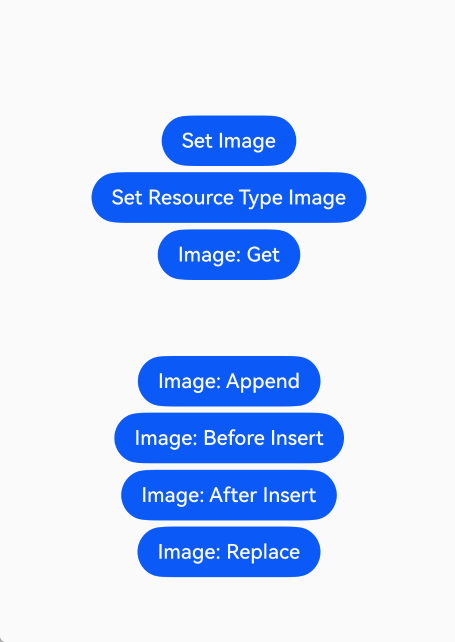
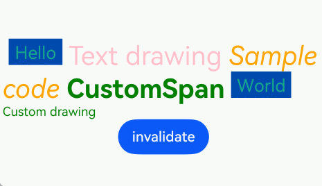
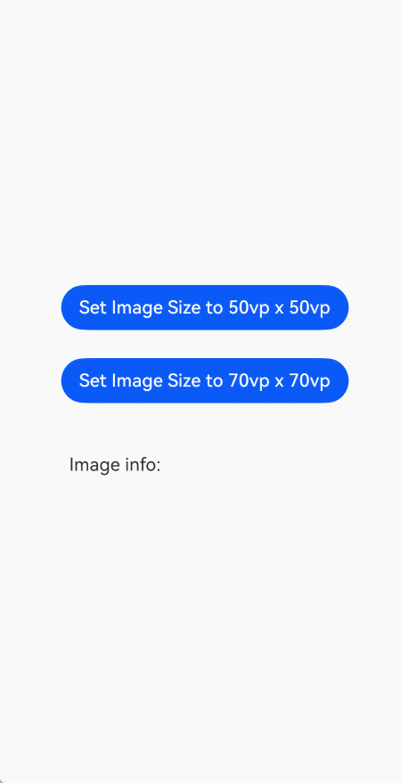
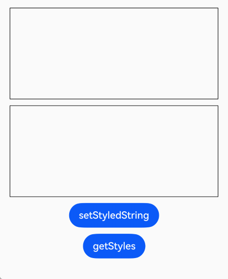
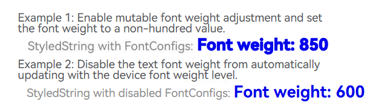

# Styled String

<!--Kit: ArkUI-->
<!--Subsystem: ArkUI-->
<!--Owner: @hddgzw-->
<!--Designer: @xiangyuan6-->
<!--Tester: @jiaoaozihao-->
<!--Adviser: @Brilliantry_Rui-->
<!-- md-trans-meta sourceCommit=5db2edcb9d284b0fedb322ba7424ef07b303f800 translatedAt=2026-08-24T07:29:48.225Z pushedAt=2026-08-25T07:35:01.552Z -->

A styled string is an object that associates text styles with text content. Styles specify text ranges through **start** and **length**, and multiple styles can be applied to the same range in a stacked manner. A styled string is an object used to create rich text. It supports setting various style types such as font style, decoration line, shadow, line height, and paragraph style, and also supports inserting images and custom drawing content. It can be bound to a **Text** component through [setStyledString](./ts-basic-components-text.md#setstyledstring12) in [TextController](./ts-basic-components-text.md#textcontroller11), or bound to a [RichEditor](./ts-basic-components-richeditor.md) component through [setStyledString](./ts-basic-components-richeditor.md#setstyledstring12) in [RichEditorStyledStringController](./ts-basic-components-richeditor.md#richeditorstyledstringcontroller12). It is suitable for scenarios that require flexible text style settings, such as rich text editing, chat message display, and document annotation. It supports dynamic modification of style content, style stacking, and conflict handling.

>  **NOTE**
>
> - The initial APIs of this module are supported since API version 12. Updates will be marked with a superscript to indicate their earliest API version.
>
> - The APIs of this module can be used only in the stage model.
>
> - Since API version 20, the text layout information of a styled string can be obtained through [getParagraphs](./../arkts-apis-uicontext-measureutils.md#getparagraphs20).
>
> - Styled strings are not supported in worker threads.
>
> - When a styled string is bound through a controller, the binding takes effect only after the layout is complete. When [measure](../js-apis-arkui-frameNode.md#measure12) and **setStyledString** are used at the same time, developers need to determine that the layout is complete through [@ohos.arkui.inspector (Layout Callback)](../js-apis-arkui-inspector.md) before binding the styled string.

## Rules of Use

* If a styled string conflicts with the current style settings in a component, the style set in the styled string takes effect.

* If a styled string conflicts with the child components in [Text](./ts-basic-components-text.md), the style set in the styled string is applied to the **Text** component, and style settings of the child components, including [Span](./ts-basic-components-span.md), are ignored.

* The [@State](../../../ui/state-management/arkts-state.md) decorator is not supported.

* Define **StyledString** as a member variable to prevent it from being destroyed when the application moves to the background.

* Creation before [loadContent()](../arkts-apis-window-Window.md#loadcontent9) is not supported.

## StyledString

### constructor

constructor(value: string | ImageAttachment | CustomSpan, styles?: Array\<StyleOptions>)

A constructor used to create a styled string.

It is not supported to create it before [loadContent()](../arkts-apis-window-Window.md#loadcontent9).

**Atomic service API**: This API can be used in atomic services since API version 12.

**System capability**: SystemCapability.ArkUI.ArkUI.Full

**Parameters**

| Name| Type| Mandatory| Description|
| -------- | -------- | -------- | -------- |
| value | string \| [ImageAttachment](#imageattachment) \| [CustomSpan](#customspan) | Yes | Text content of the styled string.<br>**NOTE**<br>When the type of value is **ImageAttachment** or **CustomSpan**, the **styles** parameter does not take effect.<br>To set styles, use methods such as [setStyle](#setstyle). |
| styles | Array\<[StyleOptions](#styleoptions)\> | No | Initialization options of the styled string.<br>**NOTE**<br>If **start** is an invalid value, the default value **0** is used.<br>If **length** is an invalid value, **length** equals the actual length of the styled string after start.<br>If **StyledStringKey** does not match **StyledStringValue**, **styles** does not take effect. |

### Properties

**System capability**: SystemCapability.ArkUI.ArkUI.Full

| Name |   Type  |   Read-Only  |   Optional  |   Description  |
| ------ | ------ | ------ | ------ | -------------- |
| length | number | Yes | No | Length of the styled string.<br>**NOTE**<br>The length of **ImageAttachment** and **CustomSpan** in the styled string is counted as 1.<br>**Atomic service API:** This API can be used in atomic services since API version 12.|

### getString

getString(): string

Obtains the text of this styled string.

**Atomic service API**: This API can be used in atomic services since API version 12.

**System capability**: SystemCapability.ArkUI.ArkUI.Full

**Return value**

| Type             |Description      |
| ------- | --------------------------------- |
| string | Text content of the styled string.<br>**NOTE**<br>When the styled string contains an image or [CustomSpan](#customspan), the returned result is represented by a space. |

### equals

equals(other: StyledString): boolean

Checks whether this styled string is the same as another styled string.

**Atomic service API**: This API can be used in atomic services since API version 12.

**System capability**: SystemCapability.ArkUI.ArkUI.Full

**Parameters**

| Name | Type                             | Mandatory| Description                                                        |
| ------- | --------------------------------- | ---- | ------------------------------------------------------------ |
| other | [StyledString](#styledstring) | Yes  | **StyledString** object to compare.|

**Return value**

| Type             |       Description      |
| ------- | --------------------------------- |
| boolean | Whether two styled strings are equal.<br>The value **true** indicates that they are equal, and **false** indicates that they are not equal.<br>**NOTE**<br>Two styled strings are considered equal when their text and styles are identical.<br>[GestureStyle](#gesturestyle) is not compared. Two styled strings are also considered equal when they have different events configured but the same text and other styles.<br>When [CustomSpan](#customspan) or [LeadingMarginSpan](#leadingmarginspan22) is compared, the addresses are compared. If the addresses are equal, they are considered equal. |

### subStyledString

subStyledString(start: number, length?: number): StyledString

Obtains a substring of this styled string. The specified range must not exceed the string's length.

**Atomic service API**: This API can be used in atomic services since API version 12.

**System capability**: SystemCapability.ArkUI.ArkUI.Full

**Parameters**

| Name | Type                             | Mandatory| Description                                                        |
| ------- | --------------------------------- | ---- | ------------------------------------------------------------ |
| start | number | Yes  | Subscript that corresponds to the start position of the sub-styled string.|
| length | number | No | Length of the sub-styled string.<br>If not passed, the default value is the difference between the length of the queried styled string object and the value of **start**. |

**Return value**

| Type             |       Description      |
| ------- | --------------------------------- |
| [StyledString](#styledstring) | Sub-styled string.<br>**NOTE**<br>When **start** is a valid input parameter, the default value of **length** is the difference between the length of the queried styled string object and the value of **start**.<br>An exception is thrown when **start** and **length** are out of bounds or when a mandatory parameter is set to **undefined**.|

**Error codes**

For details about the error codes, see [Universal Error Codes](../../errorcode-universal.md).

| ID| Error Message|
| ------- | -------- |
| 401      | Parameter error. Possible causes: 1. Mandatory parameters are left unspecified; 2.Incorrect parameters types; 3. Parameter verification failed.   |

### getStyles

getStyles(start: number, length: number, styledKey?: StyledStringKey): Array\<SpanStyle>

Obtains the styles in the specified range of a styled string. The specified range must not exceed the string's length.

This API returns only styles explicitly set by the developer.

**Atomic service API**: This API can be used in atomic services since API version 12.

**System capability**: SystemCapability.ArkUI.ArkUI.Full

**Parameters**

| Name | Type                             | Mandatory| Description                                                        |
| ------- | --------------------------------- | ---- | ------------------------------------------------------------ |
| start | number | Yes  | Subscript that corresponds to the target range in the styled string.|
| length | number | Yes  | Length of the target range in the styled string.|
| styledKey | [StyledStringKey](#styledstringkey) | No | Enumeration value of the string style of the attribute character in the specified range.<br>**Note:** <br>If this parameter is not passed, the styles of all enumeration values of [StyledStringKey](#styledstringkey) set by the developer are obtained by default. |

**Return value**

| Type             |       Description      |
| ------- | --------------------------------- |
| Array\<[SpanStyle](#spanstyle)\> | Array of style objects.<br>**Note:** <br>If no style is set for the styled string in the specified range, an empty array is returned.<br>An exception is thrown if **start** and **length** are out of bounds or a mandatory parameter is **undefined**.<br>An exception is thrown if an invalid value or **undefined** is passed to **styledKey**.<br>If **styledKey** is **CustomSpan**, the style object passed when creating **CustomSpan** is returned, and modifying this style object also affects the actual display effect. |

**Error codes**

For details about the error codes, see [Universal Error Codes](../../errorcode-universal.md).

| ID| Error Message|
| ------- | -------- |
| 401      | Parameter error. Possible causes: 1. Mandatory parameters are left unspecified; 2.Incorrect parameters types; 3. Parameter verification failed.   |

### fromHtml

static fromHtml(html: string): Promise\<StyledString>

Converts an HTML-formatted string into a styled string. HTML tags are mapped to the corresponding styled string styles (for example, bold tags are mapped to **TextStyle**, and decoration tags are mapped to **DecorationStyle**). The HTML tags currently supported for conversion are: \<p>, \<span>, \, \<br>, \<strong>, \<b>, \<a>, \<i>, \<em>, \<s>, \<u>, \<del>, \<sup>, \<sub>, \<cite>, \<dfn>, \<small>, \<h1>, \<h2>, \<h3>, \<h4>, \<h5>, \<h6>, \<ol>, \<ul>, \<li>. The style attribute in tags can be converted into the corresponding styled string styles.

For details about how to use this API, see [Example 12: Implementing Conversion Using fromHtml and toHtml](#example-12-implementing-conversion-using-fromhtml-and-tohtml) and [Example 18: Conversion Using fromHtml](#example-18-conversion-using-fromhtml).

| Tag Name| Description                  |
| ------------- | ---------------------------- |
| \<p\>       | Paragraph, separates text paragraphs.       |
| \<span\>    | Inline text supporting style configuration. In API version 17 and earlier, the **background-color** attribute set using **\<span\>** does not take effect.    |
| \     | Image.                   |
| \<strong\>  | Bolds text.                   |
| &lt;br&gt;<sup>20+</sup>      | Line break.                       |
| \<b\><sup>20+</sup>       | Bolds text.                   |
| \<a\><sup>20+</sup>       | Hyperlink.                     |
| \<i\><sup>20+</sup>       | Italic text.                   |
| \<em\><sup>20+</sup>      | Italic text.                   |
| \<s\><sup>20+</sup>       | Strikethrough.            |
| \<u\><sup>20+</sup>       | Underline.                     |
| \<del\><sup>20+</sup>     | Strikethrough.            |
| \<sup\><sup>20+</sup>     | Superscript text.                   |
| \<sub\><sup>20+</sup>     | Subscript text.                   |
| \<cite\>    | Italic text.<br>**Since:** 26.0.0        |
| \<dfn\>     | Italic text.<br>**Since:** 26.0.0        |
| \<small\>   | Font‑size reduction tag. The font size is scaled to 0.8 times the parent container font size, and nesting is supported.<br>**Since:** 26.0.0        |
| \<h1\>      | Level-1 heading.<br>**Since:** 26.0.0        |
| \<h2\>      | Level-2 heading.<br>**Since:** 26.0.0        |
| \<h3\>      | Level-3 heading.<br>**Since:** 26.0.0        |
| \<h4\>      | Level-4 heading.<br>**Since:** 26.0.0        |
| \<h5\>      | Level-5 heading.<br>**Since:** 26.0.0        |
| \<h6\>      | Level-6 heading.<br>**Since:** 26.0.0        |
| \<ol\>      | Ordered list.<br>**Since:** 26.0.0        |
| \<ul\>      | Unordered list.<br>**Since:** 26.0.0        |
| \<li\>      | List item.<br>**Since:** 26.0.0          |

**Atomic service API**: This API can be used in atomic services since API version 12.

**System capability**: SystemCapability.ArkUI.ArkUI.Full

**Parameters**

| Name | Type                             | Mandatory| Description                                                        |
| ------- | --------------------------------- | ---- | ------------------------------------------------------------ |
| html | string | Yes  | HTML-formatted string.|

**Return value**

| Type             |       Description      |
| ------- | --------------------------------- |
| Promise\<[StyledString](#styledstring)> | Styled string. **resolve** returns the converted styled string; **reject** throws an exception. |

**Error codes**

For details about the error codes, see [Universal Error Codes](../../errorcode-universal.md) and [Styled String Error Codes](../errorcode-styled-string.md).

| ID| Error Message|
| ------- | -------- |
| 401      | Parameter error. Possible causes: 1. Mandatory parameters are left unspecified; 2.Incorrect parameters types; 3. Parameter verification failed.   |
| 170001 | Convert Error. |

### toHtml<sup>14+</sup>

static toHtml(styledString: StyledString): string

Converts a styled string into an HTML-formatted string. Styled string styles are mapped to the corresponding HTML tags (for example, **TextStyle** is mapped to a span tag with the style attribute, and **ImageAttachment** is mapped to an img tag). The supported styled string keys for conversion, as detailed in [StyledStringKey](#styledstringkey), include **StyledStringKey.FONT**, **StyledStringKey.DECORATION**, **StyledStringKey.LETTER_SPACING**, **StyledStringKey.TEXT_SHADOW**, **StyledStringKey.LINE_HEIGHT**, and **StyledStringKey.IMAGE**.

For details about how to use this API, see [Example 12: Implementing Conversion Using fromHtml and toHtml](#example-12-implementing-conversion-using-fromhtml-and-tohtml).

**Atomic service API**: This API can be used in atomic services since API version 14.

**System capability**: SystemCapability.ArkUI.ArkUI.Full

**Parameters**

| Name | Type                             | Mandatory| Description                                                        |
| ------- | --------------------------------- | ---- | ------------------------------------------------------------ |
| styledString | [StyledString](#styledstring) | Yes | Styled string object to be converted into an HTML format string. |

**Return value**

| Type             |       Description      |
| ------- | --------------------------------- |
| string | HTML string.|

**Error codes**

For details about the error codes, see [Universal Error Codes](../../errorcode-universal.md).

| ID| Error Message|
| ------- | -------- |
| 401      | Parameter error. Possible causes: 1. Mandatory parameters are left unspecified; 2.Incorrect parameters types; 3. Parameter verification failed.   |

## MutableStyledString

Inherits from the [StyledString](#styledstring) class.

>  **An exception is thrown in the following cases:**
>
> If the values of **start** and **length** are out of the acceptable range or if any mandatory parameter is passed as **undefined**, an exception is thrown.
>
> **styledKey** or **styledValue** is set to an invalid value or they do not match.
> 

### replaceString

replaceString(start: number , length: number , other: string): void

Replaces the string in the specified range of this styled string.

**Atomic service API**: This API can be used in atomic services since API version 12.

**System capability**: SystemCapability.ArkUI.ArkUI.Full

**Parameters**

| Name | Type                             | Mandatory| Description                                                        |
| ------- | --------------------------------- | ---- | ------------------------------------------------------------ |
| start | number | Yes  | Subscript of the target range.|
| length | number | Yes  | Length of the target range.|
| other | string | Yes | New text content to replace.<br>**NOTE**<br>The replacement string uses the style of the character at the **start** position. |

**Error codes**

For details about the error codes, see [Universal Error Codes](../../errorcode-universal.md).

| ID| Error Message|
| ------- | -------- |
| 401      | Parameter error. Possible causes: 1. Mandatory parameters are left unspecified; 2.Incorrect parameters types; 3. Parameter verification failed.   |

### insertString

insertString(start: number , other: string): void

Inserts a string.

**Atomic service API**: This API can be used in atomic services since API version 12.

**System capability**: SystemCapability.ArkUI.ArkUI.Full

**Parameters**

| Name | Type                             | Mandatory| Description                                                        |
| ------- | --------------------------------- | ---- | ------------------------------------------------------------ |
| start | number | Yes  | Subscript of the position where the string will be inserted.|
| other | string | Yes | New text content to insert.<br>**Note:** <br>The inserted string uses the style of the character at position **start-1**. If no style is set for the character at position **start-1**, the style of the character at position **start** is used. |

**Error codes**

For details about the error codes, see [Universal Error Codes](../../errorcode-universal.md).

| ID| Error Message|
| ------- | -------- |
| 401      | Parameter error. Possible causes: 1. Mandatory parameters are left unspecified; 2.Incorrect parameters types; 3. Parameter verification failed.   |

### removeString

removeString(start: number , length: number): void

Removes the string in the specified range of this styled string.

This API equally works when the styled string contains an image or [CustomSpan](#customspan).

**Atomic service API**: This API can be used in atomic services since API version 12.

**System capability**: SystemCapability.ArkUI.ArkUI.Full

**Parameters**

| Name | Type                             | Mandatory| Description                                                        |
| ------- | --------------------------------- | ---- | ------------------------------------------------------------ |
| start | number | Yes  | Subscript of the target range.|
| length | number | Yes  | Length of the target range.|

**Error codes**

For details about the error codes, see [Universal Error Codes](../../errorcode-universal.md).

| ID| Error Message|
| ------- | -------- |
| 401      | Parameter error. Possible causes: 1. Mandatory parameters are left unspecified; 2.Incorrect parameters types; 3. Parameter verification failed.   |

### replaceStyle

replaceStyle(spanStyle: SpanStyle): void

Replaces the style in the specified range of this styled string.

**Atomic service API**: This API can be used in atomic services since API version 12.

**System capability**: SystemCapability.ArkUI.ArkUI.Full

**Parameters**

| Name | Type                             | Mandatory| Description                                                        |
| ------- | --------------------------------- | ---- | ------------------------------------------------------------ |
| spanStyle | [SpanStyle](#spanstyle) | Yes   | Style object.<br>**NOTE**<br>By default, the original style is cleared and replaced with the new style.<br>When the **styledKey** of **SpanStyle** is **IMAGE** or **CUSTOM_SPAN**, the style takes effect only when the content at the start position is currently an image or **CustomSpan** with a length of 1; otherwise, it has no effect. |

**Error codes**

For details about the error codes, see [Universal Error Codes](../../errorcode-universal.md).

| ID| Error Message|
| ------- | -------- |
| 401      | Parameter error. Possible causes: 1. Mandatory parameters are left unspecified; 2.Incorrect parameters types; 3. Parameter verification failed.   |

### setStyle

setStyle(spanStyle: SpanStyle): void

Sets a new style for the specified range of this styled string.

**Atomic service API**: This API can be used in atomic services since API version 12.

**System capability**: SystemCapability.ArkUI.ArkUI.Full

**Parameters**

| Name | Type                             | Mandatory| Description                                                        |
| ------- | --------------------------------- | ---- | ------------------------------------------------------------ |
| spanStyle | [SpanStyle](#spanstyle) | Yes | Style object.<br>By default, the original style is not cleared, and the new style is overlaid.<br>If the **StyledStringValue** types are the same, the new style overrides the old style.<br>When the **styledKey** of **SpanStyle** is **IMAGE** or **CUSTOM_SPAN**, the style takes effect only when the position of start is currently an image or **CustomSpan** and the length is 1; otherwise, it has no effect. |

> **NOTE**
>
> The minimum granularity for applying the style is **StyledStringValue**. If multiple identical **StyledStringValue** settings are applied, only the last one takes effect. If two **TextStyle** attributes with different settings are applied, only the **TextStyle** set second takes effect.

**Error codes**

For details about the error codes, see [Universal Error Codes](../../errorcode-universal.md).

| ID| Error Message|
| ------- | -------- |
| 401      |The parameter check failed.   |

### removeStyle

removeStyle(start: number , length: number , styledKey: StyledStringKey): void

Removes the style for the specified range of this styled string.

After a style is removed, the value set for the corresponding style attribute in the [Text](./ts-basic-components-text.md) component is used. If the value is not set, the default value is used.

This API equally works when the styled string contains an image.

**Atomic service API**: This API can be used in atomic services since API version 12.

**System capability**: SystemCapability.ArkUI.ArkUI.Full

**Parameters**

| Name | Type                             | Mandatory| Description                                                        |
| ------- | --------------------------------- | ---- | ------------------------------------------------------------ |
| start | number | Yes  | Subscript that corresponds to the start position of the target range.|
| length | number | Yes  | Length of the target range.|
| styledKey | [StyledStringKey](#styledstringkey)| Yes  | Styled key.|

**Error codes**

For details about the error codes, see [Universal Error Codes](../../errorcode-universal.md).

| ID| Error Message|
| ------- | -------- |
| 401      | Parameter error. Possible causes: 1. Mandatory parameters are left unspecified; 2.Incorrect parameters types; 3. Parameter verification failed.   |

### removeStyles

removeStyles(start: number , length: number): void

Removes all styles for the specified range of this styled string.

After a style is removed, the value set for the corresponding style attribute in the [Text](./ts-basic-components-text.md) component is used. If the value is not set, the default value is used.

This API equally works when the styled string contains an image.

**Atomic service API**: This API can be used in atomic services since API version 12.

**System capability**: SystemCapability.ArkUI.ArkUI.Full

**Parameters**

| Name | Type                             | Mandatory| Description                                                        |
| ------- | --------------------------------- | ---- | ------------------------------------------------------------ |
| start | number | Yes  | Subscript that corresponds to the start position of the target range.|
| length | number | Yes  | Length of the target range.|

**Error codes**

For details about the error codes, see [Universal Error Codes](../../errorcode-universal.md).

| ID| Error Message|
| ------- | -------- |
| 401      | Parameter error. Possible causes: 1. Mandatory parameters are left unspecified; 2.Incorrect parameters types; 3. Parameter verification failed.   |

### clearStyles

clearStyles(): void

Removes all styles of this styled string.

After a style is removed, the value set for the corresponding style attribute in the [Text](./ts-basic-components-text.md) component is used. If the value is not set, the default value is used.

**Atomic service API**: This API can be used in atomic services since API version 12.

**System capability**: SystemCapability.ArkUI.ArkUI.Full

### replaceStyledString

replaceStyledString(start: number , length: number , other: StyledString): void

Replaces the styled string in the specified range.

**Atomic service API**: This API can be used in atomic services since API version 12.

**System capability**: SystemCapability.ArkUI.ArkUI.Full

**Parameters**

| Name | Type                             | Mandatory| Description                                                        |
| ------- | --------------------------------- | ---- | ------------------------------------------------------------ |
| start | number | Yes  | Subscript that corresponds to the start position of the target range.|
| length | number | Yes  | Length of the target range.|
| other | [StyledString](#styledstring) | Yes  | New styled string.|

**Error codes**

For details about the error codes, see [Universal Error Codes](../../errorcode-universal.md).

| ID| Error Message|
| ------- | -------- |
| 401      | Parameter error. Possible causes: 1. Mandatory parameters are left unspecified; 2.Incorrect parameters types; 3. Parameter verification failed.   |

### insertStyledString

insertStyledString(start: number , other: StyledString): void

Inserts a new styled string at the specified position.

**Atomic service API**: This API can be used in atomic services since API version 12.

**System capability**: SystemCapability.ArkUI.ArkUI.Full

**Parameters**

| Name | Type                             | Mandatory| Description                                                        |
| ------- | --------------------------------- | ---- | ------------------------------------------------------------ |
| start | number | Yes  | Subscript of the position to insert the styled string.|
| other | [StyledString](#styledstring) | Yes  | New styled string.|

**Error codes**

For details about the error codes, see [Universal Error Codes](../../errorcode-universal.md).

| ID| Error Message|
| ------- | -------- |
| 401      | Parameter error. Possible causes: 1. Mandatory parameters are left unspecified; 2.Incorrect parameters types; 3. Parameter verification failed.   |

### appendStyledString

appendStyledString(other: StyledString): void

Appends a styled string.

**Atomic service API**: This API can be used in atomic services since API version 12.

**System capability**: SystemCapability.ArkUI.ArkUI.Full

**Parameters**

| Name | Type                             | Mandatory| Description                                                        |
| ------- | --------------------------------- | ---- | ------------------------------------------------------------ |
| other | [StyledString](#styledstring) | Yes  | New styled string.|

## StyledStringValue

type StyledStringValue = TextStyle | DecorationStyle | BaselineOffsetStyle | LetterSpacingStyle |
TextShadowStyle | GestureStyle | ImageAttachment | ParagraphStyle | LineHeightStyle | UrlStyle | CustomSpan | UserDataSpan | BackgroundColorStyle | LineSpacingStyle

Defines the style for a styled string.

**Atomic service API**: This API can be used in atomic services since API version 12.

**Model restriction**: This API can be used only in the stage model.

**System capability**: SystemCapability.ArkUI.ArkUI.Full

| Type | Description  |
| ------ | ---------- |
| [TextStyle](#textstyle) | Text style.|
| [DecorationStyle](#decorationstyle) | Text decorative line style.|
| [BaselineOffsetStyle](#baselineoffsetstyle) | Text baseline offset style.|
| [LetterSpacingStyle](#letterspacingstyle) | Text letter spacing style.|
| [LineHeightStyle](#lineheightstyle) | Text line height style.|
| [TextShadowStyle](#textshadowstyle) | Text shadow style.|
| [GestureStyle](#gesturestyle) | Gesture style.|
| [ParagraphStyle](#paragraphstyle) | Text paragraph style.|
| [ImageAttachment](#imageattachment) | Image style.|
| [CustomSpan](#customspan) | Custom span style.|
| [UserDataSpan](#userdataspan) | User data span style.|
| [UrlStyle](#urlstyle14) | URL style.|
| [BackgroundColorStyle](#backgroundcolorstyle14) | Text background color style.|
| [LineSpacingStyle](#linespacingstyle) | Text line spacing style. **Since:** 26.0.0 |

## StyleOptions

**Atomic service API**: This API can be used in atomic services since API version 12.

**System capability**: SystemCapability.ArkUI.ArkUI.Full

| Name | Type                             | Read-Only| Optional| Description  |
| ------- | --------------------------------- | ---- | ---- |--------------------------------- |
| start | number | No | Yes | Start position for setting the style of the styled string.<br>If the value of **start** is less than 0 or exceeds the string length, it is processed as 0. |
| length | number | No | Yes | Length for setting the style of the styled string.<br>If the value of **length** is less than 0 or exceeds the difference between the string length and **start**, it is processed as the difference between the string length and **start**. |
| styledKey | [StyledStringKey](#styledstringkey)| No  | No| Style key.|
| styledValue | [StyledStringValue](#styledstringvalue) | No | No | Style object used to set the style of the styled string. |

## SpanStyle

**Atomic service API**: This API can be used in atomic services since API version 12.

**System capability**: SystemCapability.ArkUI.ArkUI.Full

| Name | Type                             | Read-Only| Optional| Description  |
| ------- | --------------------------------- | ---- | ---- |--------------------------------- |
| start | number | No  | No  | Start position of the styled string style.|
| length | number | No  | No  | Length of the styled string style.|
| styledKey | [StyledStringKey](#styledstringkey)| No  | No  | Style key.|
| styledValue | [StyledStringValue](#styledstringvalue) | No | No | Style object used to match the style of the styled string. |

## TextStyle

Describes the text style.

**System capability**: SystemCapability.ArkUI.ArkUI.Full

### Properties

**System capability**: SystemCapability.ArkUI.ArkUI.Full

<!--Table: 20%; 20%; 10%; 10%; 40%-->

| Name       | Type                                    | Read-Only| Optional| Description                                                                                                                             |
| ----------- | ---------------------------------------- | ---- | ---- | --------------------------------------------------------------------------------------------------------------------------------- |
| fontColor   | [ResourceColor](ts-types.md#resourcecolor)  | Yes   | Yes   | Text color of the styled string.<br>**Atomic service API:** This API can be used in atomic services since API version 12.                                               |
| fontFamily  | string                                   | Yes   | Yes   | Text font of the styled string.<br>Default value: **undefined**.<br>**Atomic service API:** This API can be used in atomic services since API version 12.                       |
| fontSize    | number                                   | Yes   | Yes   | Text font size of the styled string.<br>Unit: [vp](ts-pixel-units.md#basic-pixel-units)<br>**Atomic service API:** This API can be used in atomic services since API version 12. |
| fontWeight  | number                                   | Yes   | Yes   | Text font weight of the styled string.<br>Default value: **400**<br>**NOTE**<br>The return value is of the string type. For details about the relationship between the return value and the set value, see the table below.<br>**Atomic service API:** This API can be used in atomic services since API version 12.                                           |
| fontStyle   | [FontStyle](ts-appendix-enums.md#fontstyle) | Yes   | Yes   | Text font style of the styled string.<br>**Atomic service API:** This API can be used in atomic services since API version 12.                                           |
| fontConfigs<sup>24+</sup> | [FontConfigs](ts-text-common.md#fontconfigs24) | Yes   | Yes   | Font configuration of the styled string.<br>Default value: **undefined**, indicating that **fontConfigs** is not set.<br>**Atomic service API:** This API can be used in atomic services since API version 24.<br>**Model restriction:** This API can be used only in the stage model.                                           |
| strokeWidth<sup>20+</sup> | number                                   | Yes   | Yes   | Text stroke width of the styled string.<br>Default value: **0**, in [vp](ts-pixel-units.md#basic-pixel-units).<br>**Atomic service API:** This API can be used in atomic services since API version 20.                                           |
| strokeColor<sup>20+</sup> | [ResourceColor](ts-types.md#resourcecolor)  | Yes   | Yes   | Text stroke color of the styled string.<br>Default value: the font color.<br>**Atomic service API:** This API can be used in atomic services since API version 20.                                           |
| superscript<sup>20+</sup> | [SuperscriptStyle](ts-text-common.md#superscriptstyle20)  | Yes   | Yes   | Superscript and subscript of the styled string.<br>Default value: **SuperscriptStyle.NORMAL**.<br>**Atomic service API:** This API can be used in atomic services since API version 20.                                           |
| fontVariations | Array&lt;[FontVariation](../../apis-arkgraphics2d/js-apis-graphics-text.md#fontvariation)&gt; | Yes | Yes | Attribute array of the variable font.<br>Default value: **undefined**, indicating that the variable font attributes are not set.<br>**Since:** 26.0.0 <br>**Model restriction:** This API can be used only in the stage model.<br>**Atomic service API:** This API can be used in atomic services since API version 26.0.0. |
| strokeJoinStyle | [StrokeJoinStyle](ts-text-common.md#strokejoinstyle) | Yes | Yes | Text stroke join style of the styled string. For details about the enum values, see **StrokeJoinStyle**.<br>Default value: **StrokeJoinStyle.MITER_JOIN**, indicating a miter join with a sharp corner.<br>**Since:** 26.0.0<br>**Model restriction:** This API can be used only in the stage model.<br>**Atomic service API:** This API can be used in atomic services since API version 26.0.0. |

The relationship between the **fontWeight** parameter and the return value is as follows.

| Parameter       | Return Value|
| ----------- | ----------- |
| 100 |  '0' |
| 200  |  '1'  |
| 300 |  '2'  |
| 400  |  '3'  |
| 500    |  '4'  |
| 600  |  '5'  |
| 700  |  '6'  |
| 800    |  '7'  |
| 900  |  '8'  |
| FontWeight.Bold or 'bold' |  '9'  |
| FontWeight.Normal or 'normal' |  '10' |
| FontWeight.Bolder or 'bolder' |  '11'  |
| FontWeight.Lighter or 'lighter' |  '12'  |
| FontWeight.Medium or 'medium' |  '13'  |
| FontWeight.Regular or 'regular' |  '14'  |

### constructor

constructor(value?: TextStyleInterface)

A constructor used to create a text style.

**Atomic service API**: This API can be used in atomic services since API version 12.

**System capability**: SystemCapability.ArkUI.ArkUI.Full

**Parameters**

| Name | Type                             | Mandatory| Description  |
| ------- | --------------------------------- | ---- | --------------------------------- |
| value | [TextStyleInterface](#textstyleinterface) | No | Font style setting item.<br>Default value: when not passed, inherits the default values of the **TextStyleInterface** properties. |

## TextStyleInterface

**System capability**: SystemCapability.ArkUI.ArkUI.Full

| Name       | Type    | Read-Only| Optional| Description     |
| ----------- | ----------------------------------- | ---- | ---- |---------------------------- |
| fontColor   | [ResourceColor](ts-types.md#resourcecolor)                       | No   | Yes | Font color.<br>The default value is the theme color.<br>**Atomic service API:** This API can be used in atomic services since API version 12. |
| fontFamily  | [ResourceStr](ts-types.md#resourcestr)                           | No   | Yes | Text font.<br>The default value is the theme font.<br>**Atomic service API:** This API can be used in atomic services since API version 12. |
| fontSize    | [LengthMetrics](../js-apis-arkui-graphics.md#lengthmetrics12)    | No   | Yes | Font size.<br>The default font size is 16fp.<br>If the unit value of LengthMetrics is PERCENT, the current setting does not take effect and is processed as **16fp**.<br>Unit: [fp](ts-pixel-units.md#basic-pixel-units) <br>**Atomic service API:** This API can be used in atomic services since API version 12. |
| fontWeight  | number\| [FontWeight](ts-appendix-enums.md#fontweight) \| string | No   | Yes | Font weight.<br>For the number type, the value ranges from 100 to 900 at an interval of 100. The default value is 400. A larger value indicates a heavier font. For the string type, only the string form of the number type value is supported, for example, "400", as well as "bold", "bolder", "lighter", "regular", and "medium", which correspond to the respective enum values in **FontWeight**. An excessively large value may be truncated in different fonts. If the value passed in is out of the value range or does not meet the interval requirement, the default value is used.<br>Default value: **FontWeight.Normal**<br>**Atomic service API:** This API can be used in atomic services since API version 12. |
| fontStyle   | [FontStyle](ts-appendix-enums.md#fontstyle)                      | No   | Yes | Font style.<br>Default value: **FontStyle.Normal**<br>**Atomic service API:** This API can be used in atomic services since API version 12. |
| fontConfigs<sup>24+</sup> | [FontConfigs](ts-text-common.md#fontconfigs24)                      | No   | Yes | Font configuration. The default value inherits [FontConfigs](ts-text-common.md#fontconfigs24).<br>**Atomic service API:** This API can be used in atomic services since API version 24.<br>**Model restriction:** This API can be used only in the stage model. |
| strokeWidth<sup>20+</sup> | [LengthMetrics](../js-apis-arkui-graphics.md#lengthmetrics12)    | No   | Yes | Text stroke width. If the unit value of **LengthMetrics** is **PERCENT**, the current setting does not take effect and is processed as 0.<br>If the value is less than 0, the text is solid; if the value is greater than 0, the text is hollow.<br>The default value is **0**.<br>**Atomic service API:** This API can be used in atomic services since API version 20. |
| strokeColor<sup>20+</sup> | [ResourceColor](ts-types.md#resourcecolor)                       | No   | Yes | Text stroke color.<br>The default value is the font color. If an abnormal value is set, the font color is used.<br>**Atomic service API:** This API can be used in atomic services since API version 20. |
| superscript<sup>20+</sup> | [SuperscriptStyle](ts-text-common.md#superscriptstyle20)     | No   | Yes | Text superscript and subscript.<br>Default value: **SuperscriptStyle.NORMAL**<br>**Atomic service API:** This API can be used in atomic services since API version 20. |
| fontVariations | Array&lt;[FontVariation](../../apis-arkgraphics2d/js-apis-graphics-text.md#fontvariation)&gt; | No | Yes | Attribute of the variable font.<br>Default value: **undefined**, indicating that the attribute of the variable font is not set.<br>The **fontVariations** attribute has a higher priority than **fontWeight**.<br>**Since:** 26.0.0 <br>**Model restriction:** This API can be used only in the stage model.<br>**Atomic service API:** This API can be used in atomic services since API version 26.0.0. |
| strokeJoinStyle | [StrokeJoinStyle](ts-text-common.md#strokejoinstyle) | No | Yes | Text stroke join style. For details about the enum values and their descriptions, see **StrokeJoinStyle**.<br>Default value: **StrokeJoinStyle.MITER_JOIN**, indicating a miter join with a sharp corner.<br>**Since:** 26.0.0<br>**Model restriction:** This API can be used only in the stage model.<br>**Atomic service API:** This API can be used in atomic services since API version 26.0.0. |

## GestureStyle

Describes the event gesture style.

**System capability**: SystemCapability.ArkUI.ArkUI.Full

### constructor

constructor(value?: GestureStyleInterface)

A constructor used to create a gesture style.

**Atomic service API**: This API can be used in atomic services since API version 12.

**System capability**: SystemCapability.ArkUI.ArkUI.Full

**Parameters**

| Name | Type                             | Mandatory| Description  |
| ------- | --------------------------------- | ---- | --------------------------------- |
| value | [GestureStyleInterface](#gesturestyleinterface) | No | Event gesture settings.<br>Default value: no gesture event is bound when this parameter is not passed. |

## GestureStyleInterface

**System capability**: SystemCapability.ArkUI.ArkUI.Full

| Name | Type                             |  Read-Only| Optional | Description  |
| ------- | --------------------------------- | ---- | ---- | --------------------------------- |
| onClick | Callback\<[ClickEvent](ts-universal-events-click.md#clickevent)> | No   | Yes | Click event.<br>**Atomic service API:** This API can be used in atomic services since API version 12. |
| onLongPress | Callback\<[GestureEvent](./ts-gesture-common.md#gestureevent)> | No   | Yes | Long press event.<br>**Atomic service API:** This API can be used in atomic services since API version 12.|
| onTouch<sup>20+</sup> | Callback\<[TouchEvent](ts-universal-events-touch.md#touchevent)> | No   | Yes | Touch event.<br>**Atomic service API:** This API can be used in atomic services since API version 20.|

## DecorationOptions<sup>20+</sup>

Provides additional configuration options for the text decoration line style.

**Atomic service API**: This API can be used in atomic services since API version 20.

**System capability**: SystemCapability.ArkUI.ArkUI.Full

| Name | Type                             | Read-Only| Optional| Description  |
| ------- | --------------------------------- | ---- | ---- |--------------------------------- |
| enableMultiType | boolean | No   | Yes | Whether to enable the display of multiple decoration lines.<br>Default value: **undefined**. The value **true** enables it, and **false** or **undefined** disables it.<br>All decoration lines to be displayed must have this option enabled. In the intersection area of these decoration lines, the multi-decoration-line effect is displayed, and the style, color, and thickness of the last set decoration line are used. |

## DecorationStyle

Describes the text decorative line style.

**System capability**: SystemCapability.ArkUI.ArkUI.Full

### Properties

**System capability**: SystemCapability.ArkUI.ArkUI.Full

| Name          | Type             | Read-Only  |Optional  | Description    |
| ------------ |---------------------| ---- | ---- | ------ |
| type  | [TextDecorationType](ts-appendix-enums.md#textdecorationtype) |  Yes  |  No  | Type of the text decoration line of the styled string.<br>**Atomic service API:** This API can be used in atomic services since API version 12.|
| color | [ResourceColor](ts-types.md#resourcecolor)   | Yes    | Yes  | Color of the text decoration line of the styled string.<br>**Atomic service API:** This API can be used in atomic services since API version 12. |
| style | [TextDecorationStyle](ts-appendix-enums.md#textdecorationstyle12) | Yes    |Yes  | Style of the text decoration line of the styled string.<br>**Atomic service API:** This API can be used in atomic services since API version 12. |
| thicknessScale<sup>20+</sup> | number | Yes    |Yes  | Scale value of the text decoration line thickness of the styled string.<br>**Atomic service API:** This API can be used in atomic services since API version 20. |
| options<sup>20+</sup> | [DecorationOptions](#decorationoptions20) | Yes    |Yes  | Additional configuration options of the text decoration line style of the styled string.<br>**Atomic service API:** This API can be used in atomic services since API version 20. |

### constructor

constructor(value: DecorationStyleInterface)

A constructor used to create a text decoration line style. If this API is not used to set the style, the default decoration line type is **TextDecorationType.None**, the color is **Color.Black**, and the style is **TextDecorationStyle.SOLID**.

**Atomic service API**: This API can be used in atomic services since API version 12.

**System capability**: SystemCapability.ArkUI.ArkUI.Full

**Parameters**

| Name | Type                             | Mandatory| Description  |
| ------- | --------------------------------- | ---- | --------------------------------- |
| value | [DecorationStyleInterface](#decorationstyleinterface) | Yes | Text decoration settings. |

### constructor<sup>20+</sup>

constructor(value: DecorationStyleInterface, options?: DecorationOptions)

A constructor used to create a text decoration line style, with additional configuration options. If this API is not used to set the style, the default decoration line type is **TextDecorationType.None**, the color is **Color.Black**, the style is **TextDecorationStyle.SOLID**, and the thickness scale is 1.0.

**Atomic service API**: This API can be used in atomic services since API version 20.

**System capability**: SystemCapability.ArkUI.ArkUI.Full

**Parameters**

| Name | Type                             | Mandatory| Description  |
| ------- | --------------------------------- | ---- | --------------------------------- |
| value | [DecorationStyleInterface](#decorationstyleinterface) | Yes | Text decoration line settings. |
| options | [DecorationOptions](#decorationoptions20) | No | Additional configuration options for the text decoration line. |

## DecorationStyleInterface

Describes the API object for text decoration line styles.

**System capability**: SystemCapability.ArkUI.ArkUI.Full

| Name | Type                             | Read-Only| Optional| Description  |
| ------- | --------------------------------- | ---- | ---- |--------------------------------- |
| type | [TextDecorationType](ts-appendix-enums.md#textdecorationtype) | No | No | Type of the decoration line. For details about the enums and their descriptions, see **TextDecorationType**.<br>Default value: **TextDecorationType.None** <br>**Atomic service API:** This API can be used in atomic services since API version 12. |
| color | [ResourceColor](ts-types.md#resourcecolor) | No | Yes | Color of the decoration line.<br>Default value: **Color.Black** <br>**Atomic service API:** This API can be used in atomic services since API version 12. |
| style | [TextDecorationStyle](ts-appendix-enums.md#textdecorationstyle12) | No | Yes | Style of the decoration line. For details about the enums and their descriptions, see **TextDecorationStyle**.<br>Default value: **TextDecorationStyle.SOLID**<br>**Atomic service API:** This API can be used in atomic services since API version 12. |
| thicknessScale<sup>20+</sup> | number | No | Yes | Scale ratio of the decoration line thickness.<br>Default value: 1.0 <br>Value range: [0, +∞) <br>**Note:** A negative value is processed as the default value.<br>**Atomic service API:** This API can be used in atomic services since API version 20. |

>  **NOTE**
>
>  When the bottom contour of a character intersects with the decoration, underline avoidance is triggered, commonly affecting characters like "g", "j", "y", "q", and "p."
>
>  If the decoration color is set to **Color.Transparent**, it inherits the text color of the first character in each line. If the decoration color is set to **"#00FFFFFF"**, the line becomes fully transparent.

## BaselineOffsetStyle

Describes the text baseline offset object. It is suitable for scenarios that require fine-tuning the vertical position of text, such as aligning superscript and subscript text with normal text in chemical formulas and mathematical expressions.

**System capability**: SystemCapability.ArkUI.ArkUI.Full

### Properties

**Atomic service API**: This API can be used in atomic services since API version 12.

**System capability**: SystemCapability.ArkUI.ArkUI.Full

| Name          | Type             | Read-Only  | Optional  | Description    |
| ------------ |---------------------| ---- | ---- | ------ |
| baselineOffset  | number |  Yes  |  No | Text baseline offset of the styled string.<br>Unit: [vp](ts-pixel-units.md#basic-pixel-units) |

### constructor

constructor(value: LengthMetrics)

A constructor used to create a text baseline offset style.

**Atomic service API**: This API can be used in atomic services since API version 12.

**System capability**: SystemCapability.ArkUI.ArkUI.Full

**Parameters**

| Name | Type                             | Mandatory| Description  |
| ------- | --------------------------------- | ---- | --------------------------------- |
| value | [LengthMetrics](../js-apis-arkui-graphics.md#lengthmetrics12) | Yes | Setting item for the text baseline offset. If the unit value of **LengthMetrics** is **PERCENT**, this setting does not take effect. |

## LetterSpacingStyle

Describes the text character spacing object. It is suitable for scenarios that require adjusting character spacing, such as widening the spacing of title text to enhance the visual effect and narrowing the spacing of dense text to save space.

**System capability**: SystemCapability.ArkUI.ArkUI.Full

### Properties

**Atomic service API**: This API can be used in atomic services since API version 12.

**System capability**: SystemCapability.ArkUI.ArkUI.Full

| Name          | Type             | Read-Only  | Optional  | Description    |
| ------------ |---------------------| ---- | ---- | ------ |
| letterSpacing  | number |  Yes  |  No  | Text character spacing of the styled string.<br>Unit: [vp](ts-pixel-units.md#basic-pixel-units) |

### constructor

constructor(value: LengthMetrics)

A constructor used to create a text letter spacing style.

**Atomic service API**: This API can be used in atomic services since API version 12.

**System capability**: SystemCapability.ArkUI.ArkUI.Full

**Parameters**

| Name | Type                             | Mandatory| Description  |
| ------- | --------------------------------- | ---- | --------------------------------- |
| value | [LengthMetrics](../js-apis-arkui-graphics.md#lengthmetrics12) | Yes | Text character spacing setting. If the unit value of **LengthMetrics** is **PERCENT**, this setting does not take effect. |

## LineHeightStyle

Describes the text line height style.

**System capability**: SystemCapability.ArkUI.ArkUI.Full

### Properties

**System capability**: SystemCapability.ArkUI.ArkUI.Full

| Name          | Type             | Read-Only  | Optional  | Description    |
| ------------ |---------------------| ---- | ---- | ------ |
| lineHeight  | number |  Yes  |  No  | Text line height of the styled string.<br>Unit: [vp](ts-pixel-units.md#basic-pixel-units)<br>**Atomic service API:** This API can be used in atomic services since API version 12. |
| lineHeightMultiple  | number |  Yes  |  Yes  | Multiple of the text line height. The actual line height is the product of the maximum font height of the line and the multiple.<br>**Note:** When **lineHeightMultiple** is set together with **lineHeight** or [LineSpacingStyle](#linespacingstyle), only **lineHeightMultiple** takes effect. **lineHeightMultiple** does not take effect when it is less than 0 or **undefined**. When **lineHeightMultiple** is 0, it is equivalent to setting it to 1.<br>**Since:** 26.0.0 <br>**Atomic service API:** This API can be used in atomic services since API version 26.0.0.<br>**Model restriction:** This API can be used only in the stage model. |

### constructor

constructor(lineHeight: LengthMetrics)

A constructor used to create a text line height style.

**Atomic service API**: This API can be used in atomic services since API version 12.

**System capability**: SystemCapability.ArkUI.ArkUI.Full

**Parameters**

| Name  | Type                              | Mandatory | Description   |
| ------- | --------------------------------- | ---- | --------------------------------- |
| lineHeight | [LengthMetrics](../js-apis-arkui-graphics.md#lengthmetrics12) | Yes   | Text line height setting. If the unit value of **LengthMetrics** is **PERCENT**, the current setting does not take effect. When the **value** of **LengthMetrics** is greater than 0, the text line height setting takes effect; otherwise, the text line height adapts to the font size. |

### constructor

constructor(lineHeight: LengthMetrics, lineHeightMultiple?: number)

A constructor used to create the text line height and multiple.

> **NOTE**
>
> - When **lineHeightMultiple** is set together with **lineHeight** or [LineSpacingStyle](#linespacingstyle), only **lineHeightMultiple** takes effect, and the line height is the product of the maximum font height of the line and the multiple.
>
> - When **lineHeightMultiple** is less than 0 or **undefined**, it does not take effect, and **lineHeight** and [LineSpacingStyle](#linespacingstyle) are used to set the line height and line spacing.
>
> - When **lineHeightMultiple** is equal to 0, it is equivalent to setting it to 1.

**Since**: 26.0.0

**Atomic service API:** This API can be used in atomic services since API version 26.0.0.

**System capability**: SystemCapability.ArkUI.ArkUI.Full

**Model restriction**: This API can be used only in the stage model.

**Parameters**

| Name | Type                             | Mandatory| Description  |
| ------- | --------------------------------- | ---- | --------------------------------- |
| lineHeight | [LengthMetrics](../js-apis-arkui-graphics.md#lengthmetrics12) | Yes  | Text line height setting. When the value of **LengthMetrics** is greater than 0, the text line height setting takes effect; otherwise, the text line height adapts to the font size. |
| lineHeightMultiple | number | No  | Multiple of the text line height.<br>Value range: [0, +∞), decimals supported.<br>**NOTE**<br>When set together with **lineHeight** or [LineSpacingStyle](#linespacingstyle), only **lineHeightMultiple** takes effect, and the line height is the product of the maximum font height of the line and the multiple.<br>It does not take effect when the value is less than 0 or **undefined**.<br>When the value is 0, it is equivalent to setting it to 1. |

## LineSpacingStyle

Describes the text line spacing object. It is suitable for scenarios that require adjusting the spacing between lines within a paragraph, such as improving text reading comfort and adjusting document layout density.

### Properties

**Since**: 26.0.0

**Atomic service API:** This API can be used in atomic services since API version 26.0.0.

**System capability**: SystemCapability.ArkUI.ArkUI.Full

**Model restriction**: This API can be used only in the stage model.

| Name           | Type              | Read-Only   | Optional   | Description     |
| ------------ |---------------------| ---- | ---- | ------ |
| lineSpacing  | number |  Yes  |  No  | Text line spacing.<br>Value range: [0, +∞)<br>Unit: [vp](ts-pixel-units.md#basic-pixel-units) |
| options  | [LineSpacingOptions](ts-text-common.md#linespacingoptions20) |  Yes  |  Yes  | Line spacing configuration options. |

### constructor

constructor(lineSpacing: LengthMetrics, options?: LineSpacingOptions)

A constructor used to create the text line spacing. If this API is not used to set the value, the default line spacing is **0.0**. When the value of **LengthMetrics** is less than 0, the default value **0.0** is used. When it is set together with **lineHeightMultiple** of [LineHeightStyle](#lineheightstyle) and **lineHeightMultiple** takes effect, this parameter does not take effect.

**Since**: 26.0.0

**Atomic service API:** This API can be used in atomic services since API version 26.0.0.

**System capability**: SystemCapability.ArkUI.ArkUI.Full

**Model restriction**: This API can be used only in the stage model.

**Parameters**

| Name  | Type                              | Mandatory | Description   |
| ------- | --------------------------------- | ---- | --------------------------------- |
| lineSpacing | [LengthMetrics](../js-apis-arkui-graphics.md#lengthmetrics12) | Yes   | Text line spacing.<br>Value range: [0, +∞) |
| options | [LineSpacingOptions](ts-text-common.md#linespacingoptions20) | No   | Line spacing configuration options. |

## TextShadowStyle

Describes the text shadow style.

**System capability**: SystemCapability.ArkUI.ArkUI.Full

### Properties

**Atomic service API**: This API can be used in atomic services since API version 12.

**System capability**: SystemCapability.ArkUI.ArkUI.Full

| Name          | Type             | Read-Only  | Optional  | Description    |
| ------------ |---------------------| ---- | ---- | ------ |
| textShadow  | Array\<[ShadowOptions](ts-universal-attributes-image-effect.md#shadowoptions)> |  Yes |  No | Text shadow of the styled string.|

### constructor

constructor(value: ShadowOptions | Array\<ShadowOptions>)

A constructor used to create a text shadow style.

The **ShadowOptions** object does not support the **fill** field.

**Atomic service API**: This API can be used in atomic services since API version 12.

**System capability**: SystemCapability.ArkUI.ArkUI.Full

**Parameters**

| Name | Type                             | Mandatory| Description  |
| ------- | --------------------------------- | ---- | --------------------------------- |
| value | [ShadowOptions](ts-universal-attributes-image-effect.md#shadowoptions) \| Array\<[ShadowOptions](ts-universal-attributes-image-effect.md#shadowoptions)>  | Yes  | Text shadow options.|

## ImageAttachment

Describes the image attachment.

**System capability**: SystemCapability.ArkUI.ArkUI.Full

### Properties

**System capability**: SystemCapability.ArkUI.ArkUI.Full

| Name          | Type             | Read-Only  | Optional  | Description    |
| ------------ |---------------------| ---- | ---- | ------ |
| value  | [PixelMap](../../apis-image-kit/arkts-apis-image-PixelMap.md) |  Yes |  No | Image data source of the styled string.<br>**Atomic service API**: This API can be used in atomic services since API version 12.|
| size  | [SizeOptions](ts-types.md#sizeoptions) |  Yes  |  Yes  | Image size of the styled string.<br>**Atomic service API:** This API can be used in atomic services since API version 12.<br>The unit of the returned number value is `px`. |
| sizeInVp<sup>21+</sup>   | [SizeOptions](ts-types.md#sizeoptions) |  Yes  |  Yes  | Image size of the styled string.<br>**Atomic service API:** This API can be used in atomic services since API version 21.<br>The unit of the returned number value is `vp`.<br>If the ImageAttachment size is set to a negative value or undefined, undefined is returned. |
| verticalAlign  | [ImageSpanAlignment](ts-appendix-enums.md#imagespanalignment10) |  Yes |  Yes | Image alignment mode of the styled string.<br>**Atomic service API**: This API can be used in atomic services since API version 12.|
| objectFit  | [ImageFit](ts-appendix-enums.md#imagefit) |  Yes |  Yes | Image scale type of the styled string.<br>**Atomic service API**: This API can be used in atomic services since API version 12.|
| layoutStyle  | [ImageAttachmentLayoutStyle](#imageattachmentlayoutstyle) |  Yes |  Yes | Image layout of the styled string.<br>**Atomic service API**: This API can be used in atomic services since API version 12.|
| colorFilter<sup>15+</sup>  | [ColorFilterType](#colorfiltertype15) |  Yes |  Yes | Image color filter of the styled string.<br>**Atomic service API**: This API can be used in atomic services since API version 15.|
| supportSvg2<sup>22+</sup>  | boolean |  Yes |  Yes | Whether to enable [enhanced SVG tag parsing capabilities](ts-image-svg2-capabilities.md).<br>**true**: Enable enhanced SVG tag parsing. **false**: Use original SVG tag parsing.<br>Default value: **false**<br> **Atomic service API**: This API can be used in atomic services since API version 22.|

### constructor

constructor(value: ImageAttachmentInterface)

A constructor used to create an image object.

**Atomic service API**: This API can be used in atomic services since API version 12.

**System capability**: SystemCapability.ArkUI.ArkUI.Full

**Parameters**

| Name | Type                             | Mandatory| Description  |
| ------- | --------------------------------- | ---- | --------------------------------- |
| value | [ImageAttachmentInterface](#imageattachmentinterface) | Yes  | Image attachment options.|

### constructor<sup>15+</sup>

constructor(attachment: Optional\<AttachmentType\>)

A constructor used to create an image object. Compared to the constructor with a **value** type parameter, this constructor with an **attachment** type parameter supports images of **undefined** and [ResourceStr](ts-types.md#resourcestr) types.

**Atomic service API**: This API can be used in atomic services since API version 15.

**System capability**: SystemCapability.ArkUI.ArkUI.Full

**Parameters**

| Name | Type                             | Mandatory| Description  |
| ------- | --------------------------------- | ---- | --------------------------------- |
| attachment | Optional<[AttachmentType](#attachmenttype15)> | Yes  | Image attachment, which can be of type PixelMap or [ResourceStr](ts-types.md#resourcestr).|

## AttachmentType<sup>15+</sup>

type AttachmentType = ImageAttachmentInterface | ResourceImageAttachmentOptions

Defines the image attachment type, which is used to set images of PixelMap or [ResourceStr](ts-types.md#resourcestr) type for styled strings.

**Atomic service API**: This API can be used in atomic services since API version 15.

**System capability**: SystemCapability.ArkUI.ArkUI.Full

| Type | Description  |
| ------ | ---------- |
| [ImageAttachmentInterface](#imageattachmentinterface) | Settings for images of the PixelMap type.|
| [ResourceImageAttachmentOptions](#resourceimageattachmentoptions15) | Settings for images of the ResourceStr type.|

## ColorFilterType<sup>15+</sup>

type ColorFilterType = ColorFilter | DrawingColorFilter

Defines the type for image color filter settings.

**Atomic service API**: This API can be used in atomic services since API version 15.

**System capability**: SystemCapability.ArkUI.ArkUI.Full

| Type | Description  |
| ------ | ---------- |
| [ColorFilter](ts-types.md#colorfilter9) | Color filter settings of the ColorFilter type.|
| [DrawingColorFilter](../../apis-arkgraphics2d/arkts-apis-graphics-drawing-ColorFilter.md) | Color filter settings of the DrawingColorFilter type.|

## ImageAttachmentInterface

**System capability**: SystemCapability.ArkUI.ArkUI.Full

| Name | Type                             | Read-Only| Optional| Description  |
| ------- | --------------------------------- | ---- | ---- | --------------------------------- |
| value | [PixelMap](../../apis-image-kit/arkts-apis-image-PixelMap.md) |  No | No| Image data source.<br>**Atomic service API**: This API can be used in atomic services since API version 12.|
| size | [SizeOptions](ts-types.md#sizeoptions) | No   | Yes | Image size. Percentage values are not supported.<br> **Atomic service API:** This API can be used in atomic services since API version 12.<br>The default value of size is related to the value of **objectFit**. Different **objectFit** values correspond to different default values of size. For example, when **objectFit** is **Cover**, the image height is the component height minus the top and bottom padding of the component, and the image width is the component width minus the left and right padding of the component. |
| verticalAlign | [ImageSpanAlignment](ts-appendix-enums.md#imagespanalignment10) | No    | Yes | Alignment of the image relative to the text.<br>**Atomic service API:** This API can be used in atomic services since API version 12.<br>Default value: **ImageSpanAlignment.BOTTOM** |
| objectFit | [ImageFit](ts-appendix-enums.md#imagefit) | No    | Yes | Sets the scaling type of the image. The current enum type does not support **ImageFit.MATRIX**. For details about the enums, see **ImageFit**.<br>**Atomic service API:** This API can be used in atomic services since API version 12.<br>Default value: **ImageFit.Cover** |
| layoutStyle | [ImageAttachmentLayoutStyle](#imageattachmentlayoutstyle) | No    | Yes | Image layout. If this parameter is not passed, the default layout is used (the margin, padding, and corner radius are all 0).<br>**Atomic service API:** This API can be used in atomic services since API version 12. |
| colorFilter<sup>15+</sup>  | [ColorFilterType](#colorfiltertype15) |  No   | Yes | Color filter effect of the image in the styled string. If this parameter is not passed, no color filter is applied and the image is displayed in its original color.<br>**Atomic service API:** This API can be used in atomic services since API version 15. |

## ImageAttachmentLayoutStyle

**Atomic service API**: This API can be used in atomic services since API version 12.

**System capability**: SystemCapability.ArkUI.ArkUI.Full

| Name | Type                             | Read-Only| Optional| Description  |
| ------- | --------------------------------- | ---- | ---- | --------------------------------- |
| margin | [LengthMetrics](../js-apis-arkui-graphics.md#lengthmetrics12) \| [Margin](ts-types.md#margin) | No | Yes | Image margin.<br>Default value: **0**<br>Unit: [vp](ts-pixel-units.md#basic-pixel-units) |
| padding | [LengthMetrics](../js-apis-arkui-graphics.md#lengthmetrics12) \| [Padding](ts-types.md#padding) | No | Yes | Image padding.<br>Default value: **0**<br>Unit: [vp](ts-pixel-units.md#basic-pixel-units) |
| borderRadius | [LengthMetrics](../js-apis-arkui-graphics.md#lengthmetrics12) \| [BorderRadiuses](ts-types.md#borderradiuses9) | No | Yes | Rounded corner.<br>Default value: **0**<br>Unit: [vp](ts-pixel-units.md#basic-pixel-units) |

## ResourceImageAttachmentOptions<sup>15+</sup>

Defines the settings for images of the ResourceStr type.

**System capability**: SystemCapability.ArkUI.ArkUI.Full

| Name | Type                             | Read-Only| Optional| Description  |
| ------- | --------------------------------- | ---- | ---- |--------------------------------- |
| resourceValue | Optional<[ResourceStr](ts-types.md#resourcestr)> |  No | No| Image data source.<br>**Atomic service API**: This API can be used in atomic services since API version 15.|
| size | [SizeOptions](ts-types.md#sizeoptions) | No  | Yes | Image size. Percentage values are not supported.<br>The default value of **size** depends on the value of **objectFit**. Different **objectFit** values correspond to different default size values.<br>**Atomic service API:** This API can be used in atomic services since API version 15. |
| verticalAlign | [ImageSpanAlignment](ts-appendix-enums.md#imagespanalignment10) | No  | Yes | Alignment of the image relative to the text. For details about the enums and their descriptions, see **ImageSpanAlignment**.<br>Default value: **ImageSpanAlignment.BOTTOM**.<br>**Atomic service API:** This API can be used in atomic services since API version 15. |
| objectFit | [ImageFit](ts-appendix-enums.md#imagefit) | No  | Yes  | Scaling type of the image. The current enum type does not support **ImageFit.MATRIX**. For details about the enums and their descriptions, see **ImageFit**.<br>Default value: **ImageFit.Cover**.<br>**Atomic service API:** This API can be used in atomic services since API version 15. |
| layoutStyle | [ImageAttachmentLayoutStyle](#imageattachmentlayoutstyle) | No | Yes | Image layout.<br>**Atomic service API**: This API can be used in atomic services since API version 15.|
| colorFilter  | [ColorFilterType](#colorfiltertype15) |  No  | Yes | Color filter effect of the image in the styled string. If this parameter is not passed, no color filter is applied and the image is displayed in its original color.<br>**Atomic service API:** This API can be used in atomic services since API version 15. |
| syncLoad  | boolean |  No  | Yes | Whether to load the image synchronously. By default, the image is loaded asynchronously. During synchronous loading, the UI thread is blocked and no placeholder image is displayed.<br>**true**: synchronous loading; **false**: asynchronous loading.<br>Default value: **false**<br>**Atomic service API:** This API can be used in atomic services since API version 15. |
| supportSvg2<sup>22+</sup>  | boolean |  No |  Yes | Whether to enable [enhanced SVG tag parsing capabilities](ts-image-svg2-capabilities.md).<br>**true**: Enable enhanced SVG tag parsing. **false**: Use original SVG tag parsing.<br>Default value: **false**<br> **Atomic service API**: This API can be used in atomic services since API version 22.|

## CustomSpan

Defines a custom drawing span that provides only a base class, with the specific implementation defined by developers. It is suitable for scenarios that require embedding custom drawing content in the text flow, such as drawing custom icons, progress bars, and special decoration effects in text.

The drag preview of a custom span is blank.

**System capability**: SystemCapability.ArkUI.ArkUI.Full

### onMeasure

abstract onMeasure(measureInfo: CustomSpanMeasureInfo): CustomSpanMetrics

Called to obtain the size of a custom span.

**Atomic service API**: This API can be used in atomic services since API version 12.

**System capability**: SystemCapability.ArkUI.ArkUI.Full

**Parameters**

| Name | Type                             | Mandatory| Description                                                        |
| ------- | --------------------------------- | ---- | ------------------------------------------------------------ |
| measureInfo | [CustomSpanMeasureInfo](#customspanmeasureinfo) | Yes | Measurement information of the custom-drawn span. |

**Return value**

| Type             |       Description      |
| ------- | --------------------------------- |
| [CustomSpanMetrics](#customspanmetrics) | Size information of the custom drawing span.<br>**Note:** <br>The final height of **CustomSpan** is determined by the line height of the current **Text** component. If **height** is not set, the **fontSize** value of the **Text** component is used as the height of **CustomSpan** by default. If **height** is greater than the height of other child components in the current line, **height** is used as the line height of the **Text** component. |

### onDraw

abstract onDraw(context: DrawContext, drawInfo: CustomSpanDrawInfo): void

Called to draw a custom span.

**Atomic service API**: This API can be used in atomic services since API version 12.

**System capability**: SystemCapability.ArkUI.ArkUI.Full

**Parameters**

| Name | Type                             | Mandatory| Description                                                        |
| ------- | --------------------------------- | ---- | ------------------------------------------------------------ |
| context | [DrawContext](../js-apis-arkui-graphics.md#drawcontext) | Yes | Graphics drawing context.<br>**NOTE**<br>The canvas obtained through the canvas method of **DrawContext** is the canvas of the **Text** component, and the drawing will not exceed the range of the **Text** component. |
| drawInfo | [CustomSpanDrawInfo](#customspandrawinfo) | Yes  | Drawing information of the custom span.|

### invalidate<sup>13+</sup>

invalidate(): void

Manually triggers a refresh of the **Text** component that uses this **CustomSpan**.

**Atomic service API**: This API can be used in atomic services since API version 13.

**System capability**: SystemCapability.ArkUI.ArkUI.Full

## CustomSpanMeasureInfo

**System capability**: SystemCapability.ArkUI.ArkUI.Full

| Name | Type                             | Read-Only| Optional| Description  |
| ------- | --------------------------------- | ---- | ---- |--------------------------------- |
| fontSize | number |  No  | No | Font size of the text.<br>Unit: [fp](ts-pixel-units.md#basic-pixel-units)<br>**Atomic service API:** This API can be used in atomic services since API version 12. |
| maxWidth | number |  No  | Yes | Maximum width constraint of the content area of the parent component where the custom drawing span is located.<br>Default value: uses its own width.<br>Unit: [px](ts-pixel-units.md#basic-pixel-units)<br>**Since:** 26.0.0<br>**Atomic service API:** This API can be used in atomic services since API version 26.0.0.<br>**Model restriction:** This API can be used only in the stage model. |
| layoutPolicy | [LayoutPolicy](./ts-universal-attributes-size.md#layoutpolicy15) |  No  | Yes | Width layout policy of the parent component where the custom drawing span is located.<br>**NOTE**<br>When the value is **null** or **undefined**, it indicates that the parent component has no width layout policy set.<br>**Since:** 26.0.0<br>**Atomic service API:** This API can be used in atomic services since API version 26.0.0.<br>**Model restriction:** This API can be used only in the stage model. |

## CustomSpanMetrics

**Atomic service API**: This API can be used in atomic services since API version 12.

**System capability**: SystemCapability.ArkUI.ArkUI.Full

| Name | Type                             | Read-Only| Optional| Description  |
| ------- | --------------------------------- | ---- | ---- |--------------------------------- |
| width | number |  No  | No | Width of the custom drawing span.<br>Unit: [vp](ts-pixel-units.md#basic-pixel-units) |
| height | number |  No  | Yes | Height of the custom drawing span.<br>Default value: if not passed, the **fontSize** value of the **Text** component is used as the height of **CustomSpan**.<br>Unit: [vp](ts-pixel-units.md#basic-pixel-units) |

## CustomSpanDrawInfo

**Atomic service API**: This API can be used in atomic services since API version 12.

**System capability**: SystemCapability.ArkUI.ArkUI.Full

| Name | Type                             | Read-Only| Optional| Description  |
| ------- | --------------------------------- | ---- | ---- |--------------------------------- |
| x | number |  No  | No  | Offset of the custom drawing span relative to the mounted component.<br>Unit: [px](ts-pixel-units.md#basic-pixel-units) |
| lineTop | number |  No  | No  | Top margin of the custom drawing span relative to the **Text** component.<br>Unit: [px](ts-pixel-units.md#basic-pixel-units) |
| lineBottom | number |  No  | No  | Bottom margin of the custom drawing span relative to the **Text** component.<br>Unit: [px](ts-pixel-units.md#basic-pixel-units) |
| baseline | number |  No  | No  | Baseline offset of the line where the custom drawing span is located.<br>Unit: [px](ts-pixel-units.md#basic-pixel-units) |

## ParagraphStyle

Describes the text paragraph style.

Except the first paragraph, all paragraphs are formed using the escape character '\n'.

The style of a paragraph is the one (if any) set for the first element or the paragraph style of the bound component.

Before API version 26.0.0, if the first placeholder in a styled string paragraph is [CustomSpan](#customspan) or [ImageAttachment](#imageattachment), the paragraph style set on that paragraph does not take effect. Since API version 26.0.0, the paragraph style takes effect.

**System capability**: SystemCapability.ArkUI.ArkUI.Full

### Properties

**System capability**: SystemCapability.ArkUI.ArkUI.Full

| Name          | Type             | Read-Only  | Optional  | Description    |
| ------------ |---------------------| ---- | ---- | ------ |
| textAlign  | [TextAlign](ts-appendix-enums.md#textalign) |  Yes  |  Yes  | Horizontal alignment of the styled string text paragraph.<br>**Note:** **textAlign** can only adjust the overall layout of the text and does not affect the display order of characters.<br>**Atomic service API:** This API can be used in atomic services since API version 12.|
| textIndent | number   | Yes    | Yes    | First-line text indent of the styled string text paragraph. Unit: [vp](ts-pixel-units.md#basic-pixel-units) <br>**Atomic service API:** This API can be used in atomic services since API version 12.|
| maxLines   | number   | Yes    | Yes    | Maximum number of lines of the styled string text paragraph.<br>Value range: [0, INT32_MAX]. A negative value means no limit.<br>**Atomic service API:** This API can be used in atomic services since API version 12.|
| overflow   | [TextOverflow](ts-appendix-enums.md#textoverflow)   | Yes    | Yes   | Display mode of the styled string text paragraph when it is too long.<br>Default value: **TextOverflow.None**.<br>It must be used together with **maxLines**; setting it alone does not take effect. **TextOverflow.MARQUEE** is not supported.<br>**Atomic service API:** This API can be used in atomic services since API version 12. |
| wordBreak   | [WordBreak](ts-appendix-enums.md#wordbreak11) | Yes    | Yes    | Line break rule of the styled string text paragraph.<br>**Atomic service API:** This API can be used in atomic services since API version 12. |
| leadingMargin   | number \| [LeadingMarginPlaceholder](ts-basic-components-richeditor.md#leadingmarginplaceholder11) | Yes    | Yes   | Indent of the styled string text paragraph.<br>When the return value is of the number type, the unit is vp.<br>**Atomic service API:** This API can be used in atomic services since API version 12. |
| paragraphSpacing<sup>19+</sup>  | number | Yes    | Yes   | Paragraph spacing of the styled string text paragraph.<br>Unit: [vp](ts-pixel-units.md#basic-pixel-units)<br>**Atomic service API:** This API can be used in atomic services since API version 19. |
| textVerticalAlign<sup>20+</sup>  | [TextVerticalAlign](ts-text-common.md#textverticalalign20) | Yes    | Yes   | Vertical alignment of the styled string text paragraph.<br>The effect differs only when the same font size is used in a paragraph and the line height [lineHeight](ts-basic-components-text.md#lineheight) is set at the same time, or when text of different font sizes is mixed in the same paragraph. Otherwise, setting any enum value of this attribute produces the same layout effect as not setting it. The **SuperscriptStyle** superscript and subscript style in [TextStyle](#textstyle) of the styled string takes effect only when the value of [TextVerticalAlign](ts-text-common.md#textverticalalign20) is **TextVerticalAlign.BASELINE**. With other vertical alignment modes, superscript and subscript text behaves the same as normal text, with no superscript or subscript effect.<br>**Atomic service API:** This API can be used in atomic services since API version 20. |
| leadingMarginSpan<sup>22+</sup>   | [LeadingMarginSpan](#leadingmarginspan22) | Yes    | Yes   | Custom indent information of the styled string text paragraph.<br>**Atomic service API:** This API can be used in atomic services since API version 22. |
| textDirection<sup>23+</sup>  | [TextDirection](ts-text-common.md#textdirection22) |  Yes  |  Yes  | Text direction. <br>**Atomic service API:** This API can be used in atomic services since API version 23.|
| shaderStyle  | [ShaderStyle](ts-text-common.md#shaderstyle20) |  Yes  |  Yes  | Text shader effect.<br>**Note:** When this API is set together with **strokeWidth** of [TextStyleInterface](#textstyleinterface), this API does not take effect. **shaderStyle** has a higher priority than **fontColor** in [TextStyleInterface](#textstyleinterface).<br>**Since:** 26.0.0<br>**Model restriction:** This API can be used only in the stage model.<br>**Atomic service API:** This API can be used in atomic services since API version 26.0.0.|
| tailIndents | Array\<number>   | Yes    | Yes    | Tail indent distance of the styled string text paragraph.<br>Unit: [vp](ts-pixel-units.md#basic-pixel-units) <br>Value range: [0, INT32_MAX]<br>The value **0** means no tail indent.<br>**Note:** In the same paragraph, the **tailIndents** array takes values by array index in sequence for each line to perform indentation. For the first line of a new paragraph, the value is taken again from index 0 of the **tailIndents** array.<br>**Since:** 26.0.0<br>**Atomic service API:** This API can be used in atomic services since API version 26.0.0.|

> **NOTE**
>
> - The **maxLines** and **overflow** of a styled string take effect only in **Text**. It is recommended to set them on the component side.
>
> - **textAlign** can only adjust the overall layout of text and does not affect the display order of characters. To adjust the display order of characters, see [Mirrored Character Alignment](../../../ui/arkts-internationalization.md#using-the-mirroring-capability).
>
> - The **tailIndents** array takes values by array index in sequence for indentation on each line within the same paragraph; the first line of a new paragraph starts taking values from index 0 of the **tailIndents** array again for indentation.

### constructor

constructor(value?: ParagraphStyleInterface)

A constructor used to create a text paragraph style.

**Atomic service API**: This API can be used in atomic services since API version 12.

**System capability**: SystemCapability.ArkUI.ArkUI.Full

**Parameters**

| Name | Type                             | Mandatory| Description  |
| ------- | --------------------------------- | ---- | --------------------------------- |
| value | [ParagraphStyleInterface](#paragraphstyleinterface) | No | Paragraph style setting item.<br>Default value: If not passed, the default values of the properties of **ParagraphStyleInterface** are inherited. |

## ParagraphStyleInterface

**System capability**: SystemCapability.ArkUI.ArkUI.Full

| Name  | Type                              | Read-Only | Optional | Description   |
| ------- | --------------------------------- | ---- | ---- | --------------------------------- |
| textAlign  | [TextAlign](ts-appendix-enums.md#textalign) |  No  | Yes | Horizontal alignment of the text paragraph.<br>Default value: **TextAlign.Start**<br>**Atomic service API:** This API can be used in atomic services since API version 12. |
| textIndent | [LengthMetrics](../js-apis-arkui-graphics.md#lengthmetrics12)   | No  | Yes    | First-line text indentation of the text paragraph. Percentage is not supported.<br>Default value: **0**<br>**Atomic service API:** This API can be used in atomic services since API version 12. |
| maxLines   | number   | No  | Yes    | Maximum number of lines of the text paragraph.<br>**Note:** This takes effect only in **Text**. It is recommended to set it on the component side.<br>No limit by default.<br>Value range: [0, INT32_MAX]. When a negative number is passed in, no limit is applied.<br>**Atomic service API:** This API can be used in atomic services since API version 12. |
| overflow   | [TextOverflow](ts-appendix-enums.md#textoverflow)   |  No  | Yes    | Display mode when the text paragraph is too long.<br>**Note:** This takes effect only in **Text**. It is recommended to set it on the component side.<br>Default value: **TextOverflow.None**<br>It must be used together with **maxLines**; setting it alone does not take effect. **TextOverflow.MARQUEE** is not supported.<br>**Atomic service API:** This API can be used in atomic services since API version 12. |
| wordBreak   | [WordBreak](ts-appendix-enums.md#wordbreak11) | No  | Yes    | Line breaking rule of the text paragraph.<br>Default value: **WordBreak.NORMAL**<br>**Atomic service API:** This API can be used in atomic services since API version 12. |
| leadingMargin   | [LengthMetrics](../js-apis-arkui-graphics.md#lengthmetrics12) \| [LeadingMarginPlaceholder](ts-basic-components-richeditor.md#leadingmarginplaceholder11) | No  | Yes    | Indentation of the text paragraph. Percentage is not supported.<br>Default value: **0**<br>**Atomic service API:** This API can be used in atomic services since API version 12. |
| paragraphSpacing<sup>19+</sup>   | [LengthMetrics](../js-apis-arkui-graphics.md#lengthmetrics12) | No  | Yes  | Paragraph spacing of the text paragraph.<br>The default paragraph spacing is 0. Percentage is not supported.<br>**Atomic service API:** This API can be used in atomic services since API version 19. |
| textVerticalAlign<sup>20+</sup>   | [TextVerticalAlign](ts-text-common.md#textverticalalign20) |  No  | Yes  | Vertical alignment of the text paragraph.<br>Default value: **TextVerticalAlign.BASELINE**<br>**Atomic service API:** This API can be used in atomic services since API version 20. |
| leadingMarginSpan<sup>22+</sup>   | [LeadingMarginSpan](#leadingmarginspan22) | No  | Yes    | Custom indentation of the text paragraph. Percentage is not supported.<br>Default value: **0**<br>**Atomic service API:** This API can be used in atomic services since API version 22. |
| textDirection<sup>23+</sup>  | [TextDirection](ts-text-common.md#textdirection22) |  No  | Yes | Text direction.<br>Default value: **TextDirection.DEFAULT**<br>**Atomic service API:** This API can be used in atomic services since API version 23. |
| shaderStyle  | [ShaderStyle](ts-text-common.md#shaderstyle20) |  No  |  Yes  | Text shader effect.<br>**Default effect:** When not passed in, no shader effect is applied, and the color set by **fontColor** is used.<br>When this API is set together with **strokeWidth** of [TextStyleInterface](#textstyleinterface), this API does not take effect, and **shaderStyle** has a higher priority than **fontColor** in [TextStyleInterface](#textstyleinterface).<br>**Since:** 26.0.0<br>**Model restriction:** This API can be used only in the stage model.<br>**Atomic service API:** This API can be used in atomic services since API version 26.0.0.|
| tailIndents | [LengthMetrics](../js-apis-arkui-graphics.md#lengthmetrics12) \| Array&lt;[LengthMetrics](../js-apis-arkui-graphics.md#lengthmetrics12)&gt;   | No  | Yes    | Tail indentation of the text paragraph. Percentage is not supported. When a single **LengthMetrics** value is provided, all lines share the same tail indentation; when an array is provided, the i-th element specifies the tail indentation of the i-th line; if the number of text lines exceeds the array length, the last element in the array is used for the remaining lines. Default value: **0**<br>**Since:** 26.0.0<br>**Atomic service API:** This API can be used in atomic services since API version 26.0.0. |

## UserDataSpan

Implements a **UserDataSpan** object for storing and obtaining user data. Only the base class is provided. You need to define the specific implementation.

The extended user data does not affect the display effect.

**Atomic service API**: This API can be used in atomic services since API version 12.

**System capability**: SystemCapability.ArkUI.ArkUI.Full

## LeadingMarginSpan<sup>22+</sup>

Defines the custom indentation of a text paragraph, which provides only a base class, with the specific implementation defined by developers. It is suitable for scenarios that require drawing custom markers, icons, and other content at the beginning of the first line or each line of a paragraph, such as custom symbols before list items and decoration patterns at the beginning of a paragraph.

### onDraw<sup>22+</sup>

abstract onDraw(context: DrawContext, drawInfo: LeadingMarginSpanDrawInfo): void

Draws a custom pattern. This API is triggered once for each line of text in a paragraph.

**Atomic service API**: This API can be used in atomic services since API version 22.

**System capability**: SystemCapability.ArkUI.ArkUI.Full

**Parameters**

| Name | Type                             | Mandatory| Description                                                        |
| ------- | --------------------------------- | ---- | ------------------------------------------------------------ |
| context | [DrawContext](../js-apis-arkui-graphics.md#drawcontext) | Yes   | Graphics drawing context.<br>The canvas method of **DrawContext** obtains the canvas of the component, and drawing does not exceed the component bounds. |
| drawInfo | [LeadingMarginSpanDrawInfo](#leadingmarginspandrawinfo22) | Yes  | Custom drawing information.|

### getLeadingMargin<sup>22+</sup>

abstract getLeadingMargin(): LengthMetrics

Returns the indentation distance for a text paragraph.

**Atomic service API**: This API can be used in atomic services since API version 22.

**System capability**: SystemCapability.ArkUI.ArkUI.Full

**Return value**

| Type             |       Description      |
| ------- | --------------------------------- |
| [LengthMetrics](../js-apis-arkui-graphics.md#lengthmetrics12) | Indentation of the text paragraph. Percentage is not supported.<br>Default value: **0**<br> |

## LeadingMarginSpanDrawInfo<sup>22+</sup>

Provides the custom drawing information.

**Atomic service API**: This API can be used in atomic services since API version 22.

**System capability**: SystemCapability.ArkUI.ArkUI.Full

| Name | Type                             | Read-Only| Optional| Description  |
| ------- | --------------------------------- | ---- | ---- |--------------------------------- |
| x | number |  No  | No  | Horizontal offset of the current line relative to the component. When **direction** is RTL, the distance between the right side of the current line and the right edge of the component is returned.<br>Unit: [px](ts-pixel-units.md#basic-pixel-units)<br>Value range: greater than or equal to 0. |
| top | number |  No  | No  | Distance between the top of the line and the top edge of the component.<br>Unit: [px](ts-pixel-units.md#basic-pixel-units)<br>Value range: greater than or equal to 0. |
| bottom | number |  No  | No  | Distance between the bottom of the line and the top edge of the component.<br>Unit: [px](ts-pixel-units.md#basic-pixel-units)<br>Value range: greater than or equal to 0. |
| baseline | number |  No  | No  | Distance between the baseline of the current line and the top edge of the component.<br>Unit: [px](ts-pixel-units.md#basic-pixel-units)<br>Value range: greater than or equal to 0. |
| direction | [TextDirection](ts-text-common.md#textdirection22) |  No | No | Direction of the text content.|
| start | number |  No  | No  | Start index of the current line.<br>Value range: greater than or equal to 0. |
| end | number |  No  | No  | End index of the current line.<br>Value range: greater than or equal to 0. |
| first | boolean |  No  | No  | Whether the current line is the first line of the paragraph.<br>**true**: first line; **false**: not the first line. |

## StyledStringKey

Sets the style for a range styled string.

**System capability**: SystemCapability.ArkUI.ArkUI.Full

| Name    | Value| Description                          |
| ------ | --- | ----------------------------- |
| FONT | 0 | Font style key. Key of [TextStyle](#textstyle).<br>**Atomic service API:** This API can be used in atomic services since API version 12.|
| DECORATION | 1 | Text decoration line style key. Key of [DecorationStyle](#decorationstyle).<br>**Atomic service API:** This API can be used in atomic services since API version 12.|
| BASELINE_OFFSET | 2 | Text baseline offset style key. Key of [BaselineOffsetStyle](#baselineoffsetstyle).<br>**Atomic service API:** This API can be used in atomic services since API version 12.|
| LETTER_SPACING | 3 | Text letter spacing style key. Key of [LetterSpacingStyle](#letterspacingstyle).<br>**Atomic service API:** This API can be used in atomic services since API version 12.|
| TEXT_SHADOW | 4 | Text shadow style key. Key of [TextShadowStyle](#textshadowstyle).<br>**Atomic service API:** This API can be used in atomic services since API version 12.|
| LINE_HEIGHT | 5 | Text line height style key. Key of [LineHeightStyle](#lineheightstyle).<br>**Atomic service API:** This API can be used in atomic services since API version 12.|
| BACKGROUND_COLOR<sup>14+</sup> | 6 | Text background color style key. Key of [BackgroundColorStyle](#backgroundcolorstyle14).<br>**Atomic service API:** This API can be used in atomic services since API version 14.|
| URL<sup>14+</sup> | 7 | Hyperlink style key. Key of [UrlStyle](#urlstyle14).<br>**Atomic service API:** This API can be used in atomic services since API version 14.|
| LINE_SPACING  | 8 | Text line spacing style key. Key of [LineSpacingStyle](#linespacingstyle).<br>**Since:** 26.0.0<br>**Atomic service API:** This API can be used in atomic services since API version 26.0.0.<br>**Model restriction:** This API can be used only in the stage model. |
| GESTURE | 100 | Event gesture key. Key of [GestureStyle](#gesturestyle).<br>**Atomic service API:** This API can be used in atomic services since API version 12.|
| PARAGRAPH_STYLE | 200 | Paragraph style key. Key of [ParagraphStyle](#paragraphstyle).<br>**Atomic service API:** This API can be used in atomic services since API version 12.|
| IMAGE | 300 | Image key. Key of [ImageAttachment](#imageattachment).<br>**Atomic service API:** This API can be used in atomic services since API version 12.|
| CUSTOM_SPAN | 400 | Custom drawing span key. Key of [CustomSpan](#customspan).<br>**Atomic service API:** This API can be used in atomic services since API version 12.|
| USER_DATA | 500 | UserDataSpan key. Key of [UserDataSpan](#userdataspan).<br>**Atomic service API:** This API can be used in atomic services since API version 12.|

## BackgroundColorStyle<sup>14+</sup>

Describes the text background color style.

**System capability**: SystemCapability.ArkUI.ArkUI.Full

### Properties

**Atomic service API**: This API can be used in atomic services since API version 14.

**System capability**: SystemCapability.ArkUI.ArkUI.Full

| Name          | Type             | Read-Only  | Optional | Description    |
| ------------ |---------------------| ---- | ---- | ------ |
| textBackgroundStyle  |  [TextBackgroundStyle](ts-basic-components-span.md#textbackgroundstyle11)  |  Yes  | No | Text background color of the styled string.<br>Default value:<br>**{<br> color: Color.Transparent,<br>  radius: 0<br>}** |

### constructor<sup>14+</sup>

constructor(textBackgroundStyle: TextBackgroundStyle)

A constructor used to create the text background color. If this API is not used to set the value, the default background color is **Color.Transparent** and the corner radius is **0**.

**Atomic service API**: This API can be used in atomic services since API version 14.

**System capability**: SystemCapability.ArkUI.ArkUI.Full

**Parameters**

| Name | Type                             | Mandatory| Description  |
| ------- | --------------------------------- | ---- | --------------------------------- |
| textBackgroundStyle | [TextBackgroundStyle](ts-basic-components-span.md#textbackgroundstyle11) | Yes | Text background color setting item. |

## UrlStyle<sup>14+</sup>

Describes the hyperlink style.

The default color, font size, and font weight are **'#ff0a59f7'**, **'16fp'**, and **'FontWeight.Regular'**, respectively. If the styled string has **TextStyle** set, the **TextStyle** settings take precedence.

**System capability**: SystemCapability.ArkUI.ArkUI.Full

### Properties

**Atomic service API**: This API can be used in atomic services since API version 14.

**System capability**: SystemCapability.ArkUI.ArkUI.Full

| Name          | Type             | Read-Only  | Optional | Description    |
| ------------ |---------------------| ---- | ---- | ------ |
| url  | string |  Yes |  No| Hyperlink content of the styled string.|

### constructor<sup>14+</sup>

constructor(url: string)

A constructor used to create a URL object.

**Atomic service API**: This API can be used in atomic services since API version 14.

**System capability**: SystemCapability.ArkUI.ArkUI.Full

**Parameters**

| Name | Type                             | Mandatory| Description  |
| ------- | --------------------------------- | ---- | --------------------------------- |
| url | string | Yes | Hyperlink URL setting. Must be a valid URL address. |

## Example

### Example 1: Processing Styled Strings

This example shows how to perform insertion, deletion, replacement, and viewing of styled strings using the [insertString](#insertstring), [removeStyles](#removestyles), [replaceStyle](#replacestyle), and [getStyles](#getstyles) APIs, available since API version 12.

```ts
// xxx.ets
@Entry
@Component
struct StyledStringProcessDemo {
  @State color1: Color = Color.Blue;
  scroll: Scroller = new Scroller();
  fontStyleAttr1: TextStyle = new TextStyle({ fontColor: Color.Blue });
  fontStyleAttr2: TextStyle = new TextStyle({ fontColor: Color.Orange });
  // Create a readable and writable styled string object: mutableStyledString1.
  mutableStyledString1: MutableStyledString = new MutableStyledString('45-minute workout');
  // Create the mutableStyledString2 object whose input parameters contain strings and styles.
  mutableStyledString2: MutableStyledString = new MutableStyledString('test hello world', [{
    start: 0,
    length: 5,
    styledKey: StyledStringKey.FONT,
    styledValue: this.fontStyleAttr1
  }]);
  // Create a read-only styled string object: styledString2.
  styledString2: StyledString = new StyledString('45-minute workout');
  spanStyle1: SpanStyle = {
    start: 0,
    length: 5,
    styledKey: StyledStringKey.FONT,
    styledValue: new TextStyle({ fontColor: Color.Pink })
  };
  spanStyle2: SpanStyle = {
    start: 0,
    length: 2,
    styledKey: StyledStringKey.FONT,
    styledValue: new TextStyle({ fontColor: Color.Red })
  };
  @State string1: string = '';
  @State fontColor1: ResourceColor = Color.Red;
  controller1: TextController = new TextController();
  controller2: TextController = new TextController();
  controller3: TextController = new TextController();

  async onPageShow() {
    this.controller1.setStyledString(this.styledString2);
    this.controller2.setStyledString(this.mutableStyledString1);
    this.controller3.setStyledString(this.mutableStyledString2);
  }

  build() {
    Column() {
      Scroll(this.scroll) {
        Column() {
          // Display the styled string.
          Text(undefined, { controller: this.controller1 })
          Text(undefined, { controller: this.controller3 }).key('mutableStyledString2')
          Button('Change string1 Value')
            .onClick(() => {
              let result = this.mutableStyledString1.equals(this.styledString2);
              if (result) {
                this.string1 = this.mutableStyledString1.getString();
                console.info('mutableStyledString1 content:', this.mutableStyledString1.getString());
                console.info('mutableStyledString1 length:', this.mutableStyledString1.length);
              }
            })

          // If the styled string conflicts with the span, the span is ignored. The attributes of the Text component take effect if they do not conflict with the styled string.
          Text(undefined, { controller: this.controller2 }) {
            Span('span and styledString test')
              .fontColor(Color.Yellow)
              .decoration({ type: TextDecorationType.LineThrough })
            // Replace $r('app.media.startIcon') with the image resource file you use.
            ImageSpan($r('app.media.startIcon'))
          }
          .key('styledString2')
          .fontColor(this.fontColor1)
          .letterSpacing(10)
          .fontSize(32)
          .fontWeight(600)
          .fontStyle(FontStyle.Italic)
          .lineHeight(30)
          .textShadow({
            radius: 5,
            color: Color.Blue,
            offsetX: 5,
            offsetY: 5
          })
          .textCase(TextCase.UpperCase)
          .decoration({ type: TextDecorationType.LineThrough, color: Color.Yellow })
          .baselineOffset(2)
          .copyOption(CopyOptions.InApp)
          .margin({ top: 10 })
          .draggable(true)

          // The following is for comparison with the preceding.
          Text() {
            Span(this.string1)
              .fontColor(this.color1)
              .decoration({ type: TextDecorationType.LineThrough })
            // Replace $r('app.media.startIcon') with the image resource file you use.
            ImageSpan($r('app.media.startIcon'))
              .width(50).height(50)
          }
          .letterSpacing(10)
          .fontSize(32)
          .fontWeight(600)
          .fontStyle(FontStyle.Italic)
          .lineHeight(30)
          .textShadow({
            radius: 5,
            color: Color.Blue,
            offsetX: 5,
            offsetY: 5
          })
          .textCase(TextCase.UpperCase)
          .decoration({ type: TextDecorationType.LineThrough, color: Color.Yellow })
          .baselineOffset(2)

          Button('Set Style and Replace Text')
            .onClick(() => {
              this.mutableStyledString1.replaceStyle({
                start: 2,
                length: 2,
                styledKey: StyledStringKey.FONT,
                styledValue: this.fontStyleAttr1
              });
              this.mutableStyledString1.insertString(0, 'Blood Pressure: 85 (High), ');
              this.mutableStyledString1.setStyle({
                start: 2,
                length: 2,
                styledKey: StyledStringKey.FONT,
                styledValue: this.fontStyleAttr2
              });
              this.controller2.setStyledString(this.mutableStyledString1);
            })
            .margin({ top: 10 })

          Button('Query and Clear Style')
            .onClick(() => {
              let styles = this.mutableStyledString1.getStyles(0, this.mutableStyledString1.length);
              if (styles.length == 2) {
                for (let i = 0; i < styles.length; i++) {
                  console.info('StyledString style object start:' + styles[i].start);
                  console.info('StyledString style object length:' + styles[i].length);
                  console.info('StyledString style object key:' + styles[i].styledKey);
                  if (styles[i].styledKey === 0) {
                    let fontAttr = styles[i].styledValue as TextStyle;
                    console.info('StyledString fontColor:' + fontAttr.fontColor);
                  }
                }
              }
              if (styles[0] !== undefined) {
                this.mutableStyledString2.setStyle(styles[0]);
                this.controller3.setStyledString(this.mutableStyledString2);
              }
              this.mutableStyledString1.removeStyles(2, 3);
              this.controller2.setStyledString(this.mutableStyledString1);
            })
            .margin({ top: 10 })
        }.width('100%')

      }
      .expandSafeArea([SafeAreaType.KEYBOARD])
      .scrollable(ScrollDirection.Vertical)
      .scrollBar(BarState.On)
      .scrollBarColor(Color.Gray)
      .scrollBarWidth(10)
      .edgeEffect(EdgeEffect.None)
    }
    .width('100%')
  }
}
```


### Example 2: Binding Events

This example demonstrates how to bind events to styled strings using the **styledKey** and **styledValue** APIs of [StyleOptions](#styleoptions), available since API version 12.

```ts
// xxx.ets
@Entry
@Component
struct StyledStringBindEventsDemo {
  scroll: Scroller = new Scroller();
  fontStyleAttr1: TextStyle = new TextStyle({ fontColor: Color.Blue });
  private uiContext: UIContext = this.getUIContext();
  clickGestureAttr: GestureStyle = new GestureStyle({
    onClick: () => {
      this.uiContext.getPromptAction().showToast({ message: 'clickGestureAttr object trigger click event' });
      this.backgroundColor1 = Color.Yellow;
    }
  })
  gestureStyleAttr: GestureStyle = new GestureStyle({
    onClick: () => {
      this.uiContext.getPromptAction().showToast({ message: 'gestureStyleAttr object trigger click event' });
      this.backgroundColor1 = Color.Green;
    },
    onLongPress: () => {
      this.uiContext.getPromptAction().showToast({ message: 'gestureStyleAttr object trigger long press event' });
      this.backgroundColor1 = Color.Orange;
    },
    onTouch: () => {
      this.uiContext.getPromptAction().showToast({ message: 'gestureStyleAttr object trigger touch event' });
      this.backgroundColor1 = Color.Red;
    }
  });
  // Create the event object mutableStyledString3.
  mutableStyledString3: MutableStyledString = new MutableStyledString('hello world', [{
    start: 0,
    length: 5,
    styledKey: StyledStringKey.GESTURE,
    styledValue: this.clickGestureAttr
  },
    {
      start: 0,
      length: 5,
      styledKey: StyledStringKey.FONT,
      styledValue: this.fontStyleAttr1
    },
    {
      start: 6,
      length: 5,
      styledKey: StyledStringKey.GESTURE,
      styledValue: this.gestureStyleAttr
    },
    {
      start: 6,
      length: 5,
      styledKey: StyledStringKey.FONT,
      styledValue: new TextStyle({ fontColor: Color.Pink })
    }]);
  @State backgroundColor1: ResourceColor | undefined = undefined;
  controller3: TextController = new TextController();

  async onPageShow() {
    this.controller3.setStyledString(this.mutableStyledString3);
  }

  build() {
    Column() {
      Scroll(this.scroll) {
        Column({ space: 30 }) {
          Button('Change Background Color in Response to Event').backgroundColor(this.backgroundColor1).width('80%')
          // Styled string that contains an event
          Text(undefined, { controller: this.controller3 }).fontSize(30)
            .copyOption(CopyOptions.InApp)
            .draggable(true)
            .clip(true)
        }.width('100%')
      }
      .expandSafeArea([SafeAreaType.KEYBOARD])
      .scrollable(ScrollDirection.Vertical)
      .scrollBar(BarState.On)
      .scrollBarColor(Color.Gray)
      .scrollBarWidth(10)
      .edgeEffect(EdgeEffect.None)
    }
    .width('100%')
  }
}
```


### Example 3: Setting the Text Style

This example shows how to query and set styles for styled strings using the [getStyles](#getstyles) and [setStyle](#setstyle) APIs, available since API version 12.

```ts
// xxx.ets
import { LengthMetrics, LengthUnit } from '@kit.ArkUI';

@Entry
@Component
struct StyledStringSetTextStyleDemo {
  fontStyleAttr1: TextStyle = new TextStyle({ fontColor: Color.Blue });
  fontStyleAttr2: TextStyle = new TextStyle({
    fontColor: Color.Orange,
    fontSize: LengthMetrics.vp(20),
    fontWeight: FontWeight.Bolder,
    fontStyle: FontStyle.Italic,
    fontFamily: 'Arial',
    superscript: SuperscriptStyle.SUPERSCRIPT
  });
  fontStyleAttr3: TextStyle = new TextStyle({
    fontColor: Color.Orange,
    fontSize: LengthMetrics.vp(20),
    fontWeight: FontWeight.Lighter,
    fontStyle: FontStyle.Italic,
    fontFamily: 'Arial',
    superscript: SuperscriptStyle.SUBSCRIPT
  });
  // Create a styled string object with multiple text styles: mutableStyledString1.
  mutableStyledString1: MutableStyledString = new MutableStyledString('45-minute workout', [{
    start: 0,
    length: 2,
    styledKey: StyledStringKey.FONT,
    styledValue: this.fontStyleAttr3
  }, {
    start: 2,
    length: 2,
    styledKey: StyledStringKey.FONT,
    styledValue: this.fontStyleAttr2
  }
  ]);
  // Create a styled string object with multiple styles: mutableStyledString2.
  mutableStyledString2: MutableStyledString = new MutableStyledString('test hello world', [{
    start: 0,
    length: 5,
    styledKey: StyledStringKey.FONT,
    styledValue: this.fontStyleAttr1
  }, {
    start: 0,
    length: 5,
    styledKey: StyledStringKey.DECORATION,
    styledValue: new DecorationStyle({ type: TextDecorationType.LineThrough, color: Color.Blue })
  }, {
    start: 0,
    length: 5,
    styledKey: StyledStringKey.TEXT_SHADOW,
    styledValue: new TextShadowStyle({
      radius: 5,
      type: ShadowType.COLOR,
      color: Color.Yellow,
      offsetX: 10,
      offsetY: -10
    })
  }, {
    start: 0,
    length: 5,
    styledKey: StyledStringKey.BASELINE_OFFSET,
    styledValue: new BaselineOffsetStyle(LengthMetrics.px(20))
  }, {
    start: 0,
    length: 5,
    styledKey: StyledStringKey.LETTER_SPACING,
    styledValue: new LetterSpacingStyle(new LengthMetrics(10, LengthUnit.VP))
  }, {
    start: 6,
    length: 5,
    styledKey: StyledStringKey.BASELINE_OFFSET,
    styledValue: new BaselineOffsetStyle(LengthMetrics.fp(10))
  }
  ]);
  @State fontColor1: ResourceColor = Color.Red;
  controller: TextController = new TextController();
  options: TextOptions = { controller: this.controller };
  controller2: TextController = new TextController();
  spanStyle1: SpanStyle = {
    start: 0,
    length: 5,
    styledKey: StyledStringKey.FONT,
    styledValue: new TextStyle({ fontColor: Color.Pink })
  };

  async onPageShow() {
    this.controller.setStyledString(this.mutableStyledString1);
    this.controller2.setStyledString(this.mutableStyledString2);
  }

  build() {
    Column() {
      Column({ space: 10 }) {
        // Display the styled string with various font styles configured. For conflicting parts, the styled string configuration takes effect; for non-conflicting parts, the Text component attribute settings take effect.
        Text(undefined, this.options)
          .fontColor(this.fontColor1)
          .font({ size: 20, weight: 500, style: FontStyle.Normal })
        // Display the styled string for which the text shadow, text decorative line, letter spacing, and baseline offset are configured. If the styled string conflicts with the style settings in the Text component, the style set in the styled string takes effect.
        Text(undefined, { controller: this.controller2 })
          .fontSize(30)
          .copyOption(CopyOptions.InApp)
          .draggable(true)
          .decoration({ type: TextDecorationType.Overline, color: Color.Pink })
          .textShadow({
            radius: 10,
            type: ShadowType.COLOR,
            color: Color.Green,
            offsetX: -10,
            offsetY: 10
          })
        Button('Query Font Style')
          .onClick(() => {
            let styles = this.mutableStyledString1.getStyles(0, this.mutableStyledString1.length);
            if (styles.length !== 0) {
              for (let i = 0; i < styles.length; i++) {
                console.info('mutableStyledString1 style object start:' + styles[i].start);
                console.info('mutableStyledString1 style object length:' + styles[i].length);
                console.info('mutableStyledString1 style object key:' + styles[i].styledKey);
                if (styles[i].styledKey === 0) {
                  let fontAttr = styles[i].styledValue as TextStyle;
                  console.info('mutableStyledString1 fontColor:' + fontAttr.fontColor);
                  console.info('mutableStyledString1 fontSize:' + fontAttr.fontSize);
                  console.info('mutableStyledString1 fontWeight:' + fontAttr.fontWeight);
                  console.info('mutableStyledString1 fontStyle:' + fontAttr.fontStyle);
                  console.info('mutableStyledString1 fontFamily:' + fontAttr.fontFamily);
                  console.info('mutableStyledString1 superscript:' + fontAttr.superscript);
                }
              }
            }
          })
          .margin({ top: 10 })
        Button('Query Other Styles')
          .onClick(() => {
            let styles = this.mutableStyledString2.getStyles(0, this.mutableStyledString2.length);
            if (styles.length !== 0) {
              for (let i = 0; i < styles.length; i++) {
                console.info('mutableStyledString2 style object start:' + styles[i].start);
                console.info('mutableStyledString2 style object length:' + styles[i].length);
                console.info('mutableStyledString2 style object key:' + styles[i].styledKey);
                if (styles[i].styledKey === 1) {
                  let decoAttr = styles[i].styledValue as DecorationStyle;
                  console.info('mutableStyledString2 decoration type:' + decoAttr.type);
                  console.info('mutableStyledString2 decoration color:' + decoAttr.color);
                }
                if (styles[i].styledKey === 2) {
                  let baselineAttr = styles[i].styledValue as BaselineOffsetStyle;
                  console.info('mutableStyledString2 baselineOffset:' + baselineAttr.baselineOffset);
                }
                if (styles[i].styledKey === 3) {
                  let letterAttr = styles[i].styledValue as LetterSpacingStyle;
                  console.info('mutableStyledString2 letterSpacing:' + letterAttr.letterSpacing);
                }
                if (styles[i].styledKey === 4) {
                  let textShadowAttr = styles[i].styledValue as TextShadowStyle;
                  let shadowValues = textShadowAttr.textShadow;
                  if (shadowValues.length > 0) {
                    for (let j = 0; j < shadowValues.length; j++) {
                      console.info('mutableStyledString2 textShadow type:' + shadowValues[j].type);
                      console.info('mutableStyledString2 textShadow radius:' + shadowValues[j].radius);
                      console.info('mutableStyledString2 textShadow color:' + shadowValues[j].color);
                      console.info('mutableStyledString2 textShadow offsetX:' + shadowValues[j].offsetX);
                      console.info('mutableStyledString2 textShadow offsetY:' + shadowValues[j].offsetY);
                    }
                  }
                }
              }
            }
          })
          .margin({ top: 10 })
        Button('Update mutableStyledString1 Style')
          .onClick(() => {
            this.mutableStyledString1.setStyle(this.spanStyle1);
            this.controller.setStyledString(this.mutableStyledString1);
          })
          .margin({ top: 10 })
      }.width('100%')
    }
    .width('100%')
  }
}
```


### Example 4: Setting Images

This example illustrates how to set images in styled strings using the [ImageAttachment](#imageattachmentinterface) API, available since API version 12.

```ts
// xxx.ets
import { image } from '@kit.ImageKit';
import { LengthMetrics } from '@kit.ArkUI';

@Entry
@Component
struct StyledStringSetImageDemo {
  @State message: string = 'Hello World';
  imagePixelMap: image.PixelMap | undefined = undefined;
  @State imagePixelMap3: image.PixelMap | undefined = undefined;
  mutableStr: MutableStyledString = new MutableStyledString('123');
  controller: TextController = new TextController();
  private uiContext: UIContext = this.getUIContext();
  mutableStr2: MutableStyledString = new MutableStyledString('This is set decoration line style to the mutableStr2', [{
    start: 0,
    length: 15,
    styledKey: StyledStringKey.DECORATION,
    styledValue: new DecorationStyle({
      type: TextDecorationType.Overline,
      color: Color.Orange,
      style: TextDecorationStyle.DOUBLE
    })
  }]);

  async aboutToAppear() {
    console.info('aboutToAppear initial imagePixelMap');
    // Replace $r('app.media.startIcon') with the image resource file you use.
    this.imagePixelMap =
      await this.getPixmapFromMedia($r('app.media.startIcon')); 
  }

  private async getPixmapFromMedia(resource: Resource) {
    let unit8Array = await this.uiContext.getHostContext()?.resourceManager?.getMediaContent(resource.id);
    let imageSource = image.createImageSource(unit8Array?.buffer.slice(0, unit8Array.buffer.byteLength));
    let createPixelMap: image.PixelMap = await imageSource.createPixelMap({
      desiredPixelFormat: image.PixelMapFormat.RGBA_8888
    });
    await imageSource.release();
    return createPixelMap;
  }

  build() {
    Row() {
      Column({ space: 5 }) {
        Text(undefined, { controller: this.controller })
          .copyOption(CopyOptions.InApp)
          .draggable(true)
          .fontSize(30)
        Button('Set Image')
          .onClick(() => {
            if (this.imagePixelMap !== undefined) {
              this.mutableStr = new MutableStyledString(new ImageAttachment({
                value: this.imagePixelMap,
                size: { width: 50, height: 50 },
                layoutStyle: { borderRadius: LengthMetrics.vp(10) },
                verticalAlign: ImageSpanAlignment.BASELINE,
                objectFit: ImageFit.Contain
              }));
              this.controller.setStyledString(this.mutableStr);
            }
          })
        Button('Set Resource Type Image')
          .onClick(() => {
            if (this.imagePixelMap !== undefined) {
              this.mutableStr = new MutableStyledString(new ImageAttachment({
                // Replace $r('app.media.sky') with the image resource file you use.
                resourceValue: $r('app.media.sky'), 
                size: { width: 50, height: 50 },
                layoutStyle: { borderRadius: LengthMetrics.vp(10) },
                verticalAlign: ImageSpanAlignment.BASELINE,
                objectFit: ImageFit.Contain,
                syncLoad: true
              }));
              this.controller.setStyledString(this.mutableStr);
            }
          })
        Button('Image: Get')
          .onClick(() => {
            let imageArray = this.mutableStr.getStyles(0, 1, StyledStringKey.IMAGE);
            for (let i = 0; i < imageArray.length; ++i) {
              console.info('mutableStr start ' + imageArray[i].start + ' length ' + imageArray[i].length + ' type ' +
                imageArray[i].styledKey);
              if (imageArray[i].styledKey === 300) {
                let attachment = imageArray[i].styledValue as ImageAttachment;
                this.imagePixelMap3 = attachment.value;
                console.info('mutableStr value ' + JSON.stringify(attachment.value));
                if (attachment.size !== undefined) {
                  console.info('mutableStr size width ' + attachment.size.width + ' height ' + attachment.size.height);
                }
                console.info('mutableStr vertical ' + attachment.verticalAlign);
                console.info('mutableStr fit ' + attachment.objectFit);
                if (attachment.layoutStyle !== undefined) {
                  let radius = attachment.layoutStyle.borderRadius as BorderRadiuses;
                  console.info('mutableStr radius ' + JSON.stringify(radius));
                }
              }
            }
          })
        Image(this.imagePixelMap3).width(50).height(50)
        Button('Image: Append')
          .onClick(() => {
            let str = new StyledString('123');
            this.mutableStr.appendStyledString(str);
            this.controller.setStyledString(this.mutableStr);
          })
        Button('Image: Before Insert')
          .onClick(() => {
            this.mutableStr.insertString(0, '123');
            this.controller.setStyledString(this.mutableStr);
          })
        Button('Image: After Insert')
          .onClick(() => {
            this.mutableStr.insertString(1, '123');
            this.controller.setStyledString(this.mutableStr);
          })
        Button('Image: Replace')
          .onClick(() => {
            this.mutableStr.replaceString(2, 5, '789');
            this.controller.setStyledString(this.mutableStr);
          })
      }
      .width('100%')
    }
    .height('100%')
  }
}
```



### Example 5: Setting the Text Line Height and Paragraph Style

This example illustrates how to configure the line height and paragraph style of a styled string using the [LineHeightStyle](#lineheightstyle) and [ParagraphStyle](#paragraphstyle) APIs, available since API version 12.

```ts
import { LengthMetrics } from '@kit.ArkUI';

const canvasWidth = 1000;
const canvasHeight = 100;

class LeadingMarginCreator {
  private settings: RenderingContextSettings = new RenderingContextSettings(true);
  private offscreenCanvas: OffscreenCanvas = new OffscreenCanvas(canvasWidth, canvasHeight);
  private offContext: OffscreenCanvasRenderingContext2D = this.offscreenCanvas.getContext('2d', this.settings);
  public static instance: LeadingMarginCreator = new LeadingMarginCreator();

  public genSquareMark(fontSize: number): PixelMap {
    this.clearCanvas();
    const coordinate = fontSize * (1 - 1 / 1.5) / 2;
    const sideLength = fontSize / 1.5;
    this.offContext.fillRect(coordinate, coordinate, sideLength, sideLength);
    return this.offContext.getPixelMap(0, 0, fontSize, fontSize);
  }

  private clearCanvas() {
    this.offContext.clearRect(0, 0, canvasWidth, canvasHeight);
  }
}

@Entry
@Component
struct StyledStringSetLineheightParagraphstyleDemo {
  private leadingMarkCreatorInstance = LeadingMarginCreator.instance;
  leadingMarginPlaceholder1: LeadingMarginPlaceholder = {
    pixelMap: this.leadingMarkCreatorInstance.genSquareMark(24),
    size: [15, 15]
  };
  titleParagraphStyleAttr: ParagraphStyle =
    new ParagraphStyle({ textAlign: TextAlign.Center, paragraphSpacing: LengthMetrics.px(10) });
  // Indent the first line of the first paragraph by 15 vp.
  paragraphStyleAttr1: ParagraphStyle = new ParagraphStyle({ textIndent: LengthMetrics.vp(15) });
  // Indent the second paragraph by 15 vp, with a placeholder in the first line.
  paragraphStyleAttr2: ParagraphStyle =
    new ParagraphStyle({ textAlign: TextAlign.Start, leadingMargin: this.leadingMarginPlaceholder1 });
  // Set the maximum number of lines and text overflow mode for the third paragraph, without setting the indent.
  paragraphStyleAttr3: ParagraphStyle = new ParagraphStyle({
    textAlign: TextAlign.End,
    textVerticalAlign: TextVerticalAlign.BASELINE,
    maxLines: 1,
    wordBreak: WordBreak.BREAK_ALL,
    overflow: TextOverflow.Ellipsis
  });
  // Line height style object
  lineHeightStyle1: LineHeightStyle = new LineHeightStyle(new LengthMetrics(24));
  // Create a paragraph style object paragraphStyledString1.
  paragraphStyledString1: StyledString =
    new StyledString(
      'Paragraph title\nStart of the first paragraph 0123456789 End of the first paragraph\nStart of the second paragraph hello world End of the second paragraph\nThird paragraph ABCDEFGHIJKLMNOPQRSTUVWXYZ',
      [
        {
          start: 0,
          length: 4,
          styledKey: StyledStringKey.PARAGRAPH_STYLE,
          styledValue: this.titleParagraphStyleAttr
        },
        {
          start: 0,
          length: 4,
          styledKey: StyledStringKey.LINE_HEIGHT,
          styledValue: new LineHeightStyle(new LengthMetrics(50))
        }, {
        start: 0,
        length: 4,
        styledKey: StyledStringKey.FONT,
        styledValue: new TextStyle({ fontSize: LengthMetrics.vp(24), fontWeight: FontWeight.Bolder })
      },
        {
          start: 5,
          length: 3,
          styledKey: StyledStringKey.PARAGRAPH_STYLE,
          styledValue: this.paragraphStyleAttr1
        },
        {
          start: 5,
          length: 20,
          styledKey: StyledStringKey.LINE_HEIGHT,
          styledValue: this.lineHeightStyle1
        },
        {
          start: 32,
          length: 5,
          styledKey: StyledStringKey.PARAGRAPH_STYLE,
          styledValue: this.paragraphStyleAttr2
        },
        {
          start: 32,
          length: 20,
          styledKey: StyledStringKey.LINE_HEIGHT,
          styledValue: this.lineHeightStyle1
        },
        {
          start: 60,
          length: 5,
          styledKey: StyledStringKey.PARAGRAPH_STYLE,
          styledValue: this.paragraphStyleAttr3
        },
        {
          start: 60,
          length: 5,
          styledKey: StyledStringKey.LINE_HEIGHT,
          styledValue: this.lineHeightStyle1
        }
      ]);
  controller: TextController = new TextController();

  async onPageShow() {
    this.controller.setStyledString(this.paragraphStyledString1);
  }

  build() {
    Row() {
      Column({ space: 5 }) {
        Text(undefined, { controller: this.controller })
          .width(240)
          .borderWidth(1)
          .copyOption(CopyOptions.InApp)
          .draggable(true)

        // Query the paragraph style.
        Text()
          .onClick(() => {
            let styles = this.paragraphStyledString1.getStyles(0, this.paragraphStyledString1.length);
            if (styles.length !== 0) {
              for (let i = 0; i < styles.length; i++) {
                console.info('paragraphStyledString1 style object start:' + styles[i].start);
                console.info('paragraphStyledString1 style object length:' + styles[i].length);
                console.info('paragraphStyledString1 style object key:' + styles[i].styledKey);
                if (styles[i].styledKey === 200) {
                  let paraAttr = styles[i].styledValue as ParagraphStyle;
                  console.info('paragraphStyledString1 textAlign:' + paraAttr.textAlign);
                  console.info('paragraphStyledString1 textIndent:' + paraAttr.textIndent);
                  console.info('paragraphStyledString1 maxLines:' + paraAttr.maxLines);
                  console.info('paragraphStyledString1 wordBreak:' + paraAttr.wordBreak);
                  console.info('paragraphStyledString1 leadingMargin:' + paraAttr.leadingMargin);
                  console.info('paragraphStyledString1 overflow:' + paraAttr.overflow);
                }
              }
            }
          })
          .margin({ top: 10 })
      }
      .width('100%')
    }
    .height('100%')
  }
}
```


### Example 6: Setting Custom Spans

This example illustrates how to configure custom spans for a styled string using [CustomSpan](#customspan) and [measureTextSize](../arkts-apis-uicontext-measureutils.md#measuretextsize12), supported since API version 12.

Since API version 26.0.0, the **maxWidth** and **layoutPolicy** properties are added to [CustomSpanMeasureInfo](#customspanmeasureinfo).

```ts
// xxx.ets
import { drawing } from '@kit.ArkGraphics2D';
import { LengthMetrics } from '@kit.ArkUI';

let gUIContext: UIContext;

class MyCustomSpan extends CustomSpan {
  constructor(word: string, width: number, height: number) {
    super();
    this.word = word;
    this.width = width;
    this.height = height;
  }

  onMeasure(measureInfo: CustomSpanMeasureInfo): CustomSpanMetrics {
    this.setPx(gUIContext.vp2px(2));
    let textSize =
      gUIContext.getMeasureUtils().measureTextSize({ textContent: this.word, fontSize: this.wordFontSize });
    // Since API version 26.0.0, CustomSpanMeasureInfo supports the maxWidth and layoutPolicy attributes.
    if (measureInfo.layoutPolicy != LayoutPolicy.fixAtIdealSize) {
      this.width = Math.min(textSize.width as number, measureInfo.maxWidth as number);
    } else {
      this.width = textSize.width as number;
    }
    this.height = textSize.height as number;
    return {
      width: gUIContext.px2vp(this.width) + (this.paddingLeft + this.paddingRight) * 2,
      height: gUIContext.px2vp(this.height) + this.paddingTop + this.paddingBottom
    };
  }

  onDraw(context: DrawContext, options: CustomSpanDrawInfo) {
    let canvas = context.canvas;

    const brush = new drawing.Brush();
    brush.setColor({
      alpha: 255,
      red: 0,
      green: 74,
      blue: 175
    });
    const font = new drawing.Font();
    font.setSize(gUIContext.vp2px(this.wordFontSize));
    const textBlob = drawing.TextBlob.makeFromString(this.word, font, drawing.TextEncoding.TEXT_ENCODING_UTF8);
    canvas.attachBrush(brush);
    canvas.drawRect({
      // Center the drawn rectangle within the span size.
      left: options.x + gUIContext.vp2px(this.paddingLeft),
      right: options.x + this.width + 2 * gUIContext.vp2px(this.paddingLeft) + gUIContext.vp2px(this.paddingRight),
      top: options.lineTop,
      bottom: options.baseline
    });

    brush.setColor({
      alpha: 255,
      red: 23,
      green: 169,
      blue: 141
    });
    canvas.attachBrush(brush);
    // Center the text in the drawn rectangle.
    canvas.drawTextBlob(textBlob, options.x + 2 * gUIContext.vp2px(this.paddingLeft),
      options.baseline - gUIContext.vp2px(this.paddingBottom));
    canvas.detachBrush();
  }

  setWord(word: string) {
    this.word = word;
  }

  setPx(px: number) {
    this.paddingLeft = px;
    this.paddingRight = px;
    this.paddingTop = px;
    this.paddingBottom = px;
  }

  width: number = 160;
  word: string = 'drawing';
  height: number = 10;
  paddingLeft: number = 0;
  paddingRight: number = 0;
  paddingTop: number = 0;
  paddingBottom: number = 0;
  wordFontSize: number = 20;
}

@Entry
@Component
struct StyledStringSetCustomspanDemo {
  customSpan1: MyCustomSpan = new MyCustomSpan('Hello', 80, 10);
  customSpan2: MyCustomSpan = new MyCustomSpan('World', 80, 40);
  style: MutableStyledString = new MutableStyledString(this.customSpan1);
  textController: TextController = new TextController();
  isPageShow: boolean = true;

  aboutToAppear() {
    gUIContext = this.getUIContext();
  }

  async onPageShow() {
    if (!this.isPageShow) {
      return;
    }
    this.isPageShow = false;

    this.style.appendStyledString(new MutableStyledString('Text drawing Sample code CustomSpan', [
      {
        start: 0,
        length: 5,
        styledKey: StyledStringKey.FONT,
        styledValue: new TextStyle({ fontColor: Color.Pink })
      }, {
      start: 5,
      length: 5,
      styledKey: StyledStringKey.FONT,
      styledValue: new TextStyle({ fontColor: Color.Orange, fontStyle: FontStyle.Italic })
    }, {
      start: 10,
      length: 500,
      styledKey: StyledStringKey.FONT,
      styledValue: new TextStyle({ fontColor: Color.Green, fontWeight: FontWeight.Bold })
    }
    ]));
    this.style.appendStyledString(new StyledString(this.customSpan2));
    this.style.appendStyledString(new StyledString('Custom Drawing', [{
      start: 0,
      length: 5,
      styledKey: StyledStringKey.FONT,
      styledValue: new TextStyle({ fontColor: Color.Green, fontSize: LengthMetrics.px(50) })
    }]));
    this.textController.setStyledString(this.style);
  }

  build() {
    Row() {
      Column() {
        Text(undefined, { controller: this.textController })
          .copyOption(CopyOptions.InApp)
          .fontSize(30)

        Button('invalidate').onClick(() => {
          this.customSpan1.setWord('Hello');
          this.customSpan1.invalidate();
        })
      }
      .width('100%')
    }
    .height('100%')
  }
}
```



### Example 7: Storing Custom Extension Information

This example illustrates how to store custom extension information within styled strings using the [UserDataSpan](#userdataspan) API, available since API version 12.

```ts
// xxx.ets
class MyUserDataSpan extends UserDataSpan {
  constructor(name: string, age: number) {
    super();
    this.name = name;
    this.age = age;
  }

  name: string;
  age: number;
}

@Entry
@Component
struct StyledStringSetUserdataspanDemo {
  @State name: string = 'world';
  @State age: number = 10;
  controller: TextController = new TextController();
  styleString: MutableStyledString = new MutableStyledString('hello world', [{
    start: 0,
    length: 11,
    styledKey: StyledStringKey.USER_DATA,
    styledValue: new MyUserDataSpan('hello', 21)
  }]);

  onPageShow(): void {
    this.controller.setStyledString(this.styleString);
  }

  build() {
    Column() {
      Text(undefined, { controller: this.controller })
      Button('get user data').onClick(() => {
        let arr = this.styleString.getStyles(0, this.styleString.length);
        let userDataSpan = arr[0].styledValue as MyUserDataSpan;
        this.name = userDataSpan.name;
        this.age = userDataSpan.age;
      })
      Text('name:' + this.name + '  age: ' + this.age)
    }.width('100%').height(250).padding({ left: 35, right: 35, top: 35 })
  }
}
```


### Example 8: Setting a Hyperlink

This example demonstrates how to set a hyperlink within a styled string using the [UrlStyle](#urlstyle14) API, available since API version 14.

```ts
// xxx.ets
@Entry
@Component
struct StyledStringSetUrlstyleDemo {
  urlString: UrlStyle = new UrlStyle('https://www.example.com');
  mutableStyledString: MutableStyledString = new MutableStyledString('Hello World', [{
    start: 0,
    length: 'Hello'.length,
    styledKey: StyledStringKey.URL,
    styledValue: this.urlString
  }]);
  controller: TextController = new TextController();

  async onPageShow() {
    this.controller.setStyledString(this.mutableStyledString);
  }

  build() {
    Column() {
      Column() {
        Text(undefined, { controller: this.controller }).key('mutableStyledString').fontSize(30)
      }
    }.width('100%').height(250).padding({ left: 35, right: 35, top: 35 })
  }
}
```


### Example 9: Setting a Color Filter for an Image

This example demonstrates how to apply a color filter to an image by setting **colorFilter** for [ImageAttachment](#imageattachmentinterface), available since API version 15.

``` ts
// xxx.ets
import { LengthMetrics } from '@kit.ArkUI';
import { drawing, common2D } from '@kit.ArkGraphics2D';

@Entry
@Component
struct StyledStringSetImageColorfilterDemo {
  @State message: string = 'Hello World';
  mutableStr: MutableStyledString = new MutableStyledString('origin image:');
  mutableStr2: MutableStyledString = new MutableStyledString('with filter:');
  controller: TextController = new TextController();
  controller2: TextController = new TextController();
  private color: common2D.Color = {
    alpha: 125,
    red: 125,
    green: 125,
    blue: 255
  };

  build() {
    Row() {
      Column({ space: 5 }) {
        Text(undefined, { controller: this.controller })
          .copyOption(CopyOptions.InApp)
          .draggable(true)
          .fontSize(30)
          .onAppear(() => {
            this.mutableStr = new MutableStyledString(new ImageAttachment({
              // Replace $r('app.media.startIcon') with the image resource file you use.
              resourceValue: $r('app.media.startIcon'),
              size: { width: 50, height: 50 },
              layoutStyle: { borderRadius: LengthMetrics.vp(10) },
              verticalAlign: ImageSpanAlignment.BASELINE,
              objectFit: ImageFit.Contain,
              syncLoad: true
            }));
            this.controller.setStyledString(this.mutableStr);
          })
        Text(undefined, { controller: this.controller2 })
          .copyOption(CopyOptions.InApp)
          .draggable(true)
          .fontSize(30)
        Button('set image color filter')
          .onClick(() => {
            this.mutableStr2 = new MutableStyledString(new ImageAttachment({
              // Replace $r('app.media.startIcon') with the image resource file you use.
              resourceValue: $r('app.media.startIcon'),
              size: { width: 50, height: 50 },
              layoutStyle: { borderRadius: LengthMetrics.vp(10) },
              verticalAlign: ImageSpanAlignment.BASELINE,
              objectFit: ImageFit.Contain,
              colorFilter: drawing.ColorFilter.createBlendModeColorFilter(this.color, drawing.BlendMode.SRC_IN),
              syncLoad: true
            }));
            this.controller2.setStyledString(this.mutableStr2);
          })
      }
      .width('100%')
    }
    .height('100%')
  }
}
```


### Example 10: Inserting, Deleting, and Replacing Styled Strings

This example demonstrates how to insert, delete, and replace styled strings using the [subStyledString](#substyledstring), [removeString](#removestring), [removeStyle](#removestyle), [clearStyles](#clearstyles), [replaceStyledString](#replacestyledstring), and [insertStyledString](#insertstyledstring) APIs, available since API version 12.

``` ts
// xxx.ets
@Entry
@Component
struct StyledStringModifyDemo {
  @State message: string = 'Hello World';
  mutableStr: MutableStyledString = new MutableStyledString('123456', [{
    start: 0,
    length: 2,
    styledKey: StyledStringKey.FONT,
    styledValue: new TextStyle({ fontColor: Color.Red })
  }, {
    start: 0,
    length: 3,
    styledKey: StyledStringKey.DECORATION,
    styledValue: new DecorationStyle({ type: TextDecorationType.LineThrough })
  }]);
  controller: TextController = new TextController();
  controller2: TextController = new TextController();

  build() {
    Row() {
      Column({ space: 5 }) {
        Text(undefined, { controller: this.controller })
          .copyOption(CopyOptions.InApp)
          .draggable(true)
          .fontSize(30)
          .onAppear(() => {
            this.controller.setStyledString(this.mutableStr);
          })
        Text(undefined, { controller: this.controller2 })
          .copyOption(CopyOptions.InApp)
          .draggable(true)
          .fontSize(30)
        Button('GetSubStyledString (0,3)').onClick(() => {
          this.controller2.setStyledString(this.mutableStr.subStyledString(0, 3));
        })
        Button('RemoveStyle (0,1,Decoration)').onClick(() => {
          this.mutableStr.removeStyle(0, 1, StyledStringKey.DECORATION);
          this.controller.setStyledString(this.mutableStr);
        })
        Button('RemoveString (5,1)').onClick(() => {
          this.mutableStr.removeString(5, 1);
          this.controller.setStyledString(this.mutableStr);
        })
        Button('ClearStyles').onClick(() => {
          this.mutableStr.clearStyles();
          this.controller.setStyledString(this.mutableStr);
        })
        Button('replaceStyledString').onClick(() => {
          this.mutableStr.replaceStyledString(3, 1, new StyledString('abc', [{
            start: 0,
            length: 3,
            styledKey: StyledStringKey.FONT,
            styledValue: new TextStyle({ fontColor: Color.Blue })
          }]));
          this.controller.setStyledString(this.mutableStr);
        })
        Button('insertStyledString').onClick(() => {
          this.mutableStr.insertStyledString(4, new StyledString('A'));
          this.controller.setStyledString(this.mutableStr);
        })
      }
      .width('100%')
    }
    .height('100%')
  }
}
```


### Example 11: Configuring the Text Stroke for a Styled String

This example illustrates how to configure the text stroke for a styled string by setting **strokeWidth** and **strokeColor** of [TextStyle](#textstyle), available since API version 20.

Since API version 26.0.0, the **strokeJoinStyle** API is added to [TextStyle](#textstyle) to implement the text corner stroke style.

``` ts
// xxx.ets
import { LengthMetrics } from '@kit.ArkUI';

@Entry
@Component
struct StyledStringStrokewidthStrokecolorDemo {
  @State string1: string = 'Hello';
  spanStyle: SpanStyle = {
    start: 0,
    length: 5,
    styledKey: StyledStringKey.FONT,
    styledValue: new TextStyle({
      fontColor: '#ff2787d9',
      strokeWidth: LengthMetrics.px(-5),
      strokeColor: Color.Black,
      fontWeight: FontWeight.Bolder,
      fontSize: LengthMetrics.px(100)
    })
  };
  spanStyle1: SpanStyle = {
    start: 0,
    length: 5,
    styledKey: StyledStringKey.FONT,
    styledValue: new TextStyle({
      fontColor: '#ff2787d9',
      strokeWidth: LengthMetrics.px(5),
      strokeJoinStyle: StrokeJoinStyle.MITER_JOIN,
      strokeColor: Color.Black,
      fontWeight: FontWeight.Bolder,
      fontSize: LengthMetrics.px(100)
    })
  };
  mutableStyledString: MutableStyledString = new MutableStyledString(this.string1, []);
  controller: TextController = new TextController();
  mutableStyledString1: MutableStyledString = new MutableStyledString(this.string1, []);
  controller1: TextController = new TextController();

  async onPageShow() {
    this.mutableStyledString.setStyle(this.spanStyle)
    this.controller.setStyledString(this.mutableStyledString);

    this.mutableStyledString1.setStyle(this.spanStyle1)
    this.controller1.setStyledString(this.mutableStyledString1);
  }

  build() {
    Column() {
      // Solid text
      Text(undefined, { controller: this.controller })
        .margin({ top: 10, bottom: 50 })
        .draggable(true)
        .onDragStart(() => {
        })
      // Hollow text
      Text(undefined, { controller: this.controller1 })
        .margin({ top: 10, bottom: 50 })
        .draggable(true)
        .onDragStart(() => {
        })
    }
    .height('100%')
    .width('100%')
  }
}
```


### Example 12: Implementing Conversion Using fromHtml and toHtml

This example illustrates how to convert HTML content to styled strings and back using the [fromHtml](#fromhtml) (available since API version 12) and [toHtml](#tohtml14) (available since API version 14) APIs. Supported HTML tags include strong, b<sup>20+</sup>, em<sup>20+</sup>, i<sup>20+</sup>, u<sup>20+</sup>, del<sup>20+</sup>, s<sup>20+</sup>, a<sup>20+</sup>, sub<sup>20+</sup>, and sup<sup>20+</sup>, along with their background-color style attributes.

``` ts
// xxx.ets
@Entry
@Component
struct StyledStringHtmlConvertDemo {
  // The b, em, i, u, del, s, a, sup, and sub tags are supported since API version 20.
  @State html: string =
    '<p>This is <b>b</b> <strong>strong</strong> <em>em</em> <i>i</i> <u>u</u> <del>del</del> <s>s</s> <span style = "foreground-color:blue"> <a href=\'https://www.example.com\'>www.example</a> </span> <span style="background-color: red;">red span</span> <sup>superscript</sup> and <sub>subscript</sub></p>';
  @State spanString: StyledString | undefined = undefined;
  @State resultText: string = ''; // State for saving the result text.
  controller: TextController = new TextController;

  build() {
    Column() {
      // Display the spanString after conversion.
      Text(undefined, { controller: this.controller }).height(100)

      // Display each step result in the text area.
      TextArea({ text: this.html })
        .width('100%')
        .height(100)
        .margin(5)

      // Button 1: Convert HTML to SpanString
      Button('Convert HTML to SpanString').onClick(async () => {
        this.spanString = await StyledString.fromHtml(this.html);
        this.controller.setStyledString(this.spanString);
        this.resultText = 'Converted HTML to SpanString successfully.';
      }).margin(5)

      // Button 2: Convert SpanString to HTML.
      Button('Convert SpanString to HTML').onClick(() => {
        if (this.spanString) {
          // Convert spanString to HTML and update state if content changes.
          const newHtml = StyledString.toHtml(this.spanString);
          if (newHtml !== this.html) { // Avoid redundant updates.
            this.html = newHtml;
          }
          this.resultText = 'Converted SpanString to HTML successfully.';
        } else {
          this.resultText = 'SpanString is undefined.';
        }
      }).margin(5)

      // Button 3: Convert HTML back to SpanString.
      Button('Convert HTML back to SpanString').onClick(async () => {
        this.spanString = await StyledString.fromHtml(this.html);
        this.controller.setStyledString(this.spanString);
        this.resultText = 'Converted HTML back to SpanString successfully.';
      }).margin(5)

      // Reset: Restore HTML and SpanString.
      Button('Reset').onClick(() => {
        this.html =
          '<p>This is <b>b</b> <strong>strong</strong> <em>em</em> <i>i</i> <u>u</u> <del>del</del> <s>s</s> <span style = "foreground-color:blue"> <a href=\'https: //www.example.com\'>www.example</a> </span> <span style="background-color: red;">red span</span> <sup>superscript</sup> and <sub>subscript</sub></p>';
        this.spanString = undefined;
        this.controller.setStyledString(new StyledString('')); // Use an empty StyledString instance.
        this.resultText = 'Reset HTML and SpanString successfully.';
      }).margin(5)
    }.width('100%').padding(20)
  }
}
```


### Example 13: Implementing Multiple Decoration Lines and Bold Decoration Lines

This example illustrates how to display multiple decoration lines and bold decoration lines by configuring **enableMultiType** and **thicknessScale** in the [DecorationStyle](#decorationstyle) API, available since API version 20.

``` ts
// xxx.ets
import { LengthMetrics } from '@kit.ArkUI'
@Entry
@Component
struct StyledStringSetDecorationstyleDemo {
  controller : TextController = new TextController;
  thickness: number = 2.0;
  mutableStyledString1: MutableStyledString = new MutableStyledString('1234567890', [
    {
      start: 0,
      length: 10,
      styledKey: StyledStringKey.FONT,
      styledValue: new TextStyle({ fontColor: Color.Orange, fontSize: LengthMetrics.vp(30) })
    },
    {
      start: 0,
      length: 4,
      styledKey: StyledStringKey.DECORATION,
      styledValue: new DecorationStyle({type: TextDecorationType.LineThrough, thicknessScale: this.thickness}, {enableMultiType: true})
    },
    {
      start: 2,
      length: 5,
      styledKey: StyledStringKey.DECORATION,
      styledValue: new DecorationStyle({type: TextDecorationType.Underline, thicknessScale: this.thickness}, {enableMultiType: true})
    },
    {
      start: 0,
      length: 4,
      styledKey: StyledStringKey.DECORATION,
      styledValue: new DecorationStyle({type: TextDecorationType.Overline, thicknessScale: this.thickness}, {enableMultiType: true})
    },
    {
      start: 6,
      length: 2,
      styledKey: StyledStringKey.DECORATION,
      styledValue: new DecorationStyle({type: TextDecorationType.LineThrough})
    },
    {
      start: 7,
      length: 2,
      styledKey: StyledStringKey.DECORATION,
      styledValue: new DecorationStyle({type: TextDecorationType.LineThrough, color: Color.Green}, {enableMultiType: true})
    },
    {
      start: 8,
      length: 2,
      styledKey: StyledStringKey.DECORATION,
      styledValue: new DecorationStyle({type: TextDecorationType.Overline, color: Color.Green}, {enableMultiType: true})
    }
  ]);
  build() {
    Column({ space:3 }) {
      Text(undefined, { controller: this.controller })
        .height(100)
        .copyOption(CopyOptions.LocalDevice)
        .onAppear(()=>{
          this.controller.setStyledString(this.mutableStyledString1)
        })
    }.width('100%')
  }
}
```


### Example 14: Obtaining the Image Size in vp

This example illustrates how to configure styled strings with images and obtain the image size in vp using the [ImageAttachmentInterface](#imageattachmentinterface) API, available since API version 21.

```ts
// xxx.ets
import { image } from '@kit.ImageKit';
import { LengthMetrics } from '@kit.ArkUI';

@Entry
@Component
struct StyledStringImageAttachmentInterfaceDemo {
  @State message: string = 'Image info: \n';
  imagePixelMap: image.PixelMap | undefined = undefined;
  @State mutableStr: MutableStyledString = new MutableStyledString('');
  controller: TextController = new TextController();

  async aboutToAppear() {
    this.imagePixelMap = await this.getPixmapFromMedia($r('app.media.startIcon'));
  }

  private async updateImageInfoStr() {
    this.message = 'Image info: \n';
    let imageArray = this.mutableStr.getStyles(0, this.mutableStr.length, StyledStringKey.IMAGE);
    for (let i = 0; i < imageArray.length; ++i) {
      this.message += (' Image ' + i + ':\n');
      if (imageArray[i].styledKey === StyledStringKey.IMAGE) {
        let attachment = imageArray[i].styledValue as ImageAttachment;
        if (attachment.size !== undefined) {
          let w: number = attachment.size.width as number;
          let h: number = attachment.size.height as number;
          this.message += ('    px size  width = ' + w.toFixed(2) + ' \theight = ' + h.toFixed(2) + '\n');
        }
        if (attachment.sizeInVp !== undefined) {
          let w: number = attachment.sizeInVp.width as number;
          let h: number = attachment.sizeInVp.height as number;
          this.message += ('    sizeInVp width = ' + w.toFixed(2) + ' \theight = ' + h.toFixed(2) + '\n\n');
        }
      }
    }
  }

  private async getPixmapFromMedia(resource: Resource) {
    let unit8Array =
      await this.getUIContext()?.getHostContext()?.resourceManager?.getMediaContent(resource.id);
    let imageSource = image.createImageSource(unit8Array?.buffer.slice(0, unit8Array.buffer.byteLength));
    let createPixelMap: image.PixelMap = await imageSource.createPixelMap({
      desiredPixelFormat: image.PixelMapFormat.RGBA_8888
    });
    await imageSource.release();
    return createPixelMap;
  }

  build() {
    Row() {
      Column({ space: 5 }) {
        Text(undefined, { controller: this.controller })
          .copyOption(CopyOptions.InApp)
          .draggable(true)
          .fontSize(30)
        Button('Set Image Size to 50 vp × 50 vp')
          .onClick(() => {
            if (this.imagePixelMap !== undefined) {
              this.mutableStr.appendStyledString(new MutableStyledString(new ImageAttachment({
                value: this.imagePixelMap,
                size: { width: 50, height: 50 },
                layoutStyle: { borderRadius: LengthMetrics.vp(10) },
                verticalAlign: ImageSpanAlignment.BASELINE,
                objectFit: ImageFit.Contain
              })));
              this.controller.setStyledString(this.mutableStr);
              this.updateImageInfoStr();
            }
          }).margin(10)
        Button('Set Image Size to 70 vp × 70 vp')
          .onClick(() => {
            if (this.imagePixelMap !== undefined) {
              this.mutableStr.appendStyledString(new MutableStyledString(new ImageAttachment({
                value: this.imagePixelMap,
                size: { width: 70, height: 70 },
                layoutStyle: { borderRadius: LengthMetrics.vp(10) },
                verticalAlign: ImageSpanAlignment.BASELINE,
                objectFit: ImageFit.Contain
              })));
              this.controller.setStyledString(this.mutableStr);
              this.updateImageInfoStr();
            }
          }).margin(10)
        Text(this.message).width('80%').padding(30)
      }
      .width('100%')
    }
    .height('100%')
  }
}
```



### Example 15: Setting Custom Paragraph Indentation

This example illustrates how to set paragraph indentation and customize indentation patterns using the [LeadingMarginSpan](#leadingmarginspan22) API, available since API version 22.

```ts
// xxx.ets
import { drawing } from '@kit.ArkGraphics2D';
import { LengthMetrics } from '@kit.ArkUI';

/**
 * Implement LeadingMarginSpan to define custom paragraph indentation.
 */
class MyLeadingMarginSpan extends LeadingMarginSpan {
  text: string = '';

  constructor(text: string) {
    super();
    this.text = text;
  }

  getText() {
    return this.text;
  }

  // Return the indentation distance.
  getLeadingMargin(): LengthMetrics {
    console.info('getLeadingMargin');
    return LengthMetrics.vp(10);
  }

  // Callback for drawing custom patterns in the indentation area. Triggered for each line in the paragraph.
  onDraw(context: DrawContext, options: LeadingMarginSpanDrawInfo) {
    console.info('x = ' + options.x + ', direction = ' + options.direction + ', top = ' + options.top
      + ', bottom = ' + options.bottom + ', baseline = ' + options.baseline
      + ', start = ' + options.start + ', end = ' + options.end + ', first = ' + options.first);
    let canvas = context.canvas;
    if (!options.first) {
      return;
    }

    // Draw a text symbol.
    const font = new drawing.Font();
    font.setSize(20);
    const textBlob = drawing.TextBlob.makeFromString(this.text, font, drawing.TextEncoding.TEXT_ENCODING_UTF8);
    canvas.drawTextBlob(textBlob, options.x - 30, options.top + (options.bottom - options.top) / 2);
  }
}

@Entry
@Component
struct leadingMarginSpanDemo {
  controller: RichEditorStyledStringController = new RichEditorStyledStringController();
  options: RichEditorStyledStringOptions = { controller: this.controller };
  textController: TextController = new TextController();
  leadingMarginSpan: LeadingMarginSpan = new MyLeadingMarginSpan('●');
  paragraphStyleAttr2: ParagraphStyle =
    new ParagraphStyle({ leadingMarginSpan: this.leadingMarginSpan });
  style: StyledString = new StyledString('Paragraph Title\nParagraph content 101234567890123456789012345678901234567890123456789',
    [
      {
        start: 0,
        length: 10,
        styledKey: StyledStringKey.PARAGRAPH_STYLE,
        styledValue: this.paragraphStyleAttr2
      }
    ]
  );

  build() {
    Column() {
      Text(undefined, { controller: this.textController })
        .width('90%')
        .height('20%')
        .margin({ top: 10 })
        .borderWidth(1)
        .copyOption(CopyOptions.InApp)
        .draggable(true)

      RichEditor(this.options)
        .width('90%')
        .height('20%')
        .margin({ top: 10 })
        .borderWidth(1)
      Column() {
        Button('setStyledString')
          .onClick(() => {
            this.textController.setStyledString(this.style);
            this.controller.setStyledString(this.style);
          }).margin({ top: 10 })
        // Query the paragraph style.
        Button('getStyles')
          .onClick(() => {
            let styles = this.style.getStyles(0, this.style.length);
            if (styles.length == 0) {
              return;
            }
            for (let i = 0; i < styles.length; i++) {
              console.info('getStyles style object start:' + styles[i].start);
              console.info('getStyles style object length:' + styles[i].length);
              console.info('getStyles style object key:' + styles[i].styledKey);
              if (styles[i].styledKey === 200) {
                let paraAttr = styles[i].styledValue as ParagraphStyle;
                console.info('getStyles leadingMarginSpan:' + paraAttr.leadingMarginSpan);
                let leadingMarginSpanClass = paraAttr.leadingMarginSpan as MyLeadingMarginSpan;
                if (leadingMarginSpanClass != null) {
                  console.info('getStyles leadingMarginSpan getText: ' + leadingMarginSpanClass.getText());
                }
              }
            }
          }).margin({ top: 10 })
      }
    }
    .width('100%')
  }
}
```



### Example 16: Displaying an SVG Image Using the supportSvg2 Property

Since API version 22, this example sets the **supportSvg2** property for [ResourceImageAttachmentOptions](#resourceimageattachmentoptions15) to enable the [improved SVG usability](ts-image-svg2-capabilities.md#improved-svg-usability) capability of the [Enhanced SVG Tag Parsing](ts-image-svg2-capabilities.md) feature.

```ts
import { drawing } from '@kit.ArkGraphics2D';
import { LengthMetrics } from '@kit.ArkUI';

@Entry
@Component
struct StyledStringProcessDemo {
  controller: TextController = new TextController();
  controller1: TextController = new TextController();
  imageAttachment: ImageAttachment = new ImageAttachment({
    // Replace $r('app.media.ice') with the image resource file required by the developer.
    resourceValue: $r('app.media.ice'),
    size: { width: 50, height: 50 },
    layoutStyle: { borderRadius: LengthMetrics.vp(10) },
    verticalAlign: ImageSpanAlignment.BASELINE,
    objectFit: ImageFit.Contain,
    syncLoad: true,
    supportSvg2: true,
    colorFilter: drawing.ColorFilter.createBlendModeColorFilter(
      drawing.Tool.makeColorFromResourceColor(Color.Blue), drawing.BlendMode.SRC_IN)
  })
  imageAttachment1: ImageAttachment = new ImageAttachment({
    // Replace $r('app.media.ice') with the image resource file required by the developer.
    resourceValue: $r('app.media.ice'),
    size: { width: 50, height: 50 },
    layoutStyle: { borderRadius: LengthMetrics.vp(10) },
    verticalAlign: ImageSpanAlignment.BASELINE,
    objectFit: ImageFit.Contain,
    syncLoad: true,
    supportSvg2: false,
    colorFilter: drawing.ColorFilter.createBlendModeColorFilter(
      drawing.Tool.makeColorFromResourceColor(Color.Blue), drawing.BlendMode.SRC_IN)
  })
  scroller: Scroller = new Scroller();
  mutableStr: MutableStyledString = new MutableStyledString('');
  mutableStr1: MutableStyledString = new MutableStyledString('');

  aboutToAppear() {
    this.mutableStr = new MutableStyledString(this.imageAttachment);
    this.controller.setStyledString(this.mutableStr);
    this.mutableStr1 = new MutableStyledString(this.imageAttachment1);
    this.controller1.setStyledString(this.mutableStr1);
  }

  build() {
    Column() {
      Scroll(this.scroller) {
        Column() {
          Text('Styled string with supportSvg2: false')
          Text(undefined, { controller: this.controller1 })
            .draggable(true)
            .fontSize(30)
          Text('Styled string with supportSvg2: true')
          Text(undefined, { controller: this.controller })
            .draggable(true)
            .fontSize(30)
        }.width('100%')
      }
    }
    .width('100%')
  }
}
```


### Example 17: Setting the Font Configuration

This example implements the font configuration of a styled string through [fontConfigs](ts-text-common.md#fontconfigs24) in [TextStyleInterface](#textstyleinterface).

Since API version 24, the **fontConfigs** property is added to **TextStyleInterface**.

```ts
// xxx.ets
import { LengthMetrics } from '@kit.ArkUI';

@Entry
@Component
struct StyledStringFontConfigsDemo {
  controller1: TextController = new TextController();
  controller2: TextController = new TextController();
  scroller: Scroller = new Scroller();

  aboutToAppear() {
    // Example 1: Enable mutable font weights.
    let textStyle1: TextStyle = new TextStyle({
      fontColor: Color.Gray,
      fontSize: LengthMetrics.vp(18)
    });
    let styledString1: MutableStyledString = new MutableStyledString('StyledString with FontConfigs: ', [{
      start: 0,
      length: 30,
      styledKey: StyledStringKey.FONT,
      styledValue: textStyle1
    }]);
    // Set the font configuration for the text 'font weight 850'.
    let textStyle2: TextStyle = new TextStyle({
      fontColor: Color.Blue,
      fontSize: LengthMetrics.vp(24),
      fontWeight: 850,
      fontConfigs: {
        fontWeightConfigs: {
          enableVariableFontWeight: true
        }
      }
    });
    let styledString2: StyledString = new StyledString('Font weight: 850', [{
      start: 0,
      length: 7,
      styledKey: StyledStringKey.FONT,
      styledValue: textStyle2
    }]);
    styledString1.appendStyledString(styledString2);
    this.controller1.setStyledString(styledString1);

    // Example 2: Disable the text font weight from automatically updating with the device font weight level.
    let textStyle3: TextStyle = new TextStyle({
      fontColor: Color.Gray,
      fontSize: LengthMetrics.vp(18)
    });
    let styledString3: MutableStyledString = new MutableStyledString('StyledString with disabled FontConfigs: ', [{
      start: 0,
      length: 12,
      styledKey: StyledStringKey.FONT,
      styledValue: textStyle3
    }]);
    let textStyle4: TextStyle = new TextStyle({
      fontColor: Color.Blue,
      fontSize: LengthMetrics.vp(24),
      fontWeight: 600,
      fontConfigs: {
        fontWeightConfigs: {
          enableDeviceFontWeightCategory: false
        }
      }
    });
    let styledString4: StyledString = new StyledString('Font weight: 600', [{
      start: 0,
      length: 7,
      styledKey: StyledStringKey.FONT,
      styledValue: textStyle4
    }]);
    styledString3.appendStyledString(styledString4);
    this.controller2.setStyledString(styledString3);
  }

  build() {
    Scroll(this.scroller) {
      Column() {
        Text('Example 1: Enable mutable font weight adjustment and set the font weight to a non-hundred value.')
          .fontSize(16)
          .margin({ bottom: 5 })

        Text(undefined, { controller: this.controller1 })
          .fontSize(20)
          .margin({ bottom: 20 })

        Text('Example 2: Disable the text font weight from automatically updating with the device font weight level.')
          .fontSize(16)
          .margin({ bottom: 5 })

        Text(undefined, { controller: this.controller2 })
          .fontSize(20)
      }
      .width('100%')
      .padding(20)
    }
    .width('100%')
  }
}
```



### Example 18: Conversion Using fromHtml

This example converts the \<cite>, \<dfn>, \<small>, \<h1>, \<h2>, \<h3>, \<h4>, \<h5>, \<h6>, \<ol>, \<ul>, and \<li> tags in HTML into a styled string through the [fromHtml](#fromhtml) API.

Since API version 26.0.0, **fromHtml** additionally supports the \<cite>, \<dfn>, \<small>, \<h1>, \<h2>, \<h3>, \<h4>, \<h5>, \<h6>, \<ol>, \<ul>, and \<li> tags.

```ts
@Entry
@Component
struct html_convert_demo {
  @State html: string = '<p><cite>cite</cite><dfn>dfn</dfn></p><p>normal<small>small<small>smaller</small></small></p><h1>Heading 1</h1><h2>Heading 2</h2><h3>Heading 3</h3><h4>Heading 4</h4><h5>Heading 5</h5><h6>Heading 6</h6><ol><li>Item 1</li><li>Item 2</li></ol><ul><li>Item A</li><li>Item B</li></ul>';
  @State spanString: StyledString | undefined = undefined;
  controller: TextController = new TextController;

  build() {
    Column() {
      // Display the converted spanString.
      Text(undefined, { controller: this.controller })
      // Display the result of each step in TextArea.
      TextArea({ text: this.html })
        .width('100%')
        .height(100)
        .margin(5)

      Button('Convert HTML to SpanString').onClick(async () => {
        this.spanString = await StyledString.fromHtml(this.html);
        this.controller.setStyledString(this.spanString);
      }).margin(5)
    }.width('100%').padding(20)
  }
}
```

<!--Del--> <!--DelEnd-->

### Example 19: Setting the Properties of a Variable Font

This example sets the properties of a variable font through the **fontVariations** property of [TextStyle](#textstyle).

Since API version 26.0.0, the **fontVariations** property is added to [TextStyle](#textstyle).

```ts
// xxx.ets
@Entry
@Component
struct StyledStringExample {
  controller: TextController = new TextController();
  @State weightValue: number = 400;

  aboutToAppear() {
    let textStyle = new TextStyle({
      // wght represents the font weight attribute of a variable font.
      fontVariations: [{ axis: 'wght', value: this.weightValue }]
    });
    let styledString = new StyledString('Hello World !', [{
      styledKey: StyledStringKey.FONT,
      styledValue: textStyle
    }]);
    this.controller.setStyledString(styledString);
  }

  build() {
    Column() {
      Text(undefined, { controller: this.controller })
      Button('Font weight: ' + this.weightValue)
        .margin(10)
        .onClick(() => {
          this.weightValue += 100;
          let textStyle = new TextStyle({
            // wght represents the font weight attribute of a variable font.
            fontVariations: [{ axis: 'wght', value: this.weightValue }]
          });
          let styledString = new StyledString('Hello World !', [{
            styledKey: StyledStringKey.FONT,
            styledValue: textStyle
          }]);
          this.controller.setStyledString(styledString);
        })
    }
    .width('100%')
  }
}
```

<!--Del--> <!--DelEnd-->

### Example 20: Setting the Text Shader Effect

This example implements the text shader effect through the **shaderStyle** API in [ParagraphStyle](#paragraphstyle).

Since API version 26.0.0, the **shaderStyle** API is added to **ParagraphStyle**.

```ts
@Entry
@Component
struct ShaderColorStyle {
  @State message: string = 'Hello World';
  @State linearGradientOptions1: LinearGradientOptions =
    {
      angle: 45,
      colors: [[Color.Red, 0.0], [Color.Blue, 0.3], [Color.Green, 0.5]]
    };
  @State linearGradientOptions2: LinearGradientOptions =
    {
      direction: GradientDirection.LeftTop,
      colors: [[Color.Red, 0.0], [Color.Blue, 0.3], [Color.Green, 0.5]],
      repeating: true,
    };
  @State radialGradientOptions: RadialGradientOptions =
    {
      center: [50, 50],
      radius: 20,
      colors: [[Color.Red, 0.0], [Color.Blue, 0.3], [Color.Green, 0.5]],
      repeating: true,
    };
  @State colorShaderStyle: ColorShaderStyle =
    {
      color: Color.Blue
    };
  paragraphStyle1: ParagraphStyle =
    new ParagraphStyle({ shaderStyle: this.linearGradientOptions1 });
  style1: StyledString =
    new StyledString(this.message,
      [
        {
          start: 0,
          length: this.message.length,
          styledKey: StyledStringKey.PARAGRAPH_STYLE,
          styledValue: this.paragraphStyle1
        }
      ]
    );
  paragraphStyle2: ParagraphStyle =
    new ParagraphStyle({ shaderStyle: this.linearGradientOptions2 });
  style2: StyledString =
    new StyledString(this.message,
      [
        {
          start: 0,
          length: this.message.length,
          styledKey: StyledStringKey.PARAGRAPH_STYLE,
          styledValue: this.paragraphStyle2
        }
      ]
    );
  paragraphStyle3: ParagraphStyle =
    new ParagraphStyle({ shaderStyle: this.radialGradientOptions });
  style3: StyledString =
    new StyledString(this.message,
      [
        {
          start: 0,
          length: this.message.length,
          styledKey: StyledStringKey.PARAGRAPH_STYLE,
          styledValue: this.paragraphStyle3
        }
      ]
    );
  paragraphStyle4: ParagraphStyle =
    new ParagraphStyle({ shaderStyle: this.colorShaderStyle });
  style4: StyledString =
    new StyledString(this.message,
      [
        {
          start: 0,
          length: this.message.length,
          styledKey: StyledStringKey.PARAGRAPH_STYLE,
          styledValue: this.paragraphStyle4
        }
      ]
    );
  controller1: TextController = new TextController();
  controller2: TextController = new TextController();
  controller3: TextController = new TextController();
  controller4: TextController = new TextController();

  aboutToAppear() {
    this.controller1.setStyledString(this.style1);
    this.controller2.setStyledString(this.style2);
    this.controller3.setStyledString(this.style3);
    this.controller4.setStyledString(this.style4);
  }

  build() {
    Column({ space: 5 }) {
      Text('Linear gradient with angle of 45°').fontSize(18).width('90%')
        .margin({ top: 40, left: 40 })
      Text(undefined, { controller: this.controller1 })
        .fontSize(20)
        .width('80%')
        .margin({ top: 10 })
      Text('Linear gradient with direction of LeftTop').fontSize(18).width('90%')
        .margin({ top: 40, left: 40 })
      Text(undefined, { controller: this.controller2 })
        .fontSize(20)
        .width('80%')
        .margin({ top: 10 })
      Text('Radial gradient').fontSize(18).width('90%')
        .margin({ top: 40, left: 40 })
      Text(undefined, { controller: this.controller3 })
        .fontSize(20)
        .width('80%')
        .margin({ top: 10 })
      Text('Solid color').fontSize(18).width('90%')
        .margin({ top: 40, left: 40 })
      Text(undefined, { controller: this.controller4 })
        .fontSize(20)
        .width('80%')
        .margin({ top: 10 })
    }
  }
}
```

<!--Del--> <!--DelEnd-->

### Example 21: Setting the Text Tail Indentation

This example sets the text tail indentation for a styled string through the **tailIndents** property in [ParagraphStyle](#paragraphstyle).

Since API version 26.0.0, the **tailIndents** property is added to the **ParagraphStyle** API.

```ts
import { LengthMetrics } from '@kit.ArkUI';

@Entry
@Component
struct TailIndentsExample {
  styledString1:StyledString =
    new StyledString('tailIndents not set\ntailIndents not set\ntailIndents not set\ntailIndents not set\ntailIndents not set', [
      {
        start: 0,
        length: 120,
        styledKey: StyledStringKey.FONT,
        styledValue: new TextStyle({ fontSize: LengthMetrics.vp(20) }),
      },
    ])

  styledString2:StyledString =
    new StyledString('Set a single tailIndents value\nSet a single tailIndents value\nSet a single tailIndents value\nSet a single tailIndents value\nSet a single tailIndents value', [
      {
        start: 0,
        length: 120,
        styledKey: StyledStringKey.PARAGRAPH_STYLE,
        styledValue: new ParagraphStyle({
          tailIndents: LengthMetrics.vp(100),
        }),
      },
      {
        start: 0,
        length: 120,
        styledKey: StyledStringKey.FONT,
        styledValue: new TextStyle({ fontSize: LengthMetrics.vp(20) }),
      },
    ])

  styledString3:StyledString =
    new StyledString('Set tailIndents array_Set tailIndents array_Set tailIndents array_Set tailIndents array_Set tailIndents array_Set tailIndents array', [
      {
        start: 0,
        length: 120,
        styledKey: StyledStringKey.PARAGRAPH_STYLE,
        styledValue: new ParagraphStyle({
          tailIndents: [LengthMetrics.vp(100), LengthMetrics.vp(50), LengthMetrics.vp(20)],
        }),
      },
      {
        start: 0,
        length: 120,
        styledKey: StyledStringKey.FONT,
        styledValue: new TextStyle({ fontSize: LengthMetrics.vp(20) }),
      },
    ])

  txtController1 = new TextController();
  txtController2 = new TextController();
  txtController3 = new TextController();

  build() {
    Column() {
      Text(undefined, { controller: this.txtController1 })
        .onAppear(() => {
          this.txtController1.setStyledString(this.styledString1);
        })
        .textAlign(TextAlign.End)
        .borderWidth(1)
        .borderColor(Color.Blue)
        .width('100%')

      Text(undefined, { controller: this.txtController2 })
        .onAppear(() => {
          this.txtController2.setStyledString(this.styledString2);
        })
        .textAlign(TextAlign.End)
        .borderWidth(1)
        .borderColor(Color.Blue)
        .width('100%')

      Text(undefined, { controller: this.txtController3 })
        .onAppear(() => {
          this.txtController3.setStyledString(this.styledString3);
        })
        .textAlign(TextAlign.End)
        .borderWidth(1)
        .borderColor(Color.Blue)
        .width('100%')
    }
    .height('100%')
    .width('100%')
  }
}
```

<!--Del--> <!--DelEnd-->
<!--no_check-->