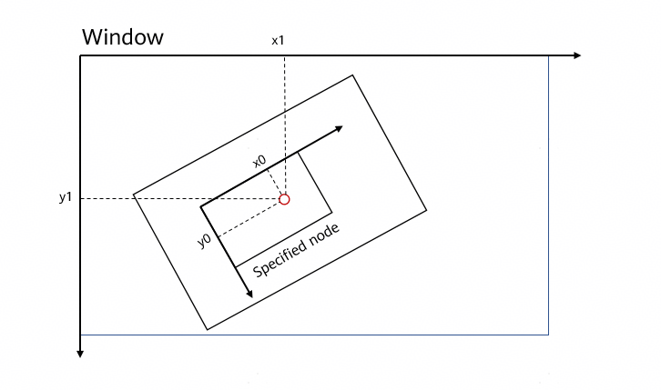
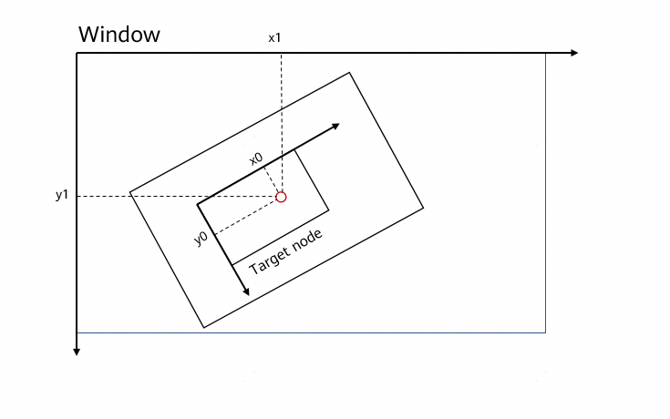

# native_node.h
<!--Kit: ArkUI-->
<!--Subsystem: ArkUI-->
<!--Owner: @piggyguy; @wangyang2022-->
<!--Designer: @piggyguy; @wangyang2022-->
<!--Tester: @fredyuan912-->
<!--Adviser: @Brilliantry_Rui-->

## Overview

Provides type definitions for **NativeNode** APIs.

**File to include**: <arkui/native_node.h>

**Library**: libace_ndk.z.so

**System capability**: SystemCapability.ArkUI.ArkUI.Full

**Since**: 12

**Related module**: [ArkUI_NativeModule](capi-arkui-nativemodule.md)

**Sample**: <!--RP1-->[native_node_sample](https://gitcode.com/openharmony/applications_app_samples/tree/master/code/DocsSample/ArkUISample/native_node_sample)<!--RP1End-->

## Summary

### Structs

| Name| typedef Keyword| Description                                                                          |
| -- | -- |------------------------------------------------------------------------------|
| [ArkUI_AttributeItem](capi-arkui-nativemodule-arkui-attributeitem.md) | ArkUI_AttributeItem | Defines the [setAttribute](capi-arkui-nativemodule-arkui-nativenodeapi-1.md#setattribute) function. This is a general input parameter struct.|
| [ArkUI_NodeComponentEvent](capi-arkui-nativemodule-arkui-nodecomponentevent.md) | ArkUI_NodeComponentEvent | Defines the parameter type for component callback events.                                                              |
| [ArkUI_StringAsyncEvent](capi-arkui-nativemodule-arkui-stringasyncevent.md) | ArkUI_StringAsyncEvent | Defines the string type parameter used by the component callback event.                                                         |
| [ArkUI_TextChangeEvent](capi-arkui-nativemodule-arkui-textchangeevent.md) | ArkUI_TextChangeEvent | Defines hybrid-type data for component events.                                                              |
| [ArkUI_NativeNodeAPI_1](capi-arkui-nativemodule-arkui-nativenodeapi-1.md) | ArkUI_NativeNodeAPI_1 | Defines a collection of Node-type APIs provided by ArkUI on the native side. APIs related to the Node module must be called on the main thread.                              |
| [OH_ArkUI_TextEditorChangeEvent](capi-arkui-nativemodule-oh-arkui-texteditorchangeevent.md) | OH_ArkUI_TextEditorChangeEvent | Defines a text content change event of the **TextEditor** component.|
| [ArkUI_NodeEvent](capi-arkui-nativemodule-arkui-nodeevent.md) | ArkUI_NodeEvent | Defines a component event. This is a general struct type.                                                              |
| [ArkUI_NodeCustomEvent](capi-arkui-nativemodule-arkui-nodecustomevent.md) | ArkUI_NodeCustomEvent | Defines a custom component event. This is a general struct type.                                                           |
| [ArkUI_NodeAdapter*](capi-arkui-nativemodule-arkui-nodeadapter8h.md) | ArkUI_NodeAdapterHandle | Defines a component adapter object, which is used for lazy loading of elements in scrollable components.                                                    |
| [ArkUI_NodeAdapterEvent](capi-arkui-nativemodule-arkui-nodeadapterevent.md) | ArkUI_NodeAdapterEvent | Defines an adapter event object.                                                                  |
| [ArkUI_NodeContentEvent](capi-arkui-nativemodule-arkui-nodecontentevent.md) | ArkUI_NodeContentEvent | Defines a node content event. This is a general struct type.                                                     |

### Enums

| Name| typedef Keyword| Description|
| -- | -- | -- |
| [ArkUI_NodeType](#arkui_nodetype) | ArkUI_NodeType | Enumerates the component types that can be created by ArkUI on the native side.|
| [ArkUI_NodeAttributeType](#arkui_nodeattributetype) | ArkUI_NodeAttributeType | Enumerates the attribute types that can be set by ArkUI on the native side.|
| [ArkUI_NodeEventType](#arkui_nodeeventtype) | ArkUI_NodeEventType | Enumerates the event types supported by the **NativeNode** component.|
| [ArkUI_NodeDirtyFlag](#arkui_nodedirtyflag) | ArkUI_NodeDirtyFlag | Enumerates the flags passed to indicate the need to re-execute measurement, layout, or rendering when a custom component calls the **::markDirty** API.|
| [ArkUI_NodeAdapterEventType](#arkui_nodeadaptereventtype) | ArkUI_NodeAdapterEventType | Enumerates node adapter event types.|
| [ArkUI_NodeContentEventType](#arkui_nodecontenteventtype) | ArkUI_NodeContentEventType | Enumerates the event types of **NodeContent**.|
| [ArkUI_InspectorErrorCode](#arkui_inspectorerrorcode) | ArkUI_InspectorErrorCode | Enumerates inspector error codes.|

### Functions

<!--Table: 40%; 20%; 40%-->
| Name| typedef Keyword| Description|
| -- | -- | -- |
| [ArkUI_NodeEventType OH_ArkUI_NodeEvent_GetEventType(ArkUI_NodeEvent* event)](#oh_arkui_nodeevent_geteventtype) | - | Obtains the type of a component event.|
| [int32_t OH_ArkUI_NodeEvent_GetTargetId(ArkUI_NodeEvent* event)](#oh_arkui_nodeevent_gettargetid) | - | Obtains the custom ID of a component event. The event ID is passed in as a parameter when the [registerNodeEvent](capi-arkui-nativemodule-arkui-nativenodeapi-1.md#registernodeevent) function is called and can be applied to the dispatch logic of the same event entry point function [registerNodeEventReceiver](capi-arkui-nativemodule-arkui-nativenodeapi-1.md#registernodeeventreceiver).|
| [ArkUI_NodeHandle OH_ArkUI_NodeEvent_GetNodeHandle(ArkUI_NodeEvent* event)](#oh_arkui_nodeevent_getnodehandle) | - | Obtains the component object that triggers an event.|
| [ArkUI_UIInputEvent* OH_ArkUI_NodeEvent_GetInputEvent(ArkUI_NodeEvent* event)](#oh_arkui_nodeevent_getinputevent) | - | Obtains input event (for example, touch event) data for a component event.|
| [ArkUI_NodeComponentEvent* OH_ArkUI_NodeEvent_GetNodeComponentEvent(ArkUI_NodeEvent* event)](#oh_arkui_nodeevent_getnodecomponentevent) | - | Obtains the numerical data in a component event.|
| [ArkUI_StringAsyncEvent* OH_ArkUI_NodeEvent_GetStringAsyncEvent(ArkUI_NodeEvent* event)](#oh_arkui_nodeevent_getstringasyncevent) | - | Obtains the string data in a component event.|
| [ArkUI_TextChangeEvent* OH_ArkUI_NodeEvent_GetTextChangeEvent(ArkUI_NodeEvent* event)](#oh_arkui_nodeevent_gettextchangeevent) | - | Obtains the **ArkUI_TextChangeEvent** data from the specified component event.|
| [void* OH_ArkUI_NodeEvent_GetUserData(ArkUI_NodeEvent* event)](#oh_arkui_nodeevent_getuserdata) | - | Obtains the custom data in a component event. This parameter is passed in [registerNodeEvent](capi-arkui-nativemodule-arkui-nativenodeapi-1.md#registernodeevent) and can be applied to the service logic when the event is triggered.|
| [int32_t OH_ArkUI_NodeEvent_GetNumberValue(ArkUI_NodeEvent* event, int32_t index, ArkUI_NumberValue* value)](#oh_arkui_nodeevent_getnumbervalue) | - | Obtains the numeric-type parameter of a component event.|
| [int32_t OH_ArkUI_NodeEvent_GetStringValue(ArkUI_NodeEvent* event, int32_t index, char** string, int32_t* stringSize)](#oh_arkui_nodeevent_getstringvalue) | - | Obtains the string-type parameter of a component event. The string data is valid only during an event callback. To use it outside an event callback, you are advised to copy the string data.|
| [int32_t OH_ArkUI_NodeEvent_SetReturnNumberValue(ArkUI_NodeEvent* event, ArkUI_NumberValue* value, int32_t size)](#oh_arkui_nodeevent_setreturnnumbervalue) | - | Sets the return value for a component event.|
| [ArkUI_NodeAdapterHandle OH_ArkUI_NodeAdapter_Create()](#oh_arkui_nodeadapter_create) | - | Creates a component adapter.|
| [void OH_ArkUI_NodeAdapter_Dispose(ArkUI_NodeAdapterHandle handle)](#oh_arkui_nodeadapter_dispose) | - | Disposes of a component adapter.|
| [int32_t OH_ArkUI_NodeAdapter_SetTotalNodeCount(ArkUI_NodeAdapterHandle handle, uint32_t size)](#oh_arkui_nodeadapter_settotalnodecount) | - | Sets the total number of elements in the specified adapter.|
| [uint32_t OH_ArkUI_NodeAdapter_GetTotalNodeCount(ArkUI_NodeAdapterHandle handle)](#oh_arkui_nodeadapter_gettotalnodecount) | - | Obtains the total number of elements in the specified adapter.|
| [int32_t OH_ArkUI_NodeAdapter_RegisterEventReceiver(ArkUI_NodeAdapterHandle handle, void* userData, void (\*receiver)(ArkUI_NodeAdapterEvent* event))](#oh_arkui_nodeadapter_registereventreceiver) | - | Registers an event callback for the specified adapter.|
| [void OH_ArkUI_NodeAdapter_UnregisterEventReceiver(ArkUI_NodeAdapterHandle handle)](#oh_arkui_nodeadapter_unregistereventreceiver) | - | Unregisters an event callback for the specified adapter.|
| [int32_t OH_ArkUI_NodeAdapter_ReloadAllItems(ArkUI_NodeAdapterHandle handle)](#oh_arkui_nodeadapter_reloadallitems) | - | Instructs the specified adapter to reload all elements.|
| [int32_t OH_ArkUI_NodeAdapter_ReloadItem(ArkUI_NodeAdapterHandle handle, uint32_t startPosition, uint32_t itemCount)](#oh_arkui_nodeadapter_reloaditem) | - | Instructs the specified adapter to reload certain elements.|
| [int32_t OH_ArkUI_NodeAdapter_RemoveItem(ArkUI_NodeAdapterHandle handle, uint32_t startPosition, uint32_t itemCount)](#oh_arkui_nodeadapter_removeitem) | - | Instructs the specified adapter to remove certain elements.|
| [int32_t OH_ArkUI_NodeAdapter_InsertItem(ArkUI_NodeAdapterHandle handle, uint32_t startPosition, uint32_t itemCount)](#oh_arkui_nodeadapter_insertitem) | - | Instructs the specified adapter to insert certain elements.|
| [int32_t OH_ArkUI_NodeAdapter_MoveItem(ArkUI_NodeAdapterHandle handle, uint32_t from, uint32_t to)](#oh_arkui_nodeadapter_moveitem) | - | Instructs the specified adapter to move certain elements.|
| [int32_t OH_ArkUI_NodeAdapter_GetAllItems(ArkUI_NodeAdapterHandle handle, ArkUI_NodeHandle** items, uint32_t* size)](#oh_arkui_nodeadapter_getallitems) | - | Obtains all elements stored in the specified adapter. When the API is called, the array object pointer of the element is returned. You must release the memory data to which the pointer points.|
| [void* OH_ArkUI_NodeAdapterEvent_GetUserData(ArkUI_NodeAdapterEvent* event)](#oh_arkui_nodeadapterevent_getuserdata) | - | Obtains the custom data passed in during registration of the specified event.|
| [ArkUI_NodeAdapterEventType OH_ArkUI_NodeAdapterEvent_GetType(ArkUI_NodeAdapterEvent* event)](#oh_arkui_nodeadapterevent_gettype) | - | Obtains the event type.|
| [ArkUI_NodeHandle OH_ArkUI_NodeAdapterEvent_GetRemovedNode(ArkUI_NodeAdapterEvent* event)](#oh_arkui_nodeadapterevent_getremovednode) | - | Obtains the element to be removed for the event to be destroyed.|
| [uint32_t OH_ArkUI_NodeAdapterEvent_GetItemIndex(ArkUI_NodeAdapterEvent* event)](#oh_arkui_nodeadapterevent_getitemindex) | - | Obtains the index of the element to be operated for the specified adapter event.|
| [ArkUI_NodeHandle OH_ArkUI_NodeAdapterEvent_GetHostNode(ArkUI_NodeAdapterEvent* event)](#oh_arkui_nodeadapterevent_gethostnode) | - | Obtains the scrollable container node that uses the specified adapter.|
| [int32_t OH_ArkUI_NodeAdapterEvent_SetItem(ArkUI_NodeAdapterEvent* event, ArkUI_NodeHandle node)](#oh_arkui_nodeadapterevent_setitem) | - | Sets the component to be added to the specified adapter.|
| [int32_t OH_ArkUI_NodeAdapterEvent_SetNodeId(ArkUI_NodeAdapterEvent* event, int32_t id)](#oh_arkui_nodeadapterevent_setnodeid) | - | Sets the component ID to be generated.|
| [ArkUI_LayoutConstraint* OH_ArkUI_NodeCustomEvent_GetLayoutConstraintInMeasure(ArkUI_NodeCustomEvent* event)](#oh_arkui_nodecustomevent_getlayoutconstraintinmeasure) | - | Obtains the size constraint for measurement through a custom component event.|
| [ArkUI_IntOffset OH_ArkUI_NodeCustomEvent_GetPositionInLayout(ArkUI_NodeCustomEvent* event)](#oh_arkui_nodecustomevent_getpositioninlayout) | - | Obtains the expected position of a component relative to its parent component in the layout phase through a custom component event.|
| [ArkUI_DrawContext* OH_ArkUI_NodeCustomEvent_GetDrawContextInDraw(ArkUI_NodeCustomEvent* event)](#oh_arkui_nodecustomevent_getdrawcontextindraw) | - | Obtains the drawing context through a custom component event. You need to release the obtained drawing context in a timely manner after use.|
| [int32_t OH_ArkUI_NodeCustomEvent_GetEventTargetId(ArkUI_NodeCustomEvent* event)](#oh_arkui_nodecustomevent_geteventtargetid) | - | Obtains the ID of a custom component event.|
| [void* OH_ArkUI_NodeCustomEvent_GetUserData(ArkUI_NodeCustomEvent* event)](#oh_arkui_nodecustomevent_getuserdata) | - | Obtains a custom event parameter through a custom component event.|
| [ArkUI_NodeHandle OH_ArkUI_NodeCustomEvent_GetNodeHandle(ArkUI_NodeCustomEvent* event)](#oh_arkui_nodecustomevent_getnodehandle) | - | Obtains a component object through a custom component event.|
| [ArkUI_NodeCustomEventType OH_ArkUI_NodeCustomEvent_GetEventType(ArkUI_NodeCustomEvent* event)](#oh_arkui_nodecustomevent_geteventtype) | - | Obtains the event type through a custom component event.|
| [int32_t OH_ArkUI_NodeCustomEvent_GetCustomSpanMeasureInfo(ArkUI_NodeCustomEvent* event, ArkUI_CustomSpanMeasureInfo* info)](#oh_arkui_nodecustomevent_getcustomspanmeasureinfo) | - | Obtains the measurement information of a custom span through a custom component event.|
| [int32_t OH_ArkUI_NodeCustomEvent_SetCustomSpanMetrics(ArkUI_NodeCustomEvent* event, ArkUI_CustomSpanMetrics* metrics)](#oh_arkui_nodecustomevent_setcustomspanmetrics) | - | Sets the measurement metrics of a custom span through a custom component event.|
| [int32_t OH_ArkUI_NodeCustomEvent_GetCustomSpanDrawInfo(ArkUI_NodeCustomEvent* event, ArkUI_CustomSpanDrawInfo* info)](#oh_arkui_nodecustomevent_getcustomspandrawinfo) | - | Obtains the drawing information of a custom span through a custom component event.|
| [typedef void (\*ArkUI_NodeContentCallback)(ArkUI_NodeContentEvent* event)](#arkui_nodecontentcallback) | ArkUI_NodeContentCallback | Defines a callback for the **NodeContent** event.|
| [int32_t OH_ArkUI_NodeContent_RegisterCallback(ArkUI_NodeContentHandle content, ArkUI_NodeContentCallback callback)](#oh_arkui_nodecontent_registercallback) | - | Registers an event callback for **NodeContent**.|
| [ArkUI_NodeContentEventType OH_ArkUI_NodeContentEvent_GetEventType(ArkUI_NodeContentEvent* event)](#oh_arkui_nodecontentevent_geteventtype) | - | Obtains the type of the specified **NodeContent** event.|
| [ArkUI_NodeContentHandle OH_ArkUI_NodeContentEvent_GetNodeContentHandle(ArkUI_NodeContentEvent* event)](#oh_arkui_nodecontentevent_getnodecontenthandle) | - | Obtains the object that triggers the specified **NodeContent** event.|
| [int32_t OH_ArkUI_NodeContent_SetUserData(ArkUI_NodeContentHandle content, void* userData)](#oh_arkui_nodecontent_setuserdata) | - | Saves custom data to the specified **NodeContent** object.|
| [void* OH_ArkUI_NodeContent_GetUserData(ArkUI_NodeContentHandle content)](#oh_arkui_nodecontent_getuserdata) | - | Obtains the custom data saved on the specified **NodeContent** object.|
| [int32_t OH_ArkUI_NodeContent_AddNode(ArkUI_NodeContentHandle content, ArkUI_NodeHandle node)](#oh_arkui_nodecontent_addnode) | - | Adds an ArkUI component node to the specified **NodeContent** object.|
| [int32_t OH_ArkUI_NodeContent_RemoveNode(ArkUI_NodeContentHandle content, ArkUI_NodeHandle node)](#oh_arkui_nodecontent_removenode) | - | Removes an ArkUI component node from the specified **NodeContent** object.|
| [int32_t OH_ArkUI_NodeContent_InsertNode(ArkUI_NodeContentHandle content, ArkUI_NodeHandle node, int32_t position)](#oh_arkui_nodecontent_insertnode) | - | Inserts an ArkUI component node into a specific position of the specified **NodeContent** object.|
| [int32_t OH_ArkUI_NodeUtils_GetLayoutSize(ArkUI_NodeHandle node, ArkUI_IntSize* size)](#oh_arkui_nodeutils_getlayoutsize) | - | Obtains the layout area size of the component. The size does not count in transformation attributes, such as scale.|
| [int32_t OH_ArkUI_NodeUtils_GetLayoutPosition(ArkUI_NodeHandle node, ArkUI_IntOffset* localOffset)](#oh_arkui_nodeutils_getlayoutposition) | - | Obtains the position of the component's layout area relative to its parent component. The relative position does not count in transformation attributes, such as translate.|
| [int32_t OH_ArkUI_NodeUtils_GetLayoutPositionInWindow(ArkUI_NodeHandle node, ArkUI_IntOffset* globalOffset)](#oh_arkui_nodeutils_getlayoutpositioninwindow) | - | Obtains the position of the component's layout area relative to the window. The relative position does not count in transformation attributes, such as translate.|
| [int32_t OH_ArkUI_NodeUtils_GetLayoutPositionInScreen(ArkUI_NodeHandle node, ArkUI_IntOffset* screenOffset)](#oh_arkui_nodeutils_getlayoutpositioninscreen) | - | Obtains the position of the component's layout area relative to the screen. The relative position does not count in transformation attributes, such as translate.|
| [int32_t OH_ArkUI_NodeUtils_GetLayoutPositionInGlobalDisplay(ArkUI_NodeHandle node, ArkUI_IntOffset* offset)](#oh_arkui_nodeutils_getlayoutpositioninglobaldisplay) | - | Obtains the offset of the specified component relative to the global display. The relative position does not count in transformation attributes, such as translate.|
| [int32_t OH_ArkUI_NodeUtils_GetPositionWithTranslateInWindow(ArkUI_NodeHandle node, ArkUI_IntOffset* translateOffset)](#oh_arkui_nodeutils_getpositionwithtranslateinwindow) | - | Obtains the position of the component in the window, including the translate attribute.|
| [int32_t OH_ArkUI_NodeUtils_GetPositionWithTranslateInScreen(ArkUI_NodeHandle node, ArkUI_IntOffset* translateOffset)](#oh_arkui_nodeutils_getpositionwithtranslateinscreen) | - | Obtains the position of the component on the screen, including the translate attribute.|
| [void OH_ArkUI_NodeUtils_AddCustomProperty(ArkUI_NodeHandle node, const char* name, const char* value)](#oh_arkui_nodeutils_addcustomproperty) | - | Sets a custom property for a component. This API takes effect only in the main thread.|
| [void OH_ArkUI_NodeUtils_RemoveCustomProperty(ArkUI_NodeHandle node, const char* name)](#oh_arkui_nodeutils_removecustomproperty) | - | Removes a custom property that has been set for the specified component.|
| [int32_t OH_ArkUI_NodeUtils_GetCustomProperty(ArkUI_NodeHandle node, const char* name, ArkUI_CustomProperty** handle)](#oh_arkui_nodeutils_getcustomproperty) | - | Obtains the value of a custom property of the specified component.|
| [ArkUI_NodeHandle OH_ArkUI_NodeUtils_GetParentInPageTree(ArkUI_NodeHandle node)](#oh_arkui_nodeutils_getparentinpagetree) | - | Obtains the parent node, which can be a component node created with ArkTS.|
| [int32_t OH_ArkUI_NodeUtils_GetActiveChildrenInfo(ArkUI_NodeHandle head, ArkUI_ActiveChildrenInfo** handle)](#oh_arkui_nodeutils_getactivechildreninfo) | - | Obtains all active child nodes of the specified node. Spans are not counted as child nodes.|
| [ArkUI_NodeHandle OH_ArkUI_NodeUtils_GetCurrentPageRootNode(ArkUI_NodeHandle node)](#oh_arkui_nodeutils_getcurrentpagerootnode) | - | Obtains the root node of the current page.|
| [bool OH_ArkUI_NodeUtils_IsCreatedByNDK(ArkUI_NodeHandle node)](#oh_arkui_nodeutils_iscreatedbyndk) | - | Checks whether the specified component is created with C APIs.|
| [int32_t OH_ArkUI_NodeUtils_GetNodeType(ArkUI_NodeHandle node)](#oh_arkui_nodeutils_getnodetype) | - | Obtains the type of the specified node.|
| [int32_t OH_ArkUI_NodeUtils_GetWindowInfo(ArkUI_NodeHandle node, ArkUI_HostWindowInfo** info)](#oh_arkui_nodeutils_getwindowinfo) | - | Obtains the information about the window to which a node belongs.|
| [int32_t OH_ArkUI_NodeUtils_MoveTo(ArkUI_NodeHandle node, ArkUI_NodeHandle target_parent, int32_t index)](#oh_arkui_nodeutils_moveto) | - | Moves a node to a target parent node as a child.|
| [int32_t OH_ArkUI_NativeModule_InvalidateAttributes(ArkUI_NodeHandle node)](#oh_arkui_nativemodule_invalidateattributes) | - | Triggers the node attribute update in this frame.|
| [int32_t OH_ArkUI_List_CloseAllSwipeActions(ArkUI_NodeHandle node, void* userData, void (\*onFinish)(void* userData))](#oh_arkui_list_closeallswipeactions) | - | Collapses [list items](arkui-ts/ts-container-listitem.md) in the expanded state.|
| [ArkUI_ContextHandle OH_ArkUI_GetContextByNode(ArkUI_NodeHandle node)](#oh_arkui_getcontextbynode) | - | Obtains the pointer to the UI context object of the specified node.|
| [int32_t OH_ArkUI_RegisterSystemColorModeChangeEvent(ArkUI_NodeHandle node,void* userData, void (\*onColorModeChange)(ArkUI_SystemColorMode colorMode, void* userData))](#oh_arkui_registersystemcolormodechangeevent) | - | Registers an event listener for system color mode changes. A single component can only register one callback for system color mode changes. For implementation examples, see [Adding an Event Listener](../../ui/ndk-add-component-events.md).|
| [void OH_ArkUI_UnregisterSystemColorModeChangeEvent(ArkUI_NodeHandle node)](#oh_arkui_unregistersystemcolormodechangeevent) | - | Unregisters the event listener for system color mode changes.|
| [int32_t OH_ArkUI_RegisterSystemFontStyleChangeEvent(ArkUI_NodeHandle node,void* userData, void (\*onFontStyleChange)(ArkUI_SystemFontStyleEvent* event, void* userData))](#oh_arkui_registersystemfontstylechangeevent) | - | Registers an event listener for system font style changes. A single component can only register one callback for system font style changes.|
| [void OH_ArkUI_UnregisterSystemFontStyleChangeEvent(ArkUI_NodeHandle node)](#oh_arkui_unregistersystemfontstylechangeevent) | - | Unregisters the event listener for system font style changes.|
| [float OH_ArkUI_SystemFontStyleEvent_GetFontSizeScale(const ArkUI_SystemFontStyleEvent* event)](#oh_arkui_systemfontstyleevent_getfontsizescale) | - | Obtains the font size from the system font style change event.|
| [float OH_ArkUI_SystemFontStyleEvent_GetFontWeightScale(const ArkUI_SystemFontStyleEvent* event)](#oh_arkui_systemfontstyleevent_getfontweightscale) | - | Obtains the font weight from the system font style change event.|
| [int32_t OH_ArkUI_RegisterLayoutCallbackOnNodeHandle(ArkUI_NodeHandle node,void* userData, void (\*onLayoutCompleted)(void* userData))](#oh_arkui_registerlayoutcallbackonnodehandle) | - | Registers a layout completion callback function for a specific node.|
| [int32_t OH_ArkUI_RegisterDrawCallbackOnNodeHandle(ArkUI_NodeHandle node,void* userData, void (\*onDrawCompleted)(void* userData))](#oh_arkui_registerdrawcallbackonnodehandle) | - | Registers a drawing completion callback function for a specific node.|
| [int32_t OH_ArkUI_UnregisterLayoutCallbackOnNodeHandle(ArkUI_NodeHandle node)](#oh_arkui_unregisterlayoutcallbackonnodehandle) | - | Unregisters the layout completion callback function for a specific node.|
| [int32_t OH_ArkUI_UnregisterDrawCallbackOnNodeHandle(ArkUI_NodeHandle node)](#oh_arkui_unregisterdrawcallbackonnodehandle) | - | Unregisters the drawing completion callback function for a specific node.|
| [int32_t OH_ArkUI_GetNodeSnapshot(ArkUI_NodeHandle node, ArkUI_SnapshotOptions* snapshotOptions,OH_PixelmapNative** pixelmap)](#oh_arkui_getnodesnapshot) | - | Obtains a snapshot of a given component. If the node is not in the component tree or has not been rendered, the snapshot operation will fail. When the PixelMap is no longer used, you should call [OH_PixelmapNative_Release](../apis-image-kit/capi-pixelmap-native-h.md#oh_pixelmapnative_release) to release it.|
| [int32_t OH_ArkUI_GetNodeSnapshotSizeLimitation(int32_t* maxWidth, int32_t* maxHeight)](#oh_arkui_getnodesnapshotsizelimitation) | - | Obtains the size limit of a component screenshot.|
| [int32_t OH_ArkUI_NodeUtils_GetAttachedNodeHandleById(const char* id, ArkUI_NodeHandle* node)](#oh_arkui_nodeutils_getattachednodehandlebyid) | - | Obtains the target node based on the provided user ID.|
| [int32_t OH_ArkUI_NodeUtils_GetNodeHandleByUniqueId(const uint32_t uniqueId, ArkUI_NodeHandle* node)](#oh_arkui_nodeutils_getnodehandlebyuniqueid) | - | Obtain a node by its unique ID.|
| [int32_t OH_ArkUI_NodeUtils_GetNodeUniqueId(ArkUI_NodeHandle node, int32_t* uniqueId)](#oh_arkui_nodeutils_getnodeuniqueid) | - | Obtains the unique ID of the target node.|
| [int32_t OH_ArkUI_NativeModule_AdoptChild(ArkUI_NodeHandle node, ArkUI_NodeHandle child)](#oh_arkui_nativemodule_adoptchild) | - | Adopts the target node as an affiliated node. The adopted node must not have an existing parent. This API is not used to add a node as a child node. Instead, it only allows the node to receive lifecycle callbacks of the corresponding child node.|
| [int32_t OH_ArkUI_NativeModule_RemoveAdoptedChild(ArkUI_NodeHandle node, ArkUI_NodeHandle child)](#oh_arkui_nativemodule_removeadoptedchild) | - | Removes a previously-adopted affiliated node.|
| [int32_t OH_ArkUI_NativeModule_IsInRenderState(ArkUI_NodeHandle node, bool* isInRenderState)](#oh_arkui_nativemodule_isinrenderstate) | - | Checks whether this node is in render state. A node is considered to be in render state when its corresponding RenderNode is present in the render tree.|
| [int32_t OH_ArkUI_NodeUtils_SetCrossLanguageOption(ArkUI_NodeHandle node, ArkUI_CrossLanguageOption* option)](#oh_arkui_nodeutils_setcrosslanguageoption) | - | Sets the cross-language options for the target node.|
| [int32_t OH_ArkUI_NodeUtils_GetCrossLanguageOption(ArkUI_NodeHandle node, ArkUI_CrossLanguageOption* option)](#oh_arkui_nodeutils_getcrosslanguageoption) | - | Obtains the cross-language option of the target node.|
| [int32_t OH_ArkUI_NodeUtils_GetFirstChildIndexWithoutExpand(ArkUI_NodeHandle node, uint32_t* index)](#oh_arkui_nodeutils_getfirstchildindexwithoutexpand) | - | Obtains the index of the first child node of the target node in the tree without expanding any nodes.|
| [int32_t OH_ArkUI_NodeUtils_GetLastChildIndexWithoutExpand(ArkUI_NodeHandle node, uint32_t* index)](#oh_arkui_nodeutils_getlastchildindexwithoutexpand) | - | Obtains the index of the last child node of the target node in the tree without expanding any nodes.|
| [int32_t OH_ArkUI_NodeUtils_GetChildWithExpandMode(ArkUI_NodeHandle node, int32_t position,ArkUI_NodeHandle* subnode, uint32_t expandMode)](#oh_arkui_nodeutils_getchildwithexpandmode) | - | Obtains a child node at the specified index using different expansion modes.|
| [int32_t OH_ArkUI_NodeUtils_GetPositionToParent(ArkUI_NodeHandle node, ArkUI_IntOffset* globalOffset)](#oh_arkui_nodeutils_getpositiontoparent) | - | Obtains the offset of the target node relative to its parent node, in px.|
| [ArkUI_ErrorCode OH_ArkUI_AddSupportedUIStates(ArkUI_NodeHandle node, int32_t uiStates,void (statesChangeHandler)(int32_t currentStates, void* userData), bool excludeInner, void* userData)](#oh_arkui_addsupporteduistates) | - | Adds the [polymorphic style](arkui-ts/ts-universal-attributes-polymorphic-style.md) states supported by the component. To handle states efficiently, specify the states of interest and their corresponding handlers. When a state of interest occurs, the handler will be executed. You can adjust the UI style based on the current state within the callback. If this API is called multiple times on the same node, the last set of states and handlers will take precedence. Some component types have default system handling for certain states. For example, the **Button** component has a default style effect for the PRESSED state. When custom state handling is implemented on such components, the default style effect will be applied first, followed by the custom style changes, resulting in a combined effect. To disable the default style effects, set **excludeInner** to **true**, if this is allowed by the system implementation. When this API is called, the provided handler function will be executed immediately. There is no need to explicitly register a listener for the NORMAL state. Once a non-NORMAL state is registered, the system will automatically notify your application when the state changes back to NORMAL.|
| [ArkUI_ErrorCode OH_ArkUI_RemoveSupportedUIStates(ArkUI_NodeHandle node, int32_t uiStates)](#oh_arkui_removesupporteduistates) | - | Removes registered UI states. When all states registered using **OH_ArkUI_AddSupportedUIStates** are removed, the registered **stateChangeHandler** will no longer be executed.|
| [int32_t OH_ArkUI_RunTaskInScope(ArkUI_ContextHandle uiContext, void* userData, void(\*callback)(void* userData))](#oh_arkui_runtaskinscope) | - | Executes the specified callback in the target UI context. For the implementation example, see [Ensuring Multi-Instance Functionality in the NDK](../../ui/ndk-scope-task.md).|
| [int32_t OH_ArkUI_PostAsyncUITask(ArkUI_ContextHandle context, void* asyncUITaskData, void (\*asyncUITask)(void\* asyncUITaskData), void (\*onFinish)(void\* asyncUITaskData))](#oh_arkui_postasyncuitask) | - | Submits the **asyncUITask** function to a non-UI thread provided by the ArkUI framework for execution. After **asyncUITask** finishes execution, the **onFinish** function is called in the UI thread. This is suitable for scenarios involving multi-threaded UI component creation. You can use this API to create UI components in non-UI threads and then mount the created components to the main tree in the UI thread.|
| [int32_t OH_ArkUI_PostUITask(ArkUI_ContextHandle context, void* taskData, void (\*task)(void\* taskData))](#oh_arkui_postuitask) | - | Submits the **task** function to the UI thread for execution. This is suitable for scenarios involving multi-threaded UI component creation. When you create UI components in a self-built thread, you can use this API to mount the created components to the main tree on the UI thread.|
| [int32_t OH_ArkUI_PostUITaskAndWait(ArkUI_ContextHandle context, void* taskData, void (\*task)(void\* taskData))](#oh_arkui_postuitaskandwait) | - | Submits the **task** function to the UI thread for execution. The thread calling this API will block until the **task** function completes execution. Calling this API from the UI thread is equivalent to synchronously calling the **task** function. This is suitable for scenarios involving multi-threaded UI component creation. When you need to call functions that are only supported on the UI thread during the multi-threaded component creation process, you can use this API to return to the UI thread to call the function and then resume multi-threaded component creation after the call completes. When the UI thread is under high load, non-UI threads calling this API may block for extended periods, affecting the performance of multi-threaded UI component creation. Frequent use is not recommended.|
| [int32_t OH_ArkUI_NativeModule_RegisterCommonEvent(ArkUI_NodeHandle node, ArkUI_NodeEventType eventType, void* userData, void (*callback)(ArkUI_NodeEvent* event))](#oh_arkui_nativemodule_registercommonevent) | - | Registers a basic event callback for the target node.|
| [int32_t OH_ArkUI_NativeModule_UnregisterCommonEvent(ArkUI_NodeHandle node, ArkUI_NodeEventType eventType)](#oh_arkui_nativemodule_unregistercommonevent) | - | Unregisters the basic event callback for the target node.|
| [int32_t OH_ArkUI_NativeModule_RegisterCommonVisibleAreaApproximateChangeEvent(ArkUI_NodeHandle node, float* ratios, int32_t size, float expectedUpdateInterval, void* userData, void (*callback)(ArkUI_NodeEvent* event))](#oh_arkui_nativemodule_registercommonvisibleareaapproximatechangeevent) | - | Registers a basic event callback for visible area changes with a constrained callback interval.|
| [int32_t OH_ArkUI_NativeModule_UnregisterCommonVisibleAreaApproximateChangeEvent(ArkUI_NodeHandle node)](#oh_arkui_nativemodule_unregistercommonvisibleareaapproximatechangeevent) | - | Unregisters the basic event callback for visible area changes with a constrained callback interval.|
| [int32_t OH_ArkUI_Swiper_FinishAnimation(ArkUI_NodeHandle node)](#oh_arkui_swiper_finishanimation) | - | Stops the page turning animation that is being executed on the specified **Swiper** node.|
| [int32_t OH_ArkUI_SetForceDarkConfig(ArkUI_ContextHandle uiContext, bool forceDark, ArkUI_NodeType nodeType, uint32_t (*colorInvertFunc)(uint32_t color))](#oh_arkui_setforcedarkconfig) | - | Sets the color inversion algorithm for the component and instance.|
| [ArkUI_TouchTestInfo* OH_ArkUI_NodeEvent_GetTouchTestInfo(ArkUI_NodeEvent* nodeEvent)](#oh_arkui_nodeevent_gettouchtestinfo) | - | Obtains the touch test information in the component event.|
| [OH_ArkUI_TextEditorChangeEvent* OH_ArkUI_NodeEvent_GetTextEditorOnWillChangeEvent(ArkUI_NodeEvent* event)](#oh_arkui_nodeevent_gettexteditoronwillchangeevent) | - | Obtains the text content change data of the **TextEditor** component in the component event.|
| [int32_t OH_ArkUI_NativeModule_ConvertPositionToWindow(ArkUI_NodeHandle currentNode, ArkUI_IntOffset localPosition, ArkUI_IntOffset* windowPosition)](#oh_arkui_nativemodule_convertpositiontowindow) | - | Converts the coordinates of a point from the coordinate system of the target node to the coordinate system of the current window.|
| [int32_t OH_ArkUI_NativeModule_ConvertPositionFromWindow(ArkUI_NodeHandle targetNode, ArkUI_IntOffset windowPosition, ArkUI_IntOffset* localPosition)](#oh_arkui_nativemodule_convertpositionfromwindow) | - | Converts the coordinates of a point from the current window's coordinate system to the target node's coordinate system.|
| [int32_t OH_ArkUI_Swiper_StartFakeDrag(ArkUI_NodeHandle node, bool* isSuccessful)](#oh_arkui_swiper_startfakedrag) | - | Starts a simulated drag on a **Swiper** node. [OH_ArkUI_Swiper_FakeDragBy](capi-native-node-h.md#oh_arkui_swiper_fakedragby) can be used to simulate a drag action. [OH_ArkUI_Swiper_StopFakeDrag](capi-native-node-h.md#oh_arkui_swiper_stopfakedrag) can be used to stop the drag simulation.<br> A simulated drag can be interrupted by a real drag. To ignore a drag event from a user during the simulated drag, use [NODE_SWIPER_DISABLE_SWIPE](./capi-native-node-h-nodeattributetype-navigationrelatedcomponents.md#node_swiper_disable_swipe).|
| [int32_t OH_ArkUI_Swiper_FakeDragBy(ArkUI_NodeHandle node, float offset, bool* isConsumedOffset)](#oh_arkui_swiper_fakedragby) | - | Simulates the drag effect by setting the offset of a **Swiper** node. Before calling this API, you must call [OH_ArkUI_Swiper_StartFakeDrag](capi-native-node-h.md#oh_arkui_swiper_startfakedrag) to start the drag simulation.|
| [int32_t OH_ArkUI_Swiper_StopFakeDrag(ArkUI_NodeHandle node, bool* isSuccessful)](#oh_arkui_swiper_stopfakedrag) | - | Stops the drag simulation on a **Swiper** node.|
| [int32_t OH_ArkUI_Swiper_IsFakeDragging(ArkUI_NodeHandle node, bool* isFakeDragging)](#oh_arkui_swiper_isfakedragging) | - | Obtains the drag simulation status on a **Swiper** node.|
| [int32_t OH_ArkUI_Swiper_ShowPrevious(ArkUI_NodeHandle node)](#oh_arkui_swiper_showprevious) | - | Displays the previous page of a **Swiper** node.|
| [int32_t OH_ArkUI_Swiper_ShowNext(ArkUI_NodeHandle node)](#oh_arkui_swiper_shownext) | - | Displays the next page of a **Swiper** node.|
| [int32_t OH_ArkUI_NativeModule_AtomicServiceMenuBarSetVisible(ArkUI_ContextHandle uiContext, bool visible)](#oh_arkui_nativemodule_atomicservicemenubarsetvisible) | - | Sets the visibility of the menu bar.|
| [int32_t OH_ArkUI_NativeModule_GetPageRootNodeHandleByContext(ArkUI_ContextHandle context, ArkUI_NodeHandle* rootNode)](#oh_arkui_nativemodule_getpagerootnodehandlebycontext) | - | Obtains the root node of the page in the window corresponding to the specified UI context.|
| [int32_t OH_ArkUI_NativeModule_RegisterCommonAreaApproximateChangeEvent(ArkUI_NodeHandle node, float expectedUpdateInterval, void* userData, void (*callback)(ArkUI_NodeEvent* event))](#oh_arkui_nativemodule_registercommonareaapproximatechangeevent) | - | Registers a callback for listening for component size and area changes. This API can be called for a valid [ArkUI_NodeHandle](capi-arkui-nativemodule-arkui-node8h.md) node at any time. The newly registered callback will replace the previously registered callback for this event and take effect from the next frame. When the callback is no longer needed, use [OH_ArkUI_NativeModule_UnregisterCommonAreaApproximateChangeEvent](#oh_arkui_nativemodule_unregistercommonareaapproximatechangeevent) to unregister it. Otherwise, the callback will be automatically unregistered when the node is released.|
| [int32_t OH_ArkUI_NativeModule_UnregisterCommonAreaApproximateChangeEvent(ArkUI_NodeHandle node)](#oh_arkui_nativemodule_unregistercommonareaapproximatechangeevent) | - | Unregisters the callback for listening for component size and area changes.|
| [ArkUI_GestureCollectInterceptInfo* OH_ArkUI_NodeEvent_GetGestureCollectInterceptInfo(ArkUI_NodeEvent* nodeEvent)](#oh_arkui_nodeevent_getgesturecollectinterceptinfo) | - | Obtains the **ArkUI_GestureCollectInterceptInfo** object from a specified **ArkUI_NodeEvent** object.<br>**Since**: 26.0.0|
| [ArkUI_ErrorCode OH_ArkUI_NativeModule_SetChildMountPolicy(ArkUI_NodeHandle node, OH_ArkUI_NodeMountPolicy policy)](#oh_arkui_nativemodule_setchildmountpolicy) | - | Sets the child node mounting policy for a target node.<br>**Since**: 26.0.0|
| [ArkUI_ErrorCode OH_ArkUI_NativeModule_GetChildMountPolicy(ArkUI_NodeHandle node, OH_ArkUI_NodeMountPolicy policy)](#oh_arkui_nativemodule_getchildmountpolicy) | - | Obtains the current child node mounting policy of a target node. The default child node mounting policy of a target node is [OH_ARKUI_NODE_MOUNT_POLICY_SINGLE_IF_RENDER_NODE](./capi-native-type-h.md#oh_arkui_nodemountpolicy).<br>**Since**: 26.0.0|

### Macros

| Name| Description|
| -------- | -------- |
| MAX_NODE_SCOPE_NUM 1000| Defines the maximum number methods for a component.|
| MAX_COMPONENT_EVENT_ARG_NUM 12| Defines the maximum number of parameters for a component event.|

## Enum Description

### ArkUI_NodeType

```c
enum ArkUI_NodeType
```

**Description**


Enumerates the component types that can be created by ArkUI on the native side.

**Since**: 12

| Value| Description                                  |
| -- |--------------------------------------|
| ARKUI_NODE_CUSTOM = 0 | Custom node.                              |
| ARKUI_NODE_TEXT = 1 | Text.                                 |
| ARKUI_NODE_SPAN = 2 | Text span.                               |
| ARKUI_NODE_IMAGE_SPAN = 3 | Image span.                             |
| ARKUI_NODE_IMAGE = 4 | Image.                                 |
| ARKUI_NODE_TOGGLE = 5 | Toggle.                               |
| ARKUI_NODE_LOADING_PROGRESS = 6 | Loading icon.                               |
| ARKUI_NODE_TEXT_INPUT = 7 | Single-line text input.                             |
| ARKUI_NODE_TEXT_AREA = 8 | Multi-line text input.                               |
| ARKUI_NODE_BUTTON = 9 | Icon.                                 |
| ARKUI_NODE_PROGRESS = 10 | Progress indicator.                                |
| ARKUI_NODE_CHECKBOX = 11 | Check box.                                |
| ARKUI_NODE_XCOMPONENT = 12 | XComponent of the SURFACE type.                |
| ARKUI_NODE_DATE_PICKER = 13 | Date picker.                            |
| ARKUI_NODE_TIME_PICKER = 14 | Time picker.                             |
| ARKUI_NODE_TEXT_PICKER = 15 | Text picker.                        |
| ARKUI_NODE_CALENDAR_PICKER = 16 | Calendar picker.                            |
| ARKUI_NODE_SLIDER = 17 | Slider.                              |
| ARKUI_NODE_RADIO = 18 | Radio button.                                |
| ARKUI_NODE_IMAGE_ANIMATOR = 19 | Frame animation component.                              |
| ARKUI_NODE_XCOMPONENT_TEXTURE = 20 | XComponent of the TEXTURE type.<br>**Since**: 18|
| ARKUI_NODE_CHECKBOX_GROUP = 21 | Check box group.<br>**Since**: 15               |
| ARKUI_NODE_TEXT_EDITOR = 22 | Text editor.<br>**Since**: 24|
| ARKUI_NODE_STACK = MAX_NODE_SCOPE_NUM | Stack container.                               |
| ARKUI_NODE_SWIPER = 1001 | Swiper.                               |
| ARKUI_NODE_SCROLL = 1002 | Scrollable container.                               |
| ARKUI_NODE_LIST = 1003 | List.                                 |
| ARKUI_NODE_LIST_ITEM = 1004 | List item.                                |
| ARKUI_NODE_LIST_ITEM_GROUP = 1005 | List item group.                           |
| ARKUI_NODE_COLUMN = 1006 | Column container.                             |
| ARKUI_NODE_ROW = 1007 | Row container.                             |
| ARKUI_NODE_FLEX = 1008 | Flex container.                             |
| ARKUI_NODE_REFRESH = 1009 | Refresh component.                               |
| ARKUI_NODE_WATER_FLOW = 1010 | Water flow container.                              |
| ARKUI_NODE_FLOW_ITEM = 1011| Water flow item.                             |
| ARKUI_NODE_RELATIVE_CONTAINER = 1012 | Relative layout component.                             |
| ARKUI_NODE_GRID = 1013 | Grid.                               |
| ARKUI_NODE_GRID_ITEM = 1014 | Grid item.                              |
| ARKUI_NODE_CUSTOM_SPAN = 1015 | Custom span. Common attributes cannot be set or obtained. You can use [OH_ArkUI_NodeCustomEvent_GetCustomSpanMeasureInfo](#oh_arkui_nodecustomevent_getcustomspanmeasureinfo), [OH_ArkUI_NodeCustomEvent_SetCustomSpanMetrics](#oh_arkui_nodecustomevent_setcustomspanmetrics), and [OH_ArkUI_NodeCustomEvent_GetCustomSpanDrawInfo](#oh_arkui_nodecustomevent_getcustomspandrawinfo) to obtain and set the node information of components of this type. <!--RP2-->For details about the usage, see [text_capi_sample](https://gitcode.com/openharmony/applications_app_samples/blob/master/code/DocsSample/ArkUISample/native_node_sample/entry/src/main/cpp/TextMaker.cpp).<!--RP2End--> |
| ARKUI_NODE_EMBEDDED_COMPONENT = 1016 | In-application embedded component.<br>**Since**: 20 |
| ARKUI_NODE_UNDEFINED = 1017 | Undefined component type. It specifies all component types in the color inversion API.<br>**Since**: 20 |
| ARKUI_NODE_PICKER = 1018 | **Picker** component, which is used to implement user selection operations.<br>**Since**: 23 |
| ARKUI_NODE_ARC_LIST = 1019 | Arc list.<br>**Since**: 26.0.0|
| ARKUI_NODE_ARC_LIST_ITEM = 1020 | Arc list item.<br>**Since**: 26.0.0|
| ARKUI_NODE_ARC_SCROLL_BAR = 1021 | Arc scrollbar.<br>**Since**: 26.0.0|

### ArkUI_NodeAttributeType

```c
enum ArkUI_NodeAttributeType
```

**Description**


Enumerates the attribute types that can be set by ArkUI on the native side.

**Since**: 12

<!--Table: 30%; 70%-->
| Value| Description|
| -- | -- |
| [Basic attribute](./capi-native-node-h-nodeattributetype-base.md)| Enumerates the basic attribute types that can be set by ArkUI on the native side, including the background, background image style, and component ID.|
| [General attribute](./capi-native-node-h-nodeattributetype-common.md)| Enumerates the general attribute types that can be set by ArkUI on the native side.|
| [Layout attribute](./capi-native-node-h-nodeattributetype-layoutattributes.md)| Enumerates the layout attribute types that can be set by ArkUI on the native side, including size, size in percentage, paddings, margins, borders, positions, alignment, directions, constraints, Flex parameters, layout rules, and attributes related to layout components.|
| [Layout component attribute](./capi-native-node-h-nodeattributetype-layoutcomponent.md)| Enumerates the attribute types that can be set by ArkUI on the native side for layout components.|
| [Animation and visual effect attributes](./capi-native-node-h-nodeattributetype-animator.md)| Enumerates the animation and visual effect attribute types that can be set by ArkUI on the native side, including image transformation, gradient, shadow, blur, and transition.|
| [Interaction attribute](./capi-native-node-h-nodeattributetype-interaction.md)| Enumerates the attribute types that can be set by ArkUI on the native side for interaction, including touch testing, response hot zone, focus control, safe zone extension, visible area listening, and focus movement.|
| [Form component attribute](./capi-native-node-h-nodeattributetype-form.md)| Enumerates the attribute types that can be set by ArkUI on the native side for form components including **Toggle**, **Button**, **CheckBox**, **CheckBoxGroup**, **Slider**, and **Radio**.|
| [Scrollable container component attribute](./capi-native-node-h-nodeattributetype-scrollablecontainer.md)| Enumerates the attribute types that can be set by ArkUI on the native side for scrollable container components including the **Scroll**, **List**, **ListItem**, **ListItemGroup**, **Refresh**, **WaterFlow**, **Grid**, and **GridItem** components.|
| [Navigation component attribute](./capi-native-node-h-nodeattributetype-navigationrelatedcomponents.md)| Enumerates the attribute types that can be set by ArkUI on the native side for navigation components including **Swiper**.|
| [Information display component attribute](./capi-native-node-h-nodeattributetype-informationdisplay.md)| Enumerates the attribute types that can be set by ArkUI on the native side for information display components including **LoadingProgress** and **Progress**.|
| [Information selection component attribute](./capi-native-node-h-nodeattributetype-informationselection.md)| Enumerates the attribute types that can be set by ArkUI on the native side for information selection components including **DatePicker**, **TimePicker**, **TextPicker**, and **CalendarPicker**.|
| [Accessibility attribute](./capi-native-node-h-nodeattributetype-accessibility.md)| Enumerates the accessibility attribute types that can be set by ArkUI on the native side, including the accessibility text, description, mode, status, and information.|
| [Text display component attribute](./capi-native-node-h-nodeattributetype-text.md)| Enumerates the attribute types that can be set by ArkUI on the native side for text display components including **Text**, **Span**, and **ImageSpan**.|
| [Text input component attribute](./capi-native-node-h-nodeattributetype-textinputcategory.md)| Enumerates the attribute types that can be set by ArkUI on the native side for text input components including **TextInput**.|
| [Rich text component attribute](./capi-native-node-h-nodeattributetype-richeditor.md)| Enumerates the attribute types that can be set by ArkUI on the native side for rich text components including **TextEditor**.|
| [Image component attribute](./capi-native-node-h-nodeattributetype-image.md)| Enumerates the attribute types that can be set by ArkUI on the native side for image components including **Image** and **ImageAnimator**.|
| [XComponent attribute](./capi-native-node-h-nodeattributetype-xcomponent.md)| Enumerates the **XComponent** attribute types that can be set by ArkUI on the native side.|
| [EmbeddedComponent attribute](./capi-native-node-h-nodeattributetype-embeddedcomponent.md)| Enumerates the **EmbeddedComponent** attribute types that can be set by ArkUI on the native side.|
| [Others](./capi-native-node-h-nodeattributetype-other.md)| Enumerates the attribute types that can be set by ArkUI on the native side, including component interaction, focus obtaining, off-screen rendering, and tap distance.|

### ArkUI_NodeEventType

```c
enum ArkUI_NodeEventType
```

**Description**


Enumerates the event types supported by the **NativeNode** component.

**Since**: 12

<!--Table: 30%; 70%-->
| Value| Description |
| -- |---------------------------------------------------------------------------------------------------------------------------------------------------------------------------------------------------------------------------------------------------------------------------------------------------------------------------------------------------------------------------------------------------------------------------------------------------------------------------------------------------------------------------------------------------------------------------------------------------------------------------------------------------------------------------------------------------------------------------------------------------------------------------------------------------------------------------------------------------------------------------------------------------------------------------------------------------------------------------------------------------------------------------------------------------------------------------------------------------------------------------------------------------------------------------------------------------------------------------------------------------------------------------------------------------------------------------------------------------------------------------------------------------|
| NODE_TOUCH_EVENT = 0 | Gesture event. When the event callback occurs, the union type in the [ArkUI_NodeEvent](capi-arkui-nativemodule-arkui-nodeevent.md) object is [ArkUI_UIInputEvent](capi-arkui-eventmodule-arkui-uiinputevent.md).|
| NODE_EVENT_ON_APPEAR = 1 | Mount event. This event is triggered when the component is mounted and displayed.<br> When the event callback occurs, the union type in the [ArkUI_NodeEvent](capi-arkui-nativemodule-arkui-nodeevent.md) object is [ArkUI_NodeComponentEvent](capi-arkui-nativemodule-arkui-nodecomponentevent.md).<br> [ArkUI_NodeComponentEvent](capi-arkui-nativemodule-arkui-nodecomponentevent.md) does not contain parameters.|
| NODE_EVENT_ON_DISAPPEAR = 2 | Unmount event. This event is triggered when the component is unmounted from the component tree and disappears.<br> When the event callback occurs, the union type in the [ArkUI_NodeEvent](capi-arkui-nativemodule-arkui-nodeevent.md) object is [ArkUI_NodeComponentEvent](capi-arkui-nativemodule-arkui-nodecomponentevent.md).<br> [ArkUI_NodeComponentEvent](capi-arkui-nativemodule-arkui-nodecomponentevent.md) does not contain parameters.|
| NODE_EVENT_ON_AREA_CHANGE = 3 | Component area change event. This event is triggered when the component area changes.<br> When the event callback occurs, the union type in the [ArkUI_NodeEvent](capi-arkui-nativemodule-arkui-nodeevent.md) object is [ArkUI_NodeComponentEvent](capi-arkui-nativemodule-arkui-nodecomponentevent.md).<br> [ArkUI_NodeComponentEvent](capi-arkui-nativemodule-arkui-nodecomponentevent.md) contains the following parameters:<br> **ArkUI_NodeComponentEvent.data[0].f32**: original width of the target element, in vp. The value type is number.<br> **ArkUI_NodeComponentEvent.data[1].f32**: original height of the target element, in vp. The value type is number.<br> **ArkUI_NodeComponentEvent.data[2].f32**: original x-coordinate of the target element's upper left corner relative to the parent element's, in vp. The value type is number.<br> ArkUI_NodeComponentEvent.data[3].f32: original y-coordinate of the target element's upper left corner relative to the parent element's, in vp. The value type is number.<br> **ArkUI_NodeComponentEvent.data[4].f32**: original x-coordinate of the target element's upper left corner relative to the page's, in vp. The value type is number.<br> **ArkUI_NodeComponentEvent.data[5].f32**: original y-coordinate of the target element's upper left corner relative to the page's, in vp. The value type is number.<br> **ArkUI_NodeComponentEvent.data[6].f32**: new width of the target element, in vp. The value type is number.<br> **ArkUI_NodeComponentEvent.data[7].f32**: new height of the target element, in vp. The value type is number.<br> **ArkUI_NodeComponentEvent.data[8].f32**: new x-coordinate of the target element's upper left corner relative to the parent element's, in vp. The value type is number.<br> **ArkUI_NodeComponentEvent.data[9].f32**: new y-coordinate of the target element's upper left corner relative to the parent element's, in vp. The value type is number.<br> **ArkUI_NodeComponentEvent.data[10].f32**: new x-coordinate of the target element's upper left corner relative to the page's, in vp. The value type is number.<br> **ArkUI_NodeComponentEvent.data[11].f32**: new y-coordinate of the target element's upper left corner relative to the page's, in vp. The value type is number.|
| NODE_ON_FOCUS = 4 | Event of obtaining focus. This event is triggered when the component obtains the focus.<br> When the event callback occurs, the union type in the [ArkUI_NodeEvent](capi-arkui-nativemodule-arkui-nodeevent.md) object is [ArkUI_NodeComponentEvent](capi-arkui-nativemodule-arkui-nodecomponentevent.md).<br> [ArkUI_NodeComponentEvent](capi-arkui-nativemodule-arkui-nodecomponentevent.md) does not contain parameters. |
| NODE_ON_BLUR = 5 | Event of losing focus. This event is triggered when the component loses the focus.<br> When the event callback occurs, the union type in the [ArkUI_NodeEvent](capi-arkui-nativemodule-arkui-nodeevent.md) object is [ArkUI_NodeComponentEvent](capi-arkui-nativemodule-arkui-nodecomponentevent.md).<br> [ArkUI_NodeComponentEvent](capi-arkui-nativemodule-arkui-nodecomponentevent.md) does not contain parameters.|
| NODE_ON_CLICK = 6 | Click event. This event is triggered when the component is clicked.<br> When the event callback occurs, the union type in the [ArkUI_NodeEvent](capi-arkui-nativemodule-arkui-nodeevent.md) object is [ArkUI_NodeComponentEvent](capi-arkui-nativemodule-arkui-nodecomponentevent.md).<br> [ArkUI_NodeComponentEvent](capi-arkui-nativemodule-arkui-nodecomponentevent.md) contains the following parameters:<br> **ArkUI_NodeComponentEvent.data[0].f32**: x-coordinate of the click relative to the upper left corner of the clicked component's original area, in vp.<br> **ArkUI_NodeComponentEvent.data[1].f32**: y-coordinate of the click relative to the upper left corner of the clicked component's original area, in vp.<br> **ArkUI_NodeComponentEvent.data[2].f32**: event timestamp. It is the interval between the time when the event is triggered and the time when the system starts, in microseconds.<br> **ArkUI_NodeComponentEvent.data[3].i32**: event input device. The value **1** indicates the mouse, **2** indicates the touchscreen, and **4** indicates the key.<br> **ArkUI_NodeComponentEvent.data[4].f32**: x-coordinate of the click relative to the upper left corner of the application window, in vp.<br> **ArkUI_NodeComponentEvent.data[5].f32**: y-coordinate of the click relative to the upper left corner of the application window, in vp.<br> **ArkUI_NodeComponentEvent.data[6].f32**: x-coordinate of the click relative to the upper left corner of the application screen, in vp.<br> **ArkUI_NodeComponentEvent.data[7].f32**: y-coordinate of the click relative to the upper left corner of the application screen, in vp. |
| NODE_ON_TOUCH_INTERCEPT = 7 | Custom component event interception. This event is triggered when the component is touched.<br> When the event callback occurs, the union type in the [ArkUI_NodeEvent](capi-arkui-nativemodule-arkui-nodeevent.md) object is [ArkUI_UIInputEvent](capi-arkui-eventmodule-arkui-uiinputevent.md). |
| NODE_EVENT_ON_VISIBLE_AREA_CHANGE = 8 | Visible area change event. This event is triggered when the ratio of the component's visible area to its total area is greater than or less than the threshold. Before registering the event, you need to use **NODE_VISIBLE_AREA_CHANGE_RATIO** to configure the threshold.<br> When the event callback occurs, the union type in the [ArkUI_NodeEvent](capi-arkui-nativemodule-arkui-nodeevent.md) object is [ArkUI_NodeComponentEvent](capi-arkui-nativemodule-arkui-nodecomponentevent.md).<br> [ArkUI_NodeComponentEvent](capi-arkui-nativemodule-arkui-nodecomponentevent.md) contains the following parameters:<br> **ArkUI_NodeComponentEvent.data[0].i32**: whether the component's visible area has increased or decreased relative to its total area since the last update. The value **1** indicates that the visible area has increased, and **0** indicates that the visible area has decreased.<br> **ArkUI_NodeComponentEvent.data[1].f32**: ratio of the component's visible area to its total area when this callback is invoked. |
| NODE_ON_HOVER = 9 | Event triggered when the mouse pointer moves over or away from the component.<br> When the event callback occurs, the union type in the [ArkUI_NodeEvent](capi-arkui-nativemodule-arkui-nodeevent.md) object is [ArkUI_NodeComponentEvent](capi-arkui-nativemodule-arkui-nodecomponentevent.md).<br> [ArkUI_NodeComponentEvent](capi-arkui-nativemodule-arkui-nodecomponentevent.md) contains the following parameter:<br> **ArkUI_NodeComponentEvent.data[0].i32**: whether the mouse pointer is hovered over the component. The value **1** indicates that the mouse pointer is hovered over the component, and **0** indicates that the mouse pointer is moved away from the component. |
| NODE_ON_MOUSE = 10 | Mouse event. This event is triggered when the component is clicked by a mouse device button or when the mouse pointer moves within the component.<br> When the event callback occurs, the union type in the [ArkUI_NodeEvent](capi-arkui-nativemodule-arkui-nodeevent.md) object is [ArkUI_UIInputEvent](capi-arkui-eventmodule-arkui-uiinputevent.md).|
| NODE_EVENT_ON_ATTACH = 11 | Attach event. This event is triggered when the component is attached to the component tree.<br> When the event callback occurs, the union type in the [ArkUI_NodeEvent](capi-arkui-nativemodule-arkui-nodeevent.md) object is [ArkUI_NodeComponentEvent](capi-arkui-nativemodule-arkui-nodecomponentevent.md).<br> [ArkUI_NodeComponentEvent](capi-arkui-nativemodule-arkui-nodecomponentevent.md) does not contain parameters.|
| NODE_EVENT_ON_DETACH = 12 | Detach event. This event is triggered when the component is detached from the component tree.<br> When the event callback occurs, the union type in the [ArkUI_NodeEvent](capi-arkui-nativemodule-arkui-nodeevent.md) object is [ArkUI_NodeComponentEvent](capi-arkui-nativemodule-arkui-nodecomponentevent.md).<br> [ArkUI_NodeComponentEvent](capi-arkui-nativemodule-arkui-nodecomponentevent.md) does not contain parameters. |
| NODE_ON_ACCESSIBILITY_ACTIONS = 13 | Accessibility-supported action event. This event is triggered when an accessibility action is performed after the corresponding accessibility action type is set.<br> When the event callback occurs, the union type in the [ArkUI_NodeEvent](capi-arkui-nativemodule-arkui-nodeevent.md) object is [ArkUI_NodeComponentEvent](capi-arkui-nativemodule-arkui-nodecomponentevent.md).<br> [ArkUI_NodeComponentEvent](capi-arkui-nativemodule-arkui-nodecomponentevent.md) contains the following parameter:<br> **ArkUI_NodeComponentEvent.data[0].u32**: action type that triggers the callback. The parameter type is [ArkUI_AccessibilityActionType](capi-native-type-h.md#arkui_accessibilityactiontype).  |
| NODE_ON_PRE_DRAG = 14 | Notifies the listener of the interaction state prior to a drop and drop operation. This event is triggered when a component is draggable and when a long press, lift, or drag initiation occurs.<br> When the event callback occurs, the union type in the [ArkUI_NodeEvent](capi-arkui-nativemodule-arkui-nodeevent.md) object is [ArkUI_NodeComponentEvent](capi-arkui-nativemodule-arkui-nodecomponentevent.md).<br> [ArkUI_NodeComponentEvent](capi-arkui-nativemodule-arkui-nodecomponentevent.md) contains the following parameter:<br> **ArkUI_NodeComponentEvent.data[0].i32**: corresponds to [ArkUI_PreDragStatus](capi-drag-and-drop-h.md#arkui_predragstatus).  |
| NODE_ON_DRAG_START = 15 | Event triggered when the user starts to drag an item. A drag operation is recognized only when the dragged item is moved far enough.<br> When the event callback occurs, the [ArkUI_DragEvent](capi-arkui-nativemodule-arkui-dragevent.md) object can be obtained from the [ArkUI_NodeEvent](capi-arkui-nativemodule-arkui-nodeevent.md) object. |
| NODE_ON_DRAG_ENTER = 16 | Event triggered when a dragged item enters the boundaries of the current component. The current component refers to the component that listens for this event.<br> When the event callback occurs, the [ArkUI_DragEvent](capi-arkui-nativemodule-arkui-dragevent.md) object can be obtained from the [ArkUI_NodeEvent](capi-arkui-nativemodule-arkui-nodeevent.md) object.|
| NODE_ON_DRAG_MOVE = 17 | Event triggered when a dragged item moves in the current component. The current component refers to the component that listens for this event.<br> When the event callback occurs, the [ArkUI_DragEvent](capi-arkui-nativemodule-arkui-dragevent.md) object can be obtained from the [ArkUI_NodeEvent](capi-arkui-nativemodule-arkui-nodeevent.md) object.   |
| NODE_ON_DRAG_LEAVE = 18 | Event triggered when a dragged item leaves the boundaries of the current component. The current component refers to the component that listens for this event.<br> When the event callback occurs, the [ArkUI_DragEvent](capi-arkui-nativemodule-arkui-dragevent.md) object can be obtained from the [ArkUI_NodeEvent](capi-arkui-nativemodule-arkui-nodeevent.md) object. |
| NODE_ON_DROP = 19 | Event triggered when a dragged item is dropped on the current component. The component can obtain the drag data for processing through the callback. The current component refers to the component that listens for this event.<br> When the event callback occurs, the [ArkUI_DragEvent](capi-arkui-nativemodule-arkui-dragevent.md) object can be obtained from the [ArkUI_NodeEvent](capi-arkui-nativemodule-arkui-nodeevent.md) object. |
| NODE_ON_DRAG_END = 20 | Event triggered when a drag operation ends. The drag source can obtain the drag result by registering this callback. A drag operation ends when the dragged item is released. When the event callback occurs, the [ArkUI_DragEvent](capi-arkui-nativemodule-arkui-dragevent.md) object can be obtained from the [ArkUI_NodeEvent](capi-arkui-nativemodule-arkui-nodeevent.md) object. |
| NODE_ON_KEY_EVENT = 21 | Event triggered when a key event occurs. The callback can be triggered during interactions with a focused window using an external keyboard or other input device.<br> When the event callback occurs, the union type in the [ArkUI_NodeEvent](capi-arkui-nativemodule-arkui-nodeevent.md) object is [ArkUI_NodeComponentEvent](capi-arkui-nativemodule-arkui-nodecomponentevent.md).<br>**Since**: 14 |
| NODE_ON_KEY_PRE_IME = 22 | Event triggered before the input method responds to the key action. If the return value of this callback is **true**, the key event is considered consumed, and subsequent event callbacks (**keyboardShortcut**, input method events, **onKeyEvent**) will be intercepted and no longer triggered. The callback can be triggered during interactions with a focused window using an external keyboard or other input device.<br> When the event callback occurs, the union type in the [ArkUI_NodeEvent](capi-arkui-nativemodule-arkui-nodeevent.md) object is [ArkUI_NodeComponentEvent](capi-arkui-nativemodule-arkui-nodecomponentevent.md).<br>**Since**: 14    |
| NODE_ON_FOCUS_AXIS = 23 | Event triggered when the bound component receives a focus axis event after gaining focus. The event callback is triggered by interactions with a joystick and a focused component.<br> When the event callback occurs, the union type in the [ArkUI_NodeEvent](capi-arkui-nativemodule-arkui-nodeevent.md) object is [ArkUI_UIInputEvent](capi-arkui-eventmodule-arkui-uiinputevent.md).<br>**Since**: 15   |
| NODE_DISPATCH_KEY_EVENT = 24 | Component key event re-dispatch event. When a component node receives a key event, this callback is triggered instead of dispatching the event to its child nodes.<br> When the event callback occurs, the union type in the [ArkUI_NodeEvent](capi-arkui-nativemodule-arkui-nodeevent.md) object is [ArkUI_NodeComponentEvent](capi-arkui-nativemodule-arkui-nodecomponentevent.md).<br>**Since**: 15   |
| NODE_ON_AXIS = 25 | Event triggered when the bound component receives an axis event. Defines the event triggered when the bound component receives an axis event.<br> When the event callback occurs, the union type in the [ArkUI_NodeEvent](capi-arkui-nativemodule-arkui-nodeevent.md) object is [ArkUI_UIInputEvent](capi-arkui-eventmodule-arkui-uiinputevent.md).<br>**Since**: 17 |
| NODE_ON_HOVER_EVENT = 27 | Event triggered when the mouse pointer moves over or away from the component.<br>When the event callback occurs, the union type in the [ArkUI_NodeEvent](capi-arkui-nativemodule-arkui-nodeevent.md) object is [ArkUI_UIInputEvent](capi-arkui-eventmodule-arkui-uiinputevent.md).<br>  **Since**: 17 |
| NODE_ON_CLICK_EVENT = 26 | Event triggered when the bound component is clicked.<br> When the event callback occurs, the union type in the [ArkUI_NodeEvent](capi-arkui-nativemodule-arkui-nodeevent.md) object is [ArkUI_UIInputEvent](capi-arkui-eventmodule-arkui-uiinputevent.md).<br>**Since**: 18  |
| NODE_VISIBLE_AREA_APPROXIMATE_CHANGE_EVENT = 28 | Sets the callback for the NODE_EVENT_ON_VISIBLE_AREA_CHANGE event, which limits the callback interval. This event is triggered when the ratio of the component's visible area to its total area is greater than or less than the threshold. Before registering the event, you need to use **NODE_VISIBLE_AREA_APPROXIMATE_CHANGE_RATIO** to configure the threshold and update interval.<br> When the event callback occurs, the union type in the [ArkUI_NodeEvent](capi-arkui-nativemodule-arkui-nodeevent.md) object is [ArkUI_NodeComponentEvent](capi-arkui-nativemodule-arkui-nodecomponentevent.md).<br> [ArkUI_NodeComponentEvent](capi-arkui-nativemodule-arkui-nodecomponentevent.md) contains the following parameters:<br> **ArkUI_NodeComponentEvent.data[0].i32**: whether the component's visible area has increased or decreased relative to its total area since the last update. The value **1** indicates that the visible area has increased, and **0** indicates that the visible area has decreased.<br> **ArkUI_NodeComponentEvent.data[1].f32**: ratio of the component's visible area to its total area when this callback is invoked.<br>**Since**: 17 |
| NODE_ON_HOVER_MOVE = 29 | Hover event. This event is triggered when the stylus pointer hovers over the component.<br> When the event callback occurs, the [ArkUI_UIInputEvent](capi-arkui-eventmodule-arkui-uiinputevent.md) object can be obtained from the [ArkUI_NodeEvent](capi-arkui-nativemodule-arkui-nodeevent.md) object.<br>**Since**: 15  |
| NODE_ON_SIZE_CHANGE = 30 | Size change event. This event is triggered when the component size changes.<br> When the event callback occurs, the union type in the [ArkUI_NodeEvent](capi-arkui-nativemodule-arkui-nodeevent.md) object is [ArkUI_NodeComponentEvent](capi-arkui-nativemodule-arkui-nodecomponentevent.md).<br> [ArkUI_NodeComponentEvent](capi-arkui-nativemodule-arkui-nodecomponentevent.md) contains the following parameters:<br> **ArkUI_NodeComponentEvent.data[0].f32**: width of the component before the size change.<br> **ArkUI_NodeComponentEvent.data[1].f32**: height of the component before the size change.<br> **ArkUI_NodeComponentEvent.data[2].f32**: width of the component after the size change.<br> **ArkUI_NodeComponentEvent.data[3].f32**: height of the component after the size change.<br>**Since**: 21  |
| NODE_ON_COASTING_AXIS_EVENT = 31 | Coasting axis event. When a user slides two fingers on the touchpad for a certain distance and quickly lifts the fingers, the system continuously constructs the event based on the speed at which the fingers are lifted and a certain attenuation curve. You can listen to this type of events to handle the fling effect after the normal scrolling axis event.<br> When the event callback occurs, you can obtain the [ArkUI_UIInputEvent](capi-arkui-eventmodule-arkui-uiinputevent.md) object from the [ArkUI_NodeEvent](capi-arkui-nativemodule-arkui-nodeevent.md) object by calling [OH_ArkUI_NodeEvent_GetInputEvent](#oh_arkui_nodeevent_getinputevent). Then, you can obtain the [ArkUI_CoastingAxisEvent](capi-arkui-nativemodule-arkui-coastingaxisevent.md) object from the [ArkUI_UIInputEvent](capi-arkui-eventmodule-arkui-uiinputevent.md) object by calling [OH_ArkUI_UIInputEvent_GetCoastingAxisEvent](capi-ui-input-event-h.md#oh_arkui_uiinputevent_getcoastingaxisevent). You can obtain more information from the object by calling the **OH_ArkUI_CoastingAxisEvent_***XXX* series APIs.<br>**Since**: 22  |
| NODE_ON_CHILD_TOUCH_TEST = 32 | Pre-touch test event of a child component. This event is called to specify how to perform a touch test on the child component of the current component. This event is triggered when the component is touched.<br> When the event callback occurs, you can obtain the [ArkUI_TouchTestInfo](./capi-arkui-nativemodule-arkui-touchtestinfo.md) object from the [ArkUI_NodeEvent](capi-arkui-nativemodule-arkui-nodeevent.md) object by calling [OH_ArkUI_NodeEvent_GetTouchTestInfo](#oh_arkui_nodeevent_gettouchtestinfo). Then ,you can obtain the list of touch test items from the [ArkUI_TouchTestInfo](./capi-arkui-nativemodule-arkui-touchtestinfo.md) object by calling [OH_ArkUI_TouchTestInfo_GetTouchTestInfoList](./capi-ui-input-event-h.md#oh_arkui_touchtestinfo_gettouchtestinfolist). You can obtain more information by using the [OH_ArkUI_TouchTestInfoItem_GetXXX](./capi-ui-input-event-h.md#oh_arkui_touchtestinfoitem_getx) series APIs. Use [OH_ArkUI_TouchTestInfo_SetTouchResultStrategy](./capi-ui-input-event-h.md#oh_arkui_touchtestinfo_settouchresultstrategy) to set the touch test policy. Use [OH_ArkUI_TouchTestInfo_SetTouchResultId](./capi-ui-input-event-h.md#oh_arkui_touchtestinfo_settouchresultid) to set the child component to be affected during the hit test.<br>**Since**: 22 |
| NODE_ON_DIGITAL_CROWN = 33 | Crown event. This event is triggered when the crown is rotated.<br> When the event callback occurs, the [ArkUI_UIInputEvent](capi-arkui-eventmodule-arkui-uiinputevent.md) object can be obtained from the [ArkUI_NodeEvent](capi-arkui-nativemodule-arkui-nodeevent.md) object.<br>**Since**: 24 |
| NODE_ON_CUSTOM_OVERFLOW_SCROLL = 34 | Content scrolling event of the [ARKUI_NODE_CUSTOM](capi-native-node-h.md#arkui_nodetype) node. This event is triggered when the component content is scrolled.<br> When the event callback occurs, the union type in the [ArkUI_NodeEvent](capi-arkui-nativemodule-arkui-nodeevent.md) object is [ArkUI_NodeComponentEvent](capi-arkui-nativemodule-arkui-nodecomponentevent.md).<br> [ArkUI_NodeComponentEvent](capi-arkui-nativemodule-arkui-nodecomponentevent.md) contains the following parameters:<br> **ArkUI_NodeComponentEvent.data[0].i32**: ID of the child component whose content is being scrolled.<br> **ArkUI_NodeComponentEvent.data[1].f32**: offset of the node content scrolling, in px.<br>**Since**: 24|
| NODE_ON_STACK_OVERFLOW_SCROLL = 35 | Content scrolling event of the [ARKUI_NODE_STACK](capi-native-node-h.md#arkui_nodetype) node. This event is triggered when the component content is scrolled.<br> When the event callback occurs, the union type in the [ArkUI_NodeEvent](capi-arkui-nativemodule-arkui-nodeevent.md) object is [ArkUI_NodeComponentEvent](capi-arkui-nativemodule-arkui-nodecomponentevent.md).<br> [ArkUI_NodeComponentEvent](capi-arkui-nativemodule-arkui-nodecomponentevent.md) contains the following parameters:<br> **ArkUI_NodeComponentEvent.data[0].i32**: ID of the child component whose content is being scrolled.<br> **ArkUI_NodeComponentEvent.data[1].f32**: offset of the node content scrolling, in px.<br>**Since**: 24|
| NODE_ON_NEED_SOFTKEYBOARD = 36 | Event for determining whether a keyboard is required. This event is triggered when the component gains focus.<br> When the event callback occurs, the union type in the [ArkUI_NodeEvent](capi-arkui-nativemodule-arkui-nodeevent.md) object is [ArkUI_NodeComponentEvent](capi-arkui-nativemodule-arkui-nodecomponentevent.md).<br> [ArkUI_NodeComponentEvent](capi-arkui-nativemodule-arkui-nodecomponentevent.md) does not contain parameters.<br> The system determines whether a keyboard is required based on the return value of the callback function.<br> You can use [OH_ArkUI_NodeEvent_SetReturnNumberValue](#oh_arkui_nodeevent_setreturnnumbervalue) to set whether a keyboard is required.<br> **value.i32** whose **index** is set to **0** in the return value indicates whether a keyboard is required.<br> The value **0** indicates that a keyboard is not required, and the value **1** indicates that a keyboard is required.<br>**Since**: 24|
| NODE_ON_GESTURE_COLLECT_INTERCEPT = 37 | This callback is invoked when the events and gestures on this node and higher-priority nodes are collected. This callback is used to intervene in the collection result of events and gestures.<br> When the event callback occurs, you can obtain the [ArkUI_GestureCollectInterceptInfo](capi-arkui-nativemodule-arkui-gesturecollectinterceptinfo.md) object from the [ArkUI_NodeEvent](capi-arkui-nativemodule-arkui-nodeevent.md) object.<br>**Since**: 26.0.0|
| NODE_TEXT_ON_DETECT_RESULT_UPDATE = MAX_NODE_SCOPE_NUM * ARKUI_NODE_TEXT = 1000 | Event triggered when text recognition with the configured **TextDataDetectorConfig** settings succeeds.<br> When the event callback occurs, the union type in the [ArkUI_NodeEvent](capi-arkui-nativemodule-arkui-nodeevent.md) object is [ArkUI_StringAsyncEvent](capi-arkui-nativemodule-arkui-stringasyncevent.md).<br> [ArkUI_StringAsyncEvent](capi-arkui-nativemodule-arkui-stringasyncevent.md) contains the following parameter:<br> **ArkUI_StringAsyncEvent.pStr**: text recognition result in JSON format. |
| NODE_TEXT_SPAN_ON_LONG_PRESS = 1001 | Long-press event for the span component. This callback is triggered when the component is long-pressed.<br> When the event callback occurs, the [ArkUI_UIInputEvent](capi-arkui-eventmodule-arkui-uiinputevent.md) object can be obtained from the [ArkUI_NodeEvent](capi-arkui-nativemodule-arkui-nodeevent.md) object.<br>**Since**: 20  |
| NODE_TEXT_ON_TEXT_SELECTION_CHANGE = 1002 | Event triggered when the text selection position changes. When the event callback occurs, the union type in the [ArkUI_NodeEvent](capi-arkui-nativemodule-arkui-nodeevent.md) object is [ArkUI_NodeComponentEvent](capi-arkui-nativemodule-arkui-nodecomponentevent.md).<br> [ArkUI_NodeComponentEvent](capi-arkui-nativemodule-arkui-nodecomponentevent.md) contains the following parameters:<br> **ArkUI_NodeComponentEvent.data[0].i32**: start position of the text selection range.<br> **ArkUI_NodeComponentEvent.data[1].i32**: end position of the text selection range.<br><br>**Since**: 26.0.0|
| NODE_TEXT_ON_COPY = 1003 | Event triggered when the copy button on the clipboard, which displays when the text box is long pressed, is clicked. When the event callback occurs, the union type in the [ArkUI_NodeEvent](capi-arkui-nativemodule-arkui-nodeevent.md) object is [ArkUI_StringAsyncEvent](capi-arkui-nativemodule-arkui-stringasyncevent.md).<br> [ArkUI_StringAsyncEvent](capi-arkui-nativemodule-arkui-stringasyncevent.md) contains the following parameter:<br> **ArkUI_StringAsyncEvent.pStr**: text to be copied.<br>**Since**: 26.0.0|
| NODE_TEXT_ON_WILL_COPY = 1004 | Event triggered before text is copied. When the event callback occurs, the union type in the [ArkUI_NodeEvent](capi-arkui-nativemodule-arkui-nodeevent.md) object is [ArkUI_StringAsyncEvent](capi-arkui-nativemodule-arkui-stringasyncevent.md).<br> [ArkUI_StringAsyncEvent](capi-arkui-nativemodule-arkui-stringasyncevent.md) contains the following parameter:<br> **ArkUI_StringAsyncEvent.pStr**: text to be copied.<br>You can use [OH_ArkUI_NodeEvent_SetReturnNumberValue](#oh_arkui_nodeevent_setreturnnumbervalue) to set the return value.<br>**value.i32** whose **index** is set to **0** indicates whether to intercept the default copying behavior of the component.<br>**0**: intercept the default copying behavior of the component. **1**: not intercept the default copying behavior of the component.<br>**Since**: 26.0.0|
| NODE_IMAGE_ON_COMPLETE = MAX_NODE_SCOPE_NUM * ARKUI_NODE_IMAGE = 4000 | Image loading success event. This event is triggered when an image is successfully loaded or decoded.<br> When the event callback occurs, the union type in the [ArkUI_NodeEvent](capi-arkui-nativemodule-arkui-nodeevent.md) object is [ArkUI_NodeComponentEvent](capi-arkui-nativemodule-arkui-nodecomponentevent.md).<br> [ArkUI_NodeComponentEvent](capi-arkui-nativemodule-arkui-nodecomponentevent.md) contains the following parameters:<br> **ArkUI_NodeComponentEvent.data[0].i32**: loading status. The value **0** indicates that the image is loaded successfully, and **1** indicates that the image is decoded successfully.<br> **ArkUI_NodeComponentEvent.data[1].f32**: width of the image, in px.<br> **ArkUI_NodeComponentEvent.data[2].f32**: height of the image, in px.<br> **ArkUI_NodeComponentEvent.data[3].f32**: width of the component, in px.<br> **ArkUI_NodeComponentEvent.data[4].f32**: height of the component, in px.<br> **ArkUI_NodeComponentEvent.data[5].f32**: offset of the rendered content relative to the component on the x-axis, in px.<br> **ArkUI_NodeComponentEvent.data[6].f32**: offset of the rendered content relative to the component on the y-axis, in px.<br> **ArkUI_NodeComponentEvent.data[7].f32**: actual rendered width of the image, in px.<br> **ArkUI_NodeComponentEvent.data[8].f32**: actual rendered height of the image, in px. |
| NODE_IMAGE_ON_ERROR = 4001 | Image loading failure event. This event is triggered when an error occurs during image loading.<br> When the event callback occurs, the union type in the [ArkUI_NodeEvent](capi-arkui-nativemodule-arkui-nodeevent.md) object is [ArkUI_NodeComponentEvent](capi-arkui-nativemodule-arkui-nodecomponentevent.md).<br> [ArkUI_NodeComponentEvent](capi-arkui-nativemodule-arkui-nodecomponentevent.md) contains the following parameter:<br> **ArkUI_NodeComponentEvent.data[0].i32**: result code.<br> **401**: The image could not be obtained because the image path is invalid.<br> **103101**: The image format is not supported. |
| NODE_IMAGE_ON_SVG_PLAY_FINISH = 4002 | SVG animation playback completion event. This event is triggered when the animation playback in the loaded SVG image is complete.<br> When the event callback occurs, the union type in the [ArkUI_NodeEvent](capi-arkui-nativemodule-arkui-nodeevent.md) object is [ArkUI_NodeComponentEvent](capi-arkui-nativemodule-arkui-nodecomponentevent.md).<br> [ArkUI_NodeComponentEvent](capi-arkui-nativemodule-arkui-nodecomponentevent.md) does not contain parameters. |
| NODE_IMAGE_ON_DOWNLOAD_PROGRESS = 4003 | Event triggered during image download. This event is triggered when the page component downloads a web page image.<br> When the event callback occurs, the union type in the [ArkUI_NodeEvent](capi-arkui-nativemodule-arkui-nodeevent.md) object is [ArkUI_NodeComponentEvent](capi-arkui-nativemodule-arkui-nodecomponentevent.md).<br> [ArkUI_NodeComponentEvent](capi-arkui-nativemodule-arkui-nodecomponentevent.md) contains the following parameters:<br> **ArkUI_NodeComponentEvent.data[0].u32**: number of bytes that have been downloaded.<br> **ArkUI_NodeComponentEvent.data[1].u32**: total number of bytes of the image to be downloaded. |
| NODE_TOGGLE_ON_CHANGE = MAX_NODE_SCOPE_NUM * ARKUI_NODE_TOGGLE = 5000 | Event triggered when the toggle status changes.<br> When the event callback occurs, the union type in the [ArkUI_NodeEvent](capi-arkui-nativemodule-arkui-nodeevent.md) object is [ArkUI_NodeComponentEvent](capi-arkui-nativemodule-arkui-nodecomponentevent.md).<br> [ArkUI_NodeComponentEvent](capi-arkui-nativemodule-arkui-nodecomponentevent.md) contains the following parameter:<br> **ArkUI_NodeComponentEvent.data[0].i32**: toggle status. **1**: on; **0**: off.  |
| NODE_TEXT_INPUT_ON_CHANGE = MAX_NODE_SCOPE_NUM * ARKUI_NODE_TEXT_INPUT = 7000 | Event triggered when the text input content changes in the **TextInput** component.<br> When the event callback occurs, the union type in the [ArkUI_NodeEvent](capi-arkui-nativemodule-arkui-nodeevent.md) object is [ArkUI_StringAsyncEvent](capi-arkui-nativemodule-arkui-stringasyncevent.md).<br> [ArkUI_StringAsyncEvent](capi-arkui-nativemodule-arkui-stringasyncevent.md) contains the following parameter:<br> **ArkUI_StringAsyncEvent.pStr**: text input. |
| NODE_TEXT_INPUT_ON_SUBMIT = 7001 | Event triggered when the **Enter** key on the keyboard is pressed for the **TextInput** component.<br> When the event callback occurs, the union type in the [ArkUI_NodeEvent](capi-arkui-nativemodule-arkui-nodeevent.md) object is [ArkUI_NodeComponentEvent](capi-arkui-nativemodule-arkui-nodecomponentevent.md).<br> [ArkUI_NodeComponentEvent](capi-arkui-nativemodule-arkui-nodecomponentevent.md) contains the following parameter:<br> **ArkUI_NodeComponentEvent.data[0].i32**: type of the **Enter** key. |
| NODE_TEXT_INPUT_ON_CUT = 7002 | Event triggered when the cut button on the clipboard, which displays when the text box is long pressed, is clicked.<br> When the event callback occurs, the union type in the [ArkUI_NodeEvent](capi-arkui-nativemodule-arkui-nodeevent.md) object is [ArkUI_StringAsyncEvent](capi-arkui-nativemodule-arkui-stringasyncevent.md).<br> [ArkUI_StringAsyncEvent](capi-arkui-nativemodule-arkui-stringasyncevent.md) contains the following parameter:<br> **ArkUI_StringAsyncEvent.pStr**: text to be cut.  |
| NODE_TEXT_INPUT_ON_PASTE = 7003 | Event triggered when the paste button on the clipboard, which displays when the internal area of the text box is long pressed, is clicked.<br> When the event callback occurs, the union type in the [ArkUI_NodeEvent](capi-arkui-nativemodule-arkui-nodeevent.md) object is [ArkUI_StringAsyncEvent](capi-arkui-nativemodule-arkui-stringasyncevent.md).<br> [ArkUI_StringAsyncEvent](capi-arkui-nativemodule-arkui-stringasyncevent.md) contains the following parameter:<br> **ArkUI_StringAsyncEvent.pStr**: text to be pasted.<br>Since API version 26.0.0, the callback function can return whether pasting is allowed.<br>You can use [OH_ArkUI_NodeEvent_SetReturnNumberValue](#oh_arkui_nodeevent_setreturnnumbervalue) to set the return value.<br>**value.i32** whose **index** is set to **0** indicates whether to intercept the default pasting behavior of the component.<br>**0**: intercept the default pasting behavior of the component. **1**: not intercept the default pasting behavior of the component.|
| NODE_TEXT_INPUT_ON_TEXT_SELECTION_CHANGE = 7004 | Event triggered when the text selection position changes.<br> When the event callback occurs, the union type in the [ArkUI_NodeEvent](capi-arkui-nativemodule-arkui-nodeevent.md) object is [ArkUI_NodeComponentEvent](capi-arkui-nativemodule-arkui-nodecomponentevent.md).<br> [ArkUI_NodeComponentEvent](capi-arkui-nativemodule-arkui-nodecomponentevent.md) contains the following parameters:<br> **ArkUI_NodeComponentEvent.data[0].i32**: start position of the text selection range.<br> **ArkUI_NodeComponentEvent.data[1].i32**: end position of the text selection range. |
| NODE_TEXT_INPUT_ON_EDIT_CHANGE = 7005 | Event triggered when the input state changes.<br> When the event callback occurs, the union type in the [ArkUI_NodeEvent](capi-arkui-nativemodule-arkui-nodeevent.md) object is [ArkUI_NodeComponentEvent](capi-arkui-nativemodule-arkui-nodecomponentevent.md).<br> [ArkUI_NodeComponentEvent](capi-arkui-nativemodule-arkui-nodecomponentevent.md) contains the following parameter:<br> **ArkUI_NodeComponentEvent.data[0].i32**: **true** indicates that text input is in progress.  |
| NODE_TEXT_INPUT_ON_INPUT_FILTER_ERROR = 7006 | Event triggered when matching with the regular expression specified by **NODE_TEXT_INPUT_INPUT_FILTER** fails.<br> When the event callback occurs, the union type in the [ArkUI_NodeEvent](capi-arkui-nativemodule-arkui-nodeevent.md) object is [ArkUI_StringAsyncEvent](capi-arkui-nativemodule-arkui-stringasyncevent.md).<br> [ArkUI_StringAsyncEvent](capi-arkui-nativemodule-arkui-stringasyncevent.md) contains the following parameter:<br> **ArkUI_StringAsyncEvent.pStr**: content that is filtered out when regular expression matching fails.|
| NODE_TEXT_INPUT_ON_CONTENT_SCROLL = 7007 | Event triggered when the text content is scrolled.<br> When the event callback occurs, the union type in the [ArkUI_NodeEvent](capi-arkui-nativemodule-arkui-nodeevent.md) object is [ArkUI_NodeComponentEvent](capi-arkui-nativemodule-arkui-nodecomponentevent.md).<br> [ArkUI_NodeComponentEvent](capi-arkui-nativemodule-arkui-nodecomponentevent.md) contains the following parameters:<br> **ArkUI_NodeComponentEvent.data[0].i32**: offset in the x-coordinate of the text in the content area.<br> **ArkUI_NodeComponentEvent.data[1].i32**: offset in the y-coordinate of the text in the content area. |
| NODE_TEXT_INPUT_ON_CONTENT_SIZE_CHANGE = 7008 | Event triggered when the text input content changes in the **TextInput** component.<br> When the event callback occurs, the union type in the [ArkUI_NodeEvent](capi-arkui-nativemodule-arkui-nodeevent.md) object is [ArkUI_NodeComponentEvent](capi-arkui-nativemodule-arkui-nodecomponentevent.md).<br> [ArkUI_NodeComponentEvent](capi-arkui-nativemodule-arkui-nodecomponentevent.md) contains the following parameters:<br> **ArkUI_NodeComponentEvent.data[0].f32**: width of the text.<br> **ArkUI_NodeComponentEvent.data[1].f32**: height of the text. |
| NODE_TEXT_INPUT_ON_WILL_INSERT = 7009 | Event triggered when text is about to be entered. When the event callback occurs, the event parameter is [ArkUI_NodeEvent](capi-arkui-nativemodule-arkui-nodeevent.md).<br> value.f32 at index 0: position of the text to be inserted; obtained using [OH_ArkUI_NodeEvent_GetNumberValue](#oh_arkui_nodeevent_getnumbervalue).<br> buffer at index 0: text to be inserted; obtained using [OH_ArkUI_NodeEvent_GetStringValue](#oh_arkui_nodeevent_getstringvalue). |
| NODE_TEXT_INPUT_ON_DID_INSERT = 7010 | Event triggered when input is completed. When the event callback occurs, the event parameter is [ArkUI_NodeEvent](capi-arkui-nativemodule-arkui-nodeevent.md).<br> value.f32 at index 0: position of the text inserted; obtained using [OH_ArkUI_NodeEvent_GetNumberValue](#oh_arkui_nodeevent_getnumbervalue).<br> buffer at index 0: inserted text; obtained using [OH_ArkUI_NodeEvent_GetStringValue](#oh_arkui_nodeevent_getstringvalue). |
| NODE_TEXT_INPUT_ON_WILL_DELETE = 7011 | Event triggered when text is about to be deleted. When the event callback occurs, the event parameter is [ArkUI_NodeEvent](capi-arkui-nativemodule-arkui-nodeevent.md).<br> value.f32 at index 0: position of the text to be deleted; obtained using [OH_ArkUI_NodeEvent_GetNumberValue](#oh_arkui_nodeevent_getnumbervalue).<br> value.i32: direction for deleting the text, with the index of **1**; obtained using **OH_ArkUI_NodeEvent_GetNumberValue**. The value **0** indicates backward-delete, and **1** indicates forward-delete.<br> buffer at index 0: text to be deleted; obtained using [OH_ArkUI_NodeEvent_GetStringValue](#oh_arkui_nodeevent_getstringvalue).  |
| NODE_TEXT_INPUT_ON_DID_DELETE = 7012 | Event triggered when deletion is completed. When the event callback occurs, the event parameter is [ArkUI_NodeEvent](capi-arkui-nativemodule-arkui-nodeevent.md).<br> value.f32 at index 0: position of the text deleted; obtained using [OH_ArkUI_NodeEvent_GetNumberValue](#oh_arkui_nodeevent_getnumbervalue).<br> value.i32: direction for deleting the text, with the index of **1**; obtained using **OH_ArkUI_NodeEvent_GetNumberValue**. The value **0** indicates backward-delete, and **1** indicates forward-delete.<br> buffer at index 0: deleted text; obtained using [OH_ArkUI_NodeEvent_GetStringValue](#oh_arkui_nodeevent_getstringvalue). |
| NODE_TEXT_INPUT_ON_CHANGE_WITH_PREVIEW_TEXT = 7013 | Event triggered when content (including preview text) changes in the **TextInput** component. When the event callback occurs, the union type in the [ArkUI_NodeEvent](capi-arkui-nativemodule-arkui-nodeevent.md) object is [ArkUI_TextChangeEvent](capi-arkui-nativemodule-arkui-textchangeevent.md).<br> [ArkUI_TextChangeEvent](capi-arkui-nativemodule-arkui-textchangeevent.md) contains the following parameters:<br> **ArkUI_TextChangeEvent.pStr**: content in the **TextInput** component.<br> **ArkUI_TextChangeEvent.pExtendStr**: content of the preview text in the **TextInput** component.<br> **ArkUI_TextChangeEvent.number**: start position of the preview text in the **TextInput** component.<br>**Since**: 15   |
| NODE_TEXT_INPUT_ON_WILL_CHANGE = 7014 | Event triggered when content (including preview text) is about to change in the **TextInput** component. When the event callback occurs, the union type in the [ArkUI_NodeEvent](capi-arkui-nativemodule-arkui-nodeevent.md) object is [ArkUI_TextChangeEvent](capi-arkui-nativemodule-arkui-textchangeevent.md).<br> [ArkUI_TextChangeEvent](capi-arkui-nativemodule-arkui-textchangeevent.md) contains the following parameters:<br> **ArkUI_TextChangeEvent.pStr**: content in the **TextInput** component.<br> **ArkUI_TextChangeEvent.pExtendStr**: content of the preview text in the **TextInput** component.<br> **ArkUI_TextChangeEvent.number**: start position of the preview text in the **TextInput** component.<br>**Since**: 20  |
| NODE_TEXT_INPUT_ON_COPY = 7015 | Event triggered when the copy button on the clipboard, which displays when the user clicks text selection, is clicked.<br> When the event callback occurs, the union type in the [ArkUI_NodeEvent](capi-arkui-nativemodule-arkui-nodeevent.md) object is [ArkUI_StringAsyncEvent](capi-arkui-nativemodule-arkui-stringasyncevent.md).<br> [ArkUI_StringAsyncEvent](capi-arkui-nativemodule-arkui-stringasyncevent.md) contains the following parameter:<br> **ArkUI_StringAsyncEvent.pStr**: text to be copied.<br>**Since**: 26.0.0|
| NODE_TEXT_INPUT_ON_WILL_COPY = 7016 | Event triggered before text is copied. When the event callback occurs, the union type in the [ArkUI_NodeEvent](capi-arkui-nativemodule-arkui-nodeevent.md) object is [ArkUI_StringAsyncEvent](capi-arkui-nativemodule-arkui-stringasyncevent.md).<br> [ArkUI_StringAsyncEvent](capi-arkui-nativemodule-arkui-stringasyncevent.md) contains the following parameter:<br> **ArkUI_StringAsyncEvent.pStr**: text to be copied.<br>You can use [OH_ArkUI_NodeEvent_SetReturnNumberValue](#oh_arkui_nodeevent_setreturnnumbervalue) to set the return value.<br>**value.i32** whose **index** is set to **0** indicates whether to intercept the default copying behavior of the component.<br>**0**: intercept the default copying behavior of the component. **1**: not intercept the default copying behavior of the component.<br>**Since**: 26.0.0|
| NODE_TEXT_INPUT_ON_WILL_CUT = 7017 | Event triggered before text is cut.<br> When the event callback occurs, the union type in the [ArkUI_NodeEvent](capi-arkui-nativemodule-arkui-nodeevent.md) object is [ArkUI_StringAsyncEvent](capi-arkui-nativemodule-arkui-stringasyncevent.md).<br> [ArkUI_StringAsyncEvent](capi-arkui-nativemodule-arkui-stringasyncevent.md) contains the following parameter:<br> **ArkUI_StringAsyncEvent.pStr**: text to be cut.<br>You can use [OH_ArkUI_NodeEvent_SetReturnNumberValue](#oh_arkui_nodeevent_setreturnnumbervalue) to set the return value.<br>**value.i32** whose **index** is set to **0** indicates whether to intercept the default cutting behavior of the component.<br>**0**: intercept the default cutting behavior of the component. **1**: not intercept the default cutting behavior of the component.<br>**Since**: 26.0.0|
| NODE_TEXT_AREA_ON_CHANGE = MAX_NODE_SCOPE_NUM * ARKUI_NODE_TEXT_AREA = 8000 | Event triggered when the input in the text box changes.<br> When the event callback occurs, the union type in the [ArkUI_NodeEvent](capi-arkui-nativemodule-arkui-nodeevent.md) object is [ArkUI_StringAsyncEvent](capi-arkui-nativemodule-arkui-stringasyncevent.md).<br> [ArkUI_StringAsyncEvent](capi-arkui-nativemodule-arkui-stringasyncevent.md) contains the following parameter:<br> **ArkUI_StringAsyncEvent.pStr**: current text input.|
| NODE_TEXT_AREA_ON_PASTE = 8001 | Event triggered when the paste button on the clipboard, which displays when the internal area of the text box is long pressed, is clicked.<br> When the event callback occurs, the union type in the [ArkUI_NodeEvent](capi-arkui-nativemodule-arkui-nodeevent.md) object is [ArkUI_StringAsyncEvent](capi-arkui-nativemodule-arkui-stringasyncevent.md).<br> [ArkUI_StringAsyncEvent](capi-arkui-nativemodule-arkui-stringasyncevent.md) contains the following parameter:<br> **ArkUI_StringAsyncEvent.pStr**: text to be pasted.<br>Since API version 26.0.0, the callback function can return whether pasting is allowed.<br>You can use [OH_ArkUI_NodeEvent_SetReturnNumberValue](#oh_arkui_nodeevent_setreturnnumbervalue) to set the return value.<br>**value.i32** whose **index** is set to **0** indicates whether to intercept the default pasting behavior of the component.<br>**0**: intercept the default pasting behavior of the component. **1**: not intercept the default pasting behavior of the component.|
| NODE_TEXT_AREA_ON_TEXT_SELECTION_CHANGE = 8002 | Event triggered when the text selection position changes.<br> When the event callback occurs, the union type in the [ArkUI_NodeEvent](capi-arkui-nativemodule-arkui-nodeevent.md) object is [ArkUI_NodeComponentEvent](capi-arkui-nativemodule-arkui-nodecomponentevent.md).<br> [ArkUI_NodeComponentEvent](capi-arkui-nativemodule-arkui-nodecomponentevent.md) contains the following parameters:<br> **ArkUI_NodeComponentEvent.data[0].i32**: start position of the text selection range.<br> **ArkUI_NodeComponentEvent.data[1].i32**: end position of the text selection range.|
| NODE_TEXT_AREA_ON_EDIT_CHANGE = 8003 | Event triggered when the input state changes.<br> When the event callback occurs, the union type in the [ArkUI_NodeEvent](capi-arkui-nativemodule-arkui-nodeevent.md) object is [ArkUI_NodeComponentEvent](capi-arkui-nativemodule-arkui-nodecomponentevent.md).<br> [ArkUI_NodeComponentEvent](capi-arkui-nativemodule-arkui-nodecomponentevent.md) contains the following parameter:<br> **ArkUI_NodeComponentEvent.data[0].i32**: **true** indicates that text input is in progress. |
| NODE_TEXT_AREA_ON_SUBMIT = 8004 | Event triggered when the **Enter** key on the keyboard is pressed for the **TextArea** component. It is not triggered when **keyType** is **ARKUI_ENTER_KEY_TYPE_NEW_LINE**.<br> When the event callback occurs, the union type in the [ArkUI_NodeEvent](capi-arkui-nativemodule-arkui-nodeevent.md) object is [ArkUI_NodeComponentEvent](capi-arkui-nativemodule-arkui-nodecomponentevent.md).<br> [ArkUI_NodeComponentEvent](capi-arkui-nativemodule-arkui-nodecomponentevent.md) contains the following parameter:<br> **ArkUI_NodeComponentEvent.data[0].i32**: type of the **Enter** key. |
| NODE_TEXT_AREA_ON_INPUT_FILTER_ERROR = 8005 | Event triggered when matching with the regular expression specified by **NODE_TEXT_AREA_INPUT_FILTER** fails.<br> When the event callback occurs, the union type in the [ArkUI_NodeEvent](capi-arkui-nativemodule-arkui-nodeevent.md) object is [ArkUI_StringAsyncEvent](capi-arkui-nativemodule-arkui-stringasyncevent.md).<br> [ArkUI_StringAsyncEvent](capi-arkui-nativemodule-arkui-stringasyncevent.md) contains the following parameter:<br> **ArkUI_StringAsyncEvent.pStr**: content that is filtered out when regular expression matching fails.|
| NODE_TEXT_AREA_ON_CONTENT_SCROLL = 8006 | Event triggered when the text content is scrolled.<br> When the event callback occurs, the union type in the [ArkUI_NodeEvent](capi-arkui-nativemodule-arkui-nodeevent.md) object is [ArkUI_NodeComponentEvent](capi-arkui-nativemodule-arkui-nodecomponentevent.md).<br> [ArkUI_NodeComponentEvent](capi-arkui-nativemodule-arkui-nodecomponentevent.md) contains the following parameters:<br> **ArkUI_NodeComponentEvent.data[0].i32**: offset in the x-coordinate of the text in the content area.<br> **ArkUI_NodeComponentEvent.data[1].i32**: offset in the y-coordinate of the text in the content area. |
| NODE_TEXT_AREA_ON_CONTENT_SIZE_CHANGE = 8007 | Event triggered when the text input content changes in the **TextArea** component.<br> When the event callback occurs, the union type in the [ArkUI_NodeEvent](capi-arkui-nativemodule-arkui-nodeevent.md) object is [ArkUI_NodeComponentEvent](capi-arkui-nativemodule-arkui-nodecomponentevent.md).<br> [ArkUI_NodeComponentEvent](capi-arkui-nativemodule-arkui-nodecomponentevent.md) contains the following parameters:<br> **ArkUI_NodeComponentEvent.data[0].f32**: width of the text.<br> **ArkUI_NodeComponentEvent.data[1].f32**: height of the text.|
| NODE_TEXT_AREA_ON_WILL_INSERT = 8008 | Event triggered when text is about to be entered. When the event callback occurs, the event parameter is [ArkUI_NodeEvent](capi-arkui-nativemodule-arkui-nodeevent.md).<br> value.f32: position of the text to be inserted, with the index of **0**; obtained using **OH_ArkUI_NodeEvent_GetNumberValue**.<br> buffer: string value of the text to be inserted, with the index of **0**; obtained using **OH_ArkUI_NodeEvent_GetStringValue**. |
| NODE_TEXT_AREA_ON_DID_INSERT = 8009 | Event triggered when input is completed. When the event callback occurs, the event parameter is [ArkUI_NodeEvent](capi-arkui-nativemodule-arkui-nodeevent.md).<br> value.f32: position of the text inserted, with the index of **0**; obtained using **OH_ArkUI_NodeEvent_GetNumberValue**.<br> buffer: string value of the inserted text, with the index of **0**; obtained using **OH_ArkUI_NodeEvent_GetStringValue**.  |
| NODE_TEXT_AREA_ON_WILL_DELETE = 8010 | Event triggered when text is about to be deleted. When the event callback occurs, the event parameter is [ArkUI_NodeEvent](capi-arkui-nativemodule-arkui-nodeevent.md).<br> value.f32: position of the text to be deleted, with the index of **0**; obtained using **OH_ArkUI_NodeEvent_GetNumberValue**.<br> value.i32: direction for deleting the text, with the index of **1**; obtained using **OH_ArkUI_NodeEvent_GetNumberValue**. The value **0** indicates backward-delete, and **1** indicates forward-delete.<br> buffer: string value of the text to be deleted, with the index of **0**; obtained using **OH_ArkUI_NodeEvent_GetStringValue**. |
| NODE_TEXT_AREA_ON_DID_DELETE = 8011 | Event triggered when deletion is completed. When the event callback occurs, the event parameter is [ArkUI_NodeEvent](capi-arkui-nativemodule-arkui-nodeevent.md).<br> value.f32: position of the text deleted, with the index of **0**; obtained using **OH_ArkUI_NodeEvent_GetNumberValue**.<br> value.i32: direction for deleting the text, with the index of **1**; obtained using **OH_ArkUI_NodeEvent_GetNumberValue**. The value **0** indicates backward-delete, and **1** indicates forward-delete.<br> buffer: string value of the deleted text, with the index of **0**; obtained using **OH_ArkUI_NodeEvent_GetStringValue**.|
| NODE_TEXT_AREA_ON_CHANGE_WITH_PREVIEW_TEXT = 8012 | Event triggered when content (including preview text) changes in the [TextArea](arkui-ts/ts-basic-components-textarea.md) component. When the event callback occurs, the union type in the [ArkUI_NodeEvent](capi-arkui-nativemodule-arkui-nodeevent.md) object is [ArkUI_TextChangeEvent](capi-arkui-nativemodule-arkui-textchangeevent.md).<br> [ArkUI_TextChangeEvent](capi-arkui-nativemodule-arkui-textchangeevent.md) contains the following parameters:<br> **ArkUI_TextChangeEvent.pStr**: content in the **TextArea** component.<br> **ArkUI_TextChangeEvent.pExtendStr**: content of the preview text in the **TextArea** component.<br> **ArkUI_TextChangeEvent.number**: start position of the preview text in the **TextArea** component.<br>**Since**: 15 |
| NODE_TEXT_AREA_ON_WILL_CHANGE = 8013 | Event triggered when content (including preview text) is about to change in the **TextArea** component. When the event callback occurs, the union type in the [ArkUI_NodeEvent](capi-arkui-nativemodule-arkui-nodeevent.md) object is [ArkUI_TextChangeEvent](capi-arkui-nativemodule-arkui-textchangeevent.md).<br> [ArkUI_TextChangeEvent](capi-arkui-nativemodule-arkui-textchangeevent.md) contains the following parameters:<br> **ArkUI_TextChangeEvent.pStr**: content in the **TextArea** component.<br> **ArkUI_TextChangeEvent.pExtendStr**: content of the preview text in the **TextArea** component.<br> **ArkUI_TextChangeEvent.number**: start position of the preview text in the **TextArea** component.<br>**Since**: 20   |
| NODE_TEXT_AREA_ON_COPY = 8014 | Event triggered when the copy button on the clipboard, which displays when the text box is long pressed, is clicked.<br> When the event callback occurs, the union type in the [ArkUI_NodeEvent](capi-arkui-nativemodule-arkui-nodeevent.md) object is [ArkUI_StringAsyncEvent](capi-arkui-nativemodule-arkui-stringasyncevent.md).<br> [ArkUI_StringAsyncEvent](capi-arkui-nativemodule-arkui-stringasyncevent.md) contains the following parameter:<br> **ArkUI_StringAsyncEvent.pStr**: text to be copied.<br>**Since**: 26.0.0|
| NODE_TEXT_AREA_ON_WILL_COPY = 8015 | Event triggered before text is copied. When the event callback occurs, the union type in the [ArkUI_NodeEvent](capi-arkui-nativemodule-arkui-nodeevent.md) object is [ArkUI_StringAsyncEvent](capi-arkui-nativemodule-arkui-stringasyncevent.md).<br> [ArkUI_StringAsyncEvent](capi-arkui-nativemodule-arkui-stringasyncevent.md) contains the following parameter:<br> **ArkUI_StringAsyncEvent.pStr**: text to be copied.<br>You can use [OH_ArkUI_NodeEvent_SetReturnNumberValue](#oh_arkui_nodeevent_setreturnnumbervalue) to set the return value.<br>**value.i32** whose **index** is set to **0** indicates whether to intercept the default copying behavior of the component.<br>**0**: intercept the default copying behavior of the component. **1**: not intercept the default copying behavior of the component.<br>**Since**: 26.0.0|
| NODE_TEXT_AREA_ON_CUT = 8016 | Event triggered when the cut button on the clipboard, which displays when the internal area of the text box is long pressed, is clicked.<br> When the event callback occurs, the union type in the [ArkUI_NodeEvent](capi-arkui-nativemodule-arkui-nodeevent.md) object is [ArkUI_StringAsyncEvent](capi-arkui-nativemodule-arkui-stringasyncevent.md).<br> [ArkUI_StringAsyncEvent](capi-arkui-nativemodule-arkui-stringasyncevent.md) contains the following parameter:<br> **ArkUI_StringAsyncEvent.pStr**: text to be cut. **Since**: 26.0.0 |
| NODE_TEXT_AREA_ON_WILL_CUT = 8017 | Event triggered before text is cut.<br> When the event callback occurs, the union type in the [ArkUI_NodeEvent](capi-arkui-nativemodule-arkui-nodeevent.md) object is [ArkUI_StringAsyncEvent](capi-arkui-nativemodule-arkui-stringasyncevent.md).<br> [ArkUI_StringAsyncEvent](capi-arkui-nativemodule-arkui-stringasyncevent.md) contains the following parameter:<br> **ArkUI_StringAsyncEvent.pStr**: text to be cut.<br>You can use [OH_ArkUI_NodeEvent_SetReturnNumberValue](#oh_arkui_nodeevent_setreturnnumbervalue) to set the return value.<br>**value.i32** whose **index** is set to **0** indicates whether to intercept the default cutting behavior of the component.<br>**0**: intercept the default cutting behavior of the component. **1**: not intercept the default cutting behavior of the component.<br>**Since**: 26.0.0|
| NODE_CHECKBOX_EVENT_ON_CHANGE = MAX_NODE_SCOPE_NUM * ARKUI_NODE_CHECKBOX = 11000 | Event triggered when the selected status of the **ARKUI_NODE_CHECKBOX** component changes. When the event callback occurs, the union type in the [ArkUI_NodeEvent](capi-arkui-nativemodule-arkui-nodeevent.md) object is [ArkUI_NodeComponentEvent](capi-arkui-nativemodule-arkui-nodecomponentevent.md).<br> **ArkUI_NodeComponentEvent.data[0].i32**: **1**: selected. **0**: not selected.  |
| NODE_DATE_PICKER_EVENT_ON_DATE_CHANGE = MAX_NODE_SCOPE_NUM * ARKUI_NODE_DATE_PICKER = 13000 | Event triggered when a date is selected in the **ARKUI_NODE_DATE_PICKER** component.<br> When the event callback occurs, the union type in the [ArkUI_NodeEvent](capi-arkui-nativemodule-arkui-nodeevent.md) object is [ArkUI_NodeComponentEvent](capi-arkui-nativemodule-arkui-nodecomponentevent.md).<br> [ArkUI_NodeComponentEvent](capi-arkui-nativemodule-arkui-nodecomponentevent.md) contains the following parameters:<br> **ArkUI_NodeComponentEvent.data[0].i32**: year of the selected date.<br> **ArkUI_NodeComponentEvent.data[1].i32**: month of the selected date. Value range: [0-11].<br> **ArkUI_NodeComponentEvent.data[2].i32**: day of the selected date.  |
| NODE_TIME_PICKER_EVENT_ON_CHANGE = MAX_NODE_SCOPE_NUM * ARKUI_NODE_TIME_PICKER = 14000 | Event triggered when a time is selected in the **ARKUI_NODE_TIME_PICKER** component.<br> When the event callback occurs, the union type in the [ArkUI_NodeEvent](capi-arkui-nativemodule-arkui-nodeevent.md) object is [ArkUI_NodeComponentEvent](capi-arkui-nativemodule-arkui-nodecomponentevent.md).<br> [ArkUI_NodeComponentEvent](capi-arkui-nativemodule-arkui-nodecomponentevent.md) contains the following parameters:<br> **ArkUI_NodeComponentEvent.data[0].i32**: hour of the selected time. Value range: [0-23].<br> **ArkUI_NodeComponentEvent.data[1].i32**: minute of the selected time. Value range: [0-59].  |
| NODE_TEXT_PICKER_EVENT_ON_CHANGE = MAX_NODE_SCOPE_NUM * ARKUI_NODE_TEXT_PICKER = 15000 | Event triggered when an item is selected in the **ARKUI_NODE_TEXT_PICKER** component.<br> When the event callback occurs, the union type in the [ArkUI_NodeEvent](capi-arkui-nativemodule-arkui-nodeevent.md) object is [ArkUI_NodeComponentEvent](capi-arkui-nativemodule-arkui-nodecomponentevent.md).<br> [ArkUI_NodeComponentEvent](capi-arkui-nativemodule-arkui-nodecomponentevent.md) contains the following parameter:<br> **ArkUI_NodeComponentEvent.data[0...11].i32**: value of the selected item.|
| NODE_TEXT_PICKER_EVENT_ON_SCROLL_STOP = 15001 | Event triggered when an item is selected in the **ARKUI_NODE_TEXT_PICKER** component. This event is triggered when the user stops sliding to select a text item.<br> When the event callback occurs, the union type in the [ArkUI_NodeEvent](capi-arkui-nativemodule-arkui-nodeevent.md) object is [ArkUI_NodeComponentEvent](capi-arkui-nativemodule-arkui-nodecomponentevent.md).<br> [ArkUI_NodeComponentEvent](capi-arkui-nativemodule-arkui-nodecomponentevent.md) contains the following parameter:<br> **ArkUI_NodeComponentEvent.data[0...11].i32**: value of the selected item.<br>**Since**: 14|
| NODE_CALENDAR_PICKER_EVENT_ON_CHANGE = MAX_NODE_SCOPE_NUM * ARKUI_NODE_CALENDAR_PICKER = 16000 | Event triggered when a date is selected in the **NODE_CALENDAR_PICKER** component. When the event callback occurs, the union type in the [ArkUI_NodeEvent](capi-arkui-nativemodule-arkui-nodeevent.md) object is [ArkUI_NodeComponentEvent](capi-arkui-nativemodule-arkui-nodecomponentevent.md).<br> **ArkUI_NodeComponent.data[0].u32**: year of the selected date.<br> **ArkUI_NodeComponent.data[1].u32**: month of the selected date.<br> **ArkUI_NodeComponent.data[2].u32**: day of the selected date.|
| NODE_SLIDER_EVENT_ON_CHANGE = MAX_NODE_SCOPE_NUM * ARKUI_NODE_SLIDER = 17000 | Event triggered when the **ARKUI_NODE_SLIDER** component is dragged or clicked. When the event callback occurs, the union type in the [ArkUI_NodeEvent](capi-arkui-nativemodule-arkui-nodeevent.md) object is [ArkUI_NodeComponentEvent](capi-arkui-nativemodule-arkui-nodecomponentevent.md).<br> [ArkUI_NodeComponentEvent](capi-arkui-nativemodule-arkui-nodecomponentevent.md) contains the following parameters:<br> **ArkUI_NodeComponentEvent.data[0].f32** current slider value.<br> **ArkUI_NodeComponentEvent.data[1].i32**: state triggered by the event. |
| NODE_RADIO_EVENT_ON_CHANGE = MAX_NODE_SCOPE_NUM * ARKUI_NODE_RADIO = 18000 | Event triggered when the **ARKUI_NODE_RADIO** component is dragged or clicked. When the event callback occurs, the union type in the [ArkUI_NodeEvent](capi-arkui-nativemodule-arkui-nodeevent.md) object is [ArkUI_NodeComponentEvent](capi-arkui-nativemodule-arkui-nodecomponentevent.md).<br> [ArkUI_NodeComponentEvent](capi-arkui-nativemodule-arkui-nodecomponentevent.md) contains the following parameter:<br> **ArkUI_NodeComponentEvent.data[0].i32**: status of the radio button. |
| NODE_IMAGE_ANIMATOR_EVENT_ON_START = MAX_NODE_SCOPE_NUM * ARKUI_NODE_IMAGE_ANIMATOR = 19000 | Event triggered when the frame-by-frame animation starts to play.<br> When the event callback occurs, the union type in the [ArkUI_NodeEvent](capi-arkui-nativemodule-arkui-nodeevent.md) object is [ArkUI_NodeComponentEvent](capi-arkui-nativemodule-arkui-nodecomponentevent.md).<br> [ArkUI_NodeComponentEvent](capi-arkui-nativemodule-arkui-nodecomponentevent.md) does not contain parameters. |
| NODE_IMAGE_ANIMATOR_EVENT_ON_PAUSE = 19001 | Event triggered when the frame-by-frame animation playback is paused. <br> When the event callback occurs, the union type in the [ArkUI_NodeEvent](capi-arkui-nativemodule-arkui-nodeevent.md) object is [ArkUI_NodeComponentEvent](capi-arkui-nativemodule-arkui-nodecomponentevent.md).<br> [ArkUI_NodeComponentEvent](capi-arkui-nativemodule-arkui-nodecomponentevent.md) does not contain parameters.|
| NODE_IMAGE_ANIMATOR_EVENT_ON_REPEAT = 19002 | Event triggered when the frame-by-frame animation playback is repeated.<br> When the event callback occurs, the union type in the [ArkUI_NodeEvent](capi-arkui-nativemodule-arkui-nodeevent.md) object is [ArkUI_NodeComponentEvent](capi-arkui-nativemodule-arkui-nodecomponentevent.md).<br> [ArkUI_NodeComponentEvent](capi-arkui-nativemodule-arkui-nodecomponentevent.md) does not contain parameters. |
| NODE_IMAGE_ANIMATOR_EVENT_ON_CANCEL = 19003 | Event triggered when the frame-by-frame animation playback returns to the initial state.<br> When the event callback occurs, the union type in the [ArkUI_NodeEvent](capi-arkui-nativemodule-arkui-nodeevent.md) object is [ArkUI_NodeComponentEvent](capi-arkui-nativemodule-arkui-nodecomponentevent.md).<br> [ArkUI_NodeComponentEvent](capi-arkui-nativemodule-arkui-nodecomponentevent.md) does not contain parameters.|
| NODE_IMAGE_ANIMATOR_EVENT_ON_FINISH = 19004 | Event triggered when the frame-by-frame animation playback is complete or stopped.<br> When the event callback occurs, the union type in the [ArkUI_NodeEvent](capi-arkui-nativemodule-arkui-nodeevent.md) object is [ArkUI_NodeComponentEvent](capi-arkui-nativemodule-arkui-nodecomponentevent.md).<br> [ArkUI_NodeComponentEvent](capi-arkui-nativemodule-arkui-nodecomponentevent.md) does not contain parameters. |
| NODE_CHECKBOX_GROUP_EVENT_ON_CHANGE = MAX_NODE_SCOPE_NUM * ARKUI_NODE_CHECKBOX_GROUP = 21000 | Event triggered when the selected state of **ARKUI_NODE_CHECKBOX_GROUP** or any [check box](arkui-ts/ts-basic-components-checkbox.md) within it changes. When the event callback occurs, the union type in the [ArkUI_NodeEvent](capi-arkui-nativemodule-arkui-nodeevent.md) object is [ArkUI_StringAsyncEvent](capi-arkui-nativemodule-arkui-stringasyncevent.md).<br> **ArkUI_StringAsyncEvent.pStr**: **Name**: name of the selected check box; **Status**: **0**: All check boxes in the group are selected. **1**: Some check boxes in the group are selected. **2**: No check box in the group is selected.<br>**Since**: 15  |
| NODE_TEXT_EDITOR_ON_SELECTION_CHANGE = MAX_NODE_SCOPE_NUM * ARKUI_NODE_TEXT_EDITOR = 22000 | Event triggered when the selection or cursor position in the **TextEditor** component changes.<br>When the event callback occurs, the union type in the [ArkUI_NodeEvent](capi-arkui-nativemodule-arkui-nodeevent.md) object is [ArkUI_NodeComponentEvent](capi-arkui-nativemodule-arkui-nodecomponentevent.md).<br>[ArkUI_NodeComponentEvent](capi-arkui-nativemodule-arkui-nodecomponentevent.md) contains the following parameters:<br>**ArkUI_NodeComponentEvent.data[0].i32**: start index of the selection.<br>**ArkUI_NodeComponentEvent.data[1].i32**: end index of the selection.<br>**Since**: 24|
| NODE_TEXT_EDITOR_ON_READY = 22001 | Event triggered when the first initialization of the **TextEditor** component is complete.<br>When the event callback occurs, the union type in the [ArkUI_NodeEvent](capi-arkui-nativemodule-arkui-nodeevent.md) object is [ArkUI_NodeComponentEvent](capi-arkui-nativemodule-arkui-nodecomponentevent.md).<br>**Since**: 24|
| NODE_TEXT_EDITOR_ON_PASTE = 22002 | Event triggered when the **TextEditor** component pastes content.<br>The system determines whether to intercept the default behavior of the component based on the return value of the callback function.<br>You can use [OH_ArkUI_NodeEvent_SetReturnNumberValue](#oh_arkui_nodeevent_setreturnnumbervalue) to set the return value.<br>**value.i32**: whether to intercept the default behavior of the component, with the index of **0**.<br>**0**: not intercept. **1**: intercept.<br>**Since**: 24|
| NODE_TEXT_EDITOR_ON_EDITING_CHANGE = 22003 | Event triggered when the editing status of the **TextEditor** component changes.<br>When the event callback occurs, the union type in the [ArkUI_NodeEvent](capi-arkui-nativemodule-arkui-nodeevent.md) object is [ArkUI_NodeComponentEvent](capi-arkui-nativemodule-arkui-nodecomponentevent.md).<br>[ArkUI_NodeComponentEvent](capi-arkui-nativemodule-arkui-nodecomponentevent.md) contains the following parameter:<br>**ArkUI_NodeComponentEvent.data[0].i32**: editing status of the component.<br>**Since**: 24|
| NODE_TEXT_EDITOR_ON_SUBMIT = 22004 | Event triggered when the **Enter** key on the keyboard is pressed for the **TextEditor** component.<br>When the event callback occurs, the union type in the [ArkUI_NodeEvent](capi-arkui-nativemodule-arkui-nodeevent.md) object is [ArkUI_NodeComponentEvent](capi-arkui-nativemodule-arkui-nodecomponentevent.md).<br>[ArkUI_NodeComponentEvent](capi-arkui-nativemodule-arkui-nodecomponentevent.md) contains the following parameter:<br>**ArkUI_NodeComponentEvent.data[0].i32**: type of the **Enter** key, specified using [ArkUI_EnterKeyType](capi-native-type-h.md#arkui_enterkeytype).<br>**Since**: 24|
| NODE_TEXT_EDITOR_ON_CUT = 22005 | Event triggered when the **TextEditor** component cuts content.<br>The system determines whether to intercept the default behavior of the component based on the return value of the callback function.<br>You can use [OH_ArkUI_NodeEvent_SetReturnNumberValue](#oh_arkui_nodeevent_setreturnnumbervalue) to set the return value.<br>**value.i32**: whether to intercept the default behavior of the component, with the index of **0**.<br>**0**: not intercept. **1**: intercept.<br>**Since**: 24|
| NODE_TEXT_EDITOR_ON_COPY = 22006 | Event triggered when the **TextEditor** component copies content.<br>The system determines whether to intercept the default behavior of the component based on the return value of the callback function.<br>You can use [OH_ArkUI_NodeEvent_SetReturnNumberValue](#oh_arkui_nodeevent_setreturnnumbervalue) to set the return value.<br>**value.i32**: whether to intercept the default behavior of the component, with the index of **0**.<br>**0**: not intercept. **1**: intercept.<br>**Since**: 24|
| NODE_TEXT_EDITOR_ON_WILL_CHANGE = 22007 | Event triggered when the **TextEditor** component is about to change the content.<br>This callback is triggered before any operation that causes a text content change takes effect. You can determine whether to intercept the content change based on the information in the callback event.<br>When the event callback occurs, you can obtain the [OH_ArkUI_TextEditorChangeEvent](capi-arkui-nativemodule-oh-arkui-texteditorchangeevent.md) object from the [ArkUI_NodeEvent](capi-arkui-nativemodule-arkui-nodeevent.md) object by calling [OH_ArkUI_NodeEvent_GetTextEditorOnWillChangeEvent](capi-native-node-h.md#oh_arkui_nodeevent_gettexteditoronwillchangeevent).<br> Then, you can use the **OH_ArkUI_TextEditorChangeEvent_***XXX* series APIs to obtain more information from this object.<br> The system determines whether the current content can be changed based on the return value of the callback function.<br> You can use [OH_ArkUI_NodeEvent_SetReturnNumberValue](capi-native-node-h.md#oh_arkui_nodeevent_setreturnnumbervalue) to set the return value.<br> **value.i32** whose **index** is set to **0** indicates whether the current content can be changed. **0**: The content cannot be changed. **1**: The content can be changed.<br>**Since**: 24|
| NODE_TEXT_EDITOR_ON_DID_CHANGE = 22008 | Event triggered when the **TextEditor** component changes the content.<br>When the event callback occurs, the union type in the [ArkUI_NodeEvent](capi-arkui-nativemodule-arkui-nodeevent.md) object is [ArkUI_NodeComponentEvent](capi-arkui-nativemodule-arkui-nodecomponentevent.md).<br> [ArkUI_NodeComponentEvent](capi-arkui-nativemodule-arkui-nodecomponentevent.md) contains the following parameters:<br> **ArkUI_NodeComponentEvent.data[0].i32**: start index of the text range to be replaced before the text changes.<br> **ArkUI_NodeComponentEvent.data[1].i32**: end index of the text range to be replaced before the text changes.<br> **ArkUI_NodeComponentEvent.data[2].i32**: start index of the text range of the new content after the text changes.<br> **ArkUI_NodeComponentEvent.data[3].i32**: end index of the text range of the new content after the text changes.<br>**Since**: 24|
| NODE_SWIPER_EVENT_ON_CHANGE = MAX_NODE_SCOPE_NUM * ARKUI_NODE_SWIPER = 1001000 | Event triggered when the index of the currently displayed element of this **ARKUI_NODE_SWIPER** instance changes. When the event callback occurs, the union type in the [ArkUI_NodeEvent](capi-arkui-nativemodule-arkui-nodeevent.md) object is [ArkUI_NodeComponentEvent](capi-arkui-nativemodule-arkui-nodecomponentevent.md).<br> [ArkUI_NodeComponentEvent](capi-arkui-nativemodule-arkui-nodecomponentevent.md) contains the following parameter:<br> **ArkUI_NodeComponentEvent.data[0].i32**: index of the currently displayed element. |
| NODE_SWIPER_EVENT_ON_ANIMATION_START = 1001001 | Event triggered when the switching animation of this **ARKUI_NODE_SWIPER** instance starts. When the event callback occurs, the union type in the [ArkUI_NodeEvent](capi-arkui-nativemodule-arkui-nodeevent.md) object is [ArkUI_NodeComponentEvent](capi-arkui-nativemodule-arkui-nodecomponentevent.md).<br> [ArkUI_NodeComponentEvent](capi-arkui-nativemodule-arkui-nodecomponentevent.md) contains the following parameters:<br> **ArkUI_NodeComponentEvent.data[0].i32**: index of the currently displayed element.<br> **ArkUI_NodeComponentEvent.data[1].i32**: index of the target element to switch to.<br> **ArkUI_NodeComponentEvent.data[2].f32**: offset of the currently displayed element relative to the start position of the swiper along the main axis.<br> **ArkUI_NodeComponentEvent.data[3].f32**: offset of the target element relative to the start position of the swiper along the main axis.<br> **ArkUI_NodeComponentEvent.data[4].f32**: hands-off velocity. |
| NODE_SWIPER_EVENT_ON_ANIMATION_END = 1001002 | Event triggered when the switching animation of this **ARKUI_NODE_SWIPER** instance ends. When the event callback occurs, the union type in the [ArkUI_NodeEvent](capi-arkui-nativemodule-arkui-nodeevent.md) object is [ArkUI_NodeComponentEvent](capi-arkui-nativemodule-arkui-nodecomponentevent.md).<br> [ArkUI_NodeComponentEvent](capi-arkui-nativemodule-arkui-nodecomponentevent.md) contains the following parameters:<br> **ArkUI_NodeComponentEvent.data[0].i32**: index of the currently displayed element.<br> **ArkUI_NodeComponentEvent.data[1].f32**: offset of the currently displayed element relative to the start position of the swiper along the main axis. |
| NODE_SWIPER_EVENT_ON_GESTURE_SWIPE = 1001003 | Event triggered on a frame-by-frame basis when the page is turned by a swipe. When the event callback occurs, the union type in the [ArkUI_NodeEvent](capi-arkui-nativemodule-arkui-nodeevent.md) object is [ArkUI_NodeComponentEvent](capi-arkui-nativemodule-arkui-nodecomponentevent.md).<br> [ArkUI_NodeComponentEvent](capi-arkui-nativemodule-arkui-nodecomponentevent.md) contains the following parameters:<br> **ArkUI_NodeComponentEvent.data[0].i32**: index of the currently displayed element.<br> **ArkUI_NodeComponentEvent.data[1].f32**: offset of the currently displayed element relative to the start position of the swiper along the main axis.|
| NODE_SWIPER_EVENT_ON_CONTENT_DID_SCROLL = 1001004 | Event triggered when the [Swiper](arkui-ts/ts-container-swiper.md) page scrolls, which is listened by **ARKUI_NODE_SWIPER**. Instructions:<br> 1. This API does not work when **NODE_SWIPER_DISPLAY_COUNT** is set to **'auto'**.<br> 2. This API does not work when **prevMargin** and **nextMargin** are set in such a way that the **Swiper** frontend and backend display the same page during loop playback.<br> 3. During page scrolling, the **ContentDidScrollCallback** callback is invoked for all pages in the viewport on a frame-by-frame basis.<br> For example, when there are two pages whose subscripts are 0 and 1 in the viewport, two callbacks whose indexes are 0 and 1 are invoked in each frame.<br> 4. When the **swipeByGroup** parameter of the **displayCount** attribute is set to **true**, the callback is invoked<br> for all pages in a group if any page in the group is within the viewport.<br> When the event callback occurs, the union type in the [ArkUI_NodeEvent](capi-arkui-nativemodule-arkui-nodeevent.md) object is [ArkUI_NodeComponentEvent](capi-arkui-nativemodule-arkui-nodecomponentevent.md).<br> [ArkUI_NodeComponentEvent](capi-arkui-nativemodule-arkui-nodecomponentevent.md) contains the following parameters:<br> **ArkUI_NodeComponentEvent.data[0].i32**: index of the **Swiper** component, which is the same as the index in the [onChange](arkui-ts/ts-container-swiper.md#onchange) event.<br> **ArkUI_NodeComponentEvent.data[1].i32**: index of a page in the viewport.<br> **ArkUI_NodeComponentEvent.data[2].f32**: position of the page relative to the start position of the **Swiper** component's main axis (start position of the page corresponding to **selectedIndex**).<br> **ArkUI_NodeComponentEvent.data[3].f32**: length of the page in the main axis direction.  |
| NODE_SWIPER_EVENT_ON_SELECTED = 1001005 | Event triggered when the selection changes in the **ARKUI_NODE_SWIPER** component. This event is triggered in the following scenarios:<br> 1. When the page switching animation starts after the user lifts their finger after swiping and the swipe meets the threshold for page turning.<br> 2. When the page is changed programmatically using either **NODE_SWIPER_INDEX** or **NODE_SWIPER_SWIPE_TO_INDEX**.<br> When the event callback occurs, the union type in the [ArkUI_NodeEvent](capi-arkui-nativemodule-arkui-nodeevent.md) object is [ArkUI_NodeComponentEvent](capi-arkui-nativemodule-arkui-nodecomponentevent.md).<br> [ArkUI_NodeComponentEvent](capi-arkui-nativemodule-arkui-nodecomponentevent.md) contains the following parameter:<br> **ArkUI_NodeComponentEvent.data[0].i32**: index of the currently selected element.<br>**Since**: 18   |
| NODE_SWIPER_EVENT_ON_UNSELECTED = 1001006 | Event triggered when the selection changes in the **ARKUI_NODE_SWIPER** component. This event is triggered when any of the following occurs:<br> 1. When the page switching animation starts after the user lifts their finger after swiping and the swipe meets the threshold for page turning.<br> 2. When the page is changed using either **NODE_SWIPER_INDEX** or **NODE_SWIPER_SWIPE_TO_INDEX**.<br> When the event callback occurs, the union type in the [ArkUI_NodeEvent](capi-arkui-nativemodule-arkui-nodeevent.md) object is [ArkUI_NodeComponentEvent](capi-arkui-nativemodule-arkui-nodecomponentevent.md).<br> [ArkUI_NodeComponentEvent](capi-arkui-nativemodule-arkui-nodecomponentevent.md) contains the following parameter:<br> **ArkUI_NodeComponentEvent.data[0].i32**: index of the element that is about to be hidden.<br>**Since**: 18   |
| NODE_SWIPER_EVENT_ON_CONTENT_WILL_SCROLL = 1001007 | Event for swipe behavior interception in the **ARKUI_NODE_SWIPER** component. Usage: The [ContentWillScrollCallback](arkui-ts/ts-container-swiper.md#contentwillscrollcallback15) callback is triggered before a swipe operation.<br> When the event callback occurs, the union type in the [ArkUI_NodeEvent](capi-arkui-nativemodule-arkui-nodeevent.md) object is [ArkUI_NodeComponentEvent](capi-arkui-nativemodule-arkui-nodecomponentevent.md).<br> [ArkUI_NodeComponentEvent](capi-arkui-nativemodule-arkui-nodecomponentevent.md) contains the following parameters:<br> **ArkUI_NodeComponentEvent.data[0].i32**: index of the currently displayed element. The value of this parameter is used as the result of the interception event. The value **0** indicates that interception is performed; the value **1** indicates that interception is not performed.<br> **ArkUI_NodeComponentEvent.data[1].i32**: index of the target element to switch to.<br> **ArkUI_NodeComponentEvent.data[2].f32**: swipe offset per frame. A positive value indicates swiping backward (for example, from index=1 to index=0), and a negative value indicates swiping forward (for example, from index=0 to index=1).<br>**Since**: 15  |
| NODE_SWIPER_EVENT_ON_SCROLL_STATE_CHANGED = 1001008 | **ARKUI_NODE_SWIPER** scroll state change event. This event is triggered under the following scenarios:<br> The **Swiper** transitions between three scroll states: scrolling with the touch, animating after release, and stopped. When the event callback occurs, the union type in the [ArkUI_NodeEvent](capi-arkui-nativemodule-arkui-nodeevent.md) object is [ArkUI_NodeComponentEvent](capi-arkui-nativemodule-arkui-nodecomponentevent.md).<br> [ArkUI_NodeComponentEvent](capi-arkui-nativemodule-arkui-nodecomponentevent.md) contains the following parameter:<br> **ArkUI_NodeComponentEvent.data[0].i32**: current scroll state. The parameter type is [ArkUI_ScrollState](capi-native-type-h.md#arkui_scrollstate).<br>**Since**: 20 |
| NODE_SCROLL_EVENT_ON_SCROLL = MAX_NODE_SCOPE_NUM * ARKUI_NODE_SCROLL = 1002000 | Event triggered when scrolling occurs. This event is triggered under the following scenarios:<br> 1. Scrolling is started by the scrollable component (supports keyboard, mouse, and other input methods that trigger scrolling).<br> 2. Scrolling is initiated by calling the controller API.<br> 3. The out-of-bounds bounce effect is active.<br> When the event callback occurs, the union type in the [ArkUI_NodeEvent](capi-arkui-nativemodule-arkui-nodeevent.md) object is [ArkUI_NodeComponentEvent](capi-arkui-nativemodule-arkui-nodecomponentevent.md).<br> [ArkUI_NodeComponentEvent](capi-arkui-nativemodule-arkui-nodecomponentevent.md) contains the following parameters:<br> **ArkUI_NodeComponentEvent.data[0].f32**: horizontal scrolling offset.<br> **ArkUI_NodeComponentEvent.data[1].f32**: vertical scrolling offset. |
| NODE_SCROLL_EVENT_ON_SCROLL_FRAME_BEGIN = 1002001 | Event triggered when the scrollable container starts scrolling in each frame. The **List**, **Scroll**, and **WaterFlow** components support this event since API version 12, and the **Grid** component supports this event since API version 22.<br>This event is triggered under the following scenarios:<br> 1. This event is triggered when scrolling is started by the scrollable component (supports keyboard, mouse, and other input methods that trigger scrolling).<br> 2. This event is not triggered when the controller API is called.<br> 3. This event is not triggered when the component bounces back out of bounds.<br> When the event callback occurs, the union type in the [ArkUI_NodeEvent](capi-arkui-nativemodule-arkui-nodeevent.md) object is [ArkUI_NodeComponentEvent](capi-arkui-nativemodule-arkui-nodecomponentevent.md).<br> [ArkUI_NodeComponentEvent](capi-arkui-nativemodule-arkui-nodecomponentevent.md) contains the following parameters:<br> **ArkUI_NodeComponentEvent.data[0].f32**: amount to scroll by.<br> **ArkUI_NodeComponentEvent.data[1].i32**: current scroll state.<br> **::ArkUI_NodeComponentEvent** contains one return value:<br> **ArkUI_NodeComponentEvent.data[0].f32**: The event handler can work out the amount by which the component needs to scroll based on the real-world situation and return the result in this parameter.|
| NODE_SCROLL_EVENT_ON_WILL_SCROLL = 1002002 | Event triggered when the scrollable container is about to scroll. This event is triggered under the following scenarios:<br> 1. Scrolling is started by the scrollable component (supports keyboard, mouse, and other input methods that trigger scrolling).<br> 2. Scrolling is initiated by calling the controller API.<br> 3. The out-of-bounds bounce effect is active.<br> When the event callback occurs, the union type in the [ArkUI_NodeEvent](capi-arkui-nativemodule-arkui-nodeevent.md) object is [ArkUI_NodeComponentEvent](capi-arkui-nativemodule-arkui-nodecomponentevent.md).<br> [ArkUI_NodeComponentEvent](capi-arkui-nativemodule-arkui-nodecomponentevent.md) contains the following parameters:<br> **ArkUI_NodeComponentEvent.data[0].f32**: scroll offset of each frame, in vp. The offset is positive when the content is scrolled left and negative when the content is scrolled right.<br> **ArkUI_NodeComponentEvent.data[1].f32**: scroll offset of each frame, in vp. The offset is positive when the content is scrolled up and negative when the content is scrolled down.<br> **ArkUI_NodeComponentEvent.data[2].i32**: current scroll state. The parameter type is [ArkUI_ScrollState](capi-native-type-h.md#arkui_scrollstate).<br> **ArkUI_NodeComponentEvent.data[3].i32**: current scroll source. The parameter type is [ArkUI_ScrollSource](capi-native-type-h.md#arkui_scrollsource). |
| NODE_SCROLL_EVENT_ON_DID_SCROLL = 1002003 | Event triggered when the scrollable container scrolls. This event is triggered under the following scenarios:<br> 1. Scrolling is started by the scrollable component (supports keyboard, mouse, and other input methods that trigger scrolling).<br> 2. Scrolling is initiated by calling the controller API.<br> 3. The out-of-bounds bounce effect is active.<br> When the event callback occurs, the union type in the [ArkUI_NodeEvent](capi-arkui-nativemodule-arkui-nodeevent.md) object is [ArkUI_NodeComponentEvent](capi-arkui-nativemodule-arkui-nodecomponentevent.md).<br> [ArkUI_NodeComponentEvent](capi-arkui-nativemodule-arkui-nodecomponentevent.md) contains the following parameters:<br> **ArkUI_NodeComponentEvent.data[0].f32**: scroll offset of each frame, in vp. The offset is positive when the content is scrolled left and negative when the content is scrolled right.<br> **ArkUI_NodeComponentEvent.data[1].f32**: scroll offset of each frame, in vp. The offset is positive when the content is scrolled up and negative when the content is scrolled down.<br> **ArkUI_NodeComponentEvent.data[2].i32**: current scroll state. The parameter type is [ArkUI_ScrollState](capi-native-type-h.md#arkui_scrollstate). |
| NODE_SCROLL_EVENT_ON_SCROLL_START = 1002004 | Event triggered when the scrollable container starts scrolling. The **List**, **Scroll**, and **WaterFlow** components support this event since API version 12, and the **Grid** component supports this event since API version 22.<br>This event is triggered under the following scenarios:<br> 1. Scrolling is started by the scrollable component (supports keyboard, mouse, and other input methods that trigger scrolling).<br> 2. The controller API is called to start the scrolling, accompanied by a transition animation.<br> When the event callback occurs, the union type in the [ArkUI_NodeEvent](capi-arkui-nativemodule-arkui-nodeevent.md) object is [ArkUI_NodeComponentEvent](capi-arkui-nativemodule-arkui-nodecomponentevent.md).<br> [ArkUI_NodeComponentEvent](capi-arkui-nativemodule-arkui-nodecomponentevent.md) does not contain parameters. |
| NODE_SCROLL_EVENT_ON_SCROLL_STOP = 1002005 | Event triggered when the scrollable container stops scrolling. The **List**, **Scroll**, and **WaterFlow** components support this event since API version 12, and the **Grid** component supports this event since API version 22.<br>This event is triggered under the following scenarios:<br> 1. Scrolling is stopped by the scrollable component (supports keyboard, mouse, and other input methods that trigger scrolling).<br> 2. The controller API is called to stop the scrolling, accompanied by a transition animation.<br> When the event callback occurs, the union type in the [ArkUI_NodeEvent](capi-arkui-nativemodule-arkui-nodeevent.md) object is [ArkUI_NodeComponentEvent](capi-arkui-nativemodule-arkui-nodecomponentevent.md).<br> [ArkUI_NodeComponentEvent](capi-arkui-nativemodule-arkui-nodecomponentevent.md) does not contain parameters.  |
| NODE_SCROLL_EVENT_ON_SCROLL_EDGE = 1002006 | Event triggered when the scrollable container reaches the scroll boundary. This event is triggered under the following scenarios:<br> 1. Scrolling reaches the edge after being started by the scrollable component (supports keyboard, mouse, and other input methods that trigger scrolling).<br> 2. Scrolling is initiated by calling the controller API.<br> 3. The out-of-bounds bounce effect is active.<br> When the event callback occurs, the union type in the [ArkUI_NodeEvent](capi-arkui-nativemodule-arkui-nodeevent.md) object is [ArkUI_NodeComponentEvent](capi-arkui-nativemodule-arkui-nodecomponentevent.md).<br> [ArkUI_NodeComponentEvent](capi-arkui-nativemodule-arkui-nodecomponentevent.md) contains the following parameter:<br> **ArkUI_NodeComponentEvent.data[0].i32**: edge (top, bottom, left, or right) that the scrolling reaches.|
| NODE_SCROLL_EVENT_ON_REACH_START = 1002007 | Event triggered when the scrollable component reaches the start edge.<br> When the event callback occurs, the union type in the [ArkUI_NodeEvent](capi-arkui-nativemodule-arkui-nodeevent.md) object is [ArkUI_NodeComponentEvent](capi-arkui-nativemodule-arkui-nodecomponentevent.md).<br> [ArkUI_NodeComponentEvent](capi-arkui-nativemodule-arkui-nodecomponentevent.md) does not contain parameters.|
| NODE_SCROLL_EVENT_ON_REACH_END = 1002008 | Event triggered when the scrollable component reaches the end edge.<br> When the event callback occurs, the union type in the [ArkUI_NodeEvent](capi-arkui-nativemodule-arkui-nodeevent.md) object is [ArkUI_NodeComponentEvent](capi-arkui-nativemodule-arkui-nodecomponentevent.md).<br> [ArkUI_NodeComponentEvent](capi-arkui-nativemodule-arkui-nodecomponentevent.md) does not contain parameters.  |
| NODE_SCROLL_EVENT_ON_WILL_STOP_DRAGGING = 1002009 | Event triggered when the user is about to release the drag on the scrollable component.<br> When the event callback occurs, the union type in the [ArkUI_NodeEvent](capi-arkui-nativemodule-arkui-nodeevent.md) object is [ArkUI_NodeComponentEvent](capi-arkui-nativemodule-arkui-nodecomponentevent.md).<br> [ArkUI_NodeComponentEvent](capi-arkui-nativemodule-arkui-nodecomponentevent.md) contains the following parameter:<br> **ArkUI_NodeComponentEvent.data[0].f32**: speed at which the user releases the drag, in vp/s.<br>**Since**: 20 |
| NODE_SCROLL_EVENT_ON_DID_ZOOM = 1002010 | **Scroll** component zoom event, triggered at the end of each frame during zooming.<br> When the event callback occurs, the union type in the [ArkUI_NodeEvent](capi-arkui-nativemodule-arkui-nodeevent.md) object is [ArkUI_NodeComponentEvent](capi-arkui-nativemodule-arkui-nodecomponentevent.md).<br> [ArkUI_NodeComponentEvent](capi-arkui-nativemodule-arkui-nodecomponentevent.md) contains the following parameter:<br> **ArkUI_NodeComponentEvent.data[0].f32**: current zoom scale.<br>**Since**: 20 |
| NODE_SCROLL_EVENT_ON_ZOOM_START = 1002011 | **Scroll** component's zoom start event, triggered when zooming begins.<br> When the event callback occurs, the union type in the [ArkUI_NodeEvent](capi-arkui-nativemodule-arkui-nodeevent.md) object is [ArkUI_NodeComponentEvent](capi-arkui-nativemodule-arkui-nodecomponentevent.md).<br> [ArkUI_NodeComponentEvent](capi-arkui-nativemodule-arkui-nodecomponentevent.md) does not contain parameters.<br>**Since**: 20   |
| NODE_SCROLL_EVENT_ON_ZOOM_STOP = 1002012 | [Scroll](arkui-ts/ts-container-scroll.md) component's zoom end event, triggered when zooming ends.<br> When the event callback occurs, the union type in the [ArkUI_NodeEvent](capi-arkui-nativemodule-arkui-nodeevent.md) object is [ArkUI_NodeComponentEvent](capi-arkui-nativemodule-arkui-nodecomponentevent.md).<br> [ArkUI_NodeComponentEvent](capi-arkui-nativemodule-arkui-nodecomponentevent.md) does not contain parameters.<br>**Since**: 20   |
| NODE_SCROLL_EVENT_ON_WILL_START_DRAGGING = 1002013 | Event triggered when the user is about to drag the scrollable component.<br> When the event callback occurs, the union type in the [ArkUI_NodeEvent](capi-arkui-nativemodule-arkui-nodeevent.md) object is [ArkUI_NodeComponentEvent](capi-arkui-nativemodule-arkui-nodecomponentevent.md).<br> [ArkUI_NodeComponentEvent](capi-arkui-nativemodule-arkui-nodecomponentevent.md) does not contain parameters.<br>**Since**: 21   |
| NODE_SCROLL_EVENT_ON_DID_STOP_DRAGGING = 1002014 | Event triggered when the user ends dragging the scrollable component.<br> When the event callback occurs, the union type in the [ArkUI_NodeEvent](capi-arkui-nativemodule-arkui-nodeevent.md) object is [ArkUI_NodeComponentEvent](capi-arkui-nativemodule-arkui-nodecomponentevent.md).<br> [ArkUI_NodeComponentEvent](capi-arkui-nativemodule-arkui-nodecomponentevent.md) contains the following parameter:<br> **ArkUI_NodeComponentEvent.data[0].i32**: whether to trigger the sliding animation after the drag ends.<br>**Since**: 21 |
| NODE_SCROLL_EVENT_ON_WILL_START_FLING = 1002015 | Event triggered when the scrollable component's flinging animation is about to start.<br> When the event callback occurs, the union type in the [ArkUI_NodeEvent](capi-arkui-nativemodule-arkui-nodeevent.md) object is [ArkUI_NodeComponentEvent](capi-arkui-nativemodule-arkui-nodecomponentevent.md).<br> [ArkUI_NodeComponentEvent](capi-arkui-nativemodule-arkui-nodecomponentevent.md) does not contain parameters.<br>**Since**: 21   |
| NODE_SCROLL_EVENT_ON_DID_STOP_FLING = 1002016 | Event triggered when the scrollable component's flinging animation ends.<br> When the event callback occurs, the union type in the [ArkUI_NodeEvent](capi-arkui-nativemodule-arkui-nodeevent.md) object is [ArkUI_NodeComponentEvent](capi-arkui-nativemodule-arkui-nodecomponentevent.md).<br> [ArkUI_NodeComponentEvent](capi-arkui-nativemodule-arkui-nodecomponentevent.md) does not contain parameters.<br>**Since**: 21   |
| NODE_LIST_ON_SCROLL_INDEX = MAX_NODE_SCOPE_NUM * ARKUI_NODE_LIST = 1003000 | Event triggered when a child component of [ARKUI_NODE_LIST](#arkui_nodetype) enters or leaves the list display area. This event is triggered in the following scenarios:<br> This event is triggered once when the list is initialized and when the index of the first child component or the last child component in the list display area changes.<br> When the event callback occurs, the union type in the [ArkUI_NodeEvent](capi-arkui-nativemodule-arkui-nodeevent.md) object is [ArkUI_NodeComponentEvent](capi-arkui-nativemodule-arkui-nodecomponentevent.md).<br> [ArkUI_NodeComponentEvent](capi-arkui-nativemodule-arkui-nodecomponentevent.md) contains the following parameters:<br> **ArkUI_NodeComponentEvent.data[0].i32**: index of the first child component in the list display area.<br> **ArkUI_NodeComponentEvent.data[1].i32**: index of the last child component in the list display area.<br> **ArkUI_NodeComponentEvent.data[2].i32**: index of the center child component in the list display area.|
| NODE_LIST_ON_WILL_SCROLL = 1003001 | Event triggered when the [ARKUI_NODE_LIST](#arkui_nodetype) component is about to scroll. This event is triggered in the following scenarios:<br> 1. Scrolling is started by the scrollable component (supports keyboard, mouse, and other input methods that trigger scrolling).<br> 2. Scrolling is initiated by calling the controller API.<br> 3. The out-of-bounds bounce effect is active.<br> When the event callback occurs, the union type in the [ArkUI_NodeEvent](capi-arkui-nativemodule-arkui-nodeevent.md) object is [ArkUI_NodeComponentEvent](capi-arkui-nativemodule-arkui-nodecomponentevent.md).<br> [ArkUI_NodeComponentEvent](capi-arkui-nativemodule-arkui-nodecomponentevent.md) contains the following parameters:<br> **ArkUI_NodeComponentEvent.data[0].f32**: scroll offset of each frame. The offset is positive when the list is scrolled up and negative when the list is scrolled down.<br> **ArkUI_NodeComponentEvent.data[1].i32**: current scroll state. The parameter type is [ArkUI_ScrollState](capi-native-type-h.md#arkui_scrollstate).<br> **ArkUI_NodeComponentEvent.data[2].i32**: current scroll source. The parameter type is [ArkUI_ScrollSource](capi-native-type-h.md#arkui_scrollsource).|
| NODE_LIST_ON_DID_SCROLL = 1003002 | Event triggered when the [ARKUI_NODE_LIST](#arkui_nodetype) component scrolls. This event is triggered under the following scenarios:<br> 1. Scrolling is started by the scrollable component (supports keyboard, mouse, and other input methods that trigger scrolling).<br> 2. Scrolling is initiated by calling the controller API.<br> 3. The out-of-bounds bounce effect is active.<br> When the event callback occurs, the union type in the [ArkUI_NodeEvent](capi-arkui-nativemodule-arkui-nodeevent.md) object is [ArkUI_NodeComponentEvent](capi-arkui-nativemodule-arkui-nodecomponentevent.md).<br> [ArkUI_NodeComponentEvent](capi-arkui-nativemodule-arkui-nodecomponentevent.md) contains the following parameters:<br> **ArkUI_NodeComponentEvent.data[0].f32**: scroll offset of each frame. The offset is positive when the list is scrolled up and negative when the list is scrolled down.<br> **ArkUI_NodeComponentEvent.data[1].i32**: current scroll state. |
| NODE_LIST_ON_SCROLL_VISIBLE_CONTENT_CHANGE = 1003003 | Event triggered when the currently displayed content of the **ARKUI_NODE_LIST** component changes. This event is triggered under the following scenarios:<br> This event is triggered once when the list is initialized and when the index of the first child component or the last child component in the list display area changes. During trigger condition calculation, [header](./arkui-ts/ts-container-listitemgroup.md#listitemgroupoptions) or [footer](./arkui-ts/ts-container-listitemgroup.md#listitemgroupoptions) in each [ListItem](arkui-ts/ts-container-listitem.md) and [ListItemGroup](arkui-ts/ts-container-listitemgroup.md) is considered as a child component.<br> When the event callback occurs, the union type in the [ArkUI_NodeEvent](capi-arkui-nativemodule-arkui-nodeevent.md) object is [ArkUI_NodeComponentEvent](capi-arkui-nativemodule-arkui-nodecomponentevent.md).<br> [ArkUI_NodeComponentEvent](capi-arkui-nativemodule-arkui-nodecomponentevent.md) contains the following parameters:<br> **ArkUI_NodeComponentEvent.data[0].i32**: index of the first child component in the list display area.<br> **ArkUI_NodeComponentEvent.data[1].i32**: area in the list item group where the list display area starts. The type is [ArkUI_ListItemGroupArea](capi-native-type-h.md#arkui_listitemgrouparea).<br> **ArkUI_NodeComponentEvent.data[2].i32**: index of the list item at the start of the list display area in the list item group. If the start of the list display area is not on a list item, the value is **-1**.<br> **ArkUI_NodeComponentEvent.data[3].i32**: index of the last child component in the list display area.<br> **ArkUI_NodeComponentEvent.data[4].i32**: area in the list item group where the list display area ends. The type is [ArkUI_ListItemGroupArea](capi-native-type-h.md#arkui_listitemgrouparea).<br> **ArkUI_NodeComponentEvent.data[5].i32**: index of the list item at the end of the list display area in the list item group. If the end of the list display area is not on a list item, the value is **-1**.<br>**Since**: 15    |
| NODE_REFRESH_STATE_CHANGE = MAX_NODE_SCOPE_NUM * ARKUI_NODE_REFRESH = 1009000 | Event triggered when the refresh state of the **ARKUI_NODE_REFRESH** object changes. When the event callback occurs, the union type in the [ArkUI_NodeEvent](capi-arkui-nativemodule-arkui-nodeevent.md) object is [ArkUI_NodeComponentEvent](capi-arkui-nativemodule-arkui-nodecomponentevent.md).<br> [ArkUI_NodeComponentEvent](capi-arkui-nativemodule-arkui-nodecomponentevent.md) contains the following parameter:<br> **ArkUI_NodeComponentEvent.data[0].i32**: refresh state.<br>**0** (Inactive): This is the default status, indicating that the user has not pulled down the list.<br>**1** (Drag): The user is pulling down the list, and the distance between the current position and the top of the list is less than the refresh distance. If the user releases the list at this time, the component enters the **Inactive** state. If the user continues to pull down the list and the distance between the current position and the top of the list exceeds the refresh distance, the component enters the **OverDrag** state.<br>**2** (OverDrag): The user is pulling down the list, and the distance between the current position and the top of the list exceeds the refresh distance. If the user releases the list at this time, the component enters the **Refresh** state. If the user swipes upward and the pull-down distance is less than the refresh distance, the component enters the **Drag** state.<br>**3** (Refresh): The user has pulled down the list to the refresh distance, and the component enters the **Refresh** state.<br>**4** (Done): The refresh is complete, and the component returns to the initial state (the top of the list). |
| NODE_REFRESH_ON_REFRESH = 1009001 | Event triggered when the **ARKUI_NODE_REFRESH** object enters the refresh state. When the event callback occurs, the union type in the [ArkUI_NodeEvent](capi-arkui-nativemodule-arkui-nodeevent.md) object is [ArkUI_NodeComponentEvent](capi-arkui-nativemodule-arkui-nodecomponentevent.md).<br> [ArkUI_NodeComponentEvent](capi-arkui-nativemodule-arkui-nodecomponentevent.md) does not contain parameters. |
| NODE_REFRESH_ON_OFFSET_CHANGE = 1009002 | Event triggered when the pull-down distance of the **ARKUI_NODE_REFRESH** object changes. When the event callback occurs, the union type in the [ArkUI_NodeEvent](capi-arkui-nativemodule-arkui-nodeevent.md) object is [ArkUI_NodeComponentEvent](capi-arkui-nativemodule-arkui-nodecomponentevent.md).<br> [ArkUI_NodeComponentEvent](capi-arkui-nativemodule-arkui-nodecomponentevent.md) contains the following parameter:<br> **ArkUI_NodeComponentEvent.data[0].f32**: drop-down distance.  |
| NODE_ON_WILL_SCROLL = MAX_NODE_SCOPE_NUM * ARKUI_NODE_WATER_FLOW = 1010000 | Event triggered when the **ARKUI_NODE_WATER_FLOW** component is about to scroll. This event is triggered under the following scenarios:<br> 1. Scrolling is started by the scrollable component (supports keyboard, mouse, and other input methods that trigger scrolling).<br> 2. Scrolling is initiated by calling the controller API.<br> 3. The out-of-bounds bounce effect is active.<br> When the event callback occurs, the union type in the [ArkUI_NodeEvent](capi-arkui-nativemodule-arkui-nodeevent.md) object is [ArkUI_NodeComponentEvent](capi-arkui-nativemodule-arkui-nodecomponentevent.md).<br> [ArkUI_NodeComponentEvent](capi-arkui-nativemodule-arkui-nodecomponentevent.md) contains the following parameters:<br> **ArkUI_NodeComponentEvent.data[0].f32**: scroll offset of each frame. The offset is positive when the content is scrolled up and negative when the content is scrolled down.<br> **ArkUI_NodeComponentEvent.data[1].i32**: current scroll state. The parameter type is [ArkUI_ScrollState](capi-native-type-h.md#arkui_scrollstate).<br> **ArkUI_NodeComponentEvent.data[2].i32**: current scroll source. The parameter type is [ArkUI_ScrollSource](capi-native-type-h.md#arkui_scrollsource). |
| NODE_WATER_FLOW_ON_DID_SCROLL = 1010001 | Event triggered when the **ARKUI_NODE_WATER_FLOW** component scrolls. This event is triggered under the following scenarios:<br> 1. Scrolling is started by the scrollable component (supports keyboard, mouse, and other input methods that trigger scrolling).<br> 2. Scrolling is initiated by calling the controller API.<br> 3. The out-of-bounds bounce effect is active.<br> When the event callback occurs, the union type in the [ArkUI_NodeEvent](capi-arkui-nativemodule-arkui-nodeevent.md) object is [ArkUI_NodeComponentEvent](capi-arkui-nativemodule-arkui-nodecomponentevent.md).<br> [ArkUI_NodeComponentEvent](capi-arkui-nativemodule-arkui-nodecomponentevent.md) contains the following parameters:<br> **ArkUI_NodeComponentEvent.data[0].f32**: scroll offset of each frame. The offset is positive when the content is scrolled up and negative when the content is scrolled down.<br> **ArkUI_NodeComponentEvent.data[1].i32**: current scroll state. |
| NODE_WATER_FLOW_ON_SCROLL_INDEX = 1010002 | Event triggered when the first or last item displayed in the water flow container changes in **ARKUI_NODE_WATER_FLOW**. This event is triggered under the following scenario:<br> This event is triggered when the index value of the first or last item in the water flow container changes.<br> When the event callback occurs, the union type in the [ArkUI_NodeEvent](capi-arkui-nativemodule-arkui-nodeevent.md) object is [ArkUI_NodeComponentEvent](capi-arkui-nativemodule-arkui-nodecomponentevent.md).<br> [ArkUI_NodeComponentEvent](capi-arkui-nativemodule-arkui-nodecomponentevent.md) contains the following parameters:<br> **ArkUI_NodeComponentEvent.data[0].i32**: index of the first item of the water flow container.<br> **ArkUI_NodeComponentEvent.data[1].i32**: index of the last item of the water flow container.|
| NODE_GRID_ON_SCROLL_INDEX = MAX_NODE_SCOPE_NUM * ARKUI_NODE_GRID = 1013000 | Event triggered when a child component of **ARKUI_NODE_GRID** enters or leaves the grid display area. This event is triggered under the following scenarios:<br> This event is triggered once when the grid is initialized and when the index of the first child component or the last child component in the grid display area changes.<br> When the event callback occurs, the union type in the [ArkUI_NodeEvent](capi-arkui-nativemodule-arkui-nodeevent.md) object is [ArkUI_NodeComponentEvent](capi-arkui-nativemodule-arkui-nodecomponentevent.md).<br> [ArkUI_NodeComponentEvent](capi-arkui-nativemodule-arkui-nodecomponentevent.md) contains the following parameters:<br> **ArkUI_NodeComponentEvent.data[0].i32**: index of the first child component in the grid display area.<br> **ArkUI_NodeComponentEvent.data[1].i32**: index of the last child component in the grid display area.<br>**Since**: 22|
| NODE_GRID_ON_WILL_SCROLL = 1013001 | Event triggered when the **ARKUI_NODE_GRID** component is about to scroll. This event is triggered under the following scenarios:<br>  1. Scrolling is started by the scrollable component (supports keyboard, mouse, and other input methods that trigger scrolling).<br> 2. Scrolling is initiated by calling the controller API.<br> 3. The out-of-bounds bounce effect is active.<br>   When the event callback occurs, the union type in the [ArkUI_NodeEvent](capi-arkui-nativemodule-arkui-nodeevent.md) object is [ArkUI_NodeComponentEvent](capi-arkui-nativemodule-arkui-nodecomponentevent.md).<br> [ArkUI_NodeComponentEvent](capi-arkui-nativemodule-arkui-nodecomponentevent.md) contains the following parameters:<br> **ArkUI_NodeComponentEvent.data[0].f32**: scroll offset of each frame. The offset is positive when the content is scrolled up in the grid and negative when the content is scrolled down.<br> **ArkUI_NodeComponentEvent.data[1].i32**: current scroll state. The parameter type is [ArkUI_ScrollState](capi-native-type-h.md#arkui_scrollstate).<br> **ArkUI_NodeComponentEvent.data[2].i32**: current scroll source. The parameter type is [ArkUI_ScrollSource](capi-native-type-h.md#arkui_scrollsource).<br>**Since**: 22|
| NODE_GRID_ON_DID_SCROLL = 1013002 | Event triggered when the **ARKUI_NODE_GRID** component scrolls. This event is triggered under the following scenarios:<br>  1. Scrolling is started by the scrollable component (supports keyboard, mouse, and other input methods that trigger scrolling).<br> 2. Scrolling is initiated by calling the controller API.<br> 3. The out-of-bounds bounce effect is active.<br> When the event callback occurs, the union type in the [ArkUI_NodeEvent](capi-arkui-nativemodule-arkui-nodeevent.md) object is [ArkUI_NodeComponentEvent](capi-arkui-nativemodule-arkui-nodecomponentevent.md).<br> [ArkUI_NodeComponentEvent](capi-arkui-nativemodule-arkui-nodecomponentevent.md) contains the following parameters:<br> **ArkUI_NodeComponentEvent.data[0].f32**: scroll offset of each frame. The offset is positive when the content is scrolled up in the grid and negative when the content is scrolled down.<br> **ArkUI_NodeComponentEvent.data[1].i32**: current scroll state. The parameter type is [ArkUI_ScrollState](capi-native-type-h.md#arkui_scrollstate).<br>**Since**: 22|
| NODE_GRID_ON_SCROLL_BAR_UPDATE = 1013003 | Event triggered at the end of each frame layout of the **ARKUI_NODE_GRID** component, which is used to set the position and length of the scrollbar.<br> When the event callback occurs, the event parameter is [ArkUI_NodeEvent](capi-arkui-nativemodule-arkui-nodeevent.md). value.i32 at index 0: index of the first item in the currently displayed grid; obtained using **OH_ArkUI_NodeEvent_GetNumberValue**.<br>value.f32 at index 1: offset of the item at the starting position of the currently displayed grid relative to the starting position of the grid display, in vp; obtained using **OH_ArkUI_NodeEvent_GetNumberValue**.<br>**Since**: 22|
| NODE_GRID_ON_ITEM_DRAG_START = 1013004 | **ARKUI_NODE_GRID** component's child drag start event.<br>This event is triggered in the following scenarios:<br>1. **NODE_GRID_EDIT_MODE** is set to **1**.<br>2. A user long-presses and drags a **Grid** child component with sufficient displacement.<br> When the event callback occurs, the event parameter is [ArkUI_NodeEvent](capi-arkui-nativemodule-arkui-nodeevent.md).<br>value.f32 at index 0: x-coordinate of the current drag point relative to the **Grid** component, in vp; obtained by calling **OH_ArkUI_NodeEvent_GetNumberValue**.<br>value.f32 at index 1: y-coordinate of the current drag point relative to the **Grid** component, in vp; obtained by calling **OH_ArkUI_NodeEvent_GetNumberValue**.<br>value.i32 at index 2: index of the dragged child component in the **Grid** component; obtained by calling **OH_ArkUI_NodeEvent_GetNumberValue**.<br>You can set the return value using **OH_ArkUI_NodeEvent_SetReturnNumberValue**.<br>value.i32 at index 0 in the return value indicates whether dragging is allowed. **0**: not allowed. **1**: allowed.<br>**Since**: 23|
| NODE_GRID_ON_ITEM_DRAG_ENTER = 1013005 | Event triggered when a dragged child component enters this **Grid** component's area.<br>This event is triggered in the following scenario:<br>This event is triggered when a child component is successfully dragged by **NODE_GRID_ON_ITEM_DRAG_START** into this **Grid** component's area.<br> When the event callback occurs, the union type in the [ArkUI_NodeEvent](capi-arkui-nativemodule-arkui-nodeevent.md) object is [ArkUI_NodeComponentEvent](capi-arkui-nativemodule-arkui-nodecomponentevent.md).<br> [ArkUI_NodeComponentEvent](capi-arkui-nativemodule-arkui-nodecomponentevent.md) contains the following parameters:<br>**ArkUI_NodeComponentEvent.data[0].f32**: x-coordinate of the current drag point relative to the **Grid** component, in vp.<br>**ArkUI_NodeComponentEvent.data[1].f32**: y-coordinate of the current drag point relative to the **Grid** component, in vp.<br>**Since**: 23|
| NODE_GRID_ON_ITEM_DRAG_MOVE = 1013006 | Event triggered when a dragged child component moves within this **Grid** component's area.<br>This event is triggered in the following scenario:<br>This event is triggered when a child component is successfully dragged by **NODE_GRID_ON_ITEM_DRAG_START** into this **Grid** component's area.<br> When the event callback occurs, the union type in the [ArkUI_NodeEvent](capi-arkui-nativemodule-arkui-nodeevent.md) object is [ArkUI_NodeComponentEvent](capi-arkui-nativemodule-arkui-nodecomponentevent.md).<br> [ArkUI_NodeComponentEvent](capi-arkui-nativemodule-arkui-nodecomponentevent.md) contains the following parameters:<br>**ArkUI_NodeComponentEvent.data[0].f32**: x-coordinate of the current drag point relative to the **Grid** component, in vp.<br>**ArkUI_NodeComponentEvent.data[1].f32**: y-coordinate of the current drag point relative to the **Grid** component, in vp.<br>**ArkUI_NodeComponentEvent.data[2].i32**: index of the dragged child component in the source **Grid** component.<br>**ArkUI_NodeComponentEvent.data[3].i32**: index of the dragged child component in this **Grid** component.<br>**Since**: 23|
| NODE_GRID_ON_ITEM_DRAG_LEAVE = 1013007 | Event triggered when a dragged child component leaves this **Grid** component's area.<br>This event is triggered in the following scenario:<br>This event is triggered when a child component successfully dragged using **NODE_GRID_ON_ITEM_DRAG_START** leaves this **Grid** component's area.<br> When the event callback occurs, the union type in the [ArkUI_NodeEvent](capi-arkui-nativemodule-arkui-nodeevent.md) object is [ArkUI_NodeComponentEvent](capi-arkui-nativemodule-arkui-nodecomponentevent.md).<br> [ArkUI_NodeComponentEvent](capi-arkui-nativemodule-arkui-nodecomponentevent.md) contains the following parameters:<br>**ArkUI_NodeComponentEvent.data[0].f32**: x-coordinate of the current drag point relative to the **Grid** component, in vp.<br>**ArkUI_NodeComponentEvent.data[1].f32**: y-coordinate of the current drag point relative to the **Grid** component, in vp.<br>**ArkUI_NodeComponentEvent.data[2].i32**: index of the dragged child component in the source **Grid** component.<br>**Since**: 23|
| NODE_GRID_ON_ITEM_DROP = 1013008 | Event triggered when a dragged child component is released.<br>This event is triggered in the following scenario:<br>This event is triggered when a child component successfully dragged using **NODE_GRID_ON_ITEM_DRAG_START** is released.<br> When the event callback occurs, the union type in the [ArkUI_NodeEvent](capi-arkui-nativemodule-arkui-nodeevent.md) object is [ArkUI_NodeComponentEvent](capi-arkui-nativemodule-arkui-nodecomponentevent.md).<br> [ArkUI_NodeComponentEvent](capi-arkui-nativemodule-arkui-nodecomponentevent.md) contains the following parameters:<br>**ArkUI_NodeComponentEvent.data[0].f32**: x-coordinate of the current drag point relative to the **Grid** component, in vp.<br>**ArkUI_NodeComponentEvent.data[1].f32**: y-coordinate of the current drag point relative to the **Grid** component, in vp.<br>**ArkUI_NodeComponentEvent.data[2].i32**: index of the dragged child component in the source **Grid** component.<br>**ArkUI_NodeComponentEvent.data[3].i32**: index of the dragged child component in this **Grid** component.<br>**ArkUI_NodeComponentEvent.data[4].i32**: whether the dragged child component is successfully released within the **Grid** component's area. **1**: within the **Grid** component's area. **0**: outside the **Grid** component's area.<br>**Since**: 23|
| NODE_GRID_ITEM_ON_SELECT = MAX_NODE_SCOPE_NUM * ARKUI_NODE_GRID_ITEM = 1014000 | Selected state change event of the **ARKUI_NODE_GRID_ITEM** component.<br> When the event callback occurs, the union type in the [ArkUI_NodeEvent](capi-arkui-nativemodule-arkui-nodeevent.md) object is [ArkUI_NodeComponentEvent](capi-arkui-nativemodule-arkui-nodecomponentevent.md).<br> [ArkUI_NodeComponentEvent](capi-arkui-nativemodule-arkui-nodecomponentevent.md) contains the following parameter:<br>**ArkUI_NodeComponentEvent.data[0].i32**: **0** (not selected) or **1** (selected).<br>**Since**: 23|
| NODE_PICKER_EVENT_ON_CHANGE = MAX_NODE_SCOPE_NUM * ARKUI_NODE_PICKER | Event triggered when an item is selected in the **Picker** container.<br>When the event callback occurs, the union type in the [ArkUI_NodeEvent](capi-arkui-nativemodule-arkui-nodeevent.md) object is [ArkUI_NodeComponentEvent](capi-arkui-nativemodule-arkui-nodecomponentevent.md).<br> [ArkUI_NodeComponentEvent](capi-arkui-nativemodule-arkui-nodecomponentevent.md) contains the following parameter:<br>**ArkUI_NodeComponentEvent.data[0].i32**: value of the selected item.<br>**Since**: 23|
| NODE_PICKER_EVENT_ON_SCROLL_STOP = 1018001 | Event triggered when an item is selected in the **Picker** container and the scrolling stops.<br>When the event callback occurs, the union type in the [ArkUI_NodeEvent](capi-arkui-nativemodule-arkui-nodeevent.md) object is [ArkUI_NodeComponentEvent](capi-arkui-nativemodule-arkui-nodecomponentevent.md).<br> [ArkUI_NodeComponentEvent](capi-arkui-nativemodule-arkui-nodecomponentevent.md) contains the following parameter:<br>**ArkUI_NodeComponentEvent.data[0].i32**: value of the selected item.<br>**Since**: 23|
| NODE_ARC_LIST_ON_SCROLL_INDEX = MAX_NODE_SCOPE_NUM * ARKUI_NODE_ARC_LIST = 1019000 | Event triggered when a child component of [ARKUI_NODE_ARC_LIST](#arkui_nodetype) enters or leaves the arc list display area. This event is triggered in the following scenarios:<br> This event is triggered once when the arc list is initialized and when the index of the first child component or the last child component in the arc list display area changes.<br> When the event callback occurs, the union type in the [ArkUI_NodeEvent](capi-arkui-nativemodule-arkui-nodeevent.md) object is [ArkUI_NodeComponentEvent](capi-arkui-nativemodule-arkui-nodecomponentevent.md).<br> [ArkUI_NodeComponentEvent](capi-arkui-nativemodule-arkui-nodecomponentevent.md) contains the following parameters:<br> **ArkUI_NodeComponentEvent.data[0].i32**: index of the first child component in the arc list display area.<br> **ArkUI_NodeComponentEvent.data[1].i32**: index of the last child component in the arc list display area.<br> **ArkUI_NodeComponentEvent.data[2].i32**: index of the child component in the middle of the arc list display area.<br>**Since**: 26.0.0|
| NODE_ARC_LIST_ON_REACH_START = 1019001 | Event triggered when the **ArcList** component reaches the start position. <br> When the event callback occurs, the union type in the [ArkUI_NodeEvent](capi-arkui-nativemodule-arkui-nodeevent.md) object is [ArkUI_NodeComponentEvent](capi-arkui-nativemodule-arkui-nodecomponentevent.md).<br> [ArkUI_NodeComponentEvent](capi-arkui-nativemodule-arkui-nodecomponentevent.md) does not contain parameters.<br>**Since**: 26.0.0|
| NODE_ARC_LIST_ON_REACH_END = 1019002 | Event triggered when the **ArcList** component reaches the end position. <br> When the event callback occurs, the union type in the [ArkUI_NodeEvent](capi-arkui-nativemodule-arkui-nodeevent.md) object is [ArkUI_NodeComponentEvent](capi-arkui-nativemodule-arkui-nodecomponentevent.md).<br> [ArkUI_NodeComponentEvent](capi-arkui-nativemodule-arkui-nodecomponentevent.md) does not contain parameters.<br>**Since**: 26.0.0|
| NODE_ARC_LIST_ON_SCROLL_START = 1019003 | Event triggered when the **ArcList** component starts scrolling. <br> When the event callback occurs, the union type in the [ArkUI_NodeEvent](capi-arkui-nativemodule-arkui-nodeevent.md) object is [ArkUI_NodeComponentEvent](capi-arkui-nativemodule-arkui-nodecomponentevent.md).<br> [ArkUI_NodeComponentEvent](capi-arkui-nativemodule-arkui-nodecomponentevent.md) does not contain parameters.<br>**Since**: 26.0.0|
| NODE_ARC_LIST_ON_SCROLL_STOP = 1019004 | Event triggered when the **ArcList** component stops scrolling. <br> When the event callback occurs, the union type in the [ArkUI_NodeEvent](capi-arkui-nativemodule-arkui-nodeevent.md) object is [ArkUI_NodeComponentEvent](capi-arkui-nativemodule-arkui-nodecomponentevent.md).<br> [ArkUI_NodeComponentEvent](capi-arkui-nativemodule-arkui-nodecomponentevent.md) does not contain parameters.<br>**Since**: 26.0.0|
| NODE_ARC_LIST_ON_WILL_SCROLL = 1019005 | Event triggered when the **ArcList** component is about to scroll. This event is triggered in the following scenarios:<br> 1. The **ArcList** component is about to scroll.<br> 2. Scrolling is initiated by calling the controller API.<br> When the event callback occurs, the union type in the [ArkUI_NodeEvent](capi-arkui-nativemodule-arkui-nodeevent.md) object is [ArkUI_NodeComponentEvent](capi-arkui-nativemodule-arkui-nodecomponentevent.md).<br> [ArkUI_NodeComponentEvent](capi-arkui-nativemodule-arkui-nodecomponentevent.md) contains the following parameters:<br> **ArkUI_NodeComponentEvent.data[0].f32**: distance of this scrolling, in vp. A positive value indicates that the content scrolls upwards, and a negative value indicates that the content scrolls downwards.<br> **ArkUI_NodeComponentEvent.data[1].f32**: state of this scrolling. The data type is [ArkUI_ScrollState](capi-native-type-h.md#arkui_scrollstate).<br> **ArkUI_NodeComponentEvent.data[2].i32**: source of this scrolling. The parameter type is [ArkUI_ScrollSource](capi-native-type-h.md#arkui_scrollsource).<br>**Since**: 26.0.0|
| NODE_ARC_LIST_ON_DID_SCROLL = 1019006 | Event triggered when the **ArcList** component scrolls. This event is triggered in the following scenarios:<br> 1. The **ArcList** component scrolls.<br> 2. Scrolling is initiated by calling the controller API.<br> When the event callback occurs, the union type in the [ArkUI_NodeEvent](capi-arkui-nativemodule-arkui-nodeevent.md) object is [ArkUI_NodeComponentEvent](capi-arkui-nativemodule-arkui-nodecomponentevent.md).<br> [ArkUI_NodeComponentEvent](capi-arkui-nativemodule-arkui-nodecomponentevent.md) contains the following parameters:<br> **ArkUI_NodeComponentEvent.data[0].f32**: scrolling distance of this frame, in vp. A positive value indicates that the content scrolls upwards, and a negative value indicates that the content scrolls downwards.<br> **ArkUI_NodeComponentEvent.data[1].f32**: state of this scrolling. The data type is [ArkUI_ScrollState](capi-native-type-h.md#arkui_scrollstate).<br>**Since**: 26.0.0 |

### ArkUI_NodeDirtyFlag

```c
enum ArkUI_NodeDirtyFlag
```

**Description**


Enumerates the flags passed to indicate the need to re-execute measurement, layout, or rendering when a custom component calls the ::[markDirty](capi-arkui-nativemodule-arkui-nativenodeapi-1.md#markdirty) API.

**Since**: 12

| Value| Description|
| -- | -- |
| NODE_NEED_MEASURE = 1 | Remeasure. When this type of flag is specified, re-layout is triggered by default.|
| NODE_NEED_LAYOUT = 2 | Re-layout.|
| NODE_NEED_RENDER = 3 | Re-rendering.|

### ArkUI_NodeAdapterEventType

```c
enum ArkUI_NodeAdapterEventType
```

**Description**


Enumerates node adapter event types.

**Since**: 12

| Value| Description|
| -- | -- |
| NODE_ADAPTER_EVENT_WILL_ATTACH_TO_NODE = 1 | This event occurs when the component is attached to the adapter.|
| NODE_ADAPTER_EVENT_WILL_DETACH_FROM_NODE = 2 | This event occurs when the component is detached from the adapter.|
| NODE_ADAPTER_EVENT_ON_GET_NODE_ID = 3 | This event occurs when the adapter obtains the unique ID of the new element to add.|
| NODE_ADAPTER_EVENT_ON_ADD_NODE_TO_ADAPTER = 4 | This event occurs when the adapter obtains the content of the new element to add.|
| NODE_ADAPTER_EVENT_ON_REMOVE_NODE_FROM_ADAPTER = 5 | This event occurs when the adapter removes an element.|

### ArkUI_NodeContentEventType

```c
enum ArkUI_NodeContentEventType
```

**Description**


Enumerates the event types of **NodeContent**.

**Since**: 12

| Value| Description|
| -- | -- |
| NODE_CONTENT_EVENT_ON_ATTACH_TO_WINDOW = 0 | Attach event.|
| NODE_CONTENT_EVENT_ON_DETACH_FROM_WINDOW = 1 | Detach event.|

### ArkUI_InspectorErrorCode

```c
enum ArkUI_InspectorErrorCode
```

**Description**


Enumerates [inspector](../../ui/arkts-inspector-overview.md) error codes.

**Since**: 15

| Value| Description|
| -- | -- |
| ARKUI_INSPECTOR_NATIVE_RESULT_SUCCESSFUL = 0 | Operation successful.|
| ARKUI_INSPECTOR_NATIVE_RESULT_BAD_PARAMETER = -1 | Parameter error.|


## Function Description

### OH_ArkUI_NodeEvent_GetEventType()

```c
ArkUI_NodeEventType OH_ArkUI_NodeEvent_GetEventType(ArkUI_NodeEvent* event)
```

**Description**


Obtains the type of a component event.

**Since**: 12


**Parameters**

| Name| Description|
| -- | -- |
| [ArkUI_NodeEvent](capi-arkui-nativemodule-arkui-nodeevent.md)* event | Pointer to the component event.|

**Return value**

| Type| Description|
| -- | -- |
| [ArkUI_NodeEventType](capi-native-node-h.md#arkui_nodeeventtype) | Type of the **ArkUI_NodeEventType** component event.|

### OH_ArkUI_NodeEvent_GetTargetId()

```c
int32_t OH_ArkUI_NodeEvent_GetTargetId(ArkUI_NodeEvent* event)
```

**Description**


Obtains the custom ID of a component event. The event ID is passed in as a parameter when the [registerNodeEvent](capi-arkui-nativemodule-arkui-nativenodeapi-1.md#registernodeevent) function is called and can be applied to the dispatch logic of the same event entry point function [registerNodeEventReceiver](capi-arkui-nativemodule-arkui-nativenodeapi-1.md#registernodeeventreceiver).

**Since**: 12


**Parameters**

| Name| Description|
| -- | -- |
| [ArkUI_NodeEvent](capi-arkui-nativemodule-arkui-nodeevent.md)* event | Pointer to the component event.|

**Return value**

| Type| Description|
| -- | -- |
| int32_t | Custom ID of the component event.|

### OH_ArkUI_NodeEvent_GetNodeHandle()

```c
ArkUI_NodeHandle OH_ArkUI_NodeEvent_GetNodeHandle(ArkUI_NodeEvent* event)
```

**Description**


Obtains the component object that triggers an event.

**Since**: 12


**Parameters**

| Name| Description|
| -- | -- |
| [ArkUI_NodeEvent](capi-arkui-nativemodule-arkui-nodeevent.md)* event | Pointer to the component event.|

**Return value**

| Type| Description|
| -- | -- |
| [ArkUI_NodeHandle](capi-arkui-nativemodule-arkui-node8h.md) | Component object that triggers the event.|

### OH_ArkUI_NodeEvent_GetInputEvent()

```c
ArkUI_UIInputEvent* OH_ArkUI_NodeEvent_GetInputEvent(ArkUI_NodeEvent* event)
```

**Description**


Obtains input event (for example, touch event) data for a component event.

**Since**: 12


**Parameters**

| Name| Description|
| -- | -- |
| [ArkUI_NodeEvent](capi-arkui-nativemodule-arkui-nodeevent.md)* event | Pointer to the component event.|

**Return value**

| Type| Description|
| -- | -- |
| [ArkUI_UIInputEvent*](capi-arkui-eventmodule-arkui-uiinputevent.md) | Pointer to the input event data.|

### OH_ArkUI_NodeEvent_GetNodeComponentEvent()

```c
ArkUI_NodeComponentEvent* OH_ArkUI_NodeEvent_GetNodeComponentEvent(ArkUI_NodeEvent* event)
```

**Description**


Obtains the numerical data in a component event.

**Since**: 12


**Parameters**

| Name| Description|
| -- | -- |
| [ArkUI_NodeEvent](capi-arkui-nativemodule-arkui-nodeevent.md)* event | Pointer to the component event.|

**Return value**

| Type| Description|
| -- | -- |
| [ArkUI_NodeComponentEvent*](capi-arkui-nativemodule-arkui-nodecomponentevent.md) | Pointer to the numerical data.|

### OH_ArkUI_NodeEvent_GetStringAsyncEvent()

```c
ArkUI_StringAsyncEvent* OH_ArkUI_NodeEvent_GetStringAsyncEvent(ArkUI_NodeEvent* event)
```

**Description**


Obtains the string data in a component event.

**Since**: 12


**Parameters**

| Name| Description|
| -- | -- |
| [ArkUI_NodeEvent](capi-arkui-nativemodule-arkui-nodeevent.md)* event | Pointer to the component event.|

**Return value**

| Type| Description|
| -- | -- |
| [ArkUI_StringAsyncEvent*](capi-arkui-nativemodule-arkui-stringasyncevent.md) | Pointer to the string data.|

### OH_ArkUI_NodeEvent_GetTextChangeEvent()

```c
ArkUI_TextChangeEvent* OH_ArkUI_NodeEvent_GetTextChangeEvent(ArkUI_NodeEvent* event)
```

**Description**


Obtains the **ArkUI_TextChangeEvent** data from the specified component event.

**Since**: 15


**Parameters**

| Name| Description|
| -- | -- |
| [ArkUI_NodeEvent](capi-arkui-nativemodule-arkui-nodeevent.md)* event | Pointer to the component event. It cannot be null.|

**Return value**

| Type| Description|
| -- | -- |
| [ArkUI_TextChangeEvent*](capi-arkui-nativemodule-arkui-textchangeevent.md) | Pointer to the **ArkUI_TextChangeEvent** object.|

### OH_ArkUI_NodeEvent_GetUserData()

```c
void* OH_ArkUI_NodeEvent_GetUserData(ArkUI_NodeEvent* event)
```

**Description**


Obtains the custom data in a component event. This parameter is passed in [registerNodeEvent](capi-arkui-nativemodule-arkui-nativenodeapi-1.md#registernodeevent) and can be applied to the service logic when the event is triggered.

**Since**: 12


**Parameters**

| Name| Description|
| -- | -- |
| [ArkUI_NodeEvent](capi-arkui-nativemodule-arkui-nodeevent.md)* event | Pointer to the component event.|

**Return value**

| Type| Description|
| -- | -- |
| void* | Pointer to the custom data.|

### OH_ArkUI_NodeEvent_GetNumberValue()

```c
int32_t OH_ArkUI_NodeEvent_GetNumberValue(ArkUI_NodeEvent* event, int32_t index, ArkUI_NumberValue* value)
```

**Description**


Obtains the numeric-type parameter of a component event.

**Since**: 12


**Parameters**

| Name| Description|
| -- | -- |
| [ArkUI_NodeEvent](capi-arkui-nativemodule-arkui-nodeevent.md)* event | Pointer to the component event.|
| int32_t index | Return value index.|
| [ArkUI_NumberValue](capi-arkui-nativemodule-arkui-numbervalue.md)* value | Pointer to the return value.|

**Return value**

| Type| Description|
| -- | -- |
| int32_t | Result code.<br>         Returns [ARKUI_ERROR_CODE_NO_ERROR](capi-native-type-h.md#arkui_errorcode) if the operation is successful.<br>         Returns [ARKUI_ERROR_CODE_NODE_EVENT_PARAM_INDEX_OUT_OF_RANGE](capi-native-type-h.md#arkui_errorcode) if the parameter length in the parameter event exceeds the limit.<br>         Returns [ARKUI_ERROR_CODE_NODE_EVENT_PARAM_INVALID](capi-native-type-h.md#arkui_errorcode) if the data does not exist in the component event.|

### OH_ArkUI_NodeEvent_GetStringValue()

```c
int32_t OH_ArkUI_NodeEvent_GetStringValue(ArkUI_NodeEvent* event, int32_t index, char** string, int32_t* stringSize)
```

**Description**


Obtains the string-type parameter of a component event. The string data is valid only during an event callback. To use it outside an event callback, you are advised to copy the string data.

**Since**: 12


**Parameters**

| Name| Description|
| -- | -- |
| [ArkUI_NodeEvent](capi-arkui-nativemodule-arkui-nodeevent.md)* event | Pointer to the component event.|
| int32_t index | Return value index.|
| char** string | Double pointer to the string array.|
| int32_t* stringSize | Pointer to the size of the string array.|

**Return value**

| Type| Description|
| -- | -- |
| int32_t | Result code.<br>         Returns [ARKUI_ERROR_CODE_NO_ERROR](capi-native-type-h.md#arkui_errorcode) if the operation is successful.<br>         Returns [ARKUI_ERROR_CODE_NODE_EVENT_PARAM_INDEX_OUT_OF_RANGE](capi-native-type-h.md#arkui_errorcode) if the parameter length in the parameter event exceeds the limit.<br>         Returns [ARKUI_ERROR_CODE_NODE_EVENT_PARAM_INVALID](capi-native-type-h.md#arkui_errorcode) if the data does not exist in the component event.|

### OH_ArkUI_NodeEvent_SetReturnNumberValue()

```c
int32_t OH_ArkUI_NodeEvent_SetReturnNumberValue(ArkUI_NodeEvent* event, ArkUI_NumberValue* value, int32_t size)
```

**Description**


Sets the return value for a component event.

**Since**: 12


**Parameters**

| Name| Description|
| -- | -- |
| [ArkUI_NodeEvent](capi-arkui-nativemodule-arkui-nodeevent.md)* event | Pointer to the component event.|
| [ArkUI_NumberValue](capi-arkui-nativemodule-arkui-numbervalue.md)* value | Pointer to the event numeric type array.|
| int32_t size | Size of the array.|

**Return value**

| Type| Description|
| -- | -- |
| int32_t | Result code.<br>         Returns [ARKUI_ERROR_CODE_NO_ERROR](capi-native-type-h.md#arkui_errorcode) if the operation is successful.<br>         Returns [ARKUI_ERROR_CODE_NODE_EVENT_PARAM_INVALID](capi-native-type-h.md#arkui_errorcode) if the data does not exist in the component event.|

### OH_ArkUI_NodeAdapter_Create()

```c
ArkUI_NodeAdapterHandle OH_ArkUI_NodeAdapter_Create()
```

**Description**


Creates a component adapter.

**Since**: 12

**Return value**

| Type| Description|
| -- | -- |
| [ArkUI_NodeAdapterHandle](capi-arkui-nativemodule-arkui-nodeadapter8h.md) | Component adapter object.|

### OH_ArkUI_NodeAdapter_Dispose()

```c
void OH_ArkUI_NodeAdapter_Dispose(ArkUI_NodeAdapterHandle handle)
```

**Description**


Disposes of a component adapter.

**Since**: 12


**Parameters**

| Name| Description|
| -- | -- |
| [ArkUI_NodeAdapterHandle](capi-arkui-nativemodule-arkui-nodeadapter8h.md) handle | Component adapter object.|

### OH_ArkUI_NodeAdapter_SetTotalNodeCount()

```c
int32_t OH_ArkUI_NodeAdapter_SetTotalNodeCount(ArkUI_NodeAdapterHandle handle, uint32_t size)
```

**Description**


Sets the total number of elements in the specified adapter.

**Since**: 12


**Parameters**

| Name| Description|
| -- | -- |
| [ArkUI_NodeAdapterHandle](capi-arkui-nativemodule-arkui-nodeadapter8h.md) handle | Component adapter object.|
| uint32_t size | Number of elements.|

**Return value**

| Type| Description|
| -- | -- |
| int32_t | Result code.<br>        Returns [ARKUI_ERROR_CODE_NO_ERROR](capi-native-type-h.md#arkui_errorcode) if the operation is successful.<br>        Returns [ARKUI_ERROR_CODE_PARAM_INVALID](capi-native-type-h.md#arkui_errorcode) if a parameter error occurs.|

### OH_ArkUI_NodeAdapter_GetTotalNodeCount()

```c
uint32_t OH_ArkUI_NodeAdapter_GetTotalNodeCount(ArkUI_NodeAdapterHandle handle)
```

**Description**


Obtains the total number of elements in the specified adapter.

**Since**: 12


**Parameters**

| Name| Description|
| -- | -- |
| [ArkUI_NodeAdapterHandle](capi-arkui-nativemodule-arkui-nodeadapter8h.md) handle | Component adapter object.|

**Return value**

| Type| Description|
| -- | -- |
| uint32_t | Total number of elements in the adapter.|

### OH_ArkUI_NodeAdapter_RegisterEventReceiver()

```c
int32_t OH_ArkUI_NodeAdapter_RegisterEventReceiver(
ArkUI_NodeAdapterHandle handle, void* userData, void (*receiver)(ArkUI_NodeAdapterEvent* event))
```

**Description**


Registers an event callback for the specified adapter. After the callback event is no longer needed, you need to call [OH_ArkUI_NodeAdapter_UnregisterEventReceiver](#oh_arkui_nodeadapter_unregistereventreceiver) to deregister it.

**Since**: 12


**Parameters**

| Name| Description|
| -- | -- |
| [ArkUI_NodeAdapterHandle](capi-arkui-nativemodule-arkui-nodeadapter8h.md) handle | Component adapter object.|
| void* userData | Pointer to the custom data.|
| receiver | Event receiving callback.|

**Return value**

| Type| Description|
| -- | -- |
| int32_t  | Result code.<br>        Returns [ARKUI_ERROR_CODE_NO_ERROR](capi-native-type-h.md#arkui_errorcode) if the operation is successful.<br>        Returns [ARKUI_ERROR_CODE_PARAM_INVALID](capi-native-type-h.md#arkui_errorcode) if a parameter error occurs.|

### OH_ArkUI_NodeAdapter_UnregisterEventReceiver()

```c
void OH_ArkUI_NodeAdapter_UnregisterEventReceiver(ArkUI_NodeAdapterHandle handle)
```

**Description**


Unregisters an event callback for the specified adapter.

**Since**: 12


**Parameters**

| Name| Description|
| -- | -- |
| [ArkUI_NodeAdapterHandle](capi-arkui-nativemodule-arkui-nodeadapter8h.md) handle | Component adapter object.|

### OH_ArkUI_NodeAdapter_ReloadAllItems()

```c
int32_t OH_ArkUI_NodeAdapter_ReloadAllItems(ArkUI_NodeAdapterHandle handle)
```

**Description**


Instructs the specified adapter to reload all elements.

**Since**: 12


**Parameters**

| Name| Description|
| -- | -- |
| [ArkUI_NodeAdapterHandle](capi-arkui-nativemodule-arkui-nodeadapter8h.md) handle | Component adapter object.|

**Return value**

| Type| Description|
| -- | -- |
| int32_t | Result code.<br>        Returns [ARKUI_ERROR_CODE_NO_ERROR](capi-native-type-h.md#arkui_errorcode) if the operation is successful.<br>        Returns [ARKUI_ERROR_CODE_PARAM_INVALID](capi-native-type-h.md#arkui_errorcode) if a parameter error occurs.|

### OH_ArkUI_NodeAdapter_ReloadItem()

```c
int32_t OH_ArkUI_NodeAdapter_ReloadItem(
ArkUI_NodeAdapterHandle handle, uint32_t startPosition, uint32_t itemCount)
```

**Description**


Instructs the specified adapter to reload certain elements.

**Since**: 12


**Parameters**

| Name| Description|
| -- | -- |
| [ArkUI_NodeAdapterHandle](capi-arkui-nativemodule-arkui-nodeadapter8h.md) handle | Component adapter object.|
| uint32_t startPosition | Start position of an element change.|
| uint32_t itemCount | Number of changed elements.|

**Return value**

| Type| Description|
| -- | -- |
| int32_t | Result code.<br>        Returns [ARKUI_ERROR_CODE_NO_ERROR](capi-native-type-h.md#arkui_errorcode) if the operation is successful.<br>        Returns [ARKUI_ERROR_CODE_PARAM_INVALID](capi-native-type-h.md#arkui_errorcode) if a parameter error occurs.<br>        Returns **ERROR_CODE_NATIVE_IMPL_NODE_ADAPTER_NO_LISTENER_ERROR** if the NodeAdapter requires a listener to be added.|

### OH_ArkUI_NodeAdapter_RemoveItem()

```c
int32_t OH_ArkUI_NodeAdapter_RemoveItem(
ArkUI_NodeAdapterHandle handle, uint32_t startPosition, uint32_t itemCount)
```

**Description**


Instructs the specified adapter to remove certain elements.

**Since**: 12


**Parameters**

| Name| Description|
| -- | -- |
| [ArkUI_NodeAdapterHandle](capi-arkui-nativemodule-arkui-nodeadapter8h.md) handle | Component adapter object.|
| uint32_t startPosition | Start position for deleting an element.|
| uint32_t itemCount | Number of deleted elements.|

**Return value**

| Type| Description|
| -- | -- |
| int32_t | Result code.<br>        Returns [ARKUI_ERROR_CODE_NO_ERROR](capi-native-type-h.md#arkui_errorcode) if the operation is successful.<br>        Returns [ARKUI_ERROR_CODE_PARAM_INVALID](capi-native-type-h.md#arkui_errorcode) if a parameter error occurs.<br>        Returns **ERROR_CODE_NATIVE_IMPL_NODE_ADAPTER_NO_LISTENER_ERROR** if the NodeAdapter requires a listener to be added.|

### OH_ArkUI_NodeAdapter_InsertItem()

```c
int32_t OH_ArkUI_NodeAdapter_InsertItem(
ArkUI_NodeAdapterHandle handle, uint32_t startPosition, uint32_t itemCount)
```

**Description**


Instructs the specified adapter to insert certain elements.

**Since**: 12


**Parameters**

| Name| Description|
| -- | -- |
| [ArkUI_NodeAdapterHandle](capi-arkui-nativemodule-arkui-nodeadapter8h.md) handle | Component adapter object.|
| uint32_t startPosition | Start position for inserting an element.|
| uint32_t itemCount | Number of inserted elements.|

**Return value**

| Type| Description|
| -- | -- |
| int32_t | Result code.<br>        Returns [ARKUI_ERROR_CODE_NO_ERROR](capi-native-type-h.md#arkui_errorcode) if the operation is successful.<br>        Returns [ARKUI_ERROR_CODE_PARAM_INVALID](capi-native-type-h.md#arkui_errorcode) if a parameter error occurs.<br>        Returns **ERROR_CODE_NATIVE_IMPL_NODE_ADAPTER_NO_LISTENER_ERROR** if the NodeAdapter requires a listener to be added.|

### OH_ArkUI_NodeAdapter_MoveItem()

```c
int32_t OH_ArkUI_NodeAdapter_MoveItem(ArkUI_NodeAdapterHandle handle, uint32_t from, uint32_t to)
```

**Description**


Instructs the specified adapter to move certain elements.

**Since**: 12


**Parameters**

| Name| Description|
| -- | -- |
| [ArkUI_NodeAdapterHandle](capi-arkui-nativemodule-arkui-nodeadapter8h.md) handle | Component adapter object.|
| uint32_t from | Start position of the element shift.|
| uint32_t to | End position of the element shift.|

**Return value**

| Type| Description|
| -- | -- |
| int32_t | Result code.<br>        Returns [ARKUI_ERROR_CODE_NO_ERROR](capi-native-type-h.md#arkui_errorcode) if the operation is successful.<br>        Returns [ARKUI_ERROR_CODE_PARAM_INVALID](capi-native-type-h.md#arkui_errorcode) if a parameter error occurs.<br>        Returns **ERROR_CODE_NATIVE_IMPL_NODE_ADAPTER_NO_LISTENER_ERROR** if the NodeAdapter requires a listener to be added.|

### OH_ArkUI_NodeAdapter_GetAllItems()

```c
int32_t OH_ArkUI_NodeAdapter_GetAllItems(ArkUI_NodeAdapterHandle handle, ArkUI_NodeHandle** items, uint32_t* size)
```

**Description**


Obtains all elements stored in the specified adapter. When the API is called, the array object pointer of the element is returned. You must release the memory data to which the pointer points.

**Since**: 12


**Parameters**

| Name| Description|
| -- | -- |
| [ArkUI_NodeAdapterHandle](capi-arkui-nativemodule-arkui-nodeadapter8h.md) handle | Component adapter object.|
| [ArkUI_NodeHandle](capi-arkui-nativemodule-arkui-node8h.md)** items | Double pointer to the array of nodes in the adapter.|
| uint32_t* size | Pointer to the number of elements.|

**Return value**

| Type| Description|
| -- | -- |
| int32_t | Result code.<br>        Returns [ARKUI_ERROR_CODE_NO_ERROR](capi-native-type-h.md#arkui_errorcode) if the operation is successful.<br>        Returns [ARKUI_ERROR_CODE_PARAM_INVALID](capi-native-type-h.md#arkui_errorcode) if a parameter error occurs.<br>        Returns **ERROR_CODE_NATIVE_IMPL_NODE_ADAPTER_NO_LISTENER_ERROR** if the NodeAdapter requires a listener to be added.|

### OH_ArkUI_NodeAdapterEvent_GetUserData()

```c
void* OH_ArkUI_NodeAdapterEvent_GetUserData(ArkUI_NodeAdapterEvent* event)
```

**Description**


Obtains the custom data passed in during registration of the specified event.

**Since**: 12


**Parameters**

| Name| Description|
| -- | -- |
| [ArkUI_NodeAdapterEvent](capi-arkui-nativemodule-arkui-nodeadapterevent.md)* event | Pointer to the adapter event object.|

**Return value**

| Type| Description|
| -- | -- |
| void* | Pointer to the custom data.|

### OH_ArkUI_NodeAdapterEvent_GetType()

```c
ArkUI_NodeAdapterEventType OH_ArkUI_NodeAdapterEvent_GetType(ArkUI_NodeAdapterEvent* event)
```

**Description**


Obtains the event type.

**Since**: 12


**Parameters**

| Name| Description|
| -- | -- |
| [ArkUI_NodeAdapterEvent](capi-arkui-nativemodule-arkui-nodeadapterevent.md)* event | Pointer to the adapter event object.|

**Return value**

| Type| Description|
| -- | -- |
| [ArkUI_NodeAdapterEventType](capi-native-node-h.md#arkui_nodeadaptereventtype) | Event type.|

### OH_ArkUI_NodeAdapterEvent_GetRemovedNode()

```c
ArkUI_NodeHandle OH_ArkUI_NodeAdapterEvent_GetRemovedNode(ArkUI_NodeAdapterEvent* event)
```

**Description**


Obtains the element to be removed for the event to be destroyed.

**Since**: 12


**Parameters**

| Name| Description|
| -- | -- |
| [ArkUI_NodeAdapterEvent](capi-arkui-nativemodule-arkui-nodeadapterevent.md)* event | Pointer to the adapter event object.|

**Return value**

| Type| Description|
| -- | -- |
| [ArkUI_NodeHandle](capi-arkui-nativemodule-arkui-node8h.md) | Element to be removed.|

### OH_ArkUI_NodeAdapterEvent_GetItemIndex()

```c
uint32_t OH_ArkUI_NodeAdapterEvent_GetItemIndex(ArkUI_NodeAdapterEvent* event)
```

**Description**


Obtains the index of the element to be operated for the specified adapter event.

**Since**: 12


**Parameters**

| Name| Description|
| -- | -- |
| [ArkUI_NodeAdapterEvent](capi-arkui-nativemodule-arkui-nodeadapterevent.md)* event | Pointer to the adapter event object.|

**Return value**

| Type| Description|
| -- | -- |
| uint32_t | Sequence number of an element.|

### OH_ArkUI_NodeAdapterEvent_GetHostNode()

```c
ArkUI_NodeHandle OH_ArkUI_NodeAdapterEvent_GetHostNode(ArkUI_NodeAdapterEvent* event)
```

**Description**


Obtains the scrollable container node that uses the specified adapter.

**Since**: 12


**Parameters**

| Name| Description|
| -- | -- |
| [ArkUI_NodeAdapterEvent](capi-arkui-nativemodule-arkui-nodeadapterevent.md)* event | Pointer to the adapter event object.|

**Return value**

| Type| Description|
| -- | -- |
| [ArkUI_NodeHandle](capi-arkui-nativemodule-arkui-node8h.md) | Scrollable container node that uses the specified adapter.|

### OH_ArkUI_NodeAdapterEvent_SetItem()

```c
int32_t OH_ArkUI_NodeAdapterEvent_SetItem(ArkUI_NodeAdapterEvent* event, ArkUI_NodeHandle node)
```

**Description**


Sets the component to be added to the specified adapter.

**Since**: 12


**Parameters**

| Name| Description|
| -- | -- |
| [ArkUI_NodeAdapterEvent](capi-arkui-nativemodule-arkui-nodeadapterevent.md)* event | Pointer to the adapter event object.|
| [ArkUI_NodeHandle](capi-arkui-nativemodule-arkui-node8h.md) node | Component to be added.|

**Return value**

| Type| Description|
| -- | -- |
| int32_t | Result code.<br>        Returns [ARKUI_ERROR_CODE_NO_ERROR](capi-native-type-h.md#arkui_errorcode) if the operation is successful.<br>        Returns [ARKUI_ERROR_CODE_PARAM_INVALID](capi-native-type-h.md#arkui_errorcode) if a parameter error occurs.|

### OH_ArkUI_NodeAdapterEvent_SetNodeId()

```c
int32_t OH_ArkUI_NodeAdapterEvent_SetNodeId(ArkUI_NodeAdapterEvent* event, int32_t id)
```

**Description**


Sets the component ID to be generated.

**Since**: 12


**Parameters**

| Name| Description|
| -- | -- |
| [ArkUI_NodeAdapterEvent](capi-arkui-nativemodule-arkui-nodeadapterevent.md)* event | Pointer to the adapter event object.|
| int32_t id | Component ID to be returned.|

**Return value**

| Type| Description|
| -- | -- |
| int32_t | Result code.<br>        Returns [ARKUI_ERROR_CODE_NO_ERROR](capi-native-type-h.md#arkui_errorcode) if the operation is successful.<br>        Returns [ARKUI_ERROR_CODE_PARAM_INVALID](capi-native-type-h.md#arkui_errorcode) if a parameter error occurs.|

### OH_ArkUI_NodeCustomEvent_GetLayoutConstraintInMeasure()

```c
ArkUI_LayoutConstraint* OH_ArkUI_NodeCustomEvent_GetLayoutConstraintInMeasure(ArkUI_NodeCustomEvent* event)
```

**Description**


Obtains the size constraint for measurement through a custom component event.

**Since**: 12


**Parameters**

| Name| Description|
| -- | -- |
| [ArkUI_NodeCustomEvent](capi-arkui-nativemodule-arkui-nodecustomevent.md)* event | Pointer to the custom component event.|

**Return value**

| Type| Description|
| -- | -- |
| [ArkUI_LayoutConstraint](capi-arkui-nativemodule-arkui-layoutconstraint.md)* | Pointer to the size constraint.|

### OH_ArkUI_NodeCustomEvent_GetPositionInLayout()

```c
ArkUI_IntOffset OH_ArkUI_NodeCustomEvent_GetPositionInLayout(ArkUI_NodeCustomEvent* event)
```

**Description**


Obtains the expected position of a component relative to its parent component in the layout phase through a custom component event.

**Since**: 12


**Parameters**

| Name| Description|
| -- | -- |
| [ArkUI_NodeCustomEvent](capi-arkui-nativemodule-arkui-nodecustomevent.md)* event | Pointer to the custom component event.|

**Return value**

| Type| Description|
| -- | -- |
| [ArkUI_IntOffset](capi-arkui-nativemodule-arkui-intoffset.md) | Expected position relative to the parent component.|

### OH_ArkUI_NodeCustomEvent_GetDrawContextInDraw()

```c
ArkUI_DrawContext* OH_ArkUI_NodeCustomEvent_GetDrawContextInDraw(ArkUI_NodeCustomEvent* event)
```

**Description**


Obtains the drawing context through a custom component event. You need to release the obtained drawing context in a timely manner after use.

**Since**: 12


**Parameters**

| Name| Description|
| -- | -- |
| [ArkUI_NodeCustomEvent](capi-arkui-nativemodule-arkui-nodecustomevent.md)* event | Pointer to the custom component event.|

**Return value**

| Type| Description|
| -- | -- |
| [ArkUI_DrawContext*](capi-arkui-nativemodule-arkui-drawcontext.md) | Pointer to the drawing context.|

### OH_ArkUI_NodeCustomEvent_GetEventTargetId()

```c
int32_t OH_ArkUI_NodeCustomEvent_GetEventTargetId(ArkUI_NodeCustomEvent* event)
```

**Description**


Obtains the ID of a custom component event.

**Since**: 12


**Parameters**

| Name| Description|
| -- | -- |
| [ArkUI_NodeCustomEvent](capi-arkui-nativemodule-arkui-nodecustomevent.md)* event | Pointer to the custom component event.|

**Return value**

| Type| Description|
| -- | -- |
| int32_t | Custom event ID.|

### OH_ArkUI_NodeCustomEvent_GetUserData()

```c
void* OH_ArkUI_NodeCustomEvent_GetUserData(ArkUI_NodeCustomEvent* event)
```

**Description**


Obtains a custom event parameter through a custom component event.

**Since**: 12


**Parameters**

| Name| Description|
| -- | -- |
| [ArkUI_NodeCustomEvent](capi-arkui-nativemodule-arkui-nodecustomevent.md)* event | Pointer to the custom component event.|

**Return value**

| Type| Description|
| -- | -- |
| void* | Pointer to the custom event parameter.|

### OH_ArkUI_NodeCustomEvent_GetNodeHandle()

```c
ArkUI_NodeHandle OH_ArkUI_NodeCustomEvent_GetNodeHandle(ArkUI_NodeCustomEvent* event)
```

**Description**


Obtains a component object through a custom component event.

**Since**: 12


**Parameters**

| Name| Description|
| -- | -- |
| [ArkUI_NodeCustomEvent](capi-arkui-nativemodule-arkui-nodecustomevent.md)* event | Pointer to the custom component event.|

**Return value**

| Type| Description|
| -- | -- |
| [ArkUI_NodeHandle](capi-arkui-nativemodule-arkui-node8h.md) | Component object.|

### OH_ArkUI_NodeCustomEvent_GetEventType()

```c
ArkUI_NodeCustomEventType OH_ArkUI_NodeCustomEvent_GetEventType(ArkUI_NodeCustomEvent* event)
```

**Description**


Obtains the event type through a custom component event.

**Since**: 12


**Parameters**

| Name| Description|
| -- | -- |
| [ArkUI_NodeCustomEvent](capi-arkui-nativemodule-arkui-nodecustomevent.md)* event | Pointer to the custom component event.|

**Return value**

| Type| Description|
| -- | -- |
| [ArkUI_NodeCustomEventType](capi-native-node-node-attributes-node-attr-custom-h.md#arkui_nodecustomeventtype) | Type of the custom component event.|

### OH_ArkUI_NodeCustomEvent_GetCustomSpanMeasureInfo()

```c
int32_t OH_ArkUI_NodeCustomEvent_GetCustomSpanMeasureInfo(ArkUI_NodeCustomEvent* event, ArkUI_CustomSpanMeasureInfo* info)
```

**Description**


Obtains the measurement information of a custom span through a custom component event.

**Since**: 12


**Parameters**

| Name| Description|
| -- | -- |
| [ArkUI_NodeCustomEvent](capi-arkui-nativemodule-arkui-nodecustomevent.md)* event | Pointer to the custom component event.|
| [ArkUI_CustomSpanMeasureInfo](capi-arkui-nativemodule-arkui-customspanmeasureinfo.md)* info | Pointer to the measurement information to be obtained.|

**Return value**

| Type| Description|
| -- | -- |
| int32_t | Result code.<br>        Returns [ARKUI_ERROR_CODE_NO_ERROR](capi-native-type-h.md#arkui_errorcode) if the operation is successful.<br>        Returns [ARKUI_ERROR_CODE_PARAM_INVALID](capi-native-type-h.md#arkui_errorcode) if a parameter error occurs.<br>        A possible cause is that mandatory parameters are left unspecified.|

### OH_ArkUI_NodeCustomEvent_SetCustomSpanMetrics()

```c
int32_t OH_ArkUI_NodeCustomEvent_SetCustomSpanMetrics(ArkUI_NodeCustomEvent* event, ArkUI_CustomSpanMetrics* metrics)
```

**Description**


Sets the measurement metrics of a custom span through a custom component event.

**Since**: 12


**Parameters**

| Name| Description|
| -- | -- |
| [ArkUI_NodeCustomEvent](capi-arkui-nativemodule-arkui-nodecustomevent.md)* event | Pointer to the custom component event.|
| [ArkUI_CustomSpanMetrics](capi-arkui-nativemodule-arkui-customspanmetrics.md)* metrics | Pointer to the measurement metrics to be set.|

**Return value**

| Type| Description|
| -- | -- |
| int32_t | Result code.<br>        Returns [ARKUI_ERROR_CODE_NO_ERROR](capi-native-type-h.md#arkui_errorcode) if the operation is successful.<br>        Returns [ARKUI_ERROR_CODE_PARAM_INVALID](capi-native-type-h.md#arkui_errorcode) if a parameter error occurs.<br>        A possible cause is that mandatory parameters are left unspecified.|

### OH_ArkUI_NodeCustomEvent_GetCustomSpanDrawInfo()

```c
int32_t OH_ArkUI_NodeCustomEvent_GetCustomSpanDrawInfo(ArkUI_NodeCustomEvent* event, ArkUI_CustomSpanDrawInfo* info)
```

**Description**


Obtains the drawing information of a custom span through a custom component event.

**Since**: 12


**Parameters**

| Name| Description|
| -- | -- |
| [ArkUI_NodeCustomEvent](capi-arkui-nativemodule-arkui-nodecustomevent.md)* event | Pointer to the custom component event.|
| [ArkUI_CustomSpanDrawInfo](capi-arkui-nativemodule-arkui-customspandrawinfo.md)* info | Pointer to the drawing information to be obtained.|

**Return value**

| Type| Description|
| -- | -- |
| int32_t | Result code.<br>        Returns [ARKUI_ERROR_CODE_NO_ERROR](capi-native-type-h.md#arkui_errorcode) if the operation is successful.<br>        Returns [ARKUI_ERROR_CODE_PARAM_INVALID](capi-native-type-h.md#arkui_errorcode) if a parameter error occurs.<br>        A possible cause is that mandatory parameters are left unspecified.|

### ArkUI_NodeContentCallback()

```c
typedef void (*ArkUI_NodeContentCallback)(ArkUI_NodeContentEvent* event)
```

**Description**


Defines a callback for the **NodeContent** event.

**Since**: 12


**Parameters**

| Name| Description|
| -- | -- |
| [ArkUI_NodeContentEvent](capi-arkui-nativemodule-arkui-nodecontentevent.md)* event | Pointer to the **NodeContent** event.|

### OH_ArkUI_NodeContent_RegisterCallback()

```c
int32_t OH_ArkUI_NodeContent_RegisterCallback(ArkUI_NodeContentHandle content, ArkUI_NodeContentCallback callback)
```

**Description**


Registers an event callback for **NodeContent**.

**Since**: 12


**Parameters**

| Name| Description|
| -- | -- |
| [ArkUI_NodeContentHandle](capi-arkui-nativemodule-arkui-nodecontent8h.md) content | **NodeContent** object for which a callback needs to be registered.|
| [ArkUI_NodeContentCallback](capi-native-node-h.md#arkui_nodecontentcallback) callback | Callback to be executed when the event is triggered.|

**Return value**

| Type| Description|
| -- | -- |
| int32_t | Result code.<br>         Returns [ARKUI_ERROR_CODE_NO_ERROR](capi-native-type-h.md#arkui_errorcode) if the operation is successful.<br>         Returns [ARKUI_ERROR_CODE_PARAM_INVALID](capi-native-type-h.md#arkui_errorcode) if a parameter error occurs.|

### OH_ArkUI_NodeContentEvent_GetEventType()

```c
ArkUI_NodeContentEventType OH_ArkUI_NodeContentEvent_GetEventType(ArkUI_NodeContentEvent* event)
```

**Description**


Obtains the type of the specified **NodeContent** event.

**Since**: 12


**Parameters**

| Name| Description|
| -- | -- |
| [ArkUI_NodeContentEvent](capi-arkui-nativemodule-arkui-nodecontentevent.md)* event | Pointer to the **NodeContent** event.|

**Return value**

| Type| Description|
| -- | -- |
| [ArkUI_NodeContentEventType](capi-native-node-h.md#arkui_nodecontenteventtype) | Type of the **NodeContent** event.|

### OH_ArkUI_NodeContentEvent_GetNodeContentHandle()

```c
ArkUI_NodeContentHandle OH_ArkUI_NodeContentEvent_GetNodeContentHandle(ArkUI_NodeContentEvent* event)
```

**Description**


Obtains the object that triggers the specified **NodeContent** event.

**Since**: 12


**Parameters**

| Name| Description|
| -- | -- |
| [ArkUI_NodeContentEvent](capi-arkui-nativemodule-arkui-nodecontentevent.md)* event | Pointer to the **NodeContent** event.|

**Return value**

| Type| Description|
| -- | -- |
| [ArkUI_NodeContentHandle](capi-arkui-nativemodule-arkui-nodecontent8h.md) | **NodeContent** object that triggers the event.|

### OH_ArkUI_NodeContent_SetUserData()

```c
int32_t OH_ArkUI_NodeContent_SetUserData(ArkUI_NodeContentHandle content, void* userData)
```

**Description**


Saves custom data to the specified **NodeContent** object.

**Since**: 12


**Parameters**

| Name| Description|
| -- | -- |
| [ArkUI_NodeContentHandle](capi-arkui-nativemodule-arkui-nodecontent8h.md) content | **NodeContent** object to which custom data needs to be saved.|
| void* userData | Pointer to the custom data to be saved.|

**Return value**

| Type| Description|
| -- | -- |
| int32_t | Result code.<br>         Returns [ARKUI_ERROR_CODE_NO_ERROR](capi-native-type-h.md#arkui_errorcode) if the operation is successful.<br>         Returns [ARKUI_ERROR_CODE_PARAM_INVALID](capi-native-type-h.md#arkui_errorcode) if a parameter error occurs.|

### OH_ArkUI_NodeContent_GetUserData()

```c
void* OH_ArkUI_NodeContent_GetUserData(ArkUI_NodeContentHandle content)
```

**Description**


Obtains the custom data saved on the specified **NodeContent** object.

**Since**: 12


**Parameters**

| Name| Description|
| -- | -- |
| [ArkUI_NodeContentHandle](capi-arkui-nativemodule-arkui-nodecontent8h.md) content | **NodeContent** object on which custom data needs to be saved.|

**Return value**

| Type| Description|
| -- | -- |
| void* | Pointer to the custom data.|

### OH_ArkUI_NodeContent_AddNode()

```c
int32_t OH_ArkUI_NodeContent_AddNode(ArkUI_NodeContentHandle content, ArkUI_NodeHandle node)
```

**Description**


Adds an ArkUI component node to the specified **NodeContent** object.

**Since**: 12


**Parameters**

| Name| Description|
| -- | -- |
| [ArkUI_NodeContentHandle](capi-arkui-nativemodule-arkui-nodecontent8h.md) content | **NodeContent** object to which a node is to be added.|
| [ArkUI_NodeHandle](capi-arkui-nativemodule-arkui-node8h.md) node | Node to be added.|

**Return value**

| Type| Description|
| -- | -- |
| int32_t | Result code.<br>         Returns [ARKUI_ERROR_CODE_NO_ERROR](capi-native-type-h.md#arkui_errorcode) if the operation is successful.<br>         Returns [ARKUI_ERROR_CODE_PARAM_INVALID](capi-native-type-h.md#arkui_errorcode) if a parameter error occurs.<br>             Returns [ARKUI_ERROR_CODE_NODE_IS_ADOPTED](capi-native-type-h.md#arkui_errorcode) if a child node has been accepted. This specification is supported since API version 22.|

### OH_ArkUI_NodeContent_RemoveNode()

```c
int32_t OH_ArkUI_NodeContent_RemoveNode(ArkUI_NodeContentHandle content, ArkUI_NodeHandle node)
```

**Description**


Removes an ArkUI component node from the specified **NodeContent** object.

**Since**: 12


**Parameters**

| Name| Description|
| -- | -- |
| [ArkUI_NodeContentHandle](capi-arkui-nativemodule-arkui-nodecontent8h.md) content | **NodeContent** object from which a node is to be removed.|
| [ArkUI_NodeHandle](capi-arkui-nativemodule-arkui-node8h.md) node | Node to be removed.|

**Return value**

| Type| Description|
| -- | -- |
| int32_t | Result code.<br>         Returns [ARKUI_ERROR_CODE_NO_ERROR](capi-native-type-h.md#arkui_errorcode) if the operation is successful.<br>         Returns [ARKUI_ERROR_CODE_PARAM_INVALID](capi-native-type-h.md#arkui_errorcode) if a parameter error occurs.|

### OH_ArkUI_NodeContent_InsertNode()

```c
int32_t OH_ArkUI_NodeContent_InsertNode(ArkUI_NodeContentHandle content, ArkUI_NodeHandle node, int32_t position)
```

**Description**


Inserts an ArkUI component node into a specific position of the specified **NodeContent** object.

**Since**: 12


**Parameters**

| Name| Description|
| -- | -- |
| [ArkUI_NodeContentHandle](capi-arkui-nativemodule-arkui-nodecontent8h.md) content | **NodeContent** object into which a node is to be inserted.|
| [ArkUI_NodeHandle](capi-arkui-nativemodule-arkui-node8h.md) node | Node to be inserted.|
| int32_t position | Position where a node is to be inserted.|

**Return value**

| Type| Description|
| -- | -- |
| int32_t | Result code.<br>         Returns [ARKUI_ERROR_CODE_NO_ERROR](capi-native-type-h.md#arkui_errorcode) if the operation is successful.<br>         Returns [ARKUI_ERROR_CODE_PARAM_INVALID](capi-native-type-h.md#arkui_errorcode) if a parameter error occurs.<br>             Returns [ARKUI_ERROR_CODE_NODE_IS_ADOPTED](capi-native-type-h.md#arkui_errorcode) if a child node has been accepted. This specification is supported since API version 22.|

### OH_ArkUI_NodeUtils_GetLayoutSize()

```c
int32_t OH_ArkUI_NodeUtils_GetLayoutSize(ArkUI_NodeHandle node, ArkUI_IntSize* size)
```

**Description**


Obtains the layout area size of the component. The size does not count in transformation attributes, such as scale.

**Since**: 12


**Parameters**

| Name| Description|
| -- | -- |
| [ArkUI_NodeHandle](capi-arkui-nativemodule-arkui-node8h.md) node | **ArkUI_NodeHandle** pointer.|
| [ArkUI_IntSize](capi-arkui-nativemodule-arkui-intsize.md)* size | Pointer to the size of the component handle layout area, in px.|

**Return value**

| Type| Description|
| -- | -- |
| int32_t | Result code.<br>         Returns [ARKUI_ERROR_CODE_NO_ERROR](capi-native-type-h.md#arkui_errorcode) if the operation is successful.<br>         Returns [ARKUI_ERROR_CODE_PARAM_INVALID](capi-native-type-h.md#arkui_errorcode) if a parameter error occurs.|

### OH_ArkUI_NodeUtils_GetLayoutPosition()

```c
int32_t OH_ArkUI_NodeUtils_GetLayoutPosition(ArkUI_NodeHandle node, ArkUI_IntOffset* localOffset)
```

**Description**


Obtains the position of the component's layout area relative to its parent component. The relative position does not count in transformation attributes, such as translate.

**Since**: 12


**Parameters**

| Name| Description|
| -- | -- |
| [ArkUI_NodeHandle](capi-arkui-nativemodule-arkui-node8h.md) node | **ArkUI_NodeHandle** pointer.|
| [ArkUI_IntOffset](capi-arkui-nativemodule-arkui-intoffset.md)* localOffset | Pointer to the offset of the component handle relative to the parent component, in px.|

**Return value**

| Type| Description|
| -- | -- |
| int32_t | Result code.<br>         Returns [ARKUI_ERROR_CODE_NO_ERROR](capi-native-type-h.md#arkui_errorcode) if the operation is successful.<br>         Returns [ARKUI_ERROR_CODE_PARAM_INVALID](capi-native-type-h.md#arkui_errorcode) if a parameter error occurs.|

### OH_ArkUI_NodeUtils_GetLayoutPositionInWindow()

```c
int32_t OH_ArkUI_NodeUtils_GetLayoutPositionInWindow(ArkUI_NodeHandle node, ArkUI_IntOffset* globalOffset)
```

**Description**


Obtains the position of the component's layout area relative to the window. The relative position does not count in transformation attributes, such as translate.

**Since**: 12


**Parameters**

| Name| Description|
| -- | -- |
| [ArkUI_NodeHandle](capi-arkui-nativemodule-arkui-node8h.md) node | **ArkUI_NodeHandle** pointer.|
| [ArkUI_IntOffset](capi-arkui-nativemodule-arkui-intoffset.md)* globalOffset | Pointer to the offset of the component handle relative to the window, in px.|

**Return value**

| Type| Description|
| -- | -- |
| int32_t | Result code.<br>         Returns [ARKUI_ERROR_CODE_NO_ERROR](capi-native-type-h.md#arkui_errorcode) if the operation is successful.<br>         Returns [ARKUI_ERROR_CODE_PARAM_INVALID](capi-native-type-h.md#arkui_errorcode) if a parameter error occurs.|

### OH_ArkUI_NodeUtils_GetLayoutPositionInScreen()

```c
int32_t OH_ArkUI_NodeUtils_GetLayoutPositionInScreen(ArkUI_NodeHandle node, ArkUI_IntOffset* screenOffset)
```

**Description**


Obtains the position of the component's layout area relative to the screen. The relative position does not count in transformation attributes, such as translate.

**Since**: 12


**Parameters**

| Name| Description|
| -- | -- |
| [ArkUI_NodeHandle](capi-arkui-nativemodule-arkui-node8h.md) node | **ArkUI_NodeHandle** pointer.|
| [ArkUI_IntOffset](capi-arkui-nativemodule-arkui-intoffset.md)* screenOffset | Pointer to the offset of the component handle relative to the screen, in px.|

**Return value**

| Type| Description|
| -- | -- |
| int32_t | Result code.<br>         Returns [ARKUI_ERROR_CODE_NO_ERROR](capi-native-type-h.md#arkui_errorcode) if the operation is successful.<br>         Returns [ARKUI_ERROR_CODE_PARAM_INVALID](capi-native-type-h.md#arkui_errorcode) if a parameter error occurs.|

### OH_ArkUI_NodeUtils_GetLayoutPositionInGlobalDisplay()

```c
int32_t OH_ArkUI_NodeUtils_GetLayoutPositionInGlobalDisplay(ArkUI_NodeHandle node, ArkUI_IntOffset* offset)
```

**Description**


Obtains the offset of the specified component relative to the global display. The relative position does not count in transformation attributes, such as translate.

**Since**: 20


**Parameters**

| Name| Description|
| -- | -- |
| [ArkUI_NodeHandle](capi-arkui-nativemodule-arkui-node8h.md) node | **ArkUI_NodeHandle** pointer.|
| [ArkUI_IntOffset](capi-arkui-nativemodule-arkui-intoffset.md)* offset | Pointer to the offset of the component handle relative to the screen, in px.|

**Return value**

| Type| Description|
| -- | -- |
| int32_t | Result code.<br>         Returns [ARKUI_ERROR_CODE_NO_ERROR](capi-native-type-h.md#arkui_errorcode) if the operation is successful.<br>         Returns [ARKUI_ERROR_CODE_PARAM_INVALID](capi-native-type-h.md#arkui_errorcode) if a parameter error occurs.|

### OH_ArkUI_NodeUtils_GetPositionWithTranslateInWindow()

```c
int32_t OH_ArkUI_NodeUtils_GetPositionWithTranslateInWindow(ArkUI_NodeHandle node, ArkUI_IntOffset* translateOffset)
```

**Description**


Obtains the position of the component in the window, including the translate attribute.

**Since**: 12


**Parameters**

| Name| Description|
| -- | -- |
| [ArkUI_NodeHandle](capi-arkui-nativemodule-arkui-node8h.md) node | **ArkUI_NodeHandle** pointer.|
| [ArkUI_IntOffset](capi-arkui-nativemodule-arkui-intoffset.md)* translateOffset | Pointer to the accumulated offset of the component handle, its parent component, and its ancestor node, in px.|

**Return value**

| Type| Description|
| -- | -- |
| int32_t | Result code.<br>         Returns [ARKUI_ERROR_CODE_NO_ERROR](capi-native-type-h.md#arkui_errorcode) if the operation is successful.<br>         Returns [ARKUI_ERROR_CODE_PARAM_INVALID](capi-native-type-h.md#arkui_errorcode) if a parameter error occurs.|

### OH_ArkUI_NodeUtils_GetPositionWithTranslateInScreen()

```c
int32_t OH_ArkUI_NodeUtils_GetPositionWithTranslateInScreen(ArkUI_NodeHandle node, ArkUI_IntOffset* translateOffset)
```

**Description**


Obtains the position of the component on the screen, including the translate attribute.

**Since**: 12


**Parameters**

| Name| Description|
| -- | -- |
| [ArkUI_NodeHandle](capi-arkui-nativemodule-arkui-node8h.md) node | **ArkUI_NodeHandle** pointer.|
| [ArkUI_IntOffset](capi-arkui-nativemodule-arkui-intoffset.md)* translateOffset | Pointer to the accumulated offset of the component handle, its parent component, and its ancestor node, in px.|

**Return value**

| Type| Description|
| -- | -- |
| int32_t | Result code.<br>         Returns [ARKUI_ERROR_CODE_NO_ERROR](capi-native-type-h.md#arkui_errorcode) if the operation is successful.<br>         Returns [ARKUI_ERROR_CODE_PARAM_INVALID](capi-native-type-h.md#arkui_errorcode) if a parameter error occurs.|

### OH_ArkUI_NodeUtils_AddCustomProperty()

```c
void OH_ArkUI_NodeUtils_AddCustomProperty(ArkUI_NodeHandle node, const char* name, const char* value)
```

**Description**


Sets a custom property for a component. This API takes effect only in the main thread.

**Since**: 13


**Parameters**

| Name| Description|
| -- | -- |
| [ArkUI_NodeHandle](capi-arkui-nativemodule-arkui-node8h.md) node | **ArkUI_NodeHandle** pointer.|
| const char* name | Pointer to the name of the custom property. A null pointer is not allowed.|
| const char* value | Pointer to the value of the custom property corresponding to the key parameter name. A null pointer is not allowed.|

### OH_ArkUI_NodeUtils_RemoveCustomProperty()

```c
void OH_ArkUI_NodeUtils_RemoveCustomProperty(ArkUI_NodeHandle node, const char* name)
```

**Description**


Removes a custom property that has been set for the specified component.

**Since**: 13


**Parameters**

| Name| Description|
| -- | -- |
| [ArkUI_NodeHandle](capi-arkui-nativemodule-arkui-node8h.md) node | **ArkUI_NodeHandle** pointer.|
| const char* name | Pointer to the name of the custom property.|

### OH_ArkUI_NodeUtils_GetCustomProperty()

```c
int32_t OH_ArkUI_NodeUtils_GetCustomProperty(ArkUI_NodeHandle node, const char* name, ArkUI_CustomProperty** handle)
```

**Description**


Obtains the value of a custom property of the specified component.

**Since**: 14


**Parameters**

| Name| Description|
| -- | -- |
| [ArkUI_NodeHandle](capi-arkui-nativemodule-arkui-node8h.md) node | **ArkUI_NodeHandle** pointer.|
| const char* name | Pointer to the name of the custom property.|
| [ArkUI_CustomProperty](capi-arkui-nativemodule-arkui-customproperty.md)** handle | Double pointer to the struct that receives the custom property corresponding to the key parameter name.|

**Return value**

| Type| Description|
| -- | -- |
| int32_t | Result code.<br>         Returns [ARKUI_ERROR_CODE_NO_ERROR](capi-native-type-h.md#arkui_errorcode) if the operation is successful.<br>         Returns [ARKUI_ERROR_CODE_PARAM_INVALID](capi-native-type-h.md#arkui_errorcode) if a parameter error occurs.|

### OH_ArkUI_NodeUtils_GetParentInPageTree()

```c
ArkUI_NodeHandle OH_ArkUI_NodeUtils_GetParentInPageTree(ArkUI_NodeHandle node)
```

**Description**


Obtains the parent node, which can be a component node created with ArkTS.

**Since**: 14


**Parameters**

| Name| Description|
| -- | -- |
| [ArkUI_NodeHandle](capi-arkui-nativemodule-arkui-node8h.md) node | Target node object.|

**Return value**

| Type| Description|
| -- | -- |
| [ArkUI_NodeHandle](capi-arkui-nativemodule-arkui-node8h.md) | Pointer to the component if the component exists; **NULL** otherwise.|

### OH_ArkUI_NodeUtils_GetActiveChildrenInfo()

```c
int32_t OH_ArkUI_NodeUtils_GetActiveChildrenInfo(ArkUI_NodeHandle head, ArkUI_ActiveChildrenInfo** handle)
```

**Description**


Obtains all active child nodes of the specified node. Spans are not counted as child nodes. In **LazyForEach** scenarios, you are advised to use the [OH_ArkUI_NodeUtils_GetChildWithExpandMode](#oh_arkui_nodeutils_getchildwithexpandmode) API for traversal.

**Since**: 14


**Parameters**

| Name| Description|
| -- | -- |
| [ArkUI_NodeHandle](capi-arkui-nativemodule-arkui-node8h.md) head | Node for which to obtain the child nodes.|
| [ArkUI_ActiveChildrenInfo](capi-arkui-nativemodule-arkui-activechildreninfo.md)** handle | Double pointer to the struct containing information about the child nodes of the head node.|

**Return value**

| Type| Description|
| -- | -- |
| int32_t | Result code.<br>         Returns [ARKUI_ERROR_CODE_NO_ERROR](capi-native-type-h.md#arkui_errorcode) if the operation is successful.<br>         Returns [ARKUI_ERROR_CODE_PARAM_INVALID](capi-native-type-h.md#arkui_errorcode) if a parameter error occurs.|

### OH_ArkUI_NodeUtils_GetCurrentPageRootNode()

```c
ArkUI_NodeHandle OH_ArkUI_NodeUtils_GetCurrentPageRootNode(ArkUI_NodeHandle node)
```

**Description**


Obtains the root node of the current page.

**Since**: 14


**Parameters**

| Name| Description|
| -- | -- |
| [ArkUI_NodeHandle](capi-arkui-nativemodule-arkui-node8h.md) node | Target node object.|

**Return value**

| Type| Description|
| -- | -- |
| [ArkUI_NodeHandle](capi-arkui-nativemodule-arkui-node8h.md) | Pointer to the root node if the node exists; **NULL** otherwise.|

### OH_ArkUI_NodeUtils_IsCreatedByNDK()

```c
bool OH_ArkUI_NodeUtils_IsCreatedByNDK(ArkUI_NodeHandle node)
```

**Description**


Checks whether the specified component is created with C APIs.

**Since**: 14


**Parameters**

| Name| Description|
| -- | -- |
| [ArkUI_NodeHandle](capi-arkui-nativemodule-arkui-node8h.md) node | Target node object.|

**Return value**

| Type| Description|
| -- | -- |
| bool | Whether the node is created with the C API. The value **true** means that the node is created with the C API, and **false** means the opposite.|

### OH_ArkUI_NodeUtils_GetNodeType()

```c
int32_t OH_ArkUI_NodeUtils_GetNodeType(ArkUI_NodeHandle node)
```

**Description**


Obtains the type of the specified node.

**Since**: 14


**Parameters**

| Name| Description|
| -- | -- |
| [ArkUI_NodeHandle](capi-arkui-nativemodule-arkui-node8h.md) node | Target node object.|

**Return value**

| Type| Description|
| -- | -- |
| int32_t | Type of the node. Returns **-1** if the type is not supported yet. For details about the available types, see [ArkUI_NodeType](capi-native-node-h.md#arkui_nodetype).|

### OH_ArkUI_NodeUtils_GetWindowInfo()

```c
int32_t OH_ArkUI_NodeUtils_GetWindowInfo(ArkUI_NodeHandle node, ArkUI_HostWindowInfo** info)
```

**Description**


Obtains the information about the window to which a node belongs.

**Since**: 15


**Parameters**

| Name| Description|
| -- | -- |
| [ArkUI_NodeHandle](capi-arkui-nativemodule-arkui-node8h.md) node | Target node object.|
| [ArkUI_HostWindowInfo](capi-arkui-nativemodule-arkui-hostwindowinfo.md)** info | Double pointer to the window information object. The memory allocated for this object must be released using [OH_ArkUI_HostWindowInfo_Destroy](capi-native-type-h.md#oh_arkui_hostwindowinfo_destroy).|

**Return value**

| Type| Description|
| -- | -- |
| int32_t | Result code.<br>         Returns [ARKUI_ERROR_CODE_NO_ERROR](capi-native-type-h.md#arkui_errorcode) if the operation is successful.<br>         Returns [ARKUI_ERROR_CODE_PARAM_INVALID](capi-native-type-h.md#arkui_errorcode) if a parameter error occurs.<br>         Returns [ARKUI_ERROR_CODE_CAPI_INIT_ERROR](capi-native-type-h.md#arkui_errorcode) if C API initialization failed.<br>         Returns [ARKUI_ERROR_CODE_NODE_NOT_ON_MAIN_TREE](capi-native-type-h.md#arkui_errorcode) if the node is not mounted on the main component tree.|

### OH_ArkUI_NodeUtils_MoveTo()

```c
int32_t OH_ArkUI_NodeUtils_MoveTo(ArkUI_NodeHandle node, ArkUI_NodeHandle target_parent, int32_t index)
```

**Description**


Moves a node to a target parent node as a child.

**Since**: 18


**Parameters**

| Name| Description|
| -- | -- |
| [ArkUI_NodeHandle](capi-arkui-nativemodule-arkui-node8h.md) node | Node to be moved.|
| [ArkUI_NodeHandle](capi-arkui-nativemodule-arkui-node8h.md) target_parent | Pointer to the target parent node.|
| int32_t index | Index of the node after the movement. If the index is invalid, the node will be added to the end of the target parent node.|

**Return value**

| Type| Description|
| -- | -- |
| int32_t | Result code.<br>         Returns [ARKUI_ERROR_CODE_NO_ERROR](capi-native-type-h.md#arkui_errorcode) if the operation is successful.<br>         Returns [ARKUI_ERROR_CODE_PARAM_INVALID](capi-native-type-h.md#arkui_errorcode) if a parameter error occurs.<br>         Returns [ARKUI_ERROR_CODE_CAPI_INIT_ERROR](capi-native-type-h.md#arkui_errorcode) if C API initialization failed.<br>             Returns [ARKUI_ERROR_CODE_NODE_IS_ADOPTED](capi-native-type-h.md#arkui_errorcode) if a child node has been accepted. This specification is supported since API version 22.|

### OH_ArkUI_NativeModule_InvalidateAttributes()

```c
int32_t OH_ArkUI_NativeModule_InvalidateAttributes(ArkUI_NodeHandle node)
```

**Description**

Triggers the node attribute update in this frame.

If the attributes of the current node are modified after the build phase, these changes do not take effect immediately but are deferred for batch processing in the next frame.

This API forces immediate node updates within the current frame, ensuring that rendering effects are applied synchronously.

**Since**: 21


**Parameters**

| Name| Description|
| -- | -- |
| [ArkUI_NodeHandle](capi-arkui-nativemodule-arkui-node8h.md) node | Node whose attributes are to be updated.|

**Return value**

| Type| Description|
| -- | -- |
| int32_t | Result code.<br>         Returns [ARKUI_ERROR_CODE_NO_ERROR](capi-native-type-h.md#arkui_errorcode) if the operation is successful.<br>    Returns [ARKUI_ERROR_CODE_PARAM_INVALID](capi-native-type-h.md#arkui_errorcode) if a parameter error occurs.|


### OH_ArkUI_List_CloseAllSwipeActions()

```c
int32_t OH_ArkUI_List_CloseAllSwipeActions(ArkUI_NodeHandle node, void* userData, void (*onFinish)(void* userData))
```

**Description**


Collapses the list items in the expanded state.

**Since**: 12


**Parameters**

| Name| Description|
| -- | -- |
| [ArkUI_NodeHandle](capi-arkui-nativemodule-arkui-node8h.md) node | Node object for which an event needs to be registered.|
| void* userData | Pointer to the custom event parameter, which is passed in the callback when the event is triggered.|
| onFinish | Callback triggered after the collapse animation is complete.|

**Return value**

| Type| Description|
| -- | -- |
| int32_t  | Result code.<br>         Returns [ARKUI_ERROR_CODE_NO_ERROR](capi-native-type-h.md#arkui_errorcode) if the operation is successful.<br>         Returns [ARKUI_ERROR_CODE_PARAM_INVALID](capi-native-type-h.md#arkui_errorcode) if a parameter error occurs.<br>         Returns [ARKUI_ERROR_CODE_ATTRIBUTE_OR_EVENT_NOT_SUPPORTED](capi-native-type-h.md#arkui_errorcode) if the event is not supported.|

### OH_ArkUI_GetContextByNode()

```c
ArkUI_ContextHandle OH_ArkUI_GetContextByNode(ArkUI_NodeHandle node)
```

**Description**


Obtains the pointer to the UI context object of the specified node.

**Since**: 12


**Parameters**

| Name| Description|
| -- | -- |
| [ArkUI_NodeHandle](capi-arkui-nativemodule-arkui-node8h.md) node | Specified node.|

**Return value**

| Type| Description|
| -- | -- |
| [ArkUI_ContextHandle](capi-arkui-nativemodule-arkui-context8h.md) | Pointer to the UI context object.|

### OH_ArkUI_RegisterSystemColorModeChangeEvent()

```c
int32_t OH_ArkUI_RegisterSystemColorModeChangeEvent(ArkUI_NodeHandle node,void* userData, void (*onColorModeChange)(ArkUI_SystemColorMode colorMode, void* userData))
```

**Description**


Registers an event listener for system color mode changes. A single component can only register one callback for system color mode changes. For implementation examples, see [Adding an Event Listener](../../ui/ndk-add-component-events.md).

**Since**: 12


**Parameters**

| Name| Description|
| -- | -- |
| [ArkUI_NodeHandle](capi-arkui-nativemodule-arkui-node8h.md) node | Specified node.|
| void* userData | Pointer to the custom event parameter, which is passed in the callback when the event is triggered.|
| onColorModeChange | Callback to be executed when the event is triggered. [ArkUI_SystemColorMode](capi-native-type-h.md#arkui_systemcolormode) defines the system color mode (light/dark).|

**Return value**

| Type| Description|
| -- | -- |
| int32_t  | Result code.<br>        Returns [ARKUI_ERROR_CODE_NO_ERROR](capi-native-type-h.md#arkui_errorcode) if the operation is successful.<br>        Returns [ARKUI_ERROR_CODE_PARAM_INVALID](capi-native-type-h.md#arkui_errorcode) if a parameter error occurs.  |

### OH_ArkUI_UnregisterSystemColorModeChangeEvent()

```c
void OH_ArkUI_UnregisterSystemColorModeChangeEvent(ArkUI_NodeHandle node)
```

**Description**


Unregisters the event listener for system color mode changes.

**Since**: 12


**Parameters**

| Name| Description|
| -- | -- |
| [ArkUI_NodeHandle](capi-arkui-nativemodule-arkui-node8h.md) node | Specified node.|

### OH_ArkUI_RegisterSystemFontStyleChangeEvent()

```c
int32_t OH_ArkUI_RegisterSystemFontStyleChangeEvent(ArkUI_NodeHandle node,void* userData, void (*onFontStyleChange)(ArkUI_SystemFontStyleEvent* event, void* userData))
```

**Description**


Registers an event listener for system font style changes. A single component can only register one callback for system font style changes.

**Since**: 12


**Parameters**

| Name| Description|
| -- | -- |
| [ArkUI_NodeHandle](capi-arkui-nativemodule-arkui-node8h.md) node | Specified node.|
|  void* userData | Pointer to the custom event parameter, which is passed in the callback when the event is triggered.|
| onFontStyleChange | Callback to be executed when the event is triggered.|

**Return value**

| Type| Description|
| -- | -- |
| int32_t  | Result code.<br>        Returns [ARKUI_ERROR_CODE_NO_ERROR](capi-native-type-h.md#arkui_errorcode) if the operation is successful.<br>        Returns [ARKUI_ERROR_CODE_PARAM_INVALID](capi-native-type-h.md#arkui_errorcode) if a parameter error occurs.|

### OH_ArkUI_UnregisterSystemFontStyleChangeEvent()

```c
void OH_ArkUI_UnregisterSystemFontStyleChangeEvent(ArkUI_NodeHandle node)
```

**Description**


Unregisters the event listener for system font style changes.

**Since**: 12


**Parameters**

| Name| Description|
| -- | -- |
| [ArkUI_NodeHandle](capi-arkui-nativemodule-arkui-node8h.md) node | Specified node.|

### OH_ArkUI_SystemFontStyleEvent_GetFontSizeScale()

```c
float OH_ArkUI_SystemFontStyleEvent_GetFontSizeScale(const ArkUI_SystemFontStyleEvent* event)
```

**Description**


Obtains the font size from the system font style change event.

**Since**: 12


**Parameters**

| Name| Description|
| -- | -- |
| [const ArkUI_SystemFontStyleEvent](capi-arkui-nativemodule-arkui-systemfontstyleevent.md)* event | Pointer to the current system font style change event.|

**Return value**

| Type| Description|
| -- | -- |
| float | Font size scale after the change. Default value: **1.0**.|

### OH_ArkUI_SystemFontStyleEvent_GetFontWeightScale()

```c
float OH_ArkUI_SystemFontStyleEvent_GetFontWeightScale(const ArkUI_SystemFontStyleEvent* event)
```

**Description**


Obtains the font weight from the system font style change event.

**Since**: 12


**Parameters**

| Name| Description|
| -- | -- |
| [const ArkUI_SystemFontStyleEvent](capi-arkui-nativemodule-arkui-systemfontstyleevent.md)* event | Pointer to the current system font style change event.|

**Return value**

| Type| Description|
| -- | -- |
| float | Font weight scale after the change. Default value: **1.0**.|

### OH_ArkUI_RegisterLayoutCallbackOnNodeHandle()

```c
int32_t OH_ArkUI_RegisterLayoutCallbackOnNodeHandle(ArkUI_NodeHandle node,void* userData, void (*onLayoutCompleted)(void* userData))
```

**Description**


Registers a layout completion callback function for a specific node.

**Since**: 15


**Parameters**

| Name| Description|
| -- | -- |
| [ArkUI_NodeHandle](capi-arkui-nativemodule-arkui-node8h.md) node | Target node for which the callback function is to be registered.|
| void* userData | Pointer to the custom parameter passed to the callback function when it is invoked.|
| onLayoutCompleted | Callback function to be invoked when layout is completed.|

**Return value**

| Type| Description|
| -- | -- |
| int32_t  | Result code.<br>          Returns [ARKUI_ERROR_CODE_NO_ERROR](capi-native-type-h.md#arkui_errorcode) if the operation is successful.<br>         Returns [ARKUI_ERROR_CODE_PARAM_INVALID](capi-native-type-h.md#arkui_errorcode) if a parameter error occurs.|

### OH_ArkUI_RegisterDrawCallbackOnNodeHandle()

```c
int32_t OH_ArkUI_RegisterDrawCallbackOnNodeHandle(ArkUI_NodeHandle node,void* userData, void (*onDrawCompleted)(void* userData))
```

**Description**


Registers a drawing completion callback function for a specific node.

**Since**: 15


**Parameters**

| Name| Description|
| -- | -- |
| [ArkUI_NodeHandle](capi-arkui-nativemodule-arkui-node8h.md) node | Target node for which the callback function is to be registered.|
| void* userData | Pointer to the custom parameter passed to the callback function when it is invoked.|
| onDrawCompleted | Callback function to be invoked when drawing is completed.|

**Return value**

| Type| Description|
| -- | -- |
| int32_t  | Result code.<br>          Returns [ARKUI_ERROR_CODE_NO_ERROR](capi-native-type-h.md#arkui_errorcode) if the operation is successful.<br>         Returns [ARKUI_ERROR_CODE_PARAM_INVALID](capi-native-type-h.md#arkui_errorcode) if a parameter error occurs.|

### OH_ArkUI_UnregisterLayoutCallbackOnNodeHandle()

```c
int32_t OH_ArkUI_UnregisterLayoutCallbackOnNodeHandle(ArkUI_NodeHandle node)
```

**Description**


Unregisters the layout completion callback function for a specific node.

**Since**: 15


**Parameters**

| Name| Description|
| -- | -- |
| [ArkUI_NodeHandle](capi-arkui-nativemodule-arkui-node8h.md) node | Target node for which the callback function is to be unregistered.|

**Return value**

| Type| Description|
| -- | -- |
| int32_t  | Result code.<br>          Returns [ARKUI_ERROR_CODE_NO_ERROR](capi-native-type-h.md#arkui_errorcode) if the operation is successful.<br>         Returns [ARKUI_ERROR_CODE_PARAM_INVALID](capi-native-type-h.md#arkui_errorcode) if a parameter error occurs.|

### OH_ArkUI_UnregisterDrawCallbackOnNodeHandle()

```c
int32_t OH_ArkUI_UnregisterDrawCallbackOnNodeHandle(ArkUI_NodeHandle node)
```

**Description**


Unregisters the drawing completion callback function for a specific node.

**Since**: 15


**Parameters**

| Name| Description|
| -- | -- |
| [ArkUI_NodeHandle](capi-arkui-nativemodule-arkui-node8h.md) node | Target node for which the callback function is to be unregistered.|

**Return value**

| Type| Description|
| -- | -- |
| int32_t  | Result code.<br>          Returns [ARKUI_ERROR_CODE_NO_ERROR](capi-native-type-h.md#arkui_errorcode) if the operation is successful.<br>         Returns [ARKUI_ERROR_CODE_PARAM_INVALID](capi-native-type-h.md#arkui_errorcode) if a parameter error occurs.|

### OH_ArkUI_GetNodeSnapshot()

```c
int32_t OH_ArkUI_GetNodeSnapshot(ArkUI_NodeHandle node, ArkUI_SnapshotOptions* snapshotOptions,OH_PixelmapNative** pixelmap)
```

**Description**


Obtains a snapshot of a given component. If the node is not in the component tree or has not been rendered, the snapshot operation will fail. When the PixelMap is no longer used, you should call [OH_PixelmapNative_Release](../apis-image-kit/capi-pixelmap-native-h.md#oh_pixelmapnative_release) to release it.

**Since**: 15


**Parameters**

| Name| Description|
| -- | -- |
| [ArkUI_NodeHandle](capi-arkui-nativemodule-arkui-node8h.md) node | Target node to capture a snapshot.|
| [ArkUI_SnapshotOptions](capi-arkui-nativemodule-arkui-snapshotoptions.md)* snapshotOptions | Pointer to the snapshot configuration. If the value is null, the default configuration is used.<br>The screenshot configuration includes the scaling attribute, color space, and dynamic range mode. The color space and dynamic range mode are supported since API version 23.<br>The scaling attribute value is a floating point number greater than 0. The default value is **1.0**.<br>The color space value can be **3** (RGB color gamut is of the Display P3 type), **4** (RGB color gamut is of the SRGB type), or **27** (RGB color gamut is of the Display BT2020 type). The default value is **4**.<br> The dynamic range mode value is specified using [ArkUI_DynamicRangeMode](capi-image-h.md#arkui_dynamicrangemode). The default value is **ARKUI_DYNAMIC_RANGE_MODE_STANDARD**.|
| [OH_PixelmapNative*](capi-arkui-nativemodule-oh-pixelmapnative8h.md)* pixelmap | Pointer to the Pixelmap created by the system.|

**Return value**

| Type| Description|
| -- | -- |
| int32_t | Result code.<br>         Returns [ARKUI_ERROR_CODE_NO_ERROR](capi-native-type-h.md#arkui_errorcode) if the operation is successful.<br>         Returns [ARKUI_ERROR_CODE_PARAM_INVALID](capi-native-type-h.md#arkui_errorcode) if a parameter error occurs.<br>         Returns [ARKUI_ERROR_CODE_INTERNAL_ERROR](capi-native-type-h.md#arkui_errorcode) if the snapshot fails, returning a null pointer.<br>         Returns [ARKUI_ERROR_CODE_COMPONENT_SNAPSHOT_TIMEOUT](capi-native-type-h.md#arkui_errorcode) if the snapshot operation times out.<br>         Returns [ARKUI_ERROR_CODE_COMPONENT_SNAPSHOT_MODE_NOT_SUPPORTED](capi-native-type-h.md#arkui_errorcode) if the color space or dynamic range mode is not supported in the screenshot configuration.<br>         Returns [ARKUI_ERROR_CODE_COMPONENT_SNAPSHOT_AUTO_NOT_SUPPORTED](capi-native-type-h.md#arkui_errorcode) if the **isAuto** parameter of the color space or dynamic range mode cannot be set to **true** for the offscreen node snapshot.|

### OH_ArkUI_GetNodeSnapshotSizeLimitation()

```c
int32_t OH_ArkUI_GetNodeSnapshotSizeLimitation(int32_t* maxWidth, int32_t* maxHeight)
```

**Description**

Obtains the size limit of a component screenshot.

**Since**: 26.0.0


**Parameters**

| Name| Description|
| -- | -- |
| int32_t* maxWidth | Pointer to the maximum width of a component screenshot, in px.|
| int32_t* maxHeight | Pointer to the maximum height of a component screenshot, in px.|

**Return value**

| Type| Description|
| -- | -- |
| int32_t | Result code.<br>Returns [ARKUI_ERROR_CODE_NO_ERROR](capi-native-type-h.md#arkui_errorcode) if the operation is successful.<br>Returns [ARKUI_ERROR_CODE_PARAM_INVALID](capi-native-type-h.md#arkui_errorcode) if a parameter error occurs.|

### OH_ArkUI_NodeUtils_GetAttachedNodeHandleById()

```c
int32_t OH_ArkUI_NodeUtils_GetAttachedNodeHandleById(const char* id, ArkUI_NodeHandle* node)
```

**Description**


Obtains the target node based on the provided user ID.

**Since**: 15


**Parameters**

| Name| Description|
| -- | -- |
| const char* id | ID of the target node.|
| [ArkUI_NodeHandle](capi-arkui-nativemodule-arkui-node8h.md)* node | Pointer to the target node.|

**Return value**

| Type| Description|
| -- | -- |
| int32_t | Result code.<br>         Returns [ARKUI_ERROR_CODE_NO_ERROR](capi-native-type-h.md#arkui_errorcode) if the operation is successful.<br>         Returns [ARKUI_ERROR_CODE_PARAM_INVALID](capi-native-type-h.md#arkui_errorcode) if a parameter error occurs.|

### OH_ArkUI_NodeUtils_GetNodeHandleByUniqueId()

```c
int32_t OH_ArkUI_NodeUtils_GetNodeHandleByUniqueId(const uint32_t uniqueId, ArkUI_NodeHandle* node)
```

**Description**


Obtain a node by its unique ID.

**Since**: 20


**Parameters**

| Name| Description|
| -- | -- |
| const uint32_t uniqueId | Unique ID of the target node.|
| [ArkUI_NodeHandle](capi-arkui-nativemodule-arkui-node8h.md)* node | Pointer to the target node.|

**Return value**

| Type| Description|
| -- | -- |
| int32_t | Result code.<br>         Returns [ARKUI_ERROR_CODE_NO_ERROR](capi-native-type-h.md#arkui_errorcode) if the operation is successful.<br>         Returns [ARKUI_ERROR_CODE_PARAM_INVALID](capi-native-type-h.md#arkui_errorcode) if a parameter error occurs.<br>         Returns [ARKUI_ERROR_CODE_CAPI_INIT_ERROR](capi-native-type-h.md#arkui_errorcode) if C API initialization failed.|

### OH_ArkUI_NodeUtils_GetNodeUniqueId()

```c
int32_t OH_ArkUI_NodeUtils_GetNodeUniqueId(ArkUI_NodeHandle node, int32_t* uniqueId)
```

**Description**


Obtains the unique ID of the target node.

**Since**: 20


**Parameters**

| Name| Description|
| -- | -- |
| [ArkUI_NodeHandle](capi-arkui-nativemodule-arkui-node8h.md) node | ArkUI node pointer.|
| int32_t* uniqueId | Pointer to the unique ID of the target node. The component ID is read-only and unique in the process. If the node exists, the unique ID of the node is returned. Otherwise, **-1** is returned.|

**Return value**

| Type| Description|
| -- | -- |
| int32_t | Result code.<br>         Returns [ARKUI_ERROR_CODE_NO_ERROR](capi-native-type-h.md#arkui_errorcode) if the operation is successful.<br>         Returns [ARKUI_ERROR_CODE_PARAM_INVALID](capi-native-type-h.md#arkui_errorcode) if a parameter error occurs.<br>         Returns [ARKUI_ERROR_CODE_CAPI_INIT_ERROR](capi-native-type-h.md#arkui_errorcode) if C API initialization failed.|

### OH_ArkUI_NativeModule_AdoptChild()

```c
int32_t OH_ArkUI_NativeModule_AdoptChild(ArkUI_NodeHandle node, ArkUI_NodeHandle child)
```

**Description**

Adopts the target node as an affiliated node. The adopted node must not have an existing parent. This API is not used to add a node as a child node. Instead, it only allows the node to receive lifecycle callbacks of the corresponding child node.

**Since**: 22

**Parameters**

| Name| Description|
| -- | -- |
| [ArkUI_NodeHandle](capi-arkui-nativemodule-arkui-node8h.md) node | **ArkUI_NodeHandle** pointer, which specifies the parent node of the node to be adopted.|
| [ArkUI_NodeHandle](capi-arkui-nativemodule-arkui-node8h.md) child | **ArkUI_NodeHandle** pointer, which specifies the child node to be adopted.|

**Return value**

| Type| Description|
| -- | -- |
| int32_t | Result code.<br>         Returns [ARKUI_ERROR_CODE_NO_ERROR](capi-native-type-h.md#arkui_errorcode) if the operation is successful.<br>         Returns [ARKUI_ERROR_CODE_CAPI_INIT_ERROR](capi-native-type-h.md#arkui_errorcode) if C API initialization failed.<br>         Returns [ARKUI_ERROR_CODE_NODE_HAS_PARENT](capi-native-type-h.md#arkui_errorcode) if the adopted node already has a parent node.<br>         Returns [ARKUI_ERROR_CODE_NODE_CAN_NOT_BE_ADOPTED](capi-native-type-h.md#arkui_errorcode) if the node cannot be adopted as an affiliated node.<br>         Returns [ARKUI_ERROR_CODE_NODE_CAN_NOT_ADOPT_TO](capi-native-type-h.md#arkui_errorcode) if the node cannot adopt other affiliated nodes.|

### OH_ArkUI_NativeModule_RemoveAdoptedChild()

```c
int32_t OH_ArkUI_NativeModule_RemoveAdoptedChild(ArkUI_NodeHandle node, ArkUI_NodeHandle child)
```

**Description**

Removes a previously-adopted affiliated node.

**Since**: 22

**Parameters**

| Name| Description|
| -- | -- |
| [ArkUI_NodeHandle](capi-arkui-nativemodule-arkui-node8h.md) node | **ArkUI_NodeHandle** pointer, which specifies the parent node.|
| [ArkUI_NodeHandle](capi-arkui-nativemodule-arkui-node8h.md) child | **ArkUI_NodeHandle** pointer, which specifies the child node to be removed.|

**Return value**

| Type| Description|
| -- | -- |
| int32_t | Result code.<br>         Returns [ARKUI_ERROR_CODE_NO_ERROR](capi-native-type-h.md#arkui_errorcode) if the operation is successful.<br>         Returns [ARKUI_ERROR_CODE_CAPI_INIT_ERROR](capi-native-type-h.md#arkui_errorcode) if C API initialization failed.<br>         Returns [ARKUI_ERROR_CODE_NODE_IS_NOT_IN_ADOPTED_CHILDREN](capi-native-type-h.md#arkui_errorcode) if the node is not an affiliated node adopted by the target node.|

### OH_ArkUI_NativeModule_IsInRenderState()

```c
int32_t OH_ArkUI_NativeModule_IsInRenderState(ArkUI_NodeHandle node, bool* isInRenderState)
```

**Description**

Obtains whether a node is in the render state. If [RenderNode](./js-apis-arkui-renderNode.md) of a node is in the render tree, the node is in the render state.

**Since**: 23

**Parameters**

| Name| Description|
| -- | -- |
| [ArkUI_NodeHandle](capi-arkui-nativemodule-arkui-node8h.md) node | ArkUI node pointer.|
| bool*  isInRenderState | Pointer to the **isInRenderState** parameter indicating whether the node is in render state. **true**: The node is in the render state. **false**: The node is not in the render state.|

**Return value**

| Type| Description|
| -- | -- |
| int32_t | Result code.<br>         Returns [ARKUI_ERROR_CODE_NO_ERROR](capi-native-type-h.md#arkui_errorcode) if the operation is successful.<br>  Returns [ARKUI_ERROR_CODE_PARAM_INVALID](capi-native-type-h.md#arkui_errorcode) if a parameter error occurs.<br>  Returns [ARKUI_ERROR_CODE_CAPI_INIT_ERROR](capi-native-type-h.md#arkui_errorcode) if C API initialization failed.|

### OH_ArkUI_NodeUtils_SetCrossLanguageOption()

```c
int32_t OH_ArkUI_NodeUtils_SetCrossLanguageOption(ArkUI_NodeHandle node, ArkUI_CrossLanguageOption* option)
```

**Description**


Sets the cross-language option for the target node.

**Since**: 15


**Parameters**

| Name| Description|
| -- | -- |
| [ArkUI_NodeHandle](capi-arkui-nativemodule-arkui-node8h.md) node | Pointer to the target node.|
| [ArkUI_CrossLanguageOption](capi-arkui-nativemodule-arkui-crosslanguageoption.md)* option | Pointer to the cross-language configuration option ([ArkUI_CrossLanguageOption](capi-arkui-nativemodule-arkui-crosslanguageoption.md)).|

**Return value**

| Type| Description|
| -- | -- |
| int32_t | Result code.<br>         Returns [ARKUI_ERROR_CODE_NO_ERROR](capi-native-type-h.md#arkui_errorcode) if the operation is successful.<br>         Returns [ARKUI_ERROR_CODE_PARAM_INVALID](capi-native-type-h.md#arkui_errorcode) if a parameter error occurs.|

### OH_ArkUI_NodeUtils_GetCrossLanguageOption()

```c
int32_t OH_ArkUI_NodeUtils_GetCrossLanguageOption(ArkUI_NodeHandle node, ArkUI_CrossLanguageOption* option)
```

**Description**


Obtains the cross-language option of the target node.

**Since**: 15


**Parameters**

| Name| Description|
| -- | -- |
| [ArkUI_NodeHandle](capi-arkui-nativemodule-arkui-node8h.md) node | Pointer to the target node.|
| [ArkUI_CrossLanguageOption](capi-arkui-nativemodule-arkui-crosslanguageoption.md)* option | Pointer to the cross-language configuration option ([ArkUI_CrossLanguageOption](capi-arkui-nativemodule-arkui-crosslanguageoption.md)).|

**Return value**

| Type| Description|
| -- | -- |
| int32_t | Result code.<br>         Returns [ARKUI_ERROR_CODE_NO_ERROR](capi-native-type-h.md#arkui_errorcode) if the operation is successful.<br>         Returns [ARKUI_ERROR_CODE_PARAM_INVALID](capi-native-type-h.md#arkui_errorcode) if a parameter error occurs.|

### OH_ArkUI_NodeUtils_GetFirstChildIndexWithoutExpand()

```c
int32_t OH_ArkUI_NodeUtils_GetFirstChildIndexWithoutExpand(ArkUI_NodeHandle node, uint32_t* index)
```

**Description**


Obtains the index of the first child node of the target node in the tree without expanding any nodes.

**Since**: 15


**Parameters**

| Name| Description|
| -- | -- |
| [ArkUI_NodeHandle](capi-arkui-nativemodule-arkui-node8h.md) node | Pointer to the target node.|
| uint32_t* index | Pointer to the index of the child node.|

**Return value**

| Type| Description|
| -- | -- |
| int32_t | Result code.<br>         Returns [ARKUI_ERROR_CODE_NO_ERROR](capi-native-type-h.md#arkui_errorcode) if the operation is successful.<br>         Returns [ARKUI_ERROR_CODE_PARAM_INVALID](capi-native-type-h.md#arkui_errorcode) if a parameter error occurs.|

### OH_ArkUI_NodeUtils_GetLastChildIndexWithoutExpand()

```c
int32_t OH_ArkUI_NodeUtils_GetLastChildIndexWithoutExpand(ArkUI_NodeHandle node, uint32_t* index)
```

**Description**


Obtains the index of the last child node of the target node in the tree without expanding any nodes.

**Since**: 15


**Parameters**

| Name| Description|
| -- | -- |
| [ArkUI_NodeHandle](capi-arkui-nativemodule-arkui-node8h.md) node | Pointer to the target node.|
| uint32_t* index | Pointer to the index of the child node.|

**Return value**

| Type| Description|
| -- | -- |
| int32_t | Result code.<br>         Returns [ARKUI_ERROR_CODE_NO_ERROR](capi-native-type-h.md#arkui_errorcode) if the operation is successful.<br>         Returns [ARKUI_ERROR_CODE_PARAM_INVALID](capi-native-type-h.md#arkui_errorcode) if a parameter error occurs.|

### OH_ArkUI_NodeUtils_GetChildWithExpandMode()

```c
int32_t OH_ArkUI_NodeUtils_GetChildWithExpandMode(ArkUI_NodeHandle node, int32_t position,ArkUI_NodeHandle* subnode, uint32_t expandMode)
```

**Description**


Obtains a child node at the specified index using different expansion modes.

**Since**: 15


**Parameters**

| Name| Description|
| -- | -- |
| [ArkUI_NodeHandle](capi-arkui-nativemodule-arkui-node8h.md) node | Pointer to the target node.|
| int32_t position | Index of the child node to obtain.|
| [ArkUI_NodeHandle](capi-arkui-nativemodule-arkui-node8h.md)* subnode | Pointer to the obtained child node.|
| uint32_t expandMode | Expansion mode for node traversal. For details, see [ArkUI_ExpandMode](capi-native-type-h.md#arkui_expandmode).|

**Return value**

| Type| Description|
| -- | -- |
| int32_t | Result code.<br>         Returns [ARKUI_ERROR_CODE_NO_ERROR](capi-native-type-h.md#arkui_errorcode) if the operation is successful.<br>         Returns [ARKUI_ERROR_CODE_PARAM_INVALID](capi-native-type-h.md#arkui_errorcode) if a parameter error occurs.|

### OH_ArkUI_NodeUtils_GetPositionToParent()

```c
int32_t OH_ArkUI_NodeUtils_GetPositionToParent(ArkUI_NodeHandle node, ArkUI_IntOffset* globalOffset)
```

**Description**


Obtains the offset of the target node relative to its parent node, in px.

**Since**: 15


**Parameters**

| Name| Description|
| -- | -- |
| [ArkUI_NodeHandle](capi-arkui-nativemodule-arkui-node8h.md) node | Target node.|
| [ArkUI_IntOffset](capi-arkui-nativemodule-arkui-intoffset.md)* globalOffset | Pointer to the offset of the target node relative to its parent node, in px.|

**Return value**

| Type| Description|
| -- | -- |
| int32_t | Result code.<br>         Returns [ARKUI_ERROR_CODE_NO_ERROR](capi-native-type-h.md#arkui_errorcode) if the operation is successful.<br>         Returns [ARKUI_ERROR_CODE_PARAM_INVALID](capi-native-type-h.md#arkui_errorcode) if a parameter error occurs.|

### OH_ArkUI_AddSupportedUIStates()

```c
ArkUI_ErrorCode OH_ArkUI_AddSupportedUIStates(ArkUI_NodeHandle node, int32_t uiStates,void (statesChangeHandler)(int32_t currentStates, void* userData), bool excludeInner, void* userData)
```

**Description**


Adds the [polymorphic style](arkui-ts/ts-universal-attributes-polymorphic-style.md) states supported by the component. To handle states efficiently, specify the states of interest and their corresponding handlers. When a state of interest occurs, the handler will be executed. You can adjust the UI style based on the current state within the callback. If this API is called multiple times on the same node, the last set of states and handlers will take precedence. Some component types have default system handling for certain states. For example, the **Button** component has a default style effect for the PRESSED state. When custom state handling is implemented on such components, the default style effect will be applied first, followed by the custom style changes, resulting in a combined effect. To disable the default style effects, set **excludeInner** to **true**, if this is allowed by the system implementation. When this API is called, the provided handler function will be executed immediately. There is no need to explicitly register a listener for the NORMAL state. Once a non-NORMAL state is registered, the system will automatically notify your application when the state changes back to NORMAL.

**Since**: 20


**Parameters**

| Name| Description|
| -- | -- |
| [ArkUI_NodeHandle](capi-arkui-nativemodule-arkui-node8h.md) node | Target node.|
| int32_t uiStates | Target UI states to be handled on the node. The combination of all target UI states can be calculated using the **\|** operator. Example: targetUIStates = ArkUI_UIState::PRESSED \| ArkUI_UIState::FOCUSED|
| void (statesChangeHandler)(int32_t currentStates, void* userData) | Handler for UI state changes. It returns the current UI status. The value is the result of combining all current state enum values using the **\|** operator. You can determine the state using the **&** operator. Example: **if (currentStates & ArkUI_UIState::PRESSED == ArkUI_UIState::PRESSED)**. However, for checking the normal state, use the equality operator directly. Example: **if (currentStates == ArkUI_UIState::NORMAL)**.|
|  bool excludeInner | Whether to disable the default state styles. **true**: Disable the default state styles. **false**: Do not disable the default state styles.|
|  void* userData | Pointer to the custom data used in the **onDrawCompleted** callback.|

**Return value**

| Type| Description|
| -- | -- |
| [ArkUI_ErrorCode](capi-native-type-h.md#arkui_errorcode) | Result code.<br>         Returns [ARKUI_ERROR_CODE_NO_ERROR](capi-native-type-h.md#arkui_errorcode) if the operation is successful.<br>         Returns [ARKUI_ERROR_CODE_PARAM_INVALID](capi-native-type-h.md#arkui_errorcode) if a parameter error occurs.|

### OH_ArkUI_RemoveSupportedUIStates()

```c
ArkUI_ErrorCode OH_ArkUI_RemoveSupportedUIStates(ArkUI_NodeHandle node, int32_t uiStates)
```

**Description**


Removes registered UI states. When all states registered using **OH_ArkUI_AddSupportedUIStates** are removed, the registered **stateChangeHandler** will no longer be executed.

**Since**: 20


**Parameters**

| Name| Description|
| -- | -- |
| [ArkUI_NodeHandle](capi-arkui-nativemodule-arkui-node8h.md) node | Target node.|
| int32_t uiStates | Target UI states to be removed.|

**Return value**

| Type| Description|
| -- | -- |
| [ArkUI_ErrorCode](capi-native-type-h.md#arkui_errorcode) | Result code.<br>         Returns [ARKUI_ERROR_CODE_NO_ERROR](capi-native-type-h.md#arkui_errorcode) if the operation is successful.<br>         Returns [ARKUI_ERROR_CODE_PARAM_INVALID](capi-native-type-h.md#arkui_errorcode) if a parameter error occurs.|

### OH_ArkUI_RunTaskInScope()

```c
int32_t OH_ArkUI_RunTaskInScope(ArkUI_ContextHandle uiContext, void* userData, void(*callback)(void* userData))
```

**Description**


Executes the specified callback in the target UI context. For the implementation example, see [Ensuring Multi-Instance Functionality in the NDK](../../ui/ndk-scope-task.md).

**Since**: 20


**Parameters**

| Name| Description|
| -- | -- |
| [ArkUI_ContextHandle](capi-arkui-nativemodule-arkui-context8h.md) uiContext | Pointer to the target UI context.|
| void* userData | Pointer to the user-defined data for processing custom data within the callback function. You are responsible for ensuring the validity of the data when the custom function is executed.|
| void(\*callback)(void\* userData) | Pointer to the user-defined callback function.|

**Return value**

| Type| Description|
| -- | -- |
| int32_t | Result code.<br>         Returns [ARKUI_ERROR_CODE_NO_ERROR](capi-native-type-h.md#arkui_errorcode) if the operation is successful.<br>         Returns [ARKUI_ERROR_CODE_CAPI_INIT_ERROR](capi-native-type-h.md#arkui_errorcode) if C API initialization failed.<br>         Returns [ARKUI_ERROR_CODE_UI_CONTEXT_INVALID](capi-native-type-h.md#arkui_errorcode) if the **UIContext** object is invalid.<br>         Returns [ARKUI_ERROR_CODE_CALLBACK_INVALID](capi-native-type-h.md#arkui_errorcode) if the callback function is invalid.|

### OH_ArkUI_PostAsyncUITask()

```c
int32_t OH_ArkUI_PostAsyncUITask(ArkUI_ContextHandle context, void* asyncUITaskData,
    void (*asyncUITask)(void* asyncUITaskData), void (*onFinish)(void* asyncUITaskData))
```

**Description**

Submits the **asyncUITask** function to a non-UI thread provided by the ArkUI framework for execution. After **asyncUITask** finishes execution, the **onFinish** function is called in the UI thread.

This is suitable for scenarios involving multi-threaded UI component creation. You can use this API to create UI components in non-UI threads and then mount the created components to the main tree in the UI thread.

**Since**: 22

**Parameters**

| Name| Description|
| -------- | -------- |
| [ArkUI_ContextHandle](capi-arkui-nativemodule-arkui-context8h.md) context | Pointer to the UI instance object.|
| void* asyncUITaskData | Pointer to the user-defined data, which is passed as the input parameter of **asyncUITask** and **onFinish**. A null pointer is allowed.|
| asyncUITask| Function executed in the non-UI thread.|
| onFinish | Function executed on the UI thread after **asyncUITask** is completed. A null pointer is allowed.|

**Return value**

| Type| Description|
| -- | -- |
| int32_t | Result code.<br>         Returns [ARKUI_ERROR_CODE_NO_ERROR](capi-native-type-h.md#arkui_errorcode) if the operation is successful.<br>         Returns [ARKUI_ERROR_CODE_PARAM_INVALID](capi-native-type-h.md#arkui_errorcode) if the context object is invalid, or **asyncUITask** is a null pointer.|

### OH_ArkUI_PostUITask()

```c
int32_t OH_ArkUI_PostUITask(ArkUI_ContextHandle context, void* taskData, void (*task)(void* taskData))
```
**Description**

Submits the **task** function to the UI thread for execution.

This is suitable for scenarios involving multi-threaded UI component creation. When you create UI components in a self-built thread, you can use this API to mount the created components to the main tree on the UI thread.

**Since**: 22

**Parameters**

| Name| Description|
| -------- | -------- |
| [ArkUI_ContextHandle](capi-arkui-nativemodule-arkui-context8h.md) context | Pointer to the UI instance object. |
| void* taskData | Pointer to the user-defined data, which is passed as the input parameter of **task**. A null pointer is allowed.|
| task | Function executed in the UI thread.|

**Return value**

| Type| Description|
| -- | -- |
| int32_t | Result code.<br>         Returns [ARKUI_ERROR_CODE_NO_ERROR](capi-native-type-h.md#arkui_errorcode) if the operation is successful.<br>         Returns [ARKUI_ERROR_CODE_PARAM_INVALID](capi-native-type-h.md#arkui_errorcode) if the context object is invalid, or **task** is a null pointer.|

### OH_ArkUI_PostUITaskAndWait()

```c
int32_t OH_ArkUI_PostUITaskAndWait(ArkUI_ContextHandle context, void* taskData, void (*task)(void* taskData))
```
**Description**

Submits the **task** function to the UI thread for execution. The thread calling this API will block until the **task** function completes execution. Calling this API from the UI thread is equivalent to synchronously calling the **task** function.

This is suitable for scenarios involving multi-threaded UI component creation. When you need to call functions that are only supported on the UI thread during the multi-threaded component creation process, you can use this API to return to the UI thread to call the function and then resume multi-threaded component creation after the call completes.

When the UI thread is under high load, non-UI threads calling this API may block for extended periods, affecting the performance of multi-threaded UI component creation. Frequent use is not recommended.

**Since**: 22

**Parameters**

| Name| Description|
| -------- | -------- |
| [ArkUI_ContextHandle](capi-arkui-nativemodule-arkui-context8h.md) context | Pointer to the UI instance object. |
| void* taskData | Pointer to the user-defined data, which is passed as the input parameter of **task**. A null pointer is allowed.|
| task | Function executed in the UI thread.|

**Return value**

| Type| Description|
| -- | -- |
| int32_t | Result code.<br>         Returns [ARKUI_ERROR_CODE_NO_ERROR](capi-native-type-h.md#arkui_errorcode) if the operation is successful.<br>         Returns [ARKUI_ERROR_CODE_PARAM_INVALID](capi-native-type-h.md#arkui_errorcode) if the context object is invalid, or **task** is a null pointer.|

### OH_ArkUI_NativeModule_RegisterCommonEvent()

```c
int32_t OH_ArkUI_NativeModule_RegisterCommonEvent(ArkUI_NodeHandle node, ArkUI_NodeEventType eventType, void* userData, void (*callback)(ArkUI_NodeEvent* event))
```
**Description**

Registers a basic event callback for the target node.

Currently, the following event types are supported: **NODE_ON_CLICK_EVENT**, **NODE_TOUCH_EVENT**, **NODE_EVENT_ON_APPEAR**, **NODE_EVENT_ON_DISAPPEAR**, **NODE_ON_KEY_EVENT**, **NODE_ON_FOCUS**, **NODE_ON_BLUR**, **NODE_ON_HOVER**, **NODE_ON_MOUSE**, and **NODE_ON_SIZE_CHANGE**. For details, see [ArkUI_NodeEventType](#arkui_nodeeventtype).

**Since**: 21

**Parameters**

| Name| Description|
| -------- | -------- |
| [ArkUI_NodeHandle](capi-arkui-nativemodule-arkui-node8h.md) node | Target node. |
| [ArkUI_NodeEventType](capi-native-node-h.md#arkui_nodeeventtype) eventType | Event type.|
| void* userData | Pointer to the user-defined data for processing custom data within the callback function. You are responsible for ensuring the validity of the data when the custom function is executed.|
| callback | User-defined callback function.|

**Return value**

| Type| Description|
| -- | -- |
| int32_t | Result code.<br>         Returns [ARKUI_ERROR_CODE_NO_ERROR](capi-native-type-h.md#arkui_errorcode) if the operation is successful.<br>         Returns [ARKUI_ERROR_CODE_PARAM_INVALID](capi-native-type-h.md#arkui_errorcode) if a parameter error occurs.<br>         Returns [ARKUI_ERROR_CODE_NODE_UNSUPPORTED_EVENT_TYPE](capi-native-type-h.md#arkui_errorcode) if the event type is not supported.|

### OH_ArkUI_NativeModule_UnregisterCommonEvent()

```c
int32_t OH_ArkUI_NativeModule_UnregisterCommonEvent(ArkUI_NodeHandle node, ArkUI_NodeEventType eventType)
```
**Description**

Unregisters the basic event callback for the target node.

For details about the supported event types, see [OH_ArkUI_NativeModule_RegisterCommonEvent](#oh_arkui_nativemodule_registercommonevent).

**Since**: 21

**Parameters**

| Name| Description|
| -------- | -------- |
| [ArkUI_NodeHandle](capi-arkui-nativemodule-arkui-node8h.md) node | Target node. |
| [ArkUI_NodeEventType](capi-native-node-h.md#arkui_nodeeventtype) eventType | Event type.|

**Return value**

| Type| Description|
| -- | -- |
| int32_t | Result code.<br>         Returns [ARKUI_ERROR_CODE_NO_ERROR](capi-native-type-h.md#arkui_errorcode) if the operation is successful.<br>         Returns [ARKUI_ERROR_CODE_PARAM_INVALID](capi-native-type-h.md#arkui_errorcode) if a parameter error occurs.<br>         Returns [ARKUI_ERROR_CODE_NODE_UNSUPPORTED_EVENT_TYPE](capi-native-type-h.md#arkui_errorcode) if the event type is not supported.|

### OH_ArkUI_NativeModule_RegisterCommonVisibleAreaApproximateChangeEvent()

```c
int32_t OH_ArkUI_NativeModule_RegisterCommonVisibleAreaApproximateChangeEvent(ArkUI_NodeHandle node, float* ratios, int32_t size, float expectedUpdateInterval, void* userData, void (*callback)(ArkUI_NodeEvent* event))
```
**Description**

Registers a basic event callback for visible area changes with a constrained callback interval.

**Since**: 21

**Parameters**

| Name| Description|
| -------- | -------- |
| [ArkUI_NodeHandle](capi-arkui-nativemodule-arkui-node8h.md) node | Target node. |
| float* ratios | Pointer to the array of threshold ratios, representing the visible area of the component.|
| int32_t size | Size of the array of threshold ratios.|
| float expectedUpdateInterval | Expected calculation interval.|
| void* userData | Pointer to the user-defined data for processing custom data within the callback function. You are responsible for ensuring the validity of the data when the custom function is executed.|
| callback | User-defined callback function.|

**Return value**

| Type| Description|
| -- | -- |
| int32_t | Result code.<br>         Returns [ARKUI_ERROR_CODE_NO_ERROR](capi-native-type-h.md#arkui_errorcode) if the operation is successful.<br>         Returns [ARKUI_ERROR_CODE_PARAM_INVALID](capi-native-type-h.md#arkui_errorcode) if a parameter error occurs.|

### OH_ArkUI_NativeModule_UnregisterCommonVisibleAreaApproximateChangeEvent()

```c
int32_t OH_ArkUI_NativeModule_UnregisterCommonVisibleAreaApproximateChangeEvent(ArkUI_NodeHandle node)
```
**Description**

Unregisters the basic event callback for visible area changes with a constrained callback interval.

**Since**: 21

**Parameters**

| Name| Description|
| -------- | -------- |
| [ArkUI_NodeHandle](capi-arkui-nativemodule-arkui-node8h.md) node | Target node. |

**Return value**

| Type| Description|
| -- | -- |
| int32_t | Result code.<br>         Returns [ARKUI_ERROR_CODE_NO_ERROR](capi-native-type-h.md#arkui_errorcode) if the operation is successful.<br>         Returns [ARKUI_ERROR_CODE_PARAM_INVALID](capi-native-type-h.md#arkui_errorcode) if a parameter error occurs.|

### OH_ArkUI_Swiper_FinishAnimation()

```c
int32_t OH_ArkUI_Swiper_FinishAnimation(ArkUI_NodeHandle node)
```

**Description**


Stops the page turning animation that is being executed on the specified **Swiper** node.

**Since**: 22


**Parameters**

| Name| Description|
| -- | -- |
| [ArkUI_NodeHandle](capi-arkui-nativemodule-arkui-node8h.md) node | Specified node.|

**Return value**

| Type| Description|
| -- | -- |
| int32_t | Result code.<br>         Returns [ARKUI_ERROR_CODE_NO_ERROR](capi-native-type-h.md#arkui_errorcode) if the operation is successful.<br>         Returns [ARKUI_ERROR_CODE_PARAM_INVALID](capi-native-type-h.md#arkui_errorcode) if a parameter error occurs.|

### OH_ArkUI_SetForceDarkConfig()

```c
int32_t OH_ArkUI_SetForceDarkConfig(ArkUI_ContextHandle uiContext, bool forceDark, ArkUI_NodeType nodeType, uint32_t (*colorInvertFunc)(uint32_t color))
```

**Description**


Sets the color inversion algorithm for the component and instance. For details, see [Using Color Inversion for Quick Dark Mode Adaptation](../../ui/ui-dark-light-color-adaptation.md#using-color-inversion-for-quick-dark-mode-adaptation).

**Since**: 20


**Parameters**

| Name| Description|
| -- | -- |
| [ArkUI_ContextHandle](capi-arkui-nativemodule-arkui-context8h.md) uiContext | Pointer to the UI instance object.<br>  If the value is **null**, this function applies to the entire application process.|
| bool forceDark | Whether to use the color inversion capability. **true** to use; **false** otherwise.|
| [ArkUI_NodeType](#arkui_nodetype) nodeType | Component scope where the color inversion capability takes effect.<br>   **ARKUI_NODE_UNDEFINED** indicates that the setting takes effect for all component types.|
| colorInvertFunc | Custom color inversion algorithm function.<br> If the value is **nullptr**, the default color inversion algorithm is used for the component, that is, the three primary colors are inverted.|

**Return value**

| Type| Description|
| -- | -- |
| int32_t | Result code.<br>         Returns [ARKUI_ERROR_CODE_NO_ERROR](capi-native-type-h.md#arkui_errorcode) if the operation is successful.<br>         Returns [ARKUI_ERROR_CODE_CAPI_INIT_ERROR](capi-native-type-h.md#arkui_errorcode) if C API initialization failed.<br> Returns [ARKUI_ERROR_CODE_FORCE_DARK_CONFIG_INVALID](capi-native-type-h.md#arkui_errorcode) if the input parameter of the color inversion capability is incorrect.|

### OH_ArkUI_NodeEvent_GetTouchTestInfo()

```c
ArkUI_TouchTestInfo* OH_ArkUI_NodeEvent_GetTouchTestInfo(ArkUI_NodeEvent* nodeEvent)
```

**Description**

Obtains the touch test information in the component event.

**Since**: 22

**Parameters**

| Name| Description|
| -- | -- |
| [ArkUI_NodeEvent](capi-arkui-nativemodule-arkui-nodeevent.md)* nodeEvent | Pointer to the component event.|

**Return value**

| Type| Description|
| -- | -- |
| [ArkUI_TouchTestInfo](./capi-arkui-nativemodule-arkui-touchtestinfo.md)* | Pointer to the [ArkUI_TouchTestInfo](./capi-arkui-nativemodule-arkui-touchtestinfo.md) object. If the input parameter is invalid or is not touch test information, **null** is returned.|

### OH_ArkUI_NodeEvent_GetTextEditorOnWillChangeEvent()

```c
OH_ArkUI_TextEditorChangeEvent* OH_ArkUI_NodeEvent_GetTextEditorOnWillChangeEvent(ArkUI_NodeEvent* event)
```

**Description**

Obtains the text content change data of the **TextEditor** component in the component event.

**Since:** 24

**Parameters**

| Name| Description|
| -- | -- |
| [ArkUI_NodeEvent](capi-arkui-nativemodule-arkui-nodeevent.md)* event | Pointer to the [ArkUI_NodeEvent](capi-arkui-nativemodule-arkui-nodeevent.md) component event object.|

**Return value**

| Type| Description|
| -- | -- |
| [OH_ArkUI_TextEditorChangeEvent](capi-arkui-nativemodule-oh-arkui-texteditorchangeevent.md)* | Pointer to the [OH_ArkUI_TextEditorChangeEvent](capi-arkui-nativemodule-oh-arkui-texteditorchangeevent.md) data object.<br>         If the input parameter is invalid or is not the text content change event information of the **TextEditor** component, **null** is returned.|

### OH_ArkUI_NativeModule_ConvertPositionToWindow()

``` c
int32_t OH_ArkUI_NativeModule_ConvertPositionToWindow(ArkUI_NodeHandle currentNode, ArkUI_IntOffset localPosition, ArkUI_IntOffset* windowPosition)
```

**Description**

Converts the coordinates of a point from the coordinate system of a specified node to that of the current window. For a coordinate system of a node, transformation of the node is considered. For example, if node A is translated leftward by 100, the coordinates of the points in its coordinate system will also be translated leftward by 100.



As shown in the preceding figure, the coordinates (x0, y0) in the coordinate system of the specified node are converted to the coordinates (x1, y1) in the coordinate system of the window.

**Since**: 23

**Parameters**

| Name| Description|
| -- | -- |
| [ArkUI_NodeHandle](capi-arkui-nativemodule-arkui-node8h.md) currentNode | Specified node.|
| [ArkUI_IntOffset](capi-arkui-nativemodule-arkui-intoffset.md) localPosition | Coordinates of the point in the coordinate system of the specified node, in px.|
| [ArkUI_IntOffset](capi-arkui-nativemodule-arkui-intoffset.md)* windowPosition | Pointer to the converted coordinates (in the current window coordinate system, in px).|

**Return value**

| Type| Description|
| -- | -- |
| int32_t | Result code.<br>         Returns [ARKUI_ERROR_CODE_NO_ERROR](capi-native-type-h.md#arkui_errorcode) if the operation is successful.<br>         Returns [ARKUI_ERROR_CODE_PARAM_INVALID](capi-native-type-h.md#arkui_errorcode) if a parameter error occurs.<br>         Returns [ARKUI_ERROR_CODE_NODE_NOT_ON_MAIN_TREE](capi-native-type-h.md#arkui_errorcode) if the node is not mounted on the main component tree.|

### OH_ArkUI_NativeModule_ConvertPositionFromWindow()

``` c
int32_t OH_ArkUI_NativeModule_ConvertPositionFromWindow(ArkUI_NodeHandle targetNode, ArkUI_IntOffset windowPosition, ArkUI_IntOffset* localPosition)
```

**Description**

Converts the coordinates of a point from the current window's coordinate system to the target node's coordinate system. For a coordinate system of a node, transformation of the node is considered. For example, if node A is translated leftward by 100, the coordinates of the points in its coordinate system will also be translated leftward by 100.



As shown in the preceding figure, the coordinates (x1, y1) in the window coordinate system are converted to the coordinates (x0, y0) in the coordinate system of the target node.

**Since**: 23

**Parameters**

| Name| Description|
| -- | -- |
| [ArkUI_NodeHandle](capi-arkui-nativemodule-arkui-node8h.md) targetNode | Target node.|
| [ArkUI_IntOffset](capi-arkui-nativemodule-arkui-intoffset.md) windowPosition | Coordinates of the point in the current window coordinate system, in px.|
| [ArkUI_IntOffset](capi-arkui-nativemodule-arkui-intoffset.md)* localPosition | Pointer to the converted coordinates (in the coordinate system of the target node, in px).|

**Return value**

| Type| Description|
| -- | -- |
| int32_t | Result code.<br>         Returns [ARKUI_ERROR_CODE_NO_ERROR](capi-native-type-h.md#arkui_errorcode) if the operation is successful.<br>         Returns [ARKUI_ERROR_CODE_PARAM_INVALID](capi-native-type-h.md#arkui_errorcode) if a parameter error occurs.<br>         Returns [ARKUI_ERROR_CODE_NODE_NOT_ON_MAIN_TREE](capi-native-type-h.md#arkui_errorcode) if the node is not mounted on the main component tree.|

### OH_ArkUI_Swiper_StartFakeDrag()

```c
int32_t OH_ArkUI_Swiper_StartFakeDrag(ArkUI_NodeHandle node, bool* isSuccessful)
```

**Description**

Starts a simulated drag on a **Swiper** node. [OH_ArkUI_Swiper_FakeDragBy](capi-native-node-h.md#oh_arkui_swiper_fakedragby) can be used to simulate a drag action. [OH_ArkUI_Swiper_StopFakeDrag](capi-native-node-h.md#oh_arkui_swiper_stopfakedrag) can be used to stop the drag simulation.<br> A simulated drag can be interrupted by a real drag. To ignore a drag event from a user during the simulated drag, use [NODE_SWIPER_DISABLE_SWIPE](./capi-native-node-h-nodeattributetype-navigationrelatedcomponents.md#node_swiper_disable_swipe).

**Since**: 23

**Parameters**

| Name| Description|
| -- | -- |
| [ArkUI_NodeHandle](capi-arkui-nativemodule-arkui-node8h.md) node | Specified node.|
| bool* isSuccessful | Pointer to the **isSuccessful** parameter indicating whether the simulated drag is successfully started. **true** is returned if the simulated drag is successfully started.<br> **false** is returned if **Swiper** is not ready to start the simulated drag or a real drag or simulated drag is in progress.|

**Return value**

| Type| Description|
| -- | -- |
| int32_t | Result code.<br>         Returns [ARKUI_ERROR_CODE_NO_ERROR](capi-native-type-h.md#arkui_errorcode) if the operation is successful.<br>         Returns [ARKUI_ERROR_CODE_PARAM_INVALID](capi-native-type-h.md#arkui_errorcode) if a parameter error occurs.|

### OH_ArkUI_Swiper_FakeDragBy()

```c
int32_t OH_ArkUI_Swiper_FakeDragBy(ArkUI_NodeHandle node, float offset, bool* isConsumedOffset)
```

**Description**

Simulates the drag effect by setting the offset of a **Swiper** node. Before calling this API, you must call [OH_ArkUI_Swiper_StartFakeDrag](capi-native-node-h.md#oh_arkui_swiper_startfakedrag) to start the drag simulation.

**Since**: 23

**Parameters**

| Name| Description|
| -- | -- |
| [ArkUI_NodeHandle](capi-arkui-nativemodule-arkui-node8h.md) node | Specified node.|
| float offset | Offset to be dragged, in vp.|
| bool* isConsumedOffset | Pointer to the **isConsumedOffset** parameter indicating whether to consume the offset to trigger dragging. **true** is returned if the offset is consumed to trigger dragging.<br> **false** is returned if the dragging is not in progress or no offset is consumed.|

**Return value**

| Type| Description|
| -- | -- |
| int32_t | Result code.<br>         Returns [ARKUI_ERROR_CODE_NO_ERROR](capi-native-type-h.md#arkui_errorcode) if the operation is successful.<br>         Returns [ARKUI_ERROR_CODE_PARAM_INVALID](capi-native-type-h.md#arkui_errorcode) if a parameter error occurs.|

### OH_ArkUI_Swiper_StopFakeDrag()

```c
int32_t OH_ArkUI_Swiper_StopFakeDrag(ArkUI_NodeHandle node, bool* isSuccessful)
```

**Description**

Stops the drag simulation on a **Swiper** node.

**Since**: 23

**Parameters**

| Name| Description|
| -- | -- |
| [ArkUI_NodeHandle](capi-arkui-nativemodule-arkui-node8h.md) node | Specified node.|
| bool* isSuccessful | Pointer to the **isSuccessful** parameter indicating whether the simulated drag is successfully stopped. **true** is returned if the simulated drag is successfully stopped.<br> **false** is returned if **Swiper** is not ready to stop the simulated drag or no simulated drag is in progress.|

**Return value**

| Type| Description|
| -- | -- |
| int32_t | Result code.<br>         Returns [ARKUI_ERROR_CODE_NO_ERROR](capi-native-type-h.md#arkui_errorcode) if the operation is successful.<br>         Returns [ARKUI_ERROR_CODE_PARAM_INVALID](capi-native-type-h.md#arkui_errorcode) if a parameter error occurs.|

### OH_ArkUI_Swiper_IsFakeDragging()

```c
int32_t OH_ArkUI_Swiper_IsFakeDragging(ArkUI_NodeHandle node, bool* isFakeDragging)
```

**Description**

Obtains the drag simulation status on a **Swiper** node.

**Since**: 23

**Parameters**

| Name| Description|
| -- | -- |
| [ArkUI_NodeHandle](capi-arkui-nativemodule-arkui-node8h.md) node | Specified node.|
| bool* isFakeDragging | Pointer to the **isFakeDragging** parameter indicating whether the simulated drag is in progress. **true** is returned if the simulated drag is in progress; **false** otherwise.|

**Return value**

| Type| Description|
| -- | -- |
| int32_t | Result code.<br>         Returns [ARKUI_ERROR_CODE_NO_ERROR](capi-native-type-h.md#arkui_errorcode) if the operation is successful.<br>         Returns [ARKUI_ERROR_CODE_PARAM_INVALID](capi-native-type-h.md#arkui_errorcode) if a parameter error occurs.|

### OH_ArkUI_Swiper_ShowPrevious()

```c
int32_t OH_ArkUI_Swiper_ShowPrevious(ArkUI_NodeHandle node)
```

**Description**

Displays the previous page of a **Swiper** node.

**Since**: 23

**Parameters**

| Name| Description|
| -- | -- |
| [ArkUI_NodeHandle](capi-arkui-nativemodule-arkui-node8h.md) node | Specified node.|

**Return value**

| Type| Description|
| -- | -- |
| int32_t | Result code.<br>         Returns [ARKUI_ERROR_CODE_NO_ERROR](capi-native-type-h.md#arkui_errorcode) if the operation is successful.<br>         Returns [ARKUI_ERROR_CODE_PARAM_INVALID](capi-native-type-h.md#arkui_errorcode) if a parameter error occurs.|

### OH_ArkUI_Swiper_ShowNext()

```c
int32_t OH_ArkUI_Swiper_ShowNext(ArkUI_NodeHandle node)
```

**Description**

Displays the next page of a **Swiper** node.

**Since**: 23

**Parameters**

| Name| Description|
| -- | -- |
| [ArkUI_NodeHandle](capi-arkui-nativemodule-arkui-node8h.md) node | Specified node.|

**Return value**

| Type| Description|
| -- | -- |
| int32_t | Result code.<br>         Returns [ARKUI_ERROR_CODE_NO_ERROR](capi-native-type-h.md#arkui_errorcode) if the operation is successful.<br>         Returns [ARKUI_ERROR_CODE_PARAM_INVALID](capi-native-type-h.md#arkui_errorcode) if a parameter error occurs.|

### OH_ArkUI_NativeModule_AtomicServiceMenuBarSetVisible()

```c
int32_t OH_ArkUI_NativeModule_AtomicServiceMenuBarSetVisible(ArkUI_ContextHandle uiContext, bool visible)
```

**Description**

Sets the visibility of the menu bar.

**Since**: 23

**Parameters**

| Name| Description|
| -- | -- |
| [ArkUI_ContextHandle](capi-arkui-nativemodule-arkui-context8h.md) uiContext | ArkUI context handle, which specifies the context of the ArkUI container.|
| bool visible | Whether the menu bar is visible. The value **true** indicates that the menu bar is visible, and **false** indicates the opposite.|

**Return value**

| Type| Description|
| -- | -- |
| int32_t | Result code.<br>         Returns [ARKUI_ERROR_CODE_NO_ERROR](capi-native-type-h.md#arkui_errorcode) if the operation is successful.<br>         Returns [ARKUI_ERROR_CODE_UI_CONTEXT_INVALID](capi-native-type-h.md#arkui_errorcode) if an instance error occurs (for example, the **uiContext** pointer is null, the container cannot be obtained through **uiContext**, or **uiContext** does not belong to atomic services).|

### OH_ArkUI_NativeModule_GetPageRootNodeHandleByContext()

```c
 int32_t OH_ArkUI_NativeModule_GetPageRootNodeHandleByContext(ArkUI_ContextHandle context, ArkUI_NodeHandle* rootNode)
```

**Description**

Obtains the root node of the page of a specified instance.

**Since:** 24

**Parameters**

| Name| Description|
| -- | -- |
| [ArkUI_ContextHandle](capi-arkui-nativemodule-arkui-context8h.md) context | Pointer to the UI instance object.|
| [ArkUI_NodeHandle](capi-arkui-nativemodule-arkui-node8h.md)* rootNode | Handle to the target root node. If the page corresponding to the context does not have a root node, this parameter is set to null.|

**Return value**

| Type| Description|
| -- | -- |
| int32_t | Result code.<br>         Returns [ARKUI_ERROR_CODE_NO_ERROR](capi-native-type-h.md#arkui_errorcode) if the operation is successful.<br>   Returns [ARKUI_ERROR_CODE_CAPI_INIT_ERROR](capi-native-type-h.md#arkui_errorcode) if C API initialization failed.<br> Returns [ARKUI_ERROR_CODE_UI_CONTEXT_INVALID](capi-native-type-h.md#arkui_errorcode) if an instance error occurs.<br>               Returns [ARKUI_ERROR_CODE_PARAM_INVALID](capi-native-type-h.md#arkui_errorcode) if a parameter error occurs.|

### OH_ArkUI_NativeModule_RegisterCommonAreaApproximateChangeEvent()

```c
int32_t OH_ArkUI_NativeModule_RegisterCommonAreaApproximateChangeEvent(ArkUI_NodeHandle node, float expectedUpdateInterval, void* userData, void (*callback)(ArkUI_NodeEvent* event))
```
**Description**

Registers a callback for listening for component size and area changes. This API can be called for a valid [ArkUI_NodeHandle](capi-arkui-nativemodule-arkui-node8h.md) node at any time. The newly registered callback will replace the previously registered callback for this event and take effect from the next frame. When the callback is no longer needed, use [OH_ArkUI_NativeModule_UnregisterCommonAreaApproximateChangeEvent](#oh_arkui_nativemodule_unregistercommonareaapproximatechangeevent) to unregister it. Otherwise, the callback will be automatically unregistered when the node is released.

**Since**: 26.0.0

**Parameters**

| Name| Description|
| -- | -- |
| [ArkUI_NodeHandle](capi-arkui-nativemodule-arkui-node8h.md) node | [ArkUI_NodeHandle](capi-arkui-nativemodule-arkui-node8h.md) pointer.|
| float expectedUpdateInterval | Interval at which the callback is triggered by the expected calculation area change, in ms.|
| void* userData | Pointer to the custom data.|
| void (*callback) ([ArkUI_NodeEvent](capi-arkui-nativemodule-arkui-nodeevent.md) *event) | Pointer to the event callback.|

**Return value**

| Type| Description|
| -- | -- |
| int32_t | Result code.<br>         Returns [ARKUI_ERROR_CODE_NO_ERROR](capi-native-type-h.md#arkui_errorcode) if the operation is successful.<br>Returns [ARKUI_ERROR_CODE_PARAM_INVALID](capi-native-type-h.md#arkui_errorcode) if a parameter error occurs.|

### OH_ArkUI_NativeModule_UnregisterCommonAreaApproximateChangeEvent()

```c
int32_t OH_ArkUI_NativeModule_UnregisterCommonAreaApproximateChangeEvent(ArkUI_NodeHandle node)
```
**Description**

Unregisters the callback for listening for component size and area changes.

**Since**: 26.0.0

**Parameters**

| Name| Description|
| -- | -- |
| [ArkUI_NodeHandle](capi-arkui-nativemodule-arkui-node8h.md) node | [ArkUI_NodeHandle](capi-arkui-nativemodule-arkui-node8h.md) pointer.|

**Return value**

| Type| Description|
| -- | -- |
| int32_t | Result code.<br>         Returns [ARKUI_ERROR_CODE_NO_ERROR](capi-native-type-h.md#arkui_errorcode) if the operation is successful.<br>Returns [ARKUI_ERROR_CODE_PARAM_INVALID](capi-native-type-h.md#arkui_errorcode) if a parameter error occurs.|

### OH_ArkUI_NodeEvent_GetGestureCollectInterceptInfo()

```c
ArkUI_GestureCollectInterceptInfo* OH_ArkUI_NodeEvent_GetGestureCollectInterceptInfo(ArkUI_NodeEvent* nodeEvent)
```

**Description**

Obtains the **ArkUI_GestureCollectInterceptInfo** object from a specified **ArkUI_NodeEvent** object.

**Since**: 26.0.0

**Parameters**

| Name| Description|
| -- | -- |
| [ArkUI_NodeEvent](capi-arkui-nativemodule-arkui-nodeevent.md)* nodeEvent | Pointer to the **ArkUI_NodeEvent** object.|

**Return value**

| Type| Description|
| -- | -- |
| [ArkUI_GestureCollectInterceptInfo](capi-arkui-nativemodule-arkui-gesturecollectinterceptinfo.md)* | Pointer to the **ArkUI_GestureCollectInterceptInfo** object. This return value is valid only during the callback and does not need to be released.<br>**null** is returned if the input parameter is invalid or is not the gesture collection interception information.|

### OH_ArkUI_NativeModule_SetChildMountPolicy()

```c
ArkUI_ErrorCode OH_ArkUI_NativeModule_SetChildMountPolicy(ArkUI_NodeHandle node, OH_ArkUI_NodeMountPolicy policy)
```

**Description**

Sets the child node mounting policy for a target node.

**Since**: 26.0.0

**Parameters**

| Name| Description|
| -- | -- |
| [ArkUI_NodeHandle](capi-arkui-nativemodule-arkui-node8h.md) node | Target node.|
| [OH_ArkUI_NodeMountPolicy](./capi-native-type-h.md#oh_arkui_nodemountpolicy) policy | Mounting policy to be set.|


**Return value**

| Type| Description|
| -- | -- |
| [ArkUI_ErrorCode](capi-native-type-h.md#arkui_errorcode) | Result code.<br>         Returns [ARKUI_ERROR_CODE_NO_ERROR](capi-native-type-h.md#arkui_errorcode) if the operation is successful.<br>         Returns [ARKUI_ERROR_CODE_PARAM_INVALID](capi-native-type-h.md#arkui_errorcode) if a parameter error occurs.<br>         Returns [ARKUI_ERROR_CODE_CAPI_INIT_ERROR](capi-native-type-h.md#arkui_errorcode) if C API initialization failed.|

### OH_ArkUI_NativeModule_GetChildMountPolicy()

```c
ArkUI_ErrorCode OH_ArkUI_NativeModule_GetChildMountPolicy(ArkUI_NodeHandle node, OH_ArkUI_NodeMountPolicy* policy)
```

**Description**

Obtains the current child node mounting policy of a target node. The default child node mounting policy of a target node is [OH_ARKUI_NODE_MOUNT_POLICY_SINGLE_IF_RENDER_NODE](./capi-native-type-h.md#oh_arkui_nodemountpolicy).

**Since**: 26.0.0

**Parameters**

| Name| Description|
| -- | -- |
| [ArkUI_NodeHandle](capi-arkui-nativemodule-arkui-node8h.md) node | Target node.|
| [OH_ArkUI_NodeMountPolicy](./capi-native-type-h.md#oh_arkui_nodemountpolicy)* policy | Pointer to the child node mounting policy of the target node.|


**Return value**

| Type| Description|
| -- | -- |
| [ArkUI_ErrorCode](capi-native-type-h.md#arkui_errorcode) | Result code.<br>         Returns [ARKUI_ERROR_CODE_NO_ERROR](capi-native-type-h.md#arkui_errorcode) if the operation is successful.<br>         Returns [ARKUI_ERROR_CODE_PARAM_INVALID](capi-native-type-h.md#arkui_errorcode) if a parameter error occurs.<br>         Returns [ARKUI_ERROR_CODE_CAPI_INIT_ERROR](capi-native-type-h.md#arkui_errorcode) if C API initialization failed.|

## More
