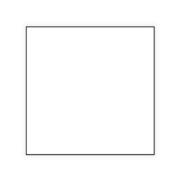
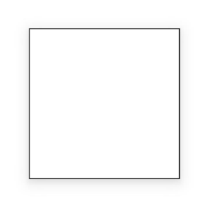
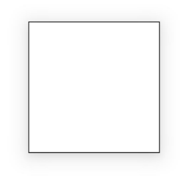
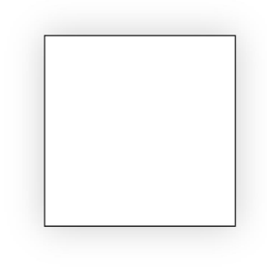
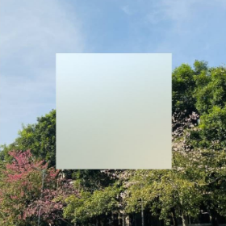
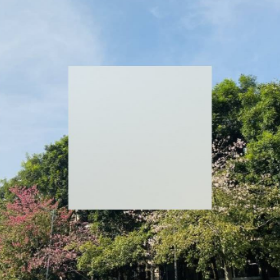

# native_type_visual.h
<!--Kit: ArkUI-->
<!--Subsystem: ArkUI-->
<!--Owner: @hehongyang3-->
<!--Designer: @hehongyang3-->
<!--Tester: @lxl007-->
<!--Adviser: @Brilliantry_Rui-->

## Overview

Defines the visual types for the native module.

**File to include**: <arkui/native_type_visual.h>

**Library**: libace_ndk.z.so

**System capability**: SystemCapability.ArkUI.ArkUI.Full

**Since**: 12

**Related module**: [ArkUI_NativeModule](capi-arkui-nativemodule.md)

## Summary

### Structs

| Name| typedef Keyword| Description|
| -- | -- | -- |
| [ArkUI_TranslationOptions](capi-arkui-nativemodule-arkui-translationoptions.md) | ArkUI_TranslationOptions | Defines the translation options for component transition.|
| [ArkUI_ScaleOptions](capi-arkui-nativemodule-arkui-scaleoptions.md) | ArkUI_ScaleOptions | Defines the scaling options for component transition.|
| [ArkUI_RotationOptions](capi-arkui-nativemodule-arkui-rotationoptions.md) | ArkUI_RotationOptions | Defines the rotation options for component transition.|
| [ArkUI_MotionPathOptions](capi-arkui-nativemodule-arkui-motionpathoptions.md) | ArkUI_MotionPathOptions | Defines the motion path options for path animation.|
| [ArkUI_Matrix4](capi-arkui-nativemodule-arkui-matrix4.md)|ArkUI_Matrix4|Defines a fourth-order matrix object.|
| [ArkUI_PointF](capi-arkui-nativemodule-arkui-pointf.md)|ArkUI_PointF|Defines a two-dimensional coordinate point, where the coordinates are stored as floating-point numbers.|
| [ArkUI_Matrix4RotationOptions](capi-arkui-nativemodule-arkui-matrix4rotationoptions.md)|ArkUI_Matrix4RotationOptions|Defines a matrix rotation object.|
| [ArkUI_Matrix4ScaleOptions](capi-arkui-nativemodule-arkui-matrix4scaleoptions.md)|ArkUI_Matrix4ScaleOptions|Defines a matrix scaling object.|
| [ArkUI_Matrix4TranslationOptions](capi-arkui-nativemodule-arkui-matrix4translationoptions.md)|ArkUI_Matrix4TranslationOptions|Defines a matrix translation object.|
| [OH_ArkUI_ShadowOptions](capi-arkui-nativemodule-oh-arkui-shadowoptions.md) | OH_ArkUI_ShadowOptions | Defines shadow options.|

### Enums

| Name| typedef Keyword| Description|
| -- | -- | -- |
| [ArkUI_ShadowType](#arkui_shadowtype)                               | ArkUI_ShadowType                | Enumerates shadow types.                       |
| [ArkUI_ShadowStyle](#arkui_shadowstyle)                             | ArkUI_ShadowStyle               | Enumerates shadow styles.                         |
| [ArkUI_AnimationCurve](#arkui_animationcurve)                       | ArkUI_AnimationCurve            | Enumerates animation curves.                         |
| [ArkUI_AnimationPlayMode](#arkui_animationplaymode)                 | ArkUI_AnimationPlayMode         | Enumerates animation playback modes.                        |
| [ArkUI_BlurStyle](#arkui_blurstyle)                                 | ArkUI_BlurStyle                 | Enumerates blur styles.                        |
| [ArkUI_BlurStyleActivePolicy](#arkui_blurstyleactivepolicy)         | ArkUI_BlurStyleActivePolicy     | Enumerates the activation policies for the background blur effect.                      |
| [ArkUI_BlendMode](#arkui_blendmode)                                 | ArkUI_BlendMode                 | Enumerates blend modes.                         |
| [ArkUI_ColorStrategy](#arkui_colorstrategy)                         | ArkUI_ColorStrategy             | Enumerates foreground and shadow colors.                          |
| [ArkUI_MaskType](#arkui_masktype)                                   | ArkUI_MaskType                  | Enumerates mask types. A mask is a means to limit the display area of a component. It uses a specific shape to crop the component content so that only the content in the mask area is visible.                          |
| [ArkUI_ClipType](#arkui_cliptype)                                   | ArkUI_ClipType                  | Enumerates clipping region types.                          |
| [ArkUI_ShapeType](#arkui_shapetype)                                 | ArkUI_ShapeType                 | Enumerates custom shape types.                           |
| [ArkUI_LinearGradientDirection](#arkui_lineargradientdirection)     | ArkUI_LinearGradientDirection   | Enumerates gradient directions.                        |
| [ArkUI_TransitionEdge](#arkui_transitionedge)                       | ArkUI_TransitionEdge            | Enumerates the slide-in and slide-out positions of the component from the screen edge during transition.                 |
| [ArkUI_FinishCallbackType](#arkui_finishcallbacktype)               | ArkUI_FinishCallbackType        | Enumerates the callback types for [OH_ArkUI_AnimatorOption_RegisterOnFinishCallback](./capi-native-animate-h.md#oh_arkui_animatoroption_registeronfinishcallback) in an animation.             |
| [ArkUI_BlendApplyType](#arkui_blendapplytype)                       | ArkUI_BlendApplyType            | Enumerates how the specified blend mode is applied.               |
| [ArkUI_RenderFit](#arkui_renderfit)                                 | ArkUI_RenderFit   | Enumerates the sizing and positioning behaviors of animated content in its final state.|
| [ArkUI_AnimationDirection](#arkui_animationdirection)               | ArkUI_AnimationDirection        | Enumerates animation playback directions.                          |
| [ArkUI_AnimationFillMode](#arkui_animationfillmode)                 | ArkUI_AnimationFillMode         | Enumerates the states before and after execution of the frame-by-frame animation.            |

### Function

| Name| Return Value| Description|
| -- | -- | -- |
| [ArkUI_Matrix4ScaleOptions* OH_ArkUI_Matrix4ScaleOptions_Create()](#oh_arkui_matrix4scaleoptions_create) | - | Creates a pointer to the scaling parameter object for matrix operations. In the newly created object, the default scaling coefficients in the x, y, and z directions are 1. The default values of **centerX** and **centerY** of the transformation center point are 0.|
| [void OH_ArkUI_Matrix4ScaleOptions_Dispose(ArkUI_Matrix4ScaleOptions* options)](#oh_arkui_matrix4scaleoptions_dispose) | - | Disposes of the pointer to the scaling parameter object for matrix operations.|
| [ArkUI_ErrorCode OH_ArkUI_Matrix4ScaleOptions_SetX(ArkUI_Matrix4ScaleOptions* options, const float scaleX)](#oh_arkui_matrix4scaleoptions_setx) | - | Sets the scaling factor in the x direction of the scaling parameter object for matrix operations.|
| [ArkUI_ErrorCode OH_ArkUI_Matrix4ScaleOptions_GetX(const ArkUI_Matrix4ScaleOptions* options, float* scaleX)](#oh_arkui_matrix4scaleoptions_getx) | - | Obtains the scaling factor in the x direction of the scaling parameter object for matrix operations. If the value of **x** is not set, the default value of the scaling factor in the x direction is 1.|
| [ArkUI_ErrorCode OH_ArkUI_Matrix4ScaleOptions_SetY(ArkUI_Matrix4ScaleOptions* options, const float scaleY)](#oh_arkui_matrix4scaleoptions_sety) | - | Sets the scaling factor in the y direction of the scaling parameter object for matrix operations.|
| [ArkUI_ErrorCode OH_ArkUI_Matrix4ScaleOptions_GetY(const ArkUI_Matrix4ScaleOptions* options, float* scaleY)](#oh_arkui_matrix4scaleoptions_gety) | - | Obtains the scaling factor in the y direction of the scaling parameter object for matrix operations. If the value of **y** is not set, the default value of the scaling factor in the y direction is 1.|
| [ArkUI_ErrorCode OH_ArkUI_Matrix4ScaleOptions_SetZ(ArkUI_Matrix4ScaleOptions* options, const float scaleZ)](#oh_arkui_matrix4scaleoptions_setz) | - | Sets the scaling factor in the z direction of the scaling parameter object for matrix operations.|
| [ArkUI_ErrorCode OH_ArkUI_Matrix4ScaleOptions_GetZ(const ArkUI_Matrix4ScaleOptions* options, float* scaleZ)](#oh_arkui_matrix4scaleoptions_getz) | - | Obtains the scaling factor in the z direction of the scaling parameter object for matrix operations. If the value of **z** is not set, the default value of the scaling factor in the z direction is 1.|
| [ArkUI_ErrorCode OH_ArkUI_Matrix4ScaleOptions_SetCenterX(ArkUI_Matrix4ScaleOptions* options, const float centerX)](#oh_arkui_matrix4scaleoptions_setcenterx) | - | Sets the x coordinate of the transformation center point of the scaling parameter object for matrix operations.|
| [ArkUI_ErrorCode OH_ArkUI_Matrix4ScaleOptions_GetCenterX(const ArkUI_Matrix4ScaleOptions* options, float* centerX)](#oh_arkui_matrix4scaleoptions_getcenterx) | - | Obtains the x coordinate of the transformation center point of the scaling parameter object for matrix operations.|
| [ArkUI_ErrorCode OH_ArkUI_Matrix4ScaleOptions_SetCenterY(ArkUI_Matrix4ScaleOptions* options, const float centerY)](#oh_arkui_matrix4scaleoptions_setcentery) | - | Sets the y coordinate of the transformation center point of the scaling parameter object for matrix operations.|
| [ArkUI_ErrorCode OH_ArkUI_Matrix4ScaleOptions_GetCenterY(const ArkUI_Matrix4ScaleOptions* options, float* centerY)](#oh_arkui_matrix4scaleoptions_getcentery) | - | Obtains the y coordinate of the transformation center point of the scaling parameter object for matrix operations.|
| [ArkUI_Matrix4RotationOptions* OH_ArkUI_Matrix4RotationOptions_Create()](#oh_arkui_matrix4rotationoptions_create) | - | Creates a pointer to the rotation parameter object for matrix operations. In the newly created object, the default value of an x-axis offset (**centerX**) of a single matrix transformation center point relative to a component transformation center point, the default value of a y-axis offset (**centerY**) of the single matrix transformation center point relative to the component transformation center point, and the default value of a rotation angle (**angle**) are 0. If none of the direction vectors in the x, y, and z directions is specified, the value is equivalent to x=0, y=0, and z=1, indicating rotation around the z-axis. Once any of the direction vectors in the x, y, and z directions is specified, the unspecified values are equivalent to 0.|
| [void OH_ArkUI_Matrix4RotationOptions_Dispose(ArkUI_Matrix4RotationOptions* options)](#oh_arkui_matrix4rotationoptions_dispose) | - | Disposes of the pointer to the rotation parameter object for matrix operations.|
| [ArkUI_ErrorCode OH_ArkUI_Matrix4RotationOptions_SetX(ArkUI_Matrix4RotationOptions* options, const float x)](#oh_arkui_matrix4rotationoptions_setx) | - | Sets the direction vector in the x direction of the rotation parameter object for matrix operations.|
| [ArkUI_ErrorCode OH_ArkUI_Matrix4RotationOptions_GetX(const ArkUI_Matrix4RotationOptions* options, float* x)](#oh_arkui_matrix4rotationoptions_getx) | - | Obtains the direction vector in the x direction of the rotation parameter object for matrix operations. If the value of **x** has never been set, the value is undefined. In this case, [ARKUI_ERROR_CODE_PARAM_INVALID](capi-native-type-h.md#arkui_errorcode) is returned.|
| [ArkUI_ErrorCode OH_ArkUI_Matrix4RotationOptions_SetY(ArkUI_Matrix4RotationOptions* options, const float y)](#oh_arkui_matrix4rotationoptions_sety) | - | Sets the direction vector in the y direction of the rotation parameter object for matrix operations.|
| [ArkUI_ErrorCode OH_ArkUI_Matrix4RotationOptions_GetY(const ArkUI_Matrix4RotationOptions* options, float* y)](#oh_arkui_matrix4rotationoptions_gety) | - | Obtains the direction vector in the y direction of the rotation parameter object for matrix operations. If the value of **y** has never been set, the value is undefined. In this case, [ARKUI_ERROR_CODE_PARAM_INVALID](capi-native-type-h.md#arkui_errorcode) is returned.|
| [ArkUI_ErrorCode OH_ArkUI_Matrix4RotationOptions_SetZ(ArkUI_Matrix4RotationOptions* options, const float z)](#oh_arkui_matrix4rotationoptions_setz) | - | Sets the direction vector in the z direction of the rotation parameter object for matrix operations.|
| [ArkUI_ErrorCode OH_ArkUI_Matrix4RotationOptions_GetZ(const ArkUI_Matrix4RotationOptions* options, float* z)](#oh_arkui_matrix4rotationoptions_getz) | - | Obtains the direction vector in the z direction of the rotation parameter object for matrix operations. If the value of **z** has never been set, the value is undefined. In this case, [ARKUI_ERROR_CODE_PARAM_INVALID](capi-native-type-h.md#arkui_errorcode) is returned.|
| [ArkUI_ErrorCode OH_ArkUI_Matrix4RotationOptions_SetAngle(ArkUI_Matrix4RotationOptions* options, const float angle)](#oh_arkui_matrix4rotationoptions_setangle) | - | Sets the rotation angle in the rotation parameter object for matrix operations.|
| [ArkUI_ErrorCode OH_ArkUI_Matrix4RotationOptions_GetAngle(const ArkUI_Matrix4RotationOptions* options, float* angle)](#oh_arkui_matrix4rotationoptions_getangle) | - | Obtains the rotation angle in the rotation parameter object for matrix operations.|
| [ArkUI_ErrorCode OH_ArkUI_Matrix4RotationOptions_SetCenterX(ArkUI_Matrix4RotationOptions* options, const float centerX)](#oh_arkui_matrix4rotationoptions_setcenterx) | - | Sets the x-axis offset of a single matrix transformation center point relative to a component transformation center point.|
| [ArkUI_ErrorCode OH_ArkUI_Matrix4RotationOptions_GetCenterX(const ArkUI_Matrix4RotationOptions* options, float* centerX)](#oh_arkui_matrix4rotationoptions_getcenterx) | - | Obtains the x-axis offset of a single matrix transformation center point relative to a component transformation center point.|
| [ArkUI_ErrorCode OH_ArkUI_Matrix4RotationOptions_SetCenterY(ArkUI_Matrix4RotationOptions* options, const float centerY)](#oh_arkui_matrix4rotationoptions_setcentery) | - | Sets the y-axis offset of a single matrix transformation center point relative to a component transformation center point.|
| [ArkUI_ErrorCode OH_ArkUI_Matrix4RotationOptions_GetCenterY(const ArkUI_Matrix4RotationOptions* options, float* centerY)](#oh_arkui_matrix4rotationoptions_getcentery) | - | Obtains the y-axis offset of a single matrix transformation center point relative to a component transformation center point.|
| [ArkUI_Matrix4TranslationOptions* OH_ArkUI_Matrix4TranslationOptions_Create()](#oh_arkui_matrix4translationoptions_create) | - | Creates a pointer to a translation object for matrix operations. In the newly created object, the default translation distances on the x, y, and z axes are 0.|
| [void OH_ArkUI_Matrix4TranslationOptions_Dispose(ArkUI_Matrix4TranslationOptions* options)](#oh_arkui_matrix4translationoptions_dispose) | - | Disposes of the pointer to the translation object for matrix operations.|
| [ArkUI_ErrorCode OH_ArkUI_Matrix4TranslationOptions_SetX(ArkUI_Matrix4TranslationOptions* options, const float x)](#oh_arkui_matrix4translationoptions_setx) | - | Sets the translation value of a translation object on the x-axis for matrix operations.|
| [ArkUI_ErrorCode OH_ArkUI_Matrix4TranslationOptions_GetX(const ArkUI_Matrix4TranslationOptions* options, float* x)](#oh_arkui_matrix4translationoptions_getx) | - | Obtains the translation value of a translation object on the x-axis for matrix operations.|
| [ArkUI_ErrorCode OH_ArkUI_Matrix4TranslationOptions_SetY(ArkUI_Matrix4TranslationOptions* options, const float y)](#oh_arkui_matrix4translationoptions_sety) | - | Sets the translation value of a translation object on the y-axis for matrix operations.|
| [ArkUI_ErrorCode OH_ArkUI_Matrix4TranslationOptions_GetY(const ArkUI_Matrix4TranslationOptions* options, float* y)](#oh_arkui_matrix4translationoptions_gety) | - | Obtains the translation value of a translation object on the y-axis for matrix operations.|
| [ArkUI_ErrorCode OH_ArkUI_Matrix4TranslationOptions_SetZ(ArkUI_Matrix4TranslationOptions* options, const float z)](#oh_arkui_matrix4translationoptions_setz) | - | Sets the translation value of a translation object on the z-axis for matrix operations.|
| [ArkUI_ErrorCode OH_ArkUI_Matrix4TranslationOptions_GetZ(const ArkUI_Matrix4TranslationOptions* options, float* z)](#oh_arkui_matrix4translationoptions_getz) | - | Obtains the translation value of a translation object on the z-axis for matrix operations.|
| [ArkUI_Matrix4* OH_ArkUI_Matrix4_CreateIdentity()](#oh_arkui_matrix4_createidentity) | - | Creates a fourth-order identity matrix object.|
| [ArkUI_Matrix4* OH_ArkUI_Matrix4_CreateByElements(const float* elements)](#oh_arkui_matrix4_createbyelements) | - | Creates a fourth-order matrix object by specifying each element of the matrix.|
| [void OH_ArkUI_Matrix4_Dispose(ArkUI_Matrix4* matrix)](#oh_arkui_matrix4_dispose) | - | Disposes of the pointer to the matrix object.|
| [ArkUI_Matrix4* OH_ArkUI_Matrix4_Copy(const ArkUI_Matrix4* matrix)](#oh_arkui_matrix4_copy) | - | Creates a copy of a fourth-order matrix object, which is used to perform operations on the same matrix to obtain different matrix objects.|
| [ArkUI_ErrorCode OH_ArkUI_Matrix4_Invert(ArkUI_Matrix4* matrix)](#oh_arkui_matrix4_invert) | - | Performs inverse matrix transformation on an input matrix.|
| [ArkUI_ErrorCode OH_ArkUI_Matrix4_Combine(ArkUI_Matrix4* oriMatrix, const ArkUI_Matrix4* anotherMatrix)](#oh_arkui_matrix4_combine) | - | Combines another matrix with the original matrix and stores the result matrix in **oriMatrix**. In this case, the result matrix applies the transformation of **oriMatrix** and then applies the transformation of **anotherMatrix**. This API will modify the **oriMatrix** object.|
| [ArkUI_ErrorCode OH_ArkUI_Matrix4_Translate(ArkUI_Matrix4* matrix, const ArkUI_Matrix4TranslationOptions* translate)](#oh_arkui_matrix4_translate)(capi-arkui-nativemodule-arkui-matrix4translationoptions) | - | Applies translation transformation to the original matrix to obtain the translated matrix. Each translation transformation is accumulated on the previous matrix. The input matrix object will be modified after the transformation.|
| [ArkUI_ErrorCode OH_ArkUI_Matrix4_Scale(ArkUI_Matrix4* matrix, const ArkUI_Matrix4ScaleOptions* scale)](#oh_arkui_matrix4_scale) | - | Applies scaling transformation to the original matrix to obtain the scaled matrix. Each scaling transformation is accumulated on the previous matrix. This API will modify the input matrix object.|
| [ArkUI_ErrorCode OH_ArkUI_Matrix4_Rotate(ArkUI_Matrix4* matrix, const ArkUI_Matrix4RotationOptions* rotate)](#oh_arkui_matrix4_rotate) | - | Applies rotation transformation to the original matrix to obtain the rotated matrix. Each rotation transformation is accumulated on the previous matrix. This API will modify the input matrix object.|
| [ArkUI_ErrorCode OH_ArkUI_Matrix4_Skew(ArkUI_Matrix4* matrix, const float skewX, const float skewY)](#oh_arkui_matrix4_skew) | - | Applies skew transformation to the original matrix to obtain the skewed matrix. Each skew transformation is accumulated on the previous matrix. The input matrix object will be modified after the transformation.|
| [ArkUI_ErrorCode OH_ArkUI_Matrix4_TransformPoint(const ArkUI_Matrix4* matrix, const ArkUI_PointF* oriPoint, ArkUI_PointF* result)](#oh_arkui_matrix4_transformpoint) | - | Calculates the new coordinates of a point after matrix transformation.|
| [ArkUI_ErrorCode OH_ArkUI_Matrix4_SetPolyToPoly(ArkUI_Matrix4* matrix, const ArkUI_PointF* src, const ArkUI_PointF* dst, const uint32_t pointCount)](#oh_arkui_matrix4_setpolytopoly) | - | Maps the vertex coordinates of a polygon to those of another polygon and calculates the required matrix.|
| [ArkUI_ErrorCode OH_ArkUI_Matrix4_GetElements(const ArkUI_Matrix4* matrix, float* result)](#oh_arkui_matrix4_getelements) | - | Obtains the 16 elements of a fourth-order matrix.|
| [OH_ArkUI_ShadowOptions* OH_ArkUI_ShadowOptions_Create()](#oh_arkui_shadowoptions_create) | - | Creates a shadow option object. If the object is no longer used, call [OH_ArkUI_ShadowOptions_Destroy](#oh_arkui_shadowoptions_destroy) to destroy it.|
| [void OH_ArkUI_ShadowOptions_Destroy(OH_ArkUI_ShadowOptions* options)](#oh_arkui_shadowoptions_destroy) | - | Destroys the shadow option object.|
| [ArkUI_ErrorCode OH_ArkUI_ShadowOptions_SetRadius(OH_ArkUI_ShadowOptions* options, float radius)](#oh_arkui_shadowoptions_setradius) | - | Sets the blur radius for the shadow options.|
| [ArkUI_ErrorCode OH_ArkUI_ShadowOptions_GetRadius(OH_ArkUI_ShadowOptions* options, float* radius)](#oh_arkui_shadowoptions_getradius) | - | Obtains the blur radius of the shadow options.|
| [ArkUI_ErrorCode OH_ArkUI_ShadowOptions_SetType(OH_ArkUI_ShadowOptions* options, ArkUI_ShadowType type)](#oh_arkui_shadowoptions_settype) | - | Sets the shadow type for the shadow options.|
| [ArkUI_ErrorCode OH_ArkUI_ShadowOptions_GetType(OH_ArkUI_ShadowOptions* options, ArkUI_ShadowType* type)](#oh_arkui_shadowoptions_gettype) | - | Obtains the shadow type of the shadow options.|
| [ArkUI_ErrorCode OH_ArkUI_ShadowOptions_SetColor(OH_ArkUI_ShadowOptions* options, uint32_t color)](#oh_arkui_shadowoptions_setcolor) | - | Sets the shadow color for the shadow options.|
| [ArkUI_ErrorCode OH_ArkUI_ShadowOptions_GetColor(OH_ArkUI_ShadowOptions* options, uint32_t* color)](#oh_arkui_shadowoptions_getcolor) | - | Obtains the shadow color of the shadow options.|
| [ArkUI_ErrorCode OH_ArkUI_ShadowOptions_SetOffsetX(OH_ArkUI_ShadowOptions* options, float offsetX)](#oh_arkui_shadowoptions_setoffsetx) | - | Sets the shadow offset on the x-axis.|
| [ArkUI_ErrorCode OH_ArkUI_ShadowOptions_GetOffsetX(OH_ArkUI_ShadowOptions* options, float* offsetX)](#oh_arkui_shadowoptions_getoffsetx) | - | Obtains the shadow offset on the x-axis.|
| [ArkUI_ErrorCode OH_ArkUI_ShadowOptions_SetOffsetY(OH_ArkUI_ShadowOptions* options, float offsetY)](#oh_arkui_shadowoptions_setoffsety) | - | Sets the shadow offset on the y-axis.|
| [ArkUI_ErrorCode OH_ArkUI_ShadowOptions_GetOffsetY(OH_ArkUI_ShadowOptions* options, float* offsetY)](#oh_arkui_shadowoptions_getoffsety) | - | Obtains the shadow offset on the y-axis.|
| [ArkUI_ErrorCode OH_ArkUI_ShadowOptions_SetFill(OH_ArkUI_ShadowOptions* options, bool isFill)](#oh_arkui_shadowoptions_setfill) | - | Sets whether to fill a component with a shadow.|
| [ArkUI_ErrorCode OH_ArkUI_ShadowOptions_GetFill(OH_ArkUI_ShadowOptions* options, bool* isFill)](#oh_arkui_shadowoptions_getfill) | - | Obtains whether a component is filled with a shadow.|

## Enum Description

### ArkUI_ShadowType

```c
enum ArkUI_ShadowType
```

**Description**


Enumerates shadow types.

**Since**: 12

| Value| Description|
| -- | -- |
| ARKUI_SHADOW_TYPE_COLOR = 0 | Color shadow.|
| ARKUI_SHADOW_TYPE_BLUR = 1 | Blur shadow.|

### ArkUI_ShadowStyle

```c
enum ArkUI_ShadowStyle
```

**Description**


Enumerates shadow styles.

**Since**: 12

| Value| Description|
| -- | -- |
| ARKUI_SHADOW_STYLE_OUTER_DEFAULT_XS = 0 | Mini shadow.<br> |
| ARKUI_SHADOW_STYLE_OUTER_DEFAULT_SM = 1 | Small shadow.<br> |
| ARKUI_SHADOW_STYLE_OUTER_DEFAULT_MD = 2 | Medium shadow.<br> |
| ARKUI_SHADOW_STYLE_OUTER_DEFAULT_LG = 3 | Large shadow.<br> |
| ARKUI_SHADOW_STYLE_OUTER_FLOATING_SM = 4 | Floating small shadow.<br> |
| ARKUI_SHADOW_STYLE_OUTER_FLOATING_MD = 5 | Floating medium shadow.<br> |

### ArkUI_AnimationCurve

```c
enum ArkUI_AnimationCurve
```

**Description**


Enumerates animation curves.

**Since**: 12

| Value| Description|
| -- | -- |
| ARKUI_CURVE_LINEAR = 0 | The animation speed keeps unchanged.|
| ARKUI_CURVE_EASE = 1 | The animation starts slowly, accelerates, and then slows down towards the end.|
| ARKUI_CURVE_EASE_IN = 2 | The animation starts at a low speed and then picks up speed until the end.|
| ARKUI_CURVE_EASE_OUT = 3 | The animation ends at a low speed.|
| ARKUI_CURVE_EASE_IN_OUT = 4 | The animation starts and ends at a low speed, providing a smooth and natural transition.|
| ARKUI_CURVE_FAST_OUT_SLOW_IN = 5 | The animation uses the standard curve.|
| ARKUI_CURVE_LINEAR_OUT_SLOW_IN = 6 | The animation uses the deceleration curve.|
| ARKUI_CURVE_FAST_OUT_LINEAR_IN = 7 | The animation uses the acceleration curve.|
| ARKUI_CURVE_EXTREME_DECELERATION = 8 | The animation uses the extreme deceleration curve.|
| ARKUI_CURVE_SHARP = 9 | The animation uses the sharp curve.|
| ARKUI_CURVE_RHYTHM = 10 | The animation uses the rhythm curve.|
| ARKUI_CURVE_SMOOTH = 11 | The animation uses the smooth curve.|
| ARKUI_CURVE_FRICTION = 12 | The animation uses the friction curve.|

### ArkUI_AnimationPlayMode

```c
enum ArkUI_AnimationPlayMode
```

**Description**


Enumerates animation playback modes.

**Since**: 12

| Value| Description|
| -- | -- |
| ARKUI_ANIMATION_PLAY_MODE_NORMAL = 0 | The animation is played forwards.|
| ARKUI_ANIMATION_PLAY_MODE_REVERSE = 1 | The animation is played backwards.|
| ARKUI_ANIMATION_PLAY_MODE_ALTERNATE = 2 | The animation plays in alternating loop mode. When the animation is played for an odd number of times, the playback is in forward direction. When the animation is played for an even number of times, the playback is in reverse direction.|
| ARKUI_ANIMATION_PLAY_MODE_ALTERNATE_REVERSE = 3 | The animation plays in reverse alternating loop mode. When the animation is played for an odd number of times, the playback is in reverse direction. When the animation is played for an even number of times, the playback is in forward direction.|

### ArkUI_BlurStyle

```c
enum ArkUI_BlurStyle
```

**Description**


Enumerates blur styles.

**Since**: 12

| Value| Description|
| -- | -- |
| ARKUI_BLUR_STYLE_THIN = 0 | Thin material.<br> |
| ARKUI_BLUR_STYLE_REGULAR = 1 | Regular material.<br> |
| ARKUI_BLUR_STYLE_THICK = 2 | Thick material.<br> |
| ARKUI_BLUR_STYLE_BACKGROUND_THIN = 3 | Material that creates the minimum depth of field effect.<br> |
| ARKUI_BLUR_STYLE_BACKGROUND_REGULAR = 4 | Material that creates a medium shallow depth of field effect.<br> |
| ARKUI_BLUR_STYLE_BACKGROUND_THICK = 5 | Material that creates a high shallow depth of field effect.<br> |
| ARKUI_BLUR_STYLE_BACKGROUND_ULTRA_THICK = 6 | Material that creates the maximum depth of field effect.<br> |
| ARKUI_BLUR_STYLE_NONE = 7 | No blur.<br> |
| ARKUI_BLUR_STYLE_COMPONENT_ULTRA_THIN = 8 | Component ultra-thin material.<br> |
| ARKUI_BLUR_STYLE_COMPONENT_THIN = 9 | Component thin material.<br> |
| ARKUI_BLUR_STYLE_COMPONENT_REGULAR = 10 | Component regular material.<br> |
| ARKUI_BLUR_STYLE_COMPONENT_THICK = 11 | Component thick material.<br> |
| ARKUI_BLUR_STYLE_COMPONENT_ULTRA_THICK = 12 | Component ultra-thick material.<br> |

### ArkUI_BlurStyleActivePolicy

```c
enum ArkUI_BlurStyleActivePolicy
```

**Description**


Enumerates the activation policies for the background blur effect.

**Since**: 19

| Value| Description|
| -- | -- |
| ARKUI_BLUR_STYLE_ACTIVE_POLICY_FOLLOWS_WINDOW_ACTIVE_STATE = 0 | The blur effect changes according to the window's focus state; it is inactive when the window is not in focus and active when the window is in focus.|
| ARKUI_BLUR_STYLE_ACTIVE_POLICY_ALWAYS_ACTIVE = 1 | The blur effect is always active.|
| ARKUI_BLUR_STYLE_ACTIVE_POLICY_ALWAYS_INACTIVE = 2 | The blur effect is always inactive.|

### ArkUI_BlendMode

```c
enum ArkUI_BlendMode
```

**Description**


Enumerates blend modes.

**Since**: 12

| Value| Description|
| -- | -- |
| ARKUI_BLEND_MODE_NONE = 0 | The top image is superimposed on the bottom image without any blending.|
| ARKUI_BLEND_MODE_CLEAR = 1 | The target pixels covered by the source pixels are erased by being turned to completely transparent.|
| ARKUI_BLEND_MODE_SRC = 2 | r = s: Only the source pixels are displayed.|
| ARKUI_BLEND_MODE_DST = 3 | r = d: Only the target pixels are displayed.|
| ARKUI_BLEND_MODE_SRC_OVER = 4 | r = s + (1 - sa) * d: The source pixels are blended based on opacity and cover the target pixels.|
| ARKUI_BLEND_MODE_DST_OVER = 5 | r = d + (1 - da) * s: The target pixels are blended based on opacity and cover on the source pixels.|
| ARKUI_BLEND_MODE_SRC_IN = 6 | r = s * da: Only the part of the source pixels that overlap with the target pixels is displayed.|
| ARKUI_BLEND_MODE_DST_IN = 7 | r = d * sa: Only the part of the target pixels that overlap with the source pixels is displayed.|
| ARKUI_BLEND_MODE_SRC_OUT = 8 | r = s * (1 - da): Only the part of the source pixels that do not overlap with the target pixels is displayed.|
| ARKUI_BLEND_MODE_DST_OUT = 9 | r = d * (1 - sa): Only the part of the target pixels that do not overlap with the source pixels is displayed.|
| ARKUI_BLEND_MODE_SRC_ATOP = 10 | r = s * da + d * (1 - sa): The part of the source pixels that overlap with the target pixels is displayed and the part of the target pixels that do not overlap with the source pixels are displayed.|
| ARKUI_BLEND_MODE_DST_ATOP = 11 | r = d * sa + s * (1 - da): The part of the target pixels that overlap with the source pixels and the part of the source pixels that do not overlap with the target pixels are displayed.|
| ARKUI_BLEND_MODE_XOR = 12 | r = s * (1 - da) + d * (1 - sa): Only the non-overlapping part between the source pixels and the target pixels is displayed.|
| ARKUI_BLEND_MODE_PLUS = 13 | r = min(s + d, 1): New pixels resulting from adding the source pixels to the target pixels are displayed.|
| ARKUI_BLEND_MODE_MODULATE = 14 | r = s * d: New pixels resulting from multiplying the source pixels with the target pixels are displayed.|
| ARKUI_BLEND_MODE_SCREEN = 15 | r = s + d - s * d: Pixels are blended by adding the source pixels to the target pixels and subtracting the product of their multiplication.|
| ARKUI_BLEND_MODE_OVERLAY = 16 | The **MULTIPLY** or **SCREEN** mode is used based on the target pixels.|
| ARKUI_BLEND_MODE_DARKEN = 17 | rc = s + d - max(s * da, d * sa), ra = kSrcOver: When two colors overlap, whichever is darker is used.|
| ARKUI_BLEND_MODE_LIGHTEN = 18 | rc = s + d - min(s * da, d * sa), ra = kSrcOver: The darker of the pixels (source and target) is used.|
| ARKUI_BLEND_MODE_COLOR_DODGE = 19 | The colors of the target pixels are lightened to reflect the source pixels.|
| ARKUI_BLEND_MODE_COLOR_BURN = 20 | The colors of the target pixels are darkened to reflect the source pixels.|
| ARKUI_BLEND_MODE_HARD_LIGHT = 21 | The **MULTIPLY** or **SCREEN** mode is used, depending on the source pixels.|
| ARKUI_BLEND_MODE_SOFT_LIGHT = 22 | The **LIGHTEN** or **DARKEN** mode is used, depending on the source pixels.|
| ARKUI_BLEND_MODE_DIFFERENCE = 23 | rc = s + d - 2 * (min(s * da, d * sa)), ra = kSrcOver: The final pixel is the result of subtracting the darker of the two pixels (source and target) from the lighter one.|
| ARKUI_BLEND_MODE_EXCLUSION = 24 | rc = s + d - two(s * d), ra = kSrcOver: The final pixel is similar to **DIFFERENCE**, but with less contrast.|
| ARKUI_BLEND_MODE_MULTIPLY = 25 | r = s * (1 - da) + d * (1 - sa) + s * d: The final pixel is the result of multiplying the source pixel by the target pixel.|
| ARKUI_BLEND_MODE_HUE = 26 | The resultant image is created with the luminance and saturation of the source image and the hue of the target image.|
| ARKUI_BLEND_MODE_SATURATION = 27 | The resultant image is created with the luminance and hue of the target image and the saturation of the source image.|
| ARKUI_BLEND_MODE_COLOR = 28 | The resultant image is created with the saturation and hue of the source image and the luminance of the target image.|
| ARKUI_BLEND_MODE_LUMINOSITY = 29 | The resultant image is created with the saturation and hue of the target image and the luminance of the source image.|

### ArkUI_ColorStrategy

```c
enum ArkUI_ColorStrategy
```

**Description**


Enumerates foreground and shadow colors.

**Since**: 12

| Value| Description|
| -- | -- |
| ARKUI_COLOR_STRATEGY_INVERT = 0 | The foreground colors are the inverse of the component background colors.|
| ARKUI_COLOR_STRATEGY_AVERAGE = 1 | The shadow colors of the component are the average color obtained from the component background shadow area.|
| ARKUI_COLOR_STRATEGY_PRIMARY = 2 | The shadow colors of the component are the primary color obtained from the component background shadow area.|

### ArkUI_MaskType

```c
enum ArkUI_MaskType
```

**Description**

Enumerates mask types. A mask is a means to limit the display area of a component. It uses a specific shape to crop the component content so that only the content in the mask area is visible.

**Since**: 12

| Value| Description|
| -- | -- |
| ARKUI_MASK_TYPE_RECTANGLE = 0 | Rectangle.|
| ARKUI_MASK_TYPE_CIRCLE = 1 | Circle.|
| ARKUI_MASK_TYPE_ELLIPSE = 2 | Ellipse.|
| ARKUI_MASK_TYPE_PATH = 3 | Path.|
| ARKUI_MASK_TYPE_PROGRESS = 4 | Progress indicator.|

### ArkUI_ClipType

```c
enum ArkUI_ClipType
```

**Description**


Enumerates clipping region types.

**Since**: 12

| Value| Description|
| -- | -- |
| ARKUI_CLIP_TYPE_RECTANGLE = 0 | Rectangle.|
| ARKUI_CLIP_TYPE_CIRCLE = 1 | Circle.|
| ARKUI_CLIP_TYPE_ELLIPSE = 2 | Ellipse.|
| ARKUI_CLIP_TYPE_PATH = 3 | Path.|

### ArkUI_ShapeType

```c
enum ArkUI_ShapeType
```

**Description**


Enumerates custom shape types.

**Since**: 12

| Value| Description|
| -- | -- |
| ARKUI_SHAPE_TYPE_RECTANGLE = 0 | Rectangle.|
| ARKUI_SHAPE_TYPE_CIRCLE = 1 | Circle.|
| ARKUI_SHAPE_TYPE_ELLIPSE = 2 | Ellipse.|
| ARKUI_SHAPE_TYPE_PATH = 3 | Path.|

### ArkUI_LinearGradientDirection

```c
enum ArkUI_LinearGradientDirection
```

**Description**

Enumerates gradient directions.

**Since**: 12

| Value| Description|
| -- | -- |
| ARKUI_LINEAR_GRADIENT_DIRECTION_LEFT = 0 | From right to left.|
| ARKUI_LINEAR_GRADIENT_DIRECTION_TOP = 1 | From bottom to top.|
| ARKUI_LINEAR_GRADIENT_DIRECTION_RIGHT = 2 | From left to right.|
| ARKUI_LINEAR_GRADIENT_DIRECTION_BOTTOM = 3 | From top to bottom.|
| ARKUI_LINEAR_GRADIENT_DIRECTION_LEFT_TOP = 4 | From lower right to upper left.|
| ARKUI_LINEAR_GRADIENT_DIRECTION_LEFT_BOTTOM = 5 | From upper right to lower left.|
| ARKUI_LINEAR_GRADIENT_DIRECTION_RIGHT_TOP = 6 | From lower left to upper right.|
| ARKUI_LINEAR_GRADIENT_DIRECTION_RIGHT_BOTTOM = 7 | From upper left to lower right.|
| ARKUI_LINEAR_GRADIENT_DIRECTION_NONE = 8 | No gradient.|
| ARKUI_LINEAR_GRADIENT_DIRECTION_CUSTOM = 9 | Custom direction.|

### ArkUI_TransitionEdge

```c
enum ArkUI_TransitionEdge
```

**Description**


Enumerates the slide-in and slide-out positions of the component from the screen edge during transition.

**Since**: 12

| Value| Description|
| -- | -- |
| ARKUI_TRANSITION_EDGE_TOP = 0 | The component slides in and out from the top edge of the screen during transition.|
| ARKUI_TRANSITION_EDGE_BOTTOM = 1 | The component slides in and out from the bottom edge of the screen during transition.|
| ARKUI_TRANSITION_EDGE_START = 2 | The component slides in and out from the left edge of the screen during transition.|
| ARKUI_TRANSITION_EDGE_END = 3 | The component slides in and out from the right edge of the screen during transition.|

### ArkUI_FinishCallbackType

```c
enum ArkUI_FinishCallbackType
```

**Description**


Enumerates the callback types for [OH_ArkUI_AnimatorOption_RegisterOnFinishCallback](./capi-native-animate-h.md#oh_arkui_animatoroption_registeronfinishcallback) in an animation.

**Since**: 12

| Value| Description|
| -- | -- |
| ARKUI_FINISH_CALLBACK_REMOVED = 0 | The callback is invoked when the entire animation is removed once it has finished.|
| ARKUI_FINISH_CALLBACK_LOGICALLY = 1 | The callback is invoked when the animation logically enters the falling state, though it may still be in its long tail state. The long tail state refers to the residual change process before the animation is completely stopped. In this state, the value change of the animation is very small and close to the target value.|

### ArkUI_BlendApplyType

```c
enum ArkUI_BlendApplyType
```

**Description**


Enumerates how the specified blend mode is applied.

**Since**: 12

| Value| Description|
| -- | -- |
| BLEND_APPLY_TYPE_FAST = 0 | The content of the view is blended in sequence on the target image.|
| BLEND_APPLY_TYPE_OFFSCREEN = 1 | The content of the component and its child components are drawn on the offscreen canvas, and then blended with the existing content on the canvas.|

### ArkUI_RenderFit

```c
enum ArkUI_RenderFit
```

**Description**


Enumerates the sizing and positioning behaviors of animated content in its final state.

**Since**: 12

| Value| Description|
| -- | -- |
| ARKUI_RENDER_FIT_CENTER = 0 | The component's content stays at the final size and always aligned with the center of the component.|
| ARKUI_RENDER_FIT_TOP = 1 | The component's content stays at the final size and always aligned with the top center of the component.|
| ARKUI_RENDER_FIT_BOTTOM = 2 | The component's content stays at the final size and always aligned with the bottom center of the component.|
| ARKUI_RENDER_FIT_LEFT = 3 | The component's content stays at the final size and always aligned with the left of the component.|
| ARKUI_RENDER_FIT_RIGHT = 4 | The component's content stays at the final size and always aligned with the right of the component.|
| ARKUI_RENDER_FIT_TOP_LEFT = 5 | The component's content stays at the final size and always aligned with the upper left corner of the component.|
| ARKUI_RENDER_FIT_TOP_RIGHT = 6 | The component's content stays at the final size and always aligned with the upper right corner of the component.|
| ARKUI_RENDER_FIT_BOTTOM_LEFT = 7 | The component's content stays at the final size and always aligned with the lower left corner of the component.|
| ARKUI_RENDER_FIT_BOTTOM_RIGHT = 8 | The component's content stays at the final size and always aligned with the lower right corner of the component.|
| ARKUI_RENDER_FIT_RESIZE_FILL = 9 | The component's content is always resized to fill the component's content box, without considering its aspect ratio in the final state.|
| ARKUI_RENDER_FIT_RESIZE_CONTAIN = 10 | While maintaining its aspect ratio in the final state, the component's content is scaled to fit within the component's content box. It is always aligned with the center of the component.|
| ARKUI_RENDER_FIT_RESIZE_CONTAIN_TOP_LEFT = 11 | While maintaining its aspect ratio in the final state, the component's content is scaled to fit within the component's content box. When there is remaining space in the width direction of the component, the content is left-aligned with the component. When there is remaining space in the height direction of the component, the content is top-aligned with the component.|
| ARKUI_RENDER_FIT_RESIZE_CONTAIN_BOTTOM_RIGHT = 12 | While maintaining its aspect ratio in the final state, the component's content is scaled to fit within the component's content box. When there is remaining space in the width direction of the component, the content is right-aligned with the component. When there is remaining space in the height direction of the component, the content is bottom-aligned with the component.|
| ARKUI_RENDER_FIT_RESIZE_COVER = 13 | While maintaining its aspect ratio in the final state, the component's content is scaled to cover the component's entire content box. It is always aligned with the center of the component, so that its middle part is displayed.|
| ARKUI_RENDER_FIT_RESIZE_COVER_TOP_LEFT = 14 | While maintaining its aspect ratio in the final state, the component's content is scaled to cover the component's entire content box. When there is remaining space in the width direction, the content is left-aligned with the component, so that its left part is displayed. When there is remaining space in the height direction, the content is top-aligned with the component, so that its top part is displayed.|
| ARKUI_RENDER_FIT_RESIZE_COVER_BOTTOM_RIGHT = 15 | While maintaining its aspect ratio in the final state, the component's content is scaled to cover the component's entire content box. When there is remaining space in the width direction, the content is right-aligned with the component, so that its right part is displayed. When there is remaining space in the height direction, the content is bottom-aligned with the component, so that its bottom part is displayed.|

### ArkUI_AnimationDirection

```c
enum ArkUI_AnimationDirection
```

**Description**


Enumerates animation playback directions.

**Since**: 12

| Value| Description|
| -- | -- |
| ARKUI_ANIMATION_DIRECTION_NORMAL = 0 | The animation plays in forward loop mode.|
| ARKUI_ANIMATION_DIRECTION_REVERSE = 1 | The animation plays in reverse loop mode.|
| ARKUI_ANIMATION_DIRECTION_ALTERNATE = 2 | The animation plays in alternating loop mode. When the animation is played for an odd number of times, the playback is in forward direction. When the animation is played for an even number of times, the playback is in reverse direction.|
| ARKUI_ANIMATION_DIRECTION_ALTERNATE_REVERSE = 3 | The animation plays in reverse alternating loop mode. When the animation is played for an odd number of times, the playback is in reverse direction. When the animation is played for an even number of times, the playback is in forward direction.|

### ArkUI_AnimationFillMode

```c
enum ArkUI_AnimationFillMode
```

**Description**


Enumerates the states before and after execution of the frame-by-frame animation.

**Since**: 12

| Value| Description|
| -- | -- |
| ARKUI_ANIMATION_FILL_MODE_NONE = 0 | Before execution, the animation does not apply any styles to the target component. After execution, the animation restores the target component to its default state.|
| ARKUI_ANIMATION_FILL_MODE_FORWARDS = 1 | The target component retains the state set by the last keyframe encountered during execution of the animation.|
| ARKUI_ANIMATION_FILL_MODE_BACKWARDS = 2 | The animation applies the values defined in the first keyframe once it is applied to the target component, and retains the values during the period set by [delay](./capi-native-animate-h.md#oh_arkui_animateoption_setdelay).|
| ARKUI_ANIMATION_FILL_MODE_BOTH = 3 | The animation follows the rules of [ARKUI_ANIMATION_FILL_MODE_FORWARDS](#arkui_animationfillmode) and [ARKUI_ANIMATION_FILL_MODE_BACKWARDS](#arkui_animationfillmode) to extend the animation properties in both directions.|

## Function Description

### OH_ArkUI_Matrix4_CreateIdentity()

```c
ArkUI_Matrix4* OH_ArkUI_Matrix4_CreateIdentity()
```

**Description**

Creates a fourth-order identity matrix object.

**Since**: 24

**Returns**

| Type| Description|
| -- | -- |
| [ArkUI_Matrix4](capi-arkui-nativemodule-arkui-matrix4.md)* | Pointer to the created fourth-order identity matrix object.|

### OH_ArkUI_Matrix4_CreateByElements()

```c
ArkUI_Matrix4* OH_ArkUI_Matrix4_CreateByElements(const float* elements)
```

**Description**

Creates a fourth-order matrix object by specifying each element of the matrix.

**Since**: 24

**Parameters**

| Name| Description|
| -- | -- |
| const float* elements | Pointer to the array of expected matrix element data. The array length must be greater than or equal to 16. This parameter cannot be set to a null pointer.|

**Returns**

| Type| Description|
| -- | -- |
| [ArkUI_Matrix4](capi-arkui-nativemodule-arkui-matrix4.md)* | Pointer to the created fourth-order matrix object. If the **elements** pointer is a null pointer, a null value is returned.|

### OH_ArkUI_Matrix4_Dispose()

```c
void OH_ArkUI_Matrix4_Dispose(ArkUI_Matrix4* matrix)
```

**Description**

Disposes of the pointer to the matrix object.

**Since**: 24

**Parameters**

| Name| Description|
| -- | -- |
| [ArkUI_Matrix4](capi-arkui-nativemodule-arkui-matrix4.md)* matrix| Pointer to the fourth-order matrix object to be disposed of.|

### OH_ArkUI_Matrix4_Copy()

```c
ArkUI_Matrix4* OH_ArkUI_Matrix4_Copy(const ArkUI_Matrix4* matrix)
```

**Description**

Creates a copy of a fourth-order matrix object, which is used to perform operations on the same matrix to obtain different matrix objects.

**Since**: 24

**Parameters**

| Name| Description|
| -- | -- |
| const [ArkUI_Matrix4](capi-arkui-nativemodule-arkui-matrix4.md)* matrix | Pointer to the original fourth-order matrix object.|

**Returns**

| Type| Description|
| -- | -- |
| [ArkUI_Matrix4](capi-arkui-nativemodule-arkui-matrix4.md)* | Pointer to the created fourth-order matrix object.|

### OH_ArkUI_Matrix4_Invert()

```c
ArkUI_ErrorCode OH_ArkUI_Matrix4_Invert(ArkUI_Matrix4* matrix)
```

**Description**

Performs inverse matrix transformation on an input matrix.

**Since**: 24

**Parameters**

| Name| Description|
| -- | -- |
| [ArkUI_Matrix4](capi-arkui-nativemodule-arkui-matrix4.md)* matrix | Pointer to the fourth-order matrix object for which inverse matrix transformation is to be performed.|

**Returns**

| Type| Description|
| -- | -- |
| [ArkUI_ErrorCode](capi-native-type-h.md#arkui_errorcode) | Error code.<br> Returns [ARKUI_ERROR_CODE_NO_ERROR](capi-native-type-h.md#arkui_errorcode) if the operation is successful.<br> Returns [ARKUI_ERROR_CODE_PARAM_INVALID](capi-native-type-h.md#arkui_errorcode) if a parameter error occurs.|

### OH_ArkUI_Matrix4_Combine()

```c
ArkUI_ErrorCode OH_ArkUI_Matrix4_Combine(ArkUI_Matrix4* oriMatrix, const ArkUI_Matrix4* anotherMatrix)
```

**Description**

Combines another matrix with the original matrix and stores the result matrix in **oriMatrix**. In this case, the result matrix applies the transformation of **oriMatrix** and then applies the transformation of **anotherMatrix**. This API will modify the **oriMatrix** object.

**Since**: 24

**Parameters**

| Name| Description|
| -- | -- |
| [ArkUI_Matrix4](capi-arkui-nativemodule-arkui-matrix4.md)* oriMatrix | Pointer to the original fourth-order matrix object.|
| const [ArkUI_Matrix4](capi-arkui-nativemodule-arkui-matrix4.md)* anotherMatrix | Pointer to another matrix object to be combined.|

**Returns**

| Type| Description|
| -- | -- |
| [ArkUI_ErrorCode](capi-native-type-h.md#arkui_errorcode) | Error code.<br> Returns [ARKUI_ERROR_CODE_NO_ERROR](capi-native-type-h.md#arkui_errorcode) if the operation is successful.<br> Returns [ARKUI_ERROR_CODE_PARAM_INVALID](capi-native-type-h.md#arkui_errorcode) if a parameter error occurs.|

### OH_ArkUI_Matrix4_Translate()

```c
ArkUI_ErrorCode OH_ArkUI_Matrix4_Translate(ArkUI_Matrix4* matrix, const ArkUI_Matrix4TranslationOptions* translate)
```

**Description**

Applies translation transformation to the original matrix to obtain the translated matrix. Each translation transformation is accumulated on the previous matrix. The input matrix object will be modified after the transformation.

**Since**: 24

**Parameters**

| Name| Description|
| -- | -- |
| [ArkUI_Matrix4](capi-arkui-nativemodule-arkui-matrix4.md)* matrix | Pointer to the fourth-order matrix object to be translated.|
| const [ArkUI_Matrix4TranslationOptions](capi-arkui-nativemodule-arkui-matrix4translationoptions.md)* translate | Pointer to the translation object.|

**Returns**

| Type| Description|
| -- | -- |
| [ArkUI_ErrorCode](capi-native-type-h.md#arkui_errorcode) | Error code.<br> Returns [ARKUI_ERROR_CODE_NO_ERROR](capi-native-type-h.md#arkui_errorcode) if the operation is successful.<br> Returns [ARKUI_ERROR_CODE_PARAM_INVALID](capi-native-type-h.md#arkui_errorcode) if a parameter error occurs.|

### OH_ArkUI_Matrix4_Scale()

```c
ArkUI_ErrorCode OH_ArkUI_Matrix4_Scale(ArkUI_Matrix4* matrix, const ArkUI_Matrix4ScaleOptions* scale)
```

**Description**

Applies scaling transformation to the original matrix to obtain the scaled matrix. Each scaling transformation is accumulated on the previous matrix. This API will modify the input matrix object.

**Since**: 24

**Parameters**

| Name| Description|
| -- | -- |
| [ArkUI_Matrix4](capi-arkui-nativemodule-arkui-matrix4.md)* matrix | Pointer to the fourth-order matrix object to be scaled.|
| const [ArkUI_Matrix4ScaleOptions](capi-arkui-nativemodule-arkui-matrix4scaleoptions.md)* scale | Pointer to the scaling object.|

**Returns**

| Type| Description|
| -- | -- |
| [ArkUI_ErrorCode](capi-native-type-h.md#arkui_errorcode) | Error code.<br> Returns [ARKUI_ERROR_CODE_NO_ERROR](capi-native-type-h.md#arkui_errorcode) if the operation is successful.<br> Returns [ARKUI_ERROR_CODE_PARAM_INVALID](capi-native-type-h.md#arkui_errorcode) if a parameter error occurs.|

### OH_ArkUI_Matrix4_Rotate()

```c
ArkUI_ErrorCode OH_ArkUI_Matrix4_Rotate(ArkUI_Matrix4* matrix, const ArkUI_Matrix4RotationOptions* rotate)
```

**Description**

Applies rotation transformation to the original matrix to obtain the rotated matrix. Each rotation transformation is accumulated on the previous matrix. This API will modify the input matrix object.

**Since**: 24

**Parameters**

| Name| Description|
| -- | -- |
| [ArkUI_Matrix4](capi-arkui-nativemodule-arkui-matrix4.md)* matrix | Pointer to the fourth-order matrix object to be rotated.|
| const [ArkUI_Matrix4RotationOptions](capi-arkui-nativemodule-arkui-matrix4rotationoptions.md)* rotate | Pointer to the rotation object.|

**Returns**

| Type| Description|
| -- | -- |
| [ArkUI_ErrorCode](capi-native-type-h.md#arkui_errorcode) | Error code.<br> Returns [ARKUI_ERROR_CODE_NO_ERROR](capi-native-type-h.md#arkui_errorcode) if the operation is successful.<br> Returns [ARKUI_ERROR_CODE_PARAM_INVALID](capi-native-type-h.md#arkui_errorcode) if a parameter error occurs.|

### OH_ArkUI_Matrix4_Skew()

```c
ArkUI_ErrorCode OH_ArkUI_Matrix4_Skew(ArkUI_Matrix4* matrix, const float skewX, const float skewY)
```

**Description**

Applies skew transformation to the original matrix to obtain the skewed matrix. Each skew transformation is accumulated on the previous matrix. The input matrix object will be modified after the transformation.

**Since**: 24

**Parameters**

| Name| Description|
| -- | -- |
| [ArkUI_Matrix4](capi-arkui-nativemodule-arkui-matrix4.md)* matrix | Pointer to the fourth-order matrix object to be skewed.|
| const float skewX | Skew coefficient in the x direction.|
| const float skewY | Skew coefficient in the y direction.|

**Returns**

| Type| Description|
| -- | -- |
| [ArkUI_ErrorCode](capi-native-type-h.md#arkui_errorcode) | Error code.<br> Returns [ARKUI_ERROR_CODE_NO_ERROR](capi-native-type-h.md#arkui_errorcode) if the operation is successful.<br> Returns [ARKUI_ERROR_CODE_PARAM_INVALID](capi-native-type-h.md#arkui_errorcode) if a parameter error occurs.|

### OH_ArkUI_Matrix4_TransformPoint()

```c
ArkUI_ErrorCode OH_ArkUI_Matrix4_TransformPoint(const ArkUI_Matrix4* matrix, const ArkUI_PointF* oriPoint, ArkUI_PointF* result)
```

**Description**

Calculates the new coordinates of a point after matrix transformation.

**Since**: 24

**Parameters**

| Name| Description|
| -- | -- |
| const [ArkUI_Matrix4](capi-arkui-nativemodule-arkui-matrix4.md)* matrix | Pointer to the fourth-order matrix object.|
| const [ArkUI_PointF](capi-arkui-nativemodule-arkui-pointf.md)* oriPoint | Pointer to the original coordinate point.|
| [ArkUI_PointF](capi-arkui-nativemodule-arkui-pointf.md)* result | Pointer to the result point. The value cannot be null.|

**Returns**

| Type| Description|
| -- | -- |
| [ArkUI_ErrorCode](capi-native-type-h.md#arkui_errorcode) | Error code.<br> Returns [ARKUI_ERROR_CODE_NO_ERROR](capi-native-type-h.md#arkui_errorcode) if the operation is successful.<br> Returns [ARKUI_ERROR_CODE_PARAM_INVALID](capi-native-type-h.md#arkui_errorcode) if a parameter error occurs.|

### OH_ArkUI_Matrix4_SetPolyToPoly()

```c
ArkUI_ErrorCode OH_ArkUI_Matrix4_SetPolyToPoly(ArkUI_Matrix4* matrix, const ArkUI_PointF* src, const ArkUI_PointF* dst, const uint32_t pointCount)
```

**Description**

Maps the vertex coordinates of a polygon to those of another polygon and calculates the required matrix.

**Since**: 24

**Parameters**

| Name| Description|
| -- | -- |
| [ArkUI_Matrix4](capi-arkui-nativemodule-arkui-matrix4.md)* matrix | Pointer to the fourth-order matrix object, which is used to store the result matrix.|
| const [ArkUI_PointF](capi-arkui-nativemodule-arkui-pointf.md)* src | Pointer to the coordinate point array of the original polygon. The array length must be at least the value of **pointCount**.|
| const [ArkUI_PointF](capi-arkui-nativemodule-arkui-pointf.md)* dst | Pointer to the coordinate point array of the mapped polygon. The array length must be at least the value of **pointCount**.|
| const uint32_t pointCount | Number of polygon points. The value must be 0, 1, 2, 3, or 4.|

**Returns**

| Type| Description|
| -- | -- |
| [ArkUI_ErrorCode](capi-native-type-h.md#arkui_errorcode) | Error code.<br> Returns [ARKUI_ERROR_CODE_NO_ERROR](capi-native-type-h.md#arkui_errorcode) if the operation is successful.<br> Returns [ARKUI_ERROR_CODE_PARAM_INVALID](capi-native-type-h.md#arkui_errorcode) if a parameter error occurs.|

### OH_ArkUI_Matrix4_GetElements()

```c
ArkUI_ErrorCode OH_ArkUI_Matrix4_GetElements(const ArkUI_Matrix4* matrix, float* result)
```

**Description**

Obtains the 16 elements of a fourth-order matrix.

**Since**: 24

**Parameters**

| Name| Description|
| -- | -- |
| const [ArkUI_Matrix4](capi-arkui-nativemodule-arkui-matrix4.md)* matrix | Pointer to the fourth-order matrix object.|
| float* result | Pointer to the array of 16 floating-point numbers. The value cannot be null.|

**Returns**

| Type| Description|
| -- | -- |
| [ArkUI_ErrorCode](capi-native-type-h.md#arkui_errorcode) | Error code.<br> Returns [ARKUI_ERROR_CODE_NO_ERROR](capi-native-type-h.md#arkui_errorcode) if the operation is successful.<br> Returns [ARKUI_ERROR_CODE_PARAM_INVALID](capi-native-type-h.md#arkui_errorcode) if a parameter error occurs.|

### OH_ArkUI_Matrix4ScaleOptions_Create()

```c
ArkUI_Matrix4ScaleOptions* OH_ArkUI_Matrix4ScaleOptions_Create()
```

**Description**

Creates a pointer to the scaling parameter object for matrix operations. In the newly created object, the default scaling coefficients in the x, y, and z directions are 1. The default values of **centerX** and **centerY** of the transformation center point are 0.

**Since**: 24

**Returns**

| Type| Description|
| -- | -- |
| [ArkUI_Matrix4ScaleOptions](capi-arkui-nativemodule-arkui-matrix4scaleoptions.md)* | Pointer to the new [ArkUI_Matrix4ScaleOptions](capi-arkui-nativemodule-arkui-matrix4scaleoptions.md) object.|

### OH_ArkUI_Matrix4ScaleOptions_Dispose()

```c
void OH_ArkUI_Matrix4ScaleOptions_Dispose(ArkUI_Matrix4ScaleOptions* options)
```

**Description**

Disposes of the pointer to the scaling parameter object for matrix operations.

**Since**: 24

**Parameters**

| Name| Description|
| -- | -- |
| [ArkUI_Matrix4ScaleOptions](capi-arkui-nativemodule-arkui-matrix4scaleoptions.md)* options| Pointer to the [ArkUI_Matrix4ScaleOptions](capi-arkui-nativemodule-arkui-matrix4scaleoptions.md) object to be disposed of.|

### OH_ArkUI_Matrix4ScaleOptions_SetX()

```c
ArkUI_ErrorCode OH_ArkUI_Matrix4ScaleOptions_SetX(ArkUI_Matrix4ScaleOptions* options, const float scaleX)
```

**Description**

Sets the scaling factor in the x direction of the scaling parameter object for matrix operations.

**Since**: 24

**Parameters**

| Name| Description|
| -- | -- |
| [ArkUI_Matrix4ScaleOptions](capi-arkui-nativemodule-arkui-matrix4scaleoptions.md)* options| Pointer to the scaling parameter object for matrix operations.|
| const float scaleX | Scaling factor in the x direction. The value range is (-∞, +∞).|

**Returns**

| Type| Description|
| -- | -- |
| [ArkUI_ErrorCode](capi-native-type-h.md#arkui_errorcode) | Error code.<br> Returns [ARKUI_ERROR_CODE_NO_ERROR](capi-native-type-h.md#arkui_errorcode) if the operation is successful.<br> Returns [ARKUI_ERROR_CODE_PARAM_INVALID](capi-native-type-h.md#arkui_errorcode) if a parameter error occurs.|

### OH_ArkUI_Matrix4ScaleOptions_GetX()

```c
ArkUI_ErrorCode OH_ArkUI_Matrix4ScaleOptions_GetX(const ArkUI_Matrix4ScaleOptions* options, float* scaleX)
```

**Description**

Obtains the scaling factor in the x direction of the scaling parameter object for matrix operations. If the value of **x** is not set, the default value of the scaling factor in the x direction is 1.

**Since**: 24

**Parameters**

| Name| Description|
| -- | -- |
| const [ArkUI_Matrix4ScaleOptions](capi-arkui-nativemodule-arkui-matrix4scaleoptions.md)* options| Pointer to the scaling parameter object for matrix operations.|
| float* scaleX | Pointer to the scaling factor in the x direction.|

**Returns**

| Type| Description|
| -- | -- |
| [ArkUI_ErrorCode](capi-native-type-h.md#arkui_errorcode) | Error code.<br> Returns [ARKUI_ERROR_CODE_NO_ERROR](capi-native-type-h.md#arkui_errorcode) if the operation is successful.<br> Returns [ARKUI_ERROR_CODE_PARAM_INVALID](capi-native-type-h.md#arkui_errorcode) if a parameter error occurs.|

### OH_ArkUI_Matrix4ScaleOptions_SetY()

```c
ArkUI_ErrorCode OH_ArkUI_Matrix4ScaleOptions_SetY(ArkUI_Matrix4ScaleOptions* options, const float scaleY)
```

**Description**

Sets the scaling factor in the y direction of the scaling parameter object for matrix operations.

**Since**: 24

**Parameters**

| Name| Description|
| -- | -- |
| [ArkUI_Matrix4ScaleOptions](capi-arkui-nativemodule-arkui-matrix4scaleoptions.md)* options | Pointer to the scaling parameter object for matrix operations.|
| const float scaleY | Scaling factor in the y direction. The value range is (-∞, +∞).|

**Returns**

| Type| Description|
| -- | -- |
| [ArkUI_ErrorCode](capi-native-type-h.md#arkui_errorcode) | Error code.<br> Returns [ARKUI_ERROR_CODE_NO_ERROR](capi-native-type-h.md#arkui_errorcode) if the operation is successful.<br> Returns [ARKUI_ERROR_CODE_PARAM_INVALID](capi-native-type-h.md#arkui_errorcode) if a parameter error occurs.|

### OH_ArkUI_Matrix4ScaleOptions_GetY()

```c
ArkUI_ErrorCode OH_ArkUI_Matrix4ScaleOptions_GetY(const ArkUI_Matrix4ScaleOptions* options, float* scaleY)
```

**Description**

Obtains the scaling factor in the y direction of the scaling parameter object for matrix operations. If the value of **y** is not set, the default value of the scaling factor in the y direction is 1.

**Since**: 24

**Parameters**

| Name| Description|
| -- | -- |
| const [ArkUI_Matrix4ScaleOptions](capi-arkui-nativemodule-arkui-matrix4scaleoptions.md)* options | Pointer to the scaling parameter object for matrix operations.|
| float* scaleY | Pointer to the scaling factor in the y direction.|

**Returns**

| Type| Description|
| -- | -- |
| [ArkUI_ErrorCode](capi-native-type-h.md#arkui_errorcode) | Error code.<br> Returns [ARKUI_ERROR_CODE_NO_ERROR](capi-native-type-h.md#arkui_errorcode) if the operation is successful.<br> Returns [ARKUI_ERROR_CODE_PARAM_INVALID](capi-native-type-h.md#arkui_errorcode) if a parameter error occurs.|

### OH_ArkUI_Matrix4ScaleOptions_SetZ()

```c
ArkUI_ErrorCode OH_ArkUI_Matrix4ScaleOptions_SetZ(ArkUI_Matrix4ScaleOptions* options, const float scaleZ)
```

**Description**

Sets the scaling factor in the z direction of the scaling parameter object for matrix operations.

**Since**: 24

**Parameters**

| Name| Description|
| -- | -- |
| [ArkUI_Matrix4ScaleOptions](capi-arkui-nativemodule-arkui-matrix4scaleoptions.md)* options | Pointer to the scaling parameter object for matrix operations.|
| const float scaleZ | Scaling factor in the z direction. The value range is (-∞, +∞).|

**Returns**

| Type| Description|
| -- | -- |
| [ArkUI_ErrorCode](capi-native-type-h.md#arkui_errorcode) | Error code.<br> Returns [ARKUI_ERROR_CODE_NO_ERROR](capi-native-type-h.md#arkui_errorcode) if the operation is successful.<br> Returns [ARKUI_ERROR_CODE_PARAM_INVALID](capi-native-type-h.md#arkui_errorcode) if a parameter error occurs.|

### OH_ArkUI_Matrix4ScaleOptions_GetZ()

```c
ArkUI_ErrorCode OH_ArkUI_Matrix4ScaleOptions_GetZ(const ArkUI_Matrix4ScaleOptions* options, float* scaleZ)
```

**Description**

Obtains the scaling factor in the z direction of the scaling parameter object for matrix operations. If the value of **z** is not set, the default value of the scaling factor in the z direction is 1.

**Since**: 24

**Parameters**

| Name| Description|
| -- | -- |
| const [ArkUI_Matrix4ScaleOptions](capi-arkui-nativemodule-arkui-matrix4scaleoptions.md)* options | Pointer to the scaling parameter object for matrix operations.|
| float* scaleZ | Pointer to the scaling factor in the z direction.|

**Returns**

| Type| Description|
| -- | -- |
| [ArkUI_ErrorCode](capi-native-type-h.md#arkui_errorcode) | Error code.<br> Returns [ARKUI_ERROR_CODE_NO_ERROR](capi-native-type-h.md#arkui_errorcode) if the operation is successful.<br> Returns [ARKUI_ERROR_CODE_PARAM_INVALID](capi-native-type-h.md#arkui_errorcode) if a parameter error occurs.|

### OH_ArkUI_Matrix4ScaleOptions_SetCenterX()

```c
ArkUI_ErrorCode OH_ArkUI_Matrix4ScaleOptions_SetCenterX(ArkUI_Matrix4ScaleOptions* options, const float centerX)
```

**Description**

Sets the x coordinate of the transformation center point of the scaling parameter object for matrix operations.

**Since**: 24

**Parameters**

| Name| Description|
| -- | -- |
| [ArkUI_Matrix4ScaleOptions](capi-arkui-nativemodule-arkui-matrix4scaleoptions.md)* options | Pointer to the scaling parameter object for matrix operations.|
| const float centerX | X-coordinate of the transformation center point. The value range is (-∞, +∞). **0** indicates that there is no x-axis offset based on the transformation center. The unit is px.|

**Returns**

| Type| Description|
| -- | -- |
| [ArkUI_ErrorCode](capi-native-type-h.md#arkui_errorcode) | Error code.<br> Returns [ARKUI_ERROR_CODE_NO_ERROR](capi-native-type-h.md#arkui_errorcode) if the operation is successful.<br> Returns [ARKUI_ERROR_CODE_PARAM_INVALID](capi-native-type-h.md#arkui_errorcode) if a parameter error occurs.|

### OH_ArkUI_Matrix4ScaleOptions_GetCenterX()

```c
ArkUI_ErrorCode OH_ArkUI_Matrix4ScaleOptions_GetCenterX(const ArkUI_Matrix4ScaleOptions* options, float* centerX)
```

**Description**

Obtains the x coordinate of the transformation center point of the scaling parameter object for matrix operations.

**Since**: 24

**Parameters**

| Name| Description|
| -- | -- |
| const [ArkUI_Matrix4ScaleOptions](capi-arkui-nativemodule-arkui-matrix4scaleoptions.md)* options | Pointer to the scaling parameter object for matrix operations.|
| float* centerX | Pointer to the X-coordinate of the transformation center point. The unit is px. The default value is **0**.|

**Returns**

| Type| Description|
| -- | -- |
| [ArkUI_ErrorCode](capi-native-type-h.md#arkui_errorcode) | Error code.<br> Returns [ARKUI_ERROR_CODE_NO_ERROR](capi-native-type-h.md#arkui_errorcode) if the operation is successful.<br> Returns [ARKUI_ERROR_CODE_PARAM_INVALID](capi-native-type-h.md#arkui_errorcode) if a parameter error occurs.|

### OH_ArkUI_Matrix4ScaleOptions_SetCenterY()

```c
ArkUI_ErrorCode OH_ArkUI_Matrix4ScaleOptions_SetCenterY(ArkUI_Matrix4ScaleOptions* options, const float centerY)
```

**Description**

Sets the y coordinate of the transformation center point of the scaling parameter object for matrix operations.

**Since**: 24

**Parameters**

| Name| Description|
| -- | -- |
| [ArkUI_Matrix4ScaleOptions](capi-arkui-nativemodule-arkui-matrix4scaleoptions.md)* options | Pointer to the scaling parameter object for matrix operations.|
| const float centerY | Y-coordinate of the transformation center point. The value range is (-∞, +∞). **0** indicates that there is no y-axis offset based on the transformation center. The unit is px.|

**Returns**

| Type| Description|
| -- | -- |
| [ArkUI_ErrorCode](capi-native-type-h.md#arkui_errorcode) | Error code.<br> Returns [ARKUI_ERROR_CODE_NO_ERROR](capi-native-type-h.md#arkui_errorcode) if the operation is successful.<br> Returns [ARKUI_ERROR_CODE_PARAM_INVALID](capi-native-type-h.md#arkui_errorcode) if a parameter error occurs.|

### OH_ArkUI_Matrix4ScaleOptions_GetCenterY()

```c
ArkUI_ErrorCode OH_ArkUI_Matrix4ScaleOptions_GetCenterY(const ArkUI_Matrix4ScaleOptions* options, float* centerY)
```

**Description**

Obtains the y coordinate of the transformation center point of the scaling parameter object for matrix operations.

**Since**: 24

**Parameters**

| Name| Description|
| -- | -- |
| const [ArkUI_Matrix4ScaleOptions](capi-arkui-nativemodule-arkui-matrix4scaleoptions.md)* options | Pointer to the scaling parameter object for matrix operations.|
| float* centerY | Pointer to the Y-coordinate of the transformation center point. The unit is px. The default value is **0**.|

**Returns**

| Type| Description|
| -- | -- |
| [ArkUI_ErrorCode](capi-native-type-h.md#arkui_errorcode) | Error code.<br> Returns [ARKUI_ERROR_CODE_NO_ERROR](capi-native-type-h.md#arkui_errorcode) if the operation is successful.<br> Returns [ARKUI_ERROR_CODE_PARAM_INVALID](capi-native-type-h.md#arkui_errorcode) if a parameter error occurs.|

### OH_ArkUI_Matrix4RotationOptions_Create()

```c
ArkUI_Matrix4RotationOptions* OH_ArkUI_Matrix4RotationOptions_Create()
```

**Description**

Creates a pointer to the rotation parameter object for matrix operations. In the newly created object, the default value of an x-axis offset (**centerX**) of a single matrix transformation center point relative to a component transformation center point, the default value of a y-axis offset (**centerY**) of the single matrix transformation center point relative to the component transformation center point, and the default value of a rotation angle (**angle**) are 0. If none of the direction vectors in the x, y, and z directions is specified, the value is equivalent to x=0, y=0, and z=1, indicating rotation around the z-axis. Once any of the direction vectors in the x, y, and z directions is specified, the unspecified values are equivalent to 0.

**Since**: 24

**Returns**

| Type| Description|
| -- | -- |
| [ArkUI_Matrix4RotationOptions](capi-arkui-nativemodule-arkui-matrix4rotationoptions.md)* | Pointer to the new [ArkUI_Matrix4RotationOptions](capi-arkui-nativemodule-arkui-matrix4rotationoptions.md) object.|

### OH_ArkUI_Matrix4RotationOptions_Dispose()

```c
void OH_ArkUI_Matrix4RotationOptions_Dispose(ArkUI_Matrix4RotationOptions* options)
```

**Description**

Disposes of the pointer to the rotation parameter object for matrix operations.

**Since**: 24

**Parameters**

| Name| Description|
| -- | -- |
| [ArkUI_Matrix4RotationOptions](capi-arkui-nativemodule-arkui-matrix4rotationoptions.md)* options| Pointer to the rotation parameter object for matrix operations.|

### OH_ArkUI_Matrix4RotationOptions_SetX()

```c
ArkUI_ErrorCode OH_ArkUI_Matrix4RotationOptions_SetX(ArkUI_Matrix4RotationOptions* options, const float x)
```

**Description**

Sets the direction vector in the x direction of the rotation parameter object for matrix operations.

**Since**: 24

**Parameters**

| Name| Description|
| -- | -- |
| [ArkUI_Matrix4RotationOptions](capi-arkui-nativemodule-arkui-matrix4rotationoptions.md)* options| Pointer to the rotation parameter object for matrix operations.|
| const float x | Value of the direction vector in the x direction. The value range is (-∞, +∞).|

**Returns**

| Type| Description|
| -- | -- |
| [ArkUI_ErrorCode](capi-native-type-h.md#arkui_errorcode) | Error code.<br> Returns [ARKUI_ERROR_CODE_NO_ERROR](capi-native-type-h.md#arkui_errorcode) if the operation is successful.<br> Returns [ARKUI_ERROR_CODE_PARAM_INVALID](capi-native-type-h.md#arkui_errorcode) if a parameter error occurs.|

### OH_ArkUI_Matrix4RotationOptions_GetX()

```c
ArkUI_ErrorCode OH_ArkUI_Matrix4RotationOptions_GetX(const ArkUI_Matrix4RotationOptions* options, float* x)
```

**Description**

Obtains the direction vector in the x direction of the rotation parameter object for matrix operations. If the value of **x** has never been set, the value is undefined. In this case, [ARKUI_ERROR_CODE_PARAM_INVALID](capi-native-type-h.md#arkui_errorcode) is returned.

**Since**: 24

**Parameters**

| Name| Description|
| -- | -- |
| const [ArkUI_Matrix4RotationOptions](capi-arkui-nativemodule-arkui-matrix4rotationoptions.md)* options| Pointer to the rotation parameter object for matrix operations.|
| float* x | Pointer to the value of the direction vector in the x direction. If the value of **x** has never been set, the value is undefined.|

**Returns**

| Type| Description|
| -- | -- |
| [ArkUI_ErrorCode](capi-native-type-h.md#arkui_errorcode) | Error code.<br> Returns [ARKUI_ERROR_CODE_NO_ERROR](capi-native-type-h.md#arkui_errorcode) if the operation is successful.<br> Returns [ARKUI_ERROR_CODE_PARAM_INVALID](capi-native-type-h.md#arkui_errorcode) if a parameter error occurs.|

### OH_ArkUI_Matrix4RotationOptions_SetY()

```c
ArkUI_ErrorCode OH_ArkUI_Matrix4RotationOptions_SetY(ArkUI_Matrix4RotationOptions* options, const float y)
```

**Description**

Sets the direction vector in the y direction of the rotation parameter object for matrix operations.

**Since**: 24

**Parameters**

| Name| Description|
| -- | -- |
| [ArkUI_Matrix4RotationOptions](capi-arkui-nativemodule-arkui-matrix4rotationoptions.md)* options| Pointer to the rotation parameter object for matrix operations.|
| const float y | Value of the direction vector in the y direction. The value range is (-∞, +∞).|

**Returns**

| Type| Description|
| -- | -- |
| [ArkUI_ErrorCode](capi-native-type-h.md#arkui_errorcode) | Error code.<br> Returns [ARKUI_ERROR_CODE_NO_ERROR](capi-native-type-h.md#arkui_errorcode) if the operation is successful.<br> Returns [ARKUI_ERROR_CODE_PARAM_INVALID](capi-native-type-h.md#arkui_errorcode) if a parameter error occurs.|

### OH_ArkUI_Matrix4RotationOptions_GetY()

```c
ArkUI_ErrorCode OH_ArkUI_Matrix4RotationOptions_GetY(const ArkUI_Matrix4RotationOptions* options, float* y)
```

**Description**

Obtains the direction vector in the y direction of the rotation parameter object for matrix operations. If the value of **y** has never been set, the value is undefined. In this case, [ARKUI_ERROR_CODE_PARAM_INVALID](capi-native-type-h.md#arkui_errorcode) is returned.

**Since**: 24

**Parameters**

| Name| Description|
| -- | -- |
| const [ArkUI_Matrix4RotationOptions](capi-arkui-nativemodule-arkui-matrix4rotationoptions.md)* options| Pointer to the rotation parameter object for matrix operations.|
| float* y | Pointer to the value of the direction vector in the y direction. If the value of **y** has never been set, the value is undefined.|

**Returns**

| Type| Description|
| -- | -- |
| [ArkUI_ErrorCode](capi-native-type-h.md#arkui_errorcode) | Error code.<br> Returns [ARKUI_ERROR_CODE_NO_ERROR](capi-native-type-h.md#arkui_errorcode) if the operation is successful.<br> Returns [ARKUI_ERROR_CODE_PARAM_INVALID](capi-native-type-h.md#arkui_errorcode) if a parameter error occurs.|

### OH_ArkUI_Matrix4RotationOptions_SetZ()

```c
ArkUI_ErrorCode OH_ArkUI_Matrix4RotationOptions_SetZ(ArkUI_Matrix4RotationOptions* options, const float z)
```

**Description**

Sets the direction vector in the z direction of the rotation parameter object for matrix operations.

**Since**: 24

**Parameters**

| Name| Description|
| -- | -- |
| [ArkUI_Matrix4RotationOptions](capi-arkui-nativemodule-arkui-matrix4rotationoptions.md)* options| Pointer to the rotation parameter object for matrix operations.|
| const float z | Value of the direction vector in the z direction. The value range is (-∞, +∞).|

**Returns**

| Type| Description|
| -- | -- |
| [ArkUI_ErrorCode](capi-native-type-h.md#arkui_errorcode) | Error code.<br> Returns [ARKUI_ERROR_CODE_NO_ERROR](capi-native-type-h.md#arkui_errorcode) if the operation is successful.<br> Returns [ARKUI_ERROR_CODE_PARAM_INVALID](capi-native-type-h.md#arkui_errorcode) if a parameter error occurs.|

### OH_ArkUI_Matrix4RotationOptions_GetZ()

```c
ArkUI_ErrorCode OH_ArkUI_Matrix4RotationOptions_GetZ(const ArkUI_Matrix4RotationOptions* options, float* z)
```

**Description**

Obtains the direction vector in the z direction of the rotation parameter object for matrix operations. If the value of **z** has never been set, the value is undefined. In this case, [ARKUI_ERROR_CODE_PARAM_INVALID](capi-native-type-h.md#arkui_errorcode) is returned.

**Since**: 24

**Parameters**

| Name| Description|
| -- | -- |
| const [ArkUI_Matrix4RotationOptions](capi-arkui-nativemodule-arkui-matrix4rotationoptions.md)* options| Pointer to the rotation parameter object for matrix operations.|
| float* z | Pointer to the value of the direction vector in the z direction. If the value of **z** has never been set, the value is undefined.|

**Returns**

| Type| Description|
| -- | -- |
| [ArkUI_ErrorCode](capi-native-type-h.md#arkui_errorcode) | Error code.<br> Returns [ARKUI_ERROR_CODE_NO_ERROR](capi-native-type-h.md#arkui_errorcode) if the operation is successful.<br> Returns [ARKUI_ERROR_CODE_PARAM_INVALID](capi-native-type-h.md#arkui_errorcode) if a parameter error occurs.|

### OH_ArkUI_Matrix4RotationOptions_SetAngle()

```c
ArkUI_ErrorCode OH_ArkUI_Matrix4RotationOptions_SetAngle(ArkUI_Matrix4RotationOptions* options, const float angle)
```

**Description**

Sets the rotation angle in the rotation parameter object for matrix operations.

**Since**: 24

**Parameters**

| Name| Description|
| -- | -- |
| [ArkUI_Matrix4RotationOptions](capi-arkui-nativemodule-arkui-matrix4rotationoptions.md)* options| Pointer to the rotation parameter object for matrix operations.|
| const float angle | Value of the rotation angle. The value range is (-∞, +∞). The unit is degree.|

**Returns**

| Type| Description|
| -- | -- |
| [ArkUI_ErrorCode](capi-native-type-h.md#arkui_errorcode) | Error code.<br> Returns [ARKUI_ERROR_CODE_NO_ERROR](capi-native-type-h.md#arkui_errorcode) if the operation is successful.<br> Returns [ARKUI_ERROR_CODE_PARAM_INVALID](capi-native-type-h.md#arkui_errorcode) if a parameter error occurs.|

### OH_ArkUI_Matrix4RotationOptions_GetAngle()

```c
ArkUI_ErrorCode OH_ArkUI_Matrix4RotationOptions_GetAngle(const ArkUI_Matrix4RotationOptions* options, float* angle)
```

**Description**

Obtains the rotation angle in the rotation parameter object for matrix operations.

**Since**: 24

**Parameters**

| Name| Description|
| -- | -- |
| const [ArkUI_Matrix4RotationOptions](capi-arkui-nativemodule-arkui-matrix4rotationoptions.md)* options| Pointer to the rotation parameter object for matrix operations.|
| float* angle | Pointer to the value of the rotation angle. The unit is degree. If the angle has never been set, the default value is **0**.|

**Returns**

| Type| Description|
| -- | -- |
| [ArkUI_ErrorCode](capi-native-type-h.md#arkui_errorcode) | Error code.<br> Returns [ARKUI_ERROR_CODE_NO_ERROR](capi-native-type-h.md#arkui_errorcode) if the operation is successful.<br> Returns [ARKUI_ERROR_CODE_PARAM_INVALID](capi-native-type-h.md#arkui_errorcode) if a parameter error occurs.|

### OH_ArkUI_Matrix4RotationOptions_SetCenterX()

```c
ArkUI_ErrorCode OH_ArkUI_Matrix4RotationOptions_SetCenterX(ArkUI_Matrix4RotationOptions* options, const float centerX)
```

**Description**

Sets the x-axis offset of a single matrix transformation center point relative to a component transformation center point.

**Since**: 24

**Parameters**

| Name| Description|
| -- | -- |
| [ArkUI_Matrix4RotationOptions](capi-arkui-nativemodule-arkui-matrix4rotationoptions.md)* options| Pointer to the rotation parameter object for matrix operations.|
| const float centerX | X-axis offset of a single matrix transformation center point relative to a component transformation center point. The value range is (-∞, +∞). **0** indicates that there is no x-axis offset based on the transformation center. The unit is px.|

**Returns**

| Type| Description|
| -- | -- |
| [ArkUI_ErrorCode](capi-native-type-h.md#arkui_errorcode) | Error code.<br> Returns [ARKUI_ERROR_CODE_NO_ERROR](capi-native-type-h.md#arkui_errorcode) if the operation is successful.<br> Returns [ARKUI_ERROR_CODE_PARAM_INVALID](capi-native-type-h.md#arkui_errorcode) if a parameter error occurs.|

### OH_ArkUI_Matrix4RotationOptions_GetCenterX()

```c
ArkUI_ErrorCode OH_ArkUI_Matrix4RotationOptions_GetCenterX(const ArkUI_Matrix4RotationOptions* options, float* centerX)
```

**Description**

Obtains the x-axis offset of a single matrix transformation center point relative to a component transformation center point.

**Since**: 24

**Parameters**

| Name| Description|
| -- | -- |
| const [ArkUI_Matrix4RotationOptions](capi-arkui-nativemodule-arkui-matrix4rotationoptions.md)* options| Pointer to the rotation parameter object for matrix operations.|
| float* centerX | Pointer to the x-axis offset of a single matrix transformation center point relative to a component transformation center point. The unit is px. If **centerX** has never been set, the default value is **0**.|

**Returns**

| Type| Description|
| -- | -- |
| [ArkUI_ErrorCode](capi-native-type-h.md#arkui_errorcode) | Error code.<br> Returns [ARKUI_ERROR_CODE_NO_ERROR](capi-native-type-h.md#arkui_errorcode) if the operation is successful.<br> Returns [ARKUI_ERROR_CODE_PARAM_INVALID](capi-native-type-h.md#arkui_errorcode) if a parameter error occurs.|

### OH_ArkUI_Matrix4RotationOptions_SetCenterY()

```c
ArkUI_ErrorCode OH_ArkUI_Matrix4RotationOptions_SetCenterY(ArkUI_Matrix4RotationOptions* options, const float centerY)
```

**Description**

Sets the y-axis offset of a single matrix transformation center point relative to a component transformation center point.

**Since**: 24

**Parameters**

| Name| Description|
| -- | -- |
| [ArkUI_Matrix4RotationOptions](capi-arkui-nativemodule-arkui-matrix4rotationoptions.md)* options| Pointer to the rotation parameter object for matrix operations.|
| const float centerY | Y-axis offset of a single matrix transformation center point relative to a component transformation center point. The value range is (-∞, +∞). **0** indicates that there is no y-axis offset based on the transformation center. The unit is px.|

**Returns**

| Type| Description|
| -- | -- |
| [ArkUI_ErrorCode](capi-native-type-h.md#arkui_errorcode) | Error code.<br> Returns [ARKUI_ERROR_CODE_NO_ERROR](capi-native-type-h.md#arkui_errorcode) if the operation is successful.<br> Returns [ARKUI_ERROR_CODE_PARAM_INVALID](capi-native-type-h.md#arkui_errorcode) if a parameter error occurs.|

### OH_ArkUI_Matrix4RotationOptions_GetCenterY()

```c
ArkUI_ErrorCode OH_ArkUI_Matrix4RotationOptions_GetCenterY(const ArkUI_Matrix4RotationOptions* options, float* centerY)
```

**Description**

Obtains the y-axis offset of a single matrix transformation center point relative to a component transformation center point.

**Since**: 24

**Parameters**

| Name| Description|
| -- | -- |
| const [ArkUI_Matrix4RotationOptions](capi-arkui-nativemodule-arkui-matrix4rotationoptions.md)* options| Pointer to the rotation parameter object for matrix operations.|
| float* centerY | Pointer to the y-axis offset of a single matrix transformation center point relative to a component transformation center point. The unit is px. If **centerY** has never been set, the default value is **0**.|

**Returns**

| Type| Description|
| -- | -- |
| [ArkUI_ErrorCode](capi-native-type-h.md#arkui_errorcode) | Error code.<br> Returns [ARKUI_ERROR_CODE_NO_ERROR](capi-native-type-h.md#arkui_errorcode) if the operation is successful.<br> Returns [ARKUI_ERROR_CODE_PARAM_INVALID](capi-native-type-h.md#arkui_errorcode) if a parameter error occurs.|

### OH_ArkUI_Matrix4TranslationOptions_Create()

```c
ArkUI_Matrix4TranslationOptions* OH_ArkUI_Matrix4TranslationOptions_Create()
```

**Description**

Creates a pointer to a translation object for matrix operations. In the newly created object, the default translation distances on the x, y, and z axes are 0.

**Since**: 24

**Returns**

| Type| Description|
| -- | -- |
| [ArkUI_Matrix4TranslationOptions](capi-arkui-nativemodule-arkui-matrix4translationoptions.md)* | Pointer to the new [ArkUI_Matrix4TranslationOptions](capi-arkui-nativemodule-arkui-matrix4translationoptions.md) object.|

### OH_ArkUI_Matrix4TranslationOptions_Dispose()

```c
void OH_ArkUI_Matrix4TranslationOptions_Dispose(ArkUI_Matrix4TranslationOptions* options)
```

**Description**

Disposes of the pointer to the translation object for matrix operations.

**Since**: 24

**Parameters**

| Name| Description|
| -- | -- |
| [ArkUI_Matrix4TranslationOptions](capi-arkui-nativemodule-arkui-matrix4translationoptions.md)* options| Pointer to the [ArkUI_Matrix4TranslationOptions](capi-arkui-nativemodule-arkui-matrix4translationoptions.md) object to be disposed of.|

### OH_ArkUI_Matrix4TranslationOptions_SetX()

```c
ArkUI_ErrorCode OH_ArkUI_Matrix4TranslationOptions_SetX(ArkUI_Matrix4TranslationOptions* options, const float x)
```

**Description**

Sets the translation value of a translation object on the x-axis for matrix operations.

**Since**: 24

**Parameters**

| Name| Description|
| -- | -- |
| [ArkUI_Matrix4TranslationOptions](capi-arkui-nativemodule-arkui-matrix4translationoptions.md)* options| Pointer to the translation parameter object for matrix operations.|
| const float x | Translation value on the x-axis. The value range is (-∞, +∞). The unit is px. If the value of **x** has never been set, the default value is **0**.|

**Returns**

| Type| Description|
| -- | -- |
| [ArkUI_ErrorCode](capi-native-type-h.md#arkui_errorcode) | Error code.<br> Returns [ARKUI_ERROR_CODE_NO_ERROR](capi-native-type-h.md#arkui_errorcode) if the operation is successful.<br> Returns [ARKUI_ERROR_CODE_PARAM_INVALID](capi-native-type-h.md#arkui_errorcode) if a parameter error occurs.|

### OH_ArkUI_Matrix4TranslationOptions_GetX()

```c
ArkUI_ErrorCode OH_ArkUI_Matrix4TranslationOptions_GetX(const ArkUI_Matrix4TranslationOptions* options, float* x)
```

**Description**

Obtains the translation value of a translation object on the x-axis for matrix operations.

**Since**: 24

**Parameters**

| Name| Description|
| -- | -- |
| const [ArkUI_Matrix4TranslationOptions](capi-arkui-nativemodule-arkui-matrix4translationoptions.md)* options| Pointer to the translation parameter object for matrix operations.|
| float* x |Pointer to the translation value on the x-axis.|

**Returns**

| Type| Description|
| -- | -- |
| [ArkUI_ErrorCode](capi-native-type-h.md#arkui_errorcode) | Error code.<br> Returns [ARKUI_ERROR_CODE_NO_ERROR](capi-native-type-h.md#arkui_errorcode) if the operation is successful.<br> Returns [ARKUI_ERROR_CODE_PARAM_INVALID](capi-native-type-h.md#arkui_errorcode) if a parameter error occurs.|

### OH_ArkUI_Matrix4TranslationOptions_SetY()

```c
ArkUI_ErrorCode OH_ArkUI_Matrix4TranslationOptions_SetY(ArkUI_Matrix4TranslationOptions* options, const float y)
```

**Description**

Sets the translation value of a translation object on the y-axis for matrix operations.

**Since**: 24

**Parameters**

| Name| Description|
| -- | -- |
| [ArkUI_Matrix4TranslationOptions](capi-arkui-nativemodule-arkui-matrix4translationoptions.md)* options| Pointer to the translation parameter object for matrix operations.|
| const float y | Translation value on the y-axis. The value range is (-∞, +∞). The unit is px. If the value of **y** has never been set, the default value is **0**.|

**Returns**

| Type| Description|
| -- | -- |
| [ArkUI_ErrorCode](capi-native-type-h.md#arkui_errorcode) | Error code.<br> Returns [ARKUI_ERROR_CODE_NO_ERROR](capi-native-type-h.md#arkui_errorcode) if the operation is successful.<br> Returns [ARKUI_ERROR_CODE_PARAM_INVALID](capi-native-type-h.md#arkui_errorcode) if a parameter error occurs.|

### OH_ArkUI_Matrix4TranslationOptions_GetY()

```c
ArkUI_ErrorCode OH_ArkUI_Matrix4TranslationOptions_GetY(const ArkUI_Matrix4TranslationOptions* options, float* y)
```

**Description**

Obtains the translation value of a translation object on the y-axis for matrix operations.

**Since**: 24

**Parameters**

| Name| Description|
| -- | -- |
| const [ArkUI_Matrix4TranslationOptions](capi-arkui-nativemodule-arkui-matrix4translationoptions.md)* options| Pointer to the translation parameter object for matrix operations.|
| float* y | Pointer to the translation value on the y-axis.|

**Returns**

| Type| Description|
| -- | -- |
| [ArkUI_ErrorCode](capi-native-type-h.md#arkui_errorcode) | Error code.<br> Returns [ARKUI_ERROR_CODE_NO_ERROR](capi-native-type-h.md#arkui_errorcode) if the operation is successful.<br> Returns [ARKUI_ERROR_CODE_PARAM_INVALID](capi-native-type-h.md#arkui_errorcode) if a parameter error occurs.|

### OH_ArkUI_Matrix4TranslationOptions_SetZ()

```c
ArkUI_ErrorCode OH_ArkUI_Matrix4TranslationOptions_SetZ(ArkUI_Matrix4TranslationOptions* options, const float z)
```

**Description**

Sets the translation value of a translation object on the z-axis for matrix operations.

**Since**: 24

**Parameters**

| Name| Description|
| -- | -- |
| [ArkUI_Matrix4TranslationOptions](capi-arkui-nativemodule-arkui-matrix4translationoptions.md)* options| Pointer to the translation parameter object for matrix operations.|
| const float z | Translation value on the z-axis. The value range is (-∞, +∞). The unit is px. If the value of **z** has never been set, the default value is **0**.|

**Returns**

| Type| Description|
| -- | -- |
| [ArkUI_ErrorCode](capi-native-type-h.md#arkui_errorcode) | Error code.<br> Returns [ARKUI_ERROR_CODE_NO_ERROR](capi-native-type-h.md#arkui_errorcode) if the operation is successful.<br> Returns [ARKUI_ERROR_CODE_PARAM_INVALID](capi-native-type-h.md#arkui_errorcode) if a parameter error occurs.|

### OH_ArkUI_Matrix4TranslationOptions_GetZ()

```c
ArkUI_ErrorCode OH_ArkUI_Matrix4TranslationOptions_GetZ(const ArkUI_Matrix4TranslationOptions* options, float* z)
```

**Description**

Obtains the translation value of a translation object on the z-axis for matrix operations.

**Since**: 24

**Parameters**

| Name| Description|
| -- | -- |
| const [ArkUI_Matrix4TranslationOptions](capi-arkui-nativemodule-arkui-matrix4translationoptions.md)* options| Pointer to the translation parameter object for matrix operations.|
| float* z | Pointer to the translation value on the z-axis.|

**Returns**

| Type| Description|
| -- | -- |
| [ArkUI_ErrorCode](capi-native-type-h.md#arkui_errorcode) | Error code.<br> Returns [ARKUI_ERROR_CODE_NO_ERROR](capi-native-type-h.md#arkui_errorcode) if the operation is successful.<br> Returns [ARKUI_ERROR_CODE_PARAM_INVALID](capi-native-type-h.md#arkui_errorcode) if a parameter error occurs.|

### OH_ArkUI_MotionPathOptions_Create()

``` c
ArkUI_MotionPathOptions* OH_ArkUI_MotionPathOptions_Create()
```

**Description**

Create a motion path option for path animation.

**Since**: 23

**Returns**

| Type| Description|
| -- | -- |
| [ArkUI_MotionPathOptions](capi-arkui-nativemodule-arkui-motionpathoptions.md)* | Pointer to [ArkUI_MotionPathOptions](capi-arkui-nativemodule-arkui-motionpathoptions.md).<br>In the newly created [ArkUI_MotionPathOptions](capi-arkui-nativemodule-arkui-motionpathoptions.md) object, **path** (motion path) is an empty string, **from** (start progress) is **0**, **to** (end progress) is **1**, and **rotatable** (whether the component rotates along the path) is **false**.|

### OH_ArkUI_MotionPathOptions_Dispose()

``` c
void OH_ArkUI_MotionPathOptions_Dispose(ArkUI_MotionPathOptions* options)
```

**Description**


Disposes of a motion path option of path animation.

**Since**: 23


**Parameters**

| Name| Description|
| -- | -- |
| [ArkUI_MotionPathOptions](capi-arkui-nativemodule-arkui-motionpathoptions.md)* options | Pointer to [ArkUI_MotionPathOptions](capi-arkui-nativemodule-arkui-motionpathoptions.md).|

### OH_ArkUI_MotionPathOptions_SetPath()

``` c
ArkUI_ErrorCode OH_ArkUI_MotionPathOptions_SetPath(ArkUI_MotionPathOptions* options, const char* svgPath)
```

**Description**

Sets the motion path of path animation.

**Since**: 23


**Parameters**

| Name| Description|
| -- | -- |
| [ArkUI_MotionPathOptions](capi-arkui-nativemodule-arkui-motionpathoptions.md)* options | Pointer to [ArkUI_MotionPathOptions](capi-arkui-nativemodule-arkui-motionpathoptions.md).|
| const char* svgPath | Pointer to the motion path string of path animation.<br>The path supports "start" and "end" as placeholders for the start and end points, for example, "Mstart.x start.y L50 50 Lend.x end.y Z". For details about the path string format, see [Path Drawing](../../ui/ui-js-components-svg-path.md). Setting this to an empty string is equivalent to not setting a motion path.|

**Returns**

| Type| Description|
| -- | -- |
| int32_t | Error code.<br>         Returns [ARKUI_ERROR_CODE_NO_ERROR](capi-native-type-h.md#arkui_errorcode) if the operation is successful.<br>         Returns [ARKUI_ERROR_CODE_PARAM_INVALID](capi-native-type-h.md#arkui_errorcode) if a parameter error occurs.|

### OH_ArkUI_MotionPathOptions_GetPath()

``` c
ArkUI_ErrorCode OH_ArkUI_MotionPathOptions_GetPath(const ArkUI_MotionPathOptions* options, char* svgPathBuffer, const int32_t bufferSize, int32_t* writeLength)
```

**Description**

Obtains the motion path string stored in the motion path configuration item of the path animation.

**Since**: 23


**Parameters**

| Name| Description|
| -- | -- |
| const [ArkUI_MotionPathOptions](capi-arkui-nativemodule-arkui-motionpathoptions.md)* options | Pointer to [ArkUI_MotionPathOptions](capi-arkui-nativemodule-arkui-motionpathoptions.md).|
| char* svgPathBuffer | Pointer to the buffer for storing the motion path string.|
| const int32_t bufferSize | Size of the buffer that the **svgPathBuffer** parameter points to.|
| int32_t* writeLength | Pointer to the length of the string actually written to the buffer if [ARKUI_ERROR_CODE_NO_ERROR](capi-native-type-h.md#arkui_errorcode) is returned.<br> When [ARKUI_ERROR_CODE_PARAM_INVALID](capi-native-type-h.md#arkui_errorcode) is returned due to an input parameter error, **writeLength** is not assigned. If the error is due to a copy exception, **writeLength** indicates the minimum buffer size required to hold the target string.<br> When [ARKUI_ERROR_CODE_BUFFER_SIZE_ERROR](capi-native-type-h.md#arkui_errorcode) is returned, it indicates the minimum buffer size required to hold the target string.|

**Returns**

| Type| Description|
| -- | -- |
| int32_t | Error code.<br>         Returns [ARKUI_ERROR_CODE_NO_ERROR](capi-native-type-h.md#arkui_errorcode) if the operation is successful.<br>         Returns [ARKUI_ERROR_CODE_PARAM_INVALID](capi-native-type-h.md#arkui_errorcode) if a parameter error occurs.<br>Returns [ARKUI_ERROR_CODE_BUFFER_SIZE_ERROR](capi-native-type-h.md#arkui_errorcode) if the provided buffer size is insufficient.|

### OH_ArkUI_MotionPathOptions_SetFrom()

``` c
ArkUI_ErrorCode OH_ArkUI_MotionPathOptions_SetFrom(ArkUI_MotionPathOptions* options, const float from)
```

**Description**

Sets the start progress of the path animation. The progress refers to the ratio of the distance already moved along the path to the total path length.

**Since**: 23


**Parameters**

| Name| Description|
| -- | -- |
| [ArkUI_MotionPathOptions](capi-arkui-nativemodule-arkui-motionpathoptions.md)* options | Pointer to [ArkUI_MotionPathOptions](capi-arkui-nativemodule-arkui-motionpathoptions.md).|
| const float from | Start progress of the path animation, ranging from 0.0 to 1.0. This value must be less than or equal to the end progress specified by **to**. Otherwise, the error [ARKUI_ERROR_CODE_PARAM_OUT_OF_RANGE](capi-native-type-h.md#arkui_errorcode) will be returned.<br>For details about **to**, see [OH_ArkUI_MotionPathOptions_SetTo](#oh_arkui_motionpathoptions_setto).|

**Returns**

| Type| Description|
| -- | -- |
| int32_t | Error code.<br>Returns [ARKUI_ERROR_CODE_NO_ERROR](capi-native-type-h.md#arkui_errorcode) if the operation is successful.<br>Returns [ARKUI_ERROR_CODE_PARAM_INVALID](capi-native-type-h.md#arkui_errorcode) if a parameter error occurs.<br>Returns [ARKUI_ERROR_CODE_PARAM_OUT_OF_RANGE](capi-native-type-h.md#arkui_errorcode) if the value of **from** out of the range of [0.0, 1.0], or is greater than the value of **to**. |

### OH_ArkUI_MotionPathOptions_GetFrom()

``` c
ArkUI_ErrorCode OH_ArkUI_MotionPathOptions_GetFrom(const ArkUI_MotionPathOptions* options, float* from)
```

**Description**

Obtains the start progress of the path animation.

**Since**: 23


**Parameters**

| Name| Description|
| -- | -- |
| const [ArkUI_MotionPathOptions](capi-arkui-nativemodule-arkui-motionpathoptions.md)* options | Pointer to [ArkUI_MotionPathOptions](capi-arkui-nativemodule-arkui-motionpathoptions.md).|
| float* from | Pointer to the start progress in [ArkUI_MotionPathOptions](capi-arkui-nativemodule-arkui-motionpathoptions.md).|

**Returns**

| Type| Description|
| -- | -- |
| int32_t |  Error code.<br>Returns [ARKUI_ERROR_CODE_NO_ERROR](capi-native-type-h.md#arkui_errorcode) if the operation is successful.<br>Returns [ARKUI_ERROR_CODE_PARAM_INVALID](capi-native-type-h.md#arkui_errorcode) if a parameter error occurs.|

### OH_ArkUI_MotionPathOptions_SetTo()

``` c
ArkUI_ErrorCode OH_ArkUI_MotionPathOptions_SetTo(ArkUI_MotionPathOptions* options, const float to)
```

**Description**

Sets the end progress of the path animation. The progress refers to the ratio of the distance already moved along the path to the total path length.

**Since**: 23


**Parameters**

| Name| Description|
| -- | -- |
| [ArkUI_MotionPathOptions](capi-arkui-nativemodule-arkui-motionpathoptions.md)* options | Pointer to [ArkUI_MotionPathOptions](capi-arkui-nativemodule-arkui-motionpathoptions.md).|
| const float to | End progress of the path animation, ranging from 0.0 to 1.0. This value must be greater than or equal to the start progress specified by **from**. Otherwise, the error [ARKUI_ERROR_CODE_PARAM_OUT_OF_RANGE](capi-native-type-h.md#arkui_errorcode) will be returned.<br>For details about the meaning of **from**, see [OH_ArkUI_MotionPathOptions_SetFrom](#oh_arkui_motionpathoptions_setfrom).|

**Returns**

| Type| Description|
| -- | -- |
| int32_t |  Error code.<br>Returns [ARKUI_ERROR_CODE_NO_ERROR](capi-native-type-h.md#arkui_errorcode) if the operation is successful.<br>Returns [ARKUI_ERROR_CODE_PARAM_INVALID](capi-native-type-h.md#arkui_errorcode) if a parameter error occurs.<br>Returns [ARKUI_ERROR_CODE_PARAM_OUT_OF_RANGE](capi-native-type-h.md#arkui_errorcode) if the value of **to** out of the range of [0.0, 1.0], or is less than the value of **from**. |

### OH_ArkUI_MotionPathOptions_GetTo()

``` c
ArkUI_ErrorCode OH_ArkUI_MotionPathOptions_GetTo(const ArkUI_MotionPathOptions* options, float* to)
```

**Description**

Obtains the end progress of the path animation.

**Since**: 23


**Parameters**

| Name| Description|
| -- | -- |
| const [ArkUI_MotionPathOptions](capi-arkui-nativemodule-arkui-motionpathoptions.md)* options | Pointer to [ArkUI_MotionPathOptions](capi-arkui-nativemodule-arkui-motionpathoptions.md).|
| float* to | Pointer to the end progress in [ArkUI_MotionPathOptions](capi-arkui-nativemodule-arkui-motionpathoptions.md).|

**Returns**

| Type| Description|
| -- | -- |
| int32_t | Error code.<br>Returns [ARKUI_ERROR_CODE_NO_ERROR](capi-native-type-h.md#arkui_errorcode) if the operation is successful.<br>Returns [ARKUI_ERROR_CODE_PARAM_INVALID](capi-native-type-h.md#arkui_errorcode) if a parameter error occurs.|

### OH_ArkUI_MotionPathOptions_SetRotatable()

``` c
ArkUI_ErrorCode OH_ArkUI_MotionPathOptions_SetRotatable(ArkUI_MotionPathOptions* options, const bool rotatable)
```

**Description**

Sets whether a component rotates along the motion path.

**Since**: 23


**Parameters**

| Name| Description|
| -- | -- |
| [ArkUI_MotionPathOptions](capi-arkui-nativemodule-arkui-motionpathoptions.md)* options | Pointer to [ArkUI_MotionPathOptions](capi-arkui-nativemodule-arkui-motionpathoptions.md).|
| const bool rotatable | Whether the component rotates along the path. **true**: The component rotates along the path. **false**: The component does not rotate along the path. The default value is **false**.|

**Returns**

| Type| Description|
| -- | -- |
| int32_t | Error code.<br>Returns [ARKUI_ERROR_CODE_NO_ERROR](capi-native-type-h.md#arkui_errorcode) if the operation is successful.<br>Returns [ARKUI_ERROR_CODE_PARAM_INVALID](capi-native-type-h.md#arkui_errorcode) if a parameter error occurs.|

### OH_ArkUI_MotionPathOptions_GetRotatable()

``` c
ArkUI_ErrorCode OH_ArkUI_MotionPathOptions_GetRotatable(const ArkUI_MotionPathOptions* options, bool* rotatable)
```

**Description**

Obtains whether a component rotates along the motion path.

**Since**: 23


**Parameters**

| Name| Description|
| -- | -- |
| const [ArkUI_MotionPathOptions](capi-arkui-nativemodule-arkui-motionpathoptions.md)* options | Pointer to [ArkUI_MotionPathOptions](capi-arkui-nativemodule-arkui-motionpathoptions.md).|
| bool* rotatable | Pointer to the **rotatable** parameter value in [ArkUI_MotionPathOptions](capi-arkui-nativemodule-arkui-motionpathoptions.md), indicating whether the component rotates along the path.<br>**true**: The component rotates along the path. **false**: The component does not rotate along the path.|

**Returns**

| Type| Description|
| -- | -- |
| int32_t | Error code.<br>Returns [ARKUI_ERROR_CODE_NO_ERROR](capi-native-type-h.md#arkui_errorcode) if the operation is successful.<br>Returns [ARKUI_ERROR_CODE_PARAM_INVALID](capi-native-type-h.md#arkui_errorcode) if a parameter error occurs.|

### OH_ArkUI_ShadowOptions_Create()

```c
OH_ArkUI_ShadowOptions* OH_ArkUI_ShadowOptions_Create()
```

**Description**

Creates a shadow option object. If the object is no longer used, call [OH_ArkUI_ShadowOptions_Destroy](#oh_arkui_shadowoptions_destroy) to destroy it.

**Since**: 24

**Returns**

| Type| Description|
| -- | -- |
| [OH_ArkUI_ShadowOptions*](capi-arkui-nativemodule-oh-arkui-shadowoptions.md) | Pointer to the [OH_ArkUI_ShadowOptions](capi-arkui-nativemodule-oh-arkui-shadowoptions.md) object.|

### OH_ArkUI_ShadowOptions_Destroy()

```c
void OH_ArkUI_ShadowOptions_Destroy(OH_ArkUI_ShadowOptions* options)
```

**Description**

Destroys the shadow option object.

**Since**: 24

**Parameters**

| Name| Description|
| -- | -- |
| [OH_ArkUI_ShadowOptions](capi-arkui-nativemodule-oh-arkui-shadowoptions.md)* options | Pointer to the [OH_ArkUI_ShadowOptions](capi-arkui-nativemodule-oh-arkui-shadowoptions.md) object.|

### OH_ArkUI_ShadowOptions_SetRadius()

```c
ArkUI_ErrorCode OH_ArkUI_ShadowOptions_SetRadius(OH_ArkUI_ShadowOptions* options, float radius)
```

**Description**

Sets the blur radius for the shadow options.

**Since**: 24

**Parameters**

| Name| Description|
| -- | -- |
| [OH_ArkUI_ShadowOptions](capi-arkui-nativemodule-oh-arkui-shadowoptions.md)* options | Pointer to the [OH_ArkUI_ShadowOptions](capi-arkui-nativemodule-oh-arkui-shadowoptions.md) object.|
| float radius | Blur radius of the shadow, in vp.|

**Returns**

| Type| Description|
| -- | -- |
| [ArkUI_ErrorCode](capi-native-type-h.md#arkui_errorcode) | Result code.<br>         Returns [ARKUI_ERROR_CODE_NO_ERROR](capi-native-type-h.md#arkui_errorcode) if the operation is successful.<br>         Returns [ARKUI_ERROR_CODE_PARAM_INVALID](capi-native-type-h.md#arkui_errorcode) if a parameter error occurs.|

### OH_ArkUI_ShadowOptions_GetRadius()

```c
ArkUI_ErrorCode OH_ArkUI_ShadowOptions_GetRadius(OH_ArkUI_ShadowOptions* options, float* radius)
```

**Description**

Obtains the blur radius of the shadow options.

**Since**: 24

**Parameters**

| Name| Description|
| -- | -- |
| [OH_ArkUI_ShadowOptions](capi-arkui-nativemodule-oh-arkui-shadowoptions.md)* options | Pointer to the [OH_ArkUI_ShadowOptions](capi-arkui-nativemodule-oh-arkui-shadowoptions.md) object.|
| float* radius | Pointer to the blur radius of the shadow, in vp.|

**Returns**

| Type| Description|
| -- | -- |
| [ArkUI_ErrorCode](capi-native-type-h.md#arkui_errorcode) | Result code.<br>         Returns [ARKUI_ERROR_CODE_NO_ERROR](capi-native-type-h.md#arkui_errorcode) if the operation is successful.<br>         Returns [ARKUI_ERROR_CODE_PARAM_INVALID](capi-native-type-h.md#arkui_errorcode) if a parameter error occurs.|

### OH_ArkUI_ShadowOptions_SetType()

```c
ArkUI_ErrorCode OH_ArkUI_ShadowOptions_SetType(OH_ArkUI_ShadowOptions* options, ArkUI_ShadowType type)
```

**Description**

Sets the shadow type for the shadow options.

**Since**: 24

**Parameters**

| Name| Description|
| -- | -- |
| [OH_ArkUI_ShadowOptions](capi-arkui-nativemodule-oh-arkui-shadowoptions.md)* options | Pointer to the [OH_ArkUI_ShadowOptions](capi-arkui-nativemodule-oh-arkui-shadowoptions.md) object.|
| [ArkUI_ShadowType](#arkui_shadowtype) type | Shadow type ([ArkUI_ShadowType](#arkui_shadowtype)).|

**Returns**

| Type| Description|
| -- | -- |
| [ArkUI_ErrorCode](capi-native-type-h.md#arkui_errorcode) | Result code.<br>         Returns [ARKUI_ERROR_CODE_NO_ERROR](capi-native-type-h.md#arkui_errorcode) if the operation is successful.<br>         Returns [ARKUI_ERROR_CODE_PARAM_INVALID](capi-native-type-h.md#arkui_errorcode) if a parameter error occurs.|

### OH_ArkUI_ShadowOptions_GetType()

```c
ArkUI_ErrorCode OH_ArkUI_ShadowOptions_GetType(OH_ArkUI_ShadowOptions* options, ArkUI_ShadowType* type)
```

**Description**

Obtains the shadow type of the shadow options.

**Since**: 24

**Parameters**

| Name| Description|
| -- | -- |
| [OH_ArkUI_ShadowOptions](capi-arkui-nativemodule-oh-arkui-shadowoptions.md)* options | Pointer to the [OH_ArkUI_ShadowOptions](capi-arkui-nativemodule-oh-arkui-shadowoptions.md) object.|
| [ArkUI_ShadowType](#arkui_shadowtype)* type | Pointer to the shadow type ([ArkUI_ShadowType](#arkui_shadowtype)).|

**Returns**

| Type| Description|
| -- | -- |
| [ArkUI_ErrorCode](capi-native-type-h.md#arkui_errorcode) | Result code.<br>         Returns [ARKUI_ERROR_CODE_NO_ERROR](capi-native-type-h.md#arkui_errorcode) if the operation is successful.<br>         Returns [ARKUI_ERROR_CODE_PARAM_INVALID](capi-native-type-h.md#arkui_errorcode) if a parameter error occurs.|

### OH_ArkUI_ShadowOptions_SetColor()

```c
ArkUI_ErrorCode OH_ArkUI_ShadowOptions_SetColor(OH_ArkUI_ShadowOptions* options, uint32_t color)
```

**Description**

Sets the shadow color for the shadow options.

**Since**: 24

**Parameters**

| Name| Description|
| -- | -- |
| [OH_ArkUI_ShadowOptions](capi-arkui-nativemodule-oh-arkui-shadowoptions.md)* options | Pointer to the [OH_ArkUI_ShadowOptions](capi-arkui-nativemodule-oh-arkui-shadowoptions.md) object.|
| uint32_t color | Shadow color, in 0xARGB format.|

**Returns**

| Type| Description|
| -- | -- |
| [ArkUI_ErrorCode](capi-native-type-h.md#arkui_errorcode) | Result code.<br>         Returns [ARKUI_ERROR_CODE_NO_ERROR](capi-native-type-h.md#arkui_errorcode) if the operation is successful.<br>         Returns [ARKUI_ERROR_CODE_PARAM_INVALID](capi-native-type-h.md#arkui_errorcode) if a parameter error occurs.|

### OH_ArkUI_ShadowOptions_GetColor()

```c
ArkUI_ErrorCode OH_ArkUI_ShadowOptions_GetColor(OH_ArkUI_ShadowOptions* options, uint32_t* color)
```

**Description**

Obtains the shadow color of the shadow options.

**Since**: 24

**Parameters**

| Name| Description|
| -- | -- |
| [OH_ArkUI_ShadowOptions](capi-arkui-nativemodule-oh-arkui-shadowoptions.md)* options | Pointer to the [OH_ArkUI_ShadowOptions](capi-arkui-nativemodule-oh-arkui-shadowoptions.md) object.|
| uint32_t* color | Pointer to the shadow color, in 0xARGB format.|

**Returns**

| Type| Description|
| -- | -- |
| [ArkUI_ErrorCode](capi-native-type-h.md#arkui_errorcode) | Result code.<br>         Returns [ARKUI_ERROR_CODE_NO_ERROR](capi-native-type-h.md#arkui_errorcode) if the operation is successful.<br>         Returns [ARKUI_ERROR_CODE_PARAM_INVALID](capi-native-type-h.md#arkui_errorcode) if a parameter error occurs.|

### OH_ArkUI_ShadowOptions_SetOffsetX()

```c
ArkUI_ErrorCode OH_ArkUI_ShadowOptions_SetOffsetX(OH_ArkUI_ShadowOptions* options, float offsetX)
```

**Description**

Sets the shadow offset on the x-axis.

**Since**: 24

**Parameters**

| Name| Description|
| -- | -- |
| [OH_ArkUI_ShadowOptions](capi-arkui-nativemodule-oh-arkui-shadowoptions.md)* options | Pointer to the [OH_ArkUI_ShadowOptions](capi-arkui-nativemodule-oh-arkui-shadowoptions.md) object.|
| float offsetX | Shadow offset on the x-axis, in vp.|

**Returns**

| Type| Description|
| -- | -- |
| [ArkUI_ErrorCode](capi-native-type-h.md#arkui_errorcode) | Result code.<br>         Returns [ARKUI_ERROR_CODE_NO_ERROR](capi-native-type-h.md#arkui_errorcode) if the operation is successful.<br>         Returns [ARKUI_ERROR_CODE_PARAM_INVALID](capi-native-type-h.md#arkui_errorcode) if a parameter error occurs.|

### OH_ArkUI_ShadowOptions_GetOffsetX()

```c
ArkUI_ErrorCode OH_ArkUI_ShadowOptions_GetOffsetX(OH_ArkUI_ShadowOptions* options, float* offsetX)
```

**Description**

Obtains the shadow offset on the x-axis.

**Since**: 24

**Parameters**

| Name| Description|
| -- | -- |
| [OH_ArkUI_ShadowOptions](capi-arkui-nativemodule-oh-arkui-shadowoptions.md)* options | Pointer to the [OH_ArkUI_ShadowOptions](capi-arkui-nativemodule-oh-arkui-shadowoptions.md) object.|
| float* offsetX | Pointer to the shadow offset on the x-axis, in vp.|

**Returns**

| Type| Description|
| -- | -- |
| [ArkUI_ErrorCode](capi-native-type-h.md#arkui_errorcode) | Result code.<br>         Returns [ARKUI_ERROR_CODE_NO_ERROR](capi-native-type-h.md#arkui_errorcode) if the operation is successful.<br>         Returns [ARKUI_ERROR_CODE_PARAM_INVALID](capi-native-type-h.md#arkui_errorcode) if a parameter error occurs.|

### OH_ArkUI_ShadowOptions_SetOffsetY()

```c
ArkUI_ErrorCode OH_ArkUI_ShadowOptions_SetOffsetY(OH_ArkUI_ShadowOptions* options, float offsetY)
```

**Description**

Sets the shadow offset on the y-axis.

**Since**: 24

**Parameters**

| Name| Description|
| -- | -- |
| [OH_ArkUI_ShadowOptions](capi-arkui-nativemodule-oh-arkui-shadowoptions.md)* options | Pointer to the [OH_ArkUI_ShadowOptions](capi-arkui-nativemodule-oh-arkui-shadowoptions.md) object.|
| float offsetY | Shadow offset on the y-axis, in vp.|

**Returns**

| Type| Description|
| -- | -- |
| [ArkUI_ErrorCode](capi-native-type-h.md#arkui_errorcode) | Result code.<br>         Returns [ARKUI_ERROR_CODE_NO_ERROR](capi-native-type-h.md#arkui_errorcode) if the operation is successful.<br>         Returns [ARKUI_ERROR_CODE_PARAM_INVALID](capi-native-type-h.md#arkui_errorcode) if a parameter error occurs.|

### OH_ArkUI_ShadowOptions_GetOffsetY()

```c
ArkUI_ErrorCode OH_ArkUI_ShadowOptions_GetOffsetY(OH_ArkUI_ShadowOptions* options, float* offsetY)
```

**Description**

Obtains the shadow offset on the y-axis.

**Since**: 24

**Parameters**

| Name| Description|
| -- | -- |
| [OH_ArkUI_ShadowOptions](capi-arkui-nativemodule-oh-arkui-shadowoptions.md)* options | Pointer to the [OH_ArkUI_ShadowOptions](capi-arkui-nativemodule-oh-arkui-shadowoptions.md) object.|
| float* offsetY | Pointer to the shadow offset on the y-axis, in vp.|

**Returns**

| Type| Description|
| -- | -- |
| [ArkUI_ErrorCode](capi-native-type-h.md#arkui_errorcode) | Result code.<br>         Returns [ARKUI_ERROR_CODE_NO_ERROR](capi-native-type-h.md#arkui_errorcode) if the operation is successful.<br>         Returns [ARKUI_ERROR_CODE_PARAM_INVALID](capi-native-type-h.md#arkui_errorcode) if a parameter error occurs.|

### OH_ArkUI_ShadowOptions_SetFill()

```c
ArkUI_ErrorCode OH_ArkUI_ShadowOptions_SetFill(OH_ArkUI_ShadowOptions* options, bool isFill)
```

**Description**

Sets whether to fill a component with a shadow.

**Since**: 24

**Parameters**

| Name| Description|
| -- | -- |
| [OH_ArkUI_ShadowOptions](capi-arkui-nativemodule-oh-arkui-shadowoptions.md)* options | Pointer to the [OH_ArkUI_ShadowOptions](capi-arkui-nativemodule-oh-arkui-shadowoptions.md) object.|
| bool isFill | Whether to fill a component with a shadow. **true** means to fill a component with a shadow, and **false** means the opposite. The default value is **false**.|

**Returns**

| Type| Description|
| -- | -- |
| [ArkUI_ErrorCode](capi-native-type-h.md#arkui_errorcode) | Result code.<br>         Returns [ARKUI_ERROR_CODE_NO_ERROR](capi-native-type-h.md#arkui_errorcode) if the operation is successful.<br>         Returns [ARKUI_ERROR_CODE_PARAM_INVALID](capi-native-type-h.md#arkui_errorcode) if a parameter error occurs.|

### OH_ArkUI_ShadowOptions_GetFill()

```c
ArkUI_ErrorCode OH_ArkUI_ShadowOptions_GetFill(OH_ArkUI_ShadowOptions* options, bool* isFill)
```

**Description**

Obtains whether a component is filled with a shadow.

**Since**: 24

**Parameters**

| Name| Description|
| -- | -- |
| [OH_ArkUI_ShadowOptions](capi-arkui-nativemodule-oh-arkui-shadowoptions.md)* options | Pointer to the [OH_ArkUI_ShadowOptions](capi-arkui-nativemodule-oh-arkui-shadowoptions.md) object.|
| bool* isFill | Pointer to the **isFill** parameter indicating whether a component is filled with a shadow. **true** means that a component is filled with a shadow, and **false** means the opposite.|

**Returns**

| Type| Description|
| -- | -- |
| [ArkUI_ErrorCode](capi-native-type-h.md#arkui_errorcode) | Result code.<br>         Returns [ARKUI_ERROR_CODE_NO_ERROR](capi-native-type-h.md#arkui_errorcode) if the operation is successful.<br>         Returns [ARKUI_ERROR_CODE_PARAM_INVALID](capi-native-type-h.md#arkui_errorcode) if a parameter error occurs.|
