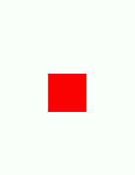
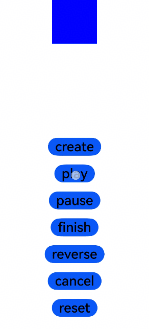

# @ohos.animator (Animator)
<!--Kit: ArkUI-->
<!--Subsystem: ArkUI-->
<!--Owner: @hehongyang3-->
<!--Designer: @hehongyang3-->
<!--Tester: @lxl007-->
<!--Adviser: @Brilliantry_Rui-->
<!-- md-trans-meta sourceCommit=8dd2d5cdf88acdc31ee17ec2006247a008c91d7c translatedAt=2026-08-29T09:32:20.115Z pushedAt=2026-08-31T09:19:42.354Z -->

The **Animator** module provides APIs for applying animation effects, including defining animations, starting animations, and playing animations in reverse order.

> **NOTE**
>
> - The initial APIs of this module are supported since API version 6. Newly added APIs will be marked with a superscript to indicate their earliest API version.
>
> - This module is supported in ArkTS since API version 9.
>
> - This module cannot be used in the file declaration of the [UIAbility](../apis-ability-kit/js-apis-app-ability-uiAbility.md). In other words, the APIs of this module can be used only after a component instance is created; they cannot be called in the lifecycle of the UIAbility.
>
> - The functionality of this module depends on the UI execution context. This means that the APIs of this module cannot be used where [the UI context is ambiguous](../../ui/arkts-global-interface.md#ambiguous-ui-context). For details, see [UIContext](arkts-apis-uicontext-uicontext.md).
>
> - A custom component usually holds an [AnimatorResult](#animatorresult) object returned by the [createAnimator](arkts-apis-uicontext-uicontext.md#createanimator) API to ensure that the animation object is not destructed during animation. This object captures the custom component object through a callback. Therefore, the animation object must be released in the [aboutToDisappear](./arkui-ts/ts-custom-component-lifecycle.md#abouttodisappear) lifecycle when the custom component is destroyed, to avoid memory leakage caused by cyclic dependency. For the example details, see [ArkTS-based Declarative Development Paradigm](#arkts-based-declarative-development-paradigm).
>
> - When the object of Animator is destructed or proactively calls [cancel](#cancel) or [finish](#finish), an additional [onFrame](#properties) API will be triggered. The return value is the end point value of the animation. Therefore, if [cancel](#cancel) or [finish](#finish) is called during animation, the property value will jump to the end value within one frame. To pause the animation, set **onFrame** to an empty function and then call [finish](#finish).
>
> - For an animation in an infinite loop, the animation will continue to be played even if the global animation speed is set to **0** (disabled) in the developer options.

## Modules to Import

```ts
import { Animator as animator, AnimatorOptions, AnimatorResult, SimpleAnimatorOptions } from '@kit.ArkUI';
```

## Animator

Creates an **Animator** object.

**Atomic service API**: This API can be used in atomic services since API version 11.

**System capability**: SystemCapability.ArkUI.ArkUI.Full

### create<sup>(deprecated)</sup>

create(options: AnimatorOptions): AnimatorResult

Creates an **AnimatorResult** object for animations.

> **NOTE**
> 
> - This API is supported since API version 9 and deprecated since API version 18. You are advised to use [createAnimator](arkts-apis-uicontext-uicontext.md#createanimator) instead.
>
> - Since API version 10, you can use the [createAnimator](arkts-apis-uicontext-uicontext.md#createanimator) API in [UIContext](arkts-apis-uicontext-uicontext.md), which ensures that the object is created in the intended UI instance.

**Atomic service API**: This API can be used in atomic services since API version 11.

**System capability**: SystemCapability.ArkUI.ArkUI.Full

**Parameters**

| Name    | Type                                 | Mandatory  | Description     |
| ------- | ----------------------------------- | ---- | ------- |
| options | [AnimatorOptions](#animatoroptions) | Yes | Animation options, including the playback duration, interpolation curve, delay, fill mode, play direction, iterations, and interpolation start and end values. |

**Return value**

| Type                               | Description           |
| --------------------------------- | ------------- |
| [AnimatorResult](#animatorresult) | Animation control object, used to set a callback function during animation. |

**Error codes**

For details about the error codes, see [Universal Error Codes](../errorcode-universal.md).

| ID| Error Message|
| ------- | -------- |
| 401      | Parameter error. Possible causes: 1. Mandatory parameters are left unspecified; 2.Incorrect parameters types; 3. Parameter verification failed.   |

**Example**

See [ArkTS-based Declarative Development Paradigm](#arkts-based-declarative-development-paradigm).

> **NOTE**
>
> For precise UI context management, use the [createAnimator](arkts-apis-uicontext-uicontext.md#createanimator) API in [UIContext](arkts-apis-uicontext-uicontext.md) to specify the execution context.

<!--deprecated_code_no_check-->
```ts
import { Animator as animator, AnimatorOptions } from '@kit.ArkUI';

let options: AnimatorOptions = {
  duration: 1500,
  easing: 'friction',
  delay: 0,
  fill: "forwards",
  direction: "normal",
  iterations: 3,
  begin: 200.0,
  end: 400.0
};
animator.create(options); // You are advised to use UIContext.createAnimator().
```

### create<sup>18+</sup>

create(options: AnimatorOptions \| SimpleAnimatorOptions): AnimatorResult

Creates an **AnimatorResult** object for animations. Compared with [create](#createdeprecated), this API accepts parameters of the [SimpleAnimatorOptions](#simpleanimatoroptions18) type.

**Atomic service API**: This API can be used in atomic services since API version 18.

**Model restriction**: This API can be used only in the stage model.

**System capability**: SystemCapability.ArkUI.ArkUI.Full

**Parameters**

| Name    | Type                                 | Mandatory  | Description     |
| ------- | ----------------------------------- | ---- | ------- |
| options | [AnimatorOptions](#animatoroptions) \| [SimpleAnimatorOptions](#simpleanimatoroptions18) | Yes | Animation options. **AnimatorOptions** is used in scenarios where all animation parameters need to be fully customized. **SimpleAnimatorOptions** is used in simple animation scenarios where only the start and end points need to be specified, with other parameters using default values. |

**Return value**

| Type                               | Description           |
| --------------------------------- | ------------- |
| [AnimatorResult](#animatorresult) | Animation control object, used to set a callback function during animation. |

**Error codes**

For details about the error codes, see [Universal Error Codes](../errorcode-universal.md).

| ID| Error Message|
| ------- | -------- |
| 401      | Parameter error. Possible causes: 1. Mandatory parameters are left unspecified; 2.Incorrect parameters types; 3. Parameter verification failed.   |

**Example**

See [ArkTS-based Declarative Development Paradigm](#arkts-based-declarative-development-paradigm).

> **NOTE**
>
> For precise UI context management, use the [createAnimator](arkts-apis-uicontext-uicontext.md#createanimator) API in [UIContext](arkts-apis-uicontext-uicontext.md) to specify the execution context.

<!--deprecated_code_no_check-->
```ts
import { Animator as animator, SimpleAnimatorOptions } from '@kit.ArkUI';
let options: SimpleAnimatorOptions = new SimpleAnimatorOptions(100, 200).duration(2000);
animator.create(options); // You are advised to use UIContext.createAnimator().
```

### createAnimator<sup>(deprecated)</sup>

createAnimator(options: AnimatorOptions): AnimatorResult

Creates an animation. The APIs of this module depend on the UI execution context and cannot be used where the UI context is unclear. You are advised to use the **createAnimator** API in **UIContext** to specify the UI context.

> **NOTE**
> 
> - This API is supported since API version 6 and deprecated since API version 9. You are advised to use [create](#createdeprecated) instead.
> - Since API version 10, you can use the [createAnimator](arkts-apis-uicontext-uicontext.md#createanimator) API in [UIContext](arkts-apis-uicontext-uicontext.md) to specify the UI context.

**System capability**: SystemCapability.ArkUI.ArkUI.Full

**Parameters**

| Name    | Type                                 | Mandatory  | Description     |
| ------- | ----------------------------------- | ---- | ------- |
| options | [AnimatorOptions](#animatoroptions) | Yes | Animation options, including the playback duration, interpolation curve, delay, fill mode, play direction, iterations, and interpolation start and end values. |

**Return value**

| Type                               | Description           |
| --------------------------------- | ------------- |
| [AnimatorResult](#animatorresult) | Animation control object, used to set a callback function during animation. |

**Example**

See [ArkTS-based Declarative Development Paradigm](#arkts-based-declarative-development-paradigm).

```ts
import { Animator as animator, AnimatorOptions } from '@kit.ArkUI';

let options: AnimatorOptions = { // The explicit type AnimatorOptions does not need to be emphasized in the xxx.js file.
  duration: 1500,
  easing: "friction",
  delay: 0,
  fill: "forwards",
  direction: "normal",
  iterations: 3,
  begin: 200.0,
  end: 400.0,
};
this.animator = animator.createAnimator(options);
```

## AnimatorResult

Defines the **AnimatorResult** API, which provides animation playback state callbacks and animation control methods.

### Properties

**System capability**: SystemCapability.ArkUI.ArkUI.Full

| Name      | Type                                                       | Read-Only| Optional| Description                                                        |
| ---------- | ------------------------------ | ---- | ------- | ----------------------------------------------------- |
| onFrame<sup>12+</sup>   | (progress: number) => void                    | No | No   | Called when a frame is received.<br>**progress**: current value of the animation. Value range: [begin, end] defined in [AnimatorOptions](#animatoroptions). Default value range: [0, 1].<br>**Note:** When the **cancel** or **finish** API is called, an additional **onFrame** callback is triggered, and the return value is the animation end point value.<br>**Atomic service API:** This API can be used in atomic services since API version 12.<br>**Model restriction:** This API can be used only in the stage model.                        |
| onFinish<sup>12+</sup>   | () => void                    | No | No   | Called when this animation is finished.<br>**Atomic service API:** This API can be used in atomic services since API version 12.<br>**Model restriction:** This API can be used only in the stage model.                        |
| onCancel<sup>12+</sup>   | () => void                    | No | No   | Called when this animation is canceled.<br>**Atomic service API:** This API can be used in atomic services since API version 12.<br>**Model restriction:** This API can be used only in the stage model.                        |
| onRepeat<sup>12+</sup>   | () => void                    | No | No   | Called when this animation repeats.<br>**Atomic service API:** This API can be used in atomic services since API version 12.<br>**Model restriction:** This API can be used only in the stage model.                        |
| onframe<sup>(deprecated)</sup>   | (progress: number) => void                   | No | No   | Called when a frame is received.<br>Note: This API is supported since API version 6 and deprecated since API version 12. You are advised to use [onFrame](#properties) instead.<br>**Atomic service API:** This API can be used in atomic services since API version 11.                        |
| onfinish<sup>(deprecated)</sup>   | () => void                 | No | No   | Called when this animation is finished.<br>**Note:** This API is supported since API version 6 and deprecated since API version 12. You are advised to use [onFinish](#properties) instead.<br>**Atomic service API:** This API can be used in atomic services since API version 11.                        |
| oncancel<sup>(deprecated)</sup>   | () => void                 | No | No   | Called when this animation is canceled.<br>**Note:** This API is supported since API version 6 and deprecated since API version 12. You are advised to use [onCancel](#properties) instead.<br>**Atomic service API:** This API can be used in atomic services since API version 11.                        |
| onrepeat<sup>(deprecated)</sup>   | () => void                 | No | No   | Called when this animation repeats.<br>**Note:** This API is supported since API version 6 and deprecated since API version 12. You are advised to use [onRepeat](#properties) instead.<br>**Atomic service API:** This API can be used in atomic services since API version 11.                        |

### reset<sup>9+</sup>

reset(options: AnimatorOptions): void

Resets the animation parameters of this animator. You are advised to call this API before the animation starts or after it ends (after the [onFinish](#properties) or [onCancel](#properties) callback is triggered). After the reset, call [play](#play) to restart the animation.

**Atomic service API**: This API can be used in atomic services since API version 11.

**System capability**: SystemCapability.ArkUI.ArkUI.Full

**Parameters**

| Name    | Type                                 | Mandatory  | Description     |
| ------- | ----------------------------------- | ---- | ------- |
| options | [AnimatorOptions](#animatoroptions) | Yes | Animation options, including the playback duration, interpolation curve, delay, fill mode, play direction, iterations, and interpolation start and end values. |

**Error codes**

For details about the error codes, see [Universal Error Codes](../errorcode-universal.md) and [API Call Error Codes](errorcode-internal.md).

| ID  | Error Message|
| --------- | ------- |
| 401      | Parameter error. Possible causes: 1. Mandatory parameters are left unspecified; 2.Incorrect parameters types; 3. Parameter verification failed.   |
| 100001    | The specified page is not found or the object property list is not obtained.|


**Example**

```ts
import { AnimatorResult } from '@kit.ArkUI';

@Entry
@Component
struct AnimatorTest {
  private animatorResult: AnimatorResult | undefined = undefined;

  create() {
    this.animatorResult = this.getUIContext().createAnimator({
      duration: 1500,
      easing: "friction",
      delay: 0,
      fill: "forwards",
      direction: "normal",
      iterations: 3,
      begin: 200.0,
      end: 400.0
    })
    this.animatorResult.reset({
      duration: 1500,
      easing: "friction",
      delay: 0,
      fill: "forwards",
      direction: "normal",
      iterations: 5,
      begin: 200.0,
      end: 400.0
    });
  }

  build() {
    // ...
  }
}
```

### reset<sup>18+</sup>

reset(options: AnimatorOptions \| SimpleAnimatorOptions): void

Resets the animation parameters of this animator. Compared with [reset](#reset9), this API additionally supports parameters of the [SimpleAnimatorOptions](#simpleanimatoroptions18) type. You are advised to call this API before the animation starts or after it ends (after the [onFinish](#properties) or [onCancel](#properties) callback is triggered). After the reset, call [play](#play) to start a new animation.

**Atomic service API**: This API can be used in atomic services since API version 18.

**Model restriction**: This API can be used only in the stage model.

**System capability**: SystemCapability.ArkUI.ArkUI.Full

**Parameters**

| Name    | Type                                 | Mandatory  | Description     |
| ------- | ----------------------------------- | ---- | ------- |
| options | [AnimatorOptions](#animatoroptions) \| [SimpleAnimatorOptions](#simpleanimatoroptions18) | Yes   | Animator options.|

**Error codes**

For details about the error codes, see [Universal Error Codes](../errorcode-universal.md) and [API Call Error Codes](errorcode-internal.md).

| ID  | Error Message|
| --------- | ------- |
| 401      | Parameter error. Possible causes: 1. Mandatory parameters are left unspecified; 2.Incorrect parameters types; 3. Parameter verification failed.   |
| 100001    | The specified page is not found or the object property list is not obtained.|

**Example**

See [ArkTS-based Declarative Development Paradigm](#arkts-based-declarative-development-paradigm).

<!--deprecated_code_no_check-->
```ts
import { Animator as animator, AnimatorResult, AnimatorOptions, SimpleAnimatorOptions } from '@kit.ArkUI';

let options: AnimatorOptions = {
  duration: 1500,
  easing: 'ease',
  delay: 0,
  fill: "forwards",
  direction: "normal",
  iterations: 1,
  begin: 100,
  end: 200
};
let optionsNew: SimpleAnimatorOptions = new SimpleAnimatorOptions(100, 200)
  .duration(2000)
  .iterations(3)
  .delay(1000);
let animatorResult: AnimatorResult = animator.create(options);
animatorResult.reset(optionsNew);
```

### play

play(): void

Plays this animation. Calling this API after the animation is paused can resume playback. The animation retains the previous playback state. For example, if the playback state is set to **reverse**, the **reverse** state is retained when the animation is played again. After the animation ends (after the [onFinish](#properties) or [onCancel](#properties) callback is triggered), you can call this API again to replay the animation.

**Atomic service API**: This API can be used in atomic services since API version 11.

**System capability**: SystemCapability.ArkUI.ArkUI.Full

**Example**

See [ArkTS-based Declarative Development Paradigm](#arkts-based-declarative-development-paradigm).

```ts
// Obtain the AnimatorResult object through this.getUIContext().createAnimator() for the animator first.
animator.play();
```

### finish

finish(): void

Finishes the animation, triggering the [onFinish](#properties) callback. This API has the same functionality as [cancel](#cancel), but **cancel()** triggers the [onCancel](#properties) callback. You are advised to use **finish** to end the animation. Calling this API triggers an additional [onFrame](#properties) callback, whose return value is the animation end point value, which may cause the property value to jump to the end point within one frame. If you want to pause the animation midway, set **onFrame** to an empty function before calling **finish**.

**Atomic service API**: This API can be used in atomic services since API version 11.

**System capability**: SystemCapability.ArkUI.ArkUI.Full

**Example**

See [ArkTS-based Declarative Development Paradigm](#arkts-based-declarative-development-paradigm).

```ts
// Obtain the AnimatorResult object through this.getUIContext().createAnimator() for the animator first.
animator.finish();
```

### pause

pause(): void

Pauses this animation. After the animation is paused, you can call [play](#play) to resume the playback, or call [finish](#finish) or [cancel](#cancel) to end the animation.

**Atomic service API**: This API can be used in atomic services since API version 11.

**System capability**: SystemCapability.ArkUI.ArkUI.Full

**Example**

See [ArkTS-based Declarative Development Paradigm](#arkts-based-declarative-development-paradigm).

```ts
// Obtain the AnimatorResult object through this.getUIContext().createAnimator() for the animator first.
animator.pause();
```

### cancel

cancel(): void

Cancels this animation, triggering the [onCancel](#properties) callback. This API has no functional difference from [finish](#finish) except for the callback triggered. You are advised to use **finish** to end the animation. Calling this API triggers an additional [onFrame](#properties) callback, whose return value is the animation end point value, which may cause the property value to jump to the end point within one frame.

**Atomic service API**: This API can be used in atomic services since API version 11.

**System capability**: SystemCapability.ArkUI.ArkUI.Full

**Example**

See [ArkTS-based Declarative Development Paradigm](#arkts-based-declarative-development-paradigm).

```ts
// Obtain the AnimatorResult object through this.getUIContext().createAnimator() for the animator first.
animator.cancel();
```

### reverse

reverse(): void

Plays this animation in reverse order. This API does not take effect when the interpolating spring curve is used. After **reverse** is called, the animation continues to play in the reverse direction. You can call [pause](#pause) to pause it or [finish](#finish) to end it.

**Atomic service API**: This API can be used in atomic services since API version 11.

**System capability**: SystemCapability.ArkUI.ArkUI.Full

**Example**

See [ArkTS-based Declarative Development Paradigm](#arkts-based-declarative-development-paradigm).

```ts
// Obtain the AnimatorResult object through this.getUIContext().createAnimator() for the animator first.
animator.reverse();
```

### setExpectedFrameRateRange<sup>12+</sup>

setExpectedFrameRateRange(rateRange: ExpectedFrameRateRange): void

Sets the expected frame rate range, including the minimum, maximum, and expected frame rate values.

**Atomic service API**: This API can be used in atomic services since API version 12.

**Model restriction**: This API can be used only in the stage model.

**System capability**: SystemCapability.ArkUI.ArkUI.Full

**Parameters**

| Name          | Type                                      | Mandatory| Description                         |
| --------------- | ------------------------------------------ | ---- | -----------------------------|
| rateRange       | [ExpectedFrameRateRange](../apis-arkui/arkui-ts/ts-explicit-animation.md#expectedframeraterange11)| Yes  | Expected frame rate range.|

> **NOTE**
>
> After a valid expected frame rate is set, the system collects the configured frame rate and divides the frequency on the rendering pipeline. The actual frame rate may be different from the expected one configured. It is limited by the system capability and screen refresh rate.

**Example**

```ts
import { AnimatorResult } from '@kit.ArkUI';

let expectedFrameRate: ExpectedFrameRateRange = {
  min: 0,
  max: 120,
  expected: 30
}

@Entry
@Component
struct AnimatorTest {
  private backAnimator: AnimatorResult | undefined = undefined;

  create() {
    this.backAnimator = this.getUIContext().createAnimator({
      duration: 2000,
      easing: "ease",
      delay: 0,
      fill: "forwards",
      direction: "normal",
      iterations: 1,
      begin: 100, // Start point of the animation interpolation.
      end: 200 // End point of the animation interpolation.
    })
    this.backAnimator.setExpectedFrameRateRange(expectedFrameRate);
  }

  build() {
    // ...
  }
}
```

### update<sup>(deprecated)</sup>

update(options: AnimatorOptions): void

Updates the current animator animation parameters.

> **NOTE** 
>
> This API is supported since API version 6 and deprecated since API version 9. You are advised to use [reset](#reset9) instead.

**System capability**: SystemCapability.ArkUI.ArkUI.Full

**Parameters**

| Name    | Type                                 | Mandatory  | Description     |
| ------- | ----------------------------------- | ---- | ------- |
| options | [AnimatorOptions](#animatoroptions) | Yes | Animation options, including the playback duration, interpolation curve, delay, fill mode, play direction, iterations, and interpolation start and end values. |

**Example**

See [ArkTS-based Declarative Development Paradigm](#arkts-based-declarative-development-paradigm).

```ts
// Obtain the AnimatorResult object through this.getUIContext().createAnimator() for the animator first.
animator.update(options);
```

## AnimatorOptions

Defines animator options.

**Atomic service API**: This API can be used in atomic services since API version 11.

**System capability**: SystemCapability.ArkUI.ArkUI.Full

### Properties

| Name      | Type                                                       | Read-Only| Optional| Description                                                        |
| ---------- | ----------------------------------------------------------- | ---- | ------- | ----------------------------------------------------- |
| duration   | number                                                      | No | No   | Duration for playing the animation, in milliseconds.<br>Value range: [0, +∞).<br>Default value: **0**<br>**Note:** When the interpolating spring curve is used, **duration** does not take effect and the duration is determined by the spring parameters.                         |
| easing     | string                                                      | No | No   | Animation interpolation curve. For details about the supported curve types, see Table 1.<br>If the provided string is invalid, **"ease"** is used. |
| delay      | number                                                      | No | No   | Animation delay duration, in milliseconds. The value **0** means no delay. A negative value means the animation starts ahead of time. If the advance playback duration is greater than the total animation duration (determined by the **duration** and **iterations** parameters together), the animation directly transitions to the end point.<br>Default value: **0**        |
| fill       | 'none' \| 'forwards' \| 'backwards' \| 'both'               | No | No   | Animation fill mode, which determines whether to apply the keyframe style to the target before the animation execution (during the delay period) and after the animation execution.<br>**'none'**: No style is applied to the target before or after the animation is executed.<br>**'forwards'**: The target keeps the state at the end of the animation (defined in the last keyframe) after the animation is executed.<br>**'backwards'**: During the delay period specified in [AnimatorOptions](#animatoroptions), the animation uses the value defined in the first keyframe. When **direction** in [AnimatorOptions](#animatoroptions) is **'normal'** or **'alternate'**, the animation uses the **from** keyframe value. When **direction** in [AnimatorOptions](#animatoroptions) is **'reverse'** or **'alternate-reverse'**, the animation uses the **to** keyframe value.<br>**'both'**: The animation follows the **'forwards'** and **'backwards'** rules, extending the animation properties in both directions. |
| direction  | 'normal' \| 'reverse' \| 'alternate' \| 'alternate-reverse' | No | No   | Animation playback direction.<br>**'normal'**: plays the animation in forward loop mode.<br>**'reverse'**: plays the animation in reverse loop mode.<br>**'alternate'**: plays the animation in alternating loop mode. When the animation is played for an odd number of times, the playback is in forward direction. When the animation is played for an even number of times, the playback is in reverse direction.<br>**'alternate-reverse'**: plays the animation in reverse alternating loop mode. When the animation is played for an odd number of times, the playback is in reverse direction. When the animation is played for an even number of times, the playback is in forward direction.<br>Default value: **'normal'**<br>**Note:** When the interpolating spring curve is used, **direction** is fixed to **'normal'**, and other settings do not take effect. |
| iterations | number                                                      | No | No   | Number of times that the animation is played. The value **0** means the animation is not played, **-1** means infinite playback, and a value greater than 0 means the number of playback times.<br>**Note:** When the interpolating spring curve is used, **iterations** is fixed to **1**, and other settings do not take effect.<br>**Note:** Negative values other than **-1** are considered invalid, in which case the animation plays once by default. |
| begin      | number                                                      | No | No   | Start point of the animation interpolation.<br>**Note:** This setting affects the input parameter value of the [onFrame](#properties) callback.<br>Default value: **0**                                              |
| end        | number                                                      | No | No   | End point of the animation interpolation.<br>**Note:** This setting affects the input parameter value of the [onFrame](#properties) callback.<br>Default value: **1**                                            |

**Table 1 Supported curve types**

| Type      | Description                                                      |
| ---------- | ----------------------------------------------------- |
| "linear"    | The animation speed keeps unchanged.|
| "ease" | The animation starts slowly, accelerates, and then slows down towards the end. The cubic-bezier curve (0.25, 0.1, 0.25, 1.0) is used.|
| "ease-in" | The animation starts at a low speed. The cubic-bezier curve (0.42, 0.0, 1.0, 1.0) is used.|
| "ease-out" | The animation ends at a low speed. The cubic-bezier curve (0.0, 0.0, 0.58, 1.0) is used.|
| "ease-in-out" | The animation starts and ends at a low speed. The cubic-bezier curve (0.42, 0.0, 0.58, 1.0) is used.|
| "fast-out-slow-in" | The animation uses the standard cubic-bezier curve (0.4, 0.0, 0.2, 1.0).|
| "linear-out-slow-in" | The animation uses the deceleration cubic-bezier curve (0.0, 0.0, 0.2, 1.0).|
| "fast-out-linear-in" | The animation uses the acceleration cubic-bezier curve (0.4, 0.0, 1.0, 1.0).|
| "friction" | The animation uses the damping cubic-bezier curve (0.2, 0.0, 0.2, 1.0).|
| "extreme-deceleration" | The animation uses the extreme deceleration cubic-bezier curve (0.0, 0.0, 0.0, 1.0). |
| "rhythm" | The animation uses the rhythm cubic-bezier curve (0.7, 0.0, 0.2, 1.0).|
| "sharp" | The animation uses the sharp cubic-bezier curve (0.33, 0.0, 0.67, 1.0).|
| "smooth" | The animation uses the smooth cubic-bezier curve (0.4, 0.0, 0.4, 1.0).|
| "cubic-bezier(x1, y1, x2, y2)" | The animation uses the cubic Bézier curve, where the values of **x1** and **x2** must be between 0 and 1. Example: **"cubic-bezier(0.42, 0.0, 0.58, 1.0)"**.|
| "steps(number, step-position)" | The animation uses the steps curve. The number must be set to a positive integer. The **step-position** parameter is optional. The value can be **start** or **end**. The default value is **end**. Example: **"steps(3, start)"**.|
| interpolating-spring(velocity, mass, stiffness, damping) | The animation uses the interpolating spring curve.<br>The **velocity**, **mass**, **stiffness**, and **damping** parameters are of the numeric type, and the values of **mass**, **stiffness**, and **damping** must be greater than 0. For details about the parameters, see [curves.interpolatingSpring](./js-apis-curve.md#curvesinterpolatingspring10).<br>When an interpolating spring curve is used, settings for the **duration**, **fill**, **direction**, and **iterations** do not take effect. Rather, the value of **duration** is subject to the spring settings, **fill** is fixed at **forwards**, **direction** at **normal**, and **iterations** at **1**. In addition, invoking [reverse](#reverse) of **animator** is not effective. In other words, when using an interpolating spring curve, the animation can play only once in forward mode.<br>Supported since API version 11 and can be used only in ArkTS.|

## SimpleAnimatorOptions<sup>18+</sup>

Defines a simple animation parameter object. Compared with **AnimatorOptions**, animation parameters such as **duration**, **easing**, **delay**, **fill**, **direction**, and **iterations** have default values and can be left unset.

### constructor<sup>18+</sup>

constructor(begin: number, end: number)

Creates a **SimpleAnimatorOptions** instance, specifying the start and end points of the animation interpolation.

**Atomic service API**: This API can be used in atomic services since API version 18.

**Model restriction**: This API can be used only in the stage model.

**System capability**: SystemCapability.ArkUI.ArkUI.Full

**Parameters**

| Name      | Type                                                       | Mandatory| Description                                                        |
| ---------- | ----------------------------------------------------------- | ---- | ------------------------------------------------------------ |
|  begin      | number                                                      | Yes   | Start point of the animation interpolation.<br>**Note:** This affects the input parameter value of the [onFrame](#properties) callback. Together with the **end** parameter, it determines the range of the **onFrame** callback value.                                               |
|  end        | number                                                      | Yes   | End point of the animation interpolation.<br>**Note:** This affects the input parameter value of the [onFrame](#properties) callback. Together with the **begin** parameter, it determines the range of the **onFrame** callback value.                                               |

**Example**

See [ArkTS-based Declarative Development Paradigm](#arkts-based-declarative-development-paradigm).

```ts
import { AnimatorResult, SimpleAnimatorOptions } from '@kit.ArkUI';

@Entry
@Component
struct AnimatorTest {
  private animatorResult: AnimatorResult | undefined = undefined;
  options: SimpleAnimatorOptions = new SimpleAnimatorOptions(100, 200); // Animation interpolation from 100 to 200, with other animation parameters set to default values.

  create() {
    this.animatorResult = this.getUIContext().createAnimator(this.options);
  }

  build() {
    // ......
  }
}
```

### duration<sup>18+</sup>

duration(duration: number): SimpleAnimatorOptions

Sets the animation duration.

**Atomic service API**: This API can be used in atomic services since API version 18.

**Model restriction**: This API can be used only in the stage model.

**System capability**: SystemCapability.ArkUI.ArkUI.Full

**Parameters**

| Name    | Type                                 | Mandatory  | Description     |
| ------- | ----------------------------------- | ---- | ------- |
| duration | number | Yes | Animation playback duration, in milliseconds.<br>Default value: **1000**<br>**Note:** When the interpolating spring curve is used, **duration** does not take effect and the duration is determined by the spring parameters. |

**Return value**

| Type                               | Description           |
| --------------------------------- | ------------- |
| [SimpleAnimatorOptions](#simpleanimatoroptions18) | **SimpleAnimatorOptions** object for animation parameters, which supports chaining to continue configuring animation parameters. |

**Example**

See [ArkTS-based Declarative Development Paradigm](#arkts-based-declarative-development-paradigm).

```ts
import { AnimatorResult, SimpleAnimatorOptions } from '@kit.ArkUI';

@Entry
@Component
struct AnimatorTest {
  private animatorResult: AnimatorResult | undefined = undefined;
  options: SimpleAnimatorOptions = new SimpleAnimatorOptions(100, 200).duration(500);

  create() {
    this.animatorResult = this.getUIContext().createAnimator(this.options);
  }

  build() {
    // ......
  }
}
```

### easing<sup>18+</sup>

easing(curve: string): SimpleAnimatorOptions

Sets the interpolation curve for this animation.

**Atomic service API**: This API can be used in atomic services since API version 18.

**Model restriction**: This API can be used only in the stage model.

**System capability**: SystemCapability.ArkUI.ArkUI.Full

**Parameters**

| Name    | Type                                 | Mandatory  | Description     |
| ------- | ----------------------------------- | ---- | ------- |
| curve | string | Yes | Interpolation curve. For details, see [AnimatorOptions](#animatoroptions).<br>Default value: **"ease"** |

**Return value**

| Type                               | Description           |
| --------------------------------- | ------------- |
| [SimpleAnimatorOptions](#simpleanimatoroptions18) | **SimpleAnimatorOptions** object for animation parameters, which supports chaining to continue configuring animation parameters. |

**Example**

See [ArkTS-based Declarative Development Paradigm](#arkts-based-declarative-development-paradigm).

```ts
import { AnimatorResult, SimpleAnimatorOptions } from '@kit.ArkUI';

@Entry
@Component
struct AnimatorTest {
  private animatorResult: AnimatorResult | undefined = undefined;
  options: SimpleAnimatorOptions = new SimpleAnimatorOptions(100, 200).easing("ease-in");

  create() {
    this.animatorResult = this.getUIContext().createAnimator(this.options);
  }

  build() {
    // ......
  }
}
```

### delay<sup>18+</sup>

delay(delay: number): SimpleAnimatorOptions

Sets the playback delay for the animator animation.

**Atomic service API**: This API can be used in atomic services since API version 18.

**Model restriction**: This API can be used only in the stage model.

**System capability**: SystemCapability.ArkUI.ArkUI.Full

**Parameters**

| Name    | Type                                 | Mandatory  | Description     |
| ------- | ----------------------------------- | ---- | ------- |
| delay | number | Yes | Playback delay, in milliseconds. The value **0** indicates no delay. If the value specified is a negative number, the animation starts playing ahead of its scheduled time. If the amount of time by which the playback is advanced exceeds the total duration of the animation, the animation immediately skips to its end state.<br>Default value: **0** |

**Return value**

| Type                               | Description           |
| --------------------------------- | ------------- |
| [SimpleAnimatorOptions](#simpleanimatoroptions18) | **SimpleAnimatorOptions** object for animation parameters, which supports chaining to continue configuring animation parameters. |

**Example**

See [ArkTS-based Declarative Development Paradigm](#arkts-based-declarative-development-paradigm).

```ts
import { AnimatorResult, SimpleAnimatorOptions } from '@kit.ArkUI';

@Entry
@Component
struct AnimatorTest {
  private animatorResult: AnimatorResult | undefined = undefined;
  options: SimpleAnimatorOptions = new SimpleAnimatorOptions(100, 200).delay(500);

  create() {
    this.animatorResult = this.getUIContext().createAnimator(this.options);
  }

  build() {
    // ......
  }
}
```

### fill<sup>18+</sup>

fill(fillMode: FillMode): SimpleAnimatorOptions

Sets the fill mode for the animator animation. When the interpolating spring curve is used, this setting does not take effect, and **fill** is fixed to **FillMode.Forwards**.

**Atomic service API**: This API can be used in atomic services since API version 18.

**Model restriction**: This API can be used only in the stage model.

**System capability**: SystemCapability.ArkUI.ArkUI.Full

**Parameters**

| Name    | Type                                 | Mandatory  | Description     |
| ------- | ----------------------------------- | ---- | ------- |
| fillMode | [FillMode](./arkui-ts/ts-appendix-enums.md#fillmode) | Yes    | Fill mode, which affects how the animation behaves during the delay period and after it ends. When the interpolating spring curve is used, the **fill** setting is invalid and is fixed to **FillMode.Forwards**.<br>Default value: **FillMode.Forwards** |

**Return value**

| Type                               | Description           |
| --------------------------------- | ------------- |
| [SimpleAnimatorOptions](#simpleanimatoroptions18) | **SimpleAnimatorOptions** object for animation parameters, which supports chaining to continue configuring animation parameters. |

**Example**

See [ArkTS-based Declarative Development Paradigm](#arkts-based-declarative-development-paradigm).

```ts
import { AnimatorResult, SimpleAnimatorOptions } from '@kit.ArkUI';

@Entry
@Component
struct AnimatorTest {
  private animatorResult: AnimatorResult | undefined = undefined;
  options: SimpleAnimatorOptions = new SimpleAnimatorOptions(100, 200).fill(FillMode.Forwards);

  create() {
    this.animatorResult = this.getUIContext().createAnimator(this.options);
  }

  build() {
    // ......
  }
}
```

### direction<sup>18+</sup>

direction(direction: PlayMode): SimpleAnimatorOptions

Sets the playback direction for the animator animation. When the interpolating spring curve is used, this setting does not take effect, and **direction** is fixed to **PlayMode.Normal**.

**Atomic service API**: This API can be used in atomic services since API version 18.

**Model restriction**: This API can be used only in the stage model.

**System capability**: SystemCapability.ArkUI.ArkUI.Full

**Parameters**

| Name    | Type                                 | Mandatory  | Description     |
| ------- | ----------------------------------- | ---- | ------- |
| direction | [PlayMode](./arkui-ts/ts-appendix-enums.md#playmode) | Yes    | Playback direction of the animator animation.<br>**PlayMode.Normal**: plays the animation in forward loop mode.<br>**PlayMode.Reverse**: plays the animation in reverse loop mode.<br>**PlayMode.Alternate**: plays the animation in alternating loop mode. When the animation is played for an odd number of times, the playback is in forward direction. When the animation is played for an even number of times, the playback is in reverse direction.<br>**PlayMode.AlternateReverse**: plays the animation in reverse alternating loop mode. When the animation is played for an odd number of times, the playback is in reverse direction. When the animation is played for an even number of times, the playback is in forward direction.<br>Default value: **PlayMode.Normal** |

**Return value**

| Type                               | Description           |
| --------------------------------- | ------------- |
| [SimpleAnimatorOptions](#simpleanimatoroptions18) | **SimpleAnimatorOptions** object for animation parameters, which supports chaining to continue configuring animation parameters. |

**Example**

See [ArkTS-based Declarative Development Paradigm](#arkts-based-declarative-development-paradigm).

```ts
import { AnimatorResult, SimpleAnimatorOptions } from '@kit.ArkUI';

@Entry
@Component
struct AnimatorTest {
  private animatorResult: AnimatorResult | undefined = undefined;
  options: SimpleAnimatorOptions = new SimpleAnimatorOptions(100, 200).direction(PlayMode.Alternate);

  create() {
    this.animatorResult = this.getUIContext().createAnimator(this.options);
  }

  build() {
    // ......
  }
}
```

### iterations<sup>18+</sup>

iterations(iterations: number): SimpleAnimatorOptions

Sets the number of times that this animation is played.

**Atomic service API**: This API can be used in atomic services since API version 18.

**Model restriction**: This API can be used only in the stage model.

**System capability**: SystemCapability.ArkUI.ArkUI.Full

**Parameters**

| Name    | Type                                 | Mandatory  | Description     |
| ------- | ----------------------------------- | ---- | ------- |
| iterations | number | Yes | Number of times that the animation is played. The value **0** means the animation is not played, and **-1** means the animation is played for an unlimited number of times.<br>**Note:** Negative values other than -1 are considered invalid, and the animation plays once by default for invalid values.<br>Default value: **1**<br>When the interpolating spring curve is used, the setting of **iterations** is invalid and its value is fixed to **1**. |

**Return value**

| Type                               | Description           |
| --------------------------------- | ------------- |
| [SimpleAnimatorOptions](#simpleanimatoroptions18) | **SimpleAnimatorOptions** object for animation parameters, which supports chaining calls to continue setting animation parameters. |

**Example**

See [ArkTS-based Declarative Development Paradigm](#arkts-based-declarative-development-paradigm).

```ts
import { AnimatorResult, SimpleAnimatorOptions } from '@kit.ArkUI';

@Entry
@Component
struct AnimatorTest {
  private animatorResult: AnimatorResult | undefined = undefined;
  options: SimpleAnimatorOptions = new SimpleAnimatorOptions(100, 200).iterations(3);

  create() {
    this.animatorResult = this.getUIContext().createAnimator(this.options);
  }

  build() {
    // ......
  }
}
```

## Example
### JavaScript-compatible Web-like Development Paradigm

```html
<!-- hml -->
<div class="container">
  <div class="Animation" style="height: {{divHeight}}px; width: {{divWidth}}px; background-color: red;" onclick="Show">
  </div>
</div>
```

<!--code_no_check-->
<!--deprecated_code_no_check-->
```ts
import { Animator as animator, AnimatorResult, AnimatorOptions } from '@kit.ArkUI';
import { BusinessError } from '@kit.BasicServicesKit';

let DataTmp: Record<string, Animator> = {
  'divWidth': 200,
  'divHeight': 200,
  'animator': animator
}

class Tmp {
  data: animator = DataTmp
  onInit: Function = () => {
  }
  show: Function = () => {
  }
}

class AnimatorState {
  divWidth: number = 0
  divHeight: number = 0
  animator: AnimatorResult | null = null
}

(Fn: (v: Tmp) => void) => {
  Fn({
    data: DataTmp,
    onInit() {
      let options: AnimatorOptions = {
        duration: 1500,
        easing: "friction",
        delay: 0,
        fill: "forwards",
        direction: "normal",
        iterations: 2,
        begin: 200.0,
        end: 400.0
      };
      let animatorState: AnimatorState = {
        divWidth: 200,
        divHeight: 200,
        animator: null
      }
      animatorState.animator = animator.create(options);
    },
    show() {
      let resetOptions: AnimatorOptions = {
        duration: 1500,
        easing: "friction",
        delay: 0,
        fill: "forwards",
        direction: "normal",
        iterations: 2,
        begin: 0,
        end: 400.0,
      };
      let animatorState: AnimatorState = {
        divWidth: 200,
        divHeight: 200,
        animator: null
      }
      try {
        animatorState.animator = animator.create(resetOptions);
        animatorState.animator.reset(resetOptions);
      } catch (error) {
        let message = (error as BusinessError).message
        let code = (error as BusinessError).code
        console.error(`Animator reset failed. Code: ${code}, message: ${message}`);
      }
      let _this = animatorState;
      if (animatorState.animator) {
        animatorState.animator.onFrame = (value: number) => {
          _this.divWidth = value;
          _this.divHeight = value;
        };
        animatorState.animator.play();
      }
    }
  })
}
```

  

### ArkTS-based Declarative Development Paradigm

> **NOTE**
>
> For precise UI context management, use the [createAnimator](arkts-apis-uicontext-uicontext.md#createanimator) API in [UIContext](arkts-apis-uicontext-uicontext.md) to specify the execution context.

<!--deprecated_code_no_check-->
```ts
import { AnimatorResult } from '@kit.ArkUI';

@Entry
@Component
struct AnimatorTest {
  private TAG: string = '[AnimatorTest]'
  private backAnimator: AnimatorResult | undefined = undefined
  private flag: boolean = false
  @State columnWidth: number = 100
  @State columnHeight: number = 100

  create() {
    this.backAnimator = this.getUIContext().createAnimator({
    // You are advised to use the this.getUIContext().createAnimator() API.
      duration: 2000,
      easing: "ease",
      delay: 0,
      fill: "forwards",
      direction: "normal",
      iterations: 1,
      begin: 100, // Start point of the animation interpolation.
      end: 200 // End point of the animation interpolation.
    })
    this.backAnimator.onFinish = () => {
      this.flag = true;
      console.info(this.TAG, 'backAnimator onFinish');
    }
    this.backAnimator.onRepeat = () => {
      console.info(this.TAG, 'backAnimator repeat');
    }
    this.backAnimator.onCancel = () => {
      console.info(this.TAG, 'backAnimator cancel');
    }
    this.backAnimator.onFrame = (value: number) => {
      this.columnWidth = value;
      this.columnHeight = value;
    }
  }

  aboutToDisappear() {
    // When the custom component disappears, call finish to end incomplete animations and prevent them from continuing.
    // backAnimator references this in onFrame, and this saves backAnimator.
    // set backAnimator stored in the custom component to undefined when the component disappears to avoid memory leak.
    this.backAnimator?.finish();
    this.backAnimator = undefined;
  }

  build() {
    Column() {
      Column() {
        Column()
          .width(this.columnWidth)
          .height(this.columnHeight)
          .backgroundColor(Color.Blue)
      }
      .width('100%')
      .height(300)

      Column() {
        Row() {
          Button('create')
            .fontSize(30)
            .fontColor(Color.Black)
            .onClick(() => {
              this.create()
            })
        }
        .padding(10)

        Row() {
          Button('play')
            .fontSize(30)
            .fontColor(Color.Black)
            .onClick(() => {
              this.flag = false
              if (this.backAnimator) {
                this.backAnimator.play()
              }
            })
        }
        .padding(10)

        Row() {
          Button('pause')
            .fontSize(30)
            .fontColor(Color.Black)
            .onClick(() => {
              if (this.backAnimator) {
                this.backAnimator.pause()
              }
            })
        }
        .padding(10)

        Row() {
          Button('finish')
            .fontSize(30)
            .fontColor(Color.Black)
            .onClick(() => {
              this.flag = true
              if (this.backAnimator) {
                this.backAnimator.finish()
              }
            })
        }
        .padding(10)

        Row() {
          Button('reverse')
            .fontSize(30)
            .fontColor(Color.Black)
            .onClick(() => {
              this.flag = false
              if (this.backAnimator) {
                this.backAnimator.reverse()
              }
            })
        }
        .padding(10)

        Row() {
          Button('cancel')
            .fontSize(30)
            .fontColor(Color.Black)
            .onClick(() => {
              if (this.backAnimator) {
                this.backAnimator.cancel()
              }
            })
        }
        .padding(10)

        Row() {
          Button('reset')
            .fontSize(30)
            .fontColor(Color.Black)
            .onClick(() => {
              if (this.flag) {
                this.flag = false
                if (this.backAnimator) {
                  this.backAnimator.reset({
                    duration: 3000,
                    easing: "ease-in",
                    delay: 0,
                    fill: "forwards",
                    direction: "alternate",
                    iterations: 3,
                    begin: 100,
                    end: 300
                  })
                }
              } else {
                console.info(this.TAG, 'Animation not ended')
              }
            })
        }
        .padding(10)
      }
    }
  }
}
```



### Example: Implementing a Translation Animation with Simple Parameters

```ts
import { AnimatorResult, SimpleAnimatorOptions } from '@kit.ArkUI';

@Entry
@Component
struct AnimatorTest {
  private TAG: string = '[AnimatorTest]'
  private backAnimator: AnimatorResult | undefined = undefined
  private flag: boolean = false
  @State translateX: number = 0

  create() {
    this.backAnimator = this.getUIContext()?.createAnimator(
      new SimpleAnimatorOptions(0, 100)
    )
    this.backAnimator.onFinish = () => {
      this.flag = true
      console.info(this.TAG, 'backAnimator onFinish')
    }
    this.backAnimator.onFrame = (value: number) => {
      this.translateX = value
    }
  }

  aboutToDisappear() {
    // When the custom component disappears, call finish to end incomplete animations and prevent them from continuing.
    // backAnimator references this in onFrame, and this saves backAnimator.
    // set backAnimator stored in the custom component to undefined when the component disappears to avoid memory leak.
    this.backAnimator?.finish();
    this.backAnimator = undefined;
  }

  build() {
    Column() {
      Column() {
        Column()
          .width(100)
          .height(100)
          .translate({x: this.translateX})
          .backgroundColor(Color.Green)
      }
      .width('100%')
      .height(300)

      Column() {
        Column() {
          Button('create')
            .fontSize(30)
            .fontColor(Color.White)
            .onClick(() => {
              this.create()
            })
        }
        .padding(10)

        Column() {
          Button('play')
            .fontSize(30)
            .fontColor(Color.White)
            .onClick(() => {
              this.flag = false
              if(this.backAnimator){
                this.backAnimator.play()
              }
            })
        }
        .padding(10)

        Column() {
          Button('reset')
            .fontSize(30)
            .fontColor(Color.White)
            .onClick(() => {
              if (this.flag) {
                this.flag = false
                if(this.backAnimator){
                  this.backAnimator.reset(
                    new SimpleAnimatorOptions(0, -100)
                      .duration(2000)
                      .easing("ease-in")
                      .fill(FillMode.Forwards)
                      .direction(PlayMode.Alternate)
                      .iterations(2)
                  )
                }
              } else {
                console.info(this.TAG, 'Animation not ended')
              }
            })
        }
        .padding(10)
      }
    }
  }
}
```


